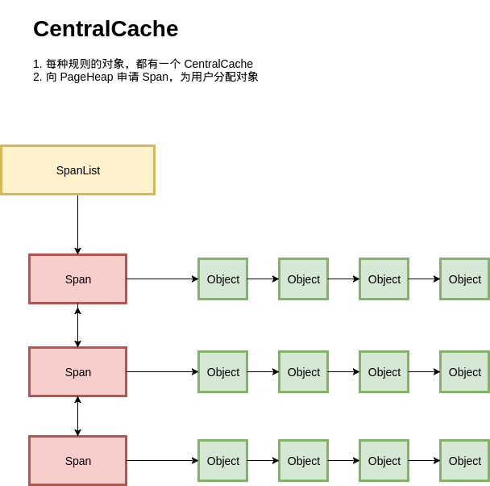

本文转自：[图解 TCMalloc](https://zhuanlan.zhihu.com/p/29216091)

---

# 前言

TCMalloc 是 Google 开发的内存分配器，在不少项目中都有使用，例如在 Golang 中就使用了类似的算法进行内存分配。它具有现代化内存分配器的基本特征：对抗内存碎片、在多核处理器能够 scale。据称，它的内存分配速度是 glibc2.3 中实现的 malloc 的数倍。

之所以学习 TCMalloc，是因为在学习 Golang 内存管理的时候，发现 Golang 竟然就用了鼎鼎大名的 TCMalloc，而在此之前虽然也对内存管理有过一些浅薄的了解，但一直没有机会深入。因此借此机会再巩固一下内存管理的知识。

在学习 TCMalloc 的过程中看过不少文章，但程序员写出来的文章常常以代码分析居多，可读性不是那么高。我之前也喜欢写一些源码分析之类的文章，但渐渐发觉从源码出发虽然能够探究实现的细节，但这些东西更适合作为自己的学习笔记，如果要讲给别人，还是用一些更加可读的方式比较好。因此，这篇文章主要以看图说话为主，是为图解。

---

# 小的对象如何分配

## 如何分配定长记录？

首先是基本问题，如何分配定长记录？例如，我们有一个 Page 的内存，大小为 4KB，现在要以 N 字节为单位进行分配。为了简化问题，就以 16 字节为单位进行分配。

解法有很多，比如，bitmap。4KB / 16 / 8 = 32, 用 32 字节做 bitmap即可，实现也相当简单。

出于最大化内存利用率的目的，我们使用另一种经典的方式，freelist。将 4KB 的内存划分为 16 字节的单元，每个单元的前 8 个字节（4096 / 16 = 256 个单元）作为节点指针，指向下一个单元。初始化的时候把所有指针指向下一个单元；分配时，从链表头分配一个对象出去；释放时，插入到链表。

由于链表指针直接分配在待分配内存中，因此不需要额外的内存开销，而且分配速度也是相当快。

## 如何分配变长记录？

定长记录的问题很简单，但如何分配变长记录的。对此，我们把问题化归成对多种定长记录的分配问题。

我们把所有的变长记录进行取整，例如分配 7 字节，就分配 8 字节，31 字节分配 32 字节，得到多种规格的定长记录。这里带来了内部内存碎片的问题，即分配出去的空间不会被完全利用，有一定浪费。为了减少内部碎片，分配规则按照 8，16，32，48，64，80 这样子来。注意到，这里并不是简单地使用 2 的幂级数，因为按照 2 的幂级数，内存碎片会相当严重，分配 65 字节，实际会分配 128 字节，接近 50% 的内存碎片。而按照这里的分配规格，只会分配 80 字节，一定程度上减轻了问题。

---

# 大的对象如何分配？

上面讲的是基于 Page，分配小于 Page 的对象，但是如果分配的对象大于一个 Page，我们就需要用多个 Page 来分配了：

这里提出了 Span 的概念，也就是多个连续的 Page 会组成一个 Span，在 Span 中记录起始 Page 的编号，以及 Page 数量。

分配对象时，大的对象直接分配 Span，小的对象从 Span 中分配。

## Span如何分配？

对于 Span 的管理，我们可以如法炮制：

还是用多种定长 Page 来实现变长 Page 的分配，初始时只有 128 Page 的 Span，如果要分配 1 个 Page 的 Span，就把这个 Span 分裂成两个，1 + 127，把 127再记录下来。对于 Span 的回收，需要考虑 Span 的合并问题，否则在分配回收多次之后，就只剩下很小的 Span 了，也就是带来了**外部碎片**问题。

为此，释放 Span 时，需要将前后的空闲 Span 进行合并，当然，前提是它们的 Page 要连续。

问题来了，如何知道前后的 Span 在哪里？

## 从Page到Span

由于 Span 中记录了起始 Page，也就是知道了从 Span 到 Page 的映射，那么我们只要知道从 Page 到 Span 的映射，就可以知道前后的 Span 是什么了。

最简单的一种方式，用一个数组记录每个 Page 所属的 Span，而数组索引就是 Page ID。这种方式虽然简洁明了，但是在 Page 比较少的时候会有很大的空间浪费。

为此，我们可以使用 RadixTree 这种数据结构，用较少的空间开销，和不错的速度来完成这件事：

乍一看可能有点懵，这个跟 RadixTree 能扯上关系吗？可以把 RadixTree 理解成压缩过的前缀树（trie），所谓压缩，就是在一条路径上的节点都只有一个子节点，就把这条路径合并到父节点去，因此内部节点最少会有 Radix 个字节点。具体的分析可以参考一下 [wikipedia](https://link.zhihu.com/?target=https%3A//en.wikipedia.org/wiki/Radix_tree) 。

实现时，可以通过一定的空间换来时间，也就是减少层数，比如说 3 层。每层都是一个数组，用一个地址的前 1/3 的 bit 索引数组，剩下的 bit 对下一层进行寻址。实际的寻址也可以非常快。

## PageHeap

到这里，我们已经实现了 PageHeap，对所有 Page 进行管理：

---

# 全局对象分配

既然有了基于 Page 的对象分配，和 Page 本身的管理，我们把它们串起来就可以得到一个简单的内存分配器了：

按照我们之前设计的，每种规格的对象，都从不同的 Span 进行分配；每种规则的对象都有一个独立的内存分配单元：**CentralCache**。在一个 CentralCache 内存，我们用链表把所有 Span 组织起来，每次需要分配时就找一个 Span 从中分配一个 Object；当没有空闲的 Span 时，就从 PageHeap 申请 Span。

看起来基本满足功能，但是这里有一个严重的问题，在多线程的场景下，所有线程都从 CentralCache 分配的话，竞争可能相当激烈。

## ThreadCache

到这里 ThreadCache 便呼之欲出了：

每个线程都一个线程局部的 ThreadCache，按照不同的规格，维护了对象的链表；如果 ThreadCache 的对象不够了，就从 CentralCache 进行批量分配；如果 CentralCache 依然没有，就从 PageHeap 申请Span；如果 PageHeap 没有合适的 Page，就只能从操作系统申请了。

在释放内存的时候，ThreadCache 依然遵循批量释放的策略，对象积累到一定程度就释放给 CentralCache；CentralCache 发现一个 Span 的内存完全释放了，就可以把这个 Span 归还给 PageHeap；PageHeap 发现一批连续的 Page 都释放了，就可以归还给操作系统。

至此，TCMalloc 的大体结构便呈现在我们眼前了。

---

# 总结

这里用图解的方式简单讲述了 TCMalloc 的基本结构，如何减少内部碎片，如何减少外部碎片，如何使用伙伴算法进行内存合并，如何使用单链表进行内存分配，如何通过线程局部的方式提高扩展性。

不过实现一个高性能的内存分配器绝非如此简单，TCMalloc 中有许多策略，许多参数，许多细节的考量，都值得我们深究。一篇文章难以覆盖，之后的文章再做详解。

另外，画图其实也蛮有意思的，对提高可读性非常有帮助。这里用的 [draw.io](https://link.zhihu.com/?target=http%3A//draw.io) 画的图，暂时觉得蛮好用的。

​	