# 概述

垃圾回收（Garbage Collection，简称 GC）是编程语言中提供的自动的内存管理机制，自动释放不需要的内存对象，让出存储器资源。GC 过程中无需程序员手动执行。GC 机制在现代很多编程语言都支持，GC 能力的性能与优劣也是不同语言之间对比度指标之一。

Golang 在 GC 的演进过程中也经历了很多次变革，Go 1.3 之前使用标记-清除（mark and sweep）算法，Go 1.5 引入三色标记法，Go 1.8 引入混合写屏障机制，接下来让我们按照顺序来分析垃圾回收算法是如何一步步升级的。

---

# 标记清除算法

第一步：STW（Stop The World），之所以叫这个名字是因为一旦加锁之后，其余人全部无法工作了，就好像把世界停止运转了一样。之所以要 STW，是因为我们在标记和清除的时候不允许发生改变，否则就没法去标记和清除了。

第二步：标记可达对象，图中箭头表示引用关系，如图中 1-2，1-3，4 都是可达对象，对象 5 和 6 就是不可达对象，是要清理掉的对象。

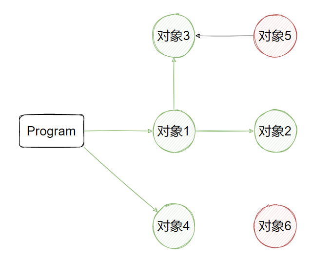

第三步：清理不可达对象，也就是 5 和 6。

第四步：停止 STW，程序继续运行。

以上便是标记-清除（mark and sweep）回收算法，比较简单，但是缺点也非常明显：

- STW 让程序暂停，程序出现卡顿，这也是最严重的问题，在 STW 过程中 CPU 不执行用户代码，全部用于垃圾回收；
- 标记需要扫描整个 heap；
- 清除数据会产生 heap 碎片。

Go 1.3 版本之前就是按以上来实施的,  执行 GC 的基本流程就是：`STW -- Mark -- Sweep -- 停止 STW`。这样全部的 GC 时间都是包裹在 STW 范围之内，所以 Go 1.3 做了简单的优化，主要是将停止 STW 的步骤提前了，减少 STW 暂停的时间范围，也就是 `STW -- Mark -- 停止 STW -- Sweep`。因为在 Sweep 清除的时候，可以不需要 STW 停止，因为这些对象已经是不可达对象了，不会出现回收写冲突等问题。

但是无论怎么优化，Go 1.3 都面临这个一个重要问题，就是**mark-and-sweep 算法会暂停整个程序** 。于是 Go 1.5 引入了三色标记法来解决这个问题。

---

# 三色标记法

## 基本步骤

三色标记法将所有对象标记成三种颜色：白 / 灰 / 黑。首先我们来看一下三色标记法的基本步骤：

第一步：所有新建对象都是标记为白。

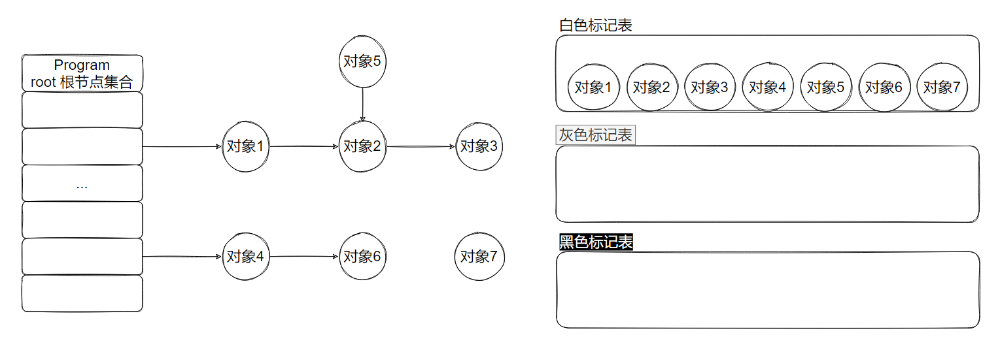

上图所示，我们的程序可抵达的内存对象关系如左图所示，右边的标记表，是用来记录目前每个对象的标记颜色分类。这里面需要注意的是，所谓程序，则是一些根对象集合，根对象在垃圾回收的术语中又叫做根集合，它是垃圾回收器在标记过程时最先检查的对象，包括：

1. 全局变量：程序在编译期就能确定的那些存在于程序整个生命周期的变量。
2. 执行栈：每个 goroutine 都包含自己的执行栈，这些执行栈上包含栈上的变量及指向分配的堆内存区块的指针。
3. 寄存器：寄存器的值可能表示一个指针，参与计算的这些指针可能指向某些赋值器分配的堆内存区块。

第二步：每次 GC 回收会从根节点开始遍历所有对象，把遍历到的对象从白色集合放入灰色集合。

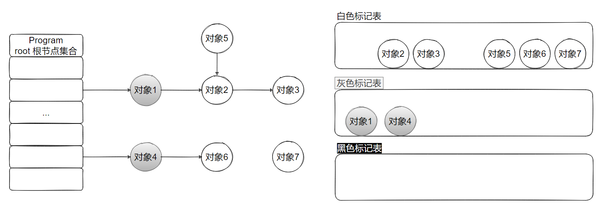

这里要注意的是，本次遍历是一次遍历，非递归形式，是从程序层次可抵达的对象遍历一层，如上图所示，当前可抵达的对象是对象 1 和对象 4，那么自然本轮遍历结束，对象 1 和对象 4 就会被标记为灰色，灰色标记表就会多出这两个对象。

第三步：遍历灰色集合，将灰色对象引用的对象从白色集合放入灰色集合，之后将此灰色对象放入黑色集合。

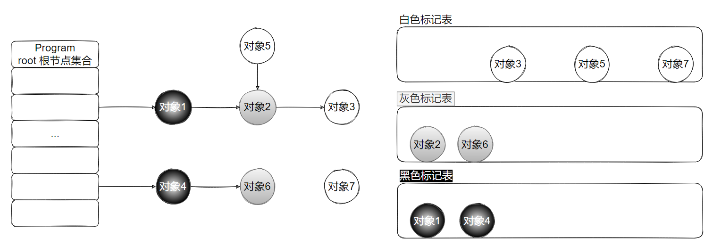

这一次遍历是只扫描灰色对象，将灰色对象的第一层遍历可抵达的对象由白色变为灰色，如：对象 2、对象 6。而之前的灰色对象 1 和对象 4 则会被标记为黑色，同时由灰色标记表移动到黑色标记表中。

第四步：重复第三步直到灰色中无任何对象。

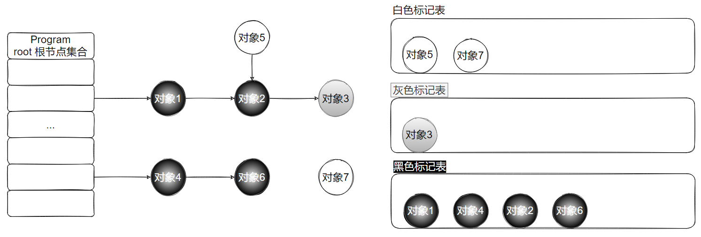

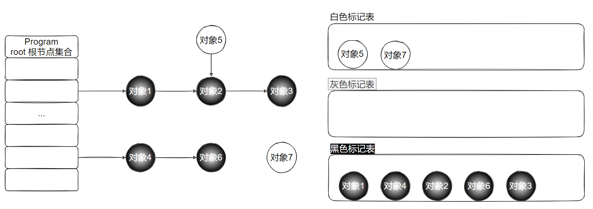

当我们全部的可达对象都遍历完后，灰色标记表将不再存在灰色对象，目前全部内存的数据只有两种颜色，黑色和白色。那么黑色对象就是我们程序逻辑可达（需要的）对象，这些数据是目前支撑程序正常业务运行的，是合法的有用数据，不可删除，白色的对象是全部不可达对象，目前程序逻辑并不依赖他们，那么白色对象就是内存中目前的垃圾数据，需要被清除。

第五步：回收所有的白色标记表的对象. 也就是回收垃圾。

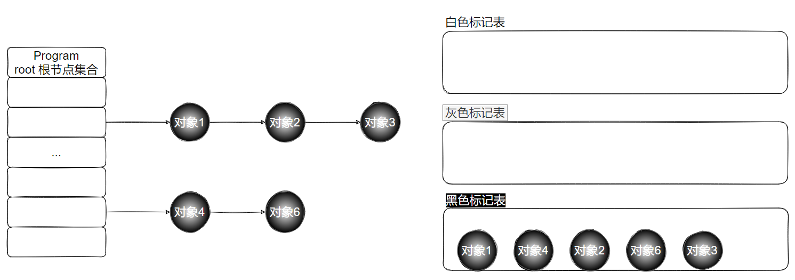

以上便是三色标记法，不难看出，我们上面已经清楚的体现三色的特性。但是这里面可能会有很多并发流程均会被扫描，执行并发流程的内存可能相互依赖，为了在 GC 过程中保证数据的安全，我们在开始三色标记之前就会加上 STW，在扫描确定黑白对象之后再放开 STW。但是很明显这样的 GC 扫描的性能实在是太低了。

那么 Go 是如何解决标记-清除算法中的卡顿（STW）问题的呢？

## 没有 STW 的三色标记法

假如没有 STW，那么也就不会再存在性能上的问题，但这样会不会有问题呢？

我们把初始状态设置为已经经历了第一轮扫描，目前黑色的有对象 1 和对象 4， 灰色的有对象 2 和对象 6，其他的为白色对象，且对象 2 是通过指针 p 指向对象 3 的，如图所示。

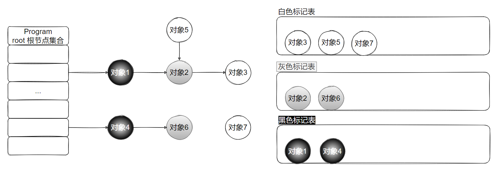

现在假设三色标记过程不启动 STW，那么在 GC 扫描过程中，任意的对象均可能发生读写操作。

在还没有扫描到对象 2 的时候，已经标记为黑色的对象 4，此时创建指针 q，并且指向白色的对象 3。与此同时灰色的对象 2 将指针 p 移除，那么白色的对象 3 实则就是被挂在了已经扫描完成的黑色的对象 4 下，如图所示。

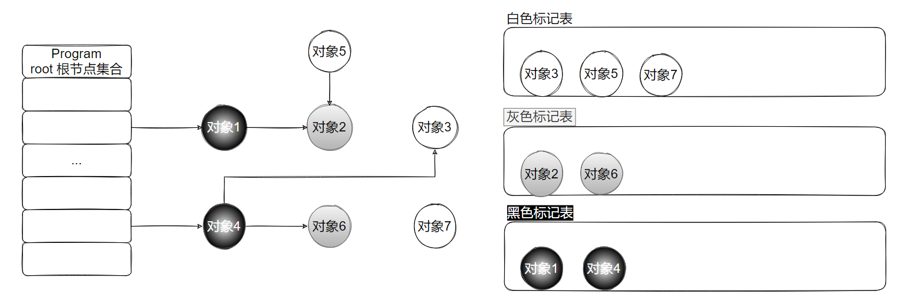

然后我们正常指向三色标记的算法逻辑，将所有灰色的对象标记为黑色，那么对象 2 和对象 6 就被标记成了黑色。就执行了三色标记的最后一步，将所有白色对象当做垃圾进行回收。

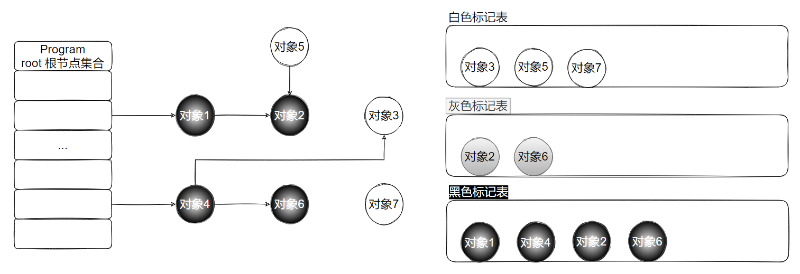

相信大家已经发现问题了，对象 3 被误杀了。

可以看出，有两种情况，在三色标记法中，是不希望被发生的：

-  一个白色对象被黑色对象引用（白色被挂在黑色下）
- 灰色对象与它之间的可达关系的白色对象遭到破坏（灰色同时丢了该白色）

当以上两个条件同时满足时，就会出现对象丢失现象！并且，如图所示的场景中，如果示例中的白色对象 3 还有很多下游对象的话, 也会一并都清理掉。

为了防止这种现象的发生，最简单的方式就是 STW，直接禁止掉其他用户程序对对象引用关系的干扰，但是 STW 的过程有明显的资源浪费，对所有的用户程序都有很大影响。那么是否可以在保证对象不丢失的情况下合理的尽可能的提高 GC 效率，减少 STW 时间呢？答案是可以的，我们只要使用一种机制，尝试去破坏上面的两个必要条件就可以了。

## 屏障机制

### 强弱三色不变式

要想对象不被错误回收，那么就要破坏上面提到的两种情况。

所谓的强三色不变式就是不允许黑色对象引用到白色对象的指针，那么条件 1 就自然被破坏，也就不会有白对象被误删。

弱三色不变式是，黑色对象可以引用白色对象，但是这个白色对象必须存在其他灰色对象对它的引用，或者可达它的链路上游存在灰色对象。 这样实则是黑色对象引用白色对象，白色对象处于一个危险被删除的状态，但是上游灰色对象的引用，可以保护该白色对象，使其安全。

为了遵循上述的两个方式，GC 算法演进到两种屏障方式，分别是插入屏障和删除屏障。

### 插入写屏障

插入屏障是指在堆中 A 对象引用 B 对象的时候，B 对象被标记为灰色。这样就满足强三色不变式（不存在黑色对象引用白色对象的情况了， 因为白色会强制变成灰色）

还是这个例子，只是这里我们划分一下堆区和栈区，因为插入屏障只对堆区起效。

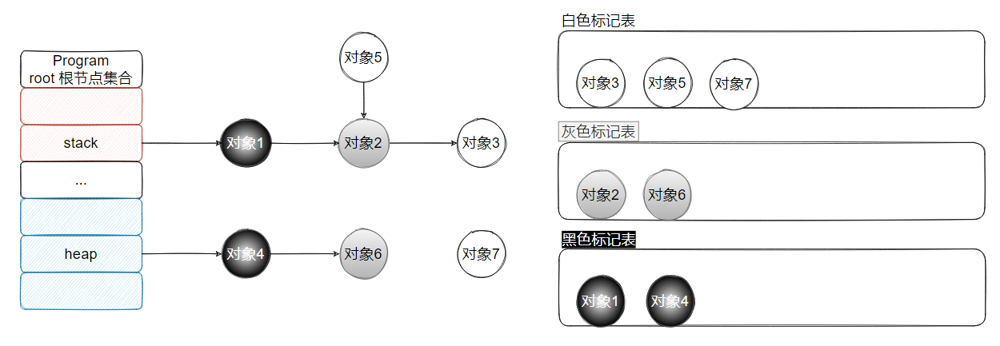

由于没有 STW，所以在 GC 的时候可以进行一切操作。假如在堆区对象 4 引用了新对象 8，由于对象 4 是黑色，所以对象 8 要被标记为灰色。另外在栈区的对象 1 引用新对象 9，此时不对对象 9 进行任何操作。

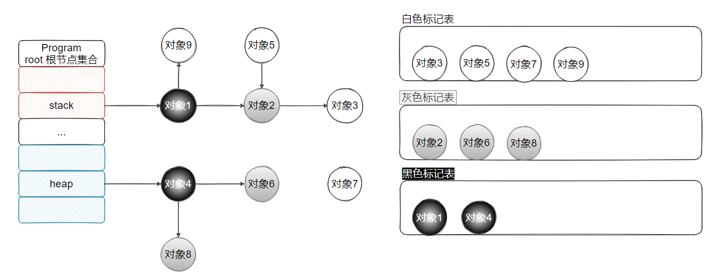

然后我们继续遍历灰色对象，直到灰色标记表里为空。

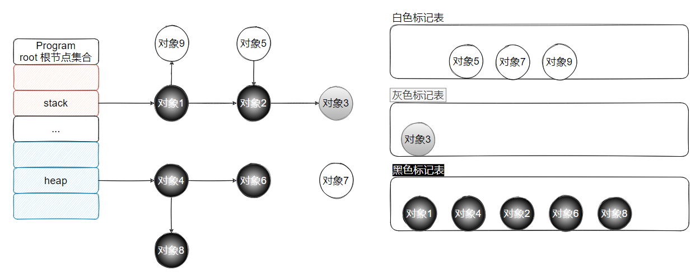

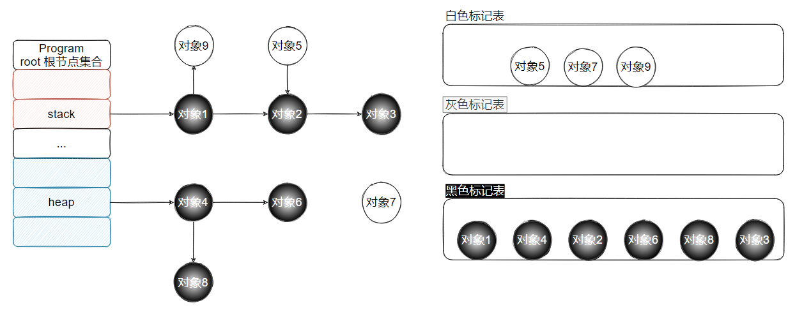

因为插入屏障只对堆区起效，所以还需要对栈区重新扫描一遍，此时需要 STW。如下图，对象 9 会被扫描从而标记为黑色，而对象 5 由于通路不可达，所以保持白色，最后对象 5 和 7 会被清理掉。

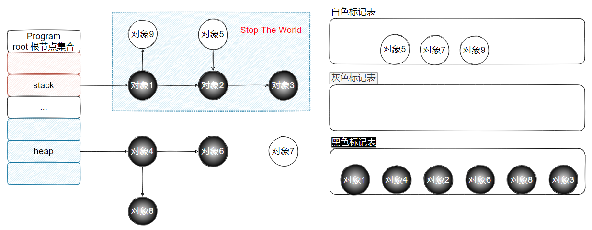

这里可以看到，插入屏障也还是需要 STW 的，STW 重新扫描栈在 goroutine 量大且活跃的场景，延迟不可控，经验值平均 10-100 ms。

那有人就会问了，*为什么写屏障不保护栈的引用*，这样不就不用 STW 了吗？

其实原因也比较简单，因为 go 是并发运行的，大部分的操作都发生在栈上。数十万 goroutine 的栈都进行屏障保护自然会有性能问题。

### 删除写屏障

首先声明，golang 没有直接实现过删除写屏障，golang 的内存写屏障是由插入写屏障到混合写屏障过渡的。不过，虽然 golang 从来没有直接使用删除写屏障，但是混合写屏障却用到了删除写屏障的思路。

删除写屏障：也叫做基于其实快照的解决方案（snapshot-at-the-begining）。顾名思义，必须在起始时，STW 扫描整个栈（注意了，是所有的 goroutine 栈），保证所有堆上被栈在用的对象都处于灰色保护下，保证的是弱三色不变式。当赋值器（业务线程）从灰色或者白色对象中删除白色指针时候，写屏障会捕捉这一行为，将这一行为通知给回收器。这样，基于起始快照的解决方案保守地将其目标对象当作存活的对象，这样就绝对不会有被误回收的对象，但是有扫描工作量浮动放大的风险。术语叫做追踪波面的回退。

对整个根做一次起始快照。当赋值器（业务线程）从灰色或者白色对象中删除白色指针时候，写屏障会捕捉这一行为，将这一行为通知给回收器。这样，基于起始快照的解决方案保守地将其目标对象当作存活的对象，这样就绝对不会有被误回收的对象，但是有扫描工作量浮动放大的风险。术语叫做追踪波面的回退。

由于起始快照的原因，起始也是执行 STW，删除写屏障不适用于栈特别大的场景，栈越大，STW 扫描时间越长，对于现代服务器上的程序来说，栈地址空间都很大，所以删除写屏障都不适用，一般适用于很小的栈内存，比如嵌入式，物联网的一些程序；并且删除写屏障会导致扫描进度的后退，所以扫描精度不如插入写屏障；

我们首先看一个实例，说明为什么 GC 前要扫描所有所有栈，我们假设没有扫描所有栈，状态如下：

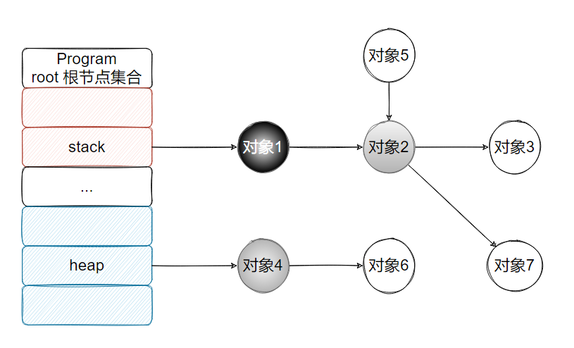

这个时候我们把对象 2 取消引用对象 7，再把对象 1 引用对象 7，那么问题就来了，对象 7 会被误删。

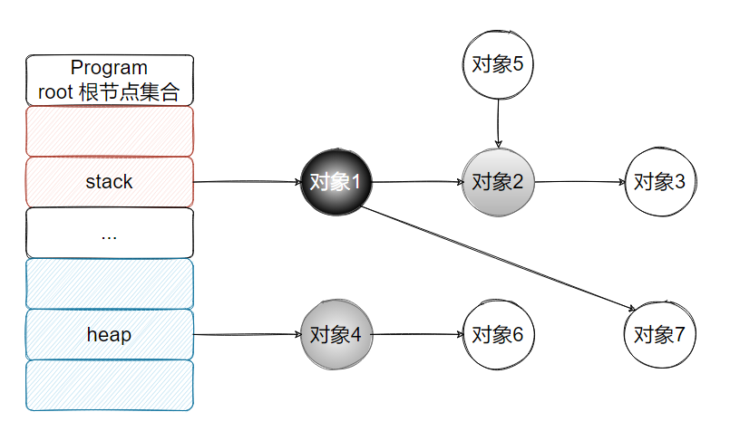

所以我们在 GC 之前要扫描所有栈，来保证所有堆上被栈在用的对象都处于灰色保护下。

下面我们再看删除写屏障怎么保证弱三色不变式，首先扫描栈对象。

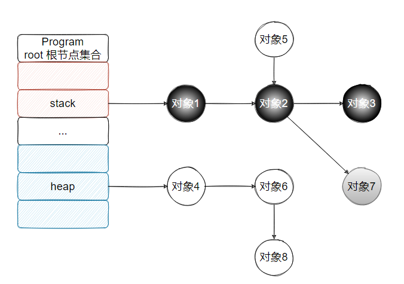

然后继续扫描，状态如下：

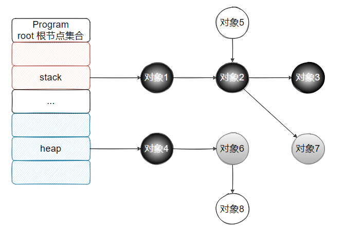

假如此时对象 6 解除引用对象 8，那么对象 8 就会变成灰色，如果有别的对象引用对象 8，比如对象 4，那么就防止了误删，如果没有人引用，那么就会在下轮被清理。

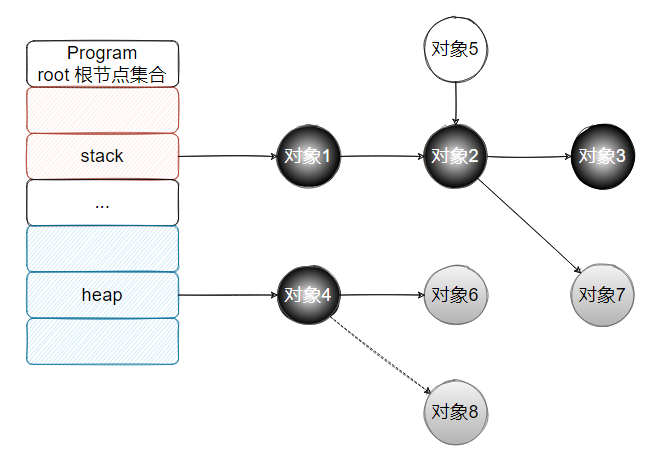

所以这种方式的回收精度低，一个对象即使被删除了最后一个指向它的指针也依旧可以活过这一轮，在下一轮 GC 中被清理掉。

*那么我不整机暂停 STW 栈，而是一个栈一个栈的快照，这样也没有 STW 了，是否可以满足要求？*(这个就是当前 golang 混合写屏障的时候做的哈，虽然没有 STW 了，但是扫描到某一个具体的栈的时候，还是要暂停这一个 goroutine 的)

不行，纯粹的删除写屏障，起始必须整个栈打快照，要把所有的堆对象都处于灰色保护中才行。举个例子，当某个栈变黑之后，此时又引用了堆上的一个新对象，那么这个新对象就会被误删，如果是混合写屏障，由于被添加的对象会被标记为灰色，所以不会误删。

---

# 混合写屏障

首先我们总结下插入写屏障和删除写屏障的短板：

-  插入写屏障：结束时需要 STW 来重新扫描栈，标记栈上引用的白色对象的存活； 
-  删除写屏障：回收精度低，GC 开始时 STW 扫描堆栈来记录初始快照，这个过程会保护开始时刻的所有存活对象。 

Go 1.8 版本引入了混合写屏障机制（hybrid write barrier），避免了对栈 re-scan 的过程，极大的减少了 STW 的时间。结合了两者的优点。规则如下：

1. GC 开始将栈上的对象全部扫描并标记为黑色（之后不再进行第二次重复扫描，无需 STW），
2. GC 期间，任何在栈上创建的新对象，均为黑色。
3. 被删除的对象标记为灰色。
4. 被添加的对象标记为灰色。

这就满足了变形的弱三色不变式。这里就不举例了。

混合写屏障继承了插入写屏障的优点，起始无需 STW 打快照，直接并发扫描垃圾即可；混合写屏障继承了删除写屏障的优点，赋值器是黑色赋值器，扫描过一次就不需要扫描了，这样就消除了插入写屏障时期最后 STW 的重新扫描栈；混合写屏障扫描精度继承了删除写屏障，比插入写屏障更低，随着带来的是 GC 过程全程无 STW；混合写屏障扫描栈虽然没有 STW，但是扫描某一个具体的栈的时候，还是要停止这个 goroutine 赋值器的工作的哈（针对一个 goroutine 栈来说，是暂停扫的，要么全灰，要么全黑哈，原子状态切换）；

最后一个问题，*如果发生栈上对象引用改变。因为不涉及屏障，为什么不会发生错误？*

设想下面的场景：

1. 故事发生在两个 goroutine 上
2. 栈 1 已被扫黑，它下面的对象都是灰色
3. 栈 2 还未被扫黑，所以它引用的 D 可能是白色。
4. 在 GC 之时，栈 2 解除 ref2，栈 1 将 ref 指向 D。
5. 因为引用改变都发生在栈上，不会触发屏障。所以 D 被回收？

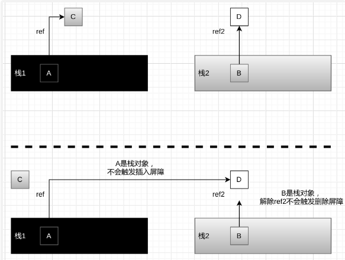

因为这是一个伪命题：

1. 对某个栈的操作是原子操作，要么栈全灰，要么全黑。
2. 已被扫黑的栈，引用的堆上的对象至少是灰色（比如 C 对象）。所以不可能发生同栈下引用改变会影响 GC 的问题。
3. 不可能发生上述的跨栈的引用。因为对象不是从天上掉下来的。假设 A 对象可以与 D 对象建立引用，只有可能 A 也直接间接持有 B 对象。否则没有路径可以建立这样的引用。然而，因为 Go 的逃逸分析，B 对象被外部引用，不可能存在于栈上。所以 B 一定是堆上的对象。

---

# 参考与感谢

- [Golang三色标记混合写屏障GC模式全分析](https://www.yuque.com/aceld/golang/zhzanb)

