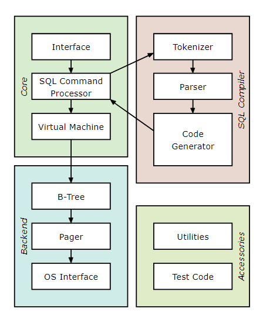

# 🔍 How Does a Database Work

[项目主页](https://cstack.github.io/db_tutorial/)

[View on GitHub (pull requests welcome)](https://github.com/cstack/db_tutorial)

​	

你是否有以下疑问：

- 数据是以什么格式保存的？(在内存和磁盘上)
- 什么时候从内存转移到磁盘？
- 为什么每个表只能有一个主键？
- 事务回滚是如何进行的？
- 索引是什么格式的？
- 何时以及如何进行全表扫描？
- 准备好的语句是以什么格式保存的？

简而言之，数据库是如何工作的？

为了理解这些问题，此项目用 C 语言从头开始教学写一个克隆的 [sqlite](https://www.sqlite.org/arch.html)

>另外关于 sqlite 本身的设计和故事也非常出彩，感兴趣的可以自行了解。[SQLite的文艺复兴](https://www.bmpi.dev/dev/renaissance-sqlite/)

 

> *“What I cannot create, I do not understand.”* – [Richard Feynman](https://en.m.wikiquote.org/wiki/Richard_Feynman)

课程目录：

- [Part 1 - Introduction and Setting up the REPL](posts/How-Does-a-Database-Work/part1.md)
- [Part 2 - World’s Simplest SQL Compiler and Virtual Machine](posts/How-Does-a-Database-Work/part2.md)
- [Part 3 - An In-Memory, Append-Only, Single-Table Database](posts/How-Does-a-Database-Work/part3.md)
- [Part 4 - Our First Tests (and Bugs)](posts/How-Does-a-Database-Work/part4.md)
- [Part 5 - Persistence to Disk](posts/How-Does-a-Database-Work/part5.md)
- [Part 6 - The Cursor Abstraction](posts/How-Does-a-Database-Work/part6.md)
- [Part 7 - Introduction to the B-Tree](posts/How-Does-a-Database-Work/part7.md)
- [Part 8 - B-Tree Leaf Node Format](posts/How-Does-a-Database-Work/part8.md)
- [Part 9 - Binary Search and Duplicate Keys](posts/How-Does-a-Database-Work/part9.md)
- [Part 10 - Splitting a Leaf Node](posts/How-Does-a-Database-Work/part10.md)
- [Part 11 - Recursively Searching the B-Tree](posts/How-Does-a-Database-Work/part11.md)
- [Part 12 - Scanning a Multi-Level B-Tree](posts/How-Does-a-Database-Work/part12.md)
- [Part 13 - Updating Parent Node After a Split](posts/How-Does-a-Database-Work/part13.md)

