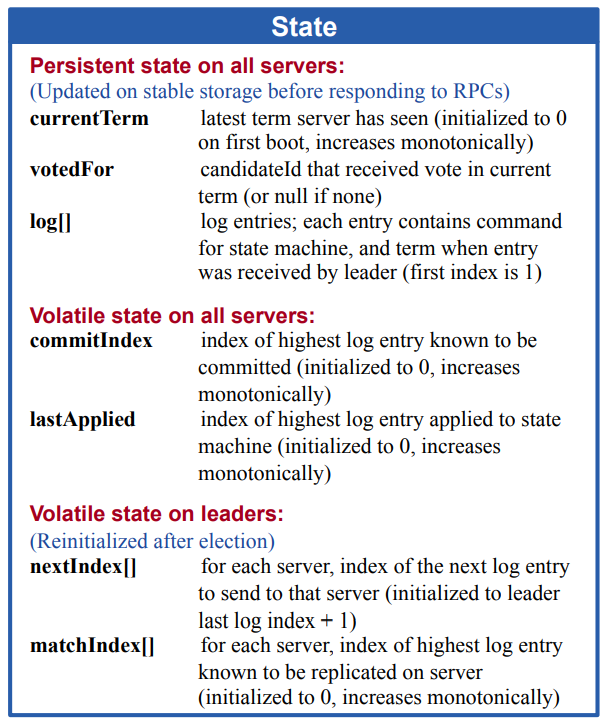
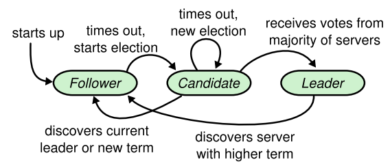
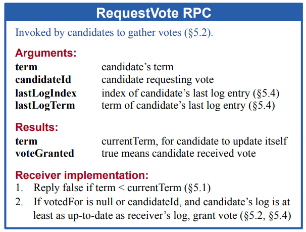
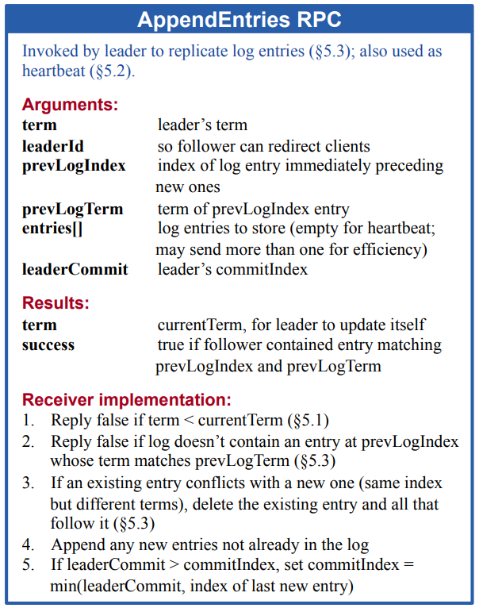
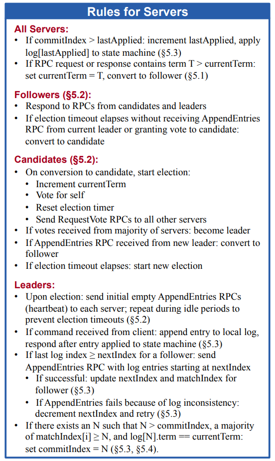

# Part 2A: leader election

任务：实现 Raft 领导者选举和心跳（AppendEntries RPCs，没有日志条目）。第 2A 部分的目标是选出一个领导者，如果没有失败，该领导者将继续担任领导者，如果老领导者失败或与老领导者之间的数据包丢失，则由新领导者接管。运行 go test -run 2A 来测试你的 2A 代码。

>[!TIP]
>
>- You can't easily run your Raft implementation directly; instead you should run it by way of the tester, i.e. `go test -run 2A `.
>- Follow the paper's Figure 2. At this point you care about sending and receiving RequestVote RPCs, the Rules for Servers that relate to elections, and the State related to leader election,
>- Add the Figure 2 state for leader election to the `Raft` struct in `raft.go`. You'll also need to define a struct to hold information about each log entry.
>- Fill in the `RequestVoteArgs` and `RequestVoteReply` structs. Modify `Make()` to create a background goroutine that will kick off leader election periodically by sending out `RequestVote` RPCs when it hasn't heard from another peer for a while. This way a peer will learn who is the leader, if there is already a leader, or become the leader itself. Implement the `RequestVote()` RPC handler so that servers will vote for one another.
>- To implement heartbeats, define an `AppendEntries` RPC struct (though you may not need all the arguments yet), and have the leader send them out periodically. Write an `AppendEntries` RPC handler method that resets the election timeout so that other servers don't step forward as leaders when one has already been elected.
>- Make sure the election timeouts in different peers don't always fire at the same time, or else all peers will vote only for themselves and no one will become the leader.
>- The tester requires that the leader send heartbeat RPCs no more than ten times per second.
>- The tester requires your Raft to elect a new leader within five seconds of the failure of the old leader (if a majority of peers can still communicate). Remember, however, that leader election may require multiple rounds in case of a split vote (which can happen if packets are lost or if candidates unluckily choose the same random backoff times). You must pick election timeouts (and thus heartbeat intervals) that are short enough that it's very likely that an election will complete in less than five seconds even if it requires multiple rounds.
>- The paper's Section 5.2 mentions election timeouts in the range of 150 to 300 milliseconds. Such a range only makes sense if the leader sends heartbeats considerably more often than once per 150 milliseconds. Because the tester limits you to 10 heartbeats per second, you will have to use an election timeout larger than the paper's 150 to 300 milliseconds, but not too large, because then you may fail to elect a leader within five seconds.
>- You may find Go's [rand](https://golang.org/pkg/math/rand/) useful.
>- You'll need to write code that takes actions periodically or after delays in time. The easiest way to do this is to create a goroutine with a loop that calls [time.Sleep()](https://golang.org/pkg/time/#Sleep); (see the `ticker()` goroutine that `Make()` creates for this purpose). Don't use Go's `time.Timer` or `time.Ticker`, which are difficult to use correctly.
>- The [Guidance page](https://pdos.csail.mit.edu/6.824/labs/guidance.html) has some tips on how to develop and debug your code.
>- If your code has trouble passing the tests, read the paper's Figure 2 again; the full logic for leader election is spread over multiple parts of the figure.
>- Don't forget to implement `GetState()`.
>- The tester calls your Raft's `rf.Kill()` when it is permanently shutting down an instance. You can check whether `Kill()` has been called using `rf.killed()`. You may want to do this in all loops, to avoid having dead Raft instances print confusing messages.
>- Go RPC sends only struct fields whose names start with capital letters. Sub-structures must also have capitalized field names (e.g. fields of log records in an array). The `labgob` package will warn you about this; don't ignore the warnings.

在提交 2A 之前，请确保您通过了 2A 测试，您会看到如下内容：

```bash
$ go test -run 2A
Test (2A): initial election ...
  ... Passed --   3.5  3   58   16840    0
Test (2A): election after network failure ...
  ... Passed --   5.4  3  118   25269    0
Test (2A): multiple elections ...
  ... Passed --   7.3  7  624  138014    0
PASS
ok  	6.824/raft	16.265s
$
```

每一行 "PASS" 包含五个数字；它们是测试所花的时间（秒）、Raft 对端的数量、测试期间发送的 RPC 数量、RPC 消息中的总字节数，以及 Raft 报告的提交的日志条目数量。您的数字将与这里显示的数字不同。你可以忽略这些数字，但它们可以帮助检查你的实现所发送的 RPC 的数量。对于所有的实验 2、3 和 4，如果你的解决方案在所有的测试中花费超过 600 秒（去测试），或者任何单独的测试花费超过 120 秒，测试脚本将会失败。

当我们对你提交的文件进行评分时，我们会在没有 -race 标志的情况下运行测试，但你也应该确保你的代码在有 -race 标志的情况下能持续通过测试。


---

# 设计思路

关于 Raft 的原理这里就不多说明了，大家自己去看课程和论文。关于实现最重要的就是图 2 了，它对于 Raft 的实现讲的很明白，所以我们就跟着图 2 来设计，其中有些字段在 2A 中用不到，我们就先忽略。


## 状态设计



在 2A 实验中，我们要实现的是选举的功能，因此我们关心 currentTerm 和 votedFor 字段，每个 Raft 实例都要记录自己的任期，同时在竞选时记录投票给了谁。

```go
type Raft struct {
   mu        sync.Mutex          // Lock to protect shared access to this peer's state
   peers     []*labrpc.ClientEnd // RPC end points of all peers
   persister *Persister          // Object to hold this peer's persisted state
   me        int                 // this peer's index into peers[]
   dead      int32               // set by Kill()

   // Your data here (2A, 2B, 2C).
   // Look at the paper's Figure 2 for a description of what
   // state a Raft server must maintain.
   role        Role // 服务器当前角色
   currentTerm int  // 服务器已知最新的任期，在服务器首次启动时初始化为 0，单调递增
   votedFor    int  // 当前任期内接受选票的竞选者 Id，如果没有投给任何候选者则为空

   electionTimer  *time.Timer // 选举计时器
   heartbeatTimer *time.Timer // 心跳计时器
}
```

服务器角色也很好理解，在 Raft 设计中有三种角色，Leader，Candidate 和 Follower。

```go
type Role int
const (
   Leader Role = iota
   Candidate
   Follower
)
```



这三种角色切换流程如上图，可以看到在竞选定时器超时后，Follower 开始竞选，竞选成功后 Leader 定期发送心跳来维持自己的任期，因此还需要两个定时器 Timer，虽然老师建议不要用 Timer，但是如果你对 Go 语言熟悉的话，是可以用的，如果你经验不足，最好还是按照建议里的去做。

至于其余的一些变量在之前实验代码框架介绍时已经分析了，这里就不做赘述。

于是我们在测试框架创建 Raft 实体时，代码如下：

```go
func Make(peers []*labrpc.ClientEnd, me int,
   persister *Persister, applyCh chan ApplyMsg) *Raft {
   rf := &Raft{
      peers:       peers,
      persister:   persister,
      me:          me,
      dead:        0,
      role:        Follower,
      currentTerm: 0,
      votedFor:    -1,
   }
   rf.heartbeatTimer = time.NewTimer(rf.HeartbeatTimeout())
   rf.electionTimer = time.NewTimer(rf.ElectionTimeout())

   // initialize from state persisted before a crash
   rf.readPersist(persister.ReadRaftState())

   // start ticker goroutine to start elections
   go rf.ticker()

   return rf
}
```

做的工作也十分简单，就是初始化 Raft 结构体成员，其中要注意的是，竞选超时时间要是随机波动的。

```go
func (rf *Raft) HeartbeatTimeout() time.Duration {
   return time.Millisecond * 100
}

func (rf *Raft) ElectionTimeout() time.Duration {
   rand.Seed(time.Now().Unix() + int64(rf.me))
   return time.Millisecond * time.Duration(500+rand.Int63n(500))
}
```


## RequestVote RPC 设计



选举的 RPC 结构体定义如下，2A 只要求实现选举，没有日志部分，所以请求参数只需要 Term 和 CandidateId，其余都和论文一致。

```go
type RequestVoteArgs struct {
   Term        int // 候选者的任期号
   CandidateId int // 请求选票的候选者的 ID
}

//
// example RequestVote RPC reply structure.
// field names must start with capital letters!
//
type RequestVoteReply struct {
   Term        int  // 当前任期号，以便于候选者去更新自己的任期号
   VoteGranted bool // 候选者赢得了此张选票时为 true
}
```

这里要遵守的规则：

1. 如果 leader 的任期小于自己的任期返回 false；
2. 如果本地 voteFor 为空，则投票给该候选者。


## AppendEntries RPC 设计



日志条目的 RPC 结构体设计如下，同样也不需要日志相关的成员。LeaderId 其实这里不需要，但方便调试就加上了。

```go
type AppendEntriesArgs struct {
   Term     int // leader 任期
   LeaderId int // 用来 follower 把客户端请求重定向到 leader
}

type AppendEntriesReply struct {
   Term    int // 当前任期
   Success bool
}
```

这里需要遵守的规则是：如果 leader 的任期小于自己的任期返回 false，其余规则的都是后面实验要实现的。


## 规则



在本次实验中，要遵守的规则如下：

所有服务器：

- 如果接收到的 RPC 请求或响应中，任期号 `T > currentTerm`，则令 `currentTerm = T`，并切换为 follower 状态（5.1 节）

followers：

- 响应来自 candidate 和 leader 的请求
- 如果选举定时器超时时，没有收到 leader 的的追加日志请求或者没有投票给 candidate，该机器转化为 candidate。

candidates：

- 在转变成候选者后就立即开始选举过程
  - 自增当前的任期号（currentTerm）
  - 给自己投票
  - 重置选举超时计时器
  - 发送请求投票的 RPC 给其他所有服务器
- 如果接收到大多数服务器的选票，那么就变成 leader
- 如果接收到来自新的 leader 的附加日志（AppendEntries）RPC，则转变成 follower
- 如果选举过程超时，则再次发起一轮选举

leaders：

- 一旦成为领导者：发送空的附加日志（AppendEntries）RPC（心跳）给其他所有的服务器；在一定的空余时间之后不停的重复发送，以防止跟随者超时

自此流程就非常清晰了。


## 选举流程

在 ticker routine 中，只需要监控两个定时器，如果是心跳到了并且是 Leader，就要广播心跳来重置别的 Raft 实例的竞选超时定时器。如果 Leader 故障，那么 electionTimer 就会超时，根据规则，任期加一，开始竞选。

```go
func (rf *Raft) ticker() {
   for rf.killed() == false {
      select {
      case <-rf.electionTimer.C:
         rf.mu.Lock()
         // 开始竞选，任期加一
         rf.role = Candidate
         rf.currentTerm += 1
         rf.startElection()
         rf.electionTimer.Reset(rf.ElectionTimeout())
         rf.mu.Unlock()
      case <-rf.heartbeatTimer.C:
         rf.mu.Lock()
         if rf.role == Leader {
            // Leader 定期发送心跳
            rf.broadcastHeartbeat()
            rf.electionTimer.Reset(rf.ElectionTimeout())
         }
         rf.heartbeatTimer.Reset(rf.HeartbeatTimeout())
         rf.mu.Unlock()
      }
   }
}
```

当 Raft 实例进入竞选状态时，首先给自己投一票，然后向所有别的实例发送 RequestVote RPC，如果获得一半以上票数，则当选 Leader 并立刻发送心跳通知。这里要注意的是过期轮次的消息不需要理会，比如当前任期没有选出 Leader，进入了下一轮竞选，此时收到上一轮的投票要忽略，否则逻辑就会出错。

```go
func (rf *Raft) startElection() {
   rf.DPrintf("start candidate\n")
   request := &RequestVoteArgs{
      Term:        rf.currentTerm,
      CandidateId: rf.me,
   }
   grantedVotes := 1
   memberNum := len(rf.peers)
   rf.votedFor = rf.me

   for peer := range rf.peers {
      if peer == rf.me {
         continue
      }
      go func(peer int) {
         response := new(RequestVoteReply)
         rf.DPrintf("send RequestVote %v to %d\n", request, peer)
         if rf.sendRequestVote(peer, request, response) {
            rf.DPrintf("receive RequestVote from %d, response is %v\n", peer, response)
            rf.mu.Lock()
            defer rf.mu.Unlock()
            // 过期轮次的回复直接丢弃
            if request.Term != rf.currentTerm {
               return
            }
            // 已经不是竞选者角色了也不用理会回复
            if rf.role != Candidate {
               return
            }

            rf.CheckTerm(response.Term)
            if response.VoteGranted {
               // 获得选票
               grantedVotes += 1
               if grantedVotes >= memberNum/2+1 {
                  // 竞选成功
                  rf.DPrintf("====== candidate success ======\n")
                  rf.role = Leader
                  rf.broadcastHeartbeat()
               }
            }
         }
      }(peer)
   }
}
```

如果接收到的 RPC 请求或响应中，任期号 T > currentTerm，则令 currentTerm = T，并切换为 follower 状态，CheckTerm 函数实现此功能。

```go
func (rf *Raft) CheckTerm(term int) {
   if term > rf.currentTerm {
      rf.DPrintf("peer term %d > currentTerm", term)
      rf.role = Follower
      rf.currentTerm = term
      rf.votedFor = -1
   }
}
```

当 Raft 实例收到 RequestVote 请求时，如果任期小于自己的任期，或者已经投票了，就不给它投票。

```go
func (rf *Raft) RequestVote(request *RequestVoteArgs, response *RequestVoteReply) {
   rf.mu.Lock()
   defer rf.mu.Unlock()

   // 不给他投票
   if request.Term < rf.currentTerm || (request.Term == rf.currentTerm && rf.votedFor != -1 && rf.votedFor != request.CandidateId) {
      response.Term, response.VoteGranted = rf.currentTerm, false
      return
   }

   rf.CheckTerm(request.Term)
   // 给他投票，重复回复也没事
   rf.DPrintf("vote for %d", request.CandidateId)
   rf.votedFor = request.CandidateId
   rf.electionTimer.Reset(rf.ElectionTimeout())
   response.Term, response.VoteGranted = rf.currentTerm, true
}
```

在竞选出 Leader 之后，Leader 不停发送心跳包，当实例收到心跳包之后应该重置自己的竞选超时定时器。

```go
func (rf *Raft) broadcastHeartbeat() {
   request := &AppendEntriesArgs{
      Term:     rf.currentTerm,
      LeaderId: rf.me,
   }

   for peer := range rf.peers {
      if peer == rf.me {
         continue
      }
      go func(peer int) {
         response := new(AppendEntriesReply)
         rf.DPrintf("send heartbeat %v to %d\n", request, peer)
         if rf.sendAppendEntries(peer, request, response) {
            rf.DPrintf("receive AppendEntriesReply from %d, response is %v\n", peer, response)
            rf.mu.Lock()
            defer rf.mu.Unlock()
            rf.CheckTerm(response.Term)
         }
      }(peer)
   }

   return
}

func (rf *Raft) AppendEntries(request *AppendEntriesArgs, response *AppendEntriesReply) {
	rf.mu.Lock()
	defer rf.mu.Unlock()
	if request.Term >= rf.currentTerm {
		rf.role = Follower
		rf.currentTerm = request.Term
		rf.votedFor = -1
		rf.electionTimer.Reset(rf.ElectionTimeout())
		response.Success = true
	} else {
		response.Success = false
	}
	response.Term = rf.currentTerm
	return
}
```

最初实现测试了 100 遍，结果出现了一次错误，发现是超时时间设置得和实验不匹配，所以如果出现错误，不一定是你实现有问题，也许是性能没达标，修改之后测试了 500 遍，暂时没发现问题。

```bash
root@lz-VirtualBox:~/6.824/src/raft# go test -run 2A
Test (2A): initial election ...
  ... Passed --   3.6  3   56    6950    0
Test (2A): election after network failure ...
  ... Passed --   5.6  3  134   11006    0
Test (2A): multiple elections ...
  ... Passed --   9.6  7  840   67282    0
PASS
ok  	6.824/raft	18.840s
```


## 调试测试

对了，你还需要实现 GetState 接口来供测试获取信息使用。

```go
func (rf *Raft) GetState() (int, bool) {
   var isleader bool

   rf.mu.Lock()
   defer rf.mu.Unlock()
   if rf.role == Leader {
      isleader = true
   } else {
      isleader = false
   }

   return rf.currentTerm, isleader
}
```

对于调试尽可能多打日志，因为 2A 实验做的还比较顺利，所以也没打印什么日志。你可以对框架提供的 DPrintf 进行一些修改，这样就不用每次都传一堆重复的参数了。

```go
func (rf *Raft) DPrintf(format string, a ...interface{}) {
   if Debug {
      var role string
      if rf.role == Leader {
         role = "leader"
      } else if rf.role == Candidate {
         role = "candidate"
      } else {
         role = "follower"
      }
      log.Printf(fmt.Sprintf("[term %d][node %d][role %s]:%s", rf.currentTerm, rf.me, role, format), a...)
   }
   return
}
```

​	