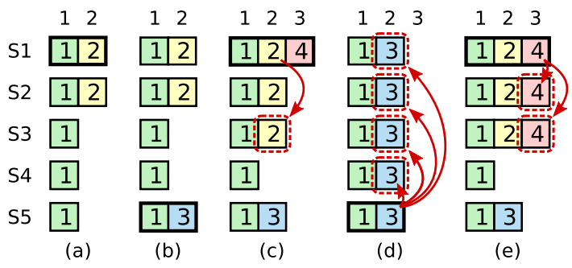

# Part 2B: log

任务：实现 leader 和 follower 代码，以追加新的日志条目，从而使 go test -run 2B 测试通过。

>[!TIP]
>
>- Run `git pull` to get the latest lab software.
>- Your first goal should be to pass `TestBasicAgree2B()`. Start by implementing `Start()`, then write the code to send and receive new log entries via `AppendEntries` RPCs, following Figure 2. Send each newly committed entry on `applyCh` on each peer.
>- You will need to implement the election restriction (section 5.4.1 in the paper).
>- One way to fail to reach agreement in the early Lab 2B tests is to hold repeated elections even though the leader is alive. Look for bugs in election timer management, or not sending out heartbeats immediately after winning an election.
>- Your code may have loops that repeatedly check for certain events. Don't have these loops execute continuously without pausing, since that will slow your implementation enough that it fails tests. Use Go's [condition variables](https://golang.org/pkg/sync/#Cond), or insert a `time.Sleep(10 * time.Millisecond)` in each loop iteration.
>- Do yourself a favor for future labs and write (or re-write) code that's clean and clear. For ideas, re-visit our the [Guidance page](https://pdos.csail.mit.edu/6.824/labs/guidance.html) with tips on how to develop and debug your code.
>- If you fail a test, look over the code for the test in `config.go` and `test_test.go` to get a better understanding what the test is testing. `config.go` also illustrates how the tester uses the Raft API.

如果你的代码运行太慢，测试可能会失败。你可以用时间命令检查你的解决方案使用了多少时间。下面是典型的输出：

```bash
$ time go test -run 2B
Test (2B): basic agreement ...
  ... Passed --   0.9  3   16    4572    3
Test (2B): RPC byte count ...
  ... Passed --   1.7  3   48  114536   11
Test (2B): agreement after follower reconnects ...
  ... Passed --   3.6  3   78   22131    7
Test (2B): no agreement if too many followers disconnect ...
  ... Passed --   3.8  5  172   40935    3
Test (2B): concurrent Start()s ...
  ... Passed --   1.1  3   24    7379    6
Test (2B): rejoin of partitioned leader ...
  ... Passed --   5.1  3  152   37021    4
Test (2B): leader backs up quickly over incorrect follower logs ...
  ... Passed --  17.2  5 2080 1587388  102
Test (2B): RPC counts aren't too high ...
  ... Passed --   2.2  3   60   20119   12
PASS
ok  	6.824/raft	35.557s

real	0m35.899s
user	0m2.556s
sys	0m1.458s
$
```

"ok 6.824/raft 35.557s " 意味着 Go 测试 2B 所花费的时间是 35.557 秒的实际时间。"user 0m2.556s " 意味着代码消耗了 2.556 秒的 CPU 时间，或实际执行指令的时间（而不是等待或睡眠）。如果你的解决方案在 2B 测试中使用的实际时间远远超过 1 分钟，或者远远超过 5 秒的 CPU 时间，你以后可能会遇到麻烦。你需要寻找时间耗费在哪了，比如等待 RPC 超时或等待通道消息或发送大量的 RPC。


---

# Part 2C: persistence 

真正的实现会在每次 Raft 的持久化状态发生变化时将其写入磁盘，并在重启后重新启动时从磁盘读取状态。

你的实现不会使用磁盘；相反，它将从 Persister 对象（见 persister.go）保存和恢复持久化状态。Raft.Make() 提供了一个 Persister，它最初持有 Raft 最近的持久化状态（如果有的话）。Raft 使用 Persister 的 ReadRaftState 和 SaveRaftState 方法。，从该 Persister 初始化其状态，并在每次状态改变时使用它来保存其持久化状态。

任务：实现持久化，完成 raft.go 中的 persist() 和 readPersist() 函数。你需要把状态编码（labgob）或序列化为一个字节数组，以便将其传递给持久化器。labgob 就像 Go 的 gob 编码器，但如果你用小写的字段名对结构进行编码，会打印出错误信息。

>[!TIP]
>
>- Run `git pull` to get the latest lab software.
>- The 2C tests are more demanding than those for 2A or 2B, and failures may be caused by problems in your code for 2A or 2B.
>- You will probably need the optimization that backs up nextIndex by more than one entry at a time. Look at the [extended Raft paper](https://pdos.csail.mit.edu/6.824/papers/raft-extended.pdf) starting at the bottom of page 7 and top of page 8 (marked by a gray line). The paper is vague about the details; you will need to fill in the gaps, perhaps with the help of the 6.824 Raft lecture notes.

测试通过应该打印如下：

```bash
$ go test -run 2C
Test (2C): basic persistence ...
  ... Passed --   5.0  3   86   22849    6
Test (2C): more persistence ...
  ... Passed --  17.6  5  952  218854   16
Test (2C): partitioned leader and one follower crash, leader restarts ...
  ... Passed --   2.0  3   34    8937    4
Test (2C): Figure 8 ...
  ... Passed --  31.2  5  580  130675   32
Test (2C): unreliable agreement ...
  ... Passed --   1.7  5 1044  366392  246
Test (2C): Figure 8 (unreliable) ...
  ... Passed --  33.6  5 10700 33695245  308
Test (2C): churn ...
  ... Passed --  16.1  5 8864 44771259 1544
Test (2C): unreliable churn ...
  ... Passed --  16.5  5 4220 6414632  906
PASS
ok  	6.824/raft	123.564s
$
```

建议你最好多测试几遍。

```bash
$ for i in {0..10}; do go test; done
```


---

# 设计思路

## 结构体设计

这个实验开始，就各种魔鬼细节了，本实验只有一个建议，那就是耐心。

对于 2B 来说，实现都在论文图 2 里提到了，如果有 BUG，请回头仔细看图 2 里的描述你是否真的都实现了。如果 2B 实现正确了，2C 其实就很简单了，只要在 currentTerm，voteFor 和 logs 变化时持久化就可以了，实验没有要求要写磁盘，而是提供了 Persister，示例也写好了，所以简化了很多。2C 之所以被标记为 hard 大概是因为它的测试条件更苛刻了吧，如果 2B 实现得不对，在这里就会爆出之前没有测出的问题。

好了，这次实验和 2A 相比功能就完善很多，所以我们把结构体成员补上，相比论文，这里加了一个 plug 结构体，这是为了性能考虑，当应用发起请求时，如果每条请求我们都发送一条 RPC 那么效率就太低了，所以我们增加了一个阈值，如果单位时间内请求小于阈值，那么就等心跳去发送日志，如果流量过大，则立马发送日志，这也是 2B 测试里的一项。

竞选超时我用了 electionTimer 和 electionTimeout 两个字段，理论上一个字段就行，但是这是为了屏蔽 go timer 的 bug，所以设置了冗余的字段。

```go
type LogEntry struct {
	Term         int         // 日志所属的任期
	CommandIndex int         // 日志槽位
	Command      interface{} // 状态机命令
}

type Raft struct {
	mu        sync.Mutex          // Lock to protect shared access to this peer's state
	peers     []*labrpc.ClientEnd // RPC end points of all peers
	persister *Persister          // Object to hold this peer's persisted state
	me        int                 // this peer's index into peers[]
	dead      int32               // set by Kill()

	role        Role       // 服务器当前角色
	currentTerm int        // 服务器已知最新的任期，在服务器首次启动时初始化为 0，单调递增
	votedFor    int        // 当前任期内接受选票的竞选者 Id，如果没有投给任何候选者则为空
	logs        []LogEntry // 日志条目

	commitIndex int // 已提交的最高的日志条目的索引
	lastApplied int // 已经被提交到状态机的最后一个日志的索引

	nextIndex  []int // 对于每一台服务器，下条发送到该机器的日志索引
	matchIndex []int // 对于每一台服务器，已经复制到该服务器的最高日志条目的索引

	electionTimeout time.Time   // go timer reset bugfix
	electionTimer   *time.Timer // 选举计时器

	applyCh chan ApplyMsg
	plug    int // 心跳时间内积攒一定数目的日志再一起发送
}
```

选举的 RPC 结构体和论文一样，AppendEntriesReply RPC 结构体增加了两个字段 ConflictTerm 和 ConflictIndex，这为了实现了论文中快速找到冲突条目的优化，这里我也实现得非常简单，就是按论文里建议的按任期跳着找。

```go
type AppendEntriesArgs struct {
	Term         int        // leader 任期
	LeaderId     int        // 用来 follower 把客户端请求重定向到 leader
	PrevLogIndex int        // 紧邻新日志条目之前的那个日志条目的索引
	PrevLogTerm  int        // 紧邻新日志条目之前的那个日志条目的任期
	Entries      []LogEntry // 日志
	LeaderCommit int        // leader 的 commitIndex
}

type AppendEntriesReply struct {
	Term          int  // 当前任期
	Success       bool // 如果包含索引为 prevLogIndex 和任期为 prevLogItem 的日志，则为 true
	ConflictTerm  int  // 告诉 Leader 下次检查的 ConflictTerm
	ConflictIndex int  // ConflictTerm 任期内最大的 Index
}

type RequestVoteArgs struct {
	Term         int // 候选者的任期号
	CandidateId  int // 请求选票的候选者的 ID
	LastLogIndex int // 候选者的最后日志条目的索引值
	LastLogTerm  int // 候选者最后日志条目的任期号
}

type RequestVoteReply struct {
	Term        int  // 当前任期号，以便于候选者去更新自己的任期号
	VoteGranted bool // 候选者赢得了此张选票时为 true
}
```


## 初始化

论文日志的索引是从 1 开始的，所以初始化的时候我往日志列表里添加了一条空日志，这条日志也是所有 raft 实例一定能匹配的日志。applyCh 用于向应用通知已提交的日志，apply 协程用于向 applyCh 发送已提交的日志。

```go
func Make(peers []*labrpc.ClientEnd, me int,
	persister *Persister, applyCh chan ApplyMsg) *Raft {
	rf := &Raft{
		peers:       peers,
		persister:   persister,
		me:          me,
		dead:        0,
		role:        Follower,
		currentTerm: 0,
		votedFor:    -1,
		logs:        make([]LogEntry, 0),
		commitIndex: 0,
		lastApplied: 0,
		nextIndex:   make([]int, len(peers)),
		matchIndex:  make([]int, len(peers)),
		applyCh:     applyCh,
		plug:        0,
	}
	rf.logs = append(rf.logs, LogEntry{})
	rf.electionTimer = time.NewTimer(rf.ElectionTimeout())

	// initialize from state persisted before a crash
	rf.readPersist(persister.ReadRaftState())

	// start ticker goroutine to start elections
	go rf.ticker()

	go rf.apply()

	return rf
}
```


## 流程框架设计

这里主要有两个协程，ticker 用于超时检查，apply 用于更新状态机。超时的设计和 2A 类似，这里把提交日志检查的操作放在心跳里了，没有用单独的协程去处理。

```go
func (rf *Raft) ticker() {
	heartbeatTicker := time.NewTicker(rf.HeartbeatTimeout())
	rf.ResetElectionTimeout()
	for rf.killed() == false {
		select {
		case <-rf.electionTimer.C:
			rf.Lock("electionTimer")
			if time.Now().Before(rf.electionTimeout) {
				// go timer reset 的 bug：
				// 如果 sendTime 的执行发生在 drain channel 执行后，那么问题就来了，
				// 虽然 Stop 返回 false（因为 timer 已经 expire），但 drain channel 并没有读出任何数据。
				// 之后，sendTime 将数据发到 channel 中。timer Reset 后的 Timer 中的 Channel 实际上已经有了数据
				// 所以我增加了 electionTime 字段，如果与重置时间距离过短，那么就重置这个超时
				rf.DPrintf("go timer reset bugfix")
				rf.ResetElectionTimeout()
				rf.Unlock("electionTimer")
				continue
			}
			// 开始竞选，任期加一
			rf.DPrintf("====== election timeout ======")
			rf.role = Candidate
			rf.currentTerm += 1
			rf.startElection()
			rf.ResetElectionTimeout()
			rf.Unlock("electionTimer")
		case <-heartbeatTicker.C:
			rf.Lock("heartbeatTimer")
			if rf.role == Leader {
				// 更新提交索引
				rf.commitLog()
				// Leader 定期发送心跳
				rf.broadcast(false)
				rf.ResetElectionTimeout()
			}
			rf.Unlock("heartbeatTimer")
		}
	}
}
```

提交和更新状态机我们下面介绍，选举和 2A 类似，对于发送日志条目，这里和论文一样，没有分开心跳和追加日志。broadcast 会调用 replicate 方法，在 replicate 方法里根据当前状态决定发送的 RPC 请求是否携带日志。

```go
func (rf *Raft) broadcast(syncCommit bool) {
   for peer := range rf.peers {
      if peer == rf.me {
         continue
      }
      go rf.replicate(peer, syncCommit)
   }

   return
}
```

当选主成功后，日志会在两个时机被发送，一个是上层调用 Start 的请求达到阈值，一个就是心跳定时发送 broadcast。对于 Start 发送的请求，我们只需要加入到本地日志列表就可以返回了，等提交后再通过 applyCh 告知应用，这里做的一个小优化就是请求达到阈值才会发送一轮日志，否则就会随着心跳发送，这可以大大减少 RPC 交互数目。

```go
func (rf *Raft) Start(command interface{}) (int, int, bool) {
	index := -1
	term := -1
	isLeader := false

	// Your code here (2B).
	rf.Lock("Start")
	defer rf.Unlock("Start")
	if rf.role == Leader {
		rf.DPrintf("====== start cmd %+v ======", command)
		// 添加本地日志
		log := LogEntry{
			Term:         rf.currentTerm,
			CommandIndex: len(rf.logs), // 初始有效索引为 1
			Command:      command,
		}
		rf.logs = append(rf.logs, log)
		rf.persist()
		// 请求达到一定数目再一起发送
		rf.plug += 1
		if rf.plug >= PlugNumber {
			rf.plug = 0
			rf.broadcast(false)
		}
		// 后续请求结果会异步发送到 applyCh，index 就是 key
		index = log.CommandIndex
		term = log.Term
		isLeader = true
	}

	return index, term, isLeader
}
```


## 提交和更新状态机

请求只要超过半数复制成功就可以提交日志了，但是要注意的是，**只能提交当前任期的日志**，已经提交的日志就可以更新状态机，注意别让通道阻塞协程。这里我没有使用条件变量，而是采用了轮询的方法，实现更简单点。

另外，更新状态机的时候我并没有全程加锁，因为 lastApplied 和 commitIndex 及时读到过期数据也只会说下一次轮询来更新，并不会有什么大的影响，lastApplied 只会在本协程里更新，所以可以不加锁，另外往 applyCh 通道发送数据可能会阻塞，所以此时一定不能加锁。

```go
func (rf *Raft) apply() {
	for rf.killed() == false {
		if rf.lastApplied < rf.commitIndex {
			applyMsgs := make([]ApplyMsg, 0)
			// 先把要提交的日志整合出来，避免占用锁
			rf.Lock("apply")
			for idx := rf.lastApplied + 1; idx <= rf.commitIndex; idx++ {
				applyMsgs = append(applyMsgs, ApplyMsg{
					CommandValid: true,
					Command:      rf.log(idx).Command,
					CommandIndex: rf.log(idx).CommandIndex,
				})
			}
			rf.Unlock("apply")
			for _, applyMsg := range applyMsgs {
				select {
				case rf.applyCh <- applyMsg:
					rf.DPrintf("====== apply committed log %d ======", applyMsg.CommandIndex)
					rf.lastApplied = applyMsg.CommandIndex
				}
			}
		}
	}
}

// 判断索引是否可以提交
func (rf *Raft) commitCheck(commitIndex int) bool {
	quotaNum := len(rf.peers)/2 + 1
	n := 0
	for idx, matchIndex := range rf.matchIndex {
		if idx == rf.me {
			n += 1
		} else if matchIndex >= commitIndex {
			n += 1
		}
		if n >= quotaNum {
			return true
		}
	}

	return false
}

func (rf *Raft) commitLog() {
	low := rf.commitIndex + 1
	high := rf.getLastLog().CommandIndex
	if low > high {
		return
	}
	// 只能提交当前任期的日志，但由于测试没法提交空日志，所以这里有 liveness 的问题
	for i := high; i >= low && rf.log(i).Term == rf.currentTerm; i-- {
		if rf.commitCheck(i) {
			rf.commitIndex = i
			rf.DPrintf("====== commit log %d ======", i)
			return
		}
	}

	return
}
```


## 选举

竞选的整体流程和 2A 差不多，因为需要判断日志新旧，所以需要把日志的信息也添加进去，这里需要注意的是竞选成功后要立马发送追加日志，论文里提到的是在新任期里提交一条空日志，但这样在 2B 测试里会失败，所以这里我设置了 syncCommit 标志位来发送本地最后一条日志来和对端同步。

另外不管是竞选还是发送日志，因为都开启了协程去处理，所以在真正处理前后都要判断自己是否还是应有的角色，并且过期的回复直接忽略即可。

```go
func (rf *Raft) startElection() {
	rf.DPrintf("====== start candidate ======")
	lastLog := rf.getLastLog()
	request := &RequestVoteArgs{
		Term:         rf.currentTerm,
		CandidateId:  rf.me,
		LastLogIndex: lastLog.CommandIndex,
		LastLogTerm:  lastLog.Term,
	}
	grantedVotes := 1
	quotaNum := len(rf.peers)/2 + 1
	rf.votedFor = rf.me
	rf.persist()

	for peer := range rf.peers {
		if peer == rf.me {
			continue
		}
		go func(peer int) {
			rf.Lock("sendRequestVote")
			if rf.role != Candidate {
				rf.Unlock("sendRequestVote")
				rf.DPrintf("now is not candidate")
				return
			}
			rf.Unlock("sendRequestVote")

			response := new(RequestVoteReply)
			rf.DPrintf("send RequestVote %+v to %d", request, peer)
			if rf.sendRequestVote(peer, request, response) {
				rf.DPrintf("receive RequestVote from %d, response is %+v", peer, response)
				rf.Lock("recvRequestVote")
				defer rf.Unlock("recvRequestVote")

				// 过期轮次的回复直接丢弃
				if request.Term < rf.currentTerm {
					return
				}

				rf.checkTerm(peer, response.Term)

				// 已经不是竞选者角色了也不用理会回复
				if rf.role != Candidate {
					rf.DPrintf("now is not candidate")
					return
				}

				if response.VoteGranted {
					// 获得选票
					grantedVotes += 1
					if grantedVotes >= quotaNum {
						// 竞选成功
						rf.DPrintf("====== candidate success ======")
						rf.role = Leader
						rf.ResetElectionTimeout()
						// 每次选举后重新初始化
						for i := 0; i < len(rf.peers); i++ {
							rf.nextIndex[i] = len(rf.logs)
							rf.matchIndex[i] = 0
						}
						// 这里应该要提交一条空日志，但是 2B 测试通不过，所以改为发送最后一条日志来同步提交
						rf.broadcast(true)
					}
				}
			} else {
				rf.DPrintf("RequestVote RPC to %d failed", peer)
			}
		}(peer)
	}
}
```

选举的处理如下，和 2A 相比需要判断日志新旧。

```go
func (rf *Raft) RequestVote(request *RequestVoteArgs, response *RequestVoteReply) {
	rf.Lock("RequestVote")
	defer rf.Unlock("RequestVote")

	rf.checkTerm(request.CandidateId, request.Term)

	// 对端任期小，拒绝投票
	if request.Term < rf.currentTerm {
		rf.DPrintf("currentTerm is more larger, refuse to vote for %d", request.CandidateId)
		response.Term, response.VoteGranted = rf.currentTerm, false
		return
	}
	// 本端已经投票过了，那么拒绝投票
	if request.Term == rf.currentTerm && rf.votedFor != -1 && rf.votedFor != request.CandidateId {
		rf.DPrintf("already vote for %d, refuse to vote for %d", rf.votedFor, request.CandidateId)
		response.Term, response.VoteGranted = rf.currentTerm, false
		return
	}

	// 本地日志要更新一些，拒绝投票
	lastLog := rf.getLastLog()
	if lastLog.Term > request.LastLogTerm || (lastLog.Term == request.LastLogTerm && lastLog.CommandIndex > request.LastLogIndex) {
		rf.DPrintf("local log is newer than %d, refuse to vote", request.CandidateId)
		response.Term, response.VoteGranted = rf.currentTerm, false
		return
	}

	// 投票，重复回复也没事，TCP 会帮你处理掉的
	rf.DPrintf("vote for %d", request.CandidateId)
	// 既然要投票给别人，那自己肯定就不竞选了
	rf.role = Follower
	rf.votedFor = request.CandidateId
	rf.persist()
	response.Term, response.VoteGranted = rf.currentTerm, true
	rf.ResetElectionTimeout()
}
```

这里我提一下 checkTerm，在 2A 中实现我把选举超时重置也放在了这里面，在当时没什么问题，但在 2B 中，我把他们拆分开了是因为原论文只提了对端任期比自己大时，自己要转变为 Follower，但是没说一定要重置定时器，如果你每次都重置，在有些场景下选主会变得非常被动，比如有个对端一直网络不通，它的任期随着竞选超时变得很大，当网络恢复时，可能有资格成为 Leader 的节点因为任期重置了定时器，那么可能自己一直转变不到竞选者的状态。

```go
// 如果接收到的 RPC 请求或响应中，任期号 T > currentTerm，则令 currentTerm = T，并切换为 follower 状态
func (rf *Raft) checkTerm(peer int, term int) {
	if term > rf.currentTerm {
		rf.DPrintf("====== peer %d's term %d > currentTerm ======", peer, term)
		rf.role = Follower
		rf.currentTerm = term
		rf.votedFor = -1
		rf.persist()
	}
}
```

另外竞选的重置应该在如下时机：

1.  开始竞选时
2.  竞选成功后，且需要定期重置
3.  认可别人的日志条目时（包括冲突）

另外 Timer 确实很多坑，首先是 Reset 的用法，这里可以参考 [论golang Timer Reset方法使用的正确姿势](https://tonybai.com/2016/12/21/how-to-use-timer-reset-in-golang-correctly/)，包括 bug 在文章里也提及了。

```go
const HeartbeatTimeoutBase = 100

func (rf *Raft) HeartbeatTimeout() time.Duration {
	return time.Millisecond * HeartbeatTimeoutBase
}

const ElectionTimeoutBase = 500

func (rf *Raft) ElectionTimeout() time.Duration {
	//rand.Seed(time.Now().Unix() + int64(rf.me))
	return time.Millisecond * time.Duration(ElectionTimeoutBase+rand.Int63n(ElectionTimeoutBase))
}

// 如果明确 timer 已经expired，并且 t.C 已经被取空，那么可以直接使用 Reset；
// 如果程序之前没有从 t.C 中读取过值，这时需要首先调用 Stop()，
// 如果返回 true，说明 timer 还没有 expire，stop 成功删除 timer，可直接 reset；
// 如果返回 false，说明 stop 前已经 expire，需要显式 drain channel。
func (rf *Raft) ResetElectionTimeout() {
	rf.DPrintf("Reset ElectionTimeout")
	if !rf.electionTimer.Stop() {
		// 利用一个 select 来包裹 channel drain，这样无论 channel 中是否有数据，drain 都不会阻塞住
		select {
		case <-rf.electionTimer.C:
		default:
		}
	}
	rf.electionTimer.Reset(rf.ElectionTimeout())
	rf.electionTimeout = time.Now().Add(time.Millisecond * ElectionTimeoutBase)
}
```

在 ticker 协程里选举超时时，额外判断间距上次重置的时间是否过短，如果过短那就是 bug 触发了。我用的 go 版本是 1.17.9。这个可能几百上千遍才会偶然触发一次，所以实际为了通过这个实验，我测试了 5000 遍才算过。

```go
if time.Now().Before(rf.electionTimeout) {
    // go timer reset 的 bug：
    // 如果 sendTime 的执行发生在 drain channel 执行后，那么问题就来了，
    // 虽然 Stop 返回 false（因为 timer 已经 expire），但 drain channel 并没有读出任何数据。
    // 之后，sendTime 将数据发到 channel 中。timer Reset 后的 Timer 中的 Channel 实际上已经有了数据
    // 所以我增加了 electionTime 字段，如果与重置时间距离过短，那么就重置这个超时
	rf.DPrintf("go timer reset bugfix")
	rf.ResetElectionTimeout()
	rf.Unlock("electionTimer")
	continue
}
```


## 发送日志

心跳就是不带日志的 AppendEntries。当 `rf.nextIndex[peer] < len(rf.log)` 时就表示需要发送日志了，这里需要和回复配合来更新下一次要发送的日志条目索引。我这里的逻辑就是如果返回的条目能和本地对应上，那么下次就发送它，如果对应不上，那就发送前一条。因为返回的条目索引都是任期内第一条，所以前一条一定就是上个任期的了。另外如果设置了 syncCommit 标志位，那么就发送最后一条日志来更新 nextIndex 和 matchIndex 信息。

在处理回复时，要注意过期的回复不要理会，而且要考虑 RPC 重复，乱序等问题，比如更新 nextIndex 时，可能你收到了很多条相同的回复，如果你每次都处理，那么你就会发送很多重复的请求出去，这是没必要的。也可能更新过之后，被慢的回复又重新赋值，虽然可能不会错误，但都会降低 RPC 的效率。

```go
func (rf *Raft) replicate(peer int, syncCommit bool) {
	rf.Lock("replicate")
	if rf.role != Leader {
		rf.Unlock("replicate")
		rf.DPrintf("now is not leader, cancel send append entries")
		return
	}
	request := &AppendEntriesArgs{
		Term:         rf.currentTerm,
		LeaderId:     rf.me,
		LeaderCommit: rf.commitIndex,
		Entries:      nil,
	}
	if syncCommit {
		// 成为 Leader 后发送最后一条日志来更新 nextIndex 和 matchIndex 信息
		lastLog := rf.getLastLog()
		if lastLog.CommandIndex > 0 {
			request.Entries = []LogEntry{lastLog}
		}
	} else {
		if rf.nextIndex[peer] < len(rf.logs) {
			// 存在待提交日志
			rf.DPrintf("peer %d's nextIndex is %d", peer, rf.nextIndex[peer])
			request.Entries = rf.logs[rf.index(rf.nextIndex[peer]):]
		}
	}

	// 根据是否携带日志来填充参数
	if len(request.Entries) > 0 {
		prevLog := rf.log(request.Entries[0].CommandIndex - 1)
		request.PrevLogIndex = prevLog.CommandIndex
		request.PrevLogTerm = prevLog.Term
		rf.DPrintf("send log %d-%d to %d",
			request.Entries[0].CommandIndex, request.Entries[len(request.Entries)-1].CommandIndex, peer)
	} else {
		request.PrevLogIndex = rf.nextIndex[peer] - 1
		request.PrevLogTerm = rf.log(rf.nextIndex[peer] - 1).Term
		rf.DPrintf("send heartbeat %+v to %d", request, peer)
	}
	rf.Unlock("replicate")

	response := new(AppendEntriesReply)
	if rf.sendAppendEntries(peer, request, response) {
		rf.DPrintf("receive AppendEntriesReply from %d, response is %+v", peer, response)
		rf.Lock("recvAppendEntries")
		defer rf.Unlock("recvAppendEntries")

		// 过期轮次的回复直接丢弃
		if request.Term < rf.currentTerm {
			return
		}

		rf.checkTerm(peer, response.Term)

		if rf.role != Leader {
			rf.DPrintf("now is not leader")
			return
		}

		if response.Success {
			if request.Entries == nil || len(request.Entries) == 0 {
				return
			}
			lastEntryIndex := request.Entries[len(request.Entries)-1].CommandIndex
			if lastEntryIndex > rf.matchIndex[peer] {
				rf.matchIndex[peer] = lastEntryIndex
				rf.nextIndex[peer] = rf.matchIndex[peer] + 1
				rf.DPrintf("peer %d's matchIndex is %d", peer, rf.matchIndex[peer])
			}
		} else {
			var nextIndex int
			oldNextIndex := rf.nextIndex[peer]

			// 检查冲突日志
			if len(rf.logs) > response.ConflictIndex && rf.log(response.ConflictIndex).Term == response.ConflictTerm {
				// 如果日志匹配的话，下次就从这条日志发起
				nextIndex = response.ConflictIndex
			} else {
				// 如果冲突，则从冲突日志的上一条发起
				if response.ConflictIndex <= oldNextIndex {
					nextIndex = response.ConflictIndex - 1
				} else {
					nextIndex = oldNextIndex - 1
				}
			}
			// 冲突索引只能往回退
			if nextIndex < oldNextIndex {
				rf.nextIndex[peer] = nextIndex
			}
			// 索引要大于 matchIndex
			if rf.matchIndex[peer] >= nextIndex {
				rf.nextIndex[peer] = rf.matchIndex[peer] + 1
			}
			// 有冲突要立马再次发送日志去快速同步
			if rf.nextIndex[peer] < oldNextIndex {
				go rf.replicate(peer, false)
			}

			rf.DPrintf("peer %d's nextIndex is %d", peer, rf.nextIndex[peer])
		}
	} else {
		rf.DPrintf("send append entries RPC to %d failed", peer)
	}
}
```

条目的处理如下，我觉得有几个注意点：

-   日志的新旧不仅要在选举时判断，在这里也要判断，否则可能错误追加条目
-   只有正确接收条目时才重置选举定时器，这里也是和前面讲的对应，只有你认可对方的时候你才重置定时器，否则你一定要让定时器继续跑让自己可以进入竞选状态
-   不要重复处理追加日志，只追加自己本地不存在的条目

另外对于冲突的检查基本就是按论文的建议，一次跳一个任期。

```go
func (rf *Raft) AppendEntries(request *AppendEntriesArgs, response *AppendEntriesReply) {
	rf.Lock("AppendEntries")
	defer rf.Unlock("AppendEntries")
	if request.Term < rf.currentTerm {
		response.Success = false
		response.Term = rf.currentTerm
		rf.DPrintf("refuse AppendEntries from %d", request.LeaderId)
		return
	}

	rf.checkTerm(request.LeaderId, request.Term)
	response.Term = rf.currentTerm

	rf.printLog()
	rf.DPrintf("commitIndex: %d, lastApplied: %d", rf.commitIndex, rf.lastApplied)

	// 检查日志
	rf.DPrintf("PrevLogIndex: %d, PrevLogTerm: %d, LeaderCommit: %d", request.PrevLogIndex, request.PrevLogTerm, request.LeaderCommit)
	if len(rf.logs) > request.PrevLogIndex && rf.log(request.PrevLogIndex).Term == request.PrevLogTerm {
		// 追加日志
		if len(request.Entries) > 0 {
			// 本地日志要更新一些，拒绝接收
			lastLog := rf.getLastLog()
			lastEntry := request.Entries[len(request.Entries)-1]
			if lastLog.Term > lastEntry.Term || (lastLog.Term == lastEntry.Term && lastLog.CommandIndex > lastEntry.CommandIndex) {
				rf.DPrintf("local log is newer than %d, refuse to recv log", request.LeaderId)
				response.Success = false
				response.ConflictTerm = request.PrevLogTerm
				response.ConflictIndex = request.PrevLogIndex
				return
			}
			// 追加日志
			if lastEntry.CommandIndex > rf.commitIndex {
				// 不要重复追加日志
				for idx, entry := range request.Entries {
					if lastLog.CommandIndex < entry.CommandIndex || entry.Term != rf.log(entry.CommandIndex).Term {
						rf.logs = append(rf.logs[:rf.index(entry.CommandIndex)], request.Entries[idx:]...)
						rf.persist()
						rf.DPrintf("====== append log %d-%d ======", entry.CommandIndex, lastEntry.CommandIndex)
						break
					}
				}
			}
		}

		// 如果 leaderCommit 大于 commitIndex，设置本地 commitIndex 为 leaderCommit 和最新日志索引中较小的一个。
		lastLog := rf.getLastLog()
		if request.LeaderCommit > rf.commitIndex {
			if lastLog.CommandIndex < request.LeaderCommit {
				rf.commitIndex = lastLog.CommandIndex
			} else {
				rf.commitIndex = request.LeaderCommit
			}
			rf.DPrintf("update commitIndex %d", rf.commitIndex)
		}

		response.Success = true
		rf.role = Follower
		rf.ResetElectionTimeout()
	} else {
		rf.DPrintf("====== log mismatch ======")
		// 如果自己不存在索引、任期和 prevLogIndex、 prevLogItem 匹配的日志返回 false。
		response.Success = false
		rf.role = Follower
		// 如果存在一条日志索引和 prevLogIndex 相等，但是任期和 prevLogItem 不相同的日志，需要删除这条日志及所有后继日志。
		if len(rf.logs) > request.PrevLogIndex && rf.log(request.PrevLogIndex).Term != request.Term {
			rf.DPrintf("====== delete log from %d ======", request.PrevLogIndex)
			rf.logs = rf.logs[:rf.index(request.PrevLogIndex)]
			//rf.persist()
		}
		// 加速日志冲突检查, 获取不大于 request.PrevLogTerm 且包含日志的冲突条目
		lastLog := rf.getLastLog()
		for i := lastLog.CommandIndex; i >= 0; i-- {
			if rf.log(i).Term <= request.PrevLogTerm {
				response.ConflictTerm = rf.log(i).Term
				response.ConflictIndex = rf.getConflictIndex(response.ConflictTerm)
				if response.ConflictIndex == request.PrevLogIndex && response.ConflictIndex > 0 {
					// 获取含有日志的上一个任期
					prevLog := rf.log(response.ConflictIndex - 1)
					response.ConflictTerm = prevLog.Term
					response.ConflictIndex = rf.getConflictIndex(response.ConflictTerm)
				}
				break
			}
		}
		// 即使日志冲突但是这里仍然是认可 Leader 的，所以也要重置竞选超时
		rf.ResetElectionTimeout()
	}

	return
}
```

对于获取任期内的第一个日志索引，这里我用了二分查找来加速，2B 实验对速度和 RPC 条目是有要求的，所以对于那些可能耗时的操作稍微优化一下，尽量不要用遍历。

```go
// 获取 term 任期内的第一条日志，这里保证 term 任期内一定有日志
func (rf *Raft) getConflictIndex(term int) (ConflictIndex int) {
	low := 0
	high := len(rf.logs)
	middle := (low + high) / 2
	// 二分先找到一条包含该任期的日志
	for ; low < high; middle = (low + high) / 2 {
		if rf.logs[middle].Term == term {
			break
		} else if rf.logs[middle].Term < term {
			low = middle + 1
		} else {
			high = middle - 1
		}
	}

	for i := middle; i >= 0; i-- {
		if rf.logs[i].Term != term {
			rf.DPrintf("====== getFirstLog in term %d: %d ======", term, rf.logs[i].CommandIndex+1)
			return rf.logs[i].CommandIndex + 1
		}
	}

	rf.DPrintf("====== getFirstLog in term %d: %d ======", term, rf.logs[0].CommandIndex)
	return rf.logs[0].CommandIndex
}
```

上面很多地方我都没有直接使用 rf.logs 的下标来访问，而是使用了转换函数来处理，这是为了后面快照实验做准备，因为快照会引起日志条目的变化。

```go
// 根据绝对索引获取相对索引处的日志
func (rf *Raft) log(index int) LogEntry {
   return rf.logs[rf.index(index)]
}

// 根据绝对索引获取相对索引
func (rf *Raft) index(index int) int {
   return index - rf.logs[0].CommandIndex
}

func (rf *Raft) getLastLog() LogEntry {
   return rf.logs[len(rf.logs)-1]
}
```


## 持久化

持久化的实现没什么可讲的，当 currentTerm，votedFor，log 三个变量变化的时候持久化就行了。ReadPersist 中解析变量的顺序需要和 persist 中持久化变量的顺序相同。

```go
func (rf *Raft) persist() {
	// Your code here (2C).
	// Example:
	w := new(bytes.Buffer)
	e := labgob.NewEncoder(w)
	if e.Encode(rf.currentTerm) != nil ||
		e.Encode(rf.votedFor) != nil ||
		e.Encode(rf.logs) != nil {
		rf.DPrintf("------ persist encode error ------")
	}
	data := w.Bytes()
	rf.persister.SaveRaftState(data)
}

//
// restore previously persisted state.
//
func (rf *Raft) readPersist(data []byte) {
	rf.DPrintf("====== readPersist ======")
	if data == nil || len(data) < 1 { // bootstrap without any state?
		return
	}
	// Your code here (2C).
	// Example:
	r := bytes.NewBuffer(data)
	d := labgob.NewDecoder(r)
	var currentTerm int
	var votedFor int
	var logs []LogEntry
	if d.Decode(&currentTerm) != nil ||
		d.Decode(&votedFor) != nil ||
		d.Decode(&logs) != nil {
		rf.DPrintf("------ decode error ------")
		rf.Kill()
	} else {
		rf.currentTerm = currentTerm
		rf.votedFor = votedFor
		rf.logs = logs
		rf.DPrintf("====== readPersist currentTerm: %d, votedFor: %d ======", rf.currentTerm, rf.votedFor)
		rf.printLog()
	}
}

func (rf *Raft) Kill() {
	atomic.StoreInt32(&rf.dead, 1)
	// Your code here, if desired.
	rf.Lock("Kill")
	defer rf.Unlock("Kill")
	rf.persist()
}
```


## 调试测试

对于本次实验，建议多打印日志，我也是在 2A 的基础上把锁接口封装了一下，方便发现死锁。

```go
func (rf *Raft) Lock(owner string) {
   //rf.DPrintf("%s Lock", owner)
   rf.mu.Lock()
}

func (rf *Raft) Unlock(owner string) {
   //rf.DPrintf("%s Unlock", owner)
   rf.mu.Unlock()
}
```

另外日志不要把内容全部打印出来，会看得眼花的，能看到任期号和索引就够了。

```go
func (rf *Raft) printLog() {
	if Debug {
		logs := "log:"
		for _, l := range rf.logs {
			logs += fmt.Sprintf("(%d, %d)", l.Term, l.CommandIndex)
		}
		logs += "\n"
		rf.DPrintf("%s", logs)
	}
}
```

2B 里的 TestBackup2B 和 2C 里的 TestFigure8Unreliable2C 比较难通过一点，你可以单独测试调试。

这里如果你按照论文图 2 里来写就不会有什么问题，有 BUG 就仔细检查图 2 是否提到的点都实现了。另外我推荐写一个并发测试的脚本，因为测试运行得不是很快，你想测试几百遍要很长时间，我是简单粗暴的把代码复制到了 10 个文件夹（不要复制太多，否则 CPU 可能处理不过来导致代码超时引起不必要的问题），然后一起测试把结果输出到文件再检查是否通过。有时候测试了七八百遍才触发一次问题，所以我建议至少测 1000 遍没有问题才算通过吧。

```bash
[root@localhost raft]# go test -run 2A
Test (2A): initial election ...
  ... Passed --   3.6  3   61   17980    0
Test (2A): election after network failure ...
  ... Passed --   5.0  3  111   24485    0
Test (2A): multiple elections ...
  ... Passed --   7.1  7  575  124848    0
PASS
ok  	6.824/raft/test	15.730s

[root@localhost raft]# go test -run 2B
Test (2B): basic agreement ...
  ... Passed --   1.7  3   16    4644    3
Test (2B): RPC byte count ...
  ... Passed --   3.3  3   50  115362   11
Test (2B): agreement after follower reconnects ...
  ... Passed --   6.9  3  103   29184    8
Test (2B): no agreement if too many followers disconnect ...
  ... Passed --   4.3  5  158   39560    3
Test (2B): concurrent Start()s ...
  ... Passed --   1.7  3   18    5242    6
Test (2B): rejoin of partitioned leader ...
  ... Passed --   6.1  3  154   37980    4
Test (2B): leader backs up quickly over incorrect follower logs ...
  ... Passed --  26.0  5 1951 1791487  102
Test (2B): RPC counts aren't too high ...
  ... Passed --   2.7  3   37   11414   12
PASS
ok  	6.824/raft	52.862s

[root@localhost raft]# go test -run 2C
Test (2C): basic persistence ...
  ... Passed --   5.5  3   96   25866    6
Test (2C): more persistence ...
  ... Passed --  19.8  5  964  228099   16
Test (2C): partitioned leader and one follower crash, leader restarts ...
  ... Passed --   2.9  3   39   10666    4
Test (2C): Figure 8 ...
  ... Passed --  34.3  5  800  187172   23
Test (2C): unreliable agreement ...
  ... Passed --   9.6  5  376  128577  246
Test (2C): Figure 8 (unreliable) ...
  ... Passed --  45.1  5 3593 7713028  626
Test (2C): churn ...
  ... Passed --  16.6  5  719  351285  177
Test (2C): unreliable churn ...
  ... Passed --  16.7  5  629  244069  168
PASS
ok  	6.824/raft/test	150.458s

```


## Figure 8 解读

在做这个实验时，我最开始实现是只要日志复制到了一半以上的实例上，我就提交了（怪我论文看得不仔细……），后来看论文，发现 Leader 只能提交当前任期的日志，这里我们就来说一说为什么 Leader 不能提交之前任期的日志，只能通过提交自己任期的日志，从而间接提交之前任期的日志。



先按**错误的情况**，也就是 Leader 可以提交之前任期的日志。那么上述的流程：

(a) S1 是任期 2 的 Leader (仔细看，有个黑框)，日志已经复制到了 S2。

(b) S1 宕机，S5 获得 S3、S4 和 S5 （注意它们的任期都会调整为 3）的选票成为 Leader，然后写了一条日志 index=2 & term=3。

(c) S5 刚写完就宕机了，S1 重新当选 Leader（首先任期被调整为 3 再开始竞选，假如得到 S2，S3 投票），currentTerm = 4，此刻还没有新的请求进来，S1 将 index=2 & term = 2 的日志复制到了 S3，多数派达成，S1 提交了这个日志（注意，**term=2 不是当前任期的日志，我们在讨论错误的情况**）。然后请求进来，刚写了本地 index=3 & term=4 的日志，S1 就故障了。

(d) 这时候 S5 可以通过来自 S2、S3、S4 和自己的投票，重新成为 Leader，并将 index=2 && term=3 的日志复制到其他所有节点并提交，此时 **index=2 的日志提交了两次！**一次 term=2，一次term=3，这是绝对不允许发生的，已经提交的日志不能够被覆盖！

(e) 这里的情况是，S1 在宕机之前将自己 term=4 的日志复制到了大多数机器上，这样 S5 就不可能选举成功。这是 S1 不发生故障，正确复制的情况。

所以，我们要增加提交的约束，不让 (d) 这种情况发生。这个约束就是，**Leader 只能提交自己任期的日志**。

我们再来看看，加了约束后会变成什么样？前面 (a) 和 (b) 没有任何改变，我们从 (c) 开始。

(c) 还是将 index=2 & term=2 复制到大多数，由于 currentTerm = 4，所以不能提交这条日志。如果 S1 将 term = 4 的日志复制到多数，那么 Leader 就可以提交日志，index=2 & term=2 也会间接一起提交，其实这就是 (e) 的情况，1-2-4 都被提交。

(d) 的情况我觉得是理解问题的关键。如果 S1 只将 term=4 写入自己的日志，然后宕机了；S5 选举成功成为 Leader，然后将 index=2 & term=3 的日志复制到所有节点，*现在 index=2 是没有提交过的，S5 能提交 index=2 & term=3 的日志吗？*

答案是不能。因为 S5 在 S1(term=4) 选举出来后 currentTerm 至少是 5，也可能是 6、7、8……我们假设就是 5，但这条日志 term = 3，Leader 不能提交之前任期的日志，所以这条日志是不能提交的。只有等到新的请求进来，超过半数节点复制了 1-3-5 后，term=3 的日志才能跟着 term=5 的一起提交。

虽然加了这个约束不会重复提交了，但如果一直没新的请求进来，index=2 & term=3 岂不是就一直不能提交？那这里不就阻塞了吗？如果这里是 kv 数据库，问题就很明显了。假设 (c) 或 (d) 中 index=2 那条日志里的 Command 是 `Set("k", "1")`，S5 当选 Leader 后，客户端来查询 `Get("k")`，Leader 查到日志有记录但又不能回复 1 给客户端（因为按照约束这条日志未提交），线性一致性要求不能返回陈旧的数据，Leader 迫切地需要知道这条日志到底能不能提交。

所以 raft 论文提到了引入 no-op 日志来解决这个问题。这个在 etcd 中有实现。no-op 日志即只有 index 和 term 信息，command 信息为空。也是要写到磁盘存储的。

具体流程是在 Leader 刚选举成功的时候，立即追加一条 no-op 日志，并立即复制到其它节点，no-op 日志一经提交，Leader 前面那些未提交的日志全部间接提交，问题就解决了。像上面的 kv 数据库，有了 no-op 日志之后，Leader 就能快速响应客户端查询了。

本质上，no-op 日志使 Leader 隐式地快速提交之前任期未提交的日志，确认当前 commitIndex，这样系统才会快速对外正常工作。

​	
