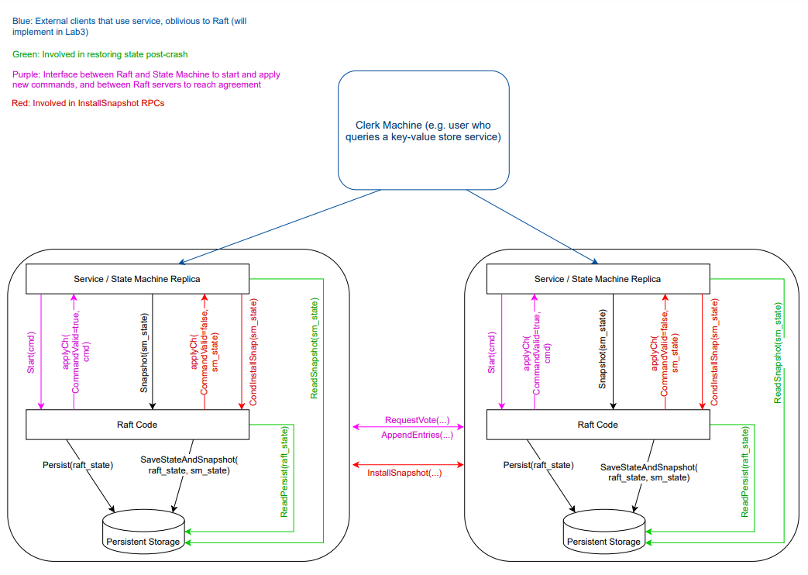

# 实验介绍

在 Raft 系列实验中你将建立一个可容错的键值存储系统。在这个实验中，你将实现 Raft。在下一个实验中，你将在 Raft 的基础上建立一个键值服务。然后你还要实现分片（shard）功能以获得更高的性能。

复制服务通过在多个复制服务器上存储其状态（即数据）的完整副本来实现容错。复制允许服务它的一些服务器出现故障（崩溃或网络故障或不稳定）继续运行。这个的挑战在于故障可能导致副本持有不同的数据副本。

关于 Raft 的介绍请看课程和论文，本实验不需要实现成员变更。

实验提供了一个 [Raft 交互图](https://pdos.csail.mit.edu/6.824/notes/raft_diagram.pdf)，可以帮助理解你的 Raft 代码如何与上面的层互动。



本次实验分四部分完成。


---

# Getting Started

如果您已经完成了实验 1（MapReduce），那么您已经有了一份实验源代码。如果没有，您可以在实验 1 说明中找到通过 git 获取源代码的指导。

我们为您提供了框架代码 `src/raft/raft.go`。我们还提供了一组测试，您应该使用这些测试来推动您实现，并且我们将使用这些测试来对您提交的实验进行评分。测试在 `src/raft/test_test.go` 中。

同实验 1 一样，建议使用 -race 测试。你可以像如下一样测试运行：

```bash
$ cd ~/6.824
$ git pull
...
$ cd src/raft
$ go test
Test (2A): initial election ...
--- FAIL: TestInitialElection2A (5.04s)
        config.go:326: expected one leader, got none
Test (2A): election after network failure ...
--- FAIL: TestReElection2A (5.03s)
        config.go:326: expected one leader, got none
...
$
```


---

# 代码

## 实现框架

通过向 `raft/raft.go` 添加代码来实现 Raft。在该文件中，您可以找到框架代码，以及如何发送和接收 RPC 的示例。

您的实现必须支持以下接口，测试人员和（最终）您的键/值服务器将使用这些接口。你可以在 raft.go 的注释中找到更多细节。

```go
// create a new Raft server instance:
rf := Make(peers, me, persister, applyCh)

// start agreement on a new log entry:
rf.Start(command interface{}) (index, term, isleader)

// ask a Raft for its current term, and whether it thinks it is leader
rf.GetState() (term, isLeader)

// each time a new entry is committed to the log, each Raft peer
// should send an ApplyMsg to the service (or tester).
type ApplyMsg
```

服务调用 Make(peers，me，…) 来创建 Raft 成员列表。peers 参数是 Raft 成员列表（包括自己）的网络标识符的数组，用于 RPC。me 参数自己在 Raft 成员的索引。

```go
func Make(peers []*labrpc.ClientEnd, me int, persister *Persister, applyCh chan ApplyMsg) *Raft {
	rf := &Raft{}
	rf.peers = peers
	rf.persister = persister
	rf.me = me

	// Your initialization code here (2A, 2B, 2C).

	// initialize from state persisted before a crash
	rf.readPersist(persister.ReadRaftState())

	// start ticker goroutine to start elections
	go rf.ticker()

	return rf
}
```

每个 Raft 成员结构如下：

```go
type Raft struct {
	mu        sync.Mutex          // Lock to protect shared access to this peer's state
	peers     []*labrpc.ClientEnd // RPC end points of all peers
	persister *Persister          // Object to hold this peer's persisted state
	me        int                 // this peer's index into peers[]
	dead      int32               // set by Kill()

	// Your data here (2A, 2B, 2C).
	// Look at the paper's Figure 2 for a description of what
	// state a Raft server must maintain.

}
```

通信使用 `*labrpc.ClientEnd` 类型提供的一系列方法

```go
type ClientEnd struct {
	endname interface{}   // this end-point's name
	ch      chan reqMsg   // copy of Network.endCh
	done    chan struct{} // closed when Network is cleaned up
}
```

ticker 方法在检测到心跳超时后开始选举。

```go
func (rf *Raft) ticker() {
	for rf.killed() == false {

		// Your code here to check if a leader election should
		// be started and to randomize sleeping time using
		// time.Sleep().

	}
}
```

>[!TIP]
>
>每次测试后不会停止由 Raft 创建的 goroutines，但会调用 Kill() 方法。长期运行的 goroutine 会占用内存，可能会占用 CPU 时间，也许会导致后来的测试失败，并产生混乱的调试输出。任何具有长期运行循环的 goroutine 应该调用 kill() 来检查它是否应该停止。

```go
func (rf *Raft) Kill() {
	atomic.StoreInt32(&rf.dead, 1)
	// Your code here, if desired.
}

func (rf *Raft) killed() bool {
	z := atomic.LoadInt32(&rf.dead)
	return z == 1
}
```

Start(command) 要求 Raft 开始处理客户端消息，将命令附加到复制日志中。Start() 应该立即返回，而不需要等待日志追加完成。该服务希望你的实现为每个新提交的日志条目发送一个 ApplyMsg 到 Make() 的 applyCh 通道参数。

```go
func (rf *Raft) Start(command interface{}) (int, int, bool) {
	index := -1
	term := -1
	isLeader := true

	// Your code here (2B).


	return index, term, isLeader
}
```

raft.go 包含发送 RPC（sendRequestVote）和处理传入 RPC（RequestVote）的示例代码，相信做过实验 1 之后你对这个格式不陌生了，对于 Raft 有两种消息类型，这是其中一种。

```go
type RequestVoteArgs struct {
	// Your data here (2A, 2B).
}

type RequestVoteReply struct {
	// Your data here (2A).
}

func (rf *Raft) RequestVote(args *RequestVoteArgs, reply *RequestVoteReply) {
	// Your code here (2A, 2B).
}

func (rf *Raft) sendRequestVote(server int, args *RequestVoteArgs, reply *RequestVoteReply) bool {
	ok := rf.peers[server].Call("Raft.RequestVote", args, reply)
	return ok
}
```

Raft RPC 通信应该使用 labrpc Go 包（源代码在 src/labrpc 中）。测试人员可以告诉 labrpc 延迟 RPC，重新排序，并丢弃它们以模拟各种网络故障。虽然你可以临时修改 labrpc，但要确保你的 Raft 与原始的 labrpc 一起工作，因为我们将用它来测试和评定。你的 Raft 实例必须只通过 RPC 互动；例如，它们不允许使用共享的 Go 变量或文件进行通信。

GetState 接口返回 currentTerm 以及该服务器是否认为自己是领导者。

```go
func (rf *Raft) GetState() (int, bool) {

	var term int
	var isleader bool
	// Your code here (2A).
	return term, isleader
}
```

另外还有几个接口是来实现持久化和快照的，后面做实验的时候再讲。


## 总结

有关 go 实现 raft 的种种坑，可以首先参考 6.824 课程对 [locking](https://pdos.csail.mit.edu/6.824/labs/raft-locking.txt) 和 [structure](https://pdos.csail.mit.edu/6.824/labs/raft-structure.txt) 的描述，然后再参考 6.824 的 [guidance](https://thesquareplanet.com/blog/students-guide-to-raft/) 。写之前一定要看看这三篇博客，否则很容易被 bug 包围。

后面的实验建立在本实验的基础上，因此给自己足够的时间来编写可靠的代码非常重要。

