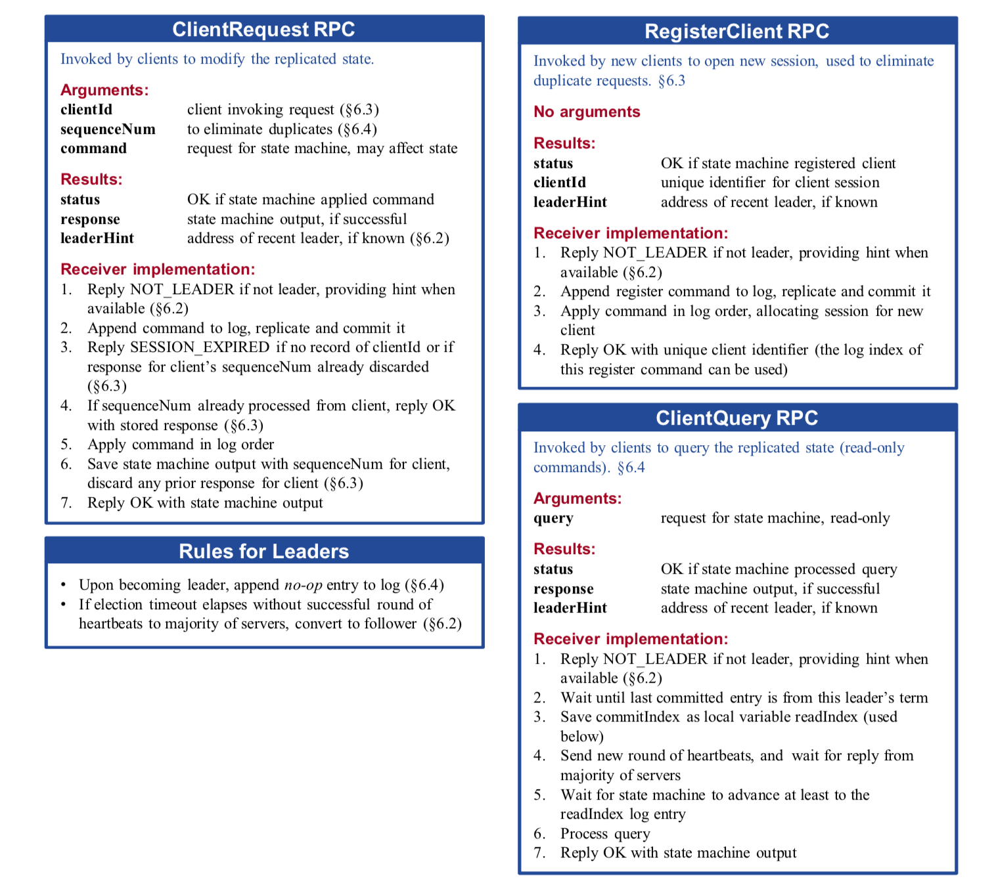

# 实验介绍

在本实验中，你将使用 Lab 2 中的 Raft 库来构建一个可容错的键值存储服务。客户端可以向服务发送三种不同的 RPC：

-   Put(key, value)：替换数据库中某个特定键的值
-   Append(key，arg)：将 arg 附加到键的值上
-   Get(key)：获取键的当前值

键和值都是字符串。对于一个不存在的键，Get 应该返回一个空字符串。对一个不存在的键的 Append 应该像 Put 一样操作。

每个客户端通过一个带有 Put/Append/Get 方法的 Clerk 与服务器通信，Clerk 负责管理与服务器的 RPC 交互。

服务要求是线性一致的。例如，如果一个客户端从服务中获得了一个更新请求的成功响应，那么随后从其他客户端发起的读取就能保证看到该更新的效果。

本实验有两部分。在 A 部分，您将使用您的 Raft 实现实现一个键/值服务，但不使用快照。在 B 部分中，您将使用 Lab 2D 中的快照实现，这将使 Raft 能够丢弃旧的日志条目。


---

# Getting Started

我们在 src/kvraft 中为你提供了骨架代码和测试。你将需要修改 kvraft/client.go，kvraft/server.go，也许还有 kvraft/common.go。

为了启动和运行，执行以下命令。

```bash
$ cd ~/6.824
$ git pull
...
$ cd src/kvraft
$ go test -race
...
$
```


---

# Part A: Key/value service without snapshots

你的每个键/值服务器（"kvservers"）将有一个相关的 Raft peer。Clerks 将 Put、Append 和 Get RPCs 发送到 Raft Leader 的 kvserver。kvserver 代码将 Put/Append/Get 操作提交给 Raft，这样 Raft 日志就持有一连串的 Put/Append/Get 操作。所有的 kvserver 按顺序执行 Raft 日志中的操作，将这些操作应用到他们的键/值数据库中；目的是让服务器保持相同的键/值数据库副本。

Clerk 有时不知道哪个 kvserver 是 Raft 的领导者。如果 Clerk 向错误的 kvserver 发送 RPC，或者无法到达该 kvserver，Clerk 应该通过向不同的 kvserver 发送来重新尝试。如果键/值服务将操作提交给它的 Raft 日志（并因此将操作应用于键/值状态机），领导者通过响应它的 RPC 将结果报告给 Clerk。如果操作未能提交（例如，如果领导者被替换了），服务器会报告一个错误，Clerk 会用另一个服务器重试。

你的 kvservers 不应该直接交流，它们应该只通过 Raft 进行相互交流。

实验任务 1：首先实现不丢失消息以及没有失败的服务器场景下的解决方案。你需要为 client.go 中的 Clerk Put/Append/Get 方法添加 RPC 发送代码，并在 server.go 中实现 PutAppend() 和 Get() RPC 处理程序。这些处理程序应使用 Start() 在 Raft 日志中输入一个Op；你应在 server.go 中填写 Op 结构定义，使其描述一个 Put/Append/Get 操作。每个服务器应该在 Raft 提交 Op 命令时执行这些命令，也就是说，当它们出现在 applyCh 上时。RPC 处理程序应该注意到 Raft 何时提交其 Op，然后回复 RPC。

>[!TIP]
>
>- After calling `Start()`, your kvservers will need to wait for Raft to complete agreement. Commands that have been agreed upon arrive on the `applyCh`. Your code will need to keep reading `applyCh` while `PutAppend()` and `Get()` handlers submit commands to the Raft log using `Start()`. Beware of deadlock between the kvserver and its Raft library.
>- You are allowed to add fields to the Raft `ApplyMsg`, and to add fields to Raft RPCs such as `AppendEntries`, however this should not be necessary for most implementations.
>- A kvserver should not complete a `Get()` RPC if it is not part of a majority (so that it does not serve stale data). A simple solution is to enter every `Get()` (as well as each `Put()` and `Append()`) in the Raft log. You don't have to implement the optimization for read-only operations that is described in Section 8.
>- It's best to add locking from the start because the need to avoid deadlocks sometimes affects overall code design. Check that your code is race-free using `go test -race`.

现在你应该修改你的解决方案，以便在面对网络和服务器故障时能够继续下去。你将面临的一个问题是，Clerk 可能要多次发送 RPC，直到它找到一个积极回复的 kvserver。如果一个领导者在向 Raft 日志提交条目后发生故障，Clerk 可能不会收到回复，因此可能会向另一个领导者重新发送请求。对 Clerk.Put() 或 Clerk.Append() 的每次调用应该只导致一次执行，所以你必须确保重新发送不会导致服务器执行两次请求。

实验任务 2：添加代码来处理失败，以及处理重复的请求。

>[!TIP]
>
>- Your solution needs to handle a leader that has called Start() for a Clerk's RPC, but loses its leadership before the request is committed to the log. In this case you should arrange for the Clerk to re-send the request to other servers until it finds the new leader. One way to do this is for the server to detect that it has lost leadership, by noticing that a different request has appeared at the index returned by Start(), or that Raft's term has changed. If the ex-leader is partitioned by itself, it won't know about new leaders; but any client in the same partition won't be able to talk to a new leader either, so it's OK in this case for the server and client to wait indefinitely until the partition heals.
>- You will probably have to modify your Clerk to remember which server turned out to be the leader for the last RPC, and send the next RPC to that server first. This will avoid wasting time searching for the leader on every RPC, which may help you pass some of the tests quickly enough.
>- You will need to uniquely identify client operations to ensure that the key/value service executes each one just once.
>- Your scheme for duplicate detection should free server memory quickly, for example by having each RPC imply that the client has seen the reply for its previous RPC. It's OK to assume that a client will make only one call into a Clerk at a time.

你的代码应该通过 go test -run 3A -race 测试。

```bash
$ go test -run 3A -race
Test: one client (3A) ...
  ... Passed --  15.5  5  4576  903
Test: ops complete fast enough (3A) ...
  ... Passed --  15.7  3  3022    0
Test: many clients (3A) ...
  ... Passed --  15.9  5  5884 1160
Test: unreliable net, many clients (3A) ...
  ... Passed --  19.2  5  3083  441
Test: concurrent append to same key, unreliable (3A) ...
  ... Passed --   2.5  3   218   52
Test: progress in majority (3A) ...
  ... Passed --   1.7  5   103    2
Test: no progress in minority (3A) ...
  ... Passed --   1.0  5   102    3
Test: completion after heal (3A) ...
  ... Passed --   1.2  5    70    3
Test: partitions, one client (3A) ...
  ... Passed --  23.8  5  4501  765
Test: partitions, many clients (3A) ...
  ... Passed --  23.5  5  5692  974
Test: restarts, one client (3A) ...
  ... Passed --  22.2  5  4721  908
Test: restarts, many clients (3A) ...
  ... Passed --  22.5  5  5490 1033
Test: unreliable net, restarts, many clients (3A) ...
  ... Passed --  26.5  5  3532  474
Test: restarts, partitions, many clients (3A) ...
  ... Passed --  29.7  5  6122 1060
Test: unreliable net, restarts, partitions, many clients (3A) ...
  ... Passed --  32.9  5  2967  317
Test: unreliable net, restarts, partitions, random keys, many clients (3A) ...
  ... Passed --  35.0  7  8249  746
PASS
ok  	6.824/kvraft	290.184s
```

每个 Passed 后面的数字是实时时间（秒）、peer 数量、发送的 RPC 数量（包括客户端 RPC）和执行的键/值操作数量（Clark Get/Put/Append 调用）。


# Part B: Key/value service with snapshots

目前的情况是，你的键/值服务器不调用你的 Raft 库的 Snapshot() 方法，所以重新启动的服务器必须重放完整的持久 Raft 日志以恢复它的状态。现在，您将使用 lab 2D 的 Snapshot() 来修改 kvserver，使其与 Raft 协作以节省日志空间，并减少重启时间。

测试人员将 maxraftstate 传递给 StartKVServer()。maxraftstate 以字节表示持久 Raft 状态的最大允许大小（包括日志，但不包括快照）。您应该将 maxraftstate 与 persister.RaftStateSize() 进行比较。每当您的键/值服务器检测到 Raft 状态大小接近这个阈值时，它应该通过调用 Raft 的快照来保存快照。如果 maxraftstate 为 -1，则不必拍摄快照。maxraftstate 应用于 Raft 传递给 persister.SaveRaftState()

实验任务：修改您的 kvserver，使其能够检测持续的 Raft 状态何时变得过大，然后将快照传递给 Raft。当 kvserver 服务器重新启动时，它应该从 persister 中读取快照，并从快照中恢复其状态。

>[!TIP]
>
>- Think about when a kvserver should snapshot its state and what should be included in the snapshot. Raft stores each snapshot in the persister object using `SaveStateAndSnapshot()`, along with corresponding Raft state. You can read the latest stored snapshot using `ReadSnapshot()`.
>- Your kvserver must be able to detect duplicated operations in the log across checkpoints, so any state you are using to detect them must be included in the snapshots.
>- Capitalize all fields of structures stored in the snapshot.
>- You may have bugs in your Raft library that this lab exposes. If you make changes to your Raft implementation make sure it continues to pass all of the Lab 2 tests.
>- A reasonable amount of time to take for the Lab 3 tests is 400 seconds of real time and 700 seconds of CPU time. Further, `go test -run TestSnapshotSize` should take less than 20 seconds of real time.

您的代码应该通过 3B 测试以及 3A 测试（并且您的 Raft 必须继续通过 lab2 测试）

```bash
$ go test -run 3B -race
Test: InstallSnapshot RPC (3B) ...
  ... Passed --   4.0  3   289   63
Test: snapshot size is reasonable (3B) ...
  ... Passed --   2.6  3  2418  800
Test: ops complete fast enough (3B) ...
  ... Passed --   3.2  3  3025    0
Test: restarts, snapshots, one client (3B) ...
  ... Passed --  21.9  5 29266 5820
Test: restarts, snapshots, many clients (3B) ...
  ... Passed --  21.5  5 33115 6420
Test: unreliable net, snapshots, many clients (3B) ...
  ... Passed --  17.4  5  3233  482
Test: unreliable net, restarts, snapshots, many clients (3B) ...
  ... Passed --  22.7  5  3337  471
Test: unreliable net, restarts, partitions, snapshots, many clients (3B) ...
  ... Passed --  30.4  5  2725  274
Test: unreliable net, restarts, partitions, snapshots, random keys, many clients (3B) ...
  ... Passed --  37.7  7  8378  681
PASS
ok  	6.824/kvraft	161.538s
```


---

# 设计思路

## 论文消息体设计

raft 的博士毕业论文里对 client 的设计讲的会比较详细一些，首先它像之前一样列出了实现的 RPC：



客户端调用 ClientRequest RPC 来修改状态；他们调用 ClientQuery RPC 来查询状态。新的客户端使用 RegisterClient RPC 接收其客户端标识符。在该图中，非领导者的服务器将客户端重定向到领导者。

**ClientRequest RPC**

| 参数        | 解释                         |
| ----------- | ---------------------------- |
| clientId    | 客户端标识                   |
| sequenceNum | 消除重复的请求               |
| command     | 状态机的请求，可能会影响状态 |

| 返回值     | 解释                               |
| ---------- | ---------------------------------- |
| status     | 如果状态机应用了命令返回 OK        |
| response   | 状态机的输出，如果成功的话         |
| leaderHint | 如果知道的话返回最近的 leader 地址 |

接收者的实现：

1.  如果不是领导者，则回复 NOT_LEADER，在有条件的情况下提供提示 (6.2)
2.  追加命令到日志，复制并提交
3.  如果没有 clientId 的记录，或者如果客户的 sequenceNum 的响应已经被丢弃，则回复 SESSION_EXPIRED（6.3）
4.  如果客户端 sequenceNum 的请求已经处理了，返回 OK（6.3）
5.  顺序 apply 日志
6.  保留客户端 sequenceNum 状态机的输出，忽略客户端之前发来的请求
7.  携带状态机的输出返回 OK

**ClientQuery RPC**

| 参数  | 解释     |
| ----- | -------- |
| query | 查询请求 |

| 返回值     | 解释                               |
| ---------- | ---------------------------------- |
| status     | 如果状态机处理了请求返回 OK        |
| response   | 状态机的输出，如果成功的话         |
| leaderHint | 如果知道的话返回最近的 leader 地址 |

接收者的实现：

1.  如果不是领导者，则回复 NOT_LEADER，在有条件的情况下提供提示 (6.2)
2.  等待最后一条提交日志的任期是当前 leader 的任期
3.  保存 commitIndex 作为本地只读变量（下面要用）
4.  发送新一轮的心跳，等待大多数节点回复
5.  等待状态机至少前进到当前要读的日志索引
6.  处理
7.  回复 OK

**RegisterClient RPC**

| 参数 | 解释 |
| ---- | ---- |
| 无   |      |

| 返回值     | 解释                               |
| ---------- | ---------------------------------- |
| status     | 如果状态机处理了请求返回 OK        |
| clientId   | 客户端标识                         |
| leaderHint | 如果知道的话返回最近的 leader 地址 |

接收者的实现：

1.  如果不是领导者，则回复 NOT_LEADER，在有条件的情况下提供提示 (6.2)
2.  追加注册命令到日志，复制并提交
3.  顺序 apply 日志，分配客户端 session
4.  回复 OK，返回唯一标识符（可以使用日志索引号）


## raft 速度问题

之前实现的 raft 虽然正确性没问题，但是 apply 速度很慢，原因就在于提交慢了，后面增加了复制日志成功后更新 matchIndex 时也更新 commitIndex ，这样更新会比较及时。为什么心跳检查提交还保留呢？假设某个 leader 把日志复制给了大多数就故障了，然后期间没有提交日志，它又竞选成功，此时就没有方法去触发 commitIndex 的更新了。

另外 apply 索引排序也优化了下，之前简单使用了冒泡排序，不过测试下来好像没啥大影响；另外这里其实可以不用排序，交给上层去处理也是没问题的，我只是觉得排序了对上层逻辑更清晰简单一些。

3A 的速度测试是一个请求一个请求的发，收到回复再发下一个，对于之前的设计，满足阈值的条目数会立刻发送，否则等待心跳发送日志，之前心跳设置的 100 ms，那么相当于一秒就复制 10 条日志，满足不了测试要求，因此调整阈值为 1 表示收到请求立即复制来满足测试要求。


