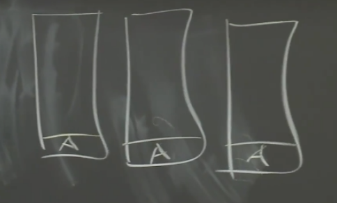
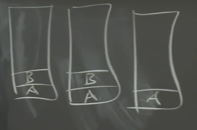
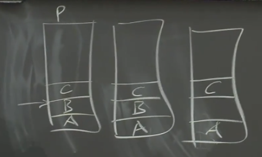
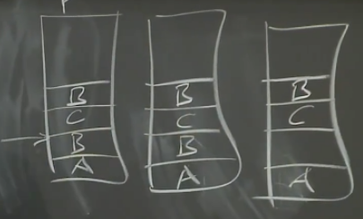
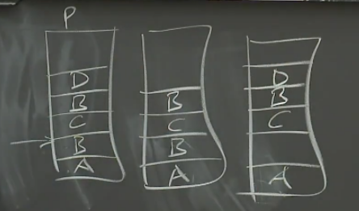

# 分布式存储系统的难点

今天我们讨论一下 GFS，也就是 The Google File System 这篇论文。这门课程的主要内容是大型存储，而 GFS 正是这门课里有关如何构建大型存储系统的众多案例学习的第一篇。

之所以要说存储，原因是，存储是一种关键的抽象。你可以想象，在分布式系统中，可能有各种各样重要的抽象可以应用在分布式系统中，但是实际上，简单的存储接口往往非常有用且极其通用。所以，构建分布式系统大多都是关于如何设计存储系统，或是设计其它基于大型分布式存储的系统。所以我们会更加关注如何为大型分布式存储系统设计一个优秀的接口，以及如何设计存储系统的内部结构，这样系统才能良好运行。通过阅读 GFS 论文，我们可以开始了解到这是怎么做到的。

同时，GFS 论文也涉及到很多本课程常出现的话题，例如并行性能、容错、复制和一致性。论文的内容也较为直观，容易理解。论文本身也是一篇优秀的系统论文，它从硬件到使用了 GFS 的软件都有讨论，并且它也是一个成功的现实世界的设计。尽管这是在学术会议上发表的学术论文，但是文章里介绍的东西（GFS）也相当成功，并且在现实世界中使用了相当长的时间。所以，我们知道，我们今天讨论的是一个非常好的且有用的设计。

在讨论 GFS 之前，我想聊一聊关于分布式存储系统，做一些背景介绍。

首先为什么分布式存储系统会如此之难，以至于你需要做大量的工作才能让它正确工作？我们从一个特殊的角度来理解，在这门课程的后面，这种理解角度也会出现。

人们设计大型分布式系统或大型存储系统出发点通常是，他们想获取巨大的性能加成，进而利用数百台计算机的资源来同时完成大量工作。因此，性能问题就成为了最初的诉求。 之后，很自然的想法就是将数据分割放到大量的服务器上，这样就可以并行的从多台服务器读取数据。我们将这种方式称之为分片（Sharding）。

如果你在成百上千台服务器进行分片，你将会看见常态的故障。如果你有数千台服务器，那么总是会有一台服务器宕机，每天甚至每个小时都可能会发生错误。所以，我们需要自动化的方法而不是人工介入来修复错误。我们需要一个自动的容错系统，这就引出了容错这个话题（fault tolerance）。

实现容错最有用的一种方法是使用复制，只需要维护 2-3 个数据的副本，当其中一个故障了，你就可以使用另一个。所以，如果想要容错能力，就得有复制（replication）。

如果有复制，那就有了两份数据的副本。可以确定的是，如果你不小心，它们就会不一致。所以，你本来设想的是，有了两个数据副本，你可以任意使用其中一个副本来容错。但是如果你不够小心，两个数据的副本就不是完全一致，严格来说，它们就不再互为副本了。而你获取到的数据内容也将取决于你向哪个副本请求数据。这对于应用程序来说就有些麻烦了。所以，如果我们有了复制，我们就有不一致的问题（inconsistency）。

通过聪明的设计，你可以避免不一致的问题，并且让数据看起来也表现的符合预期。但是为了达到这样的效果，你总是需要额外的工作，需要不同服务器之间通过网络额外的交互，而这样的交互会降低性能。所以如果你想要一致性，你的代价就是低性能。但这明显不是我们最开始所希望的。

当然，这里并不是绝对的。你可以构建性能很高的系统，但是不可避免的，都会陷入到这里的循环来。现实中，如果你想要好的一致性，你就要付出相应的代价。如果你不想付出代价，那就要忍受一些不确定的行为。我们之后会在很多系统中看到这里介绍的循环。通常，人们很少会乐意为好的一致性付出相应的性能代价。

---

# 错误的设计

这里说到了一致性，我在后面的课程会对好的一致性做更多的介绍。对于具备强一致或者好的一致性的系统，从应用程序或者客户端看起来就像是和一台服务器在通信。尽管我们会通过数百台计算机构建一个系统，但是对于一个理想的强一致模型，你看到的就像是只有一台服务器，一份数据，并且系统一次只做一件事情。这是一种直观的理解强一致的方式。你可以认为只有一台服务器，甚至这个服务器只运行单线程，它同一时间只处理来自客户端的一个请求。这很重要，因为可能会有大量的客户端并发的发送请求到服务器上。这里要求服务器从请求中挑选一个出来先执行，执行完成之后再执行下一个。

对于存储服务器来说，它上面会有一块磁盘。执行一个写请求或许意味着向磁盘写入一个数据或者对数据做一次自增。如果这是一次修改操作，并且我们有一个以 key-value 为索引的数据表单，那么我们会修改这个表单。如果是一次读取操作，我们只需要将之前写入的数据，从表单中取出即可。

为了让这里的简单服务有可预期的行为，需要定义一条规则：一个时间只执行一条请求。这样每个请求都可以看到之前所有请求按照顺序执行生成的数据。所以，如果有一些写请求，并且服务器以某种顺序一次一个的处理了它们，当你从服务器读数据时，你可以看到期望的数据。这里的解释不是很直观，你可以通过下面的例子去理解。

例如，我们有一些客户端，客户端 C1 发起写请求将 X 设置成 1。在同一时刻，客户端 C2 发起写请求将 X 设置成 2。

过了一会，在 C1 和 C2 的写请求都执行完毕之后，客户端 C3 会发送读取 X 的请求，并得到了一个结果。客户端 C4 也会发送读取 X 的请求，也得到了一个结果。现在的问题是，这两个客户端看到的结果是什么？

> 学生提问：为什么一定要一次只处理一个请求？
>
> Robert教授：这是个好问题。在这里，我假设 C1 和 C2 在同一时间发起请求。所以，如果我们在监控网络的话，我们可以看到两个请求同时发往服务器。之后在某个时刻，服务器会响应它们。但是这里没有足够的信息来判断，服务器会以哪种顺序执行这两个写请求。如果服务器先处理了写 X 为 1 的请求，那么就意味着它接下来会处理写 X 为 2 的请求，所以接下来的读 X 请求可以看到 2。然而，如果服务器先处理了写 X 为 2 的请求，再处理写 X 为 1 的请求，那么接下来的读 X 请求看到的就是 1。

我这里提出这个场景的目的是为了展示，即使在一个非常简单的系统中，仍然会出现一些模糊的场景使得你不知道系统的执行过程以及输出结果。你能做的只是从产生的结果来判断系统的输出是一致性还是非一致性。

如果 C3 读 X 得到 2，那么 C4 最好也是读 X 得到 2，因为在我们的例子中，C3 读 X 得到 2 意味着，写 X 为 2 的请求必然是第二个执行的写请求。当 C4 读 X 时，写 X 为 2 应该仍然是第二个写请求。希望这里完全直观的介绍清楚了有关强一致的一个模型。

当然，这里的问题是，因为只有单个服务器，所以容错能力很差。如果服务器故障了，磁盘坏了，系统整个就不可用了。所以，在现实世界中，我们会构建多副本的分布式系统，但这却又是所有问题的开始。

这里有一个几乎是最糟糕的多副本设计，我提出它是为了让你们知道问题所在，并且同样的问题在 GFS 中也存在。这个设计是这样，我们有两台服务器，每个服务器都有数据的一份完整拷贝。它们在磁盘上都存储了一个 key-value 表单。当然，直观上我们希望这两个表单是完全一致的，这样，一台服务器故障了，我们可以切换到另一台服务器去做读写。

两个表单完全一致意味着，每一个写请求都必须在两台服务器上执行，而读请求只需要在一台服务器上执行，否则就没有容错性了。因为如果读请求也需要从两台服务器读数据，那么一台服务器故障我们就没法提供服务了。现在问题来了，假设客户端 C1 和 C2 都想执行写请求，其中一个要写 X 为 1，另一个写 X 为 2。C1 会将写 X 为 1 的请求发送个两个服务器，因为我们想要更新两台服务器上的数据。C2 也会将写 X 为 2 的请求发送给两个服务器。

这里会出现什么错误呢？是的，我们没有做任何事情来保障两台服务器以相同的顺序处理这 2 个请求。这个设计真不咋样。如果服务器 1（S1）先处理 C1 的请求，那么在它的表单里面，X 先是 1，之后 S1 看到了来自 C2 的请求，会将自己表单中的 X 覆盖成 2。但是，如果 S2 恰好以不同的顺序收到客户端请求，那么 S2 会先执行 C2 的请求，将 X 设置为 2，之后收到 C1 的请求，将 X 设置为 1。

之后，如果另外一些客户端，假设 C3 从 S1 读数据，C4 从 S2 读数据，我们就会面临一个可怕的场景：这两个客户端读取的数据不一样。但是从前一个例子中的简单模型可以看出，相连的读请求应该读出相同的数据。

这里的问题可以以另一种方式暴露出来。假设我们尝试修复上面的问题，我们让客户端在 S1 还在线的时候，只从 S1 读取数据，S1 不在线了再从 S2 读取数据。这样最开始所有的客户端读 X 都能得到 2。但是突然，如果 S1 故障了，尽管没有写请求将 X 改成 1，客户端读 X 得到的数据将会从 2 变成 1。因为 S1 故障之后，所有的客户端都会切换到 S2 去读数据。这种数据的神奇变化与任何写操作都没有关联，并且也不可能在前一个例子的简单模型中发生。

当然，这里的问题是可以修复的，修复需要服务器之间更多的通信，并且复杂度也会提升。由于获取强一致会带来不可避免的复杂性的提升，有大量的方法可以在好的一致性和一些小瑕疵行为之间追求一个平衡。

---

# GFS的设计目标

让我们来讨论 GFS 吧。GFS 做了很多工作来解决前面提到的问题，虽然不够完美，但是 GFS 已经做的很好了。

GFS 在 2003 年提出，距今已经有很长一段时间了。实际上，在当时，互联网的规模已经很大了，人们也在构建大型网站，在那之前，人们也对分布式系统做了数十年的研究。所以，在当时，至少在学术领域，人们知道如何构建高度并行且具备容错的分布式系统。不过在当时，很少有在工业界能有应用这些学术界思想的例子。大概从 GFS 论文发表的时间起，像 Google 这样的大型网站开始构建严格意义上的分布式系统。这让像我（Robert教授）这样的学术界分子感到非常兴奋，因为终于看到像 Google 这样的拥有大量数据的公司开始实际使用分布式系统。Google 拥有远超过单个磁盘容量的数据，例如从整个互联网爬出来的网页，YouTube 视频，用来构建搜索索引的中间文件，Web 服务器中的大量日志文件等。所以，Google 有大量的数据，需要大量的磁盘来存储这些数据，并且需要能借助 MapReduce 这样的工具来快速处理这些数据。所以，Google 需要能够快速的并行访问这些海量数据。

Google 的目标是构建一个大型的，快速的文件系统。并且这个文件系统是全局有效的，这样各种不同的应用程序都可以从中读取数据。一种构建大型存储系统的方法是针对某个特定的应用程序构建特定的裁剪的存储系统。但是如果另一个应用程序也想要一个大型存储系统，那么又需要重新构建一个存储系统。如果有一个全局通用的存储系统，那就意味着如果我存储了大量从互联网抓取的数据，你也可以通过申请权限来查看这些数据，因为我们都使用了同一个存储系统。这样，任何在 Google 内部的人员都可以根据名字读取这个文件系统（GFS）中可被共享的内容。

为了获得大容量和高速的特性，每个包含了数据的文件会被 GFS 自动的分割并存放在多个服务器之上，这样读写操作自然就会变得很快。因为可以从多个服务器上同时读取同一个文件，进而获得更高的聚合吞吐量。将文件分割存储还可以在存储系统中保存比单个磁盘还要大的文件。

因为我们现在在数百台服务器之上构建存储系统，我们希望有自动的故障修复。我们不希望每次服务器出了故障，派人到机房去修复服务器或者迁移数据。我们希望系统能自动修复自己。

还有一些特征并非是设计目标。比如 GFS 被设计成只在一个数据中心运行，所以这里并没有将副本保存在世界各地，单个 GFS 只存在于单个数据中心的单个机房里。理论上来说，数据的多个副本应该彼此之间隔的远一些，但是实现起来挺难的，所以 GFS 局限在一个数据中心内。

其次，GFS 并不面向普通的用户，这是一个 Google 内部使用的系统，供 Google 的工程师写应用程序使用。所以 Google 并没有售卖GFS，它或许售卖了基于 GFS 的服务，但是 GFS 并不直接面向普通用户。

第三，GFS 在各个方面对大型的顺序文件读写做了定制。在存储系统中有一个完全不同的领域，这个领域只对小份数据进行优化。例如一个银行账户系统就需要一个能够读写 100 字节的数据库，因为 100 字节就可以表示人们的银行账户。但是 GFS 不是这样的系统，GFS 是为 TB 级别的文件而生。并且 GFS 只会顺序处理，不支持随机访问。某种程度上来说，它有点像批处理的风格。GFS 并没有花费过多的精力来降低延迟，它的关注点在于巨大的吞吐量上，所以单次操作都涉及到 MB 级别的数据。

GFS 论文发表在 2003 年的 SOSP 会议上，这是一个有关系统的顶级学术会议。通常来说，这种会议的论文标准是需要有大量的创新研究，但是 GFS 的论文不属于这一类标准。论文中的一些思想在当时都不是特别新颖，比如分布式，分片，容错这些在当时已经知道如何实现了。这篇论文的特点是，它描述了一个真正运行在成百上千台计算机上的系统，这个规模远远超过了学术界建立的系统。并且由于 GFS 被用于工业界，它反映了现实世界的经验，例如对于一个系统来说，怎样才能正常工作，怎样才能节省成本，这些内容也极其有价值。同时，论文也提出了一个当时非常异类的观点：存储系统具有弱一致性也是可以的。当时，学术界的观念认为，存储系统就应该有良好的行为，如果构建了一个会返回错误数据的系统，就像前面介绍的糟糕的多副本系统一样，那还有什么意义？为什么不直接构建一个能返回正确数据的系统？GFS 并不保证返回正确的数据，借助于这一点，GFS 的目标是提供更好的性能。

最后，这篇论文还有一个有意思的事情。在一些学术论文中，你或许可以看到一些容错的，多副本，自动修复的多个 Master 节点共同分担工作，但是 GFS 却宣称使用单个 Master 节点并能够很好的工作。

> 学生提问：如果 GFS 返回错误的数据，会不会影响应用程序？
>
> Robert教授：讽刺的是。有谁关心网上的投票数量是否正确呢，如果你通过搜索引擎做搜索，20000 个搜索结果中丢失了一条或者搜索结果排序是错误的，没有人会注意到这些。这类系统对于错误的接受能力好过类似于银行这样的系统。当然并不意味着所有的网站数据都可以是错误的。如果你通过广告向别人收费，你最好还是保证相应的数字是对的。
>
> 另外，尽管 GFS 可能会返回错误的数据，但是可以在应用程序中做一些补偿。例如论文中提到，应用程序应当对数据做校验，并明确标记数据的边界，这样应用程序在 GFS 返回不正确数据时可以恢复。

---

# GFS Master 节点

接下来看看 GFS 的大致架构，这在论文的图 1 中也有介绍。

假设我们有上百个客户端和一个 Master 节点。尽管实际中可以拿多台机器作为 Master 节点，但是 GFS 中 Master 是 Active-Standby 模式，所以只有一个 Master 节点在工作。Master 节点保存了文件名和存储位置的对应关系。除此之外，还有大量的 Chunk 服务器，可能会有数百个，每一个 Chunk 服务器上都有 1-2 块磁盘。

在这里，Master 节点用来管理文件和 Chunk 的信息，而 Chunk 服务器用来存储实际的数据。这是 GFS 设计中比较好的一面，它将这两类数据的管理问题几乎完全隔离开了，这样这两个问题可以使用独立设计来解决。Master 节点知道每一个文件对应的所有的 Chunk 的 ID，这些 Chunk 每个是 64MB 大小，它们共同构成了一个文件。如果我有一个 1GB 的文件，那么 Master 节点就知道文件的第一个 Chunk 存储在哪，第二个 Chunk 存储在哪，等等。当我想读取这个文件中的任意一个部分时，我需要向 Master 节点查询对应的 Chunk 在哪个服务器上，之后我可以直接从 Chunk 服务器读取对应的 Chunk 数据。

更进一步，我们看一下 GFS 的一致性以及 GFS 是如何处理故障。为了了解这些，我们需要知道 Master 节点内保存的数据内容，这里我们关心的主要是两个表单：

- 第一个是文件名到 Chunk ID 或者 Chunk Handle 数组的对应。这个表单告诉你，文件对应了哪些 Chunk。但是只有 Chunk ID 是做不了太多事情的，所以有了第二个表单。
- 第二个表单记录了 Chunk ID 到 Chunk 数据的对应关系。这里的数据又包括了：
  - 每个 Chunk 存储在哪些服务器上，所以这部分是 Chunk 服务器的列表
  - 每个 Chunk 当前的版本号，所以 Master 节点必须记住每个 Chunk 对应的版本号。
  - 所有对于 Chunk 的写操作都必须在主 Chunk（Primary Chunk）上顺序处理，主 Chunk 是 Chunk 的多个副本之一。所以，Master 节点必须记住哪个 Chunk 服务器持有主 Chunk。
  - 并且，主 Chunk 只能在特定的租约时间内担任主 Chunk，所以，Master 节点要记住主 Chunk 的租约过期时间。

以上数据都存储在内存中，如果 Master 故障了，这些数据就都丢失了。为了能让 Master 重启而不丢失数据，Master 节点会同时将数据存储在磁盘上。所以 Master 节点读数据只会从内存读，但是写数据的时候，至少有一部分数据会接入到磁盘中。更具体来说，Master 会在磁盘上存储 log，每次有数据变更时，Master 会在磁盘的 log 中追加一条记录，并生成 CheckPoint（类似于备份点）。

有些数据需要存在磁盘上，而有些不用。它们分别是：

- Chunk Handle 的数组（第一个表单）要保存在磁盘上。我给它标记成 NV（non-volatile, 非易失），这个标记表示对应的数据会写入到磁盘上。
- Chunk 服务器列表不用保存到磁盘上。因为 Master 节点重启之后可以与所有的 Chunk 服务器通信，并查询每个 Chunk 服务器存储了哪些 Chunk，所以我认为它不用写入磁盘。所以这里标记成 V（volatile），
- 版本号要不要写入磁盘取决于 GFS 是如何工作的，我认为它需要写入磁盘。我们之后在讨论系统是如何工作的时候再详细讨论这个问题。这里先标记成 NV。
- 主 Chunk 的 ID，几乎可以确定不用写入磁盘，因为 Master 节点重启之后会忘记谁是主 Chunk，它只需要等待 60 秒租约到期，那么它知道对于这个 Chunk 来说没有主 Chunk，这个时候，Master 节点可以安全指定一个新的主 Chunk。所以这里标记成 V。
- 类似的，租约过期时间也不用写入磁盘，所以这里标记成 V。

任何时候，如果文件扩展到达了一个新的 64MB，需要新增一个 Chunk 或者由于指定了新的主 Chunk 而导致版本号更新了，Master 节点需要向磁盘中的 Log 追加一条记录说，我刚刚向这个文件添加了一个新的 Chunk 或者我刚刚修改了 Chunk 的版本号。所以每次有这样的更新，都需要写磁盘。GFS 论文并没有讨论这么多细节，但是因为写磁盘的速度是有限的，写磁盘会导致 Master 节点的更新速度也是有限的，所以要尽可能少的写入数据到磁盘。

这里在磁盘中维护 log 而不是数据库的原因是，数据库本质上来说是某种 B 树（b-tree）或者 hash table，相比之下，追加 log 会非常的高效，因为你可以将最近的多个 log 记录一次性的写入磁盘。因为这些数据都是向同一个地址追加，这样只需要等待磁盘的磁碟旋转一次。而对于 B 树来说，每一份数据都需要在磁盘中随机找个位置写入。所以使用 Log 可以使得磁盘写入更快一些。

当 Master 节点故障重启，并重建它的状态，你不会想要从 log 的最开始重建状态，因为 log 的最开始可能是几年之前，所以 Master 节点会在磁盘中创建一些 checkpoint 点，这可能要花费几秒甚至一分钟。这样 Master 节点重启时，会从 log 中的最近一个 checkpoint 开始恢复，再逐条执行从 Checkpoint 开始的 log，最后恢复自己的状态。

---

# GFS读文件

有了之前的基础，我接下来会列出 GFS 读和写的步骤，最后，我会介绍出现故障之后，系统是如何保持正确的行为。

对于读请求来说，意味着应用程序或者 GFS 客户端有一个文件名和它想从文件的某个位置读取的偏移量（offset），应用程序会将这些信息发送给 Master 节点。Master 节点会从自己的 file 表单中查询文件名，得到 Chunk ID 的数组。因为每个 Chunk 是 64MB，所以偏移量除以 64MB 就可以从数组中得到对应的 Chunk ID。之后 Master 再从 Chunk 表单中找到存有 Chunk 的服务器列表，并将列表返回给客户端。所以，第一步是客户端（或者应用程序）将文件名和偏移量发送给 Master。第二步，Master 节点将 Chunk Handle（也就是 ID，记为 H）和服务器列表发送给客户端。

现在客户端可以从这些 Chunk 服务器中挑选一个来读取数据。GFS 论文说，客户端会选择一个网络上最近的服务器（Google 的数据中心中，IP 地址是连续的，所以可以从 IP 地址的差异判断网络位置的远近），并将读请求发送到那个服务器。因为客户端每次可能只读取 1MB 或者 64KB 数据，所以，客户端可能会连续多次读取同一个 Chunk 的不同位置。所以，客户端会缓存 Chunk 和服务器的对应关系，这样，当再次读取相同 Chunk 数据时，就不用一次次的去向 Master 请求相同的信息。

接下来，客户端会与选出的 Chunk 服务器通信，将 Chunk Handle 和偏移量发送给那个 Chunk 服务器。Chunk 服务器会在本地的硬盘上，将每个 Chunk 存储成独立的 Linux 文件，并通过普通的 Linux 文件系统管理。并且可以推测，Chunk 文件会按照 Handle（也就是ID）命名。所以，Chunk 服务器需要做的就是根据文件名找到对应的 Chunk 文件，之后从文件中读取对应的数据段，并将数据返回给客户端。

> 学生提问：可以再讲一下第一步吗？
>
> Robert教授：第一步是，应用程序想读取某个特定文件的某个特定的偏移位置上的某段特定长度的数据，比如说第 1000 到第 2000 个字节的数据。所以，应用程序将文件名，长度和起始位置发送给 Master 节点。Master 节点会从其 file 表单中查询文件名并找到包含这个数据段的 Chunk，这样可以吗？

> 学生提问：如果读取的数据超过了一个 Chunk 怎么办？
>
> Robert教授：我不知道详细的细节。我的印象是，如果应用程序想要读取超过 64MB 的数据，或者就是 2 个字节，但是却跨越了 Chunk 的边界，应用程序会通过一个库来向 GFS 发送 RPC，而这个库会注意到这次读请求会跨越 Chunk 边界，因此会将一个读请求拆分成两个读请求再发送到 Master 节点。所以，这里可能是向 Master 节点发送两次读请求，得到了两个结果，之后再向两个不同的 Chunk 服务器读取数据。

> 学生提问：如果客户端有偏移量信息，那可以直接算出来是第几个 Chunk 吧？
>
> Robert教授：客户端可以算出来是哪个 Chunk，但是客户端不知道 Chunk 在哪个服务器上。为了获取服务器信息，客户端需要与 Master 交互。我不能保证究竟是在哪里决定的要读取的是第几个 Chunk。但是可以确定的是，Master 节点找到了 Chunk 对应的 ID，并确定了 Chunk 存储在哪个服务器上。

> 学生提问：能再介绍一下读数据跨越了 Chunk 边界的情况吗？
>
> Robert教授：客户端本身依赖了一个 GFS 的库，这个库会注意到读请求跨越了 Chunk 的边界 ，并会将读请求拆分，之后再将它们合并起来。所以这个库会与 Master 节点交互，Master 节点会告诉这个库说 Chunk7 在这个服务器，Chunk8 在那个服务器。之后这个库会说，我需要 Chunk7 的最后两个字节，Chunk8 的头两个字节。GFS 库获取到这些数据之后，会将它们放在一个 buffer 中，再返回给调用库的应用程序。Master 节点会告诉库有关 Chunk 的信息，而 GFS 库可以根据这个信息找到应用程序想要的数据。应用程序只需要确定文件名和数据在整个文件中的偏移量，GFS 库和 Master 节点共同协商将这些信息转换成 Chunk。

> 学生提问：从哪个 Chunk 服务器读取数据重要吗？
>
> Robert教授：是也不是。概念上讲，它们都是副本。实际上，你可能已经注意到，或者我们之前也说过，不同 Chunk 服务器上的数据并不一定完全相同。应用程序应该要能够容忍这种情况。所以，实际上，如果从不同的 Chunk 服务器读取数据，可能会略微不同。GFS 论文提到，客户端会尝试从同一个机架或者同一个交换机上的服务器读取数据。

---

# GFS写文件

GFS 写文件的过程会更加复杂且有趣。从应用程序的角度来看，写文件和读文件的接口是非常类似的，它们都是调用 GFS 的库。写文件是，应用程序会告诉库函数说，我想对这个文件名的文件在这个数据段写入当前存在 buffer 中的数据。让我（Robert 教授）稍微收敛一下，我只想讨论数据的追加。所以我会限制这里的客户端接口，客户端（也就是应用程序）只能说，我想把 buffer 中的数据，追加到这个文件名对应的文件中。这就是 GFS 论文中讨论的记录追加（Record Append）。所以，再次描述一下，对于写文件，客户端会向 Master 节点发送请求说：我想向这个文件名对应的文件追加数据，请告诉我文件中最后一个 Chunk 的位置。

当有多个客户端同时写同一个文件时，一个客户端并不能知道文件究竟有多长。因为如果只有一个客户端在写文件，客户端自己可以记录文件长度，而多个客户端时，一个客户端没法知道其他客户端写了多少。例如，不同客户端写同一份日志文件，没有一个客户端会知道文件究竟有多长，因此也就不知道该往什么样的偏移量，或者说向哪个 Chunk 去追加数据。这个时候，客户端可以向 Master 节点查询哪个 Chunk 服务器保存了文件的最后一个 Chunk。

对于读文件来说，可以从任何最新的 Chunk 副本读取数据，但是对于写文件来说，必须要通过 Chunk 的主副本（Primary Chunk）来写入。对于某个特定的 Chunk 来说，在某一个时间点，Master 不一定指定了 Chunk 的主副本。所以，写文件的时候，需要考虑 Chunk 的主副本不存在的情况。

对于 Master 节点来说，如果发现 Chunk 的主副本不存在，Master 会找出所有存有 Chunk 最新副本的 Chunk 服务器。如果你的一个系统已经运行了很长时间，那么有可能某一个 Chunk 服务器保存的 Chunk 副本是旧的，比如说还是昨天或者上周的。导致这个现象的原因可能是服务器因为宕机而没有收到任何的更新。所以，Master 节点需要能够在 Chunk 的多个副本中识别出，哪些副本是新的，哪些是旧的。所以第一步是，找出新的 Chunk 副本。这一切都是在 Master 节点发生，因为，现在是客户端告诉 Master 节点说要追加某个文件，Master 节点需要告诉客户端向哪个 Chunk 服务器（也就是 Primary Chunk 所在的服务器）去做追加操作。所以，Master 节点的部分工作就是弄清楚在追加文件时，客户端应该与哪个 Chunk 服务器通信。

每个 Chunk 可能同时有多个副本，最新的副本是指，副本中保存的版本号与 Master 中记录的 Chunk 的版本号一致。Chunk 副本中的版本号是由 Master 节点下发的，所以 Master 节点知道，对于一个特定的 Chunk，哪个版本号是最新的。这就是为什么 Chunk 的版本号在 Master 节点上需要保存在磁盘这种非易失的存储中的原因，因为如果版本号在故障重启中丢失，且部分 Chunk 服务器持有旧的 Chunk 副本，这时，Master 是没有办法区分哪个 Chunk 服务器的数据是旧的，哪个 Chunk 服务器的数据是最新的。

> 学生提问：为什么不将所有 Chunk 服务器上保存的最大版本号作为 Chunk 的最新版本号？
>
> Robert教授：当 Master 重启时，无论如何都需要与所有的 Chunk 服务器进行通信，因为 Master 需要确定哪个 Chunk 服务器存了哪个 Chunk。你可能会想到，Master 可以将所有 Chunk 服务器上的 Chunk 版本号汇总，找出里面的最大值作为最新的版本号。如果所有持有 Chunk 的服务器都响应了，那么这种方法是没有问题的。但是存在一种风险，当 Master 节点重启时，可能部分 Chunk 服务器离线或者失联或者自己也在重启，从而不能响应 Master 节点的请求。所以，Master 节点可能只能获取到持有旧副本的 Chunk 服务器的响应，而持有最新副本的 Chunk 服务器还没有完成重启，或者还是离线状态（这个时候 Master 能找到的 Chunk 最大版本明显不对）。
>
> 当 Master 找不到持有最新 Chunk 的服务器时该怎么办？Master 节点会定期与 Chunk 服务器交互来查询它们持有什么样版本的 Chunk。假设 Master 保存的 Chunk 版本是 17，但是又没有找到存储了版本号是 17 的 Chunk 服务器，那么有两种可能：要么 Master 会等待，并不响应客户端的请求；要么会返回给客户端说，我现在还不知道 Chunk 在哪，过会再重试吧。比如说机房电源故障了，所有的服务器都崩溃了，我们正在缓慢的重启。Master 节点和一些 Chunk 服务器可能可以先启动起来，一些 Chunk 服务器可能要5分钟以后才能重启，这种场景下，我们需要等待，甚至可能是永远等待，因为你不会想使用 Chunk 的旧数据。
>
> 所以，总的来说，在重启时，因为 Master 从磁盘存储的数据知道 Chunk 对应的最新版本，Master 节点会整合具有最新版本 Chunk 的服务器。每个 Chunk 服务器会记住本地存储 Chunk 对应的版本号，当 Chunk 服务器向 Master 汇报时，就可以说，我有这个 Chunk 的这个版本。而 Master 节点就可以忽略哪些版本号与已知版本不匹配的 Chunk 服务器。

回到之前的话题，当客户端想要对文件进行追加，但是又不知道文件尾的 Chunk 对应的 Primary 在哪时，Master 会等所有存储了最新 Chunk 版本的服务器集合完成，然后挑选一个作为 Primary，其他的作为 Secondary。之后，Master 会增加版本号，并将版本号写入磁盘，这样就算故障了也不会丢失这个数据。

接下来，Master 节点会向 Primary 和 Secondary 副本对应的服务器发送消息并告诉它们，谁是 Primary，谁是 Secondary，Chunk 的新版本是什么。Primary 和 Secondary 服务器都会将版本号存储在本地的磁盘中。这样，当它们因为电源故障或者其他原因重启时，它们可以向 Master 报告本地保存的 Chunk 的实际版本号。

> 学生提问：如果 Chunk 服务器上报的版本号高于 Master 存储的版本号会怎么样？
>
> Robert教授：这个问题很好。我不知道答案，不过论文中有一些线索。其实刚刚我的介绍有一些错误，我认为你的问题让我明白了一些事情。GFS 论文说，如果 Master 节点重启，并且与 Chunk 服务器交互，同时一个 Chunk 服务器重启，并上报了一个比 Master 记住的版本更高的版本。Master 会认为它在分配新的 Primary 服务器时出现了错误，并且会使用这个更高的版本号来作为 Chunk 的最新版本号。
>
> 当 Master 向 Primary 和 Secondary 发送完消息之后就崩溃了，可能会出现上面这种情况。为了让 Master 能够处理这种情况，Master 在发送完消息之后，需要将 Chunk 的最新版本写入到磁盘中。这里的写入或许需要等到 Primary 和 Secondary 返回确认消息之后。

所以，现在我们有了一个 Primary，它可以接收来自客户端的写请求，并将写请求应用在多个 Chunk 服务器中。之所以要管理 Chunk 的版本号，是因为这样 Master 可以将实际更新 Chunk 的能力转移给 Primary 服务器。并且在将版本号更新到 Primary 和 Secondary 服务器之后，如果 Master 节点故障重启，还是可以在相同的 Primary 和 Secondary 服务器上继续更新 Chunk。

现在，Master 节点通知 Primary 和 Secondary 服务器，你们可以修改这个 Chunk。它还给 Primary 一个租约，这个租约告诉 Primary 说，在接下来的 60 秒中，你将是 Primary，60 秒之后你必须停止成为 Primary。这种机制可以确保我们不会同时有两个 Primary，我们之后会再做讨论。

我们现在来看 GFS 论文的图 2。假设现在 Master 节点告诉客户端谁是 Primary，谁是 Secondary，GFS 提出了一种聪明的方法来实现写请求的执行序列。客户端会将要追加的数据发送给 Primary 和 Secondary 服务器，这些服务器会将数据写入到一个临时位置。所以最开始，这些数据不会追加到文件中。当所有的服务器都返回确认消息说，已经有了要追加的数据，客户端会向 Primary 服务器发送一条消息说，你和所有的 Secondary 服务器都有了要追加的数据，现在我想将这个数据追加到这个文件中。Primary 服务器或许会从大量客户端收到大量的并发请求，Primary 服务器会以某种顺序，一次只执行一个请求。对于每个客户端的追加数据请求（也就是写请求），Primary 会查看当前文件结尾的 Chunk，并确保 Chunk 中有足够的剩余空间，然后将客户端要追加的数据写入 Chunk 的末尾。并且，Primary 会通知所有的 Secondary 服务器也将客户端要追加的数据写入在它们自己存储的 Chunk 末尾。这样，包括 Primary 在内的所有副本，都会收到通知将数据追加在 Chunk 的末尾。

但是对于 Secondary 服务器来说，它们可能可以执行成功，也可能会执行失败，比如说磁盘空间不足，比如说故障了，比如说 Primary 发出的消息网络丢包了。如果 Secondary 实际真的将数据写入到了本地磁盘存储的 Chunk 中，它会回复 yes 给 Primary。如果所有的 Secondary 服务器都成功将数据写入，并将 yes 回复给了 Primary，并且 Primary 也收到了这些回复。Primary 会向客户端返回写入成功。如果至少一个 Secondary 服务器没有回复 Primary，或者回复了，但是内容却是：抱歉，一些不好的事情发生了，比如说磁盘空间不够，或者磁盘故障了，Primary 会向客户端返回写入失败。

GFS 论文说，如果客户端从 Primary 得到写入失败，那么客户端应该重新发起整个追加过程。客户端首先会重新与 Master 交互，找到文件末尾的 Chunk；之后，客户端需要重新发起对于 Primary 和 Secondary 的数据追加操作。

> 学生提问：写文件失败之后 Primary 和 Secondary 服务器上的状态如何恢复？
>
> Robert教授：你的问题是，Primary 告诉所有的副本去执行数据追加操作，某些成功了，某些没成功。如果某些副本没有成功执行，Primary 会回复客户端说执行失败。之后客户端会认为数据没有追加成功。但是实际上，部分副本还是成功将数据追加了。所以现在，一个 Chunk 的部分副本成功完成了数据追加，而另一部分没有成功，这种状态是可接受的，没有什么需要恢复，这就是 GFS 的工作方式。

> 学生提问：写文件失败之后，读 Chunk 数据会有什么不同？
>
> Robert教授：如果写文件失败之后，一个客户端读取相同的 Chunk，客户端可能可以读到追加的数据，也可能读不到，取决于客户端读的是 Chunk 的哪个副本。
>
> 如果一个客户端发送写文件的请求，并且得到了表示成功的回复，那意味着所有的副本都在相同的位置追加了数据。如果客户端收到了表示失败的回复，那么意味着 0 到多个副本实际追加了数据，其他的副本没有追加上数据。所以这时，有些副本会有追加的数据，有些副本没有。这时，取决于你从哪个副本读数据，有可能读到追加的新数据，也有可能读不到。

> 学生提问：可不可以通过版本号来判断副本是否有之前追加的数据？
>
> Robert教授：所有的 Secondary 都有相同的版本号。版本号只会在 Master 指定一个新 Primary 时才会改变。通常只有在原 Primary 发生故障了，才会指定一个新的 Primary。所以，副本（参与写操作的 Primary 和 Secondary）都有相同的版本号，你没法通过版本号来判断它们是否一样，或许它们就是不一样的（取决于数据追加成功与否）。
>
> 这么做的理由是，当 Primary 回复 no 给客户端时，客户端知道写入失败了，之后客户端的 GFS 库会重新发起追加数据的请求，直到最后成功追加数据。成功了之后，追加的数据会在所有的副本中相同位置存在。在那之前，追加的数据只会在部分副本中存在。

> 学生提问：客户端将数据拷贝给多个副本会不会造成瓶颈？
>
> Robert教授：这是一个好问题。考虑到底层网络，写入文件数据的具体传输路径可能会非常重要。当论文第一次提到这一点时，它说客户端会将数据发送给每个副本。实际上，之后，论文又改变了说法，说客户端只会将数据发送给离它最近的副本，之后那个副本会将数据转发到另一个副本，以此类推形成一条链，直到所有的副本都有了数据。这样一条数据传输链可以在数据中心内减少跨交换机传输（否则，所有的数据吞吐都在客户端所在的交换机上）。

> 学生提问：什么时候版本号会增加？
>
> Robert教授：版本号只在 Master 节点认为 Chunk 没有 Primary 时才会增加。在一个正常的流程中，如果对于一个 Chunk 来说，已经存在了 Primary，那么 Master 节点会记住已经有一个 Primary 和一些 Secondary，Master 不会重新选择 Primary，也不会增加版本号。它只会告诉客户端说这是 Primary，并不会变更版本号。

> 学生提问：如果写入数据失败了，不是应该先找到问题在哪再重试吗？
>
> Robert教授：我认为这是个有趣的问题。当 Primary 向客户端返回写入失败时，你或许会认为一定是哪里出错了，在修复之前不应该重试。实际上，就我所知，论文里面在重试追加数据之前没有任何中间操作。因为，错误可能就是网络数据的丢失，这时就没什么好修复的，网络数据丢失了，我们应该重传这条网络数据。客户端重新尝试追加数据可以看做是一种复杂的重传数据的方法。或许对于大多数的错误来说，我们不需要修改任何东西，同样的 Primary，同样的 Secondary，客户端重试一次或许就能正常工作，因为这次网络没有丢包。
>
> 但是如果是某一个 Secondary 服务器出现严重的故障，那问题变得有意思了。我们希望的是，Master 节点能够重新生成 Chunk 对应的服务器列表，将不工作的 Secondary 服务器剔除，再选择一个新的 Primary，并增加版本号。如果这样的话，我们就有了一组新的 Primary，Secondary 和版本号，同时，我们还有一个不太健康的 Secondary，它包含的是旧的副本和旧的版本号，正是因为版本号是旧的，Master 永远也不会认为它拥有新的数据。但是，论文中没有证据证明这些会立即发生。论文里只是说，客户端重试，并且期望之后能正常工作。最终，Master 节点会 ping 所有的 Chunk 服务器，如果 Secondary 服务器挂了，Master 节点可以发现并更新 Primary 和 Secondary 的集合，之后再增加版本号。但是这些都是之后才会发生（而不是立即发生）。

> 学生提问：如果 Master 节点发现 Primary 挂了会怎么办？
>
> Robert教授：可以这么回答这个问题。在某个时间点，Master 指定了一个 Primary，之后 Master 会一直通过定期的 ping 来检查它是否还存活。因为如果它挂了，Master 需要选择一个新的 Primary。Master 发送了一些 ping 给 Primary，并且 Primary 没有回应，你可能会认为 Master 会在那个时间立刻指定一个新的 Primary。但事实是，这是一个错误的想法。为什么是一个错误的想法呢？因为可能是网络的原因导致 ping 没有成功，所以有可能 Primary 还活着，但是网络的原因导致 ping 失败了。但同时，Primary 还可以与客户端交互，如果 Master 为 Chunk 指定了一个新的 Primary，那么就会同时有两个 Primary 处理写请求，这两个 Primary 不知道彼此的存在，会分别处理不同的写请求，最终会导致有两个不同的数据拷贝。这被称为脑裂（split-brain）。
>
> 脑裂是一种非常重要的概念，我们会在之后的课程中再次介绍它，它通常是由网络分区引起的。比如说，Master 无法与 Primary 通信，但是 Primary 又可以与客户端通信，这就是一种网络分区问题。网络故障是这类分布式存储系统中最难处理的问题之一。
>
> 所以，我们想要避免错误的为同一个 Chunk 指定两个 Primary 的可能性。Master 采取的方式是，当指定一个 Primary 时，为它分配一个租约，Primary 只在租约内有效。Master 和 Primary 都会知道并记住租约有多长，当租约过期了，Primary 会停止响应客户端请求，它会忽略或者拒绝客户端请求。因此，如果 Master 不能与 Primary 通信，并且想要指定一个新的 Primary 时，Master 会等到前一个 Primary 的租约到期。这意味着，Master 什么也不会做，只是等待租约到期。租约到期之后，可以确保旧的 Primary 停止了它的角色，这时 Master 可以安全的指定一个新的 Primary 而不用担心出现这种可怕的脑裂的情况。

> 学生提问：为什么立即指定一个新的 Primary 是坏的设计？既然客户端总是先询问 Master 节点，Master 指定完 Primary 之后，将新的 Primary 返回给客户端不行吗？
>
> Robert教授：因为客户端会通过缓存提高效率，客户端会在短时间缓存 Primary 的身份信息（这样，客户端就不用每次都会向 Master 请求 Primary 信息）。即使没有缓存，也可能出现这种情况，客户端向 Master 节点查询 Primary 信息，Master 会将 Primary 信息返回，这条消息在网络中传播。之后 Master 如果发现 Primary 出现故障，并且立刻指定一个新的 Primary，同时向新的 Primary 发消息说，你是 Primary。Master 节点之后会向其他查询 Primary 的客户端返回这个新的 Primary。而前一个 Primary 的查询还在传递过程中，前一个客户端收到的还是旧的 Primary 的信息。如果没有其他的更聪明的一些机制，前一个客户端是没办法知道收到的 Primary 已经过时了。如果前一个客户端执行写文件，那么就会与后来的客户端产生两个冲突的副本。

> 学生提问：如果是对一个新的文件进行追加，那这个新的文件没有副本，会怎样？
>
> Robert教授：Master会从客户端收到一个请求说，我想向这个文件追加数据。我猜，Master 节点会发现，该文件没有关联的 Chunk。Master 节点或许会通过随机数生成器创造一个新的 Chunk ID。之后，Master 节点通过查看自己的 Chunk 表单发现，自己其实也没有 Chunk ID 对应的任何信息。之后，Master 节点会创建一条新的 Chunk 记录说，我要创建一个新的版本号为 1，再随机选择一个 Primary 和一组 Secondary 并告诉它们，你们将对这个空的 Chunk 负责，请开始工作。论文里说，每个 Chunk 默认会有三个副本，所以，通常来说是一个 Primary 和两个 Secondary。

---

# GFS的一致性

或许这里最重要的部分就是重复我们刚刚讨论过的内容。

当我们追加数据时，面对 Chunk 的三个副本，当客户端发送了一个追加数据的请求，要将数据 A 追加到文件末尾，所有的三个副本，包括一个 Primary 和两个 Secondary，都成功的将数据追加到了 Chunk，所以 Chunk 中的第一个记录是 A。

假设第二个客户端加入进来，想要追加数据 B，但是由于网络问题发送给某个副本的消息丢失了。所以，追加数据 B 的消息只被两个副本收到，一个是 Primary，一个是 Secondary。这两个副本都在文件中追加了数据 B，所以，现在我们有两个副本有数据 B，另一个没有。

之后，第三个客户端想要追加数据 C，并且第三个客户端记得下图中左边第一个副本是 Primary。Primary 选择了偏移量，并将偏移量告诉 Secondary，将数据 C 写在 Chunk 的这个位置。三个副本都将数据 C 写在这个位置。

对于数据 B 来说，客户端会收到写入失败的回复，客户端会重发写入数据 B 的请求。所以，第二个客户端会再次请求追加数据 B，或许这次数据没有在网络中丢包，并且所有的三个副本都成功追加了数据 B。现在三个副本都在线，并且都有最新的版本号。

之后，如果一个客户端读文件，读到的内容取决于读取的是 Chunk 的哪个副本。客户端总共可以看到三条数据，但是取决于不同的副本，读取数据的顺序是不一样的。如果读取的是第一个副本，那么客户端可以读到 A、B、C，然后是一个重复的 B。如果读取的是第三个副本，那么客户端可以读到 A，一个空白数据，然后是 C、B。所以，如果读取前两个副本，B 和 C 的顺序是先 B 后 C，如果读的是第三个副本，B 和 C 的顺序是先 C 后 B。所以，不同的读请求可能得到不同的结果。

或许最坏的情况是，一些客户端写文件时，因为其中一个 Secondary 未能成功执行数据追加操作，客户端从 Primary 收到写入失败的回复。在客户端重新发送写文件请求之前，客户端就故障了。所以，你有可能进入这种情形：数据 D 出现在某些副本中，而其他副本则完全没有。

在 GFS 的这种工作方式下，如果 Primary 返回写入成功，那么一切都还好，如果 Primary 返回写入失败，就不是那么好了。Primary 返回写入失败会导致不同的副本有完全不同的数据。

> 学生提问：客户端重新发起写入的请求时从哪一步开始重新执行的？
>
> Robert教授：根据我从论文中读到的内容，（当写入失败，客户端重新发起写入数据请求时）客户端会从整个流程的最开始重发。客户端会再次向 Master 询问文件最后一个 Chunk 是什么，因为文件可能因为其他客户端的数据追加而发生了改变。

> 学生提问：为什么 GFS 要设计成多个副本不一致？
>
> Robert教授：我不明白 GFS 设计者为什么要这么做。GFS 可以设计成多个副本是完全精确同步的，你们在 lab2 和 lab3 会设计一个系统，其中的副本是同步的。并且你们也会知道，为了保持同步，你们要使用各种各样的技术。如果你们想要让副本保持同步，其中一条规则就是你们不能允许这种只更新部分服务器的不完整操作。这意味着，你必须要有某种机制，即使客户端挂了，系统仍然会完成请求。如果这样的话，GFS 中的 Primary 就必须确保每一个副本都得到每一条消息。
>
> 学生提问：如果第一次写 B 失败了，C 应该在 B 的位置吧？
>
> Robert教授：实际上并没有。实际上，Primary 将 C 添加到了 Chunk 的末尾，在 B 第一次写入的位置之后。我认为这么做的原因是，当写 C 的请求发送过来时，Primary 实际上可能不知道 B 的命运是什么。因为我们面对的是多个客户端并发提交追加数据的请求，为了获得高性能，你会希望 Primary 先执行追加数据 B 的请求，一旦获取了下一个偏移量，再通知所有的副本执行追加数据 C 的请求，这样所有的事情就可以并行的发生。
>
> 也可以减慢速度，Primary 也可以判断 B 已经写入失败了，然后再发一轮消息让所有副本撤销数据 B 的写操作，但是这样更复杂也更慢。

GFS 这样设计的理由是足够的简单，但是同时也给应用程序暴露了一些奇怪的数据。这里希望为应用程序提供一个相对简单的写入接口，但应用程序需要容忍读取数据的乱序。如果应用程序不能容忍乱序，应用程序要么可以通过在文件中写入序列号，这样读取的时候能自己识别顺序，要么如果应用程序对顺序真的非常敏感那么对于特定的文件不要并发写入。例如，对于电影文件，你不会想要将数据弄乱，当你将电影写入文件时，你可以只用一个客户端连续顺序而不是并发的将数据追加到文件中。

有人会问，如何将这里的设计转变成强一致的系统，从而与我们前面介绍的单服务器模型更接近，也不会产生一些给人惊喜的结果。实际上我不知道怎么做，因为这需要完全全新的设计。目前还不清楚如何将 GFS 转变成强一致的设计。但是，如果你想要将 GFS 升级成强一致系统，我可以为你列举一些你需要考虑的事情：

- 你可能需要让 Primary 来探测重复的请求，这样第二个写入数据 B 的请求到达时，Primary 就知道，我们之前看到过这个请求，可能执行了也可能没执行成功。Primary 要尝试确保 B 不会在文件中出现两次。所以首先需要的是探测重复的能力。
- 对于 Secondary 来说，如果 Primary 要求 Secondary 执行一个操作，Secondary 必须要执行而不是只返回一个错误给 Primary。对于一个严格一致的系统来说，是不允许 Secondary 忽略 Primary 的请求而没有任何补偿措施的。所以我认为，Secondary 需要接受请求并执行它们。如果 Secondary 有一些永久性故障，例如磁盘被错误的拔出了，你需要有一种机制将 Secondary 从系统中移除，这样 Primary 可以与剩下的 Secondary 继续工作。但是 GFS 没有做到这一点，或者说至少没有做对。
- 当 Primary 要求 Secondary 追加数据时，直到 Primary 确信所有的 Secondary 都能执行数据追加之前，Secondary 必须小心不要将数据暴露给读请求。所以对于写请求，你或许需要多个阶段。在第一个阶段，Primary 向 Secondary 发请求，要求其执行某个操作，并等待 Secondary 回复说能否完成该操作，这时 Secondary 并不实际执行操作。在第二个阶段，如果所有 Secondary 都回复说可以执行该操作，这时 Primary 才会说，好的，所有 Secondary 执行刚刚你们回复可以执行的那个操作。这是现实世界中很多强一致系统的工作方式，这被称为两阶段提交（Two-phase commit）。
- 另一个问题是，当 Primary 崩溃时，可能有一组操作由 Primary 发送给 Secondary，Primary 在确认所有的 Secondary 收到了请求之前就崩溃了。当一个 Primary 崩溃了，一个 Secondary 会接任成为新的 Primary，但是这时，新 Primary 和剩下的 Secondary 会在最后几个操作有分歧，因为部分副本并没有收到前一个 Primary 崩溃前发出的请求。所以，新的 Primary 上任时，需要显式的与 Secondary 进行同步，以确保操作历史的结尾是相同的。
- 最后，时不时的，Secondary 之间可能会有差异，或者客户端从 Master 节点获取的是稍微过时的 Secondary。系统要么需要将所有的读请求都发送给 Primary，因为只有 Primary 知道哪些操作实际发生了，要么对于 Secondary 需要一个租约系统，就像 Primary 一样，这样就知道 Secondary 在哪些时间可以合法的响应客户端。

为了实现强一致，以上就是我认为的需要在系统中修复的东西，它们增加了系统的复杂度，增加了系统内部组件的交互。我也是通过思考课程的实验，得到上面的列表的，你们会在 lab2，3中建立一个强一致系统，并完成所有我刚刚说所有的东西。

最后，让我花一分钟来介绍 GFS 在它生涯的前 5-10 年在 Google 的出色表现，总的来说，它取得了巨大的成功，许多许多 Google 的应用都使用了它，许多 Google 的基础架构，例如 BigTable 和 MapReduce 是构建在 GFS 之上，所以 GFS 在 Google 内部广泛被应用。它最严重的局限可能在于，它只有一个 Master 节点，会带来以下问题：

- Master 节点必须为每个文件，每个 Chunk 维护表单，随着 GFS 的应用越来越多，这意味着涉及的文件也越来越多，最终 Master 会耗尽内存来存储文件表单。你可以增加内存，但是单台计算机的内存也是有上限的。所以，这是人们遇到的最早的问题。
- 除此之外，单个 Master 节点要承载数千个客户端的请求，而 Master 节点的 CPU 每秒只能处理数百个请求，尤其 Master 还需要将部分数据写入磁盘，很快，客端数量超过了单个 Master 的能力。
- 另一个问题是，应用程序发现很难处理 GFS 奇怪的语义（本节最开始介绍的 GFS 的副本数据的同步，或者可以说不同步）。
- 最后一个问题是，从我们读到的 GFS 论文中，Master 节点的故障切换不是自动的。GFS 需要人工干预来处理已经永久故障的 Master 节点，并更换新的服务器，这可能需要几十分钟甚至更长的而时间来处理。对于某些应用程序来说，这个时间太长了。

（所以我们才需要多副本，多活，高可用，故障自修复的分布式系统啊）

