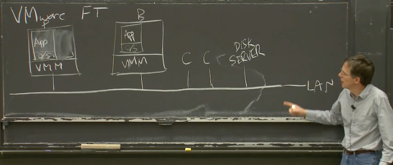

# 复制（Replication）

这一节课（Lecture 4），我想更多地讨论一些关于容错（Fault-Tolerance）和复制（Replication）的问题，然后，深入的看一下今天的论文，VMware FT。

容错本身是为了提供高可用性。例如，当你想构建一个服务时，尽管计算机硬件总是有可能故障，但是我们还是希望能稳定的提供服务，甚至，即使出现了网络问题我们还是想能够提供服务。我们所使用到的工具就是复制，至少在本课程的这一部分是这样。所以，一个很有意思的问题是：复制能处理什么样的故障呢？因为复制也不可能是万能的工具（可以用来解决所有的问题）。

用最简单的方法来描述复制能处理的故障，那就是，单台计算机的 fail-stop 故障。Fail-stop 是一种容错领域的通用术语。它是指，如果某些东西出了故障，比如说计算机，那么它会单纯的停止运行。当任何地方出现故障时，就停止运行，而不是运算出错误结果。例如，某人将你服务器的电源线踢掉了，那就会产生一个 fail-stop 故障。类似的，如果某人拔了你的服务器的网线，即使你的服务器还在运行，那也算是一个 fail-stop 故障。服务器彻底从网络上隔离的场景有点有趣，因为从外界来看，服务器和停止运行没有两样。所以，这些是我们可以通过复制处理的一些故障。复制也能处理一些硬件问题，比如，服务器的风扇坏了，进而会使 CPU 过热，而 CPU 会自我关闭，并停止运行。

但是复制不能处理软件中的 bug 和硬件设计中的缺陷。以 MapReduce 的 Master 节点为例，如果我们复制并将其运行在两台计算机上，但是在 Master 程序里面有一个 bug，那么复制对我们没有任何帮助，因为我们在两台计算机上的 MapReduce Master 都会计算出相同的错误结果，其他组件都会接受这个错误的结果。所以我们不能通过复制软件（为软件构建多副本）来抵御软件的 bug，我们不能通过任何的复制的方案来抵御软件的 bug。类似的，如我之前所说的，我们也不能期望复制可以处理硬件的漏洞，当硬件有漏洞的时候会计算出错误的结果，这时我们就无能为力了，至少基于复制这种技术，我们就无能为力了。

当然，如果你足够幸运的话，肯定也有一些硬件和软件的 bug 是可以被复制处理掉的。比如说，如果有一些不相关的软件运行在你的服务器上，并且它们导致了服务器崩溃，例如 kernel panic 或者服务器重启，虽然这些软件与你服务的副本无关，但是这种问题对于你的服务来说，也算是一种 fail-stop。kernel panic 之后，当前服务器上的服务副本会停止运行，备份副本会取而代之。一些硬件错误也可以转换成 fail-stop 错误，例如，当你通过网络发送了一个包，但是网络传输过程中，由于网络设备故障，导致数据包中的一个 bit 被翻转了，这可以通过数据包中的校验和检测出来，这样整个数据包会被丢弃。对于磁盘也可以做类似的事情，如果你往磁盘写了一些数据，过了一个月又读出来，但是磁盘的磁面或许不是很完美，导致最重要的几个数据 bit 读出来是错误的。通过纠错代码，在一定程度上可以修复磁盘中的错误，如果你足够幸运，随机的硬件错误可以被转换成正确的数据，如果没有那么幸运，那么至少可以检测出这里的错误，并将随机的错误转换成检测到的错误，这样，软件就知道发生了错误，并且会将错误转换成一个 fail-stop 错误，进而停止软件的运行，或者采取一些补救措施。总的来说，我们还是只能期望复制能够处理 fail-stop 错误。

对于复制，还有一些其他的限制。如果我们有两个副本，一个 Primary 和一个 Backup 节点，我们总是假设两个副本中的错误是相互独立的。但是如果它们之间的错误是有关联的，那么复制对我们就没有帮助。例如，我们要构建一个大型的系统，我们从同一个厂商买了数千台完全一样的计算机，我们将我们的副本运行在这些同一时间，同一地点购买的计算机上，这还是有一点风险的。因为如果其中一台计算机有制造缺陷，那么极有可能其他的计算机也有相同的缺陷。例如，由于制造商没有提供足够的散热系统，其中一台计算机总是过热，那么很有可能这一批计算机都有相同的问题。所以，如果其中一台因为过热导致宕机，那么其他计算机也很有可能会有相同的问题。这是一种关联错误。

你要小心的是另一种情况。比如，数据中心所在的城市发生了地震，摧毁了整个数据中心，无论我们在那个数据中心里有多少副本，都无济于事。因为这种由地震，停电，建筑失火引起的问题，如果多个副本在同一个建筑中，那么这类问题是副本之间关联的错误。所以，如果我们想处理类似地震引起的问题，我们需要将我们的副本放在不同的城市，或者至少物理上把它们分开，这样它们会有独立的供电，不会被同样的自然灾害影响。

以上是有关复制的一些背景知识。

另一个有关复制的问题是，你或许也会问自己，这种复制的方案是否值得？因为它使用了我们实际需要的 2-3 倍的计算机资源。GFS 对于每个数据块都有 3 份拷贝，所以我们需要购买实际容量 3 倍的磁盘。今天的论文（VMware FT）复制了一份，但这也意味着我们需要两倍的计算机，CPU，内存。这些东西都不便宜，所以自然会有这个问题，这里的额外支出真的值得吗？

这不是一个可以从技术上来回答的问题，这是一个经济上的问题，它取决于一个可用服务的价值。如果你在运行一个银行系统，并且计算机宕机的后果是你不能再为你的用户提供服务，你将不能再有任何收入，你的用户也会讨厌你，那么多花 1000-2000 美金再买一台计算机或许是值得的。这种情况下，你可以有一个额外的副本。但是另一方面，如果是这个课程的网站，我不认为它值得拥有一个热备份，因为这个课程网站宕机的后果非常小。所以，对于系统做复制是否值得，该复制多少份，你愿意为复制花费多少，都取决于失败会给你带来多大的损失和不便。

---

# 状态转移和复制状态机（State Transfer and Replicated State Machine）

在 VMware FT 论文的开始，介绍了两种复制的方法，一种是**状态转移**（State Transfer），另一种是**复制状态机**（Replicated State Machine）。这两种我们都会介绍，但是在这门课程中，我们主要还是介绍后者。

如果我们有一个服务器的两个副本，我们需要让它们保持同步，在实际上互为副本，这样一旦 Primary 出现故障，因为 Backup 有所有的信息，就可以接管服务。状态转移背后的思想是，Primary 将自己完整状态，比如说内存中的内容，拷贝并发送给 Backup。Backup 会保存收到的最近一次状态，所以 Backup 会有所有的数据。当 Primary 故障了，Backup 就可以从它所保存的最新状态开始运行。所以，状态转移就是发送 Primary 的状态。虽然 VMware FT 没有采用这种复制的方法，但是假设采用了的话，那么转移的状态就是 Primary 内存里面的内容。这种情况下，每过一会，Primary 就会对自身的内存做一大份拷贝，并通过网络将其发送到 Backup。为了提升效率，你可以想到每次同步只发送上次同步之后变更了的内存。

复制状态机基于这个事实：我们想复制的大部分的服务或者计算机软件都有一些确定的内部操作，不确定的部分是外部的输入。通常情况下，如果一台计算机没有外部影响，它只是一个接一个的执行指令，每条指令执行的是计算机中内存和寄存器上确定的函数，只有当外部事件干预时，才会发生一些预期外的事。例如，某个随机时间收到了一个网络数据包，导致服务器做一些不同的事情。所以，复制状态机不会在不同的副本之间发送状态，相应的，它只会从 Primary 将这些外部事件，例如外部的输入，发送给 Backup。通常来说，如果有两台计算机，如果它们从相同的状态开始，并且它们以相同的顺序，在相同的时间，看到了相同的输入，那么它们会一直互为副本，并且一直保持一致。

所以，状态转移传输的是可能是内存，而复制状态机会将来自客户端的操作或者其他外部事件，从 Primary 传输到 Backup。

人们倾向于使用复制状态机的原因是，通常来说，外部操作或者事件比服务的状态要小。如果是一个数据库的话，它的状态可能是整个数据库，可能到达 GB 这个级别，而操作只是一些客户端发起的请求，例如读 key27 的数据。所以操作通常来说比较小，而状态通常比较大。所以复制状态机通常来说更吸引人一些。复制状态机的缺点是，它会更复杂一些，并且对于计算机的运行做了更多的假设。而状态转移就比较简单粗暴，我就是将我整个状态发送给你，你不需要再考虑别的东西。

有关这些方法有什么问题吗？

> 学生提问：如果这里的方法出现了问题，导致 Primary 和 Backup 并不完全一样，会有什么问题？
>
> Robert教授：假设我们对 GFS 的 Master 节点做了多副本，其中的 Primary 对 Chunk 服务器 1 分发了一个租约。但是因为我们这里可能会出现多副本不一致，所以 Backup 并没有向任何人发出租约，它甚至都不知道任何人请求了租约，现在 Primary 认为 Chunk 服务器 1 对于某些 Chunk 有租约，而 Backup 不这么认为。当 Primary 挂了，Backup 接手，Chunk 服务器 1 会认为它对某些 Chunk 有租约，而当前的 Primary（也就是之前的 Backup）却不这么认为。当前的 Primary 会将租约分发给其他的 Chunk 服务器。现在我们就有两个 Chunk 服务器有着相同的租约。这只是一个非常现实的例子，基于不同的副本不一致，你可以构造出任何坏的场景和任何服务器运算出错误结果的情形。我之后会介绍 VMware 的方案是如何避免这一点的。

> 学生提问：随机操作在复制状态机会怎么处理？
>
> Robert教授：我待会会再说这个问题，但是这是个好问题。只有当没有外部的事件时，Primary 和 Backup 都执行相同的指令，得到相同的结果，复制状态机才有意义。对于 ADD 这样的指令来说，这是正确的。如果寄存器和内存都是相同的，那么两个副本执行一条 ADD 指令，这条指令有相同的输入，也必然会有相同的输出。但是，如你指出的一样，有一些指令，或许是获取当前的时间，因为执行时间的略微不同，会产生不同的结果。又或者是获取当前 CPU 的唯一 ID 和序列号，也会产生不同的结果。对于这一类问题的统一答案是，Primary 会执行这些指令，并将结果发送给 Backup。Backup 不会执行这些指令，而是在应该执行指令的地方，等着 Primary 告诉它，正确的答案是什么，并将监听到的答案返回给软件。

有趣的是，或许你已经注意到了，VMware FT 论文讨论的都是复制状态机，并且只涉及了单核 CPU，目前还不确定论文中的方案如何扩展到多核处理器的机器中。在多核的机器中，两个核交互处理指令的行为是不确定的，所以就算 Primary 和 Backup 执行相同的指令，在多核的机器中，它们也不一定产生相同的结果。VMware 在之后推出了一个新的可能完全不同的复制系统，并且可以在多核上工作。这个新系统从我看来使用了状态转移，而不是复制状态机。因为面对多核和并行计算，状态转移更加健壮。如果你使用了一台机器，并且将其内存发送过来了，那么那个内存镜像就是机器的状态，并且不受并行计算的影响，但是复制状态机确实会受并行计算的影响。但是另一方面，我认为这种新的多核方案代价会更高一些。

如果我们要构建一个复制状态机的方案，我们有很多问题要回答，我们需要决定要在什么级别上复制状态，我们对状态的定义是什么，我们还需要担心 Primary 和 Backup 之间同步的频率。因为很有可能 Primary 会比 Backup 的指令执行更超前一些，毕竟是 Primary 接收了外部的输入，Backup 几乎必然是要滞后的。这意味着，有可能 Primary 出现了故障，而 Backup 没有完全同步上。但是，让 Backup 与 Primary 完全同步执行又是代价很高的操作，因为这需要大量的交互。所以，很多设计中，都关注同步的频率有多高。

如果 Primary 发生了故障，必须要有一些切换的方案，并且客户端必须要知道，现在不能与服务器 1 上的旧 Primary 通信，而应该与服务器 2 上的新 Primary 通信。所有的客户端都必须以某种方式完成这里的切换。几乎不可能设计一个不出现异常现象的切换系统。在理想的环境中，如果 Primary 故障了，系统会切换到 Backup，同时没有人，没有一个客户端会注意到这里的切换。这在实际上基本不可能实现。所以，在切换过程中，必然会有异常，我们必须找到一种应对它们的方法。

如果我们的众多副本中有一个故障了，我们需要重新添加一个新的副本。如果我们只有两个副本，其中一个故障了，那我们的服务就命悬一线了，因为第二个副本随时也可能故障。所以我们绝对需要尽快将一个新的副本上线。但是这可能是一个代价很高的行为，因为副本的状态会非常大。我们喜欢复制状态机的原因是，我们认为状态转移的代价太高了。但是对于复制状态机来说，其中的两个副本仍然需要有完整的状态，我们只是有一种成本更低的方式来保持它们的同步。如果我们要创建一个新的副本，我们别无选择，只能使用状态转移，因为新的副本需要有完整状态的拷贝。所以创建一个新的副本，代价会很高。

以上就是人们主要担心的问题。我们在讨论其他复制状态机方案时，会再次看到这些问题。

让我们回到什么样的状态需要被复制这个话题。VMware FT 论文对这个问题有一个非常有趣的回答。它会复制机器的完整状态，这包括了所有的内存，所有的寄存器。这是一个非常非常详细的复制方案，Primary 和 Backup，即使在最底层也是完全一样的。对于复制方案来说，这种类型是非常少见的。总的来说，大部分复制方案都跟 GFS 更像。GFS 也有复制，但是它绝对没有在 Primary 和 Backup 之间复制内存中的每一个 bit，它复制的更多是应用程序级别的 Chunk。应用程序将数据抽象成 Chunk 和 Chunk ID，GFS 只是复制了这些，而没有复制任何其他的东西，所以也不会有复制其他东西的代价。对于应用程序来说，只要 Chunk 的副本的数据是一致的就可以了。基本上除了 VMware FT 和一些屈指可数的类似的系统，其他所有的复制方案都是采用的类似 GFS 的方案。也就是说基本上所有的方案使用的都是应用程序级别的状态复制，因为这更加高效，并且我们也不必陷入这样的困境，比如说需要确保中断在 Primary 和 Backup 的相同位置执行，GFS 就完全不需要担心这种情况。但是 VMware FT 就需要担心这种情况，因为它从最底层就开始复制。所以，大多数人构建了高效的，应用程序级别的复制系统。这样做的后果是，复制这个行为，必须构建在应用程序内部。如果你收到了一系列应用程序级别的操作，你确实需要应用程序参与到复制中来，因为一些通用的复制系统，例如 VMware FT，理解不了这些操作，以及需要复制的内容。总的来说，大部分场景都是应用程序级别的复制，就像 GFS 和其他这门课程中会学习的其他论文一样。

VMware FT 的独特之处在于，它从机器级别实现复制，因此它不关心你在机器上运行什么样的软件，它就是复制底层的寄存器和内存。你可以在 VMware FT 管理的机器上运行任何软件，只要你的软件可以运行在 VMware FT 支持的微处理器上。这里说的软件可以是任何软件。所以，它的缺点是，它没有那么的高效，优点是，你可以将任何现有的软件，甚至你不需要有这些软件的源代码，你也不需要理解这些软件是如何运行的，在某些限制条件下，你就可以将这些软件运行在 VMware FT 的这套复制方案上。VMware FT 就是那个可以让任何软件都具备容错性的魔法棒。

---

# VMware FT 工作原理

让我来介绍一下 VMware FT 是如何工作的。

首先，VMware 是一个虚拟机公司，它们的业务主要是售卖虚拟机技术。虚拟机的意思是，你买一台计算机，通常只能在硬件上启动一个操作系统。但是如果在硬件上运行一个虚拟机监控器（VMM，Virtual Machine Monitor）或者 Hypervisor，Hypervisor 会在同一个硬件上模拟出多个虚拟的计算机。所以通过 VMM，可以在一个硬件上启动一到多个 Linux 虚机，一到多个 Windows 虚机。

这台计算机上的 VMM 可以运行一系列不同的操作系统，其中每一个都有自己的操作系统内核和应用程序。

这是 VMware 发家的技术，这里的硬件和操作系统之间的抽象，可以有很多很多的好处。首先是，我们只需要购买一台计算机，就可以在上面运行大量不同的操作系统，我们可以在每个操作系统里面运行一个小的服务，而不是购买大量的物理计算机，每个物理计算机只运行一个服务。所以，这是 VMware 的发家技术，并且它有大量围绕这个技术构建的复杂系统。

VMware FT 需要两个物理服务器。将 Primary 和 Backup 运行在一台服务器的两个虚拟机里面毫无意义，因为容错本来就是为了能够抵御硬件故障。所以，你至少需要两个物理服务器运行 VMM，Primary 虚机在其中一个物理服务器上，Backup 在另一个物理服务器上。在其中一个物理服务器上，我们有一个虚拟机，这个物理服务器或许运行了很多虚拟机，但是我们只关心其中一个。这个虚拟机跑了某个操作系统，和一种服务器应用程序，或许是个数据库，或许是 MapReduce master 或者其他的，我们将之指定为 Primary。在第二个物理服务器上，运行了相同的 VMM，和一个相同的虚拟机作为 Backup。它与 Primary 有着一样的操作系统。

两个物理服务器上的 VMM 会为每个虚拟机分配一段内存，这两段内存的镜像需要完全一致，或者说我们的目标就是让 Primary 和 Backup 的内存镜像完全一致。所以现在，我们有两个物理服务器，它们每一个都运行了一个虚拟机，每个虚拟机里面都有我们关心的服务的一个拷贝。我们假设有一个网络连接了这两个物理服务器。

除此之外，在这个局域网（LAN，Local Area Network），还有一些客户端。实际上，它们不必是客户端，可以只是一些我们的多副本服务需要与之交互的其他计算机。其中一些客户端向我们的服务发送请求。在 VMware FT 里，多副本服务没有使用本地盘，而是使用了一些 Disk Server（远程盘）。尽管从论文里很难发现，这里可以将远程盘服务器也看做是一个外部收发数据包的源，与客户端的区别不大。

所以，基本的工作流程是，我们假设这两个副本，或者说这两个虚拟机：Primary 和 Backup，互为副本。某些我们服务的客户端，向 Primary 发送了一个请求，这个请求以网络数据包的形式发出。

这个网络数据包产生一个中断，之后这个中断送到了 VMM。VMM 可以发现这是一个发给我们的多副本服务的一个输入，所以这里 VMM 会做两件事情：

- 在虚拟机的 guest 操作系统中，模拟网络数据包到达的中断，以将相应的数据送给应用程序的 Primary 副本。
- 除此之外，因为这是一个多副本虚拟机的输入，VMM 会将网络数据包拷贝一份，并通过网络送给 Backup 虚机所在的 VMM。

Backup 虚机所在的 VMM 知道这是发送给 Backup 虚机的网络数据包，它也会在 Backup 虚机中模拟网络数据包到达的中断，以将数据发送给应用程序的 Backup。所以现在，Primary 和 Backup 都有了这个网络数据包，它们有了相同的输入，再加上许多细节，它们将会以相同的方式处理这个输入，并保持同步。

当然，虚机内的服务会回复客户端的请求。在 Primary 虚机里面，服务会生成一个回复报文，并通过 VMM 在虚机内模拟的虚拟网卡发出。之后 VMM 可以看到这个报文，它会实际的将这个报文发送给客户端。

另一方面，由于 Backup 虚机运行了相同顺序的指令，它也会生成一个回复报文给客户端，并将这个报文通过它的 VMM 模拟出来的虚拟网卡发出。但是它的 VMM 知道这是 Backup 虚机，会丢弃这里的回复报文。所以这里，Primary 和 Backup 都看见了相同的输入，但是只有 Primary 虚机实际生成了回复报文给客户端。

这里有一个术语，VMware FT 论文中将 Primary 到 Backup 之间同步的数据流的通道称之为 Log Channel。虽然都运行在一个网络上，但是这些从 Primary 发往 Backup 的事件被称为 Log Channel 上的 Log Event/Entry。

当 Primary 因为故障停止运行时，FT（Fault-Tolerance）就开始工作了。从 Backup 的角度来说，它将不再收到来自于 Log Channel 上的 Log 条目。实际中，Backup 每秒可以收到很多条 Log，其中一个来源就是来自于 Primary 的定时器中断。每个 Primary 的定时器中断都会生成一条 Log 条目并发送给 Backup，这些定时器中断每秒大概会有 100 次。所以，如果 Primary 虚机还在运行，Backup 必然可以期望从 Log Channel 收到很多消息。如果 Primary 虚机停止运行了，那么 Backup 的 VMM 就会说：天，我都有 1 秒没有从 Log Channel 收到任何消息了，Primary 一定是挂了或者出什么问题了。当 Backup 不再从 Primary 收到消息，VMware FT 论文的描述是，Backup 虚机会上线（Go Alive）。这意味着，Backup 不会再等待来自于 Primary 的 Log Channel 的事件，Backup 的 VMM 会让 Backup 自由执行，而不是受来自于 Primary 的事件驱动。Backup 的 VMM 会在网络中做一些处理（猜测是发 GARP），让后续的客户端请求发往 Backup 虚机，而不是 Primary 虚机。同时，Backup 的 VMM 不再会丢弃 Backup 虚机的输出。当然，它现在已经不再是 Backup，而是 Primary。所以现在，左边的虚机直接接收输入，直接产生输出。到此为止，Backup 虚机接管了服务。

类似的一个场景，虽然没那么有趣，但是也需要能正确工作。如果 Backup 虚机停止运行，Primary 也需要用一个类似的流程来抛弃 Backup，停止向它发送事件，并且表现的就像是一个单点的服务，而不是一个多副本服务一样。所以，只要有一个因为故障停止运行，并且不再产生网络流量时，Primary 和 Backup 中的另一个都可以上线继续工作。

> 学生提问：Backup 怎么让其他客户端向自己发送请求？
>
> Robert教授：魔法。。。取决于是哪种网络技术。从论文中看，一种可能是，所有这些都运行在以太网上。每个以太网的物理计算机，或者说网卡有一个 48bit 的唯一 ID（MAC 地址）。下面这些都是我（Robert教授）编的。每个虚拟机也有一个唯一的 MAC 地址，当 Backup 虚机接手时，它会宣称它有 Primary 的 MAC 地址，并向外通告说，我是那个 MAC 地址的主人。这样，以太网上的其他人就会向它发送网络数据包。不过这只是我（Robert教授）的解读。

> 学生提问：随机数生成器这种操作怎么在 Primary 和 Backup 做同步？
>
> Robert教授：VMware FT 的设计者认为他们找到了所有类似的操作，对于每一个操作，Primary 执行随机数生成，或者某个时间点生成的中断（依赖于执行时间点的中断）。而 Backup 虚机不会执行这些操作，Backup 的 VMM 会探测这些指令，拦截并且不执行它们。VMM 会让 Backup 虚机等待来自 Log Channel 的有关这些指令的指示，比如随机数生成器这样的指令，之后 VMM 会将 Primary 生成的随机数发送给 Backup。
>
> 论文有暗示说他们让 Intel 向处理器加了一些特性来支持这里的操作，但是论文没有具体说是什么特性。

---

# 非确定性事件（Non-Deterministic Events）

好的，目前为止，我们都假设只要 Backup 虚机也看到了来自客户端的请求，经过同样的执行过程，那么它就会与 Primary 保持一致，但是这背后其实有很多很重要的细节。就如其他同学之前指出的一样，其中一个问题是存在非确定性（Non-Deterministic）的事件。虽然通常情况下，代码执行都是直接明了的，但并不是说计算机中每一个指令都是由计算机内存的内容而确定的行为。这一节，我们来看一下不由当前内存直接决定的指令。如果我们不够小心，这些指令在 Primary 和 Backup 的运行结果可能会不一样。这些指令就是所谓的非确定性事件。所以，设计者们需要弄明白怎么让这一类事件能在 Primary 和 Backup 之间同步。

非确定性事件可以分成几类。

- 客户端输入。假设有一个来自于客户端的输入，这个输入随时可能会送达，所以它是不可预期的。客户端请求何时送达，会有什么样的内容，并不取决于服务当前的状态。我们讨论的系统专注于通过网络来进行交互，所以这里的系统输入的唯一格式就是网络数据包。所以当我们说输入的时候，我们实际上是指接收到了一个网络数据包。而一个网络数据包对于我们来说有两部分，一个是数据包中的数据，另一个是提示数据包送达了的中断。当网络数据包送达时，通常网卡的 DMA（Direct Memory Access）会将网络数据包的内容拷贝到内存，之后触发一个中断。操作系统会在处理指令的过程中消费这个中断。对于Primary 和 Backup 来说，这里的步骤必须看起来是一样的，否则它们在执行指令的时候就会出现不一致。所以，这里的问题是，中断在什么时候，具体在指令流中的哪个位置触发？对于 Primary 和 Backup，最好要在相同的时间，相同的位置触发，否则执行过程就是不一样的，进而会导致它们的状态产生偏差。所以，我们不仅关心网络数据包的内容，还关心中断的时间。
- 另外，如其他同学指出的，有一些指令在不同的计算机上的行为是不一样的，这一类指令称为怪异指令，比如说：
  - 随机数生成器
  - 获取当前时间的指令，在不同时间调用会得到不同的结果
  - 获取计算机的唯一 ID

- 另外一个常见的非确定事件，在 VMware FT 论文中没有讨论，就是多 CPU 的并发。我们现在讨论的都是一个单进程系统，没有多 CPU 多核这种事情。之所以多核会导致非确定性事件，是因为当服务运行在多 CPU 上时，指令在不同的 CPU 上会交织在一起运行，进而产生的指令顺序是不可预期的。所以如果我们在 Backup 上运行相同的代码，并且代码并行运行在多核 CPU 上，硬件会使得指令以不同于 Primary 的方式交织在一起，而这会引起不同的运行结果。假设两个核同时向同一份数据请求锁，在 Primary 上，核 1 得到了锁；在 Backup 上，由于细微的时间差别核 2 得到了锁，那么执行结果极有可能完全不一样，这里其实说的就是（在两个副本上）不同的线程获得了锁。所以，多核是一个巨大的非确定性事件来源，VMware FT 论文完全没有讨论它，并且它也不适用与我们这节课的讨论。

> 学生提问：如何确保 VMware FT 管理的服务只使用单核？
>
> Robert教授：服务不能使用多核并行计算。硬件几乎可以肯定是多核并行的，但是这些硬件在 VMM 之下。在这篇论文中，VMM 暴露给运行了 Primary 和 Backup 虚机操作系统的硬件是单核的。我猜他们也没有一种简单的方法可以将这里的内容应用到一个多核的虚拟机中。

所有的事件都需要通过 Log Channel，从 Primary 同步到 Backup。有关日志条目的格式在论文中没有怎么描述，但是我（Robert教授）猜日志条目中有三样东西：

1. 事件发生时的指令序号。因为如果要同步中断或者客户端输入数据，最好是 Primary 和 Backup 在相同的指令位置看到数据，所以我们需要知道指令序号。这里的指令号是自机器启动以来指令的相对序号，而不是指令在内存中的地址。比如说，我们正在执行第 40 亿零 79 条指令。所以日志条目需要有指令序号。对于中断和输入来说，指令序号就是指令或者中断在 Primary 中执行的位置。对于怪异的指令（Weird instructions），比如说获取当前的时间来说，这个序号就是获取时间这条指令执行的序号。这样，Backup 虚机就知道在哪个指令位置让相应的事件发生。
2. 日志条目的类型，可能是普通的网络数据输入，也可能是怪异指令。
3. 最后是数据。如果是一个网络数据包，那么数据就是网络数据包的内容。如果是一个怪异指令，数据将会是这些怪异指令在 Primary 上执行的结果。这样 Backup 虚机就可以伪造指令，并提供与 Primary 相同的结果。

举个例子，Primary 和 Backup 两个虚机内部的 guest 操作系统需要在模拟的硬件里有一个定时器，能够每秒触发 100 次中断，这样操作系统才可以通过对这些中断进行计数来跟踪时间。因此，这里的定时器必须在 Primary 和 Backup 虚机的完全相同位置产生中断，否则这两个虚机不会以相同的顺序执行指令，进而可能会产生分歧。所以，在运行了 Primary 虚机的物理服务器上，有一个定时器，这个定时器会计时，生成定时器中断并发送给 VMM。在适当的时候，VMM 会停止 Primary 虚机的指令执行，并记下当前的指令序号，然后在指令序号的位置插入伪造的模拟定时器中断，并恢复 Primary 虚机的运行。之后，VMM 将指令序号和定时器中断再发送给 Backup 虚机。虽然 Backup 虚机的 VMM 也可以从自己的物理定时器接收中断，但是它并没有将这些物理定时器中断传递给 Backup 虚机的 guest 操作系统，而是直接忽略它们。当来自于 Primary 虚机的 Log 条目到达时，Backup 虚机的 VMM 配合特殊的 CPU 特性支持，会使得物理服务器在相同的指令序号处产生一个定时器中断，之后 VMM 获取到这个中断，并伪造一个假的定时器中断，并将其送入 Backup 虚机的 guest 操作系统，并且这个定时器中断会出现在与 Primary 相同的指令序号位置。

> 学生提问：这里的操作依赖硬件的定制吗？
>
> Robert教授：是的，这里依赖于 CPU 的一些特殊的定制，这样 VMM 就可以告诉 CPU，执行 1000 条指令之后暂停一下，方便 VMM 将伪造的中断注入，这样 Backup 虚机就可以与 Primary 虚机在相同的指令位置触发相同的中断，执行相同的指令。之后，VMM 会告诉 CPU 恢复执行。这里需要一些特殊的硬件，但是现在看起来所有的 Intel 芯片上都有这个功能，所以也不是那么的特殊。或许 15 年前，这个功能还是比较新鲜的，但是现在来说就比较正常了。现在这个功能还有很多其他用途，比如说做 CPU 时间性能分析，可以让处理器每 1000 条指令中断一次，这里用的是相同的硬件让微处理器每 1000 条指令产生一个中断。所以现在，这是 CPU 中非常常见的一个小工具。

> 学生提问：如果 Backup 领先了 Primary 会怎么样？
>
> Robert教授： 场景可能是这样，Primary 即将在第 100 万条指令处中断，但是 Backup 已经执行了 100 万零 1 条指令了。如果我们让这种场景发生，那么 Primary 的中断传输就太晚了。如果我们允许 Backup 执行领先 Primary，就会使得中断在 Backup 中执行位置落后于 Primary。所以我们不能允许这种情况发生，我们不能允许 Backup 在执行指令时领先于 Primary。
>
> VMware FT 是这么做的。它会维护一个来自于 Primary 的 Log 条目的等待缓冲区，如果缓冲区为空，Backup 是不允许执行指令的。如果缓冲区不为空，那么它可以根据 Log 的信息知道 Primary 对应的指令序号，并且会强制 Backup 虚机最多执行指令到这个位置。所以，Backup 虚机的 CPU 总是会被通知执行到特定的位置就停止。Backup 虚机只有在 Log 缓冲区中有数据才会执行，并且只会执行到 Log 条目对应的指令序号。在 Primary 产生的第一个 Log，并且送达 Backup 之前，Backup 甚至都不能执行指令，所以 Backup 总是落后于 Primary 至少一个 Log。如果物理服务器的资源占用过多，导致 Backup 执行变慢，那么 Backup 可能落后于 Primary 多个 Log 条目。

网络数据包送达时，有一个细节会比较复杂。当网络数据包到达网卡时，如果我们没有运行虚拟机，网卡会将网络数据包通过 DMA 的方式送到计算机的关联内存中。现在我们有了虚拟机，并且这个网络数据包是发送给虚拟机的，在虚拟机内的操作系统可能会监听 DMA 并将数据拷贝到虚拟机的内存中。因为 VMware 的虚拟机设计成可以支持任何操作系统，我们并不知道网络数据包到达时操作系统会执行什么样的操作，有的操作系统或许会真的监听网络数据包拷贝到内存的操作。

我们不能允许这种情况发生。如果我们允许网卡直接将网络数据包 DMA 到 Primary 虚机中，我们就失去了对于 Primary 虚机的时序控制，因为我们也不知道什么时候 Primary 会收到网络数据包。所以，实际中，物理服务器的网卡会将网络数据包拷贝给 VMM 的内存，之后，网卡中断会送给 VMM，并说，一个网络数据包送达了。这时，VMM 会暂停 Primary 虚机，记住当前的指令序号，将整个网络数据包拷贝给 Primary 虚机的内存，之后模拟一个网卡中断发送给 Primary 虚机。同时，将网络数据包和指令序号发送给 Backup。Backup 虚机的 VMM 也会在对应的指令序号暂停 Backup 虚机，将网络数据包拷贝给 Backup 虚机，之后在相同的指令序号位置模拟一个网卡中断发送给 Backup 虚机。这就是论文中介绍的 Bounce Buffer 机制。

> 学生提问：怪异的指令（Weird instructions）会有多少呢？
>
> Robert教授：怪异指令非常少。只有可能在 Primary 和 Backup 中产生不同结果的指令，才会被封装成怪异指令，比如获取当前时间，或者获取当前处理器序号，或者获取已经执行的的指令数，或者向硬件请求一个随机数用来加密，这种指令相对来说都很少见。大部分指令都是类似于 ADD 这样的指令，它们会在 Primary 和 Backup 中得到相同的结果。每个网络数据包未做修改直接被打包转发，然后被两边虚拟机的 TCP/IP 协议栈解析也会得到相同的结果。所以我预期 99.99% 的 Log Channel 中的数据都会是网络数据包，只有一小部分是怪异指令。
>
> 所以对于一个服务于客户端的服务来说，我们可以通过客户端流量判断 Log Channel 的流量大概是什么样子，因为它基本上就是客户端发送的网络数据包的拷贝。

---

# 输出控制（Output Rule）

对于 VMware FT 系统的输出，也是值得说一下的。在这个系统中，唯一的输出就是对于客户端请求的响应。客户端通过网络数据包将数据送入，服务器的回复也会以网络数据包的形式送出。我之前说过，Primary 和 Backup 虚机都会生成回复报文，之后通过模拟的网卡送出，但是只有 Primary 虚机才会真正的将回复送出，而 Backup 虚机只是将回复简单的丢弃掉。

好吧，真实情况会复杂一些。假设我们正在跑一个简单的数据库服务器，这个服务器支持一个计数器自增操作，工作模式是这样，客户端发送了一个自增的请求，服务器端对计数器加 1，并返回新的数值。假设最开始一切正常，在 Primary 和 Backup 中的计数器都存了 10。现在，局域网的一个客户端发送了一个自增的请求给 Primary，这个请求在 Primary 虚机的软件中执行，Primary 会发现，现在的数据是 10，我要将它变成 11，并回复客户端说，现在的数值是 11。这个请求也会发送给 Backup 虚机，并将它的数值从 10 改到 11。Backup 也会产生一个回复，但是这个回复会被丢弃，这是我们期望发生的。

但是，你需要考虑，如果在一个不恰当的时间，出现了故障会怎样？在这门课程中，你需要始终考虑，故障的最坏场景是什么，故障会导致什么结果？在这个例子中，假设 Primary 确实生成了回复给客户端，但是之后立马崩溃了。更糟糕的是，现在网络不可靠，Primary 发送给 Backup 的 Log 条目在 Primary 崩溃时也丢包了。那么现在的状态是，客户端收到了回复说现在的数据是 11，但是 Backup 虚机因为没有看到客户端请求，所以它保存的数据还是 10。

现在，因为察觉到 Primary 崩溃了，Backup 接管服务。这时，客户端再次发送一个自增的请求，这个请求发送到了原来的 Backup 虚机，它会将自身的数值从 10 增加到 11，并产生第二个数据是 11 的回复给客户端。

如果客户端比较前后两次的回复，会发现一个明显不可能的场景（两次自增的结果都是 11）。

因为 VMware FT 的优势就是在不修改软件，甚至软件都不需要知道复制的存在的前提下，就能支持容错，所以我们也不能修改客户端让它知道因为容错导致的副本切换触发了一些奇怪的事情。在 VMware FT 场景里，我们没有修改客户端这个选项，因为整个系统只有在不修改服务软件的前提下才有意义。所以，前面的例子是个大问题，我们不能让它实际发生。有人还记得论文里面是如何防止它发生的吗？

论文里的解决方法就是控制输出（Output Rule）。直到 Backup 虚机确认收到了相应的 Log 条目，Primary 虚机不允许生成任何输出。让我们回到 Primary 崩溃前，并且计数器的内容还是 10，Primary 上的正确的流程是这样的：

1. 客户端输入到达 Primary。
2. Primary 的 VMM 将输入的拷贝发送给 Backup 虚机的 VMM。所以有关输入的 Log 条目在 Primary 虚机生成输出之前，就发往了 Backup。之后，这条 Log 条目通过网络发往 Backup，但是过程中有可能丢失。
3. Primary 的 VMM 将输入发送给 Primary 虚机，Primary 虚机生成了输出。现在 Primary 虚机的里的数据已经变成了 11，生成的输出也包含了 11。但是 VMM 不会无条件转发这个输出给客户端。
4. Primary 的 VMM 会等到之前的 Log 条目都被 Backup 虚机确认收到了才将输出转发给客户端。所以，包含了客户端输入的 Log 条目，会从 Primary 的 VMM 送到 Backup 的 VMM，Backup 的 VMM 不用等到 Backup 虚机实际执行这个输入，就会发送一个表明收到了这条 Log 的 ACK 报文给 Primary 的 VMM。当 Primary 的 VMM 收到了这个 ACK，才会将 Primary 虚机生成的输出转发到网络中。

所以，这里的核心思想是，确保在客户端看到对于请求的响应时，Backup 虚机一定也看到了对应的请求，或者说至少在 Backup 的 VMM 中缓存了这个请求。这样，我们就不会陷入到这个奇怪的场景：客户端已经收到了回复，但是因为有故障发生和副本切换，新接手的副本完全不知道客户端之前收到了对应的回复。

如果在上面的步骤 2 中，Log 条目通过网络发送给 Backup 虚机时丢失了，然后 Primary 虚机崩溃了。因为 Log 条目丢失了， 所以 Backup 节点也不会发送 ACK 消息。所以，如果 Log 条目的丢失与 Primary 的崩溃同一时间发生，那么 Primary 必然在 VMM 将回复转发到网络之前就崩溃了，所以客户端也就不会收到任何回复，所以客户端就不会观察到任何异常。这就是输出控制（Output rule）。

> 学生提问：VMM 这里是具体怎么实现的？
>
> Robert教授：我不太清楚，论文也没有说 VMM 是如何实现的。我的意思是，这里涉及到非常底层的内容，因为包括了内存分配，页表（page table）分配，设备驱动交互，指令拦截，并理解 guest 操作系统正在执行的指令。这些都是底层的东西，它们通常用 C 或者 C++ 实现，但是具体的内容我就不清楚了。

所以，Primary 会等到 Backup 已经有了最新的数据，才会将回复返回给客户端。这几乎是所有的复制方案中对于性能产生伤害的地方。这里的同步等待使得 Primary 不能超前 Backup 太多，因为如果 Primary 超前了并且又故障了，对应的就是 Backup 的状态落后于客户端的状态。

所以，几乎每一个复制系统都有这个问题，在某个时间点，Primary 必须要停下来等待 Backup，这对于性能是实打实的限制。即使副本机器在相邻的机架上，Primary 节点发送消息并收到回复仍然需要 0.5 毫秒的延时。如果我们想要能承受类似于地震或者城市范围内的断电等问题，Primary 和 Backup 需要在不同的城市，之间可能有 5 毫秒的差距。如果我们将两个副本放置在不同的城市，每次生成一个输出时，都需要至少等待 5 毫秒，等 Backup 确认收到了前一个 Log 条目，然后 VMM 才能将输出发送到网络。对于一些低请求量的服务，这不是问题。但是如果我们的服务要能够每秒处理数百万个请求，那就会对我们的性能产生巨大的伤害。

所以如果条件允许，人们会更喜欢使用在更高层级做复制的系统。这样的复制系统可以理解操作的含义，这样的话 Primary 虚机就不必在每个网络数据包暂停同步一下，而是可以在一个更高层级的操作层面暂停来做同步，甚至可以对一些只读操作不做暂停。但是这就需要一些特殊的应用程序层面的复制机制。

> 学生提问：其实不用暂停 Primary 虚机的执行，只需要阻止 Primary 虚机的输出就行吧？
>
> Robert教授：你是对的。所以，这里的同步等待或许没有那么糟糕。但是不管怎么样，在一个系统中，本来可以几微秒响应一个客户端请求，而现在我们需要先更新另一个城市的副本，这可能会将一个 10 微秒的操作变成 10 毫秒。

> 学生提问：这里虽然等待时间比较长，如果提高请求的并发度，是不是还是可以有高性能？
>
> Robert教授：如果你有大量的客户端并发的发送请求，那么你或许还是可以在高延时的情况下获得高的吞吐量，但是就需要你有足够聪明的设计和足够的幸运。

> 学生提问：可以不可以将 Log 保留在 Primary 虚机对应的物理服务器内存中，这样就不用长时间的等待了。
>
> Robert教授：这是一个很好的想法。但是如果你这么做的话，物理服务器宕机，Log 就丢失了。通常，如果服务器故障，就认为服务器中的所有数据都没了，其中包括内存的内容。如果故障是某人不小心将服务器的电源拔了，即使 Primary 对应的物理服务器有电池供电的 RAM，Backup 也没办法从其获取 Log。实际上，系统会在 Backup 的内存中记录 Log。为了保证系统的可靠性，Primary 必须等待 Backup 的 ACK 才真正输出。你这里的想法很好，但是我们还是不能使用 Primary 的内存来存 Log。

> 学生提问：能不能输入送到 Primary，输出从 Backup 送出？
>
> Robert教授：这是个很聪明的想法。我之前完全没有想到过这点。它或许可以工作，我不确定，但是这很有意思。

---

# 重复输出（Duplicated Output）

还有一种可能的情况是，回复报文已经从 VMM 发往客户端了，所以客户端收到了回复，但是这时 Primary 虚机崩溃了。而在 Backup 侧，客户端请求还堆积在 Backup 对应的 VMM 的 Log 等待缓冲区，也就是说客户端请求还没有真正发送到 Backup 虚机中。当 Primary 崩溃之后，Backup 接管服务，Backup 首先需要消费所有在等待缓冲区中的 Log，以保持与 Primay 在相同的状态，这样 Backup 才能以与 Primary 相同的状态接管服务。假设最后一条 Log 条目对应来自客户端的请求，那么 Backup 会在处理完客户端请求对应的中断之后，再上线接管服务。这意味着，Backup 会将自己的计数器增加到 11（原来是 10，处理完客户端的自增请求变成 11），并生成一个输出报文。因为这时，Backup 已经上线接管服务，它生成的输出报文会被它的 VMM 发往客户端。这样客户端会收到两个内容是 11 的回复。如果这里的情况真的发生了，那么明显这也是一个异常行为，因为不可能在运行在单个服务器的服务上发生这种行为。

好消息是，几乎可以肯定，客户端通过 TCP 与服务进行交互，也就是说客户端请求和回复都通过 TCP Channel 收发。当 Backup 接管服务时，因为它的状态与 Primary 相同，所以它知道 TCP 连接的状态和 TCP 传输的序列号。当 Backup 生成回复报文时，这个报文的 TCP 序列号与之前 Primary 生成报文的 TCP 序列号是一样的，这样客户端的 TCP 栈会发现这是一个重复的报文，它会在 TCP 层面丢弃这个重复的报文，用户层的软件永远也看不到这里的重复。

这里可以认为是异常的场景，并且被意外的解决了。但是事实上，对于任何有主从切换的复制系统，基本上不可能将系统设计成不产生重复输出。为了避免重复输出，有一个选项是在两边都不生成输出，但这是一个非常糟糕的做法（因为对于客户端来说就是一次失败的请求）。当出现主从切换时，切换的两边都有可能生成重复的输出，这意味着，某种程度上来说，所有复制系统的客户端需要一种重复检测机制。这里我们使用的是 TCP 来完成重复检测，如果我们没有 TCP，那就需要另一种其他机制，或许是应用程序级别的序列号。

在 lab2 和 lab3 中，基本上可以看到我们前面介绍的所有内容，例如输出控制，你会设计你的复制状态机。

> 学生提问：太长了，听不太清，直接看回答吧。
>
> Robert教授：第一部分是对的。当 Backup 虚机消费了最后一条 Log 条目，这条 Log 包含了客户端的请求，并且 Backup 上线了。从这个时间点开始，我们不需要复制任何东西，因为 Primary 已经挂了，现在没有任何其他副本。
>
> 如果 Primary 向客户端发送了一个回复报文，之后，Primary 或者客户端关闭了 TCP 连接，所以现在客户端侧是没有 TCP 连接的。Primary 挂了之后，Backup 虚机还是有 TCP 连接的信息。Backup 执行最后一条 Log，Backup 会生成一个回复报文，但是这个报文送到客户端时，客户端并没有相应的 TCP 连接信息。客户端会直接丢弃报文，就像这个报文不存在一样。哦不！这里客户端实际会发送一个 TCP Reset，这是一个类似于 TCP error 的东西给 Backup 虚机，Backup 会处理这里的 TCP Reset，但是没关系，因为现在只有一个副本，Backup 可以任意处理，而不用担心与其他副本有差异。实际上，Backup 会直接忽略这个报文。现在 Backup 上线了，在这个复制系统里面，它不受任何人任何事的限制。

> 学生提问：Backup 接手服务之后，对于之前的 TCP 连接，还能用相同的 TCP 源端口来发送数据吗（因为源端口一般是随机的）？
>
> Robert教授：你可以这么认为。因为 Backup 的内存镜像与 Primary 的完全一致，所以它们会以相同的 TCP 源端口来发送数据，它们在每一件事情上都是一样的。它们发送的报文每一 bit 都是一样的。

> 学生提问：甚至对于 IP 地址都会是一样的吗，毕竟这里涉及两个物理服务器？
>
> Robert教授：在这个层面，物理服务器并没有 IP 地址。在我们的例子中，Primary 虚机和 Backup 虚机都有 IP 地址，但是物理服务器和 VMM 在网络上基本是透明的。物理服务器上的 VMM 在网络上并没有自己的唯一标识。虚拟机有自己独立的操作系统和独立的 TCP 栈，但是对于 IP 地址和其他的关联数据，Primary 和 Backup 是一样的（类似于 HA VIP）。当虚机发送一个网络报文，它会以虚机的 IP 地址和 MAC 地址来发送，这些信息是直接透传到局域网的，而这正是我们想要的。所以 Backup 会生成与 Primary 完全一样的报文。这里有一些 tricky，因为如果物理服务器都接在一个以太网交换机上，那么它们必然在交换机的不同端口上，在发生切换时，我们希望以太网交换机能够知道当前主节点在哪，这样才能正常的转发报文，这会有一些额外的有意思的事情。大部分时候，Primary 和 Backup 都是生成相同的报文，并送出。
>
> （注：早期的 VMware 虚机都是直接以 VLAN 或者 Flat 形式，通过 DVS 接入到物理网络，所以虚拟机的报文与物理机无关，可以直接在局域网发送。以太网交换机会维护 MAC 地址表，表明 MAC 地址与交换机端口的对应，因为 Primary 和 Backup 虚机的 MAC 地址一样，当主从切换时，这个表需要更新，这样同一个目的 MAC 地址，切换前是发往了 Primary 虚机所在的物理服务器对应的交换机端口，切换之后是发往了 Backup 虚机所在的物理服务器对应的交换机端口。交换机 MAC 地址表的切换通常通过虚机主动发起 GARP 来更新。）

---

# Test-and-Set 服务

最后还有一个细节。我一直都假设 Primary 出现的是 fail-stop 故障，但是这不是所有的情况。一个非常常见的场景就是，Primary 和 Backup 都在运行，但是它们之间的网络出现了问题，同时它们各自又能够与一些客户端通信。这时，它们都会以为对方挂了，自己需要上线并接管服务。所以现在，我们对于同一个服务，有两个机器是在线的。因为现在它们都不向彼此发送 Log 条目，它们自然就出现了分歧。它们或许会因为接收了不同的客户端请求，而变得不一样。

因为涉及到了计算机网络，那就可能出现上面的问题，而不仅仅是机器故障。如果我们同时让 Primary 和 Backup 都在线，那么我们现在就有了脑裂（Split Brain）。这篇论文解决这个问题的方法是，向一个外部的第三方权威机构求证，来决定 Primary 还是 Backup 允许上线。这里的第三方就是 Test-and-Set 服务。

Test-and-Set 服务不运行在 Primary 和 Backup 的物理服务器上，VMware FT 需要通过网络支持 Test-and-Set 服务。这个服务会在内存中保留一些标志位，当你向它发送一个 Test-and-Set 请求，它会设置标志位，并且返回旧的值。Primary 和 Backup 都需要获取 Test-and-Set 标志位，这有点像一个锁。为了能够上线，它们或许会同时发送一个 Test-and-Set 请求，给 Test-and-Set 服务。当第一个请求送达时，Test-and-Set 服务会说，这个标志位之前是 0，现在是 1。第二个请求送达时，Test-and-Set 服务会说，标志位已经是 1 了，你不允许成为 Primary。对于这个 Test-and-Set 服务，我们可以认为运行在单台服务器。当网络出现故障，并且两个副本都认为对方已经挂了时，Test-and-Set 服务就是一个仲裁官，决定了两个副本中哪一个应该上线。

对于这种机制有什么问题吗？

> 学生提问：只有在网络故障的时候才需要询问 Test-and-Set 服务吗？
>
> Robert教授：即使没有网络分区，在所有情况下，两个副本中任意一个觉得对方挂了，哪怕对方真的挂了，想要上线的那个副本仍然需要获得 Test-and-Set 服务的锁。在 6.824 这门课程中，有个核心的规则就是，你无法判断另一个计算机是否真的挂了，你所知道的就是，你无法从那台计算机收到网络报文，你无法判断是因为那台计算机挂了，还是因为网络出问题了导致的。所以，Backup 看到的是，我收不到来自 Primary 的网络报文，或许 Primary 挂了，或许还活着。Primary 或许也同时看不到 Backup 的报文。所以，如果存在网络分区，那么必然要询问 Test-and-Set 服务。但是实际上没人知道现在是不是网络分区，所以每次涉及到主从切换，都需要向 Test-and-Set 服务进行查询。所以，当副本想要上线的时候，Test-and-Set 服务必须要在线，因为副本需要获取这里的 Test-and-Set 锁。现在 Test-and-Set 看起来像是个单点故障（Single-Point-of-Failure）。虽然 VMware FT 尝试构建一个复制的容错的系统，但是最后，主从切换还是依赖于 Test-and-Set 服务在线，这有点让人失望。我强烈的认为，Test-and-Set 服务本身也是个复制的服务，并且是容错的。几乎可以肯定的是，VMware 非常乐意向你售卖价值百万的高可用存储系统，系统内使用大量的复制服务。因为这里用到了 Test-and-Set 服务，我猜它也是复制的。

你们将要在 Lab2 和 Lab3 构建的系统，会帮助你们构建容错的 Test-and-Set 服务，所以这个问题可以轻易被解决。

