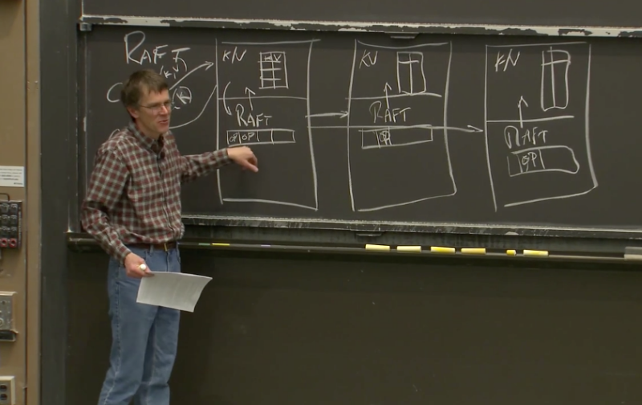
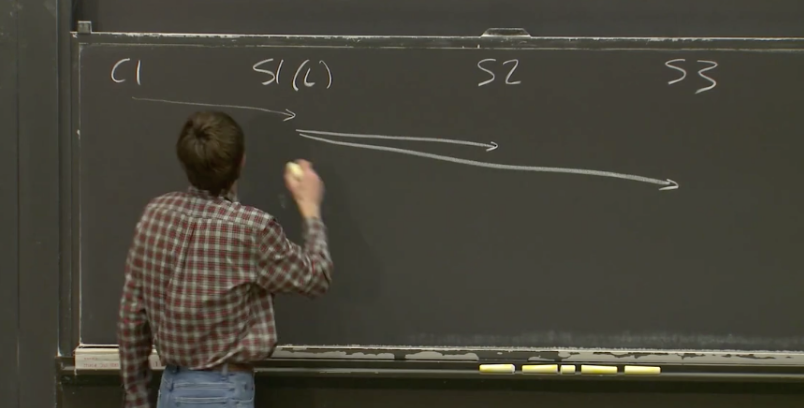
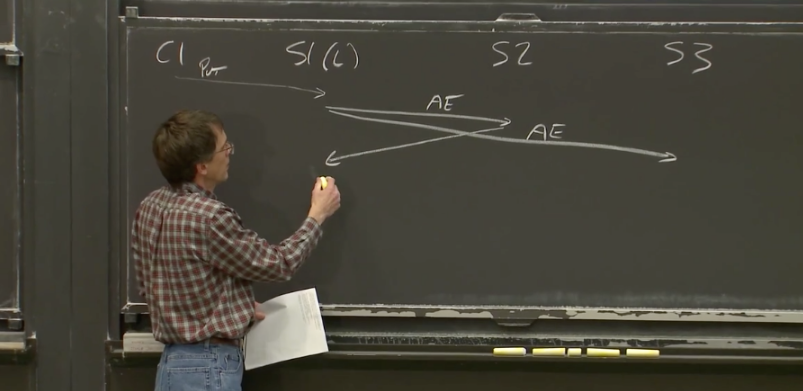
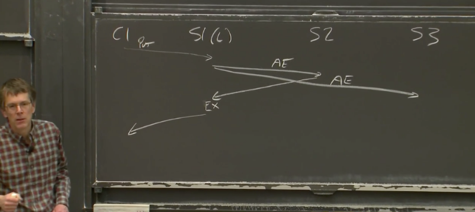
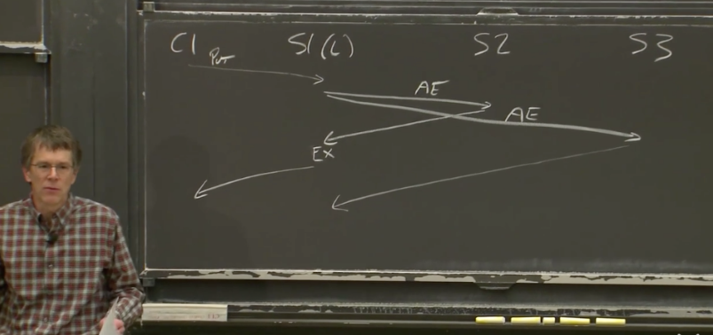
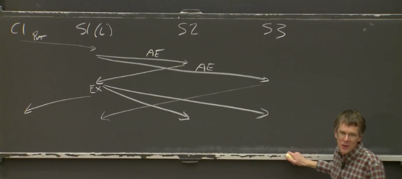
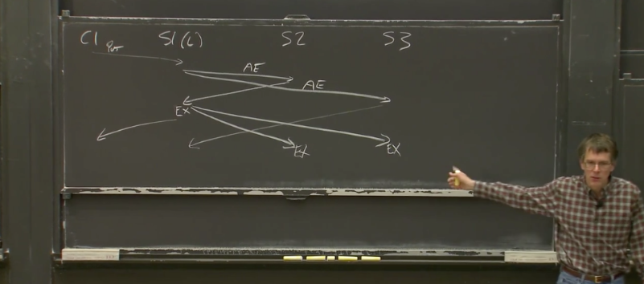

接下来两节课的内容，将会是 Raft。这是因为 Raft 可以帮助同学们完成相应的实验（Lab2）。同时，Raft 也是一个正确实现了状态机复制（state machine replication）的例子。

---

# 脑裂（Split Brain）

在之前的课程中，我们介绍了几个具备容错特性（fault-tolerant）的系统。如果你有留心的话，你会发现，它们有一个共同的特点。

- MapReduce 复制了计算，但是复制这个动作，或者说整个 MapReduce 被一个单主节点控制。
- GFS 以主备（primary-backup）的方式复制数据。它会实际的复制文件内容。但是它也依赖一个单主节点，来确定每一份数据的主拷贝的位置。
- VMware FT，它在一个 Primary 虚机和一个 Backup 虚机之间复制计算相关的指令。但是，当其中一个虚机出现故障时，为了能够正确的恢复。需要一个 Test-and-Set 服务来确认，Primary 虚机和 Backup 虚机只有一个能接管计算任务。

这三个例子中，它们都是一个多副本系统（replication system），但是在背后，它们存在一个共性：它们需要一个单节点来决定，在多个副本中，谁是主（Primary）。

使用一个单节点的好处是，它不可能否认自己。因为只有一个节点，它的决策就是整体的决策。但是使用单节点的缺点是，它本身又是一个单点故障（Single Point of Failure）。

所以，你可以认为我们前面介绍的这些系统，它们将系统容错的关键点，转移到了这个单点上。这个单点，会在系统出现局部故障时，选择数据的主拷贝来继续工作。使用单点的原因是，我们需要避免脑裂（Split-Brain）。当出现故障时，我们之所以要极其小心的决定数据的主拷贝，是因为，如果不这么做的话，我们可能需要面临脑裂的场景。

为了让同学们更深入的了解脑裂，我接下来会说明脑裂带来的问题，以及为什么这是个严重的问题。现在，假设我们将 VMware FT 中的 Test-and-Set 服务构建成多副本的。之前这是一个单点服务，而 VMware FT 依赖这个 Test-and-Set 服务来确定 Primary 虚机，所以，为了提高系统的容错性，我们来构建一个多副本的 Test-and-Set 服务。我们来看一下，为什么出现故障时，很难避免脑裂。

现在，我们来假设我们有一个网络，这个网络里面有两个服务器（S1，S2），这两个服务器都是我们 Test-and-Set 服务的拷贝。这个网络里面还有两个客户端（C1，C2），它们需要通过 Test-and-Set 服务确定主节点是谁。在这个例子中，这两个客户端本身就是 VMware FT 中的 Primary 和 Backup 虚拟机。

如果这是一个 Test-and-Set 服务，那么你知道这两个服务器中的数据记录将从 0 开始。任意一个客户端发送 Test-and-Set 指令，这个指令会将服务器中的状态设置成 1。所以在这个图里面，两个服务器都应该设置成 1，然后将旧的值 0，返回给客户端。本质上来说，这是一种简化了的锁服务。

当一个客户端可以与其中一个服务器通信，但是不能与另一个通信时，有可能出现脑裂的问题。我们假设，客户端发送请求时，它会将请求同时发送给两个服务器。这样，我们就需要考虑，当某个服务器不响应时，客户端该怎么做？或者说，某个服务器不响应时，整个系统该如何响应？更具体点，我们假设 C1 可以访问 S1 但是不能访问 S2，系统该如何响应？

一种情况是，我们必然不想让 C1 只与 S1 通信。因为，如果我们只将 C1 的请求设置给 S1，而不设置给 S2，会导致 S2 的数据不一致。所以，我们或许应该规定，对于任何操作，客户端必须总是与两个服务器交互，而不是只与其中一个服务器交互。但是这是一个错误的想法，为什么呢？因为这里根本就没有容错。这里甚至比只使用一个服务器更糟。因为当两个服务器中的一个故障了或者失联了，我们的系统就不能工作了。对于一个单点的服务，我们只依赖一个服务器。现在我们有两个服务器，并且两个服务器都必须一致在线，这里的难度比单个服务器更大。如果这种方式不是容错的，我们需要一种行之有效的方法。

另一个明显的答案是，如果客户端不能同时与两个服务器交互，那它就与它能连通的那个服务器交互，同时认为另一个服务器已经关机了。为什么这也是一个错误的答案呢？因为，我们的故障场景是，另一个服务器其实还开机着。我们假设我们经历的实际问题并不是这个服务器关机了，因为如果关机了对我们来说其实更好。实际情况可能更糟糕，实际可能是网络线路出现了故障，从而导致 C1 可以与 S1 交互，但是不能与 S2 交互。同时，C2 可以与 S2 交互，但是不能与 S1 交互。现在我们规定，如果一个客户端连接了两个服务器，为了达到一定的容错性，客户端只与其中一个服务器交互也应该可以正常工作。但是这样就不可避免的出现了这种情况：假设这根线缆中断了，将网络分为两个部分。

C1 发送 Test-and-Set 请求给 S1，S1 将自己的状态设置为 1，并返回之前的状态 0 给 C1。

这就意味着，C1 会认为自己持有锁。如果这是一个 VMware FT，C1 对应的虚拟机会认为自己可以成为主节点。

但是同时，S2 里面的状态仍然是 0。所以如果现在 C2 也发送了一个 Test-and-Set 请求，本来应该发送给两个服务器，但是现在从 C2 看来，S1 不能访问，根据之前定义的规则，那就发送给 S2 吧。同样的 C2 也会认为自己持有了锁。如果这个 Test-and-Set 服务被 VMware FT 使用，那么这两个 VMware 虚机都会认为自己成为了主虚拟机而不需要与另一个虚拟机协商，所以这是一个错误的场景。

所以，在这种有两个拷贝副本的配置中，看起来我们只有两种选择：要么等待两个服务器响应，那么这个时候就没有容错能力；要么只等待一个服务器响应，那么就会进入错误的场景，而这种错误的场景，通常被称为脑裂。

这基本是上世纪 80 年代之前要面临的挑战。但是，当时又的确有多副本系统的要求。例如，控制电话交换机的计算机系统，或者是运行银行系统的计算机系统。当时的人们在构建多副本系统时，需要排除脑裂的可能。这里有两种技术：

- 第一种是构建一个不可能出现故障的网络。实际上，不可能出现故障的网络一直在我们的身边。你们电脑中，连接了 CPU 和内存的线路就是不可能出现故障的网络。所以，带着合理的假设和大量的资金，同时小心的控制物理环境，比如不要将一根网线拖在地上，让谁都可能踩上去。如果网络不会出现故障，这样就排除了脑裂的可能。这里做了一些假设，但是如果有足够的资金，人们可以足够接近这个假设。当网络不出现故障时，那就意味着，如果客户端不能与一个服务器交互，那么这个服务器肯定是关机了。
- 另一种就是人工解决问题，不要引入任何自动完成的操作。默认情况下，客户端总是要等待两个服务器响应，如果只有一个服务器响应，永远不要执行任何操作。相应的，给运维人员打电话，让运维人员去机房检查两个服务器。要么将一台服务器直接关机，要么确认一下其中一台服务器真的关机了，而另一台还在工作。所以本质上，这里把人作为了一个决策器。而如果把人看成一台电脑的话，那么这个人他也是个单点。

所以，很长一段时间内，人们都使用以上两种方式中的一种来构建多副本系统。这虽然不太完美，因为人工响应不能很及时，而不出现故障的网络又很贵，但是这些方法至少是可行的。

---

# 过半票决（Majority Vote）

尽管存在脑裂的可能，但是随着技术的发展，人们发现哪怕网络可能出现故障，可能出现分区，实际上是可以正确的实现能够**自动完成故障切换**的系统。当网络出现故障，将网络分割成两半，网络的两边独自运行，且不能访问对方，这通常被称为**网络分区**。

在构建能自动恢复，同时又避免脑裂的多副本系统时，人们发现，关键点在于过半票决（Majority Vote）。这是 Raft 论文中出现的，用来构建 Raft 的一个基本概念。过半票决系统的第一步在于，服务器的数量要是奇数，而不是偶数。例如只有两个服务器，中间出现故障，那两边就太过对称了。这里被网络故障分隔的两边，它们看起来完全是一样的，它们运行了同样的软件，所以它们也会做相同的事情，这样不太好（会导致脑裂）。

但是，如果服务器的数量是奇数的，那么当出现一个网络分割时，两个网络分区将不再对称。假设出现了一个网络分割，那么一个分区会有两个服务器，另一个分区只会有一个服务器，这样就不再是对称的了。这是过半票决吸引人的地方。所以，首先你要有奇数个服务器。然后为了完成任何操作，例如 Raft 的 Leader 选举，例如提交一个 Log 条目，**在任何时候为了完成任何操作，你必须凑够过半的服务器来批准相应的操作**。这里的过半是指超过服务器总数的一半。直观来看，如果有 3 个服务器，那么需要 2 个服务器批准才能完成任何的操作。

这里背后的逻辑是，如果网络存在分区，那么必然不可能有超过一个分区拥有过半数量的服务器。例如，假设总共有三个服务器，如果一个网络分区有一个服务器，那么它不是一个过半的分区。如果一个网络分区有两个服务器，那么另一个分区必然只有一个服务器。因此另一个分区必然不能凑齐过半的服务器，也必然不能完成任何操作。

这里有一点需要明确，当我们在说过半的时候，我们是在说所有服务器数量的一半，而不是当前开机服务器数量的一半。这个点困扰了我（Robert教授）很长时间。如果你有一个系统有 3 个服务器，其中某些已经故障了，如果你要凑齐过半的服务器，你总是需要从 3 个服务器中凑出 2 个，即便你知道 1 个服务器已经因为故障关机了。过半总是相对于服务器的总数来说。

对于过半票决，可以用一个更通用的方程式来描述。在一个过半票决的系统中，如果有 3 台服务器，那么需要至少 2 台服务器来完成任意的操作。换个角度来看，这个系统可以接受 1 个服务器的故障，任意 2 个服务器都足以完成操作。如果你需要构建一个更加可靠的系统，那么你可以为系统加入更多的服务器。所以，更通用的方程是：

> 如果系统有 2 * F + 1 个服务器，那么系统最多可以接受 F 个服务器出现故障，仍然可以正常工作。

通常这也被称为多数投票（quorum）系统，因为 3 个服务器中的 2 个，就可以完成多数投票。

前面已经提过，有关过半票决系统的一个特性就是，最多只有一个网络分区会有过半的服务器，所以我们不可能有两个分区可以同时完成操作。这里背后更微妙的点在于，如果你总是需要过半的服务器才能完成任何操作，同时你有一系列的操作需要完成，其中的每一个操作都需要过半的服务器来批准，例如选举 Raft 的 Leader，那么每一个操作对应的过半服务器，必然**至少包含一个服务器存在于上一个操作的过半服务器中**。也就是说，任意两组过半服务器，至少有一个服务器是重叠的。实际上，相比其他特性，Raft 更依赖这个特性来避免脑裂。例如，当一个 Raft Leader 竞选成功，那么这个 Leader 必然凑够了过半服务器的选票，而这组过半服务器中，必然与旧 Leader 的过半服务器有重叠。所以，新的 Leader 必然知道旧 Leader 使用的任期号（term number），因为新 Leader 的过半服务器必然与旧 Leader 的过半服务器有重叠，而旧 Leader 的过半服务器中的每一个必然都知道旧 Leader 的任期号。类似的，任何旧 Leader 提交的操作，必然存在于过半的 Raft 服务器中，而任何新 Leader 的过半服务器中，必然有至少一个服务器包含了旧 Leader 的所有操作。这是 Raft 能正确运行的一个重要因素。

> 学生提问：可以为 Raft 添加服务器吗？
>
> Rober教授：Raft 的服务器是可以添加或者修改的，Raft 的论文有介绍，可能在 Section 6。如果是一个长期运行的系统，例如运行 5 年或者 10 年，你可能需要定期更换或者升级一些服务器，因为某些服务器可能会出现永久的故障，又或者你可能需要将服务器搬到另一个机房去。所以，肯定需要支持修改 Raft 服务器的集合。虽然这不是每天都发生，但是这是一个长期运行系统的重要维护工作。Raft 的作者提出了方法来处理这种场景，但是比较复杂。

所以，在过半票决这种思想的支持下，大概 1990 年的时候，有两个系统基本同时被提出。这两个系统指出，你可以使用这种过半票决系统，从某种程度上来解决之前明显不可能避免的脑裂问题，例如，通过使用 3 个服务器而不是 2 个，同时使用过半票决策略。两个系统中的一个叫做 Paxos，Raft 论文对这个系统做了很多的讨论；另一个叫做 ViewStamped Replication（VSR）。尽管 Paxos 的知名度高得多，Raft 从设计上来说，与 VSR 更接近。VSR 是由 MIT 发明的。这两个系统有着数十年的历史，但是他们仅仅是在 15 年前，也就是他们发明的 15 年之后，才开始走到最前线，被大量的大规模分布式系统所使用。

---

# Raft 初探

这一部分来初步看一下 Raft。

Raft 会以库（Library）的形式存在于服务中。如果你有一个基于 Raft 的多副本服务，那么每个服务的副本将会由两部分组成：应用程序代码和 Raft 库。应用程序代码接收 RPC 或者其他客户端请求；不同节点的 Raft 库之间相互合作，来维护多副本之间的操作同步。

从软件的角度来看一个 Raft 节点，我们可以认为在该节点的上层，是应用程序代码。例如对于 Lab 3 来说，这部分应用程序代码就是一个 Key-Value 数据库。应用程序通常都有状态，Raft 层会帮助应用程序将其状态拷贝到其他副本节点。对于一个 Key-Value 数据库而言，对应的状态就是 Key-Value Table。应用程序往下，就是 Raft 层。所以，Key-Value 数据库需要对 Raft 层进行函数调用，来传递自己的状态和 Raft 反馈的信息。

同时，如 Raft 论文中的图 2 所示，Raft 本身也会保持状态。对我们而言，Raft 的状态中，最重要的就是 Raft 会记录操作的日志。

对于一个拥有三个副本的系统来说，很明显我们会有三个服务器，这三个服务器有完全一样的结构（上面是应用程序层，下面是 Raft 层）。理想情况下，也会有完全相同的数据分别存在于两层（应用程序层和 Raft 层）中。除此之外，还有一些客户端，假设我们有了客户端 1（C1），客户端 2（C2）等等。

客户端就是一些外部程序代码，它们想要使用服务，同时它们不知道，也没有必要知道，它们正在与一个多副本服务交互。从客户端的角度来看，这个服务与一个单点服务没有区别。

客户端会将请求发送给当前 Raft 集群中的 Leader 节点对应的应用程序。这里的请求就是应用程序级别的请求，例如一个访问 Key-Value 数据库的请求。这些请求可能是 Put 也可能是 Get。Put 请求带了一个 Key 和一个 Value，将会更新 Key-Value 数据库中，Key 对应的 Value；而 Get 向当前服务请求某个 Key 对应的 Value。

所以，看起来似乎没有 Raft 什么事，看起来就像是普通的客户端服务端交互。一旦一个 Put 请求从客户端发送到了服务端，对于一个单节点的服务来说，应用程序会直接执行这个请求，更新 Key-Value 表，之后返回对于这个 Put 请求的响应。但是对于一个基于 Raft 的多副本服务，就要复杂一些。

假设客户端将请求发送给 Raft 的 Leader 节点，在服务端程序的内部，应用程序只会将来自客户端的请求对应的操作向下发送到 Raft 层，并且告知 Raft 层，请把这个操作提交到多副本的日志（Log）中，并在完成时通知我。

之后，Raft 节点之间相互交互，直到过半的 Raft 节点将这个新的操作加入到它们的日志中，也就是说这个操作被过半的 Raft 节点复制了。

当且仅当 Raft 的 Leader 节点知道了所有（课程里说的是所有，但是这里应该是过半节点）的副本都有了这个操作的拷贝之后。Raft 的 Leader 节点中的 Raft 层，会向上发送一个通知到应用程序，也就是 Key-Value 数据库，来说明：刚刚你提交给我的操作，我已经提交给所有（注：同上一个说明）副本，并且已经成功拷贝给它们了，现在，你可以真正的执行这个操作了。

所以，客户端发送请求给 Key-Value 数据库，这个请求不会立即被执行，因为这个请求还没有被拷贝。当且仅当这个请求存在于过半的副本节点中时，Raft 才会通知 Leader 节点，只有在这个时候，Leader 才会实际的执行这个请求。对于 Put 请求来说，就是更新 Value，对于 Get 请求来说，就是读取 Value。最终，请求返回给客户端，这就是一个普通请求的处理过程。

> 学生提问：问题听不清。。。这里应该是学生在纠正前面对于所有节点和过半节点的混淆
>
> Robert教授：这里只需要拷贝到过半服务器即可。为什么不需要拷贝到所有的节点？因为我们想构建一个容错系统，所以即使某些服务器故障了，我们依然期望服务能够继续工作。所以只要过半服务器有了相应的拷贝，那么请求就可以提交。

> 学生提问：除了 Leader 节点，其他节点的应用程序层会有什么样的动作？
>
> Robert教授：哦对，抱歉。当一个操作最终在 Leader 节点被提交之后，每个副本节点的 Raft 层会将相同的操作提交到本地的应用程序层。在本地的应用程序层，会将这个操作更新到自己的状态。所以，理想情况是，所有的副本都将看到相同的操作序列，这些操作序列以相同的顺序出现在 Raft 到应用程序的 upcall 中，之后它们以相同的顺序被本地应用程序应用到本地的状态中。假设操作是确定的（比如一个随机数生成操作就不是确定的），所有副本节点的状态，最终将会是完全一样的。我们图中的 Key-Value 数据库，就是 Raft 论文中说的状态（也就是 Key-Value 数据库的多个副本最终会保持一致）。

---

# Log 同步时序

这一部分我们从另一个角度来看 Raft Log 同步的一些交互，这种角度将会在这门课中出现很多次，那就是时序图。

接下来我将画一个时序图来描述 Raft 内部的消息是如何工作的。假设我们有一个客户端，服务器 1 是当前 Raft 集群的 Leader。同时，我们还有服务器 2，服务器 3。这张图的纵坐标是时间，越往下时间越长。假设客户端将请求发送给服务器 1，这里的客户端请求就是一个简单的请求，例如一个 Put 请求。

之后，服务器 1 的 Raft 层会发送一个添加日志（AppendEntries）的 RPC 到其他两个副本（S2，S3）。现在服务器 1 会一直等待其他副本节点的响应，一直等到过半节点的响应返回。这里的过半节点包括 Leader 自己。所以在一个只有 3 个副本节点的系统中，Leader 只需要等待一个其他副本节点返回对于 AppendEntries 的正确响应。

当 Leader 收到了过半服务器的正确响应，Leader 会执行（来自客户端的）请求，得到结果，并将结果返回给客户端。

与此同时，服务器 3 可能也会将它的响应返回给 Leader，尽管这个响应是有用的，但是这里不需要等待这个响应。这一点对于理解 Raft 论文中的图 2 是有用的。

好了，大家明白了吗？这是系统在没有故障情况下，处理普通操作的流程。

> 学生提问：S2 和 S3 的状态怎么保持与 S1 同步？
>
> Robert教授：我的天，我忘了一些重要的步骤。现在 Leader 知道过半服务器已经添加了 Log，可以执行客户端请求，并返回给客户端。但是服务器 2 还不知道这一点，服务器 2 只知道：我从 Leader 那收到了这个请求，但是我不知道这个请求是不是已经被 Leader 提交（committed）了，这取决于我的响应是否被 Leader 收到。服务器 2 只知道，它的响应提交给了网络，或许 Leader 没有收到这个响应，也就不会决定 commit 这个请求。所以这里还有一个阶段。一旦 Leader 发现请求被 commit 之后，它需要将这个消息通知给其他的副本。所以这里有一个额外的消息。

这条消息的具体内容依赖于整个系统的状态。至少在 Raft 中，没有明确的 committed 消息。相应的，committed 消息被夹带在下一个 AppendEntries 消息中，由 Leader 下一次的 AppendEntries 对应的 RPC 发出。任何情况下，当有了 committed 消息时，这条消息会填在 AppendEntries 的 RPC 中。下一次 Leader 需要发送心跳，或者是收到了一个新的客户端请求，要将这个请求同步给其他副本时，Leader 会将新的更大的 commit 号随着 AppendEntries 消息发出，当其他副本收到了这个消息，就知道之前的 commit 号已经被 Leader 提交，其他副本接下来也会执行相应的请求，更新本地的状态。

> 学生提问：这里的内部交互有点多吧？
>
> Robert教授：是的，这是一个内部需要一些交互的协议，它不是特别的快。实际上，客户端发出请求，请求到达某个服务器，这个服务器至少需要与一个其他副本交互，在返回给客户端之前，需要等待多条消息。所以，一个客户端响应的背后有多条消息的交互。

> 学生提问：也就是说 commit 信息是随着普通的 AppendEntries 消息发出的？那其他副本的状态更新就不是很及时了。
>
> Robert教授：是的，作为实现者，这取决于你在什么时候将新的 commit 号发出。如果客户端请求很稀疏，那么 Leader 或许要发送一个心跳或者发送一条特殊的 AppendEntries 消息。如果客户端请求很频繁，那就无所谓了。因为如果每秒有 1000 个请求，那么下一条 AppendEntries 很快就会发出，你可以在下一条消息中带上新的 commit 号，而不用生成一条额外的消息。额外的消息代价还是有点高的，反正你要发送别的消息，可以把新的 commit 号带在别的消息里。
>
> 实际上，我不认为其他副本（非Leader）执行客户端请求的时间很重要，因为没有人在等这个步骤。至少在不出错的时候，其他副本执行请求是个不太重要的步骤。例如说，客户端就没有等待其他副本执行请求，客户端只会等待 Leader 执行请求。所以，其他副本在什么时候执行请求，不会影响客户端感受的请求时延。

---

# 日志（Raft Log）

你们应该关心的一个问题是：为什么 Raft 系统这么关注 Log，Log 究竟起了什么作用？这个问题值得好好来回答一下。

Raft 系统之所以对 Log 关注这么多的一个原因是，Log 是 Leader 用来对操作排序的一种手段。这对于复制状态机而言至关重要，对于这些复制状态机来说，所有副本不仅要执行相同的操作，还需要用相同的顺序执行这些操作。而 Log 与其他很多事物，共同构成了 Leader 对接收到的客户端操作分配顺序的机制。比如说，我有 10 个客户端同时向 Leader 发出请求，Leader 必须对这些请求确定一个顺序，并确保所有其他的副本都遵从这个顺序。实际上，Log 是一些按照数字编号的槽位（类似一个数组），槽位的数字表示了 Leader 选择的顺序。

Log 的另一个用途是，在一个（非 Leader，也就是 Follower）副本收到了操作，但是还没有执行操作时。该副本需要将这个操作存放在某处，直到收到了 Leader 发送的新的 commit 号才执行。所以，对于 Raft 的 Follower 来说，Log 是用来存放临时操作的地方。Follower 收到了这些临时的操作，但是还不确定这些操作是否被 commit 了。我们将会看到，这些操作可能会被丢弃。

Log 的另一个用途是用在 Leader 节点，我（Robert教授）很喜欢这个特性。Leader 需要在它的 Log 中记录操作，因为这些操作可能需要重传给 Follower。如果一些 Follower 由于网络原因或者其他原因短时间离线了或者丢了一些消息，Leader 需要能够向 Follower 重传丢失的 Log 消息。所以，Leader 也需要一个地方来存放客户端请求的拷贝。即使对那些已经 commit 的请求，为了能够向丢失了相应操作的副本重传，也需要存储在 Leader 的 Log 中。

所有节点都需要保存 Log 还有一个原因，就是它可以帮助重启的服务器恢复状态。你可能的确需要一个故障了的服务器在修复后，能重新加入到 Raft 集群，要不然你就永远少了一个服务器。比如对于一个 3 节点的集群来说，如果一个节点故障重启之后不能自动加入，那么当前系统只剩 2 个节点，那将不能再承受任何故障，所以我们需要能够重新并入故障重启了的服务器。对于一个重启的服务器来说，会使用存储在磁盘中的 Log。每个 Raft 节点都需要将 Log 写入到它的磁盘中，这样它故障重启之后，Log 还能保留。而这个 Log 会被 Raft 节点用来从头执行其中的操作进而重建故障前的状态，并继续以这个状态运行。所以，Log 也会被用来持久化存储操作，服务器可以依赖这些操作来恢复状态。

> 学生提问：假设 Leader 每秒可以执行 1000 条操作，Follower 只能每秒执行 100 条操作，并且这个状态一直持续下去，会怎样？
>
> Robert（教授）：这里有一点需要注意，Follower 在实际执行操作前会确认操作。所以，它们会确认，并将操作堆积在 Log 中。而 Log 又是无限的，所以 Follower 或许可以每秒确认 1000 个操作。如果 Follower 一直这么做，它会生成无限大的 Log，因为 Follower 的执行最终将无限落后于 Log 的堆积。 所以，当 Follower 堆积了 10 亿（不是具体的数字，指很多很多）Log 未执行，最终这里会耗尽内存。之后 Follower 调用内存分配器为 Log 申请新的内存时，内存申请会失败。Raft 并没有流控机制来处理这种情况。
>
> 所以我认为，在一个实际的系统中，你需要一个额外的消息，这个额外的消息可以夹带在其他消息中，也不必是实时的，但是你或许需要一些通信来让 Follower 告诉 Leader，Follower 目前执行到了哪一步。这样 Leader 就能知道自己在操作执行上领先太多。所以是的，我认为在一个生产环境中，如果你想使用系统的极限性能，你还是需要一条额外的消息来调节 Leader 的速度。

> 学生提问：如果其中一个服务器故障了，它的磁盘中会存有 Log，因为这是 Raft 论文中图 2 要求的，所以服务器可以从磁盘中的 Log 恢复状态，但是这个服务器不知道它当前在 Log 中的执行位置。同时，当它第一次启动时，它也不知道那些 Log 被 commit 了。
>
> Robert教授：所以，对于第一个问题的答案是，一个服务器故障重启之后，它会立即读取 Log，但是接下来它不会根据 Log 做任何操作，因为它不知道当前的 Raft 系统对 Log 提交到了哪一步，或许有 1000 条未提交的 Log。
>
> 学生补充问题：如果 Leader 出现了故障会怎样？
>
> Robert教授：如果 Leader 也关机也没有区别。让我们来假设 Leader 和 Follower 同时故障了，那么根据 Raft 论文图 2，它们只有 non-volatile 状态（也就是磁盘中存储的状态）。这里的状态包括了 Log 和最近一次任期号（Term Number）。如果大家都出现了故障然后大家都重启了，它们中没有一个在刚启动的时候就知道它们在故障前执行到了哪一步。所以这个时候，会先进行 Leader 选举，其中一个被选为 Leader。如果你回顾一下 Raft 论文中的图 2 有关 AppendEntries 的描述，这个 Leader 会在发送第一次心跳时弄清楚，整个系统中目前执行到了哪一步。Leader 会确认一个过半服务器认可的最近的 Log 执行点，这就是整个系统的执行位置。另一种方式来看这个问题，一旦你通过 AppendEntries 选择了一个 Leader，这个 Leader 会迫使其他所有副本的 Log 与自己保持一致。这时，再配合 Raft 论文中介绍的一些其他内容，由于 Leader 知道它迫使其他所有的副本都拥有与自己一样的 Log，那么它知道，这些 Log 必然已经 commit，因为它们被过半的副本持有。这时，按照 Raft 论文的图 2 中对 AppendEntries 的描述，Leader 会增加 commit 号。之后，所有节点可以从头开始执行整个 Log，并从头构造自己的状态。但是这里的计算量或许会非常大。所以这是 Raft 论文的图 2 所描述的过程，很明显，这种从头开始执行的机制不是很好，但是这是 Raft 协议的工作流程。下一课我们会看一种更有效的，利用 checkpoint 的方式。

---

# 应用层接口

这一部分简单介绍一下应用层和 Raft 层之间的接口。你或许已经通过实验了解了一些，但是我们这里大概来看一下。假设我们的应用程序是一个 key-value 数据库，下面一层是 Raft 层。

在 Raft 集群中，每一个副本上，这两层之间主要有两个接口。

第一个接口是 key-value 层用来转发客户端请求的接口。如果客户端发送一个请求给 key-value 层，key-value 层会将这个请求转发给 Raft 层，并说：请将这个请求存放在 Log 中的某处。这个接口实际上是个函数调用，称之为 Start 函数。这个函数只接收一个参数，就是客户端请求。key-value 层说：我接到了这个请求，请把它存在 Log 中，并在 committed 之后告诉我。

另一个接口是，随着时间的推移，Raft 层会通知 key-value 层：哈，你刚刚在 Start 函数中传给我的请求已经 commit 了。Raft 层通知的，不一定是最近一次 Start 函数传入的请求。例如在任何请求 commit 之前，可能会再有超过 100 个请求通过 Start 函数传给 Raft 层。这个向上的接口以 go channel 中的一条消息的形式存在。Raft 层会发出这个消息，key-value 层要读取这个消息。所以这里有个叫做 applyCh 的 channel，通过它你可以发送 ApplyMsg 消息。

当然，key-value 层需要知道从 applyCh 中读取的消息，对应之前调用的哪个 Start 函数，所以 Start 函数的返回需要有足够的信息给 key-value 层，这样才能完成对应。Start 函数的返回值包括，这个请求将会存放在 Log 中的位置（index）。这个请求不一定能 commit 成功，但是如果 commit 成功的话，会存放在这个 Log 位置。同时，它还会返回当前的任期号（term number）和一些其它我们现在还不太关心的内容。

在 ApplyMsg 中，将会包含请求（command）和对应的 Log 位置（index）。

所有的副本都会收到这个 ApplyMsg 消息，它们都知道自己应该执行这个请求，弄清楚这个请求的具体含义，并将它应用在本地的状态中。所有的副本节点还会拿到 Log 的位置信息（index），但是这个位置信息只在 Leader 有用，因为 Leader 需要知道 ApplyMsg 中的请求究竟对应哪个客户端请求（进而响应客户端请求）。

> 学生提问：为什么不在 Start 函数返回的时候就响应客户端请求呢？
>
> Robert教授：我们假设客户端发送了任意的请求，我们假设这里是一个 Put 或者 Get 请求，是什么其实不重要，我们还是假设这里是个 Get 请求。客户端发送了一个 Get 请求，并且等待响应。当 Leader 知道这个请求被（Raft）commit 之后，会返回响应给客户端。所以这里会是一个 Get 响应。所以，（在 Leader 返回响应之前）客户端看不到任何内容。
>
> 这意味着，在实际的软件中，客户端调用 key-value 的 RPC，key-value 层收到 RPC 之后，会调用 Start 函数，Start 函数会立即返回，但是这时，key-value 层不会返回消息给客户端，因为它还没有执行客户端请求，它也不知道这个请求是否会被（Raft）commit。一个不能 commit 的场景是，当 key-value 层调用了 Start 函数，Start 函数返回之后，它就故障了，所以它必然没有发送 Apply Entry 消息或者其他任何消息，所以也不能执行 commit。
>
> 所以实际上，Start 函数返回了，随着时间的推移，对应于这个客户端请求的 ApplyMsg 从 applyCh channel 中出现在了 key-value 层。只有在那个时候，key-value 层才会执行这个请求，并返回响应给客户端。

有一件事情你们需要熟悉，那就是，首先，对于 Log 来说有一件有意思的事情：不同副本的 Log 或许不完全一样。有很多场合都会不一样，至少不同副本节点的 Log 的末尾，会短暂的不同。例如，一个 Leader 开始发出一轮 AppendEntries 消息，但是在完全发完之前就故障了。这意味着某些副本收到了这个 AppendEntries，并将这条新 Log 存在本地。而那些没有收到 AppendEntries 消息的副本，自然也不会将这条新 Log 存入本地。所以，这里很容易可以看出，不同副本中，Log 有时会不一样。

不过对于 Raft 来说，Raft 会最终强制不同副本的 Log 保持一致。或许会有短暂的不一致，但是长期来看，所有副本的 Log 会被 Leader 修改，直到 Leader 确认它们都是一致的。

接下来会有有关 Raft 的两个大的主题，一个是 Lab2 的内容：Leader Election 是如何工作的；另一个是，Leader 如何处理不同的副本日志的差异，尤其在出现故障之后。

---

# Leader选举（Leader Election）

这一部分我们来看一下 Leader 选举。这里有个问题，为什么 Raft 系统会有个 Leader，为什么我们需要一个 Leader？

答案是，你可以不用 Leader 就构建一个类似的系统。实际上有可能不引入任何指定的 Leader，通过一组服务器来共同认可 Log 的顺序，进而构建一个一致系统。实际上，Raft 论文中引用的 Paxos 系统就没有 Leader，所以这是有可能的。

有很多原因导致了 Raft 系统有一个 Leader，其中一个最主要的是：通常情况下，如果服务器不出现故障，有一个 Leader 的存在，会使得整个系统更加高效。因为有了一个大家都知道的指定的 Leader，对于一个请求，你可以只通过一轮消息就获得过半服务器的认可。对于一个无 Leader 的系统，通常需要一轮消息来确认一个临时的 Leader，之后第二轮消息才能确认请求。所以，使用一个 Leader 可以提升系统性能至 2 倍。同时，有一个 Leader 可以更好的理解 Raft 系统是如何工作的。

Raft 生命周期中可能会有不同的 Leader，它使用任期号（term number）来区分不同的 Leader。Followers（非 Leader副本节点）不需要知道 Leader 的 ID，它们只需要知道当前的任期号。每一个任期最多有一个 Leader，这是一个很关键的特性。对于每个任期来说，或许没有 Leader，或许有一个 Leader，但是不可能有两个 Leader 出现在同一个任期中。每个任期必然最多只有一个 Leader。

那 Leader 是如何创建出来的呢？每个 Raft 节点都有一个选举定时器（Election Timer），如果在这个定时器时间耗尽之前，当前节点没有收到任何当前 Leader 的消息，这个节点会认为 Leader 已经下线，并开始一次选举。所以我们这里有了这个选举定时器，当它的时间耗尽时，当前节点会开始一次选举。

开始一次选举的意思是，当前服务器会增加任期号（term number），因为它想成为一个新的 Leader。而你知道的，一个任期内不能有超过一个 Leader，所以为了成为一个新的 Leader，这里需要开启一个新的任期。 之后，当前服务器会发出请求投票（RequestVote）RPC，这个消息会发给所有的 Raft 节点。其实只需要发送到 N-1 个节点，因为 Raft 规定了，Leader 的候选人总是会在选举时投票给自己。

这里需要注意的一点是，并不是说如果 Leader 没有故障，就不会有选举。但是如果 Leader 的确出现了故障，那么一定会有新的选举。这个选举的前提是其他服务器还在运行，因为选举需要其他服务器的选举定时器超时了才会触发。另一方面，如果 Leader 没有故障，我们仍然有可能会有一次新的选举。比如，如果网络很慢，丢了几个心跳，或者其他原因，这时，尽管 Leader 还在健康运行，我们可能会有某个选举定时器超时了，进而开启一次新的选举。在考虑正确性的时候，我们需要记住这点。所以这意味着，如果有一场新的选举，有可能之前的 Leader 仍然在运行，并认为自己还是 Leader。例如，当出现网络分区时，旧 Leader 始终在一个小的分区中运行，而较大的分区会进行新的选举，最终成功选出一个新的 Leader。这一切，旧的 Leader 完全不知道。所以我们也需要关心，在不知道有新的选举时，旧的 Leader 会有什么样的行为？

（注：下面这一段实际在 Lec 06 的 65-67 分钟出现，与这一篇前后的内容在时间上不连续，但是因为内容相关就放到这里来了）

假设网线故障了，旧的 Leader 在一个网络分区中，这个网络分区中有一些客户端和少数（未过半）的服务器。在网络的另一个分区中，有着过半的服务器，这些服务器选出了一个新的 Leader。旧的 Leader 会怎样，或者说为什么旧的 Leader 不会执行错误的操作？这里看起来有两个潜在的问题。第一个问题是，如果一个 Leader 在一个网络分区中，并且这个网络分区没有过半的服务器。那么下次客户端发送请求时，这个在少数分区的 Leader，它会发出 AppendEntries 消息。但是因为它在少数分区，即使包括它自己，它也凑不齐过半服务器，所以它永远不会 commit 这个客户端请求，它永远不会执行这个请求，它也永远不会响应客户端，并告诉客户端它已经执行了这个请求。所以，如果一个旧的 Leader 在一个不同的网络分区中，客户端或许会发送一个请求给这个旧的 Leader，但是客户端永远也不能从这个 Leader 获得响应。所以没有客户端会认为这个旧的 Leader 执行了任何操作。另一个更奇怪的问题是，有可能 Leader 在向一部分 Followers 发完 AppendEntries 消息之后就故障了，所以这个 Leader 还没决定 commit 这个请求。这是一个非常有趣的问题，我将会再花 45 分钟（下一节课）来讲。

> 学生提问：有没有可能出现极端的情况，导致单向的网络出现故障，进而使得 Raft 系统不能工作？
>
> Robert教授：我认为是有可能的。例如，如果当前 Leader 的网络单边出现故障，Leader 可以发出心跳，但是又不能收到任何客户端请求。它发出的心跳被送达了，因为它的出方向网络是正常的，那么它的心跳会抑制其他服务器开始一次新的选举。但是它的入方向网络是故障的，这会阻止它接收或者执行任何客户端请求。这个场景是 Raft 并没有考虑的众多极端的网络故障场景之一。
>
> 我认为这个问题是可修复的。我们可以通过一个双向的心跳来解决这里的问题。在这个双向的心跳中，Leader 发出心跳，但是这时 Followers 需要以某种形式响应这个心跳。如果 Leader 一段时间没有收到自己发出心跳的响应，Leader 会决定卸任，这样我认为可以解决这个特定的问题和一些其他的问题。
>
> 你是对的，网络中可能发生非常奇怪的事情，而 Raft 协议没有考虑到这些场景。

所以，我们这里有 Leader 选举，我们需要确保每个任期最多只有一个 Leader。Raft 是如何做到这一点的呢？

为了能够当选，Raft 要求一个候选人从过半服务器中获得认可投票。每个 Raft 节点，只会在一个任期内投出一个认可选票。这意味着，在任意一个任期内，每一个节点只会对一个候选人投一次票。这样，就不可能有两个候选人同时获得过半的选票，因为每个节点只会投票一次。所以这里是过半原则导致了最多只能有一个胜出的候选人，这样我们在每个任期会有最多一个选举出的候选人。

同时，也是非常重要的一点，过半原则意味着，即使一些节点已经故障了，你仍然可以赢得选举。如果少数服务器故障了或者出现了网络问题，我们仍然可以选举出 Leader。如果超过一半的节点故障了，不可用了，或者在另一个网络分区，那么系统会不断地额尝试选举 Leader，并永远也不能选出一个 Leader，因为没有过半的服务器在运行。

如果一次选举成功了，整个集群的节点是如何知道的呢？当一个服务器赢得了一次选举，这个服务器会收到过半的认可投票，这个服务器会直接知道自己是新的 Leader，因为它收到了过半的投票。但是其他的服务器并不能直接知道谁赢得了选举，其他服务器甚至都不知道是否有人赢得了选举。这时，（赢得了选举的）候选人，会通过心跳通知其他服务器。Raft 论文的图 2 规定了，如果你赢得了选举，你需要立刻发送一条 AppendEntries 消息给其他所有的服务器。这条代表心跳的 AppendEntries 并不会直接说：我赢得了选举，我就是任期 23 的 Leader。这里的表达会更隐晦一些。Raft 规定，除非是当前任期的 Leader，没人可以发出 AppendEntries 消息。所以假设我是一个服务器，我发现对于任期 19 有一次选举，过了一会我收到了一条 AppendEntries 消息，这个消息的任期号就是 19。那么这条消息告诉我，我不知道的某个节点赢得了任期 19 的选举。所以，其他服务器通过接收特定任期号的 AppendEntries 来知道，选举成功了。

---

# 选举定时器（Election Timer）

任何一条 AppendEntries 消息都会重置所有 Raft 节点的选举定时器。这样，只要 Leader 还在线，并且它还在以合理的速率（不能太慢）发出心跳或者其他的 AppendEntries 消息，Followers 收到了 AppendEntries 消息，会重置自己的选举定时器，这样 Leader 就可以阻止任何其他节点成为一个候选人。所以只要所有环节都在正常工作，不断重复的心跳会阻止任何新的选举发生。当然，如果网络故障或者发生了丢包，不可避免的还是会有新的选举。但是如果一切都正常，我们不太可能会有一次新的选举。

如果一次选举选出了 0 个 Leader，这次选举就失败了。有一些显而易见的场景会导致选举失败，例如太多的服务器关机或者不可用了，或者网络连接出现故障。这些场景会导致你不能凑齐过半的服务器，进而也不能赢得选举，这时什么事也不会发生。

一个导致选举失败的更有趣的场景是，所有环节都在正常工作，没有故障，没有丢包，但是候选人们几乎是同时参加竞选，它们分割了选票（Split Vote）。假设我们有一个 3 节点的多副本系统，3 个节点的选举定时器几乎同超时，进而期触发选举。首先，每个节点都会为自己投票。之后，每个节点都会收到其他节点的 RequestVote 消息，因为该节点已经投票给自己了，所以它会返回反对投票。这意味着，3 个节点中的每个节点都只能收到一张投票（来自于自己）。没有一个节点获得了过半投票，所以也就没有人能被选上。接下来它们的选举定时器会重新计时，因为选举定时器只会在收到了 AppendEntries 消息时重置，但是由于没有 Leader，所有也就没有 AppendEntries 消息。所有的选举定时器重新开始计时，如果我们不够幸运的话，所有的定时器又会在同一时间到期，所有节点又会投票给自己，又没有人获得了过半投票，这个状态可能会一直持续下去。

Raft 不能完全避免分割选票（Split Vote），但是可以使得这个场景出现的概率大大降低。Raft 通过为选举定时器随机的选择超时时间来达到这一点。我们可以这样来看这种随机的方法。假设这里有个时间线，在某个时间，所有的节点收到了最后一条 AppendEntries 消息。之后，Leader 就故障了。我们这里假设 Leader 在发出最后一次心跳之后就故障关机了。所有的 Followers 在同一时间重置了它们的选举定时器，因为它们大概率在同一时间收到了这条 AppendEntries 消息。

它们都重置了自己的选举定时器，这样在将来的某个时间会触发选举。但是这时，它们为选举定时器选择了不同的超时时间。

假设故障的旧的 Leader 是服务器 1，那么服务器 2（S2），服务器 3（S3）会在这个点为它们的选举定时器设置随机的超时时间。

因为不同的服务器都选取了随机的超时时间，总会有一个选举定时器先超时，而另一个后超时。假设 S2 和 S3 之间的差距足够大，先超时的那个节点（也就是S2）能够在另一个节点（也就是S3）超时之前，发起一轮选举，并获得过半的选票，那么那个节点（也就是S2）就可以成为新的 Leader。大家都明白了随机化是如何去除节点之间的同步特性吗？

这里对于选举定时器的超时时间的设置，需要注意一些细节。一个明显的要求是，选举定时器的超时时间需要至少大于 Leader 的心跳间隔。这里非常明显，假设 Leader 每 100 毫秒发出一个心跳，你最好确认所有节点的选举定时器的超时时间不要小于 100 毫秒，否则该节点会在收到正常的心跳之前触发选举。所以，选举定时器的超时时间下限是一个心跳的间隔。实际上由于网络可能丢包，这里你或许希望将下限设置为多个心跳间隔。所以如果心跳间隔是 100 毫秒，你或许想要将选举定时器的最短超时时间设置为 300 毫秒，也就是 3 次心跳的间隔。所以，如果心跳间隔是这么多，那么你会想要将选举定时器的超时时间下限设置成心跳间隔的几倍，在这里。

那超时时间的上限呢？因为随机的话都是在一个范围内随机，那我们应该在哪设置超时时间的上限呢？在一个实际系统中，有几点需要注意。

首先，这里的最大超时时间影响了系统能多快从故障中恢复。因为从旧的 Leader 故障开始，到新的选举开始这段时间，整个系统是瘫痪了。尽管还有一些其他服务器在运行，但是因为没有 Leader，客户端请求会被丢弃。所以，这里的上限越大，系统的恢复时间也就越长。这里究竟有多重要，取决于我们需要达到多高的性能，以及故障出现的频率。如果一年才出一次故障，那就无所谓了。如果故障很频繁，那么我们或许就该关心恢复时间有多长。这是一个需要考虑的点。

另一个需要考虑的点是，不同节点的选举定时器的超时时间差（S2 和 S3 之间）必须要足够长，使得第一个开始选举的节点能够完成一轮选举。这里至少需要大于发送一条 RPC 所需要的往返（Round-Trip）时间。

或许需要 10 毫秒来发送一条 RPC，并从其他所有服务器获得响应。如果这样的话，我们需要设置超时时间的上限到足够大，从而使得两个随机数之间的时间差极有可能大于 10 毫秒。

在 Lab2 中，如果你的代码不能在几秒内从一个 Leader 故障的场景中恢复的话，测试代码会报错。所以这种场景下，你们需要调小选举定时器超时时间的上限。这样的话，你才可能在几秒内完成一次 Leader 选举。这并不是一个很严格的限制。

这里还有一个小点需要注意，每一次一个节点重置自己的选举定时器时，都需要重新选择一个随机的超时时间。也就是说，不要在服务器启动的时候选择一个随机的超时时间，然后反复使用同一个值。因为如果你不够幸运的话，两个服务器会以极小的概率选择相同的随机超时时间，那么你会永远处于分割选票的场景中。所以你需要每次都为选举定时器选择一个不同的随机超时时间。

---

# 可能的异常情况

一个旧 Leader 在各种奇怪的场景下故障之后，为了恢复系统的一致性，一个新任的 Leader 如何能整理在不同副本上可能已经不一致的 Log？

这个话题只在 Leader 故障之后才有意义，如果 Leader 正常运行，Raft 不太会出现问题。如果 Leader 正在运行，并且在其运行时，系统中有过半服务器。Leader 只需要告诉 Followers，Log 该是什么样子。Raft 要求 Followers 必须同意并接收 Leader 的 Log，这在 Raft 论文的图 2 中有说明。只要 Followers 还能处理，它们就会全盘接收 Leader 在 AppendEntries 中发送给它们的内容，并加到本地的 Log 中。之后再收到来自 Leader 的 commit 消息，在本地执行请求。这里很难出错。

在 Raft 中，当 Leader 故障了才有可能出错。例如，旧的 Leader 在发送消息的过程中故障了，或者新 Leader 在刚刚当选之后，还没来得及做任何操作就故障了。所以这里有一件事情我们非常感兴趣，那就是在一系列故障之后，Log 会是怎样？

这里有个例子，假设我们有 3 个服务器（S1，S2，S3），我将写出每个服务器的 Log，每一列对齐之后就是 Log 的一个槽位。我这里写的值是 Log 条目对应的任期号，而不是 Log 记录的客户端请求。所以第一列是槽位 1，第二列是槽位 2。所有节点在任期 3 的时候记录了一个请求在槽位 1，S2 和 S3 在任期 3 的时候记录了一个请求在槽位 2。在槽位 2，S1 没有任何记录。

所以，这里的问题是：这种情况可能发生吗？如果可能发生，是怎么发生的？

这种情况是可能发生的。假设 S3 是任期 3 的 Leader，它收到了一个客户端请求，之后发送给其他服务器。其他服务器收到了相应的 AppendEntries 消息，并添加 Log 到本地，这是槽位 1 的情况。之后，S3  从客户端收到了第二个请求，它还是需要将这个请求发送给其他服务器。但是这里有三种情况：

- 发送给 S1 的消息丢了
- S1 当时已经关机了
- S3 在向 S2 发送完 AppendEntries 之后，在向 S1 发送 AppendEntries 之前故障了

现在，只有 S2 和 S3 有槽位 2 的Log。Leader 在发送 AppendEntries 消息之前，总是会将新的请求加到自己的 Log 中（所以 S3 有 Log），而现在 AppendEntries RPC 只送到了 S2（所以 S2 有 Log）。这是不同节点之间 Log 不一样的一种最简单的场景。我们现在知道了它是如何发生的。

如果现任 Leader S3 故障了，首先我们需要新的选举，之后某个节点会被选为新的 Leader。接下来会发生两件事情：

- 新的 Leader 需要认识到，槽位 2 的请求可能已经 commit了，从而不能丢弃。
- 新的 Leader 需要确保 S1 在槽位 2 记录与其他节点完全一样的请求。

这里还有另外一个例子需要考虑。还是 3 个服务器，这次我会给 Log 的槽位加上数字，这样更方便我们后面说明。我们这里有槽位 10、11、12、13。槽位 10 和槽位 11 类似于前一个例子。在槽位 12，S2 有一个任期 4 的请求，而 S3 有一个任期 5 的请求。在我们分析之前，我们需要明白，发生了什么会导致这个场景？我们需要清楚这个场景是否真的存在，因为有些场景不可能存在我们也就没必要考虑它。所以现在的问题是，这种场景可能发生吗？

这种场景是可能发生的。我们假设 S2 在槽位 12 时，是任期 4 的新 Leader，它收到了来自客户端的请求，将这个请求加到了自己的 Log 中，然后就故障了。

因为 Leader 故障了，我们需要一次新的选举。我们来看哪个服务器可以被选为新的 Leader。这里 S3 可能被选上，因为它只需要从过半服务器获得认可投票，而在这个场景下，过半服务器就是 S1 和 S3。所以 S3 可能被选为任期 5 的新 Leader，之后收到了来自客户端的请求，将这个请求加到自己的 Log 中，然后故障了。之后就到了例子中的场景了。

因为可能发生，Raft 必须能够处理这种场景。在我们讨论 Raft 会如何做之前，我们必须了解，怎样才是一种可接受的结果。大概看一眼这个图，我们知道在槽位 10 的 Log，3 个副本都有记录，它可能已经 commit 了，所以我们不能丢弃它。类似的在槽位 11 的 Log，因为它被过半服务器记录了，它也可能 commit 了，所以我们也不能丢弃它。在槽位 12 记录的两个 Log（分别是任期 4 和任期 5），都没有被 commit，所以 Raft 可以丢弃它们。这里没有要求必须都丢弃它们，但是至少需要丢弃一个 Log，因为最终你还是要保持多个副本之间的 Log 一致。

> 学生提问：槽位 10 和 11 的请求必然执行成功了吗？
>
> Robert教授：对于槽位 11，甚至对于槽位 10，我们不能从 Log 中看出来 Leader 在故障之前到底执行到了哪一步。有一种可能是 Leader 在发送完 AppendEntries 之后就立刻故障了，所以 Leader 没能收到其他副本的确认，相应的请求也就不会 commit，进而也就不会执行这个请求，所以它也就不会发出增加了的 commit 值，其他副本也就可能也没有执行这个请求。所以完全可能槽位 10 和槽位 11 的请求没有被执行。如果 Raft 能知道这些，那么丢弃槽位 10 和槽位 11 的 Log 也是合法的，因为它们没有被 commit。但是从 Log 上看，没有办法否认这些请求被 commit 了。换句话说，这些请求可能 commit 了。所以 Raft 必须认为它们已经被 commit 了，因为完全有可能，Leader 是在对这些请求走完完整流程之后再故障。所以这里，我们不能排除 Leader 已经返回响应给客户端的可能性，只要这种可能性存在，我们就不能将槽位 10 和槽位 11 的 Log 丢弃，因为客户端可能已经知道了这个请求被执行了。所以我们必须假设这些请求被 commit 了。

我们会在下一节课继续这个话题。