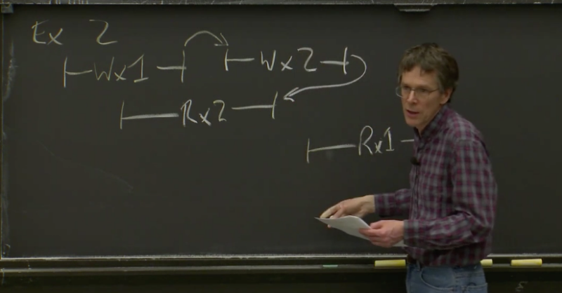
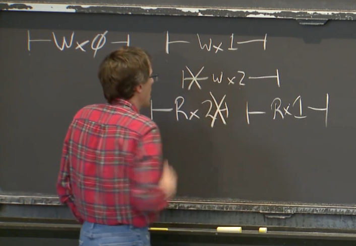

接 Raft 01 的内容

---

# 日志恢复（Log Backup）

我们现在处于这样一个场景

我们假设下一个任期是 6。尽管你无法从黑板上确认这一点，但是下一个任期号至少是 6 或者更大。我们同时假设 S3 在任期 6 被选为 Leader。在某个时刻，新 Leader S3 会发送任期 6 的第一个 AppendEntries RPC，来传输任期 6 的第一个 Log，这个 Log 应该在槽位 13。

这里的 AppendEntries 消息实际上有两条，因为要发给两个 Followers。它们包含了客户端发送给 Leader 的请求。我们现在想将这个请求复制到所有的 Followers 上。这里的 AppendEntries RPC 还包含了 prevLogIndex 字段和 prevLogTerm 字段。所以 Leader 在发送 AppendEntries 消息时，会附带前一个槽位的信息。在我们的场景中，prevLogIndex 是前一个槽位的位置，也就是 12；prevLogTerm 是 S3 上前一个槽位的任期号，也就是 5。

这样的 AppendEntries 消息发送给了 Followers。而 Followers，它们在收到 AppendEntries 消息时，可以知道它们收到了一个带有若干 Log 条目的消息，并且是从槽位 13 开始。Followers 在写入 Log 之前，会检查本地的前一个 Log 条目，是否与 Leader 发来的有关前一条 Log 的信息匹配。

所以对于 S2 它显然是不匹配的。S2 在槽位 12 已经有一个条目，但是它来自任期 4，而不是任期 5。所以 S2 将拒绝这个 AppendEntries，并返回 False 给 Leader。S1 在槽位 12 还没有任何 Log，所以 S1 也将拒绝 Leader 的这个 AppendEntries。到目前位置，一切都还好。为什么这么说呢？因为我们完全不想看到的是，S2 把这条新的 Log 添加在槽位 13。因为这样会破坏 Raft 论文中图 2 所依赖的归纳特性，并且隐藏 S2 实际上在槽位 12 有一条不同的 Log 的这一事实。

所以 S1 和 S2 都没有接受这条 AppendEntries 消息，所以，Leader 看到了两个拒绝。

Leader 为每个 Follower 维护了 nextIndex。所以它有一个 S2 的 nextIndex，还有一个 S1 的 nextIndex。之前没有说明的是，如果 Leader 之前发送的是有关槽位 13 的 Log，这意味着 Leader 对于其他两个服务器的 nextIndex 都是 13。这种情况发生在 Leader 刚刚当选，因为 Raft 论文的图 2 规定了，nextIndex 的初始值是从新任 Leader 的最后一条日志开始，而在我们的场景中，对应的就是槽位 13.

为了响应 Followers 返回的拒绝，Leader 会减小对应的 nextIndex。所以它现在减小了两个 Followers 的 nextIndex。这一次，Leader 发送的 AppendEntries 消息中，prevLogIndex 等于 11，prevLogTerm 等于 3。同时，这次 Leader 发送的 AppendEntries 消息包含了 prevLogIndex 之后的所有条目，也就是 S3 上槽位 12 和槽位 13 的 Log。

对于 S2 来说，这次收到的 AppendEntries 消息中，prevLogIndex 等于 11，prevLogTerm 等于 3，与自己本地的 Log 匹配，所以，S2 会接受这个消息。Raft 论文中的图 2 规定，如果接受一个 AppendEntries 消息，那么需要首先删除本地相应的 Log（如果有的话），再用 AppendEntries 中的内容替代本地 Log。所以，S2 会这么做：它会删除本地槽位 12 的记录，再添加 AppendEntries 中的 Log 条目。这个时候，S2 的 Log 与 S3 保持了一致。

但是，S1 仍然有问题，因为它的槽位 11 是空的，所以它不能匹配这次的 AppendEntries。它将再次返回 False。而 Leader 会将 S1 对应的 nextIndex 变为 11，并在 AppendEntries 消息中带上从槽位 11 开始之后的 Log（也就是槽位 11，12，13 对应的 Log）。并且带上相应的 prevLogIndex（10）和 prevLogTerm（3）。

这次的请求可以被 S1 接受，并得到肯定的返回。现在它们都有了一致的 Log。

而 Leader 在收到了 Followers 对于 AppendEntries 的肯定的返回之后，它会增加相应的 nextIndex 到 14。

在这里，Leader 使用了一种备份机制来探测 Followers 的 Log 中，第一个与 Leader 的 Log 相同的位置。在获得位置之后，Leader 会给 Follower 发送从这个位置开始的，剩余的全部 Log。经过这个过程，所有节点的 Log 都可以和 Leader 保持一致。

重复一个我们之前讨论过的话题，或许我们还会再讨论。在刚刚的过程中，我们擦除了一些 Log 条目，比如我们刚刚删除了 S2 中的槽位 12 的 Log。这个位置是任期 4 的 Log。现在的问题是，为什么 Raft 系统可以安全的删除这条记录？毕竟我们在删除这条记录时，某个相关的客户端请求也随之被丢弃了。

我在上堂课说过这个问题，这里的原理是什么呢？是的，这条 Log 条目并没有存在于过半服务器中，因此无论之前的 Leader 是谁，发送了这条 Log，它都没有得到过半服务器的认可。因此旧的 Leader 不可能 commit 了这条记录，也就不可能将它应用到应用程序的状态中，进而也就不可能回复给客户端说请求成功了。因为它没有存在于过半服务器中，发送这个请求的客户端没有理由认为这个请求被执行了，也不可能得到一个回复。因为这里有一条规则就是，Leader 只会在 commit 之后回复给客户端。客户端甚至都没有理由相信这个请求被任意服务器收到了。并且，Raft 论文中的图 2 说明，如果客户端发送请求之后一段时间没有收到回复，它应该重新发送请求。所以我们知道，不论这个被丢弃的请求是什么，我们都没有执行它，没有把它包含在任何状态中，并且客户端之后会重新发送这个请求。

> 学生提问：前面的过程中，为什么总是删除 Followers 的 Log 的结尾部分？
>
> Robert教授：一个备选的答案是，Leader 有完整的 Log，所以当 Leader 收到有关 AppendEntries 的 False 返回时，它可以发送完整的日志给 Follower。如果你刚刚启动系统，甚至在一开始就发生了非常反常的事情，某个 Follower 可能会从第一条 Log 条目开始恢复，然后让 Leader 发送整个 Log 记录，因为 Leader 有这些记录。如果有必要的话，Leader 拥有填充每个节点的日志所需的所有信息。

---

# 选举约束（Election Restriction）

在前面的例子中，我们选择 S3 作为 Leader。现在有个问题是，哪些节点允许成为 Leader？

如果你读了 Raft 论文，那么你就知道答案：为了保证系统的正确性，并非任意节点都可以成为 Leader。不是说第一个选举定时器超时了并触发选举的节点，就一定是 Leader。Raft 对于谁可以成为 Leader，谁不能成为 Leader 是有一些限制的。

为了证明并非任意节点都可以成为 Leader，我们这里提出一个例子来证伪。在这个反例中，Raft 会选择拥有最长 Log 记录的节点作为 Leader，这个规则或许适用于其他系统，实际上在一些其他设计的系统中的确使用了这样的规则，但是在 Raft 中，这条规则不适用。所以，我们这里需要研究的问题是：为什么不选择拥有最长 Log 记录的节点作为 Leader？如果我们这么做了的话，我们需要更改 Raft 中的投票规则，让选民只投票给拥有更长 Log 记录的节点。

很容易可以展示为什么这是一个错误的观点。我们还是假设我们有 3 个服务器，现在服务器 1（S1）有任期 5，6，7 的 Log，服务器 2 和服务器 3（S2 和 S3）有任期 5，8 的 Log。

为了避免我们在不可能出现的问题上浪费时间，这里的第一个问题是，这个场景可能出现吗？让我们回退一些时间，在这个时间点 S1 赢得了选举，现在它的任期号是 6。它收到了一个客户端请求，在发出 AppendEntries 之前，它先将请求存放在自己的 Log 中，然后它就故障了，所以它没能发出任何 AppendEntries 消息。

之后它很快就故障重启了，因为它是之前的 Leader，所以会有一场新的选举。这次，它又被选为 Leader。然后它收到了一个任期 7 的客户端请求，将这个请求加在本地 Log 之后，它又故障了。

S1 故障之后，我们又有了一次新的选举，这时 S1 已经关机了，不能再参加选举，这次 S2 被选为 Leader。如果 S2 当选，而 S1 还在关机状态，S2 会使用什么任期号呢？

明显我们的答案是 8（因为之前画出来了），但是为什么任期号是 8 而不是 6 呢？尽管没有写在黑板上，但是 S1 在任期 6，7 能当选，它必然拥有了过半节点的投票，过半服务器至少包含了 S2，S3 中的一个节点。如果你去看处理 RequestVote 的代码和 Raft 论文的图 2，当某个节点为候选人投票时，节点应该将候选人的任期号记录在持久化存储中。所里在这里，S2 或者 S3 或者它们两者都知道任期 6 和任期 7 的存在。因此，当 S1 故障了，它们中至少一个知道当前的任期是 8。这里，只有知道了任期 8 的节点才有可能当选，如果只有一个节点知道，那么这个节点会赢得选举，因为它拥有更高的任期号。如果 S2 和 S3 都知道当前任期是 8，那么它们两者中的一个会赢得选举。所以，下一个任期必然为 8 这个事实，依赖于不同任期的过半服务器之间必然有重合这个特点。同时，也依赖任期号会通过 RequestVote RPC 更新给其他节点，并持久化存储，这样出现故障才不会丢失数据。所以下一个任期号将会是 8，S2 或者 S3 会赢得选举。不管是哪一个，新的 Leader 会继续将客户端请求转换成 AppendEntries 发给其他节点。所以我们现在有了这么一个场景。

现在我们回到对于这个场景的最初的问题，假设 S1 重新上线了，并且我们又有了一次新的选举，这时候可以选择 S1 作为 Leader 吗？或者说，可以选择拥有最长 Log 记录的节点作为 Leader 可以吗？明显，答案是不可以的。

如果 S1 是 Leader，它会通过 AppendEntries 机制将自己的 Log 强加给 2 个 Followers，这个我们刚刚（上一节）说过了。如果我们让 S1 作为 Leader，它会发出 AppendEntries 消息来覆盖 S2 和 S3 在任期 8 的 Log，并在 S2 和 S3 中写入 S1 中的任期 6 和任期 7 的 Log，这样所有的节点的 Log 才能与 S1 保持一致。为什么我们不能认可这样的结果呢？

是的，因为 S2 和 S3 可以组成过半服务器，所以任期 8 的 Log 已经被 commit 了，对应的请求很可能已经执行了，应用层也很可能发送一个回复给客户端了。所以我们不能删除任期 8 的 Log。因此，S1 也就不能成为 Leader 并将自己的 Log 强制写入 S2 和 S3。大家都明白了为什么这对于 Raft 来说是个坏的结果吗？正因为这个原因，我们不能在选举的时候直接选择拥有最长 Log 记录的节点。当然，最短 Log 记录的节点也不行。

在 Raft 论文的 5.4.1，Raft 有一个稍微复杂的选举限制（Election Restriction）。这个限制要求，在处理别节点发来的 RequestVote RPC 时，需要做一些检查才能投出赞成票。这里的限制是，节点只能向满足下面条件之一的候选人投出赞成票：

1. 候选人最后一条 Log 条目的任期号大于本地最后一条 Log 条目的任期号；
2. 或者，候选人最后一条 Log 条目的任期号等于本地最后一条 Log 条目的任期号，且候选人的 Log 记录长度大于等于本地 Log 记录的长度

回到我们的场景，如果 S2 收到了 S1 的 RequestVote RPC，因为 S1 的最后一条 Log 条目的任期号是 7，而 S2 的最后一条 Log 条目的任期号是 8，两个限制都不满足，所以 S2 和 S3 都不会给 S1 投赞成票。即使 S1 的选举定时器的超时时间更短，并且先发出了 RequestVote 请求，除了它自己，没人会给它投票，所以它只能拿到一个选票，不能凑够过半选票。如果 S2 或者 S3 成为了候选人，它们中的另一个都会投出赞成票，因为它们最后的任期号一样，并且它们的 Log 长度大于等于彼此（满足限制 2）。所以 S2 或者 S3 中的任意一个都会为另一个投票。S1 会为它们投票吗？会的，因为 S2 或者 S3 最后一个 Log 条目对应的任期号更大（满足限制 1）。

所以在这里，Raft 更喜欢拥有更高任期号记录的候选人，或者说更喜欢拥有任期号更高的旧 Leader 记录的候选人。限制 2 说明，如果候选人都拥有任期号最高的旧 Leader 记录，那么 Raft 更喜欢拥有更多记录的候选人。

---

# 快速恢复（Fast Backup）

在前面介绍的日志恢复机制中，如果 Log 有冲突，Leader 每次会回退一条 Log 条目。 这在许多场景下都没有问题。但是在某些现实的场景中，至少在 Lab2 的测试用例中，每次只回退一条 Log 条目会花费很长很长的时间。所以，现实的场景中，可能一个 Follower 关机了很长时间，错过了大量的 AppendEntries 消息。这时，Leader 重启了。按照 Raft 论文中的图 2，如果一个 Leader 重启了，它会将所有 Follower的nextIndex 设置为 Leader 本地 Log 记录的下一个槽位。所以，如果一个 Follower 关机并错过了 1000 条 Log 条目，Leader 重启之后，需要每次通过一条 RPC 来回退一条 Log 条目来遍历 1000 条 Follower 错过的 Log 记录。这种情况在现实中并非不可能发生。在一些不正常的场景中，假设我们有 5 个服务器，有 1 个 Leader，这个 Leader 和另一个 Follower 困在一个网络分区。但是这个 Leader 并不知道它已经不再是 Leader了。它还是会向它唯一的 Follower 发送 AppendEntries，因为这里没有过半服务器，所以没有一条 Log 会 commit。在另一个有多数服务器的网络分区中，系统选出了新的 Leader 并继续运行。旧的 Leader 和它的 Follower 可能会记录无限多的旧的任期的未 commit 的 Log。当旧的 Leader 和它的 Follower 重新加入到集群中时，这些 Log 需要被删除并覆盖。可能在现实中，这不是那么容易发生，但是你会在 Lab2 的测试用例中发现这个场景。

所以，为了能够更快的恢复日志，Raft 论文在论文的 5.3 结尾处，对一种方法有一些模糊的描述。原文有些晦涩，在这里我会以一种更好的方式尝试解释论文中有关快速恢复的方法。这里的大致思想是，让 Follower 返回足够的信息给 Leader，这样 Leader 可以以任期（Term）为单位来回退，而不用每次只回退一条 Log 条目。所以现在，在恢复 Follower 的 Log 时，如果 Leader 和 Follower 的 Log 不匹配，Leader 只需要对每个不同的任期发送一条 AppendEntries，而不用对每个不同的 Log 条目发送一条 AppendEntries。这只是一种加速策略，当然，或许你也可以想出许多其他不同的日志恢复加速策略。

我将可能出现的场景分成 3 类，为了简化，这里只画出一个 Leader（S2）和一个 Follower（S1），S2 将要发送一条任期号为 6 的 AppendEntries 消息给 Follower。

场景 1：S1 没有任期 6 的任何 Log，因此我们需要回退一整个任期的 Log。

场景 2：S1 收到了任期 4 的旧 Leader 的多条 Log，但是作为新 Leader，S2 只收到了一条任期 4 的 Log。所以这里，我们需要覆盖 S1 中有关旧 Leader 的一些 Log。

场景 3：S1 与 S2 的 Log 不冲突，但是 S1 缺失了部分 S2 中的 Log。

可以让 Follower 在回复 Leader 的 AppendEntries 消息中，携带 3 个额外的信息，来加速日志的恢复。这里的回复是指，Follower 因为 Log 信息不匹配，拒绝了 Leader 的 AppendEntries 之后的回复。这里的三个信息是指：

- XTerm：这个是 Follower 中与 Leader 冲突的 Log 对应的任期号。在之前有介绍 Leader 会在 prevLogTerm 中带上本地 Log 记录中，前一条 Log 的任期号。如果 Follower 在对应位置的任期号不匹配，它会拒绝 Leader 的 AppendEntries 消息，并将自己的任期号放在 XTerm 中。如果 Follower 在对应位置没有 Log，那么这里会返回 -1。
- XIndex：这个是 Follower 中，对应任期号为 XTerm 的第一条 Log 条目的槽位号。
- XLen：如果 Follower 在对应位置没有 Log，那么 XTerm 会返回 -1，XLen 表示空白的 Log 槽位数。

我们再来看这些信息是如何在上面 3 个场景中，帮助 Leader 快速回退到适当的 Log 条目位置。

- 场景1。Follower（S1）会返回 XTerm=5，XIndex=2。Leader（S2）发现自己没有任期 5 的日志，它会将自己本地记录的，S1 的 nextIndex 设置到 XIndex，也就是 S1 中，任期 5 的第一条 Log 对应的槽位号。所以，如果 Leader 完全没有 XTerm 的任何 Log，那么它应该回退到 XIndex 对应的位置（这样，Leader 发出的下一条 AppendEntries 就可以一次覆盖 S1 中所有 XTerm 对应的 Log）。
- 场景2。Follower（S1）会返回 XTerm=4，XIndex=1。Leader（S2）发现自己其实有任期 4 的日志，它会将自己本地记录的 S1 的 nextIndex 设置到本地在 XTerm 位置的 Log 条目后面，也就是槽位 2。下一次 Leader 发出下一条 AppendEntries 时，就可以一次覆盖 S1 中槽位 2 和槽位 3 对应的 Log。
- 场景3。Follower（S1）会返回 XTerm=-1，XLen=2。这表示 S1 中日志太短了，以至于在冲突的位置没有 Log 条目，Leader 应该回退到 Follower 最后一条 Log 条目的下一条，也就是槽位 2，并从这开始发送 AppendEntries 消息。槽位 2 可以从 XLen 中的数值计算得到。

这些信息在 Lab 中会有用，如果你错过了我的描述，你可以再看看视频（Robert教授说的）。

对于这里的快速回退机制有什么问题吗？

> 学生提问：这里是线性查找，可以使用类似二分查找的方法进一步加速吗？
>
> Robert教授：我认为这是对的，或许这里可以用二分查找法。我没有排除其他方法的可能，我的意思是，Raft 论文中并没有详细说明是怎么做的，所以我这里加工了一下。或许有更好，更快的方式来完成。如果 Follower 返回了更多的信息，那是可以用一些更高级的方法，例如二分查找，来完成。
>
> 为了通过 Lab2 的测试，你肯定需要做一些优化工作。我们提供的 Lab2 的测试用例中，有一件不幸但是不可避免的事情是，它们需要一些实时特性。这些测试用例不会永远等待你的代码执行完成并生成结果。所以有可能你的方法技术上是对的，但是花了太多时间导致测试用例退出。这个时候，你是不能通过全部的测试用例的。因此你的确需要关注性能，从而使得你的方案即是正确的，又有足够的性能。不幸的是，性能与 Log 的复杂度相关，所以很容易就写出一个正确但是不够快的方法出来。

> 学生提问：能在解释一下这里的流程吗？
>
> Robert教授：这里，Leader 发现冲突的方法在于，Follower 会返回它从冲突条目中看到的任期号（XTerm）。在场景 1 中，Follower 会设置 XTerm=5，因为这是有冲突的 Log 条目对应的任期号。Leader 会发现，哦，我的 Log 中没有任期 5 的条目。因此，在场景 1 中，Leader 会一次性回退到 Follower 在任期 5 的起始位置。因为 Leader 并没有任何任期 5 的 Log，所以它要删掉 Follower 中所有任期 5 的 Log，这通过回退到 Follower 在任期 5 的第一条 Log 条目的位置，也就是 XIndex 达到的。

---

# 持久化（Persistence）

下一个我想介绍的是持久化存储（persistence）。你可以从 Raft 论文的图 2 的左上角看到，有些数据被标记为持久化的（Persistent），有些信息被标记为非持久化的（Volatile）。持久化和非持久化的区别只在服务器重启时重要。当你更改了被标记为持久化的某个数据，服务器应该将更新写入到磁盘，或者其它的持久化存储中，例如一个电池供电的 RAM。持久化的存储可以确保当服务器重启时，服务器可以找到相应的数据，并将其加载到内存中。这样可以使得服务器在故障并重启后，继续重启之前的状态。

你或许会认为，如果一个服务器故障了，那简单直接的方法就是将它从集群中摘除。我们需要具备从集群中摘除服务器，替换一个全新的空的服务器，并让该新服务器在集群内工作的能力。实际上，这是至关重要的，因为如果一些服务器遭受了不可恢复的故障，例如磁盘故障，你绝对需要替换这台服务器。同时，如果磁盘故障了，你也不能指望能从该服务器的磁盘中获得任何有用的信息。所以我们的确需要能够用全新的空的服务器替代现有服务器的能力。你或许认为，这就足以应对任何出问题的场景了，但实际上不是的。

实际上，一个常见的故障是断电。断电的时候，整个集群都同时停止运行，这种场景下，我们不能通过从 Dell 买一些新的服务器来替换现有服务器进而解决问题。这种场景下，如果我们希望我们的服务是容错的， 我们需要能够得到之前状态的拷贝，这样我们才能保持程序继续运行。因此，至少为了处理同时断电的场景，我们不得不让服务器能够将它们的状态存储在某处，这样当供电恢复了之后，还能再次获取这个状态。这里的状态是指，为了让服务器在断电或者整个集群断电后，能够继续运行所必不可少的内容。这是理解持久化存储的一种方式。

在 Raft 论文的图 2 中，有且仅有三个数据是需要持久化存储的。它们分别是 Log、currentTerm、votedFor。Log 是所有的 Log 条目。当某个服务器刚刚重启，在它加入到 Raft 集群之前，它必须要检查并确保这些数据有效的存储在它的磁盘上。服务器必须要有某种方式来发现，自己的确有一些持久化存储的状态，而不是一些无意义的数据。

Log 需要被持久化存储的原因是，这是唯一记录了应用程序状态的地方。Raft 论文图 2 并没有要求我们持久化存储应用程序状态。假如我们运行了一个数据库或者为 VMware FT 运行了一个 Test-and-Set 服务，根据 Raft 论文图 2，实际的数据库或者实际的 test-set 值，并不会被持久化存储，只有 Raft 的 Log 被存储了。所以当服务器重启时，唯一能用来重建应用程序状态的信息就是存储在 Log 中的一系列操作，所以 Log 必须要被持久化存储。

那 currentTerm 呢？为什么 currentTerm 需要被持久化存储？是的，currentTerm 和 votedFor 都是用来确保每个任期只有最多一个 Leader。在一个故障的场景中，如果一个服务器收到了一个 RequestVote 请求，并且为服务器 1 投票了，之后它故障。如果它没有存储它为哪个服务器投过票，当它故障重启之后，收到了来自服务器 2 的同一个任期的另一个 RequestVote 请求，那么它还是会投票给服务器 2，因为它发现自己的 votedFor 是空的，因此它认为自己还没投过票。现在这个服务器，在同一个任期内同时为服务器 1 和服务器 2 投了票。因为服务器 1 和服务器 2 都会为自己投票，它们都会认为自己有过半选票（3 票中的 2 票），那它们都会成为 Leader。现在同一个任期里面有了两个 Leader。这就是为什么 votedFor 必须被持久化存储。

currentTerm 的情况要更微妙一些，但是实际上还是为了实现一个任期内最多只有一个 Leader，我们之前实际上介绍过这里的内容。如果（重启之后）我们不知道任期号是什么，很难确保一个任期内只有一个 Leader。

在这里例子中，S1 关机了，S2 和 S3 会尝试选举一个新的 Leader。它们需要证据证明，正确的任期号是 8，而不是 6。如果仅仅是 S2 和 S3 为彼此投票，它们不知道当前的任期号，它们只能查看自己的 Log，它们或许会认为下一个任期是 6（因为 Log 里的上一个任期是 5）。如果它们这么做了，那么它们会从任期 6 开始添加 Log。但是接下来，就会有问题了，因为我们有了两个不同的任期 6（另一个在 S1 中）。这就是为什么 currentTerm 需要被持久化存储的原因，因为它需要用来保存已经被使用过的任期号。

这些数据需要在每次你修改它们的时候存储起来。所以可以确定的是，安全的做法是每次你添加一个 Log 条目，更新 currentTerm 或者更新 votedFor，你或许都需要持久化存储这些数据。在一个真实的 Raft 服务器上，这意味着将数据写入磁盘，所以你需要一些文件来记录这些数据。如果你发现，直到服务器与外界通信时，才有可能持久化存储数据，那么你可以通过一些批量操作来提升性能。例如，只在服务器回复一个 RPC 或者发送一个 RPC 时，服务器才进行持久化存储，这样可以节省一些持久化存储的操作。

之所以这很重要是因为，向磁盘写数据是一个代价很高的操作。如果是一个机械硬盘，我们通过写文件的方式来持久化存储，向磁盘写入任何数据都需要花费大概 10 毫秒时间。因为你要么需要等磁盘将你想写入的位置转到磁针下面， 而磁盘大概每 10 毫秒转一次。要么，就是另一种情况更糟糕，磁盘需要将磁针移到正确的轨道上。所以这里的持久化操作的代价可能会非常非常高。对于一些简单的设计，这些操作可能成为限制性能的因素，因为它们意味着在这些 Raft 服务器上执行任何操作，都需要 10 毫秒。而 10 毫秒相比发送 RPC 或者其他操作来说都太长了。如果你持久化存储在一个机械硬盘上，那么每个操作至少要 10 毫秒，这意味着你永远也不可能构建一个每秒能处理超过 100 个请求的 Raft 服务。这就是所谓的 synchronous disk updates 的代价。它存在于很多系统中，例如运行在你的笔记本上的文件系统。

设计人员花费了大量的时间来避开 synchronous disk updates 带来的性能问题。为了让磁盘的数据保证安全，同时为了能安全更新你的笔记本上的磁盘，文件系统对于写入操作十分小心，有时需要等待磁盘（前一个）写入完成。所以这（优化磁盘写入性能）是一个出现在所有系统中的常见的问题，也必然出现在 Raft 中。

如果你想构建一个能每秒处理超过 100 个请求的系统，这里有多个选择。其中一个就是，你可以使用 SSD 硬盘，或者某种闪存。SSD 可以在 0.1 毫秒完成对于闪存的一次写操作，所以这里性能就提高了 100 倍。更高级一点的方法是，你可以构建一个电池供电的 DRAM，然后在这个电池供电的 DRAM 中做持久化存储。这样，如果 Server 重启了，并且重启时间短于电池的可供电时间，这样你存储在 RAM 中的数据还能保存。如果资金充足，且不怕复杂的话，这种方式的优点是，你可以每秒写 DRAM 数百万次，那么持久化存储就不再会是一个性能瓶颈。所以，synchronous disk updates 是为什么数据要区分持久化和非持久化（而非所有的都做持久化）的原因（越少数据持久化，越高的性能）。Raft 论文图 2 考虑了很多性能，故障恢复，正确性的问题。

有任何有关持久化存储的问题吗？

> 学生提问：当你写你的 Raft 代码时，你实际上需要确认，当你持久化存储一个 Log 或者 currentTerm，这些数据是否实时的存储在磁盘中，你该怎么做来确保它们在那呢？
>
> Robert教授：在一个 UNIX 或者一个 Linux 或者一个 Mac 上，为了调用系统写磁盘的操作，你只需要调用 write 函数，在 write 函数返回时，并不能确保数据存在磁盘上，并且在重启之后还存在。几乎可以确定（write 返回之后）数据不会在磁盘上。所以，如果在 UNIX 上，你调用了 write，将一些数据写入之后，你需要调用 fsync。在大部分系统上，fsync 可以确保在返回时，所有之前写入的数据已经安全的存储在磁盘的介质上了。之后，如果机器重启了，这些信息还能在磁盘上找到。fsync 是一个代价很高的调用，这就是为什么它是一个独立的函数，也是为什么 write 不负责将数据写入磁盘，fsync 负责将数据写入磁盘。因为写入磁盘的代价很高，你永远也不会想要执行这个操作，除非你想要持久化存储一些数据。

所以你可以使用一些更贵的磁盘。另一个常见方法是，批量执行操作。如果有大量的客户端请求，或许你应该同时接收它们，但是先不返回。等大量的请求累积之后，一次性持久化存储（比如）100 个 Log，之后再发送 AppendEntries。如果 Leader 收到了一个客户端请求，在发送 AppendEntries RPC 给 Followers 之前，必须要先持久化存储在本地。因为 Leader 必须要 commit 那个请求，并且不能忘记这个请求。实际上，在回复 AppendEntries 消息之前，Followers 也需要持久化存储这些 Log 条目到本地，因为它们最终也要 commit 这个请求，它们不能因为重启而忘记这个请求。

最后，有关持久化存储，还有一些细节。有些数据在 Raft 论文的图 2 中标记为非持久化的。所以，这里值得思考一下，为什么服务器重启时，commitIndex、lastApplied、nextIndex、matchIndex 可以被丢弃？例如，lastApplied 表示当前服务器执行到哪一步，如果我们丢弃了它的话，我们需要重复执行 Log 条目两次（重启前执行过一次，重启后又要再执行一次），这是正确的吗？为什么可以安全的丢弃 lastApplied？

这里综合考虑了 Raft 的简单性和安全性。之所以这些数据是非持久化存储的，是因为 Leader 可以通过检查自己的 Log 和发送给 Followers 的 AppendEntries 的结果，来发现哪些内容已经 commit 了。如果因为断电，所有节点都重启了。Leader 并不知道哪些内容被 commit 了，哪些内容被执行了。但是当它发出 AppendEntries，并从 Followers 搜集回信息。它会发现，Followers 中有哪些 Log 与 Leader 的 Log 匹配，因此也就可以发现，在重启前，有哪些被 commit 了。

另外，Raft 论文的图 2 假设，应用程序状态会随着重启而消失。所以图 2 认为，既然 Log 已经持久化存储了，那么应用程序状态就不必再持久化存储。因为在图 2 中，Log 从系统运行的初始就被持久化存储下来。所以，当 Leader 重启时，Leader 会从第一条 Log 开始，执行每一条 Log 条目，并提交给应用程序。所以，重启之后，应用程序可以通过重复执行每一条 Log 来完全从头构建自己的状态。这是一种简单且优雅的方法，但是很明显会很慢。这将会引出我们的下一个话题：Log compaction 和 Snapshot。

---

# 日志快照（Log Snapshot）

Log 压缩和快照（Log compaction and snapshots）在 Lab3b 中出现的较多。在 Raft 中，Log 压缩和快照解决的问题是：对于一个长期运行的系统，例如运行了几周，几个月甚至几年，如果我们按照 Raft 论文图 2 的规则，那么 Log 会持续增长。最后可能会有数百万条 Log，从而需要大量的内存来存储。如果持久化存储在磁盘上，最终会消耗磁盘的大量空间。如果一个服务器重启了，它需要通过重新从头开始执行这数百万条 Log 来重建自己的状态。当故障重启之后，遍历并执行整个 Log 的内容可能要花费几个小时来完成。这在某种程度上来说是浪费，因为在重启之前，服务器已经有了一定的应用程序状态。

为了应对这种场景，Raft 有了快照（Snapshots）的概念。快照背后的思想是，要求应用程序将其状态的拷贝作为一种特殊的 Log 条目存储下来。我们之前几乎都忽略了应用程序，但是事实是，假设我们基于 Raft 构建一个 key-value 数据库，Log 将会包含一系列的 Put/Get 或者 Read/Write 请求。假设一条 Log 包含了一个 Put 请求，客户端想要将 X 设置成 1，另一条 Log 想要将 X 设置成 2，下一条将 Y 设置成 7。

如果 Raft 一直执行没有故障，Raft 之上的将会是应用程序，在这里，应用程序将会是 key-value 数据库。它将会维护一个表单，当 Raft 一个接一个的上传命令时，应用程序会更新它的表单。所以第一个命令之后，应用程序会将表单中的 X 设置为 1。第二个命令之后，表单中的 X 会被设置为 2。第三个命令之后，表单中的 Y 会被设置为 7。

这里有个有趣的事实，那就是：对于大多数的应用程序来说，应用程序的状态远小于 Log 的大小。某种程度上我们知道，在某些时间点，Log 和应用程序的状态是可以互换的，它们是用来表示应用程序状态的不同事物。但是 Log 可能包含大量的重复的记录（例如对于 X 的重复赋值），这些记录使用了 Log 中的大量的空间，但是同时却压缩到了 key-value 表单中的一条记录。这在多副本系统中很常见。在这里，如果存储 Log，可能尺寸会非常大，相应的，如果存储 key-value 表单，这可能比 Log 尺寸小得多。这就是快照的背后原理。

所以，当 Raft 认为它的 Log 将会过于庞大，例如大于 1MB，10MB 或者任意的限制，Raft 会要求应用程序在 Log 的特定位置，对其状态做一个快照。所以，如果 Raft 要求应用程序做一个快照，Raft 会从 Log 中选取一个与快照对应的点，然后要求应用程序在那个点的位置做一个快照。这里极其重要，因为我们接下来将会丢弃所有那个点之前的 Log 记录。如果我们有一个点的快照，那么我们可以安全的将那个点之前的 Log 丢弃。（在 key-value 数据库的例子中）快照本质上就是 key-value 表单。

我们还需要为快照标注 Log 的槽位号。在这个图里面，这个快照对应的正好是槽位 3。

有了快照，并且 Raft 将它存放在磁盘中之后，Raft 将不会再需要这部分 Log。只要 Raft 持久化存储了快照，快照对应的 Log 槽位号，以及 Log 槽位号之后的所有 Log，那么快照对应槽位号之前的这部分 Log 可以被丢弃，我们将不再需要这部分 Log。

所以这就是 Raft 快照的工作原理，Raft 要求应用程序做快照，得到快照之后将其存储在磁盘中，同时持久化存储快照之后的 Log，并丢弃快照之前的 Log。所以，Raft 的持久化存储实际上是持久化应用程序快照，和快照之后的 Log。大家都明白了吗？

> 学生提问：听不清。
>
> Robert教授：或许可以这样看这些 Log，快照之后的 Log 是实际存在的，而快照之前的 Log 可以认为是幽灵条目，我们可以认为它们还在那，只是说我们永远不会再去查看它们了， 因为我们现在有快照了。事实上，我们不再存储幽灵条目，但是效果上是等效于有完整的 Log。

刚刚的回答可能有些草率。因为如果按照 Raft 论文的图 2，你有时还是需要这些早期的 Log（槽位 1，2，3）。所以，在知道了有时候某些 Log 可能不存在的事实之后，你可能需要稍微重新理解一下图 2。

所以，重启的时候会发生什么呢？现在，重启的场景比之前只有 Log 会更加复杂一点。重启的时候，必须让 Raft 有方法知道磁盘中最近的快照和 Log 的组合，并将快照传递给应用程序。因为现在我们不能重演所有的 Log（部分被删掉了），所以必须要有一种方式来初始化应用程序。所以应用程序不仅需要有能力能生成一个快照，它还需要能够吸纳一个之前创建的快照，并通过它稳定的重建自己的内存。所以，尽管 Raft 在管理快照，快照的内容实际上是应用程序的属性。Raft 并不理解快照中有什么，只有应用程序知道，因为快照里面都是应用程序相关的信息。所以重启之后，应用程序需要能够吸纳 Raft 能找到的最近的一次快照。到目前为止还算简单。

不幸的是，这里丢弃了快照之前的 Log，引入了大量的复杂性。如果有的 Follower 的 Log 较短，在 Leader 的快照之前就结束，那么除非有一种新的机制，否则那个 Follower 永远也不可能恢复完整的 Log。因为，如果一个 Follower 只有前两个槽位的 Log，Leader 不再有槽位 3 的 Log 可以通过 AppendEntries RPC 发给 Follower，Follower 的 Log 也就不可能补齐至 Leader 的 Log。

我们可以通过这种方式来避免这个问题：如果 Leader 发现有任何一个 Follower 的 Log 落后于 Leader 要做快照的点，那么 Leader 就不丢弃快照之前的 Log。Leader 原则上是可以知道 Follower 的 Log 位置，然后 Leader 可以不丢弃所有 Follower 中最短 Log 之后的本地 Log。

这或许是一个短暂的好方法，之所以这个方法不完美的原因在于，如果一个 Follower 关机了一周，它也就不能确认 Log 条目，同时也意味着 Leader 不能通过快照来减少自己的内存消耗（因为那个 Follower 的 Log 长度一直没有更新）。

所以，Raft 选择的方法是，Leader 可以丢弃 Follower 需要的 Log。所以，我们需要某种机制让 AppendEntries 能处理某些 Follower Log 的结尾到 Leader Log 开始之间丢失的这一段 Log。解决方法是（一个新的消息类型）InstallSnapshot RPC。

当 Follower 刚刚恢复，如果它的 Log 短于 Leader 通过 AppendEntries RPC 发给它的内容，那么它首先会强制 Leader 回退自己的 Log。在某个点，Leader 将不能再回退，因为它已经到了自己 Log 的起点。这时，Leader 会将自己的快照发给 Follower，之后立即通过 AppendEntries 将后面的 Log 发给 Follower。

不幸的是，这里明显的增加了的复杂度。因为这里需要 Raft 组件之间的协同，这里还有点违反模块性，因为这里需要组件之间有一些特殊的协商。例如，当 Follower 收到了 InstallSnapshot，这个消息是被 Raft 收到的，但是 Raft 实际需要应用程序能吸纳这个快照。所以它们现在需要更多的交互了。

> 学生提问：快照的创建是否依赖应用程序？
>
> Robert教授：肯定依赖。快照生成函数是应用程序的一部分，如果是一个 key-value 数据库，那么快照生成就是这个数据库的一部分。Raft 会通过某种方式调用到应用程序，通知应用程序生成快照，因为只有应用程序自己才知道自己的状态（进而能生成快照）。而通过快照反向生成应用程序状态的函数，同样也是依赖应用程序的。但是这里又有点纠缠不清，因为每个快照又必须与某个 Log 槽位号对应。

> 学生提问：如果 RPC 消息乱序该怎么处理？
>
> Robert教授：是在说 Raft 论文图 13 的规则 6 吗？这里的问题是，你们会在 Lab3 遇到这个问题，因为 RPC 系统不是完全的可靠和有序，RPC 可以乱序的到达，甚至不到达。你或许发了一个 RPC，但是收不到回复，并认为这个消息丢失了，但是消息实际上送达了，实际上是回复丢失了。所有这些都可能发生，包括发生在 InstallSnapshot RPC 中。Leader 几乎肯定会并发发出大量 RPC，其中包含了 AppendEntries 和 InstallSnapshot，因此，Follower 有可能受到一条很久以前的 InstallSnapshot 消息。因此，Follower 必须要小心应对 InstallSnapshot 消息。我认为，你想知道的是，如果 Follower 收到了一条 InstallSnapshot 消息，但是这条消息看起来完全是冗余的，这条 InstallSnapshot 消息包含的信息比当前 Follower 的信息还要老，这时，Follower 该如何做？
>
> Raft 论文图 13 的规则 6 有相应的说明。我认为正常的响应是，Follower 可以忽略明显旧的快照。其实我（Robert教授）看不懂那条规则 6。

---

# 线性一致（Linearizability）

接下来我们看一些更偏概念性的东西。目前为止，我们还没有尝试去确定正确意味着什么？当一个多副本服务或者任意其他服务正确运行意味着什么？ 绝大多数时候，我都避免去考虑太多有关正确的精确定义。但事实是，当你尝试去优化一些东西，或者当你尝试去想明白一些奇怪的 corner case，如果有个正式的方式定义什么是正确的行为，经常会比较方便。例如，当客户端通过 RPC 发送请求给我们的多副本服务时，可能是请求重发，可能是服务故障重启正在加载快照，或者客户端发送了请求并且得到了返回，但是这个返回是正确的吗？我们该如何区分哪个返回是正确的？所以，我们需要一个非常正式的定义来区分，什么是对的，什么是错的。

我们对于正确的定义就是线性一致（Linearizability）或者说强一致（Strong consistency）。通常来说，线性一致等价于强一致。一个服务是线性一致的，那么它表现的就像只有一个服务器，并且服务器没有故障，这个服务器每次执行一个客户端请求，并且没什么奇怪的是事情发生。

一个系统的执行历史是一系列的客户端请求，或许这是来自多个客户端的多个请求。如果执行历史整体可以按照一个顺序排列，且排列顺序与客户端请求的实际时间相符合，那么它是线性一致的。当一个客户端发出一个请求，得到一个响应，之后另一个客户端发出了一个请求，也得到了响应，那么这两个请求之间是有顺序的，因为一个在另一个完成之后才开始。一个线性一致的执行历史中的操作是非并发的，也就是时间上不重合的客户端请求与实际执行时间匹配。并且，每一个读操作都看到的是最近一次写入的值。（这里的定义可能比较晦涩，后面会再通过例子展开介绍，并重新回顾这里定义里面的两个限制条件。）

首先，执行历史是对于客户端请求的记录，你可以从系统的输入输出理解这个概念，而不用关心内部是如何实现的。如果一个系统正在工作，我们可以通过输入输出的消息来判断，系统的执行顺序是不是线性一致的。接下来，我们通过两个例子来看，什么是线性一致的，什么不是。

线性一致这个概念里面的操作，是从一个点开始，到另一个点结束。所以，这里前一个点对应了客户端发送请求，后一个点对应了收到回复的时间。我们假设，在某个特定的时间，客户端发送了请求，将 X 设置为 1。

过了一会，在第二条竖线处，客户端收到了一个回复。客户端在第一条竖线发送请求，在第二条竖线收到回复。

过了一会，这个客户端或者其他客户端再发送一个请求，要将 X 设置为 2，并收到了相应的回复。

同时，某个客户端发送了一个读 X 的请求，得到了 2。在第一条竖线发送读请求，在这个点，也就是第二条竖线，收到了值是 2 的响应。

同时，还有一个读 X 的请求，得到值是 1 的响应。

如果我们观察到了这样的输入输出（执行历史），那么这样的执行历史是线性一致的吗？生成这样结果的系统，是一个线性一致的系统吗？或者系统在这种场景下，可以生成线性一致的执行历史吗？如果执行历史不是线性一致的，那么至少在 Lab3，我们会有一些问题。所以，我们要分析并弄清楚，这里是不是线性一致的？

要达到线性一致，我们需要为这里的 4 个操作生成一个线性一致的顺序。所以我们现在要确定顺序，对于这个顺序，有两个限制条件：

1. 如果一个操作在另一个操作开始前就结束了，那么这个操作必须在执行历史中出现在另一个操作前面。
2. 执行历史中，读操作，必须在相应的 key 的写操作之后。

所以，这里我们要为 4 个操作创建一个顺序，两个读操作，两个写操作。我会通过箭头来标识刚刚两个限制条件，这样生成出来的顺序就能满足前面的限制条件。第一个写结束之后，第二个写才开始。所以一个限制条件是，在总的顺序中，第一个写操作必须在第二个写操作前面。

第一个读操作看到的是值 2，那么在总的顺序中，这个读必然在第二个写操作后面，同时第二个写必须是离第一个读操作最近一次写。所以，这意味着，在总的顺序中，我们必须先看到对 X 写 2，之后执行读 X 才能得到 2。

第二个读 X 得到的是值 1。我们假设 X 的值最开始不是 1，那么会有下图的关系，因为读必须在写之后。

第二个读操作必须在第二个写操作之前执行，这样写 X 为 1 的操作才能成为第二个读操作最近一次写操作。

或许还有一些其他的限制，但是不管怎样，我们将这些箭头展平成一个线性一致顺序来看看真实的执行历史，我们可以发现总的执行历史是线性一致的。首先是将 X 写 1，之后是读 X 得到 1，之后将 X 写 2，之后读 X 得到 2。（这里可以这么理解，左边是一个多副本系统的输入输出，因为分布式程序或者程序的执行，产生了这样的时序，但是在一个线性一致的系统中，实际是按照右边的顺序执行的操作。左边是实际时钟，右边是逻辑时钟。）

所以这里有个顺序且符合前面两个限制条件，所以执行历史是线性一致的。如果我们关心一个系统是否是线性一致的，那么这个例子里面的输入输出至少与系统是线性一致的这个假设不冲突。

让我再写一个不是线性一致的例子。我们假设有一个将 X 写 1 的请求，另一个将 X 写 2 的请求，还有一些读操作。

这里我们也通过箭头来表示限制，最后得到相应的执行顺序。因为第一个写操作在第二个写操作开始之前就结束，在我们生成的顺序中，它必须在第二个写操作之前。

第二个写操作，写的值是 2，所以必须在返回 2 的读操作之前，所以我们有了这样一条箭头。

返回 2 的读操作，在返回 1 的读操作开始之前结束，所以我们有这样的箭头。

因为返回 1 的读操作必须在设置 1 的写操作之后，并且更重要的是，必须要在设置 2 的写操作之前。因为我们不能将 X 写了 2 之后再读出 1 来。所以我们有了这样的箭头。

因为这里的限制条件有个循环，所以没有一个线性一致的顺序能够满足前面的限制条件，因此这里的执行历史不是线性一致的，所以生成这样结果的系统不是线性一致的系统。但是只要去掉循环里面的任意一个请求，就可以打破循环，又可以是线性一致的了。

上一节课，我对线性一致这个概念开了个头，这一次我们来讲完它。

之所以我们要再进一步介绍这个概念，是因为这是我们对于存储系统中强一致的一种标准定义。例如，你们在 Lab3 中实现的系统必须是线性一致的。有时，当我们在讨论一个强一致的系统时，我们会想知道一个特定的行为是否是可接受的。其他时候，例如，当我们在讨论一个非线性一致的系统时，我们可能会想知道系统会以什么方式偏离线性一致。所以，首先，你需要能够查看某个系统的执行历史记录，并且回答这个问题：刚刚查看的操作的序列是否是线性一致的？接下来我会继续分析，并构建几个有趣的例子来帮助我们理解线性一致系统的响应。

线性一致是特定的操作历史记录的特性。所以，我们总是会提到，我们观察到了一系列不同时间的客户端请求和这些请求的响应，它们请求不同的数据，并且得到了各种各样的回复，我们需要回答，这样的一个历史记录是不是线性的？

下面会介绍一个历史记录的例子，它或许是线性的，或许不是。我们用一个图表示这个例子，在图里面，越靠右，时间越靠后。同时我们有一些客户端。这里的竖线表示客户端发送了一个请求，并且这是个写请求，它将 key 为 X 的数据的值写成 0。所以这里有一个 key，一个 value，并且请求对应于将 key 为 X 的数据设置成 0 的 PUT 操作。

这是我们观察到的结果，客户端发出请求到我们的服务，某个时间点，服务响应了并说，好的，你的写操作完成了。

所以我们假设这里的服务具备通知请求完成的能力，否则我们很难判断线性一致。所以，我们有了某人发出的这个写请求。在这个例子中，我假设还有另一个请求。这根竖线意味着第二个请求在第一个请求结束之后开始。

这一点之所以重要的原因是，线性一致的历史记录必须与请求的实际时间匹配。这里的真实意思是在实际时间中，某个请求如果在另一个请求结束之后才开始，那么在我们构建用于证明线性一致的序列中，后来的请求都必须在先来的请求之后。

所以，在这里例子中，我假设有另一个写 X 的请求，将 X 写成 1。之后有个并发的写请求，或许比前一个请求开始的稍晚一点，将 X 写成 2。

这里我们有两个客户端，在差不多的时间发送了两个不同的请求，想将 X 设置成两个不同的值。所以，当然，我们想知道最后 X 会是哪个值？之后，我们还有一些读操作。当你只有一些写操作时，很难判断线性一致，因为你没有任何证据证明系统实际做了哪些操作，或者存储了什么数据，所以（在判断线性一致时）我们必须要有一些读操作。

我们假设有一些读操作，其中一个读操作，在第一条竖线发起，在第二条竖线得到回复。这个操作读的是 key X，得到的是 2。之后，有来自于同一个客户端的另一个读请求，但是这个请求在前一个读请求结束之后才开始，第二个读 X 的请求得到 1。

所以，我们面前现在有个问题，这个历史记录是不是线性一致的？这里有两种可能。要么我们能构建一个序列，同时满足：

1.  序列中的请求的顺序与实际时间匹配
2.  每个读请求看到的都是序列中前一个写请求写入的值

如果我们能构造这么一个序列，那么可以证明，这里的请求历史记录是线性的。

另一种可能是，如果将上面的规则应用之后生成了一个带环的图，那么证明请求历史记录不是线性一致的。对于小规模的历史记录，我们可以遍历每个请求来做判断。那么这里的请求历史记录是线性一致的吗？

>   学生回答1（Robert教授复述）：这里的回答是，这里有点麻烦。我们看到读 X 得到 2，之后读 X 得到 1，或许这里会自相矛盾。
>
>   因为这里有两个写请求，一个写入 1，另一个写入 2。如果我们读 X 得到了 3，那明显是个很糟糕的错误。但是现在有写 X 为 1 和 2 的请求，并且我们读到的 X 也是 1 和 2。所以，这里的问题是，这里的读请求的顺序是否会与请求历史记录中的两个写请求矛盾？

>   学生回答2（Robert教授复述答案）：在这里，我们或许有 2 个或者 3 个客户端，它们与某个服务交互，或许是个 Raft 服务。我们能看到的只有请求和响应。这里的意思是，我们看到了一个客户端请求写 X 为 1。

>   我们在这里看到了响应。所以我们知道，在这个区间里的某处，服务实际上在内部将 X 的值改为 1。

>   这里的意思是，在这个区间中的某处，服务在内部将 X 的值改为 2。这里可能是区间里的任意一个时间点。这回答了你的问题吗？

>   学生回答3（Robert教授复述答案）：所以这里的回答是，这里有实际的证据证明是线性一致的，也就是说有一个序列表明它是线性一致的。

所以是的，这里的请求历史记录是线性一致的。这里的序列是，首先是将 X 写 0 的请求，之后服务器收到了两个差不多时间的写操作，服务自己要为这两个写操作挑一个顺序。所以，我们可以假设，服务器先执行了将 X 写 2 的请求，之后执行读 X 返回 2 的请求，也就是第一个读 X 的请求。下一个请求是将 X 写 1 的请求，最后一个请求是读 X 返回 1。

所以，这就是证明这里的请求历史是线性一致的证据，因为这个序列有所有请求，并且这个序列匹配请求的实际时间。

我们来再过一遍所有的请求。将 X写 0 的请求在最开始，因为它在所有其他操作开始之前就结束了。我们将 X 写 2 的请求排第二。这里我会标记请求在实际时间中生效的位置，我用一个大 X 来标记这个请求实际发生的时间。所以，第二个请求的实际生效时间在这里。

下一个请求是读 X 得到 2。这里并没有时间上的问题，因为读 X 得到 2 实际上与写 X 为 2，这两个请求是并发的。这里并不是读 X 得到 2 结束之后，写 X 为 2 的请求才开始，这里它们是并发的。我们假设读 X 得到 2 的请求实际发生在这里。

我们并不关心第一个请求在什么时候发生。现在我们有了前 3 个请求的执行时间。

之后我们有个请求将 X 写为 1，我们假设它在实际时间中发生在这里，因为它必须在序列中的前一个请求之后发生。所以，这是第 4 个请求。

之后，我们有读 X 得到 1 的请求，它可能在任何时间发生，但是让我们假设它发生在这里。

所以，这里展示了一个与实际时间匹配的序列，我们可以为每一个请求，在其开始和结束时间的区间里面挑选一个时间，来执行这个请求，挑选的时间可以匹配请求的实际时间。

所以这里的最后一个问题是，每个读操作是不是看到了前一个写请求写入的值？这里的读 X 得到 2 的请求，在写 X 为 2 的请求之后，这没问题。 

读 X 得到 1 的请求，紧跟在在写 X 为 1 的请求之后。

所以这里的历史记录是线性一致的。

并不是所有的请求历史记录都能直接明了的判断是否是线性一致的。当看到这个例子里的历史记录时，很容易被误导。比如，写 X 为 1 的请求（比写 X 为 2 的请求）先开始，所以我们就假设 X 会先被写成 1，但是在实际中不一定是这样的。

大家有什么问题吗？

>   学生提问：如果将写 X 为 2 的开始时间改在读 X 为 2 的结束时间之后会怎样？
>
>   Robert教授：如果写 X 为 2 的请求在读 X 得到 2 的请求结束之后才开始，那就不是线性一致了。因为在任何我们构建的序列中，都必须要遵守实际时间的顺序。同时，因为在上面的例子中，因为我们没有其他的写 X 为 2 的请求，这意味着这里的读请求只能得到 0 或者 1，因为这里是其他两个可能在这个读请求之前的写请求。所以，修改之后，这里的例子就不再是线性一致的了。

>   学生提问：所以这里完全是根据客户端看到的响应来判断？
>
>   Robert教授：是的，所以这（线性一致）是一个非常以客户端为中心的定义，它表明客户端应该看到怎样的请求顺序。但是这背后发生了什么，或许服务有大量的副本，或许是一个复杂的网络，谁知道呢？这些基本与我们无关。这里的定义只关心客户端看到了什么。这里有一些灰度空间，我后面会介绍。例如，我们需要考虑，客户端可能需要重传一个请求。

>   学生提问：也就是说，系统可以在一个请求区间的任意时间点执行请求？
>
>   Robert教授：是的，如果请求的区间有重合，那么系统可以在区间的任何时间点执行请求，所以系统可能以任何的顺序执行这些请求。现在，你知道，如果不是这里的两个读请求，那么系统可以自由的以任何顺序执行这些写请求。但是因为现在我们看到了这两个读请求，我们知道了唯一的合法的顺序是先写 X 为 2 的请求，之后是写 X 为 1 的请求。所以是的，如果这里的两个读请求是重叠的，那么这两个读请求可以是任意的执行顺序。实际上，直到我们看见读请求返回了 2 和 1，系统在 commit 之前可以以任意顺序返回读请求的数值。
>
>   学生提问：线性一致和强一致的区别是什么？
>
>   Robert教授：我将它们（线性一致和强一致）看成同义词。对于大部分的论文，尽管最近的论文可能不太一样，线性一致有明确的定义。人们对于线性一致的定义实际上没有相差太多，但是，对于强一致的具体定义来说，我认为共识会少一些。通常来说，它的定义与线性一致的定义非常接近。例如，强一致系统表现的也与系统中只有一份数据的拷贝一样，这与线性一致的定义非常接近。所以，可以合理的认为强一致与线性一致是一样的。

这里还有一个例子，它与第一个例子前半部分是一样的。首先我们有一个写 X 为 0 的请求，之后有两个并发的写请求，还有与前一个例子相同的两个读请求。目前为止，与前一个例子都是一样的。所以，这里的请求历史记录必然是线性一致的。让我们假设，客户端 C1 发送了这里的两个读请求。客户端 C1 首先读 X 得到了 2，然后读 X 得到了 1。目前为止没有问题。  

我们假设有另一个客户端 C2（下图有误，第二个 C1 应为 C2），读 X 得到了 1，再次读 X 得到了 2。

所以，这里的问题是，这个请求历史记录是线性一致的吗？我们要么需要构造一个序列（证明线性一致），要么需要构造一个带环的图（证明非线性一致）。

这里开始变得迷惑起来了。这里有两个并发写请求，在任何构造的序列中，要么一个写请求在前面，要么另一个写请求在前面。直观上来看，C1 发现写 X 为 2 的请求在前面，之后才是写 X 为 1 的请求。它对应的两个读请求表明，在任何合法的序列中，写 X 为 2 的请求，必然要在写 X 为 1 的请求之前。这样我们才能看到这样的序列。

但是，C2 的体验明显是相反的。C2 发现，写 X 为 1 的请求在前面，之后才是写 X 为 2 的请求。

线性一致的一个条件是，对于整个请求历史记录，只存在一个序列，不允许不同的客户端看见不同的序列，或者说不允许一个存储在系统中的数据有不同的演进过程。这里只能有一个序列，所有的客户端必须感受到相同的序列。这里 C1 的读请求明显暗示了序列中先有写 X 为 2，后有写 X 为 1，所以不应该有其他的客户端能够观察到其他序列的证据。这里不应该有的证据就是 C2 现在观察到的读请求。这是直观上解释哪里出了问题。

顺便说一下，这里的请求历史记录可能出现的原因是，我们正在构建多副本的系统，要么是一个 Raft 系统，要么是带有缓存的系统，我们正在构建有多个拷贝的系统，所以或许有多个服务器都有 X 的拷贝，如果它们还没有获取到 commit 消息，多个服务器在不同的时间会有 X 的不同的值。某些副本可能有一种数值，其他可能有另一种数值。尽管这样，如果我们的系统是线性一致或者强一致，那么它必须表现的像只有一份数据的拷贝和一个线性的请求序列一样。这就是为什么这里是个有趣的例子，因为它可能出现在一些有问题的系统中。这个系统有两份数据的拷贝，一个拷贝以一种顺序执行这些写请求，另一个副本以另一种顺序执行这些写请求，这样我们就能看到这里的结果。所以这里不是线性一致，我们不能在一个正确的系统中看到这样的请求历史记录。

另一个证据证明这里不是线性一致的就是，可以构造一个带环的图。

写 X 为 2 的请求，必须在 C1 读 X 得到 2 的请求之前，所以这里有个这样的箭头。所以这个写请求必须在这个读请求之前。

C1 读 X 得到 2 的请求必须在写 X 为 1 的请求之前，否则 C1 的第二个读请求不可能得到 1。你可以假设写 X 为 1 的请求很早就发生了（在写 X 为 2 的实际执行时间就发生了），但那样的话，C1 的第二个读请求不能看到 1，只能看到 2，因为第一个读请求看到的就是 2（通俗解释就是，因为第一个读请求看到的是 2，如果后面没有一个别写请求的话，那么后面的读请求应该看到相同的结果）。所以，读 X 得到 2 的请求必须在写 X 为 1 的请求之前。

写 X 为 1 的请求必须在任何读 X 得到 1 的请求之前，包括了 C2 读 X 得到 1 的请求

但是，为了让 C2 先有读 X 得到 1 的请求，后有读 X 得到 2 的请求，C2 的读 X 得到 1 的请求必须要在写 X 为 2 的请求之前（这样两次读才有可能是不同的值）。

这里就有了个环。所以不存在一个序列能满足线性一致的要求，因为我们构造了一个带环的图。

>   学生提问：所以说线性一致不是用来描述系统的，而是用来描述系统的请求记录的？
>
>   Robert教授：这是个好问题。线性一致的定义是有关历史记录的定义，而不是系统的定义。所以我们不能说一个系统设计是线性一致的，我们只能说请求的历史记录是线性一致的。如果我们不知道系统内部是如何运作的，我们唯一能做的就是在系统运行的时候观察它，那在观察到任何输出之前，我们并不知道系统是不是线性一致的，我们可以假设它是线性一致的。之后我们看到了越来越多的请求，我们发现，哈，这些请求都满足线性一致的要求，那么我们认为，或许这个系统是线性的。如果我们发现一个请求不满足线性一致的要求，那么这个系统就不是线性一致的。所以是的，线性一致不是有关系统设计的定义，这是有关系统行为的定义。
>
>   所以，当你在设计某个东西时，它不那么适用。在设计系统的时候，没有一个方法能将系统设计成线性一致。除非在一个非常简单的系统中，你只有一个服务器，一份数据拷贝，并且没有运行多线程，没有使用多核，在这样一个非常简单的系统中，要想违反线性一致还有点难。但是在任何分布式系统中，又是非常容易违反线性一致性。

所以这个例子的教训是，对于系统执行写请求，只能有一个顺序，所有客户端读到的数据的顺序，必须与系统执行写请求的顺序一致。

>   学生提问：可以再解释一下为什么写 X 为 1 的请求会在 C1 的读 X 得到 2 和读 X 得到 1 请求之间吗？
>
>   Robert教授：或许我这里偷懒了，这里实际发生的是，C1 先有读 X 得到 2，再有读 X 得到 1。读 X 得到 1 在实际时间中的确在读 X 得到 2 之后，所以在这两个读请求中间，必然有一个写 X 为 1 的请求。在最终的序列中，在读 X 得到 2 的请求之后，在读 X 得到 1 的请求之前，必然会有一个写 X 为 1 的请求。这里只有一个写 X 为 1 的请求，如果有多个写 X 为 1 的请求，或许我们或许还能想想办法，但是这里只有一个请求，所以在最终的序列中，这个写 X 为 1 的请求必须位于这两个读请求中间。因此，我认为可以画这样一条箭头（从读 X 得到 2 到写 X 为 1 的箭头） 。这些箭头都表明了线性一致的规则。

>   学生提问：有没有可能有一个更简单的环？
>
>   Robert教授：可能会有一个更简单的环，这里 4 个请求的问题是，它们是出了问题的主要证据。这里例子值得好好思考一下，因为我我不能想到更好的解释方法。

这里还有另一个简单的请求历史记录的例子。假设我们先写 X 为 1，在这个请求完成之后，有另一个客户端发送了写 X 为 2 的请求，并收到了响应说，写入完成。之后，有第三个客户端，发送了一个读 X 的请求，得到了 1。

这是一个很简单的例子，它明显不是线性一致的，因为线性一致要求生成的序列与实际时间匹配，这意味着，唯一可能的序列就是写 X 为 1，之后写 X 为 2，之后读 X 得到 1。但是这个顺序明显违反了线性一致的第二个限制，因为读 X 得到 1 的前一个写请求是写 X 为 2，这里读 X 应该返回 2，所以这里明显不是线性一致的。

我提出这个例子的原因是，这是线性一致系统，或者强一致系统不可能提供旧的数据的证据。为什么一个系统有可能会提供旧的数据呢？或许你有大量的副本，每一个副本或许没有看到所有的写请求，或者所有的 commit 了的写请求。所以，或许所有的副本看到第一个写请求，也就是写 X 为 1 的请求，但是只有部分副本看到了第二个写请求，也就是写 X 为 2 的请求。所以，当你向一个已经拖后腿的副本请求数据时，它仍然只有 X 的值为 1。然而客户端永远也不能在一个线性一致的系统中看到旧的数据（也就是 X=1），因为一个线性一致的系统不允许读出旧的数据。

所以这里不是线性一致的，这里的教训是：对于读请求不允许返回旧的数据，只能返回最新的数据。或者说，对于读请求，线性一致系统只能返回最近一次完成的写请求写入的值。

好的，我最后还有一个小的例子。现在我们有两个客户端，其中一个提交了一个写 X 为 3 的请求，之后是一个写 X 为 4 的请求。同时，我们还有另一个客户端，在这个时间点，客户端发出了一个读 X 的请求，但是客户端没有收到回复。

在一个实际的系统实现中，可能有任何原因导致这个结果，例如：

-   Leader 在某个时间故障了
-   这个客户端发送了一个读请求，但是这个请求丢包了因此 Leader 没有收到这个请求
-   Leader 收到了这个读请求并且执行了它，但是回复的报文被网络丢包了
-   Leader 收到了请求并开始执行，在完成执行之前故障了
-   Leader 执行了这个请求，但是在返回响应的时候故障了

不管是哪种原因，从客户端的角度来看，就是发送了一个请求，然后就没有回复了。在大多数系统的客户端内部实现机制中，客户端将会重发请求，或许发给一个不同的 Leader，或许发送给同一个 Leader。所以，客户端发送了第一个请求，之后没有收到回复并且超时之后，或许在这里发送了第二个请求。

之后，终于收到了一个回复。这将是 Lab3 的一个场景。

服务器处理重复请求的合理方式是，服务器会根据请求的唯一号或者其他的客户端信息来保存一个表。这样服务器可以记住，哦，我之前看过这个请求，并且执行过它，我会发送一个相同的回复给它，因为我不想执行相同的请求两次。例如，假设这是一个写请求，你不会想要执行这个请求两次。所以，服务器必须要有能力能够过滤出重复的请求。第一个请求的回复可能已经被网络丢包了。所以，服务器也必须要有能力能够将之前发给第一个请求的回复，再次发给第二个重复的请求。所以，服务器记住了最初的回复，并且在客户端重发请求的时候将这个回复返回给客户端。如果服务器这么做了，那么因为服务器或者 Leader 之前执行第一个读请求的时候，可能看到的是 X=3，那么它对于重传的请求，可能还是会返回 X=3。所以，我们必须要决定，这是否是一个合法的行为。

你可能会说，客户端在这里发送的（重传）请求，这在写 X 为 4 的请求之后，所以你这里应该返回 4，而不是 3。

这里取决于设计者，但是重传本身是一个底层的行为，或许在 RPC 的实现里面，或许在一些库里面实现。但是从客户端程序的角度来说，它只知道从第一条竖线的位置发送了一个请求，并在第二条竖线的位置收到了一个回复，这是从客户端角度看到的所有事情。所以，返回 X 为 3 是完全合法的，因为这个读请求花费了一个很长的时间，它与写 X 为 4 的请求是完全并发的，而不是串行的。

因此，对于这个读请求，返回 3 或者 4 都是合法的。取决于这个读请求实际上是在这里执行，

还是在这里执行。

所以，如果你的客户端有重传，并且你要从客户端的角度来定义线性一致，那么一个请求的区间从第一次传输开始，到最后应用程序实际收到响应为止，期间可能发生了很多次重传。

>   学生提问：如果客户端想要看到的是最新的数据而不是旧数据呢？
>
>   Robert教授：你在这里宁愿得到最新的数据而不是老旧的数据。假设这里的请求是查询当前时间，我向服务器发送个请求说，现在是几点，服务器返回给我一个响应。现在如果我发送了一个请求，2 分钟过去了因为网络问题，我还没收到任何回复。或许应用程序更喜欢看到的回复是更近的时间，而不是很久之前开始发送请求的时间。现在，事实是，如果你使用一个线性一致的系统，你必须要实现能够容纳线性一致规则的程序。你必须写出正确的应用程序来容忍这样一个场景：应用程序发出了一个请求，过了一会才收到回复，比如在这里，如果我得到了一个值是 3 的回复，这对于应用程序来说可能不能接受这个值。因为这意味着，我在收到响应的时候，系统中 X 存储的值是 3，这与事实不符（实际上 X=4）。所以这里最终取决于应用程序本身。

你们在实验中会完成这样的机制，服务器发现了重复的请求，并将之前的回复重新发给客户端。这里的问题是，服务器最初在这里看到了请求，最后回复的数据是本应在之前一个时间点回复的数据，这样是否合理？我们使用线性一致的定义的一个原因是，它可以用来解释问题。例如，在这个场景里面，我们可以说，这样的行为符合线性一致的原则。

好的，这就是所有我想介绍的有关线性一致的东西。在期中测试我必然会问一个线性一致的问题。