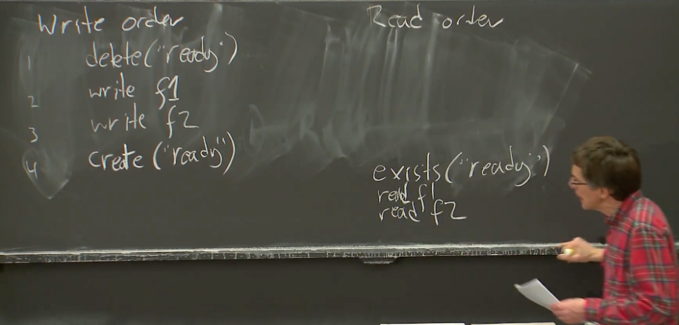
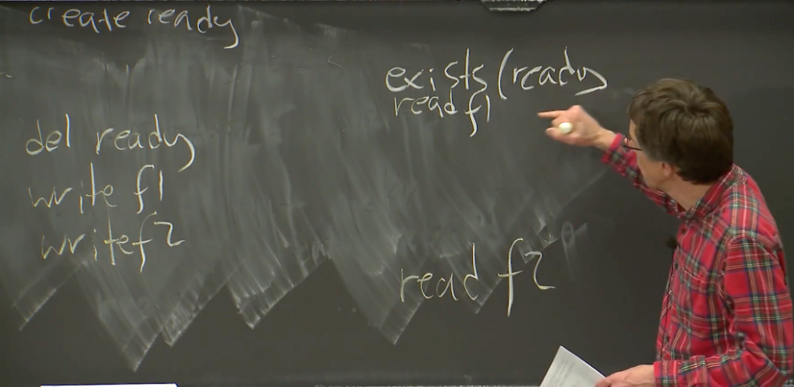

# Zookeeper

今天的论文是 Zookeeper。我们选择这篇论文的部分原因是，Zookeeper 是一个现实世界成功的系统，是一个很多人使用的开源服务，并且集成到了很多现实世界的软件中，所以它肯定有一些现实意义和成功。自然而然，Zookeeper 的设计应该是一个合理的设计，这使得它变得吸引人。但是我对它感兴趣是因为一些更具体的技术。所以我们来看看我们为什么要研究这篇论文？

相比 Raft 来说，Raft 实际上就是一个库。你可以在一些更大的多副本系统中使用 Raft 库。但是 Raft 不是一个你可以直接交互的独立的服务，你必须要设计你自己的应用程序来与 Raft 库交互。所以这里有一个有趣的问题：是否有一些有用的，独立的，通用的系统可以帮助人们构建分布式系统？是否有这样的服务可以包装成一个任何人都可以使用的独立服务，并且极大的减轻构建分布式应用的痛苦？所以，第一个问题是，对于一个通用的服务，API 应该是怎样？我不太确定类似于 Zookeeper 这类软件的名字是什么，它们可以被认为是一个通用的协调服务（General-Purpose Coordination Service）。

第二个问题或者说第二个有关 Zookeeper 的有意思的特性是，作为一个多副本系统，Zookeeper 是一个容错的，通用的协调服务，它与其他系统一样，通过多副本来完成容错。所以一个 Zookeeper 可能有 3 个、5 个或者 7 个服务器，而这些服务器是要花钱的，例如 7 个服务器的 Zookeeper 集群比 1 个服务器的 Zookeeper 要贵 7 倍。所以很自然就会问，如果你买了 7 个服务器来运行你的多副本服务，你是否能通过这 7 台服务器得到 7 倍的性能？我们怎么能达到这一点呢？所以，现在问题是，如果我们有了 n 倍数量的服务器，是否可以为我们带来 n 倍的性能？

我会先说一下第二个问题。现在这里讨论的是性能，我接下来将会把 Zookeeper 看成一个类似于 Raft 的多副本系统。Zookeeper 实际上运行在 Zab 之上，从我们的角度来看，Zab 几乎与 Raft 是一样的。这里我只看多副本系统的性能，我并不关心 Zookeeper 的具体功能。

所以，现在全局来看，我们有大量的客户端，或许有数百个客户端，并且我们有一个 Leader，这个 Leader 有两层，上面一层是与客户端交互的 Zookeeper，下面是与 Raft 类似的管理多副本的 Zab。Zab 所做的工作是维护用来存放一系列操作的 Log，这些操作是从客户端发送过来的，这与 Raft 非常相似。然后会有多个副本，每个副本都有自己的 Log，并且会将新的请求加到 Log 中。这是一个很熟悉的配置（与 Raft 是一样的）。

当一个客户端发送了一个请求，Zab 层会将这个请求的拷贝发送给其他的副本，其他副本会将请求追加在它们的内存中的 Log 或者是持久化存储在磁盘上，这样它们故障重启之后可以取回这些 Log。

所以，现在的问题是，当我们增加更多的服务器，我们在这里可以有 4 个，5 个，或者 7 个服务器，系统会随着我们我们增加更多的 CPU，更多的算力，而变得更快吗？假设每一个副本都运行在独立的电脑上，这样你会有更多的 CPU，那么当副本变多时，你的实验代码会变得更快吗？

是的，并没有这回事说，当你加入更多的服务器时，服务就会变得更快。这绝对是正确的，当我们加入更多的服务器时，Leader 几乎可以确定是一个瓶颈，因为 Leader 需要处理每一个请求，它需要将每个请求的拷贝发送给每一个其他服务器。当你添加更多的服务器时，你只是为现在的瓶颈（Leader 节点）添加了更多的工作负载。所以是的，你并不能通过添加服务器来达到提升性能的目的，因为新增的服务器并没有实际完成任何工作，它们只是愉快的完成 Leader 交代的工作，它们并没有减少 Leader 的工作。每一个操作都经过 Leader。所以，在这里，随着服务器数量的增加，性能反而会降低，因为 Leader 需要做的工作更多了。所以，在这个系统中，我们现在有这个问题：更多的服务器使得系统更慢了。

这太糟糕了，这些服务器每台都花费了几千美元，你本来还期望通过它们达到更好的性能。

>   学生提问：如果请求是从不同的客户端发过来，或者从同一个客户端串行发过来，如果不同的请求交互的是数据的不同部分呢？比如，在一个 key-value 数据库中，或许一个请求更新 X，另一个请求更新 Y，它们两之间没有任何关系，我们可以利用这一点提升性能吗？
>
>   Robert教授：在这样（Zookeeper）一个系统中，要想利用这一点来提升性能是非常受限的。从一个全局角度来看，所有的请求还是发给了 Leader，Leader 还是要将请求发送给所有的副本，副本越多，Leader 需要发送的消息也就越多。所以从一个全局的角度来看，这种交替的请求不太可能帮助这个系统。但是这是个很好的想法，因为它绝对可以用在其他系统中，人们可以在其他系统中利用这个想法。

所以这里有点让人失望，服务器的硬件并不能帮助提升性能。

或许最简单的可以用来利用这些服务器的方法，就是构建一个系统，让所有的写请求通过 Leader 下发。在现实世界中，大量的负载是读请求，也就是说，读请求（比写请求）多得多。比如，web 页面，全是通过读请求来生成 web 页面，并且通常来说，写请求就相对少的多，对于很多系统都是这样的。所以，或许我们可以将写请求发给 Leader，但是将读请求发给某一个副本，随便任意一个副本。

如果你有一个读请求，例如 Lab3 中的 get 请求，把它发给某一个副本而不是 Leader。如果我们这么做了，对于写请求没有什么帮助，是我们将大量的读请求的负担从 Leader 移走了。现在对于读请求来说，有了很大的提升，因为现在，添加越多的服务器，我们可以支持越多的客户端读请求，因为我们将客户端的读请求分担到了不同的副本上。

所以，现在的问题是，如果我们直接将客户端的请求发送给副本，我们能得到预期的结果吗？

是的，实时性是这里需要考虑的问题。Zookeeper 作为一个类似于 Raft 的系统，如果客户端将请求发送给一个随机的副本，那个副本中肯定有一份 Log 的拷贝，这个拷贝随着 Leader 的执行而变化。假设在 Lab3 中，这个副本有一个 key-value 表，当它收到一个读 X 的请求，在 key-value 表中会有 X 的某个数据，这个副本可以用这个数据返回给客户端。

所以，功能上来说，副本拥有可以响应来自客户端读请求的所有数据。这里的问题是，没有理由可以相信，除了 Leader 以外的任何一个副本的数据是最新（up to date）的。

这里有很多原因导致副本没有最新的数据，其中一个原因是，这个副本可能不在 Leader 所在的过半服务器中。对于 Raft 来说，Leader 只会等待它所在的过半服务器中的其他 follower 对于 Leader 发送的 AppendEntries 消息的返回，之后 Leader 才会 commit 消息，并进行下一个操作。所以，如果这个副本不在过半服务器中，它或许永远也看不到写请求。又或许网络丢包了，这个副本永远没有收到这个写请求。所以，有可能 Leader 和过半服务器可以看见前三个请求，但是这个副本只能看见前两个请求，而错过了请求 C。所以从这个副本读数据可能读到一个旧的数据。

即使这个副本看到了相应的 Log 条目，它可能收不到 commit 消息。Zookeeper 的 Zab 与 Raft 非常相似，它先发出 Log 条目，之后，当 Leader 收到了过半服务器的回复，Leader 会发送 commit 消息。然后这个副本可能没有收到这个 commit 消息。

最坏的情况是，我之前已经说过，这个副本可能与 Leader 不在一个网络分区，或者与 Leader 完全没有通信，作为 follower，完全没有方法知道它与 Leader 已经失联了，并且不能收到任何消息了（心跳呢？）。

所以，如果这里不做任何改变，并且我们想构建一个线性一致的系统，尽管在性能上很有吸引力，我们不能将读请求发送给副本，并且你也不应该在 Lab3 这么做，因为 Lab3 也应该是线性一致的。这里是线性一致阻止了我们使用副本来服务客户端，大家有什么问题吗？

这里的证据就是之前介绍线性一致的简单例子。在一个线性一致系统中，不允许提供旧的数据。所以，Zookeeper 这里是怎么办的？

如果你看 Zookeeper 论文的表 2，Zookeeper 的读性能随着服务器数量的增加而显著的增加。所以，很明显，Zookeeper 这里有一些修改使得读请求可以由其他的服务器，其他的副本来处理。那么 Zookeeper 是如何确保这里的读请求是安全的（线性一致）？

对的，实际上，Zookeeper 并不要求返回最新的写入数据。Zookeeper 的方式是，放弃线性一致性。它对于这里问题的解决方法是，不提供线性一致的读。所以，因此，Zookeeper 也不用为读请求提供最新的数据。它有自己有关一致性的定义，而这个定义不是线性一致的，因此允许为读请求返回旧的数据。所以，Zookeeper 这里声明，自己最开始就不支持线性一致性，来解决这里的技术问题。如果不提供这个能力，那么（为读请求返回旧数据）就不是一个 bug。这实际上是一种经典的解决性能和强一致之间矛盾的方法，也就是不提供强一致。

然而，我们必须考虑这个问题，如果系统不提供线性一致性，那么系统是否还可用？客户端发送了一个读请求，但是并没有得到当前的正确数据，也就是最新的数据，那我们为什么要相信这个系统是可用的？我们接下来看一下这个问题。

在这之前，还有问题吗？Zookeeper 的确允许客户端将读请求发送给任意副本，并由副本根据自己的状态来响应读请求。副本的 Log 可能并没有拥有最新的条目，所以尽管系统中可能有一些更新的数据，这个副本可能还是会返回旧的数据。


---

# 一致保证（Consistency Guarantees）

Zookeeper 的确有一些一致性的保证，用来帮助那些使用基于 Zookeeper 开发应用程序的人，来理解他们的应用程序，以及理解当他们运行程序时，会发生什么。与线性一致一样，这些保证与序列有关。Zookeeper 有两个主要的保证，它们在论文的 2.3 有提及。

第一个是，写请求是线性一致的。

现在，你可以发现，它（Zookeeper）对于线性一致的定义与我的不太一样，因为 Zookeeper 只考虑写，不考虑读。这里的意思是，尽管客户端可以并发的发送写请求，然后 Zookeeper 表现的就像以某种顺序，一次只执行一个写请求，并且也符合写请求的实际时间。所以如果一个写请求在另一个写请求开始前就结束了，那么 Zookeeper 实际上也会先执行第一个写请求，再执行第二个写请求。所以，这里不包括读请求，单独看写请求是线性一致的。Zookeeper 并不是一个严格的读写系统。写请求通常也会跟着读请求。对于这种混合的读写请求，任何更改状态的操作相比其他更改状态的操作，都是线性一致的。

Zookeeper 的另一个保证是，任何一个客户端的请求，都会按照客户端指定的顺序来执行，论文里称之为 FIFO（First In First Out）客户端序列。

这里的意思是，如果一个特定的客户端发送了一个写请求之后是一个读请求或者任意请求，那么首先，所有的写请求会以这个客户端发送的相对顺序，加入到所有客户端的写请求中（满足保证 1）。所以，如果一个客户端说，先完成这个写操作，再完成另一个写操作，之后是第三个写操作，那么在最终整体的写请求的序列中，可以看到这个客户端的写请求以相同顺序出现（虽然可能不是相邻的）。所以，对于写请求，最终会以客户端确定的顺序执行。

这里实际上是服务端需要考虑的问题，因为客户端是可以发送异步的写请求，也就是说客户端可以发送多个写请求给 Zookeeper Leader 节点，而不用等任何一个请求完成。Zookeeper 论文并没有明确说明，但是可以假设，为了让 Leader 可以实际的按照客户端确定的顺序执行写请求，我设想，客户端实际上会对它的写请求打上序号，表明它先执行这个，再执行这个，第三个是这个，而 Zookeeper Leader 节点会遵从这个顺序。这里由于有这些异步的写请求变得非常有意思。

对于读请求，这里会更加复杂一些。我之前说过，读请求不需要经过 Leader，只有写请求经过 Leader，读请求只会到达某个副本。所以，读请求只能看到那个副本的 Log 对应的状态。对于读请求，我们应该这么考虑 FIFO 客户端序列，客户端会以某种顺序读某个数据，之后读第二个数据，之后是第三个数据，对于那个副本上的 Log 来说，每一个读请求必然要在 Log 的某个特定的点执行，或者说每个读请求都可以在 Log 一个特定的点观察到对应的状态。

然后，后续的读请求，必须要在不早于当前读请求对应的 Log 点执行。也就是一个客户端发起了两个读请求，如果第一个读请求在 Log 中的一个位置执行，那么第二个读请求只允许在第一个读请求对应的位置或者更后的位置执行。

第二个读请求不允许看到之前的状态，第二个读请求至少要看到第一个读请求的状态。这是一个极其重要的事实，我们会用它来实现正确的 Zookeeper 应用程序。

这里特别有意思的是，如果一个客户端正在与一个副本交互，客户端发送了一些读请求给这个副本，之后这个副本故障了，客户端需要将读请求发送给另一个副本。这时，尽管客户端切换到了一个新的副本，FIFO 客户端序列仍然有效。所以这意味着，如果你知道在故障前，客户端在一个副本执行了一个读请求并看到了对应于 Log 中这个点的状态，当客户端切换到了一个新的副本并且发起了另一个读请求，假设之前的读请求在这里执行，那么尽管客户端切换到了一个新的副本，客户端的在新的副本的读请求，必须在 Log 这个点或者之后的点执行。

这里工作的原理是，每个 Log 条目都会被 Leader 打上 zxid 的标签，这些标签就是 Log 对应的条目号。任何时候一个副本回复一个客户端的读请求，首先这个读请求是在 Log 的某个特定点执行的，其次回复里面会带上 zxid，对应的就是 Log 中执行点的前一条 Log 条目号。客户端会记住最高的 zxid，当客户端发出一个请求到一个相同或者不同的副本时，它会在它的请求中带上这个最高的 zxid。这样，其他的副本就知道，应该至少在 Log 中这个点或者之后执行这个读请求。这里有个有趣的场景，如果第二个副本并没有最新的 Log，当它从客户端收到一个请求，客户端说，上一次我的读请求在其他副本 Log 的这个位置执行，那么在获取到对应这个位置的 Log 之前，这个副本不能响应客户端请求。

我不是很清楚这里具体怎么工作，但是要么副本阻塞了对于客户端的响应，要么副本拒绝了客户端的读请求并说：我并不了解这些信息，去问问其他的副本，或者过会再来问我。

最终，如果这个副本连上了 Leader，它会更新上最新的 Log，到那个时候，这个副本就可以响应读请求了。好的，所以读请求都是有序的，它们的顺序与时间正相关。

更进一步，FIFO 客户端请求序列是对一个客户端的所有读请求，写请求生效。所以，如果我发送一个写请求给 Leader，在 Leader commit 这个请求之前需要消耗一些时间，所以我现在给 Leader 发了一个写请求，而 Leader 还没有处理完它，或者 commit 它。之后，我发送了一个读请求给某个副本。这个读请求需要暂缓一下，以确保 FIFO 客户端请求序列。读请求需要暂缓，直到这个副本发现之前的写请求已经执行了。这是 FIFO 客户端请求序列的必然结果，（对于某个特定的客户端）读写请求是线性一致的。

最明显的理解这种行为的方式是，如果一个客户端写了一份数据，例如向 Leader 发送了一个写请求，之后立即读同一份数据，并将读请求发送给了某一个副本，那么客户端需要看到自己刚刚写入的值。如果我写了某个变量为 17，那么我之后读这个变量，返回的不是 17，这会很奇怪，这表明系统并没有执行我的请求。因为如果执行了的话，写请求应该在读请求之前执行。所以，副本必然有一些有意思的行为来暂缓客户端，比如当客户端发送一个读请求说，我上一次发送给 Leader 的写请求对应了 zxid 是多少，这个副本必须等到自己看到对应 zxid 的写请求再执行读请求。

>   学生提问：也就是说，从 Zookeeper 读到的数据不能保证是最新的？
>
>   Robert教授：完全正确。我认为你说的是，从一个副本读取的或许不是最新的数据，所以 Leader 或许已经向过半服务器发送了 C，并 commit 了，过半服务器也执行了这个请求。但是这个副本并不在 Leader 的过半服务器中，所以或许这个副本没有最新的数据。这就是 Zookeeper 的工作方式，它并不保证我们可以看到最新的数据。Zookeeper 可以保证读写有序，但是只针对一个客户端来说。所以，如果我发送了一个写请求，之后我读取相同的数据，Zookeeper 系统可以保证读请求可以读到我之前写入的数据。但是，如果你发送了一个写请求，之后我读取相同的数据，并没有保证说我可以看到你写入的数据。这就是 Zookeeper 可以根据副本的数量加速读请求的基础。

>   学生提问：那么 Zookeeper 究竟是不是线性一致呢？
>
>   Robert教授：我认为 Zookeeper 不是线性一致的，但是又不是完全的非线性一致。首先，所有客户端发送的请求以一个特定的序列执行，所以，某种意义上来说，所有的写请求是线性一致的。同时，每一个客户端的所有请求或许也可以认为是线性一致的。尽管我不是很确定，Zookeeper 的一致性保证的第二条可以理解为，单个客户端的请求是线性一致的。

>   学生提问：zxid 必须要等到写请求执行完成才返回吗？
>
>   Robert教授：实际上，我不知道它具体怎么工作，但是这是个合理的假设。当我发送了异步的写请求，系统并没有执行这些请求，但是系统会回复我说，好的，我收到了你的写请求，如果它最后 commit 了，这将会是对应的 zxid。所以这里是一个合理的假设，我实际上不知道这里怎么工作。之后如果客户端执行读请求，就可以告诉一个副本说，这个 zxid 是我之前发送的一个写请求。

>   学生提问：Log 中的 zxid 怎么反应到 key-value 数据库的状态呢？
>
>   Robert教授：如果你向一个副本发送读请求，理论上，客户端会认为副本返回的实际上是 Table 中的值。所以，客户端说，我只想从这个 Table 读这一行，这个副本会将其当前状态中 Table 中对应的值和上次更新 Table 的 zxid 返回给客户端。
>
>   我不太确定，这里有两种可能，我认为任何一种都可以。第一个是，每个服务器可以跟踪修改每一行 Table 数值的写请求对应的 zxid（这样可以读哪一行就返回相应的 zxid）；另一个是，服务器可以为所有的读请求返回 Log 中最近一次 commit 的 zxid，不论最近一次请求是不是更新了当前读取的 Table 中的行。因为，我们只需要确认客户端请求在 Log 中的执行点是一直向前推进，所以对于读请求，我们只需要返回大于修改了 Table 中对应行的写请求对应的 zxid 即可。

好的，这些是 Zookeeper 的一致性保证。


---

# 同步操作（sync）

我们还有一个问题，是否可能基于这些保证实现合理的编程？总的来说，Zookeeper 的一致性保证没有线性一致那么好。尽管它们有一些难以理解，并且需要一些额外共识，例如，读请求可能会返回旧数据，而这在一个线性一致系统不可能发生，但是，这些保证已经足够好了，好到可以用来直观解释很多基于 Zookeeper 的系统。接下来，我会尝试构建一些例子来解释，为什么 Zookeeper 不是一个坏的编程模型？

其中一个原因是，有一个弥补（非严格线性一致）的方法。

Zookeeper 有一个操作类型是 sync，它本质上就是一个写请求。假设我知道你最近写了一些数据，并且我想读出你写入的数据，所以现在的场景是，我想读出 Zookeeper 中最新的数据。这个时候，我可以发送一个 sync 请求，它的效果相当于一个写请求，所以它最终会出现在所有副本的 Log 中，尽管我只关心与我交互的副本，因为我需要从那个副本读出数据。接下来，在发送读请求时，我（客户端）告诉副本，在看到我上一次 sync 请求之前，不要返回我的读请求。

如果这里把 sync 看成是一个写请求，这里实际上符合了 FIFO 客户端请求序列，因为读请求必须至少要看到同一个客户端前一个写请求对应的状态。所以，如果我发送了一个 sync 请求之后，又发送了一个读请求。Zookeeper 必须要向我返回至少是我发送的 sync 请求对应的状态。

不管怎么样，如果我需要读最新的数据，我需要发送一个 sync 请求，之后再发送读请求。这个读请求可以保证看到 sync 对应的状态，所以可以合理的认为是最新的。但是同时也要认识到，这是一个代价很高的操作，因为我们现在将一个廉价的读操作转换成了一个耗费 Leader 时间的 sync 操作。所以，如果不是必须的，那还是不要这么做。


---

# 就绪文件（Ready file/znode）

在论文中有几个例子场景，通过 Zookeeper 的一致性保证可以很简答的解释它们。

首先我想介绍的是论文中 2.3 有关 Ready file 的一些设计（这里的 file 对应的就是论文里的 znode，Zookeeper 以文件目录的形式管理数据，所以每一个数据点也可以认为是一个 file）。

我们假设有另外一个分布式系统，这个分布式有一个 Master 节点，而 Master 节点在 Zookeeper 中维护了一个配置，这个配置对应了一些 file（也就是 znode）。通过这个配置，描述了有关分布式系统的一些信息，例如所有 worker 的 IP 地址，或者当前谁是 Master。所以，现在 Master 在更新这个配置，同时，或许有大量的客户端需要读取相应的配置，并且需要发现配置的每一次变化。所以，现在的问题是，尽管配置被分割成了多个 file，我们还能有原子效果的更新吗？

为什么要有原子效果的更新呢？因为只有这样，其他的客户端才能读出完整更新的配置，而不是读出更新了一半的配置。这是人们使用 Zookeeper 管理配置文件时的一个经典场景。

我们这里直接拷贝论文中的 2.3 节的内容。假设 Master 做了一系列写请求来更新配置，那么我们的分布式系统中的 Master 会以这种顺序执行写请求。首先我们假设有一些 Ready file，就是以 Ready 为名字的 file。如果 Ready file 存在，那么允许读这个配置。如果 Ready file 不存在，那么说明配置正在更新过程中，我们不应该读取配置。所以，如果 Master 要更新配置，那么第一件事情是删除 Ready file。之后它会更新各个保存了配置的 Zookeeper file（也就是 znode），这里或许有很多的 file。当所有组成配置的 file 都更新完成之后，Master 会再次创建 Ready file。目前为止，这里的语句都很直观，这里只有写请求，没有读请求，而 Zookeeper 中写请求可以确保以线性顺序执行。


为了确保这里的执行顺序，Master 以某种方式为这些请求打上了 tag，表明了对于这些写请求期望的执行顺序。之后 Zookeeper Leader 需要按照这个顺序将这些写请求加到多副本的 Log 中。

接下来，所有的副本会履行自己的职责，按照这里的顺序一条条执行请求。它们也会删除（自己的）Ready file，之后执行这两个写请求，最后再次创建（自己的）Ready file。所以，这里是写请求，顺序还是很直观的。

对于读请求，需要更多的思考。假设我们有一些 worker 节点需要读取当前的配置。我们可以假设 Worker 节点首先会检查 Ready file 是否存在。如果不存在，那么 Worker 节点会过一会再重试。所以，我们假设 Ready file 存在，并且是经历过一次重新创建。


这里的意思是，左边的都是发送给 Leader 的写请求，右边是一个发送给某一个与客户端交互的副本的读请求。之后，如果文件存在，那么客户端会接下来读 f1 和 f2。



这里，有关 FIFO 客户端序列中有意思的地方是，如果判断 Ready file 的确存在，那么也是从与客户端交互的那个副本得出的判断。所以，这里通过读请求发现 Ready file 存在，可以说明那个副本看到了 Ready file 的重新创建这个请求（由 Leader 同步过来的）。


同时，因为后续的读请求永远不会在更早的 log 条目号执行，必须在更晚的 Log 条目号执行，所以，对于与客户端交互的副本来说，如果它的 log 中包含了这条创建 Ready file 的 log，那么意味着接下来客户端的读请求只会在 log 中更后面的位置执行（下图中横线位置）。


所以，如果客户端看见了 Ready file，那么副本接下来执行的读请求，会在 Ready file 重新创建的位置之后执行。这意味着，Zookeeper 可以保证这些读请求看到之前对于配置的全部更新。所以，尽管 Zookeeper 不是完全的线性一致，但是由于写请求是线性一致的，并且读请求是随着时间在 Log 中单调向前的，我们还是可以得到合理的结果。

我们假设 Master 在完成配置更新之后创建了 Ready file。之后 Master 又要更新配置，那么最开始，它要删除 Ready file，之后再执行一些写请求。


这里可能有的问题是，需要读取配置的客户端，首先会在这个点，通过调用 exist 来判断 Ready file 是否存在。


在这个时间点，Ready file 肯定是存在的。之后，随着时间的推移，客户端读取了组成配置的第一个 file，但是，之后在读取第二个 file 时，Master 可能正在更新配置。



所以现在客户端读到的是一个不正常的，由旧配置的 f1 和新配置的 f2 组成的配置。没有理由相信，这里获取的信息还是有用的。所以，前一个场景还是很美好的，但是这个场景就是个灾难。

所以，我们现在开始面对一个严重的挑战，而一个仔细设计的针对分布式系统中机器间的协调服务的 API（就是说 Zookeeper），或许可以帮助我们解决这个挑战。对于 Lab3 来说，你将会构建一个 put/get 系统，那样一个系统，也会遇到同样的问题，没有任何现有的工具可以解决这个问题。

Zookeeper 的 API 实际上设计的非常巧妙，它可以处理这里的问题。之前说过，客户端会发送 exists 请求来查询，Ready file 是否存在。但是实际上，客户端不仅会查询 Ready file 是否存在，还会建立一个针对这个 Ready file 的 watch。


这意味着如果 Ready file 有任何变更，例如，被删除了，或者它之前不存在然后被创建了，副本会给客户端发送一个通知。在这个场景中，如果 Ready file 被删除了，副本会给客户端发送一个通知。

客户端在这里只与某个副本交互，所以这里的操作都是由副本完成。当 Ready file 有变化时，副本会确保，合适的时机返回对于 Ready file 变化的通知。这里什么意思呢？在这个场景中，这些写请求在实际时间中，出现在读 f1 和读 f2 之间。


而 Zookeeper 可以保证，如果客户端向某个副本 watch 了某个 Ready file，之后又发送了一些读请求，当这个副本执行了一些会触发 watch 通知的请求，那么 Zookeeper 可以确保副本将 watch 对应的通知，先发给客户端，再处理触发 watch 通知请求（也就是删除 Ready file 的请求），在 Log 中位置之后才执行的读请求（有点绕，后面会有更多的解释）。

这里再来看看 Log。FIFO 客户端序列要求，每个客户端请求都存在于 Log 中的某个位置，所以，最后 log 的相对位置如下图所示：


我们之前已经设置好了 watch，Zookeeper 可以保证如果某个人删除了 Ready file，相应的通知，会在任何后续的读请求之前，发送到客户端。客户端会先收到有关 Ready file 删除的通知，之后才收到其他在 Log 中位于删除 Ready file 之后的读请求的响应。这里意味着，删除 Ready file 会产生一个通知，而这个通知可以确保在读 f2 的请求响应之前发送给客户端。


这意味着，客户端在完成读所有的配置之前，如果对配置有了新的更改，Zookeeper 可以保证客户端在收到删除 Ready file 的通知之前，看到的都是配置更新前的数据（也就是，客户端读取配置读了一半，如果收到了 Ready file 删除的通知，就可以放弃这次读，再重试读了）。

>   学生提问：谁出发了这里的 watch？
>
>   Robert教授：假设这个客户端与这个副本在交互，它发送了一个 exist 请求，exist 请求是个只读请求。相应的副本在一个 table 上生成一个 watch 的表单，表明哪些客户端 watch 了哪些 file。


>   并且，watch 是基于一个特定的 zxid 建立的，如果客户端在一个副本 log 的某个位置执行了读请求，并且返回了相对于这个位置的状态，那么 watch 也是相对于这个位置来进行。如果收到了一个删除 Ready file 的请求，副本会查看 watch 表单，并且发现针对这个 Ready file 有一个 watch。watch 表单或许是以 file 名的 hash 作为 key，这样方便查找。
>
>   学生提问：这个副本必须要有一个 watch 表单，如果副本故障了，客户端需要连接到另外一个副本，那新连接的副本中的 watch 表单如何生成呢？
>
>   Robert教授：答案是，如果你的副本故障了，那么切换到的新的副本不会有 watch 表单。但是客户端在相应的位置会收到通知说，你正在交互的副本故障了，之后客户端就知道，应该重置所有数据，并与新的副本建立连接（包括 watch）。

下一节课会继续介绍 Zookeeper。


---

# Zookeeper API

Zookeeper 里面我最感兴趣的事情是它的 API 设计。Zookeeper 的 API 设计使得它可以成为一个通用的服务，从而分担一个分布式系统所需要的大量工作。那么为什么 Zookeeper 的 API 是一个好的设计？具体来看，因为它实现了一个值得去了解的概念：mini-transaction。

我们回忆一下 Zookeeper 的特点：

-   Zookeeper基于（类似于）Raft 框架，所以我们可以认为它是，当然它的确是容错的，它在发生网络分区的时候，也能有正确的行为。
-   当我们在分析各种 Zookeeper 的应用时，我们也需要记住 Zookeeper 有一些性能增强，使得读请求可以在任何副本被处理，因此，可能会返回旧数据。
-   另一方面，Zookeeper 可以确保一次只处理一个写请求，并且所有的副本都能看到一致的写请求顺序。这样，所有副本的状态才能保证是一致的（写请求会改变状态，一致的写请求顺序可以保证状态一致）。
-   由一个客户端发出的所有读写请求会按照客户端发出的顺序执行。
-   一个特定客户端的连续请求，后来的请求总是能看到相比较于前一个请求相同或者更晚的状态。

在我深入探讨 Zookeeper 的 API 长什么样和为什么它是有用的之前，我们可以考虑一下，Zookeeper 的目标是解决什么问题，或者期望用来解决什么问题？

-   对于我来说，使用 Zookeeper 的一个主要原因是，它可以是一个 VMware FT 所需要的 Test-and-Set 服务的实现。Test-and-Set 服务在发生主备切换时是必须存在的，但是在 VMware FT 论文中对它的描述却又像个谜一样，论文里没有介绍：这个服务究竟是什么，它是容错的吗，它能容忍网络分区吗？Zookeeper 实际的为我们提供工具来写一个容错的，完全满足 VMware FT 要求的 Test-and-Set 服务，并且可以在网络分区时，仍然有正确的行为。这是 Zookeeper 的核心功能之一。
-   使用 Zookeeper 还可以做很多其他有用的事情。其中一件是，人们可以用它来发布其他服务器使用的配置信息。例如，向某些 Worker 节点发布当前 Master 的 IP 地址。
-   另一个 Zookeeper 的经典应用是选举 Master。当一个旧的 Master 节点故障时，哪怕说出现了网络分区，我们需要让所有的节点都认可同一个新的 Master 节点。
-   如果新选举的 Master 需要将其状态保持到最新，比如说 GFS 的 Master 需要存储对于一个特定的 Chunk 的 Primary 节点在哪，现在 GFS 的 Master 节点可以将其存储在 Zookeeper 中，并且知道 Zookeeper 不会丢失这个信息。当旧的 Master 崩溃了，一个新的 Master 被选出来替代旧的 Master，这个新的 Master 可以直接从 Zookeeper 中读出旧 Master 的状态。
-   其他还有，对于一个类似于 MapReduce 的系统，Worker 节点可以通过在 Zookeeper 中创建小文件来注册自己。
-   同样还是类似于 MapReduce 这样的系统，你可以设想 Master 节点通过向 Zookeeper 写入具体的工作，之后 Worker 节点从 Zookeeper 中一个一个的取出工作，执行，完成之后再删除工作。

以上就是 Zookeeper 可以用来完成的工作。

>   学生提问：Zookeeper 应该如何应用在这些场景中？
>
>   Robert教授：通常来说，如果你有一个大的数据中心，并且在数据中心内运行各种东西，比如说 Web 服务器，存储系统，MapReduce 等等。你或许会想要再运行一个包含了 5 个或者 7 个副本的 Zookeeper 集群，因为它可以用在很多场景下。之后，你可以部署各种各样的服务，并且在设计中，让这些服务存储一些关键的状态到你的全局的 Zookeeper 集群中。

Zookeeper 的 API 某种程度上来说像是一个文件系统。它有一个层级化的目录结构，有一个根目录（root），之后每个应用程序有自己的子目录。比如说应用程序 1 将自己的文件保存在 APP1 目录下，应用程序 2 将自己的文件保存在 APP2 目录下，这些目录又可以包含文件和其他的目录。

这么设计的一个原因刚刚也说过，Zookeeper 被设计成要被许多可能完全不相关的服务共享使用。所以我们需要一个命名系统来区分不同服务的信息，这样这些信息才不会弄混。对于每个使用 Zookeeper 的服务，围绕着文件，有很多很方便的方法来使用 Zookeeper。我们在接下来几个小节会看几个例子。

所以，Zookeeper 的 API 看起来像是一个文件系统，但是又不是一个实际的文件系统，比如说你不能 mount 一个文件，你不能运行 ls 和 cat 这样的命令等等。这里只是在内部，以这种路径名的形式命名各种对象。假设应用程序 2 下面有 X，Y，Z 这些文件。当你通过 RPC 向 Zookeeper 请求数据时，你可以直接指定 /APP2/X。这就是一种层级化的命名方式。


这里的文件和目录都被称为 znodes。Zookeeper 中包含了 3 种类型的 znode，了解他们对于解决问题会有帮助。

1.  第一种 Regular znodes。这种 znode 一旦创建，就永久存在，除非你删除了它。
2.  第二种是 Ephemeral znodes。如果 Zookeeper 认为创建它的客户端挂了，它会删除这种类型的 znodes。这种类型的 znodes 与客户端会话绑定在一起，所以客户端需要时不时的发送心跳给 Zookeeper，告诉 Zookeeper 自己还活着，这样 Zookeeper 才不会删除客户端对应的 ephemeral znodes。
3.  最后一种类型是 Sequential znodes。它的意思是，当你想要以特定的名字创建一个文件，Zookeeper 实际上创建的文件名是你指定的文件名再加上一个数字。当有多个客户端同时创建 Sequential 文件时，Zookeeper 会确保这里的数字不重合，同时也会确保这里的数字总是递增的。

这些在后面的例子中都会有介绍。

Zookeeper 以 RPC 的方式暴露以下 API。

-   `CREATE(PATH，DATA，FLAG)`。入参分别是文件的全路径名 PATH，数据 DATA，和表明 znode 类型的 FLAG。这里有意思的是，CREATE 的语义是排他的。也就是说，如果我向 Zookeeper 请求创建一个文件，如果我得到了 yes 的返回，那么说明这个文件之前不存在，我是第一个创建这个文件的客户端；如果我得到了 no 或者一个错误的返回，那么说明这个文件之前已经存在了。所以，客户端知道文件的创建是排他的。在后面有关锁的例子中，我们会看到，如果有多个客户端同时创建同一个文件，实际成功创建文件（获得了锁）的那个客户端是可以通过 CREATE 的返回知道的。
-   `DELETE(PATH，VERSION)`。入参分别是文件的全路径名 PATH，和版本号 VERSION。有一件事情我之前没有提到，每一个 znode 都有一个表示当前版本号的 version，当 znode 有更新时，version 也会随之增加。对于 delete 和一些其他的 update 操作，你可以增加一个 version 参数，表明当且仅当 znode 的当前版本号与传入的 version 相同，才执行操作。当存在多个客户端同时要做相同的操作时，这里的参数 version 会非常有帮助（并发操作不会被覆盖）。所以，对于 delete，你可以传入一个 version 表明，只有当 znode 版本匹配时才删除。
-   `EXIST(PATH，WATCH)`。入参分别是文件的全路径名 PATH，和一个有趣的额外参数 WATCH。通过指定 watch，你可以监听对应文件的变化。不论文件是否存在，你都可以设置 watch 为 true，这样 Zookeeper 可以确保如果文件有任何变更，例如创建，删除，修改，都会通知到客户端。此外，判断文件是否存在和 watch 文件的变化，在 Zookeeper 内是原子操作。所以，当调用 exist 并传入 watch 为 true 时，不可能在 Zookeeper 实际判断文件是否存在，和建立 watch 通道之间，插入任何的创建文件的操作，这对于正确性来说非常重要。
-   `GETDATA(PATH，WATCH)`。入参分别是文件的全路径名 PATH，和 WATCH 标志位。这里的 watch 监听的是文件的内容的变化。
-   `SETDATA(PATH，DATA，VERSION)`。入参分别是文件的全路径名 PATH，数据 DATA，和版本号 VERSION。如果你传入了 version，那么 Zookeeper 当且仅当文件的版本号与传入的 version 一致时，才会更新文件。
-   `LIST(PATH)`。入参是目录的路径名，返回的是路径下的所有文件。


---

# 使用Zookeeper实现计数器

我们来看看是如何使用这些 Zookeeper API 的。

第一个很简单的例子是计数器，假设我们在 Zookeeper 中有一个文件，我们想要在那个文件存储一个统计数字，例如，统计客户端的请求次数，当收到了一个来自客户端的请求时，我们需要增加存储的数字。

现在关键问题是，多个客户端会同时并发发送请求导致存储的数字增加。所以，第一个要解决的问题是，除了管理数据以外（类似于简单的SET和GET），我们是不是真的需要一个特殊的接口来支持多个客户端的并发。Zookeeper API 看起来像是个文件系统，我们能不能只使用典型的存储系统的读写操作来解决并发的问题。

比如说，在 Lab3 中，你们会构建一个 key-value 数据库，它只支持两个操作，一个是 PUT(K，V)，另一个是 GET(K)。对于所有我们想要通过 Zookeeper 来实现的操作，我们可以使用 Lab3 中的 key-value 数据库来完成吗？或许我们真的可以使用只有两个操作接口的 Lab3 来完成这里的计数器功能。你可以这样实现，首先通过 GET 读出当前的计数值，之后通过 PUT 写入 X + 1。

为什么这是一个错误的答案？是的，这里不是原子操作，这是问题的根源。

如果有两个客户端想要同时增加计数器的值，它们首先都会先通过 GET 读出旧的计数器值，比如说 10。之后，它们都会对 10 加 1 得到 11，并调用 PUT 将 11 写入。所以现在我们只对计数器加了 1，但是实际上有两个客户端执行了增加计数器的操作，而我们本应该对计数器增加 2。所以，这就是什么 Lab3 甚至都不能用在这个最简单的例子中。

但是，Zookeeper 自身也有问题，在 Zookeeper 的世界中，GET 可能得到的是旧数据。而 Lab3 中，GET 不允许返回旧的数据。因为 Zookeeper 读数据可能得到旧的数据，如果你得到了一个旧版本的计数器值，并对它加 1，那么你实际会写入一个错误的数值。如果最新的数据是 11，但是你通过 Zookeeper 的 GET 得到的是旧的数据 10，然后你加了 1，再将 11 写入到 Zookeeper，这是一个错误的行为，因为我们实际上应该将 12 写入到 Zookeeper 中。所以，Zookeeper 也有问题，我们必须要考虑 GET 得到的不是最新数据的情况。

所以，如何通过 Zookeeper 实现一个计数器呢？我会这样通过 Zookeeper 来实现计数器。你需要将这里的代码放在一个循环里面，因为代码不一定能在第一次执行的时候成功。我们对于循环加上 `while true`，之后我们调用 GETDATA 来获取当前计数器的值，代码是 `X，V = GETDATA("f")`，我们并不关心文件名是什么，所以这里直接传入一个 f。

现在，我们获得了一个数值 X，和一个版本号 V，可能不是最新的，也可能是新的。之后，我们对于 `SETDATA("f", X + 1, V)` 加一个 if 判断。如果返回 true，表明它的确写入了数据，那么我们会从循环中跳出 `break`，如果返回 false，那我们会回到循环的最开始，重新执行。

```c
WHILE TRUE:
    X, V = GETDATA("F")
    IF SETDATA("f", X + 1, V):
        BREAK
```

在代码的第 2 行，我们从某个副本读到了一个数据 X 和一个版本号 V，或许是旧的或许是最新的。而第 3 行的 SETDATA 会在 Zookeeper Leader 节点执行，因为所有的写操作都要在 Leader 执行。第 3 行的意思是，只有当实际真实的版本号等于 V 的时候，才更新数据。如果系统没有其他的客户端在更新 f 对应的数据，那么我们可以直接读出最新的数据和最新的版本号，之后调用 SETDATA 时，我们对最新的数据加 1，并且指定了最新的版本号，SETDATA 最终会被 Leader 所接受并得到回复说写入成功，之后就可以通过 BREAK 跳出循环，因为此时，我们已经成功写入了数据。但是，如果我们在第 2 行得到的是旧的数据，或者得到的就是最新的数据，但是当我们的 SETDATA 送到 Zookeeper Leader 时，数据已经被其他的客户端修改了，这样我们的版本号就不再是最新的版本号。这时，SETDATA 会失败，并且我们会得到一个错误的回复，这样我们的代码不会跳出循环，我们会回到循环的最开始，重头开始再执行，并且期望这次能执行成功。

>   学生提问：这里能确保循环一定退出吗？
>
>   Robert教授：不，我们这里并没有保证说循环一定会退出。例如在实际中，我们读取数据的副本与 Leader 失联了，并且永远返回给我们旧数据，那么这里永远都会陷在循环中。大部分情况下，Leader 会使得所有的副本都趋向于拥有与 Leader 相同的数据。所以，如果我们第一次拿到的是旧的数据，在我们再次重试前，我们或许需要等待 10ms。最终我们会看到最新的数据。
>
>   一种最坏的情况是，如果有 1000 个客户端并发请求要增加计数器，那么一次只有一个客户端可以成功。这 1000 个客户端中，第一个将 SETDATA 发到 Leader 的客户端可以成功增加计数，而其他的会失败，因为其他客户端持有的版本号已经过时了。之后，剩下的 999 个客户端会再次并发的发送请求，然后还是只有一个客户端能成功。所以，为了让所有的客户端都能成功计数，这里的复杂度是 O(n<sup>2</sup>)。这不太好，但是最终所有的请求都能够完成。所以，如果你的场景中有大量的客户端，那么这里你或许要使用一个不同的策略。前面介绍的策略只适合低负载的场景。

>   学生提问：Zookeeper 的数据都存在内存吗？
>
>   Robert教授：是的。如果数据小于内存容量那就没问题，如果数据大于内存容量，那就是个灾难。所以当你在使用 Zookeeper 时，你必须时刻记住 Zookeeper 对于 100MB 的数据很友好，但是对于 100GB 的数据或许就很糟糕了。这就是为什么人们用 Zookeeper 来存储配置，而不是大型网站的真实数据。

>   学生提问：对于高负载的场景该如何处理呢？
>
>   Robert教授：我们可以在 SETDATA 失败之后等待一会。我会这么做，首先，等待（sleep）是必须的，其次，等待的时间每次需要加倍再加上一些随机。这里实际上跟 Raft 的 Leader Election 里的 Exceptional back-off 是类似的。这是一种适应未知数量并发客户端请求的合理策略。
>
>   学生提问：提问过程比较长，听不太清，大概意思就是想使用 WATCH 机制来解决上面的 O(n<sup>2</sup>) 的问题。
>
>   Robert教授：首先，如果我们在 GETDATA 的时候，增加 WATCH=true，那么在我们实际调用 SETDATA 时，如果有人修改了计数器的值，我们是可以收到通知的。
>
>   但是这里的时序并不是按照你设想的那样工作，上面代码的第 2，3 行之间的时间理论上是 0。但是如果有一个其他客户端在我们 GETDATA 之后发送了增加计数的请求，我们收到通知的时间可能会比较长。首先那个客户端的请求要发送到 Leader，之后 Leader 要将这个请求转发到 Follower，Follower 执行完之后 Follower 会查找自己的 Watch 表单，然后才能给我们发送一个通知。所以，就算我们在 GETDATA 的时候设置了 WATCH，我们在 SETDATA 的时候，也不一定能收到其他客户端修改数据的通知。
>
>   在任何情况下，我认为 WATCH 不能帮助我们。因为 1000 个客户端都会做相同的事情，它们都会调用 GETDATA，设置 WATCH，它们都会同时获得通知，并作出相同的决定。又或许没有一个客户端可以得到 WATCH 结果，因为没有人成功的 SETDATA 了。所以，最坏的情况是，所有的客户端从一个位置开始执行，它们都调用 GETDATA，得到了版本号为 1，同时设置了 WATCH。因为现在还没有变更，这一千个客户端都通过 RPC 发送了 SETDATA 给 Leader。之后，第一个客户端更新了数据，然后其他的 999 个客户端才能得到通知，但是现在太晚了，因为它们已经发送了 SETDATA。
>
>   WATCH 或许可以在这里帮到我们。接下来的 Lock 的例子解决了这里的问题。所以，我们可以采用论文中的第二个有关 Lock 的例子，在有大量客户端想要增加计数器时，使得计数器一次只处理一个客户端。

还有其他问题吗？

这个例子，其实就是大家常说的 mini-transaction。这里之所以是事务的，是因为一旦我们操作成功了，我们对计数器达成了**读-更改-写**的原子操作。对于我们在 Lab3 中实现的数据库来说，它的读写操作不是原子的。而我们上面那段代码，一旦完成了，就是原子的。因为一旦完成了，我们的读，更改，写操作就不受其他任何客户端的干扰。

之所以称之为 mini-transaction，是因为这里并不是一个完整的数据库事务（transaction）。一个真正的数据库可以使用完整的通用的事务，你可以指定事务的开始，然后执行任意的数据读写，之后结束事务。数据库可以聪明的将所有的操作作为一个原子事务提交。一个真实的事务可能会非常复杂，而 Zookeeper 支持这种非常简单的事务，使得我们可以对于一份数据实现原子操作。这对于计数器或者其他的一些简单功能足够了。所以，这里的事务并不通用，但是的确也提供了原子性，所以它被称为 mini-transaction。

通过计数器这个例子里的策略可以实现很多功能，比如 VMware FT 所需要的 Test-and-Set 服务就可以以非常相似的方式来实现。如果旧的数据是 0，一个虚机尝试将其设置成 1，设置的时候会带上旧数据的版本号，如果没有其他的虚机介入也想写这个数据，我们就可以成功的将数据设置成 1，因为 Zookeeper 里数据的版本号没有改变。如果某个客户端在我们读取数据之后更改了数据，那么 Leader 会通知我们说数据写入失败了，所以我们可以用这种方式来实现 Test-and-Set 服务。你应该记住这里的策略。


---

# 使用Zookeeper实现非扩展锁

这一部分我想讨论的例子是非扩展锁。我讨论它的原因并不是因为我强烈的认为这种锁是有用的，而是因为它在 Zookeeper 论文中出现了。

对于锁来说，常见的操作是 Aquire Lock，获得锁。获得锁可以用下面的伪代码实现：

```c
WHILE TRUE:
    IF CREATE("f", data, ephemeral=TRUE): RETURN
    IF EXIST("f", watch=TRUE):
        WAIT
```

在代码的第 2 行，是尝试创建锁文件。除了指定文件名，还指定了 ephemeral 为 TRUE。如果锁文件创建成功了，表明我们获得了锁，直接 RETURN。

如果锁文件创建失败了，我们需要等待锁释放。因为如果锁文件创建失败了，那表明锁已经被别人占住了，所以我们需要等待锁释放。最终锁会以删除文件的形式释放，所以我们这里通过 EXIST 函数加上 watch=TRUE，来监测文件的删除。在代码的第 3 行，可以预期锁文件还存在，因为如果不存在的话，在代码的第 2 行就返回了。

在代码的第 4 行，等待文件删除对应的 watch 通知。收到通知之后，再回到循环的最开始，从代码的第 2 行开始执行。

所以，总的来说，先是通过 CREATE 创建锁文件，或许可以直接成功。如果失败了，我们需要等待持有锁的客户端释放锁。通过 Zookeeper 的 watch 机制，我们会在锁文件删除的时候得到一个 watch 通知。收到通知之后，我们回到最开始，尝试重新创建锁文件，如果运气足够好，那么这次是能创建成功的。

在这里，我们要问自己一个问题：如果多个客户端并发的请求锁会发生什么？

有一件事情可以确定，如果有两个客户端同时要创建锁文件，Zookeeper Leader 会以某种顺序一次只执行一个请求。所以，要么是我的客户端先创建了锁文件，要么是另一个客户端创建了锁文件。如果我的客户端先创建了锁文件，我们的 CREATE 调用会返回 TRUE，这表示我们获得了锁，然后我们直接 RETURN 返回，而另一个客户端调用 CREATE 必然会收到了 FALSE。如果另一个客户端先创建了文件，那么我的客户端调用 CREATE 必然会得到 FALSE。不管哪种情况，锁文件都会被创建。当有多个客户端同时请求锁时，因为 Zookeeper 一次只执行一个请求，所以还好。

如果我的客户端调用 CREATE 返回了 FALSE，那么我接下来需要调用 EXIST，如果锁在代码的第 2 行和第 3 行之间释放了会怎样呢？这就是为什么在代码的第 3 行，EXIST 前面要加一个 IF，因为锁文件有可能在调用 EXIST 之前就释放了。如果在代码的第 3 行，锁文件不存在，那么 EXIST 返回 FALSE，代码又回到循环的最开始，重新尝试获得锁。

类似的，并且同时也更有意思的是，如果正好在我调用 EXIST 的时候，或者在与我交互的副本还在处理 EXIST 的过程中，锁释放了会怎样？不管我与哪个副本进行交互，在它的 Log 中，可以确保写请求会以某种顺序执行。所以，与我交互的副本，它的 Log 以某种方式向前增加。因为我的 EXIST 请求是个只读请求，所以它必然会在两个写请求之间执行。现在某个客户端的 DELETE 请求要在某个位置被处理，所以，在副本 Log 中的某处是来自其他客户端的 DELETE 请求。而我的 EXIST 请求有两种可能：要么完全的在 DELETE 请求之前处理，这样的话副本会认为，锁文件还存在，副本会在 WATCH 表单中增加一条记录，之后才执行 DELETE 请求。


而当执行 DELETE 请求的时候，可以确保我的 WATCH 请求在副本的 WATCH 表单中，所以副本会给我发送一个通知，说锁文件被删除了。

要么我的 EXIST 请求在 DELETE 请求之后处理。这时，文件并不存在，EXIST 返回 FALSE，又回到了循环的最开始。

因为 Zookeeper 的写请求是序列化的，而读请求必然在副本 Log 的两个写请求之间确定的位置执行，所以这种情况也还好。

>   学生提问：如果 EXIST 返回 FALSE，回到循环最开始，调用 CREATE 的时候，已经有其他人创建了锁会怎样呢？
>
>   Robert教授：那么 CREATE 会返回 FALSE，我们又回到了 EXIST，这次我们还是需要等待 WATCH 通知锁文件被删除了。

>   学生提问：为什么我们不关心锁的名字？
>
>   Robert教授：这只是一个名字，为了让不同的客户端可以使用同一个锁。所以，它只是个名字而已。当我获得锁之后，我可以对锁保护的数据做任何操作。比如，一次只有一个人可以在这个课堂里讲课，为了讲课，首先需要获得这个课堂的锁，那要先知道锁的名字，比如说 34100（猜是教室名字）。这里讨论的锁本质上就是一个 znode，但是没有人关心它的内容是什么。所以，我们需要对锁有一个统一的名字。所以，Zookeeper 看起来像是一个文件系统，实际上它是一个命名系统（naming system）。

这里的锁设计并不是一个好的设计，因为它和前一个计数器的例子都受羊群效应（Herd Effect）的影响。所谓的羊群效应，对于计数器的例子来说，就是当有 1000 个客户端同时需要增加计数器时，我们的复杂度是 O(n<sup>2</sup>)，这是处理完 1000 个客户端的请求所需要的总时间。对于这一节的锁来说，也存在羊群效应，如果有 1000 个客户端同时要获得锁文件，为 1000 个客户端分发锁所需要的时间也是 O(n<sup>2</sup>)。因为每一次锁文件的释放，所有剩下的客户端都会收到 WATCH 的通知，并且回到循环的开始，再次尝试创建锁文件。所以 CREATE 对应的 RPC 总数与 1000 的平方成正比。所以这一节的例子也受羊群效应的影响，像羊群一样的客户端都阻塞在 Zookeeper 这。这一节实现的锁有另一个名字：非扩展锁（Non-Scalable Lock）。它对应的问题是真实存在的，我们会在其他系统中再次看到。


---

# 使用Zookeeper实现可扩展锁

在 Zookeeper 论文的结尾，讨论了如何使用 Zookeeper 解决非扩展锁的问题。有意思的是，因为 Zookeeper 的 API 足够灵活，可以用来设计另一个更复杂的锁，从而避免羊群效应。从而使得，即使有 1000 个客户端在等待锁释放，当锁释放时，另一个客户端获得锁的复杂度是 O(1) 而不是 O(n) 。这个设计有点复杂，下面是论文第 6 页中 2.4 部分的伪代码。在这个设计中，我们不再使用一个单独的锁文件，而是创建 Sequential 文件。

```c
CREATE("f", data, sequential=TRUE, ephemeral=TRUE)
WHILE TRUE:
    LIST("f*")
    IF NO LOWER #FILE: RETURN
    IF EXIST(NEXT LOWER #FILE, watch=TRUE):
        WAIT
```

在代码的第 1 行调用 CREATE，并指定 sequential=TRUE，我们创建了一个 Sequential 文件，如果这是以 f 开头的第 27 个 Sequential 文件，这里实际会创建类似以 f27 为名字的文件。这里有两点需要注意，第一是通过 CREATE，我们获得了一个全局唯一序列号（比如 27），第二 Zookeeper 生成的序号必然是递增的。

代码第 3 行，通过 LIST 列出了所有以 f 开头的文件，也就是所有的 Sequential 文件。

代码第 4 行，如果现存的 Sequential 文件的序列号都不小于我们在代码第 1 行得到的序列号，那么表明我们在并发竞争中赢了，我们获得了锁。所以当我们的 Sequential 文件对应的序列号在所有序列号中最小时，我们获得了锁，直接 RETURN。序列号代表了不同客户端创建 Sequential 文件的顺序。在这种锁方案中，会使用这个顺序来向客户端分发锁。当存在更低序列号的 Sequential 文件时，我们要做的是等待拥有更低序列号的客户端释放锁。在这个方案中，释放锁的方式是删除文件。所以接下来，我们需要做的是等待序列号更低的锁文件删除，之后我们才能获得锁。

所以，在代码的第 5 行，我们调用 EXIST，并设置 WATCH，等待比自己序列号更小的下一个锁文件删除。如果等到了，我们回到循环的最开始。但是这次，我们不会再创建锁文件，代码从 LIST 开始执行。这是获得锁的过程，释放就是删除创建的锁文件。

>   学生提问：为什么重试的时候要在代码第 3 行再次 LIST 文件？
>
>   Robert教授：这是个好问题。问题是，我们在代码第 3 行得到了文件的列表，我们就知道了比自己序列号更小的下一个锁文件。Zookeeper 可以确保，一旦一个序列号，比如说 27，被使用了，那么之后创建的 Sequential 文件不会使用更小的序列号。所以，我们可以确定第一次 LIST 之后，不会有序列号低于 27 的锁文件被创建，那为什么在重试的时候要再次 LIST 文件？为什么不直接跳过？你们来猜猜答案。
>
>   答案是，持有更低序列号 Sequential 文件的客户端，可能在我们没有注意的时候就释放了锁，也可能已经挂了。比如说，我们是排在第 27 的客户端，但是排在第 26 的客户端在它获得锁之前就挂了。因为它挂了，Zookeeper 会自动的删除它的锁文件（因为创建锁文件时，同时也指定了 ephemeral=TRUE）。所以这时，我们要等待的是序列号 25 的锁文件释放。所以，尽管不可能再创建序列号更小的锁文件，但是排在前面的锁文件可能会有变化，所以我们需要在循环的最开始再次调用 LIST，以防在等待锁的队列里排在我们前面的客户端挂了。

>   学生提问：如果不存在序列号更低的锁文件，那么当前客户端就获得了锁？
>
>   Robert教授：是的。

>   学生提问：为什么这种锁不会受羊群效应（Herd Effect）的影响？
>
>   Robert教授：假设我们有 1000 个客户端在等待获取锁，每个客户端都会在代码的第 6 行等待锁释放。但是每个客户端等待的锁文件都不一样，比如序列号为 500 的锁只会被序列号为 501 的客户端等待，而序列号 500 的客户端只会等待序列号 499 的锁文件。每个客户端只会等待一个锁文件，当一个锁文件被释放，只有下一个序列号对应的客户端才会收到通知，也只有这一个客户端会回到循环的开始，也就是代码的第 3 行，之后这个客户端会获得锁。所以，不管有多少个客户端在等待锁，每一次锁释放再被其他客户端获取的代价是一个常数。而在非扩展锁中，锁释放时，每个等待的客户端都会被通知到，之后，每个等待的客户端都会发送 CREATE 请求给 Zookeeper，所以每一次锁释放再被其他客户端获取的代价与客户端数量成正比。

>   学生提问：那排在后面的客户端岂不是要等待很长的时间？
>
>   Robert教授：你可以去喝杯咖啡等一等。编程接口不是我们关心的内容，不过代码第 6 行的等待有两种可能，第一种是启动一个线程同步等待锁，在获得锁之前线程不会继续执行；第二种会更加复杂一些，你向 Zookeeper 发送请求，但是不等待其返回，同时有另外一个 goroutine 等待 Zookeeper 的返回，这跟前面介绍的 AppCh（Apply Channel）一样，第二种方式更加常见。所以要么是多线程，要么是事件驱动，不管怎样，代码在等待的时候可以执行其他的动作。

>   学生提问：代码第 5 行 EXIST 返回 TRUE 意味着什么？
>
>   Robert教授：如果返回 TRUE，意味着，要么对应的客户端还活着并持有着锁，要么还活着在等待其他的锁，我们不知道是哪种情况。如果 EXIST 返回 FALSE，那么有两种可能：要么是序列号的前一个客户端释放了锁并删除了锁文件；要么是前一个客户端退出了，因为锁文件是 ephemeral 的，然后 Zookeeper 删除了锁文件。所以，不论 EXIST 返回什么，都有两种可能。所以我们重试的时候，要检查所有的信息，因为我们不知道 EXIST 完成之后是什么情况。

我第一次看到可扩展锁，是在一种完全不同的背景下，也就是在多线程代码中的可扩展锁。通常来说，这种锁称为可扩展锁（Scalable Lock）。我认为这是我见过的一种最有趣的结构，就像我很欣赏 Zookeeper 的 API 设计一样。

不得不说，我有点迷惑为什么 Zookeeper 论文要讨论锁。因为这里的锁并不像线程中的锁，在线程系统中，不存在线程随机的挂了然后下线。如果每个线程都正确使用了锁，你从线程锁中可以获得操作的原子性（Atomicity）。假如你获得了锁，并且执行了 47 个不同的读写操作，修改了一些变量，然后释放了锁。如果所有的线程都遵从这里的锁策略，没有人会看到一切奇怪的数据中间状态。这里的线程锁可以使得操作具备原子性。

而通过 Zookeeper 实现的锁就不太一样。如果持有锁的客户端挂了，它会释放锁，另一个客户端可以接着获得锁，所以它并不确保原子性。因为你在分布式系统中可能会有部分故障（Partial Failure），但是你在一个多线程代码中不会有部分故障。如果当前锁的持有者需要在锁释放前更新一系列被锁保护的数据，但是更新了一半就崩溃了，之后锁会被释放。然后你可以获得锁，然而当你查看数据的时候，只能看到垃圾数据，因为这些数据是只更新了一半的随机数据。所以， Zookeeper 实现的锁，并没有提供类似于线程锁的原子性保证。

所以，读完了论文之后，我不禁陷入了沉思，为什么我们要用 Zookeeper 实现锁，为什么锁会是 Zookeeper 论文中的主要例子之一。

我认为，在一个分布式系统中，你可以这样使用 Zookeeper 实现的锁。每一个获得锁的客户端，需要做好准备清理之前锁持有者因为故障残留的数据。所以，当你获得锁时，你查看数据，你需要确认之前的客户端是否故障了，如果是的话，你该怎么修复数据。如果总是以确定的顺序来执行操作，假设前一个客户端崩溃了，你或许可以探测出前一个客户端是在操作序列中哪一步崩溃的。但是这里有点取巧，你需要好好设计一下。而对于线程锁，你就不需要考虑这些问题。

另外一个对于这些锁的合理的场景是：Soft Lock。Soft Lock 用来保护一些不太重要的数据。举个例子，当你在运行 MapReduce Job 时，你可以用这样的锁来确保一个 Task 同时只被一个 Worker 节点执行。例如，对于 Task 37，执行它的 Worker 需要先获得相应的锁，再执行 Task，并将 Task 标记成执行完成，之后释放锁。MapReduce 本身可以容忍 Worker 节点崩溃，所以如果一个 Worker 节点获得了锁，然后执行了一半崩溃了，之后锁会被释放，下一个获得锁的 Worker 会发现任务并没有完成，并重新执行任务。这不会有问题，因为这就是 MapReduce 定义的工作方式。所以你可以将这里的锁用在 Soft Lock 的场景。

另一个值得考虑的问题是，我们可以用这里的代码来实现选举 Master。

>   学生提问：有没有探测前一个锁持有者崩溃的方法？
>
>   Robert教授：还记得论文里说的吗？你可以先删除 Ready file，之后做一些操作，最后再重建 Ready file。这是一种非常好的探测并处理前一个 Master 或者锁持有者在半路崩溃的方法。因为可以通过 Ready file 是否存在来判断前一个锁持有者是否因为崩溃才退出。

>   学生提问：在 Golang 实现的多线程代码中，一个线程获得了锁，有没有可能在释放锁之前就崩溃了？
>
>   Robert教授：不幸的是，这个是可能的。对于单个线程来说有可能崩溃，或许在运算时除以 0，或者一些其他的 panic。我的建议是，现在程序已经故障了，最好把程序的进程杀掉。
>
>   在多线程的代码中，可以这么来看锁：当锁被持有时，数据是可变的，不稳定的。当锁的持有线程崩溃了，是没有安全的办法再继续执行代码的。因为不论锁保护的是什么数据，当锁没有释放时，数据都可以被认为是不稳定的。如果你足够聪明，你可以使用类似于 Ready file 的方法，但是在 Golang 里面实现这种方法超级难，因为内存模型决定了你不能依赖任何东西。如果你更新一些变量，之后设置一个类似于 Ready file 的 Done 标志位，这不意味任何事情，除非你释放了锁，其他人获得了锁。因为只有在那时线程的执行顺序是确定的，其他线程才能安全的读取 Done 标志位。所以在 Golang 里面，很难从一个持有了锁的线程的崩溃中恢复。但是在我们的锁里面，恢复或许会更加可能一些。

以上就是对于 Zookeeper 的一些介绍。有两点需要注意：第一是 Zookeeper 聪明的从多个副本读数据从而提升了性能，但同时又牺牲了一些一致性；另一个是 Zookeeper 的 API 设计，使得 Zookeeper 成为一个通用的协调服务，这是一个简单的 put/get 服务所不能实现，这些 API 使你可以写出类似 mini-transaction 的代码，也可以帮你创建自己的锁。

​	

