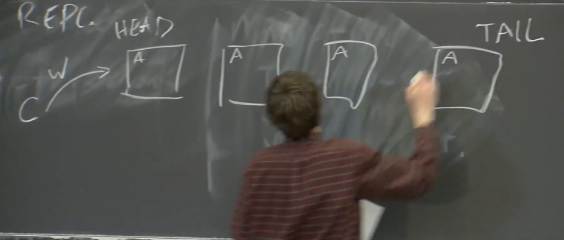
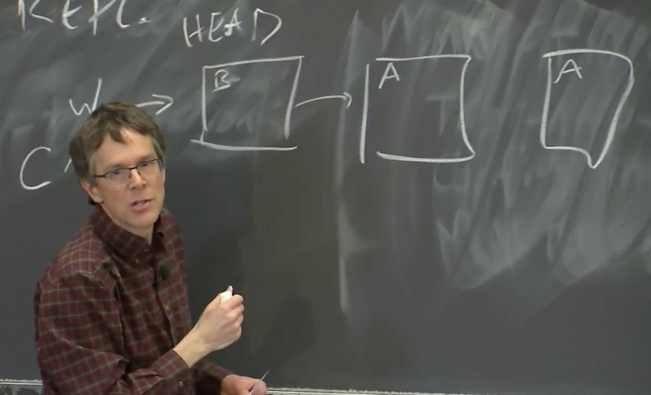
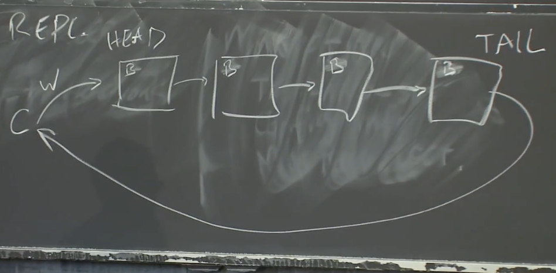
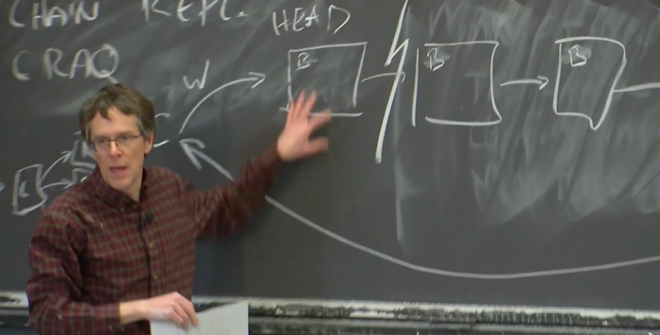
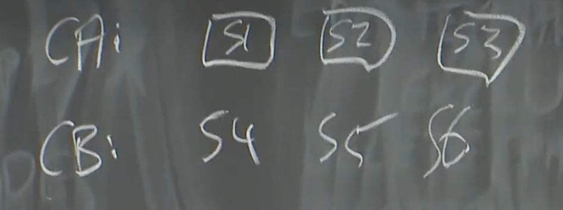

# 链复制（Chain Replication）

这一部分，我们来讨论另一个论文 CRAQ（Chain Replication with Apportioned Queries）。我们选择 CRAQ 论文有两个原因：第一个是它通过复制实现了容错；第二是它通过以链复制 API 请求这种有趣的方式，提供了与 Raft 相比不一样的属性。

CRAQ 是对于一个叫链式复制（Chain Replication）的旧方案的改进。Chain Replication 实际上用的还挺多的，有许多现实世界的系统使用了它，CRAQ 是对它的改进。CRAQ 采用的方式与 Zookeeper 非常相似，它通过将读请求分发到任意副本去执行，来提升读请求的吞吐量，所以副本的数量与读请求性能成正比。CRAQ 有意思的地方在于，它在任意副本上执行读请求的前提下，还可以保证线性一致性（Linearizability）。这与 Zookeeper 不太一样，Zookeeper 为了能够从任意副本执行读请求，不得不牺牲数据的实时性，因此也就不是线性一致的。CRAQ 却可以从任意副本执行读请求，同时也保留线性一致性，这一点非常有趣。

首先，我想讨论旧的 Chain Replication 系统。Chain Replication 是这样一种方案，你有多个副本，你想确保它们都看到相同顺序的写请求（这样副本的状态才能保持一致），这与 Raft 的思想是一致的，但是它却采用了与 Raft 不同的拓扑结构。

首先，在 Chain Replication 中，有一些服务器按照链排列。第一个服务器称为 HEAD，最后一个被称为 TAIL。

当客户端想要发送一个写请求，写请求总是发送给 HEAD。HEAD 根据写请求更新本地数据，我们假设现在是一个支持 PUT/GET 的 key-value 数据库。所有的服务器本地数据都从 A 开始。

当 HEAD 收到了写请求，将本地数据更新成了 B，之后会再将写请求通过链向下一个服务器传递。

下一个服务器执行完写请求之后，再将写请求向下一个服务器传递，以此类推，所有的服务器都可以看到写请求。

当写请求到达 TAIL 时，TAIL 将回复发送给客户端，表明写请求已经完成了。这是处理写请求的过程。

对于读请求，如果一个客户端想要读数据，它将读请求发往 TAIL，TAIL 直接根据自己的当前状态来回复读请求。所以，如果当前状态是 B，那么 TAIL 直接返回 B。读请求处理的非常的简单。

这里只是 Chain Replication，并不是 CRAQ。Chain Replication 本身是线性一致的，在没有故障时，从一致性的角度来说，整个系统就像只有 TAIL 一台服务器一样，TAIL 可以看到所有的写请求，也可以看到所有的读请求，它一次只处理一个请求，读请求可以看到最新写入的数据。如果没有出现故障的话，一致性是这么得到保证的，非常的简单。

从一个全局角度来看，除非写请求到达了 TAIL，否则一个写请求是不会 commit，也不会向客户端回复确认，也不能将数据通过读请求暴露出来。而为了让写请求到达 TAIL，它需要经过并被链上的每一个服务器处理。所以我们知道，一旦我们 commit 一个写请求，一旦向客户端回复确认，一旦将写请求的数据通过读请求暴露出来，那意味着链上的每一个服务器都知道了这个写请求。

---

# 链复制的故障恢复（Fail Recover）

在 Chain Replication 中，出现故障后，你可以看到的状态是相对有限的。因为写请求的传播模式非常有规律，我们不会陷入到类似于 Raft 论文中图 7 和图 8 描述的那种令人毛骨悚然的复杂场景中。并且在出现故障之后，也不会出现不同的副本之间各种各样不同步的场景。

在 Chain Replication 中，因为写请求总是依次在链中处理，写请求要么可以达到 TAIL 并 commit，要么只到达了链中的某一个服务器，之后这个服务器出现故障，在链中排在这个服务器后面的所有其他服务器不再能看到写请求。所以，只可能有两种情况：committed 的写请求会被所有服务器看到；而如果一个写请求没有 commit，那就意味着在导致系统出现故障之前，写请求已经执行到链中的某个服务器，所有在链里面这个服务器之前的服务器都看到了写请求，所有在这个服务器之后的服务器都没看到写请求。

总的来看，Chain Replication 的故障恢复也相对的更简单。

如果 HEAD 出现故障，作为最接近的服务器，下一个节点可以接手成为新的 HEAD，并不需要做任何其他的操作。对于还在处理中的请求，可以分为两种情况：

-   对于任何已经发送到了第二个节点的写请求，不会因为 HEAD 故障而停止转发，它会持续转发直到 commit。
-   如果写请求发送到 HEAD，在 HEAD 转发这个写请求之前 HEAD 就故障了，那么这个写请求必然没有 commit，也必然没有人知道这个写请求，我们也必然没有向发送这个写请求的客户端确认这个请求，因为写请求必然没能送到 TAIL。所以，对于只送到了 HEAD，并且在 HEAD 将其转发前 HEAD 就故障了的写请求，我们不必做任何事情。或许客户端会重发这个写请求，但是这并不是我们需要担心的问题。

如果 TAIL 出现故障，处理流程也非常相似，TAIL 的前一个节点可以接手成为新的 TAIL。所有 TAIL 知道的信息，TAIL 的前一个节点必然都知道，因为 TAIL 的所有信息都是其前一个节点告知的。

中间节点出现故障会稍微复杂一点，但是基本上来说，需要做的就是将故障节点从链中移除。或许有一些写请求被故障节点接收了，但是还没有被故障节点之后的节点接收，所以，当我们将其从链中移除时，故障节点的前一个节点或许需要重发最近的一些写请求给它的新后继节点。这是恢复中间节点流程的简单版本。

Chain Replication 与 Raft 进行对比，有以下差别：

-   从性能上看，对于 Raft，如果我们有一个 Leader 和一些 Follower。Leader 需要直接将数据发送给所有的 Follower。所以，当客户端发送了一个写请求给 Leader，Leader 需要自己将这个请求发送给所有的 Follower。然而在 Chain Replication 中，HEAD 只需要将写请求发送到一个其他节点。数据在网络中发送的代价较高，所以 Raft Leader 的负担会比 Chain Replication 中 HEAD 的负担更高。当客户端请求变多时，Raft Leader 会到达一个瓶颈，而不能在单位时间内处理更多的请求。而同等条件以下，Chain Replication 的 HEAD 可以在单位时间处理更多的请求，瓶颈会来的更晚一些。
-   另一个与 Raft 相比的有趣的差别是，Raft 中读请求同样也需要在 Raft Leader 中处理，所以 Raft Leader 可以看到所有的请求。而在 Chain Replication 中，每一个节点都可以看到写请求，但是只有 TAIL 可以看到读请求。所以负载在一定程度上，在 HEAD 和 TAIL 之间分担了，而不是集中在单个 Leader 节点。
-   前面分析的故障恢复，Chain Replication 也比 Raft 更加简单。这也是使用 Chain Replication 的一个主要动力。

>   学生提问：如果一个写请求还在传递的过程中，还没有到达 TAIL，TAIL 就故障了，会发生什么？
>
>   Robert教授：如果这个时候 TAIL 故障了，TAIL 的前一个节点最终会看到这个写请求，但是 TAIL 并没有看到。因为 TAIL 的故障，TAIL 的前一个节点会成为新的 TAIL，这个写请求实际上会完成 commit，因为写请求到达了新的 TAIL。所以新的 TAIL 可以回复给客户端，但是它极有可能不会回复，因为当它收到写请求时，它可能还不是 TAIL。这样的话，客户端或许会重发写请求，但是这就太糟糕了，因为同一个写请求会在系统中处理两遍，所以我们需要能够在 HEAD 抑制重复请求。不过基本上我们讨论的所有系统都需要能够抑制重复的请求。

>   学生提问：假设第二个节点不能与 HEAD 进行通信，第二个节点能不能直接接管成为新的 HEAD，并通知客户端将请求发给自己，而不是之前的 HEAD？
>
>   Robert教授：这是个非常好的问题。你认为呢？
>
>   你的方案听起来比较可行。假设 HEAD 和第二个节点之间的网络出问题了，HEAD 还在正常运行，同时 HEAD 认为第二个节点挂了。然而第二个节点实际上还活着，它认为 HEAD 挂了。所以现在他们都会认为，另一个服务器挂了，我应该接管服务并处理写请求。因为从 HEAD 看来，其他服务器都失联了，HEAD 会认为自己现在是唯一的副本，那么它接下来既会是 HEAD，又会是 TAIL。第二个节点会有类似的判断，会认为自己是新的 HEAD。所以现在有了脑裂的两组数据，最终，这两组数据会变得完全不一样。

---

# 链复制的配置管理器（Configuration Manager）

所以，Chain Replication 并不能抵御网络分区，也不能抵御脑裂。在实际场景中，这意味它不能单独使用。Chain Replication 是一个有用的方案，但是它不是一个完整的复制方案。它在很多场景都有使用，但是会以一种特殊的方式来使用。总是会有一个外部的权威（External Authority）来决定谁是活的，谁挂了，并确保所有参与者都认可由哪些节点组成一条链，这样在链的组成上就不会有分歧。这个外部的权威通常称为 Configuration Manager。

Configuration Manager 的工作就是监测节点存活性，一旦 Configuration Manager 认为一个节点挂了，它会生成并送出一个新的配置，在这个新的配置中，描述了链的新的定义，包含了链中所有的节点，HEAD 和 TAIL。Configuration Manager 认为挂了的节点，或许真的挂了也或许没有，但是我们并不关心。因为所有节点都会遵从新的配置内容，所以现在不存在分歧了。

现在只有一个角色（Configuration Manager）在做决定，它不可能否认自己，所以可以解决脑裂的问题。

当然，你是如何使得一个服务是容错的，不否认自己，同时当有网络分区时不会出现脑裂呢？答案是，Configuration Manager 通常会基于 Raft 或者 Paxos。在 CRAQ 的场景下，它会基于 Zookeeper。而 Zookeeper 本身又是基于类似 Raft 的方案。

所以，你的数据中心内的设置通常是，你有一个基于 Raft 或者 Paxos 的 Configuration Manager，它是容错的，也不会受脑裂的影响。之后，通过一系列的配置更新通知，Configuration Manager 将数据中心内的服务器分成多个链。比如说，Configuration Manager 决定链 A 由服务器 S1，S2，S3 组成，链 B 由服务器 S4，S5，S6 组成。

Configuration Manager 通告给所有参与者整个链的信息，所以所有的客户端都知道 HEAD 在哪，TAIL 在哪，所有的服务器也知道自己在链中的前一个节点和后一个节点是什么。现在，单个服务器对于其他服务器状态的判断，完全不重要。假如第二个节点真的挂了，在收到新的配置之前，HEAD 需要不停的尝试重发请求。节点自己不允许决定谁是活着的，谁挂了。

这种架构极其常见，这是正确使用 Chain Replication 和 CRAQ 的方式。在这种架构下，像 Chain Replication 一样的系统不用担心网络分区和脑裂，进而可以使用类似于 Chain Replication 的方案来构建非常高速且有效的复制系统。比如在上图中，我们可以对数据分片（Sharding），每一个分片都是一个链。其中的每一个链都可以构建成极其高效的结构来存储你的数据，进而可以同时处理大量的读写请求。同时，我们也不用太担心网络分区的问题，因为它被一个可靠的，非脑裂的 Configuration Manager 所管理。

>   学生提问：为什么存储具体数据的时候用 Chain Replication，而不是 Raft？
>
>   Robert教授：这是一个非常合理的问题。其实数据用什么存并不重要。因为就算我们这里用了 Raft，我们还是需要一个组件在产生冲突的时候来做决策。比如说数据如何在我们数百个复制系统中进行划分。如果我需要一个大的系统，我需要对数据进行分片，需要有个组件来决定数据是如何分配到不同的分区。随着时间推移，这里的划分可能会变化，因为硬件可能会有增减，数据可能会变多等等。Configuration Manager 会决定以 A 或者 B 开头的 key 在第一个分区，以 C 或者 D 开头的 key 在第二个分区。至于在每一个分区，我们该使用什么样的复制方法，Chain Replication，Paxos，还是 Raft，不同的人有不同的选择，有些人会使用 Paxos，比如说 Spanner，我们之后也会介绍。在这里，不使用 Paxos 或者 Raft，是因为 Chain Replication 更加的高效，因为它减轻了 Leader 的负担，这或许是一个非常关键的问题。
>
>   某些场合可能更适合用 Raft 或者 Paxos，因为它们不用等待一个慢的副本。而当有一个慢的副本时，Chain Replication 会有性能的问题，因为每一个写请求需要经过每一个副本，只要有一个副本变慢了，就会使得所有的写请求处理变慢。这个可能非常严重，比如说你有 1000 个服务器，因为某人正在安装软件或者其他的原因，任意时间都有几个服务器响应比较慢。每个写请求都受限于当前最慢的服务器，这个影响还是挺大的。然而对于 Raft，如果有一个副本响应速度较慢，Leader 只需要等待过半服务器，而不用等待所有的副本。最终，所有的副本都能追上 Leader 的进度。所以，Raft 在抵御短暂的慢响应方面表现的更好。一些基于 Paxos 的系统，也比较擅长处理副本相距较远的情况。对于 Raft 和 Paxos，你只需要过半服务器确认，所以不用等待一个远距离数据中心的副本确认你的操作。这些原因也使得人们倾向于使用类似于 Raft 和 Paxos 这样的选举系统，而不是 Chain Replication。这里的选择取决于系统的负担和系统要实现的目标。
>
>   不管怎样，配合一个外部的权威机构这种架构，我不确定是不是万能的，但的确是非常的通用。

>   学生提问：如果 Configuration Manger 认为两个服务器都活着，但是两个服务器之间的网络实际中断了会怎样？
>
>   Robert教授：对于没有网络故障的环境，总是可以假设计算机可以通过网络互通。对于出现网络故障的环境，可能是某人踢到了网线，一些路由器被错误配置了或者任何疯狂的事情都可能发生。所以，因为错误的配置你可能陷入到这样一个情况中，Chain  Replication 中的部分节点可以与 Configuration Manager 通信，并且 Configuration Manager 认为它们是活着的，但是它们彼此之间不能互相通信。
>
>   这是这种架构所不能处理的情况。如果你希望你的系统能抵御这样的故障。你的 Configuration Manager 需要更加小心的设计，它需要选出不仅是它能通信的服务器，同时这些服务器之间也能相互通信。在实际中，任意两个节点都有可能网络不通。

