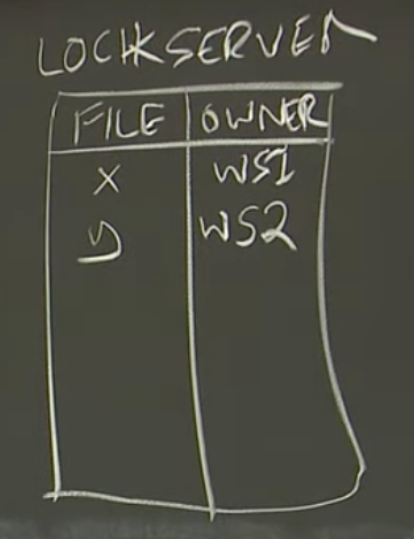
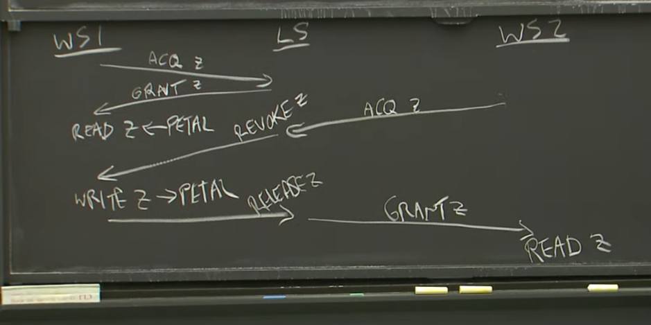

# Frangipani 初探

今天讨论的论文是 Frangipani，这是一篇很久之前有关分布式文件系统的论文。尽管如此，我们还要读这篇论文的原因是，它有大量有关缓存一致性，分布式事务和分布式故障恢复有关的有趣的并且优秀的设计，并且它还介绍了这几种功能之间的关联，论文里的这些内容是我们真正想要了解的。

Frangipani 论文里面有大量缓存一致性的介绍（Cache Coherence）。缓存一致性是指，如果我缓存了一些数据，之后你修改了实际数据但是并没有考虑我缓存中的数据，必须有一些额外的工作的存在，这样我的缓存才能与实际数据保持一致。论文还介绍了分布式事务（Distributed Transaction），这对于向文件系统的数据结构执行复杂更新来说是必须的。因为文件本质上是分割散落在大量的服务器上，能够从这些服务器实现分布式故障恢复（Distributed Crash Recovery）也是至关重要的。

从整体架构上来说，Frangipani 就是一个网络文件系统（NFS，Network File System）。它的目标是与已有的应用程序一起工作，比如说一个运行在工作站上的普通 UNIX 程序。它与 Athena 的 AFS 非常类似。从一个全局视图来看，它包含了大量的用户（U1，U2，U3）。

每个用户坐在一个工作站前面，在论文那个年代，笔记本还不流行，大家使用的主要是工作站，不过工作站也就是一个带有键盘鼠标显示器和操作系统的计算机。三个用户对应的工作站（Workstation）分别是 WS1，WS2，WS3。

每一个工作站运行了一个 Frangipani 服务。论文中大部分功能都是在 Frangipani 软件中实现。所以，用户坐在一个工作站前面，他可能在运行一些普通的应用程序，比如说一个普通的文本编辑（VI）或者说一个编译程序（CC）。当这些普通的应用程序执行文件系统调用时，在系统内核中，有一个 Frangipani 模块，它实现了文件系统。在所有的工作站中，都有类似的结构。

文件系统的数据结构，例如文件内容、inode、目录、目录的文件列表、inode 和块的空闲状态，所有这些数据都存在一个叫做 Petal 的共享虚拟磁盘服务中。Petal 运行在一些不同的服务器上，有可能是机房里面的一些服务器，但是不会是人们桌子上的工作站。Petal 会复制数据，所以你可以认为 Petal 服务器成对的出现，这样就算一个故障了，我们还是能取回我们的数据。当 Frangipani 需要读写文件时，它会向正确的 Petal 服务器发送 RPC，并说，我需要这个块，请读取这个块，并将数据返回给我。在大部分时候，Petal 表现的就像是一个磁盘，你可以把它看做是共享的磁盘，所有的 Frangipani 都会与之交互。

从我们的角度来看，大部分的讨论都会假设 Petal 就是一个被所有 Frangipani 使用的，基于网络的共享磁盘。你可以通过一个块号或者磁盘上的一个地址来读写数据，就像一个普通的硬盘一样。

论文作者期望使用 Frangipani 的目的，是驱动设计的一个重要因素。作者想通过 Frangipani 来支持他们自己的一些活动，作者们是一个研究所的成员，假设研究所有 50 个人，他们习惯于使用共享的基础设施，例如分时间段使用同一批服务器，工作站。他们还期望通过网络文件系统在相互协作的研究员之间共享文件。所以他们想要这样一个文件系统，它可以用来存放每一个研究员的 home 目录，同时也可以存放共享的项目文件。这意味着，如果我编辑了一个文件，我希望其他与我一起工作的人可以读到我刚刚编辑的文件。他们期望达成这样的共享的目的。

除此之外，如果我坐在任意一个工作站前面，我都能获取到所有的文件，包括了我的 home 目录，我环境中所需要的一切文件。所以他们需要的是一个在相对小的组织中，针对普通使用者的共享文件系统。相对小的组织的意思是，每个人在每台工作站前都被信任。本质上来说，Frangipani 的设计并没有讨论安全。在一个类似 Athena 的系统中，是不能随意信任使用者和工作站。所以，Frangipani 是针对作者自己环境的一个设计。

至于性能，在他们的环境中也非常重要。实际上，大部分时候，人们使用工作站时，他们基本上只会读写自己的文件。他们或许会读取一些共享文件，比如说项目文件，但是大部分时候，我只会读写我自己的文件，你在你的工作站上只会读写你自己的文件。用户之间频繁的分享文件反而很少见。所以，尽管数据的真实拷贝是在共享的磁盘中，但是如果在本地能有一些缓存，那将是极好的。因为这样的话，我登录之后，我使用了我的一些文件，之后它们在本地缓存了一份，这样它们接下来可以在微秒级别读出来，而不是毫秒级别的从文件服务器获取它们。

除了最基本的缓存之外，Frangipani 还支持 Write-Back 缓存。所以，除了在每个工作站或者说每个 Frangipani 服务器上要持有缓存之外，我们还需要支持 Write-Back 缓存。这意味着，如果我想要修改某个数据，比如说我修改了一个文件，或者创建了一个文件，或者删除了一个文件，只要没有其他的工作站需要看到我的改动，Frangipani 通过 Write-Back 缓存方式管理这些数据。这意味着，最开始的时候，我的修改只会在本地的缓存中。如果我创建了一个文件，至少在最开始，有关新创建文件的信息，比如说新创建的 inode 和初始化的内容，home 目录文件列表的更新，文件名等等，所有的这些修改最初只会在本地缓存中存在，因此类似于创建文件的操作可以非常快的完成，因为只需要修改本地的内存中对于磁盘的缓存。而这些修改要过一会才会写回到 Petal。所以最开始，我们可以为文件系统做各种各样的修改，至少对于我自己的目录，我自己的文件，这些修改完全是本地的。这对于性能来说有巨大的帮助，因为写本地内存的性能比通过 RPC 向一个远端服务器写要快 1000 倍。

在这样的架构下，一个非常重要的后果是，文件系统的逻辑需要存在于每个工作站上。为了让所有的工作站能够只通过操作内存就完成类似创建文件的事情，这意味着所有对于文件系统的逻辑和设计必须存在于工作站内部。

在 Frangipani 的设计中，Petal 作为共享存储系统存在，它不知道文件系统，文件，目录，它只是一个很直观简单的存储系统，所有的复杂的逻辑都在工作站中的 Frangipani 模块中。所以这是一个非常去中心化的设计，这或许是实际需要的设计，也有可能是作者能想到的能让他们完成目标的设计。这种设计有好的影响。因为主要的复杂度，主要的 CPU 运算在每个工作站上，这意味着，随着你向系统增加更多的工作站，增加更多的用户，你自动的获得了更多的 CPU 算力来运行这些新的用户的文件系统操作。因为大部分的文件系统操作只在工作站本地发生，所以大部分 CPU 消耗的都是本地的，所以这个系统的天然自带扩展性。每个新工作站会接收来自一个新用户更多的负担，但是它同时也带来更多的 CPU 算力来运行那个用户的文件系统操作。

当然，在某个时间点，瓶颈会在 Petal。因为这是一个中心化的存储系统，这时，你需要增加更多的存储服务器。

所以，我们现在有了一个系统，它在工作站里面做了大量的缓存，并且文件的修改可以在本地缓存完成。这几乎立刻引出了有关设计的几个非常严重的挑战。Frangipani 的设计基本上就是用来解决相应的挑战的，我们接下来看一下会有哪些挑战。

---

# Frangipani的挑战（Challenges）

Frangipani 的挑战主要来自于两方面，一个是缓存，另一个是这种去中心化的架构带来的大量的逻辑存在于客户端之中进而引起的问题。

第一个挑战是，假设工作站 W1 创建了一个文件 `/A`。最初，这个文件只会在本地缓存中创建。首先，Frangipani 需要从 Petal 获得 `/` 目录下的内容，之后当创建文件时，工作站只是修改缓存的拷贝，并不会将修改立即返回给 Petal。

这里有个直接的问题，假设工作站 W2 上的用户想要获取 `/` 目录下的文件列表，我们希望这个用户可以看到新创建的文件。这是一个用户期望的行为，否则用户会感到非常困惑。比如我在大厅里喊了一嘴说我把所有有意思的信息都放到了这个新创建的文件 `/A` 中，你们快去看一看啊。但是当你从 W2 上尝试读取这个文件，却找不相应的文件。所以这里我们想要非常强的一致性，这样当有人在大厅里说自己在文件系统里面做了修改，其他人应该能看到这个修改。另一个场景是，如果我在一个工作站修改了文件，之后在另一个计算机上编译它，我期望编译器能看到我刚刚做的修改。这意味着，文件系统必须要做一些事情来确保客户端可以读到最新的写入文件。我们之前讨论过这个话题，我们称之为强一致或者线性一致，在这里我们也想要这种特性。但是在一个缓存的环境中，现在说的一致性的问题不是指存储服务器的一致性，而是指工作站上的一些修改需要被其他工作站看到。因为历史的原因，这通常被称为缓存一致性（Cache Coherence）。这是缓存系统的一个属性。它表明，如果我缓存了一个数据，并且其他人在他的缓存中修改了这个数据，那么我的缓存需要自动的应用那个修改。所以我们想要有这种缓存一致性的属性。

另一个问题是，因为所有的文件和目录都是共享的，非常容易会有两个工作站在同一个时间修改同一个目录。假设用户 U1 在他的工作站 W1 上想要创建文件 `/A`，这是一个在 `/` 目录下的新文件，同时，用户 U2 在他的工作站 W2 上想要创建文件 `/B`。

这里他们在同一个目录下创建了不同名字的两个文件 A 和 B，但是他们都需要修改根目录，为根目录增加一个新的文件名。所以这里的问题是，当他们同时操作时，系统能识别这些修改了相同目录的操作，并得到一些有意义的结果吗？这里的有意义的结果是指，A 和 B 最后都要创建成功，我们不想只创建一个文件，因为第二个文件的创建有可能会覆盖并取代第一个文件。这里期望的行为有很多种叫法，但是这里我们称之为原子性（Atomicity）。我们希望类似于创建文件，删除文件这样的操作表现的就像即时生效的一样，同时不会与相同时间其他工作站的操作相互干扰。每一个操作就像在一个时间点发生，而不是一个时间段发生。即使对于复杂的操作，涉及到修改很多状态，我们也希望这些操作表现的好像就是即时生效的。

最后一个问题是，假设我的工作站修改了大量的内容，由于 Write-Back 缓存，可能会在本地的缓存中堆积了大量的修改。如果我的工作站崩溃了，但是这时这些修改只有部分同步到了 Petal，还有部分仍然只存在于本地。同时，其他的工作站还在使用文件系统。那么，我的工作站在执行操作的过程中的崩溃，最好不要损坏其他人同样会使用的文件系统。这意味着，我们需要的是单个服务器的故障恢复，我希望我的工作站的崩溃不会影响其他使用同一个共享系统的工作站。哪怕说这些工作站正在查看我的目录，我的文件，它们应该看到一些合理的现象。它们可以漏掉我最后几个操作，但是它们应该看到一个一致的文件系统，而不是一个损坏了的文件系统数据。所以这里我们希望有故障恢复。一如既往的，在分布式系统中，这增加了更多的复杂度，我们可以很容易陷入到这样一个场景，一个工作站崩溃了，但是其他的工作站还在运行。

对于所有的这些内容，所有的 3 个挑战，在我们接下来的讨论中，我们会关注 Frangipani 是如何应对这些挑战。对于 Petal 虚拟磁盘，它也会有许多类似的关联问题，但是它不是今天关注的重点。Petal 有完全不同的，可靠的容错机制。实际上，它与我们之前讨论过的 Chain-Replication 非常相似。

---

# Frangipani的锁服务（Lock Server）

Frangipani 的第一个挑战是缓存一致性。在这里我们想要的是线性一致性和缓存带来的好处。对于线性一致性来说，当我查看文件系统中任何内容时，我总是能看到最新的数据。对于缓存来说，我们想要缓存带来的性能提升。某种程度上，我们想要同时拥有这两种特性的优点。

人们通常使用缓存一致性协议（Cache Coherence Protocol）来实现缓存一致性。这些协议在很多不同的场景都有使用，不只在分布式文件系统，在多核处理器每个核的缓存的同步中也有使用。只是不同场景中，使用的协议是不一样的。

Frangipani 的缓存一致性核心是由锁保证的，我们之后在原子性和故障恢复中将会再次看到锁。但是现在，我们只讨论用锁来保证缓存一致，用锁来帮助工作站确定当它们缓存了数据时，它们缓存的是最新的数据。

除了 Frangipani 服务器（也就是工作站），Petal 存储服务器，在 Frangipani 系统中还有第三类服务器，锁服务器。尽管你可以通过分片将锁分布到多个服务器上，但是我接下来会假设只有一个锁服务器。逻辑上，锁服务器是独立的服务器，但是实际上我认为它与 Petal 服务器运行在一起。在锁服务器里面，有一个表单，就叫做 locks。我们假设每一个锁以文件名来命名，所以对于每一个文件，我们都有一个锁，而这个锁，可能会被某个工作站所持有。

在这个例子中，我们假设锁是排他锁（Exclusive Lock），尽管实际上 Frangipani 中的锁更加复杂可以支持两种模式：要么允许一个写入者持有锁，要么允许多个读取者持有锁。

假设文件 X 最近被工作站 WS1 使用了，所以 WS1 对于文件 X 持有锁。同时文件 Y 最近被工作站 WS2 使用，所以 WS2 对于文件 Y 持有锁。锁服务器会记住每个文件的锁被谁所持有。当然一个文件的锁也有可能不被任何人持有。

在每个工作站，会记录跟踪它所持有的锁，和锁对应的文件内容。所以在每个工作站中，Frangipani 模块也会有一个 lock 表单，表单会记录文件名、对应的锁的状态和文件的缓存内容。这里的文件内容可能是大量的数据块，也可能是目录的列表。

当一个 Frangipani 服务器决定要读取文件，比如读取目录 /、读取文件 A、查看一个 inode，首先，它会向一个锁服务器请求文件对应的锁，之后才会向 Petal 服务器请求文件或者目录的数据。收到数据之后，工作站会记住，本地有一个文件 X 的拷贝，对应的锁的状态，和相应的文件内容。

每一个工作站的锁至少有两种模式。工作站可以读或者写相应的文件或者目录的最新数据，可以在创建，删除，重命名文件的过程中，如果这样的话，我们认为锁在 Busy 状态。

在工作站完成了一些操作之后，比如创建文件，或者读取文件，它会随着相应的系统调用（例如 rename，write，create，read）释放锁。只要系统调用结束了，工作站会在内部释放锁，现在工作站不再使用那个文件。但是从锁服务器的角度来看，工作站仍然持有锁。工作站内部会标明，这是锁时 Idle 状态，它不再使用这个锁。所以这个锁仍然被这个工作站持有，但是工作站并不再使用它。这在稍后的介绍中比较重要。

现在这里的配置是一致的，锁服务器知道文件 X 和 Y 的锁存在，并且都被 WS1 所持有。工作站 WS1 也有同等的信息，它内部的表单知道它持有了这两个锁，并且它记住了这两个锁对应的文件或者目录。

这里 Frangipani 应用了很多的规则，这些规则使得 Frangipani 以一种提供缓存一致性的方式来使用锁，并确保没有工作站会使用缓存中的旧数据。这些规则、锁、缓存数据需要配合使用。这里的规则包括了：

-   工作站不允许持有缓存的数据，除非同时也持有了与数据相关的锁。所以基本上来说，不允许在没有锁保护的前提下缓存数据。从操作意义上来说，这意味着对于一个工作站来说，在它使用一个数据之前，它首先要从锁服务器获取数据的锁。只有当工作站持有锁了，工作站才会从 Petal 读取数据，并将数据放在缓存中。所以这里的顺序是，获得锁，之后再从 Petal 读取数据。所以，直到获取了锁，工作站是不能缓存数据的，要想缓存数据，工作站必须先持有锁，之后，才能从 Petal 读取数据。
-   如果你在释放锁之前，修改了锁保护的数据，那你必须将修改了的数据写回到 Petal，只有在 Petal 确认收到了数据，你才可以释放锁，也就是将锁归还给锁服务器。所以这里的顺序是，先向 Petal 存储系统写数据，之后再释放锁。最后再从工作站的 lock 表单中删除关文件的锁的记录和缓存的数据。

---

# 缓存一致性（Cache Coherence）

工作站和锁服务器之间的缓存一致协议协议包含了 4 种不同的消息。本质上你可以认为它们就是一些单向的网络消息。

首先是 Request 消息，从工作站发给锁服务器。Request 消息会说：hey，锁服务器，我想获取这个锁。如果从锁服务器的 lock 表单中发现锁已经被其他人持有了，那锁服务器不能立即交出锁。但是一旦锁被释放了，锁服务器会回复一个 Grant 消息给工作站。这里的 Request 和 Grant 是异步的。

如果你向锁服务器请求锁，而另一个工作站现在正持有锁，锁服务器需要持有锁的工作站先释放锁，因为一个锁不能同时被两个人持有。那我们怎么能让这个工作站获取到锁呢？

前面说过，如果一个工作站在使用锁，并在执行读写操作，那么它会将锁标记为 Busy。但是通常来说，当工作站使用完锁之后，不会向锁服务器释放锁。所以，如果我创建了一个新文件，create 函数返回时，这些新文件的锁仍然被我的工作站持有。只是说现在锁的状态会变成 Idle 而不是 Busy。但是从锁服务器看来，我的工作站仍然持有锁。这里延迟将锁还给锁服务器的原因是，如果我在我的工作站上创建了文件 Y。我接下来几乎肯定要将Y用于其他目的，或许我向它写一些数据，或许会从它读数据。所以，如果工作站能持有所有最近用过的文件的锁并不主动归还的话，会有非常大的优势。在一个常见的例子中，我使用了 home 目录下的一些文件，并且其他工作站没有人查看过这些文件。我的工作站最后会为我的文件持有数百个在 Idle 状态的锁。但是如果某人查看了我的文件，他需要先获取锁，而这时我就需要释放锁了。

所以这里的工作方式是，如果锁服务器收到了一个加锁的请求，它查看自己的 lock 表单可以发现，这个锁现在正被工作站 WS1 所持有，锁服务器会发送一个 Revoke 消息给当前持有锁的工作站 WS1。并说，现在别人要使用这个文件，请释放锁吧。

当一个工作站收到了一个 Revoke 请求，如果锁时在 Idle 状态，并且缓存的数据脏了，工作站会首先将修改过的缓存写回到 Petal 存储服务器中，因为前面的规则要求在释放锁之前，要先将数据写入 Petal。所以如果锁的状态是 Idle，首先需要将修改了的缓存数据发回给 Petal，只有在那个时候，工作站才会再向锁服务器发送一条消息说，好吧，我现在放弃这个锁。所以，对于一个 Revoke 请求的响应是，工作站会向锁服务器发送一条 Release 消息。

如果工作站收到 Revoke 消息时，它还在使用锁，比如说正在删除或者重命名文件的过程中，直到工作站使用完了锁为止，或者说直到它完成了相应的文件系统操作，它都不会放弃锁。完成了操作之后，工作站中的锁的状态才会从 Busy 变成 Idle，之后工作站才能注意到 Revoke 请求，在向 Petal 写完数据之后最终释放锁。

所以，这就是 Frangipani 使用的一致性协议的一个简单版本的描述。如我之前所描述的，这里面没有考虑一个事实，那就是锁可以是为写入提供的排他锁（Exclusive Lock），也可以是为只读提供的共享锁（Shared Lock）。

就像 Petal 只是一个块存储服务，并不理解文件系统。锁服务器也不理解文件，目录，还有文件系统，它只是维护 lock 表单，表单中记录的是锁的名字和锁的持有者。Frangipani 可以理解锁与某个文件相关联。实际上 Frangipani 在这里使用的是 Unix 风格的 inode 号来作为 lock 表单的 key，而不是文件的名字。

接下来，我们看一下如何应用这里的缓存一致协议，并演示 Petal 操作和和锁服务器操作之间的关联。我会过一遍工作站修改文件系统数据，之后另一个工作站查看对应数据的流程。

所以，首先我们有了 2 个工作站（WS1，WS2），一个锁服务器（LS）。按照协议，如果 WS1 想要读取并修改文件 Z。在它从 Petal 读取文件之前，它需要先获取对于 Z 的锁，所以它向锁服务器发送 Request 消息（下图中 ACQ Z）。

如果当前没有人持有对文件 Z 的锁，或者锁服务器没听过对于文件 Z 的锁（初始化状态），锁服务器会在 lock 表单中增加一条记录，并返回 Grant 消息给工作站说，你现在持有了对于 Z 文件的锁。

从这个时间点开始，工作站 WS1 持有了对文件 Z 的锁，并且被授权可以从 Petal 读取 Z 的数据。所以这个时间点，WS1 会从 Petal 读取并缓存 Z 的内容。之后，WS1 也可以在本地缓存中修改 Z 的内容。

过了一会，坐在工作站 WS2 前面的用户也想读取文件 Z。但是一开始 WS2 并没有对于文件 Z 的锁，所以它要做的第一件事情就是向锁服务器发送 Request 消息，请求对于文件 Z 的锁。

但是，锁服务器知道不能给 WS2 回复 Grant 消息，因为 WS1 现在还持有锁。接下来锁服务器会向 WS1 发送 Revoke 消息。而工作站 WS1 在向 Petal 写入修改数据之前，不允许释放锁。所以它现在会将任何修改的内容写回给 Petal。写入结束之后，WS1 才可以向锁服务器发送 Release 消息。

锁服务器必然会有一个表单记录谁在等待文件Z的锁，一旦锁的当前持有者释放了锁，锁服务器需要通知等待者。所以当锁服务器收到了这条 Release 消息时，锁服务器会更新自己的表单，并最终将 Grant 消息发送给工作站 WS2。这个时候，WS2 终于可以从 Petal 读取文件 Z。

这就是缓存一致性协议的工作流程，它确保了，直到所有有可能私底下在缓存中修改了数据的工作站先将数据写回到 Petal，其他工作站才能读取相应的文件。所以，这里的锁机制确保了读文件总是能看到最新写入文件的数据。 

在这个缓存一致性的协议中，有许多可以优化的地方。实际上，我之前已经描述过一个优化点了，每个工作站用完了锁之后，不是立即向锁服务器释放锁，而是将锁的状态标记为 Idle 就是一种优化。

另一个主要的优化是，Frangipani 有共享的读锁（Shared Read Lock）和排他的写锁（Exclusive Write Lock）。如果有大量的工作站需要读取文件，但是没有人会修改这个文件，它们都可以同时持有对这个文件的读锁。如果某个工作站需要修改这个已经被大量工作站缓存的文件时，那么它首先需要 Revoke 所有工作站的读锁，这样所有的工作站都会放弃自己对于该文件的缓存，只有在那时，这个工作站才可以修改文件。因为没有人持有了这个文件的缓存，所以就算文件被修改了，也没有人会读到旧的数据。

这就是以锁为核心的缓存一致性。

>   学生提问：如果没有其他工作站读取文件，那缓存中的数据就永远不写入后端存储了吗？
>
>   Robert教授：这是一个好问题。实际上，在我刚刚描述的机制中是有风险的，如果我在我的工作站修改了一个文件，但是没有人读取它，这时，这个文件修改后的版本的唯一拷贝只存在于我的工作站的缓存或者 RAM 上。这些文件里面可能有一些非常珍贵的信息，如果我的工作站崩溃了，并且我们不做任何特殊的操作，数据的唯一拷贝会丢失。所以为了阻止这种情况，不管怎么样，工作站每隔 30 秒会将所有修改了的缓存写回到 Petal 中。所以，如果我的工作站突然崩溃了，我或许会丢失过去30秒的数据，但是不会丢更多，这实际上是模仿 Linux 或者 Unix 文件系统的普通工作模式。在一个分布式文件系统中，很多操作都是在模仿 Unix 风格的文件系统，这样使用者才不会觉得 Frangipani 的行为异常，因为它基本上与用户在使用的文件系统一样。

---

# 原子性（Atomicity）

下一个挑战是确保原子性。当我做了一个复杂的操作，比如说创建一个文件，这里涉及到标识一个新的 inode、初始化一个 inode、为文件分配空间、在目录中为新文件增加一个新的名字，这里有很多步骤，很多数据都需要更新。我们不想任何人看到任何中间的状态，我们希望其他的工作站要么发现文件不存在，要么文件完全存在，但是我们绝不希望它看到中间状态。所以我们希望多个步骤的操作具备原子性。

为了实现原子性，为了让多步骤的操作，例如创建文件，重命名文件，删除文件具备原子性，Frangipani 在内部实现了一个数据库风格的事务系统，并且是以锁为核心。并且，这是一个分布式事务系统，我们之后会在这门课看到更多有关分布式事务系统的内容，它在分布式系统中是一种非常常见的需求。

简单来说，Frangipani 是这样实现分布式事务的：在我完全完成操作之前，Frangipani 确保其他的工作站看不到我的修改。首先我的工作站需要获取所有我需要读写数据的锁，在完成操作之前，我的工作站不会释放任何一个锁。并且为了遵循一致性规则，将所有修改了的数据写回到 Petal 之后，我的工作站才会释放所有的锁。比如我将文件从一个目录移到另一个目录，这涉及到修改两个目录的内容，我不想让人看到两个目录都没有文件的状态。为了实现这样的结果，Frangipani 首先会获取执行操作所需要的所有数据的锁，之后完成所有的步骤，比如完成所有数据的更新，并将更新写入到 Petal，最后释放锁。

因为我们有了锁服务器和缓存一致性协议，我们只需要确保我们在整个操作的过程中持有所有的锁，我们就可以无成本的获得这里的不可分割原子事务。

所以为了让操作具备原子性，Frangipani 持有了所有的锁。对于锁来说，这里有一件有意思的事情，Frangipani 使用锁实现了两个几乎相反的目标。对于缓存一致性，Frangipani 使用锁来确保写操作的结果对于任何读操作都是立即可见的，所以对于缓存一致性，这里使用锁来确保写操作可以被看见。但是对于原子性来说，锁确保了人们在操作完成之前看不到任何写操作，因为在所有的写操作完成之前，工作站持有所有的锁。

---

# Frangipani Log

下一个有意思的事情是故障恢复。

我们需要能正确应对这种场景：一个工作站持有锁，并且在一个复杂操作的过程中崩溃了。比如说一个工作站在创建文件，或者删除文件时，它首先获取了大量了锁，然后会更新大量的数据，在其向 Petal 回写数据的过程中，一部分数据写入到了 Petal，还有一部分还没写入，这时工作站崩溃了，并且锁也没有释放（因为数据回写还没有完成）。这是故障恢复需要考虑的有趣的场景。

对于工作站故障恢复的一些直观处理方法，但是都不太好。

其中一种处理方法是，如果发现工作站崩溃了，就释放它所有的锁。假设工作站在创建新文件，它已经在 Petal 里将文件名更新到相应的目录下，但是它还没有将描述了文件的 inode 写入到 Petal，Petal 中的 inode 可能还是一些垃圾数据，这个时候是不能释放崩溃工作站持有的锁（因为其他工作站读取这个文件可能读出错误的数据）。

另一种处理方法是，不释放崩溃了的工作站所持有的锁。这至少是正确的。如果工作站在向 Petal 写入数据的过程中崩溃了，因为它还没有写完所有的数据，也就意味着它不能释放所有的锁。所以，简单的不释放锁是正确的行为，因为这可以将这里的未完成的更新向文件的读取者隐藏起来，这样没人会因为看到只更新了一半的数据而感到困惑了。但是另一方面，如果任何人想要使用这些文件，那么他需要永远等待锁，因为我们没有释放这些锁。

所以，我们绝对需要释放锁，这样其他的工作站才能使用这个系统，使用相同的文件和目录。但同时，我们也需要处理这种场景：崩溃了的工作站只写入了与操作相关的部分数据，而不是全部的数据。

Frangipani 与其他的系统一样，需要通过预写式日志（Write-Ahead Log，WAL）实现故障可恢复的事务（Crash Recoverable Transaction）。我们在上节课介绍 Aurora时，也使用过 WAL。

当一个工作站需要完成涉及到多个数据的复杂操作时，在工作站向 Petal 写入任何数据之前，工作站会在 Petal 中自己的 Log 列表中追加一个 Log 条目，这个 Log 条目会描述整个的需要完成的操作。只有当这个描述了完整操作的 Log 条目安全的存在于 Petal 之后，工作站才会开始向 Petal 发送数据。所以如果工作站可以向 Petal 写入哪怕是一个数据，那么描述了整个操作、整个更新的 Log 条目必然已经存在于 Petal 中。

这是一种非常标准的行为，它就是 WAL 的行为。但是 Frangipani 在实现 WAL 时，有一些不同的地方。

第一个是，在大部分的事务系统中，只有一个 Log，系统中的所有事务都存在于这个 Log 中。当有故障时，如果有多个操作会影响同一份数据，我们在这一个 Log 里，就会保存这份数据的所有相关的操作。所以我们知道，对于一份数据，哪一个操作是最新的。但是 Frangipani 不是这么保存Log的，它对于每个工作站都保存了一份独立的 Log。

另一个有关 Frangipani 的 Log 系统有意思的事情是，工作站的 Log 存储在 Petal，而不是本地磁盘中。几乎在所有使用了 Log 的系统中，Log 与运行了事务的计算机紧紧关联在一起，并且几乎总是保存在本地磁盘中。但是出于优化系统设计的目的，Frangipani 的工作站将自己的 Log 保存在作为共享存储的 Petal 中。每个工作站都拥有自己的半私有的 Log，但是却存在 Petal 存储服务器中。这样的话，如果工作站崩溃了，它的 Log 可以被其他工作站从 Petal 中获取到。所以 Log 存在于 Petal 中。

这里其实就是，每个工作站的独立的 Log，存放在公共的共享存储中，这是一种非常有意思，并且反常的设计。

我们需要大概知道 Log 条目的内容是什么，但是 Frangipani 的论文对于 Log 条目的格式没有非常清晰的描述，论文说了每个工作站的 Log 存在于 Petal 已知的块中，并且，每个工作站以一种环形的方式使用它在 Petal 上的 Log 空间。Log 从存储的起始位置开始写，当到达结尾时，工作站会回到最开始，并且重用最开始的 Log 空间。所以工作站需要能够清除它的 Log，这样就可以确保，在空间被重复利用之前，空间上的 Log 条目不再被需要。

每个 Log 条目都包含了 Log 序列号，这个序列号是个自增的数字，每个工作站按照 12345 为自己的 Log 编号，这里直接且唯一的原因在论文里也有提到，如果工作站崩溃了，Frangipani 会探测工作站 Log 的结尾，Frangipani 会扫描位于 Petal 的 Log 直到 Log 序列号不再增加，这个时候 Frangipani 可以确定最后一个 Log 必然是拥有最高序列号的 Log。所以 Log 条目带有序列号是因为 Frangipani 需要检测 Log 的结尾。

除此之外，每个 Log 条目还有一个用来描述一个特定操作中所涉及到的所有数据修改的数组。数组中的每一个元素会有一个 Petal 中的块号（Block Number），一个版本号和写入的数据。类似的数组元素会有多个，这样就可以用来描述涉及到修改多份文件系统数据的操作。

这里有一件事情需要注意，Log 只包含了对于元数据的修改，比如说文件系统中的目录、inode、bitmap 的分配。Log 本身不会包含需要写入文件的数据，所以它并不包含用户的数据，它只包含了故障之后可以用来恢复文件系统结构的必要信息。例如，我在一个目录中创建了一个文件 F，那会生成一个新的 Log 条目，里面的数组包含了两个修改的描述，一个描述了如何初始化新文件的 inode，另一个描述了在目录中添加的新文件的名字。（这里我比较疑惑，如果 Log 只包含了元数据的修改，那么在故障恢复的时候，文件的内容都丢失了，也就是对于创建一个新文件的故障恢复只能得到一个空文件，这不太合理。）

当然，Log 是由多个 Log 条目组成，为了能够让操作尽快的完成，最初的时候，Frangipani 工作站的 Log 只会存在工作站的内存中，并尽可能晚的写到 Petal 中。这是因为，向 Petal 写任何数据，包括 Log，都需要花费较长的时间，所以我们要尽可能避免向 Petal 写入 Log 条目，就像我们要尽可能避免向 Petal 写入缓存数据一样。

所以，这里的完整的过程是。当工作站从锁服务器收到了一个 Revoke 消息，要自己释放某个锁，它需要执行好几个步骤。

1.  首先，工作站需要将内存中还没有写入到 Petal 的 Log 条目写入到 Petal 中。
2.  之后，再将被 Revoke 的 Lock 所保护的数据写入到 Petal。
3.  最后，向锁服务器发送 Release 消息。

这里采用这种流程的原因是，在第二步我们向 Petal 写入数据的时候，如果我们在中途故障退出了，我们需要确认其他组件有足够的信息能完成我们未完成修改。先写入 Log 将会使我们能够达成这个目标。这些 Log 记录是对将要做的修改的完整记录。所以我们需要先将完整的 Log 写入到 Petal。之后工作站可以开始向 Petal 写入其修改了的块数据，这个过程中，可能会故障，也可能不会。如果工作站完成了向 Petal 写入块数据，它就能向锁服务发送 Release 消息。所以，如果我的工作站修改了一些文件，之后其他的工作站想要读取这些文件，上面的才是一个实际的工作流程。锁服务器要我释放锁，我的工作站会先向 Petal 写入 Log，之后再向 Petal 写入脏的块数据，最后才向锁服务器发送 Release 消息。之后，其他的工作站才能获取锁，并读取相应的数据块。这是没有故障的时候对应的流程。

当然，只有当故障发生时，事情才变得有意思。

>   学生提问：Revoke 的时候会将所有的 Log 都写入到 Petal 吗？
>
>   Robert教授：对于 Log，你绝对是正确的，Frangipani 工作站会将完整的 Log 写入 Petal。所以，如果我们收到了一个针对特定文件 Z 的 Revoke 消息，工作站会将整个 Log 都写入 Petal。但是因为工作站现在需要放弃对于 Z 的锁，它还需要向 Petal 写入 Z 相关的数据块。所以我们需要写入完整的 Log，和我们需要释放的锁对应的文件内容，之后我们就可以释放锁。
>
>   或许写入完整的 Log 显得没那么必要，在这里可以稍作优化。如果 Revoke 要撤回的锁对应的文件 Z 只涉及第一个 Log，并且工作站中的其他 Log 并没有修改文件 Z，那么可以只向 Petal 写入一个 Log，剩下的 Log 之后再写入，这样可以节省一些时间。

---

# 故障恢复（Crash Recovery）

接下来，我们讨论一下，当工作站持有锁，并且故障了会发生什么。

这里的场景是，当工作站需要重命名文件或者创建一个文件时，首先它会获得所有需要修改数据的锁，之后修改自身的缓存来体现改动。但是后来工作站在向 Petal 写入数据的过程中故障了。工作站可能在很多个位置发生故障，但是由于前面介绍过的工作流程，Frangipani 总是会先将自身的 Log 先写入到 Petal。这意味着如果发生了故障，那么发生故障时可能会有这几种场景：

-   要么工作站正在向 Petal 写入 Log，所以这个时候工作站必然还没有向 Petal 写入任何文件或者目录。
-   要么工作站正在向 Petal 写入修改的文件，所以这个时候工作站必然已经写入了完整的 Log。

因为有了前面的工作流程，我们需要担心的故障发生时间点是有限的。

当持有锁的工作站崩溃了之后，发生的第一件事情是锁服务器向工作站发送一个 Revoke 消息，但是锁服务器得不到任何响应，之后才会触发故障恢复。如果没有人需要用到崩溃工作站持有的锁，那么基本上没有人会注意到工作站崩溃了。假设一个其他的工作站需要崩溃了的工作站所持有的一个锁，锁服务器会发出 Revoke 消息，但是锁服务器永远也不会从崩溃了的工作站收到 Release 消息。Frangipani 出于一些原因对锁使用了租约，当租约到期了，锁服务器会认定工作站已经崩溃了，之后它会初始化恢复过程。实际上，锁服务器会通知另一个还活着的工作站说：看，工作站 1 看起来崩溃了，请读取它的 Log，重新执行它最近的操作并确保这些操作完成了，在你完成之后通知我。在收到这里的通知之后，锁服务器才会释放锁。这就是为什么日志存放在 Petal 是至关重要的，因为一个其他的工作站可能会要读取这个工作站在 Petal 中的日志。

发生故障的场景究竟有哪些呢？

-   第一种场景是，工作站 WS1 在向 Petal 写入任何信息之前就故障了。这意味着，当其他工作站 WS2 执行恢复，查看崩溃了的工作站的 Log 时，发现里面没有任何信息，自然也就不会做任何操作。之后 WS2 会释放 WS1 所持有的锁。工作站 WS1 或许在自己的缓存中修改了各种各样的数据，但是如果它没有在自己的 Log 存储区写入任何信息，那么它也不可能在 Petal 中写入任何它修改的块数据。我们会丢失 WS1 的最后几个操作，但是文件系统会与 WS1 开始修改之前保持一致。因为很明显，工作站 WS1 没能走到向 Petal 写 Log 那一步，自然也不可能向 Petal 写入块数据。
-   第二种场景是，工作站 WS1 向 Petal 写了部分 Log 条目。这样的话，执行恢复的工作站 WS2 会从 Log 的最开始向后扫描，直到 Log 的序列号不再增加，因为这必然是 Log 结束的位置。工作站 WS2 会检查 Log 条目的更新内容，并向 Petal 执行 Log 条目中的更新内容。比如 Petal 中的特定块需要写入特定的数据，这里对应的其实就是工作站 WS1 在自己本地缓存中做的一些修改。所以执行恢复的工作站 WS2 会检查每个 Log 条目，并重新向 Petal 执行 WS1 的每一条 Log。当 WS2 执行完 WS1 存放在 Petal 中的 Log，它会通知锁服务器，之后锁服务器会释放 WS1 持有的锁。这样的过程会使得 Petal 更新至故障工作站 WS1 在故障前的执行的部分操作。或许不能全部恢复 WS1 的操作，因为故障工作站可能只向 Petal 写了部分 Log 就崩溃了。同时，除非在 Petal 中找到了完整的 Log 条目，否则执行恢复的工作站 WS2 是不会执行这条 Log 条目的，所以，这里的隐含意思是需要有类似校验和的机制，这样执行恢复的工作站就可以知道，这个 Log 条目是完整的，而不是只有操作的一部分数据。这一点很重要，因为在恢复时，必须要在 Petal 的 Log 存储区中找到完整的操作。所以，对于一个操作的所有步骤都需要打包在一个 Log 条目的数组里面，这样执行恢复的工作站就可以，要么全执行操作的所有步骤，要么不执行任何有关操作的步骤，但是永远不会只执行部分步骤。这就是当在向 Petal 写入 Log 时，发生了故障的修复过程。
-   另一个有趣的可能是，工作站 WS1 在写入 Log 之后，并且在写入块数据的过程中崩溃了。先不考虑一些极其重要的细节，执行恢复的工作站 WS2 并不知道 WS1 在哪个位置崩溃的，它只能看到一些 Log 条目，同样的，WS2 会以相同的方式重新执行 Log。尽管部分修改已经写入了 Petal，WS2 会重新执行修改。对于部分已经写入的数据，相当于在相同的位置写入相同的数据。对于部分未写入的数据，相当于更新了 Petal 中的这部分数据，并完成了操作。

上面的描述并没有涵盖所有的场景，下面的这个场景会更加复杂一些。如果一个工作站，完成了上面流程的步骤 1，2，在释放锁的过程中崩溃了，进而导致崩溃的工作站不是最后修改特定数据的工作站。具体可以看下面这个例子，假设我们有一个工作站 WS1，它执行了删除文件 `d/f` 的操作。

之后，有另一个工作站 WS2，在删除文件之后，以相同的名字创建了文件，当然这是一个不同的文件。所以之后，工作站 WS2 创建了同名的文件 `d/f`。在创建完成之后，工作站 WS1 崩溃了。

所以，我们需要基于 WS1 的 Log 执行恢复，这时，可能有第三个工作站 WS3 来执行恢复的过程。

这里的时序表明，WS1 删除了一个文件，WS2 创建了一个文件，WS3 做了恢复操作。有可能删除操作仍然在 WS1 的 Log 中，当 WS1 崩溃后，WS3 需要读取 WS1 的 Log，并重新执行 WS1 的 Log 中的更新。因为删除文件的 Log 条目仍然存在于 WS1 的 Log 中，如果不做任何额外的事情，WS3 会删除这个文件。但是实际上，WS3 删除的会是 WS2 稍后创建的一个完全不同的文件。

这样的结果是完全错误的，因为需要被删除的是 WS1 指定的文件，而不是 WS2 创建的一个相同名字的文件。因为 WS2 的创建是在 WS1 的删除之后，所以我们不能只是不经思考的重新执行 WS1 的 Log，WS1 的 Log 在我们执行的时候可能已经过时了，其他的一些工作站可能已经以其他的方式修改了相同的数据，所以我们不能盲目的重新执行 Log 条目。

Frangipani 是这样解决这个问题的，通过对每一份存储在 Petal 文件系统数据增加一个版本号，同时将版本号与 Log 中描述的更新关联起来。在 Petal 中，每一个元数据，每一个 inode，每一个目录下的内容，都有一个版本号，当工作站需要修改 Petal 中的元数据时，它会向从 Petal 中读取元数据，并查看当前的版本号，之后在创建 Log 条目来描述更新时，它会在 Log 条目中对应的版本号填入元数据已有的版本号加 1。

之后，如果工作站执行到了写数据到 Petal 的步骤，它也会将新的增加了的版本号写回到 Petal。

所以，如果一个工作站没有故障，并且成功的将数据写回到了 Petal。这样元数据的版本号会大于等于 Log 条目中的版本号。如果有其他的工作站之后修改了同一份元数据，版本号会更高。

所以，实际上 WS3 看到的 WS1 的删除操作对应的 Log 条目，会有一个特定的版本号，它表明，由这个 Log 条目影响的元数据对应版本号 3（举例）。

WS2 的修改在 WS1 崩溃之前，所以 WS1 必然已经释放了相关数据的锁。WS2 获得了锁，它会读取当前的元数据可以发现当前的版本号是 3，当 WS2 写入数据的时候，它会将版本号设置为 4。

之后，当 WS3 执行恢复流程时，WS3 会重新执行 WS1 的 Log，它会首先检查版本号，通过查看 Log 条目中的版本号，并查看 Petal 中存储的版本号，如果 Petal 中存储的版本号大于等于 Log 条目中的版本号，那么 WS3 会忽略 Log 条目中的修改，因为很明显 Petal 中的数据已经被故障了的工作站所更新，甚至可能被后续的其他工作站修改了。所以在恢复的过程中，WS3 会选择性的根据版本号执行 Log，只有 Log 中的版本号高于 Petal 中存储的数据的版本时，Log 才会被执行。

这里有个比较烦人的问题就是，WS3 在执行恢复，但是其他的工作站还在频繁的读取文件系统，持有了一些锁并且在向 Petal 写数据。WS3 在执行恢复的过程中，WS2 是完全不知道的。WS2 可能还持有目录 d 的锁，而 WS3 在扫描故障工作站 WS1 的 Log 时，需要读写目录 d，但是目录 d 的锁还被 WS2 所持有。我们该如何解决这里的问题？

一种不可行的方法是，让执行恢复的 WS3 先获取所有关联数据的锁，再重新执行 Log。这种方法不可行的一个原因是，有可能故障恢复是在一个大范围电力故障之后，这样的话谁持有了什么锁的信息都丢失了，因此我们也就没有办法使用之前的缓存一致性协议，因为哪些数据加锁了，哪些数据没有加锁在断电的过程中丢失了。

但是幸运的是，执行恢复的工作站可以直接从 Petal 读取数据而不用关心锁。这里的原因是，执行恢复的工作站想要重新执行 Log 条目，并且有可能修改与目录 d 关联的数据，它就是需要读取 Petal 中目前存放的目录数据。接下来只有两种可能，要么故障了的工作站 WS1 释放了锁，要么没有。如果没有的话，那么没有其他人可以拥有目录的锁，执行恢复的工作站可以放心的读取目录数据，没有问题。如果释放了锁，那么在它释放锁之前，它必然将有关目录的数据写回到了 Petal。这意味着，Petal 中存储的版本号，至少会和故障工作站的 Log 条目中的版本号一样大，因此，之后恢复软件对比 Log 条目的版本号和 Petal 中存储的版本号，它就可以发现 Log 条目中的版本号并没有大于存储数据的版本号，那么这条 Log 条目就会被忽略。所以这种情况下，执行恢复的工作站可以不持有锁直接读取块数据，但是它最终不会更新数据。因为如果锁被释放了，那么 Petal 中存储的数据版本号会足够高，表明在工作站故障之前，Log 条目已经应用到了 Petal。所以这里不需要关心锁的问题。

---

# Frangipani总结

前面我介绍了这些主要的内容：

-   Petal 是什么
-   缓存一致性
-   分布式事务
-   分布式故障恢复

论文还讨论了一下性能，但是过了 20 年之后的今天，很难理解这些性能数据。因为作者在一个与今天非常不同的硬件，非常不同的环境测试的性能。笼统来说，作者展示的性能数据表明，随着越来越多的 Frangipani 工作站加入到系统中，系统并没有明显变慢。即使新加入的工作站在频繁的执行文件系统操作，并不会影响现有的工作站。这样的话，系统可以提供合理的扩展性，因为它可以在不减慢现有工作站的前提下增加更多的工作站。

回过头来看，尽管 Frangipani 有大量有意思且值得记住的技术，但是它对于存储系统的演进并没有什么影响。部分原因是，Frangipani 的目标环境是一个小的工作组，人们坐在桌子上的工作站前共享文件。这样的环境现在还存在与某些地方，但是却不是分布式存储的主要应用场景。真正的应用场景是一些大型的数据中心、大型网站、大数据运算，在这些场景中，文件系统的接口相比数据库接口来说，就不是那么有用了。比如，在大型网站的环境中，人们非常喜欢事务，但是人们在非常小的数据下才需要事务，这些小的数据也就是你会存储在数据库中的数据，而不是你会存储在文件系统中的数据。所以这里的一些技术，你可以在一些现代的系统中看到类似的设计，但是通常出现在数据库中。

另一个大的场景是为大数据运算存储大的文件，例如 MapReduce。实际上 GFS 某种程度上看起来就像是一个文件系统，但是实际上是为了 MapReduce 设计的存储系统。但是不论对于 GFS 也好，还是大数据运算也好，Frangipani 关注在工作站的本地缓存和缓存一致性，反而不是很有用。如果你读取 10TB 的数据，缓存基本上没什么用，并且会适得其反。所以，随着时间的推移，Frangipani 在一些场合还是有用的，但是并不符合在设计新系统时候的需求。

​	