# 分布式事务初探（Distributed Transaction）

今天讨论的内容是分布式事务，分布式事务主要有两部分组成。第一个是并发控制（Concurrency Control）第二个是原子提交（Atomic Commit）。

之所以提及分布式事务，是因为对于拥有大量数据的人来说，他们通常会将数据进行分割或者分片到许多不同的服务器上。假设你运行了一个银行，你一半用户的账户在一个服务器，另一半用户的账户在另一个服务器，这样的话可以同时满足负载分担和存储空间的要求。对于其他的场景也有类似的分片，比如说对网站上文章的投票，或许有上亿篇文章，那么可以在一个服务器上对一半的文章进行投票，在另一个服务器对另一半进行投票。

对于一些操作，可能会要求从多个服务器上修改或者读取数据。比如说我们从一个账户到另一个账户完成银行转账，这两个账户可能在不同的服务器上。因此，为了完成转账，我们必须要读取并修改两个服务器的数据。

一种构建系统的方式，我们在后面的课程也会看到，就是尝试向应用程序的开发人员，隐藏将数据分割在多个服务器上带来的复杂度。在过去的几十年间，这都是设计数据库需要考虑的问题，所以很多现在的材料的介绍都是基于数据库。但是这种方式（隐藏数据分片在多个服务器），现在在一些与传统数据库不相关的分布式系统也在广泛应用。

人们通常将并发控制和原子提交放在一起，当做事务。有关事务，我们之前介绍过。

可以这么理解事务：程序员有一些不同的操作，或许针对数据库不同的记录，他们希望所有这些操作作为一个整体，不会因为失败而被分割，也不会被其他活动看到中间状态。事务处理系统要求程序员对这些读操作、写操作标明起始和结束，这样才能知道事务的起始和结束。事务处理系统可以保证在事务的开始和结束之间的行为是可预期的。

例如，假设我们运行了一个银行，我们想从用户 Y 转账到用户 X，这两个账户最开始都有 10 块钱，这里的 X，Y 都是数据库的记录。

这里有两个交易，第一个是从 Y 转账 1 块钱到 X，另一个是对于所有的银行账户做审计，确保总的钱数不会改变，因为毕竟在账户间转钱不会改变所有账户的总钱数。我们假设这两个交易同时发生。为了用事务来描述这里的交易，我们需要有两个事务，第一个事务称为 T1，程序员会标记它的开始，我们称之为 BEGIN_X，之后是对于两个账户的操作，我们会对账户 X 加一，对账户 Y 减一。之后我们需要标记事务的结束，我们称之为 END_X。

同时，我们还有一个事务，会检查所有的账户，对所有账户进行审计，确保尽管可能存在转账，但是所有账户的金额加起来总数是不变的。所以，第二个事务是审计事务，我们称为 T2。我们也需要为事务标记开始和结束。这一次我们只是读数据，所以这是一个只读事务。我们需要获取所有账户的当前余额，因为现在我们只有两个账户，所以我们使用两个临时的变量，第一个是用来读取并存放账户 X 的余额，第二个用来读取并存放账户 Y 的余额，之后我们将它们都打印出来，最后是事务的结束。

这里的问题是，这两个事务的合法结果是什么？这是我们首先想要确定的事情。最初的状态是，两个账户都是 10 块钱，但是在同时运行完两个事务之后，最终结果可能是什么？我们需要一个概念来定义什么是正确的结果。一旦我们知道了这个概念，我们需要构建能执行这些事务的机制，在可能存在并发和失败的前提下，仍然得到正确的结果。

所以，首先，什么是正确性？数据库通常对于正确性有一个概念称为 ACID。分别代表：

-   Atomic，原子性。它意味着，事务可能有多个步骤，比如说写多个数据记录，尽管可能存在故障，但是要么所有的写数据都完成了，要么没有写数据能完成。不应该发生类似这种情况：在一个特定的时间发生了故障，导致事务中一半的写数据完成并可见，另一半的写数据没有完成，这里要么全有，要么全没有（All or Nothing）。
-   Consistent，一致性。我们实际上不会担心这一条，它通常是指数据库会强制某些应用程序定义的数据不变，这不是我们今天要考虑的点。
-   Isolated，隔离性。这一点还比较重要。这是一个属性，它表明两个同时运行的事务，在事务结束前，能不能看到彼此的更新，能不能看到另一个事务中间的临时的更新。目标是不能。隔离在技术上的具体体现是，事务需要串行执行，我之后会再解释这一条。但是总结起来，事务不能看到彼此之间的中间状态，只能看到完成的事务结果。
-   Durable，持久化的。这意味着，在事务提交之后，在客户端或者程序提交事务之后，并从数据库得到了回复说，yes，我们执行了你的事务，那么这时，在数据库中的修改是持久化的，它们不会因为一些错误而被擦除。在实际中，这意味着数据需要被写入到一些非易失的存储（Non-Volatile Storage），持久化的存储，例如磁盘。

今天的课程会讨论，在考虑到错误，考虑到多个并发行为的前提下，什么才是正确的行为，并确保数据在出现故障之后，仍然存在。这里对我们来说最有意思的部分是有关隔离性或者串行的具体定义。我会首先介绍这一点，之后再介绍如何执行上面例子中的两个事务。

通常来说，隔离性（Isolated）意味着可序列化（Serializable）。它的定义是如果在同一时间并行的执行一系列的事务，那么可以生成一系列的结果。这里的结果包括两个方面：由任何事务中的修改行为产生的数据库记录的修改；和任何事务生成的输出。所以前面例子中的两个事务，T1 的结果是修改数据库记录，T2 的结果是打印出数据。

我们说可序列化是指，并行的执行一些事物得到的结果，与按照某种串行的顺序来执行这些事务，可以得到相同的结果。实际的执行过程或许会有大量的并行处理，但是这里要求得到的结果与按照某种顺序一次一个事务的串行执行结果是一样的。所以，如果你要检查一个并发事务执行是否是可序列化的，你查看结果，并看看是否可以找到对于同一些事务，存在一次只执行一个事务的顺序，按照这个顺序执行可以生成相同的结果。

所以，我们刚刚例子中的事务，只有两种一次一个的串行顺序，要么是 T1，T2，要么是 T2，T1。我们可以看一下这两种串行执行生成的结果。

我们先执行 T1，再执行 T2，我们得到 X=11，Y=9，因为 T1 先执行，所以 T2 中的打印可以看到这两个更新过后的数据，所以这里会打印 11，9。

另一种可能的顺序是，先执行 T2，再执行 T1，这种情况下，T2 可以看到更新之前的数据，但是更新仍然会在 T1 中发生，所以最后的结果是 X=11，Y=9。但是这一次，T2 打印的是 10，10。

所以，这是两种串行执行的合法结果。如果我们同时执行这两个事务，看到了这两种结果之外的结果，那么我们运行的数据库不能提供序列化执行的能力（也就是不具备隔离性 Isolated）。所以，实际上，我们在考虑问题的时候，可以认为这是唯二可能的结果，我们最好设计我们的系统，并让系统只输出两个结果中的一个。

如果你同时提交两个事务，你不知道是 T1，T2 的顺序，还是 T2，T1 的顺序，所以你需要预期可能会有超过一个合法的结果。当你同时运行了更多的事务，结果也会更加复杂，可能会有很多不同的正确的结果，这些结果都是可序列化的，因为这里对于事务存在许多顺序，可以被用来满足序列化的要求。

现在我们对于正确性有了一个定义，我们甚至知道了可能的结果是什么。我们可以提出几个有关执行顺序的假设。

例如，假设系统实际上这么执行，开始执行 T2，并执行到读 X，之后执行了 T1。在 T1 结束之后，T2 再继续执行。

如果不是 T2 这样的事务，最后的结果可能也是合法的。但是现在，我们想知道如果按照这种方式执行，我们得到的结果是否是之前的两种结果之一。在这里，T2 事务中的变量 t1 可以看到 X 是 10，t2 会看到减 Y 之后的结果所以是 9，最后的打印将会是 10，9。这不符合之前的两种结果，所以这里描述的执行方式不是可序列化的，它不合法。

另一个有趣的问题是，如果我们一开始执行事务 T1，然后在执行完第一个 add 时，执行了整个事务 T2。这意味着，在 T2 执行的点，T2 可以读到 X 为 11，Y 为 10，之后打印 11，10。这也不是之前的两种合法结果之一。所以对于这两个事务，这里的执行过程也不合法。

可序列化是一个应用广泛且实用的定义，背后的原因是，它定义了事务执行过程的正确性。它是一个对于程序员来说是非常简单的编程模型，作为程序员你可以写非常复杂的事务而不用担心系统同时在运行什么，或许有许多其他的事务想要在相同的时间读写相同的数据，或许会发生错误，这些你都不需要关心。可序列化特性确保你可以安全的写你的事务，就像没有其他事情发生一样。因为系统最终的结果必须表现的就像，你的事务在这种一次一个的顺序中是独占运行的。这是一个非常简单，非常好的编程模型。

可序列化的另一方面优势是，只要事务不使用相同的数据，它可以允许真正的并行执行事务。我们之前的例子之所以有问题，是因为 T1 和 T2 都读取了数据 X 和 Y。但是如果它们使用完全没有交集的数据库记录，那么这两个事务可以完全并行的执行。在一个分片的系统中，不同的数据在不同的机器上，你可以获得真正的并行速度提升，因为可能一个事务只会在第一个机器的第一个分片上执行，而另一个事务并行的在第二个机器上执行。所以，这里有可能可以获得更高的并发性能。

在我详细介绍可序列化的事务之前，我还想提出一个小点。有一件场景我们需要能够应付，事务可能会因为这样或那样的原因在执行的过程中失败或者决定失败，通常这被称为 Abort。对于大部分的事务系统，我们需要能够处理，例如当一个事务尝试访问一个不存在的记录，或者除以 0，又或者是，某些事务的实现中使用了锁，一些事务触发了死锁，而解除死锁的唯一方式就是干掉一个或者多个参与死锁的事务，类似这样的场景。所以在事务执行的过程中，如果事务突然决定不能继续执行，这时事务可能已经修改了部分数据库记录，我们需要能够回退这些事务，并撤回任何已经做了的修改。

实现事务的策略，我会划分成两块，在这门课程中我都会介绍它们，先来简单的看一下这两块。

第一个大的有关实现的话题是并发控制（Concurrency Control）。这是我们用来提供可序列化的主要工具。所以并发控制就是可序列化的别名。通过与其他尝试使用相同数据的并发事务进行隔离，可以实现可序列化。

另一个有关实现的大的话题是原子提交（Atomic Commit）。它帮助我们处理类似这样的可能场景：前面例子中的事务 T1 在执行过程中可能已经修改了 X 的值，突然事务涉及的一台服务器出现错误了，我们需要能从这种场景恢复。所以，哪怕事务涉及的机器只有部分还在运行，我们需要具备能够从部分故障中恢复的能力。这里我们使用的工具就是原子提交。我们后面会介绍。

---

# 并发控制（Concurrency Control）

第一个要介绍的是并发控制（Concurrency Control）。在并发控制中，主要有两种策略，在这门课程中我都会介绍。

第一种主要策略是悲观并发控制（Pessimistic Concurrency Control）。

这里通常涉及到锁，我们在实验中的 Go 语言里面已经用过锁了。实际上，数据库的事务处理系统也会使用锁。这里的想法或许你已经非常熟悉了，那就是在事务使用任何数据之前，它需要获得数据的锁。如果一些其他的事务已经在使用这里的数据，锁会被它们持有，当前事务必须等待这些事务结束，之后当前事务才能获取到锁。在悲观系统中，如果有锁冲突，比如其他事务持有了锁，就会造成延时等待。所以这里需要为正确性而牺牲性能。

第二种主要策略是乐观并发控制（Optimistic Concurrency Control）。

这里的基本思想是，你不用担心其他的事务是否正在读写你要使用的数据，你直接继续执行你的读写操作，通常来说这些执行会在一些临时区域，只有在事务最后的时候，你再检查是不是有一些其他的事务干扰了你。如果没有这样的其他事务，那么你的事务就完成了，并且你也不需要承受锁带来的性能损耗，因为操作锁的代价一般都比较高；但是如果有一些其他的事务在同一时间修改了你关心的数据，并造成了冲突，那么你必须要 Abort 当前事务，并重试。这就是乐观并发控制。

实际，这两种策略哪个更好取决于不同的环境。如果冲突非常频繁，你或许会想要使用悲观并发控制，因为如果冲突非常频繁的话，在乐观并发控制中你会有大量的 Abort 操作。如果冲突非常少，那么乐观并发控制可以更快，因为它完全避免了锁带来的性能损耗。今天我们只会介绍悲观并发控制。几周之后的论文，我们会讨论一种乐观并发控制的方法。

所以，今天讨论悲观并发控制，这里涉及到的基本上就是锁机制。这里的锁是两阶段锁（Two-Phase Locking），这是一种最常见的锁。

对于两阶段锁来说，当事务需要使用一些数据记录时，例如前面例子中的 X，Y，第一个规则是在使用任何数据之前，在执行任何数据的读写之前，先获取锁。

第二个对于事务的规则是，事务必须持有任何已经获得的锁，直到事务提交或者 Abort，你不允许在事务的中间过程释放锁。你必须要持有所有的锁，并不断的累积你持有的锁，直到你的事务完成了。所以，这里的规则是，持有锁直到事务结束。

所以，这就是两阶段锁的两个阶段，第一个阶段获取锁，第二个阶段是在事务结束前一直持有锁。

为什么两阶段锁能起作用呢？虽然有很多的变种，在一个典型的锁系统中，每一个数据库中的记录（每个 Table 中的每一行）都有一个独立的锁（虽然实际中粒度可能更大）。一个事务，例如前面例子中的 T1，最开始的时候不持有任何锁，当它第一次使用 X 记录时，在它真正使用数据前，它需要获得对于 X 的锁，这里或许需要等待。当它第一次使用 Y 记录时，它需要获取另一个对于 Y 的锁，当它结束之后，它会释放这两个锁。如果我们同时运行之前例子中的两个事务，它们会同时竞争对于 X 的锁。任何一个事务先获取了 X 的锁，它会继续执行，最后结束并提交。同时，另一个没有获得 X 的锁，它会等待锁，在对 X 进行任何修改之前，它需要先获取锁。所以，如果 T2 先获取了锁，它会获取 X，Y的数值，打印，结束事务，之后释放锁。只有在这时，事务 T1 才能获得对于 X 的锁。

如你所见的，这里基本上迫使事务串行执行，在刚刚的例子中，两阶段锁迫使执行顺序是 T2，T1。所以这里显式的迫使事务的执行遵循可序列化的定义，因为实际上就是 T2 完成之后，再执行 T1。所以我们可以获得正确的执行结果。

这里有一个问题是，为什么需要在事务结束前一直持有锁？你或许会认为，你可以只在使用数据的时候持有锁，这样也会更有效率。在刚刚的例子中，或许只在 T2 获取记录 X 的数值时持有对 X 的锁，或许只在 T1 执行对 X 加 1 操作的时候持有对于 X 的锁，之后立即释放锁，虽然这样违反了两阶段锁的规则，但是如果立刻释放对于数据的锁，另一个事务可以早一点执行，我们就可以有更多的并发度，进而获得更高的性能。所以，两阶段锁必然对于性能来说很糟糕，所以我们才需要确认，它对于正确性来说是必要的。

如果事务尽可能早的释放锁，会发生什么呢？假设 T2 读取了 X，然后立刻释放了锁，那么在这个位置，T2 不持有任何锁，因为它刚刚释放了对于 X 的锁。

因为 T2 不持有任何锁，这意味着 T1 可以完全在这个位置执行。从前面的反例我们已经知道，这样的执行是错误的（因为 T2 会打印 10，9），因为它没能生成正确结果。

类似的，如果 T1 在执行完对 X 加 1 之后，就释放了对 X 的锁，这会使得整个 T2 有可能在这个位置执行。

我们之前也看到了，这会导致非法的结果。

如果在修改完数据之后就释放锁，还会有额外的问题。如果 T1 在执行完对 X 加 1 之后释放锁，它允许 T2 看到修改之后的 X，之后 T2 会打印出这个结果。但是如果 T1 之后 Abort 了，或许因为银行账户 Y 并不存在，或许账户 Y 存在，但是余额为 0，而我们不允许对于余额为 0 的账户再做减法，这样会造成透支。所以 T1 有可能会修改 X，然后 Abort。Abort 的一部分工作就是要撤回对于 X 的修改，这样才能维持原子性。这意味着，如果 T1 释放了对于 X 的锁，事务 T2 会看到 X 的虚假数值 11，这个数值最终不存在，因为 T1 中途 Abort 了，T2 会看到一个永远不曾存在的数值。T2 的结果最好是看起来就像是 T2 自己在运行，并没有 T1 的存在。但是这里，T2 会看到 X 加 1，然后打印出 11，这与数据库的任何状态都对应不上。

所以，使用了两阶段锁可以避免这两种违反可序列化特性的场景。

对于这些规则，还有一些需要知道的事情。首先是，这里非常容易产生死锁。例如我们有两个事务，T1 读取记录 X，之后再读取记录 Y，T2 读取记录 Y，之后再读取记录 X。如果它们同时运行，这里就是个死锁。

每个事务都获取了第一个读取数据的锁，直到事务结束了，它们都不会释放这个锁。所以接下来，它们都会等待另一个事务持有的锁，除非数据库足够聪明，这里会永远死锁。实际上，事务有各种各样的策略，包括了判断循环，超时来判断它们是不是陷入到这样一个场景中。如果是的话，数据库会 Abort 其中一个事务，撤回它所有的操作，并表现的像这个事务从来没有发生一样。

所以这就是使用两阶段锁的并发控制。这是一个完全标准的数据库行为，在一个单主机的数据库中是这样，在一个分布式数据库也是这样，不过会更加的有趣。

---

# 两阶段提交（Two-Phase Commit）

我们下一个话题更具体一点：在一个分布式环境中，数据被分割在多台机器上，如何构建数据库或存储系统以支持事务。所以这个话题是，如何构建分布式事务（Distributed Transaction）。具体来说，如何应付错误，甚至是由多台机器中的一台引起的部分错误。这种部分错误在分布式系统中很常见。所以，在分布式事务之外，我们也要确保出现错误时，数据库仍然具有可序列化和某种程度的 All-or-Nothing 原子性。

一个场景是，我们或许有两个服务器，服务器 S1 保存了 X 的记录，服务器 S2 保存了 Y 的记录，它们的初始值都是 10。接下来我们要运行之前的两个事务。事务 T1 同时修改了 X 和 Y，相应的我们需要向数据库发送消息说对 X 加 1，对 Y 减 1。但是如果我们不够小心，我们很容易就会陷入到这个场景中：我们告诉服务器 S1 去对 X 加 1，但是，之后出现了一些故障，或许持有 Y 记录的服务器 S2 故障了，使得我们没有办法完成更新的第二步。所以，这是一个问题：某个局部的故障会导致事务被分割成两半。如果我们不够小心，我们会导致一个事务中只有一半指令会生效。

甚至服务器没有崩溃都可能触发这里的场景。如果 X 完成了在事务中的工作，并且在服务器 S2 上，收到了对 Y 减 1 的请求，但是服务器 S2 发现 Y 记录并不存在。或者存在，但是账户余额等于 0。这时，不能对 Y 减 1。

不管怎样，服务器 S2 不能完成它在事务中应该做的那部分工作。但是服务器 S1 又完成了它在事务中的那部分工作。所以这也是一种需要处理的问题。

这里我们想要的特性，我之前也提到过，就是，要么系统中的每一部分都完成它们在事务中的工作，要么系统中的所有部分都不完成它们在事务中的工作。在前面，我们违反的规则是，在故障时没有保证原子性。

原子性是指，事务的每一个部分都执行，或者任何一个部分都不执行。很多时候，我们看到的解决方案是原子提交协议（Atomic Commit Protocols）。通常来说，原子提交协议的风格是：假设你有一批计算机，每一台都执行一个大任务的不同部分，原子提交协议将会帮助计算机来决定，它是否能够执行它对应的工作，它是否执行了对应的工作，又或者，某些事情出错了，所有计算机都要同意，没有一个会执行自己的任务。

这里的挑战是，如何应对各种各样的故障，机器故障，消息缺失。同时，还要考虑性能。原子提交协议在今天的阅读内容中有介绍，其中一种是两阶段提交（Two-Phase Commit）。

两阶段提交不仅被分布式数据库所使用，同时也被各种看起来不像是传统数据库的分布式系统所使用。通常情况下，我们需要执行的任务会以某种方式分包在多个服务器上，每个服务器需要完成任务的不同部分。所以，在前一个例子中，实际上是数据被分割在不同的服务器上，所以相应的任务（为 X 加 1，为 Y 减 1）也被分包在不同的服务器上。我们将会假设，有一个计算机会用来管理事务，它被称为事务协调者（Transaction Coordinator）。事务协调者有很多种方法用来管理事务，我们这里就假设它是一个实际运行事务的计算机。在一个计算机上，事务协调者以某种形式运行事务的代码，例如 Put/Get/Add，它向持有了不同数据的其他计算机发送消息，其他计算机再执行事务的不同部分。

所以，在我们的配置中，我们有一个计算机作为事务协调者（TC），然后还有服务器 S1，S2，分别持有 X，Y 的记录。

事务协调者会向服务器 S1 发消息说，请对 X 加 1，向服务器 S2 发消息说，请对 Y 减 1。

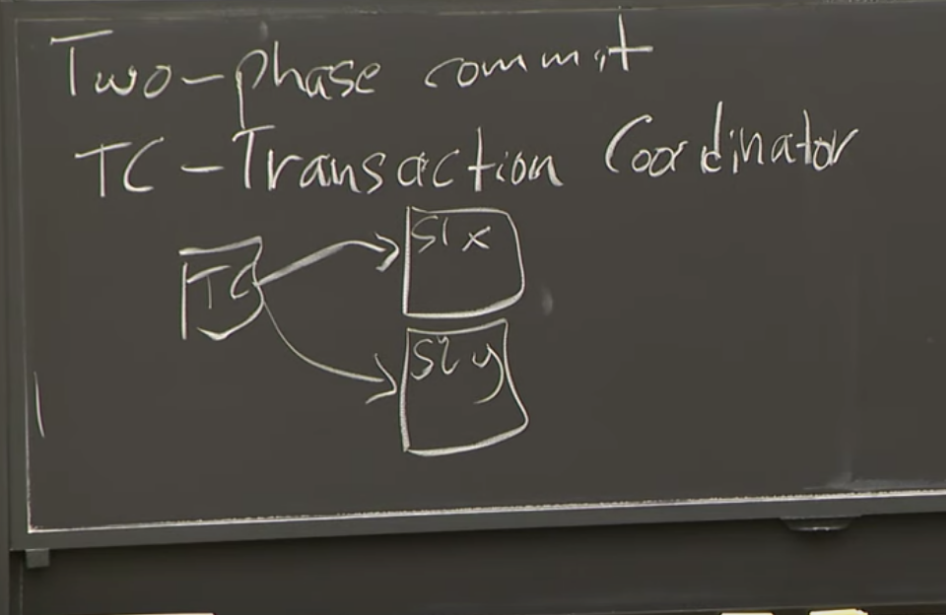

之后会有更多消息来确认，要么两个服务器都执行了操作，要么两个服务器都没有执行操作。这就是两阶段提交的实现框架。

有些事情你需要记住，在一个完整的系统中，或许会有很多不同的并发运行事务，也会有许多个事务协调者在执行它们各自的事务。在这个架构里的各个组成部分，都需要知道消息对应的是哪个事务。它们都会记录状态。每个持有数据的服务器会维护一个锁的表单，用来记录锁被哪个事务所持有。所以对于事务，需要有事务 ID（Transaction ID），简称为 TID。

虽然不是很确定，这里假设系统中的每一个消息都被打上唯一的事务 ID 作为标记。这里的 ID 在事务开始的时候，由事务协调器来分配。这样事务协调器会发出消息说：这个消息是事务 95 的。同时事务协调器会在本地记录事务 95 的状态，对事务的参与者（例如服务器 S1，S2）打上事务 ID 的标记。

这就是一些相关的术语，我们有事务协调者，我们还有其他的服务器执行部分的事务，这些服务器被称为参与者（Participants）。

接下来，让我画出两阶段提交协议的一个参考执行过程。我们将 Two-Phase Commit 简称为 2PC。参与者有：事务协调者（TC），我们假设只有两个参与者（A，B），两个参与者就是持有数据的两个不同的服务器。

事务协调者运行了整个事务，它会向 A，B 发送 Put 和 Get，告诉它们读取 X，Y 的数值，对 X 加 1 等等。所以，在事务的最开始，TC 会向参与者 A 发送 Get 请求并得到回复，之后再向参与者 B 发送一个 Put 请求并得到回复。

这里只是举个例子，如果有一个复杂的事务，可能会有一个更长的请求序列。之后，当事务协调者到达了事务的结束并想要提交事务，这样才能：

-   释放所有的锁，
-   并使得事务的结果对于外部是可见的，
-   再向客户端回复。

我们假设有一个外部的客户端 C，它在最最开始的时候会向 TC 发请求说，请运行这个事务。并且之后这个客户端会等待回复。

在开始执行事务时，TC 需要确保，所有的事务参与者能够完成它们在事务中的那部分工作。更具体的，如果在事务中有任何 Put 请求，我们需要确保，执行 Put 的参与者仍然能执行 Put。TC 为了确保这一点，会向所有的参与者发送 Prepare 消息。

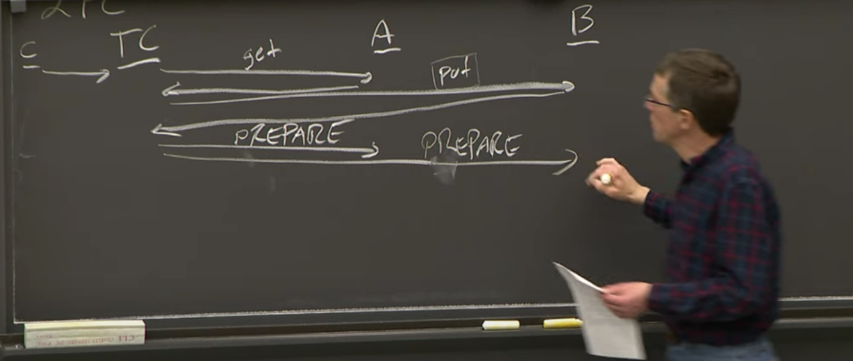

当 A 或者 B 收到了 Prepare 消息，它们就知道事务要执行但是还没执行的内容，它们会查看自身的状态并决定它们实际上能不能完成事务。或许它们需要 Abort 这个事务因为这个事务会引起死锁，或许它们在故障重启过程中并完全忘记了这个事务因此不能完成事务。所以，A 和 B 会检查自己的状态并说，我有能力或者我没能力完成这个事务，它们会向 TC 回复 Yes 或者 No。

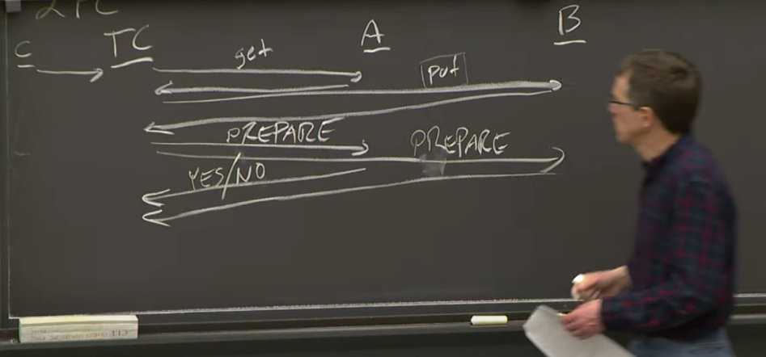

事务协调者会等待来自于每一个参与者的这些 Yes/No 投票。如果所有的参与者都回复 Yes，那么事务可以提交，不会发生错误。之后事务协调者会发出一个 Commit 消息，给每一个事务的参与者，

之后，事务参与者通常会回复 ACK 说，我们知道了要 commit。

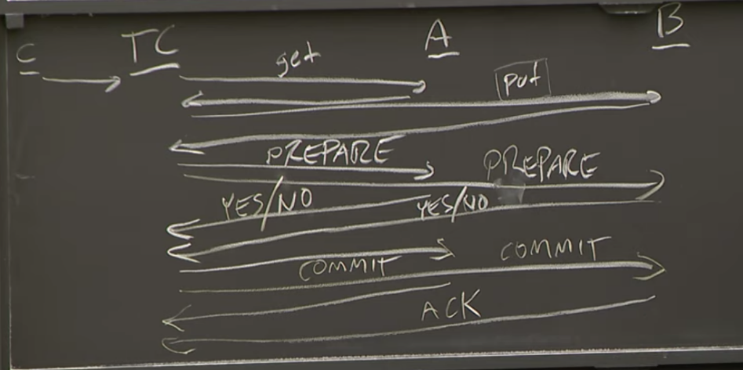

当事务协调者发出 Prepare 消息时，如果所有的参与者都回复 Yes，那么事务可以 commit。如果任何一个参与者回复了 No，表明自己不能完成这个事务，或许是因为错误，或许有不一致性，或许丢失了记录，那么事务协调者不会发送 commit 消息，它会发送一轮 Abort 消息给所有的参与者说，请撤回这个事务。

在事务 Commit 之后，会发生两件事情。首先，事务协调者会向客户端发送代表了事务输出的内容，表明事务结束了，事务没有被 Abort 并且被持久化保存起来了。另一个有意思的事情是，为了遵守前面的锁规则（两阶段锁），事务参与者会释放锁（这里不论 Commit 还是 Abort 都会释放锁）。

实际上，为了遵循两阶段锁规则，每个事务参与者在参与事务时，会对任何涉及到的数据加锁。所以我们可以想象，在每个参与者中都会有个表单，表单会记录数据当前是为哪个事务加的锁。当收到 Commit 或者 Abort 消息时，事务参与者会对数据解锁，之后其他的事务才可以使用相应的数据。这里的解锁操作会解除对于其他事务的阻塞。这实际上是可序列化机制的一部分。

目前来说，还没有问题，因为架构中的每一个成员都遵循了协议，没有错误，两个参与者只会一起 Commit，如果其中一个需要 Abort，那么它们两个都会 Abort。所以，基于刚刚描述的协议，如果没有错误的话，我们得到了这种 All-or-Noting 的原子特性。

---

# 故障恢复（Crash Recovery）

现在，我们需要在脑中设想各种可能发生的错误，并确认这里的两阶段提交协议是否仍然可以提供 All-or-Noting 的原子特性。如果不能的话，我们该如何调整或者扩展协议？

第一个我想考虑的错误是故障重启。我的意思是类似于断电，服务器会突然中断执行，当电力恢复之后，作为事务处理系统的一部分，服务器会运行一些恢复软件。这里实际上有两个场景需要考虑。

第一个场景是，参与者 B 可能在回复事务协调者的 Prepare 消息之前的崩溃了，

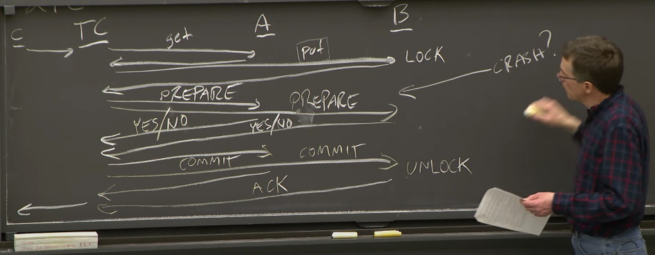

所以，B 在回复 Yes 之前就崩溃了。从 TC 的角度来看，B 没有回复 Yes，TC 也就不能 Commit，因为它需要等待所有的参与者回复 Yes。

如果 B 发现自己不可能发送 Yes，比如说在发送 Yes 之前自己就故障了，那么 B 被授权可以单方面的 Abort 事务。因为 B 知道自己没有发送 Yes，那么它也知道事务协调者不可能 Commit 事务。这里有很多种方法可以实现，其中一种方法是，因为 B 故障重启了，内存中的数据都会清除，所以 B 中所有有关事务的信息都不能活过故障，所以，故障之后 B 不知道任何有关事务的信息，也不知道给谁回复过 Yes。之后，如果事务协调者发送了一个 Prepare 消息过来，因为 B 不知道事务，B 会回复 No，并要求 Abort 事务。

当然，B 也可能在回复了 Yes 给事务协调者的 Prepare 消息之后崩溃的。B 可能开心的回复给事务协调者说好的，我将会 commit。但是在 B 收到来自事务协调者的 commit 消息之前崩溃了。

现在我们有了一个完全不同的场景。现在 B 承诺可以 commit，因为它回复了 Yes。接下来极有可能发生的事情是，事务协调者从所有的参与者获得了 Yes 的回复，并将 Commit 消息发送给了 A，所以 A 实际上会执行事务分包给它的那一部分，持久化存储结果，并释放锁。这样的话，为了确保 All-or-Nothing 原子性，我们需要确保 B 在故障恢复之后，仍然能完成事务分包给它的那一部分。在 B 故障的时候，不知道事务是否能 Commit，因为它还没有收到 Commit 消息。但是 B 还是需要做好 Commit 的准备。这意味着，在故障重启的时候，B 不能丢失对于事务的状态记录。

在 B 回复 Prepare 之前，它必须确保记住当前事务的中间状态，记住所有要做的修改，记住事务持有的所有的锁，这些信息必须在磁盘上持久化存储。通常来说，这些信息以 Log 的形式在磁盘上存储。所以在 B 回复 Yes 给 Prepare 消息之前，它首先要将相应的 Log 写入磁盘，并在 Log 中记录所有有关提交事务必须的信息。这包括了所有由 Put 创建的新的数值，和锁的完整列表。之后，B 才会回复 Yes。

之后，如果 B 在发送完 Yes 之后崩溃了，当它重启恢复时，通过查看自己的 Log，它可以发现自己正在一个事务的中间，并且对一个事务的 Prepare 消息回复了 Yes。Log 里有 Commit 需要做的所有的修改，和事务持有的所有的锁。之后，当 B 最终收到了 Commit 而不是 Abort，通过读取 Log，B 就知道如何完成它在事务中的那部分工作。

所以，这里是我之前在介绍协议的时候遗漏的一点。B 在这个时间点（回复 Yes 给 TC 的 Prepare 消息之前），必须将 Log 写入到自己的磁盘中。这里会使得两阶段提交稍微有点慢，因为这里要持久化存储数据。

最后一个可能崩溃的地方是，B 可能在收到 Commit 之后崩溃了。

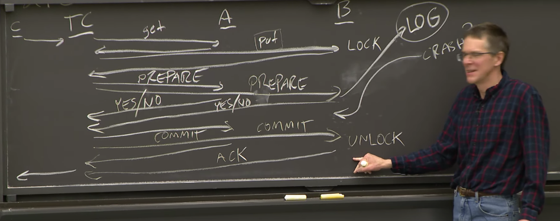

B 有可能在处理完 Commit 之后就崩溃了。但是这样的话，B 就完成了修改，并将数据持久化存储在磁盘上了。这样的话，故障重启就不需要做任何事情，因为事务已经完成了。

因为没有收到 ACK，事务协调者会再次发送 Commit 消息。当 B 重启之后，收到了 Commit 消息时，它可能已经将 Log 中的修改写入到自己的持久化存储中、释放了锁、并删除了有关事务的 Log。所以我们需要关心，如果 B 收到了同一个 Commit 消息两次，该怎么办？这里 B 可以记住事务的信息，但是这会消耗内存，所以实际上 B 会完全忘记已经在磁盘上持久化存储的事务的信息。对于一个它不知道事务的 Commit 消息，B 会简单的 ACK 这条消息。这一点在后面的一些介绍中非常重要。

上面是事务的参与者在各种奇怪的时间点崩溃的场景。那对于事务协调者呢？它只是一个计算机，如果它出现故障，也会是个问题。

同样的，这里的关键点在于，如果事务的任何一个参与者可能已经提交了，或者事务协调者可能已经回复给客户端了，那么我们不能忽略事务。比如，如果事务协调者已经向 A 发送了 Commit 消息，但是还没来得及向 B 发送 Commit 消息就崩溃了，那么事务协调者必须在重启的时候准备好向 B 重发 Commit 消息，以确保两个参与者都知道事务已经提交了。所以，事务协调者在哪个时间点崩溃了非常重要。

如果事务协调者在发送 Commit 消息之前就崩溃了，那就无所谓了，因为没有一个参与者会 Commit 事务。也就是说，如果事务协调者在崩溃前没有发送 Commit 消息，它可以直接 Abort 事务。因为参与者可以在自己的 Log 中看到事务，但是又从来没有收到 Commit 消息，事务的参与者会向事务协调者查询事务，事务协调者会发现自己不认识这个事务，它必然是之前崩溃的时候 Abort 的事务。所以这就是事务协调者在 Commit 之前就崩溃了的场景。

如果事务协调者在发送完一个或者多个 Commit 消息之后崩溃，

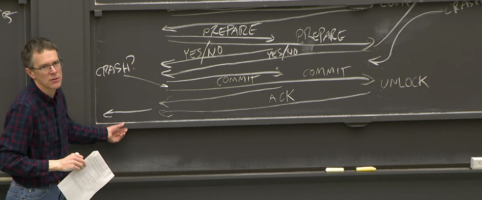

那么就不允许它忘记相关的事务。这意味着，在崩溃的时间点，也就是事务协调者决定要 Commit 而不是 Abort 事务，并且在发送任何 Commit 消息之前，它必须先将事务的信息写入到自己的 Log，并存放在例如磁盘的持久化存储中，这样计算故障重启了，信息还会存在。

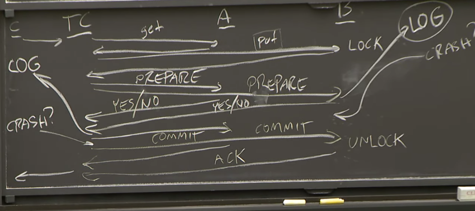

所以，事务协调者在收到所有对于 Prepare 消息的 Yes/No 投票后，会将结果和事务 ID 写入存在磁盘中的 Log，之后才会开始发送 Commit 消息。之后，可能在发送完第一个 Commit 消息就崩溃了，也可能发送了所有的 Commit 消息才崩溃，不管在哪，当事务协调者故障重启时，恢复软件查看 Log 可以发现哪些事务执行了一半，哪些事务已经 Commit 了，哪些事务已经 Abort 了。作为恢复流程的一部分，对于执行了一半的事务，事务协调者会向所有的参与者重发 Commit 消息或者 Abort 消息，以防在崩溃前没有向参与者发送这些消息。这就是为什么参与者需要准备好接收重复的 Commit 消息的一个原因。

这些就是主要的服务器崩溃场景。我们还需要担心如果消息在网络传输的时候丢失了怎么办？或许你发送了一个消息，但是消息永远也没有送达。或许你发送了一个消息，并且在等待回复，或许回复发出来了，但是之后被丢包了。这里的任何一个消息都有可能丢包，我们必须想清楚在这样的场景下该怎么办？

举个例子，事务协调者发送了 Prepare 消息，但是并没有收到所有的 Yes/No 消息，事务协调者这时该怎么做呢？

其中一个选择是，事务协调者重新发送一轮 Prepare 消息，表明自己没有收到全部的 Yes/No 回复。事务协调者可以持续不断的重发 Prepare 消息。但是如果其中一个参与者要关机很长时间，我们将会在持有锁的状态下一直等待。假设 A 不响应了，但是 B 还在运行，因为我们还没有 Commit 或者 Abort，B 仍然为事务持有了锁，这会导致其他的事务等待。所以，如果可以避免的话，我们不想永远等待。

在事务协调者没有收到 Yes/No 回复一段时间之后，它可以单方面的 Abort 事务。因为它知道它没有得到完整的 Yes/No 消息，当然它也不可能发送 Commit 消息，所以没有一个参与者会 Commit 事务，所以总是可以 Abort 事务。事务的协调者在等待完整的 Yes/No 消息时，如果因为消息丢包或者某个参与者崩溃了，而超时了，它可以直接决定 Abort 这个事务，并发送一轮 Abort 消息。

之后，如果一个崩溃了的参与者重启了，向事务协调者发消息说，我并没有收到来自你的有关事务 95 的消息，事务协调者会发现自己并不知道到事务 95 的存在，因为它在之前就 Abort 了这个事务并删除了有关这个事务的记录。这时，事务协调者会告诉参与者说，你也应该 Abort 这个事务。

类似的，如果参与者等待 Prepare 消息超时了，那意味着它必然还没有回复 Yes 消息，进而意味着事务协调者必然还没有发送 Commit 消息。所以如果一个参与者在这个位置因为等待 Prepare 消息而超时，

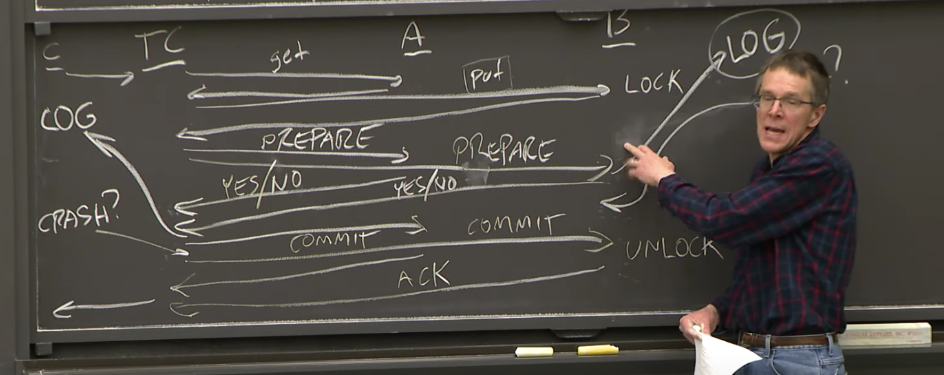

那么它也可以决定 Abort 事务。在之后的时间里，如果事务协调者上线了，再次发送 Prepare 消息，B 会说我不知道有关事务的任何事情并回复 No。这也没问题，因为这个事务在这个时间也不可能在任何地方 Commit 了。所以，如果网络某个地方出现了问题，或者事务协调器挂了一会，事务参与者仍然在等待 Prepare 消息，总是可以允许事务参与者 Abort 事务，并释放锁，这样其他事务才可以继续。这在一个负载高的系统中可能会非常重要。

但是，假设 B 收到了 Prepare 消息，并回复了 Yes。大概在下图的位置中，

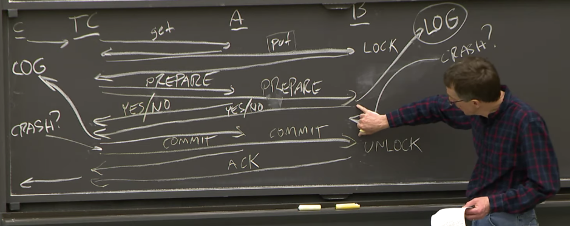

这个时候参与者没有收到 Commit 消息，它接下来怎么也等不到 Commit 消息。或许网络出现问题了，或许事务协调器的网络连接中断了，或者事务协调器断电了，不管什么原因，B 等了很长时间都没有收到 Commit 消息。这段时间里，B 一直持有事务涉及到数据的锁，这意味着，其他事务可能也在等待这些锁的释放。所以，这里我们应该尽早的 Abort 事务，并释放锁。所以这里的问题是，如果 B 收到了 Prepare 消息，并回复了 Yes，在等待了 10 秒钟或者 10 分钟之后还没有收到 Commit 消息，它能单方面的决定 Abort 事务吗？

很不幸的是，这里的答案不行。

在回复 Yes 给 Prepare 消息之后，并在收到 Commit 消息之前这个时间区间内，参与者会等待 Commit 消息。如果等待 Commit 消息超时了，参与者不允许 Abort 事务，它必须无限的等待 Commit 消息，这里通常称为 Block。

这里的原因是，因为 B 对 Prepare 消息回复了 Yes，这意味着事务协调者可能收到了来自于所有参与者的 Yes，并且可能已经向部分参与者发送 Commit 消息。这意味着 A 可能已经看到了 Commit 消息，Commit 事务，持久化存储事务的结果并释放锁。所以在上面的区间里，B 不能单方面的决定 Abort 事务，它必须无限等待事务协调者的 Commit 消息。如果事务协调者故障了，最终会有人来修复它，它在恢复过程中会读取 Log，并重发 Commit 消息。

就像不能单方面的决定 Abort 事务一样，这里 B 也不能单方面的决定 Commit 事务。因为 A 可能对 Prepare 消息回复了 No，但是 B 没有收到相应的 Abort 消息。所以，在上面的区间中，B 既不能 Commit，也不能 Abort 事务。

这里的 Block 行为是两阶段提交里非常重要的一个特性，并且它不是一个好的属性。因为它意味着，在特定的故障中，你会很容易的陷入到一个需要等待很长时间的场景中，在等待过程中，你会一直持有锁，并阻塞其他的事务。所以，人们总是尝试在两阶段提交中，将这个区间尽可能快的完成，这样可能造成 Block 的时间窗口也会尽可能的小。所以人们尽量会确保协议中这部分尽可能轻量化，甚至对于一些变种的协议，对于一些特定的场景都不用等待。

这就是基本的协议。为什么这里的两阶段提交协议能构建一个 A 和 B 要么全 Commit，要么全 Abort 的系统？其中一个原因是，决策是在一个单一的实例，也就是事务协调者完成的。A 或者 B 不能决定 Commit 还是不 Commit 事务，A 和 B 之间不会交互来达成一致并完成事务的 Commit，相反的只有事务协调者可以做决定。事务协调者是一个单一的实例，它会通知其他的部分这是我的决定，请执行它。但是，使用一个单一实例的事务协调者的缺点是，在某个时间点你需要 Block 并等待事务协调者告诉你决策是什么。

一个进一步的问题是，我们知道事务协调者必然在它的 Log 中记住了事务的信息，那么它在什么时候可以删除 Log 中有关事务的信息？这里的答案是，如果事务协调者成功的得到了所有参与者的 ACK，

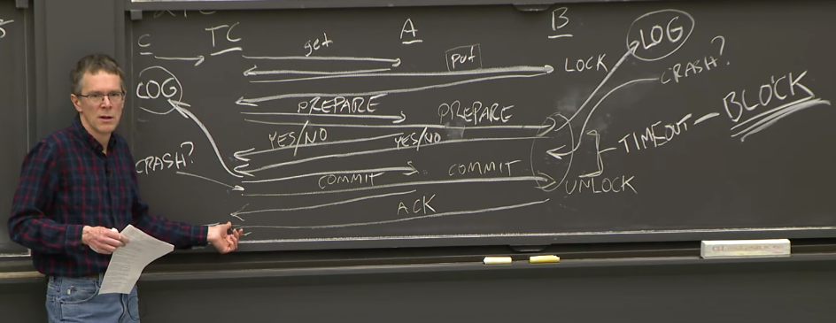

那么它就知道所有的参与者知道了事务已经 Commit 或者 Abort，所有参与者必然也完成了它们在事务中相应的工作，并且永远也不会需要知道事务相关的信息。所以当事务协调者得到了所有的 ACK，它可以擦除所有有关事务的记忆。

类似的，当一个参与者收到了 Commit 或者 Abort 消息，完成了它们在事务中的相应工作，持久化存储事务结果并释放锁，那么在它发送完 ACK 之后，参与者也可以完全忘记相关的事务。

当然事务协调者或许不能收到 ACK，这时它会假设丢包了并重发 Commit 消息。这时，如果一个参与者收到了一个 Commit 消息，但是它并不知道对应的事务，因为它在之前回复 ACK 之后就忘记了这个事务，那么参与者会再次回复一个 ACK。因为如果参与者收到了一个自己不知道的事务的 Commit 消息，那么必然是因为它之前已经完成对这个事务的 Commit 或者 Abort，然后选择忘记这个事务了。

---

# 总结

这就是两阶段提交，它实现了原子提交。两阶段提交在大量的将数据分割在多个服务器上的分片数据库或者存储系统中都有使用。两阶段提交可以支持读写多条记录，一些更特殊的存储系统不允许你在多条记录上支持事务。对于这些不支持事务中包含多条数据的系统，你就不需要两阶段提交。但是如果你需要在事务中支持多条数据，并且你将数据分片在多台服务器之上，那么你必须支持两阶段提交。

然而，两阶段提交有着极差的名声。其中一个原因是，因为有多轮消息的存在，它非常的慢。在上面的图中，各个组成部分之间着大量的交互。另一个原因是，这里有大量的写磁盘操作，比如说 B 在回复 Yes 给 Prepare 消息之后不仅要向磁盘写入数据，还需要等待磁盘写入结束，如果你使用一个机械硬盘，这会花费 10 毫秒来完成 Log 数据的写入，这决定了事务的参与者能够以多快的速度处理事务。10 毫秒完成 Log 写磁盘，那么最快就是每秒处理 100 个事务，这是一个非常慢的结果。同时，事务协调者也需要写磁盘，在收到所有 Prepare 消息的 Yes 回复之后，它也需要将 Log 写入磁盘，并等待磁盘写入结束。之后它才能发送 Commit 消息，这里又有了 10 毫秒。在这两个 10 毫秒内，锁都被参与者持有者，其他使用相关数据的事务都会被阻塞。

这里我持续的在介绍性能，但是它的确非常重要，因为在一个繁忙的事务处理系统中，存在大量的事务，许多事务都会等待相同的数据，我们希望不要在一个长时间内持有锁。但是两阶段提交迫使我们在各个阶段都做等待。

进一步的问题是，如果任何地方出错了，消息丢了，某台机器崩溃了，如果你不够幸运进入到 Block 区间，参与者需要在持有锁的状态下等待一段长时间。

因此，你只会在一个小的环境中看到两阶段提交，比如说在一个组织的一个机房里面。你不会在不同的银行之间转账看到它，你或许可以在银行内部的系统中看见两阶段提交，但是你永远也不会在物理分隔的不同组织之间看见两阶段提交，因为它可能会陷入到 Block 区间中。你不会想将你的数据库的命运寄托在其他的数据库不在错误的时间崩溃，从而使得你的数据库被迫在很长一段时间持有锁。

因为两阶段提交很慢，有很多很多的研究都是关于如何让它变得更快，比如以各种方式放松这里的规则进而使得它变得更快，又比如对于一些特定的场景做一些定制化从而避免一些消息，我们在这门课中会看到很多这种定制。

两阶段提交的架构中，本质上是有一个 Leader（事务协调者），将消息发送给 Follower（事务参与者），Leader 只能在收到了足够多 Follower 的回复之后才能继续执行。这与 Raft 非常像，但是，这里协议的属性与 Raft 又非常的不一样。这两个协议解决的是完全不同的问题。

使用 Raft 可以通过将数据复制到多个参与者得到高可用。Raft 的意义在于，即使部分参与的服务器故障了或者不可达，系统仍然能工作。Raft 能做到这一点是因为所有的服务器都在**做相同的事情**，所以我们不需要所有的服务器都参与，我们只需要过半服务器参与。然而两阶段提交，参与者完全没有在做相同的事情，每个参与者都在做事务中的不同部分，比如 A 可能在对 X 加 1，B 可能在对 Y 减 1。所以在两阶段提交中，所有的参与者都在做不同的事情。所有的参与者都必须完成自己那部分工作，这样事务才能结束，所以这里需要等待所有的参与者。

所以，Raft 通过复制可以不用每一个参与者都在线，而两阶段提交每个参与者都做了不同的工作，并且每个参与者的工作都必须完成，所以两阶段提交对于可用性没有任何帮助。Raft 完全就是可用性，而两阶段提交完全不是高可用的，系统中的任何一个部分出错了，系统都有可能等待直到这个部分修复。比如事务协调者在错误的时间崩溃了，我们需要等待它上线并读取它的 Log 再重发 Commit 消息。如果一个参与者在错误的时间崩溃了，如果我们足够幸运，我们只需要 Abort 事务。所以实际上，两阶段提交的可用性非常低，因为任何一个部分崩溃都有可能阻止整个系统的运行。Raft 并不需要确保所有的参与者执行操作，它只需要过半服务器执行操作，或许少数的服务器完全没有执行操作也没关系。这里的原因是Raft系统中，所有的参与者都在做相同的事情，我们不必等待所有的参与者。这就是为什么 Raft 有更高的可用性。所以这是两个完全不同的协议。

然而，是有可能结合这两种协议的。两阶段提交对于故障来说是非常脆弱的，在故障时它可以有正确的结果，但是不具备可用性。所以，这里的问题是，是否可以构建一个合并的系统，同时具备 Raft 的高可用性，但同时又有两阶段提交的能力将事务分包给不同的参与者。这里的结构实际上是，通过 Raft 或者 Paxos 或者其他协议，来复制两阶段提交协议里的每一个组成部分。

所以，在前面的例子中，我们会有三个不同的集群，事务协调器会是一个复制的服务，包含了三个服务器，我们在这 3 个服务器上运行 Raft，其中一个服务器会被选为 Leader，它们会有复制的状态，它们有 Log 来帮助它们复制，我们只需要等待过半服务器响应就可以执行事务协调器的指令。事务协调器还是会执行两阶段提交里面的各个步骤，并将这些步骤记录在自己的 Raft 集群的 Log 中。

每个事务参与者也同样是一个 Raft 集群。最终，消息会在这些集群之间传递。

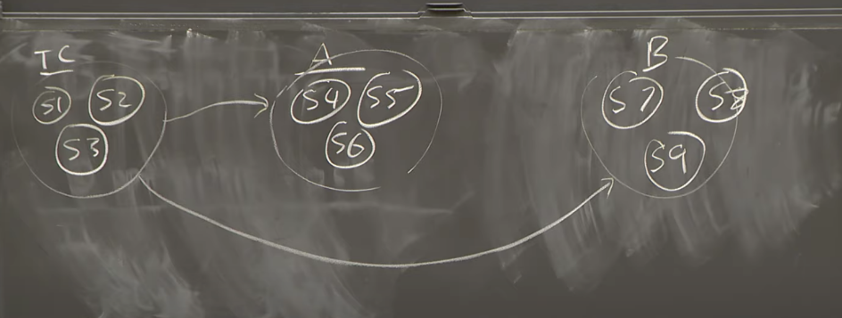

不得不承认，这里很复杂，但是它展示了你可以结合两种思想来同时获得高可用和原子提交。在 Lab4，我们会构建一个类似的系统，实际上就是个分片的数据库，每个分片以这种形式进行复制，同时还有一个配置管理器，来允许将分片的数据从一个 Raft 集群移到另一个 Raft 集群。除此之外，我们还会读一篇论文叫做 Spanner，它描述了 Google 使用的一种数据库，Spanner 也使用了这里的结构来实现事务写。

​	

