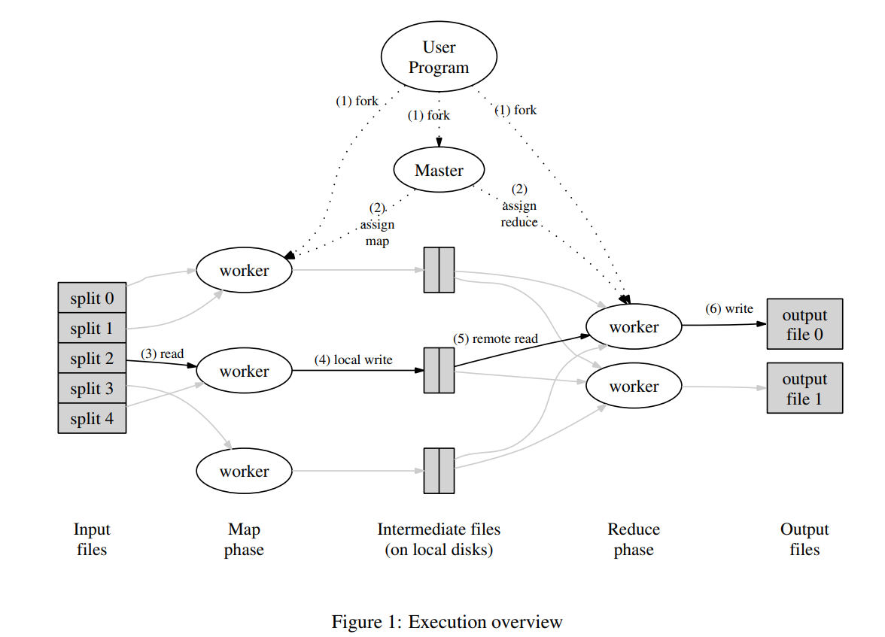
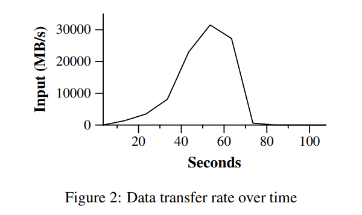
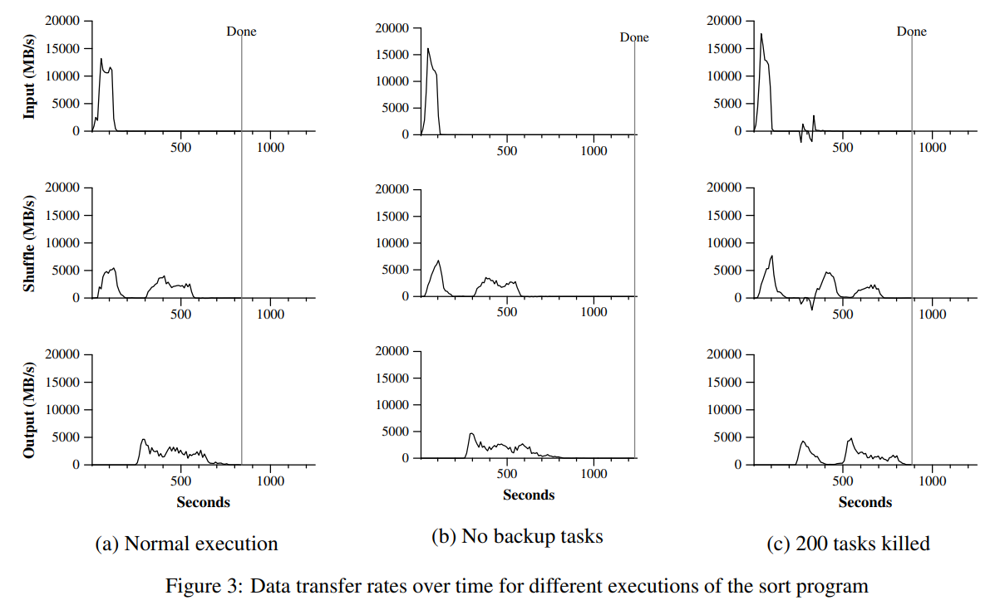
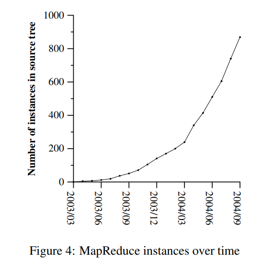
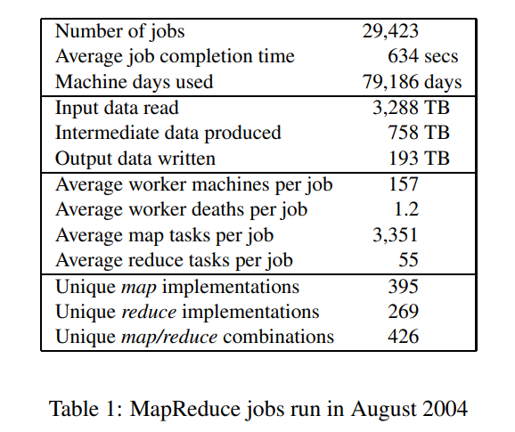

MapReduce 论文导读：[MapReduce: Simplified Data Processing on Large Clusters](https://pdos.csail.mit.edu/6.824/papers/mapreduce.pdf)

---

摘要

>MapReduce is a programming model and an associated implementation for processing and generating large data sets. Users specify a map function that processes a key/value pair to generate a set of intermediate key/value pairs, and a reduce function that merges all intermediate values associated with the same intermediate key. Many real world tasks are expressible in this model, as shown in the paper.

MapReduce 是一个编程模型，也是一个处理和生成超大数据集的算法模型的相关实现。用户首先创建一个 Map 函数处理一个基于 key/value pair 的数据集合，输出中间的基于 key/value pair 的数据集合；然后再创建一个 Reduce 函数用来合并所有的具有相同中间 key 值的中间 value 值。现实世界中有很多满足上述处理模型的例子，本论文将详细描述这个模型。

>Programs written in this functional style are automatically parallelized and executed on a large cluster of commodity machines. The run-time system takes care of the details of partitioning the input data, scheduling the program’s execution across a set of machines, handling machine failures, and managing the required inter-machine communication. This allows programmers without any experience with parallel and distributed systems to easily utilize the resources of a large distributed system.  

MapReduce 架构的程序能够在大量的普通配置的计算机上实现并行化处理。这个系统在运行时只关心：如何分割输入数据，在大量计算机组成的集群上的调度，集群中计算机的错误处理，管理集群中计算机之间必要的通信。采用 MapReduce 架构可以使那些没有并行计算和分布式处理系统开发经验的程序员有效利用分布式系统的丰富资源。

>Our implementation of MapReduce runs on a large cluster of commodity machines and is highly scalable: a typical MapReduce computation processes many terabytes of data on thousands of machines. Programmers find the system easy to use: hundreds of MapReduce programs have been implemented and upwards of one thousand MapReduce jobs are executed on Google’s clusters every day.  

我们的 MapReduce 实现运行在规模可以灵活调整的由普通机器组成的集群上：一个典型的 MapReduce 计算往往由几千台机器组成、处理以 TB 计算的数据。程序员发现这个系统非常好用：已经实现了数以百计的 MapReduce 程序，在 Google 的集群上，每天都有 1000 多个 MapReduce 程序在执行。


---

# 简介

>Over the past five years, the authors and many others at Google have implemented hundreds of special-purpose computations that process large amounts of raw data, such as crawled documents, web request logs, etc., to compute various kinds of derived data, such as inverted indices, various representations of the graph structure of web documents, summaries of the number of pages crawled per host, the set of most frequent queries in a given day, etc. Most such computations are conceptually straightforward. However, the input data is usually large and the computations have to be distributed across hundreds or thousands of machines in order to finish in a reasonable amount of time. The issues of how to parallelize the computation, distribute the data, and handle failures conspire to obscure the original simple computation with large amounts of complex code to deal with these issues.

在过去的 5 年里，包括本文作者在内的 Google 的很多程序员，为了处理海量的原始数据，已经实现了数以百计的、专用的计算方法。这些计算方法用来处理大量的原始数据，比如，文档抓取（类似网络爬虫的程序）、Web 请求日志等等；也为了计算处理各种类型的衍生数据，比如倒排索引、Web 文档的图结构的各种表示形势、每台主机上网络爬虫抓取的页面数量的汇总、每天被请求的最多的查询的集合等等。大多数这样的数据处理运算在概念上很容易理解。然而由于输入的数据量巨大，因此要想在可接受的时间内完成运算，只有将这些计算分布在成百上千的主机上。如何处理并行计算、如何分发数据、如何处理错误？所有这些问题综合在一起，需要大量的代码处理，因此也使得原本简单的运算变得难以处理。

>As a reaction to this complexity, we designed a new abstraction that allows us to express the simple computations we were trying to perform but hides the messy details of parallelization, fault-tolerance, data distribution and load balancing in a library. Our abstraction is inspired by the map and reduce primitives present in Lisp and many other functional languages. We realized that most of our computations involved applying a map operation to each logical “record” in our input in order to compute a set of intermediate key/value pairs, and then applying a reduce operation to all the values that shared the same key, in order to combine the derived data appropriately. Our use of a functional model with userspecified map and reduce operations allows us to parallelize large computations easily and to use re-execution as the primary mechanism for fault tolerance.

为了解决上述复杂的问题，我们设计一个新的抽象模型，使用这个抽象模型，我们只要表述我们想要执行的简单运算即可，而不必关心并行计算、容错、数据分布、负载均衡等复杂的细节，这些问题都被封装在了一个库里面。设计这个抽象模型的灵感来自 Lisp 和许多其他函数式语言的 Map 和 Reduce 的原语。我们意识到我们大多数的运算都包含这样的操作：在输入数据的"逻辑"记录上应用 Map 操作得出一个中间 key/value pair 集合，然后在所有具有相同 key 值的 value 值上应用 Reduce 操作，从而达到合并中间的数据，得到一个想要的结果的目的。使用 MapReduce 模型，再结合用户实现的 Map 和 Reduce 函数，我们就可以非常容易的实现大规模并行化计算；通过 MapReduce 模型自带的"再次执行"（re-execution）功能，也提供了初级的容灾实现方案。

>The major contributions of this work are a simple and powerful interface that enables automatic parallelization and distribution of large-scale computations, combined with an implementation of this interface that achieves high performance on large clusters of commodity PCs.

这个工作（实现一个 MapReduce 框架模型）的主要贡献是通过简单的接口来实现自动的并行化和大规模的分布式计算，通过使用 MapReduce 模型接口实现在大量普通的 PC 机上高性能计算。

>Section 2 describes the basic programming model and gives several examples. Section 3 describes an implementation of the MapReduce interface tailored towards our cluster-based computing environment. Section 4 describes several refinements of the programming model that we have found useful. Section 5 has performance measurements of our implementation for a variety of tasks. Section 6 explores the use of MapReduce within Google including our experiences in using it as the basis for a rewrite of our production indexing system. Section 7 discusses related and future work.

第二部分描述基本的编程模型和一些使用案例。第三部分描述了一个经过裁剪的、适合我们的基于集群的计算环境的 MapReduce 实现。第四部分描述我们认为在 MapReduce 编程模型中一些实用的技巧。第五部分对于各种不同的任务，测量我们 MapReduce 实现的性能。第六部分揭示了在 Google 内部如何使用 MapReduce 作为基础重写我们的索引系统产品，包括其它一些使用 MapReduce 的经验。第七部分讨论相关的和未来的工作。


---

# 编程模型

>The computation takes a set of input key/value pairs, and produces a set of output key/value pairs. The user of the MapReduce library expresses the computation as two functions: Map and Reduce.

MapReduce 编程模型的原理是：利用一个输入key/value pair 集合来产生一个输出的 key/value pair 集合。MapReduce  库的用户用两个函数表达这个计算：Map和 Reduce。

>Map, written by the user, takes an input pair and produces a set of intermediate key/value pairs. The MapReduce library groups together all intermediate values associated with the same intermediate key I and passes them to the Reduce function.

用户自定义的 Map 函数接受一个输入的key/value pair 值，然后产生一个中间 key/value pair 值的集合。MapReduce 库把所有具有相同中间 key 值 I 的中间 value 值集合在一起后传递给 reduce 函数。

>The Reduce function, also written by the user, accepts an intermediate key I and a set of values for that key. It merges together these values to form a possibly smaller set of values. Typically just zero or one output value is produced per Reduce invocation. The intermediate values are supplied to the user’s reduce function via an iterator. This allows us to handle lists of values that are too large to fit in memory

用户自定义的 Reduce 函数接受一个中间 key 的值 I 和相关的一个 value 值的集合。Reduce 函数合并这些 value 值，形成一个较小的 value 值的集合。一般的，每次 Reduce 函数调用只产生 0 或 1 个输出 value 值。通常我们通过一个迭代器把中间 value 值提供给 Reduce 函数，这样我们就可以处理无法全部放入内存中的大量的 value 值的集合。


## 例子

>Consider the problem of counting the number of occurrences of each word in a large collection of documents. The user would write code similar to the following pseudo-code:

例如，计算一个大的文档集合中每个单词出现的次数，下面是伪代码段：

```go
map(String key, String value):
    // key: document name
    // value: document contents
    for each word w in value:
        EmitIntermediate(w, “1″);

reduce(String key, Iterator values):
    // key: a word
    // values: a list of counts
    int result = 0;
    for each v in values:
        result += ParseInt(v);
    Emit(AsString(result));
```

>The map function emits each word plus an associated count of occurrences (just ‘1’ in this simple example). The reduce function sums together all counts emitted for a particular word

Map 函数输出文档中的每个词、以及这个词的出现次数（在这个简单的例子里就是 1）。Reduce 函数把 Map 函数产生的每一个特定的词的计数累加起来。

>In addition, the user writes code to fill in a mapreduce specification object with the names of the input and output files, and optional tuning parameters. The user then invokes the MapReduce function, passing it the specification object. The user’s code is linked together with the MapReduce library (implemented in C++). Appendix A contains the full program text for this example.

另外，用户编写代码，使用输入和输出文件的名字、可选的调节参数来完成一个符合 MapReduce 模型规范的对象，然后调用 MapReduce 函数，并把这个规范对象传递给它。用户的代码和 MapReduce 库链接在一起（用 C++ 实现）。附录 A 包含了这个实例的全部程序代码。


## 类型

>Even though the previous pseudo-code is written in terms of string inputs and outputs, conceptually the map and reduce functions supplied by the user have associated types:

尽管在前面例子的伪代码中使用了以字符串表示的输入输出值，但是在概念上，用户定义的 Map 和 Reduce 函数都有相关联的类型：

```c
map (k1,v1) → list(k2,v2)
reduce (k2,list(v2)) → list(v2)
```

>I.e., the input keys and values are drawn from a different domain than the output keys and values. Furthermore, the intermediate keys and values are from the same domain as the output keys and values.

比如，输入的 key 和 value 值与输出的 key 和 value 值在类型上推导的域不同。此外，中间 key 和 value 值与输出 key 和 value 值在类型上推导的域相同。

>Our C++ implementation passes strings to and from the user-defined functions and leaves it to the user code to convert between strings and appropriate types.

我们的 C++ 中使用字符串类型作为用户自定义函数的输入输出，用户在自己的代码中对字符串进行适当的类型转换。


## 更多示例

>Here are a few simple examples of interesting programs that can be easily expressed as MapReduce computations.
>
>Distributed Grep: The map function emits a line if it matches a supplied pattern. The reduce function is an identity function that just copies the supplied intermediate data to the output.
>
>Count of URL Access Frequency: The map function processes logs of web page requests and outputs hURL, 1i. The reduce function adds together all values for the same URL and emits a hURL, total counti pair.
>
>Reverse Web-Link Graph: The map function outputs htarget, sourcei pairs for each link to a target URL found in a page named source. The reduce function concatenates the list of all source URLs associated with a given target URL and emits the pair: htarget, list(source)i 
>
>Term-Vector per Host: A term vector summarizes the most important words that occur in a document or a set of documents as a list of hword, frequencyi pairs. The map function emits a hhostname, term vectori pair for each input document (where the hostname is extracted from the URL of the document). The reduce function is passed all per-document term vectors for a given host. It adds these term vectors together, throwing away infrequent terms, and then emits a final hhostname, term vectori pair.
>
>Inverted Index: The map function parses each document, and emits a sequence of hword, document IDi pairs. The reduce function accepts all pairs for a given word, sorts the corresponding document IDs and emits a hword, list(document ID)i pair. The set of all output pairs forms a simple inverted index. It is easy to augment this computation to keep track of word positions. 
>
>Distributed Sort: The map function extracts the key from each record, and emits a hkey, recordi pair. The reduce function emits all pairs unchanged. This computation depends on the partitioning facilities described in Section 4.1 and the ordering properties described in Section 4.2.
>
>

这里还有一些有趣的简单例子，可以很容易的使用 MapReduce 模型来表示：

-   分布式的 Grep：Map 函数输出匹配某个模式的一行，Reduce 函数是一个恒等函数，即把中间数据复制到输出。
-   计算 URL 访问频率：Map 函数处理日志中 web 页面请求的记录，然后输出（URL，1）。Reduce 函数把相同 URL 的 value 值都累加起来，产生（URL，记录总数）结果。
-   倒转网络链接图：Map 函数在源页面（source）中搜索所有的链接目标（target）并输出为（target，source）。Reduce 函数把给定链接目标（target）的链接组合成一个列表，输出（target，list（source））。
-   每个主机的检索词向量：检索词向量用一个（词，频率）列表来概述出现在文档或文档集中的最重要的一些词。Map 函数为每一个输入文档输出（主机名，检索词向量），其中主机名来自文档的 URL。Reduce 函数接收给定主机的所有文档的检索词向量，并把这些检索词向量加在一起，丢弃掉低频的检索词，输出一个最终的（主机名，检索词向量）。
-   倒排索引：Map 函数分析每个文档输出一个（词，文档号）的列表，Reduce 函数的输入是一个给定词的所有（词，文档号），排序所有的文档号，输出（词，list（文档号））。所有的输出集合形成一个简单的倒排索引，它以一种简单的算法跟踪词在文档中的位置。
-   分布式排序：Map 函数从每个记录提取 key，输出（key，record）。Reduce 函数不改变任何的值。这个运算依赖分区机制（在 4.1 描述）和排序属性（在 4.2 描述）。


---

# 实现

>Many different implementations of the MapReduce interface are possible. The right choice depends on the environment. For example, one implementation may be suitable for a small shared-memory machine, another for a large NUMA multi-processor, and yet another for an even larger collection of networked machines.

MapReduce 模型可以有多种不同的实现方式。如何正确选择取决于具体的环境。例如，一种实现方式适用于小型的共享内存方式的机器，另外一种实现方式则适用于大型 NUMA 架构的多处理器的主机，而有的实现方式更适合大型的网络连接集群。

>This section describes an implementation targeted to the computing environment in wide use at Google:large clusters of commodity PCs connected together with switched Ethernet [4]. In our environment:
>
>(1) Machines are typically dual-processor x86 processors running Linux, with 2-4 GB of memory per machine. 
>
>(2) Commodity networking hardware is used – typically either 100 megabits/second or 1 gigabit/second at the machine level, but averaging considerably less in overall bisection bandwidth. 
>
>(3) A cluster consists of hundreds or thousands of machines, and therefore machine failures are common. 
>
>(4) Storage is provided by inexpensive IDE disks attached directly to individual machines. A distributed file system [8] developed in-house is used to manage the data stored on these disks. The file system uses replication to provide availability and reliability on top of unreliable hardware. 
>
>(5) Users submit jobs to a scheduling system. Each job consists of a set of tasks, and is mapped by the scheduler to a set of available machines within a cluster.

本章节描述一个适用于 Google 内部广泛使用的运算环境的实现：用以太网交换机连接、由普通 PC 机组成的大型集群。在我们的环境里包括：

-   x86 架构、运行 Linux 操作系统、双处理器、2-4 GB 内存的机器。
-   普通的网络硬件设备，每个机器的带宽为百兆或者千兆，但是远小于网络的平均带宽的一半。 
-   集群中包含成百上千的机器，因此，机器故障是常态。
-   存储为廉价的内置 IDE 硬盘。一个内部分布式文件系统用来管理存储在这些磁盘上的数据。文件系统通过数据复制来在不可靠的硬件上保证数据的可靠性和有效性。
-   用户提交工作（job）给调度系统。每个工作（job）都包含一系列的任务（task），调度系统将这些任务调度到集群中多台可用的机器上。


## 概述

>The Map invocations are distributed across multiple machines by automatically partitioning the input data into a set of M splits. The input splits can be processed in parallel by different machines. Reduce invocations are distributed by partitioning the intermediate key space into R pieces using a partitioning function (e.g., hash(key) mod R). The number of partitions (R) and the partitioning function are specified by the user.

通过将 Map 调用的输入数据自动分割为 M 个数据片段的集合，Map 调用被分布到多台机器上执行。输入的数据片段能够在不同的机器上并行处理。使用分区函数将 Map 调用产生的中间 key 值分成 R 个不同分区（例如，hash(key) mod R），Reduce 调用也被分布到多台机器上执行。分区数量（R）和分区函数由用户来指定。



>Figure 1 shows the overall flow of a MapReduce operation in our implementation. When the user program calls the MapReduce function, the following sequence of actions occurs (the numbered labels in Figure 1 correspond to the numbers in the list below):

图 1 展示了我们的 MapReduce 实现中操作的全部流程。当用户调用 MapReduce 函数时，将发生下面的一系列动作（下面的序号和图 1 中的序号一一对应）：

>1.The MapReduce library in the user program first splits the input files into M pieces of typically 16 megabytes to 64 megabytes (MB) per piece (controllable by the user via an optional parameter). It then starts up many copies of the program on a cluster of machines. 
>
>2.One of the copies of the program is special – the master. The rest are workers that are assigned work by the master. There are M map tasks and R reduce tasks to assign. The master picks idle workers and assigns each one a map task or a reduce task. 
>
>3.A worker who is assigned a map task reads the contents of the corresponding input split. It parses key/value pairs out of the input data and passes each pair to the user-defined Map function. The intermediate key/value pairs produced by the Map function are buffered in memory. 
>
>4.Periodically, the buffered pairs are written to local disk, partitioned into R regions by the partitioning function. The locations of these buffered pairs on the local disk are passed back to the master, who is responsible for forwarding these locations to the reduce workers. 
>
>5.When a reduce worker is notified by the master about these locations, it uses remote procedure calls to read the buffered data from the local disks of the map workers. When a reduce worker has read all intermediate data, it sorts it by the intermediate keys so that all occurrences of the same key are grouped together. The sorting is needed because typically many different keys map to the same reduce task. If the amount of intermediate data is too large to fit in memory, an external sort is used. 
>
>6.The reduce worker iterates over the sorted intermediate data and for each unique intermediate key encountered, it passes the key and the corresponding set of intermediate values to the user’s Reduce function. The output of the Reduce function is appended to a final output file for this reduce partition.
>
>7.When all map tasks and reduce tasks have been completed, the master wakes up the user program. At this point, the MapReduce call in the user program returns back to the user code.

1.  用户程序首先调用的 MapReduce 库将输入文件分成 M 个数据片度，每个数据片段的大小一般从 16MB 到 64MB（可以通过可选的参数来控制每个数据片段的大小）。然后用户程序在机群中创建大量的程序副本。 
2.  这些程序副本中的有一个特殊的程序 – master。副本中其它的程序都是 worker 程序，由 master 分配任务。有 M 个 Map 任务和 R 个 Reduce 任务将被分配，master 将一个 Map 任务或 Reduce 任务分配给一个空闲的 worker。
3.  被分配了 map 任务的 worker 程序读取相关的输入数据片段，从输入的数据片段中解析出 key/value pair，然后把 key/value pair 传递给用户自定义的 Map 函数，由 Map 函数生成并输出的中间 key/value pair，并缓存在内存中。
4.  缓存中的 key/value pair 通过分区函数分成 R 个区域，之后周期性的写入到本地磁盘上。缓存的 key/value pair 在本地磁盘上的存储位置将被回传给 master，由 master 负责把这些存储位置再传送给 Reduce worker。
5.  当 Reduce worker 程序接收到 master 程序发来的数据存储位置信息后，使用 RPC 从 Map worker 所在主机的磁盘上读取这些缓存数据。当 Reduce worker 读取了所有的中间数据后，通过对 key 进行排序后使得具有相同 key 值的数据聚合在一起。由于许多不同的 key 值会映射到相同的 Reduce 任务上，因此必须进行排序。如果中间数据太大无法在内存中完成排序，那么就要在外部进行排序。
6.  Reduce worker 程序遍历排序后的中间数据，对于每一个唯一的中间 key 值，Reduce worker 程序将这个 key 值和它相关的中间 value 值的集合传递给用户自定义的 Reduce 函数。Reduce 函数的输出被追加到所属分区的输出文件。
7.  当所有的 Map 和 Reduce 任务都完成之后，master 唤醒用户程序。在这个时候，在用户程序里的对 MapReduce 调用才返回。

>After successful completion, the output of the mapreduce execution is available in the R output files (one per reduce task, with file names as specified by the user). Typically, users do not need to combine these R output files into one file – they often pass these files as input to another MapReduce call, or use them from another distributed application that is able to deal with input that is partitioned into multiple files.

在成功完成任务之后，MapReduce 的输出存放在 R 个输出文件中（对应每个 Reduce 任务产生一个输出文件，文件名由用户指定）。一般情况下，用户不需要将这 R 个输出文件合并成一个文件–他们经常把这些文件作为另外一个 MapReduce 的输入，或者在另外一个可以处理多个分割文件的分布式应用中使用。


## Master 数据结构

>The master keeps several data structures. For each map task and reduce task, it stores the state (idle, in-progress, or completed), and the identity of the worker machine (for non-idle tasks).

Master 持有一些数据结构，它存储每一个 Map 和 Reduce 任务的状态（空闲、工作中或完成)，以及 Worker 机器（非空闲任务的机器）的标识。

>The master is the conduit through which the location of intermediate file regions is propagated from map tasks to reduce tasks. Therefore, for each completed map task, the master stores the locations and sizes of the R intermediate file regions produced by the map task. Updates to this location and size information are received as map tasks are completed. The information is pushed incrementally to workers that have in-progress reduce tasks.

Master 就像一个数据管道，中间文件存储区域的位置信息通过这个管道从 Map 传递到 Reduce。因此，对于每个已经完成的 Map 任务，master 存储了 Map 任务产生的 R 个中间文件存储区域的大小和位置。当 Map 任务完成时，Master 接收到位置和大小的更新信息，这些信息被逐步递增的推送给那些正在工作的 Reduce 任务。


## 容错

>Since the MapReduce library is designed to help process very large amounts of data using hundreds or thousands of machines, the library must tolerate machine failures gracefully.

因为 MapReduce 库的设计初衷是使用由成百上千的机器组成的集群来处理超大规模的数据，所以，这个库必须要能很好的处理机器故障。


### Worker Failure

>The master pings every worker periodically. If no response is received from a worker in a certain amount of time, the master marks the worker as failed. Any map tasks completed by the worker are reset back to their initial idle state, and therefore become eligible for scheduling on other workers. Similarly, any map task or reduce task in progress on a failed worker is also reset to idle and becomes eligible for rescheduling.

master 周期性的 ping 每个 worker。如果在一个约定的时间范围内没有收到 worker 返回的信息，master 将把这个 worker 标记为失效。所有由这个失效的 worker 完成的 Map 任务被重设为初始的空闲状态，之后这些任务就可以被安排给其他的 worker。同样的，worker 失效时正在运行的 Map 或 Reduce 任务也将被重新置为空闲状态，等待重新调度。

>Completed map tasks are re-executed on a failure because their output is stored on the local disk(s) of the failed machine and is therefore inaccessible. Completed reduce tasks do not need to be re-executed since their output is stored in a global file system.

当 worker 故障时，由于已经完成的 Map 任务的输出存储在这台机器上，Map 任务的输出已不可访问了，因此必须重新执行。而已经完成的 Reduce 任务的输出存储在全局文件系统上，因此不需要再次执行。

>When a map task is executed first by worker A and then later executed by worker B (because A failed), all workers executing reduce tasks are notified of the reexecution. Any reduce task that has not already read the data from worker A will read the data from worker B.

当一个 Map 任务首先被 worker A 执行，之后由于 worker A 失效了又被调度到 worker B 执行，这个重新执行的动作会被通知给所有执行 Reduce 任务的 worker。任何还没有从 worker A 读取数据的 Reduce 任务将从 worker B 读取数据。

>MapReduce is resilient to large-scale worker failures. For example, during one MapReduce operation, network maintenance on a running cluster was causing groups of 80 machines at a time to become unreachable for several minutes. The MapReduce master simply re-executed the work done by the unreachable worker machines, and continued to make forward progress, eventually completing the MapReduce operation.

MapReduce 可以处理大规模 worker 失效的情况。比如，在一个 MapReduce 操作执行期间，在正在运行的集群上进行网络维护引起 80 台机器在几分钟内不可访问了，MapReduce master 只需要简单的再次执行那些不可访问的 worker 完成的工作，之后继续执行未完成的任务，直到最终完成这个 MapReduce 操作。


### Master Failure

>It is easy to make the master write periodic checkpoints of the master data structures described above. If the master task dies, a new copy can be started from the last checkpointed state. However, given that there is only a single master, its failure is unlikely; therefore our current implementation aborts the MapReduce computation if the master fails. Clients can check for this condition and retry the MapReduce operation if they desire.

一个简单的解决办法是让 master 周期性的将上面描述的数据结构（3.2节）的写入磁盘，即检查点（checkpoint）。如果这个 master 任务失效了，可以从最后一个检查点（checkpoint）开始启动另一个 master 进程。然而，由于只有一个 master 进程，master 失效后再恢复是比较麻烦的，因此我们现在的实现是如果 master 失效，就中止 MapReduce 运算。客户可以检查到这个状态，并且可以根据需要重新执行 MapReduce 操作。


### Semantics in the Presence of Failures

>When the user-supplied map and reduce operators are deterministic functions of their input values, our distributed implementation produces the same output as would have been produced by a non-faulting sequential execution of the entire program.

当用户提供的 Map 和 Reduce 操作是输入确定性函数（即相同的输入产生相同的输出）时，我们的分布式实现在任何情况下的输出都和所有程序没有出现任何错误、顺序的执行产生的输出是一样的。

>We rely on atomic commits of map and reduce task outputs to achieve this property. Each in-progress task writes its output to private temporary files. A reduce task produces one such file, and a map task produces R such files (one per reduce task). When a map task completes, the worker sends a message to the master and includes the names of the R temporary files in the message. If the master receives a completion message for an already completed map task, it ignores the message. Otherwise, it records the names of R files in a master data structure.

我们依赖对 Map 和 Reduce 任务的输出是原子提交的来完成这个特性。每个工作中的任务把它的输出写到私有的临时文件中。每个 Reduce 任务生成一个这样的文件，而每个 Map 任务则生成 R 个这样的文件（一个 Reduce 任务对应一个文件）。当一个 Map 任务完成的时，worker 发送一个包含 R 个临时文件名的完成消息给 master。如果 master 从一个已经完成的 Map 任务再次接收到到一个完成消息，master 将忽略这个消息；否则，master 将这 R 个文件的名字记录在数据结构里。

>When a reduce task completes, the reduce worker atomically renames its temporary output file to the final output file. If the same reduce task is executed on multiple machines, multiple rename calls will be executed for the same final output file. We rely on the atomic rename operation provided by the underlying file system to guarantee that the final file system state contains just the data produced by one execution of the reduce task.

当 Reduce 任务完成时，Reduce worker 进程以原子的方式把临时文件重命名为最终的输出文件。如果同一个 Reduce 任务在多台机器上执行，针对同一个最终的输出文件将有多个重命名操作执行。我们依赖底层文件系统提供的重命名操作的原子性来保证最终的文件系统状态仅仅包含一个 Reduce 任务产生的数据。

>The vast majority of our map and reduce operators are deterministic, and the fact that our semantics are equivalent to a sequential execution in this case makes it very easy for programmers to reason about their program’s behavior. When the map and/or reduce operators are nondeterministic, we provide weaker but still reasonable semantics. In the presence of non-deterministic operators, the output of a particular reduce task R1 is equivalent to the output for R1 produced by a sequential execution of the non-deterministic program. However, the output for a different reduce task R2 may correspond to the output for R2 produced by a different sequential execution of the non-deterministic program.

使用 MapReduce 模型的程序员可以很容易的理解他们程序的行为，因为我们绝大多数的 Map 和 Reduce 操作是确定性的，而且存在这样的一个事实：我们的失效处理机制等价于一个顺序的执行的操作。当 Map 或/和 Reduce 操作是不确定性的时候，我们提供虽然较弱但是依然合理的处理机制。当使用非确定操作的时候，一个 Reduce 任务 R1 的输出等价于一个非确定性程序顺序执行产生时的输出。但是，另一个 Reduce 任务 R2 的输出也许符合一个不同的非确定顺序程序执行产生的 R2 的输出。

>Consider map task M and reduce tasks R1 and R2. Let e(Ri) be the execution of Ri that committed (there is exactly one such execution). The weaker semantics arise because e(R1) may have read the output produced by one execution of M and e(R2) may have read the output produced by a different execution of M.

考虑 Map 任务 M 和 Reduce 任务 R1、R2 的情况。我们设定 e(Ri) 是 Ri 已经提交的执行过程（有且仅有一个这样的执行过程）。当 e(R1) 读取了由 M 一次执行产生的输出，而 e(R2) 读取了由 M 的另一次执行产生的输出，导致了较弱的失效处理。


## 存储位置

>Network bandwidth is a relatively scarce resource in our computing environment. We conserve network bandwidth by taking advantage of the fact that the input data (managed by GFS [8]) is stored on the local disks of the machines that make up our cluster. GFS divides each file into 64 MB blocks, and stores several copies of each block (typically 3 copies) on different machines. The MapReduce master takes the location information of the input files into account and attempts to schedule a map task on a machine that contains a replica of the corresponding input data. Failing that, it attempts to schedule a map task near a replica of that task’s input data (e.g., on a worker machine that is on the same network switch as the machine containing the data). When running large MapReduce operations on a significant fraction of the workers in a cluster, most input data is read locally and consumes no network bandwidth.

在我们的计算运行环境中，网络带宽是一个相当匮乏的资源。我们通过尽量把输入数据（由 GFS 管理）存储在集群中机器的本地磁盘上来节省网络带宽。GFS 把每个文件按 64MB 一个 Block 分隔，每个 Block 保存在多台机器上，环境中就存放了多份拷贝（一般是 3 个拷贝）。MapReduce 的 master 在调度 Map 任务时会考虑输入文件的位置信息，尽量将一个 Map 任务调度在包含相关输入数据拷贝的机器上执行；如果上述努力失败了，master 将尝试在保存有输入数据拷贝的机器附近的机器上执行 Map 任务（例如，分配到一个和包含输入数据的机器在一个 switch 里的 worker 机器上执行）。当在一个足够大的 cluster 集群上运行大型 MapReduce 操作的时候，大部分的输入数据都能从本地机器读取，因此消耗非常少的网络带宽。


## 任务粒度

>We subdivide the map phase into M pieces and the reduce phase into R pieces, as described above. Ideally, M and R should be much larger than the number of worker machines. Having each worker perform many different tasks improves dynamic load balancing, and also speeds up recovery when a worker fails: the many map tasks it has completed can be spread out across all the other worker machines.

如前所述，我们把 Map 拆分成了 M 个片段、把 Reduce 拆分成 R 个片段执行。理想情况下，M 和 R 应当比集群中 worker 的机器数量要多得多。在每台 worker 机器都执行大量的不同任务能够提高集群的动态的负载均衡能力，并且能够加快故障恢复的速度：失效机器上执行的大量 Map 任务都可以分布到所有其他的 worker 机器上去执行。

>There are practical bounds on how large M and R can be in our implementation, since the master must make O(M + R) scheduling decisions and keeps O(M ∗ R) state in memory as described above. (The constant factors for memory usage are small however: the O(M ∗R) piece of the state consists of approximately one byte of data per map task/reduce task pair.)

但是实际上，在我们的具体实现中对 M 和 R 的取值都有一定的客观限制，因为 master 必须执行 `O(M+R)` 次调度，并且在内存中保存 `O(M*R)` 个状态（对影响内存使用的因素还是比较小的：`O(M*R)` 块状态，大概每对 Map / Reduce 任务 1 个字节就可以了）。

>Furthermore, R is often constrained by users because the output of each reduce task ends up in a separate output file. In practice, we tend to choose M so that each individual task is roughly 16 MB to 64 MB of input data (so that the locality optimization described above is most effective), and we make R a small multiple of the number of worker machines we expect to use. We often perform MapReduce computations with M = 200, 000 and R = 5, 000, using 2,000 worker machines.

更进一步，R 值通常是由用户指定的，因为每个 Reduce 任务最终都会生成一个独立的输出文件。实际使用时我们也倾向于选择合适的 M 值，以使得每一个独立任务都是处理大约 16M 到 64M 的输入数据（这样，上面描写的输入数据本地存储优化策略才最有效），另外，我们把 R 值设置为我们想使用的 worker 机器数量的小的倍数。我们通常会用这样的比例来执行 MapReduce：M=200000，R=5000，使用 2000 台 worker 机器。


## 备用任务

>One of the common causes that lengthens the total time taken for a MapReduce operation is a “straggler”: a machine that takes an unusually long time to complete one of the last few map or reduce tasks in the computation. Stragglers can arise for a whole host of reasons. For example, a machine with a bad disk may experience frequent correctable errors that slow its read performance from 30 MB/s to 1 MB/s. The cluster scheduling system may have scheduled other tasks on the machine, causing it to execute the MapReduce code more slowly due to competition for CPU, memory, local disk, or network bandwidth. A recent problem we experienced was a bug in machine initialization code that caused processor caches to be disabled: computations on affected machines slowed down by over a factor of one hundred.

影响一个 MapReduce 的总执行时间最通常的因素是落伍者：在运算过程中，如果有一台机器花了很长的时间才完成最后几个 Map 或 Reduce 任务，导致 MapReduce 操作总的执行时间超过预期。出现落伍者的原因非常多。比如：如果一个机器的硬盘出了问题，在读取的时候要经常的进行读取纠错操作，导致读取数据的速度从 30M/s 降低到 1M/s。如果 cluster 的调度系统在这台机器上又调度了其他的任务，由于 CPU、内存、本地硬盘和网络带宽等竞争因素的存在，导致执行 MapReduce 代码的执行效率更加缓慢。我们最近遇到的一个问题是由于机器的初始化代码有 bug，导致关闭了处理器的缓存：在这些机器上执行任务的性能和正常情况相差上百倍。

>We have a general mechanism to alleviate the problem of stragglers. When a MapReduce operation is close to completion, the master schedules backup executions of the remaining in-progress tasks. The task is marked as completed whenever either the primary or the backup execution completes. We have tuned this mechanism so that it typically increases the computational resources used by the operation by no more than a few percent. We have found that this significantly reduces the time to complete large MapReduce operations. As an example, the sort program described in Section 5.3 takes 44% longer to complete when the backup task mechanism is disabled.

我们有一个通用的机制来减少落伍者出现的情况。当一个 MapReduce 操作接近完成的时候，master 调度备用（backup）任务进程来执行剩下的、处于处理中状态（in-progress）的任务。无论是最初的执行进程、还是备用（backup）任务进程完成了任务，我们都把这个任务标记成为已经完成。我们调优了这个机制，通常只会占用比正常操作多几个百分点的计算资源。我们发现采用这样的机制对于减少超大 MapReduce 操作的总处理时间效果显著。例如，在 5.3 节描述的排序任务，在关闭掉备用任务的情况下要多花 44% 的时间完成排序任务。


# 完善

>Although the basic functionality provided by simply writing Map and Reduce functions is sufficient for most needs, we have found a few extensions useful. These are described in this section.

虽然简单的 Map 和 Reduce 函数提供的基本功能已经能够满足大部分的计算需要，我们还是发掘出了一些有价值的扩展功能。本节将描述这些扩展功能。


##  Partitioning Function

>The users of MapReduce specify the number of reduce tasks/output files that they desire (R). Data gets partitioned across these tasks using a partitioning function on the intermediate key. A default partitioning function is provided that uses hashing (e.g. “hash(key) mod R”). This tends to result in fairly well-balanced partitions. In some cases, however, it is useful to partition data by some other function of the key. For example, sometimes the output keys are URLs, and we want all entries for a single host to end up in the same output file. To support situations like this, the user of the MapReduce library can provide a special partitioning function. For example, using “hash(Hostname(urlkey)) mod R” as the partitioning function causes all URLs from the same host to end up in the same output file.

MapReduce 的使用者通常会指定 Reduce 任务和 Reduce 任务输出文件的数量（R）。我们在中间 key 上使用分区函数来对数据进行分区，之后再输入到后续任务执行进程。一个缺省的分区函数是使用 hash 方法（比如，hash(key) mod R）进行分区。hash 方法能产生非常平衡的分区。然而，有的时候，其它的一些分区函数对 key 值进行的分区将非常有用。比如，输出的 key 值是 URLs，我们希望每个主机的所有条目保持在同一个输出文件中。为了支持类似的情况， MapReduce 库的用户需要提供专门的分区函数。例如，使用 `hash(Hostname(urlkey)) mod R` 作为分区函数就可以把所有来自同一个主机的 URLs 保存在同一个输出文件中。


## Ordering Guarantees

>We guarantee that within a given partition, the intermediate key/value pairs are processed in increasing key order. This ordering guarantee makes it easy to generate a sorted output file per partition, which is useful when the output file format needs to support efficient random access lookups by key, or users of the output find it convenient to have the data sorted.

我们确保在给定的分区中，中间 key/value pair 数据的处理顺序是按照 key 值增量顺序处理的。这样的顺序保证对每个分区生成一个有序的输出文件，这对于需要对输出文件按 key 值随机存取的应用非常有意义，对在排序输出的数据集也很有帮助。


## Combiner Function

>In some cases, there is significant repetition in the intermediate keys produced by each map task, and the userspecified Reduce function is commutative and associative. A good example of this is the word counting example in Section 2.1. Since word frequencies tend to follow a Zipf distribution, each map task will produce hundreds or thousands of records of the form . All of these counts will be sent over the network to a single reduce task and then added together by the Reduce function to produce one number. We allow the user to specify an optional Combiner function that does partial merging of this data before it is sent over the network.

在某些情况下，Map 函数产生的中间 key 值的重复数据会占很大的比重，并且，用户自定义的 Reduce 函数满足结合律和交换律。在 2.1 节的词数统计程序是个很好的例子。由于词频率倾向于一个 zipf 分布（齐夫分布），每个 Map 任务将产生成千上万个这样的记录。所有的这些记录将通过网络被发送到一个单独的 Reduce 任务，然后由这个 Reduce 任务把所有这些记录累加起来产生一个数字。我们允许用户指定一个可选的 combiner 函数，combiner 函数首先在本地将这些记录进行一次合并，然后将合并的结果再通过网络发送出去。

>The Combiner function is executed on each machine that performs a map task. Typically the same code is used to implement both the combiner and the reduce functions. The only difference between a reduce function and a combiner function is how the MapReduce library handles the output of the function. The output of a reduce function is written to the final output file. The output of a combiner function is written to an intermediate file that will be sent to a reduce task.

Combiner 函数在每台执行 Map 任务的机器上都会被执行一次。一般情况下，Combiner 和 Reduce 函数是一样的。Combiner 函数和 Reduce 函数之间唯一的区别是 MapReduce 库怎样控制函数的输出。Reduce 函数的输出被保存在最终的输出文件里，而 Combiner 函数的输出被写到中间文件里，然后被发送给 Reduce 任务。

>Partial combining significantly speeds up certain classes of MapReduce operations. Appendix A contains an example that uses a combiner.

部分的合并中间结果可以显著的提高一些 MapReduce 操作的速度。附录 A 包含一个使用 combiner 函数的例子。


## Input and Output Types

>The MapReduce library provides support for reading input data in several different formats. For example, “text” mode input treats each line as a key/value pair: the key is the offset in the file and the value is the contents of the line. Another common supported format stores a sequence of key/value pairs sorted by key. Each input type implementation knows how to split itself into meaningful ranges for processing as separate map tasks (e.g. text mode’s range splitting ensures that range splits occur only at line boundaries). Users can add support for a new input type by providing an implementation of a simple reader interface, though most users just use one of a small number of predefined input types.

MapReduce 库支持几种不同的格式的输入数据。比如，文本模式的输入数据的每一行被视为是一个 key/value pair。key 是文件的偏移量，value 是那一行的内容。另外一种常见的格式是以 key 进行排序来存储的 key/value pair 的序列。每种输入类型的实现都必须能够把输入数据分割成数据片段，该数据片段能够由单独的 Map 任务来进行后续处理（例如，文本模式的范围分割必须确保仅仅在每行的边界进行范围分割）。虽然大多数 MapReduce 的使用者仅仅使用很少的预定义输入类型就满足要求了，但是使用者依然可以通过提供一个简单的 Reader 接口实现就能够支持一个新的输入类型。

>A reader does not necessarily need to provide data read from a file. For example, it is easy to define a reader that reads records from a database, or from data structures mapped in memory.

Reader 并非一定要从文件中读取数据，比如，我们可以很容易的实现一个从数据库里读记录的 Reader，或者从内存中的数据结构读取数据的 Reader。

>In a similar fashion, we support a set of output types for producing data in different formats and it is easy for user code to add support for new output types.

类似的，我们提供了一些预定义的输出数据的类型，通过这些预定义类型能够产生不同格式的数据。用户采用类似添加新的输入数据类型的方式增加新的输出类型。


##  Side-effects

>In some cases, users of MapReduce have found it convenient to produce auxiliary files as additional outputs from their map and/or reduce operators. We rely on the application writer to make such side-effects atomic and idempotent. Typically the application writes to a temporary file and atomically renames this file once it has been fully generated.

在某些情况下，MapReduce 的使用者发现，如果在 Map 和/或 Reduce 操作过程中增加辅助的输出文件会比较省事。我们依靠程序 writer 把这种"副作用"变成原子的和幂等的。通常应用程序首先把输出结果写到一个临时文件中，在输出全部数据之后，在使用系统级的原子操作 rename 重新命名这个临时文件。

>We do not provide support for atomic two-phase commits of multiple output files produced by a single task. Therefore, tasks that produce multiple output files with cross-file consistency requirements should be deterministic. This restriction has never been an issue in practice.

如果一个任务产生了多个输出文件，我们没有提供类似两阶段提交的原子操作支持这种情况。因此，对于会产生多个输出文件、并且对于跨文件有一致性要求的任务，都必须是确定性的任务。但是在实际应用过程中，这个限制还没有给我们带来过麻烦。


## Skipping Bad Records

>Sometimes there are bugs in user code that cause the Map or Reduce functions to crash deterministically on certain records. Such bugs prevent a MapReduce operation from completing. The usual course of action is to fix the bug, but sometimes this is not feasible; perhaps the bug is in a third-party library for which source code is unavailable. Also, sometimes it is acceptable to ignore a few records, for example when doing statistical analysis on a large data set. We provide an optional mode of execution where the MapReduce library detects which records cause deterministic crashes and skips these records in order to make forward progress.

有时候，用户程序中的 bug 导致 Map 或者 Reduce 函数在处理某些记录的时候 crash 掉，MapReduce 操作无法顺利完成。惯常的做法是修复 bug 后再次执行 MapReduce 操作，但是，有时候找出这些 bug 并修复它们不是一件容易的事情；这些 bug 也许是在第三方库里边，而我们手头没有这些库的源代码。而且在很多时候，忽略一些有问题的记录也是可以接受的，比如在一个巨大的数据集上进行统计分析的时候。我们提供了一种执行模式，在这种模式下，为了保证保证整个处理能继续进行，MapReduce 会检测哪些记录导致确定性的 crash，并且跳过这些记录不处理。

>Each worker process installs a signal handler that catches segmentation violations and bus errors. Before invoking a user Map or Reduce operation, the MapReduce library stores the sequence number of the argument in a global variable. If the user code generates a signal, the signal handler sends a “last gasp” UDP packet that contains the sequence number to the MapReduce master. When the master has seen more than one failure on a particular record, it indicates that the record should be skipped when it issues the next re-execution of the corresponding Map or Reduce task.

每个 worker 进程都设置了信号处理函数捕获内存段异常（segmentation violation）和总线错误（bus error）。在执行 Map 或者 Reduce 操作之前，MapReduce 库通过全局变量保存记录序号。如果用户程序触发了一个系统信号，消息处理函数将用最后一口气通过 UDP 包向 master 发送处理的最后一条记录的序号。当 master 看到在处理某条特定记录不止失败一次时，master 就标志着条记录需要被跳过，并且在下次重新执行相关的 Map 或者 Reduce 任务的时候跳过这条记录。


## Local Execution

>Debugging problems in Map or Reduce functions can be tricky, since the actual computation happens in a distributed system, often on several thousand machines, with work assignment decisions made dynamically by the master. To help facilitate debugging, profiling, and small-scale testing, we have developed an alternative implementation of the MapReduce library that sequentially executes all of the work for a MapReduce operation on the local machine. Controls are provided to the user so that the computation can be limited to particular map tasks. Users invoke their program with a special flag and can then easily use any debugging or testing tools they find useful (e.g. gdb).

调试 Map 和 Reduce 函数的 bug 是非常困难的，因为实际执行操作时不但是分布在系统中执行的，而且通常是在好几千台计算机上执行，具体的执行位置是由 master 进行动态调度的，这又大大增加了调试的难度。为了简化调试、profile 和小规模测试，我们开发了一套 MapReduce 库的本地实现版本，通过使用本地版本的 MapReduce 库，MapReduce 操作在本地计算机上顺序的执行。用户可以控制 MapReduce 操作的执行，可以把操作限制到特定的 Map 任务上。用户通过设定特别的标志来在本地执行他们的程序，之后就可以很容易的使用本地调试和测试工具（比如 gdb）。


##  Status Information

>The master runs an internal HTTP server and exports a set of status pages for human consumption. The status pages show the progress of the computation, such as how many tasks have been completed, how many are in progress, bytes of input, bytes of intermediate data, bytes of output, processing rates, etc. The pages also contain links to the standard error and standard output files generated by each task. The user can use this data to predict how long the computation will take, and whether or not more resources should be added to the computation. These pages can also be used to figure out when the computation is much slower than expected.

master 使用嵌入式的 HTTP 服务器（如 Jetty）显示一组状态信息页面，用户可以监控各种执行状态。状态信息页面显示了包括计算执行的进度，比如已经完成了多少任务、有多少任务正在处理、输入的字节数、中间数据的字节数、输出的字节数、处理百分比等等。页面还包含了指向每个任务的 stderr 和 stdout 文件的链接。用户根据这些数据预测计算需要执行大约多长时间、是否需要增加额外的计算资源。这些页面也可以用来分析什么时候计算执行的比预期的要慢。

>In addition, the top-level status page shows which workers have failed, and which map and reduce tasks they were processing when they failed. This information is useful when attempting to diagnose bugs in the user code.

另外，处于最顶层的状态页面显示了哪些 worker 失效了，以及他们失效的时候正在运行的 Map 和 Reduce 任务。这些信息对于调试用户代码中的 bug 很有帮助。


## Counters

>The MapReduce library provides a counter facility to count occurrences of various events. For example, user code may want to count total number of words processed or the number of German documents indexed, etc.

MapReduce 库使用计数器统计不同事件发生次数。比如，用户可能想统计已经处理了多少个单词、已经索引的多少篇 German 文档等等。

>To use this facility, user code creates a named counter object and then increments the counter appropriately in the Map and/or Reduce function. For example:

为了使用这个特性，用户在程序中创建一个命名的计数器对象，在 Map 和 Reduce 函数中相应的增加计数器的值。例如：

```go
Counter* uppercase;
uppercase = GetCounter(“uppercase”);
map(String name, String contents):
	for each word w in contents:
		if (IsCapitalized(w)):
			uppercase->Increment();
		EmitIntermediate(w, “1″);
```

>The counter values from individual worker machines are periodically propagated to the master (piggybacked on the ping response). The master aggregates the counter values from successful map and reduce tasks and returns them to the user code when the MapReduce operation is completed. The current counter values are also displayed on the master status page so that a human can watch the progress of the live computation. When aggregating counter values, the master eliminates the effects of duplicate executions of the same map or reduce task to avoid double counting. (Duplicate executions can arise from our use of backup tasks and from re-execution of tasks due to failures.)

这些计数器的值周期性的从各个单独的 worker 机器上传递给 master（附加在 ping 的应答包中传递）。master 把执行成功的 Map 和 Reduce 任务的计数器值进行累计，当 MapReduce 操作完成之后，返回给用户代码。计数器当前的值也会显示在 master 的状态页面上，这样用户就可以看到当前计算的进度。当累加计数器的值的时候，master 要检查重复运行的 Map 或者 Reduce 任务，避免重复累加（之前提到的备用任务和失效后重新执行任务这两种情况会导致相同的任务被多次执行）。

>Some counter values are automatically maintained by the MapReduce library, such as the number of input key/value pairs processed and the number of output key/value pairs produced.

有些计数器的值是由 MapReduce 库自动维持的，比如已经处理的输入的 key/value pair 的数量、输出的 key/value pair 的数量等等。

>Users have found the counter facility useful for sanity checking the behavior of MapReduce operations. For example, in some MapReduce operations, the user code may want to ensure that the number of output pairs produced exactly equals the number of input pairs processed, or that the fraction of German documents processed is within some tolerable fraction of the total number of documents processed.

计数器机制对于 MapReduce 操作的完整性检查非常有用。比如，在某些 MapReduce 操作中，用户需要确保输出的 key value pair 精确的等于输入的 key value pair，或者处理的 German 文档数量在处理的整个文档数量中属于合理范围。


---

# 性能

>In this section we measure the performance of MapReduce on two computations running on a large cluster of machines. One computation searches through approximately one terabyte of data looking for a particular pattern. The other computation sorts approximately one terabyte of data.

本节我们用在一个大型集群上运行的两个计算来衡量 MapReduce 的性能。一个计算在大约 1TB 的数据中进行特定的模式匹配，另一个计算对大约 1TB 的数据进行排序。

>These two programs are representative of a large subset of the real programs written by users of MapReduce – one class of programs shuffles data from one representation to another, and another class extracts a small amount of interesting data from a large data set.

这两个程序在大量的使用 MapReduce 的实际应用中是非常典型的 — 一类是对数据格式进行转换，从一种表现形式转换为另外一种表现形式；另一类是从海量数据中抽取少部分的用户感兴趣的数据。


## 集群配置

>All of the programs were executed on a cluster that consisted of approximately 1800 machines. Each machine had two 2GHz Intel Xeon processors with HyperThreading enabled, 4GB of memory, two 160GB IDE disks, and a gigabit Ethernet link. The machines were arranged in a two-level tree-shaped switched network with approximately 100-200 Gbps of aggregate bandwidth available at the root. All of the machines were in the same hosting facility and therefore the round-trip time between any pair of machines was less than a millisecond.

所有这些程序都运行在一个大约由 1800 台机器构成的集群上。每台机器配置 2 个 2G 主频、支持超线程的 Intel Xeon 处理器，4GB 的物理内存，两个 160GB 的 IDE 硬盘和一个千兆以太网卡。这些机器部署在一个两层的树形交换网络中，在 root 节点大概有 100-200GBPS 的传输带宽。所有这些机器都采用相同的部署（对等部署），因此任意两点之间的网络来回时间小于 1 毫秒。

>Out of the 4GB of memory, approximately 1-1.5GB was reserved by other tasks running on the cluster. The programs were executed on a weekend afternoon, when the CPUs, disks, and network were mostly idle.

在 4GB 内存里，大概有 1-1.5G 用于运行在集群上的其他任务。测试程序在周末下午开始执行，这时主机的 CPU、磁盘和网络基本上处于空闲状态。


## GREP

>The grep program scans through 1010 100-byte records, searching for a relatively rare three-character pattern (the pattern occurs in 92,337 records). The input is split into approximately 64MB pieces (M = 15000), and the entire output is placed in one file (R = 1).

这个分布式的 grep 程序需要扫描大概 10 的 10 次方个由 100 个字节组成的记录，查找出现概率较小的 3 个字符的模式（这个模式在 92337 个记录中出现）。输入数据被拆分成大约 64M 的 Block（M=15000），整个输出数据存放在一个文件中（R=1）。



>Figure 2 shows the progress of the computation over time. The Y-axis shows the rate at which the input data is scanned. The rate gradually picks up as more machines are assigned to this MapReduce computation, and peaks at over 30 GB/s when 1764 workers have been assigned. As the map tasks finish, the rate starts dropping and hits zero about 80 seconds into the computation. The entire computation takes approximately 150 seconds from start to finish. This includes about a minute of startup overhead. The overhead is due to the propagation of the program to all worker machines, and delays interacting with GFS to open the set of 1000 input files and to get the information needed for the locality optimization.

图 2 显示了这个运算随时间的处理过程。其中 Y 轴表示输入数据的处理速度。处理速度随着参与 MapReduce 计算的机器数量的增加而增加，当 1764 台 worker 参与计算的时，处理速度达到了 30GB/s。当 Map 任务结束的时候，即在计算开始后 80 秒，输入的处理速度降到 0。整个计算过程从开始到结束一共花了大概 150 秒。这包括了大约一分钟的初始启动阶段。初始启动阶段消耗的时间包括了是把这个程序传送到各个 worker 机器上的时间、等待 GFS 文件系统打开 1000 个输入文件集合的时间、获取相关的文件本地位置优化信息的时间。


## 排序

>The sort program sorts 1010 100-byte records (approximately 1 terabyte of data). This program is modeled after the TeraSort benchmark [10].

排序程序处理 10 的 10 次方个 100 个字节组成的记录（大概 1TB 的数据）。这个程序模仿 TeraSort benchmark[10]。

>The sorting program consists of less than 50 lines of user code. A three-line Map function extracts a 10-byte sorting key from a text line and emits the key and the original text line as the intermediate key/value pair. We used a built-in Identity function as the Reduce operator. This functions passes the intermediate key/value pair unchanged as the output key/value pair. The final sorted output is written to a set of 2-way replicated GFS files (i.e., 2 terabytes are written as the output of the program).

排序程序由不到 50 行代码组成。只有三行的 Map 函数从文本行中解析出 10 个字节的 key 值作为排序的 key，并且把这个 key 和原始文本行作为中间的 key/value pair 值输出。我们使用了一个内置的恒等函数作为 Reduce 操作函数。这个函数把中间的 key/value pair 值不作任何改变输出。最终排序结果输出到两路复制的 GFS 文件系统（也就是说，程序输出 2TB 的数据）。

>As before, the input data is split into 64MB pieces (M = 15000). We partition the sorted output into 4000 files (R = 4000). The partitioning function uses the initial bytes of the key to segregate it into one of R pieces.

如前所述，输入数据被分成 64MB 的 Block（M=15000）。我们把排序后的输出结果分区后存储到 4000 个文件（R=4000）。分区函数使用 key 的原始字节来把数据分区到 R 个片段中。

>Our partitioning function for this benchmark has builtin knowledge of the distribution of keys. In a general sorting program, we would add a pre-pass MapReduce operation that would collect a sample of the keys and use the distribution of the sampled keys to compute splitpoints for the final sorting pass.

在这个 benchmark 测试中，我们使用的分区函数知道 key 的分区情况。通常对于排序程序来说，我们会增加一个预处理的 MapReduce 操作用于采样 key 值的分布情况，通过采样的数据来计算对最终排序处理的分区点。

>Figure 3 (a) shows the progress of a normal execution of the sort program. The top-left graph shows the rate at which input is read. The rate peaks at about 13 GB/s and dies off fairly quickly since all map tasks finish before 200 seconds have elapsed. Note that the input rate is less than for grep. This is because the sort map tasks spend about half their time and I/O bandwidth writing intermediate output to their local disks. The corresponding intermediate output for grep had negligible size.

图三（a）显示了这个排序程序的正常执行过程。左上的图显示了输入数据读取的速度。数据读取速度峰值会达到 13 GB/s，并且所有 Map 任务完成之后，即大约 200 秒之后迅速滑落到 0。值得注意的是，排序程序输入数据读取速度小于分布式 grep 程序。这是因为排序程序的 Map 任务花了大约一半的处理时间和 I/O 带宽把中间输出结果写到本地硬盘。相应的分布式 grep 程序的中间结果输出几乎可以忽略不计。



>The middle-left graph shows the rate at which data is sent over the network from the map tasks to the reduce tasks. This shuffling starts as soon as the first map task completes. The first hump in the graph is for the first batch of approximately 1700 reduce tasks (the entire MapReduce was assigned about 1700 machines, and each machine executes at most one reduce task at a time). Roughly 300 seconds into the computation, some of these first batch of reduce tasks finish and we start shuffling data for the remaining reduce tasks. All of the shuffling is done about 600 seconds into the computation.

左边中间的图显示了中间数据从 Map 任务发送到 Reduce 任务的网络速度。这个过程从第一个 Map 任务完成之后就开始缓慢启动了。图示的第一个高峰是启动了第一批大概 1700 个 Reduce 任务（整个 MapReduce 分布到大概 1700 台机器上，每台机器 1 次最多执行 1 个 Reduce 任务）。排序程序运行大约 300 秒后，第一批启动的 Reduce 任务有些完成了，我们开始执行剩下的 Reduce 任务。所有的处理在大约 600 秒后结束。

>The bottom-left graph shows the rate at which sorted data is written to the final output files by the reduce tasks. There is a delay between the end of the first shuffling period and the start of the writing period because the machines are busy sorting the intermediate data. The writes continue at a rate of about 2-4 GB/s for a while. All of the writes finish about 850 seconds into the computation. Including startup overhead, the entire computation takes 891 seconds. This is similar to the current best reported result of 1057 seconds for the TeraSort benchmark [18].

左下图表示 Reduce 任务把排序后的数据写到最终的输出文件的速度。在第一个排序阶段结束和数据开始写入磁盘之间有一个小的延时，这是因为 worker 机器正在忙于排序中间数据。磁盘写入速度在 2-4 GB/s持续一段时间。输出数据写入磁盘大约持续 850 秒。计入初始启动部分的时间，整个运算消耗了 891 秒。这个速度和 TeraSort benchmark[18] 的最高纪录 1057 秒相差不多。

>A few things to note: the input rate is higher than the shuffle rate and the output rate because of our locality optimization – most data is read from a local disk and bypasses our relatively bandwidth constrained network. The shuffle rate is higher than the output rate because the output phase writes two copies of the sorted data (we make two replicas of the output for reliability and availability reasons). We write two replicas because that is the mechanism for reliability and availability provided by our underlying file system. Network bandwidth requirements for writing data would be reduced if the underlying file system used erasure coding [14] rather than replication.

还有一些值得注意的现象：输入数据的读取速度比排序速度和输出数据写入磁盘速度要高不少，这是因为我们的输入数据本地化优化策略起了作用 — 绝大部分数据都是从本地硬盘读取的，从而节省了网络带宽。排序速度比输出数据写入到磁盘的速度快，这是因为输出数据写了两份（我们使用了 2 路的 GFS 文件系统，写入复制节点的原因是为了保证数据可靠性和可用性）。我们把输出数据写入到两个复制节点的原因是因为这是底层文件系统的保证数据可靠性和可用性的实现机制。如果底层文件系统使用类似容错编码[14]的方式而不是复制的方式保证数据的可靠性和可用性，那么在输出数据写入磁盘的时候，就可以降低网络带宽的使用。


## 备用任务的效果

>In Figure 3 (b), we show an execution of the sort program with backup tasks disabled. The execution flow is similar to that shown in Figure 3 (a), except that there is a very long tail where hardly any write activity occurs. After 960 seconds, all except 5 of the reduce tasks are completed. However these last few stragglers don’t finish until 300 seconds later. The entire computation takes 1283 seconds, an increase of 44% in elapsed time.

图三（b）显示了关闭了备用任务后排序程序执行情况。执行的过程和图3（a）很相似，除了输出数据写磁盘的动作在时间上拖了一个很长的尾巴，而且在这段时间里，几乎没有什么写入动作。在 960 秒后，只有 5 个 Reduce 任务没有完成。这些拖后腿的任务又执行了 300 秒才完成。整个计算消耗了 1283 秒，多了 44% 的执行时间。


## 机器故障

>In Figure 3 (c), we show an execution of the sort program where we intentionally killed 200 out of 1746 worker processes several minutes into the computation. The underlying cluster scheduler immediately restarted new worker processes on these machines (since only the processes were killed, the machines were still functioning properly).

在图三（c）中演示的排序程序执行的过程中，我们在程序开始后几分钟有意的 kill 了 1746 个 worker 中的 200 个。集群底层的调度立刻在这些机器上重新开始新的 worker 处理进程（因为只是 worker 机器上的处理进程被 kill 了，机器本身还在工作）。

>The worker deaths show up as a negative input rate since some previously completed map work disappears (since the corresponding map workers were killed) and needs to be redone. The re-execution of this map work happens relatively quickly. The entire computation finishes in 933 seconds including startup overhead (just an increase of 5% over the normal execution time).

图三（c）显示出了一个负的输入数据读取速度，这是因为一些已经完成的 Map 任务丢失了（由于相应的执行 Map 任务的 worker 进程被 kill 了），需要重新执行这些任务。相关 Map 任务很快就被重新执行了。整个运算在 933 秒内完成，包括了初始启动时间（只比正常执行多消耗了 5% 的时间）。


---

# 经验

>We wrote the first version of the MapReduce library in February of 2003, and made significant enhancements to it in August of 2003, including the locality optimization, dynamic load balancing of task execution across worker machines, etc. Since that time, we have been pleasantly surprised at how broadly applicable the MapReduce library has been for the kinds of problems we work on. It has been used across a wide range of domains within Google, including:
>
>• large-scale machine learning problems, 
>
>• clustering problems for the Google News and Froogle products, 
>
>• extraction of data used to produce reports of popular queries (e.g. Google Zeitgeist), 
>
>• extraction of properties of web pages for new experiments and products (e.g. extraction of geographical locations from a large corpus of web pages for localized search), and 
>
>• large-scale graph computations.

我们在 2003 年 1 月完成了第一个版本的 MapReduce 库，在 2003 年 8 月的版本有了显著的增强，这包括了输入数据本地优化、worker 机器之间的动态负载均衡等等。从那以后，我们惊喜的发现，MapReduce 库能广泛应用于我们日常工作中遇到的各类问题。它现在在 Google 内部各个领域得到广泛应用，包括：

-   大规模机器学习问题
-   Google News 和 Froogle 产品的集群问题
-   从公众查询产品（比如 Google 的 Zeitgeist）的报告中抽取数据。
-   从大量的新应用和新产品的网页中提取有用信息（比如，从大量的位置搜索网页中抽取地理位置信息）。
-   大规模的图形计算。

>Figure 4 shows the significant growth in the number of separate MapReduce programs checked into our primary source code management system over time, from 0 in early 2003 to almost 900 separate instances as of late September 2004. MapReduce has been so successful because it makes it possible to write a simple program and run it efficiently on a thousand machines in the course of half an hour, greatly speeding up the development and prototyping cycle. Furthermore, it allows programmers who have no experience with distributed and/or parallel systems to exploit large amounts of resources easily.

图四显示了在我们的源代码管理系统中，随着时间推移，独立的 MapReduce 程序数量的显著增加。从 2003 年早些时候的 0 个增长到 2004 年 9 月份的差不多 900 个不同的程序。MapReduce 的成功取决于采用 MapReduce 库能够在不到半个小时时间内写出一个简单的程序，这个简单的程序能够在上千台机器的组成的集群上做大规模并发处理，这极大的加快了开发和原形设计的周期。另外，采用 MapReduce 库，可以让完全没有分布式和/或并行系统开发经验的程序员很容易的利用大量的资源，开发出分布式和/或并行处理的应用。



>At the end of each job, the MapReduce library logs statistics about the computational resources used by the job. In Table 1, we show some statistics for a subset of MapReduce jobs run at Google in August 2004.

在每个任务结束的时候，MapReduce 库统计计算资源的使用状况。在表1，我们列出了 2004 年 8 月份 MapReduce 运行的任务所占用的相关资源。




## Large-Scale Indexing

>One of our most significant uses of MapReduce to date has been a complete rewrite of the production indexing system that produces the data structures used for the Google web search service. The indexing system takes as input a large set of documents that have been retrieved by our crawling system, stored as a set of GFS files. The raw contents for these documents are more than 20 terabytes of data. The indexing process runs as a sequence of five to ten MapReduce operations. Using MapReduce (instead of the ad-hoc distributed passes in the prior version of the indexing system) has provided several benefits:
>
>• The indexing code is simpler, smaller, and easier to understand, because the code that deals with fault tolerance, distribution and parallelization is hidden within the MapReduce library. For example, the size of one phase of the computation dropped from approximately 3800 lines of C++ code to approximately 700 lines when expressed using MapReduce. 
>
>• The performance of the MapReduce library is good enough that we can keep conceptually unrelated computations separate, instead of mixing them together to avoid extra passes over the data. This makes it easy to change the indexing process. For example, one change that took a few months to make in our old indexing system took only a few days to implement in the new system. 
>
>• The indexing process has become much easier to operate, because most of the problems caused by machine failures, slow machines, and networking hiccups are dealt with automatically by the MapReduce library without operator intervention. Furthermore, it is easy to improve the performance of the indexing process by adding new machines to the indexing cluster.

到目前为止，MapReduce 最成功的应用就是重写了 Google 网络搜索服务所使用到的 index 系统。索引系统的输入数据是网络爬虫抓取回来的海量的文档，这些文档数据都保存在 GFS 文件系统里。这些文档原始内容（raw contents，就是网页中的剔除 html 标记后的内容、pdf 和 word 等有格式文档中提取的文本内容等）的大小超过了 20TB。索引程序是通过一系列的 MapReduce 操作（大约 5 到 10 次）来建立索引。使用 MapReduce（替换上一个特别设计的、分布式处理的索引程序）带来这些好处：

-   实现索引部分的代码简单、小巧、容易理解，因为对于容错、分布式以及并行计算的处理都是 MapReduce 库提供的。比如，使用 MapReduce 库，计算的代码行数从原来的 3800 行 C++ 代码减少到大概 700 行代码。
-   MapReduce 库的性能已经足够好了，因此我们可以把在概念上不相关的计算步骤分开处理，而不是混在一起以期减少数据传递的额外消耗。概念上不相关的计算步骤的隔离也使得我们可以很容易改变索引处理方式。比如，对之前的索引系统的一个小更改可能要耗费好几个月的时间，但是在使用 MapReduce 的新系统上，这样的更改只需要花几天时间就可以了。
-   索引系统的操作管理更容易了。因为由机器失效、机器处理速度缓慢、以及网络的瞬间阻塞等引起的绝大部分问题都已经由 MapReduce 库解决了，不再需要操作人员的介入了。另外，我们可以通过在索引系统集群中增加机器的简单方法提高整体处理性能。


---

# 相关工作

>Many systems have provided restricted programming models and used the restrictions to parallelize the computation automatically. For example, an associative function can be computed over all prefixes of an N element array in log N time on N processors using parallel prefix computations [6, 9, 13]. MapReduce can be considered a simplification and distillation of some of these models based on our experience with large real-world computations. More significantly, we provide a fault-tolerant implementation that scales to thousands of processors. In contrast, most of the parallel processing systems have only been implemented on smaller scales and leave the details of handling machine failures to the programmer.

很多系统都提供了严格的编程模式，并且通过对编程的严格限制来实现并行计算。例如，一个结合函数可以通过把 N 个元素的数组的前缀在 N 个处理器上使用并行前缀算法，在 log N 的时间内计算完 [6，9，13]。MapReduce 可以看作是我们结合在真实环境下处理海量数据的经验，对这些经典模型进行简化和萃取的成果。更加值得骄傲的是，我们还实现了基于上千台处理器的集群的容错处理。相比而言，大部分并发处理系统都只在小规模的集群上实现，并且把容错处理交给了程序员。

>Bulk Synchronous Programming [17] and some MPI primitives [11] provide higher-level abstractions that make it easier for programmers to write parallel programs. A key difference between these systems and MapReduce is that MapReduce exploits a restricted programming model to parallelize the user program automatically and to provide transparent fault-tolerance.

Bulk Synchronous Programming[17] 和一些 MPI 原语[11] 提供了更高级别的并行处理抽象，可以更容易写出并行处理的程序。MapReduce 和这些系统的关键不同之处在于，MapReduce 利用限制性编程模式实现了用户程序的自动并发处理，并且提供了透明的容错处理。

>Our locality optimization draws its inspiration from techniques such as active disks [12, 15], where computation is pushed into processing elements that are close to local disks, to reduce the amount of data sent across I/O subsystems or the network. We run on commodity processors to which a small number of disks are directly connected instead of running directly on disk controller processors, but the general approach is similar.

我们数据本地优化策略的灵感来源于 active disks[12,15] 等技术，在 active disks 中，计算任务是尽量推送到数据存储的节点处理（即靠近数据源处理），这样就减少了网络和 IO 子系统的吞吐量。我们在挂载几个硬盘的普通机器上执行我们的运算，而不是在磁盘处理器上执行我们的工作，但是达到的目的一样的。

>Our backup task mechanism is similar to the eager scheduling mechanism employed in the Charlotte System [3]. One of the shortcomings of simple eager scheduling is that if a given task causes repeated failures, the entire computation fails to complete. We fix some instances of this problem with our mechanism for skipping bad records.

我们的备用任务机制和 Charlotte System[3] 提出的 eager 调度机制比较类似。Eager 调度机制的一个缺点是如果一个任务反复失效，那么整个计算就不能完成。我们通过忽略引起故障的记录的方式在某种程度上解决了这个问题。

>The MapReduce implementation relies on an in-house cluster management system that is responsible for distributing and running user tasks on a large collection of shared machines. Though not the focus of this paper, the cluster management system is similar in spirit to other systems such as Condor [16].

MapReduce 的实现依赖于一个内部的集群管理系统，这个集群管理系统负责在一个超大的、共享机器的集群上分布和运行用户任务。虽然这个不是本论文的重点，但是有必要提一下，这个集群管理系统在理念上和其它系统，如 Condor[16] 是一样。

>The sorting facility that is a part of the MapReduce library is similar in operation to NOW-Sort [1]. Source machines (map workers) partition the data to be sorted and send it to one of R reduce workers. Each reduce worker sorts its data locally (in memory if possible). Of course NOW-Sort does not have the user-definable Map and Reduce functions that make our library widely applicable.

MapReduce 库的排序机制和 NOW-Sort[1] 的操作上很类似。读取输入源的机器（map workers）把待排序的数据进行分区后，发送到 R 个 Reduce worker 中的一个进行处理。每个 Reduce worker 在本地对数据进行排序（尽可能在内存中排序）。当然，NOW-Sort 没有给用户自定义的 Map 和 Reduce 函数的机会，因此不具备 MapReduce 库广泛的实用性。

>River [2] provides a programming model where processes communicate with each other by sending data over distributed queues. Like MapReduce, the River system tries to provide good average case performance even in the presence of non-uniformities introduced by heterogeneous hardware or system perturbations. River achieves this by careful scheduling of disk and network transfers to achieve balanced completion times. MapReduce has a different approach. By restricting the programming model, the MapReduce framework is able to partition the problem into a large number of finegrained tasks. These tasks are dynamically scheduled on available workers so that faster workers process more tasks. The restricted programming model also allows us to schedule redundant executions of tasks near the end of the job which greatly reduces completion time in the presence of non-uniformities (such as slow or stuck workers).

River[2] 提供了一个编程模型：处理进程通过分布式队列传送数据的方式进行互相通讯。和 MapReduce 类似，River 系统尝试在不对等的硬件环境下，或者在系统颠簸的情况下也能提供近似平均的性能。River 是通过精心调度硬盘和网络的通讯来平衡任务的完成时间。MapReduce 库采用了其它的方法。通过对编程模型进行限制，MapReduce 框架把问题分解成为大量的小任务。这些任务在可用的 worker 集群上动态的调度，这样快速的 worker 就可以执行更多的任务。通过对编程模型进行限制，我们可用在工作接近完成的时候调度备用任务，缩短在硬件配置不均衡的情况下缩小整个操作完成的时间（比如有的机器性能差、或者机器被某些操作阻塞了）。

>BAD-FS [5] has a very different programming model from MapReduce, and unlike MapReduce, is targeted to the execution of jobs across a wide-area network. However, there are two fundamental similarities. (1) Both systems use redundant execution to recover from data loss caused by failures. (2) Both use locality-aware scheduling to reduce the amount of data sent across congested network links.

BAD-FS[5] 采用了和MapReduce完全不同的编程模式，它是面向广域网（wide-area network）的。不过，这两个系统有两个基础功能很类似。（1）两个系统采用重新执行的方式来防止由于失效导致的数据丢失。（2）两个都使用数据本地化调度策略，减少网络通讯的数据量。

>TACC [7] is a system designed to simplify construction of highly-available networked services. Like MapReduce, it relies on re-execution as a mechanism for implementing fault-tolerance.

TACC[7] 是一个用于简化构造高可用性网络服务的系统。和 MapReduce 一样，它也依靠重新执行机制来实现的容错处理。


---

# 结束语

>The MapReduce programming model has been successfully used at Google for many different purposes. We attribute this success to several reasons. First, the model is easy to use, even for programmers without experience with parallel and distributed systems, since it hides the details of parallelization, fault-tolerance, locality optimization, and load balancing. Second, a large variety of problems are easily expressible as MapReduce computations. For example, MapReduce is used for the generation of data for Google’s production web search service, for sorting, for data mining, for machine learning, and many other systems. Third, we have developed an implementation of MapReduce that scales to large clusters of machines comprising thousands of machines. The implementation makes efficient use of these machine resources and therefore is suitable for use on many of the large computational problems encountered at Google.

MapReduce 编程模型在 Google 内部成功应用于多个领域。我们把这种成功归结为几个方面：首先，由于 MapReduce 封装了并行处理、容错处理、数据本地化优化、负载均衡等等技术难点的细节，这使得 MapReduce 库易于使用。即便对于完全没有并行或者分布式系统开发经验的程序员而言；其次，大量不同类型的问题都可以通过 MapReduce 简单的解决。比如，MapReduce 用于生成 Google 的网络搜索服务所需要的数据、用来排序、用来数据挖掘、用于机器学习，以及很多其它的系统；第三，我们实现了一个在数千台计算机组成的大型集群上灵活部署运行的 MapReduce。这个实现使得有效利用这些丰富的计算资源变得非常简单，因此也适合用来解决 Google 遇到的其他很多需要大量计算的问题。

>We have learned several things from this work. First, restricting the programming model makes it easy to parallelize and distribute computations and to make such computations fault-tolerant. Second, network bandwidth is a scarce resource. A number of optimizations in our system are therefore targeted at reducing the amount of data sent across the network: the locality optimization allows us to read data from local disks, and writing a single copy of the intermediate data to local disk saves network bandwidth. Third, redundant execution can be used to reduce the impact of slow machines, and to handle machine failures and data loss.

我们也从 MapReduce 开发过程中学到了不少东西。首先，约束编程模式使得并行和分布式计算非常容易，也易于构造容错的计算环境；其次，网络带宽是稀有资源。大量的系统优化是针对减少网络传输量为目的的：本地优化策略使大量的数据从本地磁盘读取，中间文件写入本地磁盘、并且只写一份中间文件也节约了网络带宽；第三，多次执行相同的任务可以减少性能缓慢的机器带来的负面影响（即硬件配置的不平衡），同时解决了由于机器失效导致的数据丢失问题。


---

# 致谢

>Josh Levenberg has been instrumental in revising and extending the user-level MapReduce API with a number of new features based on his experience with using MapReduce and other people’s suggestions for enhancements. MapReduce reads its input from and writes its output to the Google File System [8]. We would like to thank Mohit Aron, Howard Gobioff, Markus Gutschke, David Kramer, Shun-Tak Leung, and Josh Redstone for their work in developing GFS. We would also like to thank Percy Liang and Olcan Sercinoglu for their work in developing the cluster management system used by MapReduce. Mike Burrows, Wilson Hsieh, Josh Levenberg, Sharon Perl, Rob Pike, and Debby Wallach provided helpful comments on earlier drafts of this paper. The anonymous OSDI reviewers, and our shepherd, Eric Brewer, provided many useful suggestions of areas where the paper could be improved. Finally, we thank all the users of MapReduce within Google’s engineering organization for providing helpful feedback, suggestions, and bug reports.


---

# 参考文献

[1] Andrea C. Arpaci-Dusseau, Remzi H. Arpaci-Dusseau, David E. Culler, Joseph M. Hellerstein, and David A. Patterson. High-performance sorting on networks of workstations. In Proceedings of the 1997 ACM SIGMOD International Conference on Management of Data, Tucson, Arizona, May 1997. 

[2] Remzi H. Arpaci-Dusseau, Eric Anderson, Noah Treuhaft, David E. Culler, Joseph M. Hellerstein, David Patterson, and Kathy Yelick. Cluster I/O with River: Making the fast case common. In Proceedings of the Sixth Workshop on Input/Output in Parallel and Distributed Systems (IOPADS ’99), pages 10–22, Atlanta, Georgia, May 1999. 

[3] Arash Baratloo, Mehmet Karaul, Zvi Kedem, and Peter Wyckoff. Charlotte: Metacomputing on the web. In Proceedings of the 9th International Conference on Parallel and Distributed Computing Systems, 1996. 

[4] Luiz A. Barroso, Jeffrey Dean, and Urs H¨olzle. Web search for a planet: The Google cluster architecture. IEEE Micro, 23(2):22–28, April 2003. 

[5] John Bent, Douglas Thain, Andrea C.Arpaci-Dusseau, Remzi H. Arpaci-Dusseau, and Miron Livny. Explicit control in a batch-aware distributed file system. In Proceedings of the 1st USENIX Symposium on Networked Systems Design and Implementation NSDI, March 2004. 

[6] Guy E. Blelloch. Scans as primitive parallel operations. IEEE Transactions on Computers, C-38(11), November 1989. 

[7] Armando Fox, Steven D. Gribble, Yatin Chawathe, Eric A. Brewer, and Paul Gauthier. Cluster-based scalable network services. In Proceedings of the 16th ACM Symposium on Operating System Principles, pages 78– 91, Saint-Malo, France, 1997. 

[8] Sanjay Ghemawat, Howard Gobioff, and Shun-Tak Leung. The Google file system. In 19th Symposium on Operating Systems Principles, pages 29–43, Lake George, New York, 2003.

[9] S. Gorlatch. Systematic efficient parallelization of scan and other list homomorphisms. In L. Bouge, P. Fraigniaud, A. Mignotte, and Y. Robert, editors, Euro-Par’96. Parallel Processing, Lecture Notes in Computer Science 1124, pages 401–408. Springer-Verlag, 1996. 

[10] Jim Gray. Sort benchmark home page. http://research.microsoft.com/barc/SortBenchmark/. 

[11] William Gropp, Ewing Lusk, and Anthony Skjellum. Using MPI: Portable Parallel Programming with the Message-Passing Interface. MIT Press, Cambridge, MA, 1999. 

[12] L. Huston, R. Sukthankar, R. Wickremesinghe, M. Satyanarayanan, G. R. Ganger, E. Riedel, and A. Ailamaki. Diamond: A storage architecture for early discard in interactive search. In Proceedings of the 2004 USENIX File and Storage Technologies FAST Conference, April 2004. 

[13] Richard E. Ladner and Michael J. Fischer. Parallel prefix computation. Journal of the ACM, 27(4):831–838, 1980. 

[14] Michael O. Rabin. Efficient dispersal of information for security, load balancing and fault tolerance. Journal of the ACM, 36(2):335–348, 1989. 

[15] Erik Riedel, Christos Faloutsos, Garth A. Gibson, and David Nagle. Active disks for large-scale data processing. IEEE Computer, pages 68–74, June 2001. 

[16] Douglas Thain, Todd Tannenbaum, and Miron Livny. Distributed computing in practice: The Condor experience. Concurrency and Computation: Practice and Experience, 2004. 

[17] L. G. Valiant. A bridging model for parallel computation. Communications of the ACM, 33(8):103–111, 1997. 

[18] Jim Wyllie. Spsort: How to sort a terabyte quickly. http://alme1.almaden.ibm.com/cs/spsort.pdf.


---

# 附录 A

本节包含了一个完整的程序，用于统计在一组命令行指定的输入文件中，每一个不同的单词出现频率。

```cpp
#include “mapreduce/mapreduce.h”
// User’s map function
class WordCounter : public Mapper {
 public:
  virtual void Map(const MapInput& input) {
   const string& text = input.value();
   const int n = text.size();
   for (int i = 0; i < n; ) {
    // Skip past leading whitespace
    while ((i < n) && isspace(text[i]))
     i++;
   // Find word end
   int start = i;
   while ((i < n) && !isspace(text[i]))
    i++;
   if (start < i)
    Emit(text.substr(start,i-start),”1″);
  }
 }
};
REGISTER_MAPPER(WordCounter);
// User’s reduce function
class Adder : public Reducer {
 virtual void Reduce(ReduceInput* input) {
  // Iterate over all entries with the
  // same key and add the values
  int64 value = 0;
  while (!input->done()) {
   value += StringToInt(input->value());
   input->NextValue();
  }
  // Emit sum for input->key()
  Emit(IntToString(value));
 }
};
REGISTER_REDUCER(Adder);
int main(int argc, char** argv) {
 ParseCommandLineFlags(argc, argv);

 MapReduceSpecification spec;

 // Store list of input files into “spec”
 for (int i = 1; i < argc; i++) {
  MapReduceInput* input = spec.add_input();
  input->set_format(“text”);
  input->set_filepattern(argv[i]);
  input->set_mapper_class(“WordCounter”);
 }
 // Specify the output files:
 // /gfs/test/freq-00000-of-00100
 // /gfs/test/freq-00001-of-00100
 // …
 MapReduceOutput* out = spec.output();
 out->set_filebase(“/gfs/test/freq”);
 out->set_num_tasks(100);
 out->set_format(“text”);
 out->set_reducer_class(“Adder”);

 // Optional: do partial sums within map
 // tasks to save network bandwidth
 out->set_combiner_class(“Adder”);
 // Tuning parameters: use at most 2000
 // machines and 100 MB of memory per task
 spec.set_machines(2000);
 spec.set_map_megabytes(100);
 spec.set_reduce_megabytes(100);

 // Now run it
 MapReduceResult result;
 if (!MapReduce(spec, &result)) abort();

 // Done: ‘result’ structure contains info
 // about counters, time taken, number of
 // machines used, etc.
 return 0;
}
```


