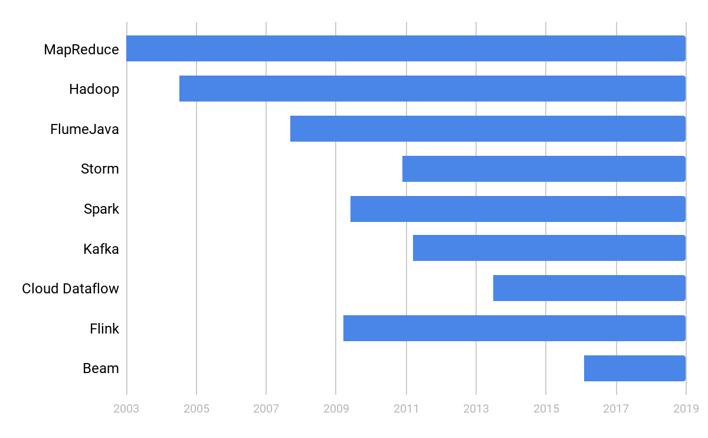
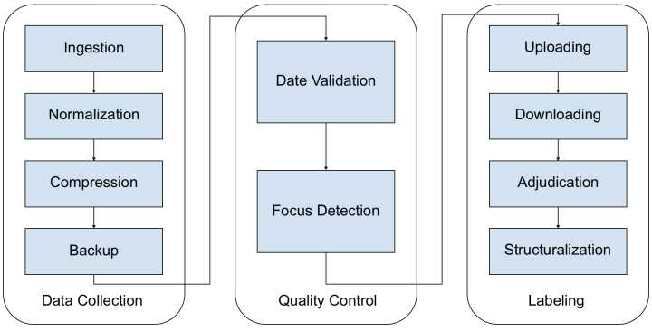
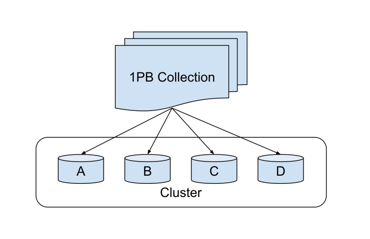
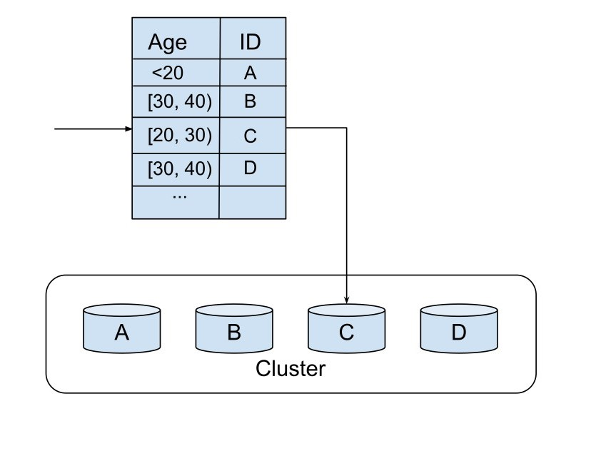

作者：极客时间

链接：https://www.zhihu.com/question/303101438/answer/655475086

来源：知乎

著作权归作者所有。商业转载请联系作者获得授权，非商业转载请注明出处。

---

每次和来硅谷参观的同行交流的时候，只要谈起数据处理技术，他们总是试图打探 MapReduce 方面的经验。这一点让我颇感惊讶，因为在硅谷，MapReduce 大家谈的已经很少了。

今天这一讲，我们就来聊聊[为什么MapReduce会被硅谷一线公司淘汰。](https://link.zhihu.com/?target=https%3A//time.geekbang.org/column/article/90081%3Futm_term%3DzeusL8H4I%26utm_source%3Dzhihu%26utm_medium%3Djikeshijian%26utm_campaign%3D167-presell%26utm_content%3D0417bannerlink)

我们先来沿着时间线看一下超大规模数据处理的重要技术以及它们产生的年代：

 我认为可以把超大规模数据处理的技术发展分为三个阶段：石器时代，青铜时代，蒸汽机时代。

- 石器时代

我用"石器时代"来比喻 MapReduce 诞生之前的时期。

虽然数据的大规模处理问题早已存在，早在 2003 年的时候，Google 就已经面对大于 600 亿的搜索量。但是数据的大规模处理技术还处在彷徨阶段。当时每个公司或者个人可能都有自己的一套工具处理数据。却没有提炼抽象出一个系统的方法。

- 青铜时代

2003 年，MapReduce 的诞生标志了超大规模数据处理的第一次革命，而开创这段青铜时代的就是下面这篇论文《MapReduce: Simplified Data Processing on Large Clusters》。

杰夫（Jeff Dean）和桑杰（Sanjay Ghemawat）从纷繁复杂的业务逻辑中，为我们抽象出了 Map 和 Reduce 这样足够通用的编程模型。后面的 Hadoop 仅仅是对于 GFS、BigTable、MapReduce 的依葫芦画瓢，我这里不再赘述。 

- 蒸汽机时代

到了 2014 年左右，Google 内部已经几乎没人写新的 MapReduce 了。

2016 年开始，Google 在新员工的培训中把 MapReduce 替换成了内部称为 Flume（不要和 Apache Flume 混淆，是两个技术）的数据处理技术，这标志着青铜时代的终结，同时也标志着蒸汽机时代的开始。

我跳过"铁器时代"之类的描述，是因为只有工业革命的概念才能解释从 MapReduce 进化到 Flume 的划时代意义。

Google 内部的 Flume 和它后来的开源版本 Apache Beam 所引进的统一的编程模式将在后面的章节中为你深入解析。

现在你可能有一个疑问 ：*为什么MapReduce会被取代？*

**1.高昂的维护成本**

使用 MapReduce，你需要严格地遵循分步的 Map 和 Reduce 步骤，当你构造更为复杂的处理架构时，往往需要协调多个 Map 和多个 Reduce 任务。

然而每一步的 MapReduce 都有可能出错。为了这些异常处理，很多人开始设计自己的协调系统（orchestration）。例如做一个状态机（state machine）协调多个 MapReduce，这大大增加了整个系统的复杂度。如果你搜 "MapReduce orchestration" 这样的关键词，就会发现有很多书整整一本都在写怎样协调 MapReduce。

你可能惊讶于 MapReduce 的复杂度。我经常看到一些把 MapReduce 说得过度简单的误导性文章，例如"把海量的 ×× 数据通过 MapReduce 导入大数据系统学习，就能产生 ×× 人工智能"，似乎写文的"专家"动动嘴就能点石成金。而现实的 MapReduce 系统的复杂度是超过了"伪专家"的认知范围的。下面我来举个例子，告诉你 MapReduce 有多复杂。

想象一下这个情景，你的公司要预测美团的股价，其中一个重要特征是活跃在街头的美团外卖电动车数量，而你负责处理所有美团外卖电动车的图片。在真实的商用环境下，你可能至少需要 10 个 MapReduce 任务：

 首先，我们需要搜集每日的外卖电动车图片。数据的搜集往往不全部是公司独自完成，许多公司会选择部分外包或者众包。所以在**数据搜集（Data collection）**部分，你至少需要 4 个 MapReduce 任务：

1. 数据导入（data ingestion）：用来把散落的照片（比如众包公司上传到网盘的照片）下载到你的存储系统。

2. 数据统一化（data normalization）：用来把不同外包公司提供过来的各式各样的照片进行格式统一。

3. 数据压缩（compression）：你需要在质量可接受的范围内保持最小的存储资源消耗 。

4. 数据备份（backup）：大规模的数据处理系统我们都需要一定的数据冗余来降低风险。

仅仅是做完数据搜集这一步，离真正的业务应用还差的远。真实的世界是如此不完美，我们需要一部分**数据质量控制 （quality control）**流程，比如：

1. 数据时间有效性验证 （date validation）：检测上传的图片是否是你想要的日期的。

2. 照片对焦检测（focus detection）：你需要筛选掉那些因对焦不准而无法使用的照片。

最后才到你负责的重头戏：找到这些图片里的外卖电动车。而这一步因为人工的介入是最难控制时间的。你需要做 4 步：

1. 数据标注问题上传（question uploading）：上传你的标注工具，让你的标注者开始工作。

2. 标注结果下载（answer downloading）：抓取标注完的数据。

3. 标注异议整合（adjudication）：标注异议经常发生，比如一个标注者认为是美团外卖电动车，另一个标注者认为是京东快递电动车。

4. 标注结果结构化（structuralization）: 要让标注结果可用，你需要把可能非结构化的标注结果转化成你的存储系统接受的结构。

我不再深入每个 MapReduce 任务的技术细节，因为本章的重点仅仅是理解 MapReduce 的复杂度。

通过这个案例，我想要阐述的观点是，因为真实的商业 MapReduce 场景极端复杂，上面这样 10 个子任务的 MapReduce 系统在硅谷一线公司司空见惯。在应用过程中，每一个 MapReduce 任务都有可能出错，都需要重试和异常处理的机制。

协调这些子 MapReduce 的任务往往需要和业务逻辑紧密耦合的状态机，过于复杂的维护让系统开发者苦不堪言。

**2.时间性能达不到用户的期待**

除了高昂的维护成本，MapReduce 的时间性能也是个棘手的问题。

MapReduce 是一套如此精巧复杂的系统，如果使用得当，它是青龙偃月刀，如果使用不当它就是一堆废铁，不幸的是并不是每个人都是关羽。

在实际的工作中，不是每个人都对 MapReduce 细微的配置细节了如指掌。在现实工作中，业务往往需求一个刚毕业的新手在 3 个月内上线一套数据处理系统，而他很可能从来没有用过 MapReduce。这种情况下开发的系统是很难发挥好 MapReduce 的性能的。

你一定想问，MapReduce 的性能优化配置究竟复杂在哪里呢？

事实上，Google 的 MapReduce 性能优化手册有 500 多页。这里我举例讲讲 MapReduce 的分片（sharding）难题，希望能窥斑见豹，引发大家的思考。

Google 曾经在 2007 年到 2012 年做过一个对于 1PB 数据的大规模排序实验，来测试 MapReduce 的性能。从 2007 年的排序时间 12 小时，到 2012 年的排序时间 0.5 小时，即使是 Google，也花了 5 年的时间才不断优化了一个 MapReduce 流程的效率。

2011 年，他们在 Google Research 的博客上公布了初步的成果（[http://googleresearch.blogspot.com/2011/09/sorting-petabytes-with-mapreduce-next.html](https://link.zhihu.com/?target=http%3A//googleresearch.blogspot.com/2011/09/sorting-petabytes-with-mapreduce-next.html)）。

其中有一个重要的发现，就是他们在 MapReduce 的性能配置上花了非常多的时间。包括了缓冲大小（buffer size），分片多少（number of shards），预抓取策略（prefetch），缓存大小（cache size）等等。

所谓的分片，是指把大规模的的数据分配给不同的机器/工人，流程如下图所示。 

选择一个好的分片函数（sharding function）为何格外重要？让我们来看一个例子。

假如你在处理 Facebook 的所有用户数据，你选择了按照用户的年龄作为分片函数（sharding function）。我们来看看这时候会发生什么。

因为用户的年龄分布不均衡，假如在 20-30 这个年龄段的 Facebook 用户最多，导致我们在下图中 worker C 上分配到的任务远大于别的机器上的任务量。

这时候就会发生掉队者问题（stragglers）。别的机器都完成了 Reduce 阶段，它还在工作。掉队者问题可以通过 MapReduce 的性能剖析（profiling）发现。 如下图所示，箭头处就是掉队的机器。

>  图片引用：Chen, Qi, Cheng Liu, and Zhen Xiao. "Improving MapReduce performance using smart speculative execution strategy." IEEE Transactions on Computers 63.4 (2014): 954-967.

回到刚刚的 Google 大规模排序实验。

因为 MapReduce 的分片配置异常复杂，所以在 2008 年以后，Google 改进了 MapReduce 的分片功能，引进了动态分片技术 (dynamic sharding），大大简化了使用者对于分片的手工调整。在这之后，包括动态分片技术在内的各种崭新思想被逐渐引进，奠定了下一代大规模数据处理技术的雏型。

