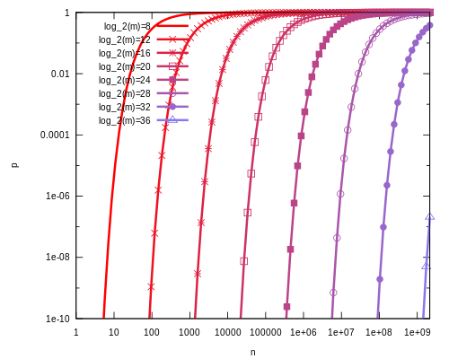

# 布隆过滤器（Bloom Filter）

布隆过滤器（Bloom Filter）是由布隆（Burton Howard Bloom）在 1970 年提出的。它实际上是由一个很长的二进制向量和一系列随机映射函数组成，布隆过滤器可以用于检索一个元素是否在一个集合中。

它的优点是空间效率和查询时间都远远超过一般的算法，缺点是有一定的误识别率（假正例 False positives，即 Bloom Filter 报告某一元素存在于某集合中，但是实际上该元素并不在集合中）和删除困难，但是没有识别错误的情形即假反例 False negatives，如果某个元素确实没有在该集合中，那么 Bloom Filter 是不会报告该元素存在于集合中的，所以不会漏报。

直观的说，Bloom 算法类似一个 hash set，用来判断某个元素（key）是否在某个集合中。Hash 面临的问题就是冲突。假设 Hash 函数是良好的，如果我们的位阵列长度为 m 个点，那么如果我们想将冲突率降低到例如 1%, 这个散列表就只能容纳 m/100 个元素。显然这就不叫空间有效了（Space-efficient）。解决方法也简单，就是使用多个 Hash，如果它们有一个说元素不在集合中，那肯定就不在。如果它们都说在，虽然也有一定可能性它们在说谎，不过直觉上判断这种事情的概率是比较低的。

典型的应用场景：某些存储系统的设计中，会存在空查询缺陷：当查询一个不存在的 key 时，需要访问慢设备，导致效率低下。比如一个前端页面的缓存系统，可能这样设计：先查询某个页面在本地是否存在，如果存在就直接返回，如果不存在，就从后端获取。但是当频繁从缓存系统查询一个页面时，缓存系统将会频繁请求后端，把压力导入后端。这时只要增加一个 Bloom 算法的服务，后端插入一个 key 时，在 Bloom 中设置一次，需要查询后端时，先判断 key 在后端是否存在，这样就能避免后端的压力。

算法流程：

-   首先需要 k 个 hash 函数，每个函数可以把 key 散列成为 1 个整数
-   初始化时，需要一个长度为 n 比特的数组，每个比特位初始化为 0
-   某个 key 加入集合时，用 k 个 hash 函数计算出 k 个散列值，并把数组中对应的比特位置为 1
-   判断某个 key 是否在集合时，用 k 个 hash 函数计算出 k 个散列值，并查询数组中对应的比特位，如果所有的比特位都是 1，认为在集合中。


优点：

-   不需要存储 key，节省空间。
-   布隆过滤器存储空间和插入/查询时间都是常数。
-   hash 函数相互之间没有关系，方便由硬件并行实现。
-   布隆过滤器不需要存储元素本身，在某些对保密要求非常严格的场合有优势。
-   布隆过滤器可以表示全集。

缺点：

-   算法判断 key 在集合中时，有一定的概率 key 其实不在集合中
-   无法删除


误算率（False Positive）概率推导：

假设 Hash 函数以等概率条件选择并设置 Bit Array 中的某一位，m 是该位数组的大小，k 是 Hash 函数的个数，那么位数组中某一特定的位在进行元素插入时的 Hash 操作中没有被置位的概率是：
$$
1 - \frac{1}{m}
$$
那么在所有 k 次 Hash 操作后该位都没有被置 "1" 的概率是：
$$
(1 - \frac{1}{m})^k
$$
如果我们插入了 n 个元素，那么某一位仍然为 "0" 的概率是：
$$
(1 - \frac{1}{m})^{kn}
$$
因而该位为 "1"的概率是：
$$
1-(1 - \frac{1}{m})^{kn}
$$
现在检测某一元素是否在该集合中。标明某个元素是否在集合中所需的 k 个位置都按照如上的方法设置为 "1"，但是该方法可能会使算法错误的认为某一原本不在集合中的元素却被检测为在该集合中（False Positives），该概率由以下公式确定：
$$
(1-(1 - \frac{1}{m})^{kn})^k\approx(1-e^{-kn/m})^k
$$
其实上述结果是在假定由每个 Hash 计算出需要设置的位（bit）的位置是相互独立为前提计算出来的，不难看出，随着 m（位数组大小）的增加，假正例（False Positives）的概率会下降，同时随着插入元素个数 n 的增加，False Positives 的概率又会上升，对于给定的 m，n，如何选择 Hash 函数个数 k 由以下公式确定：
$$
k=\frac{m}{n}\ln2\approx0.7\frac{m}{n}
$$
此时 False Positives 的概率为：
$$
2^{-k}\approx0.6185^\frac{m}{n}
$$
而对于给定的 False Positives 概率 p，如何选择最优的位数组大小 m 呢：
$$
m=-\frac{n\ln p}{(\ln2)^2}
$$
上式表明，位数组的大小最好与插入元素的个数成线性关系，对于给定的 m，n，k，假正例概率最大为：
$$
(1-e^{-k(n+0.5)/(m-1)})^k
$$
下图是布隆过滤器假正例概率 p 与位数组大小 m 和集合中插入元素个数 n 的关系图，假定 Hash 函数个数选取最优数目：

 


---

# MinIO 布隆过滤器实现

PUT/DELETE 和一些恢复操作会导致的数据修改，MinIO 为了监控这些变化，使用布隆过滤器来优化要扫描的路径。

布隆过滤器具有可以以分布式方式创建并在以后合并的优点，因此不需要集中式布隆过滤器。这使得服务器能够独立地保持打开过滤器，并且不需要服务器间的通信。

由下面代码流程易知，新的布隆过滤器给定了 n（200000） 和 p（0.1）来计算 m 和 k。

```go
func (d *dataUpdateTracker) newBloomFilter() BloomFilter {
	return BloomFilter{Bloom.NewWithEstimates(dataUpdateTrackerEstItems, dataUpdateTrackerFP)}
}

func NewWithEstimates(n uint, fp float64) *BloomFilter {
	m, k := EstimateParameters(n, fp)
	return New(m, k)
}

// 计算 m 和 k
func EstimateParameters(n uint, p float64) (m uint, k uint) {
	m = uint(math.Ceil(-1 * float64(n) * math.Log(p) / math.Pow(math.Log(2), 2)))
	k = uint(math.Ceil(math.Log(2) * float64(m) / float64(n)))
	return
}
```

MinIO 在初始化 ObjectLayer 时，开启了 `intDataUpdateTracker.start`，我们一点一点来分析。

```go
func (d *dataUpdateTracker) start(ctx context.Context, drives ...string) {
	...
	d.load(ctx, drives...)
	go d.startCollector(ctx)
	// startSaver will unlock.
	d.mu.Lock()
	go d.startSaver(ctx, dataUpdateTrackerSaveInterval, drives...)
}
```

首先是 load，load 将尝试从提供的驱动器加载数据跟踪信息。仅当 `d.Saved` 比磁盘上找到的数据旧时才会加载数据，也就是找到最新的。

```go
func (d *dataUpdateTracker) load(ctx context.Context, drives ...string) {
	...
	for _, drive := range drives {
		cacheFormatPath := pathJoin(drive, dataUpdateTrackerFilename)
		f, err := os.Open(cacheFormatPath)
		if err != nil {
			...
		}
		err = d.deserialize(f, d.Saved)
		...
		f.Close()
	}
}
```

load 里关键是反序列化（deserialize） 方法，每个 drive 的 `.minio.sys/buckets/.tracker.bin` 目录作为布隆过滤器的保存文件，第一字节为版本号，接下来 8 字节是时间戳，然后读出 current 和 history。

```go
func (d *dataUpdateTracker) deserialize(src io.Reader, newerThan time.Time) error {
   ctx := GlobalContext
   var dst dataUpdateTracker
   var tmp [8]byte

   // 读取 Version
   if _, err := io.ReadFull(src, tmp[:1]); err != nil {
      ...
      return err
   }
   switch tmp[0] {
   ...
   }
    
   // 读取 Timestamp.
   if _, err := io.ReadFull(src, tmp[:8]); err != nil {
      ...
   }
   t := time.Unix(int64(binary.LittleEndian.Uint64(tmp[:])), 0)
   if !t.After(newerThan) {
      return nil
   }

   // 读取 Current
   if _, err := io.ReadFull(src, tmp[:8]); err != nil {
      ...
   }
   dst.Current.idx = binary.LittleEndian.Uint64(tmp[:])
   dst.Current.bf = emptyBloomFilter()
   if _, err := dst.Current.bf.ReadFrom(src); err != nil {
      ...
   }

   // 读取 History
   if _, err := io.ReadFull(src, tmp[:8]); err != nil {
      ...
   }
   n := binary.LittleEndian.Uint64(tmp[:])	// 历史轮次
   dst.History = make(dataUpdateTrackerHistory, int(n))
   for i, e := range dst.History {
      if _, err := io.ReadFull(src, tmp[:8]); err != nil {
         ...
      }
      e.idx = binary.LittleEndian.Uint64(tmp[:])
      e.bf = emptyBloomFilter()
      if _, err := e.bf.ReadFrom(src); err != nil {
         ...
      }
      dst.History[i] = e
   }
   // Ignore what remains on the stream.
   // Update d:
   d.mu.Lock()
   defer d.mu.Unlock()
   d.Current = dst.Current
   d.History = dst.History
   d.Saved = dst.Saved
   return nil
}
```

接下来开启了两个 goroutine：

-   startCollector 从 objectUpdatedCh 接收变化并设置布隆过滤器。
-   startSaver 每 5 分钟执行一次，它根据 dirty 标志位来判断是否有变化，如果有变化的话，将当前布隆过滤器位图序列化（serialize ）到每个 driver 的 `.tracker.bin`

那么还有如下问题：

-   谁来置位 dirty 和设置布隆过滤器
-   布隆过滤器什么时候被使用，也就是用于什么场景

首先回答第一个问题，在 put / delete 等操作里，都会看到 `defer NSUpdated(bucket, object)`，即在进行修改类操作时退出时，会去设置布隆过滤器，表示对应的桶或对象发生了改变。

```go
func NSUpdated(bucket, prefix string) {
	if intDataUpdateTracker != nil {
		intDataUpdateTracker.markDirty(bucket, prefix)
	}
}

func (d *dataUpdateTracker) markDirty(bucket, prefix string) {
	dateUpdateTrackerLogPrefix := color.Green("dataUpdateTracker:")
	if bucket == "" && d.debug {
		console.Debugf(dateUpdateTrackerLogPrefix + " no bucket specified\n")
		return
	}

	if isReservedOrInvalidBucket(bucket, false) && d.debug {
		return
	}
	split := splitPathDeterministic(pathJoin(bucket, prefix))

	// Add all paths until done.
	d.mu.Lock()
	for i := range split {
		d.Current.bf.AddString(hashPath(path.Join(split[:i+1]...)).String())
	}
	d.dirty = d.dirty || len(split) > 0
	d.mu.Unlock()
}
```

第二个问题，MinIO 初始化时会开启一个 goroutine：`initDataScanner`，其主要就是调用 `runDataScanner`，我们去看下内部实现，其关键操作就在于 NSScanner 做了什么事情，不过我们这里不关心具体怎么扫描的，我们关心布隆过滤器是怎么使用的。

我们来看下 updateBloomFilter 里面搞了点什么幺蛾子。

```go
func runDataScanner(pctx context.Context, objAPI ObjectLayer) {
	// Make sure only 1 scanner is running on the cluster.
	...

	// Load current Bloom cycle
	nextBloomCycle := intDataUpdateTracker.current() + 1

    // 从 .Bloomcycle.bin 中读取轮次
	buf, _ := readConfig(ctx, objAPI, dataUsageBloomNamePath)
	...

	for {
		select {
		case <-ctx.Done():
			return
		case <-scannerTimer.C:
			// Reset the timer for next cycle.
			...

			// Wait before starting next cycle and wait on startup.
			results := make(chan DataUsageInfo, 1)
             // 从 results 中接收数据保存到 .usage.json
			go storeDataUsageInBackend(ctx, objAPI, results)
             // 更新布隆过滤器
			bf, err := globalNotificationSys.updateBloomFilter(ctx, nextBloomCycle)
			logger.LogIf(ctx, err)
             // 使用布隆过滤器扫描存储情况
			err = objAPI.NSScanner(ctx, bf, results, uint32(nextBloomCycle))
			logger.LogIf(ctx, err)
			if err == nil {
				// 持久化轮次
				nextBloomCycle++
				var tmp [8]byte
				binary.LittleEndian.PutUint64(tmp[:], nextBloomCycle)
				if err = saveConfig(ctx, objAPI, dataUsageBloomNamePath, tmp[:]); err != nil {
					logger.LogIf(ctx, err)
				}
			}
		}
	}
}
```

updateBloomFilter 将遍历所有服务器并返回一个合并（或操作）的布隆过滤器。因为请求会分发到不同服务器上，所以要将所有更改聚集起来才能不遗漏所有变更的对象。

因为布隆过滤器无法删除，所以这里每轮次都会生成一个新的布隆过滤器，cycleFilter 将历史 16 轮的布隆过滤器合并，并以此来扫描数据。filterFrom 将返回一个合并的 Bloom 过滤器。这样每次 NSScanner 扫描的数据是过去十六轮里变动过的数据。极端一点，如果过去十六轮没有 IO，那么也就没有数据需要扫描更新，减轻扫描负担。

```go
func (sys *NotificationSys) updateBloomFilter(ctx context.Context, current uint64) (*bloomFilter, error) {
   req := bloomFilterRequest{
      Current: current,
      Oldest:  current - dataUsageUpdateDirCycles,
   }
   if current < dataUsageUpdateDirCycles {
      req.Oldest = 0
   }

   // 本地布隆过滤器
   var bf *bloomFilter
   bfr, err := intDataUpdateTracker.cycleFilter(ctx, req)
   logger.LogIf(ctx, err)
   if err == nil && bfr.Complete {
      nbf := intDataUpdateTracker.newBloomFilter()
      bf = &nbf
      _, err = bf.ReadFrom(bytes.NewReader(bfr.Filter))
      logger.LogIf(ctx, err)
   }

   // 合并其余服务器的布隆过滤器
   var mu sync.Mutex
   g := errgroup.WithNErrs(len(sys.peerClients))
   for idx, client := range sys.peerClients {
      if client == nil {
         continue
      }
      client := client
      g.Go(func() error {
         serverBF, err := client.cycleServerBloomFilter(ctx, req)
         ...

         var tmp bloom.BloomFilter
         _, err = tmp.ReadFrom(bytes.NewReader(serverBF.Filter))
         ...
         if bf.BloomFilter == nil {
            bf.BloomFilter = &tmp
         } else {
            err = bf.Merge(&tmp)
            ...
         }
         return nil
      }, idx)
   }
   g.Wait()
   return bf, nil
}
```

有了布隆过滤器之后，NSScanner 就可以根据布隆过滤器来对目录进行扫描了。


---

# 参考与感谢

-   [add data update tracking using Bloom filter](https://github.com/minio/minio/pull/9208)


