#  概述

MinIO 对象存储系统是为海量数据存储、人工智能、大数据分析而设计，基于 Apache License v2.0 开源协议的对象存储系统，它完全兼容 Amazon S3 接口，单个对象最大可达 5TB，适合存储海量图片、视频、日志文件、备份数据和容器/虚拟机镜像等。

 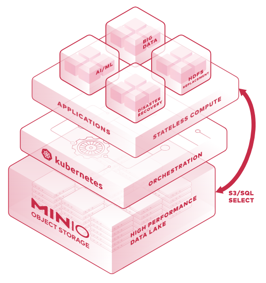

MinIO 与传统的存储和其他的对象存储不同的是：它一开始就针对性能要求更高的私有云标准进行软件架构设计。因为 MinIO 一开始就只为对象存储而设计，所以他采用了更易用的方式进行设计，它能实现对象存储所需要的全部功能，在性能上也更加强劲，它不会为了更多的业务功能而妥协，失去 MinIO 的易用性、高效性。这样的结果所带来的好处是：它能够更简单的实现具有弹性伸缩能力的原生对象存储服务。

MinIO 在传统对象存储用例（例如辅助存储，灾难恢复和归档）方面表现出色。同时，它在机器学习、大数据、私有云、混合云等方面的存储技术上也独树一帜。当然，也不排除数据分析、高性能应用负载、原生云的支持。

 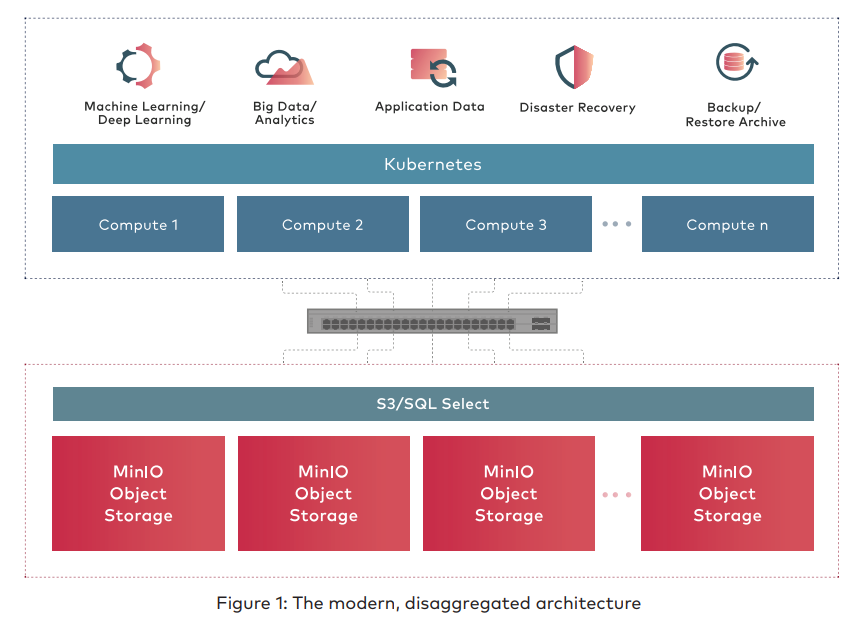

 

MinIO 创始者是 Anand Babu Periasamy，Harshavardhana 等人，Anand 是 GlusterFS 的初始开发者、Gluster 公司的创始人与 CTO，Harshavardhana 曾经是 GlusterFS 的开发人员，直到 2011 年红帽收购了 Gluster 公司。早在 2014 年末，Anand 他们认为：“数据将淹没 SAN 和 NAS 等较老的技术，就在那时，AWS 已经使世界相信，S3 对象存储是非结构化数据和半结构化数据（特别是大规模数据）的正确答案。我们知道 AWS 不可能成为世界上的数据中心，因此我们（MinIO）希望成为世界其他地方的 AWS S3”

MinIO 在设计上汲取了 GlusterFS 的相关经验与教训，系统复杂度上作了大量简化。

极简主义是 MinIO 设计的指导原则。它建立众多的中小规模、易管理的集群，支持跨数据中心将多个集群聚合成超大资源池，而非直接采用大规模、统一管理的分布式集群，减少风险因素与性能瓶颈，聚焦产品的核心功能，打造高可靠的集群、灵活的扩展能力以及超高的性能。

它主要采用 Golang 语言实现，整个系统都运行在操作系统的用户态空间，客户端与存储服务器之间采用 http/https 通信协议。

MinIO 部署简单，服务程序仅有一个可执行文件。它配置项很少（大部分都是内核之类系统级的设置），甚至不配置也可以正常运行起来。百度、Google、Bing 等搜索引擎上基本没有关于 MinIO 部署问题的网页，可见在实践中，很少有使用者遇到这方面的问题。

---

# 对象存储系统

文件系统把整个存储资源组织为目录树的形式。与此不同，对象存储系统把存储资源组织为**租户-桶-对象**的形式。数据结构组织见下图：

 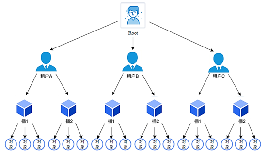

>   对象（Object）：类似于 hash 表中的表项：它的名字相当于关键字，它的内容相当于“值”。
>
>   桶（Bucket）：是若干个对象的逻辑抽象，是盛装对象的容器。
>
>   租户：用于隔离存储资源。在租户之下可以建立桶、存储对象。
>
>   用户：在租户下面创建的用于访问不同桶的账号。可以使用 MinIO 提供的 mc 命令设置不用用户访问各个桶的权限。

自现代计算开始以来，我们已经有了人们一直在使用的存储机制，即文件系统。那么，为什么我们需要一个全新的存储范例？即为什么需要对象存储呢？

当我们谈论非结构化数据及其规模时，重要的是要了解用于存储数据的基础系统应该能很好地扩展。但是扩展文件系统很困难。不仅您需要管理（有时）文件系统强加给您的不必要的元数据和层次结构，还需要处理备份管理等其他内容。

仅收集非结构化数据是不够的，你还需要应用某种级别的组织才能理解数据。文本分析，自动分类，自动标记等技术对于从你收集的所有非结构化数据中获得业务意义至关重要，具有固定布局的文件系统使其难以实现。

文件系统不是用于 HTTP 的，而是用于人类的。共享和管理文件系统中的文件很难以编程方式进行处理（想想我们大多数人都难以理解的 C / C++ 文件处理技巧）。处理文件流和可能的边界情况容易出错，并且需要大量时间和精力。

要绕过所有这些，需要一些新的东西，从头开始想象，始终将新的需求作为重点，这导致对象存储的出现。

与文件系统中的文件不同，对象以平面结构存储，只有一个对象池，没有文件夹，目录或层次结构，你只需提供对象 ID 即可请求给定对象。对象可能位于本地，也可能位于数千英里之外的云服务器上，但是由于它们位于平坦的地址空间中，因此可以完全相同的方式检索它们。

另一个重要方面是元数据处理。对象存储在存储对象元数据时提供了很大的灵活性。这意味着元数据不仅限于存储系统认为重要的内容（考虑文件系统中固定的元数据）。您可以手动添加任何类型或数量的元数据。例如，您可以分配元数据，例如与对象关联的应用程序的类型，应用程序的重要性，您要分配给对象的数据保护级别，是否要将此对象复制到另一个站点或多个站点，何时将该对象移动到不同的存储层或不同的地理位置，何时删除该对象。依此类推，可能性是无限的。

通过 HTTP 访问文件非常重要。仅当文件易于访问时，才可以对其进行分析或其他技术。对象存储处理得很好。几乎所有提供对象存储的平台都提供了 REST API，可帮助您通过 HTTP 访问文件。这些 API 不仅在访问数据方面有帮助，而且还可以帮助您进行身份验证，获取文件属性和管理权限，而您在文件系统中需要手动执行的所有操作。

---

# 去中心化架构

MinIO 采用去中心化的无共享架构，它没有元数据库，避免了元数据库成为整个系统的性能瓶颈，而是通过一系列计算来确定对象所在的位置，对象数据被打散存放在不同节点的多块硬盘，对外提供统一命名空间访问。

 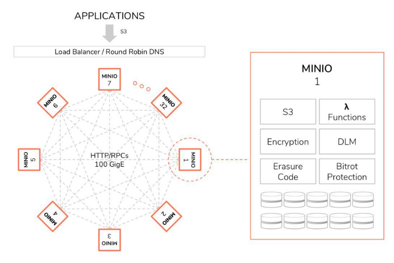

MinIO 对象存储系统主要有两种部署方式，一种是常见的本地分布式集群部署，一种是联盟模式部署（现已废弃，改成了 server pool 模式）。

本地分布式集群部署方式即在多个本地服务器节点部署 MinIO 软件，并将其组件成单套分布式存储集群，并提供统一命名空间和标准 S3 访问接口。

联盟部署模式即将多个 MinIO 集群在逻辑上组成了统一命名空间，实现近乎无限的扩展与海量的数据规模管理，这些集群可以都在本地，或分布在不同地域的数据中心。

Amazon S3 API 是对象存储世界的事实标准，应用可以通过 S3 接口访问 MinIO，对象经过压缩加密纠删计算后分散保存。另外对于超大的对象，可通过执行 SQL  语句以加速人工智能与大数据分析。

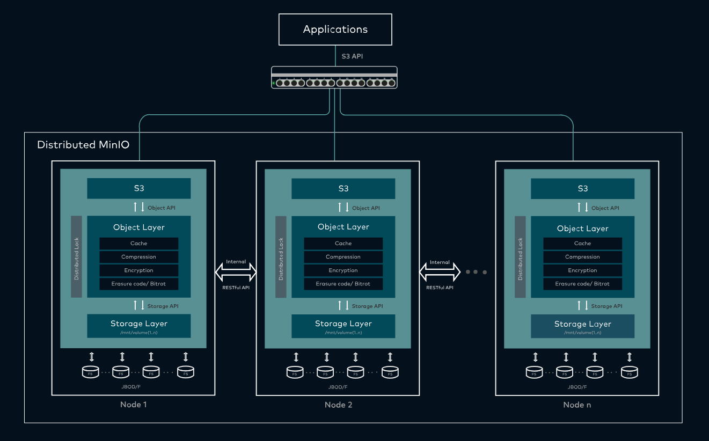

与分布式数据库相类似，MinIO 对象存储系统也面临数据一致性问题：一个客户端程序在读取一个对象的同时，另一个客户端程序可能正在修改或者删除这个对象。为了避免出现数据不一致情况，MinIO 相关开发人员为 MinIO 对象存储专门设计并实现了 dsync 分布式锁管理器。它采用如下分布式锁管理机制：

-   任何一个节点的锁请求都会广播给集群内所有在线节点；
-   如果 `n/2 + 1` 个节点回应 yes，则成功获得锁；
-   客户端获得锁以后可保留任意时间，不需要时自己释放即可。释放操作也会广播给所有的节点，从而恢复锁的可用状态。写锁仅能被一个写入者获得。

---

# 纠删码和Bitrot保护

MinIO 使用**纠删码**（erasure code）和**校验和**（checksum）来保护数据免受硬件故障和无声数据损坏。 即便您丢失一半数量（N/2）的硬盘，您仍然可以恢复数据。

纠删码是一种恢复丢失和损坏数据的数学算法，MinIO 采用 Reed-Solomon Code 将对象拆分成 N/2 数据和 N/2 奇偶校验块（可以更改）。这就意味着如果是 16 块盘，一个对象会被分成 8 个数据块、8 个奇偶校验块，你可以丢失任意 8 块盘（不管其是存放的数据块还是奇偶校验块），你仍可以从剩下的盘中的数据进行恢复，是不是很强大。

而且 MinIO 的纠删位于对象级别，可以以对象为粒度进行修复，像传统的 RAID 是以卷为单位修复，无法感知对象。

MinIO 对该部分进行了汇编级别的优化，可提供最高的性能。

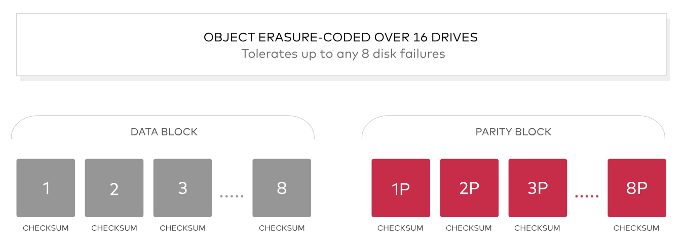

这里先介绍一点概念：

>   Drive：可以理解为一块磁盘；
>
>   Set：一组 Drive 的集合，Set 默认由系统根据集群规模自动计算得出，一个集群划分多个 Set，一个 Set 包含的 Drive 数量固定，一个对象存储在一个 Set 上。

文件上传的第一步，就是将 Set 下的所有 Drives 划分为 DataDrives 和 ParityDrives。

>   **DataDrives** ：纠删码中的数据盘，用来存储 Object 原始数据。
>
>   **ParityDrives** ：纠删码中的冗余盘，用来存储 Object 计算出来的冗余数据。

对于上传的 Object，MinIO 会按某个粒度比如 1 MB 将其划分为多个 Block 来计算纠删码。

-   如果 Object Size > 1 MB，那么每个 block 的大小就是 1 MB。
-   如果 Object Size < 1 MB，如果也划分一个 1 MB 的 block 就太浪费空间了，所以分配一个大小刚好为 Object Size 的 block 就够了。

每读取一块 Block，MinIO 就会对其进行纠删码编码，生成 data shards 和 parity shards。

那么对于一个对象，MinIO 是如何定位它所在的 Set 呢？

假定所有的 Set 从 0 开始编号。MinIO 会根据对象名（类似于文件系统的全路径名)，使用 CRC32 哈希算法计算出一个整数然后对 Set 数目取余决定存在哪个 Set 。与 GlusterFS 的 Davies-Meyer 哈希算法（性能、冲突概率与 md4，md5 相近）不一样的是，CRC32 算法的哈希值分布较不均匀，但运算速度极快，高出 md4 数倍。相对于容量均衡，MinIO更看重数据的写入速度。

因为一个 Set 中有多个 Drive（DataDrives + ParityDrives），所以 MinIO 会先将一块 Block 按照 Drives 数量，划分为多个小块，这些小块在 MinIO 中叫做 Shards。比如一个 Block 是 1 MB，而 Set 里有 16 个 Drive（8 DataDrives + 8 ParityDrives），此时 MinIO 会将 Block 按照 1 MB / 8 DataDrives 的方式，将数据划分到 8 个 Data Shards，并额外再创建 8 个 空 Shards，用来存储编码后的冗余数据。

接着 MinIO 就会对 Data Shards 进行纠删码编码，并将编码后的冗余数据存储到前面创建的 8 个空 Shards 中，也就是 parity shards 中，最后并行写入存储。

上传文件时，MinIO 不是直接上传到 Object 在磁盘的最终存储目录的，而是先写到一个临时目录，等所有数据都写到临时目录后，MinIO 才会进行 rename 操作，将 Object 数据存储到最终存储目录。

 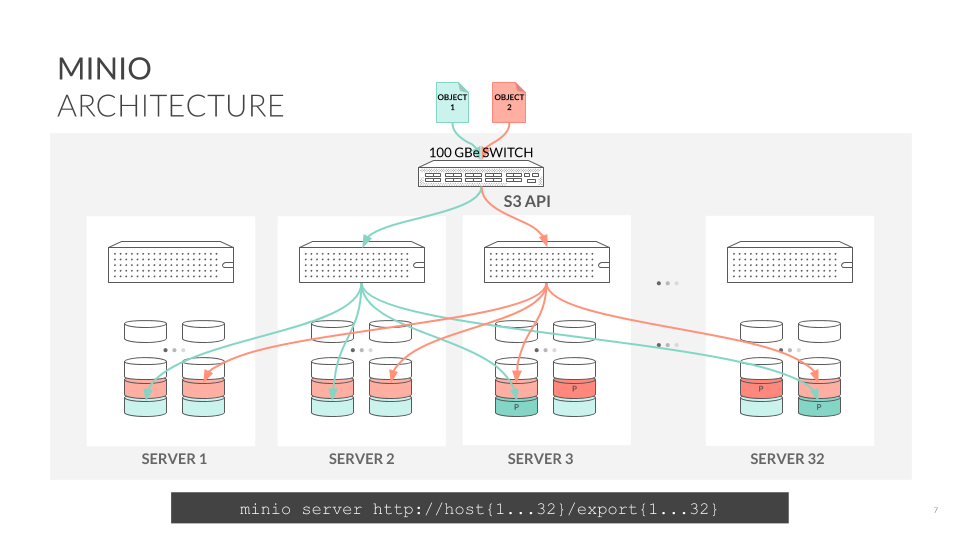

MinIO 除了用纠删码来保护数据，还采用了 Bitrot 技术。

Bitrot 是指位衰减，位衰减又被称为数据腐化（`Data Rot`） 或无声数据损坏（`Silent Data Corruption`），是目前硬盘数据的一种严重数据丢失问题。硬盘上的数据可能会神不知鬼不觉就损坏了，也没有什么错误日志。正所谓明枪易躲，暗箭难防，这种背地里犯的错比硬盘直接咔咔宕了还危险。原因多种多样比如驱动器老化，电流尖峰，磁盘固件错误，虚假写入，读/写方向错误，驱动程序错误，意外覆盖等等，但结果是一样的，数据泄漏。

可以说纠删码是用来保证 Object 的每个 Block 的数据正确和可恢复的，而 Bitrot 技术是用来检验磁盘数据的正确性的。

MinIO 对 Highway 哈希算法的优化实现可确保它永远不会读取损坏的数据，它可以实时捕获和修复损坏的对象。 通过在 READ 上计算哈希值，并在 WRITE 上从应用程序，整个网络以及到内存/驱动器的哈希值，来确保端到端的完整性。 该实现旨在提高速度，并且可以在 Intel CPU 的单个内核上实现超过 **10 GB /秒**的哈希速度。

数据修复有两种可能：

**校验分片错误**：MinIO 使用各个数据分片重新计算缺失的校验片。

**数据分片错误**：使用纠删算法恢复数据（需要计算逆矩阵）。

---

# lambda计算

MinIO 对象存储软件支持 lambda 计算通知机制，即桶中的对象支持事件通知机制。

MinIO 当前支持的事件类型有：对象上传、对象下载、对象删除、对象复制等。

MinIO 对象存储软件当前支持的事件接收系统有：Redis，NATS，AMQP，MQTT，Apache Kafka，MySql，PostgreSQL，Elasticsearch 等。

对象通知机制，极大地增强了 MinIO 对象存储的扩展性，可以让用户通过自行开发来实现某些 MinIO 对象存储不便实现的功能，比如基于元数据进行的各种检索、各种跟用户的业务有关的计算。既方便了用户，又有助于 MinIO 对象存储的生态建设。

 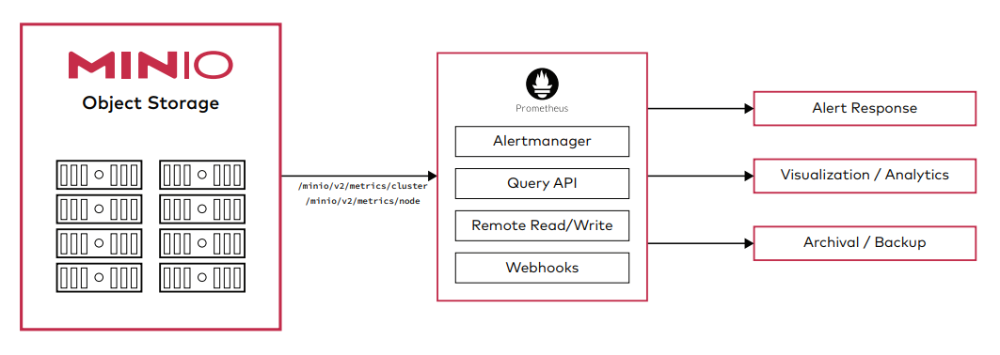

---

# 加密

保护静态数据是一回事，飞行中的数据加密是另一回事，MinIO 支持多种复杂的服务器端加密方案。 MinIO 的加密方法可确保机密性，完整性和真实性，而性能开销却可以忽略不计。 

MinIO 使用 AES-256-GCM，ChaCha20-Poly1305 和 AES-CBC 支持服务器端和客户端加密。加密的对象使用 AEAD 服务器端加密进行了防篡改。此外，MinIO与所有常用的密钥管理解决方案（例如 HashiCorp Vault）兼容并经过测试

MinIO 使用密钥管理系统（KMS）支持 SSE-S3。如果客户端请求 SSE-S3，或启用了自动加密，则 MinIO 服务器会使用唯一的对象密钥对每个对象进行加密，该对象密钥受 KMS 管理的主密钥保护。由于开销极低，因此可以为每个应用程序和实例打开自动加密。

 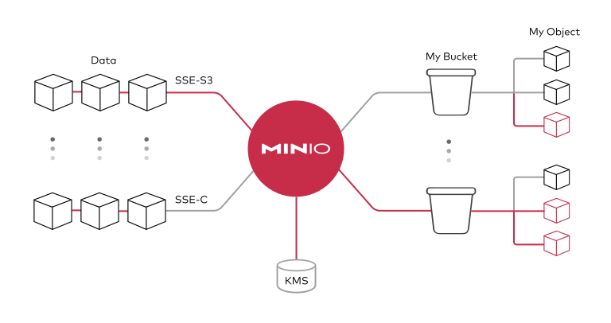

---

# 身份认证和管理

MinIO 支持身份管理中最先进的标准，并与 OpenID connect 兼容提供商以及主要的外部 IDP 供应商集成。这意味着访问是集中的，密码是临时的和轮换的，而不是存储在配置文件和数据库中。此外，访问策略是细粒度的且高度可配置的，这意味着支持多租户和多实例部署变得简单。

 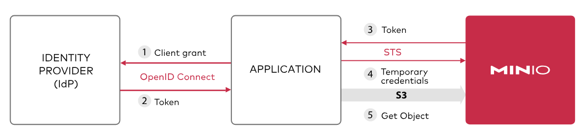

---

# 持续备份

传统的复制的一大问题是不能有效地扩展，很难超过几百 TB。在当今的时代，为了支持灾难恢复，任何单位都需要一个备份策略。而且这个备份策略需要跨越不同的地理位置、不同的数据中心、多种多样的云环境。

MinIO 的持续备份是为跨数据中心的大型部署而设计的。通过使用 lambda 计算通知机制，它可以快速、有效地计算处需要增量备份的内容，这远比传统的批处理模式优秀。持续备份使得未备份的数据尽可能的少，这意味着发生灾难或者严重错误时候，丢失的数据尽可能的少，很好地保护了用户的数据资产。

 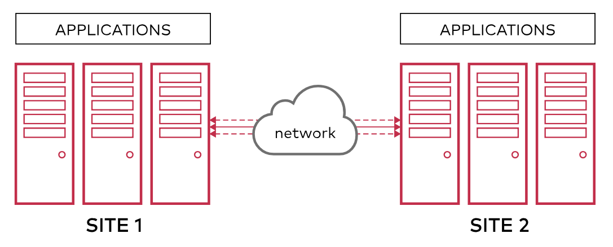

---

# AWS S3标准兼容

亚马逊云的 S3 API（接口协议）是在全球范围内达到共识的对象存储的协议，是全世界内大家都认可的标准。MinIO 在很早的时候就采用了 S3 兼容协议，并且 MinIO 是第一个支持 S3 Select 的产品。MinIO 对其兼容性的全面性感到自豪，并且得到了 750 多个组织的认同, 包括 Microsoft Azure 使用 MinIO 的 S3 网关 - 这一指标超过其他同类产品的总和。

---

# 多云网关

MinIO 存储系统的后端可以是磁盘，也可以作为云网关，对接第三方的 NAS 系统、分布式文件系统或公有云存储资源，并为业务系统转换提供标准的对象访问接口。

目前 MinIO 支持 Google 云存储、HDFS、阿里巴巴 OSS、亚马逊 S3, 微软 Azure Blob 存储等第三方存储资源。

 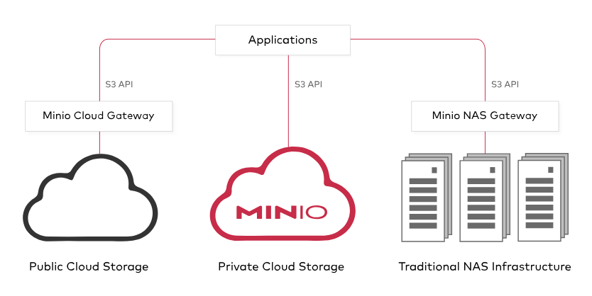

---

# WORM

MinIO 支持 WORM，启用 WORM 后，MinIO 会禁用所有可能会使对象数据和元数据发生更改的 API。这意味着一旦写入数据就可以防止篡改。 

MinIO 也支持对象存储常见的一些特性如版本管理、生命周期等。

---

# 高性能

MinIO 号称是目前速度最快的对象存储服务器。

在标准硬件上，对象存储的读/写速度最高可以高达 183 GB/s 和 171 GB/s。对象存储可以作为主存储层，用来处理 Spark、Presto、TensorFlow、H2O.ai 等各种复杂工作负载以及成为 Hadoop HDFS 的替代品。

MinIO 用作云原生应用程序的主要存储，和传统对象存储相比，云原生应用程序需要更高的吞吐量和更低的延迟。而这些都是 MinIO 能够达成的性能指标。

---

# 安装部署简单

MinIO 安装部署非常简单。MinIO 简单特性减少了出错的机会，节约了安装部署的时间，提供了可靠性，同时简单性又是性能的基础。Linux 环境下只需下载一个二进制文件然后执行，即可在几分钟内完成安装和配置 MinIO。配置选项和变体的数量保持在最低限度，这样让失败的配置概率降低到几乎接近于 0 的水平。MinIO 升级是通过一个简单命令完成的，这个命令可以无中断的完成 MinIO 的升级工作，并且不需要停机即可完成升级操作，大大降低总使用和运维成本。

---

# 容器化集成方便

MinIO 提供了与 k8s、etcd、docker 等主流容器化技术深度集成方案。

---

# 参考与感谢

-   [MinIO官网](https://min.io/)

-   [开源对象存储MinIO技术白皮书](https://blog.csdn.net/liuaigui/article/details/101529892)