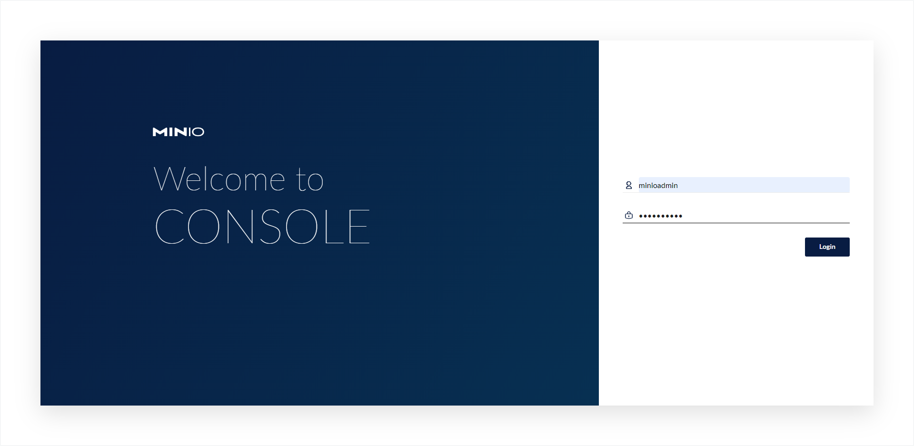
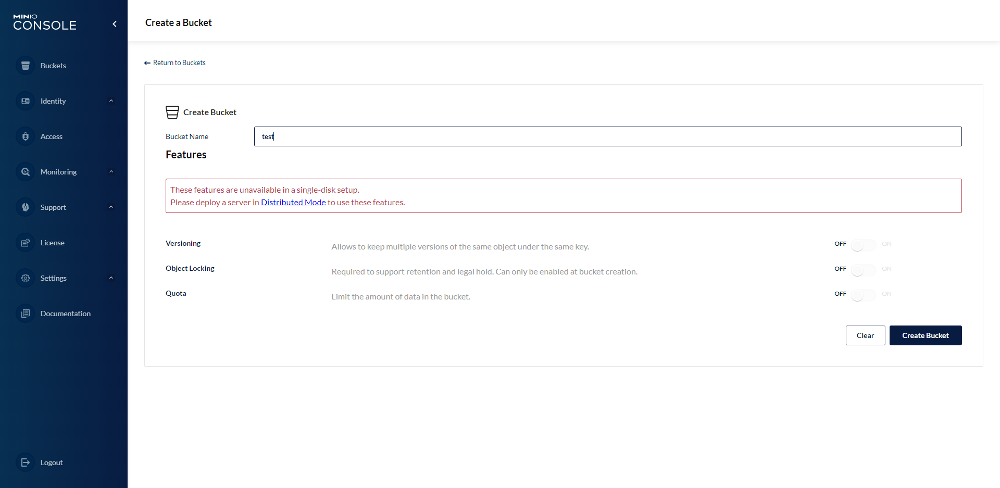
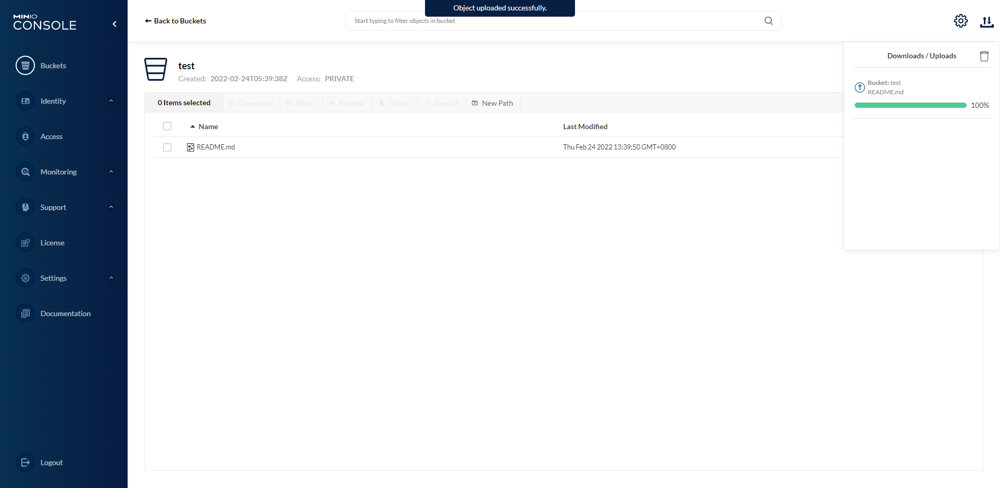
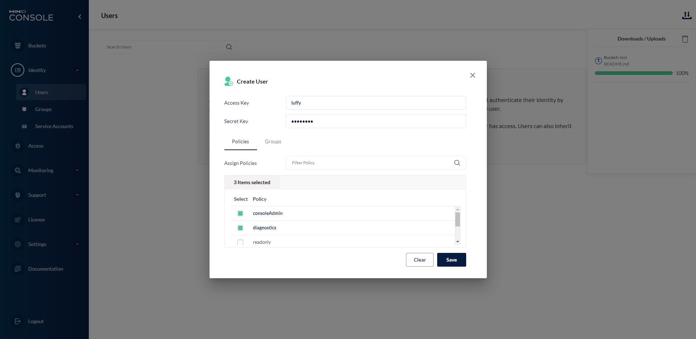
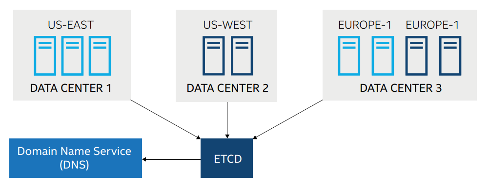

# 单点部署

MinIO 部署相当简单，只需要下载对应的二进制文件，启动即可。

```bash
# https://github.com/minio/minio 提供了最新的下载地址
wget https://dl.min.io/server/minio/release/linux-amd64/minio
chmod +x minio
./minio server /data
```

/data 是你自己指定的数据目录。

```bash
[root@c130 ~]# minio server /app/data
API: http://192.168.1.130:9000  http://127.0.0.1:9000           # 这里是固定的    
RootUser: minioadmin 
RootPass: minioadmin 

Console: http://192.168.1.130:44987 http://127.0.0.1:44987      # 这里不指定的话是随机的
RootUser: minioadmin 
RootPass: minioadmin 

Command-line: https://docs.min.io/docs/minio-client-quickstart-guide
   $ mc alias set myMinIO http://192.168.1.130:9000 minioadmin minioadmin

Documentation: https://docs.min.io

WARNING: Console endpoint is listening on a dynamic port (44987), please use --console-address ":PORT" to choose a static port.
```

启动之后可以登录 `localhost:9000` 进入网页管理界面，默认账号 minioadmin，密码 minioadmin。



进入之后我们可以在页面操作创建 Bucket，在 Bucket 里上传下载对象。由于我们使用一个存储点启动，此时 MinIO 处于标准模式，数据不会纠删编码，也不支持数据版本、锁定等高级功能。



创建 Bucket 之后，我们可以上传对象。



查看后台可以看到 Bucket 就类似分了一个目录，所有的对象都放在这个目录下，而且我们上传的对象也没有做任何处理，原封不动的保存了下来。

```bash
[root@c130 1]# ls
test
[root@c130 1]# cd test/
[root@c130 test]# ls
README.md
```


---

# 分布式部署

## MinIO 分布式部署的优势

### 数据保护

-   分布式 MinIO 采用纠删码来防范多个节点宕机和位衰减。
-   分布式 MinIO 至少需要 4 个存储点，使用分布式 MinIO 就 自动引入了纠删码功能。
-   纠删码是一种恢复丢失和损坏数据的数学算法， MinIO 采用 Reed-Solomon code 将对象拆分成 N/2 数据和 N/2 奇偶校验块。 这就意味着如果是 16 块盘，一个对象会被分成 8 个数据块、8 个奇偶校验块，你可以丢失任意 8 块盘（不管其是存放的数据块还是奇偶校验块），你仍可以从剩下的盘中的数据进行恢复。
-   纠删码的工作原理和 RAID 或者复制不同，像 RAID6 可以在损失两块盘的情况下不丢数据，而 MinIO 纠删码可以在丢失一半的盘的情况下，仍可以保证数据安全。 而且 MinIO 纠删码是作用在对象级别，可以一次恢复一个对象，而RAID 是作用在卷级别，数据恢复时间很长。MinIO 对每个对象单独编码，存储服务一经部署，通常情况下是不需要更换硬盘或者修复。MinIO 纠删码的设计目标是为了性能和尽可能的使用硬件加速。
-   位衰减是目前硬盘数据的一种严重数据丢失问题。硬盘上的数据可能会神不知鬼不觉就损坏了，也没有什么错误日志。MinIO 纠删码采用了高速 HighwayHash，基于哈希的校验和来防范位衰减。

### 高可用

单机 MinIO 服务存在单点故障，相反，如果是一个 N 节点的分布式 MinIO，只要有 N/2 节点在线，你的数据就是安全的。不过你需要至少有 N/2+1 个节点来创建新的对象。

例如，一个 8 节点的 MinIO 集群，每个节点一块盘，就算 4 个节点宕机，这个集群仍然是可读的，不过你需要 5 个节点才能写数据。

### 限制

分布式 MinIO 单租户存在最少 4 个盘最多 16 个盘的限制（受限于纠删码）。这种限制确保了 MinIO 的简洁，同时仍拥有伸缩性。如果你需要搭建一个多租户环境，你可以轻松的使用编排工具（Kubernetes）来管理多个 MinIO 实例。

注意，只要遵守分布式 MinIO 的限制，你可以组合不同的节点和每个节点几块盘。比如，你可以使用 2 个节点，每个节点 4 块盘，也可以使用 4 个节点，每个节点两块盘，诸如此类。

### 一致性

MinIO 在分布式和单机模式下，所有读写操作都严格遵守 read-after-write 一致性模型。


## 单节点环境搭建

这里我在单节点上搭建环境演示，要注意不能在根磁盘路径中启动，必须使用独立磁盘。

如果在多节点上搭建，要在每个节点上都运行 minio 命令。

```bash
[root@c130 ~]# minio server --console-address ":6666" --config-dir /app/conf http://192.168.1.130/app/data{1...4}
Formatting 1st pool, 1 set(s), 4 drives per set.
WARNING: Host 192.168.1.130 has more than 2 drives of set. A host failure will result in data becoming unavailable.
Automatically configured API requests per node based on available memory on the system: 234
Status:         4 Online, 0 Offline. 
API: http://192.168.1.130:9000  http://127.0.0.1:9000         
RootUser: minioadmin 
RootPass: minioadmin 

Console: http://192.168.1.130:50000 http://127.0.0.1:50000     
RootUser: minioadmin 
RootPass: minioadmin 

Command-line: https://docs.min.io/docs/minio-client-quickstart-guide
   $ mc alias set myminio http://192.168.1.130:9000 minioadmin minioadmin

Documentation: https://docs.min.io
```

此时我们再去上传一个对象，可以看到此时数据被分散到了各个存储点，而且上传的对象被纠删处理，我们无法从 xl.meta 中直接看到对象内容，纠删码的内容我们在此不做研究。

```bash
[root@c130 app]# tree
.
├── conf
│   └── certs
│       └── CAs
├── data1
│   └── test
│       └── README.md
│           └── xl.meta
├── data2
│   └── test
│       └── README.md
│           └── xl.meta
├── data3
│   └── test
│       └── README.md
│           └── xl.meta
└── data4
    └── test
        └── README.md
            └── xl.meta

15 directories, 4 files
```


## 多节点环境搭建

三节点：10.10.10.220 - 222，首先关闭防火墙，selinux 等配置。然后每个节点的 systemd 服务配置（/etc/systemd/system/minio.service）如下：

```bash
[Unit]
Description=MinIO
Documentation=https://docs.min.io
Wants=network-online.target
After=network-online.target
AssertFileIsExecutable=/usr/local/bin/minio

[Service]
WorkingDirectory=/usr/local

#User=minio-user
#Group=minio-user
User=root
Group=root

EnvironmentFile=-/etc/default/minio
ExecStartPre=/bin/bash -c "if [ -z \"${MINIO_VOLUMES}\" ]; then echo \"Variable MINIO_VOLUMES not set in /etc/default/minio\"; exit 1; fi"
ExecStart=/usr/local/bin/minio server $MINIO_OPTS $MINIO_VOLUMES

# Let systemd restart this service always
Restart=always

# Specifies the maximum file descriptor number that can be opened by this process
LimitNOFILE=65536

# Specifies the maximum number of threads this process can create
TasksMax=infinity

# Disable timeout logic and wait until process is stopped
TimeoutStopSec=infinity
SendSIGKILL=no

[Install]
WantedBy=multi-user.target

# Built for ${project.name}-${project.version} (${project.name})

```

每个节点配置文件 /etc/default/minio，EC 比例 5：1

```bash
# Set the hosts and volumes MinIO uses at startup
# The command uses MinIO expansion notation {x...y} to denote a
# sequential series.
#
# The following example covers four MinIO hosts
# with 4 drives each at the specified hostname and drive locations.
# The command includes the port that each MinIO server listens on
# (default 9000)

#MINIO_VOLUMES="https://minio{1...4}.example.net:9000/mnt/disk{1...4}/minio"
MINIO_VOLUMES="http://10.10.10.{220...222}:9000/mnt/{0...5}"

# Set all MinIO server options
#
# The following explicitly sets the MinIO Console listen address to
# port 9001 on all network interfaces. The default behavior is dynamic
# port selection.

MINIO_OPTS="--console-address :9001"

# Set the root username. This user has unrestricted permissions to
# perform S3 and administrative API operations on any resource in the
# deployment.
#
# Defer to your organizations requirements for superadmin user name.

MINIO_ROOT_USER=minioadmin

# Set the root password
#
# Use a long, random, unique string that meets your organizations
# requirements for passwords.

#MINIO_ROOT_PASSWORD=minio-secret-key-CHANGE-ME
MINIO_ROOT_PASSWORD=minioadmin

# Set to the URL of the load balancer for the MinIO deployment
# This value *must* match across all MinIO servers. If you do
# not have a load balancer, set this value to to any *one* of the
# MinIO hosts in the deployment as a temporary measure.

# MINIO_SERVER_URL="https://minio.example.net:9000"
MINIO_ERASURE_SET_DRIVE_COUNT=6
MINIO_STORAGE_CLASS_STANDARD=EC:1
MINIO_STORAGE_CLASS_RRS=EC:1
_MINIO_SERVER_DEBUG=off
```

然后每个节点启动 system 服务即可。


---

# 客户端

MinIO Client（mc）为 ls，cat，cp，mirror，diff，find 等 UNIX 命令提供了一种替代方案。它支持文件系统和兼容 Amazon S3 的云存储服务（AWS Signature v2 和 v4）。


## 下载安装

```bash
# github.com/minio/mc 提供了最新的下载地址
wget https://dl.min.io/client/mc/release/linux-amd64/mc
chmod +x mc
```


## 添加一个云存储服务

语法格式：

```bash
mc config host add <ALIAS> <YOUR-S3-ENDPOINT> <YOUR-ACCESS-KEY> <YOUR-SECRET-KEY> [--api API-SIGNATURE]
```

别名就是给你的云存储服务起了一个短点的外号。S3 endpoint，access key 和 secret key 是你的云存储服务提供的。API 签名是可选参数，默认情况下，它被设置为 s3v4。

我们可以去页面创建一个用户：



然后添加我们上面刚创建的分布式集群：

```bash
[root@c130 ~]# mc config host add myminio http://192.168.1.130:9000 luffy 12345678 --api s3v4
Added `myminio` successfully.

[root@c130 ~]# mc config host ls
gcs    
  URL       : https://storage.googleapis.com
  AccessKey : YOUR-ACCESS-KEY-HERE
  SecretKey : YOUR-SECRET-KEY-HERE
  API       : S3v2
  Path      : dns

local  
  URL       : http://localhost:9000
  AccessKey : 
  SecretKey : 
  API       : 
  Path      : auto

myminio
  URL       : http://192.168.1.130:9000
  AccessKey : luffy
  SecretKey : 12345678
  API       : s3v4
  Path      : auto

play   
  URL       : https://play.min.io
  AccessKey : Q3AM3UQ867SPQQA43P2F
  SecretKey : zuf+tfteSlswRu7BJ86wekitnifILbZam1KYY3TG
  API       : S3v4
  Path      : auto

s3     
  URL       : https://s3.amazonaws.com
  AccessKey : YOUR-ACCESS-KEY-HERE
  SecretKey : YOUR-SECRET-KEY-HERE
  API       : S3v4
  Path      : dns

```


## 桶操作

```bash
# 列出所有桶
[root@c130 ~]# mc ls myminio --json
{
 "status": "success",
 "type": "folder",
 "lastModified": "2022-02-24T14:36:51.439+08:00",
 "size": 0,
 "key": "test/",
 "etag": "",
 "url": "http://192.168.1.130:9000/",
 "versionOrdinal": 1
}

# 创建桶
[root@c130 ~]# mc mb myminio/mybucket
Bucket created successfully `myminio/mybucket`.
[root@c130 ~]# mc tree myminio
myminio
├─ mybucket
└─ test
```


## 对象操作

```bash
# pipe 命令拷贝 stdin 里的内容到目标输出，如果没有指定目标输出，则输出到 stdout。
[root@c130 ~]# echo "hello minio" | mc pipe myminio/test/1

# cat 命令将一个文件或者对象的内容合并到另一个上。你也可以用它将对象的内容输出到 stdout。
[root@c130 ~]# mc cat myminio/test/1
hello minio

# cp 命令拷贝一个或多个源文件目标输出。
# 所有到对象存储的拷贝操作都进行了 MD4SUM checksum 校验。可以从故障点恢复中断或失败的复制操作。
[root@c130 ~]# echo 2 > 2
[root@c130 ~]# mc cp 2 myminio/test
/root/2:        2 B / 2 B ┃▓▓▓▓▓▓▓▓▓▓▓▓▓▓▓▓▓▓▓▓▓▓▓▓▓▓▓▓▓▓▓▓▓▓▓▓▓▓▓▓▓▓▓▓▓▓┃ 44 B/s 0s
[root@c130 ~]# mc cat myminio/test/2
2
```


## 删除操作

使用 rm 命令删除文件对象或者存储桶。

```bash
用法：
   mc rm [FLAGS] TARGET [TARGET ...]

FLAGS:
  --help, -h                   显示帮助。
  --recursive, -r              递归删除。
  --force                      强制执行删除操作。
  --prefix                     删除批配这个前缀的对象。
  --incomplete, -I             删除未完整上传的对象。
  --fake                       模拟一个假的删除操作。
  --stdin                      从STDIN中读对象列表。
  --older-than value           删除N天前的对象（默认是0天）。
```

示例：

```bash
# 删除一个对象
[root@c130 ~]# mc rm myminio/test/2
Removing `myminio/test/2`.

# 删除一个存储桶并递归删除里面所有的内容。由于这个操作太危险了，你必须传--force参数指定强制删除。
[root@c130 ~]# mc rm -r --force myminio/test
Removing `myminio/test/1`.
Removing `myminio/test/README.md`.

```

更多操作请参考 [MinIO Clinet Complete Guide](https://docs.min.io/docs/minio-client-complete-guide.html)


---

# 扩容

常见的集群扩容方法可分为两类：水平扩容和垂直扩容。

水平扩容，一般指通过增加节点数扩展系统性能；而垂直扩容则指提升各节点自身的性能，例如增加节点的磁盘存储空间。

直接采用垂直扩容方式扩容 MinIO 集群的节点磁盘空间，会为集群运行带来若干问题，官方也并不推荐也不支持。因此我们主要介绍 MinIO 的两种水平扩容方式：对等扩容和联邦扩容。


## 对等扩容

首先，MinIO 的极简设计理念使得 MinIO 分布式集群并不支持向集群中添加单个节点并进行自动调节的扩容方式，这是因为加入单个节点后所引发的数据均衡以及纠删组划分等问题会为整个集群带来复杂的调度和处理过程，并不利于维护。因此，MinIO 提供了一种对等扩容的方式，即要求增加的节点数和磁盘数均需与原集群保持对等。

例如原集群包含 4 个节点 4 块磁盘，则在扩容时必须同样增加 4 个节点 4 块磁盘（或为其倍数），以便系统维持相同的数据冗余 SLA，从而极大地降低扩容的复杂性。

如上例，在扩容后，MinIO 集群并不会对全部的 8 个节点进行完全的数据均衡，而是将原本的 4 个节点视作一个区域，新加入的 4 节点视作另一区域，当有新对象上传时，集群将依据各区域的可用空间比例确定存放区域，在各区域内仍旧通过哈希算法确定对应的纠删组进行最终的存放。此外，集群进行一次对等扩容后，还可依据扩容规则继续进行对等扩容，但出于安全性考虑，集群的最大节点数一般不得超过 32 个。

对等扩容的优点在于配置操作简单易行，通过一条命令即可完成扩容（注意：推荐使用连续的节点 IP，并参照 MinIO 官网在扩容命令中使用 {}）。

而对等扩容的局限性在于：

-   扩容不灵活，而且需重启；
-   扩容存在限制，集群节点数一般不超过 32 个，这是由于 MinIO 集群通过分布式锁保证强一致性，若集群节点数过大，维护强一致性将带来性能问题。


## 联邦扩容

MinIO 官方提供了另一种扩容机制——联邦扩容，即通过引入 etcd，将多个 MinIO 分布式集群在逻辑上组成一个联邦，对外以一个整体提供服务，并提供统一的命名空间。

 

其中，etcd 是一个开源的分布式键值存储数据库，在联邦中用于记录存储桶 IP 地址。联邦内的各个集群其数据存储以及一致性维护仍由各集群自行管理，联邦只是对外提供一个整体逻辑视图。通过连接到联邦中任一集群的任一节点，可以查询并访问联邦内所有集群的全部数据，由此获得了逻辑上的空间扩大感。但实际上，对于一个外部应用访问，联邦需依赖 etcd 定位到存储桶的实际存储节点，再进行数据访问，联邦则对外屏蔽了桶IP查找和定位过程，从而在逻辑上对外形成了一个统一整体。因此，etcd 实际上起到了类似路由寻址的效果。

MinIO联邦集群的数据访问机制具体如下：

① 客户端应用向联邦集群发送创建存储桶请求，桶名为 bucket1；

② 联邦会将 bucket1 实际所在的集群节点 IP 地址写入 etcd 中；

③ 客户端应用向联邦请求上传 1 个对象至 bucket1；

④ 联邦会先查询 etcd，定位到 bucket1 的实际存储节点再进行相应的上传操作。

相较于对等扩容，联邦扩容的优点在于：

-   联邦中的各集群不要求节点数和磁盘数的对等；
-   联邦可以无限扩展，不断加入新集群；
-   若联邦中某个集群出现故障，该故障将不影响联邦中的其他集群提供服务。

其缺点为需要额外引入 etcd，且配置过程较为复杂，其实也没那么复杂，下面我们实际操作一下。

etcd 集群的搭建这里不做介绍，可以自行百度了解。

另外我们在本地直接再启动一个 minio 集群，在这个集群也建立一个 luffy 账户（因为在同一台机器，为了方便），这样前置条件就满足了。

```bash
[root@c130 ~]# minio server --address ":9001" --console-address ":50001" http://192.168.1.130/app/data{5...8}
Formatting 1st pool, 1 set(s), 4 drives per set.
WARNING: Host 192.168.1.130 has more than 2 drives of set. A host failure will result in data becoming unavailable.
Automatically configured API requests per node based on available memory on the system: 231
Status:         4 Online, 0 Offline. 
API: http://192.168.1.130:9001  http://127.0.0.1:9001         
RootUser: minioadmin 
RootPass: minioadmin 

Console: http://192.168.1.130:50001 http://127.0.0.1:50001     
RootUser: minioadmin 
RootPass: minioadmin 

Command-line: https://docs.min.io/docs/minio-client-quickstart-guide
   $ mc alias set myminio http://192.168.1.130:9001 minioadmin minioadmin

Documentation: https://docs.min.io
```

在每个节点进行相应的配置，因为我就一个节点，所以配置一次就好了。

MinIO_ETCD_ENDPOINTS 参数需与搭建的 etcd 集群所有节点 IP 相对应；MINIO_PUBLIC_IPS 参数则为该集群的所有节点 IP；MINIO_DOMAIN 参数必须进行配置，即使你并不通过域名访问存储桶，否则联邦无法生效。

```bash
export MINIO_ACCESS_KEY=luffy
export MINIO_SECRET_KEY=12345678
export MINIO_ETCD_ENDPOINTS="http://192.168.3.56:2379,http://192.168.3.57:2379,http://192.168.3.58:2379"
export MINIO_PUBLIC_IPS=192.168.1.130
export MINIO_DOMAIN=domain.com
```

建议在搭建新集群时就直接加入到联邦，以便后续的扩容操作。

```bash
# 启动第一个集群
[root@c130 ~]# minio server --console-address ":50000" --config-dir /app/conf http://192.168.1.130/app/data{1...4}
WARNING: MINIO_ACCESS_KEY and MINIO_SECRET_KEY are deprecated.
         Please use MINIO_ROOT_USER and MINIO_ROOT_PASSWORD
Automatically configured API requests per node based on available memory on the system: 232
Status:         4 Online, 0 Offline. 
API: http://192.168.1.130:9000  http://127.0.0.1:9000         
RootUser: luffy 
RootPass: 12345678 

Console: http://192.168.1.130:50000 http://127.0.0.1:50000     
RootUser: luffy 
RootPass: 12345678 

Command-line: https://docs.min.io/docs/minio-client-quickstart-guide
   $ mc alias set myminio http://192.168.1.130:9000 luffy 12345678

Documentation: https://docs.min.io

# 启动第二个集群
[root@c130 ~]# minio server --address ":9001" --console-address ":50001" http://192.168.1.130/app/data{5...8}
WARNING: MINIO_ACCESS_KEY and MINIO_SECRET_KEY are deprecated.
         Please use MINIO_ROOT_USER and MINIO_ROOT_PASSWORD
Automatically configured API requests per node based on available memory on the system: 233
Status:         4 Online, 0 Offline. 
API: http://192.168.1.130:9001  http://127.0.0.1:9001         
RootUser: luffy 
RootPass: 12345678 

Console: http://192.168.1.130:50001 http://127.0.0.1:50001     
RootUser: luffy 
RootPass: 12345678 

Command-line: https://docs.min.io/docs/minio-client-quickstart-guide
   $ mc alias set myminio http://192.168.1.130:9001 luffy 12345678

Documentation: https://docs.min.io

# 可以看到两个集群所有的桶了
[root@c130 app]# mc ls myminio
[2022-02-24 16:37:02 CST]     0B cluster2/
[2022-02-24 16:37:05 CST]     0B mybucket/
[2022-02-24 16:37:05 CST]     0B test/

# etcd 中可以看到他们的元数据
[root@host-192-168-3-56 ~]# etcdctl get --prefix /sky
/skydns/com/domain/cluster2/192.168.1.130
{"host":"192.168.1.130","port":9001,"ttl":30,"creationDate":"2022-02-24T08:37:02.253627658Z"}
/skydns/com/domain/mybucket/192.168.1.130
{"host":"192.168.1.130","port":9000,"ttl":30,"creationDate":"2022-02-24T08:37:05.442307918Z"}
/skydns/com/domain/test/192.168.1.130
{"host":"192.168.1.130","port":9000,"ttl":30,"creationDate":"2022-02-24T08:37:05.441825754Z"}
```


## Server Pool

上面可以看到对等扩容其实很不灵活，而联邦扩容虽然灵活但是 etcd 会成为性能瓶颈，所以*联邦扩容目前已经被废弃*了，而是采用了 server pool 的概念，可以往现有的 MinIO 集群池中添加一个新的 server pool，并且每个 MinIO 集群都可以接收请求，因为操作和对等扩容很类似，只是没有对等的限制了，这里就不做演示了，具体请参考：

- [Federation feature is deprecated and should be avoided for future deployments](https://docs.min.io/docs/minio-federation-quickstart-guide.html)
- [Expand a Distributed MinIO Deployment](https://docs.min.io/minio/baremetal/installation/expand-minio-distributed.html#id2)

但是 server pool 的模式扩容仍然是不灵活的，这是由于 MinIO 的设计思想导致的。

​	

