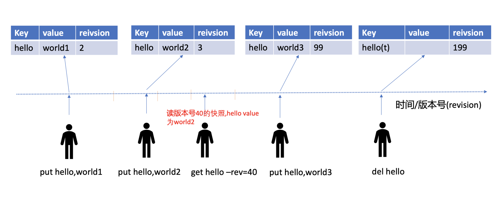
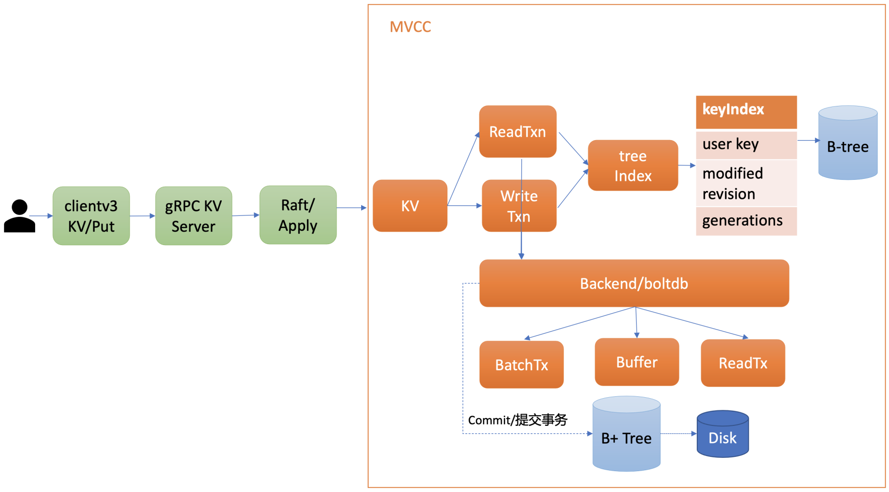
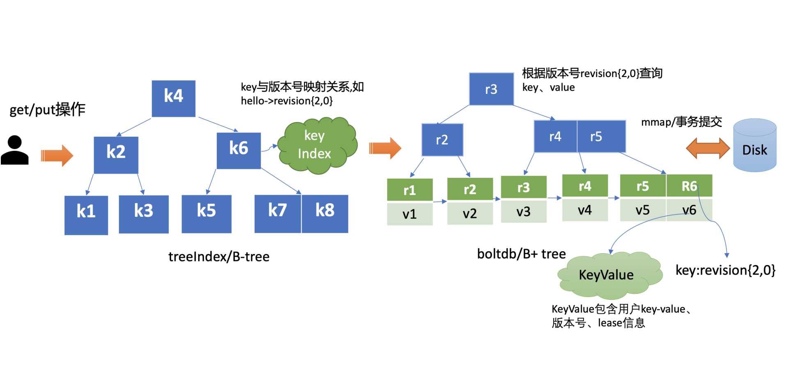
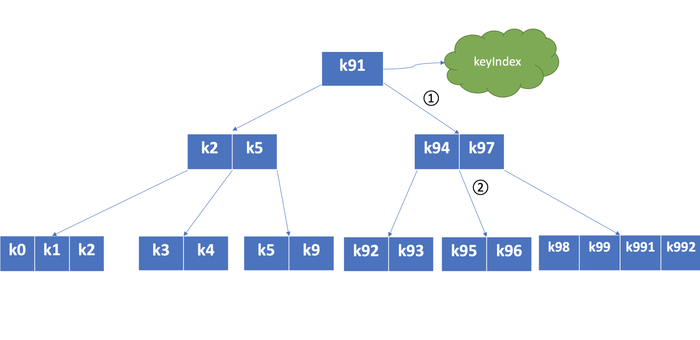
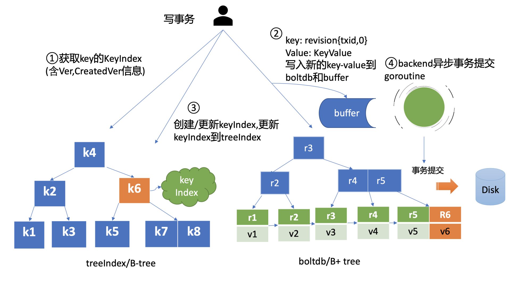
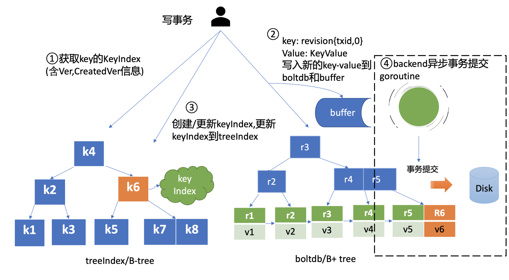
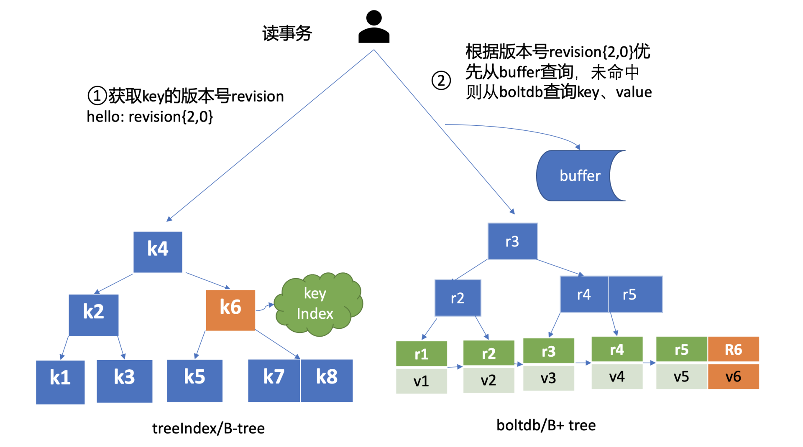

# 什么是 MVCC

首先和你聊聊什么是 MVCC，从名字上理解，它是一个基于多版本技术实现的一种并发控制机制。提到并发控制机制你可能就没那么陌生了，比如数据库中的悲观锁，也就是通过锁机制确保同一时刻只能有一个事务对数据进行修改操作，常见的实现方案有读写锁、互斥锁、两阶段锁等。

悲观锁是一种事先预防机制，它悲观地认为多个并发事务可能会发生冲突，因此它要求事务必须先获得锁，才能进行修改数据操作。但是悲观锁粒度过大、高并发场景下大量事务会阻塞等，会导致服务性能较差。

MVCC 机制正是基于多版本技术实现的一种乐观锁机制，它乐观地认为数据不会发生冲突，但是当事务提交时，具备检测数据是否冲突的能力。

在 MVCC 数据库中，你更新一个 key-value 数据的时候，它并不会直接覆盖原数据，而是新增一个版本来存储新的数据，每个数据都有一个版本号。版本号它是一个逻辑时间，为了方便你深入理解版本号意义，在下面我给你画了一个 etcd MVCC 版本号时间序列图。

从图中你可以看到，随着时间增长，你每次修改操作，版本号都会递增。每修改一次，生成一条新的数据记录。当你指定版本号读取数据时，它实际上访问的是版本号生成那个时间点的快照数据。当你删除数据的时候，它实际也是新增一条带删除标识的数据记录。




---

# 为什么选择 MVCC

etcd v2 是一个内存数据库，整个数据库拥有一个 `Stop-the-World` 的大锁，通过锁机制来解决并发带来的数据竞争。

但是存在并发性能问题：

-   锁的粒度不好控制，每次都会锁整个数据库
-   写锁和读锁相互阻塞。
-   前面的事务会阻塞后面的事务，对并发性能影响很大。

同时在高并发环境下还存在另一个严重的问题：

-   watch 机制可靠性问题：etcd 中的 watch 机制会依赖旧数据，v2 版本基于滑动窗口实现的 watch 机制，只能保留最近的 1000 条历史事件版本，当 etcd server 写请求较多、网络波动时等场景，很容易出现事件丢失问题，进而又触发 client 数据全量拉取，产生大量 expensive request，甚至导致 etcd 雪崩。

熟悉 Kubernetes 的朋友肯定知道，Kubernetes 使用 etcd 做存储，因此 etcd 的问题对 Kubernetes 有很直观的影响，具体如下：

-   etcd 并发性能问题导致 Kubernetes 集群规模受限。
-   watch 机制可靠性问题直接影响到 Kubernetes controller 的正常运行。

在 Kubernetes 中，各种各样的控制器实现了 Deployment、StatefulSet、Job 等功能强大的 Workload。控制器的核心思想是监听、比较资源实际状态与期望状态是否一致，若不一致则进行协调工作，使其最终一致。而这些特性的实现都严重依赖 etcd 的 watch 机制。

>   而 etcd 背后的公司 CoreOS 也是 Kubernetes 容器生态圈的核心成员之一，此时的 Kubernetes 和 Docker 公司还处于一个激烈的对抗之中，因此，此时的 etcd 迫切的需要解决以上的两个问题。

*那么 etcd v3 为什么要选择 MVCC 呢？*

解决并发问题的方法有很多，而**MVCC 在解决并发问题的同时，还能通多存储多版本数据来解决watch 机制可靠性问题**。因此 etcd v3 版本果断选择了基于 MVCC 来实现多版本并发控制。

于是 v3 则采用了 MVCC，以一种优雅的方式解决了锁带来的问题。

-   执行写操作或删除操作时不会再原数据上修改而是创建一个新版本。
-   这样并发的读取操作仍然可以读取老版本的数据，写操作也可以同时进行。

**这个模式的好处在于读操作不再阻塞，事实上根本就不需要锁。**

>   客户端读key的时候指定一个版本号，服务端保证返回比这个版本号更新的数据，但不保证返回最新的数据。

MVCC能最大化地实现高效地读写并发，尤其是高效地读，非常适合读多写少的场景。


---

# MVCC 特性初体验

如下面的命令所示，第一次 key hello 更新完后，我们通过 get 命令获取下它的 key-value 详细信息。正如你所看到的，除了 key、value 信息，还有各类版本号，这里我们重点关注 mod_revision，它表示 key 最后一次修改时的 etcd 版本号。

当我们再次更新 key hello 为 world2 后，然后通过查询时指定 key 第一次更新后的版本号，你会发现我们查询到了第一次更新的值，甚至我们执行删除 key hello 后，依然可以获得到这个值。

```bash
# 更新key hello为world1
$ etcdctl put hello world1
OK
# 通过指定输出模式为json,查看key hello更新后的详细信息
$ etcdctl get hello -w=json
{
    "kvs":[
        {
            "key":"aGVsbG8=",
            "create_revision":2,
            "mod_revision":2,
            "version":1,
            "value":"d29ybGQx"
        }
    ],
    "count":1
}
# 再次修改key hello为world2
$ etcdctl put hello world2
OK
# 确认修改成功,最新值为wolrd2
$ etcdctl get hello
hello
world2
# 指定查询版本号,获得了hello上一次修改的值
$ etcdctl get hello --rev=2
hello
world1
# 删除key hello
$ etcdctl del  hello
1
# 删除后指定查询版本号3,获得了hello删除前的值
$ etcdctl get hello --rev=3
hello
world2
```


---

# MVCC 实现

## 整体架构

在详细介绍 etcd 如何实现 MVCC 特性前，先从整体上介绍下 MVCC 模块。下图是 MVCC 模块的一个整体架构图，整个 MVCC 特性由 treeIndex、Backend/boltdb 组成。

当你执行 MVCC 特性初体验中的 put 命令后，请求经过 gRPC KV Server、Raft 模块流转，对应的日志条目被提交后，Apply 模块开始执行此日志内容。



Apply 模块通过 MVCC 模块来执行 put 请求，持久化 key-value 数据。MVCC 模块将请求请划分成两个类别，分别是读事务（ReadTxn）和写事务（WriteTxn）。读事务负责处理 range 请求，写事务负责 put/delete 操作。读写事务基于 treeIndex、Backend/boltdb 提供的能力，实现对 key-value 的增删改查功能。

treeIndex 模块基于内存版 B-tree 实现了 key 索引管理，它保存了用户 key 与版本号（revision）的映射关系等信息。

Backend 模块负责 etcd 的 key-value 持久化存储，主要由 ReadTx、BatchTx、Buffer 组成，ReadTx 定义了抽象的读事务接口，BatchTx 在 ReadTx 之上定义了抽象的写事务接口，Buffer 是数据缓存区。

etcd 设计上支持多种 Backend 实现，目前实现的 Backend 是 boltdb。boltdb 是一个基于 B+ tree 实现的、支持事务的 key-value 嵌入式数据库。

treeIndex 与 boltdb 关系可参考下图。当你发起一个 get hello 命令时，从 treeIndex 中获取 key 的版本号，然后再通过这个版本号，从 boltdb 获取 value 信息。boltdb 的 value 是包含用户 key-value、各种版本号、lease 信息的结构体。




## treeIndex 原理

为什么需要 treeIndex 模块呢?

对于 etcd v2 来说，当你通过 etcdctl 发起一个 put hello 操作时，etcd v2 直接更新内存树，这就导致历史版本直接被覆盖，无法支持保存 key 的历史版本。在 etcd v3 中引入 treeIndex 模块正是为了解决这个问题，支持保存 key 的历史版本，提供稳定的 Watch 机制和事务隔离等能力。

etcd 在每次修改 key 时会生成一个全局递增的版本号（revision），然后通过数据结构 B-tree 保存用户 key 与版本号之间的关系，再以版本号作为 boltdb key，以用户的 key-value 等信息作为 boltdb value，保存到 boltdb。

从 etcd 的功能特性上分析， 因 etcd 支持范围查询，因此保存索引的数据结构也必须支持范围查询才行。所以哈希表不适合，而 B-tree 支持范围查询。从性能上分析，平横二叉树每个节点只能容纳一个数据、导致树的高度较高，而 B-tree 每个节点可以容纳多个数据，树的高度更低，更扁平，涉及的查找次数更少，具有优越的增、删、改、查性能。Google 的开源项目 btree，使用 Go 语言实现了一个内存版的 B-tree，对外提供了简单易用的接口。etcd 正是基于 btree 库实现了一个名为 treeIndex 的索引模块，通过它来查询、保存用户 key 与版本号之间的关系。

下图是个最大度（degree > 1，简称 d）为 5 的 B-tree，度是 B-tree 中的一个核心参数，它决定了你每个节点上的数据量多少、节点的胖瘦程度。从图中你可以看到，节点越胖，意味着一个节点可以存储更多数据，树的高度越低。在一个度为 d 的 B-tree 中，节点保存的最大 key 数为 2d - 1，否则需要进行平衡、分裂操作。这里你要注意的是在 etcd treeIndex 模块中，创建的是最大度 32 的 B-tree，也就是一个叶子节点最多可以保存 63 个 key。



从图中你可以看到，你通过 put/txn 命令写入的一系列 key，treeIndex 模块基于 B-tree 将其组织起来，节点之间基于用户 key 比较大小。当你查找一个 key k95 时，通过 B-tree 的特性，你仅需通过图中流程 1 和 2 两次快速比较，就可快速找到 k95 所在的节点。

在 treeIndex 中，每个节点的 key 是一个 keyIndex 结构，etcd 就是通过它保存了用户的 key 与版本号的映射关系。那么 keyIndex 结构包含哪些信息呢？下面是字段说明：

```go
type keyIndex struct {
   key         []byte       //用户的key名称，比如我们案例中的"hello"
   modified    revision     //最后一次修改key时的etcd版本号,比如我们案例中的刚写入hello为world1时的，版本号为2
   generations []generation	//generation保存了一个key若干代版本号信息，每代中包含对key的多次修改的版本号列表
}
```

keyIndex 中包含用户的 key、最后一次修改 key 时的 etcd 版本号、key 的若干代（generation）版本号信息，每代中包含对 key 的多次修改的版本号列表。那我们要如何理解 generations？为什么它是个数组呢?

generations 表示一个 key 从创建到删除的过程，每代对应 key 的一个生命周期的开始与结束。当你第一次创建一个 key 时，会生成第 0 代，后续的修改操作都是在往第 0 代中追加修改版本号。当你把 key 删除后，它就会生成新的第 1 代，一个 key 不断经历创建、删除的过程，它就会生成多个代。

generation 结构详细信息如下：

```go
type generation struct {
   ver     int64      //表示此key的修改次数
   created revision   //表示generation结构创建时的版本号
   revs    []revision //每次修改key时的revision追加到此数组
}

```

generation 结构中包含此 key 的修改次数、generation 创建时的版本号、对此 key 的修改版本号记录列表。你需要注意的是版本号（revision）并不是一个简单的整数，而是一个结构体。revision 结构及含义如下：

```go
type revision struct {
   main int64    // 一个全局递增的主版本号，随put/txn/delete事务递增，一个事务内的key main版本号是一致的
   sub int64    // 一个事务内的子版本号，从0开始随事务内put/delete操作递增
}
```

revision 包含 main 和 sub 两个字段，main 是全局递增的版本号，它是个 etcd 逻辑时钟，随着 put/txn/delete 等事务递增。sub 是一个事务内的子版本号，从 0 开始随事务内的 put/delete 操作递增。

比如启动一个空集群，全局版本号默认为 1，执行下面的 txn 事务，它包含两次 put、一次 get 操作，那么按照我们上面介绍的原理，全局版本号随读写事务自增，因此是 main 为 2，sub 随事务内的 put/delete 操作递增，因此 key hello 的 revison 为 {2,0}，key world 的 revision 为 {2,1}。

```bash
$ etcdctl txn -i
compares:


success requests (get，put，del):
put hello 1
get hello
put world 2
```


## MVCC 更新 key

当你通过 etcdctl 发起一个 put hello 操作时，如下面的 put 事务流程图流程一所示，在 put 写事务中，首先它需要从 treeIndex 模块中查询 key 的 keyIndex 索引信息，keyIndex 中存储了 key 的创建版本号、修改的次数等信息，这些信息在事务中发挥着重要作用，因此会存储在 boltdb 的 value 中。因为是第一次创建 hello key，此时 keyIndex 索引为空。



其次 etcd 会根据当前的全局版本号（空集群启动时默认为 1）自增，生成 put hello 操作对应的版本号 revision {2,0}，这就是 boltdb 的 key。

boltdb 的 value 是 mvccpb.KeyValue 结构体，它是由用户 key、value、create_revision、mod_revision、version、lease 组成。它们的含义分别如下：

-   create_revision 表示此 key 创建时的版本号。在我们的案例中，key hello 是第一次创建，那么值就是 2。当你再次修改 key hello 的时候，写事务会从 treeIndex 模块查询 hello 第一次创建的版本号，也就是 keyIndex.generations[i].created 字段，赋值给 create_revision 字段；
-   mod_revision 表示 key 最后一次修改时的版本号，即 put 操作发生时的全局版本号加 1；
-   version 表示此 key 的修改次数。每次修改的时候，写事务会从 treeIndex 模块查询 hello 已经历过的修改次数，也就是 keyIndex.generations[i].ver 字段，将 ver 字段值加 1 后，赋值给 version 字段。

填充好 boltdb 的 KeyValue 结构体后，这时就可以通过 Backend 的写事务 batchTx 接口将 key{2,0},value 为 mvccpb.KeyValue 保存到 boltdb 的缓存中，并同步更新 buffer，如上图中的流程二所示。

此时存储到 boltdb 中的 key、value 数据如下：


然后 put 事务需将本次修改的版本号与用户 key 的映射关系保存到 treeIndex 模块中，也就是上图中的流程三。

因为 key hello 是首次创建，treeIndex 模块它会生成 key hello 对应的 keyIndex 对象，并填充相关数据结构。

key hello 的 keyIndex 填充后的结果如下所示：

```go
key:     "hello"
modified: <2,0>
generations:
[{ver:1,created:<2,0>,revisions: [<2,0>]} ]
```

我们来简易分析一下上面的结果。

key 为 hello，modified 为最后一次修改版本号 <2,0>，key hello 是首次创建的，因此新增一个 generation 代跟踪它的生命周期、修改记录；generation 的 ver 表示修改次数，首次创建为 1，后续随着修改操作递增；generation.created 表示创建 generation 时的版本号为 <2,0>；revision 数组保存对此 key 修改的版本号列表，每次修改都会将将相应的版本号追加到 revisions 数组中。

通过以上流程，一个 put 操作终于完成。

但是此时数据还并未持久化，为了提升 etcd 的写吞吐量、性能，一般情况下（默认堆积的写事务数大于 1 万才在写事务结束时同步持久化），数据持久化由 Backend 的异步 goroutine 完成，它通过事务批量提交，定时将 boltdb 页缓存中的脏数据提交到持久化存储磁盘中，也就是下图中的黑色虚线框住的流程四。




## MVCC 查询 key

完成 put hello 为 world1 操作后，这时你通过 etcdctl 发起一个 get hello 操作，MVCC 模块首先会创建一个读事务对象（TxnRead），在 etcd 3.4 中 Backend 实现了 ConcurrentReadTx， 也就是并发读特性。

并发读特性的核心原理是创建读事务对象时，它会全量拷贝当前写事务未提交的 buffer 数据，并发的读写事务不再阻塞在一个 buffer 资源锁上，实现了全并发读。



如上图所示，在读事务中，它首先需要根据 key 从 treeIndex 模块获取版本号，因我们未带版本号读，默认是读取最新的数据。treeIndex 模块从 B-tree 中，根据 key 查找到 keyIndex 对象后，匹配有效的 generation，返回 generation 的 revisions 数组中最后一个版本号 {2,0} 给读事务对象。

读事务对象根据此版本号为 key，通过 Backend 的并发读事务（ConcurrentReadTx）接口，优先从 buffer 中查询，命中则直接返回，否则从 boltdb 中查询此 key 的 value 信息。

那指定版本号读取历史记录又是怎么实现的呢？当你再次发起一个 put hello 为 world2 修改操作时，key hello 对应的 keyIndex 的结果如下面所示，keyIndex.modified 字段更新为 <3,0>，generation 的 revision 数组追加最新的版本号 <3,0>，ver 修改为 2。

```go
// key hello的keyIndex:
key:     "hello"
modified: <3,0>
generations:
[{ver:2,created:<2,0>,revisions: [<2,0>,<3,0>]}]
```

boltdb 插入一个新的 key revision{3,0}，此时存储到 boltdb 中的 key-value 数据如下：


这时你再发起一个指定历史版本号为 2 的读请求时，实际是读版本号为 2 的时间点的快照数据。treeIndex 模块会遍历 generation 内的历史版本号，返回小于等于 2 的最大历史版本号，在我们这个案例中，也就是 revision{2,0}，以它作为 boltdb 的 key，从 boltdb 中查询出 value 即可。


## MVCC 删除 key

etcd 实现的是延期删除模式，原理与 key 更新类似。

与更新 key 不一样之处在于，一方面，生成的 boltdb key 版本号{4,0,t}追加了删除标识（tombstone, 简写 t），boltdb value 变成只含用户 key 的 KeyValue 结构体。另一方面 treeIndex 模块也会给此 key hello 对应的 keyIndex 对象，追加一个空的 generation 对象，表示此索引对应的 key 被删除了。

当你再次查询 hello 的时候，treeIndex 模块根据 key hello 查找到 keyindex 对象后，若发现其存在空的 generation 对象，并且查询的版本号大于等于被删除时的版本号，则会返回空。

etcdctl hello 操作后的 keyIndex 的结果如下面所示：

```go
// key hello 的 keyIndex:
key:     "hello"
modified: <4,0>
generations:
[
{ver:3,created:<2,0>,revisions: [<2,0>,<3,0>,<4,0>(t)]}，             
{empty}
]
```

boltdb 此时会插入一个新的 key revision{4,0,t}，此时存储到 boltdb 中的 key-value 数据如下：


那么 key 打上删除标记后有哪些用途呢？什么时候会真正删除它呢？

一方面删除 key 时会生成 events，Watch 模块根据 key 的删除标识，会生成对应的 Delete 事件。另一方面，当你重启 etcd，遍历 boltdb 中的 key 构建 treeIndex 内存树时，你需要知道哪些 key 是已经被删除的，并为对应的 key 索引生成 tombstone 标识。而真正删除 treeIndex 中的索引对象、boltdb 中的 key 是通过压缩 (compactor) 组件异步完成。正因为 etcd 的删除 key 操作是基于以上延期删除原理实现的，因此只要压缩组件未回收历史版本，我们就能从 etcd 中找回误删的数据。

​	

