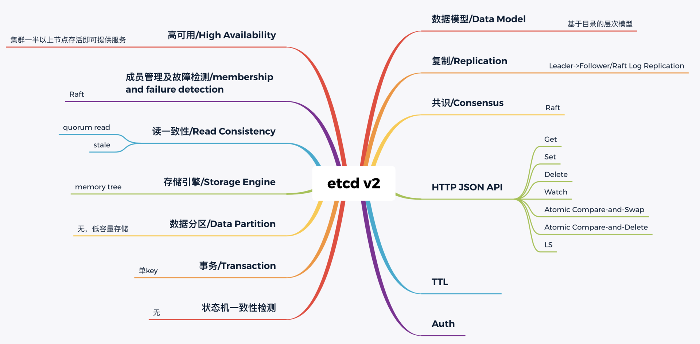
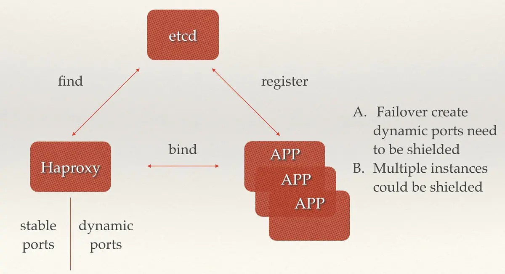

# 简介

etcd 是一个分布式、可靠 key-value 存储的分布式系统，它不仅仅用于存储，还提供共享配置及服务发现。

> A distributed, reliable key-value store for the most critical data of a distributed system


---

# etcd vs Zookeeper

- 一致性协议： etcd 使用 Raft 协议，Zookeeper 使用 ZAB（类PAXOS协议），前者容易理解，方便工程实现

- 运维方面：etcd 方便运维，Zookeeper 难以运维

- 数据存储：etcd 多版本并发控制（MVCC）数据模型 ， 支持查询先前版本的键值对

- 项目活跃度：etcd 社区与开发活跃

- API：etcd 提供 HTTP+JSON，gRPC 接口，跨平台跨语言，Zookeeper 需要使用其客户端

- 访问安全方面：etcd 支持 HTTPS 访问，Zookeeper 在这方面缺失


---

# 诞生背景

2013 年，有一个叫 CoreOS 的创业团队，他们构建了一个产品，Container Linux，它是一个开源、轻量级的操作系统，侧重自动化、快速部署应用服务，并要求应用程序都在容器中运行，同时提供集群化的管理方案，用户管理服务就像单机一样方便。

他们希望在重启任意一节点的时候，用户的服务不会因此而宕机，导致无法提供服务，因此需要运行多个副本。但是多个副本之间如何协调，如何避免变更的时候所有副本不可用呢？

为了解决这个问题，CoreOS 团队需要一个协调服务来存储服务配置信息、提供分布式锁等能力。

怎么办呢？当然是分析业务场景、痛点、核心目标，然后是基于目标进行方案选型，评估是选择社区开源方案还是自己造轮子。这其实就是我们遇到棘手问题时的通用解决思路，CoreOS 团队同样如此。一个协调服务，理想状态下大概需要满足以下五个目标：

- 可用性角度：高可用。协调服务作为集群的控制面存储，它保存了各个服务的部署、运行信息。若它故障，可能会导致集群无法变更、服务副本数无法协调。业务服务若此时出现故障，无法创建新的副本，可能会影响用户数据面。
- 数据一致性角度：提供读取“最新”数据的机制。既然协调服务必须具备高可用的目标，就必然不能存在单点故障（single point of failure），而多节点又引入了新的问题，即多个节点之间的数据一致性如何保障？比如一个集群 3 个节点 A、B、C，从节点 A、B 获取服务镜像版本是新的，但节点 C 因为磁盘 I/O 异常导致数据更新缓慢，若控制端通过 C 节点获取数据，那么可能会导致读取到过期数据，服务镜像无法及时更新。
- 容量角度：低容量、仅存储关键元数据配置。协调服务保存的仅仅是服务、节点的配置信息（属于控制面配置），而不是与用户相关的数据。所以存储上不需要考虑数据分片，无需过度设计。
- 功能：增删改查，监听数据变化的机制。协调服务保存了服务的状态信息，若服务有变更或异常，相比控制端定时去轮询检查一个个服务状态，若能快速推送变更事件给控制端，则可提升服务可用性、减少协调服务不必要的性能开销。
- 运维复杂度：可维护性。在分布式系统中往往会遇到硬件 Bug、软件 Bug、人为操作错误导致节点宕机，以及新增、替换节点等运维场景，都需要对协调服务成员进行变更。若能提供 API 实现平滑地变更成员节点信息，就可以大大降低运维复杂度，减少运维成本，同时可避免因人工变更不规范可能导致的服务异常。

了解完理想中的解决方案目标，我们再来看 CoreOS 团队当时为什么选择了从 0 到 1 开发一个新的协调服务呢？

如果使用开源软件，当时其实是有 ZooKeeper 的，但是他们为什么不用 ZooKeeper 呢？从高可用性、数据一致性、功能这三个角度来说，ZooKeeper 是满足 CoreOS 诉求的。

然而当时的 ZooKeeper 不支持通过 API 安全地变更成员，需要人工修改一个个节点的配置，并重启进程。若变更姿势不正确，则有可能出现脑裂等严重故障。适配云环境、可平滑调整集群规模、在线变更运行时配置是 CoreOS 的期望目标，而 ZooKeeper 在这块的可维护成本相对较高。

其次 ZooKeeper 是用 Java 编写的，部署较繁琐，占用较多的内存资源，同时 ZooKeeper RPC 的序列化机制用的是 Jute，自己实现的 RPC API。无法使用 curl 之类的常用工具与之互动，CoreOS 期望使用比较简单的 HTTP + JSON。

因此，CoreOS 决定自己造轮子。


## etcd v1 和 v2 诞生

首先我们来看服务高可用及数据一致性。前面我们提到单副本存在单点故障，而多副本又引入数据一致性问题。

因此为了解决数据一致性问题，需要引入一个共识算法，确保各节点数据一致性，并可容忍一定节点故障。

常见的共识算法有 Paxos、ZAB、Raft 等。

CoreOS 团队选择了易理解实现的 Raft 算法，它将复杂的一致性问题分解成 Leader 选举、日志同步、安全性三个相对独立的子问题，只要集群一半以上节点存活就可提供服务，具备良好的可用性。

其次我们再来看数据模型（Data Model）和 API。数据模型参考了 ZooKeeper，使用的是基于目录的层次模式。API 相比 ZooKeeper 来说，使用了简单、易用的 REST API，提供了常用的 Get/Set/Delete/Watch 等 API，实现对 key-value 数据的查询、更新、删除、监听等操作。

key-value 存储引擎上，ZooKeeper 使用的是 Concurrent HashMap，而 etcd 使用的是则是简单内存树，它的节点数据结构精简后如下，含节点路径、值、孩子节点信息。这是一个典型的低容量设计，数据全放在内存，无需考虑数据分片，只能保存 key 的最新版本，简单易实现。


```go
type node struct {
   Path string  //节点路径
   Parent *node //关联父亲节点
   Value      string     //key的value值
   ExpireTime time.Time //过期时间
   Children   map[string]*node //此节点的孩子节点
}
```

最后我们再来看可维护性。Raft 算法提供了成员变更算法，可基于此实现成员在线、安全变更，同时此协调服务使用 Go 语言编写，无依赖，部署简单。


基于以上技术方案和架构图，CoreOS 团队在 2013 年 8 月对外发布了第一个测试版本 v0.1，API v1 版本，命名为 etcd。

那么 etcd 这个名字是怎么来的呢？其实它源于两个方面，unix 的“/etc”文件夹和分布式系统 (“D”istribute system) 的 D，组合在一起表示 etcd 是用于存储分布式配置的信息存储服务。

v0.1 版本实现了简单的 HTTP Get/Set/Delete/Watch API，但读数据一致性无法保证。v0.2 版本，支持通过指定 consistent 模式，从 Leader 读取数据，并将 Test And Set 机制修正为 CAS(Compare And Swap)，解决原子更新的问题，同时发布了新的 API 版本 v2，这就是大家熟悉的 etcd v2 版本，第一个非 stable 版本。

下面的时间轴图总结一下 etcd v1/v2 关键特性。


## 为什么 Kubernetes 使用 etcd?

这张图里特别标注出了 Kubernetes 的发布时间点，这个非常关键。我们必须先来说说这个事儿，也就是 Kubernetes 和 etcd 的故事。

2014 年 6 月，Google 的 Kubernetes 项目诞生了，我们前面所讨论到 Go 语言编写、etcd 高可用、Watch 机制、CAS、TTL 等特性正是 Kubernetes 所需要的，它早期的 0.4 版本，使用的正是 etcd v0.2 版本。

Kubernetes 是如何使用 etcd v2 这些特性的呢？举几个简单小例子。

当你使用 Kubernetes 声明式 API 部署服务的时候，Kubernetes 的控制器通过 etcd Watch 机制，会实时监听资源变化事件，对比实际状态与期望状态是否一致，并采取协调动作使其一致。Kubernetes 更新数据的时候，通过 CAS 机制保证并发场景下的原子更新，并通过对 key 设置 TTL 来存储 Event 事件，提升 Kubernetes 集群的可观测性，基于 TTL 特性，Event 事件 key 到期后可自动删除。

Kubernetes 项目使用 etcd，除了技术因素也与当时的商业竞争有关。CoreOS 是 Kubernetes 容器生态圈的核心成员之一。

当时 Docker 容器浪潮正席卷整个开源技术社区，CoreOS 也将容器集成到自家产品中。一开始与 Docker 公司还是合作伙伴，然而 Docker 公司不断强化 Docker 的 PaaS 平台能力，强势控制 Docker 社区，这与 CoreOS 核心商业战略出现了冲突，也损害了 Google、RedHat 等厂商的利益。

最终 CoreOS 与 Docker 分道扬镳，并推出了 rkt 项目来对抗 Docker，然而此时 Docker 已深入人心，CoreOS 被 Docker 全面压制。

以 Google、RedHat 为首的阵营，基于 Google 多年的大规模容器管理系统 Borg 经验，结合社区的建议和实践，构建以 Kubernetes 为核心的容器生态圈。相比 Docker 的垄断、独裁，Kubernetes 社区推行的是民主、开放原则，Kubernetes 每一层都可以通过插件化扩展，在 Google、RedHat 的带领下不断发展壮大，etcd 也进入了快速发展期。

在 2015 年 1 月，CoreOS 发布了 etcd 第一个稳定版本 2.0，支持了 quorum read，提供了严格的线性一致性读能力。7 月，基于 etcd 2.0 的 Kubernetes 第一个生产环境可用版本 v1.0.1 发布了，Kubernetes 开始了新的里程碑的发展。

etcd v2 在社区获得了广泛关注，GitHub star 数在 2015 年 6 月就高达 6000+，超过 500 个项目使用，被广泛应用于配置存储、服务发现、主备选举等场景。

下图从构建分布式系统的核心要素角度总结了 etcd v2 核心技术点。无论是 NoSQL 存储还是 SQL 存储、文档存储，其实大家要解决的问题都是类似的，基本就是图中总结的数据模型、复制、共识算法、API、事务、一致性、成员故障检测等方面。




## etcd v3 诞生

然而随着 Kubernetes 项目不断发展，v2 版本的瓶颈和缺陷逐渐暴露，遇到了若干性能和稳定性问题，Kubernetes 社区呼吁支持新的存储、批评 etcd 不可靠的声音开始不断出现。具体有哪些问题呢？


下面分别从功能局限性、Watch 事件的可靠性、性能、内存开销来分别给你剖析 etcd v2 的问题。

首先是**功能局限性**问题。它主要是指 etcd v2 不支持范围和分页查询、不支持多 key 事务。

第一，etcd v2 不支持范围查询和分页。分页对于数据较多的场景是必不可少的。在 Kubernetes 中，在集群规模增大后，Pod、Event 等资源可能会出现数千个以上，但是 etcd v2 不支持分页，不支持范围查询，大包等 expensive request 会导致严重的性能乃至雪崩问题。

第二，etcd v2 不支持多 key 事务。在实际转账等业务场景中，往往我们需要在一个事务中同时更新多个 key。

然后是 **Watch 机制可靠性**问题。Kubernetes 项目严重依赖 etcd Watch 机制，然而 etcd v2 是内存型、不支持保存 key 历史版本的数据库，只在内存中使用滑动窗口保存了最近的 1000 条变更事件，当 etcd server 写请求较多、网络波动时等场景，很容易出现事件丢失问题，进而又触发 client 数据全量拉取，产生大量 expensive request，甚至导致 etcd 雪崩。

其次是**性能瓶颈**问题。etcd v2 早期使用了简单、易调试的 HTTP/1.x API，但是随着 Kubernetes 支撑的集群规模越来越大，HTTP/1.x 协议的瓶颈逐渐暴露出来。比如集群规模大时，由于 HTTP/1.x 协议没有压缩机制，批量拉取较多 Pod 时容易导致 APIServer 和 etcd 出现 CPU 高负载、OOM、丢包等问题。

另一方面，etcd v2 client 会通过 HTTP 长连接轮询 Watch 事件，当 watcher 较多的时候，因 HTTP/1.x 不支持多路复用，会创建大量的连接，消耗 server 端过多的 socket 和内存资源。

同时 etcd v2 支持为每个 key 设置 TTL 过期时间，client 为了防止 key 的 TTL 过期后被删除，需要周期性刷新 key 的 TTL。

实际业务中很有可能若干 key 拥有相同的 TTL，可是在 etcd v2 中，即使大量 key TTL 一样，你也需要分别为每个 key 发起续期操作，当 key 较多的时候，这会显著增加集群负载、导致集群性能显著下降。

最后是**内存开销问题**。etcd v2 在内存维护了一颗树来保存所有节点 key 及 value。在数据量场景略大的场景，如配置项较多、存储了大量 Kubernetes Events， 它会导致较大的内存开销，同时 etcd 需要定时把全量内存树持久化到磁盘。这会消耗大量的 CPU 和磁盘 I/O 资源，对系统的稳定性造成一定影响。

为什么 etcd v2 有以上若干问题，Consul 等其他竞品依然没有被 Kubernetes 支持呢？

一方面当时包括 Consul 在内，没有一个开源项目是十全十美完全满足 Kubernetes 需求。而 CoreOS 团队一直在聆听社区的声音并积极改进，解决社区的痛点。用户吐槽 etcd 不稳定，他们就设计实现自动化的测试方案，模拟、注入各类故障场景，及时发现修复 Bug，以提升 etcd 稳定性。

另一方面，用户吐槽性能问题，针对 etcd v2 各种先天性缺陷问题，他们从 2015 年就开始设计、实现新一代 etcd v3 方案去解决以上痛点，并积极参与 Kubernetes 项目，负责 etcd v2 到 v3 的存储引擎切换，推动 Kubernetes 项目的前进。同时，设计开发通用压测工具、输出 Consul、ZooKeeper、etcd 性能测试报告，证明 etcd 的优越性。

etcd v3 就是为了解决以上稳定性、扩展性、性能问题而诞生的。

在内存开销、Watch 事件可靠性、功能局限上，它通过引入 B-tree、boltdb 实现一个 MVCC 数据库，数据模型从层次型目录结构改成扁平的 key-value，提供稳定可靠的事件通知，实现了事务，支持多 key 原子更新，同时基于 boltdb 的持久化存储，显著降低了 etcd 的内存占用、避免了 etcd v2 定期生成快照时的昂贵的资源开销。

性能上，首先 etcd v3 使用了 gRPC API，使用 protobuf 定义消息，消息编解码性能相比 JSON 超过 2 倍以上，并通过 HTTP/2.0 多路复用机制，减少了大量 watcher 等场景下的连接数。

其次使用 Lease 优化 TTL 机制，每个 Lease 具有一个 TTL，相同的 TTL 的 key 关联一个 Lease，Lease 过期的时候自动删除相关联的所有 key，不再需要为每个 key 单独续期。

最后是 etcd v3 支持范围、分页查询，可避免大包等 expensive request。

2016 年 6 月，etcd 3.0 诞生，随后 Kubernetes 1.6 发布，默认启用 etcd v3，助力 Kubernetes 支撑 5000 节点集群规模。

下面的时间轴图总结了 etcd3 重要特性及版本发布时间。从图中你可以看出，从 3.0 到未来的 3.5，更稳、更快是 etcd 的追求目标。


从 2013 年发布第一个版本 v0.1 到今天的 3.5.0-pre，从 v2 到 v3，etcd 走过了 7 年的历程，etcd 的稳定性、扩展性、性能不断提升。

发展到今天，在 GitHub 上 star 数超过 34K。在 Kubernetes 的业务场景磨炼下它不断成长，走向稳定和成熟，成为技术圈众所周知的开源产品，而 v3 方案的发布，也标志着 etcd 进入了技术成熟期，成为云原生时代的首选元数据存储产品。

 

---

# etcd概念词汇表

- Raft：etcd 所采用的保证分布式系统强一致性的算法。
- Node：一个 Raft 状态机实例。
- Member： 一个 etcd 实例。它管理着一个 Node，并且可以为客户端请求提供服务。
- Cluster：由多个 Member 构成可以协同工作的etcd集群。
- Peer：对同一个 etcd 集群中另外一个 Member 的称呼。
- Client： 向 etcd 集群发送 HTTP 请求的客户端。
- WAL：预写式日志，etcd 用于持久化存储的日志格式。
- snapshot：etcd 防止 WAL 文件过多而设置的快照，存储 etcd 数据状态。
- Proxy：etcd 的一种模式，为 etcd 集群提供反向代理服务。
- Leader：Raft 算法中通过竞选而产生的处理所有数据提交的节点。
- Follower：竞选失败的节点作为 Raft 中的从属节点，为算法提供强一致性保证。
- Candidate：当 Follower 超过一定时间接收不到 Leader 的心跳时转变为 Candidate 开始竞选。
- Term：某个节点成为 Leader 到下一次竞选时间，称为一个 Term。
- Index：数据项编号。Raft 中通过 Term 和 Index 来定位数据。


---

# etcd安装

## 环境准备

操作系统：Centos7.6

| 节点  |      ip       |
| :---: | :-----------: |
| node1 | 192.168.3.159 |
| node2 | 192.168.3.196 |
| node3 | 192.168.3.227 |


## [安装](https://etcd.io/docs/v3.4/install/)

### 方法1（Install pre-built binaries）

```shell
# 解压后将命令行拷贝到系统路径
tar xvzf etcd-v3.4.16-linux-amd64.tar.gz
cd etcd-v3.4.16-linux-amd64
cp etcd /usr/local/bin
cp etcdctl /usr/local/bin
```


### 方法2（源码安装）

#### 安装GO环境

```shell
# 下载安装包后解压
tar -C /usr/local -xvzf go1.16.4.linux-amd64.tar.gz

# 设置环境变量
mkdir -p /var/lib/go
vi /etc/profile
# 将以下内容添加到/etc/profile文件末尾
export GOROOT=/usr/local/go
export GOPATH=/var/lib/go
export PATH=$PATH:$GOROOT/bin:$GOPATH/bin
export GOPROXY=https://goproxy.io,direct
export GO111MODULE=on

# 使环境变量生效，检查是否安装成功
source /etc/profile
go version
```


#### 编译安装

```shell
# git上下载源码后编译安装
chmod +x build
go mod tidy
./build
cp ./bin/etcd /usr/local/bin
cp ./bin/etcdctl /usr/local/bin
```


#### 关闭防火墙

```shell
# 关闭防火墙
systemctl stop firewalld.service
systemctl disable firewalld.service
# 关闭seliunx
setenforce 0
vi /etc/selinux/config
# 修改SELINUX的值为disabled
# SELINUX= can take one of these three values:
#     enforcing - SELinux security policy is enforced.
#     permissive - SELinux prints warnings instead of enforcing.
#     disabled - No SELinux policy is loaded.
SELINUX=disabled
```


## 关键参数介绍

| 参数                          | 含义                                                         |
| ----------------------------- | ------------------------------------------------------------ |
| --name                        | etcd 节点名字                                                |
| --initial-cluster             | etcd 启动的时候，通过这个配置找到其他 ectd 节点的地址列表，<br>格式：`节点名字1=http://节点ip1:2380,节点名字1=http://节点ip1:2380,.....`<br>指定的URL就是集群各节点所谓的 advertise peer urls，需要与 `--initial-advertise-peer-urls` 配置值匹配 |
| --initial-cluster-state       | 初始化的时候，集群的状态 "new" 或者 "existing"两种状态，new 代表新建的集群，existing 表示加入已经存在的集群。 |
| --listen-client-urls          | 监听客户端请求的地址列表，格式：'`http://ip:2379`', 多个用逗号分隔。 |
| --advertise-client-urls       | 如果配置了 `--listen-client-urls`，多个监听客户端请求的地址，这个参数可以给出建议客户端使用什么地址访问 etcd。 |
| --listen-peer-urls            | 服务端节点之间通讯的监听地址，格式：'`http://ip:2380`'       |
| --initial-advertise-peer-urls | 建议服务端节点监听的地址                                     |

如果在测试过程中频繁地使用相同的配置创建或销毁一个集群，为了避免不同集群的etcd节点进行交互，导致信息紊乱，强烈建议为每个集群赋予一个独一无二的 token，通过 --initial-cluster-token 参数传入


## 静态启动

使用 node1/2/3 三个节点创建集群

```shell
etcd --name node1 --initial-cluster node1=http://192.168.3.159:2380,node2=http://192.168.3.196:2380,node3=http://192.168.3.227:2380 \
--initial-cluster-state new \
--listen-client-urls http://192.168.3.159:2379,http://127.0.0.1:2379 \
--advertise-client-urls http://192.168.3.159:2379 \
--listen-peer-urls http://192.168.3.159:2380 \
--initial-advertise-peer-urls http://192.168.3.159:2380
```

```shell
etcd --name node2 --initial-cluster node1=http://192.168.3.159:2380,node2=http://192.168.3.196:2380,node3=http://192.168.3.227:2380 \
--initial-cluster-state new \
--listen-client-urls http://192.168.3.196:2379,http://127.0.0.1:2379 \
--advertise-client-urls http://192.168.3.196:2379 \
--listen-peer-urls http://192.168.3.196:2380 \
--initial-advertise-peer-urls http://192.168.3.196:2380
```

```shell
etcd --name node3 --initial-cluster node1=http://192.168.3.159:2380,node2=http://192.168.3.196:2380,node3=http://192.168.3.227:2380 \
--initial-cluster-state new \
--listen-client-urls http://192.168.3.227:2379,http://127.0.0.1:2379 \
--advertise-client-urls http://192.168.3.227:2379 \
--listen-peer-urls http://192.168.3.227:2380 \
--initial-advertise-peer-urls http://192.168.3.227:2380
```


启动成功如下：


## etcd网关

```bash
etcd gateway start --listen-addr 127.0.0.1:2379 --retry-delay 1s --endpoints=192.168.3.159:2379,192.168.3.196:2379,192.68.3.227:2379
```


---

# 主要命令

## 写入，读取，删除

```shell
# 写入
etcdctl put /message Hello

# 读取
etcdctl get /message

# 删除
ectdctl del /message

# 示例
[root@etcd-1 opt]# etcdctl put /message hello
OK
[root@etcd-1 opt]# etcdctl get /message
/message
hello
[root@etcd-1 opt]# etcdctl --endpoints=http://192.168.3.227:2379 get /message
/message
hello
[root@etcd-1 opt]# etcdctl del /message
1
[root@etcd-1 opt]# etcdctl get /message
```


## 筛选数据

```shell
# 只获取value
[root@etcd-1 opt]# etcdctl get /message --print-value-only
hello

# 前缀筛选
[root@etcd-1 opt]# etcdctl get --prefix /message
/message
hello
/message/1
1
/message/2
2
/message/3
3
/message/4
4

# 数量筛选
[root@etcd-1 opt]# etcdctl get --prefix --limit=2 /message
/message
hello
/message/1
1

# 范围筛选
[root@etcd-1 opt]# etcdctl get /message/2 /message/4
/message/2
2
/message/3
3

```


## 读取老版本key

etcd 后端存储每次修改都会增加 etcd 集群全局的版本号，可以通过版本号来读取对应的 key

revision=1 是 etcd 的保留版本号，因此 key 版本号从 2 开始

```shell
[root@etcd-1 opt]# etcdctl get --rev=1 /message
# 添加
[root@etcd-1 opt]# etcdctl get --rev=2 /message
/message
hello
# 删除
[root@etcd-1 opt]# etcdctl get --rev=3 /message
# 添加
[root@etcd-1 opt]# etcdctl get --rev=4 /message
/message
hello
[root@etcd-1 opt]# etcdctl get --rev=5 /message
/message
hello
[root@etcd-1 opt]# etcdctl get --rev=6 /message
/message
hello
[root@etcd-1 opt]# etcdctl get --rev=7 /message
/message
hello
[root@etcd-1 opt]# etcdctl get --rev=8 /message
/message
hello
[root@etcd-1 opt]# etcdctl get --rev=9 /message
/message
hello
# 修改
[root@etcd-1 opt]# etcdctl get --rev=10 /message
/message
test
# 修改
[root@etcd-1 opt]# etcdctl get --rev=11 /message
/message
test1

```


## watch

```shell
# 在一个终端开启监听
[root@etcd-1 opt]# etcdctl watch --prefix /message
# 该终端会进入等待返回状态

# 在另一个终端改变它的值
[root@etcd-2 ~]# etcdctl put /message watch1
OK
[root@etcd-2 ~]# etcdctl put /message/1 watch2
OK


# 返回第一个终端观察变化
[root@etcd-1 opt]# etcdctl watch --prefix /message
PUT
/message
watch1
PUT
/message/1
watch2

```

如果监听程序挂起的时候 key 值变化了，那就会错过这个变化，所以支持指定版本号，可以获取从该版本号的所有变化

```shell
[root@etcd-1 opt]# etcdctl watch --rev=2 /message
PUT
/message
hello
DELETE
/message

PUT
/message
hello
PUT
/message
test
PUT
/message
test1
PUT
/message
watch1

```


## 租约

租约（lease），etcd 支持申请定时器，比如：申请一个 TTL=10s 的租约，会返回一个 lease ID 的标识定时器。可以在 put 一个 key 的同时携带 lease ID，那么就实现了一个自动过期的 key。在 etcd 中，一个 lease 可以关联给任意多的 key，当 lease 过期后所有关联的 key 都将被自动删除。

```shell
# 生成
[root@etcd-1 opt]# etcdctl lease grant 60
lease 441a79cb64d6cc46 granted with TTL(60s)

# 关联租约到key
[root@etcd-1 opt]# etcdctl put /message 1 --lease=441a79cb64d6cc46
OK

# 去别的终端观察
[root@etcd-2 ~]# etcdctl watch /message
PUT
/message
1
DELETE
/message

# 查看租约信息
[root@etcd-1 opt]# etcdctl lease timetolive --keys 441a79cb64d6cc46
lease 441a79cb64d6cc46 granted with TTL(60s), remaining(28s), attached keys([/message])

# 客户端通过刷新TTL来维持租约，使他不过期
etcdctl keep-alive 441a79cb64d6cc46

# 撤销租约，会删除绑定在它上面所有的key
etcdctl lease revoke 441a79cb64d6cc46
```


---

# etcd应用场景

接下来将针对剖析一些 etcd 的经典使用场景，来看看 etcd 这个基于 Raft 强一致性算法的分布式存储仓库能给我们带来哪些帮助。

值得注意的是，分布式系统中的数据分为控制数据和应用数据。使用 etcd 的场景默认处理的数据都是控制数据，对于应用数据，只推荐数据量很小，但是更新访问频繁的情况。


## 场景一：服务发现（Service Discovery）

在分布式系统中“服务发现”也是比较常见的问题：在同一个集群环境中不同的应用或服务，如何能够找到对方并建立连接，来完成后续的行为。本质上来说，服务发现就是想要知道集群中是否有进程在监听udp或tcp端口，并能通过名字就可以查找和连接。

而要解决服务发现的问题，需要满足如下三个方面，缺一不可：

1. 一个强一致性、高可用的服务存储目录： 基于 Raft 算法的 etcd 天生就是这样一个强一致性高可用的服务存储目录【安全的记录集群中的应用或服务的信息(地址、端口等)】。
2. 一种注册服务和监控服务健康状态的机制：用户可以在 etcd 中注册服务，并且对注册的服务设置租约，定时保持服务的心跳以达到监控健康状态的效果。【能够完成新的应用或服务的注册添加进来，同样也能对现有的服务是否可用进行监控】
3. 一种查找和连接服务的机制： 通过在 etcd 指定的主题下注册的服务也能在对应的主题下查找到。为了确保连接，我们可以在每个服务机器上都部署一个 Proxy 模式的 etcd（v3 版本不支持 proxy，可以使用 etcd 网关），这样就可以确保能访问 etcd 集群的服务都能互相连接。【已有的服务当被使用能够被找到并能连接】


来看服务发现对应的具体场景：

- 微服务协同工作架构中，服务动态添加。随着 Docker 容器的流行，多种微服务共同协作，构成一个相对功能强大的架构的案例越来越多。透明化的动态添加这些服务的需求也日益强烈。通过服务发现机制，在 etcd 中注册某个服务名字的目录，在该目录下存储可用的服务节点的 IP。在使用服务的过程中，只要从服务目录下查找可用的服务节点去使用即可。


- PaaS 平台中应用多实例与实例故障重启透明化。PaaS 平台中的应用一般都有多个实例，通过域名，不仅可以透明的对这多个实例进行访问，而且还可以做到负载均衡。但是应用的某个实例随时都有可能故障重启，这时就需要动态的配置域名解析（路由）中的信息。通过 etcd 的服务发现功能就可以轻松解决这个动态配置的问题。




## 场景二：消息发布与订阅

在分布式系统中，最适用的一种组件间通信方式就是消息发布与订阅。

即构建一个配置共享中心，数据提供者在这个配置中心发布消息，而消息使用者则订阅他们关心的主题，一旦主题有消息发布，就会实时通知订阅者。通过这种方式可以做到分布式系统配置的集中式管理与动态更新。

- 应用中用到的一些配置信息放到 etcd 上进行集中管理。这类场景的使用方式通常是这样：应用在启动的时候主动从 etcd 获取一次配置信息，同时，在 etcd 节点上注册一个 Watcher 并等待，以后每次配置有更新的时候，etcd 都会实时通知订阅者，以此达到获取最新配置信息的目的。
- 分布式搜索服务中，索引的元信息和服务器集群机器的节点状态存放在 etcd 中，供各个客户端订阅使用。
- 分布式日志收集系统。这个系统的核心工作是收集分布在不同机器的日志。收集器通常是按照应用（或主题）来分配收集任务单元，因此可以在 etcd 上创建一个以应用（主题）命名的目录 P，并将这个应用（主题相关）的所有机器 ip，以子目录的形式存储到目录 P 上，然后设置一个 etcd 递归的 Watcher，递归式的监控应用（主题）目录下所有信息的变动。这样就实现了机器 IP（消息）变动的时候，能够实时通知到收集器调整任务分配。
- 系统中信息需要动态自动获取与人工干预修改信息请求内容的情况。通常是暴露出接口，例如 JMX 接口，来获取一些运行时的信息。引入 etcd 之后，就不用自己实现一套方案了，只要将这些信息存放到指定的 etcd 目录中即可，etcd 的这些目录就可以通过 HTTP 的接口在外部访问。


## 场景三：负载均衡

在场景一中也提到了负载均衡，本文所指的负载均衡均为软负载均衡。分布式系统中，为了保证服务的高可用以及数据的一致性，通常都会把数据和服务部署多份，以此达到对等服务，即使其中的某一个服务失效了，也不影响使用。由此带来的坏处是数据写入性能下降，而好处则是数据访问时的负载均衡。因为每个对等服务节点上都存有完整的数据，所以用户的访问流量就可以分流到不同的机器上。

- etcd 本身分布式架构存储的信息访问支持负载均衡。etcd 集群化以后，每个 etcd 的核心节点都可以处理用户的请求。所以，把数据量小但是访问频繁的消息数据直接存储到 etcd 中也是个不错的选择。
- 利用 etcd 维护一个负载均衡节点表。etcd 可以监控一个集群中多个节点的状态，当有一个请求发过来后，可以轮询式的把请求转发给存活着的多个状态。类似 KafkaMQ，通过 ZooKeeper 来维护生产者和消费者的负载均衡。同样也可以用 etcd 来做 ZooKeeper 的工作。


## 场景四：分布式通知与协调

这里说到的分布式通知与协调，与消息发布和订阅有些相似。都用到了 etcd 中的 Watcher 机制，通过注册与异步通知机制，实现分布式环境下不同系统之间的通知与协调，从而对数据变更做到实时处理。实现方式通常是这样：不同系统都在 etcd 上对同一个目录进行注册，同时设置 Watcher 观测该目录的变化（如果对子目录的变化也有需要，可以设置递归模式），当某个系统更新了 etcd 的目录，那么设置了 Watcher 的系统就会收到通知，并作出相应处理。

- 通过 etcd 进行低耦合的心跳检测。检测系统和被检测系统通过 etcd 上某个目录关联而非直接关联起来，这样可以大大减少系统的耦合性。
- 通过 etcd 完成系统调度。某系统有控制台和推送系统两部分组成，控制台的职责是控制推送系统进行相应的推送工作。管理人员在控制台作的一些操作，实际上是修改了 etcd 上某些目录节点的状态，而 etcd 就把这些变化通知给注册了 Watcher 的推送系统客户端，推送系统再作出相应的推送任务。
- 通过 etcd 完成工作汇报。大部分类似的任务分发系统，子任务启动后，到 etcd 来注册一个临时工作目录，并且定时将自己的进度进行汇报（将进度写入到这个临时目录），这样任务管理者就能够实时知道任务进度。


## 场景五：分布式锁

因为 etcd 使用 Raft 算法保持了数据的强一致性，某次操作存储到集群中的值必然是全局一致的，所以很容易实现分布式锁。锁服务有两种使用方式，一是保持独占，二是控制时序。

- 保持独占即所有获取锁的用户最终只有一个可以得到。
- 控制时序，即所有想要获得锁的用户都会被安排执行，但是获得锁的顺序也是全局唯一的，同时决定了执行顺序。


## 场景六：分布式队列

分布式队列的常规用法与场景五中所描述的分布式锁的控制时序用法类似，即创建一个先进先出的队列，保证顺序。

另一种比较有意思的实现是在保证队列达到某个条件时再统一按顺序执行。这种方法的实现可以在 /queue 这个目录中另外建立一个 /queue/condition 节点。

- condition 可以表示队列大小。比如一个大的任务需要很多小任务就绪的情况下才能执行，每次有一个小任务就绪，就给这个 condition 数字加1，直到达到大任务规定的数字，再开始执行队列里的一系列小任务，最终执行大任务。
- condition 可以表示某个任务在不在队列。这个任务可以是所有排序任务的首个执行程序，也可以是拓扑结构中没有依赖的点。通常，必须执行这些任务后才能执行队列中的其他任务。
- condition 还可以表示其它的一类开始执行任务的通知。可以由控制程序指定，当 condition 出现变化时，开始执行队列任务。


## 场景七：集群监控与Leader竞选

通过etcd来进行监控实现起来非常简单并且实时性强。

1. 前面几个场景已经提到 Watcher 机制，当某个节点消失或有变动时，Watcher 会第一时间发现并告知用户。
2. 节点可以设置租约，比如每隔 30s 发送一次心跳使代表该机器存活的节点继续存在，否则节点消失。

这样就可以第一时间检测到各节点的健康状态，以完成集群的监控要求。

另外，使用分布式锁，可以完成 Leader 竞选。这种场景通常是一些长时间 CPU 计算或者使用 IO 操作的机器，只需要竞选出的 Leader 计算或处理一次，就可以把结果复制给其他的 Follower。从而避免重复劳动，节省计算资源。

这个的经典场景是搜索系统中建立全量索引。如果每个机器都进行一遍索引的建立，不但耗时而且建立索引的一致性不能保证。通过在 etcd 选举 Leader 进行索引计算，然后把计算结果分发到其它节点。


​	


  


