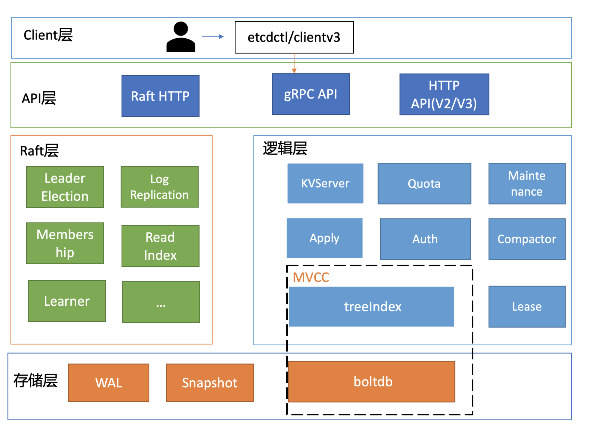
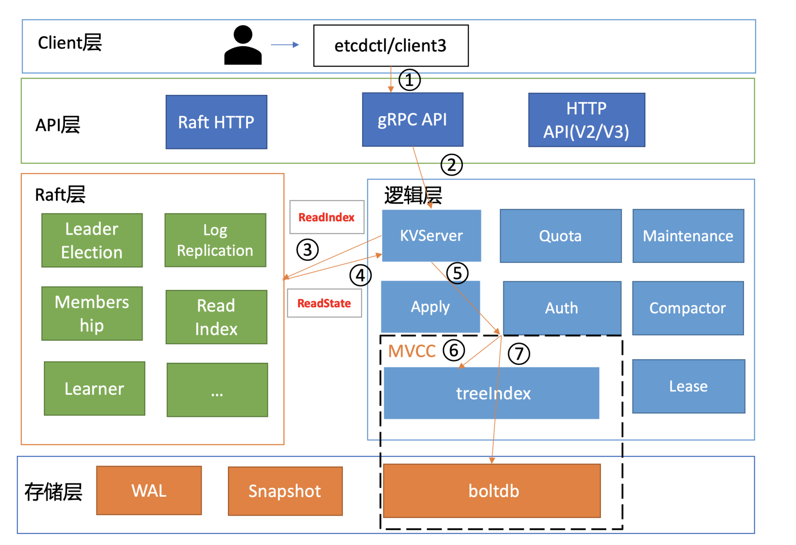
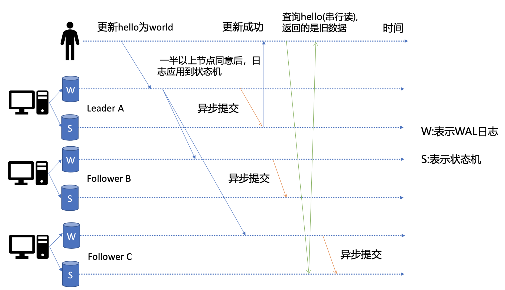
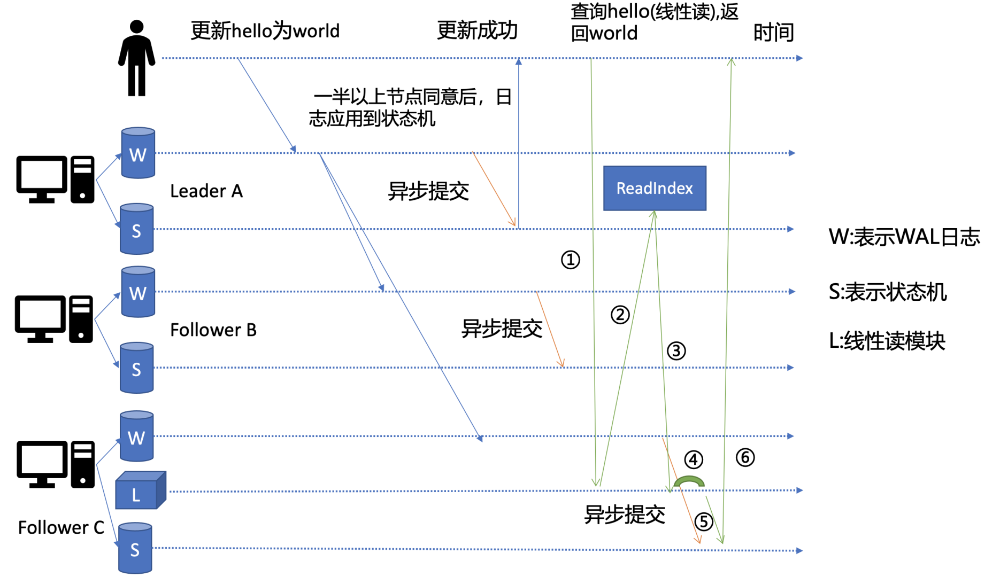

# 基础架构

下面是一张 etcd 的简要基础架构图，我们先从宏观上了解一下 etcd 都有哪些功能模块。



按照分层模型，etcd 可分为 Client 层、API 网络层、Raft 算法层、逻辑层和存储层。这些层的功能如下：

- **Client 层**：Client 层包括 client v2 和 v3 两个大版本 API 客户端库，提供了简洁易用的 API，同时支持负载均衡、节点间故障自动转移，可极大降低业务使用 etcd 复杂度，提升开发效率、服务可用性。
- **API 网络层**：API 网络层主要包括 client 访问 server 和 server 节点之间的通信协议。一方面，client 访问 etcd server 的 API 分为 v2 和 v3 两个大版本。v2 API 使用 HTTP/1.x 协议，v3 API 使用 gRPC 协议。同时 v3 通过 etcd grpc-gateway 组件也支持 HTTP/1.x 协议，便于各种语言的服务调用。另一方面，server 之间通信协议，是指节点间通过 Raft 算法实现数据复制和 Leader 选举等功能时使用的 HTTP 协议。
- **Raft 算法层**：Raft 算法层实现了 Leader 选举、日志复制、ReadIndex 等核心算法特性，用于保障 etcd 多个节点间的数据一致性、提升服务可用性等，是 etcd 的基石和亮点。
- **功能逻辑层**：etcd 核心特性实现层，如典型的 KVServer 模块、MVCC 模块、Auth 鉴权模块、Lease 租约模块、Compactor 压缩模块等，其中 MVCC 模块主要由 treeIndex 模块和 boltdb 模块组成。
- **存储层**：存储层包含预写日志 (WAL) 模块、快照 (Snapshot) 模块、boltdb 模块。其中 WAL 可保障 etcd crash 后数据不丢失，boltdb 则保存了集群元数据和用户写入的数据。

etcd 是典型的读多写少存储，在我们实际业务场景中，读一般占据 2/3 以上的请求。在下面这张架构图中，序号标识了 etcd 默认读模式（线性读）的执行流程，接下来，我们就按照这个执行流程从头开始说。




---

# client

启动完 etcd 集群后，当你用 etcd 的客户端工具 etcdctl 执行一个 get hello 命令时，对应到图中流程一，etcdctl 是如何工作的呢？

```bash
# etcdctl get hello --endpoints http://127.0.0.1:2379  
hello  
world  
```

首先，etcdctl 会对命令中的参数进行解析。我们来看下这些参数的含义，其中，参数 get 是请求的方法，它是 KVServer 模块的 API；hello 是我们查询的 key 名；endpoints 是我们后端的 etcd 地址，通常，生产环境下中需要配置多个 endpoints，这样在 etcd 节点出现故障后，client 就可以自动重连到其它正常的节点，从而保证请求的正常执行。

在 etcd v3.4.9 版本中，etcdctl 是通过 clientv3 库来访问 etcd server 的，clientv3 库基于 gRPC client API 封装了操作 etcd KVServer、Cluster、Auth、Lease、Watch 等模块的 API，同时还包含了负载均衡、健康探测和故障切换等特性。

在解析完请求中的参数后，etcdctl 会创建一个 clientv3 库对象，使用 KVServer 模块的 API 来访问 etcd server。

接下来，就需要为这个 get hello 请求选择一个合适的 etcd server 节点了，这里得用到负载均衡算法。在 etcd 3.4 中，clientv3 库采用的负载均衡算法为 Round-robin。针对每一个请求，Round-robin 算法通过轮询的方式依次从 endpoint 列表中选择一个 endpoint 访问 (长连接)，使 etcd server 负载尽量均衡。

关于负载均衡算法，你需要特别注意以下两点：

- 如果你的 client 版本 <= 3.3，那么当你配置多个 endpoint 时，负载均衡算法仅会从中选择一个 IP 并创建一个连接（Pinned endpoint），这样可以节省服务器总连接数。但在 heavy usage 场景，这可能会造成 server 负载不均衡。

- 在 client 3.4 之前的版本中，负载均衡算法有一个严重的 Bug：如果第一个节点异常了，可能会导致你的 client 访问 etcd server 异常，特别是在 Kubernetes 场景中会导致 APIServer 不可用。不过，该 Bug 已在 Kubernetes 1.16 版本后被修复。

为请求选择好 etcd server 节点，client 就可调用 etcd server 的 KVServer 模块的 Range RPC 方法，把请求发送给 etcd server。

这里说明一点，client 和 server 之间的通信，使用的是基于 HTTP/2 的 gRPC 协议。相比 etcd v2 的 HTTP/1.x，HTTP/2 是基于二进制而不是文本、支持多路复用而不再有序且阻塞、支持数据压缩以减少包大小、支持 server push 等特性。因此，基于 HTTP/2 的 gRPC 协议具有低延迟、高性能的特点，有效解决了 etcd v2 中 HTTP/1.x 性能问题。


---

# KVServer

client 发送 Range RPC 请求到了 server 后，就开始进入我们架构图中的流程二，也就是 KVServer 模块了。

etcd 提供了丰富的 metrics、日志、请求行为检查等机制，可记录所有请求的执行耗时及错误码、来源 IP 等，也可控制请求是否允许通过，比如 etcd Learner 节点只允许指定接口和参数的访问，帮助大家定位问题、提高服务可观测性等，而这些特性是怎么非侵入式的实现呢？答案就是拦截器。

etcd server 定义了如下的 Service KV 和 Range 方法，启动的时候它会将实现 KV 各方法的对象注册到 gRPC Server，并在其上注册对应的拦截器。下面的代码中的 Range 接口就是负责读取 etcd key-value 的的 RPC 接口。

```go
service KV {  
  // Range gets the keys in the range from the key-value store.  
  rpc Range(RangeRequest) returns (RangeResponse) {  
      option (google.api.http) = {  
        post: "/v3/kv/range"  
        body: "*"  
      };  
  }  
  ....
}  
```

拦截器提供了在执行一个请求前后的 hook 能力，除了我们上面提到的 debug 日志、metrics 统计、对 etcd Learner 节点请求接口和参数限制等能力，etcd 还基于它实现了以下特性:

- 要求执行一个操作前集群必须有 Leader；
- 请求延时超过指定阈值的，打印包含来源 IP 的慢查询日志 (3.5 版本)。

server 收到 client 的 Range RPC 请求后，根据 ServiceName 和 RPC Method 将请求转发到对应的 handler 实现，handler 首先会将上面描述的一系列拦截器串联成一个执行，在拦截器逻辑中，通过调用 KVServer 模块的 Range 接口获取数据。


---

# 串行读与线性读

进入 KVServer 模块后，我们就进入核心的读流程了，对应架构图中的流程三和四。我们知道 etcd 为了保证服务高可用，生产环境一般部署多个节点，那各个节点数据在任意时间点读出来都是一致的吗？什么情况下会读到旧数据呢？

这里为了帮助更好的理解读流程，先简单提下写流程。如下图所示，当 client 发起一个更新 hello 为 world 请求后，若 Leader 收到写请求，它会将此请求持久化到 WAL 日志，并广播给各个节点，若一半以上节点持久化成功，则该请求对应的日志条目被标识为已提交，etcdserver 模块异步从 Raft 模块获取已提交的日志条目，应用到状态机 (boltdb 等)。



此时若 client 发起一个读取 hello 的请求，假设此请求直接从状态机中读取， 如果连接到的是 C 节点，若 C 节点磁盘 I/O 出现波动，可能导致它应用已提交的日志条目很慢，则会出现更新 hello 为 world 的写命令，在 client 读 hello 的时候还未被提交到状态机，因此就可能读取到旧数据，如上图查询 hello 流程所示。

从以上介绍我们可以看出，在多节点 etcd 集群中，各个节点的状态机数据一致性存在差异。而我们不同业务场景的读请求对数据是否最新的容忍度是不一样的，有的场景它可以容忍数据落后几秒甚至几分钟，有的场景要求必须读到反映集群共识的最新数据。

我们首先来看一个对**数据敏感度较低**的场景。

假如老板让你做一个旁路数据统计服务，希望你每分钟统计下 etcd 里的服务、配置信息等，这种场景其实对数据时效性要求并不高，读请求可直接从节点的状态机获取数据。即便数据落后一点，也不影响业务，毕竟这是一个定时统计的旁路服务而已。

这种直接读状态机数据返回、无需通过 Raft 协议与集群进行交互的模式，在 etcd 里叫做**串行 (Serializable) 读**，它具有低延时、高吞吐量的特点，适合对数据一致性要求不高的场景。

我们再看一个对**数据敏感性高**的场景。

当你发布服务，更新服务的镜像的时候，提交的时候显示更新成功，结果你一刷新页面，发现显示的镜像的还是旧的，再刷新又是新的，这就会导致混乱。再比如说一个转账场景，Alice 给 Bob 转账成功，钱被正常扣出，一刷新页面发现钱又回来了，这也是令人不可接受的。

以上的业务场景就对数据准确性要求极高了，在 etcd 里面，提供了一种线性读模式来解决对数据一致性要求高的场景。

什么是线性读呢?

你可以理解一旦一个值更新成功，随后任何通过线性读的 client 都能及时访问到。虽然集群中有多个节点，但 client 通过线性读就如访问一个节点一样。etcd 默认读模式是线性读，因为它需要经过 Raft 协议模块，反应的是集群共识，因此在延时和吞吐量上相比串行读略差一点，适用于对数据一致性要求高的场景。

如果你的 etcd 读请求显示指定了是串行读，就不会经过架构图流程中的流程三、四。默认是线性读，因此接下来我们看看读请求进入线性读模块，它是如何工作的。


---

# 线性读之 ReadIndex

前面我们聊到串行读时提到，它之所以能读到旧数据，主要原因是 Follower 节点收到 Leader 节点同步的写请求后，应用日志条目到状态机是个异步过程，那么我们能否有一种机制在读取的时候，确保最新的数据已经应用到状态机中？



其实这个机制就是叫 ReadIndex，它是在 etcd 3.1 中引入的，我把简化后的原理图放在了上面。当收到一个线性读请求时，它首先会从 Leader 获取集群最新的已提交的日志索引（committed index），如上图中的流程二所示。

Leader 收到 ReadIndex 请求时，为防止脑裂等异常场景，会向 Follower 节点发送心跳确认，一半以上节点确认 Leader 身份后才能将已提交的索引（committed index）返回给节点 C（上图中的流程三）。

C 节点则会等待，直到状态机已应用索引（applied index）大于等于 Leader 的已提交索引时（committed Index）（上图中的流程四），然后去通知读请求，数据已赶上 Leader，你可以去状态机中访问数据了（上图中的流程五）。

以上就是线性读通过 ReadIndex 机制保证数据一致性原理， 当然还有其它机制也能实现线性读，如早期 etcd 线性读使用的 Raft log read，也就是说把读请求像写请求一样走一遍 Raft 的协议，基于 Raft 的日志的有序性，实现线性读。但此方案读涉及磁盘 IO 开销，性能较差，后来实现了 ReadIndex 读机制来提升读性能，满足了 Kubernetes 等业务的诉求。

总体而言，KVServer 模块收到线性读请求后，通过架构图中流程三向 Raft 模块发起 ReadIndex 请求，Raft 模块将 Leader 最新的已提交日志索引封装在流程四的 ReadState 结构体，通过 channel 层层返回给线性读模块，线性读模块等待本节点状态机追赶上 Leader 进度，追赶完成后，就通知 KVServer 模块，进行架构图中流程五，与状态机中的 MVCC 模块进行进行交互了。


---

# MVCC

流程五中的多版本并发控制 (Multiversion concurrency control) 模块是为了解决上一讲我们提到 etcd v2 不支持保存 key 的历史版本、不支持多 key 事务等问题而产生的。

它核心由内存树形索引模块 (treeIndex) 和嵌入式的 KV 持久化存储库 boltdb 组成。

首先我们需要简单了解下 boltdb，它是个基于 B+ tree 实现的 key-value 键值库，支持事务，提供 Get/Put 等简易 API 给 etcd 操作。

那么 etcd 如何基于 boltdb 保存一个 key 的多个历史版本呢?

比如我们现在有以下方案：方案 1 是一个 key 保存多个历史版本的值；方案 2 每次修改操作，生成一个新的版本号 (revision)，以版本号为 key， value 为用户 key-value 等信息组成的结构体。

很显然方案 1 会导致 value 较大，存在明显读写放大、并发冲突等问题，而方案 2 正是 etcd 所采用的。boltdb 的 key 是全局递增的版本号 (revision)，value 是用户 key、value 等字段组合成的结构体，然后通过 treeIndex 模块来保存用户 key 和版本号的映射关系。

treeIndex 与 boltdb 关系如下面的读事务流程图所示，从 treeIndex 中获取 key hello 的版本号，再以版本号作为 boltdb 的 key，从 boltdb 中获取其 value 信息。


treeIndex 模块是基于 Google 开源的内存版 btree 库实现的。

treeIndex 模块只会保存用户的 key 和相关版本号信息，用户 key 的 value 数据存储在 boltdb 里面，相比 ZooKeeper 和 etcd v2 全内存存储，etcd v3 对内存要求更低。

简单介绍了 etcd 如何保存 key 的历史版本后，架构图中流程六也就非常容易理解了， 它需要从 treeIndex 模块中获取 hello 这个 key 对应的版本号信息。treeIndex 模块基于 B-tree 快速查找此 key，返回此 key 对应的索引项 keyIndex 即可。索引项中包含版本号等信息。

在获取到版本号信息后，就可从 boltdb 模块中获取用户的 key-value 数据了。不过有一点要注意，并不是所有请求都一定要从 boltdb 获取数据。

etcd 出于数据一致性、性能等考虑，在访问 boltdb 前，首先会从一个内存读事务 buffer 中，二分查找你要访问 key 是否在 buffer 里面，若命中则直接返回。


---

# boltdb

若 buffer 未命中，此时就真正需要向 boltdb 模块查询数据了，进入了流程七。

我们知道 MySQL 通过 table 实现不同数据逻辑隔离，那么在 boltdb 是如何隔离集群元数据与用户数据的呢？答案是 bucket。boltdb 里每个 bucket 类似对应 MySQL 一个表，用户的 key 数据存放的 bucket 名字的是 key，etcd MVCC 元数据存放的 bucket 是 meta。

因 boltdb 使用 B+ tree 来组织用户的 key-value 数据，获取 bucket key 对象后，通过 boltdb 的游标 Cursor 可快速在 B+ tree 找到 key hello 对应的 value 数据，返回给 client。

到这里，一个读请求之路执行完成。

​	


