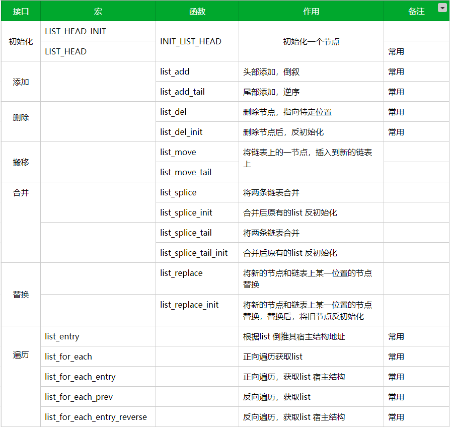

内核链表的结构是个双向循环链表，只有指针域，数据域根据使用链表的人的具体需求而定。内核链表设计哲学：

> 既然链表不能包含万事万物，那么就让万事万物来包含链表。
>

这里我们把内核链表的实现移植到用户态，Let's Go


# list_head

要了解内核链表，就不得不提 list_head。这个结构很有意思，整个结构没有数据域，只有两个指针域。

这个结构本身意义不大，不过在内核链表中，起着整个衔接作用。

```c
struct list_head {
	struct list_head *next, *prev;
};
```


# 链表初始化

内核提供多种方式来初始化链表：宏初始化和接口初始化。

```c
// 宏初始化
#define LIST_HEAD_INIT(name) { &(name), &(name) }

#define LIST_HEAD(name) \
	struct list_head name = LIST_HEAD_INIT(name)

// 接口初始化
static inline void INIT_LIST_HEAD(struct list_head *list)
{
	list->next = list;
	list->prev = list;
}
```

初始化就是将链表头指针的前驱和后继都指向自己，LIST_HEAD 和 INIT_LIST_HEAD 都可以初始化一个链表。

两者的区别是，前者只需要传入链表的名字，就可以初始化完毕了；而后者需要先定义出链表的实体，然后将实体的地址传递给初始化函数即可完成链表的初始化。

这里我们假设自己的数据如下：

```c
struct person
{
        struct list_head list;
        int age;
}
```

创建一个结构体，并将链表放在结构体的第一个成员地址处（后面会分析不在首地址时的情况）

```c
#include <stdio.h>
#include <stdlib.h>

#include "list.h"

struct person
{
    struct list_head list;
    int age;
};

int main(int argc,char **argv)
{
    int i;
    struct person *p;
    struct person person1;
    struct list_head *pos;

    INIT_LIST_HEAD(&person1.list);

    for (i=0; i<5; i++) {
        p = (struct person *)malloc(sizeof(struct person ));
        p->age = i*10;
        list_add(&p->list,&person1.list);
    }

    list_for_each(pos, &person1.list) {
        printf("age = %d\n",((struct person *)pos)->age);
    }

    return 0;
}
```

我们先定义 my_data_list_head，此时 my_data_list_head 就是一个我们需要使用链表来链接的节点。

使用链表之前，需要先对链表进行初始化，LIST_HEAD 和 INIT_LIST_HEAD 都可以初始化一个链表，两者的区别是，前者只需要传入链表的名字，就可以初始化完毕了；而后者需要先定义出链表的实体，如前面的 my_data_list_head 一样，然后将 my_data_list_head 的地址传递给初始化函数即可完成链表的初始化。


# 头插法 list_add

完成了初始化之后，我们可以向链表中插入节点，先以头插法为例：

```c
/*
 * list_add函数，可以在链中增加节点，该函数为头插法，即每次插入的节点都位于上一个节点之前，
 * 比如上一个节点是head->1->head，本次使用头插法插入之后，链表结构变成了 head->2->1->head。
 * 也就是使用list_add头插法，最后一个插入的节点，将是链表结构中的第一个节点。
 */
static inline void list_add(struct list_head *new, struct list_head *head)
{
	__list_add(new, head, head->next);
}

static inline void __list_add(struct list_head *new,
			      struct list_head *prev,
			      struct list_head *next)
{
	next->prev = new;
	new->next = next;
	new->prev = prev;
	prev->next = new;
}
```

本例中增加 5 个节点，头结点的数据域不重要，可以根据需要利用头结点的数据域，一般而言，头结点数据域不使用，在使用头结点数据域的情况下，一般也仅仅记录链表的长度信息。

首先来看第一次增加节点 `__list_add` 状态变化

```text
# 初始状态
prev = head         next = head
head.prev = head    head.next = head
new.prev = null     new.next = null

# 执行next->prev = new;
# 变化的状态标记为 @ 
prev = head         next = head
@head.prev = new    head.next = head
new.prev = null     new.next = null

# 执行new->next = next;
prev = head         next = head
head.prev = new     head.next = head
new.prev = null     @new.next = head

# 执行new->prev = prev;
prev = head         next = head
head.prev = new     head.next = head
@new.prev = head    new.next = head

# 执行prev->next = new; 此时head和new组成了双向循环链表
prev = head         next = head
head.prev = new     @head.next = new
new.prev = head     new.next = head
```

我们再继续增加节点

```text
# 初始状态 head <--> new，此时我们将之前添加的new节点改为old，即 head <--> old
prev = head         next = old
head.prev = old     head.next = old
old.prev = head     old.next = head
new.prev = null     new.next = null

# 执行next->prev = new;
prev = head         next = old
head.prev = old     head.next = old
@old.prev = new     old.next = head
new.prev = null     new.next = null

# 执行new->next = next;
prev = head         next = old
head.prev = old     head.next = old
old.prev = new      old.next = head
new.prev = null     @new.next = old

# 执行new->prev = prev;
prev = head         next = old
head.prev = old     head.next = old
old.prev = new      old.next = head
@new.prev = head    new.next = old

# 执行prev->next = new; 
prev = head         next = old
head.prev = old     @head.next = new
old.prev = new      old.next = head
new.prev = head     new.next = old
# 此时，head <--> new <--> old <--> head 组成双向循环链表
# prev链表：head-->old-->new-->head
# next链表：head->new->old->head
```

我们可以发现 prev 总是代表 head 节点，next 代表最后插入的节点，当插入一个 new 节点时。

```c
# 将 new 节点插入到之前最后插入的节点前
next->prev = new;
new->next = next;
# 将 head 和 new 节点建立双向连接，而 head 与链表尾的关系不变
new->prev = prev;
prev->next = new; 
```


# 遍历链表 list_for_each

在增加了 5 个节点之后，我们需要遍历链表，访问其数据域的内容，此时，我们先使用 list_for_each 函数，遍历链表。

```c
#define list_for_each(pos, head) \
	for (pos = (head)->next; pos != (head); pos = pos->next)
```

 该函数就是遍历链表，直到出现 `pos == head` 时，循环链表就遍历完毕了。这个函数很明显是没有使用头节点的。

list_for_each 的第一个参数 pos，代表位置，需要是 `struct list_head *` 类型，它其实相当于临时变量，在本例中，定义了一个指针 pos 用来遍历链表。

可以遍历链表之后，那么就需要对数据进行打印了。

此时头文件 list.h 如下：

```c
#ifndef LIST_H
#define LIST_H

struct list_head {
	struct list_head *next, *prev;
};

#define LIST_HEAD_INIT(name) { &(name), &(name) }

#define LIST_HEAD(name) \
	struct list_head name = LIST_HEAD_INIT(name)

static inline void INIT_LIST_HEAD(struct list_head *list)
{
	list->next = list;
	list->prev = list;
}

static inline void __list_add(struct list_head *new,
			      struct list_head *prev,
			      struct list_head *next)
{
	next->prev = new;
	new->next = next;
	new->prev = prev;
	prev->next = new;
}

static inline void list_add(struct list_head *new, struct list_head *head)
{
	__list_add(new, head, head->next);
}

#define list_for_each(pos, head) \
	for (pos = (head)->next; pos != (head); pos = pos->next)

#endif
```

本例中的输出，将 pos 强制换成 `struct person *` 类型，然后访问 age 元素，得到程序输出入下：

```sh
[root@centos lish]# gcc -o test test.c 
[root@centos lish]# ./test 
age = 40
age = 30
age = 20
age = 10
age = 0
```

可以发现，list_add 头插法，果然是最后插入的先打印，最先插入的最后打印。

其次，为什么笔者要使用 `printf("age = %d\n",((struct person *)pos)->age);` 这样的强制类型转换来打印呢？能这样打印的原理是什么呢？

现在回到我们的数据结构：

```c
struct person
{
    struct list_head list;
    int age;
};
```

由于我们将链表放在结构体的首地址处，那么此时链表 list 的地址，和 `struct person` 的地址是一致的，所以通过 pos 的地址，将其强制转换成 `struct person *` 就可以访问 age 元素了。


# 头节点携带信息

前面说到，内核链表是有头结点的，一般而言头结点的数据域我们不使用，但也有使用头结点数据域记录链表长度的实现方法。头结点其实不是必需的，但作为学习，我们可以实现一下，了解其过程：

```c
#include <stdio.h>
#include <stdlib.h>

#include "list.h"

struct person_head
{
    struct list_head list;
    int len;
};

struct person
{
    struct list_head list;
    int age;
};

int main(int argc,char **argv)
{
    int i;
    struct person *p;
    struct person_head head;
    struct list_head *pos;

    INIT_LIST_HEAD(&head.list);
    head.len = 0;

    for (i=0; i<5; i++) {
        p = (struct person *)malloc(sizeof(struct person));
        p->age = i*10;
        list_add(&p->list,&head.list);
        head.len++;
    }

    printf("list len = %d\n", head.len);
    list_for_each(pos, &head.list) {
        printf("age = %d\n",((struct person *)pos)->age);
    }

    return 0;
}
```

执行结果

```sh
[root@centos lish]# gcc -o test test.c 
[root@centos lish]# ./test 
list len = 5
age = 40
age = 30
age = 20
age = 10
age = 0
```

上面将链表头放到了结构体的首位成员处，如果我修改结构体，将链表不放置在结构体的首地址处

```c
struct person
{
    int age;
    struct list_head list;
};
```

那么前面的代码将不能正常工作了，运行如下：

```sh
[root@centos lish]# gcc -o test test.c 
[root@centos lish]# ./test 
list len = 5
age = 9310328
age = 9310296
age = 9310264
age = 9310232
age = 2067702064
```

因为此时强制类型转换得到地址不再是 `struct person` 结构的首地址，进行 `->age` 操作时，指针偏移不正确

但实际情况链表并不保证可以放在结构体的第一个成员地址处，哪怕能够保证，那么在复杂数据结构中，有多个链表怎么办？哪怕你能够保证有一个链表位于结构体的首地址处，那其他的链表怎么办呢？

于是就有了下面两个神奇的宏：

```c
#define offsetof(TYPE, MEMBER) ((size_t) &((TYPE *)0)->MEMBER)

#define container_of(ptr, type, member) ({                      \
	const typeof( ((type *)0)->member ) *__mptr = (ptr);    \
	(type *)( (char *)__mptr - offsetof(type,member) );})
```


# offsetof

我们先来分析 offsetof 宏，其语法也是非常简洁和简单的，该宏得到的是 TYPE（结构体）类型中成员 MEMBER 相对于结构体的偏移地址。

```c
#define offsetof(TYPE, MEMBER) ((size_t) &((TYPE *)0)->MEMBER)
```

第一步：我们先看最里层 `((TYPE *)0)`。实际上是将 0 地址强转为 TYPE 结构的指针。指向一个 TYPE 类型的结构体变量。

第二步：`(TYPE *)0)->MEMBER`。`(TYPE *)0`  表示一个 TYPE 类型的结构体指针。通过指针来访问这个结构体变量的 MEMBER 元素。

第三步：`&((TYPE *)0)->MEMBER` 等效于 `&(((TYPE *)0)->MEMBER) - &((TYPE *)0)`，即 MEMBER 相对于 TYPE 类型结构体首地址的偏移。


# container_of

```c
#define container_of(ptr, type, member) ({                      \
	const typeof( ((type *)0)->member ) *__mptr = (ptr);    \
	(type *)( (char *)__mptr - offsetof(type,member) );})
```

第一步：先看第一段。

```c
 const typeof( ((type *)0)->member ) *__mptr = (ptr); 
 // 等价于
 const typeof(A) *__mptr = (ptr);
```

继续拆开：A =  `((type *)0)->member`，和上文 offsetof 分析一样。

然后 `typeof(A) *__mptr = ptr;` 等价于 `A *__mptr = ptr;`

>   注：typeof() 是 gcc 的扩展宏，给定一个参数或者变量名，能够自动推导数据类型。此时 ptr 就指向 type->member 地址处。

第二步：再看第二段。

```c
(type *)( (char *)__mptr - offsetof(type,member) );
// 等价于
(type *) (&A - offset)
```

根据 typeof 推算出 member 所在地址，然后减去 member相对于 type 的偏移，得到结构体变量的首地址。


前面说到换了位置之后获取 age 是错误的，就是因为 pos 的地址不位于结构体首地址了。

试想，如果我们能够通过将 pos 指针传递给某个宏或者函数，该函数或者宏能够通过 pos 返回包含 pos 容器这个结构体的地址，那么我们不就可以正常访问 age 了吗。

很显然， container_of 宏，就是这个作用，在内核中，将其又封装成了 list_entry 宏。

```c
/**
 * list_entry - get the struct for this entry
 * @ptr:	the &struct list_head pointer.
 * @type:	the type of the struct this is embedded in.
 * @member:	the name of the list_struct within the struct.
 */
#define list_entry(ptr, type, member) \
	container_of(ptr, type, member)
```

那么我们改进前面的代码：

```c
#include <stdio.h>
#include <stdlib.h>

#include "list.h"

struct person_head
{
    struct list_head list;
    int len;
};

struct person
{
    int age;
    struct list_head list;
};

int main(int argc,char **argv)
{
    int i;
    struct person *p;
    struct person_head head;
    struct list_head *pos;

    INIT_LIST_HEAD(&head.list);
    head.len = 0;

    for (i=0; i<5; i++) {
        p = (struct person *)malloc(sizeof(struct person));
        p->age = i*10;
        list_add(&p->list,&head.list);
        head.len++;
    }

    printf("list len = %d\n", head.len);
    list_for_each(pos, &head.list) {
        // 改动的代码
        p = list_entry(pos, struct person, list);
        printf("age = %d\n", p->age);
    }

    return 0;
}
```

现在运行之后，即可以得到正确的结果了。

```sh
[root@centos lish]# gcc -o test test.c 
[root@centos lish]# ./test 
list len = 5
age = 40
age = 30
age = 20
age = 10
age = 0
```


# list_for_each_entry

上面我们使用两句语句来获取结构体容器地址，内核链表设计者早已考虑到了这一点，所以为我们封装了另一个宏：

```c
/**
 * list_for_each_entry	-	iterate over list of given type
 * @pos:	the type * to use as a loop cursor.
 * @head:	the head for your list.
 * @member:	the name of the list_struct within the struct.
 */
#define list_for_each_entry(pos, head, member)				\
	for (pos = list_entry((head)->next, typeof(*pos), member);	\
	     &pos->member != (head); 	\
	     pos = list_entry(pos->member.next, typeof(*pos), member))
```

通过其名字我们也能猜测其功能，list_for_each 是遍历链表，增加 entry 后缀，表示遍历的时候，还要获取 entry（条目），即获取链表容器结构的地址。

该宏中的 pos 类型为容器结构类型的指针，这与前面 list_for_each 中的使用的类型不再相同，不过这也是情理之中的事，毕竟现在的 pos，我要使用该指针去访问数据域的成员 age 了；head 是你使用 INIT_LIST_HEAD 初始化的那个对象，即头指针，注意，不是头结点；member 就是容器结构中的链表元素对象。

```c
list_for_each_entry(pos, &head.list, list) {
        printf("age = %d\n", pos->age);
}
```

运行后结果依旧正确：

```sh
[root@centos lish]# gcc -o test test.c 
[root@centos lish]# ./test 
list len = 5
age = 40
age = 30
age = 20
age = 10
age = 0
```


# 删除节点 list_del

在此之前，我们都没有使用删除链表的操作，现在我们来看一下删除链表的内核函数 list_del：

```c
static inline void list_del(struct list_head *entry)
{
	__list_del(entry->prev, entry->next);
	entry->next = LIST_POISON1;
	entry->prev = LIST_POISON2;
}

static inline void __list_del(struct list_head *prev, struct list_head *next)
{
	next->prev = prev;
	prev->next = next;
}
```

链表删除之后，entry 的前驱和后继会分别指向 LIST_POISON1 和 LIST_POISON2，这个是内核设置的一个区域，但是在本例中将其置为了 NULL。

list.h 此时如下：

```c
#ifndef LIST_H
#define LIST_H

struct list_head {
	struct list_head *next, *prev;
};

#define LIST_HEAD_INIT(name) { &(name), &(name) }

#define LIST_HEAD(name) \
	struct list_head name = LIST_HEAD_INIT(name)

static inline void INIT_LIST_HEAD(struct list_head *list)
{
	list->next = list;
	list->prev = list;
}

static inline void __list_add(struct list_head *new,
			      struct list_head *prev,
			      struct list_head *next)
{
	next->prev = new;
	new->next = next;
	new->prev = prev;
	prev->next = new;
}

static inline void list_add(struct list_head *new, struct list_head *head)
{
	__list_add(new, head, head->next);
}

#define list_for_each(pos, head) \
	for (pos = (head)->next; pos != (head); pos = pos->next)

#define offsetof(TYPE, MEMBER) ((size_t) &((TYPE *)0)->MEMBER)

#define container_of(ptr, type, member) ({                      \
	const typeof( ((type *)0)->member ) *__mptr = (ptr);    \
	(type *)( (char *)__mptr - offsetof(type,member) );})

#define list_entry(ptr, type, member) \
	container_of(ptr, type, member)

#define list_for_each_entry(pos, head, member)				\
	for (pos = list_entry((head)->next, typeof(*pos), member);	\
	     &pos->member != (head); 	\
	     pos = list_entry(pos->member.next, typeof(*pos), member))

static inline void __list_del(struct list_head *prev, struct list_head *next)
{
	next->prev = prev;
	prev->next = next;
}

static inline void list_del(struct list_head *entry)
{
	__list_del(entry->prev, entry->next);
	entry->next = NULL;
	entry->prev = NULL;
}

#endif
```


```c
#include <stdio.h>
#include <stdlib.h>

#include "list.h"

struct person
{
    int age;
    struct list_head list;
};

int main(int argc,char **argv)
{
    int i;
    struct person *p;
    struct person *pos;

    LIST_HEAD(person_head);

    for (i=0; i<5; i++) {
        p = (struct person *)malloc(sizeof(struct person));
        p->age = i*10;
        list_add(&p->list, &person_head);
    }
    
    list_for_each_entry(pos, &person_head, list) {
        if (pos->age == 30) {
            list_del(&pos->list);
            break;
        }
    }

    list_for_each_entry(pos, &person_head, list) {
        printf("age = %d\n", pos->age);
    }

    return 0;
}
```

运行结果如下：

```sh
[root@centos lish]# gcc -o test test.c 
[root@centos lish]# ./test 
age = 40
age = 20
age = 10
age = 0
```

可以发现，正确地删除了相应的链表，但是注意了，如果在下面代码中不使用 break；会发生异常。

为什么会这样呢？那是因为 list_for_each_entry 的实现方式并不是安全的，如果想要在遍历链表的时候执行删除链表的操作，需要对 list_for_each_entry 进行改进。

显然，内核链表设计者们早已给我们考虑到了这一情况，所以内核又提供了一个宏：list_for_each_entry_safe


# list_for_each_entry_safe

```c
/**
 * list_for_each_entry_safe - iterate over list of given type safe against removal of list entry
 * @pos:	the type * to use as a loop cursor.
 * @n:		another type * to use as temporary storage
 * @head:	the head for your list.
 * @member:	the name of the list_struct within the struct.
 */
#define list_for_each_entry_safe(pos, n, head, member)			\
	for (pos = list_entry((head)->next, typeof(*pos), member),	\
		n = list_entry(pos->member.next, typeof(*pos), member);	\
	     &pos->member != (head); 					\
	     pos = n, n = list_entry(n->member.next, typeof(*n), member))
```

使用这个宏，可以在遍历链表时安全地执行删除操作，其原理就是先把后一个节点取出来使用 n 作为缓存，这样在还没删除节点时，就得到了要删除节点的下一个节点的地址，从而避免了程序出错。


# list_for_each_entry_reverse / list_for_each_entry_safe_reverse

除了正向遍历，内核还提供反向遍历等操作

```c
/**
 * list_for_each_entry_reverse - iterate backwards over list of given type.
 * @pos:	the type * to use as a loop cursor.
 * @head:	the head for your list.
 * @member:	the name of the list_struct within the struct.
 */
#define list_for_each_entry_reverse(pos, head, member)			\
	for (pos = list_entry((head)->prev, typeof(*pos), member);	\
	     &pos->member != (head); 	\
	     pos = list_entry(pos->member.prev, typeof(*pos), member))

/**
 * list_for_each_entry_safe_reverse - iterate backwards over list safe against removal
 * @pos:	the type * to use as a loop cursor.
 * @n:		another type * to use as temporary storage
 * @head:	the head for your list.
 * @member:	the name of the list_struct within the struct.
 *
 * Iterate backwards over list of given type, safe against removal
 * of list entry.
 */
#define list_for_each_entry_safe_reverse(pos, n, head, member)		\
	for (pos = list_entry((head)->prev, typeof(*pos), member),	\
		n = list_entry(pos->member.prev, typeof(*pos), member);	\
	     &pos->member != (head); 					\
	     pos = n, n = list_entry(n->member.prev, typeof(*n), member))  
```

效果如下：

```sh
list_for_each_entry
age = 40
age = 20
age = 10
age = 0
list_for_each_entry_reverse
age = 0
age = 10
age = 20
age = 40
```


# 尾插法 list_add_tail

现在，我再来说另一种插入方式：尾插法，如果原来是head->1->head,尾插法一个节点之后变成了head->1->2->head。

内核提供的函数接口为：list_add_tail

```c
static inline void list_add_tail(struct list_head *new, struct list_head *head)
{
	__list_add(new, head->prev, head);
}

static inline void __list_add(struct list_head *new,
			      struct list_head *prev,
			      struct list_head *next)
{
	next->prev = new;
	new->next = next;
	new->prev = prev;
	prev->next = new;
}
```

头插法和尾插法最终都是调用 `__list_add`，但是传参不同，这也是内核设计的巧妙之处。

我们可以发现 next 总是代表 head 节点，prev 代表最后插入的节点 (在尾巴处)，当插入一个 new 节点时。

```c
# 将 new 节点插入到 head 节点前
next->prev = new;
new->next = next;
# 将 new 和 之前的尾巴节点建立双向连接
new->prev = prev;
prev->next = new; 
```


# 替换

```c
static inline void list_replace(struct list_head *old,
				struct list_head *new)
{
	new->next = old->next;
	new->next->prev = new;
	new->prev = old->prev;
	new->prev->next = new;
}

/* 由于list_replace没有将old的前驱和后继断开，所以内核又提供了：list_replace_init
 * 这样，替换之后会将old重新初始化，使其前驱和后继指向自身。
 * 显然我们通常应该使用list_replace_init。
 */
static inline void list_replace_init(struct list_head *old,
					struct list_head *new)
{
	list_replace(old, new);
	INIT_LIST_HEAD(old);
}
```


# 搬移

```c
static inline void __list_del_entry(struct list_head *entry)
{
	__list_del(entry->prev, entry->next);
}

static inline void __list_del(struct list_head * prev, struct list_head * next)
{
	next->prev = prev;
	prev->next = next;
}

/**
 * list_move - delete from one list and add as another's head
 * @list: the entry to move
 * @head: the head that will precede our entry
 */
static inline void list_move(struct list_head *list, struct list_head *head)
{
	__list_del_entry(list);
	list_add(list, head);
}

/**
 * list_move_tail - delete from one list and add as another's tail
 * @list: the entry to move
 * @head: the head that will follow our entry
 */
static inline void list_move_tail(struct list_head *list,
				  struct list_head *head)
{
	__list_del_entry(list);
	list_add_tail(list, head);
}
```

有了前面的知识累积，我们可以和轻松地明白，list_move 就是删除 list 指针所处的容器结构节点，然后将其重新以头插法添加到另一个头结点中去，head 可以是该链表自身，也可以是其他链表的头指针。

既然有头插法的 list_move，那么也同样有尾插法的 list_move_tail。

值得注意的是，如果链表数据域中的元素都相等，使用 list_for_each_entry_safe 反而会无限循环，list_for_each_entry 却能正常工作。

但是，在通常的应用场景下，数据域的判断条件不会是全部相同链表，例如在自己使用链表实现的线程中，常用线程名字作为 move 的条件判断，而线程名字肯定不应该是相同的。

所以，具体的内核链表 API，需要根据自己的应用场景选择。

list_for_each_entry_safe 是缓存了下一个节点的地址，list_for_each_entry 是无缓存的，挨个遍历，所以在删除节点的时候，list_for_each_entry 需要注意，如果没有将删除节点的前驱后继处理好，那么将引发问题，而 list_for_each_entry_safe 通常不用关心，但是在你使用的条件判断进行 move 操作时，不应该使用各个节点可能相同的条件。

# 总结

 


