# 对称加密

对称加密指的就是加密和解密使用同一个密钥，所以叫做对称加密。

常见的对称加密算法：DES，3DES，AES 等等。

数据加密标准（DES，Data Encryption Standard）是一种使用密钥加密的块密码，1976 年被美国联邦政府的国家标准局确定为联邦资料处理标准（FIPS），随后在国际上广泛流传开来。它基于使用 56 位密钥的对称算法。这个算法因为包含一些机密设计元素，相对短的密钥长度以及怀疑内含美国国家安全局（NSA）的后门而在开始时有争议，因此 DES 因此受到了强烈的学院派式的审查，并以此推动了现代的块密码及其密码分析的发展。

3DES 即 Triple DES，是 DES 向 AES 过渡的加密算法（1999 年，NIST 将 3-DES 指定为过渡的加密标准），是 DES 的一个更安全的变形。它以 DES 为基本模块，通过组合分组方法设计出分组加密算法。

AES（Advanced Encryption Standard，高级加密标准）是美国国家标准与技术研究院（NIST）在 2001 年建立了电子数据的加密规范。它是一种分组加密标准，每个加密数据块大小固定为 128 位（16 个字节），最终生成的加密密钥长度有 128 位、192 位和 256 位这三种。


---

# 非对称加密

非对称加密指的是：加密和解密使用不同的密钥，一把作为公开的公钥，另一把作为私钥。特征如下：

- 公钥加密的信息，只有私钥才能解密。
- 私钥加密的信息，只有公钥才能解密。

常见的非对称加密算法：RSA，DH


---

# 数字摘要

Hash（哈希或散列）算法是非常基础也非常重要的计算机算法，它能将任意长度的二进制明文串映射为较短的（通常是固定长度的）二进制串（Hash 值），并且不同的明文很难映射为相同的 Hash 值。Hash 值在应用中又常被称为指纹（fingerprint）或摘要（digest）。

数字摘要就是采用单向 Hash 函数将需要加密的明文摘要成一串固定长度的密文这一串密文又称为数字指纹，它有固定的长度，而且不同的明文摘要成密文，其结果总是不同的，而同样的明文其摘要必定一致。

一个优秀的 Hash 算法将能实现如下功能：

- 正向快速：给定明文和 Hash 算法，在有限时间和有限资源内能计算得到 Hash 值；
- 逆向困难：给定（若干）Hash 值，在有限时间内很难（基本不可能）逆推出明文；
- 输入敏感：原始输入信息发生任何改变，新产生的 Hash 值都应该出现很大不同；
- 冲突避免：很难找到两段内容不同的明文，使得它们的 Hash 值一致（发生碰撞）。

冲突避免有时候又称为抗碰撞性，分为弱抗碰撞性和强抗碰撞性。

如果给定明文前提下，无法找到与之碰撞的其他明文，则算法具有弱抗碰撞性；

如果无法找到任意两个发生 Hash 碰撞的明文，则称算法具有强抗碰撞性。


## 常见算法

目前常见的 Hash 算法包括 MD5 和 SHA 系列算法。

MD4（RFC 1320）是 MIT 的 Ronald L.Rivest 在 1990 年设计的，MD 是 Message Digest 的缩写。其输出为 128 位。MD4 已被证明不够安全。

MD5（RFC 1321）是 Rivest 于 1991 年对 MD4 的改进版本。它对输入仍以 512 位进行分组，其输出是 128 位。MD5 比 MD4 更加安全，但过程更加复杂，计算速度要慢一点。MD5 已被证明不具备强抗碰撞性。

SHA（Secure Hash Algorithm）并非一个算法，而是一个 Hash 函数族。NIST（National Institute of Standards and Technology）于 1993 年发布其首个实现。目前知名的 SHA-1 算法在 1995 年面世，它的输出为长度 160 位的 Hash 值，抗穷举性更好。SHA-1 设计时模仿了 MD4 算法，采用了类似原理。SHA-1 已被证明不具备强抗碰撞性。

为了提高安全性，NIST 还设计出了 SHA-224、SHA-256、SHA-384 和 SHA-512 算法（统称为 SHA-2），跟 SHA-1 算法原理类似。SHA-3 相关算法也已被提出。

目前，MD5 和 SHA1 已经被破解，一般推荐至少使用 SHA2-256 或更安全的算法。

>[!WARNING]
>
>MD5 是一个经典的 Hash 算法，和 SHA-1 算法一起都被认为安全性已不足应用于商业场景。


## Hash攻击与防护

Hash 算法并不是一种加密算法，不能用于对信息的保护。但 Hash 算法常用于对口令的保存上。

例如用户登录网站需要通过用户名和密码来进行验证。如果网站后台直接保存用户的口令明文，一旦数据库发生泄露后果不堪设想。大量用户倾向于在多个网站选用相同或关联的口令。

利用 Hash 的特性，后台可以仅保存口令的 Hash 值，这样每次比对 Hash 值一致，则说明输入的口令正确。即便数据库泄露了，也无法从 Hash 值还原回口令，只有进行穷举测试。

然而，由于有时用户设置口令的强度不够，只是一些常见的简单字符串，如 password、123456 等。有人专门搜集了这些常见口令，计算对应的 Hash 值，制作成字典。这样通过 Hash 值可以快速反查到原始口令。这一类型以空间换时间的攻击方法包括字典攻击和彩虹表攻击（只保存一条 Hash 链的首尾值，相对字典攻击可以节省存储空间）等。

为了防范这一类攻击，一般采用加盐（salt）的方法。保存的不是口令明文的 Hash 值，而是口令明文再加上一段随机字符串（即“盐”）之后的 Hash 值。Hash 结果和“盐”分别存放在不同的地方，这样只要不是两者同时泄露，攻击者就很难破解了。


---

# 数字签名

主角介绍：Bob and Alice

提起 RSA 加密算法，公钥和私钥，多数文章都要使用 Bob 和 Alice 这两位人物。他们的创造者名叫 Rivest，是 RSA 之父。他为了在避免在描述中使用 A 和 B，就以这两个字母开头，创建一男一女两个角色，就是我们在任何文章上都能看到的 Alice 和 Bob 了。这是一些题外话，下面就来进入我们的数字证书入门学习吧。

 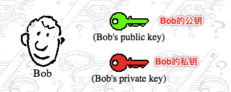

Bob 有两把钥匙，一把叫公钥（public key），一把叫私钥（private key）

 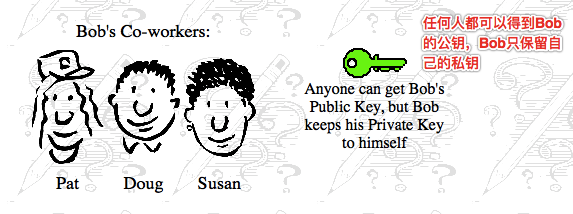

Bob 的公钥可以公开供其他人使用，他只保留自己的私钥。公钥和私钥用来加解密数据，如果使用任意一把来加密数据，那么只有使用另外一把才能解密数据

 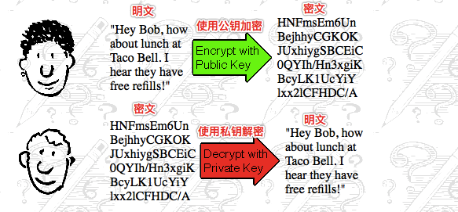

Susan 想给 Bob 写信，她可以使用 Bob 的公钥将内容加密以后发送给 Bob，Bob 收到以后，使用私钥解密以便阅读内容。Bob 的的其他同事即使截获了 Susan 发送给 Bob 的信件，由于没有 Bob 的私钥，也无法解密，从而确保数据安全。以上就是使用公钥和私钥加解密的过程演示。

多说一句，如果 Bob 给 Susan 回信，如何保证数据安全呢？他可以使用 Susan 的公钥加密消息后发给 Susan，Susan 使用自己的私钥解密后阅读。所以保护好自己的私钥是多么重要的事情啊。

> 这里 Bob 回信如果使用自己的私钥加密回复，那么所有拥有 Bob 公钥的人都可以解密后阅读


现在 Bob 决定给 Susan 写一份信，信件的内容不用加密，但是要保证 Susan 收到信件后，能够确认信件的确是 Bob 发出的，而不是别人冒充 Bob 发给 Susan 的，应该怎么做呢？

 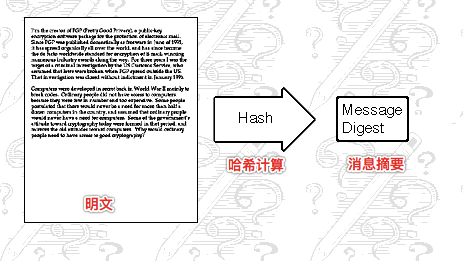

Bob 将信件通过 hash 软件计算一下，得到一串消息摘要（有的文章也称之为 hash 值）。这一过程能够保证 2 点：

1、过程不可逆。即不能通过消息摘计算出信件的内容。

2、消息摘要不会重复。即如果信件有任何改动，再次 hash 计算出的消息摘要一定不会和改动前的消息摘要一致。

 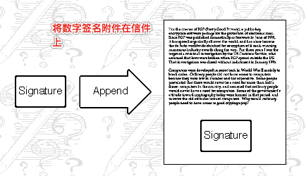

然后，Bob 使用自己的私钥，将消息摘要加密。加密后的结果，我们称之为**数字签名**。现在，Bob 就可以将信件连同数字签名一起发给 Susan。

> 为什么要对消息摘要加密？
>
> 如果不加密直接发出去，别人可以直接篡改内容，并且用篡改的内容生成新的摘要，Susan 无法通过摘要来确定内容是否被修改

> 为什么加密用公钥，签名用私钥？
>
> 既然是加密，那肯定是不希望别人知道我的消息，所以只有我才能解密，所以可得出**公钥负责加密，私钥负责解密**；
>
> 同理，既然是签名，那肯定是不希望有人冒充我发消息，只有我才能发布这个签名，所以可得出**私钥负责签名，公钥负责验证**

 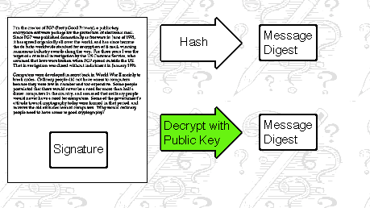

Susan 收到信件以后，会做 2 件事：

1、使用 Bob 的公钥将数字签名解密，如果顺利解密，说明的确是 Bob 签发的数字签名，不是别人签发的，因为 Bob 的私钥没有公开。

2、Susan 使用 hash 软件对信件再次进行 hash 计算，和解密数字签名得到的消息摘要对比，如果一致，说明信件没有篡改，确实是 Bob 发出的。这就是数字签名的过程。它能够确保签名人发出的消息不被篡改，也能证明的确是签名人发出的消息。

ok，一切看上去是那么的完美，使用公钥私钥，即能加解密消息，又可以数字签名。


说了那么多，还没有提到文章的主题----数字证书（不要和数字签名搞混了）

下面引入的主角，Doug

Doug 要欺骗 Susan，冒充 Bob 给 Susan 写信，他应该怎么做？既然 Bob 的公钥是公开的，Doug 可以冒充 Bob，将他自己的公钥发给 Susan，让 Susan 误认为收到的公钥就是 Bob 的，然后就可以冒充 Bob 给 Susan 发消息了。

 

所以问题的核心就是，如何确保公钥不被冒充？答案就是数字证书


首先，有一个权威的证书签发机构，称为 CA ——全球就那么几个公司比较权威啦，这个机构有自己的公钥和私钥。


使用数字证书可以确保公钥不被冒充。数字证书是经过权威机构（CA）认证的公钥，通过查看数字证书，可以知道该证书是由那家权威机构签发的，证书使用人的信息，使用人的公钥。它有以下特点：

1、由专门的机构签发的数字证书才安全有效。

2、签发数字证书是收费的。

3、不会被冒充，安全可信。

4、数字证书有使用期限，过了使用期限，证书变为不可用。CA 也可以在试用期内，对证书进行作废操作。


生成数字证书的流程的如下：

1、持有人将公钥以及身份信息发送给权威机构。

2、权威机构负责对持有人的身份进行验证，确保公钥和持有人的信息准确无误。

3、权威机构使用自己私钥对持有人公钥进行数字签名，生成数字证书。

4、为了确保证书不被篡改，权威机构对数字证书进行 hash 计算（指纹算法），生成摘要（指纹），使用自己的私钥对摘要进行数字签名，放到数字证书中。

5、对持有人收费。


---

# X.509标准

数字证书是现代互联网中个体间相互信任的基石。

如果没有了数字证书，那么也就没有了各式各样的电商平台以及方便的电子支付服务。

数字证书是网络安全中的一个非常重要组成部分。如果要学好网络安全，那么必须充分理解它的原理。

目前我们所提到的数字证书都是基于 ITU 制定的 X.509 标准。

X.509 标准规定了证书可以包含什么信息，并说明了记录信息的方法（数据格式）。


## 常见的X.509格式证书

- .cer/.crt 是用于存放证书，以二进制形式存放，不含私钥
- .pem 跟 .crt/.cer 的区别是它以 Ascii 来表示，可以用于存放证书或私钥。
- .pfx/.p12 用于存放个人证书/私钥，他通常包含保护密码，2 进制方式。
- .p10 是证书请求。
- .p7r 是 CA 对证书请求的回复，只用于导入
- .p7b 以树状展示证书链（certificate chain），同时也支持单个证书，不含私钥。


## X.509证书的编码

X.509 证书的结构是用 ASN.1（Abstract Syntax Notation One：抽象语法标记）进行描述数据结构，并使用 ASN.1 语法进行编码。


## X.509证书结构图

证书的整体结构：证书内容、签名算法、签名结果。用 ASN.1 语法描述如下：

```ASN.1
Certificate::=SEQUENCE{
    tbsCertificate      TBSCertificate,
    signatureAlgorithm  AlgorithmIdentifier,
    signatureValue      BIT STRING
}
```

其中，签名算法为 CA 对 tbsCertificate 进行签名所使用的算法；类型为 AlgorithmIdentifier，其 ASN.1 语法描述如下：

```ASN.1
AlgorithmIdentifier::=SEQUENCE{
    algorithm       OBJECT IDENTIFIER,
    parameters      ANY DEFINED BY algorithm OPTIONAL
}
```

其中，algorithm 给出了算法的 OID；可选的 parameters 给出算法的参数。

需要注意，algorithm 同时说明了杂凑算法和数字签名算法，常见的有：

(1) MD5wihRSAEncryption，MD5 Hash 函数和 RSA 签名算法配合使用，OID 为 1.2.840.113549.1.1.4。

(2) SHA1withRSAEncryption，SHA-1 Hash 函数和 RSA 签名算法配合使用，OID 为 1.2.840.113549.1.1.5。

签名结果是 CA 对 tbsCertificate 进行签名的结果，类型为 BIT STRING。

证书内容是需要被 CA 签名的信息，ASN.1 语法描述如下：

```ASN.1
TBSCertificate::=SEQUENCE{
    version           [0]   EXPLICIT Version DEFAULT v1,
    serialNumber            CertificateSerialNumber,
    signature               AlgorithmIdentifier,
    issuer                  Name,
    validity                Validity,
    subject                 Name,
    subjectPublicKeyInfo    SubjectPublicKeyInfo,
    issuerUniqueID    [1]   IMPLICIT UniqueIdentifier OPTIONAL,
    subjectUniqueID   [2]   IMPLICIT UniqueIdentifier OPTIONAL,
    extensions        [3]   EXPLICIT Extensions OPTIONAL
}
```

其中，issuerUniqueID 和 subjectUniqueID 只在版本 2 或者 3 中出现；extensions 只在版本 3 中出现。

下面我们逐一说明 TBSCertificate 中的每一个字段。

1> 版本号

版本（version）为整数格式。到目前为止，证书格式的版本只有 v1、v2、v3，分别用整数 0、1、2 表示。

其类型 Version 的 ASN.1 描述如下：

```ASN.1
Version::=INTEGER {v1(0),v2(1),v3(2)}
```

目前最常用的版本是 v3。


2> 序列号

证书序列号（serialNumber）为整数格式。

其类型 CertificateSerialNumber 的 ASN.1 描述如下：

```ASN.1
CertificateSerialNumber::=INTEGER
```

证书序列号用来在某一个 CA 范围内唯一地标识一张证书。由此，“签发者”和“证书序列号”配合起来就能唯一地标识一张数字证书。在很多 PKI 的通信协议中使用的就是这种方式。

RFC 3280 标准要求证书序列号必须是正整数，且长度不应该大于 20 字节。


3> 签名算法

签名算法（signature）给出了 CA 签发证书时所使用的数字签名算法，它的类型与 signatureAlgorithm 的类型相同，都为 AlgorithmIdentifier，它们的值必须一致，否则该证书无效。


4> 签发者和主体

证书的签发者（issuer）和证书主体（subject）分别标识了签发证书的 CA 实体和证书持有者实体，两者类型均为 Name。ASN.1 描述如下：

```ASN.1
Name::=CHOICE{
    RDNSequence
}
RDNSequence::=SEQUENCE OF RelativeDistinguishedName
RelativeDistinguishedName::=SET OF AttributeTypeAndValue
AttributeTypeAndValue::=SEQUENCE{
    type    AttributeType,
    value   AttributeValue
}
AttributeType::=OBJECT IDENTIFIER
AttributeValue::=ANY DEFINED BY AttributeType
```

证书的签发者和证书主体用 X.509 DN 表示，DN 是由 RDN 构成的序列。RDN 用“属性类型=属性值”的形式表示。常用的属性类型名称以及简写如下：

| 属性类型名称             | 含义         | 简写 |
| ------------------------ | ------------ | ---- |
| Common Name              | 通用名称     | CN   |
| Organizational Unit name | 机构单元名称 | OU   |
| Organization name        | 机构名       | O    |
| Locality                 | 地理位置     | L    |
| State or province name   | 州/省名      | S    |
| Country                  | 国名         | C    |


5> 有效期

证书有效期（validity）给出证书的有效使用期，包含起、止两个时间值。时间值可以使用 UTCTime 或者 GeneralizedTime 的形式表示。ASN.1 描述如下：

```ASN.1
Validity::=SEQUENCE{
    notBefore       Time,
    notAfter        Time
}
Time::=CHOICE{
    utcTime         UTCTime,
    generalTime     GeneralizedTime
}
```


6> 主体公钥信息

主体公钥信息（subjectPublicKeyInfo）给出了证书所绑定的加密算法和公钥。其 ASN.1 描述如下：

```ASN.1
SubjectPublicKeyInfo::=SEQUENCE{
    algorithm           AlgorithmIdentifier,
    subjectPublicKey    BIT STRING
}
```

其中，algorithm 表示被绑定的、证书主体持有的公钥密码算法；subjectPublicKey 是具体的公钥数据，内容和格式依算法不同而异。对于 RSA 算法，它包含公钥参数 e 和 n。


7> 签发者唯一标识符和主体唯一标识符

签发者唯一标识符（issuerUniqueID）和主体唯一标识符（subjectUniqueID）给出了证书签发者和证书主体的唯一标识符。UniqueIdentifier 类型的 ASN.1 描述如下：

```ASN.1
UniqueIdentifier::=BIT STRING
```


下面以 Chrome 浏览器为例查看其安装的数字证书：

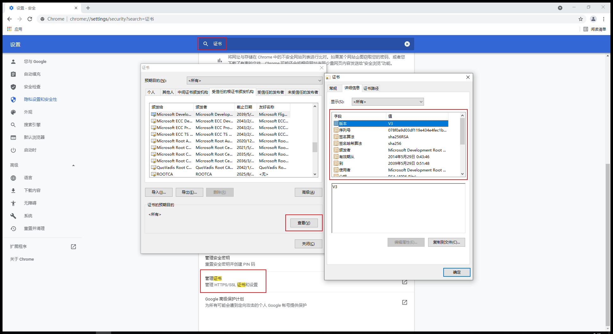


我们登录 baidu.com，查看它的数字证书，可以看到颁发的数字证书使用者是百度：

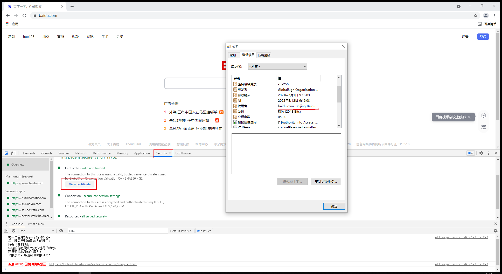


## 数字证书的签署

### 根认证机构的构建

简要流程：

1. 根认证机构「CA」生成公钥 `ca_KeyPub` 和私钥 `ca_KeyPri`，以及基本信息表 `ca_Info`。`ca_Info` 中一般包含了「CA」的名称、证书的有效期等信息。
2. 根认证机构「CA」对（`ca_KeyPub` + `ca_Info`）进行散列运算，得到散列值 `ca_Hash`。
3. 根认证机构「CA」使用其私钥 `ca_KeyPri` 对 `ca_Hash` 进行非对称加密，得到加密的散列值 `enc_ca_Hash`。
4. 根认证机构「CA」将（`ca_KeyPub` + `ca_Info` + `enc_ca_Hash`）组合生成自签名的数字证书**「ca_Cert」**。这张证书称之为根证书。

根证书**「ca_Cert」**包含的内容：`ca_KeyPub` + `ca_Info` + `enc_ca_Hash`。

**「ca_Cert」**可用于签署下一级的证书。


### 单级认证机构的证书签署

简要流程：

1. 服务器「S」生成公钥 `s_KeyPub` 和私钥 `s_KeyPri`，以及基本信息表 `s_Info`。`s_Info` 中一般包含了「S」的名称、证书要求的有效期等信息。
2. 服务器「S」将 `s_KeyPub`、`s_Info` 送给根认证机构「CA」。
3. 根认证机构「CA」通过某种方式验证「S」的身份之后，再加上根认证机构自己的一些信息 `ca_Info`，然后对它们（`s_KeyPub` + `s_Info` + `ca_Info`）进行散列运算，得到散列值 `s_Hash`。
4. 根认证机构「CA」使用其私钥 `ca_KeyPri` 对 `s_Hash` 进行非对称加密，得到加密的散列值 `enc_s_Hash`。
5. 根认证机构「CA」将（`s_KeyPub` + `s_Info` + `ca_Info` + `enc_s_Hash`）组合签署成数字证书**「s_Cert」**并回送给「S」。

服务器证书**「s_Cert」**包含的内容：`s_KeyPub` + `s_Info` + `ca_Info` + `enc_s_Hash`。

**「s_Cert」**不可用于签署下一级的证书。


### 二级（或以上）认证机构的构建

简要流程：

1. 二级认证机构「CA2」生成公钥 `ca2_KeyPub` 和私钥 `ca2_KeyPri`，以及基本信息表 `ca2_Info`。`ca2_Info` 中一般包含了「CA2」的名称、证书要求的有效期等信息。
2. 二级认证机构「CA2」将 `ca2_KeyPub`、`ca2_Info` 送给根认证机构「CA」。
3. 根认证机构「CA」通过某种方式验证「CA2」的身份之后，再加上根认证机构自己的一些信息 `ca_Info`，然后对它们（`ca2_KeyPub` + `ca2_Info` + `ca_Info`）进行散列运算，得到散列值 `ca2_Hash`。
4. 根认证机构「CA」使用其私钥 `ca_KeyPri` 对 `ca2_Hash` 进行非对称加密，得到加密的散列值 `enc_ca2_Hash`。
5. 根认证机构「CA」将（`ca2_KeyPub` + `ca2_Info` + `ca_Info` + `enc_ca2_Hash`）组合签署成数字证书**「ca2_Cert」**并回送给「CA2」。

二级认证机构证书**「ca2_Cert」**包含的内容：`ca2_KeyPub` + `ca2_Info` + `ca_Info` + `enc_ca2_Hash`。

**「ca2_Cert」**可用于签署下一级的证书。

三级或更多级认证机构的构建流程跟这个流程差不多，这里就不再赘述了。


### 二级（或以上）认证机构的证书签署

简要流程：

1. 服务器「S2」生成公钥 `s2_KeyPub` 和私钥 `s2_KeyPri`，以及基本信息表 `s2_Info`。`s2_Info` 中一般包含了「S2」的名称、证书要求的有效期等信息。
2. 服务器「S2」将 `s2_KeyPub`、`s2_Info` 送给二级认证机构「CA2」。
3. 二级认证机构「CA2」通过某种方式验证「S2」的身份之后，再加上根认证机构自己的一些信息 `ca2_Info`，然后对它们（`s2_KeyPub` + `s2_Info` + `ca2_Info`）进行散列运算，得到散列值 `s2_Hash`。
4. 二级认证机构「CA2」使用其私钥 `ca2_KeyPri` 对 `s2_Hash` 进行非对称加密，得到加密的散列值 `enc_s2_Hash`。
5. 二级认证机构「CA2」将（`s2_KeyPub` + `s2_Info` + `ca2_Info` + `enc_s2_Hash`）组合签署成数字证书**「s2_Cert」**并回送给「S2」。

服务器证书**「s2_Cert」**包含的内容：`s2_KeyPub` + `s2_Info` + `ca2_Info` + `enc_s2_Hash`。

**「s2_Cert」**不可用于签署下一级的证书。

三级或更多级认证机构证书签署流程跟这个流程差不多，也不再赘述了。

从上面可以看出，证书签署的流程是：**「ca_Cert」**-> **「ca2_Cert」**->**「s2_Cert」**。它是一条完整的链条，我们把它称之为「证书链」。

如下图，可以看到中间证书颁发机构的上级颁发者。

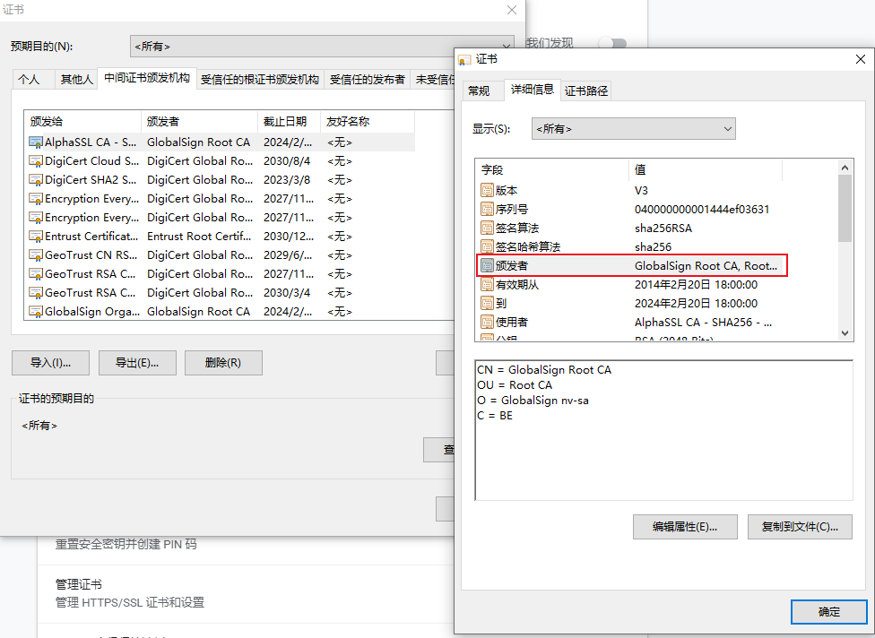

也可以查看证书路径

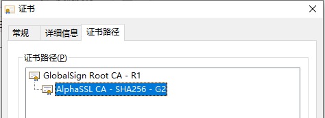


## 数字证书的应用

### 服务器的配置

如果服务器「S」使用的证书是由根认证机构「CA」直接签署的，那么只需要向客户端提供**「s_Cert」**，然后自己使用私钥 `s_KeyPri` 即可实现非对称加密。

如果服务器「S2」使用的证书不是由根认证机构「CA」直接签署的，则不仅需要向客户端提供**「s2_Cert」**，而且还要提供除根认证机构「CA」之外所有认证机构的证书（这里还要提供**「ca2_Cert」**），否则客户端可能会提示证书链不完整而无法通过验证。服务器自己使用私钥 `s2_KeyPri` 即可实现非对称加密。


### 客户端验证服务器的身份

#### 单级认证机构的验证

简要流程：

（假设根认证机构「CA」的根证书**「ca_Cert」**已经安装到操作系统中且被信任。下同。）

1. 服务器「S」下发证书**「s_Cert」**给客户端「C」。
2. 客户端「C」检查到**「s_Cert」**中的 `ca_Info`，发现它是由「CA」签署的。
3. 客户端「C」取出**「ca_Cert」**中的 `ca_KeyPub`，对**「s_Cert」**中的 `enc_s_Hash` 进行解密得到 `s_Hash`。
4. 客户端「C」对**「s_Cert」**中的（`s_KeyPub` + `s_Info` + `ca_Info`）进行散列运算，得到散列值 `s_Hash_tmp`。
5. 客户端「C」判断 `s_Hash` 和 `s_Hash_tmp` 是否相等。如果两者相等，则证明**「s_Cert」**是由**「ca_Cert」**签署的。
6. 客户端「C」检查**「ca_Cert」**，发现该证书是根证书，且已经被系统信任，身份验证通过。

> 如果**「ca_Cert」**没有安装到系统中，那么将无法对 `enc_s_Hash` 进行解密，也就无法验证**「s_Cert」**的真实性了。下同。


#### 二级（或以上）认证机构的验证

简要流程：

1. 服务器「S2」下发证书**「s2_Cert」**、**「ca2_Cert」**给客户端「C」。
2. 客户端「C」检查到**「s2_Cert」**中的 `ca2_Info`，发现它是由「CA2」签署的。
3. 客户端「C」取出**「ca2_Cert」**中的 `ca2_KeyPub`，对**「s2_Cert」**中的 `enc_s2_Hash` 进行解密得到 `s2_Hash`。
4. 客户端「C」对**「s2_Cert」**中的（`s2_KeyPub` + `s2_Info` + `ca2_Info`）进行散列运算，得到散列值 `s2_Hash_tmp`。
5. 客户端「C」判断 `s2_Hash` 和 `s2_Hash_tmp` 是否相等。如果两者相等，则证明**「s2_Cert」**是由**「ca2_Cert」**签署的。
6. 客户端「C」检查到**「ca2_Cert」**中的 `ca_Info`，发现它是由「CA」签署的。
7. 客户端「C」取出**「ca_Cert」**中的 `ca_KeyPub`，对**「ca2_Cert」**中的 `enc_ca2_Hash` 进行解密得到 `ca2_Hash`。
8. 客户端「C」对**「ca2_Cert」**中的（`ca2_KeyPub` + `ca2_Info` + `ca_Info`）进行散列运算，得到散列值 `ca2_Hash_tmp`。
9. 客户端「C」判断 `ca2_Hash` 和 `ca2_Hash_tmp` 是否相等。如果两者相等，证明**「ca2_Cert」**是由**「ca_Cert」**签署的。
10. 客户端「C」检查**「ca_Cert」**，发现该证书是根证书，且已经被系统信任，身份验证通过。

三级或更多级认证机构证书验证流程跟这个流程差不多，就是一环扣一环地验证下去。


### 加密传输的数据

服务器「S」的身份得到客户端「C」的认可之后，服务器「S」可以使用 `s_KeyPri` 对传出的数据进行加密或者对传入的数据进行解密。

反过来，客户端「C」可以使用 `s_KeyPub` 对传出的数据进行加密或者对传入的数据进行解密。

由于非对称加密的效率较低，所以一般使用非对称加密协商并交换一个临时的会话密钥之后，使用会话密钥进行对称加密。


---

# SSL/TLS

HTTP 由于是明⽂传输，所谓的明文，就是说客户端与服务端通信的信息都是肉眼可见的，随意使⽤⼀个抓包⼯具 都可以截获通信的内容。 所以安全上存在以下三个风险： 

- 窃听风险，比如通信链路上可以获取通信内容，⽤户号容易没。
- 篡改风险，比如强制植⼊垃圾⼴告，视觉污染，⽤户眼容易瞎。 
- 冒充风险，比如冒充淘宝网站，⽤户钱容易没。 

HTTPS 在 HTTP 与 TCP 层之间加⼊了 TLS 协议，来解决上述的⻛险。

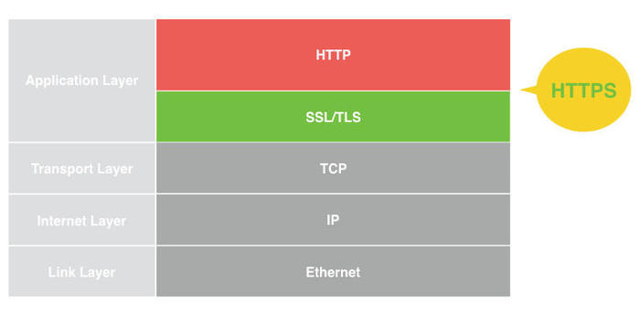 

SSL（Secure Socket Layer，安全套接字层）：1994年为 Netscape 所研发，SSL 协议位于 TCP/IP 协议与各种应用层协议之间，为数据通讯提供安全支持。

TLS（Transport Layer Security，传输层安全）：其前身是 SSL，它最初的几个版本（SSL 1.0、SSL 2.0、SSL 3.0）由网景公司开发，1999 年从 3.1 开始被 IETF 标准化并改名，发展至今已经有 TLS 1.0、TLS 1.1、TLS 1.2 三个版本。SSL3.0 和 TLS1.0 由于存在安全漏洞，已经很少被使用到。TLS 1.3 改动会比较大，目前还在草案阶段，目前使用最广泛的是 TLS 1.1、TLS 1.2。


## TLS握手过程

下图简要概述来 TLS 的握⼿过程，其中每⼀个「框」都是⼀个记录（record），记录是 TLS 收发数据的基本单 位，类似于 TCP ⾥的 segment。多个记录可以组合成⼀个 TCP 包发送，所以通常经过「四个消息」就可以完成 TLS 握⼿，也就是需要 2个 RTT 的时延，然后就可以在安全的通信环境⾥发送 HTTP 报⽂，实现 HTTPS 协议。

所以可以发现，HTTPS 是应⽤层协议，需要先完成 TCP 连接建⽴，然后⾛ TLS 握⼿过程后，才能建⽴通信安全的连接。

 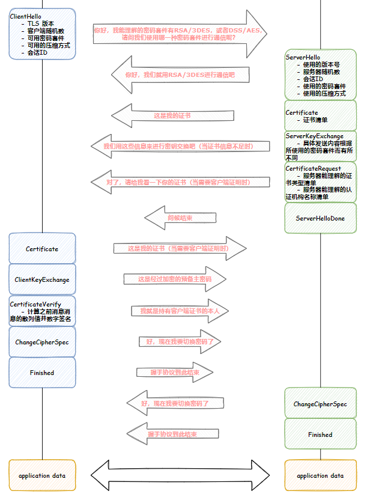

事实上，不同的密钥交换算法， TLS 的握手过程可能会有⼀些区别。

这⾥先简单介绍下密钥交换算法，因为考虑到性能的问题，所以双方在加密应用信息时使用的是对称加密密钥，而对称加密密钥是不能被泄漏的，为了保证对称加密密钥的安全性，所以使⽤非对称加密的⽅式来保护对称加密密钥的协商，这个⼯作就是密钥交换算法负责的。

接下来，我们就以最简单的 RSA 密钥交换算法，来看看它的 TLS 握⼿过程。

[TLS 在线交互](https://tls13.xargs.org/)


## HTTPS RSA握手过程

传统的 TLS 握手基本都是使用 RSA 算法来实现密钥交换的，在将 TLS 证书部署服务端时，证书文件中包含⼀对公私钥，其中公钥会在 TLS 握手阶段传递给客户端，私钥则⼀直留在服务端，⼀定要确保私钥不能被窃取。 

在 RSA 密钥协商算法中，客户端会生成随机密钥，并使用服务端的公钥加密后再传给服务端。根据非对称加密算法，公钥加密的消息仅能通过私钥解密，这样服务端解密后，双方就得到了相同的密钥，再用它加密应用消息。

用 wireshark 工具可以抓取用 RSA 密钥交换的 TLS 握手过程，可以从下图看到，一共经历了四次握手：

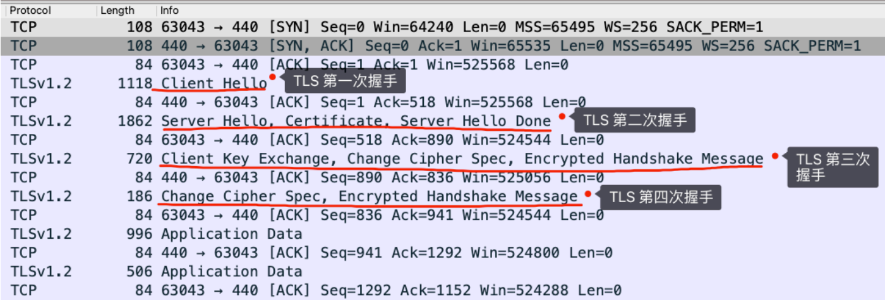

那么接下来针对每一个 TLS 握手做进一步介绍

### TLS第一次握手

客户端⾸先会发⼀个「Client Hello」消息，字面意思我们也能理解到，这是跟服务器「打招呼」。    

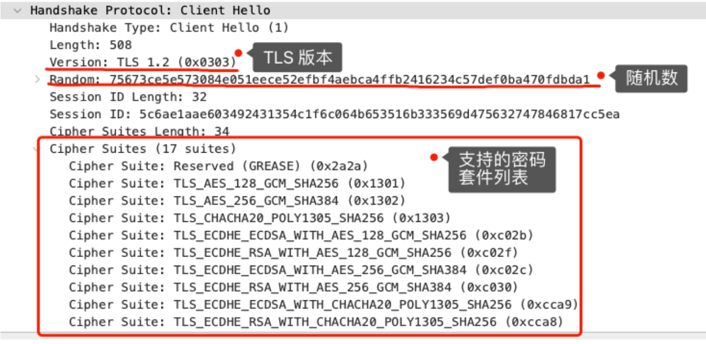

消息里面有客户端使用的 TLS 版本号、⽀持的密码套件列表，以及⽣成的随机数（Client Random） ，这个随机数会被服务端保留，它是生成对称加密密钥的材料之⼀。


### TLS第二次握手

当服务端收到客户端的「Client Hello」消息后，会确认 TLS 版本号是否⽀持，和从密码套件列表中选择⼀个密码套件，以及生成随机数（Server Random）。

接着，返回「Server Hello」消息，消息⾥⾯有服务器确认的 TLS 版本号，也给出了随机数（Server Random）， 然后从客户端的密码套件列表选择了⼀个合适的密码套件。

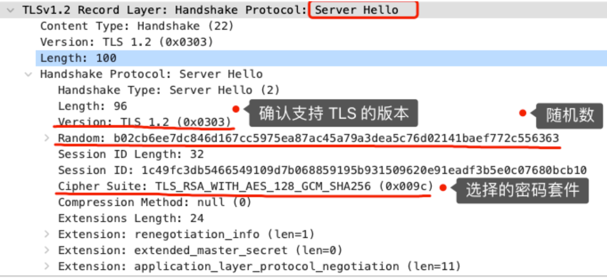

可以看到，服务端选择的密码套件是 “Cipher Suite: TLS_RSA_WITH_AES_128_GCM_SHA256”。

这个密码套件看起来真让人头晕，但是其实它是有固定格式和规范的。

基本的形式是「密钥交换算法 + 签名算法 + 对称加密算法 + 摘要算法」， ⼀般 WITH 单词前⾯有两个单词，第⼀个单词是约定密钥交换的算法， 第⼆个单词是约定证书的验证算法。

比如刚才的密码套件的意思就是： 

- 由于 WITH 单词只有⼀个 RSA，则说明握⼿时密钥交换算法和签名算法都是使用 RSA； 
- 握⼿后的通信使⽤ AES 对称算法，密钥长度 128 位，分组模式是 GCM； 
- 摘要算法 SHA256 用于消息认证和产生随机数；

就前面这两个客户端和服务端相互「打招呼」的过程，客户端和服务端就已确认了 TLS 版本和使用的密码套件， 而且你可能发现客户端和服务端都会各自生成⼀个随机数，并且还会把随机数传递给对方。

那这个随机数有什么用呢？其实这两个随机数是后续作为生成「会话密钥」的条件，所谓的会话密钥就是数据传输时，所使用的对称加密密钥。


然后，服务端为了证明⾃⼰的身份，会发送「Server Certificate」给客户端，这个消息⾥含有数字证书。    

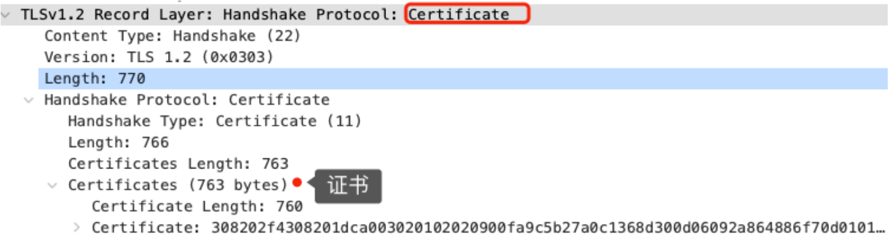

随后，服务端发了「Server Hello Done」消息，目的是告诉客户端，我已经把该给你的东⻄都给你了，本次打招呼完毕。

客户端拿到服务端的数字证书后，验证服务器，如果验证通过则客户端可以拿到服务器的公钥了。


### TLS第三次握手

客户端就会⽣成⼀个新的随机数 (pre-master)，用服务器 的 RSA 公钥加密该随机数，通过「Change Cipher Key Exchange」消息传给服务端。

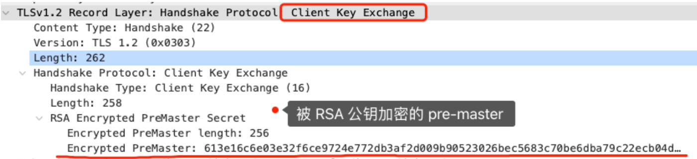

服务端收到后，用 RSA 私钥解密，得到客户端发来的随机数 (pre-master)。

⾄此， 客户端和服务端双⽅都共享了三个随机数，分别是 Client Random、 Server Random、 pre-master。

于是，双⽅根据已经得到的三个随机数，⽣成会话密钥（Master Secret） ，它是对称密钥，⽤于对后续的 HTTP 请求/响应的数据加解密。

⽣成完会话密钥后，然后客户端发⼀个「Change Cipher Spec」，告诉服务端开始使⽤加密⽅式发送消息。

然后，客户端再发⼀个「Encrypted Handshake Message（Finishd） 」消息，把之前所有发送的数据做个摘要，再⽤会话密钥（master secret）加密⼀下，让服务器做个验证，验证加密通信是否可用和之前握手信息是否有被中途篡改过。

可以发现，「Change Cipher Spec」之前传输的 TLS 握⼿数据都是明文，之后都是对称密钥加密的密文。  


### TLS第四次握手

服务器也是同样的操作，发「Change Cipher Spec」和「Encrypted Handshake Message」消息，如果双方都验证加密和解密没问题，那么握⼿正式完成。

最后，就用「会话密钥」加解密 HTTP 请求和响应了。


### RSA算法的缺陷

使用 RSA 密钥协商算法的最⼤问题是不支持前向保密。因为客户端传递随机数（用于生成对称加密密钥的条件之⼀）给服务端时使用的是公钥加密的，服务端收到到后，会用私钥解密得到随机数。所以⼀旦服务端的私钥泄漏了，过去被第三⽅截获的所有 TLS 通讯密文都会被破解。

为了解决这⼀问题，于是就有了 DH 密钥协商算法：

- 客户端和服务端各自会生成随机数，并以此作为私钥，然后根据公开的 DH 计算公示算出各⾃的公钥
- 通过 TLS 握⼿双方交换各自的公钥，这样双⽅都有自己的私钥和对方的公钥
- 然后双方根据各自持有的材料算出⼀个随机数，这个随机数的值双⽅都是⼀样的，这就可以作为后续对称加密时使用的密钥

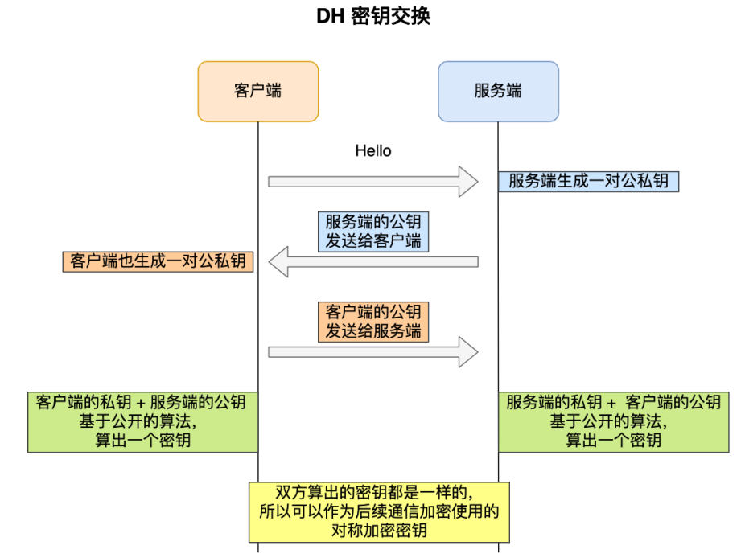

DH 密钥交换过程中， 即使第三⽅截获了 TLS 握⼿阶段传递的公钥，在不知道的当时客户端或服务端私钥的情况下，也是无法计算出密钥的，实现前向保密。

但因为 DH 算法的计算效率问题，后⾯出现了 ECDHE 密钥协商算法，我们现在大多数网站使用的正是 ECDHE 密钥协商算法。

> DH 算法随机生成的公钥怎么进行数字证书的签署呢？请带着这个疑问去看 ECDHE 算法的握手过程


## HTTPS ECDHE握手过程

HTTPS 常用的密钥交换算法有两种，分别是 RSA 和 ECDHE 算法。 

其中， RSA 是比较传统的密钥交换算法，它不具备前向安全的性质，因此现在很少服务器使用的。而 ECDHE 算法具有前向安全，所以被广泛使用。

### DH算法

ECDHE 密钥协商算法是 DH 算法演进过来的，所以我们先从 DH 算法说起。

DH 算法是非对称加密算法， 因此它可以用于密钥交换，该算法的核心数学思想是离散对数。

离散对数是「离散 + 对数」的两个数学概念的组合，所以我们先来复习⼀遍对数。

要说起对数，必然要说指数，因为它们是互为反函数，指数就是幂运算，对数是指数的逆运算。

举个栗子，如果以 2 作为底数，那么指数和对数运算公式，如下图所示：

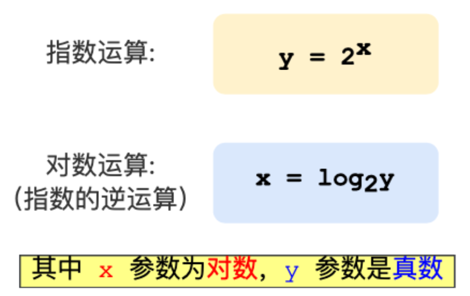

那么对于底数为 2 的时候， 32 的对数是 5， 64 的对数是 6，计算过程如下：

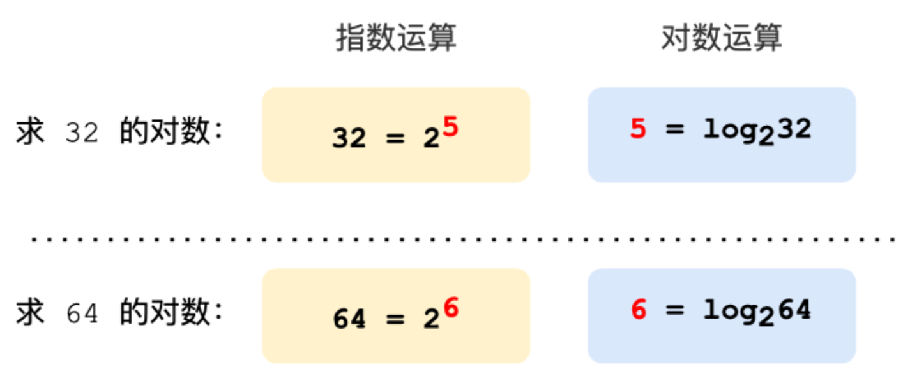

对数运算的取值是可以连续的，而离散对数的取值是不能连续的，因此也以「离散」得名， 离散对数是在对数运算的基础上加了「模运算」，也就说取余数，对应编程语⾔的操作符是「%」，也可以⽤ mod 表示。离散对数的概念如下图：

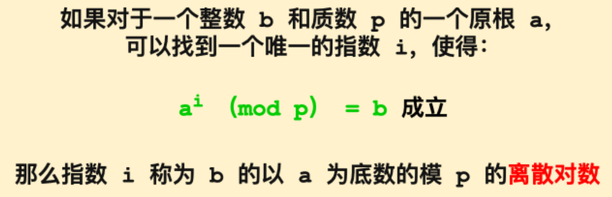

上图的，底数 a 和模数 p 是离散对数的公共参数，也就说是公开的， b 是真数， i 是对数。

知道了对数，就可以用上⾯的公式计算出真数。但反过来，知道真数却很难推算出对数。特别是当模数 p 是⼀个很⼤的质数，即使知道底数 a 和真数 b ，在现有的计算机的计算⽔平是几乎无法算出离散对数的，这就是 DH 算法的数学基础。

认识了离散对数，我们来看看 DH 算法是如何密钥交换的。

现假设小红和小明约定使⽤ DH 算法来交换密钥，那么基于离散对数，小红和小明需要先确定模数和底数作为算法的参数，这两个参数是公开的，用 P 和 G 来代称。 然后小红和小明各自生成⼀个随机整数作为私钥，双方的私钥要各自严格保管，不能泄漏，小红的私钥用 a 代称， 小明的私钥用 b 代称。 现在小红和小明双⽅都有了 P 和 G 以及各⾃的私钥，于是就可以计算出公钥：

- 小红的公钥记作 A， A = G ^ a ( mod P )； 
- 小明的公钥记作 B， B = G ^ b ( mod P )；

A 和 B 也是公开的，因为根据离散对数的原理，从真数（A 和 B）反向计算对数 a 和 b 是⾮常困难的，至少在现有计算机的计算能力是无法破解的，如果量子计算机出来了，那就有可能被破解，当然如果量子计算机真的出来了， 那么密钥协商算法就要做大的升级了。    

双⽅交换各自 DH 公钥后，小红手上共有 5 个数： P、 G、 a、 A、 B，小明手上也同样共有 5 个数： P、 G、 b、 B、 A。 然后小红执行运算： B ^ a ( mod P )，其结果为 K，因为离散对数的幂运算有交换律，所以小明执⾏运算： A ^ b ( mod P )，得到的结果也是 K。

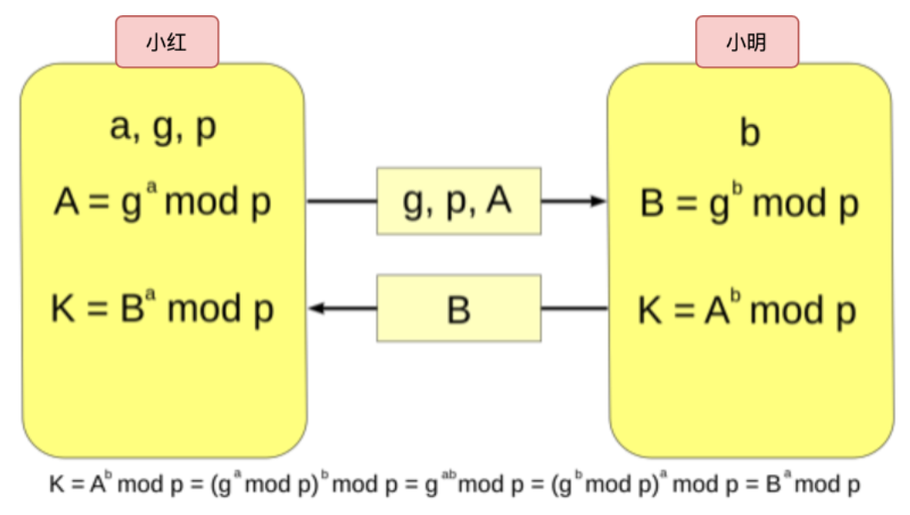

这个 K 就是小红和小明之间⽤的对称加密密钥，可以作为会话密钥使用。 

可以看到，整个密钥协商过程中，小红和小明公开了 4 个信息： P、 G、 A、 B，其中 P、 G 是算法的参数， A 和 B 是公钥，而 a、 b 是双⽅各自保管的私钥，黑客无法获取这 2 个私钥，因此⿊客只能从公开的 P、 G、 A、 B 入手， 计算出离散对数（私钥）。 

前⾯也多次强调， 根据离散对数的原理，如果 P 是⼀个大数，在现有的计算机的计算能力是很难破解出私钥 a、 b 的，破解不出私钥，也就⽆法计算出会话密钥，因此 DH 密钥交换是安全的。 

### DHE算法   

根据私钥⽣成的⽅式， DH 算法分为两种实现： 

- static DH 算法，这个是已经被废弃了； 
- DHE 算法，现在常用的；    

static DH 算法⾥有一方的私钥是静态的，也就说每次密钥协商的时候有一方的私钥都是⼀样的，⼀般是服务器方固定，即 a 不变，客户端的私钥则是随机⽣成的。 

于是， DH 交换密钥时就只有客户端的公钥是变化，而服务端公钥是不变的，那么随着时间延⻓，黑客就会截获海量的密钥协商过程的数据，因为密钥协商的过程有些数据是公开的，黑客就可以依据这些数据暴力破解出服务器的私钥，然后就可以计算出会话密钥了，于是之前截获的加密数据会被破解，所以 static DH 算法不具备前向安全性。

既然固定一方的私钥有被破解的风险，那么干脆就让双方的私钥在每次密钥交换通信时，都是随机生成的、临时的，这个方式也就是 DHE 算法， E 全称是 ephemeral（临时性的）。 所以，即使有个牛逼的黑客破解了某⼀次通信过程的私钥，其他通信过程的私钥仍然是安全的，因为每个通信过程的私钥都是没有任何关系的，都是独立的，这样就保证了「前向安全」。 

### ECDHE算法

DHE 算法由于计算性能不佳，因为需要做大量的乘法，为了提升 DHE 算法的性能，所以就出现了现在广泛用于密钥交换算法 ECDHE 算法。 ECDHE 算法是在 DHE 算法的基础上利用了 ECC 椭圆曲线特性，可以用更少的计算量计算出公钥，以及最终的会话密钥。 小红和小明使用 ECDHE 密钥交换算法的过程：

- 双方事先确定好使用哪种椭圆曲线，和曲线上的基点 G，这两个参数都是公开的； 
- 双方各自随机生成⼀个随机数作为私钥d，并与基点 G 相乘得到公钥Q（Q = dG），此时小红的公私钥为 Q1 和 d1，小明的公私钥为 Q2 和 d2； 
- 双⽅交换各自的公钥，最后小红计算点（x1， y1） = d1Q2，⼩明计算点（x2， y2） = d2Q1，由于椭圆曲线上是可以满足乘法交换和结合律，所以 d1Q2 = d1d2G = d2d1G = d2Q1 ，因此双⽅的 x 坐标是⼀样的，所 以它是共享密钥，也就是会话密钥。  

这个过程中，双⽅的私钥都是随机、临时生成的，都是不公开的，即使根据公开的信息（椭圆曲线、公钥、基点 G）也是很难计算出椭圆曲线上的离散对数（私钥）。


### TLS第一次握手

客户端首先会发⼀个「Client Hello」消息，消息里面有客户端使用的 TLS 版本号、支持的密码套件列表，以及生成的随机数（Client Random）。  

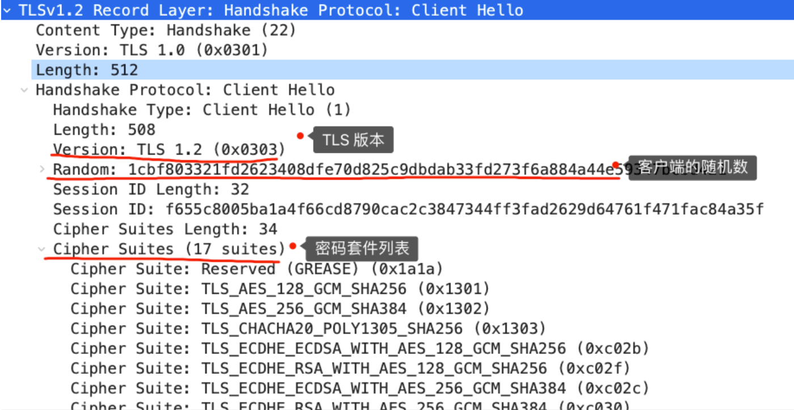


### TLS第二次握手

服务端收到客户端的「打招呼」，同样也要回礼，会返回「Server Hello」消息，消息⾯有服务器确认的 TLS 版本号，也给出了⼀个随机数（Server Random） ，然后从客户端的密码套件列表选择了⼀个合适的密码套件。 

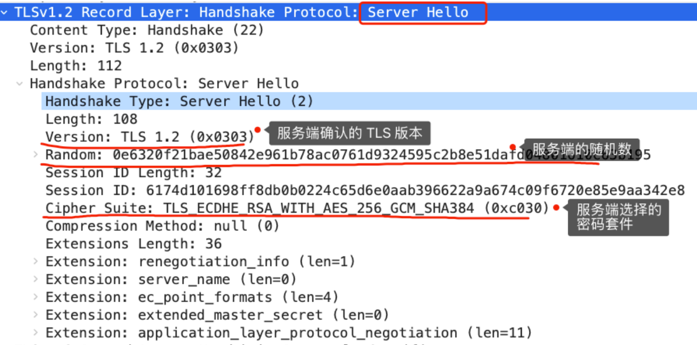

不过，这次选择的密码套件就和 RSA 不⼀样了，我们来分析⼀下这次的密码套件的意思。

「 TLS_ECDHE_RSA_WITH_AES_256_GCM_SHA384」

- 密钥协商算法使用 ECDHE；
- 签名算法使用 RSA；
- 握⼿后的通信使⽤ AES 对称算法，密钥⻓度 256 位，分组模式是 GCM；
- 摘要算法使用 SHA384；

接着，服务端为了证明自己的身份，发送「Certificate」消息，会把证书也发给客户端。  

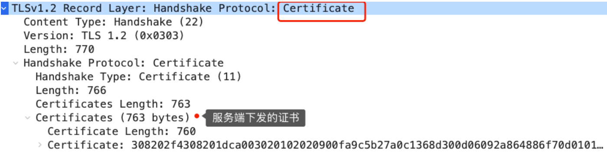

这⼀步就和 RSA 握⼿过程有很⼤到区别了，因为服务端选择了 ECDHE 密钥协商算法，所以会在发送完证书后，发送「Server Key Exchange」消息。  

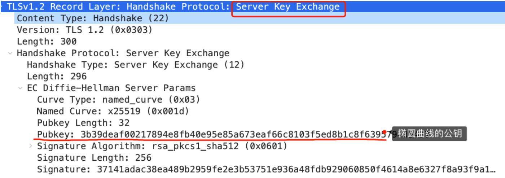

这个过程服务器做了三件事：  

- 选择了名为 named_curve 的椭圆曲线，选好了椭圆曲线相当于椭圆曲线基点 G 也定好了，这些都会公开给客户端；
- 生成随机数作为服务端椭圆曲线的私钥，保留到本地；
- 根据基点 G 和私钥计算出服务端的椭圆曲线公钥，这个会公开给客户端。  

为了保证这个椭圆曲线的公钥不被第三方篡改，服务端会用 RSA 签名算法给服务端的椭圆曲线公钥做个签名。随后，就是「Server Hello Done」消息，服务端跟客户端表明： “这些就是我提供的信息，打招呼完毕”。  

> 这里做签名一是为了验证数字证书；二是为了防止有人篡改公钥，如果不进行签名，那么中间人可以使用自己生成的公钥来欺骗客户端。

至此， TLS 两次握手就已经完成了，目前客户端和服务端通过明文共享了这⼏个信息： Client Random、 Server Random 、使用的椭圆曲线、椭圆曲线基点 G、服务端椭圆曲线的公钥，这几个信息很重要，是后续生成会话密钥的材料。  


### TLS第三次握手

客户端收到了服务端的证书后，自然要校验证书是否合法，如果证书合法，那么服务端到身份就是没问题的。校验证书的过程，会走证书链逐级验证，确认证书的真实性，再用证书的公钥验证签名，这样就能确认服务端的身份了，确认无误后，就可以继续往下走。

客户端会生成⼀个随机数作为客户端椭圆曲线的私钥，然后再根据服务端前⾯给的信息，生成客户端的椭圆曲线公钥，然后用「Client Key Exchange」消息发给服务端。  

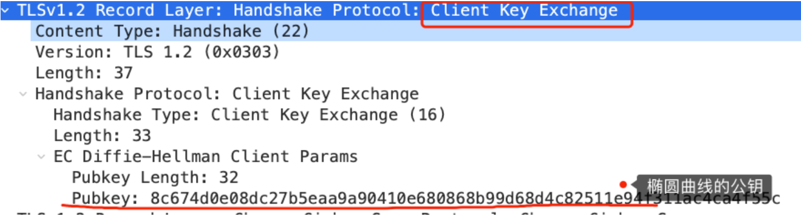

至此，双⽅都有对方的椭圆曲线公钥、自己的椭圆曲线私钥、椭圆曲线基点 G。于是，双方都就计算出点（x，y），其中 x 坐标值双方都是⼀样的，前⾯说 ECDHE 算法时候，说 x 是会话密钥， 但实际应用中， x 还不是最终的会话密钥。

还记得 TLS 握⼿阶段，客户端和服务端都会生成了⼀个随机数传递给对方吗？最终的会话密钥，就是用「客户端随机数 + 服务端随机数 + x（ECDHE 算法算出的共享密钥） 」三个材料生成的。

之所以这么麻烦，是因为 TLS 设计者不信任客户端或服务器「伪随机数」的可靠性，为了保证真正的完全随机，把三个不可靠的随机数混合起来，那么「随机」的程度就非常高了。算好会话密钥后，客户端会发⼀个「Change Cipher Spec」消息，告诉服务端后续改⽤对称算法加密通信。  

接着，客户端会发「Encrypted Handshake Message」消息，把之前发送的数据做⼀个摘要，再用对称密钥加密⼀下，让服务端做个验证，验证下本次生成的对称密钥是否可以正常使用。  


### TLS第四次握手

最后，服务端也会有⼀个同样的操作，发「Change Cipher Spec」和「Encrypted Handshake Message」消息，如果双⽅都验证加密和解密没问题，那么握⼿正式完成。于是，就可以正常收发加密的 HTTP 请求和响应了。  


---

# OpenSSL

OpenSSL 是一个开源项目，其组成主要包括一下三个组件：

- openssl：多用途的命令行工具
- libcrypto：加密算法库
- libssl：加密模块应用库，实现了ssl及tls

openssl可以实现：秘钥证书管理、对称加密和非对称加密。


## 对称加密

对称加密需要使用的标准命令为 enc ，用法如下： 

```shell
[root@luxiaodai ~]# openssl enc -h
unknown option '-h'
options are
-in <file>     input file
-out <file>    output file
-pass <arg>    pass phrase source
-e             encrypt
-d             decrypt
-a/-base64     base64 encode/decode, depending on encryption flag
-k             passphrase is the next argument
-kfile         passphrase is the first line of the file argument
-md            the next argument is the md to use to create a key
                 from a passphrase. See openssl dgst -h for list.
-S             salt in hex is the next argument
-K/-iv         key/iv in hex is the next argument
-[pP]          print the iv/key (then exit if -P)
-bufsize <n>   buffer size
-nopad         disable standard block padding
-engine e      use engine e, possibly a hardware device.
```

 常用选项有：

`-in filename`：指定要加密的文件存放路径

`-out filename`：指定加密后的文件存放路径

`-S`：自动插入一个随机数作为文件内容加密，默认选项

`-e`：可以指明一种加密算法，若不指的话将使用默认加密算法

`-d`：解密，解密时也可以指定算法，若不指定则使用默认算法，但一定要与加密时的算法一致

`-a/-base64`：使用-base64位编码格式

示例：

```shell
[root@luxiaodai ~]# echo 123456 > origin
[root@luxiaodai ~]# cat origin 
123456

[root@luxiaodai ~]# openssl enc -e -aes256 -a -in origin -out jiami
enter aes-256-cbc encryption password:
Verifying - enter aes-256-cbc encryption password:
[root@luxiaodai ~]# cat jiami 
U2FsdGVkX18hNIWEtuXdJFbDls7bOEToJrT7QySRc4A=

[root@luxiaodai ~]# openssl enc -d -aes256 -a -in jiami -out jiemi
enter aes-256-cbc decryption password:
[root@luxiaodai ~]# cat jiemi 
123456
```


## 单向加密

单向加密需要使用的标准命令为 dgst ，用法如下： 

```shell
[root@luxiaodai ~]# openssl dgst -h
unknown option '-h'
options are
-c              to output the digest with separating colons
-r              to output the digest in coreutils format
-d              to output debug info
-hex            output as hex dump
-binary         output in binary form
-hmac arg       set the HMAC key to arg
-non-fips-allow allow use of non FIPS digest
-sign   file    sign digest using private key in file
-verify file    verify a signature using public key in file
-prverify file  verify a signature using private key in file
-keyform arg    key file format (PEM or ENGINE)
-out filename   output to filename rather than stdout
-signature file signature to verify
-sigopt nm:v    signature parameter
-hmac key       create hashed MAC with key
-mac algorithm  create MAC (not neccessarily HMAC)
-macopt nm:v    MAC algorithm parameters or key
-engine e       use engine e, possibly a hardware device.
-md4            to use the md4 message digest algorithm
-md5            to use the md5 message digest algorithm
-ripemd160      to use the ripemd160 message digest algorithm
-sha            to use the sha message digest algorithm
-sha1           to use the sha1 message digest algorithm
-sha224         to use the sha224 message digest algorithm
-sha256         to use the sha256 message digest algorithm
-sha384         to use the sha384 message digest algorithm
-sha512         to use the sha512 message digest algorithm
-whirlpool      to use the whirlpool message digest algorithm
```

常用选项：

`[-md5||-ssh256|-ripemd160|...]` ：指定一种加密算法

`-out filename`：将加密的内容保存到指定文件中

示例：

```shell
[root@luxiaodai ~]# openssl dgst -md5 origin 
MD5(origin)= f447b20a7fcbf53a5d5be013ea0b15af
[root@luxiaodai ~]# echo 123456 | openssl dgst -md5
(stdin)= f447b20a7fcbf53a5d5be013ea0b15af
```

单向加密除了 openssl dgst 工具还有： md5sum，sha1sum，sha224sum，sha256sum ，sha384sum，sha512sum 

```shell
[root@luxiaodai ~]# md5sum origin 
f447b20a7fcbf53a5d5be013ea0b15af  origin
```


## 生成随机数

生成随机数需要用到的标准命令为 rand ，用法如下： 

```shell
[root@luxiaodai ~]# openssl rand -h
Usage: rand [options] num
where options are
-out file             - write to file
-engine e             - use engine e, possibly a hardware device.
-rand file:file:... - seed PRNG from files
-base64               - base64 encode output
-hex                  - hex encode output
```

示例：

```shell
[root@luxiaodai ~]# openssl rand -hex 10
631bffbc6b5f28ad9e50
[root@luxiaodai ~]# openssl rand -hex 10
785b58afc4599350c613
[root@luxiaodai ~]# openssl rand -base64 10
KPxg2+zYM3FoYA==
[root@luxiaodai ~]# openssl rand -base64 10
DE6iicyqLaYaTA==
```


## 生成秘钥对

以RSA为例，首先需要先使用 genrsa 标准命令生成私钥，然后再使用 rsa 标准命令从私钥中提取公钥。 

genrsa用法如下：

```shell
[root@luxiaodai ~]# openssl genrsa -h
usage: genrsa [args] [numbits]
 -des            encrypt the generated key with DES in cbc mode
 -des3           encrypt the generated key with DES in ede cbc mode (168 bit key)
 -idea           encrypt the generated key with IDEA in cbc mode
 -seed
                 encrypt PEM output with cbc seed
 -aes128, -aes192, -aes256
                 encrypt PEM output with cbc aes
 -camellia128, -camellia192, -camellia256
                 encrypt PEM output with cbc camellia
 -out file       output the key to 'file
 -passout arg    output file pass phrase source
 -f4             use F4 (0x10001) for the E value
 -3              use 3 for the E value
 -engine e       use engine e, possibly a hardware device.
 -rand file:file:...
                 load the file (or the files in the directory) into
                 the random number generator
```

常用选项有：

`-out filename`：将生成的私钥保存至指定的文件中

`-des|-des3|-idea`：不同的加密算法

`numbits`：指定生成私钥的大小，默认是2048

一般情况下秘钥文件的权限一定要控制好，只能自己读写，因此可以使用 umask 命令设置生成的私钥权限，示例如下：

```shell
[root@luxiaodai ~]# umask 077 ; openssl genrsa -out priKey
Generating RSA private key, 2048 bit long modulus
....................................................+++
................+++
e is 65537 (0x10001)
[root@luxiaodai ~]# ll priKey 
-rw------- 1 root root 1679 Jul 19 10:19 priKey
```

rsa命令用法如下：

```shell
[root@luxiaodai ~]# openssl rsa -h
unknown option -h
rsa [options] <infile >outfile
where options are
 -inform arg     input format - one of DER NET PEM
 -outform arg    output format - one of DER NET PEM
 -in arg         input file
 -sgckey         Use IIS SGC key format
 -passin arg     input file pass phrase source
 -out arg        output file
 -passout arg    output file pass phrase source
 -des            encrypt PEM output with cbc des
 -des3           encrypt PEM output with ede cbc des using 168 bit key
 -idea           encrypt PEM output with cbc idea
 -seed           encrypt PEM output with cbc seed
 -aes128, -aes192, -aes256
                 encrypt PEM output with cbc aes
 -camellia128, -camellia192, -camellia256
                 encrypt PEM output with cbc camellia
 -text           print the key in text
 -noout          don't print key out
 -modulus        print the RSA key modulus
 -check          verify key consistency
 -pubin          expect a public key in input file
 -pubout         output a public key
 -engine e       use engine e, possibly a hardware device.
```

常用选项：

常用选项：

`-in filename`：指明私钥文件

`-out filename`：指明将提取出的公钥保存至指定文件中 

`-pubout`：根据私钥提取出公钥

示例：

```shell
[root@luxiaodai ~]# openssl rsa -in priKey -out pubKey -pubout
writing RSA key
[root@luxiaodai ~]# cat pubKey 
-----BEGIN PUBLIC KEY-----
MIIBIjANBgkqhkiG9w0BAQEFAAOCAQ8AMIIBCgKCAQEAp4khqrS5BEg6e5m8tJUt
N2Q8CQRl9NEh5EaScWc4biLwxWIwO7FNaio7bZwu0UkJ3aR9HzJHUxpF2xVRNAkK
A8F5vadpKgNgNJtp/3aAiuVDHHhCnT6Ny30wan/pbV4IwzWGZvgMDgoSyVepRroc
rCo3kOoSIGTSAu/50arJKkgiaxesIxSUvu/o5nj/+lF+XSuOE+aISBReo9QN3W5o
0Zo+1wK3xEsCtN3Wu/hSOxotKnsdBiLgS2IYjvSnWfYIn7j63MhurBhzrT4qbwCu
IuDRZnXsDGoHVx01skkRcGqHXI4YvpVBEUobR6HU3g0Cv+NwsFmfSxIB1w288DJm
2QIDAQAB
-----END PUBLIC KEY-----
```


测试秘钥对

```shell
[root@luxiaodai ~]# openssl rsautl -encrypt -in origin -inkey pubKey -pubin -out rsa.encrypt
[root@luxiaodai ~]# openssl rsautl -decrypt -in rsa.encrypt -inkey priKey -out rsa.decrypy
[root@luxiaodai ~]# cat rsa.decrypy 
123456
```


## 创建CA和申请证书

我们将自己建立一个根认证机构，然后直接用它来签署证书（即单级认证机构）。

整个证书系统默认使用 RSA4096 和 SHA512 算法。

根认证机构的有效期为 10 年，签署出来的证书有效期为 1 年。

### 创建工作目录并进入

执行以下命令：

```shell
mkdir ./test_pki && cd ./test_pki
```

### 创建证书序列号文件

执行以下命令：

```shell
echo 01 > serial
```

### 创建证书数据库文件

执行以下命令：

```shell
touch index.txt
```

### 创建 openssl 配置文件

执行以下命令：

```shell
cat << EOF >> test_pki.cnf
```

把以下内容直接粘贴到命令行窗口中按回车即可。

```shell
[ ca ]
default_ca      = CA

[ CA ]
dir            = .    
database       = \$dir/index.txt         
new_certs_dir  = \$dir           

certificate    = \$dir/ca_cert.pem        
serial         = \$dir/serial            
private_key    = \$dir/ca_key.pem 
RANDFILE       = \$dir/.rand

default_bits = 4096
default_days   = 365                   
default_crl_days = 30                   
default_md     = sha512                    
unique_subject = no                     

policy         = policy_anything            

[ policy_anything ]
countryName             = supplied
stateOrProvinceName     = supplied
localityName            = supplied
organizationName        = supplied
organizationalUnitName  = optional
commonName              = supplied
emailAddress            = optional
EOF
```

### 创建自签名的根认证机构

执行以下命令：

```shell
openssl req -x509 -nodes -days 3650 -newkey rsa:4096 -keyout ca_key.pem -out ca_cert.pem -new -sha512
```

执行结果：（请根据提示填写相关信息）

```shell
Generating a 4096 bit RSA private key
......................................++
..........................................................................................................++
writing new private key to 'ca_key.pem'
-----
You are about to be asked to enter information that will be incorporated
into your certificate request.
What you are about to enter is what is called a Distinguished Name or a DN.
There are quite a few fields but you can leave some blank
For some fields there will be a default value,
If you enter '.', the field will be left blank.
-----
Country Name (2 letter code) [XX]:CN  
State or Province Name (full name) []:ZJ
Locality Name (eg, city) [Default City]:HZ
Organization Name (eg, company) [Default Company Ltd]:Trinet
Organizational Unit Name (eg, section) []:Dev
Common Name (eg, your name or your server's hostname) []:LZ    
Email Address []:lz@hztrinet.com

```

执行完之后将生成根认证机构证书 `ca_cert.pem` 以及它的私钥 `ca_key.pem`。 

### 创建用户证书请求以及证书私钥

执行以下命令：

```shell
openssl req -nodes -new -newkey rsa:4096 -keyout cert1_key.pem -out cert1_csr.pem
```

同样的，根据上述提示填写相关信息即可。如果出现 `A challenge password []:` 的话留空直接按回车就好了。

```shell
Generating a 4096 bit RSA private key
....................................................++
.........................++
writing new private key to 'cert1_key.pem'
-----
You are about to be asked to enter information that will be incorporated
into your certificate request.
What you are about to enter is what is called a Distinguished Name or a DN.
There are quite a few fields but you can leave some blank
For some fields there will be a default value,
If you enter '.', the field will be left blank.
-----
Country Name (2 letter code) [XX]:CN    
State or Province Name (full name) []:ZJ
Locality Name (eg, city) [Default City]:HZ
Organization Name (eg, company) [Default Company Ltd]:Trinet
Organizational Unit Name (eg, section) []:test
Common Name (eg, your name or your server's hostname) []:XiaoMing
Email Address []:xiaoming@hztrinet.com  

Please enter the following 'extra' attributes
to be sent with your certificate request
A challenge password []:
An optional company name []:
```

执行完之后将生成用户的证书请求文件 `cert1_csr.pem` 以及它的私钥 `cert1_key.pem`。

### 使用认证机构的私钥为用户签署证书

执行以下命令：

```shell
openssl ca -in cert1_csr.pem -out cert1_cert.pem -config test_pki.cnf
```

运行结果： 

```shell
Using configuration from test_pki.cnf
Check that the request matches the signature
Signature ok
The Subject's Distinguished Name is as follows
countryName           :PRINTABLE:'CN'
stateOrProvinceName   :ASN.1 12:'ZJ'
localityName          :ASN.1 12:'HZ'
organizationName      :ASN.1 12:'Trinet'
organizationalUnitName:ASN.1 12:'test'
commonName            :ASN.1 12:'XiaoMing'
emailAddress          :IA5STRING:'xiaoming@hztrinet.com'
Certificate is to be certified until Jul 19 08:02:31 2022 GMT (365 days)
Sign the certificate? [y/n]:y


1 out of 1 certificate requests certified, commit? [y/n]y
Write out database with 1 new entries
Data Base Updated
```

执行完之后将生成用户的证书文件 `cert1_cert.pem`。

用户使用 `cert1_cert.pem` 和 `cert1_key.pem` 即可实现身份验证以及非对称加密。

### 查看结果

我把根证书 `ca_cert.pem` 导入到 chrome浏览器中并设置为信任

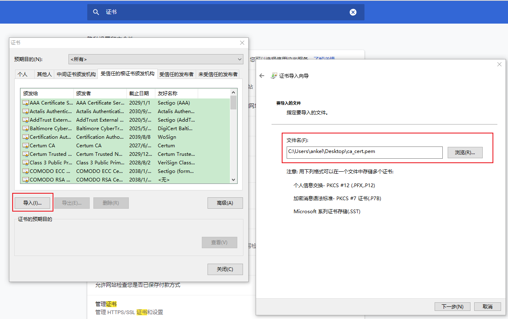

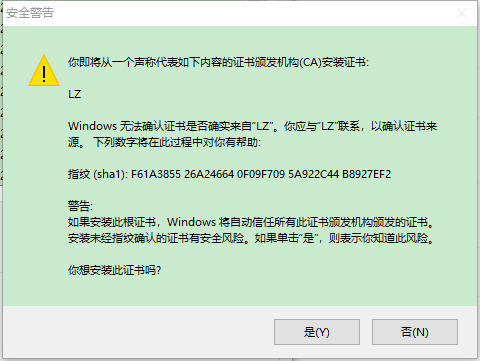


再导入 `cert1_cert.pem`，查看证书的详情时可以看到以下结果：

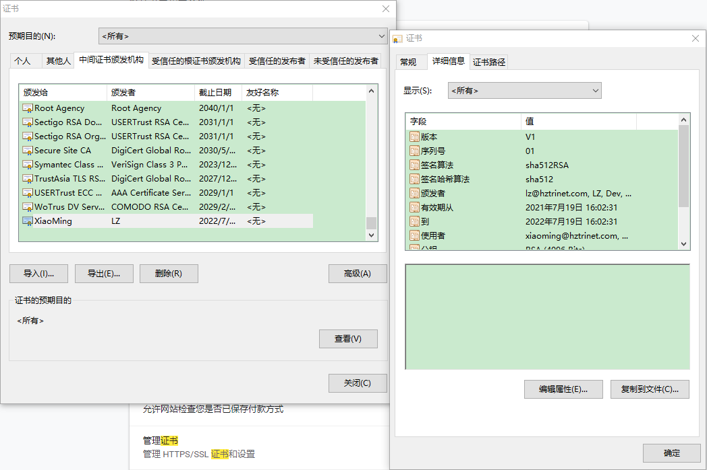

很明显能看到 XiaoMing 是由 LZ 颁发，而认证机构 LZ 已经被系统信任，信任链就是这样建立起来的。


---

# 参考与感谢

- [密码破解的利器——彩虹表（rainbow table）](https://www.jianshu.com/p/732d9d960411 )
- [X.509证书的编码及解析：程序解析以及winhex模板解析](https://www.cnblogs.com/jiu0821/p/4598352.html)
- [SSL/TLS握手过程](https://www.cnblogs.com/barrywxx/p/8570715.html )
- [openssl用法详解](https://www.cnblogs.com/yangxiaolan/p/6256838.html)
- [TLS 在线交互](https://tls13.xargs.org/)


