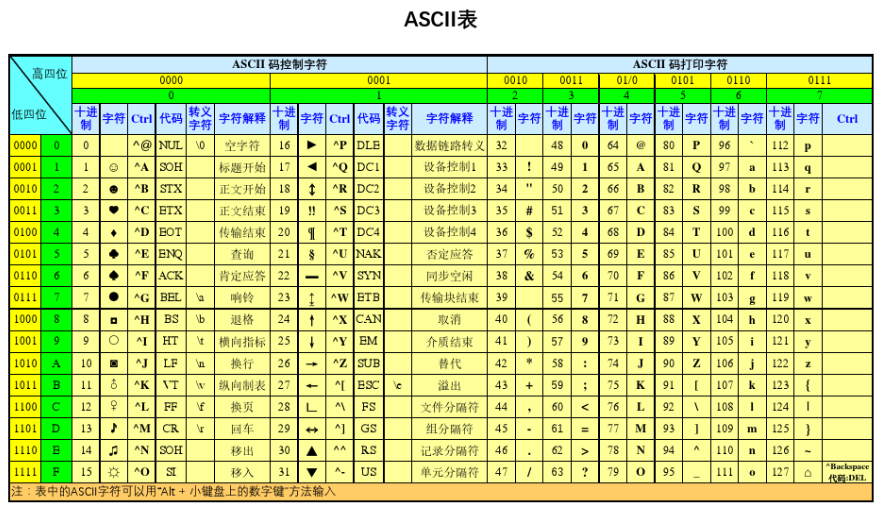

字符编码是计算机技术的基石，想要熟练使用计算机，就必须懂得一点字符编码的知识。而且在日常处理信息的时候我们经常会被各种编码混淆，甚是烦人，要想正确的使用编解码，就得了解这些格式到底是为何而来。


# ASCII码

我们知道，计算机内部，所有信息最终都是一个二进制值。每一个二进制位（bit）有 `0` 和 `1` 两种状态，因此 8 bit 就可以组合出 256 种状态，这被称为一个字节（byte）。也就是说，一个字节一共可以用来表示 256 种不同的状态，每一个状态对应一个符号，就是 256 个符号，从 `00000000` 到 `11111111`。

上个世纪 60 年代，美国制定了一套字符编码，对英语字符与二进制位之间的关系，做了统一规定。这被称为 ASCII 码，一直沿用至今。

ASCII 码一共规定了 128 个字符的编码，比如空格 `SPACE` 是 32（二进制 `00100000`），大写的字母 `A` 是 65（二进制 `01000001`）。

这 128 个符号（包括 32 个不能打印出来的控制符号），只占用了一个字节的后面 7 位，最前面的一位统一规定为 0。

 


# 非 ASCII 编码

英语用 128 个符号编码就够了，但是用来表示其他语言，128 个符号是不够的。

比如，在法语中，字母上方有注音符号，它就无法用 ASCII 码表示。于是，一些欧洲国家就决定，利用字节中闲置的最高位编入新的符号。比如，法语中的 `é` 的编码为 130（二进制 `10000010`）。这样一来，这些欧洲国家使用的编码体系，可以表示最多 256 个符号。

但是，这里又出现了新的问题。不同的国家有不同的字母，因此，哪怕它们都使用 256 个符号的编码方式，代表的字母却不一样。比如，130 在法语编码中代表了 `é`，在希伯来语编码中却代表了字母 `Gimel` (`ג`)，在俄语编码中又会代表另一个符号。但是不管怎样，所有这些编码方式中，0 到 127 表示的符号是一样的，不一样的只是 128 到 255 的这一段。

至于亚洲国家的文字，使用的符号就更多了，汉字就多达 10 万左右。一个字节只能表示 256 种符号，肯定是不够的，就必须使用多个字节表达一个符号。

于是，国人就定义了一套编码规则：当字符小于 127 时，与 ASCII 的字符相同，但当两个大于 127 的字符连接在一起时，就代表一个汉字，第一个字节称为高字节（从 0xA1 - 0xF7）,第二个字节为低字节（从 0xA1 - 0xFE），这样大约可以组合 7000 多个简体汉字。这个规则叫做 GB2312。

但是由于中国汉字很多，有些字无法表示，于是重新定义了规则：不再要求低字节一定是 127 之后的编码，只要第一个字节是大于 127，就固定表示这是一个汉字的开始，不管后面跟的是不是扩展字符集里的内容。这种扩展之后的编码方案称之为 GBK，包括了 GB2312 的所有内容，同时新增了近 20000 个新的汉字（包括繁体字）和符号。

但是，中国有 56 个民族，所以，我们再次对编码规则进行了扩展，又加了近几千个少数民族的字符，于是再次扩展后得编码叫做 GB18030。

中文编码的问题需要专文讨论，这里只指出，虽然都是用多个字节表示一个符号，但是 GB 类的汉字编码与后文的 Unicode 和 UTF-8 是毫无关系的。


# Unicode

正如上一节所说，世界上存在着多种编码方式，同一个二进制数字可以被解释成不同的符号。因此，要想打开一个文本文件，就必须知道它的编码方式，否则用错误的编码方式解读，就会出现乱码。为什么电子邮件常常出现乱码？就是因为发信人和收信人使用的编码方式不一样。

可以想象，如果有一种编码，将世界上所有的符号都纳入其中。每一个符号都给予一个独一无二的编码，那么乱码问题就会消失。这就是 Unicode，就像它的名字表示的，这是一种所有符号的编码。

Unicode 当然是一个很大的集合，现在的规模可以容纳100多万个符号。每个符号的编码都不一样，比如：

`U+0639` 表示阿拉伯字母 `Ain`

`U+0041` 表示英语的大写字母 `A`

`U+4E25` 表示汉字 `严`

具体的符号对应表，可以查询 [unicode.org](http://www.unicode.org/)，或者专门的 [汉字对应表](http://www.chi2ko.com/tool/CJK.htm)。


# Unicode 的问题

需要注意的是，Unicode 只是一个符号集，它只规定了符号的二进制代码，却没有规定这个二进制代码应该如何存储。

比如，汉字 `严` 的 Unicode 是十六进制数 `4E25`，转换成二进制数足足有 15 位（`100111000100101`），也就是说，这个符号的表示至少需要 2 个字节。表示其他更大的符号，可能需要 3 个字节或者 4 个字节，甚至更多。

这里就有两个严重的问题：

第一个问题是，如何才能区别 Unicode 和 ASCII ？计算机怎么知道三个字节表示一个符号，而不是分别表示三个符号呢？

第二个问题是，我们已经知道，英文字母只用一个字节表示就够了，如果 Unicode 统一规定，每个符号用三个或四个字节表示，那么每个英文字母前都必然有二到三个字节是 `0`，这对于存储来说是极大的浪费，文本文件的大小会因此大出二三倍，这是无法接受的。

它们造成的结果是：

1）出现了 Unicode 的多种存储方式，也就是说有许多种不同的二进制格式，可以用来表示 Unicode。

2）Unicode 在很长一段时间内无法推广，直到互联网的出现。


# UTF-8

互联网的普及，强烈要求出现一种统一的编码方式。UTF-8 就是在互联网上使用最广的一种 Unicode 的实现方式。其他实现方式还包括 UTF-16（字符用两个字节或四个字节表示）和 UTF-32（字符用四个字节表示），不过在互联网上基本不用。**重复一遍，这里的关系是，UTF-8 是 Unicode 的实现方式之一。**

UTF-8 最大的一个特点，就是它是一种变长的编码方式。它可以使用 1~4 个字节表示一个符号，根据不同的符号而变化字节长度。

UTF-8 的编码规则很简单，只有二条：

1）对于单字节的符号，字节的第一位设为 `0`，后面 7 位为这个符号的 Unicode 码。因此对于英语字母，UTF-8 编码和 ASCII 码是相同的。

2）对于 n 字节的符号（n > 1），第一个字节的前 n 位都设为 `1`，第 `n + 1` 位设为`0`，后面字节的前两位一律设为 `10`。剩下的没有提及的二进制位，全部为这个符号的 Unicode 码。

下表总结了编码规则，字母 `x` 表示可用编码的位。

> ```text
> Unicode符号范围         |        UTF-8编码方式
> (十六进制)              |         （二进制）
> -----------------------+---------------------------------------------
> 0000 0000 -- 0000 007F |                            0xxxxxxx
> 0000 0080 -- 0000 07FF |                   110xxxxx 10xxxxxx
> 0000 0800 -- 0000 FFFF |          1110xxxx 10xxxxxx 10xxxxxx
> 0001 0000 -- 001F FFFF | 11110xxx 10xxxxxx 10xxxxxx 10xxxxxx
> ```

根据上表，解读 UTF-8 编码非常简单。如果一个字节的第一位是 `0`，则这个字节单独就是一个字符；如果第一位是 `1`，则连续有多少个 `1`，就表示当前字符占用多少个字节。

下面，还是以汉字 `严` 为例，演示如何实现 UTF-8 编码。

`严` 的 Unicode 是 `4E25`（`100111000100101`），根据上表，可以发现 `4E25` 处在第三行的范围内（`0000 0800 - 0000 FFFF`），因此 `严` 的 UTF-8 编码需要三个字节，即格式是 `1110xxxx 10xxxxxx 10xxxxxx`。然后，从 `严` 的最后一个二进制位开始，依次从后向前填入格式中的 `x`，多出的位补 `0`。这样就得到了，`严` 的 UTF-8 编码是 `11100100 10111000 10100101`，转换成十六进制就是 `E4B8A5`。


# Little endian 和 Big endian

以汉字 `严` 为例，Unicode 码是 `4E25`，需要用两个字节存储，一个字节是 `4E`，另一个字节是 `25`。存储的时候，`4E` 在前，`25` 在后，这就是 Big endian 方式；`25` 在前，`4E` 在后，这是 Little endian 方式。

这两个古怪的名称来自英国作家斯威夫特的《格列佛游记》。在该书中，小人国里爆发了内战，战争起因是人们争论，吃鸡蛋时究竟是从大头（Big-endian）敲开还是从小头（Little-endian）敲开。为了这件事情，前后爆发了六次战争，一个皇帝送了命，另一个皇帝丢了王位。

低字节存高位，就是"大头方式"（Big endian），低字节存低位就是"小头方式"（Little endian）。

那么很自然的，就会出现一个问题：计算机怎么知道某一个文件到底采用哪一种方式编码？

Unicode 规范定义，每一个文件的最前面分别加入一个表示编码顺序的字符，这个字符的名字叫做"零宽度非换行空格"（zero width no-break space），用 `FEFF` 表示（字节 FF 和 FE 在 UTF-8 编码中永远不会出现）。

如果一个文本文件的头两个字节是 `FE FF`，就表示该文件采用大头方式；如果头两个字节是`FF FE`，就表示该文件采用小头方式。

​	

​	
