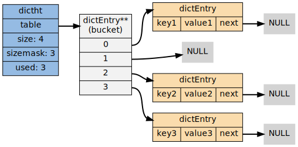
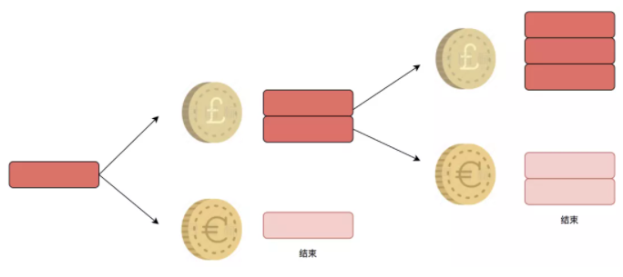

Redis 为了高性能，从各方各面都进行了优化

 

根据官方数据，Redis 的 QPS 可以达到约 100000（每秒请求数），有兴趣的可以参考官方的基准程序测试   [How fast is Redis？](https://redis.io/docs/reference/optimization/benchmarks/)


---

# 基于内存实现

Redis 将数据存储在内存中，读写操作不会因为磁盘的 IO 速度限制，所以速度飞一般的感觉！

以一张图量化系统的各种延时时间（部分数据引用 Brendan Gregg）

 


---

# 高效的数据结构

在 Redis 中，常用的 5 种数据类型和应用场景如下：

- **String**： 缓存、计数器、分布式锁等。
- **List**： 链表、队列、微博关注人时间轴列表等。
- **Hash**： 用户信息、Hash 表等。
- **Set**： 去重、赞、踩、共同好友等。
- **Zset**： 访问量排行榜、点击量排行榜等。

上面的应该叫做 Redis 支持的数据类型，也就是数据的保存形式。下面要说的是针对这 5 种数据类型，底层都运用了哪些高效的数据结构来支持。

 


## 字典（哈希表）

Redis 整体就是一个哈希表来保存所有的键值对，无论数据类型是 5 种的任意一种。

哈希表，本质就是一个数组，每个元素被叫做哈希桶，不管什么数据类型，每个桶里面的 entry 保存着实际具体值的指针。

 

整个数据库就是一个**全局哈希表**，而哈希表的时间复杂度是 O(1)，只需要计算每个键的哈希值，便知道对应的哈希桶位置，定位桶里面的 entry 找到对应数据，这个也是 Redis 快的原因之一。


实现字典的方法有很多种：

- 最简单的就是使用链表或数组，但是这种方式只适用于元素个数不多的情况下；
- 要兼顾高效和简单性，可以使用哈希表；
- 如果追求更为稳定的性能特征，并希望高效地实现排序操作的话，则可使用更为复杂的平衡树；

在众多可能的实现中， Redis 选择了高效、实现简单的哈希表，作为字典的底层实现。字典定义如下：

```c
typedef struct dict {
    // 特定于类型的处理函数
    dictType *type;

    // 类型处理函数的私有数据
    void *privdata;

    // 哈希表（2 个）
    dictht ht[2];

    // 记录 rehash 进度的标志，值为 -1 表示 rehash 未进行
    int rehashidx;

    // 当前正在运作的安全迭代器数量
    int iterators;
} dict;
```

注意 `dict` 类型使用了两个指针，分别指向两个哈希表。

其中， 0 号哈希表（`ht[0]`）是字典主要使用的哈希表， 而 1 号哈希表（`ht[1]`）则只有在程序对 0 号哈希表进行 rehash 时才使用。

Redis 的字典使用哈希表作为底层实现，一个哈希表里面可以有多个哈希表节点，而每个哈希表节点就保存了字典中的一个键值对。哈希表定义如下：

```c
typedef struct dictht {
    // 哈希表节点指针数组（俗称桶，bucket）
    dictEntry **table;
    
    // 指针数组的大小
    unsigned long size;

    // 指针数组的长度掩码，用于计算索引值，总是等于 size-1
    unsigned long sizemask;

    // 哈希表现有的节点数量
    unsigned long used;
} dictht;
```

`table` 属性是个数组， 数组的每个元素都是个指向 `dictEntry` 结构的指针。每个 `dictEntry` 都保存着一个键值对， 以及一个指向另一个 `dictEntry` 结构的指针。

```c
typedef struct dictEntry {
    // 键
    void *key;

    // 值
    union {
        void *val;
        uint64_t u64;
        int64_t s64;
    } v;

    // 链往后继节点
    struct dictEntry *next;
} dictEntry;
```

`next` 属性指向另一个 `dictEntry` 结构， 多个 `dictEntry` 可以通过 `next` 指针串连成链表， 从这里可以看出， `dictht` 使用**链地址法**来处理键碰撞： 当多个不同的键拥有相同的哈希值时，哈希表用一个链表将这些键连接起来。

下图展示了一个由 `dictht` 和数个 `dictEntry` 组成的哈希表例子：

 

如果再加上之前列出的 `dict` 类型，那么整个字典结构可以表示如下：

 

在上图的字典示例中， 字典虽然创建了两个哈希表， 但正在使用的只有 0 号哈希表， 这说明字典未进行 rehash 状态。

当写入 Redis 的数据越来越多的时候，哈希冲突不可避免，会出现不同的 key 计算出一样的哈希值。

Redis 通过链式哈希解决冲突：也就是同一个桶里面的元素使用链表保存。如图所示，当键 k0 和 k1 的经过散列函数得到索引值都为 1 时，就会使用 next 指针将两个节点连接起来。而由于节点没有指向链尾的指针，因此新的节点总是插入到链表的头部，排在已有节点的前面。

 

但是当链表过长就会导致查找性能变差可能，所以 Redis 为了追求快，使用了两个全局哈希表。用于 rehash 操作，增加现有的哈希桶数量，减少哈希冲突。

开始默认使用 hash 表 1 保存键值对数据，哈希表 2 此刻没有分配空间。当数据越来多触发 rehash 操作，则执行以下操作：

 

1.为字典的 ht[1] 散列表分配空间，这个空间的大小取决于要执行的操作以及 ht[0] 当前包含的键值对数量(即: ht[0].used 的属性值)

-   扩展操作：ht[1] 的大小为 第一个大于等于 ht[0].used 的 2 的 n 次方幂。如: ht[0].used=3 则 ht[1] 的大小为 8，ht[0].used=4 则 ht[1] 的大小为 8。
-   收缩操作: ht[1] 的大小为 第一个小于等于 ht[0].used 的 2 的 n 次方幂。

 

2.将保存在 ht[0] 中的键值对重新计算键的散列值和索引值，然后放到 ht[1] 指定的位置上。

 

3.将 ht[0] 包含的所有键值对都迁移到了 ht[1] 之后，释放 ht[0]，将 ht[1] 设置为 ht[0] ，并创建一个新的 ht[1] 哈希表为下一次 rehash 做准备

 

值得注意的是，将 hash 表 1 的数据重新映射到 hash 表 2 的过程中并不是一次性的，这样会造成 Redis 阻塞，无法提供服务。

而是采用了**渐进式 rehash**，每次处理客户端请求的时候，先从 hash 表 1 中第一个索引开始，将这个位置的所有数据拷贝到 hash 表 2 中，就这样将 rehash 分散到多次请求过程中，避免耗时阻塞。

在渐进式 rehash 过程中，字典会同时使用两个哈希表，比如查找会到两个哈希表里去查找。

另外，新添加的键值对一律保存到表 1 里，这样保证表0的键值对数量会之减不增，并随着 rehash 操作的执行最终变成空表。


## 简单动态字符（SDS）

C 语言中获取字符串的长度要从头开始遍历，直到 「\0」为止，唯快不破的 Redis 是不能忍受的。

C 语言字符串结构与 SDS 字符串结构对比图如下所示：

 

SDS中 `free` 记录数组中未使用字节的数量，`len`  记录保存字符串的长度，`buf` 保存字符串。SDS遵循C字符串以空字符结尾的惯例是为了复用库中一些函数。 

Redis 是用 C 语言实现的，为什么还重新搞一个 SDS 动态字符串呢？从以下方面考虑：

**（1）O(1) 时间复杂度获取字符串长度**

C 语言字符串不记录长度信息，需要遍历整个字符串时间复杂度为 O(n)，C 字符串遍历时遇到 '\0' 时结束。

SDS 中 len 保存字符串的长度，O(1) 时间复杂度。


**（2）杜绝缓冲区溢出**

C 字符串不记录自身长度带来的另一个问题是容易造成缓冲区溢出（buffer overflow），比如 strcat 函数可以将 src 字符串内容拼接到 dest 字符串的末尾，这是假设这个函数执行的时候已经为 dest 分配了足够多的内存，一旦假设不成立，就会产生缓冲区溢出。

 

在 SDS 的 API 中也有执行拼接操作的 sdscat 函数，这个函数在拼接之前会检查给定的 SDS 空间是否足够，如果不够的话就会先扩展 SDS 的空间，然后再执行拼接操作。

 


**（3）减少字符串修改带来的内存重分配**

C 字符串不记录自身的长度，所以对于一个包含了 N 个字符的 C 字符串来说，这个 C 字符串的底层总是一个 N+1 个字符长的数组。

因为 C 字符串的长度和底层数组长度之间存在这种关联性，所以每次增长或缩短 C 字符串，程序都总要对保存这个 C 字符串的数组进行一次内存重分配操作。

- 增长操作程序需要先通过内存重分配来扩展底层数组大小，否则会缓冲区溢出
- 缩短操作程序需要内存重分配来释放不再使用的那段空间，否则会内存泄漏

C 语言中涉及到修改字符串的时候会重新分配内存。修改地越频繁，内存分配也就越频繁。内存重分配涉及复杂的算法，并且可能需要执行系统调用，通常是一个比较耗时的操作，那么性能下降在所难免。

Redis 中会涉及到字符串频繁的修改操作，这种内存分配方式显然就不适合了。于是 SDS 实现了两种优化策略：

- **空间预分配**：SDS 被修改后，程序不仅会为 SDS 分配所需要的必须空间，还会分配额外的未使用空间。分配规则如下：如果对 SDS 修改后，len 的长度小于 1M，那么程序将分配和 len 相同长度的未使用空间。举个例子，如果 len=10，重新分配后，buf 的实际长度会变为 10(已使用空间)+10(额外空间)+1(空字符)=21。如果对 SDS 修改后 len 长度大于 1M，那么程序将分配 1M 的未使用空间。

     

- **惰性空间释放**：当对 SDS 进行缩短操作时，程序并不会回收多余的内存空间，而是使用 free 字段将这些字节数量记录下来不释放，后面如果需要 append 操作，则直接使用 free 中未使用的空间，减少了内存的分配。与此同时，SDS也提供相应的API让我们在有需要时真正地释放SDS的未使用空间，所以不用担心惰性空间释放策略会造成内存浪费。

     


**（4）二进制安全**

二进制数据并不是规则的字符串格式，其中会包含一些特殊的字符如 '\0'，在 C 中遇到 '\0' 则表示字符串的结束，但在 SDS 中，标志字符串结束的是 len 属性。因此在 Redis 中不仅可以存储 String 类型的数据，也可能存储一些二进制数据。


## 双端链表（linkedlist）

列表 List 更多是被当作队列或栈来使用的。队列和栈的特性一个先进先出，一个先进后出。双端链表很好的支持了这些特性。

 

**（1）前后节点**

 

链表里每个节点都带有两个指针，`prev` 指向前节点，`next` 指向后节点。这样在时间复杂度为 O(1) 内就能获取到前后节点。


**（2）头尾节点**

你可能注意到了，头节点里有 `head` 和 `tail` 两个参数，分别指向头节点和尾节点。这样的设计能够对双端节点的处理时间复杂度降至 O(1) ，对于队列和栈来说再适合不过。同时链表迭代时从两端都可以进行。


**（3）链表长度**

头节点里同时还有一个参数 `len`，和上边提到的 SDS 里类似，这里是用来记录链表长度的。

因此获取链表长度时不用再遍历整个链表，直接拿到 len 值就可以了，这个时间复杂度是 O(1)。

你看，这些特性都降低了 List 使用时的时间开销。


**（4）无环和多态**

表头结点的prev指针和表尾的next指针都指向NULL，对链表的访问以NULL为终点。

链表节点使用 `void *` 指针来保存节点值，并且可以通过`dup`（节点值复制函数）， `free`(节点值释放函数)， `match`（节点值对比函数）三个属性为节点值设置特定类型的函数，所以链表可以用于保存各种不同类型的值。


## 压缩列表（zipList）

双端链表我们已经熟悉了。不知道你有没有注意到一个问题：如果在一个链表节点中存储一个小数据，比如一个字节。那么对应的就要保存头节点，前后指针等额外的数据。这样就浪费了空间，同时由于反复申请与释放也容易导致内存碎片化。这样内存的使用效率就太低了。

于是，压缩列表上场了！

 

示例：

 

压缩列表是 List 、hash、 ZSet 三种数据类型底层实现之一。

当一个列表只有少量数据的时候，并且每个列表项要么就是小整数值，要么就是长度比较短的字符串，那么 Redis 就会使用压缩列表来做列表键的底层实现。

ziplist 是由一系列特殊编码的连续内存块组成的顺序型的数据结构，ziplist 中可以包含多个 entry 节点，每个节点可以存放整数或者字符串。

在表头有三个字段 zlbytes、zltail 和 zllen，分别表示列表占用字节数、列表尾的偏移量和列表中的 entry 个数；压缩列表在表尾还有一个 zlend，表示列表结束。

```c
struct ziplist {
    int32 zlbytes; 			// 整个压缩列表占用字节数
    int32 zltail_offset; 	// 最后一个元素距离压缩列表起始位置的偏移量，用于快速定位到最后一个节点
    int16 zllength; 		// 元素个数
    T[] entries; 			// 元素内容列表，挨个挨个紧凑存储
    int8 zlend; 			// 标志压缩列表的结束，值恒为 0xFF
}
```

每个压缩列表节点可以保存一个字节数组或者一个整数值。其中，字节数组可以是以下三种长度中的一种：

-   长度小于等于 63(2<sup>6</sup>-1)字节的字节数组;
-   长度小于等于 16383(2<sup>14</sup>-1)字节的字节数组
-   长度小于等于 4294967295(2<sup>32</sup>-1)字节的字节数组

整数值可以是以下 6 种长度中的一种：

-   4 位长，介于 0 至 12 之间的无符号整数
-   1 字节长的有符号整数
-   3 字节长的有符号整数
-   int16_t 类型整数
-   int32_t 类型整数
-   int64_t 类型整数

 

节点的 previous_entry_length 属性以字节为单位，记录了压缩列表中前一个节点的长度。 previous_entry_length 属性的长度可以是 1 字节或者 5 字节。

因为 previous_entry_length 记录了前一个节点的长度，所以程序可以通过指针运算，根据当前节点的起始地址来计算出前一个节点的起始位置，压缩列表的**从表尾到表头遍历**就是使用这一原理实现的。

-   如果前一节点的长度小于 254 字节，那么 previous_entry_length 属性的长度为 1 字节，前一节点的长度就保存在这一个字节里面。
-   如果前一节点的长度大于等于 254 字节，那么 previous_entry_length 属性的长度为 5 字节：其中属性的第一字节会被设置为 0xFE（十进制值 254）。而之后的四个字节则用于保存前一节点的长度。

>[!NOTE]
>
>由于 previous_entry_length 记录了前一个节点的长度，假如节点 N 本来使用一字节记录长度，然后前一个节点插入了字节大于 254 数据，那么 节点 N 的 previous_entry_length 就要扩展到 5 字节，如果节点 N 扩展后，数据量又大于 254 字节，就会影响节点 N 的下一个节点，此时就会引起连锁更新。

- 节点的 encoding 属性记录了节点的 content 属性所保存数据的类型以及长度。

-   一字节、两字节或者五字节长，值的最高位为 00、01 或者 10 的是字节数组编码这种编码表示节点的 content 属性保存着字节数组，数组的长度由编码除去最高两位之后的其他位记录。

-   一字节长，值的最高位以 11 开头的是整数编码:这种编码表示节点的 content 属性保存着整数值，整数值的类型和长度由编码除去最高两位之后的其他位记录。

  节点的 content 属性负责保存节点的值，节点值可以是一个字节数组或者整数，值的类型和长度由节点的 encoding 属性决定。

 

-   编码的最高两位 00 表示节点保存的是一个字节数组。
-   编码的后六位 001011 记录了字节数组的长度 11。
-   content 属性保存着节点的值 "hello world"。
-   编码 11000000 表示节点保存的是一个 int16_t 类型的整数值;
-   content 属性保存着节点的值 10086

如果**从表头到表尾遍历**则需要通过 encoding 里提取 content 长度信息来定位下一个压缩节点的起始位置。


后续版本对列表数据结构进行了改造，使用 quicklist 代替了 ziplist 和 linkedlist。

quicklist 是 ziplist 和 linkedlist 的混合体，它将 linkedlist 按段切分，每一段使用 ziplist 来紧凑存储，多个 ziplist 之间使用双向指针串接起来。

 

这也是为何 Redis 快的原因，不放过任何一个可以提升性能的细节。


## 整数集合（intset）

当一个集合只包含整数值元素，并且这个集合的元素数量不多时，Redis 就会使用整数集合作为集合键的底层实现。结构如下：

```c
typedef struct intset{
     uint32_t encoding;	//编码方式
     uint32_t length;	//集合包含的元素数量
     int8_t contents[];	//保存元素的数组
}intset;
```

-   contents 数组是整数集合的底层实现，整数集合的每个元素都是 contents 数组的个数组项(item)，各个项在数组中按值的大小从小到大有序地排列，并且数组中不包含任何重复项。
-   length 属性记录了数组的长度。
-   intset 结构将 contents 属性声明为 int8_t 类型的数组，但实际上 contents 数组并不保存任何 int8_t 类型的值， contents 数组的真正类型取决于 encoding 属性的值。encoding 属性的值为 INTSET_ENC_INT16 则数组就是 uint16_t 类型，数组中的每一个元素都是 int16_t 类型的整数值 (-32768--32767)，encoding 属性的值为 INTSET_ENC_INT32 则数组就是 uint32_t 类型，数组中的每一个元素都是 int16_t 类型的整数值 (-2147483648--2147483647)

如下图，为一个 int16_t 类型的整数集合，我们可以看到数组中存储了 5 个 int16_t 类型的整数，它们按照从小到大的顺序依次排列。这个时候我们思考一个问题。如果这个时候存入一个 int32_t 类型的整数会怎么样？内存溢出？这个时候就要提到整数集合的升级。

 

正如上面所提到的问题，每当我们要将一个新元素添加到整数集合里面，并且新元素的类型比整数集合现有所有元素的类型都要长时，整数集合需要先进行升级，然后才能将新元素添加到整数集合里面。升级整数集合并添加新元素主要分三步来进行。

1.  根据新元素的类型，扩展整数集合底层数组的空间大小，并为新元素分配空间。
2.  将底层数组现有的所有元素都转换成与新元素相同的类型，并将类型转换后的元素放置到正确的位上，而且在放置元素的过程中，需要继续维持底层数组的有序性质不变。
3.  将新元素添加到底层数组里面。


整数集合升级的优点

>   -   提升灵活性
>
>   因为C语言是静态类型语言，为了避免类型错误，我们通常不会将两种不同类型的值放在同一个数据结构里面。
>
>   例如，我们一般只使用 int16_t 类型的数组来保存 int16_t 类型的值，只使用 int32_t 类型的数组来保存 int32_t 类型的值，诸如此类。但是，因为整数集合可以通过自动升级底层数组来适应新元素，所以我们可以随意地将 int16_t、int32_t 或者 int64_t 类型的整数添加到集合中，而不必担心出现类型错误，这种做法非常灵活。
>
>   -   节约内存
>
>   要让一个数组可以同时保存 int16_t、int32_t、int64_t 三种类型的值，最简单的做法就是直接使用 int64t 类型的数组作为整数集合的底层实现。不过这样一来，即使添加到整数集合里面的都是 int16_t 类型或者 int32_t 类型的值，数组都需要使用 int64_t 类型的空间去保存它们，从而出现浪费内存的情况。
>
>   而整数集合现在的做法既可以让集合能同时保存三种不同类型的值，又可以确保升级操作只会在有需要的时候进行，这可以尽量节省内存。如果我们一直只向整数集合添加 int16_t 类型的值，那么整数集合的底层实现就会一直是 int16_t 类型的数组，只有在我们要将 int32_t 类型或者 int64_t 类型的值添加到集合时，程序才会对数组进行升级。

整数集合不支持降级操作，一旦对数组进行了升级，编码就会一直保持升级后的状态。

也就是说一旦我们向一个 int16_t 的整数集合内添加了一个 int32_t 的元素后，整数集合将升级到 int32_t 类型。即使后续的操作中我们删除了这个元素，整数集合还是会保持 int32_t 类型的状态。


## 跳跃表（skipList）

sorted set 类型的排序功能便是通过「跳跃列表」数据结构来实现。

对于一个单链表来讲，即便链表中存储的数据是有序的，如果我们要想在其中查找某个数据，也只能从头到尾遍历链表。这样查找效率就会很低，时间复杂度会很高，是 O(n)。

如果我们想要提高其查找效率，可以考虑在链表上建索引的方式。每两个结点提取一个结点到上一级，我们把抽出来的那一级叫作索引。 

这个时候，我们假设要查找节点 8，我们可以先在索引层遍历，当遍历到索引层中值为 7 的结点时，发现下一个节点是9，那么要查找的节点8肯定就在这两个节点之间。

我们下降到链表层继续遍历就找到了 8 这个节点。原先我们在单链表中找到8这个节点要遍历 8 个节点，而现在有了一级索引后只需要遍历五个节点。

从这个例子里，我们看出，加来一层索引之后，查找一个结点需要遍的结点个数减少了，也就是说查找效率提高了，同理再加一级索引。

从图中我们可以看出，查找效率又有提升。在例子中我们的数据很少，当有大量的数据时，我们可以增加多级索引，其查找效率可以得到明显提升。

  

像这种链表加多级索引的结构，就是跳跃表！

跳跃表（skiplist）是一种有序数据结构，它通过在每个节点中维持多个指向其他节点的指针，从而达到快速访问节点的目的。

在大部分情况下，跳跃表的效率可以和平衡树相媲美，并且因为跳跃表的实现比平衡树要来的简单，所以有不少程序都使用跳跃表代替平衡树。

跳跃表支持平均 O(logN) 、最坏 O(N) 复杂度的节点查找，还可以通过顺序性操作来批量处理节点。

Redis 使用跳跃表作为有序集合键的底层实现之一，如果一个有序集合包含的**元素数量比较多**，又或者有序集合中元素的**成员是比较长的字符串**时， Redis 就会使用跳跃表来作为有序集合健的底层实现。

这里我们需要思考一个问题——为什么元素数量比较多或者成员是比较长的字符串的时候 Redis 要使用跳跃表来实现？

从上面我们可以知道，跳跃表在链表的基础上增加了多级索引以提升查找的效率，但其是一个空间换时间的方案，必然会带来一个问题——索引是占内存的。原始链表中存储的有可能是很大的对象，而索引结点只需要存储关键值值和几个指针，并不需要存储对象，因此当节点本身比较大或者元素数量比较多的时候，其优势必然会被放大，而缺点则可以忽略。

Redis 的跳跃表由 zskiplistNode 和 skiplist 两个结构定义，其中 zskiplistNode 结构用于表示跳跃表节点，而 zskiplist 结构则用于保存跳跃表节点的相关信息，比如节点的数量，以及指向表头节点和表尾节点的指针等等。

 

上图展示了一个跳跃表示例，其中最左边的是 skiplist 结构，该结构包含以下属性。

-   `header`：指向跳跃表的表头节点，通过这个指针程序定位表头节点的时间复杂度就为 O(1)
-   `tail`：指向跳跃表的表尾节点，通过这个指针程序定位表尾节点的时间复杂度就为 O(1)
-   `level`：记录目前跳跃表内，层数最大的那个节点的层数(表头节点的层数不计算在内)，通过这个属性可以在 O(1) 的时间复杂度内获取层高最高的节点的层数。
-   `length`：记录跳跃表的长度，也即是，跳跃表目前包含节点的数量(表头节点不计算在内)，通过这个属性，程序可以在 O(1) 的时间复杂度内返回跳跃表的长度。


结构右方的是四个 zskiplistNode结构，该结构包含以下属性

-   层(`level`)：

    -   节点中用 L1、L2、L3 等字样标记节点的各个层，L1 代表第一层，L2 代表第二层，以此类推。
    -   每个层都带有两个属性：前进指针和跨度。前进指针用于访问位于表尾方向的其他节点，而跨度则记录了前进指针所指向节点和当前节点的距离(跨度越大、距离越远)。在上图中，连线上带有数字的箭头就代表前进指针，而那个数字就是跨度。当程序从表头向表尾进行遍历时，访问会沿着层的前进指针进行。
    -   每次创建一个新跳跃表节点的时候，程序都根据幂次定律 ( powerlaw，越大的数出现的概率越小) 随机生成一个介于 1 和 32 之间的值作为 level 数组的大小，这个大小就是层的“高度”。50% 的概率被分配到第一层，25% 的概率被分配到第二层，12.5% 的概率被分配到第三层。这种方式保证了越上层数量越少，自然跨越起来越方便。

     

-   后退(`backward`)指针：节点中用 BW 字样标记节点的后退指针，它指向位于当前节点的前一个节点。后退指针在程序从表尾向表头遍历时使用。与前进指针所不同的是每个节点只有一个后退指针，因此每次只能后退一个节点。

-   分值(`score`)：各个节点中的 1.0、2.0 和 3.0 是节点所保存的分值。在跳跃表中，节点按各自所保存的分值从小到大排列。

-   成员对象(`oj`)：各个节点中的 o1、o2 和 o3 是节点所保存的成员对象。在同一个跳跃表中，各个节点保存的成员对象必须是唯一的，但是多个节点保存的分值却可以是相同的：分值相同的节点将按照成员对象在字典序中的大小来进行排序，成员对象较小的节点会排在前面(靠近表头的方向)，而成员对象较大的节点则会排在后面(靠近表尾的方向)。


---

# 合理的数据编码

上面介绍了 Redis 的主要数据结构，但是 Redis 并没有直接使用这些数据结构来实现键值对数据库，而是基于这些数据结构创建了一个对象系统，包括字符串对象 / 列表对象/ 哈希对象/ 集合对象/ 有序集合对象 五种类型，每种对象都用到了至少一种我们前面所介绍的数据结构。

通过这五种不同类型的对象，Redis 可以在执行命令之前，根据对象的类型来判断一个对象是否可以执行给定的命令。使用对象的另一个好处是，我们可以针对不同的使用场景为对象设置多种不同的数据结构实现，从而优化对象在不同场景下的使用效率。


## 对象的类型与编码

Redis 使用对象（redisObject）来表示数据库中的键值，当我们在 Redis 中创建一个键值对时，至少创建两个对象，一个对象是用做键值对的键对象，另一个是键值对的值对象。例如我们执行 SET MSG XXX 时，键值对的键是一个包含了字符串“MSG“的对象，键值对的值对象是包含字符串"XXX"的对象。

Redis 中的每个对象都由一个 redisObject 结构表示，该结构和保存数据有关的三个属性分别是 `type` 属性，`encoding` 属性， `ptr` 属性：

```c
typedef struct redisObject {
    // 类型
    unsigned type：4;

    // 编码
    unsigned encoding：4;

    // 对象最后一次被访问的时间
    unsigned lru：24; /* lru time (relative to server.lruclock) */

    // 引用计数
    int refcount;

    // 指向实际值的指针
    void *ptr;
} robj;
```


### 类型

对象的 `type` 属性记录了对象的类型，它的值可能是以下常量的其中一个：

```c
#define REDIS_STRING 0  // 字符串对象
#define REDIS_LIST 1    // 列表对象
#define REDIS_SET 2     // 集合对象
#define REDIS_ZSET 3    // 有序集对象
#define REDIS_HASH 4    // 哈希表对象
```

键总是一个字符串对象，而值是可以是各种类型，因此称呼一个数据库键为字符串键时，我们指的是这个数据库键对应的值是字符串对象；因此称呼一个数据库键为列表键时，我们指的是这个数据库键对应的值是列表对象，其余同理。使用 type 命令可以查看类型。


### 编码和底层实现

对象的 `ptr` 指针指向对象的底层实现数据结构，而这些数据结构的属性由对象的 `encoding` 属性决定：

```c
#define REDIS_ENCODING_RAW 0     /* Raw representation */
#define REDIS_ENCODING_INT 1     /* Encoded as integer */
#define REDIS_ENCODING_HT 2      /* Encoded as hash table */
#define REDIS_ENCODING_ZIPMAP 3  /* Encoded as zipmap */
#define REDIS_ENCODING_LINKEDLIST 4 /* Encoded as regular linked list */
#define REDIS_ENCODING_ZIPLIST 5 /* Encoded as ziplist */
#define REDIS_ENCODING_INTSET 6  /* Encoded as intset */
#define REDIS_ENCODING_SKIPLIST 7  /* Encoded as skiplist */
#define REDIS_ENCODING_EMBSTR 8  /* Embedded sds string encoding */
```

举个例子，如果一个 redisObject 的 type 属性为 REDIS_LIST ， encoding 属性为 REDIS_ENCODING_LINKEDLIST ，那么这个对象就是一个 Redis 列表，它的值保存在一个双端链表内，而 ptr 指针就指向这个双端链表；

另一方面，如果一个 redisObject 的 type 属性为 REDIS_HASH ， encoding 属性为 REDIS_ENCODING_ZIPMAP ，那么这个对象就是一个 Redis 哈希表，它的值保存在一个 zipmap 里，而 ptr 指针就指向这个 zipmap ；诸如此类。

使用 `object encoding` 命令可以查看编码。

通过 encoding 属性来设定对象所使用的编码，而不是为特定类型的对象关联一种固定的编码，极大地提升了 Redis 的灵活性和效率，因为 Redis 可以根据不同的使用场景为一个对象设置不同的编码，从而优化对象在某一场景下的效率。

举个例子，在列表对象包含的元素比较少时，Redis 使用压缩列表作为底层实现。

- 因为压缩列表比双端列表更节约内存，并且在元素数量较少时，在内存中以连续块方式保存的压缩列表比起双端链表可以更快载入内存
- 随着列表对象包含的元素越来越多，使用压缩列表来保存元素的优势逐渐消失时，对象就会将底层实现从压缩列表转向功能更强。也更适合保存大量元素的双端列表上

对于每一种数据类型来说，底层的支持可能是多种数据结构，什么时候使用哪种数据结构，这就涉及到了编码转化的问题。

那我们就来看看，不同的数据类型是如何进行编码转化的


## 字符串对象

字符串对象的编码可以是 int，raw 或者 embstr。

 

如果一个字符串对象保存的是整数值，并且这个整数值可以用 long 类型来表示，那么字符串对象会将整数值保存在字符串对象结构的 ptr 属性里，并将字符串对象的编码设置为 int。

 

如果字符串对象保存的是一个字符串值，并且这个字符串值的长度大于 45 字节，那么字符串对象将使用一个 SDS 来保存这个字符串值，并将对象的编码设置为 raw。

 

如果字符串对象保存的是一个字符串值，并且这个字符串值的长度小于 45 字节，那么字符串对象将使用 embstr 编码的方式来保存这个字符串值。

 

embstr 编码是专门用于保存短字符串的一种编码优化方式，这种编码方式和 raw 编码一样都使用 redisObject 和 SDS 来表示字符串对象，但 raw 编码会调用两次内存分配函数来分别创建 redisObject 和 SDS ，而 embstr 则只使用一次内存分配函数来分配一块内存空间，释放时亦如此。同时连续的内存比起 raw 编码的字符串对象能够更好地利用缓存带来的优势。

```shell
127.0.0.1:6379> set ss 11111111112222222222333333333344444444441234
OK
# 小于45字节的字符串使用 embstr 编码
127.0.0.1:6379> OBJECT encoding ss
"embstr"
127.0.0.1:6379> set ss 111111111122222222223333333333444444444412345
OK
# 不小于45字节的字符串使用 raw 编码
127.0.0.1:6379> OBJECT encoding ss
"raw"
127.0.0.1:6379> set ss 1
OK
# 数字使用 int 编码
127.0.0.1:6379> OBJECT encoding ss
"int"
127.0.0.1:6379> type ss
string
```


## 列表对象

在 Redis3.2 版本以前List 对象的编码可以是 ziplist 或 linkedlist，当字符串长度 < 64 字节且元素个数 < 512 使用 ziplist 编码，否则转化为 linkedlist 编码；

注意：这两个条件是可以修改的，在 redis.conf 中：

```bash
list-max-ziplist-entries 512
list-max-ziplist-value 64
```

ziplist 每个压缩列表节点保存一个列表元素；linkedlist 每个双端链表节点保存一个字符串对象，而每个字符串对象都保存了一个列表元素。字符串对象是 Redis 五种类型对象中唯一会被其他四种对象嵌套的对象。

而在 Redis3.2 版本开始对列表数据结构进行了改造，使用 quicklist 代替了 ziplist 和 linkedlist。


## 哈希对象

Hash 对象的编码可以是 ziplist 或 hashtable。

当 Hash 对象同时满足以下两个条件时，Hash 对象采用 ziplist 编码：

- Hash 对象保存的所有键值对的键和值的字符串长度均小于 64 字节。
- Hash 对象保存的键值对数量小于 512 个。

否则就是 hashtable 编码。

ziplist 编码保存了同一键值对的两个节点总是紧挨在一起，保存键的节点在前，保存值的节点在后。


## 集合对象

Set 对象的编码可以是 intset 或 hashtable，intset 编码的对象使用整数集合作为底层实现，把所有元素都保存在一个整数集合里面。

当集合对象可以同时满足以下两个条件时，对象使用 intset 编码：

- 集合对象保存的所有元素都是整数值
- 集合对象保存的元素数量不超过512个


## 有序集合对象

Zset 对象的编码可以是 ziplist 或 zkiplist，当采用 ziplist 编码存储时，每个集合元素使用两个紧挨在一起的压缩列表来存储。

Ziplist 压缩列表第一个节点存储元素的成员，第二个节点存储元素的分值，并且按分值大小从小到大有序排列。

 

当 Zset 对象同时满足一下两个条件时，采用 ziplist 编码：

- Zset 保存的元素个数小于 128。
- Zset 元素的成员长度都小于 64 字节。

如果不满足以上条件的任意一个，ziplist 就会转化为 zkiplist 编码。注意：这两个条件是可以修改的，在 redis.conf 中：

```bash
zset-max-ziplist-entries 128
zset-max-ziplist-value 64
```

>[!NOTE]
>
>Zset为什么同时需要字典和跳表来实现？
>
>Zset是一个有序列表，字典和跳表分别对应两种查询场景，**字典用来支持按成员查询数据，跳表则用以实现高效的范围查询，**这样两个场景，性能都做到了极致。


---

# 单线程模型

我们要明确的是：Redis 的单线程指的是 Redis 的网络 IO 以及键值对指令读写是由一个线程来执行的。 对于 Redis 的持久化、集群数据同步、异步删除等都是其他线程执行。

至于为什么用单线程，我们先了解多线程有什么缺点。


## 多线程的弊端

使用多线程，通常可以增加系统吞吐量，充分利用 CPU 资源。

但是，使用多线程后，没有良好的系统设计，可能会出现如下图所示的场景，增加了线程数量，前期吞吐量会增加，再进一步新增线程的时候，系统吞吐量几乎不再新增，甚至会下降！

 

在运行每个任务之前，CPU 需要知道任务在何处加载并开始运行。也就是说，系统需要帮助它预先设置 CPU 寄存器和程序计数器，这称为 CPU 上下文。这些保存的上下文存储在系统内核中，并在重新计划任务时再次加载。这样，任务的原始状态将不会受到影响，并且该任务将看起来正在连续运行。

**切换上下文时，我们需要完成一系列工作，这是非常消耗资源的操作。**

另外，当多线程并行修改共享数据的时候，为了保证数据正确，需要加锁机制就会带来额外的性能开销，面临的共享资源的并发访问控制问题。

引入多线程开发，就需要使用同步原语来保护共享资源的并发读写，增加代码复杂度和调试难度。


## 单线程又什么好处？

1. 不会因为线程创建导致的性能消耗；
2. 避免上下文切换引起的 CPU 消耗，没有多线程切换的开销；
3. 避免了线程之间的竞争问题，比如添加锁、释放锁、死锁等，不需要考虑各种锁问题。
4. 代码更清晰，处理逻辑简单。

单线程是否没有充分利用 CPU 资源呢？

官方答案：因为 Redis 是基于内存的操作，CPU 不是 Redis 的瓶颈，Redis 的瓶颈最**有可能是机器内存的大小或者网络带宽**。既然单线程容易实现，而且 CPU 不会成为瓶颈，那就顺理成章地采用单线程的方案了。原文地址：https://redis.io/topics/faq


## 为什么Redis 6.0 之后改多线程呢？

-   Redis6.0之前，Redis 在处理客户端的请求时，包括读 socket、解析、执行、写 socket 等都由一个顺序串行的主线程处理，这就是所谓的单线程。
-   Redis6.0 之前为什么一直不使用多线程？使用Redis时，几乎不存在 CPU 成为瓶颈的情况， Redis 主要受限于内存和网络。例如在一个普通的 Linux 系统上，Redis通过使用 pipelining 每秒可以处理 100 万个请求，所以如果应用程序主要使用 O(N) 或 O(log(N)) 的命令，它几乎不会占用太多 CPU。

redis 使用多线程并非是完全摒弃单线程，redis 还是使用单线程模型来处理客户端的请求，只是使用多线程来处理数据的读写和协议解析，执行命令还是使用单线程。这样做的目的是因为redis的性能瓶颈在于网络 IO 而非 CPU，使用多线程能提升 IO 读写的效率，从而整体提高 redis 的性能。


## I/O 多路复用模型

Redis 采用 I/O 多路复用技术，并发处理连接。采用了 epoll + 自己实现的简单的事件框架。epoll 中的读、写、关闭、连接都转化成了事件，然后利用 epoll 的多路复用特性，绝不在 IO 上浪费一点时间。

在解释 IO 多虑复用之前我们先了解下基本 IO 操作会经历什么。

**基本 IO 模型**

一个基本的网络 IO 模型，当处理 get 请求，会经历以下过程：

1. 和客户端建立建立 `accept`;
2. 从 socket 种读取请求 `recv`;
3. 解析客户端发送的请求 `parse`;
4. 执行 `get` 指令；
5. 响应客户端数据，也就是 向 socket 写回数据。

其中，bind/listen、accept、recv、parse 和 send 属于网络 IO 处理，而 get 属于键值数据操作。既然 Redis 是单线程，那么，最基本的一种实现是在一个线程中依次执行上面说的这些操作。

关键点就是 **accept 和 recv 会出现阻塞**，当 Redis 监听到一个客户端有连接请求，但一直未能成功建立起连接时，会阻塞在 accept() 函数这里，导致其他客户端无法和 Redis 建立连接。

类似的，当 Redis 通过 recv() 从一个客户端读取数据时，如果数据一直没有到达，Redis 也会一直阻塞在 recv()。

 

阻塞的原因由于使用传统阻塞 IO ，也就是在执行 read、accept 、recv 等网络操作会一直阻塞等待。如下图所示：

 

IO 多路复用，**多路**指的是多个 socket 连接，**复用**指的是复用一个线程。多路复用主要有三种技术：select，poll，epoll。epoll 是最新的也是目前最好的多路复用技术。

**它的基本原理是，内核不是监视应用程序本身的连接，而是监视应用程序的文件描述符。**

当客户端运行时，它将生成具有不同事件类型的套接字。在服务器端，I / O 多路复用程序（I / O 多路复用模块）会将消息放入队列（也就是 下图的 I/O 多路复用程序的 socket 队列），然后通过文件事件分派器将其转发到不同的事件处理器。

简单来说：Redis 单线程情况下，内核会一直监听 socket 上的连接请求或者数据请求，一旦有请求到达就交给 Redis 线程处理，这就实现了一个 Redis 线程处理多个 IO 流的效果。

select/epoll 提供了基于事件的回调机制，即针对不同事件的发生，调用相应的事件处理器。所以 Redis 一直在处理事件，提升 Redis 的响应性能。

 

Redis 线程不会阻塞在某一个特定的监听或已连接套接字上，也就是说，不会阻塞在某一个特定的客户端请求处理上。正因为此，Redis 可以同时和多个客户端连接并处理请求，从而提升并发性。


---

# 总结

- 基于内存实现

数据都存储在内存里，减少了一些不必要的 I/O 操作，操作速率很快。


- 高效的数据结构和合理的数据编码

Redis 中的对象，大都是通过多种数据结构来实现的，为什么会这样设计呢？用一种固定的数据结构来实现，不是更加简单吗？

Redis 这样设计有两个好处：

1.  可以自由改进内部编码，而对外的数据结构和命令没有影响，这样一旦开发出更优秀的内部编码，无需改动外部数据结构和命令，例如 Redis3.2 提供了 quicklist，其结合了 ziplist 和 linkedlist 两者的优势，为列表类型提供了一种更为优秀的内部编码实现，而对外部用户来说基本感知不到。 这一点比较像程序设计中的分层架构。
2.  多种内部编码实现可以在不同场景下发挥各自的优势，从而优化对象在不同场景下的使用效率。例如 ziplist 比较节省内存，但是在列表元素比较多的情况下，性能会有所下降，这时候 Redis 会根据配置选项将列表类型的内部实现转换 linkedlist。


- 合适的线程模型

I/O 多路复用模型同时监听客户端连接；

单线程在执行过程中不需要进行上下文切换，减少了耗时。


---

# 参考与感谢

-   Redis设计与实现 - 黄健宏著
-   [Redis数据结构--跳跃表](https://www.cnblogs.com/hunternet/p/11248192.html)
-   [详解20道Redis经典面试题！](https://juejin.cn/post/7002011542145204261)

