我们都知道 Redis 是内存数据库，它将自己的数据存储的内存中。这样一旦服务器进程退出(断电、重启等原因)，那么数据将会丢失。为了解决这个问题，Redis 提供两种持久化的方式来将数据持久化到硬盘上，即内存快照 (**RDB**) 与 写后日志（**AOF**）。

涉及的知识点如图所示：

 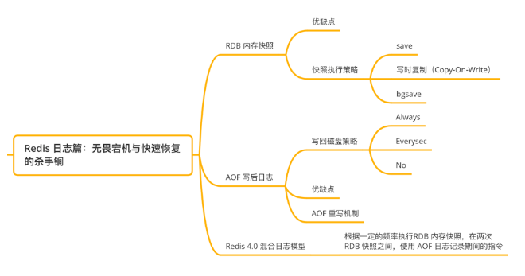


---

# RDB内存快照

我们通常将 Redis 当作缓存使用，所以即使 Redis 没有保存全部数据，还可以通过数据库获取，所以 Redis 不会保存所有的数据，Redis 的数据持久化使用了「RDB 数据快照」的方式来实现宕机快速恢复。

在 Redis 执行「写」指令过程中，内存数据会一直变化。所谓的内存快照，指的就是 Redis 内存中的数据在某一刻的状态数据。

好比时间定格在某一刻，当我们拍照的，通过照片就能把某一刻的瞬间画面完全记录下来。

Redis 跟这个类似，就是把某一刻的数据以文件的形式拍下来，写到磁盘上。这个快照文件叫做 **RDB 文件，RDB 就是 Redis DataBase 的缩写。**

Redis 通过定时执行 RDB 内存快照，这样就不必每次执行「写」指令都写磁盘，只需要在执行内存快照的时候写磁盘。既保证了唯快不破，还实现了持久化，宕机快速恢复。在做数据恢复时，直接将 RDB 文件读入内存完成恢复。

 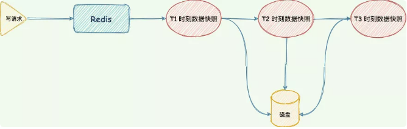


Redis 提供了两个指令用于生成 RDB 文件：

- save：主线程执行，会阻塞；Redis 的单线程模型就决定了，我们要尽量避免所有会阻塞主线程的操作，由于 Save 命令执行期间阻塞服务器进程，对于内存比较大的实例会造成长时间阻塞，因此线上环境不建议使用。

 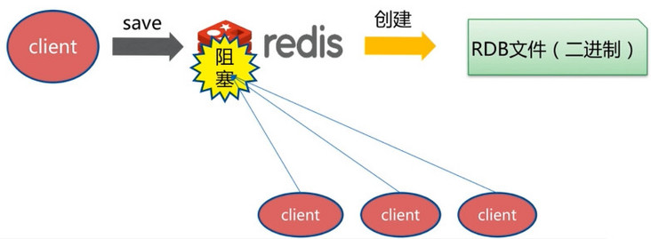

- bgsave：调用 glibc 的函数 fork 产生一个子进程用于写入 RDB 文件，快照持久化完全交给子进程来处理，父进程继续处理客户端请求，生成 RDB 文件的默认配置。

 

>[!NOTE]
>
>- 在 bgsave 命令执行的时候，为了避免父进程与子进程同时执行两个 RDBSave 的调用而产生竞争条件，客户端发送的 save 命令会被服务器拒绝。
>
>- 如果 bgsave 命令正在执行，bgrewriteaof（aof 重写）命令会被延迟到 bgsave 命令之后执行，如果 bgrewriteaof 命令正在执行，那么客户端发送的 bgsave 命令会被服务器拒绝。
>
>- 虽然 bgsave 命令是由子进程进行 RDB 文件的生成，但是 fork() 创建子进程的时候会阻塞父进程（详情请往下看）。

因为 bgsave 命令可以在不阻塞服务器进程的情况下保存，所以 redis 通过设置服务器配置的 save 选项，让服务器每隔一段时间自动执行一次 bgsave 命令。如：我们向服务器设置如下配置(这也是 redis 默认的配置)

```bash
save 900 1
save 300 10
save 60  10000
```

那么只要满足如下条件中的一个 bgsave 命令就会被执行：

- 服务器在 900 秒内对数据库进行了至少 1 次修改
- 服务器在 300 秒内对数据库进行了至少 10 次修改
- 服务器在 60 秒内对数据库进行了至少 10000 次修改


在 Redis 启动的时候，只要检测到 RDB 文件的存在，就会自动加载 RDB 文件。需要注意的是：

- 因为 AOF 文件的更新频率通常比 RDB 文件的更新频率高，所以如果服务器开启了 AOF 持久化功能，那么服务器会优先使用 AOF 文件来还原数据库状态。
- 只有在 AOF 持久化功能处于关闭状态时，服务器才会使用 RDB 文件来还原数据库状态。

> [!NOTE]
>
> 注意：服务器在载入 RDB 文件期间，会一直处于阻塞状态，直到载入工作完成为止


了解了什么是 Redis 的 RDB 持久化，我们来思考几个问题。

*对内存数据做「快照」的时候，内存数据还能修改么？也就是写指令能否正常处理？*

首先，如果我们使用 save 命令做持久化，那么由于 Redis 单线程模型的原因，在持久化的过程中会阻塞，是不能执行其它命令的。也许有人会说可以使用 bgsave 命令，但使用 bgsave 就没有问题了吗？

我们在拍照的时候，通常摄影师是不让我们动的，因为一动可能照片就模糊了。在 Redis 进行内存快照的时候也会如此。如果我们持久化的过程中，有些数据被修改了。那么就会破坏快照的正确性与完整性。

比如在 t 时刻，我们对内存进行快照，此时我们希望的是记录下来 t 时刻内存中所有的数据，假设我们的 RDB 操作需要 10s 的时间，而 t+2s 我们执行了一个修改操作把 Key1 的值由 A 修改成了 B ，而此时 RDB 操作却还没有把 Key1 的值写入磁盘。在 t+5s 的时候读取到 key1 的值写入磁盘。那么此次快照记录的 Key1 的值就是 B ，而不是 t 时刻的 A 。这样就破坏了 RDB 文件的正确性。

RDB 文件的生成是需要时间的，如果快照执行期间数据不能被修改，对于业务系统来说不能接受的。那么 Redis 是如何解决这个问题的呢？


首先我们要明确一点，**避免阻塞和 RDB 文件生成期间能处理写操作不是一回事**。虽然主线程没有阻塞，但为了保证快照的数据的一致性，只能处理读操作，不能修改正在执行快照的数据。很明显，为了生成 RDB 而暂停写操作，Redis 是不答应的。那 Redis 如何实现一边处理写请求，同时生成 RDB 文件呢？

答案是使用操作系统的多进程**写时复制技术 COW (Copy On Write)** 来实现快照持久化。

 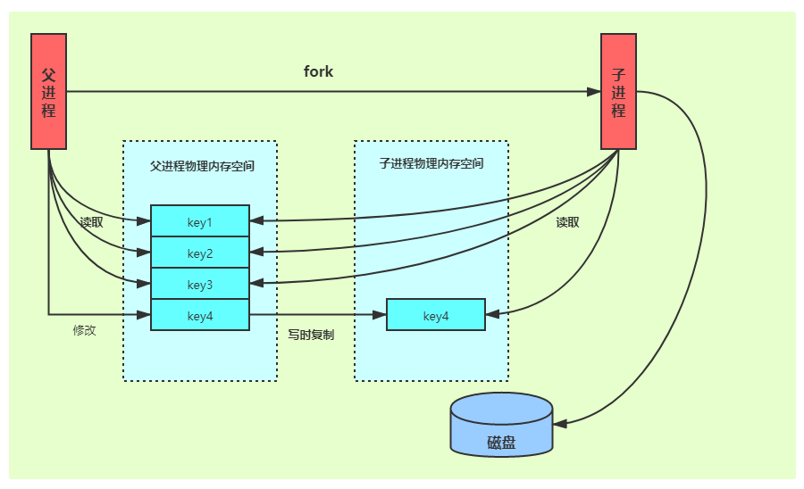

Redis 借助了操作系统提供的写时复制技术（Copy-On-Write，COW），可以让在执行快照的同时，正常处理写操作。

简单来说，bgsave fork 子进程的时候，并不会完全复制主进程的内存数据，而是只复制必要的虚拟数据结构，并不为其分配真实的物理空间，它与父进程共享同一个物理内存空间。

bgsave 子进程运行后，开始读取主线程的内存数据，并把它们写入 RDB 文件。

此时，如果主线程对这些数据也都是读操作，那么，主线程和 bgsave 子进程相互不影响。

但是，如果主线程要修改一块数据，此时会给子进程分配一块物理内存空间，把要修改的数据复制一份，生成该数据的副本到子进程的物理内存空间。

然后，bgsave 子进程会把这个副本数据写入 RDB 文件，而在这个过程中，主线程仍然可以直接修改原来的数据。

这既保证了快照的完整性，也允许主线程同时对数据进行修改，避免了对正常业务的影响。

Redis 会使用 bgsave 对当前内存中的所有数据做快照，这个操作是子进程在**后台完成**的，这就允许主线程同时可以修改数据。


*那可以每秒都执行 RDB 文件么？*这样即使发生宕机最多丢失 1 秒的数据。

我们知道bgsave 执行时并不阻塞主线程，但是这不代表可以频繁执行快照操作。

一方面，持久化是一个写入磁盘的过程，频繁将全量数据写入磁盘，会给磁盘带来很大压力，频繁执行快照也容易导致前一个快照还没有执行完，后一个又开始了，这样多个快照竞争有限的磁盘带宽，容易造成恶性循环。

再者，bgsave 所 fork 出来的子进程执行操作虽然并不会阻塞父进程的操作，但是 fork 出子进程的操作却是由主进程完成的，会阻塞主进程，fork 子进程需要拷贝进程必要的数据结构，其中有一项就是拷贝内存页表（虚拟内存和物理内存的映射索引表），这个拷贝过程会消耗大量 CPU 资源，拷贝完成之前整个进程是会阻塞的，阻塞时间取决于整个实例的内存大小，实例越大，内存页表越大，fork 阻塞时间也就越久。


RDB 采用二进制 + 数据压缩的方式写磁盘，文件体积小，数据恢复速度快。快照的恢复速度快，但是生成 RDB 文件频率不好把握，频率过低宕机丢失的数据就会比较多；太快，又会消耗额外开销。

如果不能频繁执行快照操作，那么该如何解决两次快照之间的数据丢失的问题呢？

Redis 还提供了另外一种持久化方式，AOF（append to file）日志。


---

# AOF写后日志

AOF 日志存储的是 Redis 服务器的顺序指令序列，AOF 日志只记录对内存进行修改的指令记录。

 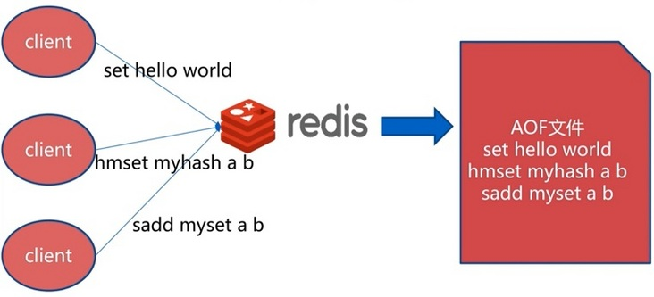

假设 AOF 日志记录了自 Redis 实例创建以来所有的修改性指令序列，那么就可以通过对一个空的 Redis 实例顺序执行所有的指令，也就是「重放」，来恢复 Redis 当前实例的内存数据结构的状态。

 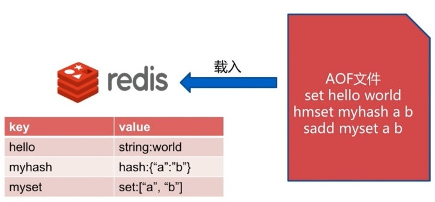

 


## 写前与写后日志对比

写前日志（Write Ahead Log，WAL）： 在实际写数据之前，将修改的数据写到日志文件中，故障恢复得以保证。比如 MySQL Innodb 存储引擎中的 redo log（重做日志）便是记录修改的数据日志，在实际修改数据前先记录修改日志在执行修改数据。

写后日志： 先执行「写」指令请求，将数据写入内存，再记录日志。


## 日志格式

当 Redis 接受到 「set key MageByte」命令将数据写到内存后，Redis 会按照如下格式写入 AOF 文件。

- 「*3」：表示当前指令分为三个部分，每个部分都是 「`$` + 数字」开头，紧跟后面是该部分具体的「指令、键、值」。
- 「数字」：表示这部分的命令、键、值多占用的字节大小。比如 「`$3`」表示这部分包含 3 个字节，也就是 「set」指令。

 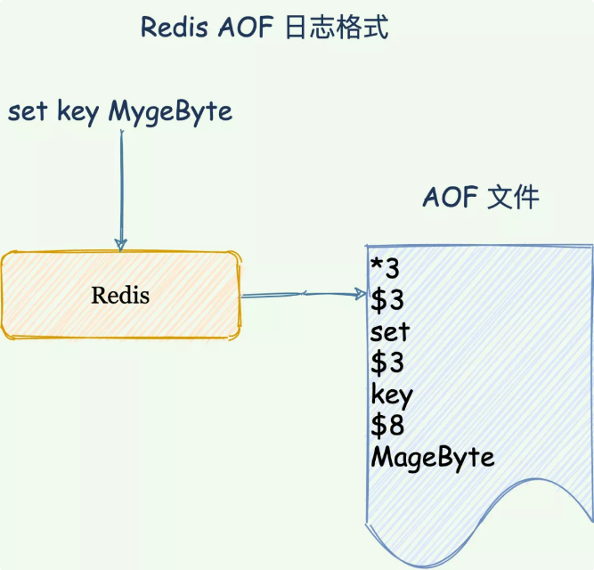

*为什么 Redis 使用写后日志这种方式呢？*

写后日志避免了额外的检查开销，不需要对执行的命令进行语法检查。如果使用写前日志的话，就需要先检查语法是否有误，否则日志记录了错误的命令，在使用日志恢复的时候就会出错。

另外，写后才记录日志，**不会阻塞当前的「写」指令执行。**


假如 Redis 刚执行完指令，还没记录日志宕机了，就有可能丢失这个命令相关的数据。

还有，**AOF 避免了当前命令的阻塞，但是可能会给下一个命令带来阻塞的风险**。AOF 日志是主线程执行，将日志写入磁盘过程中，如果磁盘压力大就会导致写磁盘很慢，导致后续的「写」指令阻塞。

发现了没，这两个问题与磁盘写回有关，如果能合理的控制「写」指令执行完后 AOF 日志写回磁盘的时机，问题就迎刃而解。


## 写回策略

为了提高文件的写入效率，当用户调用 write 函数，将一些数据写入到文件的时候，操作系统通常会将写入数据暂时保存在一个内存缓冲区里面，等到缓冲区的空间被填满、或者超过了指定的时限之后，才真正地将缓冲区中的数据写入到磁盘里面。

这种做法虽然提高了效率，但也为写入数据带来了安全问题，因为如果计算机发生停机，那么保存在内存缓冲区里面的写入数据将会丢失。

为此，系统提供了 fsync 和 fdatasync 两个同步函数，它们可以强制让操作系统立即将缓冲区中的数据写入到硬盘里面，从而确保写入数据的安全性。

Redis 提供的 AOF 配置项 appendfsync 写回策略直接决定 AOF 持久化功能的效率和安全性。

- **always**：同步写回，写指令执行完毕立马将 aof_buf 缓冲区中的内容刷写到 AOF 文件。

 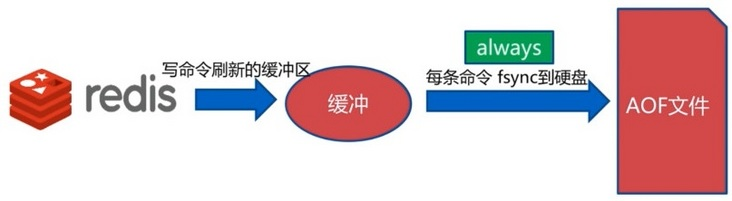

- **everysec**：每秒写回，写指令执行完，日志只会写到 AOF 文件缓冲区，每隔一秒就把缓冲区内容同步到磁盘。

 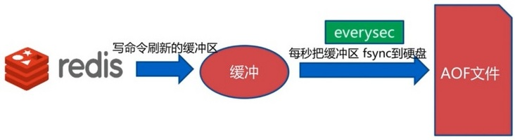

- **no**： 操作系统控制，写执行执行完毕，把日志写到 AOF 文件内存缓冲区，由操作系统决定何时刷写到磁盘。

 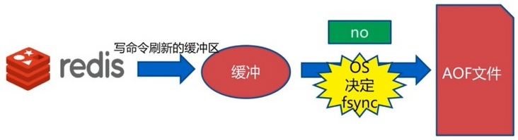

没有两全其美的策略，我们需要在性能和可靠性上做一个取舍。

`always` 同步写回可以做到数据不丢失，但是每个「写」指令都需要写入磁盘，性能最差。

`everysec` 每秒写回，避免了同步写回的性能开销，发生宕机可能有一秒位写入磁盘的数据丢失，在性能和可靠性之间做了折中。

`no` 操作系统控制，执行写指令后就写入 AOF 文件缓冲就可以执行后续的「写」指令，性能最好，但是有可能丢失很多的数据。

>[!TIP]
>
>总结一下：想要获得高性能，就选择 No 策略；如果想要得到高可靠性保证，就选择 Always 策略；如果允许数据有一点丢失，又希望性能别受太大影响的话，那么就选择 Everysec 策略。


## 优缺点

优点：执行成功才记录日志，避免了指令语法检查开销。同时，不会阻塞当前「写」指令。

缺点：由于 AOF 记录的是一个个指令内容，具体格式请看上面的日志格式。故障恢复的时候需要执行每一个指令，如果日志文件太大，整个恢复过程就会非常缓慢。另外文件系统对文件大小也有限制，不能保存过大文件，文件变大，追加效率也会变低。


## AOF 重写机制

AOF 日志记录的是每个「写」指令操作。不会像 RDB 全量快照导致性能损耗，但是执行速度没有 RDB 快，同时日志文件过大也会造成性能问题，对于唯快不破的 Redis 这个真男人来说，绝对不能忍受日志过大导致的问题。

所以，Redis 设计了一个杀手锏「AOF 重写机制」，Redis 提供了 bgrewriteaof 指令用于对 AOF 日志进行瘦身。

其原理就是开辟一个子进程对内存进行遍历转换成一系列 Redis 的操作指令，序列化到一个新的 AOF 日志文件中。序列化完毕后再将操作期间发生的增量 AOF 日志追加到这个新的 AOF 日志文件中，追加完毕后就立即替代旧的 AOF 日志文件了，瘦身工作就完成了。

 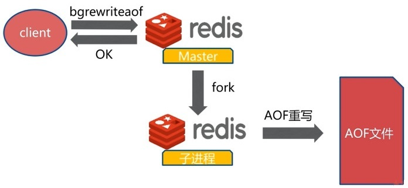

重写机制有「多变一」功能，将旧日志中的多条指令，在重写后就变成了一条指令。如下所示，实际上重写的实现就是给根据现有数据来重新造一遍指令。

 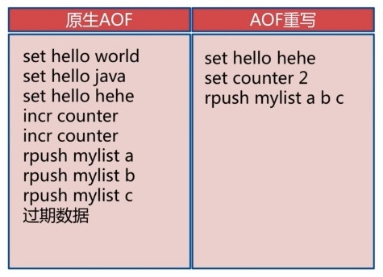

和 AOF 日志由主线程写回不同，重写过程是由后台子进程 bgrewriteaof 来完成的，这也是为了避免阻塞主线程，导致数据库性能下降。

总的来说，一共出现 **两个日志，一次拷内存数据拷贝，分别是旧的 AOF 日志和新的 AOF 重写日志和 Redis 数据拷贝**。

Redis 会将重写过程中的接收到的「写」指令操作同时记录到旧的 AOF 缓冲区和 AOF 重写缓冲区，这样重写日志也保存最新的操作。等到拷贝数据的所有操作记录重写完成后，重写缓冲区记录的最新操作也会写到新的 AOF 文件中。

每次 AOF 重写时，Redis 会先执行一个内存拷贝，用于遍历数据生成重写记录；使用两个日志保证在重写过程中，新写入的数据不会丢失，并且保持数据一致性。

 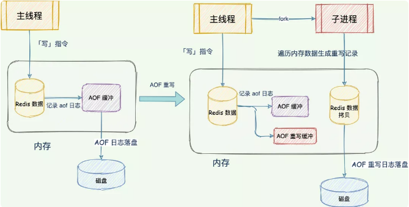

> AOF 重写也有一个重写日志，为什么它不共享使用 AOF 本身的日志呢？
>
> 1. 一个原因是父子进程写同一个文件必然会产生竞争问题，控制竞争就意味着会影响父进程的性能。
> 2. 如果 AOF 重写过程中失败了，那么原本的 AOF 文件相当于被污染了，无法做恢复使用。所以 Redis AOF 重写一个新文件，重写失败的话，直接删除这个文件就好了，不会对原先的 AOF 文件产生影响。等重写完成之后，直接替换旧文件即可。


---

# Redis 4.0 混合日志模型

重启 Redis 时，我们很少使用 RDB 来恢复内存状态，因为会丢失大量数据。我们通常使用 AOF 日志重放，但是重放 AOF 日志性能相对 RDB 来说要慢很多，这样在 Redis 实例很大的情况下，启动需要花费很长的时间。

Redis 4.0 为了解决这个问题，带来了一个新的持久化选项——**混合持久化**。将 RDB 文件的内容和增量的 AOF 日志文件存在一起。这里的 AOF 日志不再是全量的日志，而是自持久化开始到持久化结束的这段时间发生的增量 AOF 日志，通常这部分 AOF 日志很小。

于是在 Redis 重启的时候，可以先加载 RDB 的内容，然后再重放增量 AOF 日志就可以完全替代之前的 AOF 全量文件重放，重启效率因此大幅得到提升。

所以 RDB 内存快照以稍微慢一点的频率执行，在两次 RDB 快照期间使用 AOF 日志记录期间发生的所有「写」操作。

这样快照就不用频繁的执行，同时由于 AOF 只需要记录两次快照之间发生的「写」指令，不需要记录所有的操作，避免出现文件过大的情况。


---

# 总结

Redis 设计了 bgsave 和写时复制，尽可能避免执行快照期间对读写指令的影响，频繁快照会给磁盘带来压力以及 fork 阻塞主线程。

Redis 设计了两大杀手锏实现了宕机快速恢复，数据不丢失。

避免日志过大，提供了 AOF 重写机制，根据数据库的数据最新状态，生成数据的写操作作为新日志，并且通过后台完成不阻塞主线程。

综合 AOF 和 RDB 在 Redis 4.0 提供了新的持久化策略，混合日志模型。在 Redis 重启的时候，可以先加载 RDB 的内容，然后再重放增量 AOF 日志就可以完全替代之前的 AOF 全量文件重放，重启效率因此大幅得到提升。

最后，关于 AOF 和 RDB 的选择问题，有三点建议：

- 数据不能丢失时，内存快照和 AOF 的混合使用是一个很好的选择；
- 如果允许分钟级别的数据丢失，可以只使用 RDB；
- 如果只用 AOF，优先使用 everysec 的配置选项，因为它在可靠性和性能之间取了一个平衡。


---

# 参考与感谢

- [Redis持久化 -- 内存快照](https://www.cnblogs.com/hunternet/p/14626052.html)
- Redis设计与实现 - 黄健宏著

