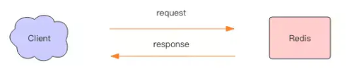
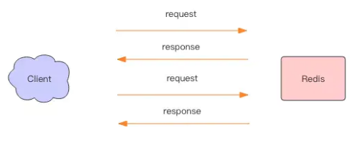
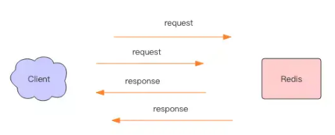
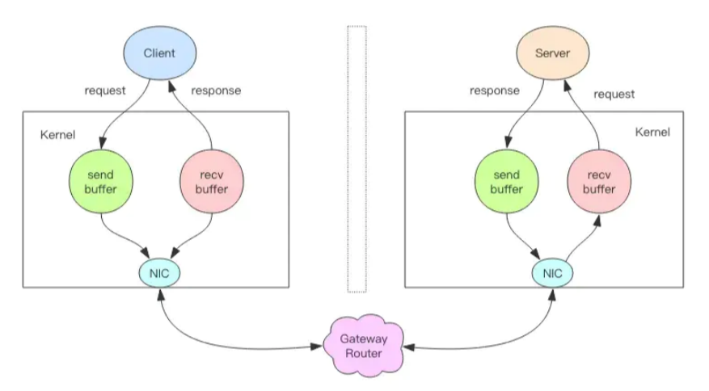

# Redis benchmark

Redis 自带了一个叫 `redis-benchmark` 的工具来模拟 N 个客户端同时发出 M 个请求。比如我可以对 set，get 命令测试性能基准

```bash
[root@host ~]# redis-benchmark -h 192.168.3.64 -t set,get -q 
SET: 45977.01 requests per second, p50=0.919 msec                   
GET: 57142.86 requests per second, p50=0.679 msec
```

然而当我调用 go-redis 库使用基准测试时，发现我的性能只有 10000 左右，这是因为 benchmark 默认使用 50 个客户端来增加压力，下面我们使用 -c 参数来指定客户端数量：

```bash
[root@host ~]# redis-benchmark -h 192.168.3.64 -t set,get -q -c 1
SET: 7870.92 requests per second, p50=0.119 msec                  
GET: 10869.57 requests per second, p50=0.087 msec
```

这下性能就匹配上了，但是单客户端性能就无法提升了吗？

默认情况下，每个客户端都是在一个请求完成之后才发送下一个请求 （benchmark 会模拟 50 个客户端除非使用 -c 指定特别的数量）， 这意味着服务器几乎是按顺序读取每个客户端的命令。

`Also RTT is payed as well.`

真实世界会更复杂，Redis 支持 [/topics/pipelining](http://www.redis.cn/topics/pipelining)，使得可以一次性执行多条命令成为可能。 Redis pipelining 可以提高服务器的 TPS。


---

# Redis pipeline

大多数同学一直以来对 Redis 管道有一个误解，他们以为这是 Redis 服务器提供的一种特别的技术，有了这种技术就可以加速 Redis 的存取效率。

但是实际上 Redis 管道 (Pipeline) 本身并不是 Redis 服务器直接提供的技术，这个技术本质上是由客户端提供的，跟服务器没有什么直接的关系。

下面我们对这块做一个深入探究。


## Redis 的消息交互

当我们使用客户端对 Redis 进行一次操作时，如下图所示，客户端将请求传送给服务器，服务器处理完毕后，再将响应回复给客户端。

这要花费一个网络数据包来回的时间。

 

如果连续执行多条指令，那就会花费多个网络数据包来回的时间。如下图所示。

 

回到客户端代码层面，客户端是经历了**读-写-读-写**四个操作才完整地执行了两条指令。

 

现在如果我们调整读写顺序，改成**写-写-读-读**，这两个指令同样可以正常完成。

 

两个连续的写操作和两个连续的读操作总共只会花费一次网络来回，就好比连续的 write 操作合并了，连续的 read 操作也合并了一样。

 

这便是管道操作的本质，服务器根本没有任何区别对待，还是收到一条消息，执行一条消息，回复一条消息的正常的流程。

客户端通过对管道中的指令列表改变读写顺序就可以大幅节省 IO 时间。管道中指令越多，效果越好。


## 管道压力测试

接下来我们实践一下管道的力量。

Redis 自带了一个压力测试工具 redis-benchmark，使用这个工具就可以进行管道测试。

首先我们对一个普通的 set 指令进行压测，QPS 大约 5w/s。

```bash
[root@host ~]# redis-benchmark -h 192.168.3.64 -t set -q
SET: 48123.20 requests per second, p50=0.895 msec
```


我们加入管道选项 -P 参数，它表示单个管道内并行的请求数量，看下面P=2，QPS 达到了 7w/s。

```bash
[root@host ~]# redis-benchmark -h 192.168.3.64 -t set -q -P 2
SET: 74962.52 requests per second, p50=1.143 msec
```


再看看 P=3，QPS 达到了 11w/s。

```bash
[root@host ~]# redis-benchmark -h 192.168.3.64 -t set -q -P 3
SET: 116552.45 requests per second, p50=1.055 msec
```


当我们 P 增加到一定大小，再继续提升 P 参数，发现 QPS 已经上不去了。这是为什么呢？

```bash
[root@host ~]# redis-benchmark -h 192.168.3.64 -t set -q -P 50
SET: 375939.84 requests per second, p50=5.879 msec                    

[root@host6 ~]# redis-benchmark -h 192.168.3.64 -t set -q -P 100
SET: 416666.69 requests per second, p50=11.287 msec                           

[root@host ~]# redis-benchmark -h 192.168.3.64 -t set -q -P 200
SET: 409836.06 requests per second, p50=22.127 msec
```

因为这里 CPU 处理能力已经达到了瓶颈，Redis 的单线程 CPU 已经飙到了 100%，所以无法再继续提升了。


## 深入理解管道本质

接下来我们深入分析一个请求交互的流程，真实的情况是它很复杂，因为要经过网络协议栈，这个就得深入内核了。

 

上图就是一个完整的请求交互流程图。我用文字来仔细描述一遍：

1.  客户端进程调用 `write` 将消息写到操作系统内核为套接字分配的发送缓冲 `send buffer`。
2.  客户端操作系统内核将发送缓冲的内容发送到网卡，网卡硬件将数据通过「网际路由」送到服务器的网卡。
3.  服务器操作系统内核将网卡的数据放到内核为套接字分配的接收缓冲 `recv buffer`。
4.  服务器进程调用 `read` 从接收缓冲中取出消息进行处理。
5.  服务器进程调用 `write` 将响应消息写到内核为套接字分配的发送缓冲 `send buffer`。
6.  服务器操作系统内核将发送缓冲的内容发送到网卡，网卡硬件将数据通过「网际路由」送到客户端的网卡。
7.  客户端操作系统内核将网卡的数据放到内核为套接字分配的接收缓冲 `recv buffer`。
8.  客户端进程调用 `read` 从接收缓冲中取出消息返回给上层业务逻辑进行处理。
9.  结束。

其中步骤 5 ~ 8 和 1 ~ 4 是一样的，只不过方向是反过来的，一个是请求，一个是响应。

我们开始以为 write 操作是要等到对方收到消息才会返回，但实际上不是这样的。

**write 操作只负责将数据写到本地操作系统内核的发送缓冲然后就返回了**。剩下的事交给操作系统内核异步将数据送到目标机器。

但是如果发送缓冲满了，那么就需要等待缓冲空出空闲空间来，这个就是写操作 IO 操作的真正耗时。

我们开始以为 read 操作是从目标机器拉取数据，但实际上不是这样的。

**read 操作只负责将数据从本地操作系统内核的接收缓冲中取出来就了事了。但是如果缓冲是空的，那么就需要等待数据到来，这个就是读操作 IO 操作的真正耗时。**

所以对于 value = redis.get(key) 这样一个简单的请求来说，write 操作几乎没有耗时，直接写到发送缓冲就返回。

而 read 就会比较耗时了，因为它要等待消息经过网络路由到目标机器处理后的响应消息,再回送到当前的内核读缓冲才可以返回。这才是一个网络来回的真正开销。

而对于管道来说，连续的 write 操作根本就没有耗时，之后第一个 read 操作会等待一个网络的来回开销，然后所有的响应消息就都已经回送到内核的读缓冲了，后续的 read 操作直接就可以从缓冲拿到结果，瞬间就返回了。

这就是管道的本质了，它并不是服务器的什么特性，而是客户端通过改变了读写的顺序带来的性能的巨大提升。


## pipeline 和 mget

pipeline 是将多个命令一次性写入到服务器，然后等待服务器返回结果，他可以同时执行多个命令，但是各个命令之间不能有数据依赖，因为 pipeline 执行命令式不能保证执行顺序与写入时的命令顺序相同。

-   pipeline 独占一个连接，所以管道内命令太多，可能会请求超时
-   可发送命令数量受 client 端缓冲区大小限制
-   redis server 存在 query buffer 限制
-   redis server 存在 output buffer 限制
-   需要 server 和 client 的共同支持才能实现 pipeline
-   redis cluster 不建议使用 pipeline, 容易产生 max redirect 错误
-   twem proxy 可以支持 pipeline

mget 和 mset 也是为了减少网络连接和传输时间设置的，而且当 key 的数目较多时， mget 和 mset 性能要高于 pipeline, 但是 mget 和 mset 也仅限与同时对多个 key 进行操作。


---

# Redis 性能陷阱和错误的认知

第一点是显而易见的：基准测试的黄金准则是使用相同的标准。 

用相同的任务量测试不同版本的 Redis，或者用相同的参数测试测试不同版本 Redis。 如果把 Redis 和其他工具测试，那就需要小心功能细节差异。

-   Redis 是一个服务器：所有的命令都包含**网络或 IPC 消耗**。这意味着和它和 SQLite， Berkeley DB， Tokyo/Kyoto Cabinet 等比较起来无意义， 因为大部分的消耗都在网络协议上面。
-   Redis 的大部分常用命令都有确认返回。有些数据存储系统则没有（比如 MongoDB 的写操作没有返回确认）。把 Redis 和其他单向调用命令存储系统比较意义不大。
-   **简单的循环操作 Redis 其实不是对 Redis 进行基准测试，而是测试你的网络（或者 IPC）延迟**。想要真正测试 Redis，需要使用多个连接（比如 redis-benchmark)， 或者使用 pipelining 来聚合多个命令，另外还可以采用多线程或多进程。
-   Redis 是一个内存数据库，同时提供一些可选的持久化功能。 如果你想和一个持久化服务器（MySQL, PostgreSQL 等等） 对比的话， 那你需要考虑启用 AOF 和适当的 fsync 策略。
-   Redis 是单线程服务。它并没有设计为多 CPU 进行优化。如果想要从多核获取好处， 那就考虑启用多个实例吧。将单实例 Redis 和多线程数据库对比是不公平的。

一个普遍的误解是 redis-benchmark 特意让基准测试看起来更好， 所表现出来的数据像是人造的，而不是真实产品下面的。

Redis-benchmark 程序可以简单快捷的对给定硬件条件下面的机器计算出性能参数。 但是，通常情况下面这并不是 Redis 服务器可以达到的最大吞吐量。 事实上，使用 pipelining 和更快的客户端（hiredis）可以达到更大的吞吐量。 redis-benchmark 默认情况下面仅仅使用并发来提高吞吐量（创建多条连接）。 它并没有使用 pipelining 或者其他并行技术（仅仅多条连接，而不是多线程）。

如果想使用 pipelining 模式来进行基准测试（了达到更高吞吐量），可以使用 -P 参数。这种方案的确可以提高性能，有很多使用 Redis 的应用在生产环境中这样做。

最后，基准测试需要使用相同的操作和数据来对比，如果这些不一样， 那么基准测试是无意义的。


---

# 参考与感谢

-   [Redis有多快?](http://www.redis.cn/topics/benchmarks.html)
-   [Redis Pipeline原理](https://www.jianshu.com/p/007509df7bd5)

