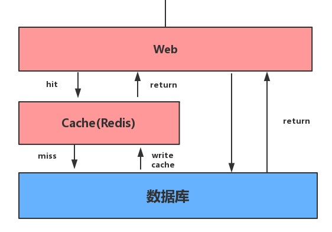
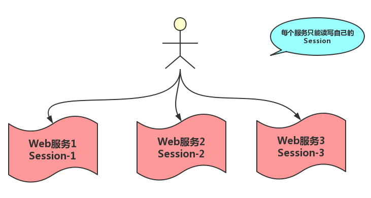
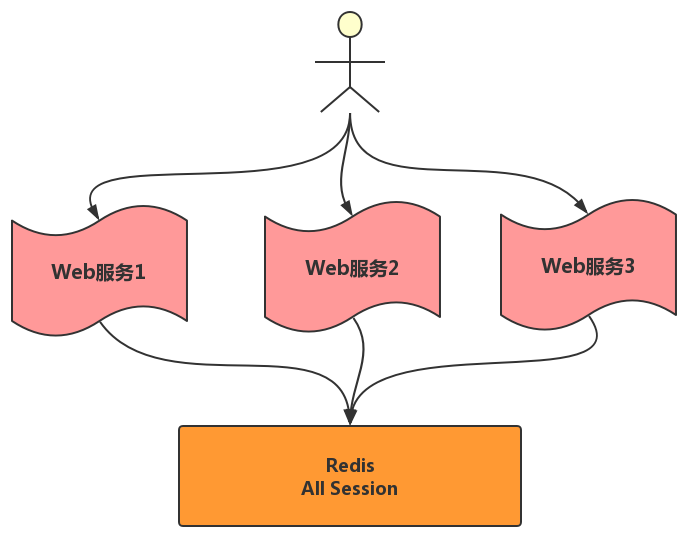
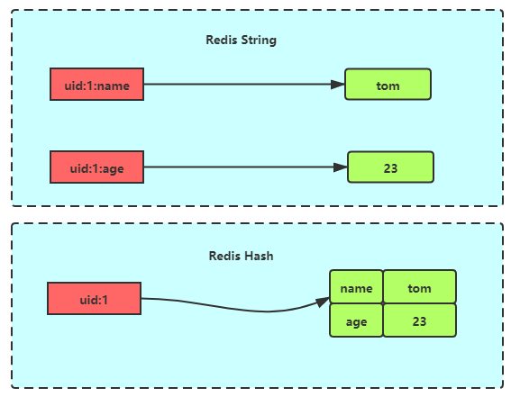
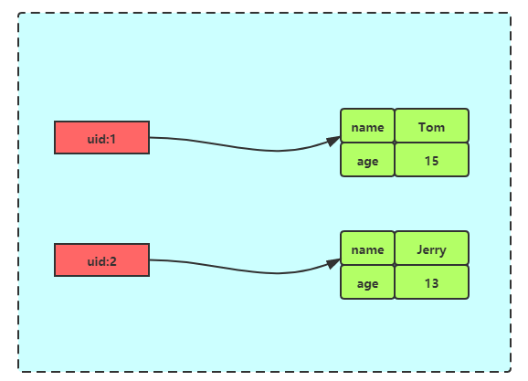
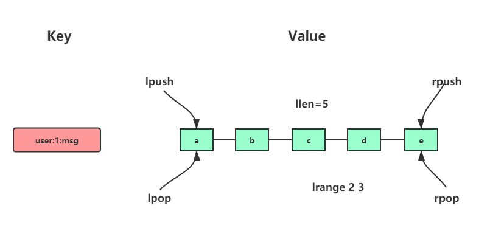
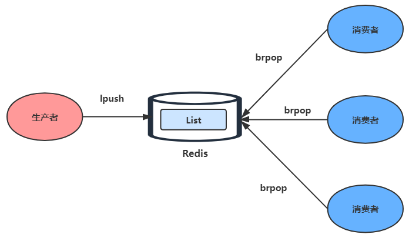

# 什么是Redis？

Redis，英文全称是**Remote Dictionary Server**（远程字典服务），是一个开源的使用 ANSI C 语言编写、支持网络、可基于内存亦可持久化的日志型、Key-Value数据库，并提供多种语言的 API。

与 MySQL 数据库不同的是，Redis 的数据是存在内存中的。

它的读写速度非常快，每秒可以处理超过 10 万次读写操作，因此redis被**广泛应用于缓存**，另外，Redis也经常用来做分布式锁。除此之外，Redis 支持事务、持久化、LUA 脚本、LRU 驱动事件、多种集群方案。


---

# Redis的基本数据结构

大多数小伙伴都知道，Redis 有以下这五种基本类型：

-   String（字符串）
-   Hash（哈希）
-   List（列表）
-   Set（集合）
-   zset（有序集合）

它还有三种特殊的数据结构类型：

-   Geospatial
-   Hyperloglog
-   Bitmap


## Redis键

Redis 键命令用于管理 redis 的键。下面是一些键操作的常用命令

```shell
[root@host-192-168-3-64 ~]# redis-cli 
# 查看所有键
127.0.0.1:6379> keys *
(empty array)
# 检查键是否存在
127.0.0.1:6379> EXISTS foo
(integer) 0
127.0.0.1:6379> set foo bar
OK
127.0.0.1:6379> EXISTS foo
(integer) 1
# 设置键超时时间
127.0.0.1:6379> EXPIRE foo 60
(integer) 1
# 查看键剩余生存时间
127.0.0.1:6379> TTL foo
(integer) 56
# 删除键
127.0.0.1:6379> del foo
(integer) 1
```


## String（字符串）

-   简介: String 是 Redis 最基础的数据结构类型，它是二进制安全的，可以存储图片或者序列化的对象，值最大存储为 512M
-   简单使用举例: `set key value`、`get key`等
-   应用场景：共享 session、分布式锁，计数器、限流等
-   内部编码有 3 种，`int（8字节长整型）/ embstr（小于等于45字节字符串）/ raw（大于45个字节字符串）`

示例：

```shell
[root@host ~]# redis-cli 
# 基本使用
127.0.0.1:6379> set foo bar
OK
127.0.0.1:6379> get foo
"bar"

# 计数
127.0.0.1:6379> set count 1
OK
127.0.0.1:6379> INCR count
(integer) 2
127.0.0.1:6379> get count
"2"
```


reids 字符串的使用场景应该是最为广泛的，甚至有些对 redis 其它几种对象不太熟悉的人，基本所有场景都会使用字符串(序列化一下直接扔进去)。在众多的使用场景中总结一下大概分以下几种：

### 作为缓存层

 ****

如上图，Redis 经常作为缓存层，来缓存一些热点数据。来加速读写性能从而降低后端的压力。

一般在读取数据的时候会先从 Redis 中读取，如果 Redis 中没有，再从数据库中读取。在 Redis 作为缓存层使用的时候，必须注意一些问题，如：缓存穿透、雪崩以及缓存更新问题......


### 计数器\限速器\分布式系统ID

计数器 \ 限速器 \ 分布式ID 等主要是利用 Redis 字符串自增自减的特性。

-   计数器：经常可以被用来做计数器，如微博的评论数、点赞数、分享数，抖音作品的收藏数，京东商品的销售量、评价数等。
-   限速器：如验证码接口访问频率限制，用户登陆时需要让用户输入手机验证码，从而确定是否是用户本人，但是为了短信接口不被频繁访问，会限制用户每分钟获取验证码的频率，例如一分钟不能超过5次。
-   分布式 ID：由于 Redis 自增自减的操作是原子性的因此也经常在分布式系统中用来生成唯一的订单号、序列号等。


### 分布式系统共享session

通常在单体系统中，Web 服务将会用户的 Session 信息（例如用户登录信息）保存在自己的服务器中。

但是在分布式系统中，这样做会有问题。因为分布式系统通常有很多个服务，每个服务又会同时部署在多台机器上，通过负载均衡机制将将用户的访问均衡到不同服务器上。

这个时候用户的请求可能分发到不同的服务器上，从而导致用户登录保存 Session 是在一台服务器上，而读取 Session 是在另一台服务器上因此会读不到 Session。

 

这种问题通常的做法是把 Session 存到一个公共的地方，让每个 Web 服务，都去这个公共的地方存取 Session。

而 Redis 就可以是这个公共的地方。(数据库、memecache 等都可以各有优缺点)。

 


### 二进制存储

由于 Redis 字符串可以存储二进制数据的特性，因此也可以用来存储一些二进制数据。如图片、 音频、 视频等。


## Hash（哈希）

-   简介：在 Redis 中，哈希类型是指 v（值）本身又是一个键值对（k-v）结构
-   简单使用举例：`hset key field value` 、`hget key field`
-   内部编码：`ziplist（压缩列表）` 、`hashtable（哈希表）`
-   应用场景：缓存用户信息等

>[!NOTE]
>
>如果开发使用 hgetall，哈希元素比较多的话，可能导致 Redis 阻塞，可以使用 hscan。而如果只是获取部分 field，建议使用 hmget

示例：

```shell
127.0.0.1:6379> HMSET dict name zhangsan age 18
OK
127.0.0.1:6379> HGETALL dict
1) "name"
2) "zhangsan"
3) "age"
4) "18"
```


哈希在很多编程语言中都有着很广泛的应用，而在 Redis 中也是如此，在 redis 中，哈希类型是指 Redis 键值对中的值本身又是一个键值对结构，形如`value=[{field1，value1}，...{fieldN，valueN}]`，其与 Redis 字符串对象的区别如下图所示:

 


### 存储对象

Redis 哈希对象常常用来缓存一些对象信息，如用户信息、商品信息、配置信息等。

我们以用户信息为例，它在关系型数据库中的结构是这样的

| uid  | name  | age  |
| ---- | ----- | ---- |
| 1    | Tom   | 15   |
| 2    | Jerry | 13   |

而使用Redis Hash存储其结构如下图:

 

相比较于使用Redis字符串存储，其有以下几个优缺点:

1.  原生字符串每个属性一个键。

    ```bash
    set user:1:name Tom
    set user:1:age 15
    ```

    优点：简单直观，每个属性都支持更新操作。

    缺点：占用过多的键，内存占用量较大，同时用户信息内聚性比较差，所以此种方案一般不会在生产环境使用。

    

2.  序列化字符串后，将用户信息序列化后用一个键保存

    ```bash
    set user:1 serialize(userInfo)
    ```

    优点：简化编程，如果合理的使用序列化可以提高内存的使用效率。

    缺点：序列化和反序列化有一定的开销，同时每次更新属性都需要把全部数据取出进行反序列化，更新后再序列化到 Redis 中。

    

3.  使用哈希保存键值对

    ```bash
    hmset user:1 name Tom age 15 
    ```

    优点：简单直观，如果使用合理可以减少内存空间的使用。

    缺点：要控制哈希在 ziplist 和 hashtable 两种内部编码的转换，hashtable 会消耗更多内存。

    

做配置中心系统的时候，使用 Hash 来缓存每个应用的配置信息，其在数据库中的数据结构大致如下表

| AppId | SettingKey | SettingValue |
| ----- | ---------- | ------------ |
| 10001 | AppName    | myblog       |
| 10001 | Version    | 1.0          |
| 10002 | AppName    | admin site   |

在使用 Redis Hash 进行存储的时候

新增或更新一个配置项

```bash
127.0.0.1:6379> HSET 10001 AppName myblog
(integer) 1
```

获取一个配置项

```bash
127.0.0.1:6379> HGET 10001 AppName 
"myblog"
```

删除一个配置项

```bash
127.0.0.1:6379> HDEL 10001 AppName
(integer) 1
```


### 购物车

很多电商网站都会使用 cookie 实现购物车，也就是将整个购物车都存储到 cookie 里面。

这种做法的一大优点：无须对数据库进行写入就可以实现购物车功能，这种方式大大提高了购物车的性能，而缺点则是程序需要重新解析和验证( validate) cookie，确保 cookie 的格式正确，并且包含的商品都是真正可购买的商品。

cookie 购物车还有一个缺点：因为浏览器每次发送请求都会连 cookie 一起发送，所以如果购物车 cookie 的体积比较大，那么请求发送和处理的速度可能会有所降低。

购物车的定义非常简单：我们以每个用户的用户 ID (或者 CookieId ) 作为 Redis 的 Key，每个用户的购物车都是一个哈希表，这个哈希表存储了商品 ID 与商品订购数量之间的映射。在商品的订购数量出现变化时，我们操作Redis哈希对购物车进行更新:

如果用户订购某件商品的数量大于 0，那么程序会将这件商品的 ID 以及用户订购该商品的数量添加到散列里面。

```bash
# 用户1 商品1 数量1
127.0.0.1:6379> HSET uid:1 pid:1 1
# 返回值0代表改field在哈希表中不存在，为新增的field
(integer) 1 
```

如果用户购买的商品已经存在于散列里面，那么新的订购数量会覆盖已有的订购数量;

```bash
# 用户1 商品1 数量5
127.0.0.1:6379> HSET uid:1 pid:1 5
# 返回值0代表改field在哈希表中已经存在
(integer) 0 
```

相反地，如果用户订购某件商品的数量不大于 0，那么程序将从散列里面移除该条目。

```bash
# 用户1 商品1
127.0.0.1:6379> HDEL uid:1 pid:2
(integer) 1
```


### 计数器

Redis 哈希表作为计数器的使用也非常广泛。它常常被用在记录网站每一天、一月、一年的访问数量。每一次访问，我们在对应的 field 上自增 1

```bash
127.0.0.1:6379> HINCRBY MyBlog  202001 1
(integer) 1
127.0.0.1:6379> HINCRBY MyBlog  202001 1
(integer) 2
127.0.0.1:6379> HINCRBY MyBlog  202002 1
(integer) 1
127.0.0.1:6379> HINCRBY MyBlog  202002 1
(integer) 2
```

也经常被用在记录商品的好评数量，差评数量上

```bash
127.0.0.1:6379> HINCRBY pid:1  Good 1
(integer) 1
127.0.0.1:6379> HINCRBY pid:1  Good 1
(integer) 2
127.0.0.1:6379> HINCRBY pid:1  bad  1
(integer) 1
```

也可以实时记录当天的在线的人数。

```bash
# 有人登陆
127.0.0.1:6379> HINCRBY MySite  20200310 1
(integer) 1
# 有人登陆
127.0.0.1:6379> HINCRBY MySite  20200310 1
(integer) 2
# 有人登出
127.0.0.1:6379> HINCRBY MySite  20200310 -1
(integer) 1
```


## List（列表）

 

-   简介：列表（list）类型是用来存储多个有序的字符串，一个列表最多可以存储 2^32-1 个元素。
-   简单实用举例：` lpush  key  value [value ...]` 、`lrange key start end`
-   内部编码：ziplist（压缩列表）、linkedlist（链表）
-   应用场景： 消息队列，文章列表

list 应用场景参考以下：

>   -   lpush+lpop=Stack（栈）
>   -   lpush+rpop=Queue（队列）
>   -   lpush+ltrim=Capped Collection（有限集合）
>   -   lpush+brpop=Message Queue（消息队列）

示例：

```shell
127.0.0.1:6379> lpush stack 1
(integer) 1
127.0.0.1:6379> lpush stack 2
(integer) 2
127.0.0.1:6379> LPOP stack 
"2"
127.0.0.1:6379> LPOP stack 
"1"
```


### 消息队列和栈

列表类型可以使用 rpush 实现先进先出的功能，同时又可以使用 lpop 轻松的弹出（查询并删除）第一个元素，所以列表类型可以用来实现消息队列

 

### 文章(商品等)列表

我们以博客站点为例，当用户和文章都越来越多时，为了加快程序的响应速度，我们可以把用户自己的文章存入到 List 中，因为 List 是有序的结构，所以这样又可以完美的实现分页功能，从而加速了程序的响应速度。

1.  每篇文章我们使用哈希结构存储，例如每篇文章有 3 个属性 title、timestamp、content

    ```shell
    hmset acticle:1 title xx timestamp 1476536196 content xxxx
    ...
    hmset acticle:k title yy timestamp 1476512536 content yyyy
    ...
    ```

2.  向用户文章列表添加文章，user：{id}：articles 作为用户文章列表的键：

    ```shell
    lpush user:1:acticles article:1 article3
    ...
    lpush
    ...
    ```

3.  分页获取用户文章列表，例如下面伪代码获取用户 id=1 的前 10 篇文章

    ```shell
    articles = lrange user:1:articles 0 9
    for article in {articles}
    {
    	hgetall {article}
    }
    ```

注意: 使用列表类型保存和获取文章列表会存在两个问题。

-   如果每次分页获取的文章个数较多，需要执行多次 hgetall 操作，此时可以考虑使用 Pipeline 批量获取，或者考虑将文章数据序列化为字符串类型，使用 mget 批量获取。
-   分页获取文章列表时，lrange 命令在列表两端性能较好，但是如果列表较大，获取列表中间范围的元素性能会变差，此时可以考虑将列表做二级拆分，或者使用 Redis3.2 的 quicklist 内部编码实现，它结合 ziplist 和 linkedlist 的特点，获取列表中间范围的元素时也可以高效完成。


## Set（集合）

-   简介：集合（set）类型也是用来保存多个的字符串元素，但是不允许重复元素
-   简单使用举例：`sadd key element [element ...]`、`smembers key`
-   内部编码：`intset（整数集合）`、`hashtable（哈希表）`
-   应用场景： 用户标签，生成随机数抽奖、社交需求

>[!NOTE]
>
>smembers 和 lrange、hgetall 都属于比较重的命令，如果元素过多存在阻塞Redis的可能性，可以使用sscan来完成。

示例：

```shell
127.0.0.1:6379> SADD sql redis
(integer) 1
127.0.0.1:6379> SADD sql mysql
(integer) 1
127.0.0.1:6379> SADD sql mysql
(integer) 0
127.0.0.1:6379> SMEMBERS sql
1) "redis"
2) "mysql"
```


我们可以知道集合的主要几个特性，无序、不可重复、支持并交差等操作。

因此集合类型比较适合用来数据去重和保障数据的唯一性，还可以用来统计多个集合的交集、错集和并集等，当我们存储的数据是无序并且需要去重的情况下，比较适合使用集合类型进行存储。

### 标签系统

集合类型比较典型的使用场景是标签（tag）。

1.  给用户添加标签。

    ```shell
    sadd user:1:tags tag1 tag2 tag5
    sadd user:2:tags tag2 tag3 tag5
    ...
    sadd user:k:tags tag1 tag2 tag4
    ...
    ```

2.  给标签添加用户

    ```shell
    sadd tag1:users user:1 user:3
    sadd tag2:users user:1 user:2 user:3
    ...
    sadd tagk:users user:1 user:2
    ...
    ```

3.  使用sinter命令，可以来计算用户共同感兴趣的标签

    ```shell
    sinter user:1:tags user:2:tags
    ```

这种标签系统在电商系统、社交系统、视频网站，图书网站，旅游网站等都有着广泛的应用。

例如一个用户可能对娱乐、体育比较感兴趣，另一个用户可能对历史、新闻比较感兴趣，这些兴趣点就是标签。

有了这些数据就可以得到喜欢同一个标签的人，以及用户的共同喜好的标签，这些数据对于用户体验以及增强用户黏度比较重要。

例如一个社交系统可以根据用户的标签进行好友的推荐，已经用户感兴趣的新闻的推荐等，一个电子商务的网站会对不同标签的用户做不同类型的推荐，比如对数码产品比较感兴趣的人，在各个页面或者通过邮件的形式给他们推荐最新的数码产品，通常会为网站带来更多的利益。


### 抽奖系统

Redis集合的 SPOP (随机移除并返回集合中一个或多个元素)和 SRANDMEMBER (随机返回集合中一个或多个元素) 命令可以帮助我们实现一个抽奖系统

如果允许重复中奖，可以使用 SRANDMEMBER 命令

```shell
# 添加抽奖名单
127.0.0.1:6379> SADD lucky:1 Tom
(integer) 1
127.0.0.1:6379> SADD lucky:1 Jerry
(integer) 1
127.0.0.1:6379> SADD lucky:1 John
(integer) 1
127.0.0.1:6379> SADD lucky:1 Marry
(integer) 1
127.0.0.1:6379> SADD lucky:1 Sean
(integer) 1
127.0.0.1:6379> SADD lucky:1 Lindy
(integer) 1
127.0.0.1:6379> SADD lucky:1 Echo
(integer) 1

# 抽取三等奖3个
127.0.0.1:6379> SRANDMEMBER lucky:1 3
1) "John"
2) "Echo"
3) "Lindy"
# 抽取二等奖2个
127.0.0.1:6379> SRANDMEMBER lucky:1 2
1) "Sean"
2) "Lindy"
# 抽取一等奖1个
127.0.0.1:6379> SRANDMEMBER lucky:1 1
1) "Tom"    
```

如果不允许重复中奖，可以使用 SPOP 命令

```shell
# 添加抽奖名单
127.0.0.1:6379> SADD lucky:1 Tom
(integer) 1
127.0.0.1:6379> SADD lucky:1 Jerry
(integer) 1
127.0.0.1:6379> SADD lucky:1 John
(integer) 1
127.0.0.1:6379> SADD lucky:1 Marry
(integer) 1
127.0.0.1:6379> SADD lucky:1 Sean
(integer) 1
127.0.0.1:6379> SADD lucky:1 Lindy
(integer) 1
127.0.0.1:6379> SADD lucky:1 Echo
(integer) 1

# 抽取三等奖3个
127.0.0.1:6379> SPOP lucky:1 3
1) "John"
2) "Echo"
3) "Lindy"
# 抽取二等奖2个
127.0.0.1:6379> SPOP lucky:1 2
1) "Sean"
2) "Marry"
# 抽取一等奖1个
127.0.0.1:6379> SPOP lucky:1 1
1) "Tom"   
```


## zset（有序集合）

-   简介：已排序的字符串集合，同时元素不能重复
-   简单格式举例：`zadd key score member [score member ...]`，`zrank key member`
-   底层内部编码：`ziplist（压缩列表）`、`skiplist（跳跃表）`
-   应用场景：排行榜，社交需求（如用户点赞）

```shell
127.0.0.1:6379> zadd sql 3 mysql
(integer) 1
127.0.0.1:6379> zadd sql 1 redis
(integer) 1
127.0.0.1:6379> ZRANGE sql 0 10 withscores
1) "redis"
2) "1"
3) "mysql"
4) "3"
```


### 排行榜系统

有序集合比较典型的使用场景就是排行榜系统。例如学生成绩的排名。某视频(博客等)网站的用户点赞、播放排名、电商系统中商品的销量排名等。

我们以博客点赞为例。

1.  添加用户赞数

例如小编 Tom 发表了一篇博文，并且获得了10个赞。

```bash
zadd user:ranking 10 arcticle1
```

1.  取消用户赞数

这个时候有一个读者又觉得Tom写的不好，又取消了赞，此时需要将文章的赞数从榜单中减去1，可以使用zincrby。

```bash
zincrby user:ranking -1 arcticle1
```

1.  查看某篇文章的赞数

```bash
ZSCORE user:ranking arcticle1
```

1.  展示获取赞数最多的三篇文章

此功能使用 ZREVRANGE 命令实现：

```bash
ZREVRANGE user:ranking 0 2 withscores
```


### 电话号码(姓名)排序

使用有序集合的 ZRANGEBYLEX 或 ZREVRANGEBYLEX 可以帮助我们实现电话号码或姓名的排序，我们以 ZRANGEBYLEX 为例

> [!NOTE]
>
> 不要在分数不一致的 SortSet 集合中去使用 ZRANGEBYLEX和 ZREVRANGEBYLEX 指令，因为获取的结果会不准确。

1.  电话号码排序

我们可以将电话号码存储到 SortSet 中，然后根据需要来获取号段:

```bash
redis> zadd phone 0 13100111100 0 13110114300 0 13132110901 
(integer) 3
redis> zadd phone 0 13200111100 0 13210414300 0 13252110901 
(integer) 3
redis> zadd phone 0 13300111100 0 13310414300 0 13352110901 
(integer) 3
```

获取所有号码:

```bash
redis> ZRANGEBYLEX phone - +
1) "13100111100"
2) "13110114300"
3) "13132110901"
4) "13200111100"
5) "13210414300"
6) "13252110901"
7) "13300111100"
8) "13310414300"
9) "13352110901"
```

获取 132 号段:

```bash
redis> ZRANGEBYLEX phone [132 (133
1) "13200111100"
2) "13210414300"
3) "13252110901"
```

获取 132、133 号段:

```bash
redis> ZRANGEBYLEX phone [132 (134
1) "13200111100"
2) "13210414300"
3) "13252110901"
4) "13300111100"
5) "13310414300"
6) "13352110901"
```

1.  姓名排序

将名称存储到 SortSet 中:

```bash
redis> zadd names 0 Toumas 0 Jake 0 Bluetuo 0 Gaodeng 0 Aimini 0 Aidehua 
(integer) 6
```

获取所有人的名字:

```bash
redis> ZRANGEBYLEX names - +
1) "Aidehua"
2) "Aimini"
3) "Bluetuo"
4) "Gaodeng"
5) "Jake"
6) "Toumas"
```

获取名字中大写字母 A 开头的所有人:

```bash
redis> ZRANGEBYLEX names [A (B
1) "Aidehua"
2) "Aimini"
```

获取名字中大写字母 C 到 Z 的所有人:

```bash
redis> ZRANGEBYLEX names [C [Z
1) "Gaodeng"
2) "Jake"
3) "Toumas"
```


## Redis 的三种特殊数据类型

-   Geo：Redis3.2 推出的，地理位置定位，用于存储地理位置信息，并对存储的信息进行操作。
-   HyperLogLog：用来做基数统计算法的数据结构，如统计网站的 UV。
-   Bitmaps ：用一个比特位来映射某个元素的状态，在 Redis 中，它的底层是基于字符串类型实现的，可以把 bitmaps 成作一个以比特位为单位的数组


---

# Redis 过期策略和内存淘汰策略

## Redis的过期策略

我们在`set key`的时候，可以给它设置一个过期时间，比如`expire key 60`。指定这 key 60s 后过期，60s 后，redis 是如何处理的？我们先来介绍几种过期策略：

>   -   定时过期
>
>   每个设置过期时间的 key 都需要创建一个定时器，到过期时间就会立即对 key 进行清除。该策略可以立即清除过期的数据，对内存很友好；但是会占用大量的 CPU 资源去处理过期的数据，从而影响缓存的响应时间和吞吐量。
>
>   
>
>   -   惰性过期
>
>   只有当访问一个 key 时，才会判断该 key 是否已过期，过期则清除。该策略可以最大化地节省 CPU 资源，却对内存非常不友好。极端情况可能出现大量的过期 key 没有再次被访问，从而不会被清除，占用大量内存。
>
>   
>
>   -   定期过期
>
>   每隔一定的时间，会扫描一定数量的数据库的 expires 字典中一定数量的 key，并清除其中已过期的 key。该策略是前两者的一个折中方案。通过调整定时扫描的时间间隔和每次扫描的限定耗时，可以在不同情况下使得 CPU 和内存资源达到最优的平衡效果。
>
>   expires 字典会保存所有设置了过期时间的 key 的过期时间数据，其中，key 是指向键空间中的某个键的指针，value 是该键的毫秒精度的 UNIX 时间戳表示的过期时间。键空间是指该 Redis 集群中保存的所有键。


Redis 中同时使用了**惰性过期和定期过期**两种过期策略。

-   假设 Redis 当前存放 30 万个 key，并且都设置了过期时间，如果你每隔 100ms 就去检查这全部的 key，CPU 负载会特别高。
-   因此，redis 采取的是定期过期，每隔 100ms 就随机抽取一定数量的 key 来检查和删除的。
-   但是呢，最后可能会有很多已经过期的 key 没被删除。这时候，redis 采用惰性删除。在你获取某个 key 的时候，redis 会检查一下，这个 key 如果设置了过期时间并且已经过期了，此时就会删除。

但是，如果定期删除漏掉了很多过期的 key，然后也没走惰性删除。就会有很多过期 key 积在内存内存，直接会导致内存爆的。或者有些时候，业务量大起来了，redis 的 key 被大量使用，内存直接不够了，难道 redis 直接这样挂掉？不会的！Redis 用 8 种内存淘汰策略保护自己~


## Redis 内存淘汰策略

no-eviction：禁止驱逐数据，也就是说当内存不足以容纳新写入数据时，新写入操作会报错

volatile-lfu：从已设置过期时间的数据集(server.db[i].expires)中挑选最不经常使用的数据淘汰

volatile-lru：从已设置过期时间的数据集（server.db[i].expires）中挑选最近最少使用的数据淘汰

volatile-ttl：从已设置过期时间的数据集（server.db[i].expires）中挑选将要过期的数据淘汰

volatile-random：从已设置过期时间的数据集（server.db[i].expires）中任意选择数据淘汰

allkeys-lru：当内存不足以容纳新写入数据时，在键空间中，移除最近最少使用的 key（这个是最常用的）

allkeys-random：从数据集（server.db[i].dict）中任意选择数据淘汰

allkeys-lfu：当内存不足以容纳新写入数据时，在键空间中，移除最不经常使用的 key


---

# 参考与感谢

-   [redis菜鸟教程](https://www.runoob.com/redis/redis-keys.html)


