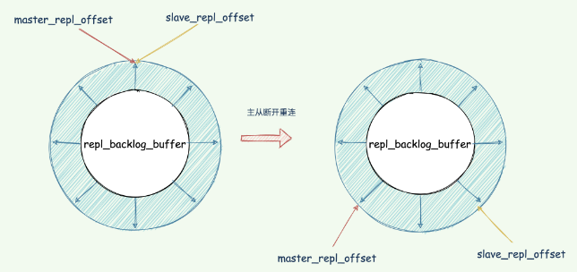

redis 有三种集群方式：主从复制，哨兵模式和集群模式

---

# 主从复制

Redis 提供了主从模式，通过主从复制，将数据冗余一份复制到其他 Redis 服务器。

前者称为主节点 (master)，后者称为从节点 (slave)；数据的复制是单向的，只能由主节点到从节点。

默认情况下，每台 Redis 服务器都是主节点；且一个主节点可以有多个从节点 (或没有从节点)，但一个从节点只能有一个主节点。


为了保证副本数据的一致性，主从架构采用了读写分离的方式。

- 读操作：主、从库都可以执行；
- 写操作：主库先执行，之后将写操作同步到从库；

> 为什么要采用读写分离的方式？
>
> 我们可以假设主从库都可以执行写指令，假如对同一份数据分别修改了多次，每次修改发送到不同的主从实例上，就导致是实例的副本数据不一致了。
>
> 如果为了保证数据一致，Redis 需要加锁，协调多个实例的修改，Redis 自然不会这么干！


## 主从复制搭建

**主从复制的开启，完全是在从节点发起的，不需要我们在主节点做任何事情。**在从节点开启主从复制，有 3 种方式：

1. 配置文件

   在从服务器的配置文件中加入 `replicaof <masterip> <masterport>`

2. 启动命令

   redis-server 启动命令后面加入 `--replicaof <masterip> <masterport>`

3. 客户端命令

   启动多个 Redis 实例后，直接通过客户端执行命令：`replicaof <masterip> <masterport>`，则该 Redis 实例成为从节点。

比如假设现在有实例 1（172.16.88.1）、实例 2（172.16.88.2）和实例 3 (172.16.88.3)，在实例 2 和实例 3 上分别执行以下命令，实例 2 和 实例 3 就成为了实例 1 的从库，实例 1 成为 Master。

```bash
replicaof 172.16.88.1 6379
```


## 主从复制原理

主从库模式一旦采用了读写分离，所有数据的写操作只会在主库上进行，不用协调三个实例。

主库有了最新的数据后，会同步给从库，这样，主从库的数据就是一致的。

同步分为三种情况：

- 第一次主从库全量复制；
- 主从正常运行期间的同步；
- 主从库间网络断开重连同步。

### 主从库第一次全量复制

主从库第一次复制过程大体可以分为 3 个阶段：**连接建立阶段**（即准备阶段）、**主库同步数据到从库阶段**、**发送同步期间新写命令到从库阶段**；

直接上图，从整体上有一个全局观的感知，后面具体介绍。

 

#### 建立连接

该阶段的主要作用是在主从节点之间建立连接，为数据全量同步做好准备。从库会和主库建立连接，从库执行 replicaof 并发送 psync 命令并告诉主库即将进行同步，主库确认回复后，主从库间就开始同步了。

从库执行 `replicaof` 并发送 `psync` 命令，表示要执行数据同步，主库收到命令后根据参数启动复制。命令包含了**主库的 runID** 和 **复制进度 offset** 两个参数。

- runID：每个 Redis 实例启动都会自动生成一个唯一标识 ID，第一次主从复制，还不知道主库 runID，参数设置为 「?」。
- offset：第一次复制设置为 -1，表示第一次复制，记录复制进度偏移量。

主库收到 psync 命令后，会用 FULLRESYNC 响应命令带上两个参数：主库 runID 和主库目前的复制进度 offset，返回给从库。从库收到响应后，会记录下这两个参数。

**FULLRESYNC 响应表示第一次复制采用的全量复制**，也就是说，主库会把当前所有的数据都复制给从库。


#### 主库同步数据给从库

master 执行 `bgsave` 命令生成 RDB 文件，并将文件发送给从库，同时主库为每一个 slave 开辟一块 replication buffer 缓冲区记录从生成 RDB 文件开始收到的所有写命令。

从库收到 RDB 文件后保存到磁盘，并清空当前数据库的数据，再加载 RDB 文件数据到内存中。

> 为什么从库收到 RDB 文件后要清空当前数据库？
>
> 因为从库在通过 `replcaof` 命令开始和主库同步前可能保存了其他数据，防止主从数据之间的影响。


#### 发送新写命令到从库

从节点加载 RDB 完成后，主节点将 replication buffer 缓冲区的数据发送到从节点，Slave 接收并执行，从节点同步至主节点相同的状态。

在生成 RDB 文件之后的写操作并没有记录到刚刚的 RDB 文件中，为了保证主从库数据的一致性，所以主库会在内存中使用一个叫 replication buffer 记录 RDB 文件生成后的所有写操作。replication buffer 是一个在 master 端上创建的缓冲区，存放的数据是下面三个时间内所有的 master 数据写操作。

1）master 执行 bgsave 产生 RDB 的期间的写操作；

2）master 发送 rdb 到 slave 网络传输期间的写操作；

3）slave load rdb 文件把数据恢复到内存的期间的写操作。

Redis 和客户端通信也好，和从库通信也好，Redis 都分配一个内存 buffer 进行数据交互，客户端就是一个 client，从库也是一个 client，我们每个 client 连上 Redis 后，Redis 都会分配一个专有 client buffer，所有数据交互都是通过这个 buffer 进行的。

Master 先把数据写到这个 buffer 中，然后再通过网络发送出去，这样就完成了数据交互。

不管是主从在增量同步还是全量同步时，master 会为其分配一个 buffer ，只不过这个 buffer 专门用来**传播写命令**到从库，保证主从数据一致，我们通常把它叫做 `replication buffer`。


replication buffer 由 client-output-buffer-limit slave 设置，当这个值**太小**会导致**主从复制连接断开**。

1）当 master-slave 复制连接断开，master 会释放连接相关的数据。replication buffer 中的数据也就丢失了，此时主从之间重新开始复制过程。

2）还有个更严重的问题，*主从复制连接断开，导致主从上出现重新执行 bgsave 和 rdb 重传操作无限循环*。

当主节点数据量较大，或者主从节点之间网络延迟较大时，可能导致该缓冲区的大小超过了限制，此时主节点会断开与从节点之间的连接；

这种情况可能引起 *全量复制 -> replication buffer 溢出导致连接中断 -> 重连 -> 全量复制 -> replication buffer 缓冲区溢出导致连接中断*……的循环。因而推荐把 replication buffer 的 hard/soft limit 设置成 512M。

```bash
config set client-output-buffer-limit "slave 536870912 536870912 0"
```

> 主从库复制为何不使用 AOF 呢？相比 RDB 来说，丢失的数据更少。
>
> 1. RDB 文件是二进制文件，网络传输 RDB 和写入磁盘的 IO 效率都要比 AOF 高。
> 2. 从库进行数据恢复的时候，RDB 的恢复效率也要高于 AOF。


### 增量复制

在 Redis 2.8 之前，如果主从库在命令传播时出现了网络闪断，那么，从库就会和主库重新进行一次全量复制，开销非常大。从 Redis 2.8 开始，网络断了之后，主从库会采用增量复制的方式继续同步。

增量复制：用于网络中断等情况后的复制，只将中断期间主节点执行的写命令发送给从节点，与全量复制相比更加高效。

断开重连增量复制的实现奥秘就是 `repl_backlog_buffer` 缓冲区，不管在什么时候 master 都会将写指令操作记录在 `repl_backlog_buffer` 中，因为内存有限，`repl_backlog_buffer` 是一个定长的环形数组，**如果数组内容满了，就会从头开始覆盖前面的内容**。

master 使用 `master_repl_offset`记录自己写到的位置偏移量，slave 则使用 `slave_repl_offset`记录已经读取到的偏移量。

master 收到写操作，偏移量则会增加。从库持续执行同步的写指令后，在 `repl_backlog_buffer` 的已复制的偏移量 slave_repl_offset 也在不断增加。

正常情况下，这两个偏移量基本相等。在网络断连阶段，主库可能会收到新的写操作命令，所以 `master_repl_offset`会大于 `slave_repl_offset`。

 

当主从断开重连后，slave 会先发送 psync 命令给 master，同时将自己的 `runID`，`slave_repl_offset`发送给 master。

master 只需要把 `master_repl_offset`与 `slave_repl_offset`之间的命令同步给从库即可。

增量复制执行流程如下图：

 

如果 repl_backlog_buffer 太小的话从库还没读取到就被 Master 的新写操作覆盖了怎么办？

我们要想办法避免这个情况，一旦被覆盖就会执行全量复制。我们可以调整 repl_backlog_size 这个参数用于控制缓冲区大小。计算公式：

```bash
repl_backlog_buffer = second * write_size_per_second
```

1. second：从服务器断开重连主服务器所需的平均时间；
2. write_size_per_second：master 平均每秒产生的命令数据量大小（写命令和数据大小总和）；

例如，如果主服务器平均每秒产生 1 MB 的写数据，而从服务器断线之后平均要 5 秒才能重新连接上主服务器，那么复制积压缓冲区的大小就不能低于 5 MB。

为了安全起见，可以将复制积压缓冲区的大小设为 `2 * second * write_size_per_second`，这样可以保证绝大部分断线情况都能用部分重同步来处理。


### 基于长连接的命令传播

当主从库完成了全量复制，它们之间就会一直维护一个网络连接，主库会通过这个连接将后续陆续收到的命令操作再同步给从库，这个过程也称为基于长连接的命令传播，使用长连接的目的就是避免频繁建立连接导致的开销。

在命令传播阶段，除了发送写命令，主从节点还维持着心跳机制：PING 和 REPLCONF ACK。

主 -> 从：PING

每隔指定的时间，**主节点会向从节点发送 PING 命令**，这个 PING 命令的作用，主要是为了让从节点进行超时判断。

从 -> 主：REPLCONF ACK

在命令传播阶段，从服务器默认会以每秒一次的频率，向主服务器发送命令：

```bash
REPLCONF ACK <replication_offset>
```

其中 replication_offset 是从服务器当前的复制偏移量。发送 REPLCONF ACK 命令对于主从服务器有三个作用：

1. 检测主从服务器的网络连接状态。
2. 辅助实现 min-slaves 选项。
3. 检测命令丢失，从节点发送了自身的 slave_replication_offset，主节点会用自己的 master_replication_offset 对比，如果从节点数据缺失，主节点会从  `repl_backlog_buffer` 缓冲区中找到并推送缺失的数据。

>[!NOTE]
>
>offset 和 repl_backlog_buffer 缓冲区，不仅可以用于部分复制，也可以用于处理命令丢失等情形；
>
>区别在于前者是在断线重连后进行的，而后者是在主从节点没有断线的情况下进行的。


## 如何确定执行全量同步还是部分同步？

在 Redis 2.8 及以后，从节点可以发送 psync 命令请求同步数据，此时根据主从节点当前状态的不同，同步方式可能是全量复制或部分复制。本文以 Redis 2.8 及之后的版本为例。

关键就是 `psync`的执行：

 

1. 从节点根据当前状态，发送 `psync`命令给 master：
   - 如果从节点从未执行过 `replicaof` ，则从节点发送 `psync ? -1`，向主节点发送全量复制请求；
   - 如果从节点之前执行过 `replicaof` 则发送 `psync <runID> <offset>`，runID 是上次复制保存的主节点 runID，offset 是上次复制截至时从节点保存的复制偏移量。
2. 主节点根据接受到的`psync`命令和当前服务器状态，决定执行全量复制还是部分复制：
   - runID 与从节点发送的 runID 相同，且从节点发送的 `slave_repl_offset`之后的数据在 `repl_backlog_buffer`缓冲区中都存在，则回复 `CONTINUE`，表示将进行部分复制，从节点等待主节点发送其缺少的数据即可；
   - runID 与从节点发送的 runID 不同，或者从节点发送的 slave_repl_offset 之后的数据已不在主节点的 `repl_backlog_buffer`缓冲区中 (在队列中被挤出了)，则回复从节点 `FULLRESYNC <runid> <offset>`，表示要进行全量复制，其中 runID 表示主节点当前的 runID，offset 表示主节点当前的 offset，从节点保存这两个值，以备使用。

一个从库如果和主库断连时间过长，造成它在主库 `repl_backlog_buffer`的 slave_repl_offset 位置上的数据已经被覆盖掉了，此时从库和主库间将进行全量复制。


## replication buffer & repl_backlog

每个从库会记录自己的 `slave_repl_offset`，每个从库的复制进度也不一定相同。

在和主库重连进行恢复时，从库会通过 psync 命令把自己记录的 `slave_repl_offset`发给主库，主库会根据从库各自的复制进度，来决定这个从库可以进行增量复制，还是全量复制。

1. replication buffer 对应于每个 slave，通过 `config set client-output-buffer-limit slave` 设置。
2. `repl_backlog_buffer` 是一个环形缓冲区，整个 master 进程中只会存在一个，所有的 slave 公用。repl_backlog 的大小通过 `repl-backlog-size` 参数设置，默认大小是 1M，其大小可以根据每秒产生的命令、（master 执行 rdb bgsave） +（ master 发送 rdb 到 slave） + （slave load rdb 文件）时间之和来估算积压缓冲区的大小，`repl-backlog-size` 值不小于这两者的乘积。

总的来说，`replication buffer` 是主从库在进行全量复制时，主库上用于和从库连接的客户端的 buffer，而 `repl_backlog_buffer` 是为了支持从库增量复制，主库上用于持续保存写操作的一块专用 buffer。

`repl_backlog_buffer`是一块专用 buffer，在 Redis 服务器启动后，开始一直接收写操作命令，这是所有从库共享的。主库和从库会各自记录自己的复制进度，所以，不同的从库在进行恢复时，会把自己的复制进度（`slave_repl_offset`）发给主库，主库就可以和它独立同步。

如图所示：

 


## 主从应用问题

### 读写分离的问题

主从复制的场景下，从节点会删除过期数据么？

为了主从节点的数据一致性，从节点不会主动删除数据。


客户端通过从节点读取数据会不会读取到过期数据？

Redis 3.2 开始，通过从节点读取数据时，先判断数据是否已过期。如果过期则不返回客户端，并且删除数据。


### 单机内存大小限制

如果 Redis 单机内存达到 10GB，一个从节点的同步时间在几分钟的级别；如果从节点较多，恢复的速度会更慢。如果系统的读负载很高，而这段时间从节点无法提供服务，会对系统造成很大的压力。

如果数据量过大，全量复制阶段主节点 fork + 保存 RDB 文件耗时过大，从节点长时间接收不到数据触发超时，主从节点的数据同步同样可能陷入 全量复制 -> 超时导致复制中断 -> 重连 -> 全量复制 -> 超时导致复制中断 ……的循环。

此外，主节点单机内存除了绝对量不能太大，其占用主机内存的比例也不应过大：最好只使用 50% - 65% 的内存，留下 30%-45% 的内存用于执行 bgsave 命令和创建复制缓冲区等。


## 优缺点

主从复制虽然解决或缓解了数据冗余、故障恢复、读负载均衡等问题，但其缺陷仍很明显：

故障恢复无法自动化；写操作无法负载均衡；存储能力受到单机的限制；这些问题的解决，需要哨兵和集群的帮助，我将在下面介绍。


---

# 哨兵模式

主从模式中，一旦主节点由于故障不能提供服务，需要人工将从节点晋升为主节点，同时还要通知应用方更新主节点地址。显然，多数业务场景都不能接受这种故障处理方式。Redis 从 2.8 开始正式提供了 Redis Sentinel（哨兵）架构来解决这个问题。

哨兵模式，由一个或多个 Sentinel 实例组成的 Sentinel 系统，它可以监视所有的 Redis 主节点和从节点，并在被监视的主节点进入下线状态时，自动将下线主服务器属下的某个从节点升级为新的主节点。但是呢，一个哨兵进程对 Redis 节点进行监控，就可能会出现问题（单点问题），因此，可以使用多个哨兵来进行监控 Redis 节点，并且各个哨兵之间还会进行监控。

哨兵模式的架构如下：

 

简单来说，哨兵模式就三个作用：

- 发送命令，等待 Redis 服务器（包括主服务器和从服务器）返回监控其运行状态；
- 哨兵监测到主节点宕机，会自动将从节点切换成主节点，然后通过发布订阅模式通知其他的从节点，修改配置文件，让它们切换主机；
- 哨兵之间还会相互监控，从而达到高可用。


哨兵的工作模式如下：

1. 每个 Sentinel 以每秒钟一次的频率向它所知的 Master，Slave 以及其他 Sentinel 实例发送一个 PING 命令。
2. 如果一个实例（instance）距离最后一次有效回复 PING 命令的时间超过 down-after-milliseconds 选项所指定的值，则这个实例会被 Sentinel 标记为**主观下线**。
3. 如果一个 Master 被标记为主观下线，则正在监视这个 Master 的所有 Sentinel 要以每秒一次的频率确认 Master 的确进入了主观下线状态。
4. 当有足够数量的 Sentinel（大于等于配置文件指定的值）在指定的时间范围内确认 Master 的确进入了主观下线状态，则 Master 会被标记为**客观下线**。
5. 在一般情况下，每个 Sentinel 会以每10秒一次的频率向它已知的所有 Master，Slave 发送 INFO 命令。
6. 当 Master 被 Sentinel 标记为客观下线时，Sentinel 向下线的 Master 的所有 Slave 发送 INFO 命令的频率会从 10 秒一次改为每秒一次
7. 若没有足够数量的 Sentinel 同意 Master 已经下线，Master 的客观下线状态就会被移除；若 Master 重新向 Sentinel 的 PING 命令返回有效回复，Master 的主观下线状态就会被移除。


## 监控流程

- 在默认情况下，每个 Sentinel（哨兵）进程以每秒钟一次的频率向整个集群中的 Master 主服务器，Slave 从服务器以及其他 Sentinel（哨兵）进程发送一个 PING 命令。
- 如果一个实例（instance）距离最后一次有效回复 PING 命令的时间超过 `down-after-milliseconds`  选项所指定的值，则这个实例会被 Sentinel（哨兵）进程标记为主观下线（SDOWN）。

> PING 命令的回复有两种情况：
>
> 1. 有效回复：返回 +PONG、-LOADING、-MASTERDOWN 任何一种；
> 2. 无效回复：有效回复之外的回复，或者指定时间内返回任何回复。

- 如果检测到的是 slave 角色，那么就直接标记「主观下线」。
- 如果一个 Master 主服务器被标记为「主观下线」（SDOWN），则正在监视这个Master主服务器的所有 Sentinel（哨兵）进程要以每秒一次的频率确认Master主服务器的确进入了「主观下线」状态。
- 当有足够数量的 Sentinel（哨兵）进程（大于等于配置文件指定的值）在指定的时间范围内确认Master主服务器进入了「主观下线」状态（SDOWN），则Master主服务器会被标记为「客观下线」（ODOWN）。
- 只有 master 被判定为「客观下线」，才会进一步触发哨兵开始主从切换流程 


简单来说，主观下线是哨兵自己认为节点宕机，而客观下线是不但哨兵自己认为节点宕机，而且该哨兵与其他哨兵沟通后，达到一定数量的哨兵都认为该节点宕机了。

这里的「一定数量」是一个法定数量（Quorum），是由哨兵监控配置决定的，解释一下该配置：

```bash
# sentinel monitor <master-name> <master-host> <master-port> <quorum>
# 举例如下：
sentinel monitor mymaster 192.168.11.128 6379 2
```

这条配置项用于告知哨兵需要监听的主节点：

- sentinel monitor：代表监控。
- mymaster：代表主节点的名称，可以自定义。
- 192.168.11.128：代表监控的主节点 ip，6379 代表端口。
- 2：法定数量，代表只有两个或两个以上的哨兵认为主节点不可用的时候，才会把 master 设置为客观下线状态，然后进行 failover 操作。

「客观下线」的标准就是，当有 N 个哨兵实例时，要有 N/2 + 1 个实例判断 master 为「主观下线」，才能最终判定 Master 为「客观下线」，其实就是过半机制。


## 自动切换

当 Master 掉线后，按照一定的 「筛选条件」 + 「打分」 策略选举出新的 Master

 


### 筛选

- 从库当前在线状态，下线的直接丢弃；
- 评估之前的网络连接状态 `down-after-milliseconds * 10`：如果从库总是和主库断连，而且断连次数超出了一定的阈值（10 次），我们就有理由相信，这个从库的网络状况并不是太好，就可以把这个从库筛掉了。


### 打分

过滤掉不合适的 slave 之后，则进入打分环节。打分会按照三个规则进行三轮打分，规则分别为：

- slave 优先级，通过 `slave-priority` 配置项，给不同的从库设置不同优先级（后台有人没办法），优先级高的直接晋级为新 master 掌门。
- `slave_repl_offset`  与  `master_repl_offset` 进度差距，其实就是比较 slave 与旧 master 复制进度的差距，如果都一样，那就继续下一个规则。
- slave runID，在优先级和复制进度都相同的情况下，ID 号最小的从库得分最高，会被选为新主库。（论资排辈，根据 runID 的创建时间来判断，时间早的上位）；


### 通知

最后一个任务，「哨兵」将新「master」的连接信息发送给其他 slave，并且让 slave 执行 replacaof 命令，和新「master」建立连接，并进行数据复制。

除此之外，「哨兵」还需要将新「master」的连接信息通知客户端。

 


## 哨兵集群的工作原理

「哨兵」部门并不是一个人，是多个人共同组成一个「哨兵集群」，即使有一些「哨兵」无法工作了，其他的「哨兵」依然可以共同协作完成监控、master 选举以及通知 slave 、master 以及每一个客户端。

在配置哨兵集群的时候，哨兵配置中只设置了监控的 master IP 和 port，并没有配置其他哨兵的连接信息。

```bash
sentinel monitor <master-name> <ip> <redis-port> <quorum>
```

那么哨兵之间是如何知道彼此的？如何知道 slave 并监控他们的？由哪一个「哨兵」执行主从切换呢？


### 集群发现

首先 master 有一个 `__sentinel__:hello` 的专用通道，用于哨兵之间发布和订阅消息。

当多个哨兵实例都在主库上做了发布和订阅操作后，它们之间就能知道彼此的 IP 地址和端口，从而相互发现建立连接。

Redis 通过频道的方式对消息进行分别管理。


### slave发现

哨兵之间建立连接形成集群还不够，还需要跟 slave 建立连接，不然没法监控他们，无法对主从库进行心跳判断。

关键还是利用 master 来实现，哨兵向 master 发送 `INFO` 命令，master 自然是知道所有 salve 信息的。所以 master 接收到命令后，便将 slave 列表告诉哨兵。

哨兵根据 master 响应的 slave 名单信息与每一个 salve 建立连接，并且根据这个连接持续监控哨兵。


在一般情况下，每个 Sentinel（哨兵）进程会以每 10 秒一次的频率向集群中的所有 Master 主服务器、Slave 从服务器发送 INFO 命令。

当 Master 主服务器被 Sentinel（哨兵）进程标记为客观下线（ODOWN）时，Sentinel（哨兵）进程向下线的 Master 主服务器的所有 Slave 从服务器发送 INFO 命令的频率会从 10 秒一次改为每秒一次。

若没有足够数量的 Sentinel（哨兵）进程同意 Master 主服务器下线，Master 主服务器的客观下线状态就会被移除。若 Master 主服务器重新向 Sentinel（哨兵）进程发送 PING 命令返回有效回复，Master 主服务器的主观下线状态就会被移除。


### 哨兵选举

任何一个哨兵判断 master “主观下线”后，就会给其他哨兵基友发送 `is-master-down-by-addr` 命令，好基友则根据自己跟 master 之间的连接状况分别响应  `Y`  或者  `N`  ，`Y`  表示赞成票， `N`  就是反对。

如果某个哨兵获得了大多数哨兵的赞成票之后，就可以标记 master 为 “客观下线”，赞成票数是通过哨兵配置文件中的 quorum 配置项设定。

获得多数赞成票的哨兵可以向其他哨兵发送命令，申明自己想要执行主从切换。并让其他哨兵进行投票，投票过程就叫做 “Leader 选举”。

想要成为 “Leader” 需要满足以下条件：

1. 获得其他哨兵基友过半的赞成票；
2. 赞成票的数量还要大于等于配置文件的 quorum 的值。


### 客户端通知

新 master 选出来了，要怎么公示天下呢？ 

Redis 通过 pub/sub 机制发布不同事件，让客户端在这里订阅消息。

客户端可以订阅哨兵的消息，哨兵提供的消息订阅频道有很多，不同频道包含了主从库切换过程中的不同关键事件。


master 下线事件

- `+sdown`：进入“主观下线”状态；
- `-sdown`：退出“主观下线”状态；
- `+odown`：进入“客观下线”状态；
- `-odown`：退出“客观下线”状态；


slave 重新配置事件

- `+slave-reconf-sent`：哨兵发送 replicaof 命令重新配置从库；
- `+slave-reconf-inprog`：slave 配置了新 master，但是尚未进行同步；
- `+slave-reconf-done`：slave 配置了新 master，并与新 master 完成了数据同步；


新主库切换

- `+switch-master`：master 地址发生了变化。


知道了这些频道之后，就可以让客户端从哨兵这里订阅消息了。客户端读取哨兵的配置文件后，可以获得哨兵的地址和端口，和哨兵建立网络连接。然后，我们可以在客户端执行订阅命令，来获取不同的事件消息。

举个栗子：如下指令订阅“所有实例进入客观下线状态的事件”

```sh
SUBSCRIBE +odown
```


## 注意事项与配置说明

发现了没，Redis 的 pub/sub 发布订阅机制尤其重要，有了 pub/sub 机制，哨兵和哨兵之间、哨兵和从库之间、哨兵和客户端之间就都能建立起连接了，各种事件的发布也是通过这个机制实现。


### down-after-milliseconds

Sentinel 配置文件中的 `down-after-milliseconds` 选项指定了 Sentinel 判断实例进入主观下线所需的时间长度：如果一个实例在 down-after-milliseconds 毫秒内，连续向 Sentinel 返回无效回复，那么 Sentinel 会修改这个实例所对应数据，以此来表示这个实例已经进入主观下线状态。

要保证所有哨兵实例的配置是一致的，尤其是主观下线的判断值 `down-after-milliseconds`。因为这个值在不同的哨兵实例上配置不一致，导致哨兵集群一直没有对有故障的主库形成共识，也就没有及时切换主库，最终的结果就是集群服务不稳定。


### down-after-milliseconds * 10

`down-after-milliseconds` 是我们认定主从库断连的最大连接超时时间。如果在 `down-after-milliseconds` 毫秒内，主从节点都没有通过网络联系上，我们就可以认为主从节点断连了。如果发生断连的次数超过了 10 次，就说明这个从库的网络状况不好，不适合作为新主库。


## 优缺点

### 优点

- 哨兵模式是基于主从模式的，所有主从的优点，哨兵模式都具有。
- 主从可以自动切换，系统更健壮，可用性更高。


### 缺点

- Redis 较难支持在线扩容，在集群容量达到上限时在线扩容会变得很复杂。


---

# Redis Cluster

使用 Redis Cluster 集群，主要解决了大数据量存储导致的各种慢问题，同时也便于横向拓展。

两种方案对应着 Redis 数据增多的两种拓展方案：垂直扩展（scale up）、水平扩展（scale out）。

1. 垂直拓展：升级单个 Redis 的硬件配置，比如增加内存容量、磁盘容量、使用更强大的 CPU。
2. 水平拓展：横向增加 Redis 实例个数，每个节点负责一部分数据。

比如需要一个内存 24 GB 磁盘 150 GB 的服务器资源，有以下两种方案：

 

- 垂直拓展部署简单，但是当数据量大并且使用 RDB 实现持久化，会造成阻塞导致响应慢。另外受限于硬件和成本，拓展内存的成本太大，比如拓展到 1T 内存。
- 水平拓展便于拓展，同时不需要担心单个实例的硬件和成本的限制。但是，切片集群会涉及多个实例的分布式管理问题，需要解决如何将数据合理分布到不同实例，同时还要让客户端能正确访问到实例上的数据。

在面向百万、千万级别的用户规模时，横向扩展的 Redis 切片集群会是一个非常好的选择。


Redis 集群是一种分布式数据库方案，集群通过分片（sharding）来进行数据管理（「分治思想」的一种实践），并提供复制和故障转移功能。

将数据划分为 16384 的 slots，每个节点负责一部分槽位。槽位的信息存储于每个节点中。

它是去中心化的，如图所示，该集群有三个 Redis 节点组成，每个节点负责整个集群的一部分数据，每个节点负责的数据多少可能不一样。

 

三个节点相互连接组成一个对等的集群，它们之间通过 `Gossip` 协议相互交互集群信息，最后每个节点都保存着其他节点的 slots 分配情况。


一个 Redis 集群通常由多个节点（node）组成，在刚开始的时候，每个节点都是相互独立的，它们都处于一个只包含自己的集群当中，要组建一个真正可工作的集群，我们必须将各个独立的节点连接起来，构成一个包含多个节点的集群。

连接各个节点的工作可以通过 `CLUSTER MEET` 命令完成：`CLUSTER MEET <ip> <port>`。

向一个节点 node 发送 `CLUSTER MEET` 命令，可以让 node 节点与 ip 和 port 所指定的节点进行握手（handshake），当握手成功时，node 节点就会将 ip 和 port 所指定的节点添加到 node 节点当前所在的集群中。


Redis 3.0 开始，官方提供了 Redis Cluster 方案实现了切片集群，该方案就实现了数据和实例的规则。既然是分布式存储，Cluster集群使用的分布式算法是**一致性Hash**嘛？并不是，而是**Hash Slot插槽算法**。


## 将数据分成多份存在不同实例上

集群的整个数据库被分为 16384 个槽（slot），数据库中的每个键都属于这 16384 个槽的其中一个，集群中的每个节点可以处理 0 个或最多 16384 个槽。

Key 与哈希槽映射过程可以分为两大步骤：

1. 根据键值对的 key，使用 CRC16 算法，计算出一个 16 bit 的值；
2. 将 16 bit 的值对 16384 执行取模，得到 0 ～ 16383 的数表示 key 对应的哈希槽。

数据库中的每个键都属于这 16384 个槽的其中一个，集群中的每个节点都可以处理这 16384 个槽。

Cluster 还允许用户强制某个 key 挂在特定槽位上，通过在 key 字符串里面嵌入 tag 标记，这就可以强制 key 所挂在的槽位等于 tag 所在的槽位。


## 哈希槽与 Redis 实例映射

Redis 会自动将 16384 个哈希槽平均分布在集群实例上，比如 N 个节点，每个节点上的哈希槽数 = 16384 / N 个。

除此之外，可以通过 `CLUSTER MEET` 命令将 7000、7001、7002 三个节点连在一个集群，但是集群目前依然处于下线状态，因为三个实例都没有处理任何哈希槽。

可以使用 `cluster addslots` 命令，指定每个实例上的哈希槽个数。

三个实例的集群，通过下面的指令为每个实例分配哈希槽：实例 1 负责 0 ～ 5460 哈希槽，实例 2  负责 5461~10922 哈希槽，实例 3  负责 10923 ～ 16383 哈希槽。

```bash
redis-cli -h 172.16.19.1 –p 6379 cluster addslots 0，5460
redis-cli -h 172.16.19.2 –p 6379 cluster addslots 5461，10922
redis-cli -h 172.16.19.3 –p 6379 cluster addslots 10923，16383
```

键值对数据、哈希槽、Redis 实例之间的映射关系如下：

 

Redis 键值对的 key 「码哥字节」「牛逼」经过 CRC16 计算后再对哈希槽总个数 16384 取模，模数结果分别映射到实例 1 与实例 3 上。

当 16384 个槽都分配完全，Redis 集群才能正常工作。


## 为什么选择哈希槽

### 简单哈希算法

假设有三台机，数据落在哪台机的算法为：`c = Hash(key) % 3`

例如 key A 的哈希值为 4，4 % 3 = 1，则落在第二台机。Key ABC 哈希值为 11，11 % 3 = 2，则落在第三台机上。

利用这样的算法，假设现在数据量太大了，需要增加一台机器。A 原本落在第二台上，现在根据算法 4 % 4 = 0，落到了第一台机器上了，但是第一台机器上根本没有 A 的值。这样的算法会导致增加机器或减少机器的时候，引起大量的缓存穿透，造成雪崩。


### 一致性哈希

算法在1997年，麻省理工学院的 Karger 等人提出了一致性哈希算法，为的就是解决分布式缓存的问题。

在一致性哈希算法中，整个哈希空间是一个虚拟圆环。

 

假设有四个节点 Node A、B、C、D，经过 ip 地址的哈希计算，它们的位置如下：

 

有4个存储对象 Object A、B、C、D，经过对 Key 的哈希计算后，它们的位置如下：

 

对于各个 Object，它所真正的存储位置是按顺时针找到的第一个存储节点。例如 Object A 顺时针找到的第一个节点是 Node A，所以 Node A 负责存储 Object A，Object B 存储在 Node B。

一致性哈希算法大概如此，那么它的容错性和扩展性如何呢？

假设 Node C 节点挂掉了，Object C 的存储丢失，那么它顺时针找到的最新节点是 Node D。也就是说 Node C 挂掉了，受影响仅仅包括 Node B 到 Node C 区间的数据，并且这些数据会转移到 Node D 进行存储。

 


同理，假设现在数据量大了，需要增加一台节点 Node X。Node X 的位置在 Node B 到 Node C 直接，那么受到影响的仅仅是 Node B 到 Node X 间的数据，它们要重新落到 Node X 上。

所以一致性哈希算法对于容错性和扩展性有非常好的支持。但一致性哈希算法也有一个严重的问题，就是数据倾斜。

如果在分片的集群中，节点太少，并且分布不均，一致性哈希算法就会出现部分节点数据太多，部分节点数据太少。也就是说无法控制节点存储数据的分配。如下图，大部分数据都在 A 上了，B 的数据比较少。

 

另外假如 Node C 上存在热点数据，在节点故障后数据转移到 Node D，Node D 可能会扛不住甚至挂掉，如此循环可能造成所有节点崩溃，这也就是缓存雪崩的问题。


为了解决这些问题，引入了虚拟节点的概念，一个真实节点对应多个虚拟节点。

假设 1 个真实节点对应 3 个虚拟节点，那么 node1 对应的虚拟节点是 node1-1、 node1-2、 node1-3（通常以添加编号的方式实现），其余节点也以相同的方式操作。

-   第一步，计算虚拟节点的 Hash 值，放置在环上。
-   第二步，计算 key 的 Hash 值，在环上顺时针寻找到应选取的虚拟节点，例如是 node2-1，那么就对应真实节点 peer2。

虚拟节点扩充了节点的数量，解决了节点较少的情况下数据容易倾斜的问题。而且代价非常小，只需要增加一个字典(map)维护真实节点与虚拟节点的映射关系即可。而且节点故障后，会消失多个虚拟节点，这些虚拟节点的数据会分散到它们邻近的虚拟节点上，而这些虚拟节点对应不用的真实节点，这就解决了雪崩的问题。


### 哈希槽

redis 集群（cluster）并没有选用上面一致性哈希，而是采用了哈希槽（slot）的这种概念。主要的原因就是上面所说的，一致性哈希算法对于数据分布、节点位置的控制并不是很友好。

首先哈希槽其实是两个概念，第一个是哈希算法。

redis cluster 的 hash 算法不是简单的 hash()，而是 crc16 算法，一种校验算法。

另外一个就是槽位的概念，空间分配的规则。其实哈希槽的本质和一致性哈希算法非常相似，不同点就是对于哈希空间的定义。

一致性哈希的空间是一个圆环，节点分布是基于圆环的，无法很好的控制数据分布。而 redis cluster 的槽位空间是自定义分配的，类似于 windows 盘分区的概念。这种分区是可以自定义大小，自定义位置的。

redis cluster 包含了 16384 个哈希槽，每个 key 通过计算后都会落在具体一个槽位上，而这个槽位是属于哪个存储节点的，则由用户自己定义分配。例如机器硬盘小的，可以分配少一点槽位，硬盘大的可以分配多一点。如果节点硬盘都差不多则可以平均分配。所以哈希槽这种概念很好地解决了一致性哈希的弊端。

另外在容错性和扩展性上，表象与一致性哈希一样，都是对受影响的数据进行转移。而哈希槽本质上是对槽位的转移，把故障节点负责的槽位转移到其他正常的节点上。扩展节点也是一样，把其他节点上的槽位转移到新的节点上。

但一定要注意的是，对于槽位的转移和分派，redis 集群是不会自动进行的，而是需要人工配置的。所以 redis 集群的高可用是依赖于节点的主从复制与主从间的自动故障转移。


### 哈希槽和一致性哈希区别

-   首先哈希槽它并不是闭合的，key 的定位规则是根据 `CRC-16(key)%16384` 的值来判断属于哪个槽区，从而判断该 key 属于哪个节点，而一致性哈希是根据 hash(key) 的值来顺时针找第一个 hash 的节点，从而确定 key 存储在哪个节点。

-   其次一致性哈希是创建虚拟节点来实现节点宕机后的数据转移并保证数据的安全性和集群的可用性的。

    redis cluster 是采用 master 节点有多个 slave 节点机制来保证数据的完整性的，master 节点写入数据，slave 节点同步数据。当 master 节点挂机后，slave 节点会通过选举机制选举出一个节点变成 master 节点，实现高可用。

    但是这里有一点需要考虑，如果 master 节点存在热点缓存，某一个时刻某个 key 的访问急剧增高，这时该 master 节点可能操劳过度而死，随后从节点选举为主节点后，同样宕机，以此类推，造成缓存雪崩。

-   扩容和缩容

    可以看到一致性哈希算法在新增和删除节点后，数据会按照顺时针来重新分布节点。而 redis cluster 的新增和删除节点都需要手动来分配槽区。

其实可以理解为哈希槽的思想还是一致性哈希的思想，相当于在一致性哈希环上手动的分配节点位置，保证数据的分布均匀，其次增删节点时，需要手动分配槽区，最后如果某个节点宕机了，那么这个节点的槽位数据也就无法获取了，直接返回错误。这种方案可以看作`人工高可用`，说白了就是为了让问题提前暴露，人工干预，防止问题进一步扩大。


## 复制与故障转移

Redis Cluster 集群中，需要确保 16384 个槽对应的 node 都正常工作，如果某个 node 出现故障，它负责的 slot 也会失效，整个集群将不能工作。

因此为了保证高可用，Cluster 集群引入了主从复制，一个主节点对应一个或者多个从节点。当其它主节点 ping 一个主节点 A 时，如果半数以上的主节点与 A 通信超时，那么认为主节点 A 宕机了。如果主节点宕机时，就会启用从节点。

Master 用于处理槽，Slave 节点则通过主从方式同步主节点数据。

当 Master 下线，Slave 代替主节点继续处理请求。主从节点之间并没有读写分离，Slave 只用作 Master 宕机的高可用备份。

Redis Cluster 可以为每个主节点设置若干个从节点，单主节点故障时，集群会自动将其中某个从节点提升为主节点。如果某个主节点没有从节点，那么当它发生故障时，集群将完全处于不可用状态。

不过 Redis 也提供了一个参数 `cluster-require-full-coverage` 可以允许部分节点故障，其它节点还可以继续提供对外访问。

比如 7000 主节点宕机，作为 slave 的 7003 成为 Master 节点继续提供服务。当下线的节点 7000 重新上线，它将成为当前 70003 的从节点。

在 Redis 的每一个节点上，都有两个玩意，一个是插槽（slot），它的取值范围是 0 ~ 16383。另外一个是 cluster，可以理解为一个集群管理的插件。

当我们存取的 key 到达时，Redis 会根据 CRC16 算法得出一个16 bit的值，然后把结果对 16384 取模。酱紫每个 key 都会对应一个编号在 0 ~ 16383 之间的哈希槽，通过这个值，去找到对应的插槽所对应的节点，然后直接自动跳转到这个对应的节点上进行存取操作。


## 故障检测

一个节点认为某个节点失联了并不代表所有的节点都认为它失联了。只有当大多数负责处理 slot 节点都认定了某个节点下线了，集群才认为该节点需要进行主从切换。

Redis 集群节点采用 `Gossip` 协议来广播自己的状态以及自己对整个集群认知的改变。比如一个节点发现某个节点失联了 (PFail)，它会将这条信息向整个集群广播，其它节点也就可以收到这点失联信息。

如果一个节点收到了某个节点失联的数量 (PFail Count) 已经达到了集群的大多数，就可以标记该节点为确定下线状态 (Fail)，然后向整个集群广播，强迫其它节点也接收该节点已经下线的事实，并立即对该失联节点进行主从切换。


## 故障转移

当一个 Slave 发现自己的主节点进入已下线状态后，从节点将开始对下线的主节点进行故障转移。

1. 从下线的 Master 及节点的 Slave 节点列表选择一个节点成为新主节点。
2. 新主节点会撤销所有对已下线主节点的 slot 指派，并将这些 slots 指派给自己。
3. 新的主节点向集群广播一条 PONG 消息，这条 PONG 消息可以让集群中的其他节点立即知道这个节点已经由从节点变成了主节点，并且这个主节点已经接管了原本由已下线节点负责处理的槽。
4. 新的主节点开始接收处理槽有关的命令请求，故障转移完成。


## 选主流程

1. 集群的配置纪元 +1，是一个自曾计数器，初始值 0 ，每次执行故障转移都会 +1。
2. 检测到主节点下线的从节点向集群广播一条 `CLUSTERMSG_TYPE_FAILOVER_AUTH_REQUEST` 消息，要求所有收到这条消息、并且具有投票权的主节点向这个从节点投票。
3. 这个主节点尚未投票给其他从节点，那么主节点将向要求投票的从节点返回一条 `CLUSTERMSG_TYPE_FAILOVER_AUTH_ACK` 消息，表示这个主节点支持从节点成为新的主节点。
4. 参与选举的从节点都会接收 `CLUSTERMSG_TYPE_FAILOVER_AUTH_ACK` 消息，如果收集到的票 >= (N/2) + 1 支持，那么这个从节点就被选举为新主节点。
5. 如果在一个配置纪元里面没有从节点能收集到足够多的支持票，那么集群进入一个新的配置纪元，并再次进行选举，直到选出新的主节点为止。

跟哨兵类似，两者都是基于 Raft 算法来实现的，流程如图所示：

 


## 问答

问：Redis Cluster 方案通过哈希槽的方式把键值对分配到不同的实例上，这个过程需要对键值对的 key 做 CRC 计算并对哈希槽总数取模映射到实例上。如果用一个表直接把键值对和实例的对应关系记录下来（例如键值对 1 在实例 2 上，键值对 2 在实例 1 上），这样就不用计算 key 和哈希槽的对应关系了，只用查表就行了，Redis 为什么不这么做呢？

答：使用一个全局表记录的话，假如键值对和实例之间的关系改变（重新分片、实例增减），需要修改表。如果是单线程操作，所有操作都要串行，性能太慢。多线程的话，就涉及到加锁，另外，如果键值对数据量非常大，保存键值对与实例关系的表数据所需要的存储空间也会很大。而哈希槽计算，虽然也要记录哈希槽与实例之间的关系，但是哈希槽的数量少得多，只有 16384 个，开销很小。

---

问：客户端又怎么确定访问的数据到底分布在哪个实例上呢？ 

答：Redis 实例会将自己的哈希槽信息通过 Gossip 协议发送给集群中其他的实例，实现了哈希槽分配信息的扩散。这样，集群中的每个实例都有所有哈希槽与实例之间的映射关系信息。在切片数据的时候是将 key 通过 CRC16 计算出一个值再对 16384 取模得到对应的 Slot，这个计算任务可以在客户端上执行发送请求的时候执行。但是，定位到槽以后还需要进一步定位到该 Slot 所在 Redis 实例。当客户端连接任何一个实例，实例就将哈希槽与实例的映射关系响应给客户端，客户端就会将哈希槽与实例映射信息缓存在本地。当客户端请求时，会计算出键所对应的哈希槽，在通过本地缓存的哈希槽实例映射信息定位到数据所在实例上，再将请求发送给对应的实例。

 

---

问：哈希槽与实例之间的映射关系由于新增实例或者负载均衡重新分配导致改变了咋办？ 

答：集群中的实例通过 Gossip 协议互相传递消息获取最新的哈希槽分配信息，但是，客户端无法感知。Redis Cluster 提供了重定向机制：客户端将请求发送到实例上，这个实例没有相应的数据，该 Redis 实例会告诉客户端将请求发送到其他的实例上。

---

问：Redis 如何告知客户端重定向访问新实例呢？ 

答：分为两种情况：MOVED 错误、ASK 错误。

MOVED 错误（负载均衡，数据已经迁移到其他实例上）：当客户端将一个键值对操作请求发送给某个实例，而这个键所在的槽并非由自己负责的时候，该实例会返回一个 `MOVED` 错误指引转向正在负责该槽的节点。同时，客户端会更新本地缓存，将该 slot 与 Redis 实例对应关系更新正确。

 

如果某个 slot 的数据比较多，部分迁移到新实例，还有一部分没有迁移怎么办？ 

如果请求的 key 在当前节点找到就直接执行命令，否则时候就需要 `ASK` 错误响应了，槽部分迁移未完成的情况下，如果需要访问的 key 所在 Slot 正在从从 实例 1 迁移到 实例 2，实例 1 会返回客户端一条 ASK 报错信息：客户端请求的 key 所在的哈希槽正在迁移到实例 2 上，你先给实例 2 发送一个 ASKING 命令，接着发发送操作命令。

 

注意：`ASK` 错误指令并不会更新客户端缓存的哈希槽分配信息。

`MOVED` 指令则更新客户端本地缓存，让后续指令都发往新实例。

---

问：集群可以设置多大？

答：Redis 官方给的 Redis Cluster 的规模上线是 1000 个实例 

---

问：到底是什么限制了集群规模呢？ 

答：关键在于实例间的通信开销，Cluster 集群中的每个实例都保存所有哈希槽与实例对应关系信息（Slot 映射到节点的表），以及自身的状态信息。

在集群之间每个实例通过 `Gossip` 协议传播节点的数据，`Gossip` 协议工作原理大概如下：

1. 从集群中随机选择一些实例按照一定的频率发送 `PING` 消息发送给挑选出来的实例，用于检测实例状态以及交换彼此的信息。`PING` 消息中封装了发送者自身的状态信息、部分其他实例的状态信息、Slot 与实例映射表信息。
2. 实例接收到 `PING` 消息后，响应 `PONG` 消息，消息包含的信息跟 `PING` 消息一样。

集群之间通过 `Gossip`协议可以在一段时间之后每个实例都能获取其他所有实例的状态信息。

所以在有新节点加入，节点故障，Slot 映射变更都可以通过 `PING`，`PONG` 的消息传播完成集群状态在每个实例的传播同步。

发送的消息结构是 `clusterMsgDataGossip`结构体组成： 

```c
typedef struct {
    char nodename[CLUSTER_NAMELEN];  // 40字节
    uint32_t ping_sent; 			// 4字节
    uint32_t pong_received; 		// 4字节
    char ip[NET_IP_STR_LEN]; 		// 46字节
    uint16_t port;  				// 2字节
    uint16_t cport;  				// 2字节
    uint16_t flags;  				// 2字节
    uint32_t notused1; 				// 4字节
} clusterMsgDataGossip;
```

所以每个实例发送一个 `Gossip` 消息，就需要发送 104 字节。如果集群是 1000 个实例，那么每个实例发送一个 `PING` 消息则会占用大约 10KB。

除此之外，实例间在传播 Slot 映射表的时候，每个消息还包含了 一个长度为 16384 bit 的 `Bitmap`。

每一位对应一个 Slot，如果值 = 1 则表示这个 Slot 属于当前实例，这个 Bitmap 占用 2KB，所以一个 `PING` 消息大约 12KB。

`PONG` 与 `PING` 消息一样，一发一回两个消息加起来就是 24 KB。集群规模的增加，心跳消息越来越多就会占据集群的网络通信带宽，降低了集群吞吐量。

---

问：发送 PING 消息的频率也会影响集群带宽吧？ 

答：Redis Cluster 的实例启动后，默认会每秒从本地的实例列表中随机选出 5 个实例，再从这 5 个实例中找出一个最久没有收到 PING 消息的实例，把 PING 消息发送给该实例。

---

问：随机选择 5 个，但是无法保证选中的是整个集群最久没有收到 PING 通信的实例，有的实例可能一直没有收到消息，导致他们维护的集群信息早就过期了，怎么办呢？ 

答：Redis Cluster 的实例每 100 ms 就会扫描本地实例列表，当发现有实例最近一次收到 `PONG` 消息的时间 > `cluster-node-timeout / 2`。那么就立刻给这个实例发送 `PING` 消息，更新这个节点的集群状态信息。

当集群规模变大，就会进一步导致实例间网络通信延迟怎加。可能会引起更多的 PING 消息频繁发送。

---

问：怎么降低实例间的通信开销？

答：

- 每个实例每秒发送一条 `PING`消息，降低这个频率可能会导致集群每个实例的状态信息无法及时传播。
- 每 100 ms 检测实例 `PONG`消息接收是否超过 `cluster-node-timeout / 2`，这个是 Redis 实例默认的周期性检测任务频率，我们不会轻易修改。

所以，只能修改 `cluster-node-timeout` 的值：集群中判断实例是否故障的心跳时间，默认 15秒。

所以，为了避免过多的心跳消息占用集群宽带，将 `cluster-node-timeout`调成 20 秒或者 30 秒，这样 `PONG` 消息接收超时的情况就会缓解。

但是，也不能设置的太大。都则就会导致实例发生故障了，却要等待 `cluster-node-timeout`时长才能检测出这个故障，影响集群正常服务。


---

# 参考与感谢

- Redis设计与实现 - 黄健宏著
- [详解20道Redis经典面试题！](https://juejin.cn/post/7002011542145204261)

