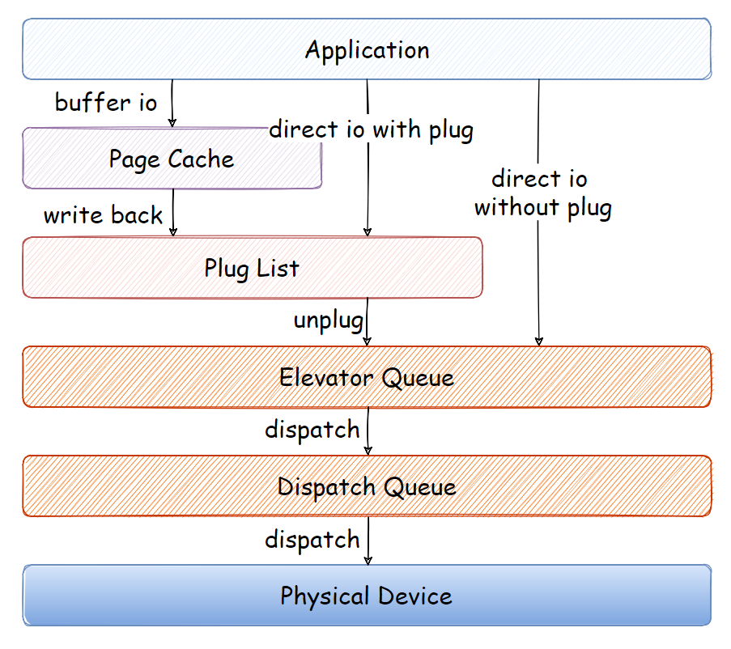
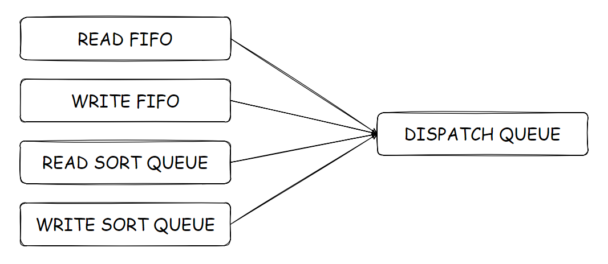

# 相关结构体

I/O 调度器（I/O Scheduler）的工作是管理块设备的请求队列。它决定队列中的请求排列顺序以及在什么时刻派发请求到块设备。这样做有利于减少磁盘寻址时间，从而提高整体性能。I/O 调度程序通过两种方法来减少磁盘寻址时间：合并与排序。

合并是指将两个或多个请求结合成一个新请求。当文件系统提交请求到请求队列——从文件中读取一个数据区，如果此时队列已经存在一个请求，它访问的磁盘扇区和当前请求访问的磁盘扇区相邻，那么这两个请求可以合并为对一个对单个和多个相邻磁盘扇区操作的新请求。因此，合并请求显然能减少系统开销和磁盘寻址次数。

排序则是将进入请求队列的所有请求按扇区编号递增方向有序排列。这种做法类似于现实生活中的电梯模型——电梯不能随意地从一层跳到另一层，它应该向一个方向移动，当抵达了同一方向上的最后一层后，再掉头向另一个方向移动。出于这种相似性，所以 I/O 调度器也被叫做电梯（Elevator），而相应的算法也就被叫做电梯算法。

Linux 内核支持多种类型的 I/O 调度算法，例如 NOOP（No Operation）、Deadline（最后期限）和 CFQ（Complete Fairness Queueing）等。I/O 调度算法类型对应的结构为 elevator_type，其结构中的域及其描述如下：

```c
struct elevator_type
{
	/* managed by elevator core */
	struct kmem_cache *icq_cache;

	/* fields provided by elevator implementation */
	struct elevator_ops ops;	/* 操作表 */
	size_t icq_size;	/* see iocontext.h */
	size_t icq_align;	/* ditto */
	/* 属于这种类型的IO调度器的公共属性及操作方法，以NULL结尾 */
	struct elv_fs_entry *elevator_attrs;
	char elevator_name[ELV_NAME_MAX];	/* 调度算法名称 */
	struct module *elevator_owner;	/* 指向实现了该电梯算法的模块 */

	/* managed by elevator core */
	char icq_cache_name[ELV_NAME_MAX + 5];	/* elvname + "_io_cq" */
	struct list_head list;	/* 链入系统中已注册的电梯算法类型链表elv_list的连接件 */
};
```

这个结构中最重要的域莫过于 ops，它表示这种类型的调度算法的操作表：

```c
struct elevator_ops
{
	/*
	 * 查找可以和bio进行合并的request。
	 * 返回值ELEVATOR_NO_MERGE、ELEVATOR_FRONT_MERGE和ELEVATOR_BACK_MERGE
	 * 分别表示不可合并、可向前合并和可向后合并。
	 * 如果可以（向前或向后）合并，则参数中返回指向对应request的指针。
	 */
	elevator_merge_fn *elevator_merge_fn;
	/*
	 * 在调度器有请求被合并时被调用。
	 * 例如，deadline调度器通过这个函数在排序顺序发生改变时重排请求。
	 */
	elevator_merged_fn *elevator_merged_fn;
	/*
	 * 在两个请求被合并时调用。
	 * 被合并到另外一个请求的请求将不再会被I/O调度器看见。
	 * 换句话说，在被合并之后，这个请求消失了。
	 */
	elevator_merge_req_fn *elevator_merge_req_fn;
	/*
	 * 在块层判定bio可以被安全合并到现有请求时被调用。
	 * 如果在内部导致某种冲突，I/O调度器还有机会停止合并。这个回调函数就提供这一机会
	 */
	elevator_allow_merge_fn *elevator_allow_merge_fn;
	elevator_bio_merged_fn *elevator_bio_merged_fn;

	/*
	 * 将准备好的请求转移到派发队列。
	 * I/O调度器可以选择推迟将请求送入派发队列，除非第二个参数非零。
	 * 一旦被派发，I/O调度器就不能够再操作请求——它属于通用的派发队列。
	 */
	elevator_dispatch_fn *elevator_dispatch_fn;
	// 在往调度器中添加一个新请求时被调用。
	elevator_add_req_fn *elevator_add_req_fn;
	// 在块设备驱动首次看到一个请求时被调用。I/O调度器可以用这个回调来确定请求执行从什么时候开始。
	elevator_activate_req_fn *elevator_activate_req_fn;
	// 在块设备驱动决定要延迟一个请求，把它重新排入队列时被调用。
	elevator_deactivate_req_fn *elevator_deactivate_req_fn;

	// 在请求被完成时调用。
	elevator_completed_req_fn *elevator_completed_req_fn;

	// 这个函数返回按照磁盘排序顺序在给定请求前面的那一个请求，被块层用来查找合并可能性。
	elevator_request_list_fn *elevator_former_req_fn;
	// 这个函数返回按照磁盘排序顺序在给定请求后面的那一个请求，被块层用来查找合并可能性。
	elevator_request_list_fn *elevator_latter_req_fn;

	elevator_init_icq_fn *elevator_init_icq_fn;	/* see iocontext.h */
	elevator_exit_icq_fn *elevator_exit_icq_fn;	/* ditto */

	// 被某些电梯算法用于为请求分配私有（elevator specific）存储空间。
	elevator_set_req_fn *elevator_set_req_fn;
	// 被某些电梯算法用于为请求释放私有（elevator specific）存储空间。
	elevator_put_req_fn *elevator_put_req_fn;

	// 如果调度器希望运行当前上下文将一个新的请求排入队列，即使已经超过队列限制，返回true。
	elevator_may_queue_fn *elevator_may_queue_fn;

	// 为队列分配电梯特定的存储。为电梯算法队列分配私有数据，并返回之。
	elevator_init_fn *elevator_init_fn;
	// 为队列释放电梯特定的存储。释放电梯算法队列的私有数据。
	elevator_exit_fn *elevator_exit_fn;
};
```

每个调度算法类型要实现全部或部分以上算法，它通过 elv_register 注册到系统，通过 elv_unregister 从系统注销。系统中所有注册的 I/O 调度算法类型都保存在 elv_list 链表中，每个 I/O 调度算法类型通过 list 域链入这个链表。

每个请求队列被调度，需要有对应的方法表，还要有自己的调度数据。这些都放在和请求队列相关的 I/O 调度队列，用 elevator_queue 来描述。新请求进入 I/O 调度队列，它可以合并到队列中已经存在的某个请求的后面。不管采用哪种算法，要快速找到这个请求，尽管算法可能因为各种原因拒绝这个合并。为此目的，I/O 调度队列有一个哈希表，由 hash 域指向，所有请求按照最后一个扇区的编号计算哈希值，链入对应的哈希桶中。

```c
struct elevator_queue
{
	struct elevator_type *type;		// 指向调度器类型
	void *elevator_data;			// 私有数据
	struct kobject kobj;			// 内嵌的kobject
	struct mutex sysfs_lock;		// 用于同步退出IO调度器及对其sysfs文件系统属性访问的互斥量
	unsigned int registered:1;
	/*
	 * 在电梯算法队列中的请求按照最后一个扇区的编号进行哈希
	 * 方便在有新的请求进来时快速查找可以向后合并的请求。
	 */
	DECLARE_HASHTABLE(hash, ELV_HASH_BITS);

	/*
	 * elevator_queue is allocated via elevator_alloc(),
	 * shouldn't be covered by kABI
	 */
	RH_KABI_EXTEND(struct elevator_type_aux *aux)
	RH_KABI_EXTEND(unsigned int uses_mq)
};
```

这样 request_queue 就和 elevator_type 通过 elevator_queue 关联起来了。

引入 I/O 调度后，请求队列实际上就分为两种队列，一种为派发队列，这是以请求队列的 queue_head 域为表头的链表。另一种是 I/O 调度队列，它蕴涵于电梯算法私有数据结构中，它可能不是真正意义上的一个队列。请求首先被添加到 I/O 调度队列，然后，I/O 调度器按特定的调度算法将它转移到派发队列，最终被提交执行。

 


---

# Deadline 调度算法

在 Linux 当前版本的电梯算法实现中，我们选择 deadline 算法来分析。因为它具有相当的代表性，而且难度适中。先回顾一下 deadline 算法的由来。

早期的 I/O 调度算法总是按照扇区顺序将请求插入到队列，从不检查驻留时间过长的请求，所以，它虽然能让寻址时间最短，但是却会带来请求饥饿的问题。对磁盘某一个局部区域的持续请求流，会造成较远位置的其他请求永远得不到运行机会，这就是所谓的饥饿现象。deadline 调度算法试图解决这个问题。

在 deadline 调度算法中，每个请求都有一个超时时间。默认情况下，读请求的超时时间是 500 毫秒，写请求的超时时间是 5 秒。最后期限 I/O 调度算法一方面以请求作用的扇区编号为次序来维护请求，组成排序队列。另一方面也按请求到达的时间为次序来维护请求，组成 FIFO（先来先服务）队列。

一般情况下，请求从排序队列中取下，再推入到派发队列，这试图使物理磁盘的寻道操作次数和幅度最小。但是，如果 FIFO 队列头部有请求超时（也就是，当前时间超过了请求指定的超时时间），那么最后期限 I/O 调度程序便从 FIFO 队列中取出请求进行服务。依靠这种方法，最后期限 I/O 调度程序试图保证不会发生有请求在明显超时的情况下仍不能得到服务的现象。

最后期限 I/O 调度算法实际使用四个队列，以请求类型为依据区分。也就是说，写操作有一个排序队列和 FIFO 队列，读操作也有一个排序队列和 FIFO 队列。这是由于它们的性质决定的：写操作完全和提交它的应用程序异步执行；读操作则恰恰相反，通常当应用程序提交一个读请求时，应用程序会发生堵塞直到读请求被满足，也就是说，读操作是和提交它的应用程序同步执行的。因此，相对于写反应时间，读操作响应时间对系统性能的影响更为重要。

 

采用最后期限调度算法，每个请求队列需要的私有调度数据用 deadline_data 结构来描述。

```c
struct deadline_data {
	/*
	 * requests (deadline_rq s) are present on both sort_list and fifo_list
	 * sort_list以按照request的扇区编号红黑树组织
	 * fifo_list按超时先后顺序组织
	 */
	struct rb_root sort_list[2];	
	struct list_head fifo_list[2];

	/*
	 * 指向按扇区编号增加方向的下一个请求，如果为NULL表示电梯到顶
	 */
	struct request *next_rq[2];
	/* 调度算法可能连续提交多个请求，batching用来记录当前连续提交的请求数目 */
	unsigned int batching;		/* number of sequential requests made */
	sector_t last_sector;		/* head position */
	unsigned int starved;		/* times reads have starved writes */

	/*
	 * settings that change how the i/o scheduler behaves
	 */
	int fifo_expire[2];	// 超过此时间必须提交请求
	int fifo_batch;		// 请求过期时必须转移到派发队列，这是过期批量转移的请求数目
	int writes_starved;	// 读可以使写饥饿的最大次数
	int front_merges;	// 向前合并允许标志位
};
```

可以看到有四个队列，两个用于读请求，两个用于写请求，两个用于按请求到达次序排序，两个用于按请求扇区编号排序。按到达次序排序的请求被组织为链表的形式，链表头就是 fifo_list 数组，而按扇区编号排序的请求被组织为红黑树的形式，树根就是 sort_list 数组。deadline_data 结构的其他域先在此略过，留待后面具体分析调度算法的细节时再解释。

## 初始化

某些请求队列可以有关联的 I/O 调度器，块 I/O 子系统为关联提供的公共函数是 elevator_init。比如 SCSI 设备就是在分配请求队列时初始化 I/O 调度器的。

elevator_init 根据具体的调度算法名字找到对应的 elevator_type 结构后，再分配内存，然后调用具体调度算法的 elevator_init_fn 方法。对于我们这里关注的 deadline 调度算法来说，注册时该方法被实例化为 deadline_init_queue。

```c
static struct elevator_type iosched_deadline = {
	.ops = {
		.elevator_merge_fn = 		deadline_merge,
		.elevator_merged_fn =		deadline_merged_request,
		.elevator_merge_req_fn =	deadline_merged_requests,
		.elevator_dispatch_fn =		deadline_dispatch_requests,
		.elevator_add_req_fn =		deadline_add_request,
		.elevator_former_req_fn =	elv_rb_former_request,
		.elevator_latter_req_fn =	elv_rb_latter_request,
		.elevator_init_fn =		deadline_init_queue,
		.elevator_exit_fn =		deadline_exit_queue,
	},

	.elevator_attrs = deadline_attrs,
	.elevator_name = "deadline",
	.elevator_owner = THIS_MODULE,
};

static int deadline_init_queue(struct request_queue *q, struct elevator_type *e)
{
	struct deadline_data *dd;
	struct elevator_queue *eq;

	eq = elevator_alloc(q, e);
	if (!eq)
		return -ENOMEM;

	dd = kmalloc_node(sizeof(*dd), GFP_KERNEL | __GFP_ZERO, q->node);
	if (!dd) {
		kobject_put(&eq->kobj);
		return -ENOMEM;
	}
	eq->elevator_data = dd;

	INIT_LIST_HEAD(&dd->fifo_list[READ]);
	INIT_LIST_HEAD(&dd->fifo_list[WRITE]);
	dd->sort_list[READ] = RB_ROOT;
	dd->sort_list[WRITE] = RB_ROOT;
	dd->fifo_expire[READ] = read_expire;
	dd->fifo_expire[WRITE] = write_expire;
	dd->writes_starved = writes_starved;
	dd->front_merges = 1;
	dd->fifo_batch = fifo_batch;

	spin_lock_irq(q->queue_lock);
	q->elevator = eq;
	spin_unlock_irq(q->queue_lock);
	return 0;
}
```


## IO 合并

前面我们在介绍请求处理的时候看到：一个 bio 首先尝试被合并到当前进程的 plug_list 的某个 request，如果无法合并，那就尝试向 request_queue 中合并，逻辑如下：

```c
void blk_queue_bio(struct request_queue *q, struct bio *bio)
{
    ...
    if (attempt_plug_merge(q, bio, &request_count))
        return;

    spin_lock_irq(q->queue_lock);
    // 如果上面的attempt_plug_merge失败，则考虑是否能合并进request_queue 
    el_ret = elv_merge(q, &req, bio);
    ...
}
```

elv_merge 用来判断是否可以将 bio 合入到某个 request，它主要工作如下：

-   检查 QUEUE_FLAG_NOMERGES 标志位，表示不要尝试合并
-   检查是否可以合入最后一个 request
-   检查 QUEUE_FLAG_NOXMERGES 标志位，表示不要扩展合并
-   进行通用的向后合并检查
-   进行 IO 调度器特有的合并检查

具体分析见注释：

```c
int elv_merge(struct request_queue *q, struct request **req, struct bio *bio)
{
	struct elevator_queue *e = q->elevator;
	struct request *__rq;
	int ret;

	/*
	 * Levels of merges:
	 * 	nomerges:  No merges at all attempted
	 * 	noxmerges: Only simple one-hit cache try
	 * 	merges:	   All merge tries attempted
	 */
	if (blk_queue_nomerges(q))	// QUEUE_FLAG_NOMERGES表示不要尝试合并
		return ELEVATOR_NO_MERGE;

	/*
	 * 如果在请求队列的last_merge域有缓存下来的request，
	 * 调用elv_try_merge尝试和它进行合并，如果可以合并，
	 * 通过参数输出这个request，并将结果转发到调用者。
	 */
	if (q->last_merge && elv_bio_merge_ok(q->last_merge, bio)) {
		ret = blk_try_merge(q->last_merge, bio);
		if (ret != ELEVATOR_NO_MERGE) {
			*req = q->last_merge;
			return ret;
		}
	}

	/* 
	 * QUEUE_FLAG_NOXMERGES表示只尝试对缓存下来的request进行合并（如果有的话），
	 * 不要进行“扩展”的合并尝试。
	 */
	if (blk_queue_noxmerges(q))
		return ELEVATOR_NO_MERGE;

	/*
	 * 在电梯算法队列中的请求按照最后一个扇区的编号进行哈希，
	 * 方便在有新的请求进来时查找快速可以将其合并在后面（向后合并）的请求。
	 * 调用elv_rqhash_find函数找到这一个请求，
	 * 调用elv_rq_merge_ok函数判断是否可以和它合并，
	 * 如果可以，则通过参数输出这个request，并返回ELEVATOR_BACK_MERGE。
	 */
	__rq = elv_rqhash_find(q, bio->bi_sector);
	if (__rq && elv_bio_merge_ok(__rq, bio)) {
		*req = __rq;
		return ELEVATOR_BACK_MERGE;
	}

	/*
	 * IO调度算法特定的合并尝试是通过电梯队列操作表的elevator_merge_fn回调函数提供的。
	 * 当然，并不是所有的电梯类型都必须提供这个回调函数。
	 * 如果该回调函数存在，则调用它判断bio是否可以被合并到request，并将结果转发给调用者。
	 */
	if (e->uses_mq && e->aux->ops.mq.request_merge)
		return e->aux->ops.mq.request_merge(q, req, bio);
	else if (!e->uses_mq && e->aux->ops.sq.elevator_merge_fn)
		return e->aux->ops.sq.elevator_merge_fn(q, req, bio);

	// 如果上面的所有可能都已尝试过，那么只能表明这个bio无法并合并到request
	return ELEVATOR_NO_MERGE;
}
```

从上面的分析可以看到，对于 bio merge 到 request 中，还是因具体的调度算法而异，因此，这个将其设计为一个接口是很合理的。elevator_merge_fn 回调函数被实例化为 deadline_merge。

最后期限 I/O 调度算法只处理向前合并，并且要求当前配置允许，即最后期限 I/O 调度算法私有数据描述符的 front_merges 为 1。

合并逻辑：首先计算这个 bio 的最后一个扇区编号，然后调用 elv_rb_find 函数在与 bio 读／写方向对应的红黑树中，查找该编号对应的 request。如果找到，调用 elv_bio_merge_ok 函数检查 bio 是否可以合并到这个 request，如果可以，则通过参数输出这个 request，同时返回 ELEVATOR_FRONT_MERGE 到调用者。

如果最后期限 I/O 调度算法私有数据当前配置不允许向前合并，或者在对应的红黑树中找不到编号对应的 request，或者 bio 无法被合并到这个 request，其结果都是一样的，返回 ELEVATOR_NO_MERGE 到调用者，表示不能合并。

```c
static int
deadline_merge(struct request_queue *q, struct request **req, struct bio *bio)
{
	struct deadline_data *dd = q->elevator->elevator_data;
	struct request *__rq;
	int ret;

	/*
	 * check for front merge
	 */
	if (dd->front_merges) {
		sector_t sector = bio_end_sector(bio);

		//在红黑树中查找编号对应的request，如果找到检查是否可以合并
		__rq = elv_rb_find(&dd->sort_list[bio_data_dir(bio)], sector);
		if (__rq) {
			BUG_ON(sector != blk_rq_pos(__rq));

			if (elv_bio_merge_ok(__rq, bio)) {
				ret = ELEVATOR_FRONT_MERGE;
				goto out;
			}
		}
	}

	return ELEVATOR_NO_MERGE;
out:
	*req = __rq;
	return ret;
}
```


## 添加到调度队列

根据我们之前的分析，当前进程如果在 plug_list 满了以后需要进行 flush 操作，所谓的 flush 也就是将 plug_list 上的 request 添加到 request_queue 的调度或者派发队列上。或者没有 plug_list 就直接添加到调度队列。

```c
void blk_flush_plug_list(struct blk_plug *plug, bool from_schedule)
{
    ...
    if (rq->cmd_flags & (REQ_FLUSH | REQ_FUA))
        __elv_add_request(q, rq, ELEVATOR_INSERT_FLUSH);
    else        
        __elv_add_request(q, rq, ELEVATOR_INSERT_SORT_MERGE);
    ...
}

static void add_acct_request(struct request_queue *q, struct request *rq, int where)
{
	blk_account_io_start(rq, true);
	__elv_add_request(q, rq, where);
}
```

`__elv_add_request` 函数大部分代码是被用来处理屏障请求的，我们暂且忽略。当前，我们只需要知道，对于普通请求 elv_rqhash_add 函数将请求添加到电梯算法队列的哈希链表，按照请求的最后一个扇区编号进行哈希，方便在有新的请求进来时查找快速可以将合并其后的请求，此外，必要时，将它缓存在请求队列的 last_merge 域，以便新 bio 到来时首先尝试合并到这个请求。最后，调用电梯队列操作表的 elevator_add_req_fn 回调函数，执行电梯类型特定的请求添加逻辑。对于最后期限I/O调度类型，它在注册时，将 elevator_add_req_fn 回调函数实例化为 deadline_add_request 函数。

deadline_add_request 函数有两个参数：第一个为指向请求队列描述符的指针；第二个为指向块设备驱动层请求描述符的指针。deadline_add_rq_rb 函数把请求加入与请求的读／写方向对应的红黑树，然后记录请求的超时时间，并添加到与请求的读／写方向对应的 FIFO 队列。这再次说明了 I/O 调度队列并不是真正意义上的一个队列。

```c
void __elv_add_request(struct request_queue *q, struct request *rq, int where)
{
	...

	switch (where) {
	...

	/* 
	 * 这里尝试将rq再次和调度队列中的request进行合并 
     * 如果可以合并，那么该rq应该被释放了可以直接break 
     * 如果不可合并，那么我们接下来再将该rq插入到调度队列中进行排序
     */
	case ELEVATOR_INSERT_SORT_MERGE:
		if (elv_attempt_insert_merge(q, rq))
			break;
	// 如果无法合并了，那么需要插入调度队列了
	case ELEVATOR_INSERT_SORT:
		BUG_ON(rq->cmd_type != REQ_TYPE_FS);
		rq->cmd_flags |= REQ_SORTED;
		q->nr_sorted++;
		/* 
		 * 如果request的标志位没有设置不可合并指示，将其添加到hash表中，
		 * 便于下个rq到来的时候查找可否合并
		 */
		if (rq_mergeable(rq)) {
			elv_rqhash_add(q, rq);
			if (!q->last_merge)
				q->last_merge = rq;
		}

		/*
		 * Some ioscheds (cfq) run q->request_fn directly, so
		 * rq cannot be accessed after calling elevator_add_req_fn.
		 * 调用具体的调度算法的elevator_add_req_fn 
		 * 将该无法和当前调度队列所有request合并的req插入并排序
		 */
		q->elevator->aux->ops.sq.elevator_add_req_fn(q, rq);
		break;

	case ELEVATOR_INSERT_FLUSH:
		rq->cmd_flags |= REQ_SOFTBARRIER;
		blk_insert_flush(rq);
		break;
	default:
		printk(KERN_ERR "%s: bad insertion point %d\n",
		       __func__, where);
		BUG();
	}
}

static void
deadline_add_request(struct request_queue *q, struct request *rq)
{
	struct deadline_data *dd = q->elevator->elevator_data;
	const int data_dir = rq_data_dir(rq);

	// 把请求加入与请求的读／写方向对应的红黑树
	deadline_add_rq_rb(dd, rq);

	// 记录请求的超时时间，并添加到与请求的读／写方向对应的FIFO队列
	rq->fifo_time = jiffies + dd->fifo_expire[data_dir];
	list_add_tail(&rq->queuelist, &dd->fifo_list[data_dir]);
}
```


## 泄流

上面我们分析了请求是如何被插入到调度队列中，那么接下来我们就要看看调度队列中的请求是如何被取出来，这就要涉及到泄流了。泄流逻辑主要调用了函数 blk_peek_request 来从 request_queue 中获取 request。

```c
struct request *blk_peek_request(struct request_queue *q)
{
    struct request *rq;
    int ret; 
    while ((rq = __elv_next_request(q)) != NULL) {
        ...
    }
    ...
}
```

在 blk_peek_request 函数中，调用 `__elv_next_request` 函数从请求队列获得下一个要处理的请求。成功时返回指向块设备驱动层请求描述符的指针；否则返回 NULL。

这个函数主体是一个循环，如果当前派发队列不为空，则从派发队列头部获得请求。可能被认为，如果拿到这个请求，直接返回即可。但实际上不这么简单，因为要考虑屏障请求。屏障请求的处理会在后面专门讲到。现在，我们只需要知道，由于有屏障请求，我们可能：

1.  需要跳过这个请求，尝试下一个请求；
2.  稍后重试；
3.  处理这个请求；
4.  处理被替换请求。

如果派发队列为空，我们就要考虑从 I/O 调度队列转移请求到派发队列了，为此再调用 I/O 调度算法的 elevator_dispatch_fn 函数。它被实例化为 deadline_dispatch_requests。

```c
static inline struct request *__elv_next_request(struct request_queue *q)
{
	struct request *rq;
	struct blk_flush_queue *fq = blk_get_flush_queue(q, NULL);

	while (1) {
		// 如果当前派发队列不为空，则从派发队列头部获得请求。
		if (!list_empty(&q->queue_head)) {
			rq = list_entry_rq(q->queue_head.next);
			return rq;
		}
		if (fq->flush_pending_idx != fq->flush_running_idx &&
				!queue_flush_queueable(q)) {
			fq->flush_queue_delayed = 1;
			return NULL;
		}
		/* 
		 * 如果派发队列为空，我们就要考虑从I/O调度队列转移请求到派发队列了。
		 * 如果有将请求从I/O调度器的队列转移到派发队列，我们就开始新的一次循环；
		 * 如果不能将请求转移到派发队列，那么只能向调用者返回NULL。
		 */
		if (unlikely(blk_queue_bypass(q)) ||
		    !q->elevator->aux->ops.sq.elevator_dispatch_fn(q, 0))
			return NULL;
	}
}
```

deadline_dispatch_requests 是 deadline 的核心精髓。

我们将这里的算法用现实中电梯描述的语言来叙述。当然，这个电梯和实际的电梯还是有区别的。

对应关系：电梯对应I/O调度队列，楼层对应扇区编号，乘客对应请求，下客对应请求被从I/O调度队列转移到派发队列，上客对应着请求进入I/O调度队列。

上客不受电梯移动的影响，也就是说，乘客可以随时进入电梯。所以在某一个时刻，电梯里挤满了不同时间进入的乘客，它们要到达不同的楼层。电梯停靠的楼层总是取决于当前电梯中已有的乘客，也就是电梯只停靠有乘客想要去的楼层。

一般来说，电梯是沿上升，即楼层递增方向移动，下一个下客的楼层是沿上升方向，电梯里面所有乘客中目标最近的楼层。但有一种例外，也就是，电梯中有乘客进入的时间超过了某个值，被称为最后期限，这种情况下，电梯直接转（上升或下降）到等待时间最长的那个乘客要去的楼层。此外，如果没有乘客要到更高的楼层，我们说电梯走到顶了。这时候电梯需要直接下降到某个楼层，下降视当前电梯中的乘客情况，可以有多种不同的方案，比如一种方案是下降到底，即有乘客想去的最低的楼层。另一个方案就是最后期限算法中采用的，下降到进入电梯最长，或在电梯中等待时间最久的那个乘客想去的楼层。在下降之后，电梯再次开始向上移动。

有两个电梯，分别对应读方向和写方向，读／写方向需要和电梯移动方向区分开来。两个电梯各自的运作策略如上所述，但现在两个电梯需要统筹安排。两个电梯一个时刻只能有一个在移动，也就是说只能有一个下客。由于某种考虑，让其中一个电梯优先安排，但同时考虑饥饿问题。在前一个电梯移动时，如果后一个电梯中有乘客，则递增一次饥饿计数。当后一个电梯的饥饿计数递增到特定的值时，必须移动后一个电梯。一旦后一个电梯有移动，立即将它的饥饿计数清零。在一个电梯移动时，另一个电梯进行复位操作，也就是说，下一次它要移动，又是从电梯中等待时间最久的那个乘客想去的楼层开始的。

为了减少磁头移动次数，请求被组成特定数据方向（读或写）的批次，每个批次以递增扇区顺序服务。为了限制额外寻道，最后期限过期只是在批次之间进行检查。我们是成批让乘客下客的，这里的成批，并不是说让多个乘客在同一楼层下客，而是说，保持电梯上升移动，让多个乘客分别在不同的楼层下客。这一批乘客下客后，我们再来检查电梯中的乘客情况，决定电梯是该继续上升，还是该复位，即下降到特定的楼层。deadline_data 结构的 fifo_batch 控制了每一批次中能包含的请求的最大数目。批次结束的条件是下客的次数已经到达批次数值，或者这个电梯已经上升到顶。

详细分析见注释：

```c
static int deadline_dispatch_requests(struct request_queue *q, int force)
{
	struct deadline_data *dd = q->elevator->elevator_data;
	const int reads = !list_empty(&dd->fifo_list[READ]);
	const int writes = !list_empty(&dd->fifo_list[WRITE]);
	struct request *rq;
	int data_dir;

	/*
	 * 从“批次”的角度来确定下一个要处理的请求。
	 * deadline_data结构的next_rq[]指向按扇区编号增加方向下一个请求的指针。
	 * 这是一个数组，读／写各占有一项，在前次派发时设定好。
	 * 读／写指针是互斥的。
	 * 若读方向不为NULL，则写方向必为NULL；
	 * 若写方向不为NULL，则读方向必为NULL；
	 * 或者两个方向均为NULL。
	 */
	if (dd->next_rq[WRITE])
		rq = dd->next_rq[WRITE];
	else
		rq = dd->next_rq[READ];

	/*
	 * 如果该指针不为NULL，或者该批次处理的请求数还未达到限值，
	 * 则说明这个请求可以在这一批次中处理，直接将它作为下一个要处理的请求。
	 * 如果为NULL（表示电梯已走到顶），或者该批次处理的请求已经达到限值，
	 * 必须开始新的批次，也就是要寻找下一个要处理的请求。
	 */
	if (rq && dd->batching < dd->fifo_batch)
		/* we have a next request are still entitled to batch */
		goto dispatch_request;

	/*
	 * 选择合适的读／写方向（读或写）。调度器先处理读，也就是读请求优先。
	 * 但在处理过程中考虑到了写饥饿。如果此时还有写请求，则写饥饿计数递增1次。
	 * 如果写饥饿次数大于deadline_data结构的writes_starved域，则写饥饿已经“超标”了，
	 * 因此直接跳到标号dispatch_writes去处理写请求。
	 * 如果写饥饿没有“超标”，则继续处理读请求。
	 */

	if (reads) {
		BUG_ON(RB_EMPTY_ROOT(&dd->sort_list[READ]));

		if (writes && (dd->starved++ >= dd->writes_starved))
			goto dispatch_writes;

		data_dir = READ;

		goto dispatch_find_request;
	}

	/*
	 * 表示没有读请求但有写请求，或者有读请求但写请求饥饿。
	 * 处理写请求，此时需要清零饥饿计数。
	 */

	if (writes) {
dispatch_writes:
		BUG_ON(RB_EMPTY_ROOT(&dd->sort_list[WRITE]));

		dd->starved = 0;

		data_dir = WRITE;

		goto dispatch_find_request;
	}

	// 如果既没有读请求，又没有写请求，那么直接返回0，表示无法将请求转移到派发队列。
	return 0;

dispatch_find_request:
	/*
	 * 如果已经确定应该是处理读请求还是写请求，那么接下来就是确定具体处理哪个请求了。
	 * 在寻找指定方向上的请求时，考虑了请求的超时时间。这就是deadline的算法核心所在。
	 */
	if (deadline_check_fifo(dd, data_dir) || !dd->next_rq[data_dir]) {
		/*
		 * deadline_check_fifo来检查FIFO的第一个请求，也就是最老的一个请求是否过期，
		 * 如果过期则指定它为下一个要处理的请求。
		 * 但如果FIFO中没有过期请求，但电梯在这个方向已经走到了最大扇区编号，
		 * 这时也将FIFO头部的请求作为下一个要处理的请求。
		 * 就是说，如果有请求过期，或者扫描到电梯尾，都会返回来处理等待最久的请求，
		 * 并从这个请求开始继续进行电梯扫描。
		 */
		rq = rq_entry_fifo(dd->fifo_list[data_dir].next);
	} else {
		/*
		 * 如果既没有发生过期，也没有扫描到电梯末尾，
		 * 则沿扇区编号递增方向上的下一个请求就是下一个要处理的请求。
		 */
		rq = dd->next_rq[data_dir];
	}

	dd->batching = 0;

dispatch_request:
	// 找到要处理的请求后，递增批次计数
	dd->batching++;
	// 将请求从最后期限I/O调度队列转移到派发队列中
	deadline_move_request(dd, rq);

	return 1;
}
```

deadline_dispatch_requests 是 deadline 算法的核心。主要分为三个部分：

-   确定是要分发读还是写请求，影响因素主要包括是否处于批处理阶段以及是否发生写饥饿。
-   确定方向以后，找到该方向下一个请求进行分发，影响因素主要包括请求是否过期。
-   找到合适的请求后，将它推出请求队列中的派发队列。

整个 deadline 调度算法比较简洁，充分考虑了批处理、写饥饿、请求超时这三大因素。在保证吞吐量的基础上，又考虑到了响应延时。

​	

