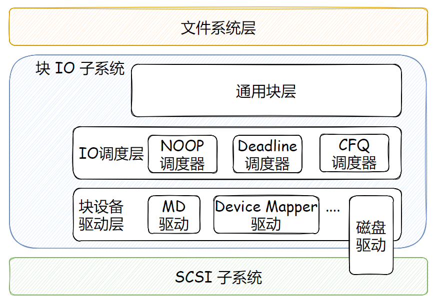

本系列分析基于 CentOS 7（linux-3.10.0-957.21.3.el7） 版本，如有描述错误或不妥之处，敬请指出！

主要参考资料：存储技术原理分析、Linux Kernel 文档

------

块设备（Block Device）是支持以固定长度的块为单位读写数据的存储设备的统称。块设备通常是支持随机访问和寻道的硬件设备，如磁盘、软盘、CDROM、内存等，或者是基于其他块设备之上的逻辑设备，如分区、MD（Multi-Disk）、Device Mapper 等。

Linux 内核中负责提交对块设备 IO 请求的子系统被称为块 IO 子系统，也被称为 Linux 块层。

块 IO 子系统可以被分为下面三层：

-   **通用块层**：为各种类型的块设备建立了一个统一的模型，它主要的工作是接收上层发出的磁盘请求，并最终发出 IO 请求。该层隐藏了底层硬件块设备的特性，为块设备提供了一个通用的抽象视图。
-   **IO 调度层**：接收通用块层发出的 IO 请求，缓存请求并试图合并相邻的请求（如果请求在磁盘上面是相邻的），并根据设置好的算法，回调驱动层提供的请求处理函数，以处理具体的 IO 请求。
-   **块设备驱动层**：具体的 IO 处理交给块设备驱动层来完成。对于大多数逻辑块设备，块设备驱动可能是一个纯粹的软件层，并不需要直接和硬件打交道，只是机械地重定向 IO。对于 SCSI 块设备，其块设备驱动即为 SCSI 磁盘驱动，为 SCSI 子系统的高层驱动，从而将块 IO 子系统和 SCSI 子系统联系了起来。

 

 

块 IO 子系统的一般 IO 处理流程是：上层调用通用块层提供的接口向块 IO 子系统提交 IO 请求，这些请求首先被放入 IO 调度层的调度队列，经过合并和排序，最终将转换后的 IO 请求派发到具体的块设备的等待队列，由后者的驱动进一步处理。

这个过程涉及两种形式的 IO 请求：一种是通用块层的 IO 请求，即上层提交的 IO 请求，在 Linux 内核中以 `bio` 结构描述；另一种是块设备驱动层的 IO 请求，即经过 IO 调度层转换后的 IO 请求，在 Linux 内核中以 `request` 结构描述。

IO 简单来讲，就是将数据从磁盘读入内存或者从内存写入磁盘。但是，为了提升系统性能，块 IO 子系统采用了聚散 IO（scatter/gather IO）这样一种机制：将对**磁盘上连续，但内存中不连续**的的数据访问由单次操作即可完成。也就是说，在单次操作中，从磁盘上的连续扇区中的数据读取到几个物理上不连续的内存空间或者将物理上不连续的内存空间的数据写入磁盘的连续扇区。前者叫分散读，后者叫聚集写。上层向通用块层提交的 IO 请求是基于聚散 IO 的，它包含多个请求段（segment），一个请求段是一段连续的内存区域，其中包含了和其他请求段处于连续扇区的数据。

>[!TIP]
>
>如果说 SCSI 磁盘驱动是连接块 IO 子系统和 SCSI 子系统之间的桥梁，那么也可以这样认为：块设备是联系块 IO 子系统和文件系统之间的纽带。

bio 表示上层发给通用块层的请求，称为通用块层请求，它关注的是请求的应用层面，即读取（或写入）哪个块设备，读取（或写入）多少字节的数据，读取（或写入）到哪个目标缓冲区等。

request 表示通用块层为底层块设备驱动准备的请求，称作块设备驱动层 IO 请求，或块设备驱动请求，它关注的是请求的实施层面，即构造哪种类型的 SCSI 命令。

一个块设备驱动层请求可能包含多个通用块层请求，也就是说，**一次 SCSI 命令可以服务多个上层请求**，这就是所谓的请求合并。在 Linux 内核实现中，请求合并就是将多个 bio 链入到同一个 request。此外，块 IO 子系统还涉及不同的请求队列，包括 IO 调度队列和派发队列。IO 调度队列是块 IO 子系统用于对通用块层请求进行合并和排序的队列。派发队列是针对块设备驱动的，即块 IO 子系统严格按照队列顺序提交块设备驱动层请求给块设备驱动处理。一般来说，每个块设备都有一个派发队列，IO 子系统又为它内部维护了一个 IO 调度队列，不同的块设备可以采用不同的 IO 调度算法。

通用块层请求到达块 IO 子系统时，首先在 IO 调度队列中进行合并和排序，变成为块设备驱动层的请求，之后块设备驱动层请求按照特定的算法被转移到派发队列，从而被提交到块设备驱动。

在 Linux 内核中，IO 调度队列和派发队列都反映在 `request_queue` 结构中。理清各种请求队列以及各种请求之间的关系，是透彻了解块 IO 子系统的另一个关键所在。

本系列主要是针对单请求队列模式（Single-Queue / SQ）分析，这种模式是为传统机械硬盘设计，不适合 NVME SSD 这种高速存储介质，Linux 为后者设计了多请求队列模式（Multi-Queue / MQ），后面有时间我再继续整理 blk-mq 的知识。

​	

​	
