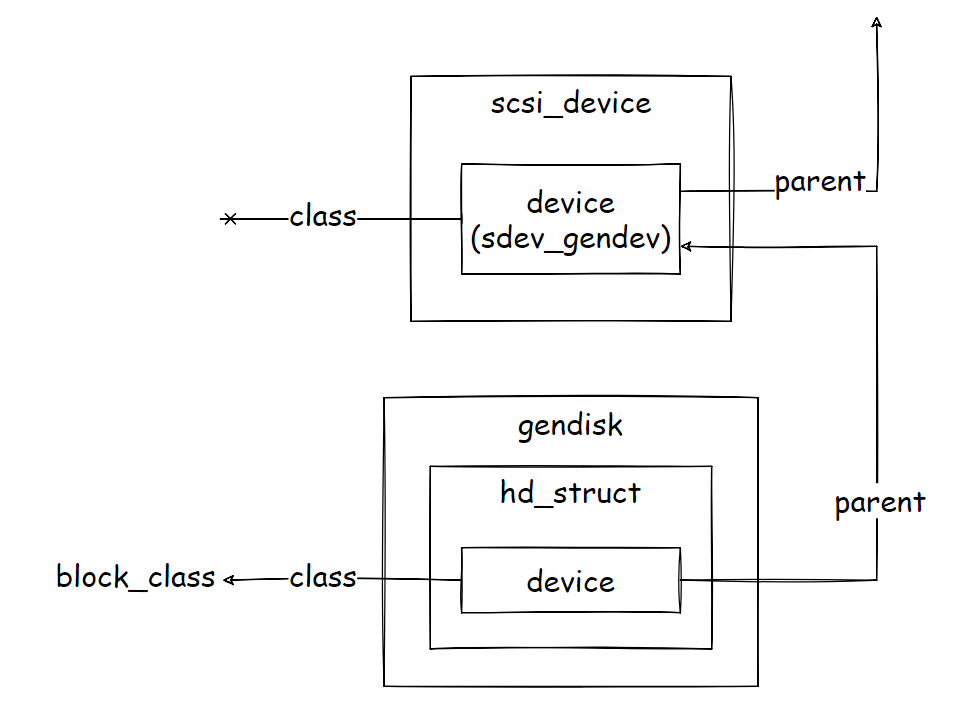
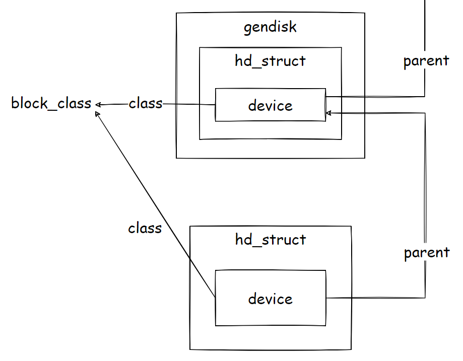

在低层驱动发现一个设备，希望将它作为磁盘来使用，或是块设备驱动要生成一个逻辑设备作为磁盘来使用，都需要分配一个通用磁盘描述符，并将它添加到系统。块 I/O 子系统为此提供了 `alloc_disk` 和 `add_disk` 两个对应的 API 函数。一旦磁盘被添加到系统，块 I/O 子系统将：

-   为磁盘分配设备编号，并将它注册到块设备映射域；
-   扫描磁盘分区，建立磁盘和分区之间的关联；
-   在 sysfs 文件系统中为磁盘和分区创建对应的目录。

这就意味着，磁盘和分区都具有各自唯一的块设备编号，上层可以通过块设备编号对磁盘和分区进行操作。块 I/O 子系统可以从块设备编号找到块设备描述符，进而找到通用磁盘描述符，或者／以及分区描述符，最终找到对应的专有描述符，使得这种操作成为可能。

而且，在块设备文件，将看到，通过块设备描述符，磁盘和分区被组织到 bdev 文件系统，而且它又通过设备编号关联到根文件系统的块设备文件，也就是说，可以通过块设备文件访问的方式来达到对磁盘和分区操作的目的。这就是 Linux 内核设计中**一切都是文件**思想在块设备的体现。


---

# 分配通用磁盘描述符

在分配通用磁盘描述符时，指定磁盘允许的分区数，调用 alloc_disk 函数。因为磁盘本身也占用一个分区（分区编号为 0）。因此，如果调用时指定参数为 1，则表示该磁盘不允许被分区。

alloc_disk 函数直接调用 alloc_disk_node 函数，在调用时增加第二个参数，并指定其为 -1。

```c
struct gendisk *alloc_disk(int minors)
{
	return alloc_disk_node(minors, NUMA_NO_NODE);
}
EXPORT_SYMBOL(alloc_disk);
```

alloc_disk_node 主要做以下几件事：

-   分配 gendisk 描述符
-   初始化磁盘统计信息结构体 disk_stats
-   初始化分区表，但暂时还不完全分配分区所需空间，后面扫描磁盘时再分配
-   初始化 sysfs

具体分析见注释。

```c
struct gendisk *alloc_disk_node(int minors, int node_id)
{
	struct gendisk *disk;

	// 为 gendisk 描述符分配空间，如果分配失败，直接返回 NULL
	disk = kmalloc_node(sizeof(struct gendisk),
				GFP_KERNEL | __GFP_ZERO, node_id);
	if (disk) {
		// 初始化磁盘 0 号分区 dkstats 域来记录磁盘 IO 情况
		if (!init_part_stats(&disk->part0)) {
			kfree(disk);
			return NULL;
		}
		
		// 记录分配该描述符的 node
		disk->node_id = node_id;
		
		/*
		 * 每个通用磁盘都有一个分区表，分区表有一个指针数组，指向这个磁盘的各个分区。
		 * 虽然磁盘能支持的最大分区数是固定的，并且作为参数传入到这个函数中。
		 * 但是实际上在这个磁盘上可能没有创建这么多数目的分区。
		 * 为节省资源考虑，分区表指针数组的项数是可变的，也就是说可以动态扩展。
		 * 
		 * disk_expand_part_tbl 函数创建只支持一个分区的分区表，
		 * 将它保存在通用磁盘描述符的part_tbl域。
		 *
		 * 稍后某个时刻调用 rescan_partitions 函数，扫描出磁盘的分区数之时，便是扩展这个分区表之际。
		 * 那里会再次调用 disk_expand_part_tbl 函数分配支持指定数目分区的分区表，
		 * 将原分区表的内容复制到新分区表，释放原分区表，并更新通用磁盘描述符的 part_tbl 域。
		 */
		if (disk_expand_part_tbl(disk, 0)) {
			free_part_stats(&disk->part0);
			kfree(disk);
			return NULL;
		}
		
		/*
		 * 分区表指针数组的第一项指向代表整个磁盘的分区，即磁盘零号分区。
		 * 和其他分区不同的是，磁盘的零号分区并不需要额外分配空间，而是被内嵌在通用磁盘描述符中。
		 */
		disk->part_tbl->part[0] = &disk->part0;

		seqcount_init(&disk->part0.nr_sects_seq);
		hd_ref_init(&disk->part0);

		disk->minors = minors;
		
		// rand_initialize_disk 帮助内核产生随机数
		rand_initialize_disk(disk);
		
		/*
		 * 下面是 Linux 驱动模型设备初始化的标准方式。
		 * 我们看到，磁盘零号分区的内嵌设备描述符被关联到 block_class 类。
		 * 在后面会看到，将这个内嵌设备添加到系统中时，
		 * 会在 sysfs 文件系统下创建对应的目录，并且在 /sys/block/ 下创建到该目录的链接。
		 */
		disk_to_dev(disk)->class = &block_class;
		disk_to_dev(disk)->type = &disk_type;
		device_initialize(disk_to_dev(disk));
	}
	return disk;
}
EXPORT_SYMBOL(alloc_disk_node);
```

在分配好通用磁盘描述符之后，块设备驱动需要调用 add_disk 函数将磁盘添加到系统，它主要做以下几件事：

-   分配设备号
-   bdi_register_dev 注册 BDI
-   blk_register_region 在块设备映射域进行注册
-   register_disk 注册通用磁盘
-   blk_register_queue 在 sysfs 下建立 queue

具体分析见注释。

```c
void add_disk(struct gendisk *disk)
{
	__add_disk(disk, true);
}

static void __add_disk(struct gendisk *disk, bool register_queue)
{
	struct backing_dev_info *bdi;
	dev_t devt;
	int retval;

	WARN_ON(disk->minors && !(disk->major || disk->first_minor));
	WARN_ON(!disk->minors && !(disk->flags & GENHD_FL_EXT_DEVT));

	disk->flags |= GENHD_FL_UP;

	// 为这个磁盘（即它的零号分区）获得设备编号
	retval = blk_alloc_devt(&disk->part0, &devt);
	if (retval) {
		WARN_ON(1);
		return;
	}
	// 保存在磁盘零号分区的内嵌设备描述符中
	disk_to_dev(disk)->devt = devt;

	disk->major = MAJOR(devt);
	disk->first_minor = MINOR(devt);

	disk_alloc_events(disk);

	/* Register BDI before referencing it from bdev */
	bdi = &disk->queue->backing_dev_info;
	/* 
	 * 每个请求队列还内嵌一个后备设备信息描述符，提供专属的请求处理机制，
	 * 例如，可以派生专门为它服务的 flusher 线程。
	 * bdi_register_dev 调用 bdi_register 函数将 BDI 添加到系统
	 */
	bdi_register_dev(bdi, disk_devt(disk));

	/*
	 * blk_register_region 函数在块设备映射域进行注册。
	 * 所谓的注册，就是在块设备映射域中将设备编号（一个或多个）和通用磁盘描述符关联起来，
	 * 也就是说，届时可以从这些设备编号找到通用磁盘描述符。
	 * 事实上，我们通过块设备编号访问块设备文件时，就必须经过映射域查找通用磁盘描述符这样一个步骤。
	 *
	 * register_disk 函数在 Linux 内核中进一步注册通用磁盘，
	 * 包括将磁盘添加到 sysfs 文件系统，扫描该磁盘的分区，并将它们注册到系统。
	 * 
	 * 每个通用磁盘都有一个请求队列。
	 * 在sd_probe函数中，通用磁盘描述符的 queue 域被指向对应 SCSI 磁盘的内嵌请求队列。
	 * 现在，是将该请求队列添加到 sysfs 文件系统的时候了。
	 * blk_register_queue 函数将在 sysfs 文件系统中代表整个磁盘的分区的目录下创建 queue 子目录，
	 * 例如 /sys/devices/pci0000:00/0000:00:10.0/host2/target2:0:0/2:0:0:0/block/sda/queue/，
	 * 并在该子目录下创建相关的属性文件。
	 */
	blk_register_region(disk_devt(disk), disk->minors, NULL,
			    exact_match, exact_lock, disk);
	register_disk(disk);
	if (register_queue)
		blk_register_queue(disk);

	WARN_ON_ONCE(!blk_get_queue(disk->queue));

	// 在 sysfs 文件系统中代表整个磁盘的分区的目录下创建名字为 bdi 的链接文件，指向 BDI 所对应的目录。
	retval = sysfs_create_link(&disk_to_dev(disk)->kobj, &bdi->dev->kobj, "bdi");
	WARN_ON(retval);

	disk_add_events(disk);
}
```


---

# 添加到sysfs

将通用磁盘添加到系统的一个关键函数就是 register_disk，它进一步注册通用磁盘，包括将磁盘添加到 sysfs 文件系统，扫描磁盘分区，建立磁盘与分区的关系，再将分区注册到系统。SCSI 设备及其派生的通用磁盘之间的驱动模型设备关系如图所示：

 

register_disk 主要流程如下：

-   进行一些 alloc_disk_node 补充工作
-   抑制发送事件到用户空间
-   添加到 sysfs
-   处理磁盘分区，调用 bdget_disk 函数，获取磁盘对应的块设备描述符。注意，拿到它，我们后面的流程就可以和来自上层的处理合并起来了。

具体分析见注释：

```c
static void register_disk(struct gendisk *disk)
{
	struct device *ddev = disk_to_dev(disk);
	struct block_device *bdev;
	struct disk_part_iter piter;
	struct hd_struct *part;
	int err;

	/*
	 * 将磁盘零号分区的内嵌驱动模型设备的 parent 域赋值为通用磁盘的 driverfs_dev 域，
	 * 对于 SCSI 磁盘，它指向的是对应的 SCSI 设备描述符 scsi_device 的内嵌通用设备 sdev_gendev.
	 * 
	 * dev_set_name 将它的名字设置为磁盘名。
	 * 这两行进一步初始化了通用磁盘描述符的内嵌设备，
	 * 作为对 alloc_disk_node 函数中的初始化工作的补充.
	 */
	ddev->parent = disk->driverfs_dev;
	dev_set_name(ddev, "%s", disk->disk_name);

	/* 
	 * 在添加到系统之前，调用 dev_set_uevent_suppress 函数“抑制”发送事件到用户空间，
	 * 这是为了延迟发送事件，因为应该在磁盘的分区表扫描完成之后才统一向用户空间报告。
	 */
	dev_set_uevent_suppress(ddev, 1);

	/*
	 * 将磁盘零号分区的内嵌类设备添加到系统。
	 * 根据前面的初始化，可以知道，
	 * 磁盘零号分区（代表磁盘）的内嵌驱动模型设备有 parent（为对应 SCSI 设备描述符的内嵌通用设备），
	 * 有 class（为block_class类），且 parent 没有 class。
	 * 
	 * 因此，当将它添加到系统时，
	 * 在 sysfs 文件系统中，在 scsi_device 对应的子目录下，
	 * 将创建一个以 block 为名字的子目录，然后在其下创建和 gendisk 对应的子目录，
	 * 名字为通用磁盘的名字，即 sd# 形式。
	 * 举例说明，/sys/devices/pci0000:00/0000:00:10.0/host2/target2:0:0/2:0:0:0/block/sda。
	 * 此外，在 /sys/block 创建以通用磁盘的名字的符号链接，指向 gendisk 对应的子目录。
	 */
	if (device_add(ddev))
		return;
	if (!sysfs_deprecated) {
		err = sysfs_create_link(block_depr, &ddev->kobj,
					kobject_name(&ddev->kobj));
		if (err) {
			device_del(ddev);
			return;
		}
	}

	/*
	 * avoid probable deadlock caused by allocating memory with
	 * GFP_KERNEL in runtime_resume callback of its all ancestor
	 * devices
	 */
	pm_runtime_set_memalloc_noio(ddev, true);

	/*
	 * 在通用磁盘对应的目录下创建两个子目录：holders 和 slaves，
	 * 将返回的内核对象保存下来以备其他代码使用。
	 * holders 目录下记录了持有该磁盘的设备名，
	 * 而 slaves 目录下则记录了该磁盘所持有的设备名，都以符号链接方式指向目标设备的目录。
	 * 这便从 sysfs 文件系统为用户呈现了“栈式”设备的依附关系。
	 * 例如，假设 SCSI 磁盘 /dev/sda 被作为 Device Mapper 设备 /dev/dm-0 的一个低层设备，
	 * 那么 /sys/block/dm-0/slaves/sda 符号链接指向 /sys/block/sda/，
	 * 而 /sys/block/sda/holders/dm-0 符号链接指向 /sys/block/dm-0/。
	 * 顺便提一下，在分区的目录下只有 holders 目录，这是显而易见的。
	 */
	disk->part0.holder_dir = kobject_create_and_add("holders", &ddev->kobj);
	disk->slave_dir = kobject_create_and_add("slaves", &ddev->kobj);

	/* 
	 * 接下来的工作就是处理磁盘分区情况，有几种情况下可以跳过分区的处理：
	 * 1.磁盘不能被分区
	 * 2.磁盘长度为 0，比如介质被移除的情况等
	 */
	/* No minors to use for partitions */
	if (!disk_part_scan_enabled(disk))
		goto exit;
	/* No such device (e.g., media were just removed) */
	if (!get_capacity(disk))
		goto exit;

	// bdget_disk 函数，获取磁盘对应的块设备描述符。
	bdev = bdget_disk(disk, 0);
	if (!bdev)
		goto exit;

    // 置位表示需要重新读入分区表
	bdev->bd_invalidated = 1;
    // 打开磁盘块设备描述符
	err = blkdev_get(bdev, FMODE_READ, NULL);
	if (err < 0)
		goto exit;
	blkdev_put(bdev, FMODE_READ);

exit:
	// 清除事件抑制标志,发送“磁盘已添加到系统”的事件
	dev_set_uevent_suppress(ddev, 0);
	kobject_uevent(&ddev->kobj, KOBJ_ADD);

	// 循环处理每个分区，发送“分区已添加到系统”的事件
	disk_part_iter_init(&piter, disk, 0);
	while ((part = disk_part_iter_next(&piter)))
		kobject_uevent(&part_to_dev(part)->kobj, KOBJ_ADD);
	disk_part_iter_exit(&piter);
}
```


---

# 获取磁盘块设备描述符

bdget_disk 函数给出通用磁盘描述符指针，以及分区编号，返回分区对应的块设备描述符的指针。

调用时传入的分区号为 0，表示要获得代表整个磁盘的零号分区所对应的块设备描述符。实际上，这时候，这个磁盘在内存中只有零号分区存在，其他分区还没有被创建出来。但是，需要知道，这个函数也可以被用来获取其他分区所对应的块设备描述符。

获取分区的块设备描述符要用到后面会介绍的 bdev 文件系统，简单地讲，就是根据分区编号在 bdev 文件系统中查找或分配 inode，而块设备描述符是和 inode 一一关联的。

bdget_disk 第一个参数为指向通用磁盘描述符的指针，第二个参数为分区编号，返回值为分区对应的块设备描述符的指针，或者在失败时的 NULL。

```c
struct block_device *bdget_disk(struct gendisk *disk, int partno)
{
	struct hd_struct *part;
	struct block_device *bdev = NULL;

	part = disk_get_part(disk, partno);
	if (part)
		bdev = bdget(part_devt(part));
	disk_put_part(part);

	return bdev;
}
```

disk_get_part 函数获得 gendisk 的编号为 partno 的分区描述符 hd_struct，其中存有该分区的设备号。

part_devt 函数获得分区设备号，然后以它为参数调用 bdget 函数，bdget 函数的代码如下：

```c
struct block_device *bdget(dev_t dev)
{
	struct block_device *bdev;
	struct inode *inode;

	inode = iget5_locked(blockdev_superblock, hash(dev),
			bdev_test, bdev_set, &dev);

	if (!inode)
		return NULL;

	bdev = &BDEV_I(inode)->bdev;

	if (inode->i_state & I_NEW) {
		bdev->bd_contains = NULL;
		bdev->bd_super = NULL;
		bdev->bd_inode = inode;
		bdev->bd_block_size = (1 << inode->i_blkbits);
		bdev->bd_part_count = 0;
		bdev->bd_invalidated = 0;
		inode->i_mode = S_IFBLK;
		inode->i_rdev = dev;
		inode->i_bdev = bdev;
		inode->i_data.a_ops = &def_blk_aops;
		mapping_set_gfp_mask(&inode->i_data, GFP_USER);
		inode->i_data.backing_dev_info = &default_backing_dev_info;
		spin_lock(&bdev_lock);
		list_add(&bdev->bd_list, &all_bdevs);
		spin_unlock(&bdev_lock);
		unlock_new_inode(inode);
	}
	return bdev;
}
```

bdget 输入块设备编号，返回块设备的 block_device 描述符。

iget5_locked 在 bdev 文件系统中找到和块设备编号对应的 inode，而相关联的 block_device 描述符即为所查找的目标，这里传入了两个函数指针，bdev_test 用来测试 inode 是否是想要的，bdev_set 用来初始化一个 inode。

总结一下到目前为止的工作，我们已经获得了通用磁盘的块设备描述符，下面应该扫描它的分区表，为各个分区在内存中构造数据结构，同时添加到系统中。

因此，当 bget_disk 函数返回通用磁盘描述符到 register_disk，如果失败，会跳过分区处理；否则将块设备描述符的 bd_invalidated 域置位，这表示需要重新读入分区表，blkdev_get 函数要做的就是扫描分区，建立磁盘与分区的关系，并将分区添加到系统中。


---

# 打开磁盘块设备描述符

blkdev_get 主要调用 __blkdev_get，新添加的参数表示所操作的块设备是磁盘还是分区。因为传入值为 0，因此是针对磁盘进行操作。

前面刚刚在 bdget_disk 函数中根据通用磁盘描述符和分区编号拿到了块设备描述符，现在我们又看到 __blkdev_get 函数调用 get_gendisk 根据块设备描述符获取通用磁盘描述符和分区编号。这似乎有点多余，其实不然。实际上，blkdev_get 是一个关键函数，主要是为用户希望根据块设备编号打开块设备，进而获得通用磁盘描述符，以及设备专有数据结构，以便提供给后续操作。在这种情况下，块设备描述符可能是新建的，还没有建立与通用磁盘描述符的关系，更不要谈取得分区编号了。而这里的流程为方便，重用了这个函数的代码，也就不在乎多做这一点工作了。

Linux 内核为块设备描述符获得通用磁盘描述符和分区编号的解决方法是使用内核对象设备号映射机制，以块设备编号为索引在块设备映射域中查找。如果内存中有这些信息，那么它们一定已经被记录在映射域中。实际上，get_gendisk 函数就是后面要讲到的设备号映射机制 API 的简单封装而已。

通用磁盘描述符是在 add_disk 函数中调用 blk_register_region 函数被添加到块设备映射域的，blk_register_region 是 kobj_map 函数的简单封装。现在需要调用 get_gendisk 函数，通过它调用 kobj_lookup 获得和块设备编号对应的内核对象 kobject，进而转换为通用磁盘对象 gendisk，并通过参数 partno 传出该块设备的分区编号。

再回顾一下 bdget_disk 和 blkdev_get 这两个文件名容易混淆的函数：

-   bdget_disk 根据通用磁盘描述符和分区编号获取块设备描述符。它从对应分区描述符中取得分区的块设备编号，然后通过 bdev 文件系统获得块设备描述符；
-   blkdev_get 根据块设备描述符获取通用磁盘描述符和分区编号。它根据块设备描述符中的块设备编号，通过设备号映射机制获得通用磁盘描述符以及分区编号。

具体流程分析见注释：

```c
static int __blkdev_get(struct block_device *bdev, fmode_t mode, int for_part)
{
	struct gendisk *disk;
	struct module *owner;
	int ret;
	int partno;
	int perm = 0;

	if (mode & FMODE_READ)
		perm |= MAY_READ;
	if (mode & FMODE_WRITE)
		perm |= MAY_WRITE;
	/*
	 * hooks: /n/, see "layering violations".
	 */
	if (!for_part) {
		ret = devcgroup_inode_permission(bdev->bd_inode, perm);
		if (ret != 0) {
			bdput(bdev);
			return ret;
		}
	}

 restart:

	ret = -ENXIO;
	disk = get_gendisk(bdev->bd_dev, &partno);
	if (!disk)
		goto out;
	owner = disk->fops->owner;

	disk_block_events(disk);
	mutex_lock_nested(&bdev->bd_mutex, for_part);
	
	// 处理第一次打开块设备的情况
	if (!bdev->bd_openers) {
		/*
		 * 无论是针对磁盘、还是分区，先设置以下域
		 * 对于分区，bd_contains 只是暂时的，后面会重新修改
		 */
		bdev->bd_disk = disk;
		bdev->bd_queue = disk->queue;
		bdev->bd_contains = bdev;

		// 针对磁盘情况进行处理
		if (!partno) {
			struct backing_dev_info *bdi;

			ret = -ENXIO;
			// 将块设备描述符的 bd_part 域指向磁盘的零号分区
			bdev->bd_part = disk_get_part(disk, partno);
			if (!bdev->bd_part)
				goto out_clear;

			ret = 0;
			/*
			 * 如果有的话，调用磁盘的块设备方法表中的 open 函数。
			 * 如果返回一般性错误码，回滚已做的操作，返回负的错误码；
			 * -ERESTARTSYS 要额外处理，
			 * 它被用来由于“竞争”关系在打开的同时磁盘的状态已发生变化（如参见 md_open 函数），
			 * 回滚已做到操作，然后重新来过
			 */
			if (disk->fops->open) {
				ret = disk->fops->open(bdev, mode);
				if (ret == -ERESTARTSYS) {
					/* Lost a race with 'disk' being
					 * deleted, try again.
					 * See md.c
					 */
					disk_put_part(bdev->bd_part);
					bdev->bd_part = NULL;
					bdev->bd_disk = NULL;
					bdev->bd_queue = NULL;
					mutex_unlock(&bdev->bd_mutex);
					disk_unblock_events(disk);
					put_disk(disk);
					module_put(owner);
					goto restart;
				}
			}

			if (!ret) {
				// 根据通用磁盘描述符的容量设置块设备的逻辑块长度等
				bd_set_size(bdev,(loff_t)get_capacity(disk)<<9);
				set_init_blocksize(bdev);
				/* 
				 * 为块设备在 bdev 文件系统中的 inode 设置其地址空间的后备设备信息，
				 * 这一般等于对应请求队列的内置后备设备信息，
				 * 如果请求队列为 NULL，则设置为系统默认的后备设备信息
				 */
				bdi = blk_get_backing_dev_info(bdev);
				bdev_inode_switch_bdi(bdev->bd_inode, bdi);
			}

			/*
			 * If the device is invalidated, rescan partition
			 * if open succeeded or failed with -ENOMEDIUM.
			 * The latter is necessary to prevent ghost
			 * partitions on a removed medium.
			 */
			if (bdev->bd_invalidated) {
				/* 
				 * 如果块设备描述符的 bd_invalidated 域被设置，
				 * 调用 rescan_partitions 重新扫描磁盘分区
				 */
				if (!ret)
					rescan_partitions(disk, bdev);
				else if (ret == -ENOMEDIUM)
					invalidate_partitions(disk, bdev);
			}
			if (ret)
				goto out_clear;
		} else {
			struct block_device *whole;
			/*
			 * 处理分区的情况
			 * 首先调用 bdget_disk，获得磁盘对应的块设备描述符
			 */
			whole = bdget_disk(disk, 0);
			ret = -ENOMEM;
			if (!whole)
				goto out_clear;
			BUG_ON(for_part);
			/*
			 * 递归调用 __blkdev_get，但这次是在代表整个磁盘的块设备上进行的。
			 * 注意传入的第三个参数为 1，这将递增磁盘块设备描述符的 bd_part_count 域，
			 * 表示磁盘有分区在使用中，这时不能重新扫描分区
			 */
			ret = __blkdev_get(whole, mode, 1);
			if (ret)
				goto out_clear;
			// 修改块设备描述符的 bd_contains 域，指向磁盘对应的块设备描述符
			bdev->bd_contains = whole;
			/* 
			 * 为块设备在 bdev 文件系统中的 inode 设置其地址空间的后备设备信息，
			 * 让它等于代表整个磁盘的块设备出发的相应值
			 */
			bdev_inode_switch_bdi(bdev->bd_inode,
				whole->bd_inode->i_data.backing_dev_info);
			// 将块设备描述符的 bd_part 域指向对应的分区描述符
			bdev->bd_part = disk_get_part(disk, partno);
			if (!(disk->flags & GENHD_FL_UP) ||
			    !bdev->bd_part || !bdev->bd_part->nr_sects) {
				ret = -ENXIO;
				goto out_clear;
			}
			// 根据分区描述符的容量设置块设备的逻辑块长度
			bd_set_size(bdev, (loff_t)bdev->bd_part->nr_sects << 9);
			set_init_blocksize(bdev);
		}
	} else {
		/*
		 * 如果不是第一次打开块设备，
		 * 那么在内存中必然已经建立好 gendisk、hd_struct、
		 * 代表整个磁盘的 block_device 以及代表分区的 block_device 之间的关系。
		 * 因此，前面 get_gendisk 函数对通用磁盘增加的引用数应该撤销，
		 * 对于磁盘分区，要做的事情都已做过。
		 * 只是对整个磁盘，需要再次执行定制的 open 方法，
		 * 可能的话，扫描和添加分区的动作也要再做一遍。
		 */
		if (bdev->bd_contains == bdev) {
			ret = 0;
			if (bdev->bd_disk->fops->open)
				ret = bdev->bd_disk->fops->open(bdev, mode);
			/* the same as first opener case, read comment there */
			if (bdev->bd_invalidated) {
				if (!ret)
					rescan_partitions(bdev->bd_disk, bdev);
				else if (ret == -ENOMEDIUM)
					invalidate_partitions(bdev->bd_disk, bdev);
			}
			if (ret)
				goto out_unlock_bdev;
		}
		/* only one opener holds refs to the module and disk */
		put_disk(disk);
		module_put(owner);
	}
	bdev->bd_openers++;
	if (for_part)
		bdev->bd_part_count++;
	mutex_unlock(&bdev->bd_mutex);
	disk_unblock_events(disk);
	return 0;

 out_clear:
	disk_put_part(bdev->bd_part);
	bdev->bd_disk = NULL;
	bdev->bd_part = NULL;
	bdev->bd_queue = NULL;
	bdev_inode_switch_bdi(bdev->bd_inode, &default_backing_dev_info);
	if (bdev != bdev->bd_contains)
		__blkdev_put(bdev->bd_contains, mode, 1);
	bdev->bd_contains = NULL;
 out_unlock_bdev:
	mutex_unlock(&bdev->bd_mutex);
	disk_unblock_events(disk);
	put_disk(disk);
	module_put(owner);
 out:
	bdput(bdev);

	return ret;
}
```

沿前面的流程走来，打开整个磁盘，并且在调用之前，将块设备描述符的 bd_invalidated 域设置为 1，所以 rescan_partitions 有机会执行，它调用处理各种分区格式的回调函数对磁盘进行检查，将发现的分区调用 add_partition 添加到通用磁盘 gendisk 的分区数组中。


---

# 重新扫描磁盘分区

磁盘的分区以分区表的形式记录在磁盘上，在磁盘被添加到系统中时，其分区表的内容被读取，以便在内存中为每个分区构造数据结构，并添加到系统中。此外，用户可以要求系统重新从磁盘上读取分区表，以更新内存中的分区数据结构。这两种情况下，最终都会调用到 rescan_partitions 函数。

它有两个参数，第一个为指向通用磁盘描述符的指针，第二个为指向代表整个磁盘的分区所对应的块设备描述符的指针。

rescan_partitions 首先调用 drop_partitions 检查磁盘分区是否在使用，没有在使用的话无效之并删除分区结构

```c
static int drop_partitions(struct gendisk *disk, struct block_device *bdev)
{
	struct disk_part_iter piter;
	struct hd_struct *part;
	int res;

	// 如果 bd_part_count 域非零，则表示磁盘有分区在使用中，这时不能重新扫描分区
	if (bdev->bd_part_count || bdev->bd_super)
		return -EBUSY;
	// 因为是要重新扫描磁盘，所以要先使得当前系统在使用的相关对象失效。
	res = invalidate_partition(disk, 0);
	if (res)
		return res;

	// 删除磁盘当前各个分区的数据结构，循环处理每个分区，调用 delete_partition。
	disk_part_iter_init(&piter, disk, DISK_PITER_INCL_EMPTY);
	while ((part = disk_part_iter_next(&piter)))
		delete_partition(disk, part->partno);
	disk_part_iter_exit(&piter);

	return 0;
}
```

具体流程分析见注释：

```c
int rescan_partitions(struct gendisk *disk, struct block_device *bdev)
{
	struct parsed_partitions *state = NULL;
	struct hd_struct *part;
	int p, highest, res;
rescan:
	if (state && !IS_ERR(state)) {
		free_partitions(state);
		state = NULL;
	}

	/* 检查分区是否在使用，没有的话先清空分区*/
	res = drop_partitions(disk, bdev);
	if (res)
		return res;

	/*
	 * 某些块设备类型需要执行专用的逻辑来让磁盘的当前分区失效，
	 * 它们可能提供了 revalidate_disk 回调函数的实现
	 */
	if (disk->fops->revalidate_disk)
		disk->fops->revalidate_disk(disk);
	check_disk_size_change(disk, bdev);
	/*
	 * 将块设备描述符的 bd_invalidated 域清零，
	 * 这个域是为了让本函数被执行而设置的。
	 * 既然现在已经在执行，就应该复位它。
	 */
	bdev->bd_invalidated = 0;
	/*
	 * 系统支持不同的分区表类型，例如 EFI 分区表、MSDOS 分区表。
	 * 每种类型的分区表有专门的实现代码来读取。
	 * 它们被组织成一个回调函数数组，保存在全局变量 check_part 中。
	 * check_partition 函数的目的就是顺序尝试用各个回调函数去检查分区表。
	 * 将成功读到的分区信息存放在 parsed_partitions 结构中返回。
	 * 对于系统不支持的分区表类型，最终这个函数会返回 NULL。
	 */
	if (!get_capacity(disk) || !(state = check_partition(disk, bdev)))
		return 0;
	if (IS_ERR(state)) {
		/*
		 * I/O error reading the partition table.  If any
		 * partition code tried to read beyond EOD, retry
		 * after unlocking native capacity.
		 */
		if (PTR_ERR(state) == -ENOSPC) {
			printk(KERN_WARNING "%s: partition table beyond EOD, ",
			       disk->disk_name);
			if (disk_unlock_native_capacity(disk))
				goto rescan;
		}
		return -EIO;
	}
	/*
	 * If any partition code tried to read beyond EOD, try
	 * unlocking native capacity even if partition table is
	 * successfully read as we could be missing some partitions.
	 */
	if (state->access_beyond_eod) {
		printk(KERN_WARNING
		       "%s: partition table partially beyond EOD, ",
		       disk->disk_name);
		if (disk_unlock_native_capacity(disk))
			goto rescan;
	}

	// 向用户空间发送分区表已经改变的事件
	kobject_uevent(&disk_to_dev(disk)->kobj, KOBJ_CHANGE);

	/* 
	 * 检测最高的分区编号，然后 disk_expand_part_tbl 以该编号为参数扩展分区表。
	 * 这纯粹是为了优化而加入的，否则我们可以直接使用 parsed_partitions 结构中的 next 域。
	 */
	for (p = 1, highest = 0; p < state->limit; p++)
		if (state->parts[p].size)
			highest = p;
	disk_expand_part_tbl(disk, highest);

	/* add partitions */
	for (p = 1; p < state->limit; p++) {
		sector_t size, from;
		struct partition_meta_info *info = NULL;

		size = state->parts[p].size;
		// 分区长度为 0，跳过
		if (!size)
			continue;

		from = state->parts[p].from;
		// 如果分区项起始扇区长度超过磁盘容量，跳过这个分区项
		if (from >= get_capacity(disk)) {
			printk(KERN_WARNING
			       "%s: p%d start %llu is beyond EOD, ",
			       disk->disk_name, p, (unsigned long long) from);
			if (disk_unlock_native_capacity(disk))
				goto rescan;
			continue;
		}

		// 如果分区项结束扇区位置超过磁盘空间使用量，对分区项长度进行调整
		if (from + size > get_capacity(disk)) {
			printk(KERN_WARNING
			       "%s: p%d size %llu extends beyond EOD, ",
			       disk->disk_name, p, (unsigned long long) size);

			if (disk_unlock_native_capacity(disk)) {
				/* free state and restart */
				goto rescan;
			} else {
				/*
				 * we can not ignore partitions of broken tables
				 * created by for example camera firmware, but
				 * we limit them to the end of the disk to avoid
				 * creating invalid block devices
				 */
				size = get_capacity(disk) - from;
			}
		}

		if (state->parts[p].has_info)
			info = &state->parts[p].info;
		/*
		 * 将分区添加到系统：
		 * - 为 hd_struct 结构分配空间
		 * - 设置起始扇区、扇区数、分区索引值以及读／写策略等
		 * - 初始化分区的内嵌设备对象，设置其所在的设备类为 “block”，类型为 “part”，
		 *   将内嵌设备对象添加到 sysfs。
		 */
		part = add_partition(disk, p, from, size,
				     state->parts[p].flags,
				     &state->parts[p].info);
		/*
		 * add_partition 函数有可能失败，这时它会回滚已做过的操作，返回负的错误码。
		 * 检测到后，输出警告消息，跳过它。
		 */
		if (IS_ERR(part)) {
			printk(KERN_ERR " %s: p%d could not be added: %ld\n",
			       disk->disk_name, p, -PTR_ERR(part));
			continue;
		}
#ifdef CONFIG_BLK_DEV_MD
		if (state->parts[p].flags & ADDPART_FLAG_RAID)
			md_autodetect_dev(part_to_dev(part)->devt);
#endif
	}
	free_partitions(state);
	return 0;
}
```

parsed_partitions 结构体如下：

```c
struct parsed_partitions {
	struct block_device *bdev;
	char name[BDEVNAME_SIZE];	// 分区表名字
	struct {
		sector_t from;			// 分区起始扇区号
		sector_t size;			// 分区扇区长度
		int flags;				// 分区标志
		bool has_info;
		struct partition_meta_info info;
	} *parts;
	int next;		// 下一个分区的编号
	int limit;		// 分区的最大编号
	bool access_beyond_eod;
	char *pp_buf;
};
```

通用设备及其分区之间的驱动模型关系如下：

 

最终，blkdev_get 函数成功完成，返回 register_disk 。现在磁盘和分区都已添加到系统，但是用户空间还不知道，就在前面的过程中，我们有意抑制发送事件到用户空间，现在磁盘的分区表已经全部获得，到了发送这些事件的时候了。

再次调用 dev_set_uevent_suppress 清除抑制标志，然后发送**磁盘已添加到系统**的事件；循环处理每个分区，发送**分区已添加到系统**的事件。至此，添加磁盘到系统的工作已经全部完成。


---

# 设备号映射机制

在 Linux 内核代码中，有时需要根据块设备号查找或创建相应的对象。例如：

-   打开块设备文件时，需要根据块设备编号找到该块设备的通用磁盘对象；
-   在创建MD设备时，需要根据块设备编号分配该块设备的 mddev 对象。

Linux 内核设计了一种设备号映射机制，建立设备号和内核对象的映射关系。某些内核对象被赋予一个设备号区间，不同区间的设备号被映射到不同的内核对象，构成一个映射域。

Linux 内核表示映射域的数据结构是 struct kobj_map，它主要是一个 255 项的指针数组。每一项引出一个 probe 链表。每个 probe 描述了一个设备号区间，从 dev 开始，长度为 range。之所以用到链表，是考虑到几个内核对象设备号区间可以相互嵌套，链表的排序方式让小区间排在链表前面，这样最精确的项覆盖其他项。最后一个项覆盖了所有的设备号，即该区间是 [1,～0]，我们称为**泛化项**，查找映射会在某个链表上进行，如果不能匹配到更精确的项，最终都会匹配到这个泛化项。

```c
struct kobj_map {
	struct probe {
		struct probe *next;		// 指向链表下一项的指针
		dev_t dev;				// 起始设备编号
		unsigned long range;	// 设备编号范围
		struct module *owner;	// 指向实现了这个设备对象的模块的指针
		kobj_probe_t *get;		// 获取内核对象的方法
		int (*lock)(dev_t, void *);
		void *data;				// 设备对象私有数据
	} *probes[255];
	struct mutex *lock;
};
```

如果设备太多，可能需要一个更快的数据结构来加速查找，但是当前使用这个版本的数据结构就可以了。它使用主设备号 255 作为数组的索引。处理链表由信号量进行保护，它在初始化时被设置为子系统的信号量。

设备号映射域可以通过以下函数进行操作：

```c
/*
 * 初始化映射域。
 * 这个函数将分配一个映射域 kobj_map 结构，以及一个泛化 probe 结构。
 * 映射域的所有 probe 链表最终都会链到这个泛化项。
 * 这个函数返回指向映射域描述符的指针；错误时返回 NULL。
 */
struct kobj_map *kobj_map_init(kobj_probe_t *base_probe, struct mutex *lock)
    
/*
 * 添加映射到映射域。
 * 第一个参数为指向映射域描述符的指针，第二个参数为设备编号，
 * 第三个参数为编号范围，第四个参数为指向实现了该内核对象的模块的指针，
 * 第五个参数为获得内核对象的方法，第六个参数为锁定内核对象，以免其被释放的方法，
 * 第七个参数为指向设备对象私有数据的指针。
 * 这个函数会构造一个 probe 结构，插入到映射域对应链表的特定位置。
 * 返回 0 表示成功；否则返回负的错误码。
 */
int kobj_map(struct kobj_map *domain, dev_t dev, unsigned long range,
	     struct module *module, kobj_probe_t *probe,
	     int (*lock)(dev_t, void *), void *data)

/*
 * 从映射域删除映射。
 * 第一个参数为指向映射域描述符的指针，第二个参数为设备编号，第三个参数为编号范围。
 * 这个函数会从映射域对应链表中删除对应的 probe 结构。
 */
void kobj_unmap(struct kobj_map *domain, dev_t dev, unsigned long range)

/*
 * 在映射域中查找具有给定设备号的内核对象。
 * 第一个参数为指向映射域描述符的指针，第二个参数为设备编号，
 * 第三个参数返回该内核对象在本映射编号范围中的索引。
 * 成功返回指向内核对象描述符的指针；否则返回 NULL。
 */
struct kobject *kobj_lookup(struct kobj_map *domain, dev_t dev, int *index)
```

基于这种设计，映射域的使用方法是，在系统启动过程中，初始化映射域。然后某部分代码发现一个具有设备号的内核对象时，在映射域中添加映射，如果该内核对象被释放，则从映射域中删除映射。与此同时，其他部分代码可以根据设备号在映射域中查找对应的内核对象。

Linux 内核实现了两个映射域，一个用于块设备（bdev_map），另一个用于字符设备（cdev_map）。块设备映射域在 genhd_device_init 函数中进行初始化，该函数在文件 block/genhd.c 中，使用宏 subsys_initcall 定义。

块 I/O 子系统还提供了几个辅助函数 blk_register_region、blk_unregister_region、get_gendisk，分别对 kobj_map、kobj_unmap 和 kobj_lookup 进行了封装，使得将 bdev_map 的存在被隐藏了起来。

​	


