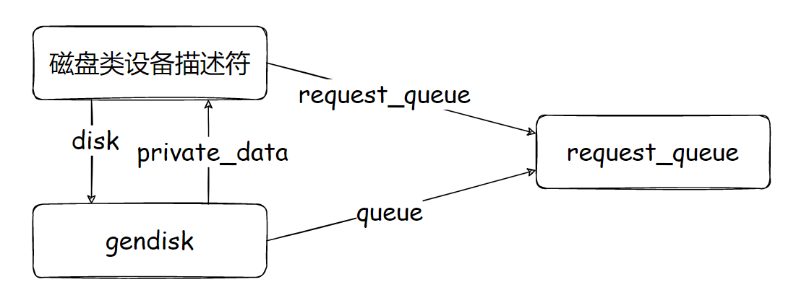
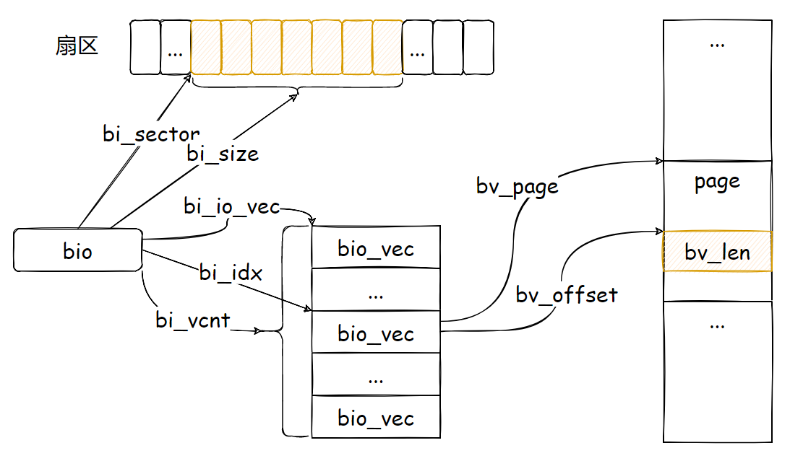

在分析具体的 IO 流程之前，我们先介绍相关的结构体，要了解一个系统怎么工作的，首先了解它的数据是怎么组织的，明白了结构之间的关系，对于工作方式也就明白了一半。


---

# gendisk：通用磁盘

Linux 内核将磁盘类设备中为磁盘通用的部分信息提取出来，表示为通用磁盘描述符 gendisk。

磁盘类设备驱动负责分配、初始化 gendisk，将它添加到系统中。通用磁盘有时被简称为磁盘，但是必须知道，它只是反映了磁盘类设备的一个方面。磁盘类设备可以是物理上的，比如 SCSI 磁盘，也可以是逻辑上的，比如 MD、Device Mapper 设备。

下面是 gendisk 结构体及各字段含义：

```c
struct gendisk {
	int major;   		/* 磁盘主设备号 */
	int first_minor;	/* 和本磁盘关联的第一个次设备号 */
	int minors;         /* 和本磁盘关联的次设备号数目，1 表示磁盘不支持分区 */

	char disk_name[DISK_NAME_LEN];	/* 磁盘名如 sdx mdx dm-x */
	char *(*devnode)(struct gendisk *gd, umode_t *mode);	/* 此回调函数可以在为该通用磁盘创建设备节点时，提供名字搜索 */

	unsigned int events;		/* supported events */
	unsigned int async_events;	/* async events, subset of all */

	struct disk_part_tbl __rcu *part_tbl;		/* 指向磁盘分区表描述符的指针 */
	struct hd_struct part0;					/* 磁盘的分区 0（将整个磁盘也作为一个分区，编号为 0）*/

	const struct block_device_operations *fops;		/* 指向块设备方法表的指针 */
	struct request_queue *queue;					/* 指向磁盘的请求队列描述符的指针 */
    /* 
     * 该通用磁盘所对应的特定磁盘的私有数据，
     * 对于 SCSI 磁盘，为指向 scsi_disk 结构中 driver 域的地址
     * 对于 RAID，为指向 MD（mddev_t）的指针
     * 对于 Device Mapper，为指向被映射设备（mapped_device）的指针
     */
	void *private_data;

	int flags;		/* 磁盘标志 */
	struct device *driverfs_dev;  // FIXME: remove
	struct kobject *slave_dir;		/* 指向 sysfs 中这个磁盘下 slaves 目录对应的 kobject 的指针 */

	struct timer_rand_state *random;	/* 被内核用来帮助产生随机数 */
	atomic_t sync_io;		/* 写入磁盘的扇区计数器，仅用于 RAID */
	struct disk_events *ev;
#ifdef  CONFIG_BLK_DEV_INTEGRITY
	struct blk_integrity *integrity;	/* 用于数据完整性保护 */
#endif
	int node_id;	/* 记录分配该磁盘描述符的 node id，以后在扩展磁盘分区表时，尽量在同一个 node 上进行 */
	RH_KABI_EXTEND(struct badblocks *bb)
};
```

一个磁盘可以包含多个分区，每个分区都有相对于磁盘的分区编号。其中编号 0 用于磁盘代表的整个大分区，而其他的是磁盘上创建的分区。first_minor 是和磁盘相关联的第一个次设备号，即磁盘使用的次设备号；minors 是和磁盘相关联的次设备号的数目，除了一个用于磁盘外，其余的用于分区，因此 1 表示该磁盘不支持分区。

private_data 指向该设备的私有数据，通常被用来定位设备的描述符。

queue 域为指向磁盘的请求队列描述符的指针，在将磁盘添加到系统前，这个域通常被赋值为磁盘类设备的指向请求队列描述符的指针。对于 SCSI 磁盘，这是 scsi_device 结构中的 request_queue 域；对于 MD 设备和 Device Mapper 设备，分别是 mddev_t 和 mapped_device 结构的 queue 域。

每个 gendisk 结构通常和一个特定的磁盘类设备相对应。在磁盘类设备描述符中，定义一个指向 gendisk 的指针，如图中的 disk 域；另外将 gendisk 的 private_data 指向对应的磁盘类设备描述符，将 queue 指针指向对应的请求队列描述符

 

从严格意义上来说，这个图并不完全精确。

例如对 SCSI 磁盘设备来说，scsi_disk 描述符的 disk 域指向 gendisk 描述符，gendisk 的 private_data 域指向 scsi_disk 描述符的 driver 域，而 gendisk 描述符的 queue 域则被赋值为 scsi_device 描述符的 request_queue 域。不过 scsi_disk、scsi_device 是表示 SCSI 磁盘的两个结构，两者相互关联，它们的关系相对块 IO 子系统是透明的，我们可以笼统地以**磁盘类设备描述符**来描述。

此外，对于 MD 设备，图中的 disk 域应为 gendisk；对于 MD 设备和 Device Mapper 设备，request_queue 应为 queue，这些就属于要注意到具体细节了。

在为磁盘类设备分配和添加 gendisk 时，设置好 private_data 域。通常情况下，通用块层使用 gendisk 结构，但有时需要调用特定设备的方法进行处理，调用时传入指向 gendisk 结构（或指向 block_device 结构）的指针。在这些方法中，便需要从 private_data 域还原出该设备的描述符。

此外，Linux 源码在 driverfs_dev 域后面注释要删除（FIXME: remove），以 SCSI 磁盘为例，其通用磁盘描述符 gendisk 的 driverfs_dev 域指向的是 SCSI 设备描述符 scsi_device 的内嵌通用设备 sdev_gendev。从上图可以看到，这个域是多余的，事实上，我们可以通过 private_data 得到对应的 SCSI 磁盘描述符，进而再得到 SCSI 设备描述符 scsi_device，以及它的内嵌通用设备。

既然谈到这，不妨多说几句。Linux 内核的数据结构中，有相当多的域是冗余的，定义它们纯粹是为了使用的方便。例如图中的 queue 域，完全可以先通过 private_data 域找到磁盘类设备描述符，然后再从它的 request_queue 域找到所需要的请求队列。不过，因为访问磁盘的请求队列是一个经常的动作，所以加上了这个域。这种设计上的考虑，最终也是一种权衡的结果。

在通用磁盘描述符中，内嵌了一个 hd_struct 结构的域 part0，表示磁盘的零号分区，此外，它还有一个指向 disk_part_tbl 结构的指针域 part_tbl，表示磁盘的分区表。分区和分区表结构马上就会看到。注意到，通用磁盘描述符并没有内嵌的驱动模型设备域，这并不是说磁盘并不要关联到 sysfs 文件系统，通用磁盘是通过它内嵌的零号分区而加入到 sysfs 文件系统的。

random 域被内核用来帮助产生随机数。内核维护了一个熵池用来收集来自设备驱动程序和其他来源的环境噪声。它实现了一系列接口函数用于获取系统环境的噪声数据，并加入熵池。就磁盘而言，可以利用连续两次磁盘操作之间的间隔作为噪声源将随机数据加入熵池。random 就是为实现此目的而设置的一个指向记录磁盘请求完成时间的数据结构。在创建 gendisk 结构时调用 rand_initialize_disk 初始化；在请求完成时调用 add_disk_randomness()。


---

# hd_struct：分区

在各种逻辑设备中，分区设备比较特殊。对分区的请求可以简单地线性映射到分区所在的磁盘，因此块 IO 子系统将对分区的支持集成进来。Linux 内核中表示分区的结构为 hd_struct：

```c
struct hd_struct {
	sector_t start_sect;		/* 分区在磁盘内的起始扇区编号 */
	sector_t nr_sects;			/* 分区的长度（扇区数）*/
	seqcount_t nr_sects_seq;	
	sector_t alignment_offset;
	unsigned int discard_alignment;
	struct device __dev;		/* 内嵌的类设备描述符 */
	struct kobject *holder_dir;	/* 指向这个分区下 holders 目录对应的 kobject */
    
	int policy, partno;		/* policy：如果分区为只读，则为 1，否则为 0；partno：表示分区在磁盘内的相对索引*/
	struct partition_meta_info *info;
#ifdef CONFIG_FAIL_MAKE_REQUEST
	int make_it_fail;		/* 如果置位，则对该分区的块 IO 请求返回错误，用于调试 */
#endif
	unsigned long stamp;	/* 用于修正（round off）分区统计信息的时间戳 */
	atomic_t in_flight[2];	/* 已被提交给设备驱动，但还未完成的 IO 请求数 */
#ifdef	CONFIG_SMP
	struct disk_stats __percpu *dkstats;	/* 磁盘统计信息，包括已处理的读写 IO 数，已读写的扇区数等 */
#else
	struct disk_stats dkstats;
#endif
	atomic_t ref;
	struct rcu_head rcu_head;	/* 用于 RCU 机制的域 */
};
```

毋庸置疑，分区是磁盘的一部分，我们需要有两个域来指定分区的范围：start_sect 和 nr_sects。前者给出了分区在磁盘内的起始扇区编号，而后者是分区包含的扇区数。

分区描述符中有一个内嵌的驱动模型设备，它将分区链入到 block_class 的设备链表。磁盘也通过内嵌的零号分区链入这个链表。将磁盘及其分区添加到系统之后，在 sysfs 文件系统中都会创建对应的目录。分区的目录会作为磁盘目录的一个子目录，而磁盘目录的位置取决于具体类型，例如对于 SCSI 磁盘，它会被创建在 SCSI 设备所对应的目录之下。此外，在 /sys/block/ 下会创建符号链接指向磁盘目录，对于分区，则无须创建这样的符号链接。

gendisk 描述符还有一个指向磁盘分区表的指针域 part_tbl。分区表用 disk_part_tbl 结构表示。每个分区表有一个指针数组 part，数组中每一项都是指向 hd_struct 描述符的指针。数组的项数记录在 len 域。数组索引为 0 的项指向磁盘所对应的分区，即 gendisk 描述符中内嵌的零号分区。而其他项或者为另外分配的 hd_struct 描述符，或者为 NULL。

```c
struct disk_part_tbl {
	struct rcu_head rcu_head;                 /* RCU */
	int len;                                  /* 分区数组的长度 */
	struct hd_struct __rcu *last_lookup;      /* 指向最后一次查找分区的指针 */
	struct hd_struct __rcu *part[];           /* 分区数组，每一项都为指向分区描述符的指针 */
};
```

虽然磁盘能支持的最大分区数是固定的，但是实际可能并没有使用到这么多个。为节省资源考虑，分区表指针数组的项数是可变的。最初只需要分配一项被零号分区使用，在真正扫描了分区表后，再根据需要动态扩展。


---

# block_device：块设备

磁盘和分区都对应一个块设备。每个块设备有唯一的块设备编号和名字，用户根据它们对块设备进行操作，Linux 内核从块设备找到通用磁盘，进而找到设备专有的数据结构以完成这一操作。

用来表示块设备的数据结构为 block_device：

```c
struct block_device {
    /* 块设备的设备号 */
	dev_t			bd_dev;  /* not a kdev_t - it's a search key */
    /* 这个块设备被打开的次数 */
	int			bd_openers;
    /* 指向这个块设备在 bdev 文件系统中的 inode */
	struct inode *		bd_inode;	/* will die */
    /* 磁盘文件系统被装载时，每个块设备只会有一个超级块实例，这里指向块设备对应的文件系统超级块实例的指针 */
	struct super_block *	bd_super;
	struct mutex		bd_mutex;	/* open/close mutex */
    /*
     * 这个块设备 slave inode 链表的表头.
     * 为方便起见，我们将块设备文件的 Host 文件系统上的 inode 记为 slave inode,
     * 而将块设备的 bdev 文件系统中的 inode 记为 master inode.
     */
	struct list_head	bd_inodes;
	void *			bd_claiming;
    /* 块设备描述符的当前 holder,可以指向某结构或字符串.块设备通过此域以实现排他式或共享式打开 */
	void *			bd_holder;
    /* 
     * 多次设置 holders 域的计数器。
     * 可能大于 1，例如可共享块设备；
     * 此外不同分区被 claim 时，磁盘对应的块设备此域也大于 1.
     */
	int			bd_holders;
	bool			bd_write_holder;
#ifdef CONFIG_SYSFS
    /* 
     * 块设备的持有者链表的表头，栈式设备的 sysfs 表示.
     * 结构 bd_golder 的 list 域为链入该链表的连接件.
     */
	struct list_head	bd_holder_disks;
#endif
    /*
     * 如果块设备代表一个分区，它指向代表整个磁盘的块设备描述符，否则指向自身.
     * 换句话说，判断一个块设备是否代表磁盘或分区的标准是 self == self->bd_contains
     */
	struct block_device *	bd_contains;
    /* 块设备的逻辑长度（字节），在 512 - PAGE_SIZE 之间 */
	unsigned		bd_block_size;
    /* 指向块设备代表的分区对象的指针；如果表示磁盘，则指向 gendisk 描述符的 part0 */
	struct hd_struct *	bd_part;
	/*
	 * 如果块设备代表磁盘，该域表示其分区被打开的次数，如果非零则表示磁盘有分区在使用，此时不能重新扫描分区
	 * 如果块设备代表分区，此域为 0.
	 */
	unsigned		bd_part_count;
    /* 如果置位，则需要重新读入分区表 */
	int			bd_invalidated;
    /* 指向这个块设备所在磁盘的 gendisk 描述符 */
	struct gendisk *	bd_disk;
	struct request_queue *  bd_queue;
    /* 链接到所有块设备链表（all_bdevs）的连接件*/
	struct list_head	bd_list;
	/*
	 * Private data.  You must have bd_claim'ed the block_device
	 * to use this.  NOTE:  bd_claim allows an owner to claim
	 * the same device multiple times, the owner must take special
	 * care to not mess up bd_private for that case.
	 */
	unsigned long		bd_private;

	/* 冷冻计数器，在 freeze_bdev 中递增，在thaw_bdev 中递减，当递减到 0 时解冻 */
	int			bd_fsfreeze_count;
	/* Mutex for freeze */
	struct mutex		bd_fsfreeze_mutex;
};
```

块设备描述符用来表示内核中的一个块设备，它可以表示整个磁盘或者一个分区。当块设备描述符表示一个分区时，bd_contains 域指向包含该分区的磁盘对应的块设备描述符；如果块设备描述符表示一个磁盘，则 bd_contains 指向它自身。

bd_disk 域指向（包含该分区的）通用磁盘描述符，bd_part 域指向分区描述符，如果是磁盘，则指向通用磁盘描述符中内嵌的零号分区。

所有的块设备描述符都被插入一个全局链表中，链表的头用 all_bdevs 变量表示；块设备描述符的 bd_list 域即为链接到该链表的连接件。

块设备描述符之所以能成为块 IO 子系统与文件系统之间的纽带，是因为它与 inode 之间的关系。我们在后面介绍块设备文件时会看到，block_device 和 inode 被绑定在一起，组成另一个 bdev_inode 结构，block_device 随着对应的 inode 一起分配。

在 block_device 定义了 bd_inode 域指向它对应的 inode。实际上，这个域也是多余的，Linux 源码在 bd_inode 域注释 「will die」。已知指向块设备 block_device 的指针，可以如下获得指向这个 inode 的指针：

```c
return (&container_of(block_device, struct bdev_inode, bdev))->vfs_inod;
```

我们在后面会详细解释块设备的主 inode（Master inode）和从 inode（Slave inode）。当前只要知道，一个块设备只有一个主 inode，但是可能有多个从 inode。块设备将所有打开的从 inode 链接到以 bd_inodes 为首的链表中。从 inode 的 i_devices 即为链接到这个链表的连接件。


---

# request_queue：请求队列

在块 IO 子系统，request_queue 的直观理解是请求队列，但实际上它的精确含义要稍微解释一下。首先它可能包括派发队列或和 IO 调度队列，也就是来自上层的请求，在队列中经过 IO 调度器的合并、排序，最终被提交到块设备驱动。此外，它也可能根本没有实际的队列，更主要的是处理请求的各种方法，这些方法以块设备驱动特定的回调函数提供。事实上，某些块设备驱动直接处理来自上层的请求，它并不需要将请求放入队列，但即便是这样，也照样有自己的 request_queue 结构，结构如下：

```c
struct request_queue {
	/* 需要向块设备提交的待处理请求链表，即派发链表的表头 */
	struct list_head	queue_head;
    /* 记录上次合并了 bio 的请求，新 bio 来到时会首先尝试合并到这个请求 */
	struct request		*last_merge;
    /* 指向 IO 调度器描述符的指针 */
	struct elevator_queue	*elevator;
	int			nr_rqs[2];		/* # allocated [a]sync rqs */
	int			nr_rqs_elvpriv;	/* # allocated rqs w/ elvpriv */

	struct request_list	root_rl;

	request_fn_proc		*request_fn;		// 驱动程序的策略例程
	make_request_fn		*make_request_fn;	// 将请求递给块设备驱动的方法
	prep_rq_fn		*prep_rq_fn;			// 在处理请求前，构造要发送到驱动器设备的命令的方法
	merge_bvec_fn		*merge_bvec_fn;		// 添加新请求段时用于返回可以被插入到现有 bio 的字节数目的方法
	softirq_done_fn		*softirq_done_fn;	// 在 BLOCK_SOFTIRQ 软中断下半部调用，以继续处理低层已完成的请求
	rq_timed_out_fn		*rq_timed_out_fn;	// 请求超时后的回调函数
    // 传输可变长度数据到主机适配器的 ATAPI 命令可能由于应用程序错误或硬件问题溢出，这个函数检查是否溢出应该被抽干和忽略
	dma_drain_needed_fn	*dma_drain_needed;
	lld_busy_fn		*lld_busy_fn;			// 检查低层驱动是否忙的回调函数

	RH_KABI_CONST struct blk_mq_ops *mq_ops;

	unsigned int		*mq_map;

	/* sw queues */
	RH_KABI_REPLACE(struct blk_mq_ctx	*queue_ctx,
		          struct blk_mq_ctx __percpu	*queue_ctx)

	unsigned int		nr_queues;

	/* hw dispatch queues */
	struct blk_mq_hw_ctx	**queue_hw_ctx;
	unsigned int		nr_hw_queues;

	/* Dispatch queue sorting */
	sector_t		end_sector;			// 作为调度边界的扇区位置，即 boundary_rq 的最后一个扇区值
	struct request		*boundary_rq;	// 调度边界的请求，它被用来按特定规律对请求进行排序

	/* Delayed queue handling */
	struct delayed_work	delay_work;		// IO异步泄流用

    /*
     * 每个请求队列都内嵌一个后备设备信息描述符，提供专属的请求处理机制.
     * 例如：可以派生专门为它服务的 flusher 线程
     */
	struct backing_dev_info	backing_dev_info;

	/*
	 * The queue owner gets to use this for whatever they like.
	 * ll_rw_blk doesn't touch it.
	 */
	void			*queuedata;	// 请求队列所有者（块设备）的私有数据

	/* various queue flags, see QUEUE_* below */
	unsigned long		queue_flags;	// 各种队列标志

	/* ida allocated id for this queue.  Used to index queues from ioctx. */
	int			id;

	/* 用于反弹缓冲区的内存分配标志。如果要请求的页面编号超过该值，则必须使用反弹缓冲区 */
	gfp_t			bounce_gfp;

	/*
	 * protects queue structures from reentrancy. ->__queue_lock should
	 * _never_ be used directly, it is queue private. always use
	 * ->queue_lock.
	 */
	spinlock_t		__queue_lock;	// 防止队列结构重入
	spinlock_t		*queue_lock;

	/* queue kobject */
	struct kobject kobj;

	/* mq queue kobject */
	struct kobject mq_kobj;

#ifdef CONFIG_PM_RUNTIME
	struct device		*dev;
	int			rpm_status;
	unsigned int		nr_pending;
#endif

	/* queue settings */
	unsigned long		nr_requests;		// 请求队列允许的最多 request 数目
	unsigned int		nr_congestion_on;	// 如果待处理请求数高于这个值，队列进入阻塞状态
	unsigned int		nr_congestion_off;	// 如果待处理请求数低于这个值，队列进入顺畅状态
	unsigned int		nr_batching;		// 一个批处理进程可以提交的请求数

	unsigned int		dma_drain_size;		// dma_drain_buffer 的长度
    /* 某些设备有 excess DMA 问题，必须在聚散列表最后追加一个 drain buffer */
	void			*dma_drain_buffer;
    /* 追加填充缓冲区到一个 request,使它对齐到这个掩码.这将修改聚散列表最后一项，让他包含填充缓冲区 */
	unsigned int		dma_pad_mask;
	unsigned int		dma_alignment;

	struct blk_queue_tag	*queue_tags;	// 指向为该请求队列管理 tagged 请求的描述符
	struct list_head	tag_busy_list;		// 请求队列中所有 tagged 请求组成一个链表，这是表头

	unsigned int		nr_sorted;		// 电梯算法队列中的请求数目
	unsigned int		in_flight[2];	// 请求队列已经提交给低层驱动正在处理的请求数
	/*
	 * Number of active block driver functions for which blk_drain_queue()
	 * must wait. Must be incremented around functions that unlock the
	 * queue_lock internally, e.g. scsi_request_fn().
	 */
	unsigned int		request_fn_active;

	unsigned int		rq_timeout;		// 属于这个请求队列的请求的超时时间
	struct timer_list	timeout;		// 用于监视请求的定时器
	struct list_head	timeout_list;	// 请求队列所有需要检测超时的请求被链入该链表，这是表头

	struct list_head	icq_list;
#ifdef CONFIG_BLK_CGROUP
	DECLARE_BITMAP		(blkcg_pols, BLKCG_MAX_POLS);
	struct blkcg_gq		*root_blkg;
	struct list_head	blkg_list;
#endif

	struct queue_limits	limits;		// 该队列的参数限制

	/* sg stuff */
	unsigned int		sg_timeout;
	unsigned int		sg_reserved_size;
	int			node;	// 记录分配该结构体的 node id，以便在分配 IO 调度器等描述符时尽量在同一 node.
#ifdef CONFIG_BLK_DEV_IO_TRACE
	struct blk_trace	*blk_trace;	// 指向用于跟踪块设备 IO 的结构指针
#endif
	/* for flush operations */
	unsigned int		flush_flags;
	unsigned int		flush_not_queueable:1;
	RH_KABI_DEPRECATE(unsigned int,            flush_queue_delayed:1)
	RH_KABI_DEPRECATE(unsigned int,            flush_pending_idx:1)
	RH_KABI_DEPRECATE(unsigned int,            flush_running_idx:1)
	RH_KABI_DEPRECATE(unsigned long,           flush_pending_since)
	RH_KABI_DEPRECATE(struct list_head,        flush_queue[2])
	RH_KABI_DEPRECATE(struct list_head,        flush_data_in_flight)
	RH_KABI_DEPRECATE(struct request *,        flush_rq)
	RH_KABI_DEPRECATE(spinlock_t,              mq_flush_lock)

	struct mutex		sysfs_lock;

	int			bypass_depth;

#if defined(CONFIG_BLK_DEV_BSG)
	bsg_job_fn		*bsg_job_fn;
	int			bsg_job_size;
	struct bsg_class_device bsg_dev;
#endif

#ifdef CONFIG_BLK_DEV_THROTTLING
	/* Throttle data */
	struct throtl_data *td;
#endif
	struct rcu_head		rcu_head;
	wait_queue_head_t	mq_freeze_wq;
	RH_KABI_DEPRECATE(struct percpu_counter, mq_usage_counter)
	struct list_head	all_q_node;

	RH_KABI_EXTEND(unprep_rq_fn		*unprep_rq_fn)

	RH_KABI_EXTEND(struct blk_mq_tag_set	*tag_set)
	RH_KABI_EXTEND(struct list_head		tag_set_list)

	RH_KABI_EXTEND(struct list_head		requeue_list)
	RH_KABI_EXTEND(spinlock_t			requeue_lock)
	/* requeue_work's type is changed from 'work_struct' to 'delayed_work' below */
	RH_KABI_EXTEND(struct work_struct	rh_reserved_requeue_work)
	RH_KABI_EXTEND(atomic_t				mq_freeze_depth)
	RH_KABI_EXTEND(struct blk_flush_queue   *fq)
	RH_KABI_EXTEND(struct percpu_ref	q_usage_counter)
	RH_KABI_EXTEND(bool			mq_sysfs_init_done)
	RH_KABI_EXTEND(struct work_struct	timeout_work)
	RH_KABI_EXTEND(struct delayed_work	requeue_work)
	RH_KABI_EXTEND(struct blk_queue_stats	*stats)
	RH_KABI_EXTEND(struct blk_stat_callback	*poll_cb)
	RH_KABI_EXTEND(struct blk_rq_stat	poll_stat[2])
	RH_KABI_EXTEND(atomic_t		shared_hctx_restart)
	RH_KABI_EXTEND(unsigned int		queue_depth)

	/*
	 * The flag need to be set if this queue is blk-mq queue and at
	 * the top of other blk-mq queues, such as DM/MPATH. We don't know
	 * if there are such 3rd party queues, and if there are, they
	 * need to set this flag too. This flag is for avoiding IO hang
	 * in blk_mq_queue_reinit_notify().
	 */
	RH_KABI_EXTEND(unsigned int         front_queue:1)

	/*
	 * The flag need to be set for queues which are depended by other
	 * IO queues, so far, the only one is NVMe's admin queue. This flag
	 * is for avoiding IO hang in blk_mq_queue_reinit_notify().
	 */
	RH_KABI_EXTEND(unsigned int         tail_queue:1)

	/* This flag is set if the driver can split bio */
	RH_KABI_EXTEND(unsigned int         can_split_bio:1)
#ifdef CONFIG_BLK_DEBUG_FS
	RH_KABI_EXTEND(struct dentry		*debugfs_dir)
	RH_KABI_EXTEND(struct dentry		*sched_debugfs_dir)
#endif
#ifdef CONFIG_BLK_DEV_IO_TRACE
	RH_KABI_EXTEND(struct mutex		blk_trace_mutex)
#endif

	RH_KABI_EXTEND(init_rq_fn		*init_rq_fn)
	RH_KABI_EXTEND(exit_rq_fn		*exit_rq_fn)
	RH_KABI_EXTEND(size_t			cmd_size)
	RH_KABI_EXTEND(void			*rq_alloc_data)
};
```

前面说过，请求队列可能包含派发队列和 IO 调度队列。

派发队列被组织成链表的形式，这是需要向块设备驱动提交的待处理请求链表，链表表头为 queue_head 域。而 IO 调度队列则蕴涵在 IO 调度器描述符（elevator 域）中，具体组织形式和调度方式取决于 IO 调度算法的实现。

请求队列描述符还定义了各种回调函数，SCSI 设备以及各种逻辑块设备通过对这些函数的实现来达到所期望的语义。一些重要的回调函数如下：

-   `int (make_request_fn) (struct request_queue *q, struct bio *bio);`

将请求传递给块设备驱动的方法，它通常将请求插入到合适的队列，也有可能直接处理请求，或者重定向请求。第一个参数为指向请求队列描述符的指针，第二个参数为指向通用块层请求描述符的指针。函数返回 0 表示 bio 已被提交执行，返回非零值表明就地修改了 bio，实现了从一种设备到另一种设备的映射，需要提交到新的块设备执行。

-   `void (request_fn_proc) (struct request_queue *q)`

驱动程序的策略例程。这个函数只有唯一的参数，即指向请求队列描述符的指针。

-   `int (prep_rq_fn) (struct request_queue *, struct request *)`

在处理请求前，构建要发送到驱动器设备的命令的方法。以 SCSI 为例，我们可以为队列注册一个 prep_rq_fn 回调，在请求被传给 request_fn 之前被调用。这个函数的目的是准备一个用于 IO 的请求，例如它可以被用来从请求数据构建一个 CDB。对于 SCSI 磁盘，其实现为 sd 模块的 sd_prep_fn 函数，负责将块层的读／写请求（即排入该队列的 request）翻译为对应的 SCSI CDB，翻译好的 SCSI 命令字符串由 request 描述符的 special 指针指向。

-   `void (softirq_done_fn) (struct request *)`

回调函数，在 BLOCK_SOFTIRQ 软中断下半部调用，以继续处理低层已完成的请求。对于 SCSI 子系统，其实现为 scsi_softirq_done 方法，它查看 SCSI 响应结果，以及感测数据以便确定如何处理这条 SCSI 命令，或完成，或重试，或进入错误处理。

-   `int (merge_bvec_fn) (struct request_queue *, struct bvec_merge_data *, struct bio_vec *)`

添加新请求段时用于返回可以被插入到现有 bio 的字节数目的方法。通常队列对于一个请求可以包含的最大扇区或段有静态限制。栈式设备的限制可能是动态的，因此需要查询队列是否可以将一个新的 bio_vec 提交到 bio 的给定位置。如果块设备有这样的限制，则必须注册 merge_bvec_fn 回调函数来控制发送给它的 bio 的长度。注意，块设备必须允许单个页面被添加到一个空的 bio。默认情况下，队列不定义 merge_bvec_fn，只遵循固定的限制。


---

# request：块设备驱动层请求

来自通用块层的请求，被提交到块设备驱动时，需要构造对应的块设备驱动层请求插入到块设备的请求队列中。块设备驱动层请求基于通用块层请求构造，但和通用块层请求并非是一一对应的关系。表示块设备驱动层请求的数据结构为 request：

```c
/*
 * Try to put the fields that are referenced together in the same cacheline.
 *
 * If you modify this structure, make sure to update blk_rq_init() and
 * especially blk_mq_rq_ctx_init() to take care of the added fields.
 */
struct request {
#ifdef __GENKSYMS__
	union {
		struct list_head queuelist;
		struct llist_node ll_list;
	};
#else
	struct list_head queuelist;		// 用于将该 request 链入请求派发队列或 IO 调度队列的连接件
#endif
	union {
		struct call_single_data csd;
		RH_KABI_REPLACE(struct work_struct mq_flush_work,
			        unsigned long fifo_time)
	};

	struct request_queue *q;		// 指向包含这个请求的队列指针
	struct blk_mq_ctx *mq_ctx;

	u64 cmd_flags;					// 请求标志
	enum rq_cmd_type_bits cmd_type;	// 请求类型，有来自文件系统、SCSI 核心、低层驱动以及通用块层的请求等
	unsigned long atomic_flags;		// 原子标志，防止 IO 完成和错误恢复定时器拿到同一个请求

	int cpu;	// 提交请求的 CPU

	/* the following two fields are internal, NEVER access directly */
	unsigned int __data_len;	// 请求的数据长度，以字节为单位
	sector_t __sector;			// 请求的起始扇区编号

	struct bio *bio;			// 还没有完成传输的第一个 bio
	struct bio *biotail;		// 最后一个 bio

#ifdef __GENKSYMS__
	struct hlist_node hash;	/* 链入电梯算法哈希表的连接件，以方便排序和查找 */
#else
	/*
	 * The hash is used inside the scheduler, and killed once the
	 * request reaches the dispatch list. The ipi_list is only used
	 * to queue the request for softirq completion, which is long
	 * after the request has been unhashed (and even removed from
	 * the dispatch list).
	 */
	union {
		struct hlist_node hash;	/* merge hash */
		struct list_head ipi_list;
	};
#endif

	/*
	 * rb_node 只在 IO 调度器内部使用，在移动到派发队列之前，请求被从红黑树中 prune.
	 * 而 completion_data 只在请求完成处理时使用，因此这两个成员可以放入 union
	 */
	union {
        /* 链入电梯算法红黑树的连接件，以方便排序和查找 */
		struct rb_node rb_node;
        /* 在请求完成处理时指向已完成的 scsi_command */
		void *completion_data;
	};

	/*
	 * Three pointers are available for the IO schedulers, if they need
	 * more they have to dynamically allocate it.  Flush requests are
	 * never put on the IO scheduler. So let the flush fields share
	 * space with the elevator data.
	 */
	union {
		struct {
			struct io_cq		*icq;
			void			*priv[2];
		} elv;

		struct {
			unsigned int		seq;
			struct list_head	list;
			rq_end_io_fn		*saved_end_io;
		} flush;
	};

	struct gendisk *rq_disk;	// 指向这个请求所对应的磁盘描述符的指针
	struct hd_struct *part;
	unsigned long start_time;	// 请求的开始时间（jiffie）
#ifdef CONFIG_BLK_CGROUP
	struct request_list *rl;		/* rl this rq is alloced from */
	unsigned long long start_time_ns;
	unsigned long long io_start_time_ns;    /* when passed to hardware */
#endif
	/* Number of scatter-gather DMA addr+len pairs after
	 * physical address coalescing is performed.
	 */
	unsigned short nr_phys_segments;	// 请求在物理内存中占据的不连续的段的数目，聚散列表的尺寸
#if defined(CONFIG_BLK_DEV_INTEGRITY)
	unsigned short nr_integrity_segments;
#endif

	unsigned short ioprio;		// 请求的优先级

	void *special;		// 记录要派发到低层驱动的 scsi_cmnd 的指针
	char *buffer;		// 映射自第一个段

	int tag;		// 该请求的 tag
	int errors;

	/*
	 * when request is used as a packet command carrier
	 */
	unsigned char __cmd[BLK_MAX_CDB];	// 用于保存短命令字符串，超过则另分配空间
	unsigned char *cmd;		// 当请求从一个原始 SCSI 命令生成时，记录 SCSI 命令
	unsigned short cmd_len;	// 记录上面 SCSI 命令长度

	unsigned int extra_len;	/* length of alignment and padding */
	unsigned int sense_len;	
	unsigned int resid_len;	/* residual count */
	void *sense;

	unsigned long deadline;			// 该请求必须完成的时间，为开始执行的时间加超时时间
	struct list_head timeout_list;	// 请求队列所有需要检测超时的请求被链入一个链表，这是连接件
	unsigned int timeout;			// 该请求的超时时间值
	int retries;					// 可允许的重试次数

	/*
	 * completion callback.
	 */
	rq_end_io_fn *end_io;	// 请求完成的回调函数，例如在 SCSI 命令处理完成后被调用进行后续处理
	void *end_io_data;		// 配合 end_io 的数据

	/* for bidi */
	struct request *next_rq;
};
```

块设备驱动层请求的 q 域为指向包含它的请求队列描述符的指针。它以 queuelist 域为连接件，可能被链接到派发队列或者 IO 调度队列中。派发队列即以 request_queue 的 queue_head 为表头的链表。IO 调度算法负责将请求从 IO 调度队列转移到派发队列。

每个块设备驱动层请求表示对一段连续扇区的访问，sector 域记录了请求的起始扇区编号，data_len 域则记录了以字节为单位的数据长度。它可能包含多个通用块层请求，将后者组织为一个单向的链表，其中 bio 域为链表的表头，biotail 域则指向链表的最后一个元素。随着程序的执行，这些域是动态变化的。

对于 rq_disk 域，如果请求源自 SCSI 层，会将它设为 NULL，在处理这种请求时也不会依赖于这个域，因为所请求的设备可能根本不是磁盘类 SCSI 设备，也有可能这个命令被发送是在 SCSI 高层驱动被加载之前。如果请求源自文件系统，则这个域会设置为它指向所作用的通用磁盘描述符，并且在准备 SCSI 命令字符串时需要用到这个域。

块设备层驱动请求是通过 SCSI 命令来执行的，即提交 SCSI 请求，获得 SCSI 响应。块设备驱动层请求合并了针对相邻扇区的通用块层请求，其目的就是希望通过一次 SCSI 命令交互能处理多个上层请求。一般情况下，一个块设备驱动层请求对应一条 SCSI 命令，special 域记录了指向表示 SCSI 命令的 scsi_cmnd 描述符的指针。

在所谓面向对象的存储设备（Object-Based Storage Device，简记为 OSD）中，作为存储的基本单元，对象是数据和属性的集合。它允许诸如在读取数据的同时设置属性之类的操作在一条命令内完成。这样的 SCSI 命令既涉及读，又涉及写，被称为双向命令。一个双向命令对于两个 request，它们通过 next_rq 域关联起来。前一个 request 的 special 域记录要派发到低层驱动的 scsi_cmnd 的指针，而后一个 request 的 special 域则指向用于另一方向的数据缓冲区描述符。


---

# bio：通用块层请求

bio 结构为通用块层请求，代表来自上层的请求。每个 bio 表示不同的访问上下文，源于不同的应用，或者发自不同的线程，这也就是我们不能直接修改 bio 来实现请求合并的原因。

```c
struct bio {
	sector_t		bi_sector;	// 块 IO 操作在磁盘上的起始扇区编号
	struct bio		*bi_next;	// 指向属于同一个 request 的后一个 bio
	struct block_device	*bi_bdev;	// 指向块设备描述符的指针
	unsigned long		bi_flags;	/* status, command, etc */
	unsigned long		bi_rw;		// IO 操作标志，低位为 READ/WRITE，高位为优先级

	unsigned short		bi_vcnt;	/* 包含的 bio_vec 数目 */
	unsigned short		bi_idx;		/* 当前 bvl_vec 索引 */

	/* 物理地址合并后的 segment 数目 */
	unsigned int		bi_phys_segments;

	unsigned int		bi_size;	// 还没有传输的字节数

	/*
	 * To keep track of the max segment size, we account for the
	 * sizes of the first and last mergeable segments in this bio.
	 */
	unsigned int		bi_seg_front_size;
	unsigned int		bi_seg_back_size;

	bio_end_io_t		*bi_end_io;	// bio 的 IO 操作完成之后调用的函数

    /* 
     * 指向私有数据的指针，被通用块层和块设备驱动的 IO 完成方法使用
     * 例如需要将 bio 分裂处理时，细分后的 bio 通过此域 指向原始 bio 以便都完成后结束
     * 参见 bio_pair 实现
     */
	void			*bi_private;
#ifdef CONFIG_BLK_CGROUP
	/*
	 * Optional ioc and css associated with this bio.  Put on bio
	 * release.  Read comment on top of bio_associate_current().
	 */
	struct io_context	*bi_ioc;
	struct cgroup_subsys_state *bi_css;
#endif
#if defined(CONFIG_BLK_DEV_INTEGRITY)
	struct bio_integrity_payload *bi_integrity;  // 指向这个 bio 的完整性载荷描述符
#endif

	unsigned int		bi_max_vecs;	/* 最多允许的 vecs  */

	atomic_t		bi_cnt;		/* 这个 bio 的引用计数 */

	struct bio_vec		*bi_io_vec;	/* 指向 vec 数组 */

	struct bio_set		*bi_pool;

	RH_KABI_REPLACE(void *rh_reserved1, struct bio_aux *bio_aux)

	struct bio_vec		bi_inline_vecs[0];	// 少量内嵌的 bio_vec，数目超过时另行分配
};
```

在引入聚散（Scatter-Gather）I/O之前，所有对磁盘数据的读写操作必须在连续的内存区域上进行。例如，要读取 64KB 的数据，则读请求必须指定一段 64KB 大小的连续内存区域的地址。也就是说，如果要在离散的内存区域上读取或写入磁盘数据，有两种方式，这两种方式都非常低效：

-   为每个缓冲区进行一次传输；
-   采用一个大的中间缓冲区作为周转。在读取时，首先将数据从磁盘上读到该缓冲区中，然后执行内存间复制将数据复制到目标缓冲区；或者在写入时，首先将目标缓冲区中的数据复制到该缓冲区，然后进行该缓冲区到磁盘的传输。

聚散 I/O 一次过程调用将来自多个缓冲区的数据写到一个数据流，或者从一个数据读取数据到多个缓冲区。缓冲区以缓冲区向量的形式给出。Scatter/Gather 是指从多个缓冲区中收集数据，或者向多个缓冲区散发数据的过程。IO 可以同步或异步执行。使用矢量 IO 的主要原因是有效性和方便性。

为了支持聚散 I/O，来自上层的单个 bio 请求在物理扇区上一定是连续的，但是在内存中并不一定连续，换句话说，它可以由多个内存中连续的多个部分组成，每个部分被称为一个请求段（segment），表示为数据结构 bio_vec：

```c
struct bio_vec {	
    struct page	*bv_page;		// 指向该 segment 对应的页面 page 描述符	
    unsigned int	bv_len;		// 该 segment 的长度（字节）	
    unsigned int	bv_offset;	// 该 segment 数据在页面的偏移
};
```

每个bio描述符包含以下信息：

-   请求所发生的块设备描述符（bi_bdev）；
-   要传输的起始磁盘扇区编号（bi_sector）；
-   请求段描述符数组（bi_io_vec），数组长度记录在 bi_vcnt 域。

 

bio 是一个动态的过程，是经过逐个请求段（segment）来执行 bio 的。它反映了块 I/O 子系统在处理请求时的瞬间情况：

-   多个物理扇区相邻的 bio 可能被合并成一个块设备驱动的 request，它们被链入到后者的链表中，bio_next 域为连接件
-   bio 是逐个请求段处理的，比如数据被逐段复制到／自 SCSI 命令的聚散列表。bi_idx 域跟踪这一过程，它记录请求段数组中的当前索引
-   此外，bi_size 域记录当前还没有传输的字节数，也随着请求的处理不断发生改变。

每个 bio 都表示一个访问上下文。只有当 bio 的所有请求段处理完成后，我们才能向上层报告结果。所谓报告结果，是一个笼统的说法，具体来说，是指调用上层在构造 bio 请求时保存在 bi_end_io 域的 IO 完成回调函数。

因此，多个通用块层请求被组织成一个块设备驱动层请求提交执行，但可能分别完成。例如某次对块设备驱动层请求的 SCSI 响应只返回了部分数据。这些数据涵盖了某个完整的通用块层请求，就可以调用它的完成回调函数向上层报告结果，尽管其他的通用块层请求暂时还不能完成。

​	


