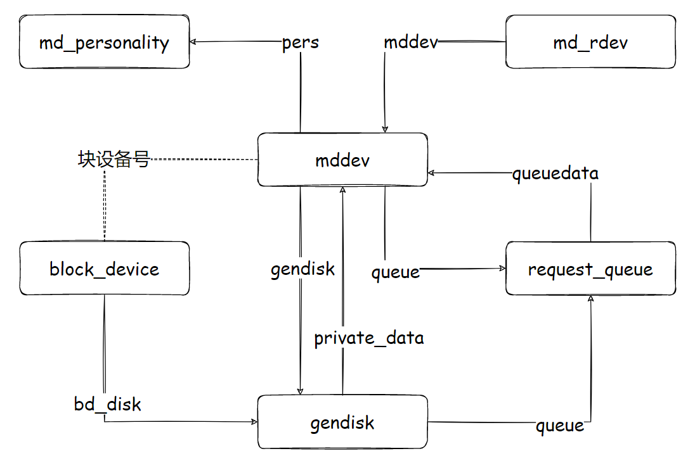

本系列分析基于 CentOS 7（linux-3.10.0-957.21.3.el7） 版本，如有描述错误或不妥之处，敬请指出！

---

# 概述

我们知道，RAID 技术是利用多个块设备来模拟一个单个的块设备。Linux 内核在多个块设备的基础上，注册了一个特殊的块设备，称为 Multi-Disk（MD）设备，这个 MD 设备形成了一个逻辑层，支持不同级别的 RAID 技术。

MD 模块是一个虚拟块设备层，它属于块 I/O 子系统中的块设备驱动层，架构于物理块设备层，比如 SCSI 磁盘驱动之上。MD 模块分为两层：

-   **RAID 共性层**：也被称为 RAID 公共层，它提取各种级别的 RAID 的公共特性，依照块设备的实现模板向上层注册，同时向 RAID 个性层提供公共函数，以及接口注册函数；
-   **RAID 个性层**：是各种级别 RAID 的个性体现，它向 RAID 公共层注册个性接口，利用 RAID 公共层提供的公共函数，基于低层实现个性化功能。RAID 个性以独立模块的形式实现，可以动态加载。

MD 设备（也称为 RAID 设备）可以通过用户空间的 RAID 管理工具如 mdadm 进行创建、删除、管理和监视 Linux 软件 RAID。

核心 MD 设备结构 mddev 及其成员磁盘设备结构 md_rdev 是系统中的两个关键结构。核心 MD 设备结构 mddev 是内核中 RAID 设备保存自身信息的结构体，它包括了完整的 RAID 设备的信息。成员磁盘设备结构 md_rdev 反映了组成MD设备的底层块设备的信息。两个结构相互关联。

MD 设备可以有不同的个性，它指向一个 MD 个性结构，其中给出这种个性 MD 设备的操作表。此外，它还指向一个私有数据结构，即操作的最终数据，MD 私有数据结构的定义根据 MD 个性的不同而不同。

MD 设备作为一个虚拟磁盘类设备，它有所有磁盘类设备共有的性质，比如，也和一个对应的通用磁盘描述符（gendisk）相互关联，并且都指向一个相同的请求队列描述符。

MD 设备通过块设备号和块设备描述符（block_device）关联起来，低层成员磁盘也指向和它相对应的块设备描述符，正是以块设备描述符为纽带，使得 MD 可以构建在其他的物理或虚拟磁盘设备之上，成为一个栈式块设备。MD 对象之间的关系如图所示：

 


---

# mddev：RAID设备

在 MD 模块中，表示 RAID 设备的数据结构是 mddev，其结构中的域如下：

```c
struct mddev {
	/* 指向个性化数据的指针 */
	void				*private;
	/* 指向个性化操作的指针 */
	struct md_personality		*pers;
	/* MD 设备的设备号 */
	dev_t				unit;
	/* MD 设备的次设备号 */
	int				md_minor;
	/* 这个 MD 设备的所有成员设备链表的表头 */
	struct list_head		disks;
	/* MD 设备标志 */
	unsigned long			flags;
#define MD_ARRAY_FIRST_USE 3    /* First use of array, needs initialization */
#define MD_CLOSING	4			/* If set, we are closing the array, do not open it then */
#define MD_JOURNAL_CLEAN 5		/* A raid with journal is already clean */
#define MD_HAS_JOURNAL	6		/* The raid array has journal feature set */
#define	MD_FAILFAST_SUPPORTED 7	/* Using MD_FAILFAST on metadata writes is
				 				 * supported as calls to md_error() will
								 * never cause the array to become failed.
								 */
#define	MD_NEED_REWRITE	8		/* metadata write needs to be repeated */
	unsigned long			sb_flags;

	/* 为 1 表示 MD 设备已经被挂起 */
	int				suspended;
	/* 活动 IO 计数器，发给个性处理前加一，处理结束后减一 */
	atomic_t			active_io;
  	/* 0 表示可写，1 表示只读，2 表示只读，但是第一次可写 */
	int				ro;
	/* set when sysfs deletes are happening, so run/takeover/stop are not safe */
	int				sysfs_active; 
	/* 指向通用磁盘结构的指针 */
	struct gendisk			*gendisk;

	/* 内嵌 kobject */
	struct kobject			kobj;
	/*
	 * MD 设备保持活动到什么时候，
	 * UNTIL_IOCTL 保持到 IOCTL 结束，UNTIL_STOP 保持到 MD 设备停止。
	 * 0 表示可以释放
	 */
	int				hold_active;
#define MD_HAS_PPL 9           /* The raid array has PPL feature set */
#define MD_HAS_MULTIPLE_PPLS 10 /* The raid array has multiple PPLs feature set */
#define MD_ALLOW_SB_UPDATE 11   /* md_check_recovery is allowed to update
				 				 * the metadata without taking reconfig_mutex.
				 				 */
#define MD_UPDATING_SB 12       /* md_check_recovery is updating the metadata
				 				 * without explicitly holding reconfig_mutex.
				 				 */
#define	UNTIL_IOCTL	1
#define	UNTIL_STOP	2

	/* Superblock information */
	int				major_version,	// 主版本号
					minor_version,	// 次版本号
					patch_version;	// 补丁版本号
	int				persistent;		// MD 设备是否有持久化的超级块
	int				external;		// 为 1 表示元数据由外部管理（如用户空间）
	/*
	 * 当 external 为 1 时有效，反映元数据的类型。
	 * sysfs 文件系统中的 metadata 属性文件的内容取决于三个域：
	 * persistent=1，external=0，显示 major.minor
	 * persistent=0，external=1，显示 external:xxx，其中 xxx 为此域内容
	 * persistent=0，external=0，显示 none
	 */
	char				metadata_type[17];
	/*
	 * MD 设备的数据被划分为多个 chunk，循环保存在成员磁盘上。
	 * chunk_sectors 表示以扇区为单位的 chunk 长度。
	 */
	int				chunk_sectors;		
	time_t				ctime, utime;	// MD 设备创建时间，超级块修改时间
	int				level, layout;		// MD 设备的级别、布局（比如 RAID5 的左右对称不对称）
	char				clevel[16];		// MD 设备的级别（字符串形式）
	int				raid_disks;			// MD 设备的成员磁盘数目
	int				max_disks;			// MD 设备的最大成员磁盘数目
	sector_t			dev_sectors;	// 这个成员磁盘用于阵列数据的扇区数
	sector_t			array_sectors; 	// 导出的阵列长度
	int				external_size; 		// 外部管理的长度
	/*
	 * MD 设备的更新计数器，在创建 MD 设备时清零，
	 * 每次发生重大事件如启动停止阵列、添加磁盘、备用盘激活等时递增一次，
	 * 因此比较从各个成员磁盘读取的超级块的这个计数器可以知道哪个成员磁盘更新
	 */
	__u64				events;
	/* If the last 'event' was simply a clean->dirty transition, and
	 * we didn't write it to the spares, then it is safe and simple
	 * to just decrement the event count on a dirty->clean transition.
	 * So we record that possibility here.
	 */
	int				can_decrease_events;

	char				uuid[16];	// MD 设备的唯一标识符

	/*
	 * 记录上次 reshape 到的位置，
	 * 下次启动 RAID 设备时可以从这个位置开始继续 reshape 而无需重新来过。
	 * 为 MaxSector 表示没有进行 reshape 或 reshape 已经完成。
	 */
	sector_t			reshape_position;
	/* reshape 后成员磁盘数目的改变，新的 raid 级别和布局 */
	int				delta_disks, new_level, new_layout;
	
	int				new_chunk_sectors;	// reshape 新的 chunk 长度
	int				reshape_backwards;

	/*
	 * 指向管理线程描述符的指针，仅适用于某些 RAID 个性，
	 * 例如 raid5 内核线程循环处理 stripe_head
	 */
	struct md_thread		*thread;	/* management thread */
	/*
	 * 指向同步线程描述符的指针，仅适用于某些 RAID 个性，
	 * 例如 resync 内核线程被用来处理同步、恢复、reshape 等。
	 */
	struct md_thread		*sync_thread;	/* doing resync or reconstruct */

	/* 'last_sync_action' is initialized to "none".  It is set when a
	 * sync operation (i.e "data-check", "requested-resync", "resync",
	 * "recovery", or "reshape") is started.  It holds this value even
	 * when the sync thread is "frozen" (interrupted) or "idle" (stopped
	 * or finished).  It is overwritten when a new sync operation is begun.
	 */
	char				*last_sync_action;

	sector_t			curr_resync;	// 最近已调度的块
	/* 
	 * 因为同步请求块可能以随即次序完成，我们不容易追踪到已经完成了多少同步。
	 * 因此时不时暂停一下，等到所有的已发起的同步请求都完成，
	 * 然后设置 curr_resync_completed 为 curr_resync。
	 * 严格来说，它可能远远在真实的同步采集点之后，但它是我们可以确定的值。
	 */
	sector_t			curr_resync_completed;
	/* 用于计算同步速度的样本采集，最近采集点的时间戳 */
	unsigned long			resync_mark;	/* a recent timestamp */
	/* 用于计算同步速度的样本采集，最近采集点的已同步块数 */
	sector_t			resync_mark_cnt;/* blocks written at resync_mark */
	/* 当前已调度的块数 */
	sector_t			curr_mark_cnt; /* blocks scheduled now */

	/* 所需要同步的最大扇区数，可以由个性设置 */
	sector_t			resync_max_sectors; /* may be set by personality */

 	/* parity/replica 发现的不一致的扇区数 */
	atomic64_t			resync_mismatches; 

	/* lo 和 hi 都是扇区编号，落在这个范围内的 IO 将被阻塞 */
	sector_t			suspend_lo;
	sector_t			suspend_hi;
	/* 
	 * 为了充分利用 CPU 资源，同时又不至于冲击正常 IO，为 RAID 的同步设定一个保证的速度范围。
	 * 如果同步速度过快，则在同步过程中适当休眠。
	 * sync_speed_min 为最小保证同步速度，sync_speed_max 为最大保证同步速度。
	 * if zero, use the system-wide default 
	 */
	int				sync_speed_min;
	int				sync_speed_max;

	/*
	 * 如果为 1 表示即使有其他共享相关的 RAID 设备正在进行或准备开始同步时，
	 * 也允许本 RAID 设备的同步进行。
	 */
	int				parallel_resync;

	/*
	 * 如果某些 RAID 设备既脏又降级，可能包含了没有被检测的数据损坏。
	 * 因此，通常会拒绝启动这种设备。
	 * 但如果此域为 1 表示将绕过检查，运行脏的降级阵列被启动起来。
	 */
	int				ok_start_degraded;
	/* recovery/resync flags
	 * NEEDED:   we might need to start a resync/recover
	 * RUNNING:  a thread is running, or about to be started
	 * SYNC:     actually doing a resync, not a recovery
	 * RECOVER:  doing recovery, or need to try it.
	 * INTR:     resync needs to be aborted for some reason
	 * DONE:     thread is done and is waiting to be reaped
	 * REQUEST:  user-space has requested a sync (used with SYNC)
	 * CHECK:    user-space request for check-only, no repair
	 * RESHAPE:  A reshape is happening
	 * ERROR:    sync-action interrupted because io-error
	 *
	 * If neither SYNC or RESHAPE are set, then it is a recovery.
	 */
#define	MD_RECOVERY_RUNNING	0
#define	MD_RECOVERY_SYNC	1
#define	MD_RECOVERY_RECOVER	2
#define	MD_RECOVERY_INTR	3
#define	MD_RECOVERY_DONE	4
#define	MD_RECOVERY_NEEDED	5
#define	MD_RECOVERY_REQUESTED	6
#define	MD_RECOVERY_CHECK	7
#define MD_RECOVERY_RESHAPE	8
#define	MD_RECOVERY_FROZEN	9
#define	MD_RECOVERY_ERROR	10
#define MD_RECOVERY_WAIT	11

	unsigned long			recovery;	// 同步/恢复等标志
	/* 
	 * 如果为 1 表示禁止恢复尝试。
	 * 例如 RAID0 设备只有一个成员盘，恢复没必要进行。
	 */
	int				recovery_disabled;

	/*
	 * 如果为 1，表示这个 RAID 处于同步状态，不需要同步。
	 * 因为只有写操作才能导致条带不同步的情况，
	 * 比如在没有同时写入数据单元的校验单元时掉电。
	 * 因此，再发起写操作时清零，所有单元都成功写入后，再次设置。
	 */
	int				in_sync;	/* know to not need resync */
	/* 'open_mutex' avoids races between 'md_open' and 'do_md_stop', so
	 * that we are never stopping an array while it is open.
	 * 'reconfig_mutex' protects all other reconfiguration.
	 * These locks are separate due to conflicting interactions
	 * with bdev->bd_mutex.
	 * Lock ordering is:
	 *  reconfig_mutex -> bd_mutex : e.g. do_md_run -> revalidate_disk
	 *  bd_mutex -> open_mutex:  e.g. __blkdev_get -> md_open
	 */
	struct mutex			open_mutex;
	struct mutex			reconfig_mutex;
	atomic_t			active;		// 引用计数器
	atomic_t			openers;	// 这个阵列被打开的次数

	int				changed;	// 如果为 1 表示需要重新读入分区信息
	int				degraded;	// 已经故障 成员磁盘数目
 	int				merge_check_needed; /* at least one member device has a merge_bvec_fn */

	/*
	 * 已经调度，但没有写入的块。
	 * 在提交同步请求时增加，在同步完成回调函数中减少。
	 */
	atomic_t			recovery_active; /* blocks scheduled, but not written */
	/*
	 * 同步/恢复等待队列。
	 * 在同步/恢复过程中，有时需要在此队列上等候，直到已经发起的同步/恢复请求完成
	 */
	wait_queue_head_t		recovery_wait;
	/*
	 * 记录上次同步的位置，下次启动 RAID 时可以从这个位置开始同步而无需从头来过。
	 * 为 MaxSector 表示没有进行同步，或同步已完成。
	 * 精确地说，这仅用于同步，恢复的当前位置被记录在要恢复成员磁盘的 recovery_offset 域。
	 */
	sector_t			recovery_cp;
	sector_t			resync_min;	// 用户请求同步从这里开始
	sector_t			resync_max;	// 用户请求同步到这里结束

	/*
	 * 被用来向用户空间传递 RAID 设备的持续改变的状态信息，
	 * 对应 sysfs 中 RAID 设备目录下的 array_state。
	 * sysfs_action 同理，用来向用户空间传递 RAID 设备的持续改变的同步动作。
	 */
	struct kernfs_node		*sysfs_state;	/* handle for 'array_state' file in sysfs. */
	struct kernfs_node		*sysfs_action;  /* handle for 'sync_action' */

	struct work_struct del_work;	/* used for delayed sysfs removal */

	/* "lock" protects:
	 *   flush_bio transition from NULL to !NULL
	 *   rdev superblocks, events
	 *   clearing MD_CHANGE_*
	 *   in_sync - and related safemode and MD_CHANGE changes
	 *   pers (also protected by reconfig_mutex and pending IO).
	 *   clearing ->bitmap
	 *   clearing ->bitmap_info.file
	 *   changing ->resync_{min,max}
	 *   setting MD_RECOVERY_RUNNING (which interacts with resync_{min,max})
	 */
	spinlock_t			lock;
	/*
	 * 超级块更新等待队列，要等待更新完成的进程将被挂在此队列上，更新回调函数负责唤醒。
	 * 这个队列用于其他目的例如 MD 设备 suspend 需要等待所有发送给 MD 个性的 IO 完成，
	 * 在屏障处理时后续请求需要等待屏障处理完成等。
	 */
	wait_queue_head_t		sb_wait;	/* for waiting on superblock updates */
	/* 活动的超级块写的数目 */
	atomic_t			pending_writes;	/* number of active superblock writes */

	/* if set, update "clean" superblock when no writes pending. */
	unsigned int			safemode;
	/* 用于安全模式 1 的超时时间 */
	unsigned int			safemode_delay;
	/*
	 * 用于安全模式 1 的定时器。
	 * 在完成写请求后的 md_write_end 函数中设置，在开始写请求的 md_write_start 中删除。
	 */
	struct timer_list		safemode_timer;
	/* 正在处理的写请求数目，md_write_start 中递增，md_write_end 中递减 */
	struct percpu_ref		writes_pending;
	int				sync_checkers;	/* # of threads checking writes_pending */
	struct request_queue		*queue;	// 这个 MD 的请求队列

	/* 指向 MD 设备位图描述符的指针，某些个性为 NULL */
	struct bitmap			*bitmap; /* the bitmap for the device */
	struct {
		/* 位图文件 */
		struct file		*file; /* the bitmap file */
		/* 
		 * 位图起始位置相对于超级块的偏移，可以为负但不能为 0.
		 * 对于外部管理的元数据，为相对于设备开始的偏移。
		 */
		loff_t			offset; 
		unsigned long		space; /* space available at this offset */
		/* 这是当前插入位图时使用的偏移值，它最终应该可以通过 sysfs 来设置 */
		loff_t			default_offset; 
		/* space available at default offset */
		unsigned long		default_space; 
		/* 用户保护的互斥量 */
		struct mutex		mutex;
		/* 位图每一位表示 MD 设备一个 chunk 的同步情况，这个域记录 chunk 长度 */
		unsigned long		chunksize;
		/*
		 * 位图中设置的位可以延迟清零，因为位的清除不是很关键，
		 * 即使这个信息丢失，最多不过是多余的同步操作而已，没有副作用。
		 * 位清零由后台进程负责，这个域记录了后台进程两次运行之间额间隔。
		 */
		unsigned long		daemon_sleep; /* how many jiffies between updates? */
		unsigned long		max_write_behind; /* write-behind mode */
		/* 为 1 表示外部管理位图 */
		int			external;
	} bitmap_info;

	/* 最大重试次数 */
	atomic_t			max_corr_read_errors;
	/* 链接到所有 MD 设备链表的连接件 */
	struct list_head		all_mddevs;

	struct attribute_group		*to_remove;

	struct bio_set			*bio_set;
	/* for sync operations like metadata and bitmap writes */
	struct bio_set			*sync_set; 

	mempool_t			*flush_pool;
	mempool_t			*flush_bio_pool;
	struct work_struct event_work;	/* used by dm to report failure event */
	void (*sync_super)(struct mddev *mddev, struct md_rdev *rdev);
	unsigned int			good_device_nr;	/* good device num within cluster raid */

	bool	has_superblocks:1;
};
```

系统当前所有的 MD 设备组织成一个链表，全局变量 all_mddevs 为这个链表的表头，MD 设备通过 all_mddevs 域链入到这个链表中。类似地，MD 设备的所有成员磁盘也组织成一个链表，MD 设备的 disks 域为这个链表的表头，成员磁盘通过 same_set 域链入到这个链表。

两个 RAID 设备如果它们有成员磁盘属于同一个物理磁盘，比如是该物理磁盘的两个不同分区，那么它们是共享相关的。

RAID 设备的成员设备物理上要独立不相关，对一个物理磁盘上的多个分区做 RAID 是没有价值的，因为不但违背了 RAID 阵列中成员磁盘独立性的原则，不能增加阵列的可靠性，当这个物理磁盘失效后必然不可避免地导致数据丢失；而且还会使得阵列的性能显著降低，当数据读／写时磁头在物理磁盘的多个分区上来回抖动带来长时间的搜索耗时。

当然，我们允许用户在知晓其中利弊的情况下有限使用，parallel_resync 就是为此提供的一个域。

当 MD 阵列在一段时间没有看到写请求时，它将被标记为 Clean。在另一个写请求到来时，在写开始之前阵列被标记为 Dirty。这就是 safemode 域表示的安全模式，取值 0、1 和 2。如果被设置为 1，表示在一段时间没有待处理的写请求时（一般为几秒），更新超级块，将它标记为 Clean，以减少在重启时将阵列被认作脏的机会。在超级块更新，设置了 Clean 标志后，又将 safemode 域清零。安全模式 2 也被称为立即安全模式，是上面的超时时间值为 0 的情况，也就是说，一旦没有等待处理的写请求，或所有当前写请求都已执行完成，就理解将 MD 阵列标记为 Clean。如果设置为 2，在没有待处理的写请求时更新 Clean 超级块。


---

# md_rdev：成员磁盘

我们这里将 MD 设备的底层块设备称为成员磁盘，但实际上它不限于磁盘设备，有可能是分区、逻辑卷等。在 MD 模块中，表示成员磁盘的数据结构是 md_rdev。

```c
struct md_rdev {
	/* 链入到所属 MD 设备所有成员磁盘链表的连接件 */
	struct list_head same_set;	/* RAID devices within the same set */

	/* 成员磁盘的长度 */
	sector_t sectors;		/* Device size (in 512bytes sectors) */
	/* 指向所属 MD 对象 */
	struct mddev *mddev;		/* RAID array if running */
	/* IO 事件时间戳，用来判断 MD 设备最近是否空闲，以决定同步是否给正常 IO 让路*/
	int last_events;		/* IO event timestamp */

	/*
	 * If meta_bdev is non-NULL, it means that a separate device is
	 * being used to store the metadata (superblock/bitmap) which
	 * would otherwise be contained on the same device as the data (bdev).
	 */
	struct block_device *meta_bdev;
	/* 指向该成员磁盘所对应的块设备描述符 */
	struct block_device *bdev;	/* block device handle */

	/* 指向保存该成员磁盘上 RAID 超级块的页面 */
	struct page	*sb_page, *bb_page;
	/* 为 1 表示该成员磁盘上的 RAID 超级块已经被读入内存 */
	int		sb_loaded;
	/* 保存 RAID 超级块的更新计数器 */
	__u64		sb_events;
	/* 这个成员磁盘在阵列数据中的起始位置 */
	sector_t	data_offset;	/* start of data in array */
	sector_t	new_data_offset;/* only relevant while reshaping */
	/* RAID 超级块保存在成员磁盘上的起始扇区号 */
	sector_t	sb_start;	/* offset of the super block (in 512byte sectors) */
	/* 超级块的字节数 */
	int		sb_size;	/* bytes in the superblock */
	/* 在自动运行 MD 设备时采用的次设备号 */
	int		preferred_minor;	/* autorun support */

	struct kobject	kobj;

	/* A device can be in one of three states based on two flags:
	 * Not working:   faulty==1 in_sync==0
	 * Fully working: faulty==0 in_sync==1
	 * Working, but not
	 * in sync with array
	 *                faulty==0 in_sync==0
	 *
	 * It can never have faulty==1, in_sync==1
	 * This reduces the burden of testing multiple flags in many cases
	 */

	unsigned long	flags;	/* bit set of 'enum flag_bits' bits. */
	/*
	 * 等待该成员设备解除阻塞的等待队列。
	 * 如果请求处理依赖于这个被阻塞的成员磁盘，则在此队列上传。
	 * 成员磁盘解除阻塞时唤醒队列的等待线程。
	 */
	wait_queue_head_t blocked_wait;

	/* 本成员磁盘在 MD 超级块中的描述符索引 */
	int desc_nr;			/* descriptor index in the superblock */
	/* 成员磁盘在阵列中的角色 */
	int raid_disk;			/* role of device in array */
	/* role that the device will have in the array after a level-change completes. */
	int new_raid_disk;		
	/* role that device used to have in the array and could again 
	 * if we did a partial resync from the bitmap
	 */
	int saved_raid_disk;		
	union {
		/* 如果这个部分已经被部分恢复，这个域反映了已恢复的位置 */
		sector_t recovery_offset;
		/* 如果这个设备是日志设备，这个域是日志开始恢复的指针 */
		sector_t journal_tail;
	};

	/* 正在处理的请求数目，只为支持热移除的阵列维护 */
	atomic_t	nr_pending;
	/* 连续读错误的次数，超过一定值使磁盘失效 */
	atomic_t	read_errors;
	/* 距上次读错误以来过去的时间 */
	struct timespec last_read_error;
	/* 纠正了的读错误数目，为了要报告到用户空间，并保存到超级块里 */
	atomic_t	corrected_errors; 
	/* 在销毁此结构时需要延迟 */
	struct work_struct del_work;	/* used for delayed sysfs removal */

	/* 被用来向用户空间传递成员磁盘的持续改变的状态信息 */
	struct kernfs_node *sysfs_state; /* handle for 'state' sysfs entry */

	struct badblocks badblocks;

	struct {
		/* Offset from superblock to start of PPL. Not used by external metadata. */
		short offset;	
		unsigned int size;	/* Size in sectors of the PPL space */
		sector_t sector;	/* First sector of the PPL space */
	} ppl;
};
```

成员磁盘描述符通过 mddev 域指向所属 MD 设备描述符，并且通过 same_set 域链入到后者的成员磁盘链表中。此外，bdev 域为指向该成员磁盘所对应的块设备描述符的指针。

一个 MD 设备由多个成员磁盘组成，每个成员磁盘保存由从它自身角度理解的 RAID 超级块结构，位置和长度分别记录在 sb_start 域和 sb_size 域。

sb_events 域记录这个成员磁盘保存的 RAID 超级块的更新计数器，每次更新 RAID 超级块时递增。因此，该值越大表明 RAID 超级块越新。装载 MD 设备时，从所有成员磁盘读取 RAID 超级块，从中取出最新的作为 MD 设备的 RAID 超级块。

sb_loaded 域表示该成员磁盘的 RAID 超级块是否已被读入内存，若是 sb_page 域为指向保存 RAID 超级块的页面的指针。


---

# md_personality：MD个性

我们前面提到过，MD 驱动程序实现支持不同级别的 RAID，如线性 RAID、RAID0、RAID1 和 RAID5 等。这些 RAID 级别也可以理解为 MD 个性，它们需要执行一些自己专有代码以完成工作。这主要得益于核心 MD 设备结构（mddev）中两个和个性化相关的域：

-   pers 为 MD 设备的个性化结构指针，给出了与 RAID 级别相关的信息，包括不同 RAID 级别名称以及各种与 RAID 级别相关的处理函数（打开、关闭、I/O请求处理、状态检测与设置、错误处理）；
-   private 为 MD 设备的私有数据，对于线性 RAID、RAID0、RAID1 和 RAID5，分别为 linear_conf_t、raid0_conf_t、raid1_conf_t 和 raid5_conf_t 结构的指针。

在 RAID 设备运行时，根据配置信息构建 MD 设备的私有数据结构，并关联到对应的 MD 个性结构，后者相当于一些操作表，前者是所操作的数据。两者相互结合，可以完成各种 RAID 级别所必须的处理。

md_personality 成员结构如下：

```c
struct md_personality
{
	/* RAID 个性的名字 */
	char *name;
	/* RAID 个性的级别 */
	int level;
	/* 所有注册到系统的 RAID 个性被加入一个链表 */
	struct list_head list;
	/* 指向实现这个 MD 个性的模块的指针 */
	struct module *owner;
    
	/* 在将请求传递给这种个性的 RAID 设备时被调用，执行个性化的处理逻辑 */
	bool (*make_request)(struct mddev *mddev, struct bio *bio);
	/*
	 * start up works that do NOT require md_thread. tasks that
	 * requires md_thread should go into start()
	 */
	int (*run)(struct mddev *mddev);
	/* start up works that require md threads */
	int (*start)(struct mddev *mddev);
	void (*free)(struct mddev *mddev, void *priv);
	void (*status)(struct seq_file *seq, struct mddev *mddev);
	/* 检测到某个成员磁盘发生故障时调用 */
	void (*error_handler)(struct mddev *mddev, struct md_rdev *rdev);
	/* 热添加磁盘时调用 */
	int (*hot_add_disk) (struct mddev *mddev, struct md_rdev *rdev);
	/* 热移除磁盘时调用 */
	int (*hot_remove_disk) (struct mddev *mddev, struct md_rdev *rdev);
	/* 设备从故障中恢复而需要激活备用盘时调用 */
	int (*spare_active) (struct mddev *mddev);
	/* 设备进行同步时调用 */
	sector_t (*sync_request)(struct mddev *mddev, sector_t sector_nr, int *skipped);
	/* 变更容量时调用 */
	int (*resize) (struct mddev *mddev, sector_t sectors);
	/* 计算设备长度时调用 */
	sector_t (*size) (struct mddev *mddev, sector_t sectors, int raid_disks);
	/* 检查有效性，进行一些可以立即开始的处理，例如添加设备到 RAID1 */
	int (*check_reshape) (struct mddev *mddev);
	/* 开始 reshape 时调用 */
	int (*start_reshape) (struct mddev *mddev);
	/* 结束 reshape 时调用 */
	void (*finish_reshape) (struct mddev *mddev);
	/* quiesce suspends or resumes internal processing.
	 * 1 - stop new actions and wait for action io to complete
	 * 0 - return to normal behaviour
	 */
	void (*quiesce) (struct mddev *mddev, int quiesce);
	/* takeover is used to transition an array from one
	 * personality to another.  The new personality must be able
	 * to handle the data in the current layout.
	 * e.g. 2drive raid1 -> 2drive raid5
	 *      ndrive raid5 -> degraded n+1drive raid6 with special layout
	 * If the takeover succeeds, a new 'private' structure is returned.
	 * This needs to be installed and then ->run used to activate the
	 * array.
	 */
	void *(*takeover) (struct mddev *mddev);
	/* congested implements bdi.congested_fn().
	 * Will not be called while array is 'suspended' */
	int (*congested)(struct mddev *mddev, int bits);
	/* mergeable_bvec is use to implement ->merge_bvec_fn */
	int (*mergeable_bvec)(struct mddev *mddev,
			      struct bvec_merge_data *bvm,
			      struct bio_vec *biovec);
	/* Changes the consistency policy of an active array. */
	int (*change_consistency_policy)(struct mddev *mddev, const char *buf);
};
```

Linux 内核将系统支持的所有 MD 个性组织为一个链表，全局链表 pers_list 为这个链表的表头，MD 个性通过 list 域链入到这个链表中。

在每种 RAID 级别的模块加载时，调用 register_md_personality 注册其个性化结构，在链表中增加一个相应项；而在卸载该模块时，调用其 unregister_md_personality 注销 MD 个性化结构，从链表中删除相应项。

​	