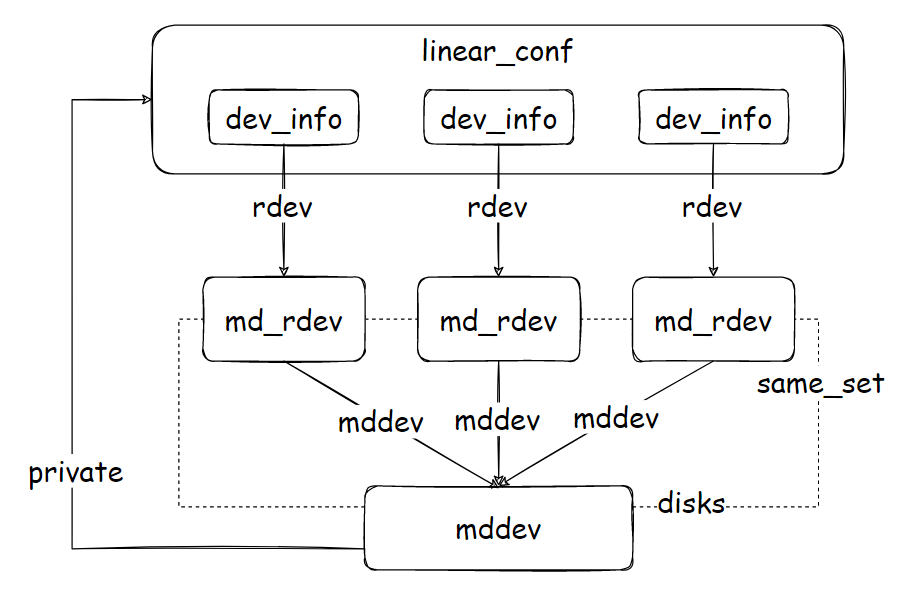

# md_make_request

MD 模块中提供了一个通用的接口函数 md_make_request 作为各种级别 RAID 设备的 IO 请求的入口。加载 MD 模块时，调用 blk_queue_make_request 函数将所有对主设备号为 MD_MAJOR 的 IO 请求都转发到这个函数。但这个函数并不执行真正处理，只是通过映射找到块设备次设备号对应 MD 设备结构，进而获得其个性化结构指针，调用个性化结构的 make_request，即通过和该 RAID 级别对应的请求处理函数来处理这个请求。

这个函数基本上调用 MD 个性的 make_request 回调函数，但增加了各种个性共有的处理如 suspended 处理。

```c
static void md_make_request(struct request_queue *q, struct bio *bio)
{
	const int rw = bio_data_dir(bio);
	struct mddev *mddev = q->queuedata;
	int cpu;
	unsigned int sectors;

	/*
	 * 确保保存在请求队列 queuedata 域的 MD 设备描述符不为 NULL，
	 * 并且 MD 设备的个性化指针不为 NULL。
	 * 若不满足，则调用 bio_io_error 向上层直接报告错误。
	 */
	if (mddev == NULL || mddev->pers == NULL) {
		bio_io_error(bio);
		return;
	}
	if (mddev->ro == 1 && unlikely(rw == WRITE)) {
		bio_endio(bio, bio_sectors(bio) == 0 ? 0 : -EROFS);
		return;
	}

	/* save the sectors now since our bio can go away inside make_request */
	sectors = bio_sectors(bio);
	/* bio could be mergeable after passing to underlayer */
	bio->bi_rw &= ~REQ_NOMERGE;
	md_handle_request(mddev, bio);

	cpu = part_stat_lock();
	part_stat_inc(cpu, &mddev->gendisk->part0, ios[rw]);
	part_stat_add(cpu, &mddev->gendisk->part0, sectors[rw], sectors);
	part_stat_unlock();
}
```

md_handle_request 检查如果 MD 设备处于 suspended 状态则循环在 sb_wait 等待队列上等待直至 suspended 域为非空。MD 设备恢复（mddev_resume 函数）会负责唤醒在该队列上等待的进程，使它们有机会判断是否需要继续等待，或者退出该循环。这是 sb_wait 域重用的一种表现。

调用 MD 个性的 make_request 回调函数，不过在调用之前，先递增 active_io 计数器，在返回之后，再递减该计数器。尽管调用 MD 个性的 make_request 函数返回并不表明请求已经处理完，但至少说明请求已经交付给低层成员磁盘处理，或者已经被重定向到低层成员磁盘，已经和 MD 设备不相干了。想要 suspend MD 设备的进程可被挂在 sb_wait 队列上，MD 设备的 active_io 计数器为零正是唤醒它的时机，不过还要确保 MD 设备的 suspended 域已经设置（参见 md_suspend函数）。这里，sb_wait 域又一次被重用，不过作为另一个用途。

```c
void md_handle_request(struct mddev *mddev, struct bio *bio)
{
check_suspended:
	rcu_read_lock();
	/*
	 * 如果 MD 设备处于 suspended 状态则循环在 sb_wait 等待队列上等待，
	 * 直至 suspended 域为非空。
	 * MD 设备恢复（mddev_resume 函数）会负责唤醒在该队列上等待的进程，
	 * 使它们有机会判断是否需要继续等待，或者退出该循环。
	 */
	if (is_suspended(mddev, bio)) {
		DEFINE_WAIT(__wait);
		for (;;) {
			prepare_to_wait(&mddev->sb_wait, &__wait,
					TASK_UNINTERRUPTIBLE);
			if (!is_suspended(mddev, bio))
				break;
			rcu_read_unlock();
			schedule();
			rcu_read_lock();
		}
		finish_wait(&mddev->sb_wait, &__wait);
	}
	atomic_inc(&mddev->active_io);
	rcu_read_unlock();

	/*
	 * 调用 MD 个性的 make_request 回调函数，
	 * 不过在调用之前，先递增 active_io 计数器，在返回之后，再递减该计数器。
	 * 尽管调用 MD 个性的 make_request 函数返回并不表明请求已经处理完，
	 * 但至少说明请求已经交付给低层成员磁盘处理或者已经被重定向到低层成员磁盘，
	 * 已经和 MD 设备"不相干"了。
	 */
	if (!mddev->pers->make_request(mddev, bio)) {
		atomic_dec(&mddev->active_io);
		wake_up(&mddev->sb_wait);
		goto check_suspended;
	}

	if (atomic_dec_and_test(&mddev->active_io) && mddev->suspended)
		wake_up(&mddev->sb_wait);
}
```

​	


---

# MD 个性化编程模式

MD 模块中包括了可供块 I/O 子系统和个性化模块调用的公共函数。不同的 RAID 级别可用独立的模块来实现，每个个性化模块可支持多种 RAID 级别。个性化模块向 MD 模块注册，在其回调函数中调用 MD 模块的公共函数。而 MD 模块在提供给块 I/O 子系统或个性化模块的公共函数在涉及个性化处理时，又需要调用个性化模块中的回调函数来实现。

MD 个性化模块遵循特定的编程模式，下面以 Linux 线性 RAID 为例说明。


## 定义私有数据结构

在线性 RAID 中，MD 设备是由多个成员磁盘串联而成的，我们写完第一个磁盘空间再去写第二个磁盘空间，依次类推。对于给定位置的请求操作，我们可以逐个和成员磁盘的偏移进行比较，从而找到这个位置所在的成员磁盘以及它转换到这个成员磁盘上的位置。

通常的实现方法是在线性 RAID 的私有数据结构 linear_conf 中保存所有成员磁盘的设备信息，即下面结构中的 disks 数组。

```c
struct linear_conf
{
	struct rcu_head		rcu;
	sector_t		array_sectors;	/* 线性 MD 设备的总长度 */
	int			raid_disks; /* a copy of mddev->raid_disks */
	struct dev_info		disks[0];
};
```

在 linear_conf 结构中，定义了一个长度为 0 的 disks 数组，这是一个长度由运行时确定的数组，因为只有创建 RAID0 设备时才能知道它的成员磁盘的具体数目。分配 linear_conf 时附带分配了所需的成员磁盘空间。其中，每个成员磁盘的设备信息结构为 dev_info。

```c
struct dev_info {
	struct md_rdev	*rdev;	/* 指向该成员的 md_rdev */
	sector_t	end_sector;	/* 成员磁盘的结束扇区编号 */
};
```

对于线性 RAID 来说，MD 设备描述符的 private 域指向线性 RAID 的私有数据结构 linear_conf。后者由多个成员磁盘组成，每个成员磁盘给出了它在线性 RAID 中的结束扇区编号，以及对应的成员磁盘描述符 md_rdev，而成员磁盘描述符被链入 MD 设备描述符的成员磁盘链表，并且有指针指向 MD 设备。

 


## 声明个性化结构

Linear MD 模块定义一个类型为 md_personality 的静态变量。在这个静态变量中，指定名字为 linear，级别为 LEVEL_LINEAR，并实现了其中部分方法。所有声明时未赋值的方法都是未实现的，编译器会将它们的值设定为 NULL。

```c
static struct md_personality linear_personality =
{
	.name		= "linear",
	.level		= LEVEL_LINEAR,
	.owner		= THIS_MODULE,
	.make_request	= linear_make_request,
	.run		= linear_run,
	.free		= linear_free,
	.status		= linear_status,
	.hot_add_disk	= linear_add,
	.size		= linear_size,
	.quiesce	= linear_quiesce,
	.congested	= linear_congested,
	.mergeable_bvec	= linear_mergeable_bvec,
};
```


## 实现个性方法

### run

个性化结构中的 run 方法，在运行 MD 设备时被调用，它的主要目的是建立个性化数据结构，为后续对 MD 设备的请求处理做准备。Linux 线性 RAID 模块在声明个性化结构时，该回调函数被实例化为 linear_run。

linear_run 函数分配 linear_conf 结构，并设置为 mddev 的 private 域，根据阵列 mddev 的成员磁盘组成设置 linear_conf 的 disks 数组中各项设备信息（dev_info）的内容，以及 MD 设备的总长度。它还对线性设备的请求队列作一些设置，尤其是，比较各个低层设备的完整性 profile，看是否需要为线性设备注册完整性 profile。

```c
static int linear_run (struct mddev *mddev)
{
	struct linear_conf *conf;
	int ret;

	if (md_check_no_bitmap(mddev))
		return -EINVAL;
	conf = linear_conf(mddev, mddev->raid_disks);

	if (!conf)
		return 1;
	mddev->private = conf;
	md_set_array_sectors(mddev, linear_size(mddev, 0, 0));

	ret =  md_integrity_register(mddev);
	if (ret) {
		kfree(conf);
		mddev->private = NULL;
	}
	return ret;
}
```


### make_request

有 I/O 请求发送给 MD 设备，会被转递给个性化结构中的 make_request 方法。Linear MD 模块的实现先根据个性化结构找到应该承担这个 I/O 请求的成员磁盘，这里的可能情况是：

- I/O 请求范围落在一个成员磁盘，这时候，修改 bio 的 bi_bdev 和 bi_sector 域，返回 1。我们前面在块 I/O 子系统看到，这个 bio 会被重新提交执行，不过是在成员设备的请求队列上；
- I/O 请求范围跨过多个成员磁盘，这时需要把这个 bio **分裂处理**，让每个裂片落在一个成员磁盘，就可以调用 generic_make_request 处理它。块 I/O 子系统提供了函数 bio_split 简化此项操作，并确保在所有裂片请求成功完成后，原 I/O 请求的完成回调函数才会被调用（向上层报告）。如果一切正常，本函数返回 0。这样块 I/O 子系统知道请求已处理完成，包括以成功状态完成和以错误状态完成。

Linux 线性 RAID 模块在声明个性化结构时，make_request 回调函数被实例化为 linear_make_request，主要流程如下：

1.  如果请求大于一次请求扇区数，则分裂后调用 generic_make_request 处理
2.  which_dev 函数在 MD 设备中采用二分查找法找到包含给定扇区偏移的成员磁盘
3.  如果要访问的扇区编号落在已查找到成员磁盘的范围之外，向上层报告错误
4.  如果通用块层请求跨越了成员磁盘边界，必须分裂，也就是说将请求分为多个部分，分别发给不同的成员设备处理。分裂通用块层请求调用的是 bio_split，函数返回指向 bio_pair 结构的指针，其中 bio1 和 bio2 域分别为分裂后的两个通用块层请求。然后，对它们递归调用 linear_make_request。
5.  如果继续在这个函数内运行，那么说明通用块层请求完全落在这个成员磁盘的范围之内，这时只需要重定向。

```c
static bool linear_make_request(struct mddev *mddev, struct bio *bio)
{
	struct dev_info *tmp_dev;
	sector_t start_sector;
	unsigned int max_sectors = blk_queue_get_max_sectors(mddev->queue,
			bio->bi_rw);
	const unsigned long do_discard = (bio->bi_rw
					  & (REQ_DISCARD | REQ_SECURE));
	const unsigned long do_same = (bio->bi_rw & REQ_WRITE_SAME);

	if (unlikely(bio->bi_rw & REQ_FLUSH)) {
		md_flush_request(mddev, bio);
		return true;
	}

	/* 如果请求大于一次请求扇区数，则分裂 */
	if (!do_discard && !do_same && bio_sectors(bio) > max_sectors) {
		struct bio_pair2 *bp = bio_split2(bio, max_sectors);
		if (!bp) {
			bio_io_error(bio);
			return true;
		}

		generic_make_request(bp->bio1);
		generic_make_request(bp->bio2);
		bio_pair2_release(bp);
		return true;
	}

	/* 
	 * which_dev 在 MD 设备中采用二分查找法找到包含给定扇区偏移（编号）的成员磁盘，
	 * 返回指向对应 dev_info 描述符的指针。
	 * 然后计算包含该扇区的成员磁盘的起始扇区编号。
	 */
	tmp_dev = which_dev(mddev, bio->bi_sector);
	start_sector = tmp_dev->end_sector - tmp_dev->rdev->sectors;

	/* 如果要访问的扇区编号落在已查找到成员磁盘的范围之外，向上层报告错误 */
	if (unlikely(bio->bi_sector >= (tmp_dev->end_sector)
		     || (bio->bi_sector < start_sector))) {
		char b[BDEVNAME_SIZE];

		pr_err("md/linear:%s: make_request: Sector %llu out of bounds on dev %s: %llu sectors, offset %llu\n",
		       mdname(mddev),
		       (unsigned long long)bio->bi_sector,
		       bdevname(tmp_dev->rdev->bdev, b),
		       (unsigned long long)tmp_dev->rdev->sectors,
		       (unsigned long long)start_sector);
		bio_io_error(bio);
		return true;
	}
	/* 如果通用块层请求跨越了成员磁盘边界，必须分裂 */
	if (unlikely(bio_end_sector(bio) > tmp_dev->end_sector)) {
		/* This bio crosses a device boundary, so we have to split it. */
		struct bio_pair *bp;
		sector_t end_sector = tmp_dev->end_sector;

		bp = bio_split(bio, end_sector - bio->bi_sector);

		/* bio1 和 bio2 域分别为分裂后的两个通用块层请求。然后，对它们递归调用 linear_make_request */
		linear_make_request(mddev, &bp->bio1);
		linear_make_request(mddev, &bp->bio2);
		bio_pair_release(bp);
		return true;
	}

	/* 通用块层请求完全落在这个成员磁盘的范围之内，这时只需要重定向 */		    
	bio->bi_bdev = tmp_dev->rdev->bdev;
	bio->bi_sector = bio->bi_sector - start_sector
		+ tmp_dev->rdev->data_offset;

	if (unlikely((bio->bi_rw & REQ_DISCARD) &&
		     !blk_queue_discard(bdev_get_queue(bio->bi_bdev)))) {
		/* Just ignore it */
		bio_endio(bio, 0);
		return true;
	}

	mddev_check_writesame(mddev, bio);
	generic_make_request(bio);
	return true;
}
```

这个函数到此已经分析完了，但是大家可能会有一个疑问：里面似乎只处理了跨越两个成员磁盘的 bio 的情况，实际上，需要考虑任意大的请求，可能跨越任意数目的成员磁盘。其实窍门全在于对 linear_make_request 函数的递归调用，分裂后的 bio1 一定是落在一个磁盘内的，如果 bio2 跨越了多磁盘，只需要再次分裂即可。


### free

个性化结构中的 free 方法和 run 方法相对应，在停止 MD 设备时被调用。Linux 线性 RAID 模块在声明个性化结构时，该回调函数被实例化为 linear_free，它的主要工作是销毁个性化数据结构。

```c
static void linear_free(struct mddev *mddev, void *priv)
{
	struct linear_conf *conf = priv;

	kfree(conf);
}
```


### status

个性化结构中的 status 方法，在显示 MD 设备时被调用。Linux 线性 RAID 模块在声明个性化结构时，该回调函数被实例化为 linear_status。

```c
static void linear_status (struct seq_file *seq, struct mddev *mddev)
{
	seq_printf(seq, " %dk rounding", mddev->chunk_sectors / 2);
}
```


## 实现模块加载和卸载

线性 RAID 作为一个独立模块被实现，其模块加载方法为 linear_init，模块卸载方法为 linear_exit。前者调用 MD 模块中的公共函数 register_md_personality 注册线性个性化；而后者调用 unregister_md_personality 注销。

```c
static int __init linear_init (void)
{
	return register_md_personality (&linear_personality);
}

static void linear_exit (void)
{
	unregister_md_personality (&linear_personality);
}
```

​	

​	

