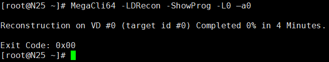

# 查看帮助

```bash
MegaCli64 -h
```

 

 

---

# 适配卡配置

## 查看RAID控制器的数量

```bash
MegaCli64 -adpCount
```

 

 

## 查看所有raid卡详细信息

```bash
MegaCli64 -AdpAllInfo -aALL
```

 


## 查看 RAID 卡 Rebuild 参数

查看重建在 IO 资源使用中的百分比，默认为 30%

```bash
MegaCli64 -AdpAllinfo -aALL |grep -i rebuild
```

 

 

## 设置RAID 卡 Rebuild 参数

```bash
MegaCli64 -AdpSetProp { RebuildRate -60} -aALL
```

 

 

---

# 磁盘配置

## 查看连接RAID卡的全部硬盘详细信息

```bash
MegaCli64 -PDList -aALL
```

其中 ALL 意思是所有的控制器，此处也可以用 0 表示

```bash
MegaCli64 -PDList -aN
```

N 可以根据 Adapter #0 来确定

 

磁盘的信息如下：

 

 

## 磁盘信息过滤

由于磁盘信息较多，所有可以根据自己的需要来过滤得到自己想要的信息：

```bash
MegaCli64 -PDList -aAll| grep -Ei "(Enclosure Device|Slot Number|Raw Size|Firmware state)"
```

grep -E 参数是使用扩展正则表达式来过滤，-i 参数是不区分大小写来过滤。

Enclosure Device 过滤出 raid 卡的 ID；Slot Number 过滤出磁盘的槽号；Raw Size 过滤出磁盘的大小；Firmware state 过滤出磁盘的状态。

 


## 获取指定磁盘信息

```bash
MegaCli -pdInfo -PhysDrv[E0:S0,E1:S1,...] -aN|-a0,1,2|-aALL
```

N 表示 raid 卡编号，0 表示第一块 raid 卡；

ALL 表示所有的 raid 卡 ；

E 和 S 代表 Enclosure Device 和 Slot Number

 


## 磁盘上下线

```bash
MegaCli64 -PDOffline/PDOnline -PhysDrv [E:S] -a0
```

 

 

## 磁盘点灯

```bash
MegaCli64 -PDLocate -start -physdrv[58:17] -a0

MegaCli64 -PDLocate -stop -physdrv[58:17] -a0
```

 

 ---

# RAID组基础配置

## 创建RAID组

```bash
MegaCli64 -CfgLdAdd -r(0|1|5) [E:S, E:S, ...] -aN
```

N 表示 raid 卡编号，0 表示第一块 raid 卡；ALL 表示所有的 raid 卡 ；E 和 S 代表 Enclosure Device 和 Slot Number。

 

下面是一个创建 raid5 例子，属性为默认。固件状态会由 Unconfigured 变成 Online。

 

 

 下面给出一个创建 raid10 的例子，并设置属性。

 

 

## 删除RAID组

```bash
MegaCli64 -CfgLdDel -LX -a0
```

 

 

 

## 查看RAID组信息

```bash
# （创建的示例已经使用过了）
MegaCli64 -LDInfo -Lall -aALL 

# 查看raid信息及raid组成磁盘信息。
MegaCli64 -LdPdInfo -aALL
```

 

RAID Level 对应关系：RAID 级别一般通过 Primary 字段值来判断

还需要结合 Span Depth 的值来判断值为 1 表示为 RAID-1，不为 1 表示 RAID-10; 还有一种情况：Primary-1， Secondary-3， RAID LevelQualifier-0 也是表示 RAID-10;

RAIDLevel : Primary-0, Secondary-0, RAID Level Qualifier-0    对应 RAID 0

RAIDLevel : Primary-1, Secondary-0, RAID Level Qualifier-0    对应 RAID 1

RAIDLevel : Primary-5, Secondary-0, RAID Level Qualifier-3    对应 RAID 5

RAIDLevel : Primary-1, Secondary-3, RAID Level Qualifier-0    对应 RAID 10

 

## 修改RAID组属性

```bash
# 获取cache属性
MegaCli -LDGetProp -Cache -L0 -a0
```

写策略： 

- WriteBack（WB）：写缓存策略

- WriteThrough（WT ）：直接写入磁盘，不适用RAID卡缓存。

预读策略：

- ReadAheadNone（NORA ）：不开启预读

- ReadAhead（RA ）：开启预读，在读操作的时候，预先把后面顺序的数据载入raid卡缓存，在顺序读的环境中能提供很好的性能，但是在随机读的环境中反而降低读的性能（适合文件系统，不适合数据库系统）

- ReadAdaptive（ADRA ）：自适应预读，在缓存和I/O空闲时选择预读，默认策略。

读策略：

- Direct：读操作不缓存到 RAID 卡缓存。
- Cached：读操作缓存到 RAID 卡缓存。

如果 BBU (电池)出现问题是否启用 WriteCache：

- No Write Cache if Bad BBU:	如果 BBU 出现问题不使用 WriteCache，从 WriteBack 自动切换到 WriteThrough，默认配置。

- Write Cache OK if Bad BBU: 	如果 BBU 出现问题仍启用 WriteCache，这种配置是非常不安全的，除非是有 UPS 或者双电源的情况下。

 

修改属性示例：

```bash
MegaCli64 -LDSetProp WT -L0 -a0
MegaCli64 -LDSetProp RA -L0 -a0
MegaCli64 -LDSetProp Cached -L0 -a0
```

 


## 清除RAID配置（慎用）

```bash
MegaCli -CfgClr [-Force] -aN|-a0,1,2|-aALL
```

 

## RAID组扩展配置

1.扩容过程中无法新建 RAID 组

2.扩容过程中无法对其余 RAID 组扩容

下面示例一个 RAID5 扩容：

```bash
MegaCli64 -LDRecon -Start -r5 -Add -PhysDrv[58:7, 58:11] -L0 -a0
```

 

 

查看扩容的进度（真的是超级慢）

```bash
# 显示扩容进度
MegaCli64 -LDRecon -ShowProg -L0 -a0　　
```

 


```bash
# 动态显示扩容进度
MegaCli64 -LDRecon -progdsply -L0 -a0　
```

 

 好了，我终于等到 1% 了

 

 

---

# RAID组热备配置

## 全局热备

```bash
# 添加全局热备
MegaCli64 -PDHSP -set -PhysDrv[E:S] -a0

# 删除全局热备
MegaCli64 -PDHSP -rmv -PhysDrv[E:S] -a0
```

添加全局热备后，状态如下：

 

此时下线成员盘，RAID 组进入重构

 

```bash
# 查看磁盘重构进度
MegaCli64 -PDRbld -ShowProg -PhysDrv[E:S] -aALL
```

 

```bash
# 动态显示重构进度
MegaCli64 -PDRbld -ProgDsply -PhysDrv[E:S] -aALL　
```

 

 

## 局部热备

在创建时添加局部热备

```bash
MegaCli64 -CfgLdAdd -r1 [58:7,58:11] -Hsp[58:17] -a0
```

 

查看 RAID 组信息：

 

然后再添加一块全局热备

 

准备工作完毕！现在下线成员盘，下线之后局部热备替换到成员组

 

RAID 组状态也变为降级

 

rebuild 的时间也很长，但此期间可以创建新的 RAID 组

 

等待ing...

此时另一块盘也可以下线，不过下线 rebuild 就凉凉了…… 

 

第二种是创建成功之后，给特定 RAID 组添加热备盘

```bash
MegaCli64 -CfgLdAdd -r5 [58:7,58:11,58:17] -a0

MegaCli64 -CfgLdAdd -r1 [58:19,58:23] -a0
```

首先创建两个 RAID 组，然后把热备添加到第二个 RAID 组里（局部热备可以同时添加到多个 RAID 组）

局部热备里的 Array 计算比较麻烦，这里就要用到上面提到的 DG，要按 DG 的排序累加，一直累加到要添加热备的 VD（要添加热备的 VD 也要计算）。 

1. 默认设 Array 为 -1。 
2. 如果是 RAID0 / 1 / 5 / 6，则 Array 加 1。 
3. 如果是 RAID10 / 50，则 Array 加 2。 
4. 如果是 RAID0 / 1 / 5 / 6，则返回 Array 最后计算的值。 
5. 如果是 RAID10 / 50，则返回 Array-1，Array。

```bash
MegaCli64 -PDHSP -set -Dedicated [-Array1] -PhysDrv[58:18] -a0
```

 

 


---

# 常见问题处理

- Firmwarestate:Unconfigured(good), Spun down 解决方法：

重新热拔插指定硬盘，该状态会变成 Firmware state:Unconfigured(good), Spun Up

创建 raid 后磁盘状态也会由 Spun down 变成 SpunUp

 

------


- Firmware state: Unconfigured(bad) 解决办法：

`MegaCli64 -PDMakeGood -PhysDrv[E:S] -a0` 

固件状态会由 Unconfigured(bad) 变成 Unconfigured(good), Spun Up

------


- Firmware state: failed 解决办法：

出现 failed 状态的硬盘大多已损坏，建议更换（或报修）；但可以强制上线。

强制上线步骤如下：

可以先将磁盘下线：`MegaCli64 -PDOffline-PhysDrv[E:S] -a0`

然后再上线：`MegaCli64 -PDOnline -PhysDrv[E:S] -a0`

 

------


- 以下状态的解决办法：

Foreign State: Foreign

Foreign Secure: Drive is notsecured by a foreign lock key

办法一：可以清除恢复状态（慎用）

`MegaCli64 -CfgForeign -Clear -a0`

办法二：导入配置，恢复虚拟磁盘组

`MegaCli64 -CfgForeign -import -a0`

 

------


- 如何定位设备/dev/sd*由哪些磁盘组成并点亮指定硬盘。

`udevadm info -q path -n /dev/sda`

可以看出设备 /dev/sda 是 raid 下的 Virtual Drive: 0

然后确定 Virtual Drive: 0 是由哪些磁盘组成，并点亮磁盘

`MegaCli64 -ldpdinfo -a0|grep -Ei "(Virtual Drive:|RAID Level|^Size|Enclosure Device|Slot Number)"`

 

 