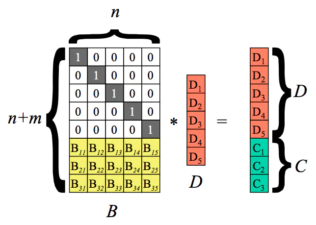
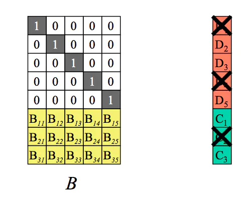
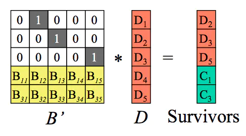
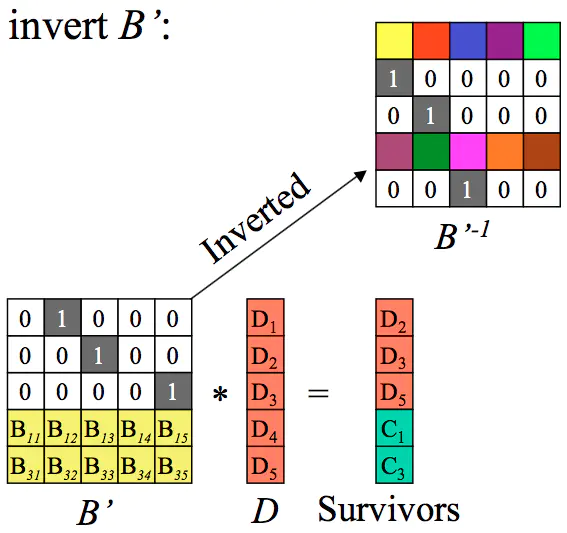
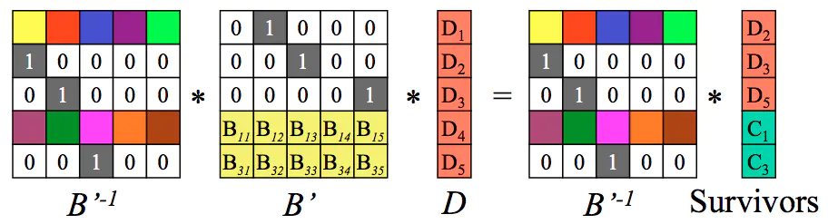
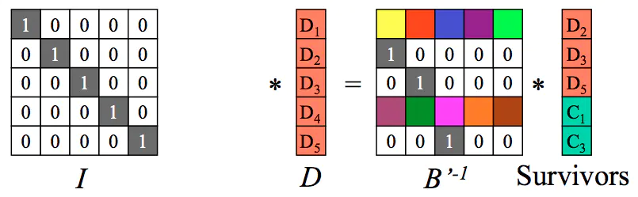
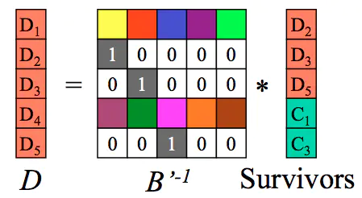

# 什么是Erasure Code

Erasure Code（EC），即纠删码，是一种前向错误纠正技术（Forward Error Correction，FEC），主要应用在网络传输中避免包的丢失，存储系统利用它来提高存储可靠性。相比多副本复制而言，纠删码能够以更小的数据冗余度获得更高数据可靠性，但编码方式较复杂，需要大量计算 。

纠删码**只能容忍数据丢失，无法容忍数据篡改**，纠删码正是得名与此。

Erasure Code 是一种编码技术，它可以将 n 份原始数据，增加 m 份数据，并能通过 n+m 份中的任意 n 份数据，还原为原始数据。即如果有任意小于等于 m 份的数据失效，仍然能通过剩下的数据还原出来。

目前，纠删码技术在分布式存储系统中的应用主要有三类

- 阵列纠删码（Array Code: RAID5、RAID6 等）
- RS（Reed-Solomon）里德-所罗门类纠删码
- LDPC（Low Density Parity Check Code）低密度奇偶校验纠删码。

RAID 是 EC 的特殊情况。在传统的 RAID 中，仅支持有限的磁盘失效，RAID5 只支持一个盘失效，RAID6 支持两个盘失效，而 EC 支持多个盘失效。

EC 主要运用于存储和数字编码领域。例如磁盘阵列存储（RAID 5、RAID 6），云存储（RS）等。

LDPC 码也可以提供很好的保障可靠性的冗余机制。与 RS 编码相比，LDPC 编码效率要略低，但编码和解码性能要优于 RS 码以及其他的纠删码，主要得益于编解码采用的相对较少并且简单的异或操作。LDPC 码目前主要用于通信、视频和音频编码等领域。

在讲 RS 类纠删码原理之前，我们先讲一下 RAID。

​	

---

# RAID

构建 RAID 有多种不同的方法。每种方法都有不同的特点。具体来说，我们将从 3 个方面评估每种 RAID 设计。

第一个方面是容量（capacity）。在给定一组 N 个磁盘的情况下，RAID 的客户端可用的容量有多少？没有冗余，答案显然是 N。不同的是，如果有一个系统保存每个块的两个副本，我们将获得 N/2 的有用容量。不同的方案（例如，基于校验的方案）通常介于两者之间。

第二个方面是可靠性（reliability）。给定设计允许有多少磁盘故障？根据我们的故障模型，我们只假设整个磁盘可能会故障。

最后是性能（performance）。性能有点难以评估，因为它在很大程度上取决于磁盘阵列提供的工作负载。因此，在评估性能之前，我们将首先提出一组应该考虑的典型工作负载。

我们现在考虑 3 个重要的 RAID 设计：RAID 0 级（条带化），RAID 1 级（镜像）和 RAID 4/5 级（基于奇偶校验的冗余）。  


## RAID0

第一个 RAID 级别实际上不是 RAID 级别，因为没有冗余。但是，RAID 0 级因其条带化（striping）更为人所知，可作为性能和容量的优秀上限，所以值得了解。

最简单的条带形式将按下表所示的方式在系统的磁盘上将块条带化（stripe），假设此处为 4 个（条带宽度）磁盘阵列。  

| 磁盘 0 | 磁盘 1 | 磁盘 2 | 磁盘 3 |
| :----: | :----: | :----: | :----: |
|   0    |   1    |   2    |   3    |
|   4    |   5    |   6    |   7    |
|   8    |   9    |   10   |   11   |
|   12   |   13   |   14   |   15   |


通过表你了解了基本思想：以轮转方式将磁盘阵列的块分布在磁盘上。这种方法的目的是在对数组的连续块进行请求时，从阵列中获取最大的并行性（例如，在一个大的顺序读取中）。我们将同一行中的块称为条带，因此，上面的块 0、 1、 2 和 3 在相同的条带中。  

在这个例子中，我们做了一个简化的假设，在每个磁盘上只有 1 个块放在下一个磁盘上。但是，这种安排不是必然的。例如，我们可以像下表这样在磁盘上安排块。  

| 磁盘 0 | 磁盘 1 | 磁盘 2 | 磁盘 3 |
| :----: | :----: | :----: | :----: |
|   0    |   2    |   4    |   6    |
|   1    |   3    |   5    |   7    |
|   8    |   10   |   12   |   14   |
|   9    |   11   |   13   |   15   |

在这个例子中，我们在每个磁盘上放置两个块（这就是条带深度），然后移动到下一个磁盘。因此，此 RAID 阵列的大块大小（chunk size）为 8KB，因此条带由 4 个大块（或 32KB）数据组成。  

现在让我们评估条带化的容量、可靠性和性能。从容量的角度来看，它是顶级的：给定 N 个磁盘，条件化提供 N 个磁盘的有用容量。从可靠性的角度来看，条带化也是顶级的，但是最糟糕的：任何磁盘故障都会导致数据丢失。最后，性能非常好：通常并行使用所有磁盘来为用户 I/O 请求提供服务。  

在分析 RAID 性能时，可以考虑两种不同的性能指标。

首先是单请求延迟。了解单个 I/O 请求对 RAID 的满意度非常有用，因为它可以揭示单个逻辑 I/O 操作期间可以存在多少并行性。

第二个是 RAID 的稳态吞吐量，即许多并发请求的总带宽。由于 RAID 常用于高性能环境，因此稳态带宽至关重要，因此将成为我们分析的主要重点。

为了更详细地理解吞吐量，我们需要提出一些感兴趣的工作负载。对于本次讨论，我们将假设有两种类型的工作负载：顺序（sequential）和随机（random）负载。

对于顺序的工作负载，我们假设对阵列的请求大部分是连续的。例如，一个请求（或一系列请求）访问 1MB数据，始于块（B），终于（B+1MB），这被认为是连续的。

对于随机工作负载，我们假设每个请求都很小，并且每个请求都是到磁盘上不同的随机位置。例如，随机请求流可能首先在逻辑地址 10 处访问 4KB，然后在逻辑地址 550000 处访问，然后在 20100 处访问，等等。

当然，真正的工作负载不是那么简单，并且往往混合了顺序和类似随机的部分，行为介于两者之间。简单起见，我们只考虑这两种可能性。

你知道，顺序和随机工作负载会导致磁盘的性能特征差异很大。对于顺序访问，磁盘以最高效的模式运行，花费很少时间寻道并等待旋转，大部分时间都在传输数据。对于随机访问，情况恰恰相反：大部分时间花在寻道和等待旋转上，花在传输数据上的时间相对较少。

为了在分析中捕捉到这种差异，我们将假设磁盘可以在连续工作负载下以 S MB/s 传输数据，并且在随机工作负载下以 R MB/s 传输数据。一般来说，S 比 R 大得多。为了确保理解这种差异，我们来做一个简单的练习。具体来说，给定以下磁盘特征，计算 S 和 R。假设平均大小为 10MB 的连续传输，平均为 10KB 的随机传输。另外，假设以下磁盘特征：  

> 平均寻道时间 7ms
> 平均旋转延迟 3ms
> 磁盘传输速率 50MB/s

要计算 S，我们需要首先计算在典型的 10MB 传输中花费的时间。首先，我们花 7ms寻找，然后 3ms 旋转。最后，传输开始。 10MB @ 50MB/s 导致 1/5s，即 200ms 的传输时间。因此，对于每个 10MB 的请求，花费了 210ms 完成请求。要计算 S，只需要除一下：  

> S = 数据量 / 访问时间 = 10MB / 210ms = 47.62MB/s 

如你所见，由于大量时间用于传输数据，S 非常接近磁盘的峰值带宽（寻道和旋转成本已经摊销）。

我们可以类似地计算 R。寻道和旋转是一样的。然后我们计算传输所花费的时间，即 10KB @ 50MB/s，即 0.195ms。

> R = 数据量 / 访问时间 = 10KB / 10.195ms = 0.981MB/s    

如你所见，R 小于 1MB/s，S/R 几乎为 50 倍。  

现在我们来评估条带化的性能。正如我们上面所说的，它通常很好。例如，从延迟角度来看，单块请求的延迟应该与单个磁盘的延迟几乎相同。毕竟，RAID-0 将简单地将该请求重定向到其磁盘之一。

从稳态吞吐量的角度来看，我们期望获得系统的全部带宽。因此，吞吐量等于 N（磁盘数量）乘以 S（单个磁盘的顺序带宽）。对于大量的随机 I/O，我们可以再次使用所有的磁盘，从而获得 N· R MB/s。我们在后面会看到，这些值都是最简单的计算值，并且将作为与其他 RAID 级别比较的上限。


## RAID1

第一个超越条带化的 RAID 级别称为 RAID 1 级，即镜像。对于镜像系统，我们只需生成系统中每个块的多个副本。当然，每个副本应该放在一个单独的磁盘上。通过这样做，我们可以容许磁盘故障。在一个典型的镜像系统中，我们将假设对于每个逻辑块，RAID 保留两个物理副本。

| 磁盘 0 | 磁盘 1 | 磁盘 2 | 磁盘 3 |
| :----: | :----: | :----: | :----: |
|   0    |   0    |   1    |   1    |
|   2    |   2    |   3    |   3    |
|   4    |   4    |   5    |   5    |
|   6    |   6    |   7    |   7    |

在这个例子中，磁盘 0 和磁盘 1 具有相同的内容，而磁盘 2 和磁盘 3 也具有相同的内容。数据在这些镜像对之间条带化。实际上，你可能已经注意到有多种不同的方法可以在磁盘上放置块副本。上面的安排是常见的安排，有时称为 RAID-10（或 RAID 1+0），因为它使用镜像对（RAID-1），然后在其上使用条带化（RAID-0）。另一种常见安排是 RAID-01（或 RAID 0+1），它包含两个大型条带化（RAID-0）阵列，然后是镜像（RAID-1）。目前，我们的讨论只是假设上面布局的镜像。  

从镜像阵列读取块时，RAID 有一个选择：它可以读取任一副本。例如，如果对 RAID 发出对逻辑块 5 的读取，则可以自由地从磁盘 2 或磁盘 3 读取它。但是，在写入块时，不存在这样的选择： RAID 必须更新两个副本的数据，以保持可靠性。但请注意，这些写入可以并行进行。例如，对逻辑块 5 的写入可以同时在磁盘 2 和 3 上进行。  

让我们评估一下 RAID-1。

从容量的角度来看，RAID-1 价格昂贵。在镜像级别=2 的情况下，我们只能获得峰值有用容量的一半。因此，对于 N 个磁盘，镜像的有用容量为 N/2。

从可靠性的角度来看，RAID-1 表现良好。它可以容许任何一个磁盘的故障。你也许会注意到 RAID-1 实际上可以做得比这更好，只需要一点运气。想象一下，磁盘 0 和磁盘 2 都故障了。在这种情况下，没有数据丢失！ 更一般地说，镜像系统肯定可以容许一个磁盘故障，最多可容许 N/2 个磁盘故障，这取决于哪些磁盘故障。在实践中，我们通常不喜欢把这样的事情交给运气。因此，大多数人认为镜像对于处理单个故障是很好的。

最后，我们分析性能。从单个读取请求的延迟角度来看，我们可以看到它与单个磁盘上的延迟相同。所有 RAID-1 都会将读取导向一个副本。写入有点不同：在完成写入之前，需要完成两次物理写入。这两个写入并行发生，因此时间大致等于单次写入的时间。然而，因为逻辑写入必须等待两个物理写入完成，所以它遭遇到两个请求中最差的寻道和旋转延迟，因此（平均而言）比写入单个磁盘略高。

要分析稳态吞吐量，让我们从顺序工作负载开始。顺序写入磁盘时，每个逻辑写入必定导致两个物理写入。例如，当我们写入逻辑块 0 时，RAID 在内部会将它写入磁盘 0 和磁盘 1。因此，我们可以得出结论，顺序写入镜像阵列期间获得的最大带宽是 `(N / 2) * S` ，即峰值带宽的一半。  

遗憾的是，我们在顺序读取过程中获得了完全相同的性能。有人可能会认为顺序读取可能会更好，因为它只需要读取一个数据副本，而不是两个副本。但是，让我们用一个例子来说明为什么这没有多大帮助。想象一下，我们需要读取块 0、 1、 2、 3、 4、 5、 6 和 7。假设我们将 0 读到磁盘 0，将 1 读到磁盘 2，将 2 读到磁盘 1，读取 3 到磁盘 3。我们继续分别向磁盘 0、 2、 1 和 3 发出读取请求 4、 5、 6 和 7。有人可能天真地认为，因为我们正在利用所有磁盘，所以得到了阵列的全部带宽。  

但是，要看到情况并非如此，请考虑单个磁盘接收的请求（例如磁盘 0）。首先，它收到块 0 的请求。然后，它收到块 4 的请求（跳过块 2）。实际上，每个磁盘都会接收到每个其他块的请求。当它在跳过的块上旋转时，不会为客户提供有用的带宽。因此，每个磁盘只能提供一半的峰值带宽。  

随机读取是镜像 RAID 的最佳案例。在这种情况下，我们可以在所有磁盘上分配读取数据，从而获得完整的可用带宽。因此，对于随机读取，RAID-1 提供 `N * R` MB/s。

最后，随机写入按照你预期的方式执行，每个逻辑写入必须变成两个物理写入，因此在所有磁盘都将被使用的情况下，客户只会看到可用带宽的一半。尽管对逻辑块 X 的写入变为对两个不同物理磁盘的两个并行写入，但许多小型请求的带宽只能达到我们看到的条带化的一半。我们很快会看到，获得一半的可用带宽实际上相当不错！  


## RAID4

我们现在展示一种向磁盘阵列添加冗余的不同方法，称为奇偶校验（parity）。基于奇偶校验的方法试图使用较少的容量，从而克服由镜像系统付出的巨大空间损失。不过，这样做的代价是——性能。

这是 5 个磁盘的 RAID-4 系统的例子。对于每一条数据，我们都添加了一个奇偶校验（parity）块，用于存储该条块的冗余信息。例如，奇偶校验块 P1 具有从块 4、5、 6 和 7 计算出的冗余信息。

| 磁盘 0 | 磁盘 1 | 磁盘 2 | 磁盘 3 | 磁盘 4 |
| :----: | :----: | :----: | :----: | :----: |
|   0    |   1    |   2    |   3    |   P0   |
|   4    |   5    |   6    |   7    |   P1   |
|   8    |   9    |   10   |   11   |   P2   |
|   12   |   13   |   14   |   15   |   P3   |

为了计算奇偶性，我们需要使用一个数学函数，使我们能够承受条带中任何一个块的损失。事实表明，简单异或（XOR ）函数相当不错。对于给定的一组比特，如果比特中有偶数个 1，则所有这些比特的 XOR 返回 0，如果有奇数个 1，则返回 1。如果某个数据丢失，可以根据异或算法反推出对应数据是 0 还是 1。

从容量的角度来看，RAID-4 使用 1 个磁盘作为它所保护的每组磁盘的奇偶校验信息。因此，RAID 组的有用容量是（N-1）。

可靠性也很容易理解：RAID-4 容许 1 个磁盘故障，不容许更多。如果丢失多个磁盘，则无法重建丢失的数据。  

最后，是性能。这一次，让我们从分析稳态吞吐量开始。连续读取性能可以利用除奇偶校验磁盘以外的所有磁盘，因此可提供 `(N-1) * S` MB/s（简单情况）的峰值有效带宽。

要理解顺序写入的性能，我们必须首先了解它们是如何完成的。将大块数据写入磁盘时，RAID-4 可以执行一种简单优化，称为全条带写入（full-stripe write）。例如，设想块 0、1、 2 和 3 作为写请求的一部分发送到 RAID。

在这种情况下，RAID 可以简单地计算 P0 的新值（通过在块 0、 1、 2 和 3 上执行 XOR），然后将所有块（包括奇偶块）并行写入上面的 5 个磁盘。因此，全条带写入是 RAID-4 写入磁盘的最有效方式。 

现在让我们分析随机读取的性能。一组 1 块的随机读取将分布在系统的数据磁盘上，而不是奇偶校验磁盘上。因此，有效性能是 `(N-1) * R` MB/s。

随机写入，我们留到了最后，展示了 RAID-4 最引人注目的情况。想象一下，我们希望在上面的例子中覆盖写入块 1。我们可以继续并覆盖它，但这会给我们带来一个问题：奇偶校验块 P0 将不再准确地反映条带的正确奇偶校验值。在这个例子中，P0 也必须更新。我们如何正确并有效地更新它？  

存在两种方法。第一种称为加法奇偶校验（additive parity），要求我们做以下工作。为了计算新奇偶校验块的值，并行读取条带中所有其他数据块（在本例中为块 0、 2 和 3），并与新块（1）进行异或。结果是新的校验块。为了完成写操作，你可以将新数据和新奇偶校验写入其各自的磁盘，也是并行写入。  

这种技术的问题在于它随磁盘数量而变化，因此在较大的 RAID 中，需要大量的读取来计算奇偶校验。因此，导致了减法奇偶校验（subtractive parity）方法。  

例如，想象下面这串位（4 个数据位，一个奇偶校验位）：  

```text
C0    C1    C2    C3    P
0     0     1     1     XOR(0,0,1,1)=0
```

想象一下，我们希望用一个新值来覆盖 C2 位，称之为 C2new。减法方法分三步工作。首先，我们读入 C2（C2old = 1）和旧数据（Pold = 0）的旧数据。然后，比较旧数据和新数据。如果它们相同（例如，C2new = C2old），那么我们知道奇偶校验位也将保持相同（即 Pnew = Pold）。但是，如果它们不同，那么我们必须将旧的奇偶校验位翻转到其当前状态的相反位置，也就是说，如果（Pold == 1），Pnew 将被设置为 0。如果（Pold == 0），Pnew 将被设置为 1。

我们可以用 XOR（⊕是 XOR 运算符）漂亮地表达完整的复杂情况：

> Pnew = （ Cold ⊕ Cnew ） ⊕ Pold  

由于所处理的是块而不是位，因此我们对块中的所有位执行此计算（例如，每个块中的 4096 个字节乘以每个字节的 8 位）。在大多数情况下，新块与旧块不同，因此新的奇偶块也会不同。 

你现在应该能够确定何时使用加法奇偶校验计算，何时使用减法方法。考虑系统中需要多少个磁盘，导致加法方法比减法方法执行更少的 I/O。哪里是交叉点？   

对于这里的性能分析，假定使用减法方法。因此，对于每次写入，RAID 必须执行 4 次物理 I/O（两次读取和两次写入）。现在想象有很多提交给 RAID 的写入。RAID-4 可以并行执行多少个？为了理解，让我们再看一下 RAID-4 的布局：

| 磁盘 0 | 磁盘 1 | 磁盘 2 | 磁盘 3 | 磁盘 4 |
| :----: | :----: | :----: | :----: | :----: |
|   0    |   1    |   2    |   3    |   P0   |
|   *4   |   5    |   6    |   7    |  +P1   |
|   8    |   9    |   10   |   11   |   P2   |
|   12   |  *13   |   14   |   15   |  +P3   |

现在想象几乎同时向 RAID-4 提交 2 个小的请求，写入块 4 和块 13。

这些磁盘的数据位于磁盘 0 和 1 上，因此对数据的读写操作可以并行进行，这很好。出现的问题是奇偶校验磁盘。这两个请求都必须读取 4 和 13 的奇偶校验块，即奇偶校验块 1 和 3（用+标记）。估计你已明白了这个问题：在这种类型的工作负载下，奇偶校验磁盘是瓶颈。因此我们有时将它称为基于奇偶校验的 RAID 的小写入问题（small-write problem）。

因此，即使可以并行访问数据磁盘，奇偶校验磁盘也不会实现任何并行。由于奇偶校验磁盘，所有对系统的写操作都将被序列化。由于奇偶校验磁盘必须为每个逻辑 I/O 执行两次 I/O（一次读取，一次写入），我们可以通过计算奇偶校验磁盘在这两个 I/O 上的性能来计算 RAID-4 中的小的随机写入的性能，从而得到（R / 2） MB/s。随机小写入下的 RAID-4 吞吐量很糟糕，向系统添加磁盘也不会改善。

我们最后来分析 RAID-4 中的 I/O 延迟。你现在知道，单次读取（假设没有失败）只映射到单个磁盘，因此其延迟等同于单个磁盘请求的延迟。单次写入的延迟需要两次读取，然后两次写入。读操作可以并行进行，写操作也是如此，因此总延迟大约是单个磁盘的两倍（有一些差异，因为我们必须等待两个读取操作完成，所以会得到最差的定位时间，但是之后，更新不会导致寻道成本，因此可能是比平均水平更好的定位成本）


## RAID5

为解决小写入问题（至少部分解决），Patterson、 Gibson 和 Katz 推出了 RAID-5。RAID-5 的工作原理与 RAID-4 几乎完全相同，只是它将奇偶校验块跨驱动器旋转。

| 磁盘 0 | 磁盘 1 | 磁盘 2 | 磁盘 3 | 磁盘 4 |
| :----: | :----: | :----: | :----: | :----: |
|   0    |   1    |   2    |   3    |   P0   |
|   5    |   6    |   7    |   P1   |   4    |
|   10   |   11   |   P2   |   8    |   9    |
|   15   |   P3   |   12   |   13   |   14   |
|   P4   |   16   |   17   |   18   |   19   |

如你所见，每个条带的奇偶校验块现在都在磁盘上旋转，以消除 RAID-4 的奇偶校验磁盘瓶颈。  

RAID-5 的大部分分析与 RAID-4 相同。例如，两级的有效容量和容错能力是相同的。顺序读写性能也是如此。单个请求（无论是读还是写）的延迟也与 RAID-4 相同。随机读取性能稍好一点，因为我们可以利用所有的磁盘。最后，RAID-4 的随机写入性能明显提高，因为它允许跨请求进行并行处理。想象一下写入块 1 和写入块 10。这将变成对磁盘 1 和磁盘 4（对于块 1 及其奇偶校验）的请求以及对磁盘 0 和磁盘 2（对于块 10 及其奇偶校验）的请求。因此，它们可以并行进行。事实上，我们通常可以假设，如果有大量的随机请求，我们将能够保持所有磁盘均匀忙碌。如果是这样的话，那么我们用于小写入的总带宽将是 `N/4 * R` MB/s。 4 倍损失是由于每个 RAID-5 写入仍然产生总计 4 个 I/O 操作，这就是使用基于奇偶校验的 RAID 的成本。

由于 RAID-5 基本上与 RAID-4 相同，只是在少数情况下它更好，所以它几乎完全取代了市场上的 RAID-4。唯一没有取代的地方是系统知道自己绝不会执行大写入以外的任何事情，从而完全避免了小写入问题。在这些情况下，有时会使用 RAID-4，因为它的构建稍微简单一些。  


## 总结

现在简单总结一下各级 RAID 的比较。请注意，我们省略了一些细节来简化分析。例如，在镜像系统中写入时，平均查找时间比写入单个磁盘时稍高，因为寻道时间是两个寻道时间（每个磁盘上一个）的最大值。因此，对两个磁盘的随机写入性能通常会比单个磁盘的随机写入性能稍差。此外，在 RAID-4/5 中更新奇偶校验磁盘时，旧奇偶校验的第一次读取可能会导致完全寻道和旋转，但第二次写入奇偶校验只会导致旋转。但是，表中的比较确实抓住了基本差异，对于理解 RAID 各级之间的折中很有用。对于延迟分析，我们就使用 T 来表示对单个磁盘的请求所需的时间。

总之，如果你严格要求性能而不关心可靠性，那么条带显然是最好的。但是，如果你想要随机 I/O 的性能和可靠性，镜像是最好的，你付出的代价是容量下降。如果容量和可靠性是你的主要目标，那么 RAID-5 胜出，你付出的代价是小写入的性能。最后，如果你总是在按顺序执行 I/O 操作并希望最大化容量，那么 RAID-5 也是最有意义的。  

|        | RAID-0 |     RAID-1      |   RAID-4    |   RAID-5    |
| :----: | :----: | :-------------: | :---------: | :---------: |
|  容量  |   N    |       N/2       |     N-1     |     N-1     |
| 可靠性 |   0    |    1（肯定）    |      1      |      1      |
|        |        | N/2（如果走运） |             |             |
| 吞吐量 |        |                 |             |             |
| 顺序读 | N · S  |    (N/2) · S    | (N - 1) · S | (N - 1) · S |
| 顺序写 | N · S  |    (N/2) · S    | (N - 1) · S | (N - 1) · S |
| 随机读 | N · R  |      N · R      | (N - 1) · R |    N · R    |
| 随机写 | N · R  |    (N/2) · R    |   1/2 · R   |   N/4 · R   |
|  延迟  |        |                 |             |             |
|   读   |   T    |        T        |      T      |      T      |
|   写   |   T    |        T        |     2T      |     2T      |

​	


------

# Reed-Solomon纠删码

Reed-Solomon 编码（又叫 RS 编码、里德-所罗门编码）作为一种前向纠错编码，是一种很常见的数据冗余技术，也就是通过对数据增加冗余部分来保证当数据丢失时能够在一定程度上进行恢复。

## 编码原理

一、对于需要进行冗余处理的 n 个数据块，我们把他写成列向量的形式，其中每个数据块都可以看做是一个数。

二、生成一个变换矩阵，这个矩阵由 n+m 行和 n 列组成，其中上面的 n×n 的部分是一个单元矩阵，下面的 m×n 的部分是一个范德蒙矩阵。

三、用这个变换矩阵左乘数据列向量得到 n+m 位冗余码列向量。

算式如下：
$$
\begin{bmatrix}
1 & 0 & .. & 0 & 0 \\
0 & 1 & .. & 0 & 0 \\
.. & .. & .. & .. & .. \\
0 & 0 & .. & 1 & 0 \\
0 & 0 & .. & 0 & 1 \\
1^0 & 1^1 & .. & 1^{n-2} & 1^{n-1} \\
2^0 & 2^1 & .. & 2^{n-2} & 2^{n-1} \\
.. & .. & .. & .. & .. \\
{(m-1)}^0 & {(m-1)}^1 & .. & {(m-1)}^{n-2} & {(m-1)}^{n-1} \\
m^0 & m^1 & .. & m^{n-2} & m^{n-1} \\
\end{bmatrix}
\times
\begin{bmatrix}
b_{1} \\
b_{2} \\
b_{3} \\
.. \\
b_{n} \\
\end{bmatrix}
=
\begin{bmatrix}
b_{1} \\
b_{2} \\
b_{3} \\
.. \\
b_{n} \\
c_{1} \\
c_{2} \\
.. \\
c_{m} \\
\end{bmatrix}\tag{1}
$$
上面使用单位矩阵显然是为了保证原数据块在编码后不发生变化，从而看上去只是增加了冗余码。

下面使用范德蒙矩阵其实是为了保证这个矩阵任取 n∗n 的部分可逆。


## 解码原理

根据上面的编码方式，我们可以很容易理解他的解码方法。对于编码后的数据块 (b<sub>1</sub>，b<sub>2</sub>，...，b<sub>n</sub>，c<sub>1</sub>，c<sub>2</sub>，...，c<sub>m</sub>)，只需要任取其中的 m 个数据块，假设为 (b<sub>a1</sub>，b<sub>a2</sub>，...，b<sub>ax</sub>，c<sub>b1</sub>，c<sub>b2</sub>，...，c<sub>by</sub>) 其中 x+y=m，再用 f<sub>i</sub> 表示编码过程中那个矩阵的第 i 行。显然，下面的等式一定成立：
$$
\begin{bmatrix}
f_{a1} \\
f_{a2} \\
.. \\
f_{ax} \\
f_{n+b1} \\
f_{n+b2} \\
.. \\
f_{n+by} \\
\end{bmatrix}
\times
\begin{bmatrix}
b_{1} \\
b_{2} \\
b_{3} \\
.. \\
b_{n} \\
\end{bmatrix}
=
\begin{bmatrix}
b_{a1} \\
b_{a2} \\
.. \\
b_{ax} \\
c_{b1} \\
c_{b2} \\
.. \\
c_{by} \\
\end{bmatrix}\tag{2}
$$
这样一来，我们就可以把中间的数据矩阵解出来了。


## 计算域

上面的方法理论上是能够做到数据冗余处理的，不过由于作为一种编码技术，RS 编码需要处理的是特定长度的二进制数据，然而求矩阵逆的过程是在实数域内进行的。显然特定长度的二进制位是无法准确描述实数的。因此 RS 编码的计算域采用的是能够用二进制位精确编码的伽罗华域 GF(2<sup>n</sup>)。这个域的特性就是非常适合处理 [0−2<sup>n</sup>) 范围内数据的四则运算，而且这里的四则运算大都通过位运算处理，效率比较高。实际生产中由于数据的量会比较大，为了加快整个计算的过程，通常会采用离散傅里叶变换（DFT）及其逆变换来进行编码实现。


## 实例

以 n=5，m=3 为例。即 5 个原始数据块，乘上一个 `(n+m)*n` 的编码矩阵，然后得出一个 `(n+m)*1` 的矩阵。根据矩阵特点可以得知结果矩阵中前面 5 个值与原来的 5 个数据块的值相等，而最后 3 个则是计算出来的校验块。

最左边是编码矩阵（或称为生成矩阵、分布矩阵，Distribution Matrix）。为方便数据存储，编码矩阵上部是单位阵（n 行 n 列），下部是 m 行 n 列矩阵。下部矩阵可以选择范德蒙德矩阵或柯西矩阵，后文说明。

 

以上过程为编码过程。D 是原始数据块，得到的 C 为校验块。

假设丢失了 m 块数据，其中既有数据块，也有校验块。如下：

 

那我们如何从剩余的 n 个数据块（注意，这里剩余的 n 块可能包含几个原始数据块+几个校验块）恢复出来原始的数据块呢，就需要通过下面的 decoding（解码）过程来实现。

第一步：从编码矩阵中删去丢失数据块和丢失编码块对应行。 将删掉 m 个块的 `(n+m)*1` 矩阵变形为 `n*1` 矩阵，同时 B 矩阵也需要删掉对应的 m 个行得出一个 B' 的变形矩阵，这个 B' 就是 `n*n` 矩阵。如下：假设 D1、D4、C2 丢失，我们得到如下 B' 矩阵及等式。

 

第二步：求出 B' 的逆矩阵。

 

第三步：等式两边分别乘上 B' 的逆矩阵。

 

B'  和它的逆矩阵相乘得到单位矩阵 I，如下：

 

左边只剩下原始数据矩阵 D，将右边矩阵运算出来即可恢复最原始的数据。

 

至此完成解码过程。


---

# LRC

如果仔细分析故障出现的情况，你将很容易发现RS 编码的劣势：所有的故障都将导致同样的重建代价，无论是一个盘，还是 M 个盘，但是单个磁盘故障的几率远远大于多个磁盘同时故障的几率，通常在 90% 以上

直接出现的对策就是分组，把单个磁盘故障影响范围缩小到各个组内部，出坏盘故障时，该组内部解决，在恢复过程中读组内更少的盘，跑更少的网络流量，从而减小对全局的影响。

LRC（Locally Repairable Codes），局部校验编码，其核心思想为：将校验块（parity block）分为全局校验块（global parity）、局部校验块（local reconstruction parity），故障恢复时分组计算。

以微软 Azure 的云存储（Windows Azure Storage）实现为例，它采用 LRC（12，2，2）编码，将 12 个数据块为一组编码，并进一步将这 12 个数据块平均分为 2 个本地组， 每个本地组包括 6 个数据块，并分别计算出一个 local parity，之后把所有 12 个数据块计算出 2 个 global parities。 

当发生任何一个数据块错误时，只需用本地组内的数据和校验块用于计算，即可恢复出原始数据。而恢复代价（通过网络传输的数据块数量）就由传统 RS（12，4）编码的 12，变为 6，恢复过程的网络 I/O 开销减半，同时空间冗余率保持不变，仍为（12+2+2）/ 12 = 1.33

当发生两个数据块错误时，情况分成组内和组外，不管哪种需要拉取全部数据进行重建，此时采用 LRC 方法并不能提升性能。

当损坏三块数据时，如果这三个数据块在一个组内，此时就无法进行数据重建，所以有利就有弊。


​	

---

# 参考与感谢

- 操作系统导论 -- [美\] Remzi H. Arpaci-Dusseau / [美\] Andrea C. Arpaci-Dusseau 著
- [Erasure Coding in Windows Azure Storage](https://www.microsoft.com/en-us/research/wp-content/uploads/2016/02/LRC12-cheng20webpage.pdf)

