# 概述

MegaCli 是 LSI 公司官方提供的 SCSI 卡管理工具，由于 LSI 被收购变成了现在的 Broadcom，所以现在想下载 MegaCli，需要去 Broadcom 官网查找 Legacy 产品支持，搜索 MegaRAID 即可。

关于 MegaCli 的使用可以看我的另一篇介绍。

现在官方有 storcli，storcli 已经基本代替了 megacli，整合了 LSI 和 3ware 所有产品。

安装方面比较简单，megacli 还要 Lib_Utils 的支持，而 storcli 只用一个 rpm 包就可以下载，去 [Broadcom 官网](https://www.broadcom.com/site-search?q=storcli) 去找就行了。

storcli 支持 json 格式输出，信息解析更加方便。

安装完后，默认位置在 /opt/Mega/storcli 下面，下面介绍 storcli 工具的简单使用。


 

------


# 获取帮助

```bash
[root@localhost ~]# storcli -h

      StorCli SAS Customization Utility Ver 007.1704.0000.0000 Jan 16, 2021

    (c)Copyright 2021, Broadcom Inc. All Rights Reserved.


storcli -v 
storcli [verbose] -h| -help| ? 
storcli show 
storcli show all
storcli show ctrlcount
storcli show file=<filepath>
storcli /cx add vd r[0|1|5|6|00|10|50|60]
	[Size=<VD1_Sz>,<VD2_Sz>,..|remaining] [name=<VDNAME1>,..] 
	drives=[e:]s|[e:]s-x|[e:]s-x,y [PDperArray=x][SED]
	[pdcache=on|off|default][pi][DimmerSwitch(ds)=default|automatic(auto)|
	none|maximum(max)|MaximumWithoutCaching(maxnocache)][WT|WB|AWB][nora|ra]
	[direct|cached] [cachevd] [unmap][Strip=<8|16|32|64|128|256|512|1024>]
	 [AfterVd=X] [EmulationType=0|1|2] [Spares = [e:]s|[e:]s-x|[e:]s-x,y]
	[force][ExclusiveAccess] [Cbsize=0|1|2 Cbmode=0|1|2|3|4|7] 
storcli /cx add vd each r0 [name=<VDNAME1>,..] [drives=[e:]s|[e:]s-x|[e:]s-x,y]
	[SED] [pdcache=on|off|default][pi] [DimmerSwitch(ds)=default|
	automatic(auto)|none|maximum(max)|MaximumWithoutCaching(maxnocache)] 
	[WT|WB|AWB] [nora|ra] [direct|cached] [EmulationType=0|1|2]
	[Strip=<8|16|32|64|128|256|512|1024>] [ExclusiveAccess]
	[Cbsize=0|1|2 Cbmode=0|1|2|3|4|7] [unmap]
storcli /cx add VD cachecade r[0|1|10] 
	drives = [e:]s|[e:]s-x|[e:]s-x,y [WT|WB] [assignvds = 0,1,2]
	
...
```


------


# 基础信息

```bash
storcli64 show [all]　
```

 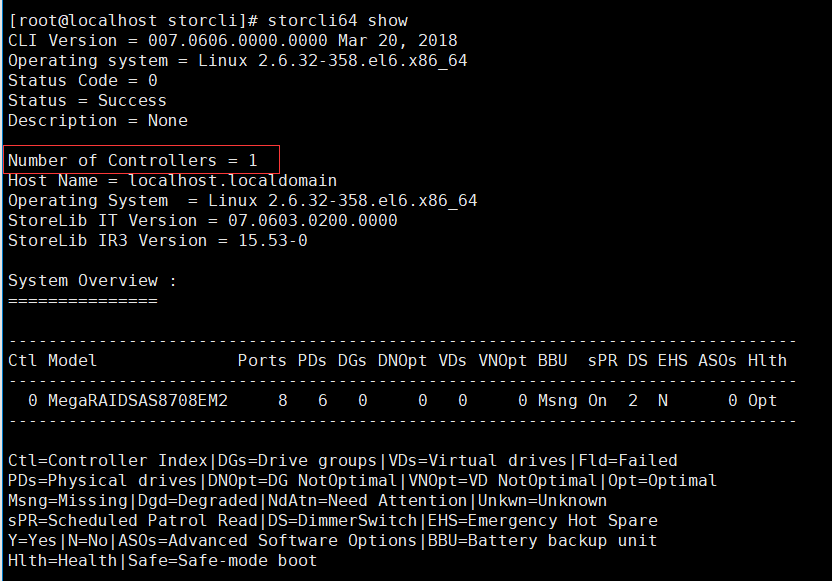

显示 raid 卡相关信息、raid 卡高级软件信息，可以看到只有一个控制器。

 

 

------


# 控制器配置

## 获取控制器信息

```bash
storcli64 /c0 show
```

显示控制器 0 的信息，我们可以看到有 6 个物理设备，以及 enclosure id 号为 58，硬盘大多是附在 enclosure 上不是直接附在 controller 上，如果你之前看过  MegaCli 的操作，对这个应该就还挺熟悉了。

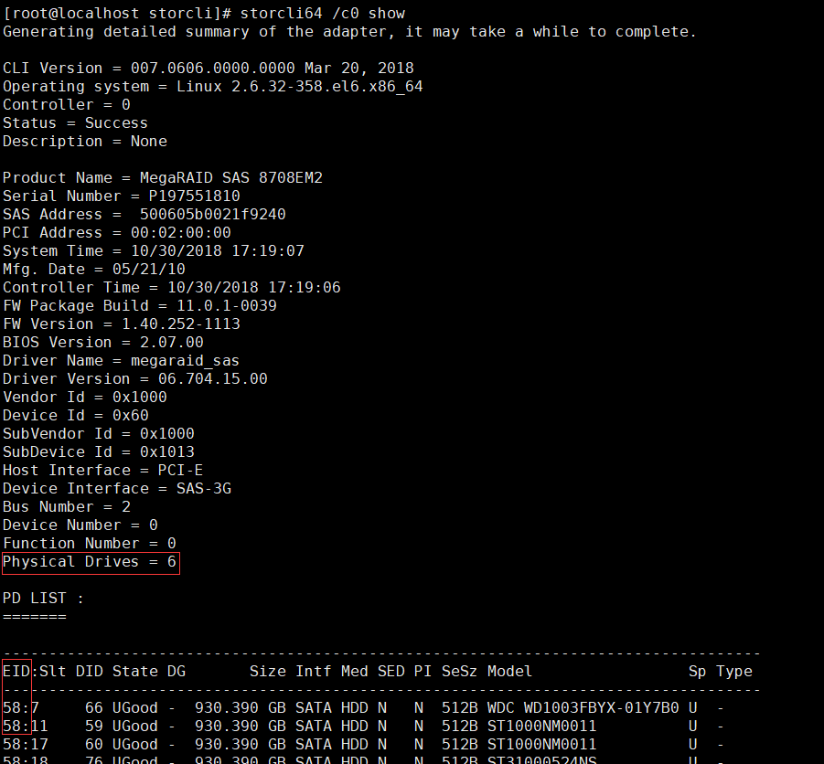 

 

## 剩余空间

```bash
storcli64 /c0 show freespace
```

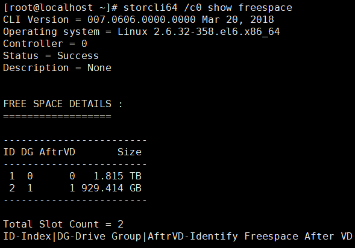 

 

## CC（consistency check）

```bash
storcli64 /c0 show cc
```

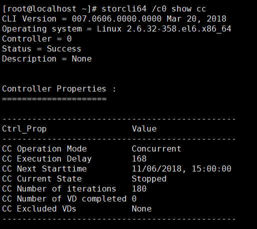 

 

```bash
storcli64 /c0 show ccrate
```

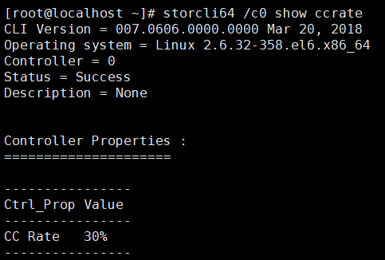 

 

设置cc

```bash
storcli /cx set consistencycheck|cc=[off|seq|conc][delay=value]

storcli /cx set ccrate=<value>
```


 

## rebuild

### 获取 rebuild 速率

```bash
storcli64 /c0 show rebuildrate
```

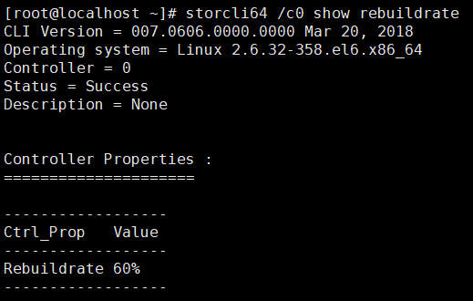 

 

### 设置rebuild速率

```bash
storcli64 /c0 set rebuildrate=30
```

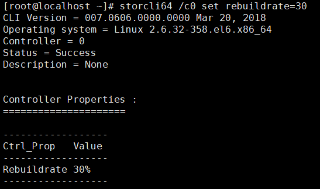 

 

## 清除缓存

清除 raid 卡、物理磁盘 cache

```bash
storcli64 /c0 flushcache
```

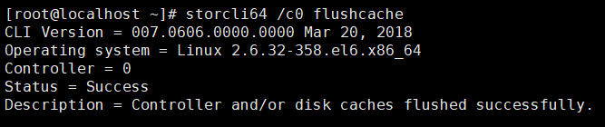 

 


------


# enclosure

## 获取信息

```bash
storcli64 /c0/eall show
```

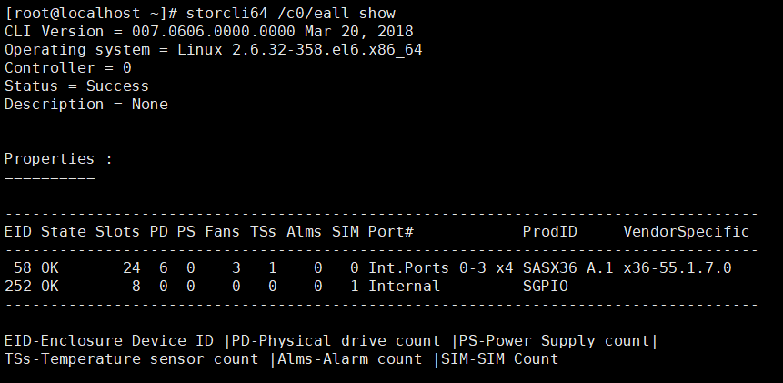 

 

## 获取单个enclosure信息

```bash
storcli64 /c0/e58 show
```

 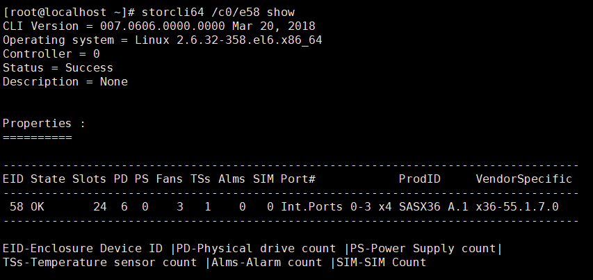 

 

## 获取单个enclosure详细信息

```bash
storcli64 /c0/e58 show all
```

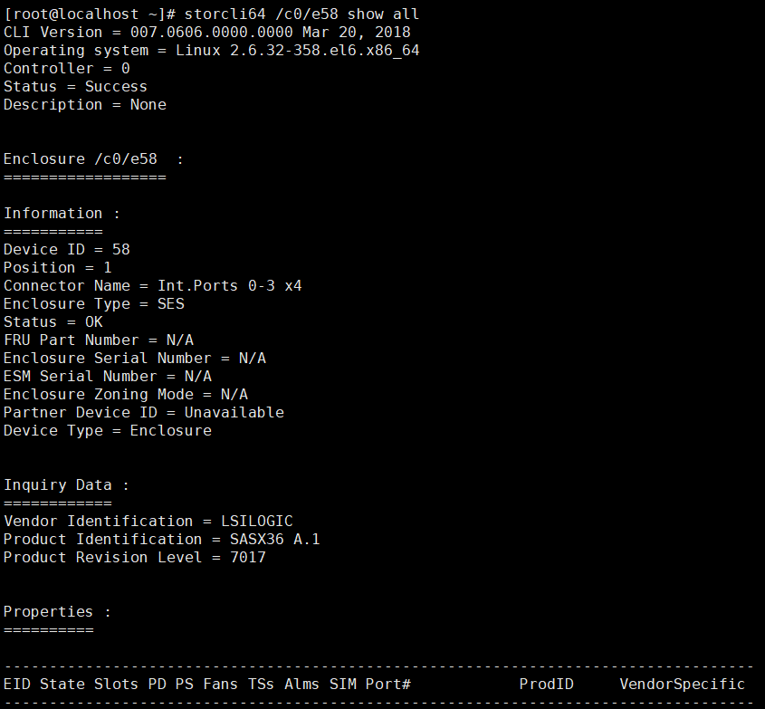 

 

##  获取磁盘风扇等设备的状态

```bash
storcli64 /c0/e58 show status
```

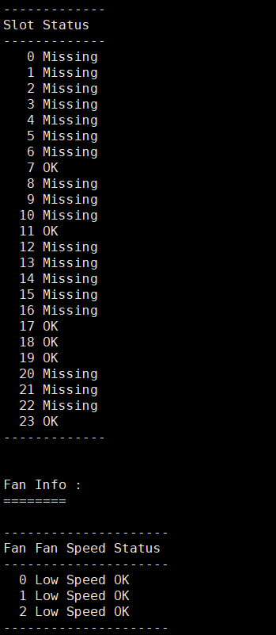 

 

------


# 磁盘配置

## 磁盘信息获取

### 显示物理磁盘信息

```bash
storcli64 /cx/eall/sall show
```

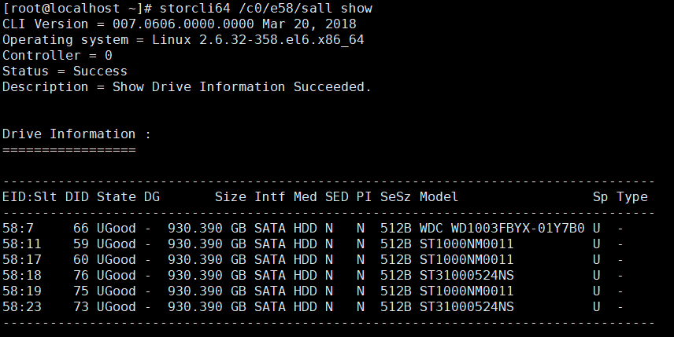 

 

### 磁盘状态设置

```bash
# good                空闲
# online/offline      成员盘上下线
# missing             掉线？
storcli64 /cx/ex/sx set good/offline/online/missing
```


 

## 磁盘热备

```bash
# 设置某块磁盘为diskgroup x 的热备盘
storcli64 /cx/ex/sx add hotsparedrive dgs=x
storcli64 /cx/ex/sx delete hotsparedrive
```


## 磁盘rebuild

```bash
# 查看rebild
storcli64 /cx/ex/sx show rebuild

# 开始重构
storcli64 /cx/ex/sx start rebuild

# 停止重构
storcli64 /cx/ex/sx stop rebuild
```


## 磁盘点灯

```bash
storcli64 /cx/ex/sx start locate
storcli64 /cx/ex/sx stop locate
```

 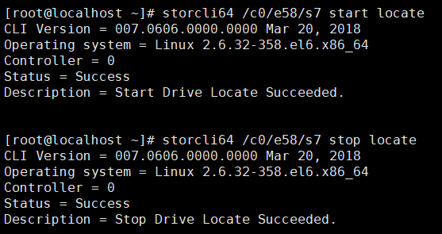 


## 磁盘擦除

### 快速擦除

```bash
storcli64 /cx/ex/sx set good

storcli64 /cx/fall del|delete [securityKey = xxx]
```

 

### 完全擦除

```bash
storcli /cx[/ex]/sx secureerase [force]
storcli /cx[/ex]/sx start erase [simple| normal| thorough | standard| threepass | crypto]
storcli /cx[/ex]/sx stop erase 
storcli /cx[/ex]/sx show erase
```

 

------


# RAID组配置

命令格式如下：

```bash
storcli /cx add vd r[0|1|5|6|00|10|50|60]
        [Size=<VD1_Sz>,<VD2_Sz>,..|all] [name=<VDNAME1>,..] 
        drives=e:s|e:s-x|e:s-x,y,e:s-x,y,z [PDperArray=x][SED]
        [pdcache=on|off|default][pi][DimmerSwitch(ds)=default|automatic(auto)|
        none|maximum(max)|MaximumWithoutCaching(maxnocache)][WT|WB|AWB][nora|ra]
        [direct|cached] [cachevd] [Strip=<8|16|32|64|128|256|512|1024>]
         [AfterVd=X] [EmulationType=0|1|2] [Spares = [e:]s|[e:]s-x|[e:]s-x,y]
        [force][ExclusiveAccess] [Cbsize=0|1|2 Cbmode=0|1|2|3|4|7] 
```

 

 

## RAID组（卷组）创建

这里创建两个卷组(创建逻辑卷自动添加卷组)，一个 RAID5，一个 RAID1 带热备

```bash
storcli64 /c0 add vd r5 size=1000 name=test drives=58:17-19 wt ra cached strip=8
```

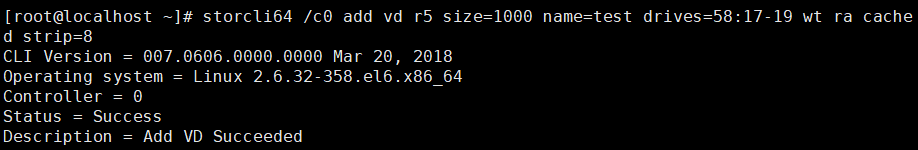 

```bash
storcli64 /c0 add vd r1 size=1000 name=test drives=58:7,11 spares=58:23
```

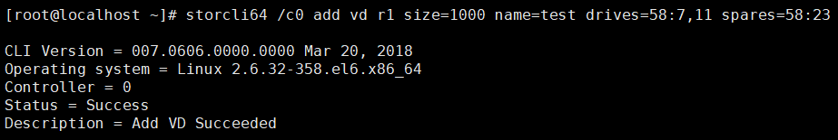 

此时磁盘信息如下：

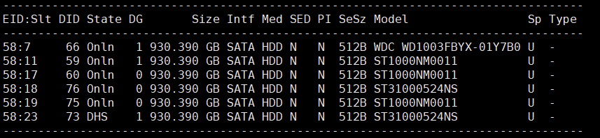 

 

## 卷组信息获取

```bash
storcli64 /c0/dall show
```

 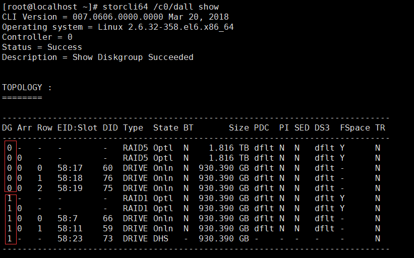

 

------


# 创建逻辑卷

命令和创建卷组一样，会自动加入卷组

 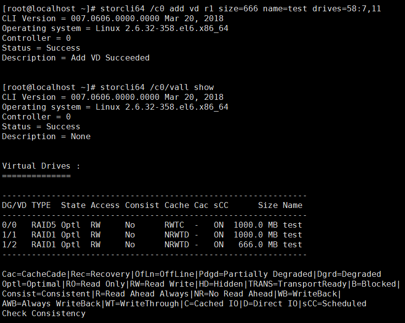 

 

## 查询逻辑卷

```bash
storcli64 /c0/v2 show all
```

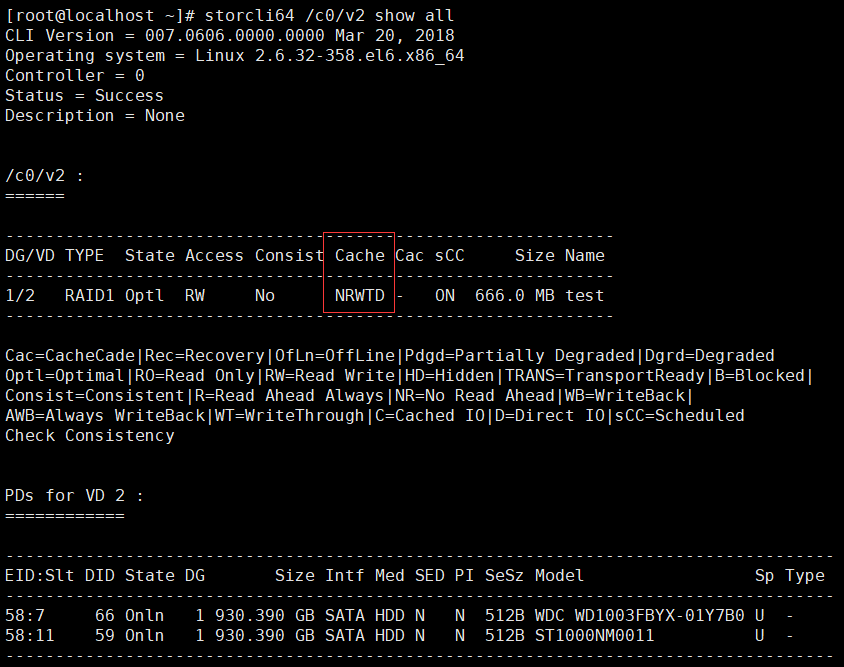 

 

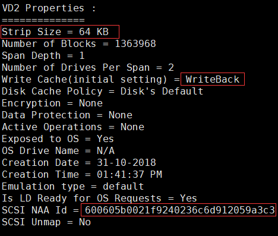 

 

## 编辑逻辑卷

```bash
storcli64 /cx/vx set wrcache=WT|WB|AWB
storcli64 /cx/vx set rdcache=RA|NoRA
storcli64 /cx/vx set iopolicy=Cached|Direct
storcli64 /cx/vx set accesspolicy=RW|RO|Blocked|RmvBlkd
```

属性的含义见 Megacli 的介绍

 

## 删除逻辑卷

```bash
storcli /cx/vx del [cachecade][discardcache] [force]
```

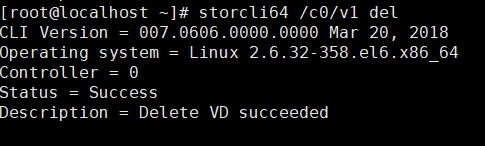 

PS：这里有个比较坑的地方就是删除卷组中间的卷，如果你再新建卷的容量大于这个空缺的话，即使卷组后面有再多的空间也创建不成功

 

## 删除RAID组

删除卷组的最后一个逻辑卷，卷组自动删除，卷组编号会自动调整

 

## 扩展卷组

只看到了这个迁移，不知道怎么扩容……

```bash
storcli64 /cx/vx start migrate type=raidx [option=add|remove drives=[e:]s|[e:]s-x|[e:]s-x,y][Force]

# 显示扩容进度
storcli64 /cx/vx show migrate　　　　　　   

# 显示扩容速率
storcli64 /cx show migraterate　　　　　　  

# 设置扩容速率
storcli64 /cx set migraterate=<value> 　　  
```

 

---

# 热备

## 全局热备

```bash
storcli64 /cx/ex/sx add hotsparedrive
```


## 局部热备

```bash
# 设置某块磁盘为diskgroup x 的热备盘
storcli64 /cx/ex/sx add hotsparedrive dgs=x
```

 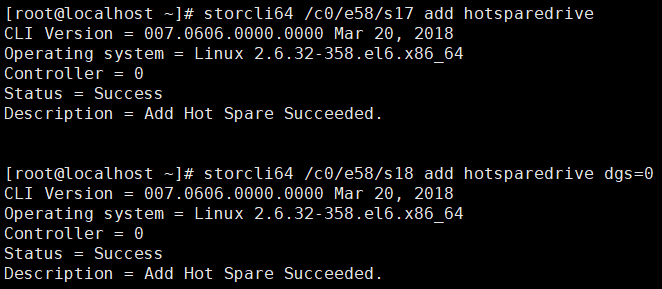 


 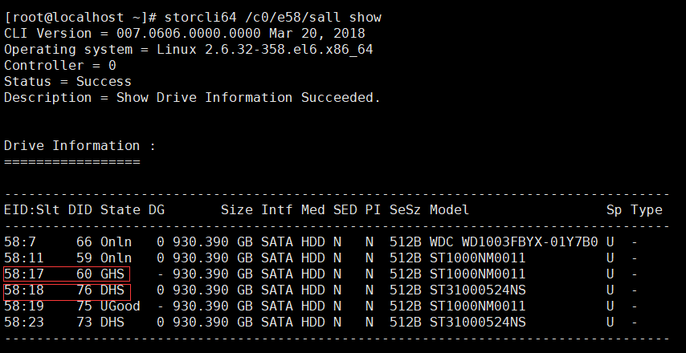 


此时下线成员盘 7

```bash
storcli64 /c0/e58/s7 set offline
```

可以看到 18 号热备盘已经顶替上进行重构了

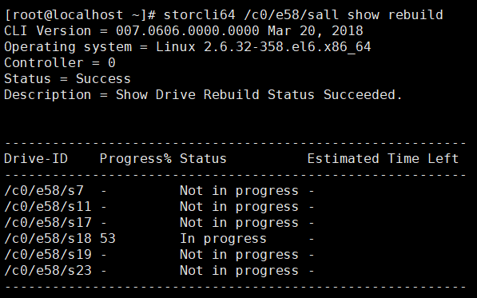 

 

然后下线 18 号盘

```bash
storcli64 /c0/e58/s18 set offline
```

23 号局部热备盘进行重构

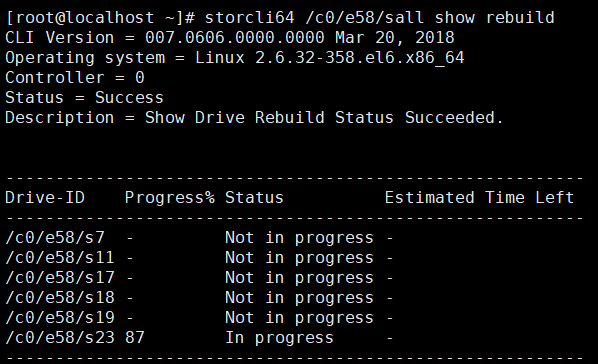 

 

此时再下线 11 号盘，全局热备盘 17 开始重构，此时 3 块热备均被使用

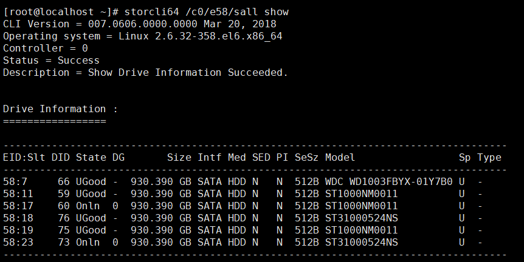 

 

---

# JBOD

确认 raid 卡支持 jbod 模式并开启 jbod 模式:

```bash
[root@localhost ~]# storcli64 /c0 show all | grep -i jbod
Support JBOD = Yes
Support SecurityonJBOD = No
Support JBOD Write cache = No
Enable JBOD = No
```

可以看到 support JBOD = Yes，也就是说 raid 卡支持 jbod 模式。但是 Enable JBOD = No , 说明当前 raid 卡没有开启 jbod 模式，此时需要手工开启。

```bash
[root@localhost ~]# storcli64 /c0 set jbod=on
CLI Version = 007.0415.0000.0000 Feb 13, 2018
Operating system = Linux 3.10.0-862.11.6.el7.x86_64
Controller = 0
Status = Success
Description = None


Controller Properties :
=====================

----------------
Ctrl_Prop Value 
----------------
JBOD      ON    
----------------
```

把指定设备设置成 jbod 模式

```bash
[root@localhost ~]# storcli64 /c0/e58/s7 set jbod
CLI Version = 007.0415.0000.0000 Feb 13, 2018
Operating system = Linux 3.10.0-862.11.6.el7.x86_64
Controller = 0
Status = Success
Description = Set Drive JBOD Succeeded.
```

查看状态

```bash
[root@localhost ~]# storcli64 /c0/e58/s7 show
CLI Version = 007.0415.0000.0000 Feb 13, 2018
Operating system = Linux 3.10.0-862.11.6.el7.x86_64
Controller = 0
Status = Success
Description = Show Drive Information Succeeded.

Drive Information :
=================

------------------------------------------------------------------------------------
EID:Slt DID State DG       Size Intf Med SED PI SeSz Model                   Sp Type 
------------------------------------------------------------------------------------
58:7    24  JBOD  -  930.390 GB SATA HDD N   N  512B WDC WD1003FBYX-01Y7B0   U  -    
------------------------------------------------------------------------------------
```

撤销 jbod

```bash
[root@localhost ~]# storcli64 /c0/e58/s7 set good force
CLI Version = 007.0415.0000.0000 Feb 13, 2018
Operating system = Linux 3.10.0-862.11.6.el7.x86_64
Controller = 0
Status = Success
Description = Set Drive Good Succeeded.

[root@localhost ~]# storcli64 /c0/e58/s7 show
CLI Version = 007.0415.0000.0000 Feb 13, 2018
Operating system = Linux 3.10.0-862.11.6.el7.x86_64
Controller = 0
Status = Success
Description = Show Drive Information Succeeded.

Drive Information :
=================

------------------------------------------------------------------------------------
EID:Slt DID State DG       Size Intf  Med SED PI SeSz Model                   Sp Type 
------------------------------------------------------------------------------------
58:7    24  UGood -  930.390 GB SATA  HDD N   N  512B WDC WD1003FBYX-01Y7B0   U  -    
------------------------------------------------------------------------------------
```

设备变回 UGood 状态，可以重新配置 raid 卷组了。


---

# 外部配置

有时候比如磁盘被插拔了，这个时候盘上还保存着 RAID 的配置信息，此时只需要导入外部配置，即可导入磁盘而不需要重建。比如我拔出一块磁盘再插入，此时查看状态为 UBad。

```bash
[root@localhost ~]# storcli /c0/eall/sall show
CLI Version = 007.1704.0000.0000 Jan 16, 2021
Operating system = Linux 3.10.0-957.el7.x86_64
Controller = 0
Status = Failure
Description = Show Drive Information Failed.

Detailed Status :
===============

--------------------------------
Drive      Status  ErrCd ErrMsg 
--------------------------------
/c0/e8/s1  Failure    46 -      
/c0/e8/s2  Success     0 -      
/c0/e8/s3  Success     0 -      
...   
--------------------------------


Drive Information :
=================

----------------------------------------------------------------------------
EID:Slt DID State DG     Size Intf Med SED PI SeSz Model            Sp Type 
----------------------------------------------------------------------------
8:1      18 UBad  -  9.094 TB SATA HDD N   N  512B WUS721010ALE6L4  U  -    
8:2      20 Onln  0  9.094 TB SATA HDD N   N  512B WUS721010ALE6L4  U  -    
8:3      22 Onln  1  9.094 TB SATA HDD N   N  512B WUS721010ALE6L4  U  -    
...
----------------------------------------------------------------------------

EID=Enclosure Device ID|Slt=Slot No|DID=Device ID|DG=DriveGroup
DHS=Dedicated Hot Spare|UGood=Unconfigured Good|GHS=Global Hotspare
UBad=Unconfigured Bad|Sntze=Sanitize|Onln=Online|Offln=Offline|Intf=Interface
Med=Media Type|SED=Self Encryptive Drive|PI=Protection Info
SeSz=Sector Size|Sp=Spun|U=Up|D=Down|T=Transition|F=Foreign
UGUnsp=UGood Unsupported|UGShld=UGood shielded|HSPShld=Hotspare shielded
CFShld=Configured shielded|Cpybck=CopyBack|CBShld=Copyback Shielded
UBUnsp=UBad Unsupported|Rbld=Rebuild

```

我们首先设置成 good 状态

```bash
[root@localhost ~]# storcli /c0/e8/s1 set good
CLI Version = 007.1704.0000.0000 Jan 16, 2021
Operating system = Linux 3.10.0-957.el7.x86_64
Controller = 0
Status = Success
Description = Set Drive Good Succeeded.
```

然后再导入所有外部配置，也可以先用 `storcli /c0/fall show` 命令查看外部配置信息，然后导入某个具体的外部配置。

```bash
[root@localhost ~]# storcli /c0/fall import
CLI Version = 007.1704.0000.0000 Jan 16, 2021
Operating system = Linux 3.10.0-957.el7.x86_64
Controller = 0
Status = Success
Description = Successfully imported foreign configuration
```


---

# 常见问题处理

 ### TODO