# 快照原理简介

快照就类似于现实中的照片，在某个时刻可以用相机把图片定格。数据的快照就是指能够把某个时刻的数据定格，以方便以后能够恢复到那个时间点数据的状态。

基本实现思路有两种：

- Copy on First Write (CoFW)：在覆盖数据块之前，需要将被覆盖的数据块内容复制出来，放到空闲的空间。系统中将有两套元数据链，原来的元数据指向当前，快照的元数据链指向历史。原来的存储空间永远是最新的数据，历史数据会逐渐搬出到空闲空间里面。

- Redirect on First Write (RoFW)：将针对源文件的更改都重定向到空余空间，同时更新元数据。与 CoFW 不同的是，原来的数据块不会被覆盖。同样的，系统也有两套元数据，一套是快照保存下来的，永远不更新，一套是源文件系统的，不断的更新。

下面我们用两个设计实例来讲解这两种方式的工作模式，加深对快照的理解，如有错误，欢迎指出。

​	

---

# 基于CoFW的设计

## 工作流程

文件系统初始数据如下图。

本文不关注数据在磁盘上具体存储情况，而是以抽象出来的逻辑块来讲解。我们把块设备空间划分成块，如下图，数据 A0 存储在逻辑块 0，数据 B0 存储在逻辑块 2，以此类推。

文件系统映射表保存着数据和保存地址的对应关系，当上层要更改数据 A0 时，会寻址到逻辑地址 0 进行接下来的操作。

IO 仓库用来存放变化的 IO 块。

 

T0 时刻，系统触发快照，此时创建一份针对 T0 时刻的快照 S0 的地址映射表 F0，表示对应快照的逻辑块被复制的映射关系，左侧栏以逻辑块号作为 key，右侧栏表示复制数据保存在 IO 仓库的地址。

 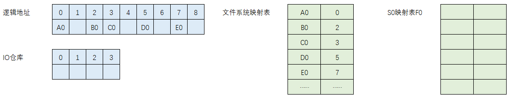

T1 时刻，上层应用将 B0 数据更新为 B1，此时发出的请求是将逻辑块 2 的数据更新为 B1。

CoFW 表示 Copy on First Write，也就是在第一次变更的时候要把数据复制出来，这样 T0 时刻的数据就总是能被保存下来。

系统查看 F0，发现没有对应条目，也就是还没有执行过复制，此时执行 CoFW。

首先将逻辑地址 2 中的数据 B0 拷贝到 IO 仓库地址 0 的地方，更新 F0，意思表示逻辑地址 2 的数据已经被复制保存在 IO 仓库 0 位置上了。

然后将 B1 覆盖写入逻辑地址 2，更新文件系统映射表。

 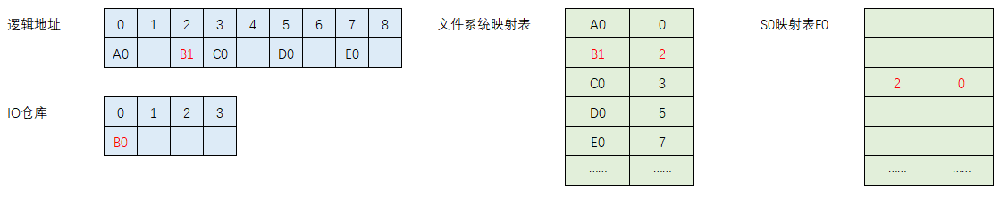

T2 时刻，C0 更新为 C2，流程同上。

并在此时系统再次触发一份快照 S1，映射表为 F1。

 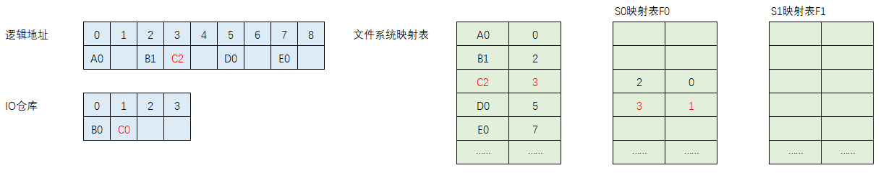

T3 时刻，B1 更新为 B3。

系统发现 F1 没有针对逻辑地址 2 的对应条目，进行 CoFW 操作，将数据拷贝到数据仓库，更新相关数据表。这里为了方便我只用了一个 IO 仓库来保存所有的快照数据。

系统检查 F0 表发现已经复制过当时时刻的数据了，所以无需任何更新。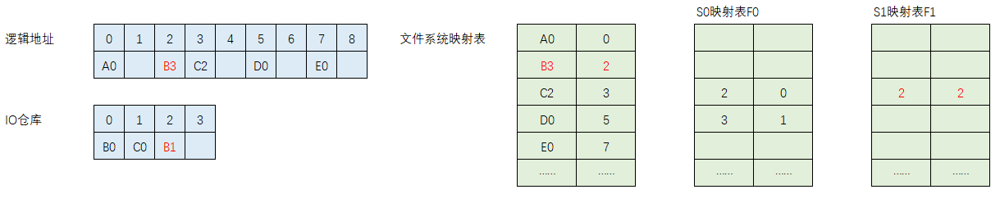

T4 时刻，将 A0 更新为 A4。

系统发现 F0，F1 均没有对应表项，首先将 A0 拷贝到 IO 仓库，然后更新快照映射表。

最后将 A4 写入，更新文件映射表。

此时 IO 仓库容量已满，后续如果再有数据更新需要扩容。

 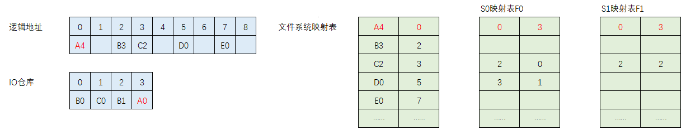

T5 时刻，B3 更新为 B5。

系统发现 F0，F1 均更新过，无需进行 CoFW。

将 B5 更新，更新文件映射表。

 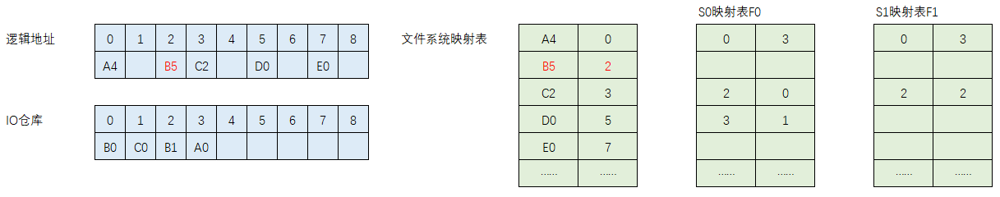

可以看到，CoFW 模式下写入数据需要查询所有历史快照映射表以确认是否需要拷贝数据，这个影响是一直都会有的。

对于读请求，任何时刻都能直接通过文件系统映射表来查询数据，无需查询快照映射表。

 

 

## 客户端挂载快照

用户想访问某一时刻的快照，则可以使用挂载操作。

T6 时刻，客户端挂载快照 S0。

T8 时刻，客户端请求逻辑地址 0 的数据，F0 表中查询到对应表项，从 IO 仓库 3 读出 A0 返回。

T9 时刻，客户端请求逻辑地址 5 的数据，F0 表未查询到数据，从源表查询中找到逻辑地址 5 读出 D0 返回。

> [!NOTE]
>
> 查询线程在查找映射表之前，必须先向 CoFW 线程查询当前时刻是否存在针对源物理卷的写 IO，如果有，IO 地址是否恰好为查询的地址，如果是，则查询线程要等待 CoFW 完成再去查询映射表，此时就可以查到最新数据了。
>
> 如果查询线程结果是从源物理卷读取内容，则在查询线程读取完成之前，CoFW 不能针对这个地址操作，否则查询线程可能读取的是最新刚被写入的数据而不是对应以前快照时刻的数据了。

对于客户端来说，它挂载 S0 后文件系统看到的内容如下，即在 T0 时刻数据的样子：

 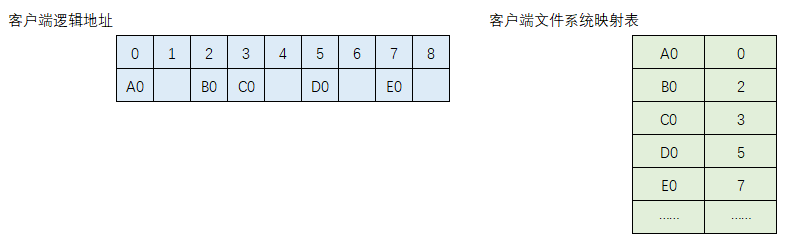

T10 时刻，客户端更新 A0 为 A10。

因为客户端不能影响原系统，所以此时需要对新 IO 单独放在另一个地方，数据可以放入 IO 仓库或其它设计，这里我们直接使用 IO 仓库，增加 RoFW 表来记录重定向的 IO。

首先将 A10 写入 IO 仓库，此时逻辑块 0 的数据被更新，但此时逻辑块 0 还被存储系统使用着，如下图，里面保存着 A4，我们不可以覆盖掉，所以我们需要找一块空间来保存更新后的数据，用 RoFW 表来保存，我们分配 IO 仓库的 4 号地址，更新 RoFW 表，表示客户端使用的逻辑块 0 的地址的数据实际在 IO 仓库 4 号地址上。

 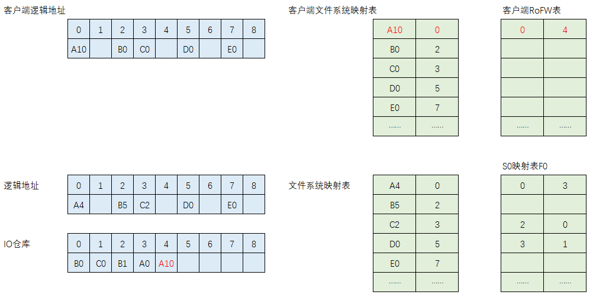

T11 时刻，客户端读取 A10，首先查看 RoFW 表，发现存在表项，表示挂载快照后客户端有修改过，于是从 IO 仓库 4 中读出 A10。

T12 时刻，客户端读取 B0，RoFW 表未查到表项，表示还未被客户端更新过，于是查询 F0 表项，找到了逻辑块 2 对应的地址，表示有被原存储系统修改过，于是从 IO 仓库 0 读出 B0。

T13 时刻，客户端读取 E0，RoFW 和 F0 均未查到表项，表示从快照开始，数据一直没有被修改过，于是从源文件系统映射表查询得到从逻辑地址 7 读出 E0。

上述过程同样考虑线程依赖关系。

## rollback

用户想将数据回滚到历史某个时刻，就像坐上时光机，这个操作就是 rollback。

T14 时刻，客户端发出指令要求将快照 S0 回滚覆盖源物理卷。

在 rollback 之前主机客户端一定要把缓存里的数据刷新到源卷，不然源卷被恢复之后，缓存里的数据再写下去，数据就不一致了。所以一般在 rollback 之前，索性先 umount 掉，rollback 完成再 mount 回来。

这里可以前台或后台操作，前台操作即等回滚完毕之后才能进行 IO 操作，但为了保证友好性，设计为后台操作，即直接返回成功。

此时因为主机认为成功了，可能就会继续有读写 IO。

 

T15 时刻，系统开始执行与挂载快照读写时相同的操作，即将新写入的数据重定向，并记录在 RoFW 表里。但是在后台，系统会将原先 CoFW 的数据以及被 RoFW 的数据覆盖到源物理卷对应地址上。

在处理客户端写 IO 请求时也可以直接将覆盖源卷对应地址，无需 RoFW，节约一轮 IO 操作，这时要记录每个在 Rollback 开始与完成之间发生的写 IO 地址以便 Rollback 时跳过这些地址。

同时，线程依赖关系必须考虑。

 

T15 时刻，所有条目都被恢复之后，F0 表和 RoFW 表被删掉，此刻之后，就相当于 S0 快照没被创建过，系统只剩下 S1 快照。

>[!NOTE] 
>
>两个注意点：
>
>- 比如 S0 快照恢复时，要覆盖 S1 的基准块如C2，如果此时要保存 S2 快照，那么就需要先把 C2 拷贝到 IO 仓库然后更新 F1 表之后再恢复 C0，即在做覆盖操作之前，必须参考恢复快照点之后所有快照点的映射表，一旦任何一份表中对应的地址没有映射条目，就要 CoFW 操作。
>- rollback 没有完成之前，有新的快照建立，新快照的 CoFW 操作过程和后台 rollback 操作冲突，除非引入额外的 CoFW 操作才能保持数据一致性。

 

 

## 卸载和删除

T14 时刻， 客户端卸载 S0 快照，系统接收到请求后，删除 RoFW 映射表，其他不做更改。如果再次挂载，则产生新的干净的 RoFW 映射表。

如果客户希望卸载虚拟卷之后系统仍然保持所做的更改，则需要通知系统创建一份针对 S0 的克隆卷（clone），所谓的克隆卷也不过只是永久保存 RoFW 映射表而已。

 

T15 时刻，系统请求删除快照 S0，此时扫描所有快照映射表，找出只有 F0 存在而其余映射表不存在的表项，将对应 IO 仓库对应位置置为空闲。

查询完毕发现 IO 仓库 0 和 1 位置是只给 S0 使用的，置为空闲，然后删除表 F0。这个过程依然涉及线程依赖。

 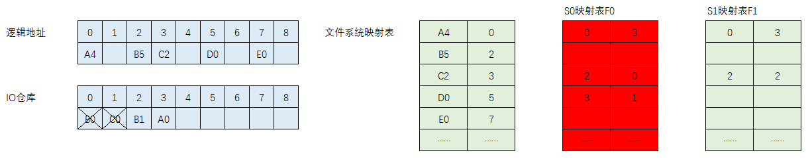

 	

 

------

# 基于RoFW的设计

## 工作流程

文件系统初始数据如下图。

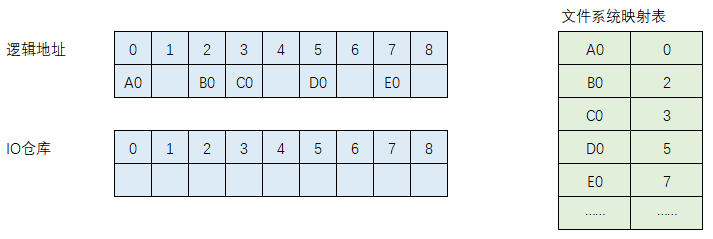 

T0 时刻，触发快照 S0，创建对应的映射表 F0，映射表表示新写入数据的逻辑块地址和 IO 仓库的重定向映射关系，左侧栏以逻辑块号作为 key，右侧栏表示重定向数据保存在 IO 仓库的地址。

 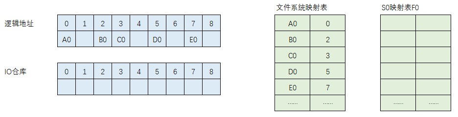

T1 时刻，写入 A1。

系统直接将 A1 写入 IO 仓库，更新 F0，表示逻辑地址 0 的数据被重定向到 IO 仓库位置 0 处了。

源卷自身永远都是 S0 时刻的影像，永久冻结，拒绝写入，除非所有快照都被删除。

 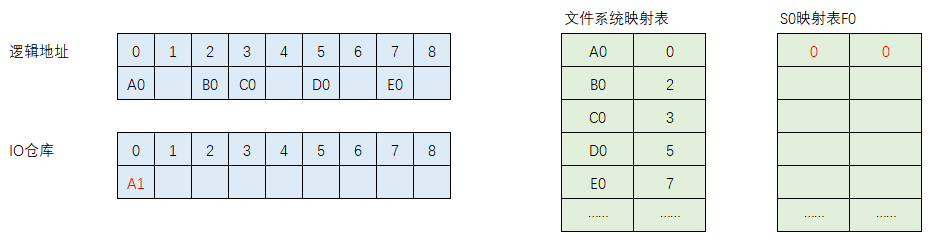

T2 时刻，写入 C2，流程同上。写完之后触发快照 S1。

 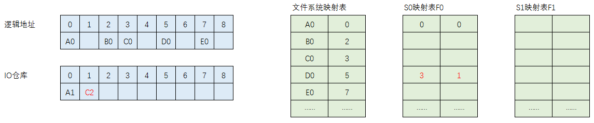

T3 时刻，写入 A3。

此时源卷，F0 以及 F0 对应 IO 仓库的数据共同构成了 S1 快照的基准卷，这三者共同体也将会被永久冻结。

IO 仓库写入 A3 后，更新 F1。

 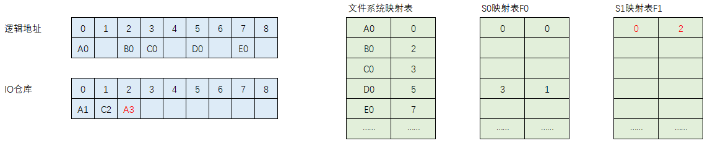

T4 时刻，写入 A4。

此时，系统检查最晚的映射表即 F1 是否有对应条目，如果有，则将 A4 在 IO 仓库覆盖 A3。

映射表不做任何更改。

 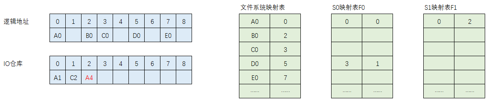

T5 时刻，B5 写入。

系统检查 F1 中没有对应的条目，将 B5 写入 IO 仓库空闲位置，更新 F1。

 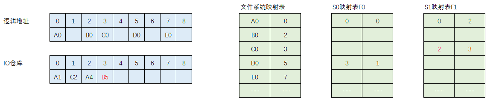

T6 时刻，系统要读取逻辑地址 0 和 5 的数据。

系统先检查最后一张表即 F1，发现了逻辑地址 0 对应的条目，从 IO 仓库 2 位置读取 A4。

F1 没有找到逻辑地址 5 的条目，寻找上一张表，依旧没有，于是从源卷逻辑地址 5 读出 D0。

T7 时刻，触发快照 S2，创建 F2，此时 F0，F1 均被冻结。

写入A7，D7

F2 中均没有对应条目，将数据写入 IO 仓库并更新 F2。

 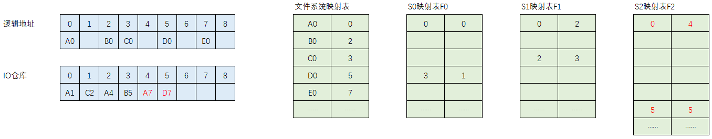

 可以看到，RoFW 模式下写入数据都是直接更新映射表，不像 CoFW 需要查询所有历史快照映射表以确认是否需要拷贝数据。

相反，对于读请求，CoFW 任何时刻都能直接通过文件系统映射表来查询数据，无需查询快照映射表，而 RoFW 在当前映射关系中没有找到条目时需要向前查询。

## 客户端挂载快照

T8 时刻，客户端挂载 S0 快照。

S0 其实就是当前物理源卷，客户端发起的读请求直接对应到源卷，不牵扯任何映射运算。

 

T9 时刻，客户端挂载快照 S1。

客户端读取内容时先去查询 F0，没有找到条目就会从文件系统映射表上读取。

比如读取逻辑地址 0，会从 IO 仓库中读取 A1；读取逻辑地址 2，会从源卷读取 B0。

这里要搞清楚的是本次快照影响实际是由源加上一次快照共同冻结而成，而最后一份快照映射表指针表示源最新数据状态，而不是这份快照时刻的状态。

> [!NOTE]
>
> RoFW 设计模式不像 CoFW 模式存在线程依赖关系，对快照虚拟卷的读操作不会对源卷的写操作有任何的牵连和影响。

 

T10 时刻，系统受到针对 S2 快照的写操作，与 CoFW 模式相同，这里也是建立一个针对 S2 的 RoFW 数据映射表，后续读数据也是先查这个表。

 

## rollback

T11 时刻，客户端要求将 S0 回滚。

由于 S0 快照点就是当前源物理卷，所以不需要任何额外操作，直接就完成了。

 

T11 时刻，客户要求将 S1 回滚，这里不保留任何其它的快照。

系统首先将 F1 之前的映射表做合并，如果在多个表有相同条目，则保留最晚的表条目。我们看到 F0 表中逻辑块 0 和 3 分别重定向到了 IO 仓库的 0 和 1，也就是我们把 A1 和 C2 覆盖回去。处理完毕后，IO 仓库清空，rollback 完成。

这个过程中遇到写 IO 处理流程同 CoFW。

 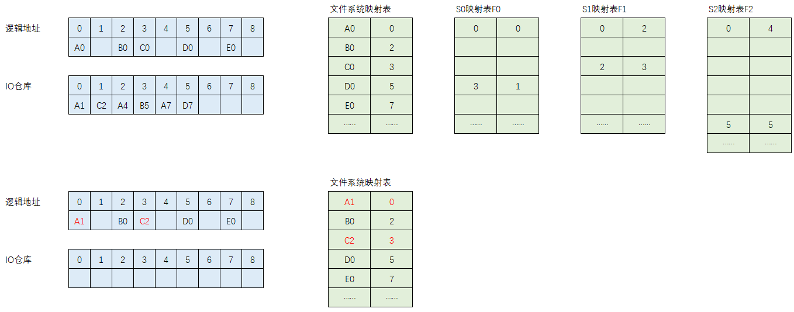

 

 

## 删除

T11 时刻，删除快照 S0。

比较 F0 和后面的映射表，只在 F0 中有的条目，将数据拷贝回源卷，并将 IO 仓库对应位置置为空闲。

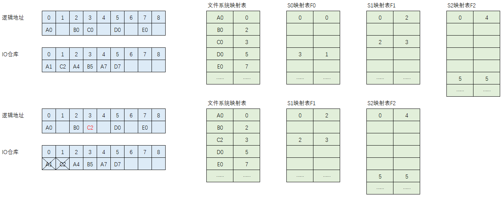

也可以将只在 F0 中存在的表项移到 F1 中。

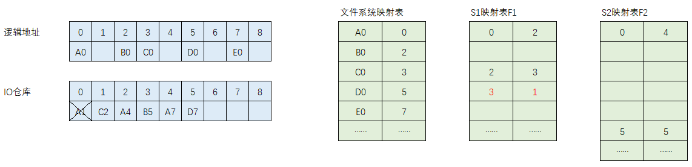

 