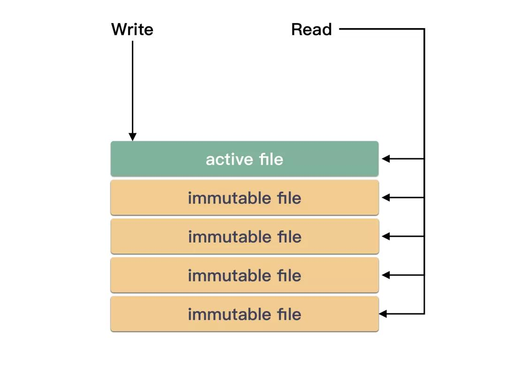
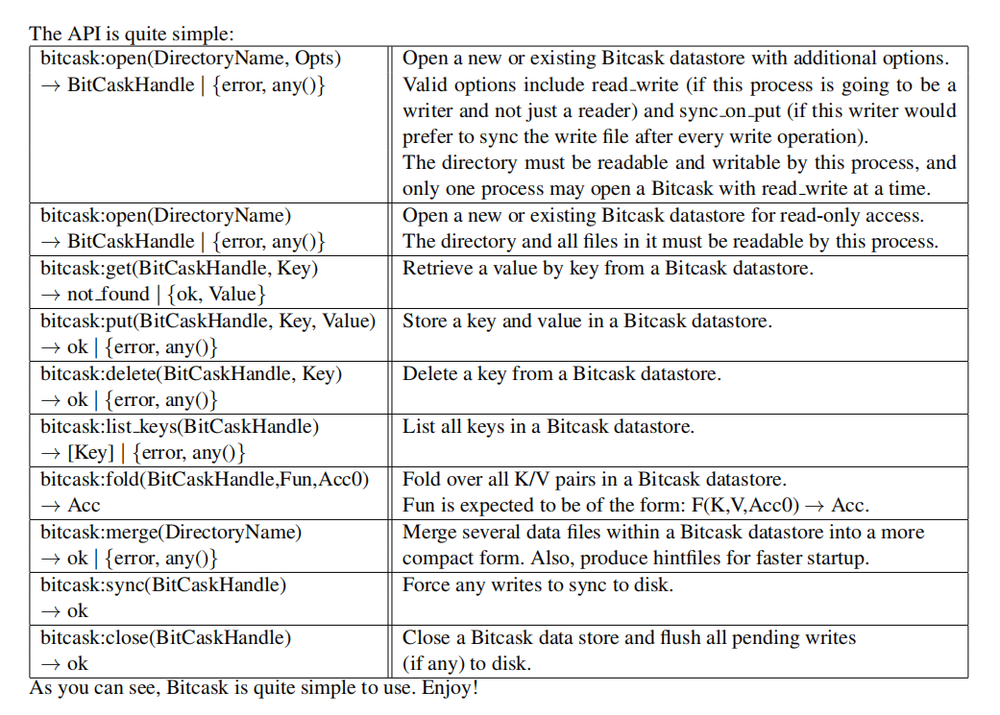

# Bitcask 是什么?

Bitcask 是一种很有趣的存储模型的设计，这是一种底层格式为日志模样的 kv 存储。Bitcask 起源于 Riak 分布式数据库，Bitcask 论文详细介绍了它的由来。


---

# Bitcask 解决哪些的问题?

简单梳理了下 Bitcask 论文中提到的架构设计目标：

- 读写的低时延；
- 高吞吐，特别是对大量的随机写入；
- 能够处理超过内存容量的数据；
- 持久化后的存储，崩溃恢复友好，能够保证快速恢复；
- 也要方便备份，方便恢复；
- 相对简单、易懂的代码结构和数据存储格式；

符合这些目标的会是哪些场景呢？下面一步步看一下。


---

# Bitcask 架构设计

## 整体设计

- 要点一：基于文件系统，而非裸盘

这样管理空间就方便了，而且可以把一些功能交给内核文件系统，比如读 cache，写 buffer 等。


- 要点二：一个磁盘只有一个写入点

换句话说只有一个可写的文件。这个文件叫做 **active data file**，其他的为只读文件。active data file 写到一个预定的阈值大小之后，就可以轮转成只读的文件。

比如，active data file 写到 10G 大小就不写了，切成只读模式，新建一个文件来写。这个新文件就变成 active data file 。


- 要点三：active data file 只有 append 写入

日志文件的标配嘛，永远 append only，这样才能保证最大程度的顺序 IO，压榨出机械硬盘的顺序性能。


- 要点四：删除也是写入

这个其实承接上面的。也是日志类型文件采用的手段，删除操作实际上也是一次追加写入，只不过写入的是一个特殊的墓碑值，用于标记一条记录的删除，也就是说不会实际去删除某条数据。外面看来的原有对象的更新其实是操作日志的记录，这样才能最大限度的保持顺序 IO 。


- 要点五：日志式文件本质是无序文件，依靠内存索引

在 LSM 的架构中也提供，日志文件只做 append，从用户内容来看是无序的(写入时间上看是有序的)，所以为了解决读的问题，必须要靠各种索引结构来解决，在 LSM 里就是通过构建内存的跳表来解决索引的问题。

在 Bitcask 也是如此，Bitcask 在内存中构建所有 key 的 hash 表解决这个问题。


- 要点六：空间的回收叫做 merge ，其实就是 compact

随着 Bitcask 存储的数据越来越多，旧的数据也可能会越来越多。Bitcask 内部的回收流程叫做 merge ，其实就是 compact ，原理很简单：遍历文件，读旧写新，遇到标记删除了的内容丢掉即可。


- 要点七：文件 merge 之后，顺带生成一份 “hint file”

Bitcask 的索引全构建在内存，换句话说，就是在进程启动的时候要解析所有的底层日志文件。那这时候底层文件的大小、内部对象数量的多少就决定了你构建的快慢，Bitcask 为了加速构建，所以提前把一些元数据信息放到尾端。这样进程启动的时候，就能直接读 “hint file” 来获取元数据了。


## 架构图

Bitcask 是基于文件系统的：

[](https://s2.51cto.com/oss/202201/04/b9be172337ba2bf343f50fb2b4171606.jpg)

Bitcask 只有一个可写的文件。可写的文件叫做 active file，只读的叫做 immutable file：

[](https://s6.51cto.com/oss/202201/04/ac560612c3394b3b68943591a8330d4e.jpg)

Bitcask 它的文件是有格式的：

- crc：Cyclic Redundancy Check / 循环冗余校验，是一种根据文件数据产生简短固定位数校验码的一种信道编码技术，主要用来检测或校验数据传输或者保存后可能出现的错误；
- timestamp：32位整形时间戳；
- key size：key 的大小；
- value size: value 的大小；
- 最后两部分就是 key 和 value 的值。

[](https://s5.51cto.com/oss/202201/04/d43a12a36bad0ad88fa3f130c2c9e199.jpg)

Bitcask 它内存的索引大概是这样的：

[](https://s2.51cto.com/oss/202201/04/60bb18374d6b8f6ebc320841b39f10fb.jpg)

## 写入

写入的过程很简单，Bitcask 先写文件，持久化落盘之后更新内存 hash 表。

1. 写日志文件，返回 file_id, offset, size 等关键信息;
2. 更新内存 hash 表内容，把用户 key 和上面的位置信息关联起来;

思考两点：

- 从 IO 次数来看，磁盘 IO 只需要整体落一次就够了，不需要单独写索引;
- 从 IO 模型来看，写永远都是顺序 IO，对机械盘来讲，性能最优;


## 读取

读取的过程很简单，先在内存 hash 表中查找用户 key ，从而获取到用户 value 在日志文件的位置。

```text
file_id: 标示在哪个文件； 
offset : 标示在文件的开始位置； 
size   : 标示值的长短（结束位置）； 
```

通过以上三个信息，就能找到对应的文件取回数据了。

[](https://s4.51cto.com/oss/202201/04/fe607fd7e20b0e43ff305636697b37cc.jpg)

总结下读的流程：

1. 在内存 hash 表中找到 key 的值的文件位置;
2. 下盘读数据;

思考两点：

- 从 IO 次数来看，这里性能应该还是不错的，因为只有读数据的时候才需要磁盘 IO ;
- 从 IO 模型来考虑，读是非常大概率导致随机 IO 的，但这个可以依赖于文件系统的缓存，读过的数据将可以加速访问;


## 回收

Bitcask 回收的流程叫做 merge，merge 流程如下：

1. 遍历当前实例中的所有只读文件，比如 10 个；
2. 经过一些算法，计算出冗余的历史 entry，将其丢弃，产出一组新的 data file，这组文件只包含所有 key 最新的版本（由于经过合并，这里文件数量会小很多，比如 3 个），这组文件我们称之为 merge data file；
3. 针对每个 merge data file，都生成一个 hint file，作为一个目录/索引，只包含 value 的位置，大小等，不包含实际 value 值。

但简单的东西往往有内涵，在前面我们提到，用户的写入为了顺序化采用了日志的格式，但是 merge 这个是后端程序有时候会和前段的写入并发执行的，但底下磁盘只有一块，两个都是顺序 IO ，但并发起来就成随机 IO 了。所以它的精细之处就在于 merge 的时机选择和速率，这个也是它的含金量之一。

前面提到，Bitcask 为了索引 key/value 的位置，在内存中构建了全部的索引关系。这个构建在初始化的时候可能会非常耗时，因为要遍历全部的日志文件。怎么解决这个问题呢?

干脆直接把这个索引关系在合适的时机准备好，进程启动加载的时候，直接读这部分数据就行了。

最合适的时机不就是 merge 过程嘛。merge 过程无论怎样都要遍历了一次文件，生成一份索引关系归档起来就是顺手的事情。这份归档的索引关系在 Bitcask 里叫做 “hint file” 。

划重点：内存的索引内容和文件的 “hint file” 是对应的。


---

# 目标VS设计

我们来看看 Bitcask 这一套设计是如何满足一开始提出的目标的

- 读写的低时延

顺序写文件，读取也只需要访问一次磁盘

- 高吞吐，特别是对大量的随机写入

同上

- 能够处理超过内存容量的数据

内存里只保存索引，实际内容保存在文件中

- 持久化后的存储，崩溃恢复友好，能够保证快速恢复；

一般日志文件系统通过 WAL 来保证一致性和恢复，但是 Bitcask 它本身就相当于 WAL

- 也要方便备份，方便恢复

我们只有一个文件接收写请求，其他的全是 immutable的，所以想做恢复或者备份，无非是把 data file 拷贝到一个新的目录，非常简单。

- 相对简单、易懂的代码结构和数据存储格式

这一点不用多说，官方提供的接口也是相当简单




---

# 局限性

每一种设计都有它针对的场景，通用的东西往往是平庸的。Bitcask 它也是如此，它不适用于所有场景，那它适用哪些场景呢?

Bitcask 主要是持久化日志型文件加上易失的内存 hash 表组成。

这里有很多可以思考的关键点：

- 内存 hash 表到底有多大?
- Bitcask 它适合存储多大的数据?
- Bitcask 它适合存储大对象还是小对象?

为了回答上面几个问题，需要假定一些数据结构：

**日志结构：**

```
|crc|timestamp|key size|value size|key|value| 
```

我们假设前面头部元数据用 4+4+4+4 个字节。

**hash 表的结构：**

```
key -> |file_id| record size | record offset | timestamp | 
```

假定是 4+4+4+4 个字节(注意，由于这里用 offset 用 4 个字节表示，所以日志文件寻址范围在 0-4G 之间)。

进一步假设用户 key 的平均大小为 32 字节。


## 内存 hash 表到底有多大?

一个 key/value 在内存中最少占用 32+16 字节，假设 32 GiB 的内存，那么可以存储 32 GiB/ 48 Byte = 715,827,882 个索引。

7 亿个健值对?

貌似还挺多，但也不一定。很多人对这个没什么概念，我们再推进一个假设，假设用户 value 平均大小是 8 KiB，那么就能算得的总空间是 ( 715,827,882 * 8 * 1024 ) / ( 1024 * 1024 * 1024 * 1024 ) = 5.3 TiB 。

5.3 TiB ?

实话实说，貌似不太大。现在一个机械盘 16 TiB 的都很普遍了。

现在反过来推算下，假设现在有一个 16 TiB 的盘，用户 key 平均 32 字节，value 平均 8 KiB，如果写满的话，需要多少内存?

算一下，( 16 TiB / (16+32+8KiB) ) * 48 Byte = 95 GiB ，一个 16 TiB 的盘写满的话需要 95 GiB 内存来存储它的索引。这其实是很大的开销，因为一台机器可能 64 块盘。。。。95 GiB * N 的内存消耗能抗的住吗?

而且索引全内存构建，这个构建时间你能接受吗?如果说满载的数据构建要 1 个小时，你还会接受吗? 当然不。


## Bitcask 它适合存储多大的数据?

那到底 Bitcask 适合存储多少数据呢?

这个没有标准答案，还是要看场景分析。就拿我上面举的例子来讲，对于 60 盘( 单盘 16 TiB )的场景来讲，原生的 Bitcask 可能就不大适合。

对于某些动辄就说 Bitcask 适合存储海量小对象而不加任何前提的说法，还是不够严谨。

在 这篇Bitcask 论文[1] 中其实有这么一段话

> The tests mentioned above used a dataset of more than 10×RAM on the system in question, and showed no sign of changed behavior at that point. This is consistent with our expectations given the design of Bitcask.

它这里的基本目标好像是 10 倍的 RAM ?

假设内存 32 GiB，那换算下就是 320 GiB 的磁盘空间。这似乎是内存 + SSD 盘更适合 Bitcask 的场景，而不是真正超大容量 HDD 磁盘存储的场景。


## Bitcask 它适合存储大对象还是小对象?

这个就很有意思了，Bitcask 能不能存储海量数据相信通过的计算读者已经有数了。但是它适合的是大对象还是小对象呢?

这个其实还是比较明显的，Bitcask 无疑是适合小对象的。理由很简单，它从设计上就规定了只有一个写入点( active file )，也就是说用户的写入是串行的，那么如果说用户的 value 特别大，比如 100 M，那么系统吞吐会非常差(比如说，这个时候来了个 1K 的对象，却只能排队)。而如果都是些小对象，那么完全可以聚合很多 key/value，一次性落盘。这样既满足了顺序 IO ，又提供了很好的系统的吞吐能力。

所以这里很重要的一点是：对象的大小。架构的设计受此影响颇深。

抛出一个思考的问题：你认为什么样的才是小对象?

笔者认为，大小不够一笔 IO 的都可以认为是小对象。比如说某系统 IO 落盘以 1M 为单位，那么 1M 以内的都可认为是小的对象，这样就可以很好的做到 IO 的聚合，这也是 Bitcask 非常适合的场景。这样就能做到：即使底下是串行的写入也能提供用户并发的性能。当然这个并不严谨，实际情况要具体分析。


---

# 参考与感谢

- [官方论文](https://riak.com/assets/bitcask-intro.pdf)

- [存储架构｜Bitcask 引擎的设计，秒！](https://www.51cto.com/article/697752.html)
- [数据库存储系列（3）解析 Bitcask 存储引擎原理](https://juejin.cn/post/7127974803197132807)

​	