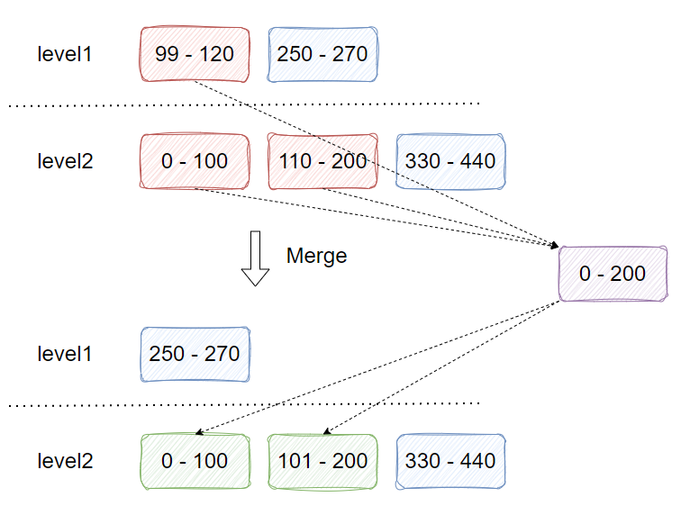
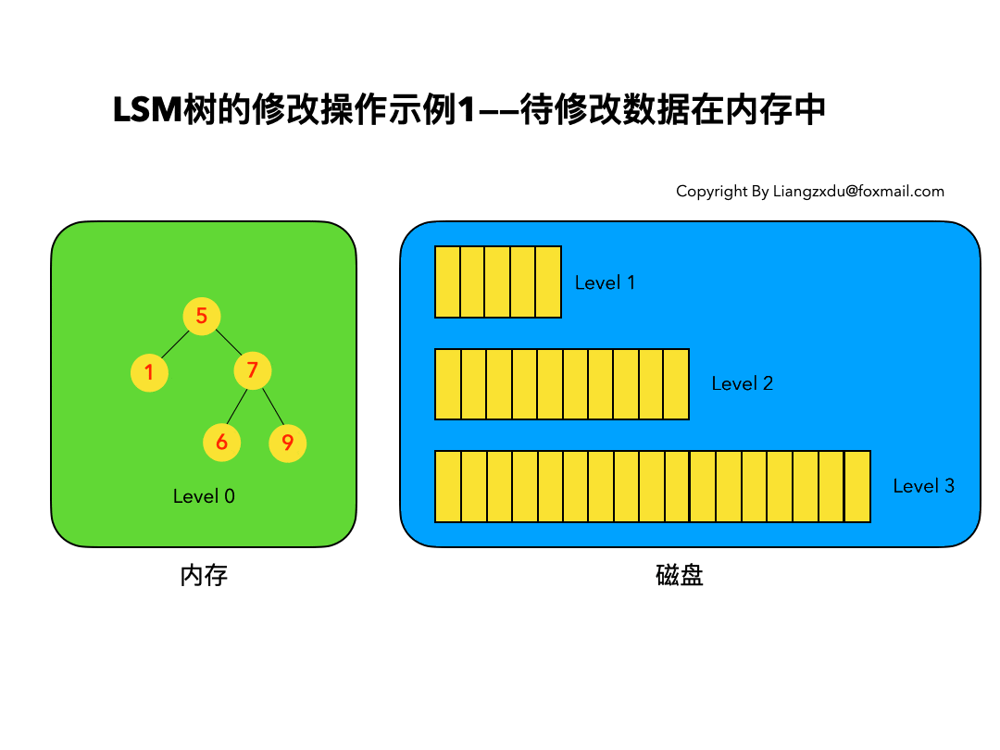
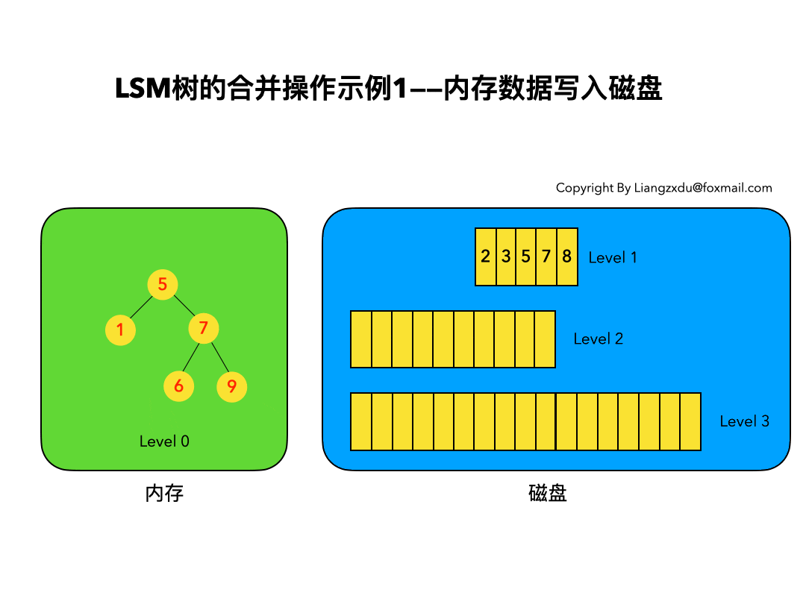

# 前言

十多年前，谷歌发布了大名鼎鼎的三驾马车的论文，分别是 GFS（2003年），MapReduce（2004年），BigTable（2006年），为开源界在大数据领域带来了无数的灵感，其中在 BigTable 的论文中很多很酷的方面之一就是它所使用的文件组织方式，这个方法更一般的名字叫 Log Structured-Merge Tree。在面对亿级别之上的海量数据的存储和检索的场景下，我们选择的数据库通常都是各种强力的 NoSQL，比如 Hbase，Cassandra，Leveldb，RocksDB 等等，这其中前两者是Apache下面的顶级开源项目数据库，后两者分别是 Google 和 Facebook 开源的数据库存储引擎。而这些强大的 NoSQL 数据库都有一个共性，就是其底层使用的数据结构，都是仿照 BigTable 中的文件组织方式来实现的，也就是我们今天要介绍的 LSM-Tree。

LSM-Tree 全称是 Log Structured Merge Tree，是一种分层，有序，面向磁盘的数据结构，其核心思想是充分了利用了磁盘批量顺序写速度要远比随机写性能高，围绕这一原理进行设计和优化，以此让写性能达到最优，正如我们普通的 Log 的写入方式，这种结构的写入，全部都是以 append 的模式追加，不存在删除和修改。当然有得就有舍，这种结构虽然大大提升了数据的写入能力，却是以牺牲部分读取性能为代价，故此这种结构通常适合于写多读少的场景。

故 LSM 被设计来提供比传统的 B+ 树更好的写操作吞吐量，通过消去随机的本地更新操作来达到这个目标。

## 负载类型

存储组件的使用场景根据读写频次的不同，可以分为**读多写少**以及**写多读少**的类型。以适用于不同类型的使用场景为目标，存储组件在设计时会根据侧重点的不同采用不同的思路和策略。

面向读多写少场景的一例典型是 mysql 中的 innodb 存储引擎，底层基于 B+ Tree 这一数据结构进行存储文件的组织和管理。

而我们今天要聊到的话题是关于写多读少的使用场景，探讨到的主角是 kv 型存储组件 rocksdb 及其底层采用到的 lsm tree。

## 更新方式

在基于磁盘的 kv 型存储组件中，针对于写操作的实现方案包括**原地写**和**追加写**两种，其区别主要体现在更新数据的操作流程当中：

- 原地写：

倘若要针对一组 kv 数据执行更新操作，首先要找到 kv 旧数据的所在位置，再在其基础之上执行进行更新，这个过程涉及到磁盘的随机 IO，因此性能较差。

与之相对，在执行读操作时，可以根据 k 寻找到 kv 数据所在位置并直接拿到查询结果，因此读操作效率相对较高，且具有着不错的空间利用率。

- 追加写：

追加写类型的写操作中，无须区分本次写操作是插入还是更新，而是选择将 kv 对以追加的形式直接插入到文件的末尾位置，因此不涉及磁盘的随机 IO，只需要执行顺序 IO 操作，在写流程中的执行性能相较于原地写而言有较大的提升。

然而大家应该也注意到了，追加写策略在提升写操作效率的同时，所付出的代价是导致同一组 kv 对可能产生多份冗余数据，而除了最新记录外，此前的数据记录实际上都是无用的，因此会存在空间浪费的情况。

也正是因为这一原因，追加写策略下的读流程性能是比较差的. 每次根据 k 查询数据时，都需要沿文件末尾向前反向遍历追溯，直到找到第一笔满足条件的 kv 对数据为止，在这种模式下，查询操作变成了线性时间复杂度，是无法接受的。

 

---

# LSM 设计思路推演

本章我们从零出发，和大家一起推演出 lsm tree 的设计思路。

首先明确目标，我们需要解决的是写多读少的使用场景，在此之上提出的核心诉求包括：

- 由于写操作是最核心的使用场景，因此需要以提高写效率作为首要目标
- 读效率可以适当牺牲，但也需要保证在有限的容忍度范围以内

在此基础之上，我们很自然地想到使用追加写策略是较优的选择。于是我们需要考虑的问题就是，在继承顺序写所带来的优势的同时，如何尽可能去规避或者弱化其存在于读流程以及空间利用率方面的劣势。

## 追加写存在的问题

首先再梳理一下追加写（顺序写）策略所存在的问题：

- 数据冗余（空间浪费）

顺序写无视 k 之前的存储状态，简单粗暴地追加完成数据的写入或者更新操作，因此不可避免地存在一组 kv 对对应多份冗余记录的情况。并且，除了最后一笔记录之外，此前多笔老数据都属于无用的冗余数据。考虑一个最极端的场景，在对顺序写策略不执行任何优化改进的前提下，只需要一笔 kv 对数据，采用无限次写操作即可打满磁盘空间。

- 读性能低

顺序写模式下，执行一次查询操作需要反向追溯，直到找到第一笔满足条件的 kv 数据记录才能返回。因此，其最坏的时间复杂度是线性的 O(N)，显然无法满足使用诉求。

明确了存在的问题后，接下来我们就以这两项核心问题为主线展开推演和优化过程，尝试一步步构建出 lsm tree 的完整架构。

## 数据压缩

首先考虑如何解决数据冗余的问题。

既然同一组 kv 对可能存在多份冗余数据，那我们自然能想到采用压缩合并的方式来解决这一问题。

于是，在读写主流程之外，我们可以异步启动一个负责压缩合并的线程，持续对重复的 kv 对数据进行合并，只保留最新记录，消除此前无用的老数据。

但是一旦这样做，新的问题也就随之产生了。这是因为针对同一文件的写入操作和压缩操作是需要互斥的，否则可能产生一系列严重的并发问题。

然而，我们一旦采取了互斥操作，那么在文件压缩合并期间，写入操作就会被阻塞，这样会严重影响到使用性能。

## 文件分块

在数据压缩的基础之上，我们进一步采取的对策是对文件进行拆分。

倘若我们把一个大文件拆分为一系列的小文件（table），每次写操作只会追加到最新的 new table 中，而异步的压缩合并操作则只面向于老文件 old table，这样两个流程之间就能够实现解耦，写操作不再有陷入阻塞的风险，同时压缩操作和写操作之间也能存在清晰明确的界限.

## 数据有序存储

数据冗余的优化探讨我们暂时先告一段落，接下来我们聊聊顺序写存在的另一个问题：很差的读性能。

目前现状是，每查询一个 k， 需要在全量数据范围内执行逆序遍历操作，直到找到满足条件的第一笔 kv 对记录位置。

要想降低读流程的时间复杂度，就需要在 kv 对的存储组织结构上做文章。

这里我们可以采取的策略是，在组织每个 table 内的数据时，事先根据 k 进行数据排序，那么在后续的查询环节中，我们就无需承受线性遍历的代价，而是能通过二分的方式在对数级的时间复杂度下获得我们想要的结果。

但是大家需要注意，一旦 kv 数据在 table 中的存放顺序有了限制，这一点其实就和我们探讨这一问题的前提条件自相矛盾，已经打破了追加写策略的基础设定。

## 内存 + 磁盘

为了解决数据有序存储和追加写矛盾的问题，我们在磁盘文件 disktable 的基础之上，额外引入在内存中维护的 memtable 结构。

首先明确几个事项：

- memtable 在内存中缓存
- memtable 本身基于 k 进行有序存储
- memtable 中的写操作统一采用原地更新
- memtable 是用户写操作的唯一入口
- memtable 数据量达到阈值后溢写到磁盘，成为 disktable

重要的事情，我们再次强调一遍，内存中的 memtable 采用原地更新操作，而非追加写。因为数据是维护在内存中的，因此哪怕写操作需要承受随机 IO 的代价，也处在可以接受的范围以内。

此外，当 memtable 中的数据量达到阈值后，再一次性 flush 到磁盘中成为 disktable。这个过程中实际上是以 table 为粒度，在磁盘中执行了我们所谓的“追加写”操作。

这样做还带来的一点好处是，由于所有的 disk table 都是由内部有序的 memtable 生成的，因此能做到 disktable 文件内部天然就是局部有序的。

然而，引入缓存之后，由此也引发出了三个新的问题：

- 内存是易失性存储，倘若 memtable 在溢写磁盘前就宕机，那么导致的数据丢失问题如何解决？
- 在 memtable 溢写磁盘的过程中，外部的写操作需要阻塞，所带来的性能问题如何解决？
- memtable 作为有序存储结构，内部采用什么样的数据结构进行实现？

这几个问题，我们在后续几个小节中来逐一解决

## 预写日志

首先面对第一个问题，如何避免因宕机导致 memtable 数据丢失。

解决这个问题的手段就是 WAL（write-ahead log）预写日志技术：在将数据写入 memtable，先通过追加写的方式，将操作记录到处于磁盘的 WAL 当中，这样哪怕宕机导致内存数据丢失，也能通过重放 WAL 的方式，重新恢复 memtable 的数据。

此外， WAL 和 memtable 可以建立对应关系，每当一个 memtable 被溢写到磁盘中成为 disktable，其发生数据丢失问题的风险也就随之消除，因此对应的 WAL 也就可以删除了。并且，由于 WAL 中也是追加写的操作，属于磁盘顺序 IO，因此性能不会成为瓶颈。

## 内存分层

接下来面对第二个问题，在 memtable 溢写磁盘期间，到来的写操作如何处理？

这里的解决思路是金蝉脱壳。每当 memtable 需要溢写时，就将其一分为二，将已有的旧数据归属到 readonly memtable 部分，成为一个只读的数据结构，专注于执行将其溢写到磁盘的流程；于此同时，建立一个全新空白的 active memtable，作为写操作的新入口，这样两个流程之间就实现了解耦，写操作不再需要阻塞。

由此可见，active memtable 持有的是最新的数据，readonly memtable 则次之，已经落到磁盘的 disktable 则再次。

## 内存数据结构

再聊第三个问题，内存中的 memtable 采用什么样的数据结构进行实现，其背后的核心要求是作为数据结构需要是一种有序表，能基于 k 进行数据的有序存储，从而保证所有的读操作和写操作都能在 O(logN) 的时间复杂度之内拿下。

在这些诉求之下，进入视野的候选项包括红黑树（red-black tree）和跳表（skip list）两种。

在读写性能上，跳表和红黑树的性能表现不分伯仲. 但跳表相比于红黑树具有两大核心优势：

- 更简单的实现
- 更细的并发锁粒度

作为存储组件，memtable 中的有序数据不可避免地会被用户并发读写访问，因此需要加锁保证临界资源的安全性和一致性。

在锁粒度上，红黑树由于自身染色的机制，每次写操作时都需要对对整棵树的（全量数据）进行加锁，相对笨重；

而跳表则不同，在执行写操作时，可以只针对插入节点局部范围内以及对跳表全局最大高度进行加锁，拥有着更细的锁粒度，在很多场景中是可以做到并发写的。

综上，跳表无疑是更好的选择。同时，也是 rocksdb 中默认采用的 memtable 数据结构.

## 磁盘分层

所有 disktable 是由内存中的 memtable 溢写得到的，这样 disktable 就天然具有两大优势：

- disktable 内部不存在重复 kv 对数据，因为 memtable 执行的是就地写操作
- disktable 内部的 kv 对数据是有序的，因为 memtable 数据本身就是有序的

然而，disktable 间还存在一个局限：由于每个 memtable 视野有限，只能做到自身范围内的 k 去重和排序。因此，不同 disktable 之间可能存在重复冗余的 kv 对数据，且不同 disktable 之间的数据无法做到全局有序。

理清了现状，我们再在此基础之上，进一步引入磁盘 disktable 分层的概念。

- 首先，我们将磁盘整体分为 level0-levelk 共计 k+1 层.
- 每个 level 层中的 disktable 数量保持一致
- level(i+1) 中 disktable 的容量大小固定为 level(i) 的 T 倍，T 为常量，通常取值为 10 左右
- 数据流向是由浅入深，层层递进，即由 level(i) -> level(i+1)
- memtable 溢写的数据落到 level0
- levelk 作为兜底
- 当某个 level 内数据总量达到达到阈值时，会发起 level(i) -> level(i+1) 的归并操作
- 数据从 level(i) 流向 level(i+1) 过程中，通过归并操作进行去重和排序，保证 level(i+1) 中 kv 数据无重复且全局有序

结合上述设定，我们可以得出以下结论：

- level0 是特殊的，其中 disktable 之间可能存在冗余的 kv 对数据且不保证全局有序，因为其数据来自 memtable
- level1~levelk 中单层之内没有冗余的 kv 对数据，且保证全局有序
- 不同 level 层之间可能存在冗余的 kv 数据
- 较热（最近写入）的数据位于浅层，较冷（更早写入）的数据位于深层
- levelk 作为最深的一层，整体沉淀的数量达到全局的百分之九十左右

下面举一例，说明一下从 level1 到 level2 的数据归并过程。

假设此时 level1 层的数据总量已经达到阈值，接下来需要发起 level(1) -> level(2) 的归并操作：

- 从 level1 中随机选择一个 disktable，尝试将其合并到 level2。由于数据是有序的，我们可以拿到其中 k 的取值范围. 假设其中最小的 key k_min = 99， 最大的 key k_max = 120，记为[99,120]
- 假设 level2 中有 2 个 disktable 的 k 范围和待合并文件存在重叠，分别为 [0,100] 和 [110,200]
- 将 level1 的 [99,120] 与 level2 的 [0,100] 和 [110,200] 合并，这个过程本质上是个归并排序操作
- 新生成的 disktable [0,200] 不急于插入 level2 ，会根据 level2 中 disktable 的大小规模将其拆分为合适的数量
- 假设拆分得到的两个新的 disktable 分别为 [0,100] 和 [101,200]，将其插入到 level2
- 对应的老数据 level1 的[99,120] 以及 level2 的 [0,100] 和 [110,200] 都被被新数据替代，因此需要删除

 

值得一提的是，倘若因为这一合并操作，导致 level2 的数据容量又超出阈值，则会进一步引起 level 2 到 level 3 的数据合并操作，以此类推，层层递进。

以上是 leveling 分层的说明，另外还有一种 tiering 的分层策略，我们以后再讨论。

## sstable

事实上，在 lsm tree 的设定中，对于前文提到的每个磁盘文件块 disktable，设计了一类专门的数据结构 sstable（sorted string table）

上一小节聊到，每个 level 的 sstable 容量大约是上一层的 10 倍，因此一旦到了深层，sstable 的容量可能很大，对应展开的读操作会略显笨重。

sstable 在此基础上进行了优化

- 首先 sstable 内部会进一步将 table 拆分为多个 block 块，其在逻辑意义上从属于同一个 sstable；
- 其次，sstable 中会额外维护一个索引信息，其中记录了每个 block 的 k_min 和 k_max 以及每个块中各行的 k_max 和 k_min，便于辅助的查询操作
- 此外，lsm tree 还维护着一个全局索引信息，记录着不同 level 中，每个 sstable 对应的 k_max 和 最小 k_min 的范围
- 最后，每个 sstable 还维护着一个布隆过滤器 bloomfilter，用于快速判断一个 k 是否存在于当前 sstable 中.

由于 bloom filter 具有假阳性的特点，因此判定不存在的 k 是必然不存在的，然而判定为存在的 k 也可能存在着一定的失误概率。

## 纵览 lsm tree

到此为止，有关于 lsm tree 的拼图碎片已经集齐了，下面我们回过头来做个拼接和总览.

lsm tree 全称 Log Structure Merge Tree，其核心设定如下：

- 存储介质主要依赖磁盘（sstable），但上层也会借助内存的辅助（memtable）
- 内存（memtable）原地写，磁盘（sstable）顺序写
- 写入口为可读可写的 active memtable
- 达到阈值后 active memtable 转为只读的 readonly memtable
- memtable 保证有序，默认基于跳表实现
- 由于 sstable 来自 memtable，每个sstable 内部无冗余数据且有序
- 磁盘文件分层（level0~levelk），上层为近期写入的热数据，下层为较早写入的冷数据
- level(i+1) sstable 大小恒定为 level(i) 层 T 倍（leveling 分层策略）
- level0 sstable 之间存在冗余数据
- level1~levelk 单层内无冗余数据且全局有序
- 数据沿着 level 0 -> level k 的方向合并，自顶向下流动

 

​	

---

# LSM数据操作流程

## LSM树数据结构定义

LSM 树并没有一种固定死的实现方式，更多的是一种将`磁盘顺序写` + `多个树(状数据结构)` + `冷热（新老）数据分级` + `定期归并` + `非原地更新` 这几种特性统一在一起的思想。

为了方便后续的讲解分析，我们尝试先对 LSM 树做一个定义。

1. LSM 树是一个横跨内存和磁盘的，包含多颗 "子树" 的一个森林。
2. LSM 树分为 Level 0，Level 1，Level 2 ... Level n 多颗子树，其中只有 Level 0 在内存中，其余 Level 1-n 在磁盘中。
3. 内存中的 Level 0 子树一般采用排序树（红黑树 / AVL 树）、跳表或者 TreeMap 等这类有序的数据结构，方便后续顺序写磁盘。
4. 磁盘中的 Level 1-n 子树，本质是数据排好序后顺序写到磁盘上的文件，只是叫做树而已。
5. 每一层的子树都有一个阈值大小，达到阈值后会进行合并，合并结果写入下一层。
6. 只有内存中数据允许原地更新，磁盘上数据的变更只允许追加写，不做原地更新。

以上 6 条定义组成了 LSM 树，如图所示。

 

>[!NOTE]
>
>- 图中分成了左侧绿色的内存部分和右侧蓝色的磁盘部分（定义1）。
>- 左侧绿色的内存部分只包含 Level 0 树，右侧蓝色的磁盘部分则包含 Level 1-n 等多棵 "树"（定义2）
>- 左侧绿色的内存部分中 Level 0 是一颗二叉排序树（定义3）。注意这里的有序性，该性质决定了 LSM 树优异的读写性能。
>- 右侧蓝色的磁盘部分所包含的 Level 1 到 Level n 多颗树，虽然叫做树，但本质是按数据 key 排好序后，顺序写在磁盘上的一个个文件（定义4） ，注意这里再次出现了有序性。
>- 内存中的 Level 0 树在达到阈值后，会在内存中遍历排好序的 Level 0 树并顺序写入磁盘的 Level 1。同样的，在磁盘中的 Level n（n>0）达到阈值时，则会将 Level n 层的多个文件进行归并，写入 Level n+1 层。（定义5）
>- 除了内存中的 Level 0 层做原地更新外，对已写入磁盘上的数据，都采用 append 形式的磁盘顺序写，即更新和删除操作并不去修改老数据，只是简单的追加新数据。图中右侧蓝色的磁盘部分，Level 1 和 Level 2 均包含 key 为 2 的数据，同时左侧绿色内存中的 Level 0 树也包含 key 为 2 的数据节点。（定义6）

下面我们遵循 LSM 树的 6 条定义，通过动图对 LSM 树的增、删、改、查和归并进行详细分析。

## 插入操作

LSM 树的插入较简单，数据无脑往内存中的 Level 0 排序树丢即可，并不关心该数据是否已经在内存或磁盘中存在。（已经存在该数据的话，则场景转换成修改操作）

下图展示了新数据直接插入 Level 0 树的过程，我们依次插入了 key=9、1、6 的数据，这三个数据均按照 key 的大小，插入内存里的 Level 0 排序树中。该操作复杂度为树高 log(n)，n 是 Level 0 树的数据量，可见代价很低，能实现极高的写吞吐量。

## 删除操作

LSM 树的删除操作并不是直接删除数据，而是通过一种叫`墓碑标记`的特殊数据来标识数据的删除。

删除操作分为三种情况：

- 待删除数据在内存中
- 待删除数据在磁盘中
- 该数据根本不存在

### 待删除数据在内存中

下图展示了待删除数据在内存中的删除过程。我们不能简单地将 Level 0 树中的黄色节点 2 删除，而是应该采用墓碑标记将其覆盖，不直接删除而是要用墓碑标记覆盖是因为后面我们还需要根据这个标志来清理磁盘中的数据。

### 待删除数据在磁盘中

我们并不去修改磁盘上的数据（理都不理它），而是直接向内存中的 Level 0 树中插入墓碑标记即可。

### 待删除数据根本不存在

这种情况等价于在内存的 Level 0 树中新增一条墓碑标记。

综合看待上述三种情况，发现不论数据有没有、在哪里，删除操作都是等价于向 Level 0 树中写入墓碑标记。该操作复杂度为树高 log(n)，代价很低。

## 修改操作

LSM 树的修改操作和删除操作很像，也是分为三种情况：

- 待修改数据在内存中
- 在磁盘中
- 该数据根本不存在

### 待修改数据在内存中

新的蓝色的 key=7 的数据，直接定位到内存中 Level 0 树上黄色的老的 key=7 的位置，将其覆盖即可。

### 待修改数据在磁盘中

LSM 树并不会去磁盘中的 Level 1 树上原地更新老的 key=7 的数据，而是直接将新的蓝色的节点7插入内存中的 Level 0 树中。

### 该数据根本不存在

此场景等价于新增，直接向内存中的 Level 0 树插入新的数据即可。

综上三种情况可以看出，修改操作都是对内存中 Level 0 进行覆盖/新增操作。该操作复杂度为树高 log(n)，代价很低。

我们会发现，LSM 树的增加、删除、修改（这三个都属于写操作）都是在内存中倒腾，完全没涉及到磁盘操作，所以速度飞快，写吞吐量高的离谱。。。

## 查询操作

LSM 树的查询操作会按顺序查找 Level 0、Level 1、Level 2 ... Level n 每一颗树，一旦匹配便返回目标数据，不再继续查询。该策略保证了查到的一定是目标 key 最新版本的数据。

我们来分场景分析：依然分为 待查询数据在内存中 和 待查询数据在磁盘中 两种情况。

### 待查询数据在内存中

如图展示了待查询数据在内存中时的查询过程。沿着内存中已排好序的 Level 0 树递归向下比较查询，返回目标节点即可。

我们注意到磁盘上的 Level 1 树中同样包括一个 key=6 的较老的数据。但 LSM 树查询的时候会按照 Level 0、1、2 ... n 的顺序查询，一旦查到第一个就返回，因此磁盘上老的 key=6 的数据没人理它，更不会作为结果被返回。

### 待查询数据在磁盘中

如图所示展示了待查询数据在磁盘上时的查询过程。先查询内存中的 Level 0 树，没查到便查询磁盘中的 Level 1 树，还是没查到，于是查询磁盘中的 Level 2 树，匹配后返回 key=6 的数据。

综合上述两种情况，我们发现，LSM 树的查询操作相对来说代价比较高，需要从 Level 0 到 Level n 一直顺序查下去。极端情况是 LSM 树中不存在该数据，则需要把整个库从 Level 0 到 Level n 给扫了一遍，然后返回查无此人（可以通过 布隆过滤器 + 建立稀疏索引 来优化查询操作）。代价大于以 B/B+ 树为基本数据结构的传统 RDB 存储引擎。

## 合并操作

合并操作是 LSM 树的核心（毕竟 LSM 树的名字就叫: 日志结构合并树，直接点名了合并这一操作）

之所以在增、删、改、查这四个基本操作之外还需要合并操作：一是因为内存不是无限大，Level 0 树达到阈值时，需要将数据从内存刷到磁盘中，这是合并操作的第一个场景；二是需要对磁盘上达到阈值的顺序文件进行归并，并将归并结果写入下一层，归并过程中会清理重复的数据和被删除的数据（墓碑标记）。我们分别对上述两个场景进行分析：

### 内存数据写入磁盘的场景

如图所示，展示了内存中 Level 0 树在达到阈值后，归并写入磁盘 Level 1 树的场景。

对内存中的 Level 0 树进行中序遍历，将数据顺序写入磁盘的 Level 1 层即可，我们可以看到因为 Level 0 树是已经排好序的，所以写入的 Level 1 中的新块也是有序的（有序性保证了查询和归并操作的高效）。此时磁盘的 Level 1 层有两个 Block 块。

### 磁盘中多个块的归并

如图所示，该图展示了磁盘中 Level 1 层达到阈值时，对其包含的两个 Block 块进行归并，并将归并结果写入 Level 2 层的过程。

我们注意到 key=5 和 key=7 的数据同时存在于较老的 Block 1 和较新的 Block 2 中。而归并的过程是保留较新的数据，于是我们看到结果中，key=5 和 7 的数据都是红色的（来自于较新的 Block2）。

综上我们可以看到，不论是哪种场景，由于原始数据都是有序的，因此归并的过程只需要对数据集进行一次扫描即可，复杂度为 O(n)。

## 优缺点分析

以上便是对 LSM 树的增、删、改、查和归并五种核心操作的详细分析。

可以看到 LSM 树将增、删、改这三种操作都转化为内存 insert + 磁盘顺序写（当 Level 0 满的时候），通过这种方式得到了无与伦比的写吞吐量。

LSM 树的查询能力则相对被弱化，相比于 B+ 树的最多 3~4 次磁盘 IO，LSM 树则要从 Level 0 一路查询 Level n，极端情况下等于做了全表扫描。即便做了稀疏索引，也是 lg(N0)+lg(N1)+...+lg(Nn) 的复杂度，大于 B+ 树的 lg(N0+N1+...+Nn) 的时间复杂度。

同时，LSM 树只 append 追加不原地修改的特性引入了归并操作，归并操作涉及到大量的磁盘 IO，比较消耗性能，需要合理设置触发该操作的参数。

综上我们可以给出 LSM 树的优缺点：

优：增、删、改操作飞快，写吞吐量极大。

缺：读操作性能相对被弱化；不擅长区间范围的读操作； 归并操作较耗费资源。

LSMTree 的增、删、改、查四种基本操作的时间复杂度分析如下所示：

| 操作 | 平均代价 | 最坏情况代价 |
| ---- | -------- | ------------ |
| 插入 | 1        | 1            |
| 删除 | 1        | 1            |
| 修改 | 1        | 1            |
| 查找 | lgN      | lgN          |

## 总结

以上是对 LSM 树基本操作以及优缺点的分析，我们可以据此得出 LSM 树的设计原则：

1. 先内存再磁盘
2. 内存原地更新
3. 磁盘追加更新
4. 归并保留新值

如果说 B/B+ 树的读写性能基本平衡的话，LSM 树的设计原则通过舍弃部分读性能，换取了无与伦比的写性能。该数据结构适合用于写吞吐量远远大于读吞吐量的场景，得到了 NoSQL 届的喜爱和好评。

​	

---

# 参考和感谢

- [深入浅出分析LSM树（日志结构合并树）](https://zhuanlan.zhihu.com/p/415799237)
- [LSM 算法原理](https://www.zhihu.com/question/19887265/answer/2964046470)

​	