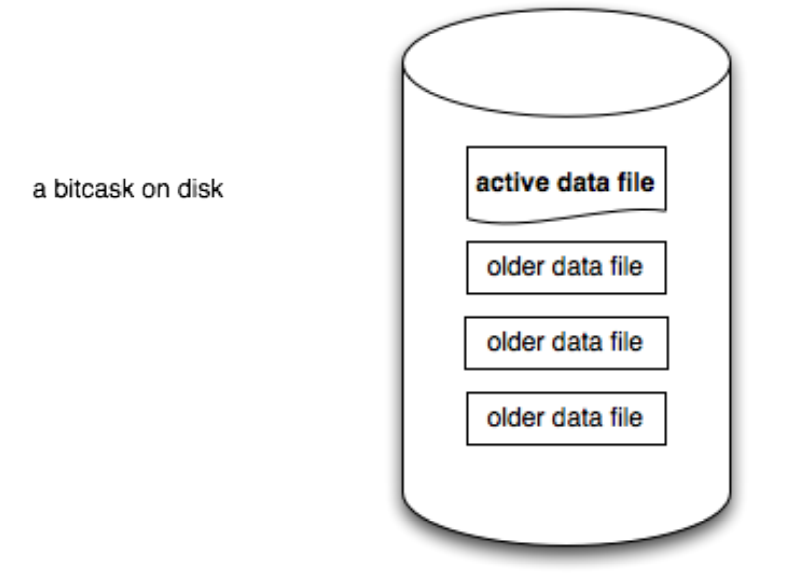
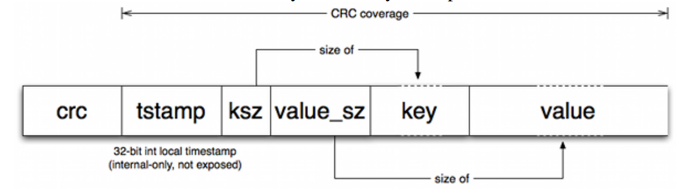
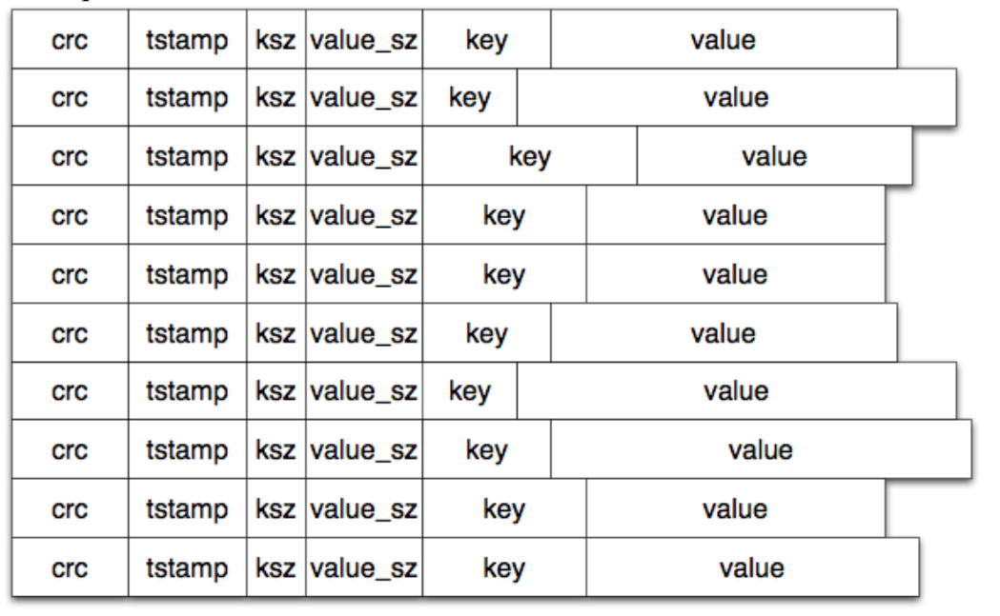
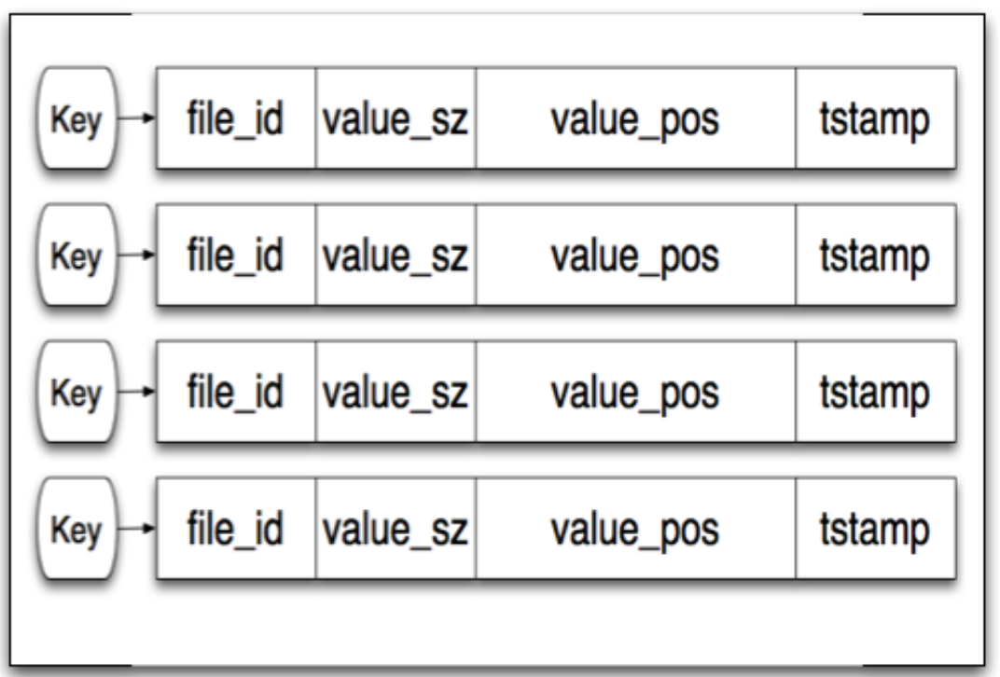
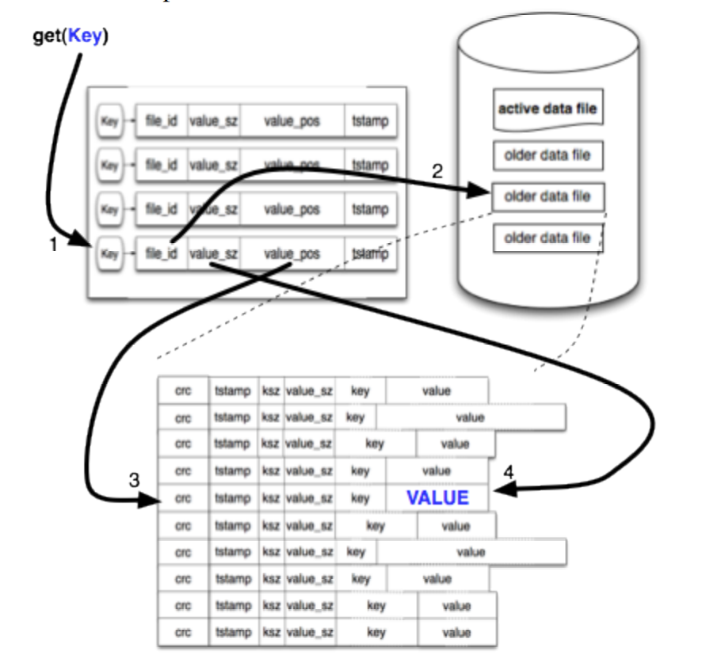
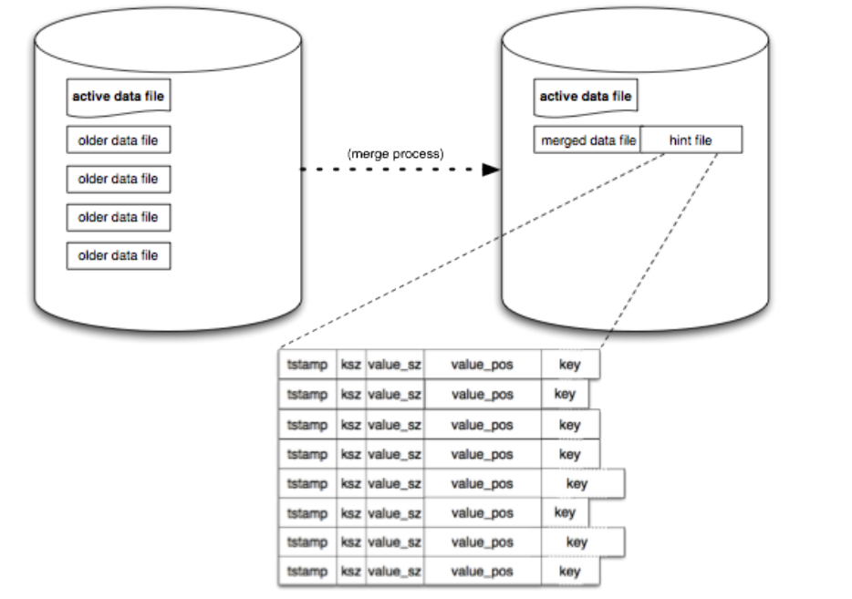
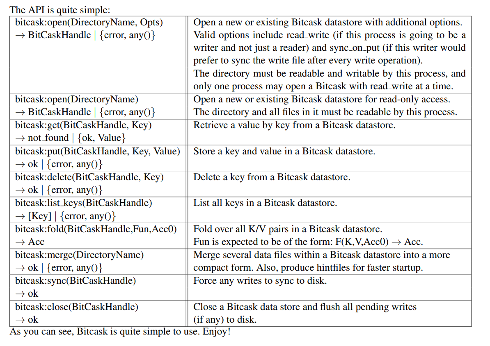

Bitcask 论文导读：[A Log-Structured Hash Table for Fast Key/Value Data](https://riak.com/assets/bitcask-intro.pdf)

>The origin of Bitcask is tied to the history of the Riak distributed database. In a Riak key/value cluster, each node uses pluggable local storage; nearly anything k/v-shaped can be used as the per-host storage engine. This pluggability allowed progress on Riak to be parallelized such that storage engines could be improved and tested without impact on the rest of the codebase.
>
>Many such local key/value stores already exist, including but not limited to Berkeley DB, Tokyo Cabinet, and Innostore. There are many goals we sought when evaluating such storage engines, including:
>
>• low latency per item read or written 
>
>• high throughput, especially when writing an incoming stream of random items 
>
>• ability to handle datasets much larger than RAM w/o degradation 
>
>• crash friendliness, both in terms of fast recovery and not losing data 
>
>• ease of backup and restore 
>
>• a relatively simple, understandable (and thus supportable) code structure and data format 
>
>• predictable behavior under heavy access load or large volume 
>
>• a license that allowed for easy default use in Riak
>
>Achieving some of these is easy. Achieving them all is less so.

Riak分布式集群每个节点支持可插拔的存储，这种设计使得几乎任何 KV 存储都可以替换，而且可以使得 Riak 的其余部分和存储引擎并行开发，现在有许多现存的存储引擎，我们希望有个存储引擎具有如下特点：

- 读写低延时
- 高带宽，特别是随机写场景
- 能够处理远大于内存的数据集
- 崩溃设计友好，无论是快速恢复还是数据一致性
- 易于备份和恢复
- 简单易理解的代码和数据结构
- 在高负载和大容量下可预测的性能
- 方便 Riak 使用

满足以上一点很容易，全部满足就没那么简单了

>None of the local key/value storage systems available (including but not limited to those written by the authors) were ideal with regard to all of the above goals. We were discussing this issue with Eric Brewer when he had a key insight about hash table log merging: that doing so could potentially be made as fast or faster than LSM-trees.
>
>This led us to explore some of the techniques used in the log-structured file systems first developed in the 1980s and 1990s in a new light. That exploration led to the development of Bitcask, a storage system that meets all of the above goals very well. While Bitcask was originally developed with a goal of being used under Riak, it was built to be generic and can serve as a local key/value store for other applications as well.

目前没有直接可以满足要求的，于是他们就想自己搞一个

>The model we ended up going with is conceptually very simple. A Bitcask instance is a directory, and we enforce that only one operating system process will open that Bitcask for writing at a given time. You can think of that process effectively as the ”database server”. At any moment, one file is ”active” in that directory for writing by the server. When that file meets a size threshold it will be closed and a new active file will be created. Once a file is closed, either purposefully or due to server exit, it is considered immutable and will never be opened for writing again.

模型十分简单，Bitcask 运行在一个目录上，永远只会有一个正在写的文件（active file），达到一个大小后会被关闭变成一个不可再写的文件。

>The active file is only written by appending, which means that sequential writes do not require disk seeking. The format that is written for each key/value entry is simple:

活跃的那个文件只会被追加写，这意味着只有顺序 IO。文件格式大概如下：

>With each write, a new entry is appeneded to the active file. Note that deletion is simply a write of a special tombstone value, which will be removed on the next merge. Thus, a Bitcask data file is nothing more than a linear sequence of these entries:

每次写，数据被追加到活跃的文件，需要注意的是删除也是一个写操作，它会做一个特殊标记，直到 merge 时被清理，因此 Bitcask 就是这些条目的线性排列而已。

>After the append completes, an in-memory structure called a ”keydir” is updated. A keydir is simply a hash table that maps every key in a Bitcask to a fixed-size structure giving the file, offset, and size of the most recently written entry for that key.
>
>When a write occurs, the keydir is atomically updated with the location of the newest data. The old data is still present on disk, but any new reads will use the latest version available in the keydir. As we’ll see later, the merge process will eventually remove the old value. 

当追加操作完成时，一个内存的结构（keydir）会被更新，这是一个哈希表记录 key 保存在哪个文件的哪个位置。

keydir 总是保存最新的值在哪，至于文件里那些旧值会在 merge 时清理掉。

>Reading a value is simple, and doesn’t ever require more than a single disk seek. We look up the key in our keydir, and from there we read the data using the file id, position, and size that are returned from that lookup. In many cases, the operating system’s filesystem read-ahead cache makes this a much faster operation than would be otherwise expected.

读取也十分简单，从 keydir 里找到文件位置，然后从文件里读取。在许多场景下，操作系统自身的缓存可以让这个操作变得很快。

>This simple model may use up a lot of space over time, since we just write out new values without touching the old ones. A process for compaction that we refer to as ”merging” solves this. The merge process iterates over all non-active (i.e. immutable) files in a Bitcask and produces as output a set of data files containing only the ”live” or latest versions of each present key.
>
>When this is done we also create a ”hint file” next to each data file. These are essentially like the data files but instead of the values they contain the position and size of the values within the corresponding data file.

上面我们提及旧数据没人清理，这儿就有个 merge 的过程，它会遍历所有只读文件，然后保留有用的数据并生成一个 hint file，这个本质上就是 keydir 的磁盘版。

>When a Bitcask is opened by an Erlang process, it checks to see if there is already another Erlang process in the same VM that is using that Bitcask. If so, it will share the keydir with that process. If not, it scans all of the data files in a directory in order to build a new keydir. For any data file that has a hint file, that will be scanned instead for a much quicker startup time.

>These basic operations are the essence of the bitcask system. Obviously, we’ve not tried to expose every detail of operations in this document; our goal here is to help you understand the general mechanisms of Bitcask. Some additional notes on a couple of areas we breezed past are probably in order:
>
>• We mentioned that we rely on the operating system’s filesystem cache for read performance. We have discussed adding a bitcask-internal read cache as well, but given how much mileage we get for free right now it’s unclear how much that will pay off.
>
>• We will present benchmarks against various API-similar local storage systems very soon. However, our initial goal with Bitcask was not to be the fastest storage engine but rather to get ”enough” speed and also high quality and simplicity of code, design, and file format. That said, in our initial simple benchmarking we have seen Bitcask handily outperform other fast storage systems for many scenarios.
>
>• Some of the hardest implementation details are also the least interesting to most outsiders, so we haven’t included in this short document a description of (e.g.) the internal keydir locking scheme.
>
>• Bitcask does not perform any compression of data, as the cost/benefit of doing so is very applicationdependent.

Bitcask 不做内部缓存，因为觉得效益不高，而且很多细节没有提及，因为大多数 "局外人" 并不关心，它也不做压缩，因为这个收益和业务相关。

>And let’s look at the goals we had when we set out:
>
>• low latency per item read or written 
>
>Bitcask is fast. We plan on doing more thorough benchmarks soon, but with sub-millisecond typical median latency (and quite adequate higher percentiles) in our early tests we are confident that it can be made to meet our speed goals.
>
>• high throughput, especially when writing an incoming stream of random items
>
>In early tests on a laptop with slow disks, we have seen throughput of 5000-6000 writes per second.
>
>• ability to handle datasets much larger than RAM w/o degradation
>
>The tests mentioned above used a dataset of more than 10×RAM on the system in question, and showed no sign of changed behavior at that point. This is consistent with our expectations given the design of Bitcask.
>
>• crash friendliness, both in terms of fast recovery and not losing data
>
>As the data files and the commit log are the same thing in Bitcask, recovery is trivial with no need for ”replay.” The hint files can be used to make the startup process speedy.
>
>• ease of backup and restore
>
>Since the files are immutable after rotation, backup can use whatever system-level mechanism is preferred by the operator with ease. Restoration requires nothing more than placing the data files in the desired directory.
>
>• a relatively simple, understandable (and thus supportable) code structure and data format
>
>Bitcask is conceptually simple, clean code, and the data files are very easy to understand and manage. We feel very comfortable supporting a system resting atop Bitcask.
>
>• predictable behavior under heavy access load or large volume
>
>Under heavy access load we’ve already seen Bitcask do well. So far it has only seen double-digit gigabyte volumes, but we’ll be testing it with more soon. The shape of Bitcask is such that we do not expect it to perform too differently under larger volume, with the one predictable exception that the keydir structure grows by a small amount with the number of keys and must fit entirely in RAM. This limitation is minor in practice, as even with many millions of keys the current implementation uses well under a GB of memory.

回过头看最开始设定的目标，基本都达到了。

>In summary, given this specific set of goals, Bitcask suits our needs better than anything else we had available.

总之，考虑到这些特定的目标，Bitcask 比我们现有的任何其他产品都更适合我们的需求。

​	
