# 二叉搜索树（BST）

二叉查找树，Binary Search Tree，或者称为二叉搜索树。 

> - 若左子树不空，则左子树上所有结点的值均小于它的根节点的值（左小）
> - 若右子树不空，则右子树上所有结点的值均大于它的根结点的值（右大）
> - 左、右子树也分别为二叉排序树

 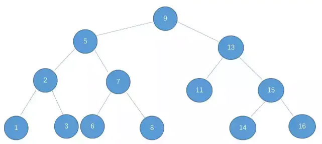

基于二叉查找树的这种特点，在查找某个节点的时候，可以采取类似于二分查找的思想，快速找到某个节点。n 个节点的二叉查找树，正常的情况下，查找的时间复杂度为 O(logN)。之所以说是正常情况下，是因为二叉查找树有可能出现一种极端的情况，例如： 

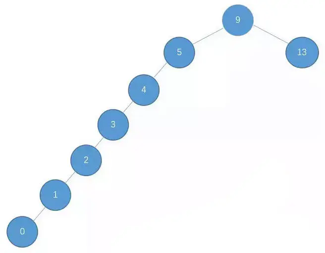 

这种情况也是满足二叉查找树的条件，然而，此时的二叉查找树已经近似退化为一条链表，这样的二叉查找树的查找时间复杂度顿时变成了 O(n)。由此必须防止这种情况发生，为了解决这个问题，于是引申出了平衡二叉树。 


## 性能

-   查找

最好时间复杂度 O(logN)，最坏时间复杂度 O(N) 


-   插入

新结点插入到树的叶子上，完全不需要改变树中原有结点的组织结构。插入一个结点的代价与查找一个不存在的数据的代价完全相同。

 

-   删除

当删除一个结点 P，首先需要定位到这个结点 P，这个过程需要一个查找的代价。

然后稍微改变一下树的形态。如果被删除结点的左、右子树只有一个存在，则改变形态的代价仅为 O(1)。

如果被删除结点的左、右子树均存在，只需要将当 P 的左孩子的右孩子的右孩子的…的右叶子结点（即比 P 小的节点中最大的节点）与 P 互换，在改变一些左右子树即可。因此删除操作的时间复杂度最大不会超过 O(logN)。


-   总结

查找最好时间复杂度 O(logN)，最坏时间复杂度 O(N)。 

插入删除操作算法简单，时间复杂度与查找差不多。


---

# 平衡二叉树（AVL）

AVL 树的名字来源于它的发明作者 G.M. Adelson-Velsky 和 E.M. Landis。AVL 树是最先发明的自平衡二叉查找树（Self-Balancing Binary Search Tree），简称平衡二叉树。

> - 它必须是二叉查找树 
> - 每个节点的左子树和右子树的高度差至多为1 

下面看几个例子：

 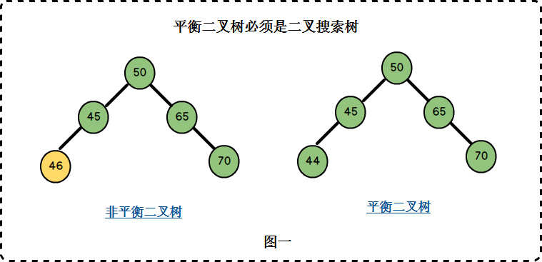 

图一中左边二叉树的节点 45 的左孩子 46 比 45 大，不满足二叉搜索树的条件，因此它也不是一棵平衡二叉树。
右边二叉树满足二叉搜索树的条件，同时它满足条件二，因此它是一棵平衡二叉树。

  

图二左边二叉树的节点 45 左子树高度 2，右子树高度 0，左右子树高度差为 2-0=2，不满足条件二；
右边二叉树的节点均满足左右子树高度差至多为 1，同时它满足二叉搜索树的要求，因此它是一棵平衡二叉树。

AVL 树的查找、插入、删除操作在平均和最坏的情况下都是 O（logn），这得益于它时刻维护着二叉树的平衡。如果我们需要查找的集合本身没有顺序，在频繁查找的同时也经常的插入和删除，AVL 树是不错的选择。不平衡的二叉查找树在查找时的效率是很低的，因此，AVL 如何维护二叉树的平衡是我们的学习重点。


## AVL树相关概念

-   平衡因子：将二叉树上节点的左子树高度减去右子树高度的值称为该节点的平衡因子 BF（Balance Factor）。

>   在上图二右边的 AVL 树上：
>
>   节点 50 的左子树高度为 3，右子树高度为 2，BF= 3-2 = 1；
>
>   节点 45 的左子树高度为 2，右子树高度为 1，BF= 2-1 = 1；
>
>   节点 46 的左子树高度为 0，右子树高度为 0，BF= 0-0 = 0；
>
>   节点 65 的左子树高度为 0，右子树高度为 1，BF= 0-1 = -1；
>
>   对于平衡二叉树，BF 的取值范围为 [-1，1]。如果发现某个节点的 BF 值不在此范围，则需要对树进行调整。

-   最小不平衡子树：距离插入节点最近的，且平衡因子的绝对值大于 1 的节点为根的子树。


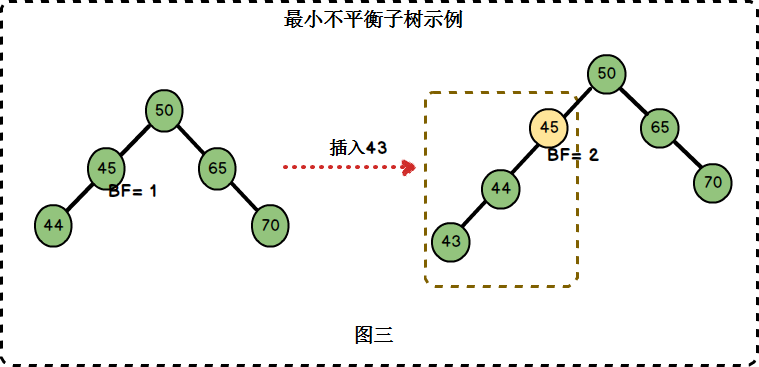 

在图三中，左边二叉树的节点 45 的 BF = 1，插入节点 43 后，节点 45 的 BF = 2。节点 45 是距离插入点 43 最近的 BF 不在 [-1，1] 范围内的节点，因此以节点 45 为根的子树为最小不平衡子树。 


## AVL树的平衡调整

分为 LL 型、RR 型、LR 型和 RL 型 4 种类型（下面用 A 表示最低不平衡结点）

首先讲一下旋转，旋转是二叉树的基本操作，下图所看到的操作称为对结点 Q 的右旋。对结点 P 的左旋。二者互为逆操作。 

简单讲，右旋是自己变为左孩子的右孩子；左旋是自己变为右孩子的左孩子。 

 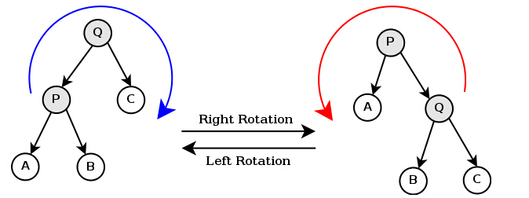

1.节点 P 左旋（逆时针旋转）

P 变成 Q 的左孩子，Q 的左孩子变成 P 的右孩子 ，代码可以实现如下：

```go
func (node *AVLNode) leftRotate() {
    // 以当前节点的值，创建新的节点
    newNode := &AVLNode{id: node.id}
    // 把新的节点的左子节点设置为当前节点的左子节点
    newNode.left = node.left
    // 把新的节点的右子节点设置为当前节点的右子节点的左子节点
    node.right = node.right.left
    // 把当前节点的值替换成右子节点的值
    node.id = node.right.id
    // 把当前节点的右子节点设置为当前节点的右子节点的右子节点
    node.right = node.right.right
    // 把当前节点的左子节点设置为新的节点
    node.left = newNode
} 
```

2.节点 Q 右旋（顺时针旋转）

Q 变成 P 的右孩子，P 的右孩子变成 Q 的左孩子 ，代码可以实现如下：

```go
func (node *AVLNode) rightRotate() {
    // 以当前节点的值，创建新的节点
    newNode := &AVLNode{id: node.id}
    // 把新的节点的右子节点设置为当前节点的右子节点
    newNode.right = node.right
    // 把新的节点的左子节点设置为当前节点的左子节点的右子节点
    newNode.left = node.left.right
    // 把当前节点的值替换成左子节点的值
    node.id = node.left.id
    // 把当前节点的左子节点设置为当前节点的左子节点的左子节点
    node.left = node.left.left
    // 把当前节点的右子节点设置为新的节点
    node.right = newNode
}
```


### LL型

由于在 A 的左孩子（L）的左子树（L）上插入新结点，使原来平衡二叉树变得不平衡，此时 A 的平衡因子由 1 增至 2。

下面图1 是 LL 型的最简单形式。显然，按照大小关系，结点 B 应作为新的根结点，其余两个节点分别作为左右孩子节点才能平衡，A 结点就好像是绕结点 B 顺时针旋转一样。 

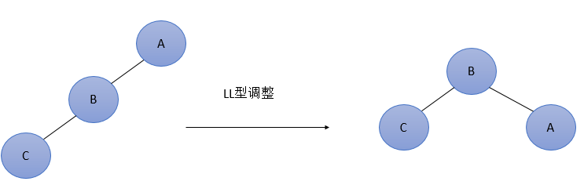 

LL 型调整的一般形式如下图所示：

> - 如果 BL，BR，AR 高度都是 0，则是如上的情况
> - 如果 AR 不存在，则在插入前就不是平衡二叉树了
> - 如果 BR 不存在，那么 BL 高度增高时，B 是最低不平衡节点，不符合预设，此时是 B 节点的 LL 型
> - 只有 BL 的高度比 AR 的高度大 1 才会导致不平衡

表示在 A 的左孩子 B 的左子树 BL（不一定为空）中插入结点（图中阴影部分所示）而导致不平衡（ h 表示子树的深度）。这种情况调整如下（节点 A 右旋）：

1.  将 A 的左孩子 B 提升为新的根结点；
2.  将原来的根结点 A 降为 B 的右孩子；
3.  各子树按大小关系连接（BL 和 AR 不变，BR 调整为 A 的左子树）。

 


### RR型

由于在 A 的右孩子（R）的右子树（R）上插入新结点，使原来平衡二叉树变得不平衡，此时 A 的平衡因子由 -1 变为 -2。

下图是 RR 型的最简单形式。显然，按照大小关系，结点 B 应作为新的根结点，其余两个节点分别作为左右孩子节点才能平衡，A 结点就好像是绕结点 B 逆时针旋转一样。 

 

RR 型调整的一般形式如下图所示，表示在 A 的右孩子 B 的右子树 BR（不一定为空）中插入结点（图中阴影部分所示）而导致不平衡（ h 表示子树的深度）。这种情况调整如下（节点 A 左旋）：

1. 将 A 的右孩子 B 提升为新的根结点；
2. 将原来的根结点 A 降为 B 的左孩子
3. 各子树按大小关系连接（AL 和 BR 不变，BL 调整为 A 的右子树）。

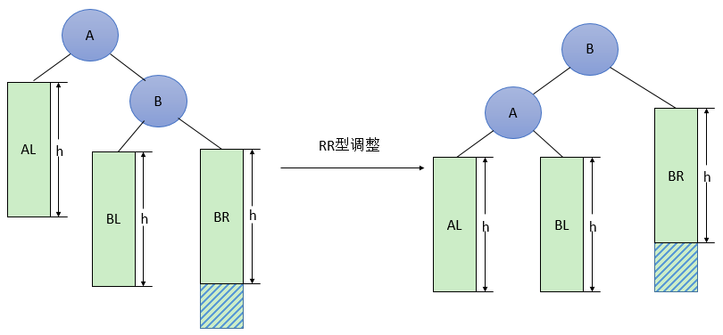 


### LR型

由于在 A 的左孩子（L）的右子树（R）上插入新结点，使原来平衡二叉树变得不平衡，此时 A 的平衡因子由 1 变为 2。

下图是 LR 型的最简单形式。显然，按照大小关系，结点 C 应作为新的根结点，其余两个节点分别作为左右孩子节点才能平衡。 

 

LR 型调整的一般形式如下图所示

> - BL，CL，CR，AR 均不存在时则是如上的情况
> - 如果 BL 或 AR 不存在，则在插入前就不是平衡二叉树了
> - 只有 CL 或 CR 的高度比 AR 的高度大 1 才会导致不平衡
> - CL 和 CR 高度需一致，否则就成了 C 的 LL 或 RR 型
> - BL 也需要和 CL，CR 高度一致，否则 B 是最低不平衡节点，不符合预设，此时是 B 的 RR 或 RL 型

表示在 A 的左孩子 B 的右子树（根结点为 C，不一定为空）中插入结点（图中两个阴影部分之一）而导致不平衡（ h 表示子树的深度）。这种情况调整如下（节点 B 左旋后节点 A 右旋）：

1. 将 B 的右孩子 C 提升为新的根结点；
2. 将原来的根结点 A 降为 C 的右孩子；
3. 各子树按大小关系连接（BL 和 AR 不变，CL 和 CR 分别调整为 B 的右子树和 A 的左子树）。

 


### RL型

由于在 A 的右孩子（R）的左子树（L）上插入新结点，使原来平衡二叉树变得不平衡，此时 A 的平衡因子由 -1 变为 -2。

图是 RL 型的最简单形式。显然，按照大小关系，结点 C 应作为新的根结点，其余两个节点分别作为左右孩子节点才能平衡。

 

RL 型调整的一般形式如下图所示，表示在 A 的右孩子 B 的左子树（根结点为 C，不一定为空）中插入结点（图中两个阴影部分之一）而导致不平衡（ h 表示子树的深度）。这种情况调整如下（节点 B 右旋后节点 A 左旋）：

1. 将 B 的左孩子 C 提升为新的根结点；
2. 将原来的根结点 A 降为 C 的左孩子；
3. 各子树按大小关系连接（AL 和 BR 不变，CL 和 CR 分别调整为 A 的右子树和 B 的左子树）。

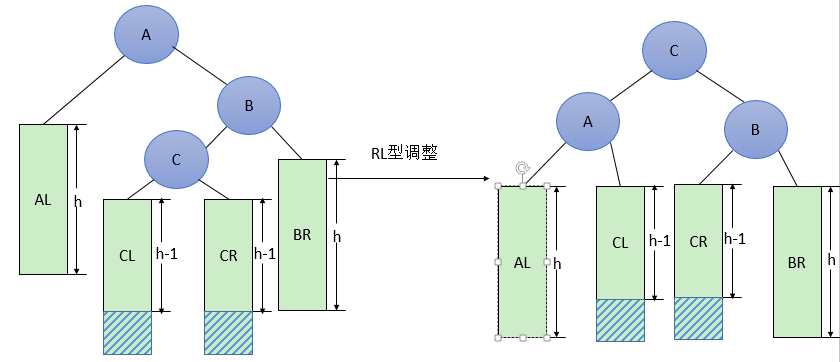 


## 平衡二叉树实例

选取一组数据分别为 2，1，0，3，4，5，6，9，8，7 的 10 个结点来构造平衡二叉树。

首先数据为 2 的结点作为根结点插入，接着插入 1，仍是平衡的，再插入 0 是，2 的平衡因子变为 2，此时出现了不平衡，因此需要进行调整，最低不平衡结点为 2，属于 LL 型，调整过程如下图所示：

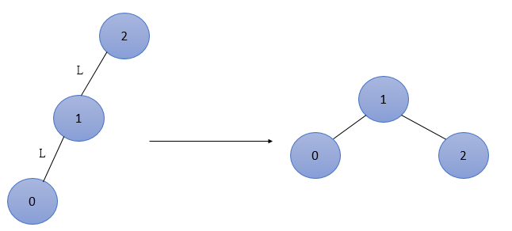 

接着插入 3，是平衡的，再插入 4，此时出现了不平衡，结点 1 和 2 的平衡因子都为 -2，结点 2 为最低不平衡结点，属于 RR 型，调整过程如下图所示：

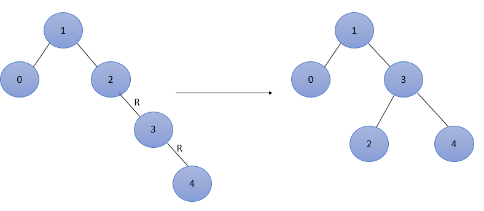 

接着插入 5，此时结点 1 的平衡因子为 -2，导致不平衡，结点 1 为最低不平衡结点，属于 RR 型，调整如下图所示：

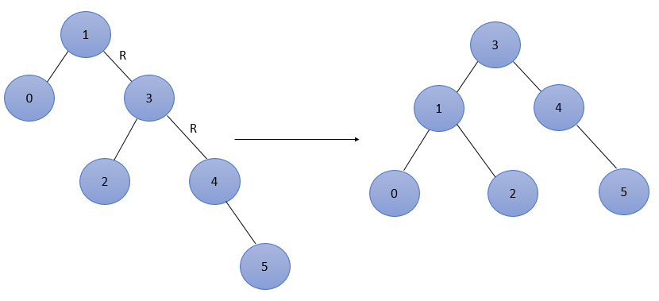 

接着插入 6，此时结点 4 的平衡因子为 -2，导致不平衡，结点 4 为最低不平衡结点，属于 RR 型，调整如下图所示：

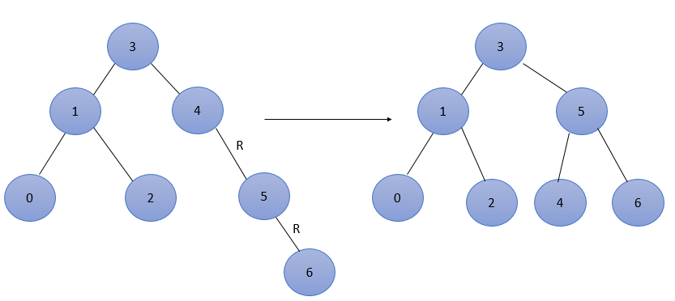 

接着插入 9，是平衡的，再插入 8，此时结点 3、5、6 的平衡因子都为 -2，导致不平衡，结点 6 为最低不平衡结点，属于 RL 型，调整如下图所示：

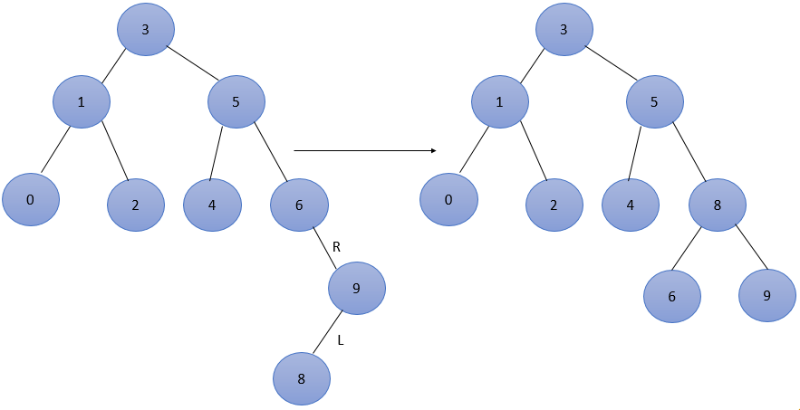 

插入 7，此时结点 3、5 的平衡因子为 -2，导致不平衡，最低不平衡结点为 5，属于 RL 型，调整如下图所示：

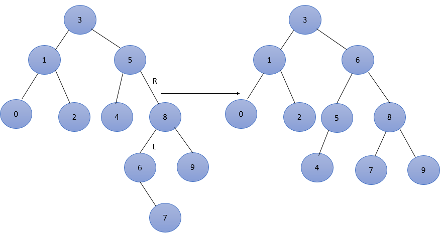 


## 节点删除

节点删除以后要判断调整的类型。当然，平衡调整类型仍然是 LL、RR、LR、RL 这四种，但是，与插入不同的是，在结点删除的时候，要考虑调整结点是父节点的左孩子还是右孩子，所以每种类型又有两种情况，总共是 8 种情况。 

### LL型删除

#### LLL型删除

这种情况是最小不平衡子树的根节点为父节点的左孩子的情况，我这里称之为 LLL 型调整，具体情况如下所示，要删除 20 节点，左图中红圈标记出来的部分会引起不平衡，我们要对其进行调整。**调整部分中的 y 为其父节点的左孩子**（LLL 中第一个 L 的含义）。

 

#### RLL型删除

这种情况是最小不平衡子树的根节点为其父节点的右孩子的情况，我这里称之为 RLL 型调整，具体情况如下所示，要删除 80 节点，左图中红圈标记出来的部分会引起不平衡，我们要对其进行调整。**调整部分中的 y 为其父节点的右孩子**（RLL 中 R 的含义）。

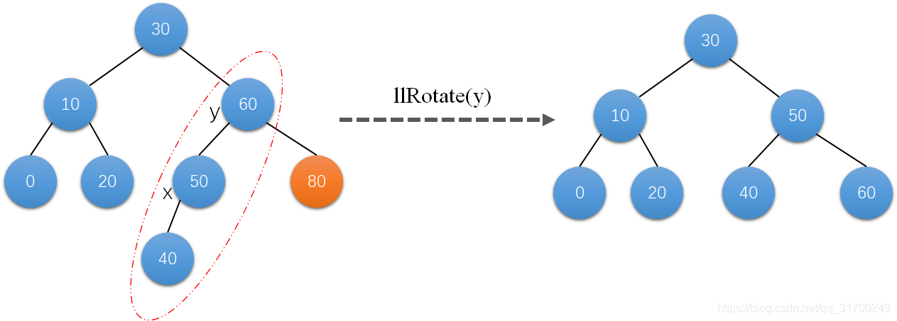 


### RR型删除

#### LRR型删除

这种情况是最小不平衡子树的根节点为父节点的左孩子的情况，我这里称之为 LRR 型调整，具体情况如下所示，要删除 0 节点，左图中红圈标记出来的部分会引起不平衡，我们要对其进行调整。**调整部分中的 y 为其父节点的左孩子**（LRR 中 L 的含义）。 

 


####  RRR型删除

这种情况是最小不平衡子树的根节点为其父节点的右孩子的情况，我这里称之为 RRR 型调整，具体情况如下所示，要删除 80 节点，左图中红圈标记出来的部分会引起不平衡，我们要对其进行调整。**调整部分中的 y 为其父节点的右孩子**（RRR 中第一个 R 的含义）。

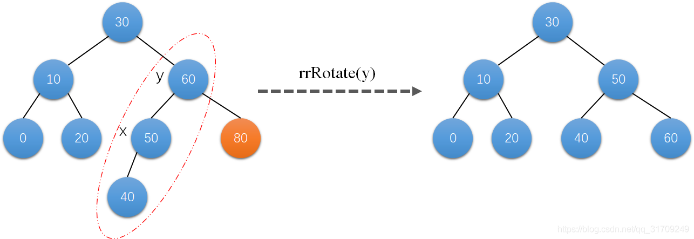 


### LR型删除

#### LLR型删除

这种情况是最小不平衡子树的根节点为父节点的左孩子的情况，我这里称之为 LLR 型调整，具体情况如下所示，要删除 20 节点，左图中红圈标记出来的部分会引起不平衡，我们要对其进行调整。调整时先对 x 节点进行 RR 型调整，再对 y 节点进行 LL 型调整。调整部分中的 y 为其父节点的左孩子（LLR 中第一个 L 的含义）。

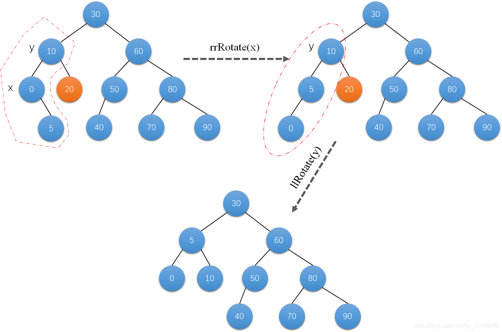 

#### RLR型删除

这种情况是最小不平衡子树的根节点为父节点的右孩子的情况，我这里称之为 RLR 型调整，具体情况如下所示，要删除 90 节点，左图中红圈标记出来的部分会引起不平衡，我们要对其进行调整。调整时先对 x 节点进行 RR 型调整，再对 y 节点进行 LL 型调整。调整部分中的 y 为其父节点的右孩子（RLR 中第一个 R 的含义）。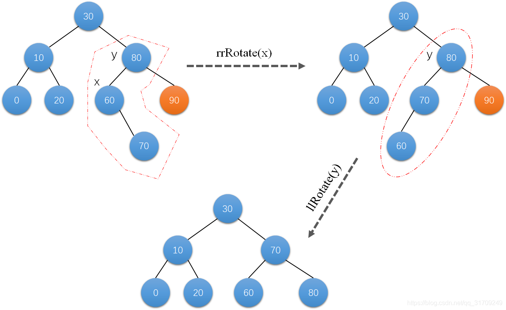 


### RL型删除

#### LRL型删除

这种情况是最小不平衡子树的根节点为父节点的左孩子的情况，我这里称之为 LRL 型调整，具体情况如下所示，要删除 0 节点，左图中红圈标记出来的部分会引起不平衡，我们要对其进行调整。调整时先对 x 节点进行 LL 型调整，再对 y 节点进行 RR 型调整。调整部分中的 y 为其父节点的左孩子（LRL 中第一个 L 的含义）。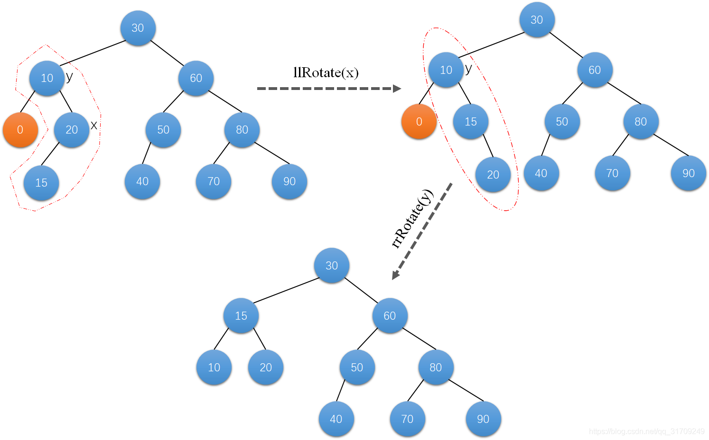 


#### RRL型删除

这种情况是最小不平衡子树的根节点为父节点的右孩子的情况，我这里称之为 RRL 型调整，具体情况如下所示，要删除 50 节点，左图中红圈标记出来的部分会引起不平衡，我们要对其进行调整。调整时先对 x 节点进行 LL 型调整，再对 y 节点进行 RR 型调整。调整部分中的 y 为其父节点的右孩子（RRL 中第一个 L 的含义）。

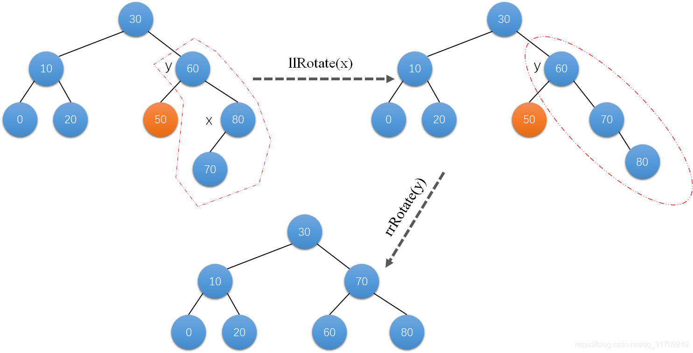 


>[!TIP]
>
>为什么插入的时候不需要考虑左右子树问题？
>
>这个思考一下，就可以知道，插入时，是确定了在左子树还是右子树上插入后，再进行插入调整操作。而删除时，是先删除，然后再判断二叉树是否平衡，然后调整。


## 性能

-   查找

AVL 是严格平衡的 BST（平衡因子不超过 1）。那么查找过程与 BST 一样，只是 AVL 不会出现最差情况的 BST(单支树)。因此查找效率最好和最坏情况都是 O(logN) 数量级的。 


-   插入

AVL 必须要保证严格平衡（|bf|<=1），那么每一次插入数据使得 AVL 中某些结点的平衡因子超过 1 就必须进行旋转操作。事实上，AVL 的每一次插入结点操作最多只需要旋转 1 次(单旋转或双旋转)。因此，总体上插入操作的代价仍然在 O(logN) 级别上（插入结点需要首先查找插入的位置）。 

 

-   删除

AVL 删除结点的算法可以参见 BST 的删除结点，但是删除之后必须检查从删除结点开始到根结点路径上的所有结点的平衡因子。因此删除的代价稍微要大一些。每一次删除操作最多需要 O(logN) 次旋转。因此，删除操作的时间复杂度为 O(logN) + O(logN) = O(2logN) 


-   总结

查找的时间复杂度维持在 O(logN)，不会出现最差情况 

AVL 树在执行每个插入操作时最多需要 1 次旋转，其时间复杂度在 O(logN) 左右。 

AVL 树在执行删除时代价稍大，执行每个删除操作的时间复杂度需要 O(2logN)。


---

# 红黑树(RBT)

红黑树具体有哪些规则特点呢？具体如下：

- 节点分为红色或者黑色。
- 根节点必为黑色。
- 叶子节点都为黑色，且为 null。
- 连接红色节点的两个子节点都为黑色(红黑树不会出现相邻的红色节点)。
- 从任意节点出发，到其每个叶子节点的路径中包含相同数量的黑色节点。
- 新加入到红黑树的节点为红色节点。

规则看着好像挺多，没错，因为红黑树也是均衡二叉树，需要具备自动维持平衡的性质，上面的 6 条就是红黑树给出的自动维持平衡所需要具备的规则。

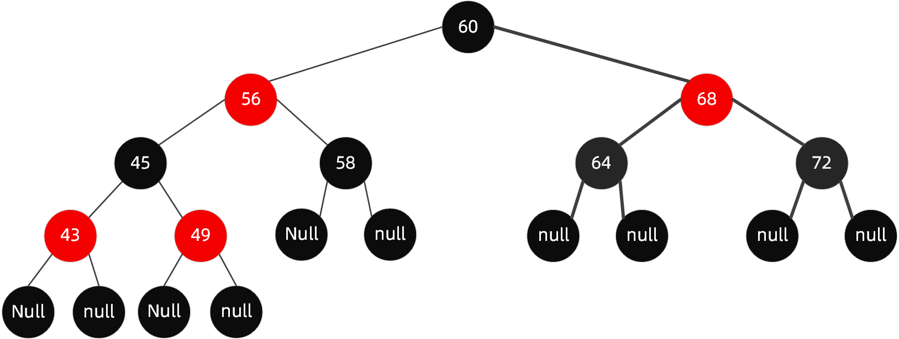

首先解读一下规则，除了字面上看到的意思，还隐藏了哪些意思呢？

**① 从根节点到叶子节点的最长路径不大于最短路径的 2 倍**

怎么样的路径算最短路径？

从规则 5 中，我们知道从根节点到每个叶子节点的黑色节点数量是一样的，那么纯由黑色节点组成的路径就是最短路径。

什么样的路径算是最长路径？

根据规则 4 和规则 3，若有红色节点，则必然有一个连接的黑色节点，当红色节点和黑色节点数量相同时，就是最长路径，也就是黑色节点(或红色节点) * 2。

**② 为什么说新加入到红黑树中的节点为红色节点**

从规则 4 中知道，当前红黑树中从根节点到每个叶子节点的黑色节点数量是一样的，此时假如新的是黑色节点的话，必然破坏规则。

但加入红色节点却不一定，除非其父节点就是红色节点，因此加入红色节点，破坏规则的可能性小一些，下面我们也会举例来说明什么情况下，红黑树的结构会被破坏呢？破坏后又怎么维持平衡，维持平衡主要通过两种方式【变色】和【旋转】，【旋转】又分【左旋】和【右旋】，两种方式可相互结合。


## 红黑树节点插入

当我们插入值为 66 的节点时，红黑树变成了这样

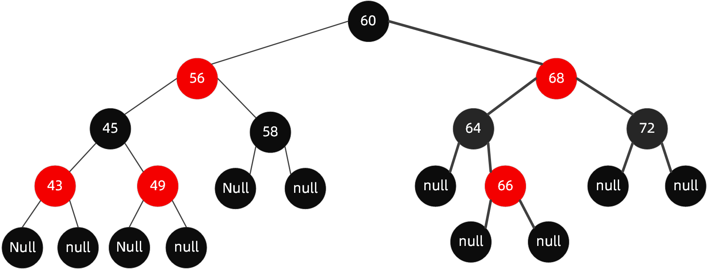

很明显，这个时候结构依然遵循着上述 6 大规则，无需启动自动平衡机制调整节点平衡状态；

如果再向里面插入值为 51 的节点呢，这个时候红黑树变成了这样

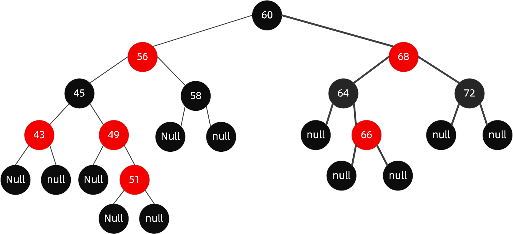

很明显现在的结构不遵循规则 4 了，这个时候就需要启动自动平衡机制调整节点平衡状态


### 变色

我们可以通过变色的方式，使结构满足红黑树的规则

- 首先解决结构不遵循规则 4 这一点（红色节点相连，节点 49-51），需将节点 49 改为黑色；
- 此时我们发现又违反了规则 5（56-49-51-XX 路径中黑色节点超过了其他路径），那么我们将节点 45 改为红色节点；
- 哈哈，妹的，又违反了规则 4（红色节点相连，节点 56-45-43），那么我们将节点 56 和节点 43 改为黑色节点；
- 但是我们发现此时又违反了规则 5（60-56-XX 路径的黑色节点比 60-68-XX 的黑色节点多），因此我们需要调整节点 68 为黑色；
- 完成！！

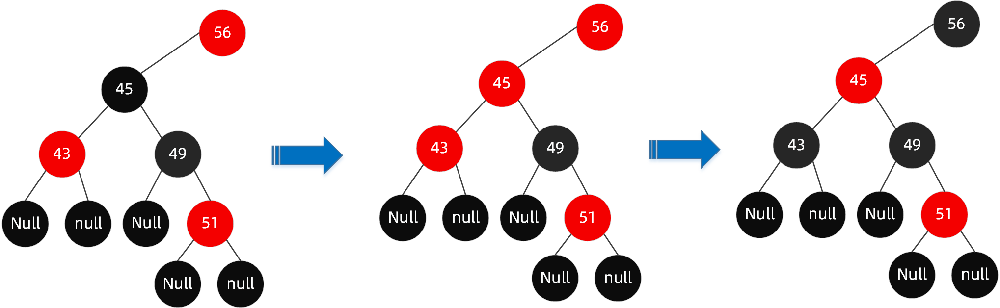


最终调整完成后的树为：

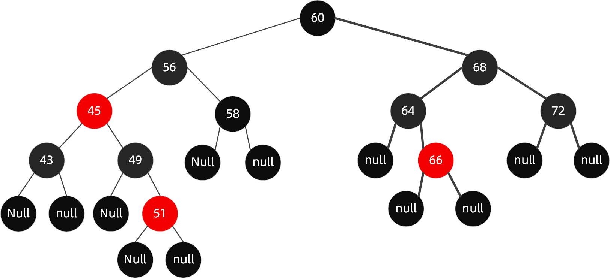

但并不是什么时候都那么幸运，可以直接通过变色就达成目的，大多数时候还需要通过旋转来解决。

如在下面这棵树的基础上，加入节点 65


插入节点 65 后进行以下步骤

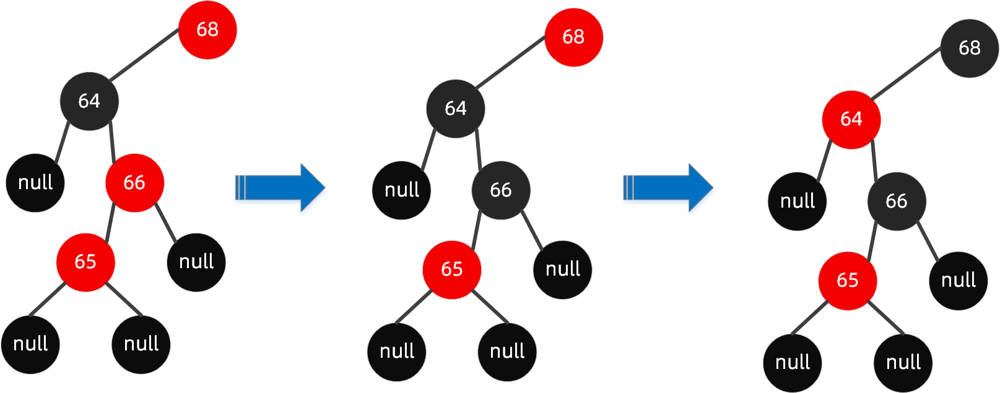

这个时候，你会发现对于节点 64 无论是红色节点还是黑色节点，都会违反规则 5，路径中的黑色节点始终无法达成一致，这个时候仅通过【变色】已经无法达成目的。我们需要通过旋转操作，当然【旋转】操作一般还需要搭配【变色】操作。


### 旋转

旋转包括【左旋】和【右旋】，

左旋：逆时针旋转两个节点，让一个节点被其右子节点取代，而该节点成为右子节点的左子节点，左旋操作步骤如下：首先断开节点 PL 与右子节点 G 的关系，同时将其右子节点的引用指向节点 C2；然后断开节点 G 与左子节点 C2 的关系，同时将 G 的左子节点的应用指向节点 PL

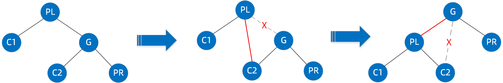

右旋：顺时针旋转两个节点，让一个节点被其左子节点取代，而该节点成为左子节点的右子节点，右旋操作步骤如下：首先断开节点 G 与左子节点 PL 的关系，同时将其左子节点的引用指向节点 C2；然后断开节点 PL 与右子节点 C2 的关系，同时将 PL 的右子节点的应用指向节点 G

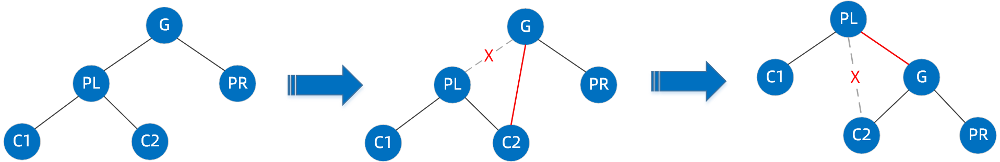


无法通过变色而进行旋转的场景分为以下四种：


#### LL型

这种情况下，父节点和插入的节点都是左节点，如下图这种情况下，我们要插入节点 65

规则如下：以祖父节点【右旋】，搭配【变色】

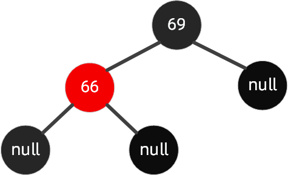


按照规则，步骤如下：

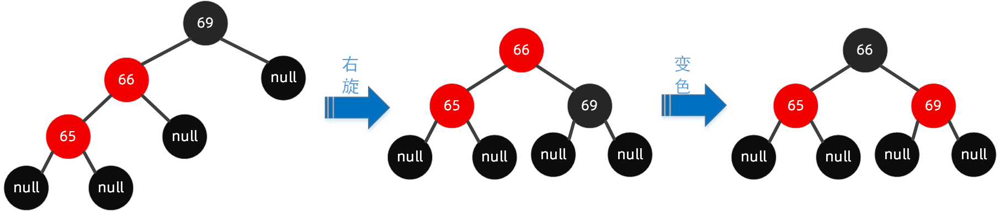


#### LR型

这种情况下，父节点是左节点，插入的节点是右节点，在旋转原始图 1 中，我们要插入节点 67

规则如下：先父节点【左旋】，然后祖父节点【右旋】，搭配【变色】

按照规则，步骤如下：


#### RR型

这种情况下，父节点和插入的节点都是右节点，在旋转原始图 2 中，我们要插入节点 70

规则如下：以祖父节点【左旋】，搭配【变色】


按照规则，步骤如下：


#### RL型

这种情况下，父节点是右节点，插入的节点是左节点，如下图(旋转原始图2)这种情况，我们要插入节点 68

规则如下：先父节点【右旋】，然后祖父节点【左旋】，搭配【变色】

按照规则，步骤如下：
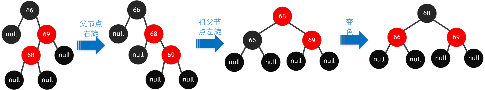


### 总结

|       | 无需调整                   | 【变色】即可实现平衡                 | 【旋转+变色】才可实现平衡                                    |
| ----- | -------------------------- | ------------------------------------ | ------------------------------------------------------------ |
| 情况1 | 当父节点为黑色时插入子节点 | 空树插入根节点，将根节点红色变为黑色 | 父节点为红色左节点，叔父节点为黑色，插入左子节点，那么通过【左左节点旋转】 |
| 情况2 |                            | 父节点和叔父节点都为红色             | 父节点为红色左节点，叔父节点为黑色，插入右子节点，那么通过【左右节点旋转】 |
| 情况3 |                            |                                      | 父节点为红色右节点，叔父节点为黑色，插入左子节点，那么通过【右左节点旋转】 |
| 情况4 |                            |                                      | 父节点为红色右节点，叔父节点为黑色，插入右子节点，那么通过【右右节点旋转】 |


## 节点删除

相比较于红黑树的节点插入，删除节点更为复杂，我们从子节点是否为 null 和红色为思考维度来讨论。


### 子节点至少有一个为null

当待删除的节点的子节点至少有一个为 null 节点时，删除了该节点后，将其有值的节点取代当前节点即可，若都为 null，则将当前节点设置为 null，当然如果违反规则了，则按需调整，如【变色】以及【旋转】。

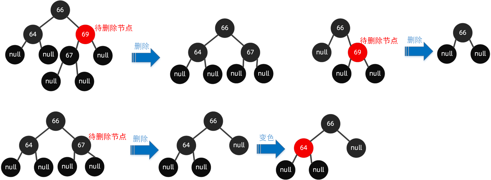


### 子节点都是非null节点

这种情况下，

第一步：找到该节点的前驱或者后继

前驱：左子树中值最大的节点（可得出其最多只有一个非 null 子节点，可能都为 null）；

后继：右子树中值最小的节点（可得出其最多只有一个非 null 子节点，可能都为 null）；

前驱和后继都是值最接近该节点值的节点，类似于该节点.prev = 前驱，该节点.next = 后继。


第二步：将前驱或者后继的值复制到该节点中，然后删掉前驱或者后继

如果删除的是左节点，则将前驱的值复制到该节点中，然后删除前驱；如果删除的是右节点，则将后继的值复制到该节点中，然后删除后继；

这相当于是一种“取巧”的方法，我们删除节点的目的是使该节点的值在红黑树上不存在，因此专注于该目的，我们并不关注删除节点时是否真是我们想删除的那个节点，同时我们也不需考虑树结构的变化，因为树的结构本身就会因为自动平衡机制而经常进行调整。

前面我们已经说了，我们要删除的实际上是前驱或者后继，因此我们就以前驱为主线来讲解，后继的学习可参考前驱，包括几种情况：

#### 前驱为黑色节点，并且有一个非null子节点

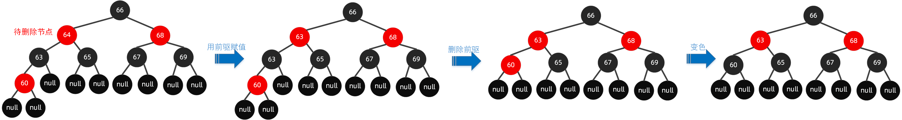

1. 因为要删除的是左节点 64，找到该节点的前驱 63；

2. 然后用前驱的值 63 替换待删除节点的值 64，此时两个节点（待删除节点和前驱）的值都为 63；

3. 删除前驱 63，此时成为上图过程中间环节，但我们发现其不符合红黑树规则 4，因此需要进行自动平衡调整；

4. 这里直接通过【变色】即可完成。


#### 前驱为黑色节点，同时子节点都为null


1. 因为要删除的是左节点 64，找到该节点的前驱 63；

2. 然后用前驱的值 63 替换待删除节点的值 64，此时两个节点（待删除节点和前驱）的值都为 63；

3. 删除前驱 63，此时成为上图过程中间环节，但我们发现其不符合红黑树规则 5，因此需要进行自动平衡调整；

4. 这里直接通过【变色】即可完成。


#### 前驱为红色节点，同时子节点都为null

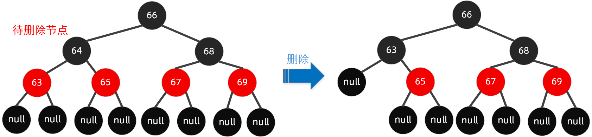

1. 因为要删除的是左节点 64，找到该节点的前驱 63；

2. 然后用前驱的值 63 替换待删除节点的值 64，此时两个节点（待删除节点和前驱）的值都为 63；

3. 删除前驱 63，树的结构并没有打破规则。


### 红黑树删除总结

红黑树删除的情况比较多，但也就存在以下情况：

- 删除的是根节点，则直接将根节点置为 null;
- 待删除节点的左右子节点都为 null，删除时将该节点置为 null;
- 待删除节点的左右子节点有一个有值，则用有值的节点替换该节点即可；
- 待删除节点的左右子节点都不为 null，则找前驱或者后继，将前驱或者后继的值复制到该节点中，然后删除前驱或者后继；

节点删除后可能会造成红黑树的不平衡，这时我们需通过【变色】+【旋转】的方式来调整，使之平衡。


## 性能

-   查找

由于红黑树的性质(**最长路径长度不超过最短路径长度的2倍**)，可以说明红黑树虽然不像 AVL 一样是严格平衡的，但平衡性能还是要比 BST 要好。其查找代价基本维持在 O(logN) 左右，但在最差情况下(最长路径是最短路径的 2 倍少 1)，比 AVL 要略逊色一点。 


-   插入

RBT 插入结点时，需要旋转操作和变色操作。但由于只需要保证 RBT 基本平衡就可以了。因此插入结点最多只需要 2 次旋转，这一点和 AVL 的插入操作一样。虽然变色操作需要 O(logN)，但是变色操作十分简单，代价很小。 

 

-   删除

RBT 的删除操作代价要比 AVL 要好的多，删除一个结点最多只需要 3 次旋转操作。 


-   总结

查找 效率最好情况下时间复杂度为 O(logN)，但在最坏情况下比 AVL 要差一些，但也远远好于 BST。 

插入和删除操作改变树的平衡性的概率要远远小于 AVL（RBT 不是高度平衡的）。因此需要的旋转操作的可能性要小，而且一旦需要旋转，插入一个结点最多只需要旋转 2 次，删除最多只需要旋转 3 次(小于 AVL 的删除操作所需要的旋转次数)。虽然变色操作的时间复杂度在 O(logN)，但是实际上，这种操作由于简单所需要的代价很小。


---

# B树

B 树的原英文名称为 B-tree，而国内很多人喜欢把 B-tree 译作 B- 树，其实，这是个非常不好的直译，很容易让人产生误解。如人们可能会以为 B- 树是一种树，而 B 树又是一种树。而事实上是，B-tree 就是指的 B 树。


## 概念

B 树是一种平衡的多分树，通常我们说 m 阶的 B 树，它必须满足如下条件： 

- 每个节点最多有`m-1`个关键字
- 根节点最少可以只有一个关键字
- 非根节点至少有`Math.ceil(m/2)-1`个关键字
- 每个节点的关键字都按照从小到大的顺序排列，每个关键字的左子树中的所有关键字都小于它，而右子树中的所有关键字都大于它
- 所有叶子节点都位于同一层，或者说根节点到每个叶子节点的路径长度都相同


**什么是 B 树的阶 ？**

B 树中一个节点的子节点数目的最大值，用 m 表示。

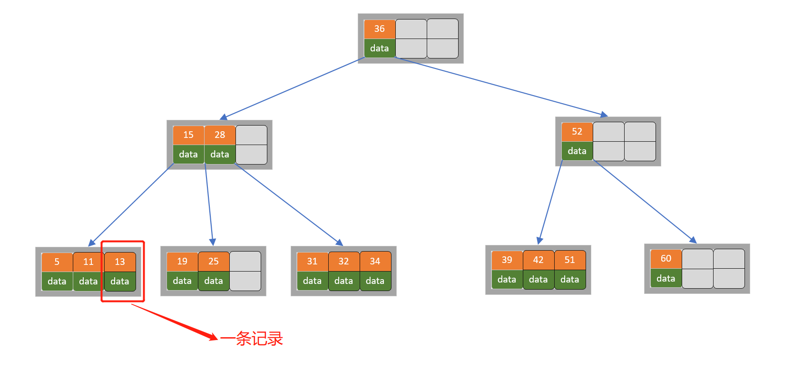 

上图表示是一棵 4 阶 B 树（当然实际中 B 树的阶数一般远大于 4，通常大于 100，这样即使存储大量的数据，B 树的高度仍然很低），每个节点最多有 3 个关键字，每个非根节点最少有 `Math.ceil(4/2)-1`=1 个关键字。我们将**一个 key 和其对应的 data 称为一个记录**。

数据库中如果以 B 树作为索引结构，此时 B 树中的 `key` 就表示键，而 `data` 表示了这个键对应的条目在硬盘上的逻辑地址。 

 

**什么是根节点 ？**

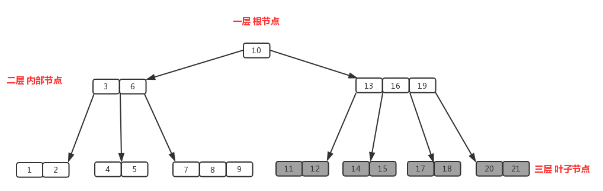

节点【10】即为根节点，特征：

- 根节点拥有的子节点数量的上限和内部节点相同，如果根节点不是树中唯一节点的话，至少有俩个子节点（不然就变成单支了）。
- 在m阶B树中（根节点非树中唯一节点），那么有关系式 `2 <= M <= m`，M为子节点数量；
- 包含的元素数量 `1 <= K <= m-1` ， K为元素数量。

**什么是内部节点 ？**

节点【13，16，19】、节点【3，6】都为内部节点，特征：

- 内部节点是除叶子节点和根节点之外的所有节点，拥有父节点和子节点。
- 假定m阶B树的内部节点的子节点数量为M，则一定要符合 `（m/2）<= M <= m` 关系式；
- 包含的元素数量 `（m/2）-1 <= K <= m-1`，K为元素数量。m/2向上取整。

**什么是叶子节点？**

节点【1，2】、节点【11，12】等最后一层都为叶子节点，叶子节点对元素的数量有相同的限制，但是没有子节点，也没有指向子节点的指针。特征：

- 在m阶B树中叶子节点的元素符合 `（m/2）-1 <= K <= m-1`。


## 插入

针对 m 阶高度 h 的 B 树，插入一个元素时，首先在 B 树中是否存在，如果不存在，即在叶子结点处结束，然后在**叶子结点**中插入该新的元素。

- 若该节点元素个数小于 `m-1`，直接插入；
- 若该节点元素个数等于 `m-1`，引起节点分裂；以该节点中间元素为分界，取中间元素（偶数个数，中间两个随机选取）插入到父节点中；
- 重复上面动作，直到所有节点符合B树的规则；最坏的情况一直分裂到根节点，生成新的根节点，高度加 1；

上面三段话为插入动作的核心，接下来以 5 阶 B 树为例，详细讲解插入的动作；

5 阶 B 树关键点:

- 2<=根节点子节点个数<=5
- 3<=内节点子节点个数<=5
- 1<=根节点元素个数<=4
- 2<=非根节点元素个数<=4

 

 图（1）插入元素【8】后变为图（2），此时根节点元素个数为 5，不符合 1<=根节点元素个数<=4，进行分裂（真实情况是先分裂，然后插入元素，这里是为了直观而先插入元素，下面的操作都一样，不再赘述），取节点中间元素【7】，加入到父节点，左右分裂为 2 个节点，如图（3） 

 

接着插入元素【5】，【11】，【17】时，不需要任何分裂操作，如图（4） 

 

插入元素【13】 

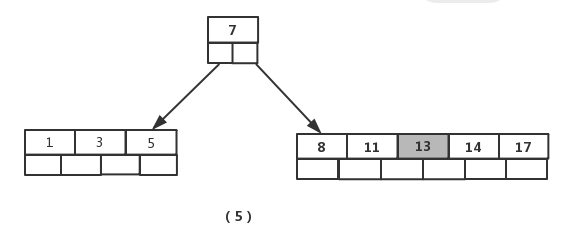 

节点元素超出最大数量，进行分裂，提取中间元素【13】，插入到父节点当中，如图（6） 

 

接着插入元素【6】，【12】，【20】，【23】时，不需要任何分裂操作，如图（7） 

 

插入【26】时，最右的叶子结点空间满了，需要进行分裂操作，中间元素【20】上移到父节点中，注意通过上移中间元素，树最终还是保持平衡，分裂结果的结点存在2个关键字元素。 

 

插入【4】时，导致最左边的叶子结点被分裂，【4】恰好也是中间元素，上移到父节点中，然后元素【16】，【18】，【24】，【25】陆续插入不需要任何分裂操作 

 

最后，当插入【19】时，含有【14】，【16】，【17】，【18】的结点需要分裂，把中间元素【17】上移到父节点中，但是情况来了，父节点中空间已经满了，所以也要进行分裂，将父节点中的中间元素【13】上移到新形成的根结点中，这样具体插入操作的完成。 

 

一般来说，对于确定的 m 和确定类型的记录，节点大小是**固定**的，无论它实际存储了多少个记录。但是分配固定节点大小的方法会存在浪费的情况。

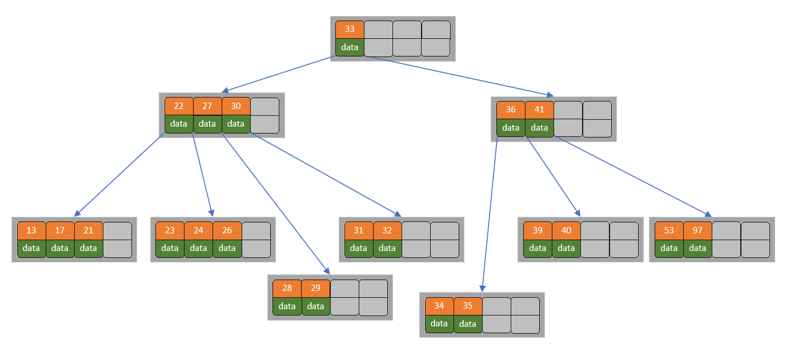 

比如 key 为 28 和 29 所在的节点，还有 2 个 key 的位置没有使用，但是已经不可能继续在插入任何值了，因为这个节点的前序 key 是 27，后继 key 是 30，所有整数值都用完了。所以如果记录先按 key 的大小排好序，再插入到 B 树中，节点的使用率就会很低，**最差情况下使用率仅为 50%**。 


## 删除

首先查找 B 树中需删除的元素，如果该元素在 B 树中存在，则将该元素在其结点中进行删除；删除该元素后，首先判断该元素是否有左右孩子结点，如果没有，直接删除；如果有，则上移孩子结点中后继 key 到父节点中。然后是移动之后的情况：

- 某结点中元素数目小于（m/2）-1，(m/2)向上取整，则需要看其某相邻兄弟结点是否丰满；
- 如果丰满（结点中元素个数大于(m/2)-1），则向父节点借一个元素来满足条件；
- 如果其相邻兄弟都不丰满，即其结点数目等于(m/2)-1，则该结点与其相邻的某一兄弟结点进行“合并”成一个结点；

接下来还以 5 阶 B 树为例（5 阶 B 树节点最多有 4 个关键字，最少有 2 个关键字，其中根节点最少可以只有一个关键字）。初始时刻以上述插入操作的最终状态为例。

1）初始状态


2）删除节点 21

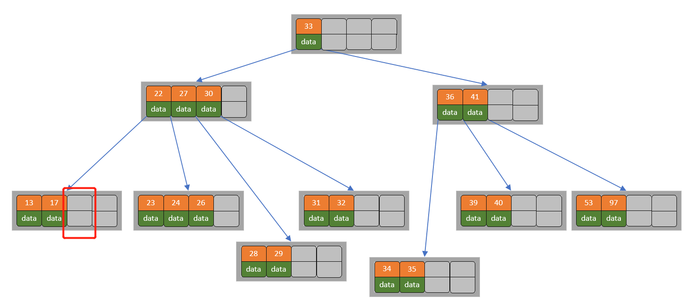

删除后节点中的关键字个数仍然大于等 2，所以删除结束。

3）继续删除 27，此时 27 由于是非叶子节点，则由它的后继节点 28 替换 27，再删除 28，结果如下所示

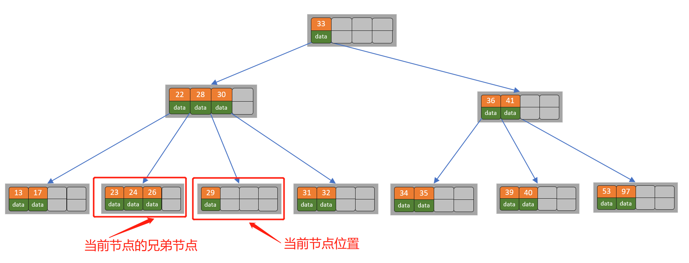

此时发现叶子节点的个数小于 2，而它的兄弟节点中有 3 个记录（当前节点还有一个右兄弟，选择右兄弟就会出现合并节点的情况，不论选哪一个都行，只是最后 B 树的形态会不一样而已），我们可以从兄弟节点中借取一个 key。所以父节点中的 28 下移，兄弟节点中的 26 上移，删除结束。结果如下图所示

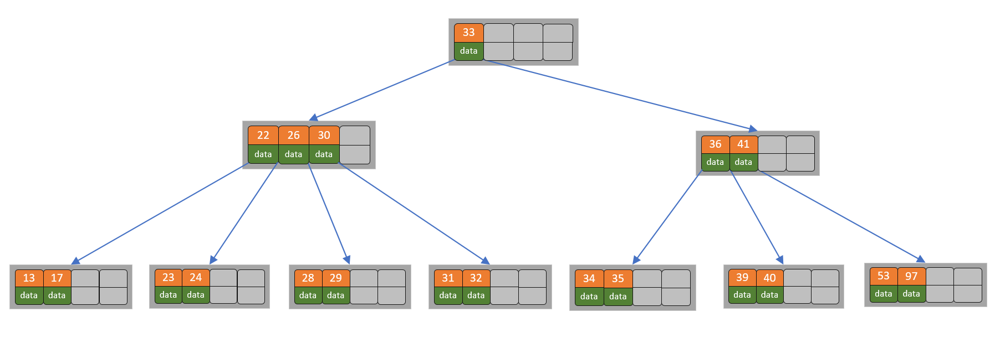

4）删除 32，结果如下图所示

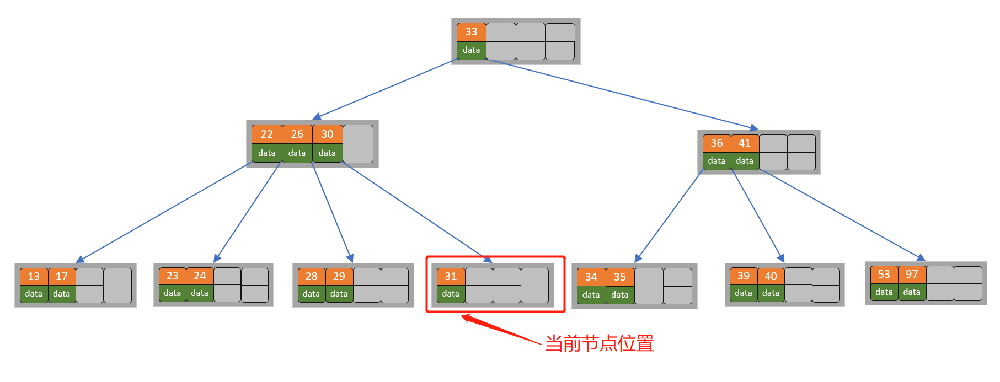

当前节点中只有一个 key，而兄弟节点中也仅有 2 个 key。所以只能让**父节点中的 30 下移和这个两个孩子节点中的 key 合并**，成为一个新的节点，当前节点的指针指向父节点。结果如下图所示

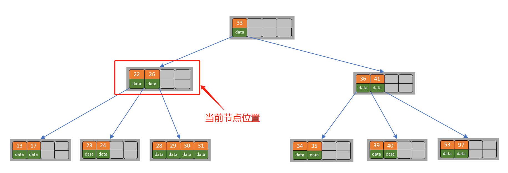

当前节点 key 的个数满足条件，故删除结束

5）接着删除 key 为 40 的记录，删除后结果如下图所示

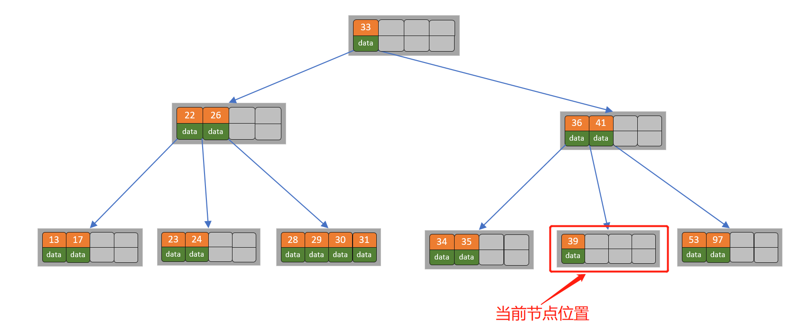

同理，当前节点的记录数小于 2，兄弟节点中没有多余 key，所以父节点中的 key 下移，和兄弟（这里我们选择左兄弟，选择右兄弟也可以）节点合并，合并后的指向当前节点的指针就指向了父节点。如下图所示

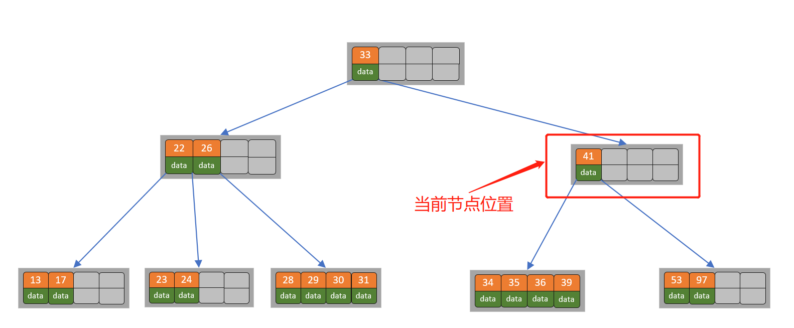

同理，对于当前节点而言只能继续合并了，最后结果如下所示


合并后节点当前节点满足条件，删除结束。


## 性能

对于在内存中的查找结构而言，红黑树的效率已经非常好了(实际上很多实际应用还对 RBT 进行了优化)。

但是如果是数据量非常大的查找呢？将这些数据全部放入内存组织成RBT结构显然是不实际的。实际上，像 OS 中的文件目录存储，数据库中的文件索引结构的存储…. 都不可能在内存中建立查找结构。必须在磁盘中建立好这个结构。那么在这个背景下，RBT 还是一种好的选择吗？ 

在磁盘中组织查找结构，从任何一个结点指向其他结点都有可能读取一次磁盘数据，再将数据写入内存进行比较。大家都知道，频繁的磁盘 IO 操作，效率是很低下的（机械运动比电子运动要慢不知道多少）。显而易见，所有的二叉树的查找结构在磁盘中都是低效的。因此，B 树很好的解决了这一个问题。

假设，一次硬盘一次 I/O 数据为 8K，索引用 int(4字节) 类型数据建立，理论上一个节点最多可以为 2000 个元素，`2000*2000*2000=8000000000`，80 亿条的数据只需 3 次 I/O（理论值），可想而知，B 树做为索引的查询效率有多高。


- 查找

  B-Tree 作为一个平衡多路查找树(m-叉)。B 树的查找分成两种：

  - 一种是从一个结点查找另一结点的地址的时候，需要定位磁盘地址(查找地址)，查找代价极高。
  - 另一种是将结点中的有序关键字序列放入内存，进行优化查找(可以用折半)，相比查找代价极低。而 B 树的高度很小，因此在这一背景下，B 树比任何二叉结构查找树的效率都要高很多。而且 B+ 树作为 B 树的变种，其查找效率更高。

  

- 插入

  B-Tree 的插入会发生结点的分裂操作。当插入操作引起了 s 个节点的分裂时，磁盘访问的次数为 h(读取搜索路径上的节点)＋2s(回写两个分裂出的新节点)＋1（回写新的根节点或插入后没有导致分裂的节点）。因此，所需要的磁盘访问次数是 h+2s+1，最多可达到 3h+1。因此插入的代价是很大的。

   

- 删除

  B-Tree 的删除会发生结点合并操作。最坏情况下磁盘访问次数是：

  3h＝（找到包含被删除元素需要 h 次读访问）+（获取第 2 至 h 层的最相邻兄弟需要 h-1 次读访问）+（在第 3 至 h 层的合并需要 h-2 次写访问）+（对修改过的根节点和第 2 层的两个节点进行 3 次写访问）。 


- 总结

  由于考虑磁盘储存结构，B 树的查找、删除、插入的代价都远远要小于任何二叉结构树(读写磁盘次数的降低)。 


---

# B+树

B+ 树是 B 树的一种变形形式。网上各种资料上 B+ 树的定义各有不同，一种定义方式是关键字个数和孩子节点个数相同。这里我们采取维基百科上所定义的方式，即关键字个数比孩子节点个数小 1，这种方式是和 B 树基本等价的。除了 B 树的性质，B+ 树还包括以下要求：

- B+ 树包含 2 种类型的节点：**内部节点（也称索引节点）和叶子节点**。根节点本身即可以是内部节点，也可以是叶子节点。根节点的关键字个数最少可以只有 1 个。
- B+ 树与 B 树最大的不同是**内部节点不保存数据**，**只用于索引**，所有数据（或者说记录）都**保存在叶子节点中**。
- m 阶 B+ 树表示了**内部节点最多有 m-1 个关键字**（或者说内部节点最多有 m 个子树），阶数 m 同时限制了**叶子节点最多存储 m-1 个记录**。
- 内部节点中的 key 都按照从小到大的顺序排列，对于内部节点中的一个 key，左树中的所有 key 都小于它，右子树中的 key 都**大于等于**它。叶子节点中的记录也按照 key 的大小排列。
- 每个**叶子节点都存有相邻叶子节点的指针**，叶子节点本身依关键字的大小自小而大顺序链接。

 

上图是一棵阶数为 4 的 B+ 树 


## 搜索

操作流程同 B 树的搜索流程，只不过如果要找的关键字匹配上了索引节点的关键字，需要继续往下找，因为索引节点不存储数据，所有的数据都存储在叶子节点上。


## 插入

基本步骤：

1. 若为空树，创建一个叶子节点，然后将记录插入其中，此时这个叶子节点也是根节点，插入操作结束。
2. 针对**叶子类型**节点：
   - 根据 key 值找到叶子节点，向这个叶子节点插入记录。
   - 插入后，若当前节点 key 的个数小于等于 m-1，则插入结束。
   - 否则将这个叶子节点分裂成左右两个叶子节点，左叶子节点包含前 m/2 个记录，右节点包含剩下的记录，将第 m/2+1 个记录的 key 进位到父节点中（父节点一定是索引类型节点），进位到父节点的 key 左孩子指针向左节点，右孩子指针向右节点。将当前节点的指针指向父节点，然后执行第 3 步。
3. 针对**索引类型**节点：
   - 若当前节点 key 的个数小于等于 m-1，则插入结束。
   - 否则，将这个索引类型节点分裂成两个索引节点，左索引节点包含前 (m-1)/2 个 key，右节点包含 m-(m-1)/2 个 key，将第 m/2 个 key 进位到父节点中，进位到父节点的 key 左孩子指向左节点， 进位到父节点的 key 右孩子指向右节点。将当前节点的指针指向父节点，然后重复第 3 步。


以 5 阶 B+ 树为例（5 阶 B+ 树节点最多有 4 个关键字，最少有 2 个关键字，其中根节点最少可以只有一个关键字），从初始时刻依次插入数据。

1）在空树插入 5

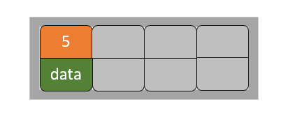

2）依次插入 8，10，15

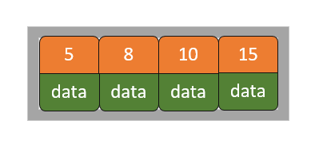

3）插入 16

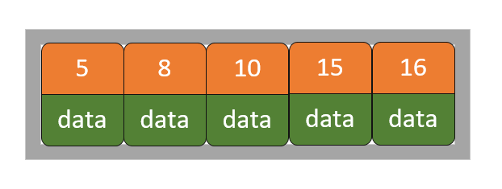

此时节点超过关键字的个数，所以需要进行分裂。由于该节点为叶子节点，所以可以分裂出来左节点 2 个记录，右边 3 个记录，中间 key 成为索引节点中的 key（也可以左节点 3 个记录，右节点 2 个记录），分裂后当前节点指向了父节点（根节点）。结果如下图所示

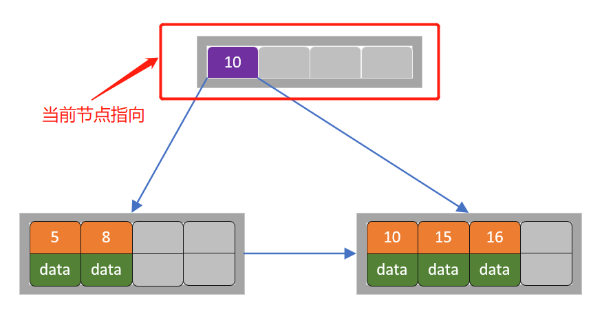

当前节点的关键字个数满足条件，插入结束

4）插入 17

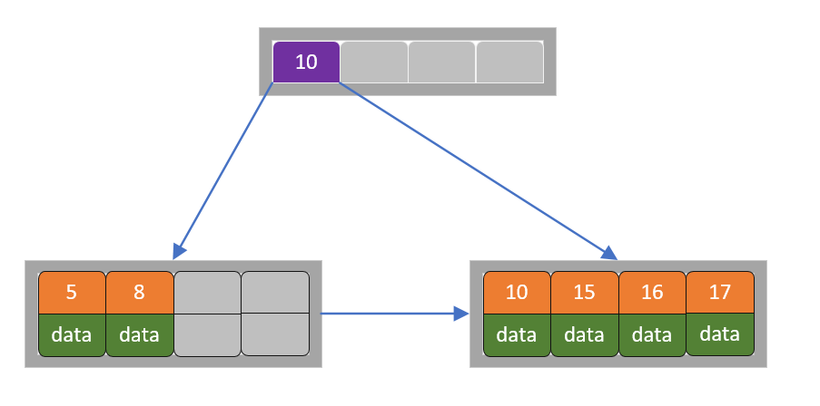

5）插入 18

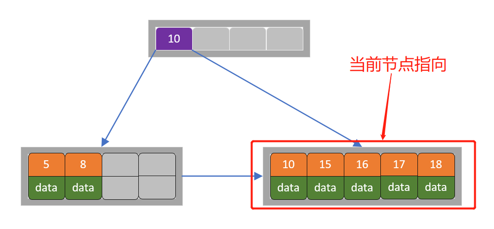

当前节点超过关键字的个数，进行分裂。由于是叶子节点，分裂成两个节点，左节点 2 个记录，右节点 3 个记录，关键字 16 进位到父节点（索引类型）中，将当前节点的指针指向父节点，如下图所示

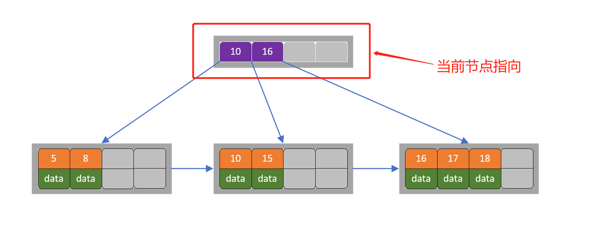

当前节点的关键字个数满足条件，插入结束

6）同理继续插入 6，9，19，20，21，22，细节不再描述

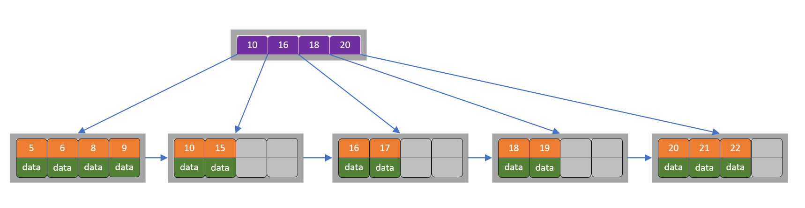

7）继续插入 7

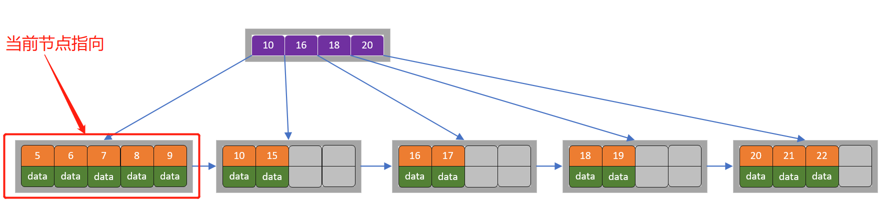

当前节点超过关键字的个数，进行分裂。由于是叶子节点，分裂成两个节点，左节点 2 个记录，右节点 3 个记录，关键字 7 进位到父节点（索引类型）中，将当前节点的指针指向父节点，如下图所示

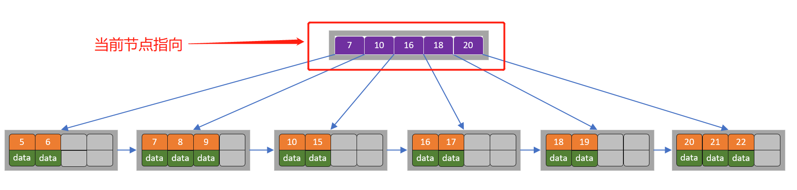

当前节点超过关键字的个数，进行分裂。由于是索引节点，左节点 2 个关键字，右节点 2 个关键字，关键字 16 进入到父节点中，将当前节点指向父节点，如下图所示


当前节点的关键字个数满足条件，插入结束


## 删除

基本步骤：

如果叶子节点中没有相应的 key，则删除失败。否则执行下面的步骤：

1. 删除叶子节点中对应的 key。删除后若节点的 key 的个数大于等于 Math.ceil(m-1)/2 – 1，删除操作结束,否则执行第 2 步。
2. 若兄弟节点 key 有富余（大于 Math.ceil(m-1)/2 – 1），向兄弟节点借一个记录，同时用借到的 key 替换父结（指当前节点和兄弟节点共同的父节点）点中的 key，删除结束。否则执行第 3 步。
3. 若兄弟节点中没有富余的 key,则当前节点和兄弟节点合并成一个新的叶子节点，并删除父节点中的 key（父节点中的这个 key 两边的孩子指针就变成了一个指针，正好指向这个新的叶子节点），将当前节点指向父节点（必为索引节点），执行第 4 步（第 4 步以后的操作和 B 树就完全一样了，主要是为了更新索引节点）。
4. 若索引节点的 key 的个数大于等于 Math.ceil(m-1)/2 – 1，则删除操作结束。否则执行第 5 步
5. 若兄弟节点有富余，父节点 key 下移，兄弟节点 key 上移，删除结束。否则执行第 6 步
6. 当前节点和兄弟节点及父节点下移 key 合并成一个新的节点。将当前节点指向父节点，重复第 4 步。


以 5 阶 B 树为例（5 阶 B 树节点最多有 4 个关键字，最少有 2 个关键字，其中根节点最少可以只有一个关键字）。初始时刻以上述插入操作的最终状态为例。

1）初始状态

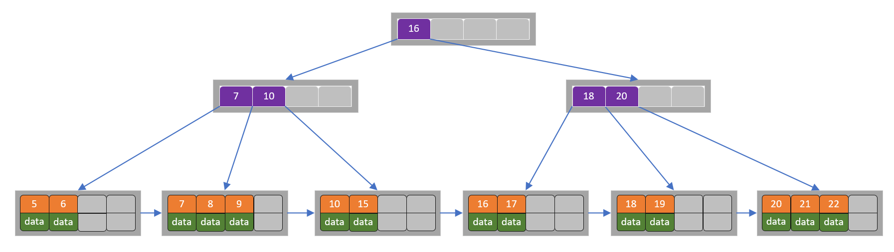

2）删除 22

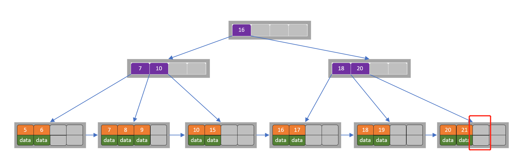

删除后叶子节点中 key 的个数大于等于 2，删除结束

3）删除 15

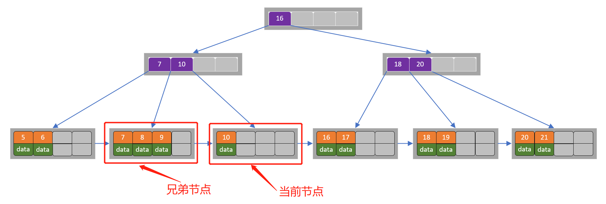

当前节点只有一个 key，不满足条件，而兄弟节点有三 个key，可以从兄弟节点借一个关键字为 9 的记录,同时更新将父节点中的关键字由 10 也变为 9，删除结束。

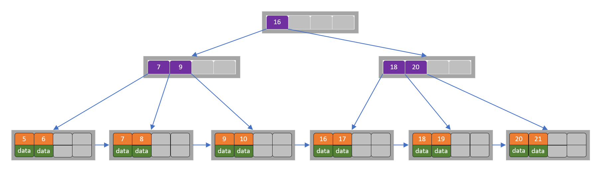

4）删除 7

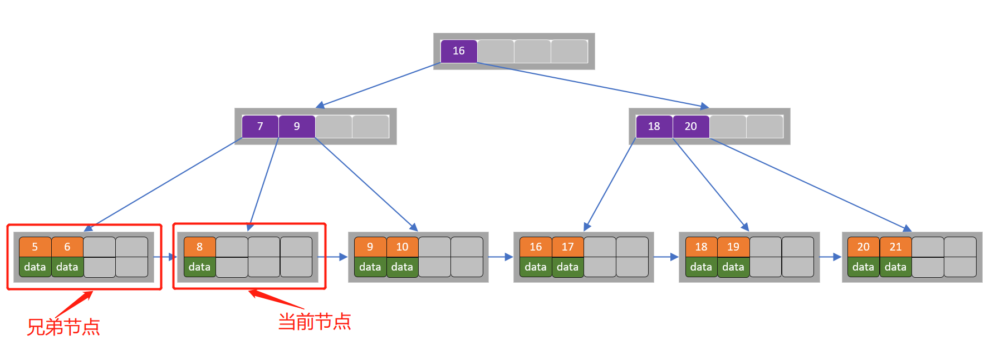

当前节点关键字个数小于 2，（左）兄弟节点中的也没有富余的关键字（当前节点还有个右兄弟，不过选择任意一个进行分析就可以了，这里我们选择了左边的），所以当前节点和兄弟节点合并，并删除父节点中的 key，当前节点指向父节点。

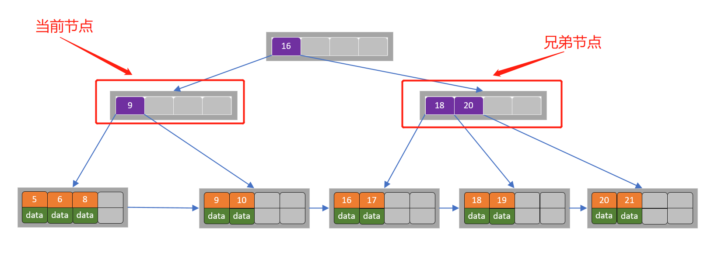

此时当前节点的关键字个数小于 2，兄弟节点的关键字也没有富余，所以父节点中的关键字下移，和两个孩子节点合并，结果如下图所示。

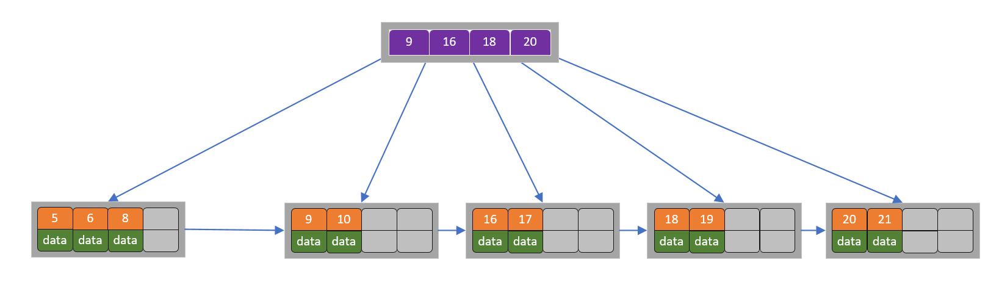

删除结束。


## 总结

为什么说 B+ 树比 B 树更适合数据库索引？

1）B+ 树的磁盘读写代价更低

B+ 树的内部结点并没有指向关键字具体信息的指针。因此其内部结点相对 B 树更小。如果把所有同一内部结点的关键字存放在同一盘块中，那么盘块所能容纳的关键字数量也越多。一次性读入内存中的需要查找的关键字也就越多。相对来说 IO 读写次数也就降低了；

2）B+ 树查询效率更加稳定

由于非终结点并不是最终指向文件内容的结点，而只是叶子结点中关键字的索引。所以任何关键字的查找必须走一条从根结点到叶子结点的路。所有关键字查询的路径长度相同，导致每一个数据的查询效率相当；

3）B+ 树便于范围查询（最重要的原因，范围查找是数据库的常态）

B 树在提高了 IO 性能的同时并没有解决元素遍历效率低下的问题，正是为了解决这个问题，B+ 树应运而生。B+ 树只需要去遍历叶子节点就可以实现整棵树的遍历。而且在数据库中基于范围的查询是非常频繁的，而 B 树不支持这样的操作或者说效率太低。


---

# 参考与感谢

- [平衡二叉树](https://blog.csdn.net/isunbin/article/details/81707606)
- [红黑树(R-B tree)原理图文详解](https://www.linuxidc.com/Linux/2019-08/160024.htm)
- [B树、B+树详解](https://www.cnblogs.com/lianzhilei/p/11250589.html)
- [一文彻底弄懂B树和B+树](http://xianzilei.cn/blog/31)
- [B+ Tree 动画](https://www.cs.usfca.edu/~galles/visualization/BPlusTree.html)


