# SSD的基本原理

## 浮栅晶体管

Flash 的基本存储单元是 - **浮栅晶体管**。闪存颗粒其实就是很多很多浮栅晶体管制成的储存单元，所以在这个小节我们会从浮栅晶体管的原理讲起。

在进一步介绍固态硬盘的结构和原理之前，我们先来了解一下固态储存器的几个分类：易失性和非易失性储存器。

从名字应该就可以看到它俩的区别，虽然都是把比特信息储存在电容器和晶体管组成的储存单元里，都是用晶体管里面的电荷多少来代表 1 和 0，但是易失性储存器一旦断电储存单元上面的信息就会很快丢失，而非易失性储存器即使断电也能保存授权单元上面的数据，简单来讲就是断电丢不丢数据的区别。

因为易失性储存器的晶体管不像非易失性储存器那样，有高电阻材料去留住电荷，需要高电压还有量子隧穿效应来读写数据，所以它工作需要的电压更低（通常在 1-2V 左右）并且读写速度更高。我们常见的内存条 RAM 就是一种易失性储存器。

不严格来讲正是因为「易失」所以才「快」。

浮栅晶体管的特性让它即使断电也能将数据保存 10 年以上，但多出来的一层高电阻材料让非易失性储存器读写速度和随机读写能力比起易失性储存器就要差上不少，这也是为啥现代计算机需要用运行内存作为储存器和 CPU 之间的「桥梁」，因为易失性储存器拥有纳秒级别的随机读写能力，让它更能跟上 CPU 思考的速度提供数据。

我们先来看一个最简单的平面浮栅晶体管截面结构图：

 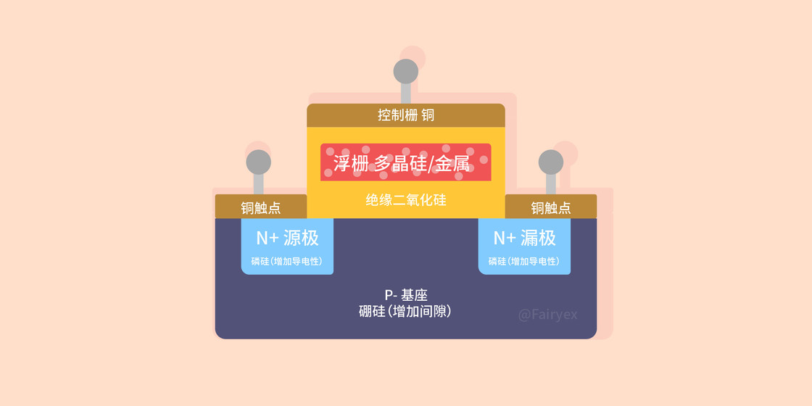

可以看到浮栅晶体管有一个硅底座（我们叫它 **P-** ），左右分别用铜制作的端点来向另一种硅材料制成的 **N 级**施加电压和检测电压，以读取中间储存结构的电荷量，所以我们叫它们 **N+ 源**（左边，加检测电压时电子从这边流入）和 **N+ 漏**（右边如果导通，电子从这边漏走到检测电路），由于它俩是对称的，所以源和漏极可以互换。

中间则是利用特殊工艺制作的储存结构，在硅底座上面「生长」出一块完全绝缘的二氧化硅，然后通过另一种特殊工艺在中间生成可以储存电荷的材料，比如多晶硅或者其它金属。然后在整个结构的顶上再加一层铜做的控制级（用来加写入电压）。

顶上这层就叫做**控制栅**，而储存电荷的材料就叫做**浮栅**。之所以叫浮栅，因为它是整个被二氧化硅包裹的，像是浮在水里面一样，如果有电子跑进了浮栅，在不施加高电压的情况下，由于周围都是绝缘材料，它是跑不了的，所以电子在里面能够保存数十年。顺便一讲运行内存 RAM 这些断电就没数据的颗粒，结构也和这个类似，就是少了中间的浮栅而已。

有了稳定持续的电子储存方法，我们就可以通过往某个浮栅里面写入一定量的电子来储存 0 和 1，通过检测浮栅里面的电子数量来读取 0 或 1。

通常我们设定浮栅里面电子少于一定数量或者**没有电子就代表 1**，浮栅里面电子多于一定数量就代表 0。

 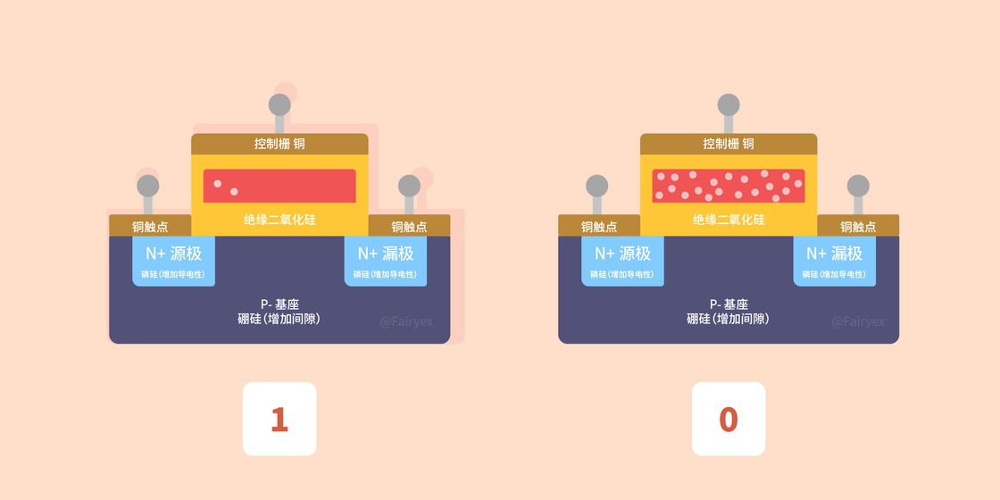

**读取浮栅晶体管的数据**：浮栅中的电子量非常难以直接测量，但我们不需要测量精确的电子数量，只需要知道它有没有达到我们规定的数量就可以。

我们先假装没有浮栅这个结构，然后在最顶上那层控制栅和漏级都加上一个电压，这个时候底座里面的自由电子会被往控制栅方向吸引，但底座和控制栅之间有一层绝缘的二氧化硅，所以自由电子会累积在底座的顶部，也就是两个 N+ 中间，当电压达到一定程度，中间的自由电子累积到足够的数量，刚好会把两个 N+ 打通形成一条无形的通路，电流就能从漏极流向原极，这个打通的电压我们就叫它**阈值电压**。

 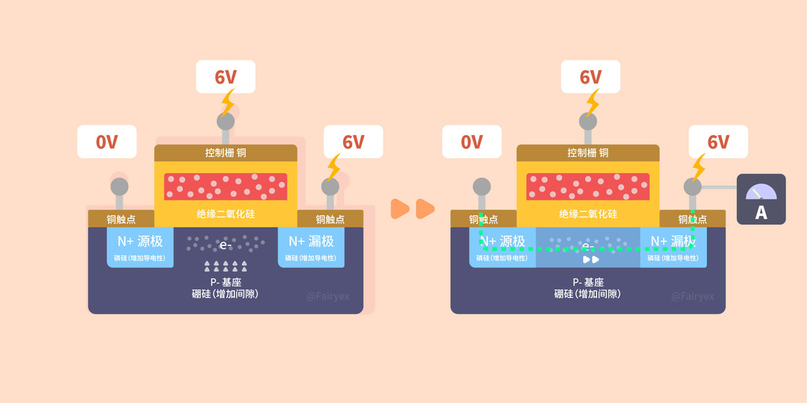

> 这里有个需要说明的地方，我们从漏级加的电压，当两个 N+ 打通的时候电流是从漏级流向原级，但里面的电子是从源极流向漏极（至于为什么是相反的，就要回忆一下你学过的高中物理了，简单来讲就是电流和电子移动方向是相反的），所以**我们的源和漏是以电子的流向来划分的**。

这里我们再把浮栅加进去，再施加同样的阈值电压，如果浮栅里面带大量的电子（也就是表示 0 的时候），浮栅里面的电子会抵消一部分控制栅对底座上自由电子的吸引力，这样两个 N+ 就没办法打通。

阈值电压就是固态出厂前在工厂里面测出来写到主控里面，想要读取某个晶体管数据的时候就往最顶上那层控制栅和漏级都加上阈值电压，如果漏极端检测电路能够检测到电子的流动，证明浮栅上面电子数量在规定值以下的，也就是 1；反之如果检测不到电子的流动，证明浮栅上面电子数量在规定值以上，那就是 0，整一个过程就是浮栅晶体管的读操作。

**往浮栅晶体管写入数据**：但我们想要给浮栅晶体管写入 0 的时候，也就是往浮栅里面存入电子。我们可以通过给顶上的控制栅和漏极加一个比阈值电压高很多的电压，然后让控制栅的电压大于漏极电压。

 

这个时候由于大电压，两个 N+ 之间的电子流动会加快，同时控制栅有更大的电压，吸引力会大到让部分电子因为量子隧穿效应穿过绝缘的二氧化硅进入浮栅。从而完成充入电荷的操作，这部分电子相当于被二氧化硅组成的「陷阱」陷住了，过几十年都跑不掉，所以人们也把它叫做**电荷陷阱**。

而当我们想要给浮栅晶体管写入 1，也就是要放掉浮栅里面存的电子，我们就反过来给两个 N+ 加一个大电压。

 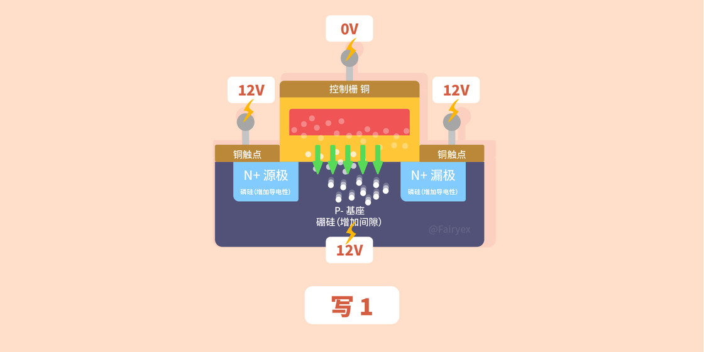

这样子电子会因为**量子隧穿效应**被大电压从浮栅里面「吸」出来跑到 P- 底座里面。**写 0 写 1 两个操作分别就是浮栅晶体管的编程/擦除操作。**这两个操作会对隔离底座和浮栅的二氧化硅层产生**破坏性**的影响，写入多次后晶体管就会与底座接触，没办法储存电子，也就是坏掉了，所以固态会有擦写寿命这样一个参数。

## NandFlash 和 Norflash

闪存分为两个类型，平时我们或许听过 NAND 和 NOR 闪存就是指这两个类型，从名字就可以看出它们是用原理对应的逻辑门来命名的，具体原理下面会讲。

简单来讲就是之前那些 ROM 必须完全擦除才能重写，速度又慢又浪费寿命，而闪存可以做到按块/页进行擦除，写入和读取，而且可以做到很快速的擦除，闪存的名字是按照发明者同事的建议命名的，擦除过程就是像闪光灯一样迅速，所以叫做闪存。闪存就是为了「更快」而诞生的。

NOR 和 NAND 的起名就来源于其结构，分别对应逻辑门电路中的 NOR Gate 和 NAND Gate。

 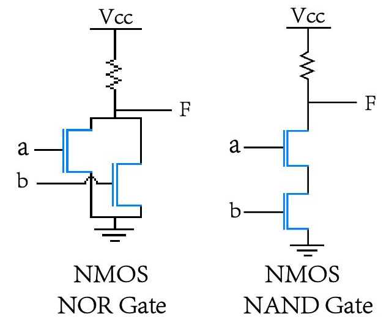

**它俩主要的不同，不是在于单个单元上，而是在单元的排列上。**

由于人们用 NAND 闪存来做大容量储存器，所以它的数据密度越来越大，浮栅晶体管和对应的电路做得越来越小，NAND 储存单元小到没办法给每个浮栅晶体管都单独接上寻找地址的地址线和传输数据的数据总线，每一纳米面积都要利用到极致，真的是寸土寸金。所以不仅 NAND 里面地址线和数据总线是共用的，而且只能以一页为单位把 10000-30000个浮栅晶体管**串联**起来，一页只有一条地址线和数据总线，所以 NAND **读写数据只能以页为单位**，串联方式也成为它名字的由来。

 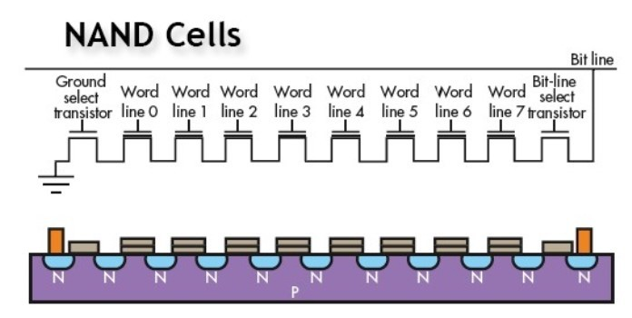

下图是一个 8Gb 50nm 的SLC颗粒内部架构，一个 wordline 对应着一个或若干个 Page，取决于 SLC，MLC 或者 TLC。对 SLC 来说，一个 wordline 对应一个Page；MLC 则对应 2 个 Page，这两个 Page 是一对：Lower Page 和 Upper Page；TLC 对应 3 个 Page。

每个 page 有 33,792 个单元，每个单元代表 1bit (SLC)，所以每个 page 就是 4096 Byte + 128 Byte（SA）。
每个 Block 有 64 个 page 组成，所以每个 Block 容量为 262,114 Byte + 8192 Byte （SA）

擦除也就是写 1 的过程，由 bitline 控制，因为读写以 page 为单位，只更改某条 bitline 的数据没有什么实际意义，所以**擦除以 block 为单位**。

 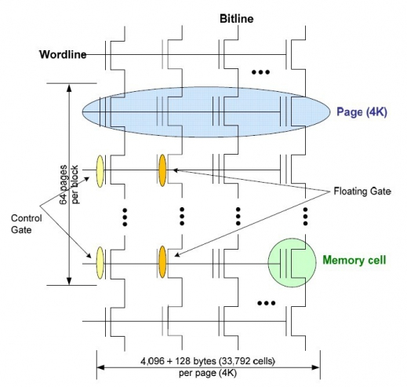

NAND 闪存单元体积比较小，所以密度更高，同样成本可以做到更大容量，同时按块方式让擦写读取速度都很快，擦写寿命也比较长；缺点是必须按照块来擦写，也没有真正的随机访问能力，也可靠性相对较低。

 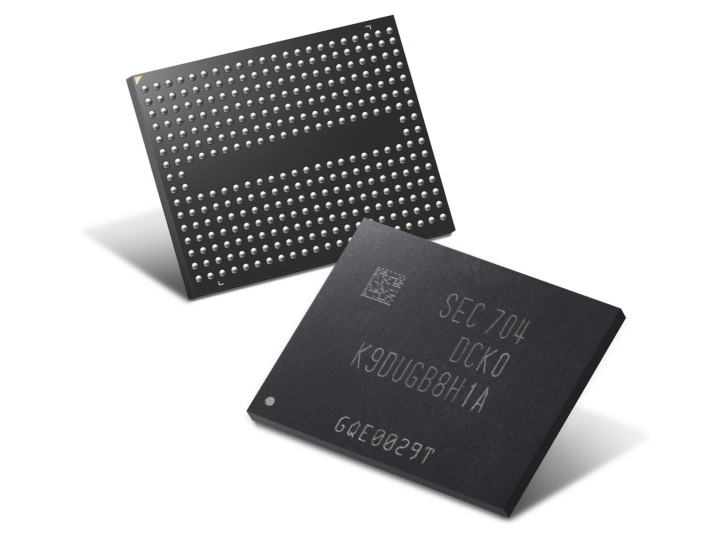

而 NOR 闪存每个浮栅晶体管都是有单独的地址线和数据总线，它们之间互相**并联**。这样子做极大增加了每个储存单元的面积和复杂程度，所以**同样面积的 NOR 闪存比起 NAND 闪存容量少很多**，同时造价非常昂贵。不过这样子的好处也很明显，每一个浮栅晶体管的数据都可以以 bit 为单位单独读写，**读取速度非常非常快**，这意味着它有真正的随机访问能力，快到像是我们上面提到的可以就地执行代码，CPU 可以直接从储存设备取指令不用把数据放到运行内存，特别适合做主板 BIOS 或者单片机里面的 ROM，并联方式也成为它名字的由来。

 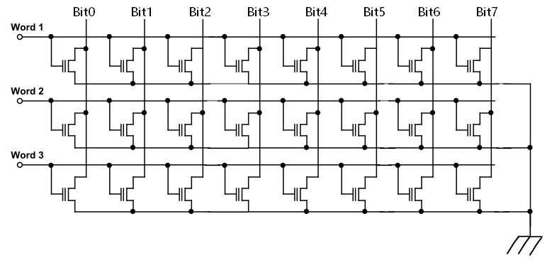

 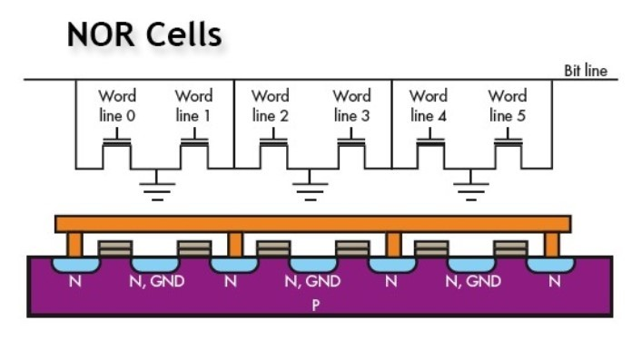

NOR 闪存单元体积比较大，容量就很小，擦写速度非常慢，但读取速度很快。可以按字节为单位提供真正的随机访问能力，这意味着它可以就地执行代码（不用把代码搬到运行内存），可靠性也比较高，也因为如此擦写寿命比较短。

 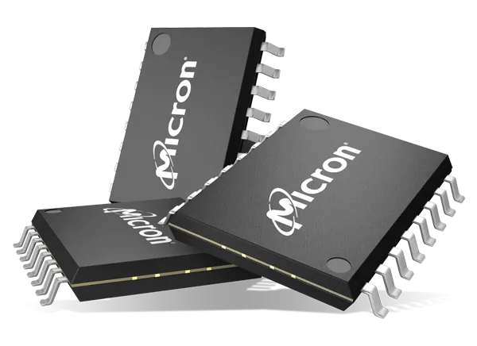

从这两个闪存类型可以看出，NAND 容量大读写都快的特点适合做大容量储存，事实上我们现在的固态硬盘基本都是 NAND 闪存；而 NOR 可以就地执行代码和真正随机访问的能力，加上很快的读取速度就非常适合用来装程序文件，比如主板上的 BIOS 通常就是 NOR 闪存。

上面我们了解的只是一个很简单的平面浮栅晶体管原理，而事实上现在厂家为了固态大容量已经开始让浮栅储存单元竖着叠起来，也就是现代固态基本都在用的 3D NAND（也叫 V-NAND，V 就是垂直 vertical 的意思）。

## SLC/MLC/TLC

我们现在了解了单个储存单元的结构，那么像是 TLC 这类的技术是如何让单个存储单元储存多个 bit 的数据呢？

以 TLC 为例，一个储存单元可以装 3bit 的数据，也就是 000、001、010、011、100、101、110、111 七种状态。

我们先来说一说比较简单的读取过程。

**由于储存单元没有电子代表 1，我们把它倒回来，然后从低到高设置 7 个阈值电压。**

由于 NAND 同一页的储存单元都是串联的，接下来我们：

- 给同一页的所有储存单元给最低的阈值电压，然后从左到右一个个储存单元检测通道是否有流动。
- 如果某个储存单元检测到通道接通，那么这个储存单元就只有最低的电荷，也就是 111。
- 检查完所有储存单元状态后再给它们第 2 个高点的阈值电压，然后再从左到右一个个检测。
- 如果某个组成单元检测到通道接通，那么这个单元储存的电荷量就在第二个区间，也就是 110。
- 。。。

接下来**重复这个步骤 7 次**，就可以把每个单元的值都读出来了，虽然闪存颗粒里面的所有页都是可以同时读取的，但仍然比只需要检测一次 0 和 1 的 SLC 储存单元慢了不少。

接下来是比较保密的写入过程。

现代固态颗粒的浮栅晶体管做的实在太小，要保证数据能够很好的保存数 10 年，我们需要保证包围着浮栅的绝缘层不能太薄，电子能够很好的隔离在浮栅里不会跑掉；也不能太厚，导致很难控制写入的电子数量。通过实验最终绝缘层保持在 75-100 个原子宽的最佳厚度。

实际的写入过程其实和我们上面学到的差不多，就是通过给控制栅电压，把左侧通道里面的特定数量电子通过量子遂穿效应「吸」到浮栅里面。

不过以 TLC 为例，由于需要写入 7 种状态的电子量，需要精确调整控制栅的的电压和其他一些参数，这些电压和参数所有厂商都处于高级保密的状态，属于顶级的商业机密，基本上算是制作固态颗粒的看家本领了。

SLC \ MLC \ TLC 对照表：

 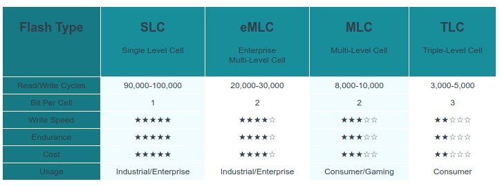

## 储存单元最后如何组成闪存颗粒

基本单位储存单元，我们已经了解得非常透彻了，这小节我们就来把它们组装起来。

- 首先 NAND 里面几万个储存单元（Cell）会组成一**页（Page）**（通常有 4/8/16/32KB），这一页共享地址线和数据总线，所有的读写都必须按页为单位
- 然后 500~1200 页组成一个闪存颗粒的**块（Block）**，每次擦除都必须以块为单位
- 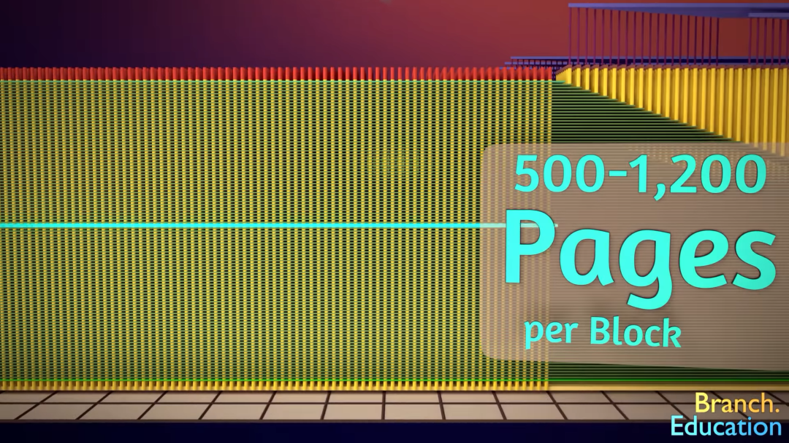
- 接着几千个块组成一个**面（Plane）**，面上会有一个寄存器，存储这个面所有储存单元的地址、临时存放数据指令等
- 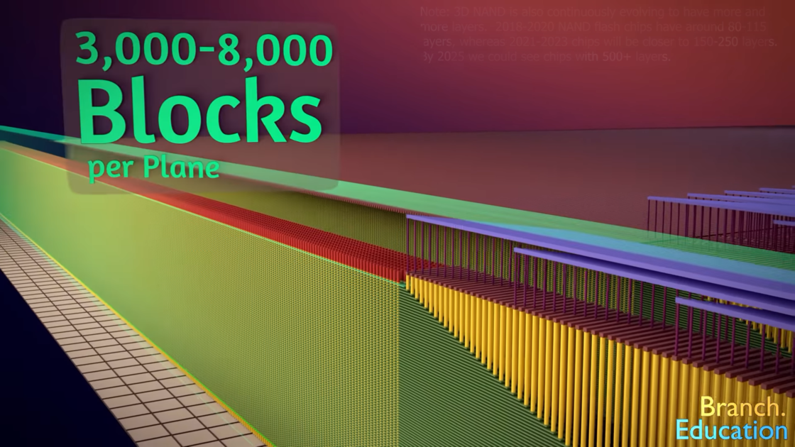
- 最后两个面组成一个**片（Die）**，Die 就是直接从晶圆上取下来的裸片
- 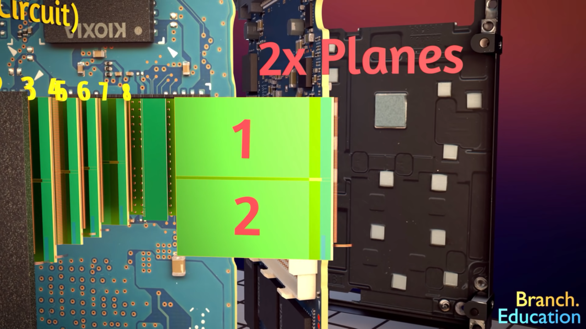
- 几个 Die 最后就压成我们能够摸到看到的黑黑的闪存颗粒了
- 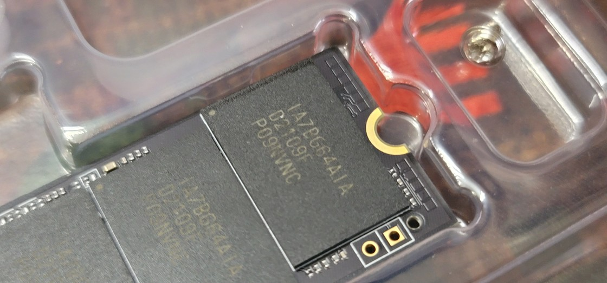

​	

---

# SSD的大脑之FTL算法

## 概述

闪存在写入数据前必须要先擦除整个块，而不能直接覆写。这完全不符合现有的、针对传统机械硬盘设计的文件系统的操作方式，目前有两种方法可以解决：

一是设计针对 Nand 闪存的文件系统和闪存驱动，最早的闪存文件系统之一是微软所研发的 FFS2（Flash File System 2），在 1990 年代，它被应用在 MS-DOS 上。

当前主流的闪存驱动有 MTD（Memory Technology Device）和 UBI（Unsorted Block Images）。MTD 的作用是对不同类型和型号的存储设备提供统一的读写管理接口，完成文件系统对闪存芯片的访问控制。UBI 实现在 MTD 上层，是针对闪存设备的卷管理系统，可以在一块物理闪存设备上管理多个逻辑卷。但是这种方法需要同时对软硬件进行开发，开发成本高。

二是在固态盘内加入闪存转换层 FTL，对外提供访问接口，屏蔽 SSD 底层具体操作，使文件系统能像操作机械硬盘一样操作固态盘。这种方法对现有的文件系统和应用程序完全兼容，减少了开发测试新软件的代价。

如下图，FTL 的出现是为了兼容现有的文件系统，它位于文件系统和物理介质之间，把闪存的操作虚拟成传统硬盘的扇区进行操作。这样操作系统就可以按照传统的扇区方式操作 SSD，而不用担心之前说的擦除和读写问题。

 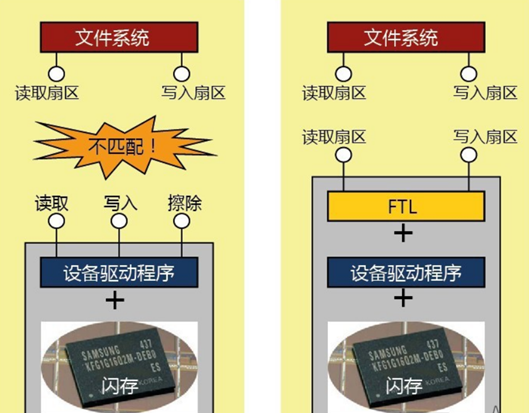

下面我们来一一介绍 FTL 需要做什么功能。

## 接口适配（Interface Adapter）

首先需要做和主机的接口适配，下图是 OpenSSD 的架构图，OpenSSD 通过 PCIe 与主机连接，这里 PCIe  既是接口也是总线协议，那么 FTL 需要在内部适配 PCIe 协议，将上层驱动传来的硬盘指令（AHCI / SCSI / NVMe）转换成闪存的控制命令。

 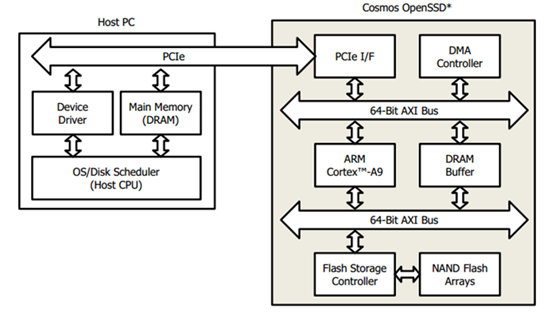

除了 PCIe 接口外，常用的接口还有 SATA，SAS 等。

SSD 常用的总线，接口和协议如下，具体含义可以见参考与感谢。

 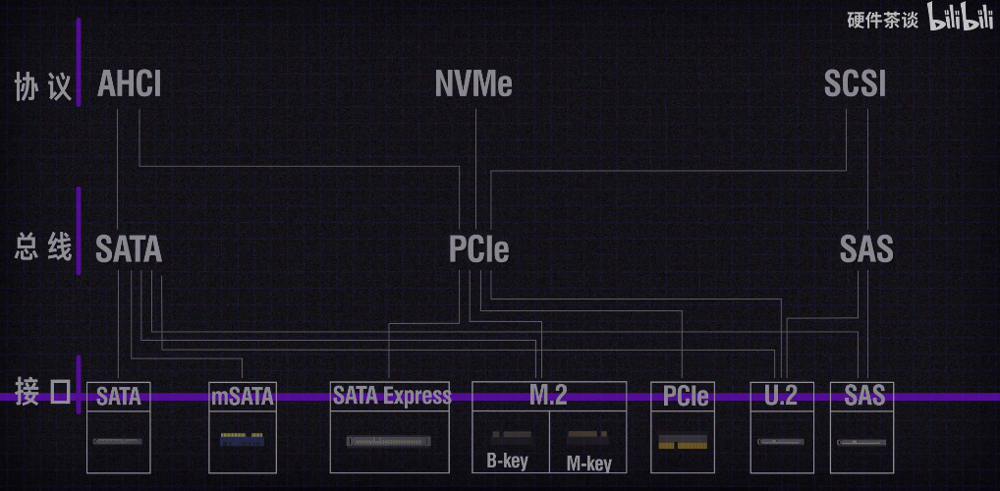

## 地址映射（Address Translation）

### 读写流程

首先我们来假设一个模型，这会让我们更清晰地了解 FTL 具体在做什么工作，如下图，每个绿色方框代表一个扇区大小，一般是 512 字节，假定 SSD Page 大小为 4 KB，每个 Block 里包含 4 个 Page，总共有 3 个Block。地址映射使用页映射的方式，逻辑页大小和物理页大小一致。

然后 SSD 有自己的缓存，为了方便观看，我用红线切割了以 Page 大小划分的内存区域。

 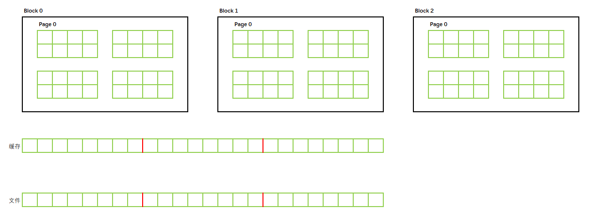

首先我往第一个扇区写入数据，这里的 1 不是代表数据 1 ，仅代表一个数据标识，表示往这个扇区里填充了一些数据。

另外这里不做缓存管理，只是说明 FTL 的基本工作原理。

由于闪存读写以页为单位，所以即使只写入一个扇区的数据，也会占用一整个 Page 的空间。

此时页映射表关系为：

> LPN 0 -- PPN 0

 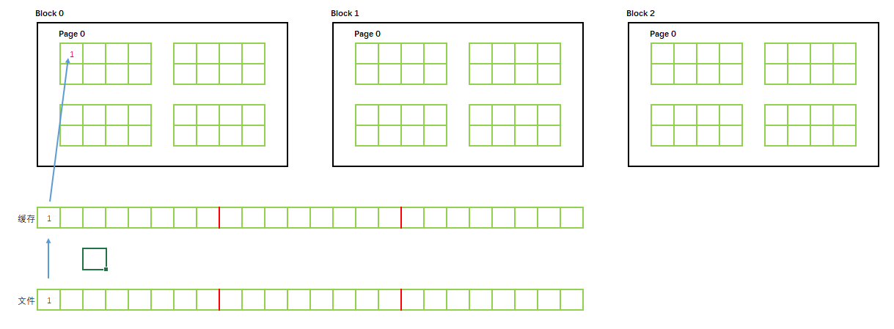

接下来我们对文件进行修改，将 1 改为 2。由于闪存需要先擦除再写的特性，而擦除是以 Block 为单位，所以此时无法覆盖写，需要新找一个 Page 去保存数据，并将之前的数据无效化，此时可以看出，对于操作系统来说，数据的位置并没有变化，只是数据更改了，但是 SSD 由于闪存的特性，无法原地覆写，其保存数据的地址在不断变化，因此我们需要保存地址映射关系。我们将操作系统看到的地址空间称为逻辑地址，闪存实际保存的地址成为物理地址。

此时页映射表关系为：

> LPN 0 -- PPN 1

 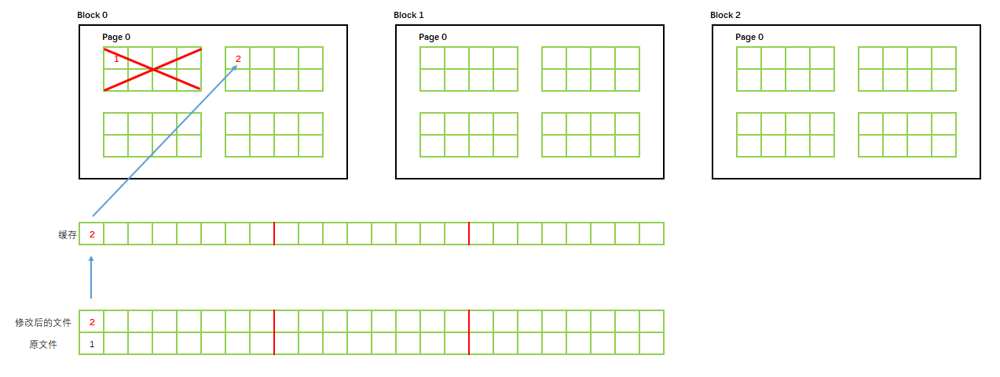

根据映射表的粒度不同，可以分为基于页面的页映射，基于块粒度的块映射以及混合映射方式。

### 页映射

纯粹的页映射可以将逻辑页地址 (Logic page number，简称 LPN) 映射到任意物理页地址 (physical page number，简称 PPN)上，这种映射方式灵活，减少了擦写次数，提高了闪存空间利用率，垃圾回收负载小，但是这种映射关系因为映射粒度小，所以映射表项多，需要消耗比较多资源来保存映射表。

一般来说 LPN 大小设置为和 PPN 大小一样，比如上面的例子，PPN 大小为 4KB，那么我们也可以设置 LPN = 4KB。当然你也可以设置为不一致，那么就需要处理复杂的逻辑映射关系。

现在的 SSD 基本上都有几百 GB，甚至上 TB，假如每个映射项分配一个字节，寻址能力为 512KB；如果分配两个字节，寻址能力为 128MB；如果分配三个字节，寻址能力为 32GB；如果分配四个字节，寻址能力为 8TB，所以基本上一个映射关系项得占用四个字节的空间。

一个 400 GB 容量的 SSD 需要 400MB 空间来保存映射表，这个开销还是蛮大的。 

### 块映射

在基于块粒度的块映射里，逻辑地址包含两个部分：逻辑块号和块内偏移。

当上层来了一个写请求，首先寻找一个空闲块，然后根据逻辑页地址计算出块内偏移后将数据写入固定的块内偏移；当上层来了一个读请求时，首先将逻辑页号转化成逻辑块号，然后查询映射表得到逻辑块对应的物理块，接着根据逻辑页号算出块内偏移，根据块内偏移从物理块中把数据读出。

这种方式只需要较少的资源来保存映射表，但是因为映射粒度太大而失去了灵活性，同时闪存空间利用率低，引起频繁地垃圾回收，对存储性能和闪存寿命都造成比较大的影响。

还是以上面举例，当以块映射的方式更新数据 2 时，在块中固定偏移的地方已经写入数据了，所以无法覆盖写，需要把整个 Block 0 置为无效，然后在 Block 1 里写入更新的数据，很明显，空间浪费得很厉害。好处就是映射表会相比页映射的方式小很多。

### 混合映射

混合映射是一种综合了页映射和块映射的方法，在不占用太多的资源保存映射表的同时也保证了一定的灵活性，在资源受限时是一个很好地选择。

### read-modify-write

由映射关系导致的问题还有 read-modify-write，这是什么意思呢？下面我们举个例子：

当我们在第二个扇区写入数据 3 时，操作系统只会告诉 SSD ，我要在第二个扇区位置写入数据 3，那么数据 2 必须从之前的 Page 中读取出来（紫色线），然后和新的数据 3 一起写入才能保证数据完整性，也就是 读 - 修改 - 写（read-modify-write）的过程，明明只是写入数据 3 的过程，却额外多读取了一次 Page。

 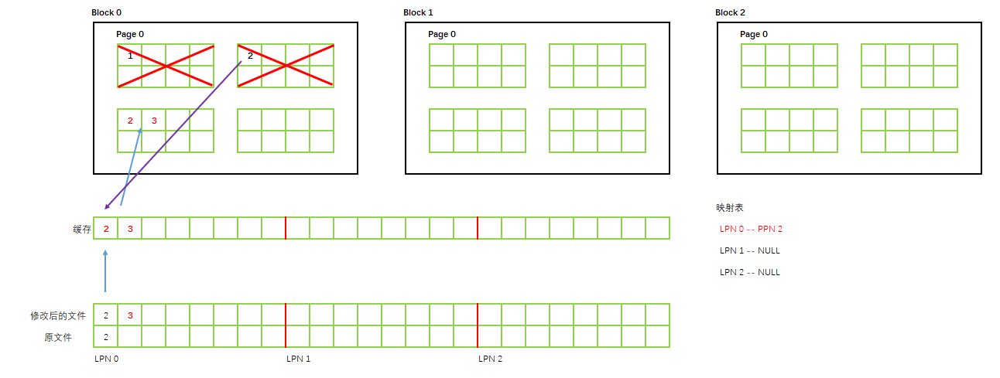

只要是数据没有按页对齐写入或者对齐写入但数据不足一页，就会存在这个问题。

我们继续写入数据，如下，我们写 12 个扇区的数据。由于 lpn0 的数据是按页对齐，所以可以直接写入，lpn1 的数据之前从未写入过，所以也可以找一个新页直接写入。（这里图里我映射表关系写错了，应该是 LPN0 -- PPN3，LPN1 -- PPN4）

 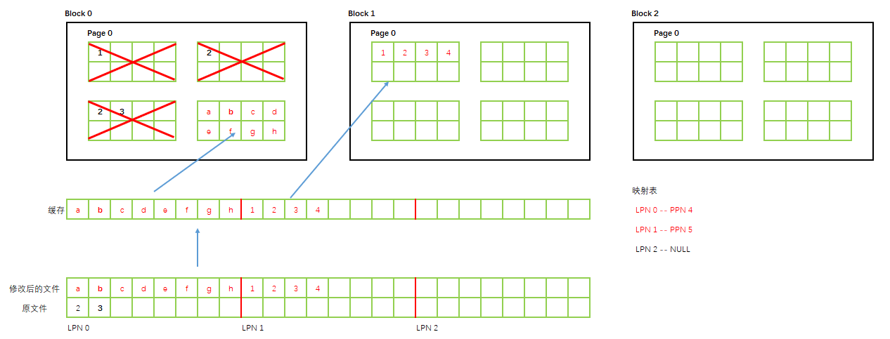

接下来按下图修改文件：lpn 0 的数据未按页对齐写入，所以需要 read-modify-write，中间部分的数据肯定是按页对齐的，所以直接找空闲页写入即可，尾端没有对齐，但是因为是新写入的，所以也是找新页写入，如果是已存在的数据，那么也需要 read-modify-write。所以我们 FTL 处理数据时尽量按页对齐写入，以减少 read-modify-write 带来的性能损失。

 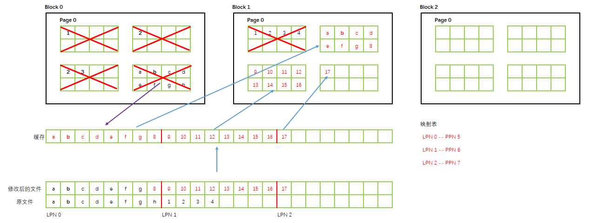

细心的同学可能已经发现问题了。明明文件只有 17 个扇区也就两个页大小多一点，却已经用了两个 Block 的空间了。SSD 内部却有那么多的无效空间（如果是采用块映射的方式，则无效空间增长速度会更快，空间利用率会更低），总不能我 100GB 容量的 SSD 最后只能存十几二十个 G 的数据，这样的产品很明显没人会买单，下面就引出了 FTL 的垃圾回收机制。

## 垃圾回收（Garbage Collection）

由于闪存页不能覆写的特性，如果页中的数据需要更新就必须找到一个还未写过的页来写入，而保存之前版本数据的页被置为无效状态。因此在 SSD 中会有很多的页里面保存着无效的数据，即无效页。

这样在 SSD 中有很多空间被占据着却没有保存有效的数据，当 SSD 的存储容量越来越小时，就需要重新利用那些保存着无效数据的页来保存新数据，这就是垃圾回收。

垃圾回收的过程本质就是将块中有效的数据集中搬到一个新块中，然后擦除回收块重新利用，过程如图：

 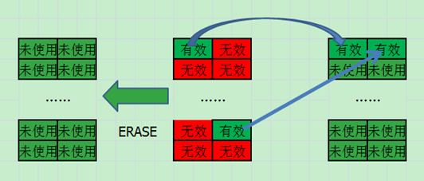

继续上面的例子，在进行一系列数据写入后，数据分布情况如下。Block 0 里都是无效数据，这种块垃圾回收最方便，只需要整个擦除后加入空闲块链表即可。Block 1 这种块回收需要将有效数据先搬移出来，然后再写回到空闲块中，那么没有空闲块可写怎么办？一般来说 FTL 会预留一些块来用于垃圾回收以及替换坏块等，这就是后面要提到的 OP 空间。

这里我们可以把 Block 2 当作预留的块，把 Block 1 的数据搬移到 Block 2 之后，就可以擦除 Block 1 了。

 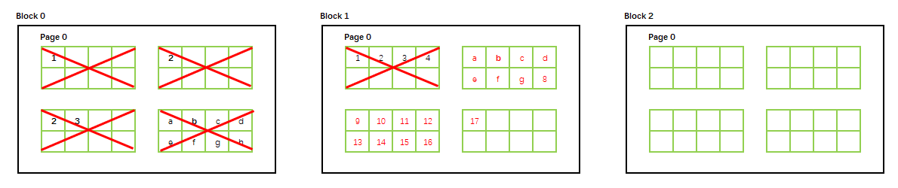

垃圾回收的过程并不复杂，难点在于**垃圾回收的时机以及回收块的选择**。

垃圾回收的时机有被动垃圾回收和主动垃圾回收。

主动垃圾回收策略是指 SSD 主控可以在系统闲置的时候进行垃圾回收操作，保证闪存内有一定数量的空闲块，因为垃圾回收的过程会消耗大量的系统带宽和主控处理时间，所以主动垃圾回收能够保证 SSD 在运行的时候保持较高的读写性能。但是主动垃圾回收会增加额外的写入放大，可能才刚通过垃圾回收的有效数据在下一刻就更新变成无效数据。

被动垃圾回收策略是每个 SSD 都支持的功能，当写入请求到达时，系统根据当前情况来判断是否要执行垃圾回收，这种模式下，FTL 通常会设定一个阀值，当可用空间小于阀值时触发垃圾回收操作。这种策略的弊端在于当执行垃圾回收时，因为要执行数据的迁移，所以写入请求会被延迟，外在表现为写入性能的急剧下降。因此这对主控提出了很高的要求，因为要在垃圾回收操作消耗主控处理能力和系统资源的同时处理用户操作数据，如果没有足够好的主控则会造成垃圾回收时性能的明显下降。

回收块的选择是垃圾回收算法的另一重要问题，选择什么特性的回收块不仅影响垃圾回收的效率，同时还影响着闪存的磨损均衡，传统的垃圾回收算法都是把清理空间开销放在磨损均衡前面，当垃圾回收被触发时，选取无效页比较多的块来作为回收块来减少 GC 读写的时间，这种方式能够最小程度减少垃圾回收对系统性能的影响。

但是随着 MLC 和 TLC 在降低成本的同时，随之降低的还有其稳定性，因此磨损均衡问题变得愈发重要。

## 磨损均衡（Wear Leveling）

上面介绍浮栅晶体管的时候我们知道了，闪存颗粒是有擦写寿命的。

有数据访问的地方就不可避免磨损的存在，一部分闪存颗粒的提前不能使用不仅导致设备容量的降低，同时也会加剧剩余闪存颗粒的磨损程度。所以 SSD 需要磨损均衡的管理来保持 SSD 内所有闪存颗粒的整体擦除次数的平均。

但是磨损管理不是没有代价的，它会做一些额外的数据移动来保证磨损均衡的实现，这些额外的数据移动有利于整体的平衡。

磨损均衡算法分为动态磨损均衡算法和静态磨损均衡算法两种。

动态磨损平衡是指写入数据需要寻找新块时，将新的数据写入擦除次数较少的物理块上，动态磨损平衡算法的缺点在于，某些块由于保存着只读数据或者冷数据比较多，此时这些块很少被当做空闲块分配出去，擦除次数会很小，影响整体平衡。

静态磨损平衡则是考虑了那些更新频率很低的块，把这些冷数据所在的块也加入磨损平衡中，主动搬运这些块上的数据，达到闪存整体的磨损均衡。

## OP（over-provision）

预留空间是指用户不可操作的容量，实质上就是为主控保留一定比例的物理块，OP 空间可以分为三层：第一层容量是固定的，为SSD标准容量的 7.37%，这是因为标称容量使用千位进制为单位，而闪存颗粒单位是 1024 进制，两者正好相差约 7.37%，这部分空间一般默认为 OP 空间；第二层 OP 空间取决于厂商自己的设置；第三层 OP 空间交由用户自己来设置。

SSD 通过简单的格式化时设置比物理空间小的逻辑空间来腾出预留空间，预留空间仍然会被 SSD 使用，只是对用户不可见而已。

因为 Nand 闪存块擦除时间比写入时间会长很多，在持续负载写入时，SSD 可能会在垃圾回收之前把所有空闲块用尽，此时就不得不一边写入数据，一边进行垃圾回收，FTL 将跟不上上层的写入负载，此时预留空间可以吸收高吞吐量的负载，为垃圾回收回收块预留一段缓冲的时间，从而提升存储性能。对于写入负载不是很重的情况下，预留 10%~15% 的 OP 空间就足够了，对于持续的写入负载，预留 25% 的 OP 空间会提升系统性能。

## 坏块管理

在 Nand 闪存中坏块的出现是不可避免的，坏块是指无法保证读写数据正确性的块。

坏块包括出厂时就有的坏块以及使用过程中出现的坏块，和机械硬盘上有坏块表一样，SSD 上也需要坏块表来管理这些坏块。

## ECC

ECC 是 Error Checking and Correction 的简称，它是一种用于 Nand 闪存的错误检测和修正算法。

因为 NAND 闪存中不可避免地会出现坏块，为了保证数据的可靠性，闪存系统上一般都会有坏块管理机制。一般闪存块不会整体都出错，有时候只是某几个比特位进行了翻转，这时候 ECC 就能发挥作用了，它能将那些错误的比特进行纠正。

当前 SSD 内最普遍使用的 ECC 码是 BCH 码。

当接收到上层发来的写请求后，ECC 模块根据数据计算生成 ECC 纠错码，这个过程一般来说不太会影响 SSD 太多的性能。

ECC 纠错码一般来说都保存在闪存页的 OOB 区域，当数据从 NAND 闪存读取的时候，ECC 模块回去读取 ECC 纠错码，并对照是否一致来发现出现的错误。

如果发现数据错误的话，则需要进行修正，第一步是检测收到的数据的正确性，如果发现接收到的数据包含错误比特，就需要去生成独特的 ECC 算法如 BCH 算法，这个过程会造成性能损失，但是只有在检测到错误时候才执行，接下来用生成的 ECC 算法来修复之前检测到的错误。

ECC 只能用来修复部分比特出错时的情况，如果出现大面积错误，那么只有 RAID 这类的冗余保护才能修复。

## Trim

Trim 是一个 ATA 指令，当操作系统删除文件或格式化的时候，由操作系统同时把这个文件地址发送给 SSD 的主控制器，让主控制器知道这个地址的数据已经无效了。

当操作系统删除一个文件的时候，文件系统并没有真实地去删除它，而只是把这个文件地址标记为已删除，这意味着硬盘并不知道操作系统把这个地址标记为已删除，除非系统通知它要在这些地址写入新的数据，机械硬盘不存在这个问题，因为机械硬盘可以直接在这个地址上直接覆写，但是在SSD中要得到空闲的 NAND 空间，SSD 必须复制的有效页到新的空闲块里，并擦除旧块。在没有 Trim 指令的情况下，SSD 无法事先知道那些被删除的数据页已经是无效的而是必须等操作系统发送请求，这样就无法在最适当的时机做出最好的优化。

Trim 只是一个指令，它让操作系统通知 SSD 主控某个页的数据已经无效。Trim 指令发送后实际工作的是垃圾回收机制。Trim 可减少写入放大的原因在于 SSD 无需复制已被操作系统定义为无效的数据到空闲块内，垃圾回收的效率自然也就提高了。

## 并行处理

闪存中具有多个层次：芯片、晶圆、分组、块、页。

页是闪存读写的最小单位，块是闪存最小擦除单位，将若干个块组合起来形成分组，若干个分组按一定方式组合成晶圆，晶圆是接收和执行闪存命令的基本单元。芯片由若干晶圆组成，一个芯片内的晶圆共用一套外围电路。有时候为了节约成本和空间，厂商将若干芯片组合在一起形成颗粒，称为 package。

为了方便管理闪存内的数据，厂商一般都提供了一系列闪存操作命令。命令分为基本命令和高级命令：基本命令是指读、写和擦除数据；高级命令一般包括 copyback、multi-plane 和 interleave。

Copyback 命令是指在分组内部，将一个物理页上面的数据迁移到另一个物理页上的操作。其原理是利用分组寄存器作为中介来将数据从源物理页转移到目标物理页上，这个命令使分组内部可以进行数据内部迁移从而不必占用外部总线。

Multi-plane 命令是针对分组之间的命令，实现一个晶圆上多个分组同时进行读、写和擦除操作。多分组同时读的操作过程为每个分组先将数据从闪存介质中读取到其内部寄存器中然后通过外部数据总线传输出去；多分组同时写的操作过程为数据通过外部数据总线传输到每个分组的寄存器中然后再写入闪存介质；多分组擦除操作过程为依次发送命令到同一晶圆上各个分组，然后各个分组同时进行擦除操作。Multi-plane 命令使得只需要一次读写擦除的时间就完成多次读写擦除的操作。

Interleave 命令是针对晶圆之间的命令，根据一个芯片内含有多个晶圆的特点，利用流水方式依次操作各个晶圆的读、写、擦除操作。

高级命令可以组合使用，例如 interleave 命令和 multi-plane 命令组合在一起形成交错多分组操作，从而能够流水式地将数据传输到多个晶圆并且使多个晶圆同时执行多分组操作。

在 SSD 中，数据通过 DMA 进行主机端和 SSD 缓存空间的交互，在 SSD 内部缓存空间和闪存空间的交互一般都由通道控制器来控制，因为单个闪存性能有限，所以 SSD 大多都是多通道同时进行传输。

通道的结构通常分为三个类型：全部独立型、独立数据总线型和独立片选型。全部独立型是指每个芯片都有其独立的数据总线和信号总线，这样通道控制器就可以控制通道上的任意芯片；独立数据总线型是指每个芯片有自己的数据总线，但是同一通道内所有芯片共用一条片选信号线和工作状态信号线；独立片选型指每个芯片有独立的信号总线，但是一起共用一条数据总线，需要竞争使用总线来进行数据传输。

因此 SSD 上的并行层次从上往下主要分为是通道间并行、芯片间并行、晶圆间并行和分组间并行。

## 地址分配

根据为逻辑地址选择物理地址范围大小可以将物理地址分配分为三类：静态分配、动态分配和混合分配。

静态分配方式是指将逻辑页分配到特定的地方，具体根据通道、芯片、晶圆、分组的不同组合，可以有多种不同的静态分配方式。但无论哪种方式，一旦规则确定，逻辑页就只能保存在固定的通道芯片晶圆分组上，然后再依据不同的映射方法寻找块和页。

动态分配方式是指逻辑页可以随便保存在闪存的任意地方而不受限制，所以一个逻辑页可以保存在任意的通道、任意的芯片、任意的晶圆和任意的分组上。此时选择路径时，考虑的是传输并行性、通道芯片的忙闲程度以及物理块的磨损程度等。

混合分配方式则是综合了静态分配方式和动态分配方式。通常是用一定的规则确定通道号然后再考虑其余因素确定具体的路径。

**静态分配方式适合以读为主的负载，而动态分配方式适合以写为主的负载。**

因为静态分配方式将连续的逻辑页分配到了不同的通道、芯片、晶圆和分组上，当进行读操作时，这些层次都可以进行并行操作，而动态分配方式则有可能发生逻辑页保存在同一条路径的情况而造成阻塞。相反，在写操作中，动态分配方式只要有一个空闲的通道和芯片则就可以进行写入操作，而静态分配方式由于其地址的固定性，如果该路径此时正忙，就会造成请求的等待。另外动态分配方式因为分配地址的不确定性，对于各条路径的磨损均衡程度也是相对分散较为平均，而静态分配方式由于其固定的分配方式，某些具有局部性的数据由于频繁地更新会导致某些分组被擦除次数不均衡。

## 缓存管理

Cache 不仅可以存放用户数据，也可以存放 FTL Metadata，对系统的整体性能有着天然的优势。

利用缓存可以增加数据命中率，提升 IO 响应速度；同时，减少操作闪存的次数，提升寿命。

利用缓存可以将数据积累到一定量再写回，充分利用 SSD 的并行处理来提高带宽。

## 写入放大

写入放大 (write amplification，简称 WA) 这个概念是 Intel 最先提出来的，WA 是闪存及 SSD 相关的一个极为重要的属性。

写入放大是指主机端要求向 SSD 写入大小为 X 的数据时，由于 Nand 闪存自身特性的关系，实际操作写入了 Y 大小的数据，那么 Y/X 的比例就是写放大系数。简而言之就是：

> 闪存写入的数据量 ÷ 主控写入的数据量 = 写入放大

下面列出主要的因素以及分析它们如何影响写入放大：

- 垃圾回收：垃圾回收是 SSD 不可避免的过程，其用途是为了清除那些在闪存中的无效页来腾出空闲空间以供数据写入，垃圾回收会造成已写数据的迁移，会增加写入放大。

- 预留空间：SSD 通过简单的格式化设置比物理空间小的逻辑空间来腾出预留空间，预留空间仍然会被 SSD 使用，只是对用户不可见。预留空间能减少写入放大，因为其留给主机端的空间会更少，相对来说有效数据就更少。

- Trim：Trim 是一个 ATA 指令，当操作系统删除文件或格式化的时候，由操作系统同时把这个文件地址发送给SSD的主控制器，让主控制器知道这个地址的数据已经无效。上面我们已经知道垃圾回收造成的数据迁移会导致写入放大，如果 SSD 能提前知道哪些数据已经无效，那么就不需要在垃圾回收时迁移这些已经无效的数据，自然也就减少了写入放大。

- 安全擦除：Secure Erase 能减少写入放大，这个指令能让 SSD 回到出厂时的性能即最优性能，但是随着不断的使用，恢复垃圾回收操作后，写入放大又会慢慢增加回来。对 SSD 来说，重置就是（除了 OP 区域内的部分私有区域外的）全盘擦除操作，瞬间即可完成清除所有数据让 SSD 回到初始状态，但每操作一次，全盘寿命 P/E 次数减一。

- 持续写入（Sequential writes）：理论上来说，持续写入的写入放大为 1。

- 静态/动态数据分离（Separating Static and Dynamic Data）：高端 SSD 主控支持冷热数据的分离处理，如果块里同时包含了冷数据和热数据，在做垃圾回收操作的时候会为了改写不需改变的冷数据而增加写入放大，所以把包含冷数据的块归类后，因为不常改写，写入放大就减少了。

- 随机写入（Random writes）：随机写入会写入很多非连续的逻辑数据，这将会造成无效数据在块内随机分布，将会大大提升写入放大。

- 磨损平衡：磨损均衡是为了确保闪存的每个块被写入的次数处于一个数量级，不会某些块因为消耗速度快于其余块而提前不能工作。磨损均衡会增加无谓的数据移动，造成写入放大，但是这些移动有利于 SSD 整体平衡。
- 数据压缩，包括重复数据删除：数据压缩和重复数据删除能消除更多的冗余数据，降低写入放大，同时提升 SSD 速度。

## 掉电恢复（Power off Recovery）

掉电恢复，简称 POR。

正常掉电，SSD 会把缓存中的数据刷新到闪存，重新加载保存的数据即可。

如果是异常掉电，因为某些人为或自然外力的原因导致数据没有成功写入到 NandFlash 中，掉电恢复要恢复到掉电前的安全状态，比如恢复 RAM 中的数据和Address Translation 中的映射表。

​	

---

# 参考与感谢

- [数字存储完全指南 03 ：固态硬盘的历史、结构与原理](https://sspai.com/post/68976)
- [详解硬盘的总线协议与接口](https://www.bilibili.com/video/BV1Qv411t7ZL?spm_id_from=333.999.0.0)
- [固态硬盘SSD是如何存储数据的？](https://www.bilibili.com/video/BV1644y157mB?spm_id_from=333.1007.top_right_bar_window_history.content.click)
- 深入浅出 SSD -- SSDFans 著

