[原文地址：数字存储完全指南](https://sspai.com/tag/%E6%95%B0%E5%AD%97%E5%AD%98%E5%82%A8%E5%AE%8C%E5%85%A8%E6%8C%87%E5%8D%97)

# 数字存储完全指南 01：储存设备的诞生与历史

从宇宙大爆炸开始，信息不断产生而又转瞬即逝；当某个原始人将自己被火熏黑的手掌按在岩壁上，便主动存储下了属于人类的第一份信息。人类不断增速的发展，离不开越来越成熟的信息储存读取手段以及越来越先进的存储设备，它们让我们能够稳定地继承先人的知识，储存我们大脑放不下的信息，更好地工作、娱乐、生活，并将我们这一代的成果传承给下一代。随着数字时代进入成长期，与数字信息打交道占据了我们生活越来越多的百分比，而信息的储存设备也变得越来越复杂多样。

本系列文章就是为了帮助你了解信息世界的储存（亦作存储，下同）设备而生，系列将分成过去、现在、未来三部分，用大约十几篇文章，15 万字左右的篇幅，让你了解信息储存设备的基本原理，知道那些复杂的参数都是啥，如何挑选购买适合自己的存储设备，又是如何更好地使用，更安全稳定地保存我们的数据，以及未来我们能够用上什么技术。我想实现的最好的目标就是，把这个系列打造成中文区想要了解购买使用储存设备的朋友必看，而且能够毫无难度地理解并打开整个储存设备的新世界大门。

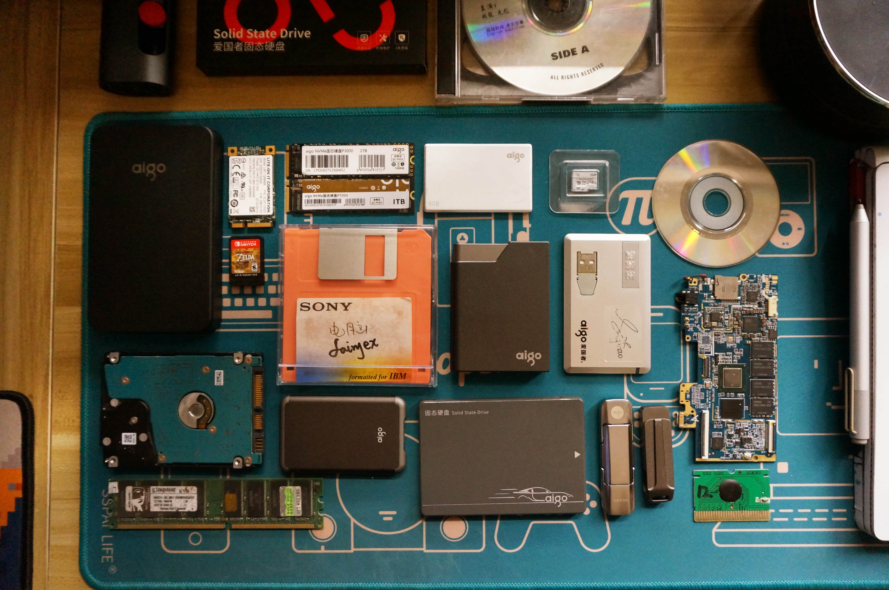

好了，接下来我们即将开始正文内容，第一章我先带你来了解一下储存设备的基本历史进行热身，看看那些属于不同时代回忆的储存设备都是怎么工作的，又有哪些设备能勾起你的情怀追忆。

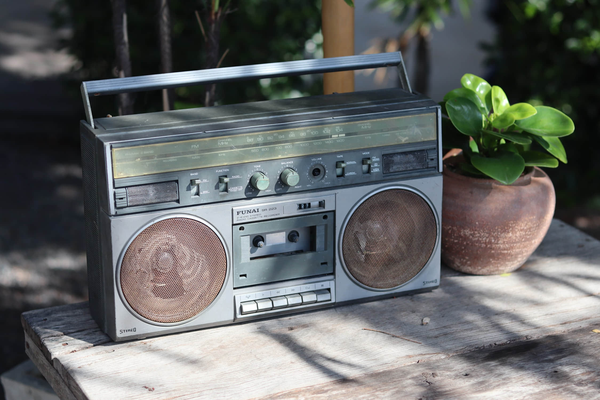

从远古时期开始：挑选储存介质的原则
-----------------

还记得我们开头说的岩壁上的手掌印吗？人类从远古到现在，除了数字设备以外常用的储存数据介质（石头、绳子、金属、动物骨头、竹子、蚕丝、纸张等），主要储存方式基本都是**刻和印**，这主要是时代技术的限制，不过也能看出即使条件简陋，人们对信息保存的要求都非常类似，即使到现在也差不多，根据实际经验我们可以总结一下通常挑选储存介质的原则：

* **材料坚固容易保存**：身处信息大爆炸时代的我们可能不会想到，在储存设备和储存方式稀少的年代，一般人只有最重要的信息才会使用介质保存下去，所以通常人们都会选择身边最结实的东西，这也导致了直到纸张和墨水出现前，很长一段时间内储存介质的修改是比较困难的。

  

* **储存信息鲁棒性强**：鲁棒性其实就是健壮性，也就是储存介质将信息储存下来之后，能否在一定条件的干扰下保持信息的完整。以前的存储介质一般都不强调要反复修改，储存信息时就宏观改变了介质的性状，加上之前的储存介质一般都比较坚固，这样其实鲁棒性相对现在的设备来讲非常好，比如石头上的刻痕可以历经风霜千万年，即使是看起来脆弱的纸张，也能保持千年不腐。

  

后来随着时代的发展，信息的类型还有形式越来越多，所以对存储设备介质的要求也越来越多：

* **数据容量/材料性价比高**：这点自不必说，随着数字信息的使用越来越广泛，只有容量/材料性价比足够高的储存介质，才能被更多人去使用，从而促进对应存储介质的研究发展，形成良性循环。近几年随着科学技术的发展，储存介质的性价比越来越高，从我们以前讨论的每 KB （使用）成本，每 MB 成本，到现在已经可以讨论每 GB 甚至每 TB 成本，都要归功于科学技术的飞速发展。
* **可以反复修改数据/修改数据的成本低**：这也是现在储存介质的基本要求，毕竟信息爆炸的时代已经不像从前，重要信息一次写入介质，其他人只能通过「只读」的方式「访问」信息。比如我们整个虚拟互联网世界，都是靠这些实体的储存设备来维持数据，互联网时代每个人每天都在产生修改删除大量的信息，一个修改数据成本低的储存介质，带来的好处是显而易见的。
* **维持数据完整性的成本低**：反复擦写难度越低的储存介质，一般维持数据完整性的难度都会变高，比如我们常见的声音模糊不清的磁带、关机就会丢数据的内存、年代久远的软盘没有数据等等，所以现在很多储存介质都是在反复擦写难度和保存数据完整性难度之间取一个平衡。

* **易读取/高随机读取性能**：这也是数字时代对储存介质提出的新要求，毕竟之前人类对超出自己能力的信息读取性能要求不大，同时给书本加上目录这种方法也已经能够满足人类自己的随机读取要求，而计算机的出现在某种程度上碾压了人类的大脑，而处理器的速度越来越快，我们同时也需要不断寻找能够配得上处理器速度的储存介质。

  

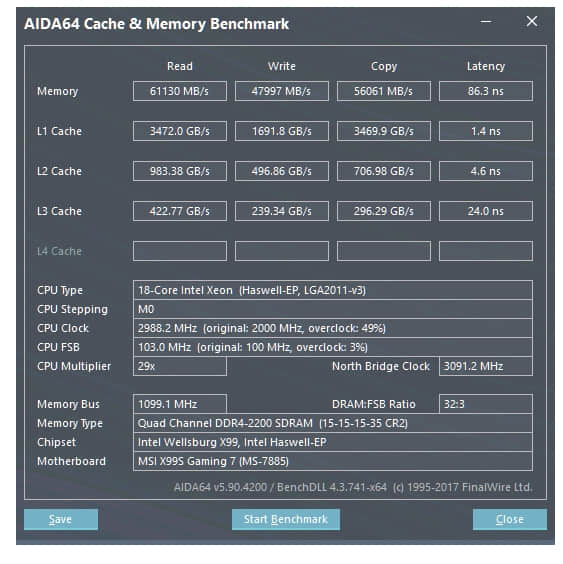

其实储存介质的挑选原则用一句话来总结就是：**便宜耐操可持续**。由于时代科学技术的限制，以前的存储设备一般都只能满足小部分原则，而现在的储存设备，很多都已经能够满足上面提到的大部分原则。而除了储存介质，数据储存的方式也在不断的变化，从以前主要是实物上刻和印，到现在声、光、电、磁等多种方式应有尽有，未来甚至还能真正实现用生物的方式将信息真正「刻进 DNA 里」。

改变时代：打孔纸带出现
-----------

你或许见过网上卖的那种小玩具：一个可以换歌的八音盒，只需要插入不同的打孔纸带，就能演奏出不同的歌曲。就是这些不起眼的甚至有一些简陋的打孔纸带，却是人类迈入信息时代的一个里程碑。

早在 17 世纪，第一次工业革命之前几十年的 1725 年，由于农业革命促进生产力的发展和市场的解放，人力的方式已经不能满足市场以及多种方面的需求，人们（主要是那个时候的资本家们）迫切需要让机器自己动起来。有需求自然就有人解决需求，1725 年一个纺织工人 Basile Bouchon 就天才般想到了可以把工作流程数据用打孔纸带记录，然后将纺织机的提针与一个读取结构连接，打孔纸带通过读取结构时，用纸带上有没有小孔来控制提针的提起和落下，从而实现半自动织布，这也是我们现在看到的织布机结构的最初原型。

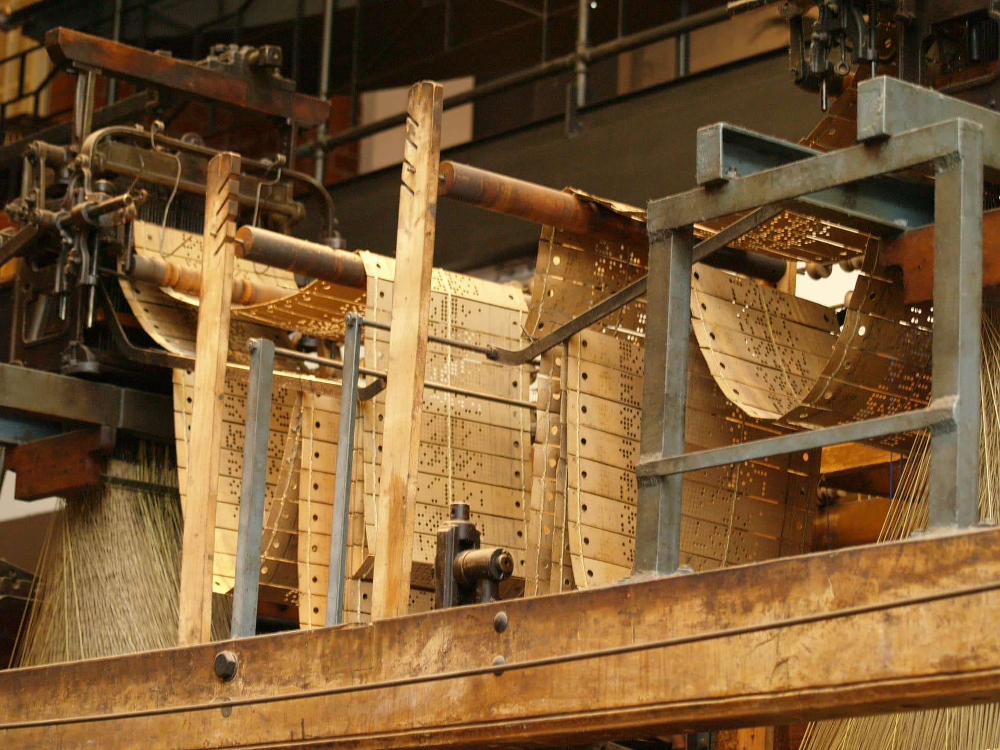

现在看起来很容易懂，当时却是非常精妙，打孔纸带出现的意义非常巨大，虽然仍然是刻印类的储存方式，它不仅是人类第一次尝试将储存读取设备应用到工业化中，这种类状态机的思路也为后来设计信息储存设备的大佬们提供了思路，比如后面出现的打孔卡片甚至磁鼓储存器等，直到后面机械硬盘出现前还广泛用于各个行业。

**相关文献**：  
\[1\]. 那个年代还没有现代专利系统，要了解更多相关知识的小伙伴可以看看这篇 [ECMA 打孔带数据交换标准](https://www.polyomino.org.uk/computer/ECMA-10/)

硬盘的雏形：磁鼓储存器
-----------

接下来我们看看储存设备历史上另一个重要的发明。时间跳到 1932 年，Gustav Tauschek 在奥地利发明出了现代硬盘的前身：磁鼓储存器，利用我们初中就学过的磁生电与电生磁现象巧妙地实现了对数据的储存读取。

先来看一下它的结构：

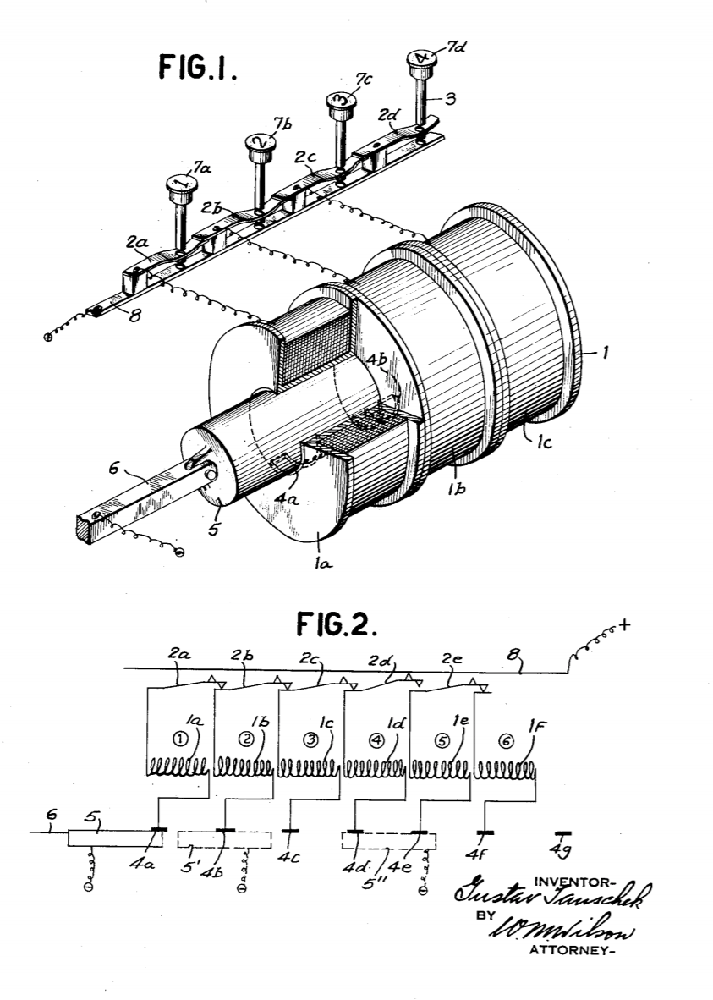

如果之前已经了解过机械硬盘原理的小伙伴，就会发现磁鼓储存器的原理和机械硬盘已经非常相像了。中间那一条圆柱形就是储存数据的地方，周围那一圈圈的就是很多个磁头，圆柱形的外表有一层铁磁材料，圆柱体就是磁鼓筒（相当于机械硬盘上的盘片）会不断旋转。

想要读取或者写入某个数据的时候，只需要等待磁鼓筒对应区域转到对应磁头底下，**磁头通过磁生电感应底下区域的磁性，或者通过不同电压改变底下区域的磁性来实现读取或写入信息。**

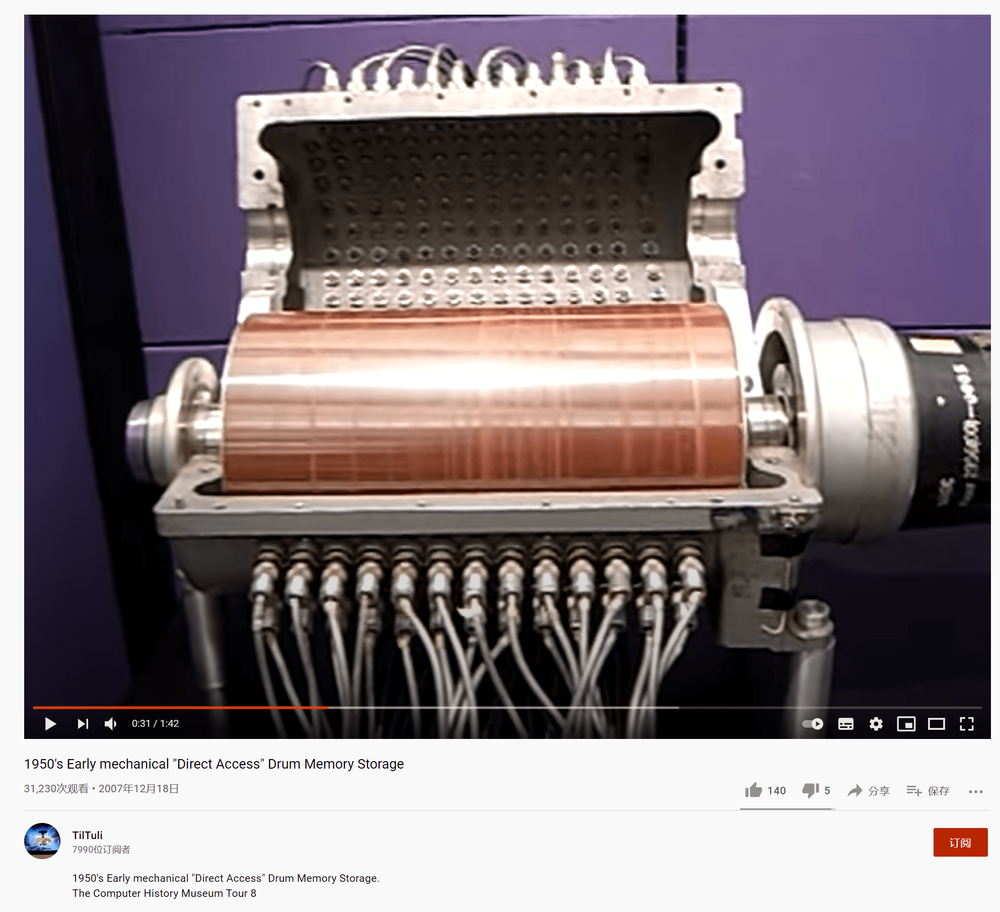

看看实物的照片就更加容易理解了。相比起之前刻和印的方式，磁鼓储存器创新性的采用了磁性的方式储存信息，比起之前的存储设备，**由于磁头的顶端可以做到只有针尖般大小，磁化的区域非常小**，所以整个磁鼓筒可以塞下密度非常高的数据。

高密度的存储磁鼓储存器的容量来到了惊人的 **62.5KB**，而且由于中间磁鼓筒可以转得很快，读取速度也非常可以（型号 USSC90，磁鼓筒每秒能转 300 圈，最高能够达到 **60KB/s** 的读写速度，相当于一秒就能够把自己全部的容量读一遍）。对比起之前出现的储存设备，这个简直可以说是质的飞跃，能够满足科技进一步发展的需求。也是因为如此，之后大部分储存设备的原理都向光、电、磁能够精确改变微小区域的方式发展。

其实，作为一项可以说是跨时代的发明，磁鼓储存器的出现其实是比较晚的，甚至晚于我们接下来介绍的磁带。这中间还有出现过水银延迟线、等其它储存设备。虽然速度很慢，容量很小，但是为人类科技发展的「飞轮效应」跨过了最初的困难。

**相关文献**：  
\[1\]. 对这项改变世界的发明感兴趣的小伙伴可以阅读 Gustav Tauschek 本人 1932 年的[磁鼓储存器专利](https://history-computer.com/Library/US1880523.pdf)。

\[2\]. 一个很有代表的磁鼓储存器型号：USSC90，这是[它的参数和原理介绍](http://www.ussc90.nl/drum.htm)。

\[3\]. 动图截取自 Youtube@TilTuli 的视频，大家可以看看完整版，点击[「1950's Early mechanical "Direct Access" Drum Memory Storage」](https://www.youtube.com/watch?v=eIpoA7Ir9p8&t=31s)观看

时代的记忆：磁带与黑胶唱片
-------------

前面所介绍的储存设备，可能我们都不是非常的熟悉，甚至于我们家里的长辈也都不太熟悉。但是接下来介绍的这两个设备，那一定是很多人青春的回忆了。它们都曾经是全世界音乐最流行的载体，但最后一个变为音乐爱好者的珍宝，一个却至今仍然是商业领域热门的储存设备。

### 黑胶唱片

作为一个 90 后，相信同龄人和我一样，通常只能在影视剧里面看到这些顶着大喇叭的留声机和黑胶唱片机。最近怀旧风潮兴起，可能大家也会在视频网站看到一些 UP 主分享一些新式的黑胶唱片机。

黑胶唱片作为最主要的储存介质，统治了整个 20 世纪的音乐界。留声机作为一种简单的机械设备，最初它不用插电（转盘转动的动力来自于上弦），通过震动直接将声音传导到喇叭放大发声，唱片本身也只是一个简单的塑料片，简直就是便宜耐操的典范。

黑胶唱片的原理也是一个学习模拟信号基础的经典例子：

* **保存声音**：录制机器使用各种方法（振膜传递振动等）驱动一个录音头（就相当于一个小刻刀），录音头在平滑的旋转乙烯基盘片上根据声波振动不同左右震动，刻出一道道深浅不一的同心圆凹槽，直接代表连续的声音变化，凹槽左右边的不同波浪就代表了左右声道的声音变化。

  

* **读取声音信息**：唱头上面的针用一定的压力压在唱片的特定位置上，同心圆凹槽左右两边不同的起伏，会让整个唱臂左右摇摆不同的幅度，唱臂里面的电磁铁就会产生不同的电流，放大器放大声音信号并驱动喇叭发出声音。

  

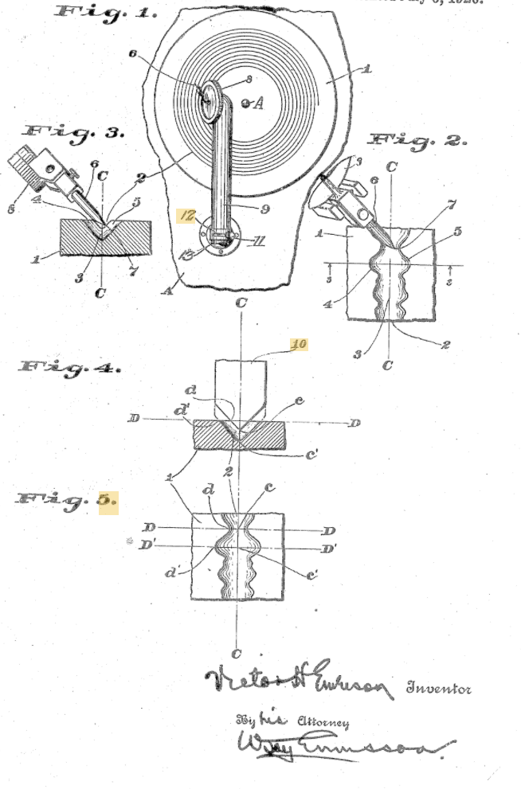

显微镜可以看到唱针是怎么通过凹槽读取声音的

就是这么简单直接的一个模拟信息保存传输方式，让音乐不再是贵族们的私人专享，普罗大众从此也能够享受到音乐的愉悦，促进了流行音乐的发展，无数经典的歌曲通过黑胶唱片永久保存下来，让 21 世纪的我们也能够听到 20 世纪的天籁之音。

经过多年发展，黑胶唱片的材质，尺寸和录音读取方式越来越多样，音频质量也在不断提高，甚至索尼与铁三角等厂家还生产并不断更新数字黑胶播放器。直到现在，很多歌手也会为自己的专辑出一张黑胶唱片用作纪念，同时黑胶唱片仍然被部分音乐爱好者追捧（最近美国销量甚至超越 CD，2021.06，MRC Data），折腾不同的设备和唱针就是为了追求那充满时代特色的温暖声音和爆豆声。

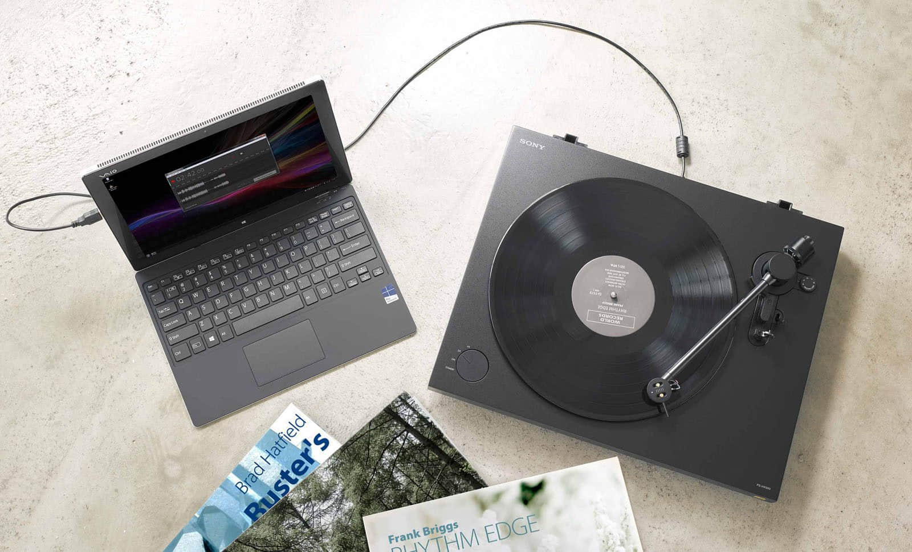

**相关文献**：  
\[1\]. 对黑胶感兴趣的小伙伴一定要搜搜看德意志留声机公司（DG），世界上最大的古典音乐唱片品牌，目前是在环球音乐旗下。它的创始人 Emile Berliner 就是第一个发明声音记录方法和最初唱片的巨佬，可以上[官网](https://www.deutschegrammophon.com/en)买一张正版黑胶纪念一下。

\[2\]. Emile Berliner 发明的留声机结构，可以查看他自己在 1900 年发表的[留声机专利](https://patents.google.com/patent/US692502A/en)。

\[3\]. 最早的留声机结构可以看一下 Tomas A Edison（没错，就是那个爱迪生）[1878 年的留声机专利](https://patents.google.com/patent/US200521A/en)。

\[4\]. 文章黑胶唱片机原理图部分引用自 V.H.Emerson 1916 年的[专利](https://patents.google.com/patent/US1345756A/en)。

\[5\]. 动图截取自 Youtube@Applied Science 的视频，大家可以看看完整版[《Electron microscope slow-motion video of vinyl LP》](https://www.youtube.com/watch?v=GuCdsyCWmt8)。

### 磁带

相比起黑胶唱片机，磁带与中国人结下的不解之缘更加深，我们爸妈那会儿年轻的时候，买到最新的磁带，然后在房间里偷偷享受属于自己的小世界，或者和朋友一起讨论交换最新的歌曲磁带，怕是普通人最潮最常见的娱乐方式了。有钱人甚至能弄一台最新的索尼 Walkman，成为街上回头率百分百的 GGMM。无论是打孔带还是自己灌录，磁带以及它所承载的音乐成为很多人青春回忆里的重要背景。

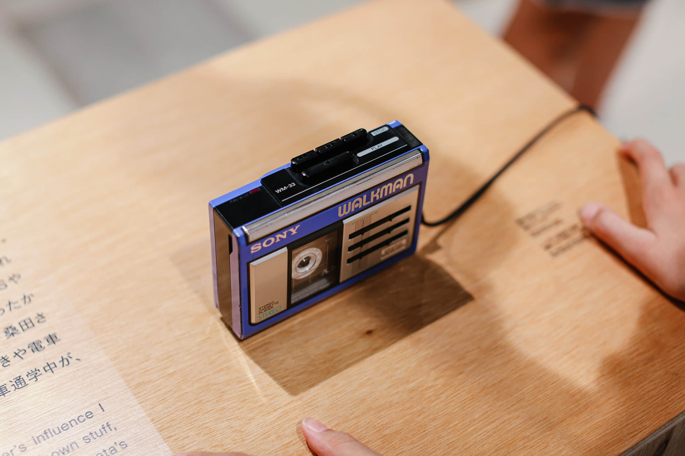

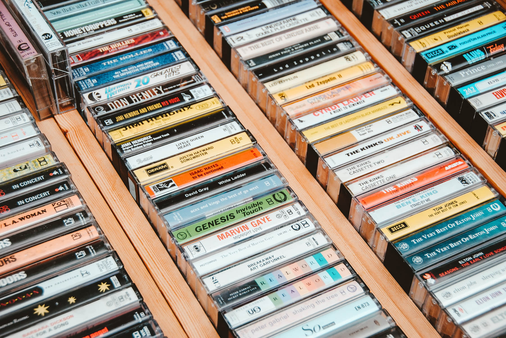

即使是我们这一代人，小时候其实都有被学英语磁带支配的酸爽。不过就跟学习机最后大部分沦为游戏机一样，磁带机最后大概率会变成播放器。

那个时候比较经典的磁带怕就是 TDK C60（C+数字 指两面合起来能够录制这么多分钟，C60 也就是每面 30 分钟） 磁带了，不仅能录制最高一个小时（根据机器转速不同实际 35-45 分钟）的音乐，还把「高保真」这一个关键词带进了大众视野，甚至能够录制多声道的立体声。

其实磁带的声音和黑胶有点像，因为它们的原理其实都是录制模拟信号，所以前期或者便宜的磁带出来的声音会有点失真和沙沙声。而且大家估计想不到除了我们常用的听歌用途外，**磁带还是非常方便和广泛使用的通用储存设备，即使到了现在磁带依然在商业领域被广泛使用。**

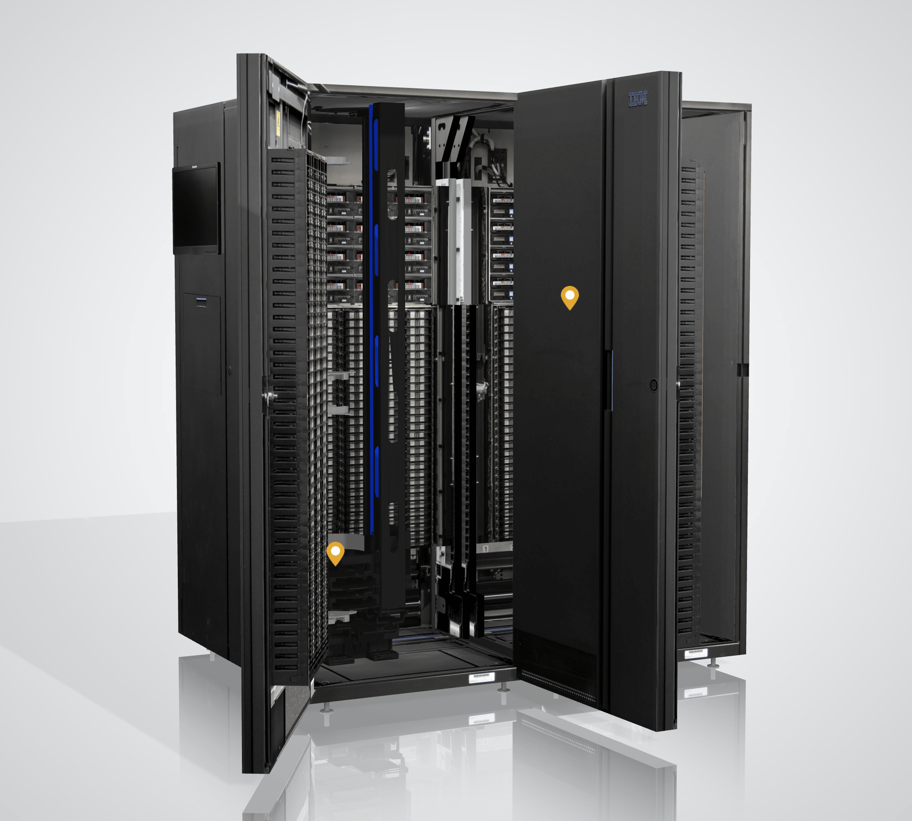

### 磁带的原理

磁带其实就是一条上面涂上可以被磁化的氧化物材料（通常是氧化铁）的塑料带，平时我们看到它卷起来只是为了减少储存体积的一种方式。再结合我们初中学到的磁生电与电生磁现象就能很清楚地理解磁带的原理：

**储存数据**：磁带上方固定一个磁头，磁头与磁带接触，用滚轮等方式将磁带以固定速度从磁头下方滚过。磁头接收发过来的不同电压数据脉冲（比如麦克风记录到的声音变化，数字磁带机直接发送 0 和 1 ），利用电生磁现象就会产生方向不一样的磁场，那么底下通过接触这部分磁带上的材料被永久磁化的磁场方向也不同，就记录上了数据。

**读取数据**：读取的原理也和储存类似，不过利用的是磁生电现象，不同的磁场通过磁头会产生不同的电流，磁头就可以将这些电流数据交给其它的部分（比如扬声器发声），实现数据的读取。

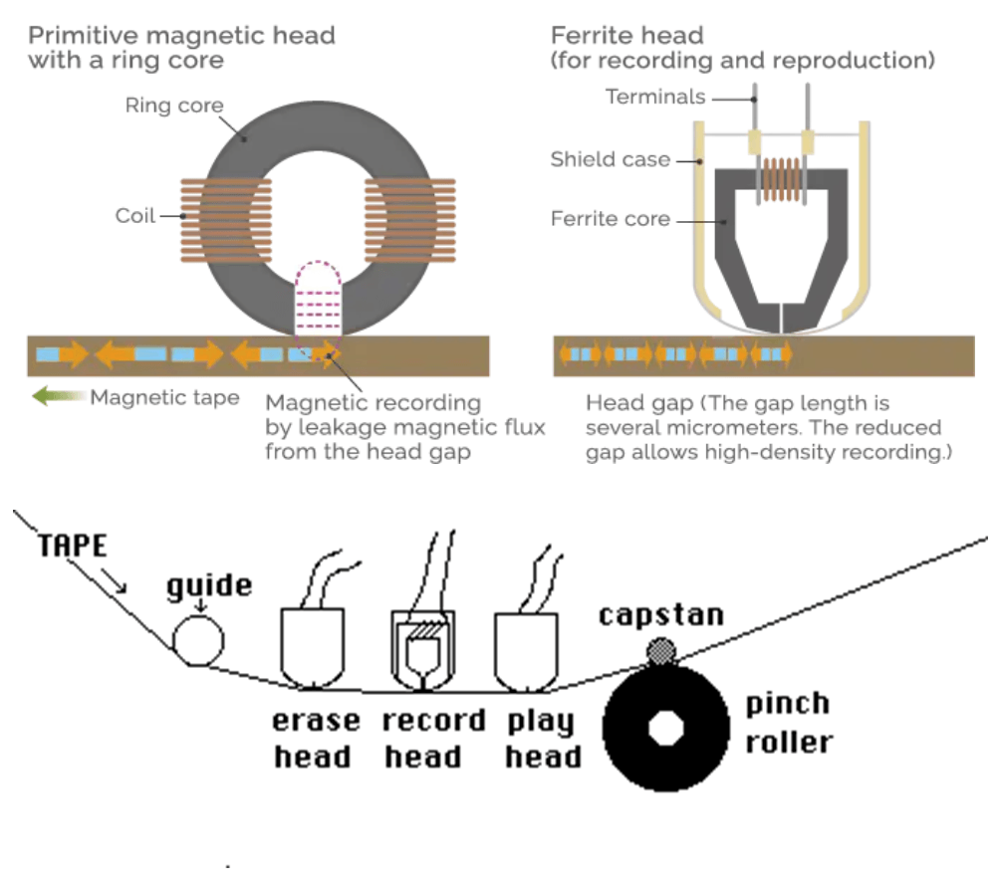

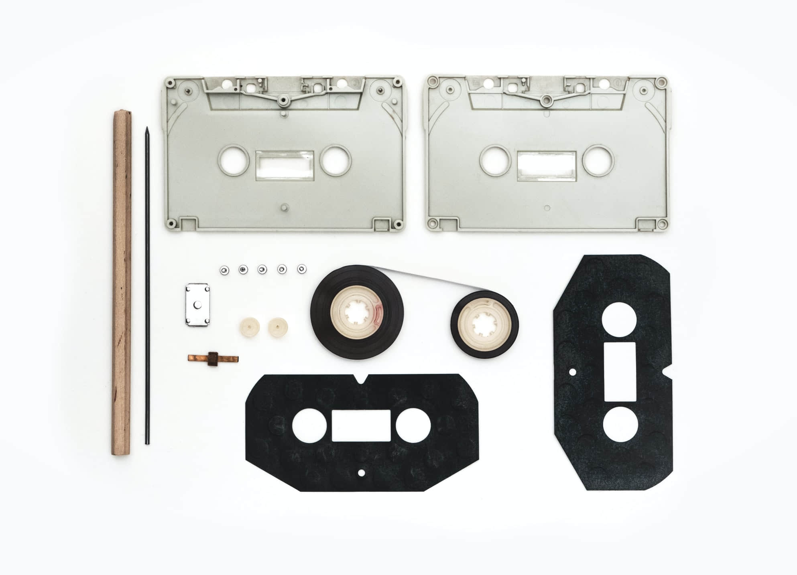

磁头一般很小，所以数据密度可以很大，同时如果在一个宽度的磁带上，做两个 1/2 的宽度的磁头甚至更多个磁头，就可以实现多轨记录和读取（比如磁带录音带的立体声）。

看到这里大家是不是觉得有点眼熟，没错它和磁鼓储存器的实现思路有点相像，事实上所有以「电磁」方式来储存数据的设备都差不多是这种思路。

### 录像带与其它磁带

我们之前比较少见到的录像带，其实也是一种磁带。不过由于视频数据量和带宽都比较高，录像带一般会做得比较大比较宽，宽度长度大约和胶片差不多，用多个轨道来分别记录红、绿、蓝三个像素信息、同步信息和音频的模拟信号。读取时候旋转的也比较快，而且磁头是螺旋形扫描的。

除了储存音乐，标准的磁带还曾经被储存各种各样奇怪的东西，比如程序，文本和游戏，只需要一台磁带机就能在电脑上读出数据。在曾经软驱比电脑还贵的那个年代（甚至有厂家直接把电脑塞进软驱），用磁带来储存数据是一个便宜好用的方法。

了解了原理后，我们也不难知道磁带的优点和它为什么会这么普遍使用了：首先磁带用一种很巧妙的方法让保存材料可以变得很轻薄，加上软性材料可以用特殊的方法收纳（比如卷起来），所以磁带可以**在轻、薄、小的同时实现大容量的储存**还能节省材料。

写入读取结构简单也可以让磁带与磁带机也变得便宜，既可以录入模拟信息，也可以录入数字信息，**同一台机器就可以实现录制还有播放**，通过使用高转速和更加坚固的材料，还可以实现飞快的顺序读取写入速度。另外写入数据是永久改变材料上的磁性，磁带的数据稳定性很不错，只要保存得当，理论上应该能够保存几十上百年。

所以磁带迅速风靡全球，在很多发展中国家甚至是主要的储存设备（比如很多国家的演讲都是通过磁带翻录传递到民众中）。另一方面也让最早的盗版盗录产业得以发展。

当然磁带的原理导致它也是有缺陷的，其中最重要的就是**基本只能顺序读取，随机读取能力差到忽略不计**。相信用过磁带的小伙伴都有过想听磁带里面的某一首歌，然后在那边干等它转啊转的经验，特别是想听倒数第二首歌的时候那感觉真是特别煎熬，更别说随机播放了，基本不存在的。

除了这个比较大的缺陷磁带还有每台设备转速不一样导致声音不一样，转太快崩太紧容易断，磁带磁带机上（俗称吃磁带），用不是空的磁带录制由于磁性改变不彻底会出现声音重复等。

那么为什么现在磁带仍然是企业冷备份的优先选择呢？

主要是**LTO 磁带在实现大容量的同时是真的便宜（0.04 元/GB，30TB 只要 2000 不到）**，体积还蛮小的，而且只需要简单地增加磁带数量就能够增加容量，大规模数据物理转移的时候磁带的稳定性也比硬盘高很多。而且磁带机通过特殊的驱动也能够避免勒索软件或者病毒修改数据。用来储存一些基本不用的冷数据（比如你 10 年前的银行账单或者各种完成的项目存档）简直完美。

所以磁带今天仍然是冷备份的优先选择，像是我们常用的支付宝微信支付等金融数据，都是会稳稳地用磁带保存一份冷备份在地下的，就不用担心服务器全部爆炸，自己的余额都不见了。

**相关文献**：

\[1\]. 常见磁带和磁带机的结构可以参考这份[磁带机的专利](https://patents.google.com/patent/US4365277A/en)。

\[2\]. 想折腾磁带冷备份的小伙伴可以看一下这份[《中华人民共和国档案行业标准：档案数据存储用 LTO 磁带应用规范》](https://www.saac.gov.cn/daj/hybz/201912/1b944990fa1b4d829ac4ca4315ac65d3/files/3eb7a3f6fa434bd9b88483735cee24a1.pdf)。

\[3\]. 想看看各种商用储存机长什么样的小伙伴,可以去 IBM 提供的各种 [3D 产品演示](https://www.ibm.com/demos/it-infrastructure/product.html)。

### 磁带和黑胶唱片的沙沙声爆豆声是怎么来的

如果你听过磁带和黑胶唱片的声音，那么你一定会对沙沙作响的背景声音和爆豆声印象深刻。甚至最近 lo-FI 音乐开始复苏，就是制作音乐的时候主动往音频文件里面加入这些背景声音和爆豆声的采样（所以说时尚是一个圈），那么这些声音都是怎么来的呢？

对于黑胶唱片来讲，**这些声音主要是来自于唱片的缺陷和表面的灰尘**。以前唱片在压制条件不会很好（没有真空，唱片不干净之类的），导致刻刀没法把声音正确刻在那个部分，播放的时候就会导致失真。同时我们用的唱片机一般唱片直接暴露在空气中，播放时掉落的灰尘会阻止唱针读取到轨道上的音乐信息，从而让音乐失真一瞬间，这就是爆豆声。

所以当我们小心清理好唱片并用防尘罩盖好播放，会发现爆豆声直接少了大半，甚至**如果你直接用上真空播放器，会发现黑胶唱片的声音也能如数字 CD 般顺滑**。

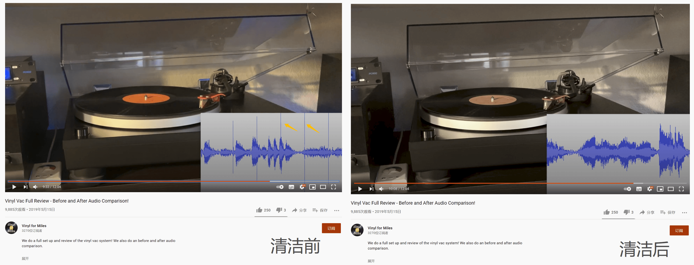

而磁带背景的沙沙声就有点高大上了（排除电路噪声），是**各种来源「不规矩」的磁粒子产生的随机电信号**。它们可以是空气中的粒子，可以是磁头精度不够漏掉的粒子，也可以是磁带生产中的磁离子颗粒太粗了……

提高生产精度和磁粒子的密集程度，或者增加磁带的宽度（增加带宽提高信噪比）都可以减少这种背景噪声提高声音纯净度，那个时候各家磁带厂家宣传的「高保真」就是这个意思。

数字信息（信号）和模拟信息（信号）
-----------------

**接下来出现的就是数字时代的设备了，在数字信息出现之前，磁带和黑胶唱片是典型的储存模拟信息的介质**。那什么是模拟和数字信息（包括信号，下同），为什么我们现在都是用数字信息，它有什么优势？

### 模拟信息

我们生活在一个现实世界，**很多信息是无限连续的**，比如我们听到的声音、我们看到的风景、电压电流的变化……如果你把它们细分开来，你会发现它们无穷无尽。所以早期人们如果想通过设备处理和储存这些信息，就必须用另一种可以无限连续的介质去代表它，甚至汽车上的转速表、游戏机上的手柄等都是显示传递模拟信息的例子，所以在存储设备上模拟信息就是**用可储存的机械量的连续改变，模拟不可储存信息的连续变化**。

模拟信息用电压表示应该是平滑的曲线，没有任何离散值变化

比如黑胶唱片的轨道和磁带上的磁颗粒信息都是连续的，**我们能够在上面取到无限的值**，而且在每一瞬间它都会有一个确定的值。

模拟信息的特性让它的优点和缺点都非常明显。

优点有：

* **信息密度和精细度非常高**，毕竟是无限的值。

* **非常适合用来记录表示现实世界的变化**，比如最常用到的电压电流、声音、温度、速度等。

* **读取和保存都非常容易**，像是磁带黑胶唱片它们的原理其实都非常直观，直接采用宏观的方式就可以写入读取。

* **对传输要求比较低**，使用很少的带宽就可以传输相对丰富的信息，像是我们之前的有线电视很多年来都是模拟信号。

  

但它的缺点催生出了人们现在主要使用的数字信号：

* **很容易受到噪声影响**，**噪声指的是与我们想要处理的信息无关的信息**，由于精度、干扰等问题，在模拟信息中噪音基本不可避免，信噪比（xx dB）这个单位就是用来形容信息/噪声的比例，大于 1dB 代表信息比噪声多，所以这个数字越大越好。

* **容易产生损耗和干扰**，现实世界不存在绝对稳定的介质，无论是有线还是无线传输和储存，随着距离和时间的增加，模拟信息里面的噪声一定是会越来越多的，这就是我们常说的损耗和干扰。如果因为功率密度等原因保存传输的信息读取时需要放大，那信息的完整性就更差了，因为**放大信息的同时也会放大噪声**。

* **与数字设备的工作原理相斥**，这个会在下面介绍数字信号时讲到。

  

我们上面说到的沙沙声和爆豆声，其实就是各种意义上的噪声，模拟信号里面的电压电流也会产生噪声，这破坏了信息的完整性与准确性。**最重点的是这些噪声的来源太随机了**，电路里面一个不稳定的电压，空气中的灰尘，不同的材料甚至今天天气的温湿度、不同的宇宙辐射强度，都会让不同设备处理同一段模拟信息时产生不同的结果，比如你小时候在家看西游记，电视上的雪花和邻居是不一样的，所以严格来讲，你和邻居看的是不一样的西游记。

噪声越多保存传输的数据越难读取恢复，如果低信噪比的数据来进行科学计算，结果甚至会是反的。随着时代发展人们对于传输速度和准确性的要求越来越高，模拟信号在大部分领域都是无法让人接受的。

### 数字信息

模拟信号的缺点和更高效新设备的出现，促进了数字信号的诞生。我们都知道计算机里面处理和储存的都是 0 和 1 的有限数据，这是由处理器晶体管组成的逻辑门物理特性决定的，这代表它们基本没办法处理储存无限连续数据。举个简单的例子，各家编程语言里面都有提供圆周率 `兀` 作为常数变量，而如果你查看底层代码就会发现，它们都是直接预设一个几十位精度的 `兀` 值，不然用程序算一个圆的面积就能让电脑爆炸。

加上现代计算机领域（处理、储存、加密、传输……）基本都是基于离散数学的，对无限连续的数据非常不友好。**这个时候我们就需要按不同精度对现实世界连续的数据进行取样了**，这基本就是数字信息的原理。

如果说上面模拟信息用电压表示是连续曲线，那么数字信息用电压表示就是一段一段的（虽然每段可能非常短，看起来是连续的）：

简单的理解它们的区别：**如果模拟信息是一条线，那么数字信息就是用很多密集的点尽量完整模拟出这条线。**

举一个我们大家很经常接触的例子，还是音乐。不同于之前设备直接录制声音的连续变化，现代的数字录音机，录制的时候会将声音按照不同的频率采样，比如我们常常听说的 CD 44.1Khz 采样率就是每秒对声音采集 44100 次，记录下每次采集到的信息。

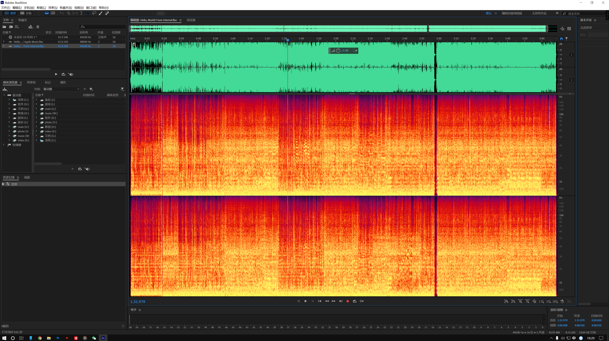

我们听歌的时候，播放器会将这些离散的数据用算法处理成连续的，这样我们就不会听到一卡一卡的歌（其实这就是经常听理科男们说的数模转换了）。采样率还有其他的一些规定采集读取数据的方式合起来就变成了数字信息编码规则，我们经常看到的文件扩展名（.jpg、.mp3、.apk）这些其实就是不同的编码规则，用来规定不同编码规则弄出来的文件怎么放在物理储存设备上，并提供增删查改方法的东西就是我们每天都会用到的文件系统。

数字信息的优势基本弥补了模拟信号的不足：根本优势是**数字信息把现实世界的各种类型信息统一成一个虚拟层（0/1 二进制），实现一种设备处理储存各种类型的信息**。

* **噪声非常少，更加准确**，数字信息保存处理的是经过采样的数据，在信噪比低于一定程度的情况下，可以通过把编码和纠错算法逐个纠错把丢失信息完整还原回来。

* **通用保存**，不像是模拟信号一般都要对应的存储介质，数字信号经过转换，可以很方便地储存在任何介质上（包括磁带、黑胶、胶卷甚至打孔纸带）。

* **复制转换非常简单**，大家都是数字信息，复制转换自然不用说，利用不同的算法还能让数据变成不同类型，比如视频转图片，也能很方便地加密压缩数据。

* **处理更灵活**，数字信息让我们能够更方便的处理它们，比如用 Photoshop 编辑一张图片，实际上就是编辑里面虚拟化的像素信息，在之前需要在胶片上物理修改。

* **方便远距离传输**  
  等等等等……

  

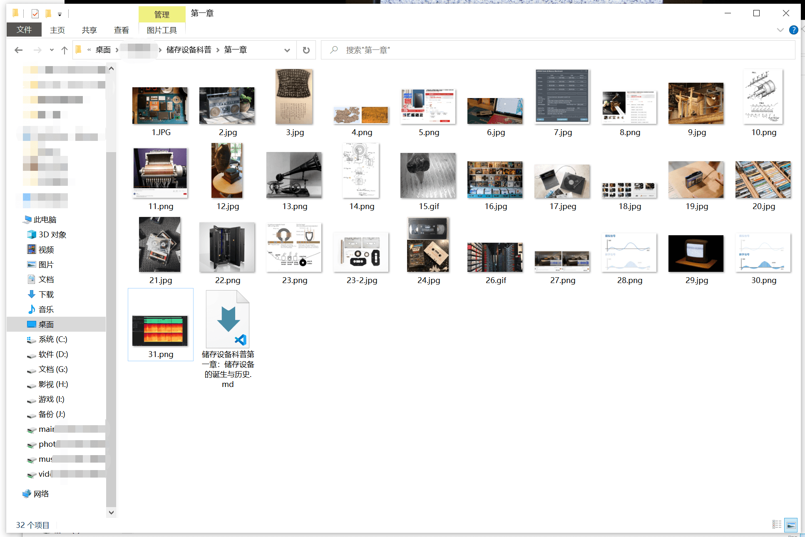

文件系统其实是很复杂的一样东西

但数字信号也有属于自己的缺点：

* 由于需要附加各种复杂的编码信息，数字信号一般对带宽要求更高。

* 对硬件的要求更加复杂，我们能够比较无压力的看懂模拟电路，甚至每个人都能自制一个矿石收音机，但数字电路看起来就跟小学三年级学大学英语那样。

* 在硬件层上还要经过复杂的系统和算法处理。

  

所以现在模拟信号还是在某些领域被广泛使用，根据它们各自优缺点安排最合适的用途。

截然不同的命运：软盘与光盘
-------------

虽然我们现在仍然在广泛使用各种光盘，软盘却已经成为时代的眼泪，但软盘和光盘其实兴起于同一个时代，只不过软盘的命运停步于千禧年，而光盘不断焕发新机直到现在。它们都曾经是最广泛使用的储存设备，但最后的结果却相差甚远，这与它们的原理和特点是离不开关系的。

上面我们了解完了模拟信息和数字信息的变化，由于数据的本质形式发生了变化，人们需要容量更加大同时体积更加小的储存设备，软盘和光盘就是数字信息时代应运而生的载体。

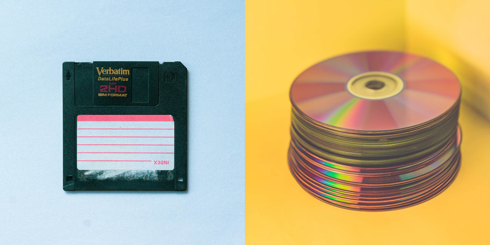

### 光盘

光盘在中国的覆盖可谓是全年龄段的，千禧年之后基本家家户户都会有一台先科的 DVD 机，小孩子的童年是《猫和老鼠》《哆啦 A 梦》等等的正（盗）版 DVD，年轻人把落伍的磁带机换掉，用上了随身 CD 播放器听伍佰周杰伦（千禧年左右 MP3 还是个稀罕玩意儿）。爸妈们常备一套新年歌曲合集和交响乐，全家人还能经常欣赏到充满翻译腔的欧美引进大片，要是家里条件比较好，能有台电脑，那在网络都没有的年代，装软件和驱动都得靠光盘……在信息高速公路直通车前光盘可谓无所不能。

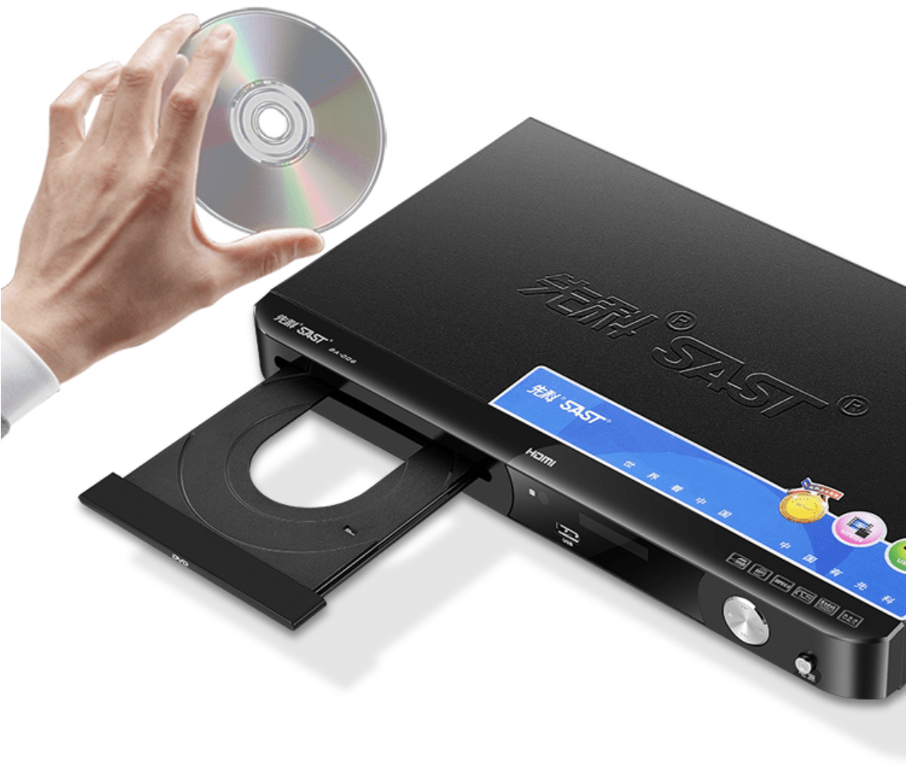

光盘有很多种类型，常见的几大类就是 CD，DVD 还有我们常听见的 BD 也就是蓝光光盘 Blu-ray Disc。

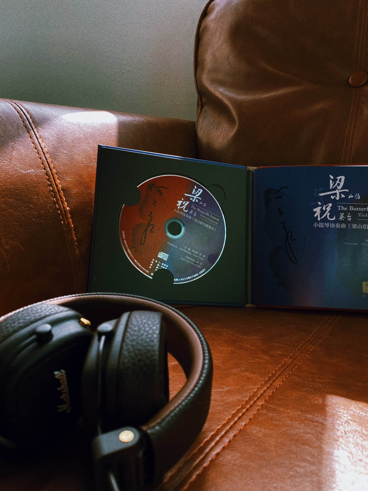

### 光盘的原理

**写入**：通过厂家设定好的轨道，按固定的速度把表面材料烧掉，烧出不同间隔长度不一的凹点。这些凹点就代表了不同的信息。

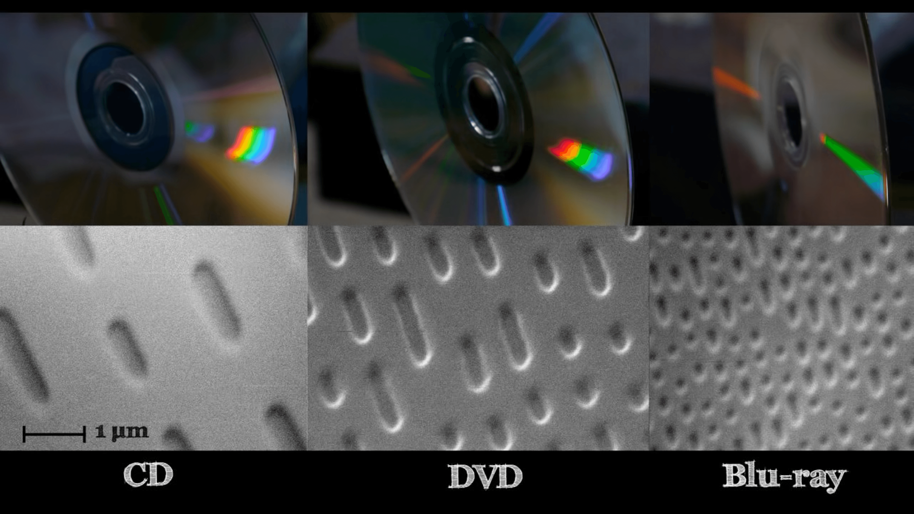

**读取**：传统的是采用近红外线纳米二极管，把红外线射到轨道上，有凹点的地方反射率会不同，从而读取数据。为了提高识别率，没有凸点的地方反射率要尽量得高，所以光盘会添加一个镜面反射层，这也是光盘看起来亮亮的原因，同时由于上面有很多个小凹槽，光线会发生折射与衍射，光盘上便有了那种很独特很漂亮的彩虹纹。

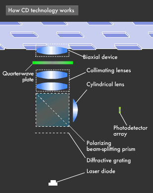

这种方式有点像是盲文，通过一个个不同长度的点表示文字，然后盲人用手去触摸感受凹凸从而读出文字。

市面上还有一种可擦写光盘，可以反复擦写数据，是 20 年代大众经常使用的「移动硬盘」，价格相对来讲很贵。这种光盘的原理是将数据记录的盘片层换成可相变合金，这种金属的特性是在不同功率激光的照射下能够在晶体与非晶体结构之间转换。

可以用高功率激光，像普通刻录光盘那样照射可擦写光盘，上面金属变成的晶体结构具有良好的反射性，就相当于凹点。而用中等功率激光照射后，就可以把它还原回来。这种光盘由于材料的问题，反射率一般不够一次性光盘高，所以那个时候好的可刻录光盘，价格一般很贵，而且刻录也比较容易翻车（多次刻录后反射性不够，导致无法识别）。

### 蓝光光盘的由来

那我们现在常听到的蓝光光盘，说的就是把镜红外线纳米二极管换成波长更短的蓝光，也就是说在盘片上的凹点能烧得更加密集，提升了数据密度，一个盘自然也就能塞下更多的内容。能够比普通 DVD ROM 容量翻倍。

光盘的速度和容量一直随着技术发展在提升，从原本 700MB/150KB/s 的容量速度飙升到现在多层蓝光盘（通过不同折射率的透过率来区分不同层盘片）的最高 128G/72MB/s，在商用领域更是有索尼 2015 年推出的 Archival Disc，单盘容量来到了 300GB ，最高速度去到 250MB/s 读 125MB/s 写。

但随着最近互联网流媒体的发展，**人们对光盘的需求越来越低，光盘的容量速度提升也随之放缓**。比如 2013 年的研究通过新型技术可以将光盘的容量提升到 TB 级，但直到现在仍没有落地产品。

**相关文献**：  
\[1\]. CD（Compact Disc）最初的样子可以看一下这篇[激光唱片发明者 James T Russell 的专利](https://patents.google.com/patent/US3501586A/en)。

\[2\]. 关于光盘的刻录使用维护，可以参考我们国家的[《电子档案储存用可录类蓝光光盘（BD-R）技术要求和应用规范》](https://www.saac.gov.cn/daj/hybz/201903/46c3b37764814570a83b43891fb639e3/files/6be1b6b5ff744dfa9a2d5e0345cadd03.pdf)。

\[3\]. 关于光盘如何提升用量到 TB 级的技术，可以查看这篇[发表在 Nature 的论文](https://www.nature.com/articles/ncomms3061.pdf)。

\[4\]. 原理动图来自于佳能科学实验室，完整内容可以查看[原文](https://global.canon/en/technology/s_labo/light/003/06.html)。

\[5\]. 对大容量光盘感兴趣的朋友可以看看[索尼的 Archival Disc 第二代白皮书](https://pro.sony/s3/cms-static-content/file/49/1237494482649.pdf)。

\[6\]. 微观图片截取自 Applied Science 的视频，大家可以看看完整版，点击[「Tools and Tips #2 from Applied Science」](https://www.youtube.com/watch?v=xbo8xi1zgVo)观看。

### 软盘

相比起光盘能给大家的生活带来多姿多彩的应用，大部分对软盘的印象应该是比较正式的，感觉就是用来存软件驱动和工作资料啥的。我猜是因为没有什么公司做家用的软盘读取器，然后那个时候大家电脑用途还是比较正经的，所以软盘就变成了比较专业的一种东西。但大部分人对它的主要印象还有另外一个：特别容易坏。

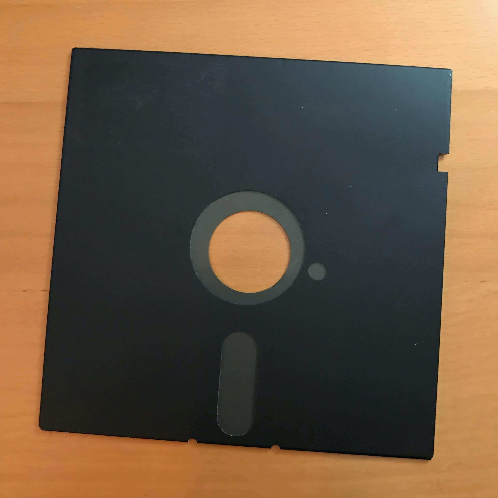

像是前面提到的所有设备一样，软盘也有很多个尺寸和型号，甚至早期各家的软盘虽然长得一样，但是并不能互相读取（比如苹果和其他家的），我们下面提到的基本都是以大家常见的 3.5 寸软盘为主。

### 软盘工作的原理

我们可以把软盘看成一个，**用着磁带的材料但却有着机械硬盘工作原理的东西**。它的身上已经出现了扇区和磁道的概念，甚至可以把原理无缝放到机械硬盘上，虽然它比机械硬盘转得慢，并且装到一个软软的塑料盒子里（所以叫软盘）。

为了解决磁带不能随机读取的缺点，软盘用上了磁带相同的材料却做成了一个圆片，然后被分成了下面这样的同心圆环（磁道）而被切成很多小块的扇区，扇区是由软件定义的，不同品牌都不一样，**扇区是软盘保存读取的基本单位**。

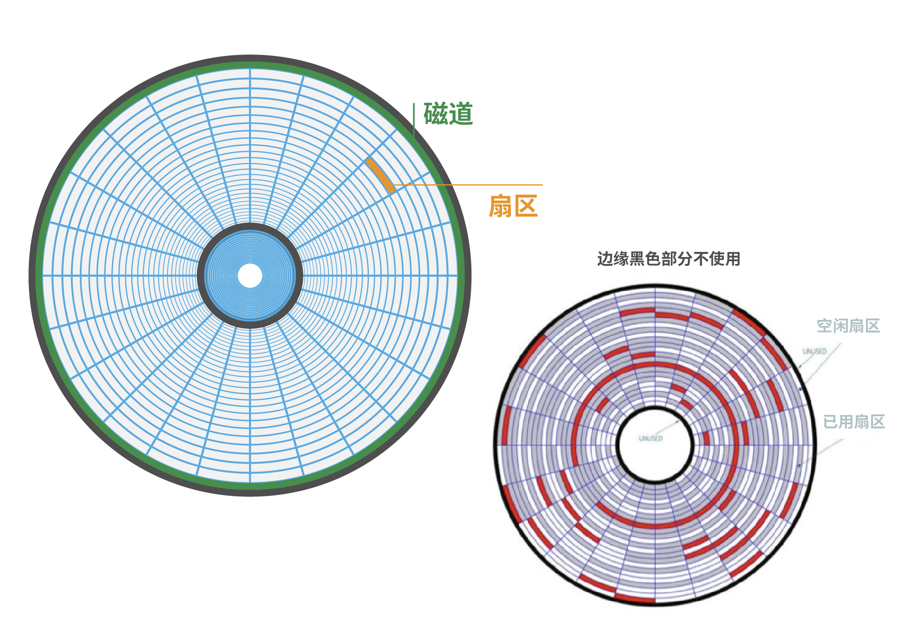

**保存/读取数据**：（某些软盘第一次用之前必须格式化）计算机发出保存或写入数据命令时，软驱（软盘读取器）会让磁盘转起来，同时用电机让读写磁头移动到对应磁道正上方，等盘片转到要写入的扇区，和读写磁头同一块地方的擦除磁头会把这个扇区的数据清除掉（会清除比写入的扇区更大的区域，防止周围的数据干扰空白扇区的磁性），然后写磁头通过不同的电流永久改变底下区域的磁性来写入数据。读取的时候则是读磁头感应底下区域的磁性产生不同的电流，转换成数据返回给计算机，同时会发出指令让磁盘停止旋转。

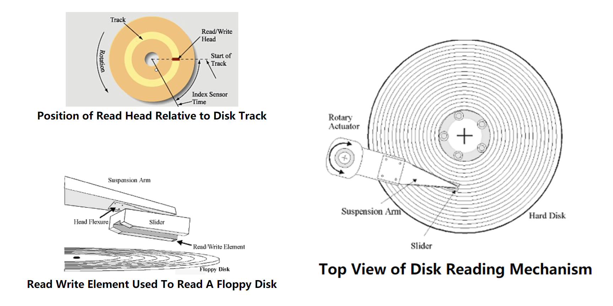

### 软盘为什么容易坏

软盘容易坏几乎是用过软盘的小伙伴达成的共识，这主要是因为**盘片直接暴露在空气中并且和外壳有接触**，而且读取的时候需要磁头直接接触盘片，就跟磁带那样。虽然软盘里面有一块软绒材质的布来减少盘片和外壳的摩擦，同时还具有清理作用，防止摩擦产生的磁颗粒干扰扇区或者粘到磁头上，但盘片依然会被不断磨损，上面的磁性材料全都磨掉就没办法读写数据了。加上软盘的壳子比较软，平时携带时容易导致盘片形变，加剧旋转时的摩擦。

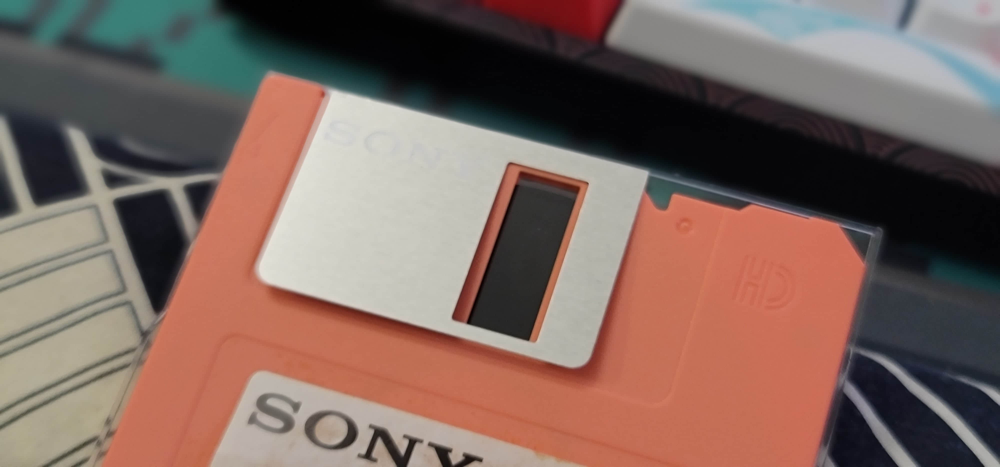

我的手甚至能直接摸到盘片,这也是机械硬盘要做成全封闭不可拆卸，并且盘片悬浮的原因。其实软盘如果仅仅日常数据也没有大家想象中那么脆弱，毕竟磁带和它类似但很耐用，我自己存着的软盘现在大多数还能够读取。一般都是携带过程中损坏，还有就是后期厂家制造质量下降（最早出产的 3.5 寸软盘质量都很好）。

软盘的容量最初是几十到几百 KB，到淘汰前索尼的软盘已经能做到 1~3 MB 了，还有更特殊的几百 MB 的软盘。读写速度方面，软盘一般在十几到几十 KB/s 左右，不过每次都要等盘片转到满速才行。

**相关文献**：

\[1\]. 3.5 寸软盘和软驱的结构可以参考[软盘的专利](https://patents.google.com/patent/US3668658A/en)和[软驱的专利](https://patents.google.com/patent/US5629819A/en)。

软盘和光盘它们俩出现截然不同命运的根本原因，就是在于介质的鲁棒性。光盘使用非接触的方式读取，不会因为使用时间增长而对盘片本身产生磨损，同时密度不高的光盘即时盘片被划损也能通过纠错算法补全数据。也就是说日常大众在使用存储设备的时候，并不会像实验室那样小心翼翼的保存，只有真正持久耐用的设备才会成为大众日常使用的选择。

总结
--

结束了软盘和光盘的介绍，再往下就是我们熟知的设备：机械硬盘、固态硬盘、内存、内存卡、U 盘……的时代，本章的内容已经基本结束了。本章节中，我带大家了解了历史上著名的储存设备，回忆了一下不同年代的情怀（还有历史的眼泪），也让大家了解到人类为了保存自己的信息做出了多大的努力，当然历史上还有很多很多不同类型的储存设备因为篇幅原因没有办法提到，感兴趣的小伙伴可以去网上搜一下储存设备发展的历史时间轴，然后找找相关专利和论文。

热身完毕之后，下一章就开始介绍大家熟悉的设备，第一个当然是现在还在大范围使用的机械硬盘了。下一章我会介绍机械硬盘是怎么来的，它的原理是什么，常见参数代表的意义，以及接下来几章的选购与使用指南。

