恭喜你，看到这里你已经能够全面理解现在主流数字储存设备的结构原理了，除了机械硬盘和固态硬盘外，在数字储存世界还有很多我们日常见到，也比较常用的设备。比如我们电脑中不可或缺的部件 —— 运行内存 RAM 也是一种数字储存设备；而 U 盘和移动硬盘则是大家非常熟悉，使用过无数次的日常随身必备物品，而小巧的内存卡，更是从几十年前的 MP3 到最新的数码相机都必不可少；最后我们更是不能忽略自己天天使用的手机里面 ，存放着系统和我们重要数据，24\*7 不间断为我们提供高速存取的储存芯片。

在本篇文章中，我就给大家来说说除了机械硬盘和固态硬盘之外，一些其他在数字储存世界中占据重要地位的设备，包括**运行内存、U 盘、内存卡、移动硬盘、手机储存芯片**等。在前几章积累的知识上，带大家快速了解它们的结构和原理，并说说它们不同的一些规格参数都代表着什么。最后给大家讲讲这些设备在现在已经发展到了什么程度，相信大部分人看到自己曾经熟悉到不能再熟悉的设备，现在发展的水平，都会惊叹人类科技水平发展的速度之快。

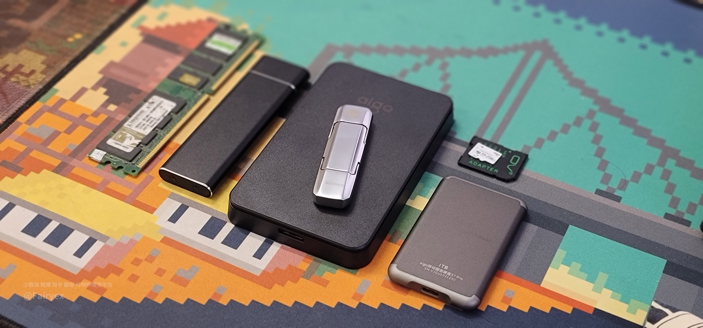

相信很多人都知道电脑里面有一种叫做内存条的东西，也知道它是电脑必不可少的部件，但它具体是什么，相关的参数怎么看大家就很少去了解了。

电脑里面的内存条和手机里面的运行内存等等，只要是将储存设备里面的数据存入超高速缓冲区，以供处理器交换数据的部件，我们都可以将它称为运行内存 RAM。但其实在上一章我们也学习到很久以前的固态存储设备同样是使用 RAM 来做存储介质的，就是断电会消失数据那种。

> 很多同学觉得 RAM 运行内存好像不算储存设备，但其实它也是一种储存器，只不过断电数据会消失而已。**只要不让它断电，就和超高速的固态硬盘没有什么区别**，还有专门的企业级内存盘，很多服务器都使用它来储存经常需要交互的数据，甚至我们自己也可以用软件来搭建一个内存盘，存放一些不重要但是经常交互的数据获得飞一般的体验（比如游戏）。

# RAM 的结构

由于现在运行内存的参数越来越高，性能越来越好，发热也逐渐增大，也让它成为了计算机里面即将需要独立散热的部件之一，所以我们现在购买的内存条通常都会被一层马甲所包裹用于散热，一般看不见里面的结构。

如果我们把内存条的马甲拆开**（通常别拆）**，就能看到一个经典的运行内存条结构：

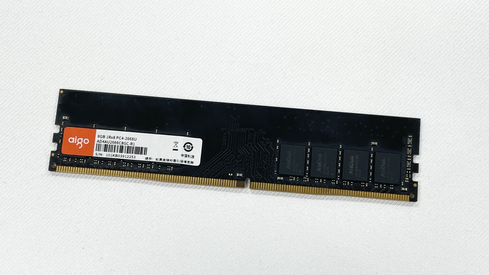

运行内存的结构也算是比较简单，底下就是接口，也就是说我们常说的金手指，接口类型通常是 DIMM/SO-DIMM（这个我们下面会介绍），缺口两边的长度不一样长防止我们把内存条插反了，上面的两个缺口是用来给插槽上的卡口卡紧内存条的。而剩下的**主要就是用来储存数据的 DRAM 颗粒和一个储存这内存条信息的 EEPROM 了**，这个 EEPROM 叫做 **SPD 芯片**，主要作用就是储存这个内存条的相关信息，比如品牌，频率，容量，时序电压等等，**主板就是靠它来识别内存条**。其它的还有时钟缓存之类的通常也会集成在一个地方。

在每个颗粒底下，我们还能看到一些小小的黑色芯片，这些也是缓存芯片，只不过作用是暂时缓存每个颗粒上读出来的数据。

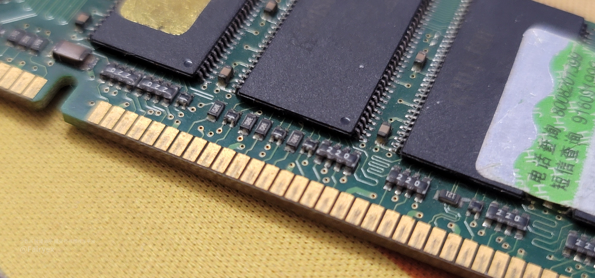

而一些轻薄本或者手机之类的高级程度设备则会更进一步，直接把 DRAM 颗粒焊在主板上，之前我们还学到机械硬盘和固态硬盘都会自带一个控制器来控制数据的输入输出，而**运行内存的内存控制器（Memory Controller）则不是在内存条上，而是在之前的北桥或者现在的处理器内部**。

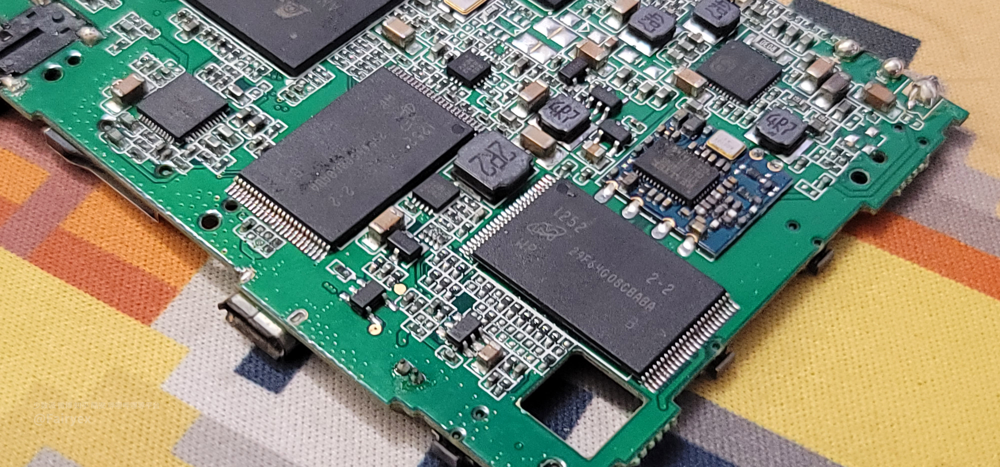

## 静态随机储存器和动态随机储存器

我们都知道运行内存是一种易失性储存器（Volatile memory），但易失性储存器又有静态随机储存器（SRAM）和动态随机储存器（DRAM），我们常说的 DDR 内存条储存单元就是 DRAM，CPU 缓存则是 SRAM。

无论是什么类型，易失性储存器只要断电数据都会很快丢失。**所谓的静态和动态，区别就在于通电的时候数据能否一直保持**。动态储存器里面储存的数据需要周期性地更新，不然就没办法保持数据完整，下面原理会介绍到为什么。

从结构上看 **SRAM 和 DRAM 的区别是储存单元的不同**，SRAM 储存单元由 6 个晶体管组成，而 DRAM 储存单元由一个晶体管和一个电容组成。**DRAM 数据其实是储存在储存单元的电容中**，电容的电会慢慢消失，所以需要周期性重新充电维持数据，而 SRAM 不需要这些结构，同时储存数据是利用正反器电路（一种可以保持稳态的电路，感兴趣的同学可以直接搜名字或者英文名 Flip-flop，顺便说一下，这个英文名是人字拖的意思哈哈），没有给电容充电等过程，**所以 SRAM 会比 DRAM 还要快很多**。

> Transistor 就是晶体管，Capacitor 就是电容，Word line 决定了对应储存单元的通断，Bit line 是用于读取或者写入数据的通道。

但是 SRAM 储存 1bit 需要使用 6 个晶体管，这意味着会占用几倍的晶圆面积，所以 SRAM 造价非常高，通常只能做几十 MB 来当作 CPU 缓存之类的用途。而 DRAM 虽然数据需要周期性刷新，但它简单的结构让造价更加便宜，也可以做大容量，所以就用来做我们的内存条了。

## 内部储存器和外部储存器

另外我们说内存其实就是内部储存器的缩写，而前面介绍的机械硬盘，固态硬盘等等则属于外部储存器。一般来讲能够直接与处理器交互的都称之为内部储存器，而数据需要通过高速缓冲区中转的设备一般叫做外部储存器。

**但人们对这些称呼该怎么用其实还是蛮混乱的**，比如我们都知道 Android 手机把手机自带的储存空间叫做 Internal Storage，也就是内部储存（但其实按照前面的定义它也属于外部储存器），很多人就会把它和运行内存搞混，产生「我的手机有 64G 内存，你的才 4G」这种误解。**所以大家提起 RAM 时建议用运行内存或者运存来称呼**，另外大家通常把 SD 卡叫做内存卡也是类似，其实按照分类 SD 卡应该是外部储存器，叫「外存卡」比较贴切一点。不过这些称呼已经约定俗成了，也没有一个比较统一的标准，所以还会继续混乱下去。

# RAM 的原理

其实通过前几章，我们学习到固态硬盘原理之后，运行内存的原理也就比较好理解了。

运行内存主要存储数据的是 DRAM 颗粒，而 **DRAM 颗粒储存单元由一个晶体管（MOS）和一个电容组成**。其实这个晶体管的结构就和上一章的浮栅晶体管差不多，只不过不需要永久保存数据，也就没有了中间浮栅的结构。

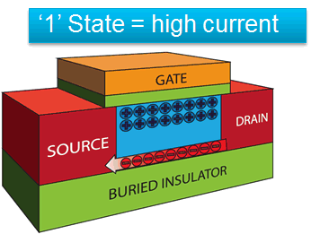

它读取和储存数据的原理和方法就和我们学到浮栅晶体管差不多，**只不过没有了浮栅去存储电子，而是把这部分转移到了电容上**。这样做的好处是节省了量子隧穿效应改变电子量的时间，同时没有量子隧穿效应的磨损，也没有 MLC/TLC 等等这种复杂的判断，电容充电就是 1，没有充电就是 0。**所以 DRAM 颗粒比起之前介绍的固态 NAND 颗粒速度能快上几十上百倍，读写寿命近乎无限**。

> 我们上面提到 DRAM 需要动态刷新保持数据，按照 JEDEC 标准是每 64ms 刷新一次，那么**一天就要刷新 100 多万次**，换成 NAND 颗粒早就挂了。

然后这些储存单元用并联的方式串在地址线数据线上，和我们前一章介绍到的 NOR 闪存类似，也是可以**单独读写到每一个储存单元数据的**。这样做的好处是优秀的随机读写能力，**单个储存单元随机读写的优势在于，无论访问或者写入哪个物理储存单元的数据，用的时间都是一样的**。既不像机械硬盘那样离磁头臂远的地方读写时间就长，也不像固态硬盘那样需要同时读写整个块，最后的结果就是 CPU 每个时钟周期内能获取执行的指令变多，更充分发挥 CPU 的性能，这也是我们要用越来越快的运行内存来做 CPU 和外部储存设备之间「中介」的主要原因。

*   很多个储存单元会按照横竖排列成一个 **Bank**（内存银行），每个 Bank 最下方还有一排 Row Buffer，用来缓存每一列的数据，接收到读取对应列上某个储存单元数据的指令，就把缓存里面的数据发出去。

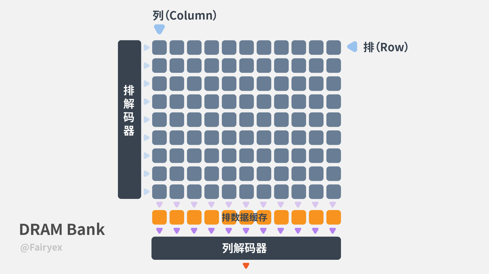

现在还有 **3D DRAM** 技术，就是横竖排列基础上再加一个层数，每一层再有一个层数据缓存，也是类似的原理。现在很多密度大的 DRAM 颗粒还会有 DRAM Group 技术，也就是将几个 Bank 分为一组。

*   很多个 Bank 层叠起来就成了 Die，通常一个 Die 就是我们看到的一个 **DRAM 颗粒**。

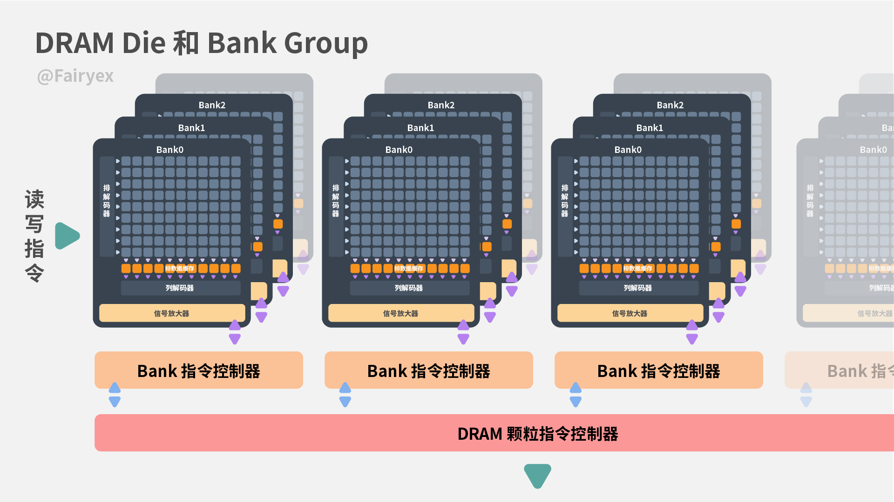

DRAM 颗粒和 Bank Group 的结构，很多层 Bank 组成 DRAM 颗粒

这样对比起来 DRAM 颗粒还是比闪存颗粒结构要简单，比起闪存颗粒动不动每块几十上百亿个晶体管，一根 8GB 的内存条上双面有 16 个 DRAM 颗粒，每个颗粒才 512MB，分 8 层的话每个 Bank 才 64MB。

> 下面介绍会涉及到**位宽**，这里简单解释一下就是**一个部件每个时钟周期在某个线路能发送的数据**，比如 CPU 和运行内存之间的总线，在一个 CPU 时钟周期内能向运行内存发送或者接收 64bit 的数据，那么这个 CPU 的内存位宽就是 64bit，**我们常说的 32 位或者 64 位处理器指的就是一个 CPU 周期能够处理 64bit 的数据**。

*   一根内存条上有很多个 DRAM 颗粒，这些颗粒合起来就是一个 **Rank**（内存区块）。**注意 Rank 并不是物理结构而是逻辑结构**，由于现代的 64 位处理器每个内存时钟周期内会向运行内存发送或读取 64bit 的数据，而每个颗粒在这个时间段只能执行 8/16/32bit 的数据读写，**所以就需要根据颗粒的位宽来把几个颗粒合并成一个 64bit 位宽的组同时读写**，最大化利用上 CPU 的性能，同时增加单条运行内存条的容量。

刚才我们看到运行内存条一面都会有 8 个颗粒，它们就会按照位宽组成 1-4 个 Rank。关于 Rank 的意义和实际作用我们会在下面相关参数部分讲。

*   电脑主板上插运行内存条的地方叫做 **DIMM 插槽**，笔记本或者便携设备上小的那个叫做 SO-DIMM，通常一个**物理**（记住这点） DIMM 槽就是一个**内存通道（Channel）**。至于意义和实际作用，我们也会在下面相关参数那里再讲。

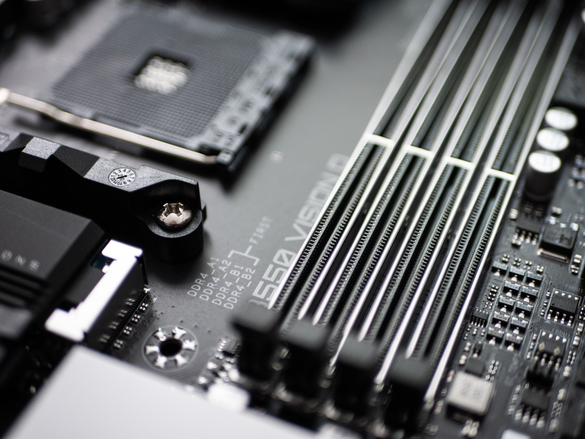

插运行内存条的 DIMM 插槽，主板正放的情况下一般都在 CPU 插槽的右边。除了内存条和手机等其他类似功能的部件，还有其他几种类型的 RAM，比如我们现在的空气显卡里面就有专门优化用于交换图形数据的 SGRAM/VRAM 等等，基本原理都大同小异。

> 内存颗粒整个地球上目前基本只有 4 家厂商能够生产：**三星、海力士、镁光、长鑫存储**。

# RAM 的常见参数解读

了解了运行内存的基本结构和原理之后，我就开始来给大家解惑最想知道的各种参数了。下面介绍的大部分参数一般都会在商品详情或者包装盒上标注，也可以通过像是 CPU-Z 这样的软件来查看。

## 现代运行内存的本质：SDRAM/DDR

到这里我们已经提过几次 DDR 技术了，我们平常使用运行内存的时候也会看到像是 DDR3/DDR4 这类的字眼。

**我们现在能买到的现代运行内存条，本质上不是 DRAM 而是SDRAM**，不过因为不是 SDRAM 的颗粒太少所以大家通常都直接用 DRAM 来表示这个了。这个 S 是同步（synchronous）的意思，也就是说内存颗粒的读写访问可以通过控制器与 CPU 时钟对齐同步，不会出现 CPU 等运行内存执行指令或者运行内存等 CPU 发送指令的情况。

DDR（Double Data Rate），从全写就可以看出来，它是可以让数据传输速率翻倍的技术。简单来讲就是原本 Single Data Rate 只是 CPU 每个时钟周期能读写一次运行内存的数据，而 DDR 能让每个时钟周期发送脉冲的上下沿都发送一次数据给 CPU，这样就能让传输速率翻倍。

> 如果你还对时钟周期相关的概念比较模糊，可以去知乎搜索下这个名词，有很多答主给了一些很棒的比喻来解释。

**DDR1 到 DDR4 都是一个内存时钟周期发送两次数据，但不同的是每次发送的数据量变大了**。因为 CPU 指令每个周期需要读写写入的数据量很少（64bit），而指令数据通常都在一块，所以可以通过预测算法预读取数据发送，比如 DDR2 一个时钟周期预读取 4bit 的数据，DDR3 一个时钟周期预读取 8bit，DDR4 根据不同的 Bank 数量预读取 8 或 16bit 放到 CPU 的三级 L3 缓存。这样子就能节省很多个 CPU 周期的命令，节省下来的时间，就可以继续执行 CPU 给的更多命令，从而实现相同的核心频率实现好几倍的工作效率。

> 之所以 DDR2 开始一次预读取数据越来越大，是因为内存芯片会给更高的时钟频率，所以一个周期变短，同样时间内读取颗粒的次数变多，也就能读取更多的数据了。

另外 DDR1 到 DDR4 运行内存条本身都是不兼容的，它们的接口插槽和金手指形状都不一样，缺口位置也不一样，所以不能通用，也要对应的主板才可以。

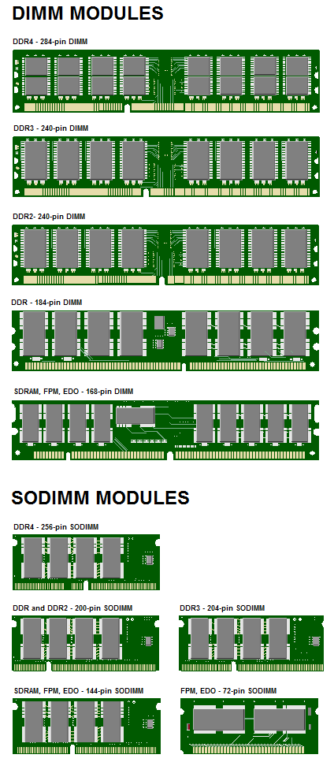

## 容量

和其它储存设备一样，大部分用户看运行内存首先考虑的就是容量。而运行内存和普通储存设备的区别就在于它**不用来实际长期储存数据**，所以并不是买多大的容量就能用多少，毕竟好的运行内存条按照容量算比其它储存设备贵多了，买了用不上，还不如把这些钱花到其它地方。

在我们日常使用中，**与运行内存最直接相关的就是能够在后台运行程序的数量**，无论是电脑还是手机，运行内存越大能够在后台保留的程序就越多。随着应用游戏甚至系统的内存要求越来越大（比如 Win11 最低运行内存要求居然要 4GB），我们对于主力设备运行内存容量的要求也越来越高，所以我们要根据自己的需求去配置运行内存容量。

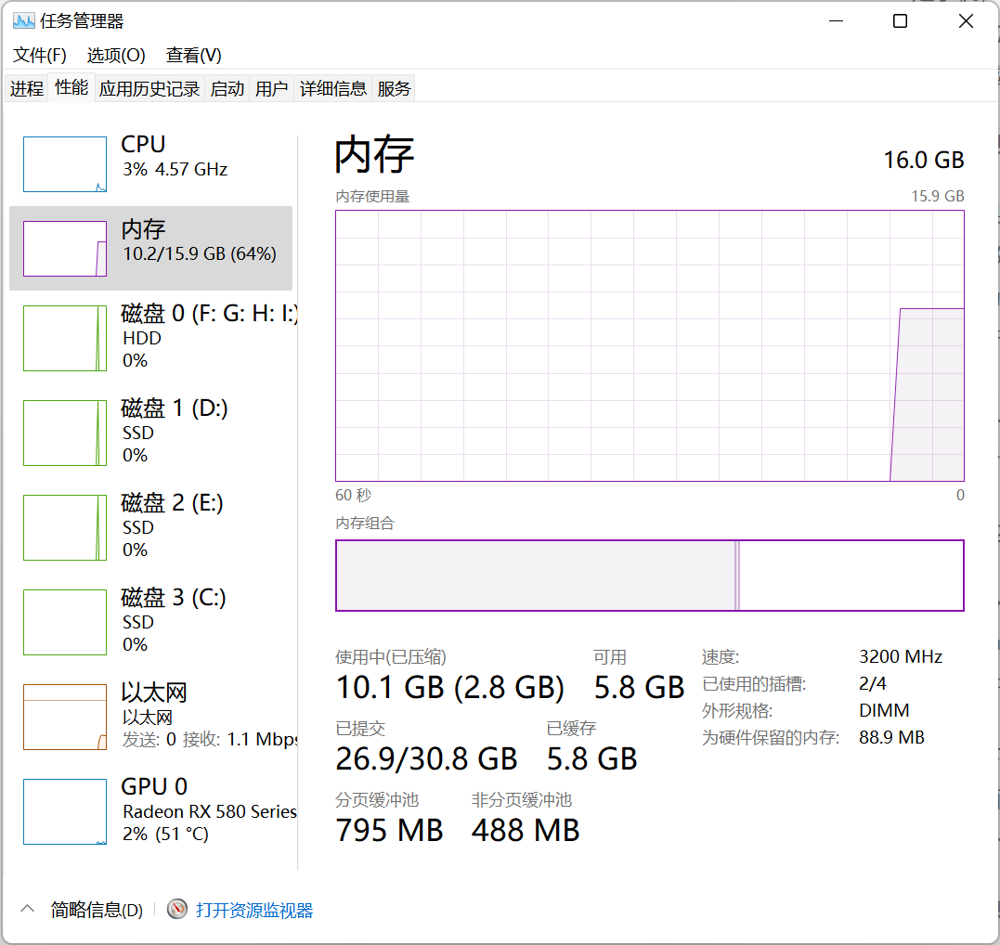

现在常用的容量一般是 16G，开多应用玩绝大部分游戏游戏都能满足

> 上面的运行内存使用情况是我在开着几个播放器、VS Code 编辑文章、几十个页面的 Chrome、Adobe PS、AI 等大型软件的时候截的，系统是 Windows11。

另外如果你的运行内存容量实在太小，又或者运行一些超大型软件（视频剪辑，特效，3D 等等），那么**运行内存容量不足不仅会让后台运行程序数量变少，也会让前台运行程序和系统变卡**。因为系统为了保证程序不崩溃，会把一些程序在运行内存里面的数据暂时放到储存盘上，等到运行内存有空间时再搬回来（在 Windows 上这个就是虚拟内存，Linux 和手机上一般叫 SWAP）。但无论是机械硬盘还是固态硬盘速度都比运行内存慢很多，所以一旦运行容量不足，部分程序就相当于运行在硬盘上，程序少的时候还好，但当虚拟内存越用越多，卡慢就是自然的了。

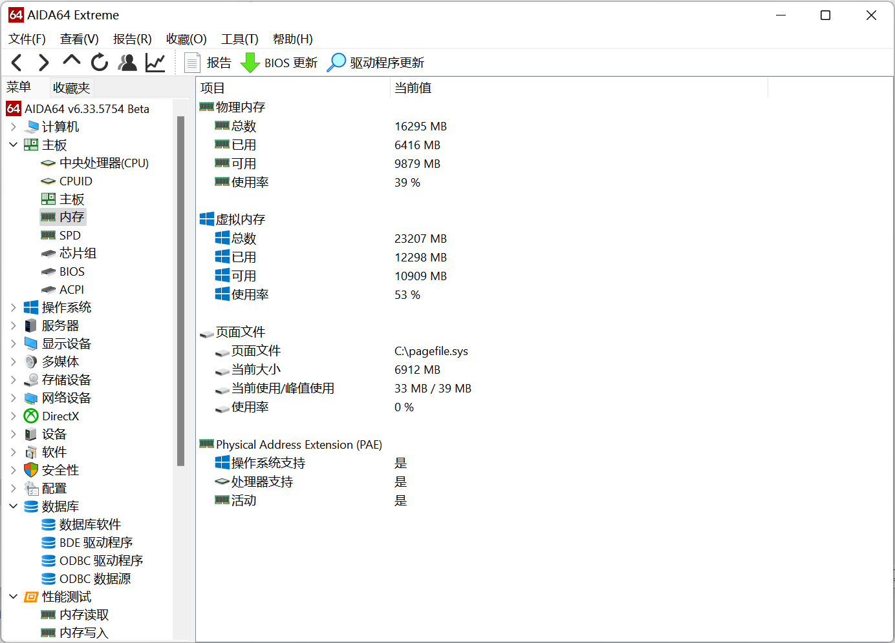

**另外一个比较吃运行内存容量的是浏览网页**，特别是后台多标签的时候，有大量数据需要缓存在运存中，比如著名的 Chrome 吃内存梗。不过只要你不开一些大型软件，只是日常使用，即使是多开浏览器微信播放器等等的日常应用 16G 也能剩余很多。

另外说下游戏，**一般游戏对于运行内存容量的要求并不高，只要能满足推荐设置即可**，反而是我们下面介绍的运行内存频率和时序对游戏帧率的影响更加大（比较出名的就是绝地求生吃鸡了，这个游戏其它配置相同，高频运行内存和低频运行内存帧率能差一半）。

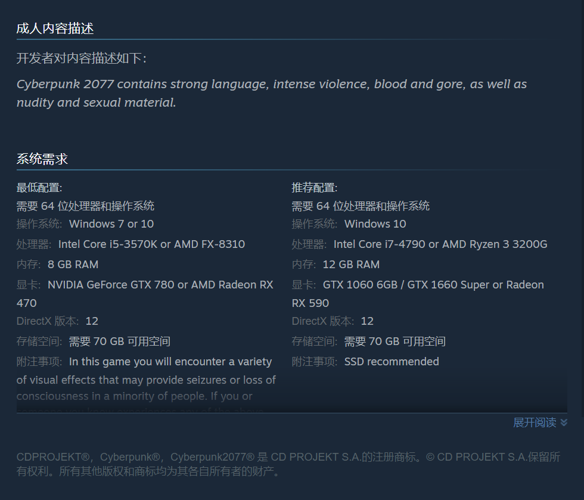

即使是最新的 3A 大作比如赛博朋克 2077，8GB 容量都满足最低要求了

> 至于如何根据你日常的使用挑选运行内存容量，我就放在选购那一篇给大家讲了。

## 频率/XMP

如果说容量是用户选择运行内存条时的第一反应，那么频率就是大部分用户用户接着会考虑的参数。大部分人都知道频率是越高越好，那么频率到底代表什么呢？简单来讲，**运行内存的频率表示处理器每秒可以对内存颗粒读写多少次**，比如理想状态下 DDR4 3200Mhz 的内存条就能让 CPU 每秒读写 3200\*100,0000 = 32,0000,0000 也就是 32 亿次，是不是很惊人。

> 结合上面学到的 64 位处理器，每次读写 64bit 数据，我们就能算出运行内存（单通道）大概的速度，32,0000,0000\*64≈23.84GB/s，但内存延迟和通道数会影响读写次数，甚至不同主板还有供电的用料都会影响这个速度，DDR4 3200Mhz 双通道实际读写复制速度大概在 40GB/s 左右。

细心的朋友就会发现，好像这个频率只和 CPU 的处理能力有关，那么为什么要标注成运行内存的参数呢？答案是内存颗粒的体质，每个 DRAM 颗粒生产出来的时候里面晶体管的质量还有数量都不一样，**所以就会导致不同 DRAM 颗粒每秒能让 CPU 读写的最高次数不一样**，再高就会导致数据读写失败甚至损坏 DRAM 的晶体管。

所以厂商通常会将同一批次不同体制的 DRAM 颗粒做成不同频率的运行内存条，体质好的就做成 3000Mhz，3200Mhz 甚至更高，当做高端运行内存条卖，体质不好的就做成 2400Mhz，2666Mhz 这种。这也是为什么我们经常会看见**同一个牌子型号的运行内存条会有不同频率版本**。

而且厂商为了保证内存条能够稳定运行，通常标称的频率会低很多，而且主板厂商也没办法检测运行内存条颗粒的体质，为了稳定只能设定**运行内存条插上去之后默认会运行在对应 DDR 代数最低的频率**，比如 DDR4 就是 2400Mhz，**需要用户手动在 BIOS 里面调整到标称频率**。

**另外不同处理器和主板对运行内存频率支持也有一个上限**，通常会在处理器或者主板说明书里面标注支持的内存频率，大家购买和使用的时候需要注意。

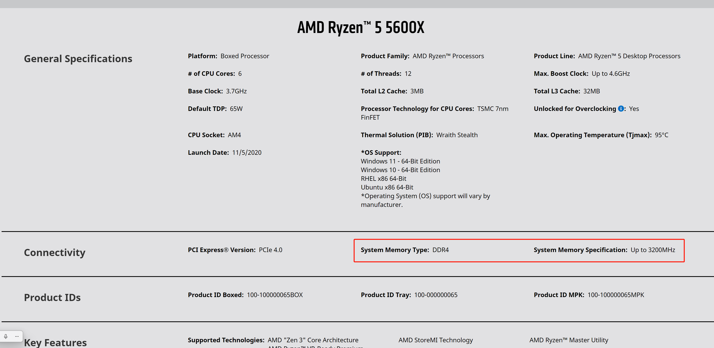

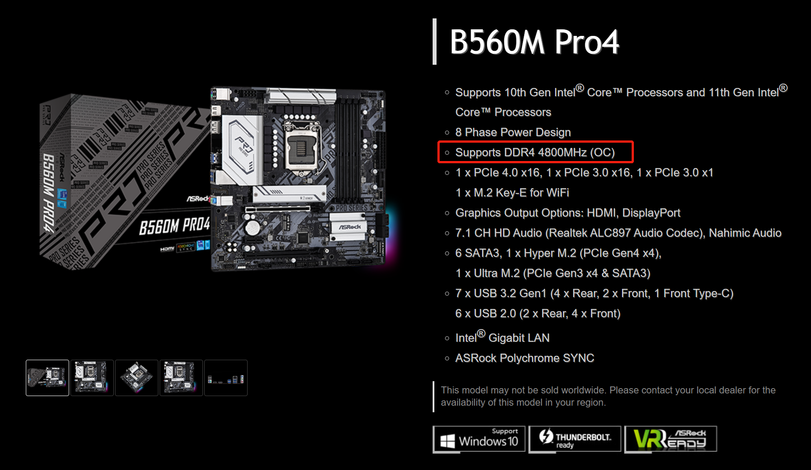

主板对支持运行内存频率的说明，这里的 OC 就是 OverClock 超频的意思，参数分别来自两个品牌的 B560M 主板

这里细心的同学又发现了，既然频率只是厂商标注的，实际都靠自己手调，那么能不能调高一点呢？没错了，这个就是内存超频玩法，比如买了大厂为了降低售后率通常会把标称频率标低一点，而且大厂用料往往比较好，**所以我们调整内存频率的时候可以调得更高**，正常用料的 2666Mhz 频率运行内存条可以轻松超到 3200Mhz，用料特别好的甚至能超到 3600Mhz 以上。

很多人推荐运行内存买回来之后，在主板 BIOS 打开 XMP，这里的 XMP（Extreme Memory Profile）就是主板厂商预制好的一些超频配置文件，这些配置文件主板和运行内存生产厂商都会测试过，用户只需要直接选择就可以比较安全地超频。

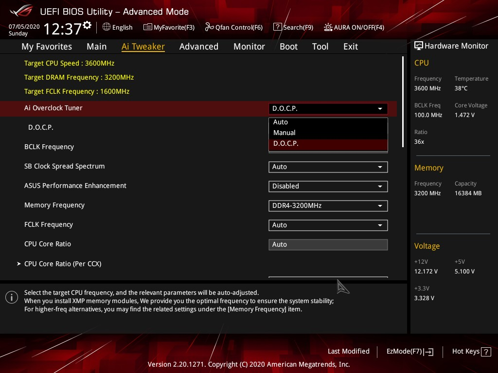

> 大家要超频用用 XMP 就好，千万不要自己乱给运行内存超频，轻则无法开机，重则烧掉运行内存条。至于怎么给自己的运行内存条超频，又怎么调试让它稳定运行，我就放到使用那部分讲了。

## 频率进阶：核心频率，工作频率和等效频率

实际上运行内存的频率还分为核心频率，工作频率和等效频率三种，**一般我们在商品详情包装盒和普通软件里面看到的运行内存频率都是等效频率**。

**核心频率就是运行内存控制器和电路的物理时钟频率**，比大家想象中小很多，一般只有 100Mhz~200Mhz，常见的有 133Mhz、166Mhz 和 200Mhz（这也是为啥我们经常看到运行内存频率有零有整的），**从 DDR1 到现在 DDR4 核心频率基本没啥变化**。

上面我们介绍的 DDR 技术，通过它可以让运行内存一个 CPU 时钟周期发送两次数据，这样能让每个周期读写次数翻倍，**这个 DDR 技术翻倍后的频率就是工作频率**，上面的常见核心频率就变成了 266Mhz，333Mhz，400Mhz。

上面我们还介绍到了数据预读取，等效频率就是指数据预读取后的效率，比如 DDR4 预读取 8bit，全部预测中的话就相当于每次核心频率读取 1bit 的 8 倍，所以 400Mhz 工作频率的等效频率就变成了 400\*8=3200Mhz，也就是平常我们看到的频率参数了。

但现在我们很少看到 4000Mhz 以上的 DDR4 运行内存条，这一方面是因为频率太高，颗粒体质很少跟得上，另一方面则是**预读取技术会让我们下面提到的时序变得越来越高，反而会降低运行内存条的综合性能**。

> 像是 CPU-Z 这类的软件之所以会把运行内存频率显示的标注频率的一半，就是因为显示的是核心频率的等效频率而不是工作频率的等效频率。

## 时序

到这里就进入了大部分商品详情都不会标，大部分用户也不会看，知道这个的人也弄不清楚代表什么的参数范围了。

**时序通常写成「CL16-17-17-35」这样的形式**，每个数字代表的意义要结合我们之前学到的 DRAM 颗粒的结构来看。**所有数字的单位都是 CPU 时钟周期**，下面的 R 指的就是 Bank 里面的行（Row），C 就是列（Column）。

**DRAM 颗粒 Bank 里面的储存单元是按照行列排列的，就跟围棋格子一样**。每次想要访问某个特定组成单元的时候，是先给指定行上的所有储存单元加上阈值电压，然后再检测这行对应列上的那个储存单元的值，将值发送给 Row Buffer。

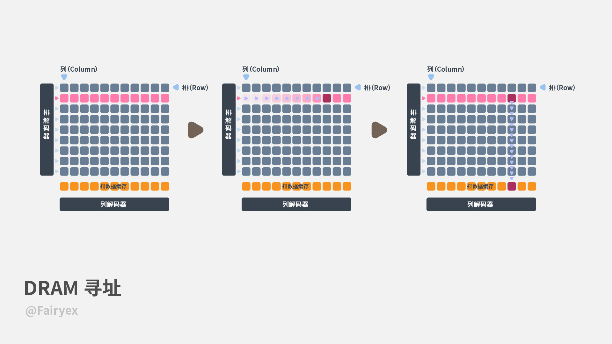

*   第 1 个数字代表 CL（CAS Latency），就是内存控制器发出读写某一个数据的指令到 Row Buffer **准备好**返回数据的延迟。

**这个数字单位是 CPU 时钟周期，是最重要的时序参数**，很多商家也会标出这个数字，延迟自然是越低越好。而换算成时间需要结合频率来算，比如 DDR4 3200Mhz 的运行内存 CL 延迟时间就是 16_2（一个周期读两次）/32,0000,0000_10,0000,0000（1 秒等于 10 亿纳秒）=10 纳秒。

> 这个延时的前提是对应数据行的阈值电压已经加好，也就是对应储存单元的电容里面已经有可以检测值的电子。否则还要加上下面介绍的第 3 个数字代表的充电时间。

第 2 个数字代表 RAS to CAS Delay（tRCD），这个数字代表的就是指定行上找到储存单元所在的对应列的时钟周期。

第 3 个数字代表 RAS Precharge Time（tRP），就是给对应行加阈值电压然后电容充电的时钟周期。

第 4 个数字代表 RAS Active Time（tRAS），就是保持目标行充电以确保读写成功的时间。

如果你在查看时序的时候发现后面还跟着个「2T」这样子的参数，这个参数指的就是指令发出到找到对应 DRAM 芯片执行指令的时间，这个参数对于普通用户来讲没什么用。如果你是服务器或者其它插着十几个内存条的设备，那这个参数反映的就是 CPU 执行指令的时候多快找到对应的运行内存条（1T 比 2T 快）。

至于实际我们选购使用的时候就不用考虑这么多，**简单来讲就是第一个数字越低越好，基本上可以等于运行内存的等级，在此基础之上，剩下三个数字越低越好**。

通过 CPU-Z 可以轻松查看自己运行内存条的时序

另外给大家讲一个很好玩的事情，**那就是内存条上的 RGB 灯效某种情况下真的会影响内存条的性能**，不过不是立刻提升 100%，我看见过分两种情况，一种是因为电压问题，导致运行内存条的时序稍微增大，另一种是因为太多 LED 或者灯光设计问题导致发热，从而影响运行内存条的性能，这种情况我还没有找到验证。

不过另一种情况就有 YouTuber 验证过了，一般来讲如果电脑上运行内存条有 RGB 灯效的人，通常电脑上还会有其它灯效，这样子所有 LED 加起来的发热和灯效驱动去稍微影响 CPU 性能，特别是某些牌子设计的比较烂的驱动和管理软件，还有电脑里面有几家不同的光效（比如神光同步和 ICUE 啥的），多个软件之间对处理器的影响还会叠加，不过这些相对于现在电脑技能来讲都是不需要介意的，只是有点神奇。

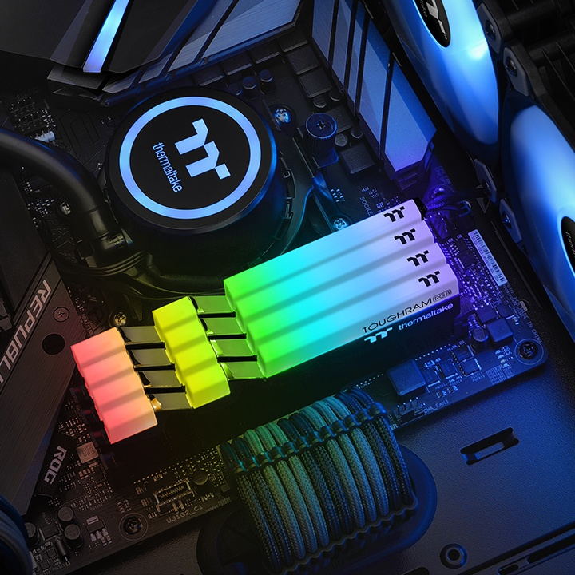

# 频率和时序的关系与优先级

时序反映的是每次操作的延时，**延迟低了，每秒的操作次数自然也就越多。越低的时序通常代表着颗粒的体质越好，也就能超到更高的极限频率。**

但也像我上面提到的，过高的频率也会增加时序。主要原则就是**相同频率下时序越低越好，相同时序下频率越高越好**。

DDR4 之前的运行内存，频率比时序重要得多，而到了 DDR4 时代，频率和时序都同样重要，虽然非要选一个的话，还是优先考虑频率。

放到实际的情况就是，如果时序一样频率差别不大，比如同样时序的 DDR4 2666Mhz 和 DDR4 3200Mhz，在日常使用中可能感觉不太出来差别，反过来频率相同时序差别不大，也是一样的情况。我看了一圈测试，游戏方面基本只差 1~2FPS，日常软件加载和操作时间也差不多。

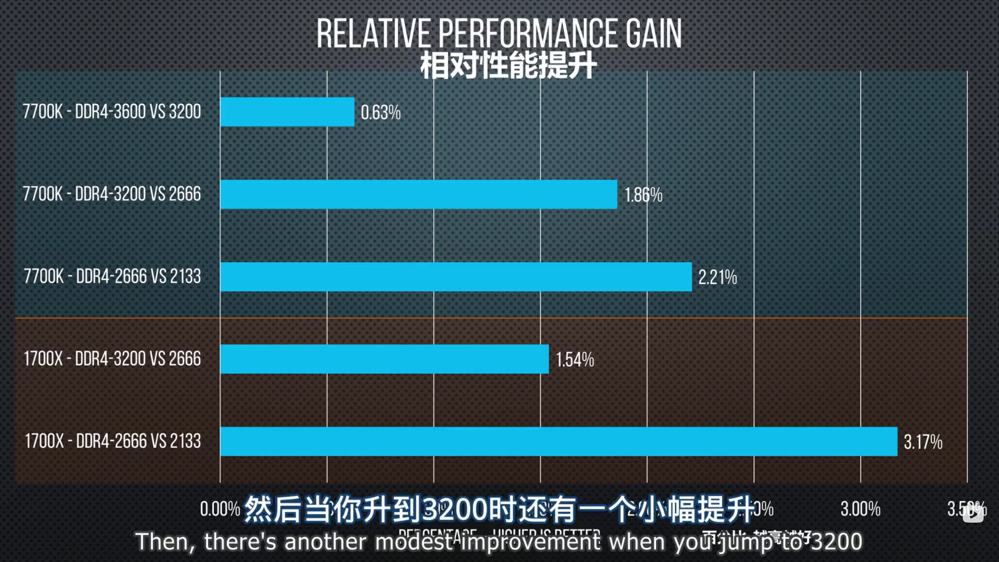

**但对于内存敏感的软件和游戏来讲就不一样了，比如 Adobe 全家桶和开放世界等大容量大型游戏**。这些软件和游戏有一个共同的特点，就是需要频繁的切换运行内存里面的数据，同时数据容量大，CPU 缓存放不下，这个时候 CPU 就会开始频繁请求运行内存数据，就能明显体会出频率的差别了。3200Mhz 和 2400Mhz 在帧率敏感游戏当中会出现几十帧的差距，特别是最低帧率差距明显，就是因为频率低的内存读取速度跟不上显卡的每帧生成时间了。生产力软件也是如此，比如 Adobe 全家桶的文件导入导出，和复杂素材的加载，高频运行内存都会快很多，甚至能快 20%，时序的影响少一点，但也有可以感知的影响。

> 至于其它平台测试结果和结论可以直接查看 PC Gamer 的文章 [「Don't waste money chasing RAM speed for gaming on AMD or Intel」](https://www.pcgamer.com/does-ram-speed-matter-gaming-amd-intel/https://www.pcgamer.com/does-ram-speed-matter-gaming-amd-intel/)，更加详细的容量频率和时序购买建议，我会放到选购部分给大家详细讲解。

## 1Rx4，2Rx8 这类的参数是什么？

如果我们拥有一些没有马甲的运行内存条，或者在一些大品牌的运行内存条商品详情里面，还会看到内存条容量后面跟着类似「1Rx8，2R\*4」这类的参数。

这个参数里面的 R 其实就是我们上面介绍运行内存条结构时候提到的 Rank，上面提到 Rank 是逻辑结构，其实它是针对运行内存 DIMM 物理插槽的一个优化。

DIMM（Dual In-line Memory Module）是 S（Single）IMM 进化而来的插槽，在很久以前内存条只有单面有颗粒和金手指。

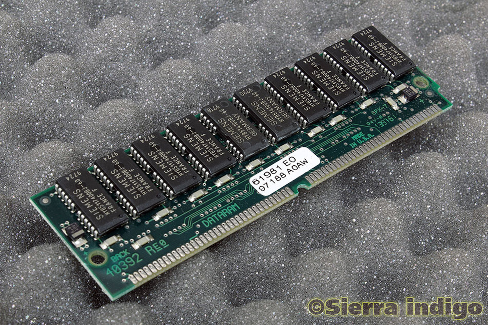

后来处理器性能飞速增长，单面颗粒的位宽开始追不上 CPU 了，人们就想到了把**运行内存条两面都加上 DRAM 颗粒，然后金手指和插槽两面都弄上金手指，这样就能同时读取两倍的数据，将位宽翻倍了**，这个就是 DIMM 接口。

再后来**处理器性能还在提升，系统程序越来越复杂，就要求越来越高的运行内存容量**，由于 **DIMM 插槽的位宽根据不同类型只有 32/64/72bit**，主板上开始出现三个甚至四个 DIMM 槽，但是大家都知道运行内存是特别高频高速和处理器交互的东西，考虑到主板空间和总线的质量，运行内存插槽要离处理器很近并且数量不能很多（不然主板空间不够，而且距离最远的那个插槽信号质量会下降）。

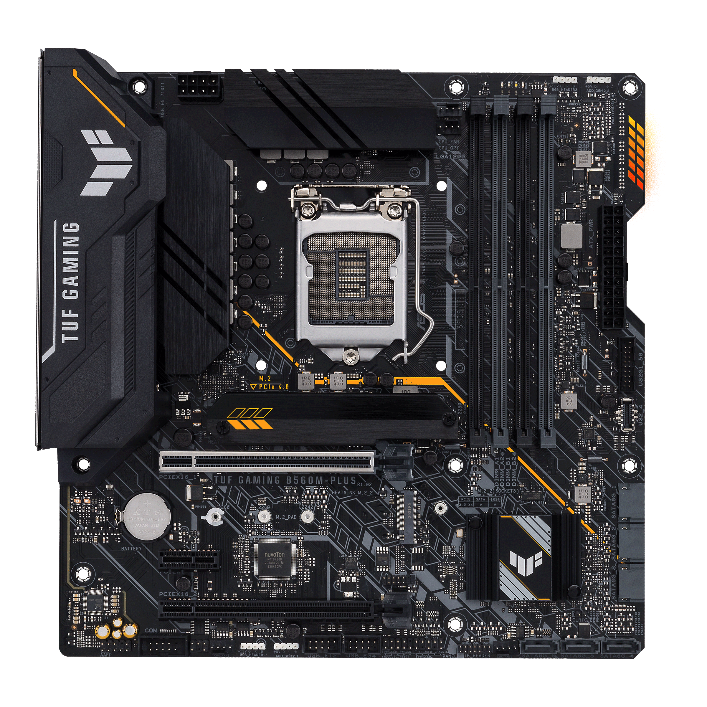

一般的主板都只会提供 4 个运行内存插槽，也就是 4 个 DIMM

既然插槽不能多，那就只能增加单条运行内存条的容量了，这个时候人们就想到了 Rank，按照颗粒的位宽将几个颗粒并成一个 64bit 的 Rank，然后一条内存条做几个 Rank，等要读写数据的时候，先确定 Rank 然后在执行对应的指令。**这样人们就能把几个运行内存条的颗粒做到一个内存条上，Rank 就相当于一个虚拟的 DIMM 插槽，最终的效果就是极大增加了单条运行内存条的容量。**

举个例子，我们常见的内存条一面通常有 8 个 DRAM 颗粒，两面就是 16 个，如果是 2R\*8 的排列，那就意味着这个内存条有两个 Rank，每个 Rank 有 8 个 DRAM 颗粒，**每个颗粒的位宽就是 64/8=8bit，也就是后面那个数字的意义**。同样 16GB 1R 的内存，4bit 需要 16 颗 1GB DRAM 颗粒，8bit 需要 8 颗 2GB DRAM 颗粒，16bit 需要 4 颗 4GB DRAM 颗粒，大容量颗粒的成本高，但是节省空间；小容量颗粒成本低，需要多个才能拼成同样的容量，但是数据稳定性比较好。

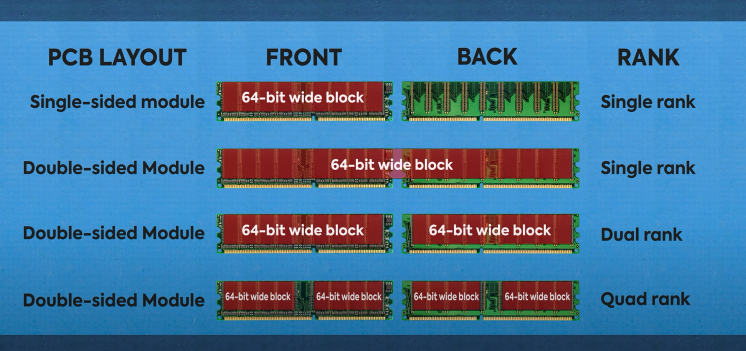

> JEDEC 标准规定的 DRAM 颗粒位宽目前只有 4，8，16bit，Rank 数量只有 1，2，4。

虽然读写数据会增加多一步寻找 Rank 的操作，但因为每个 Rank 都是独立的（这也是它的意义），可以并行读取，所以 **Rank 多的运行内存条速度会快一点**。其实这个参数我们知道它是干什么的就行了，因为**它跟我们日常使用关系不大**，因为民用运行内存条一般都是 x8，除非你用 x16 和 x4 的同一品牌同容量运行内存条去对比才能感觉出 20% 左右的差距。

另外有一些内存条，常见于服务器的内存条，**我们叫它 ECC 内存条，特点就是一面通常会有 9 个 DRAM 颗粒**。会额外添加 8bit 的纠错码（Error Correct Code）用来校验纠正数据，这样就让一个 rank 的位宽变成 72bit 了。

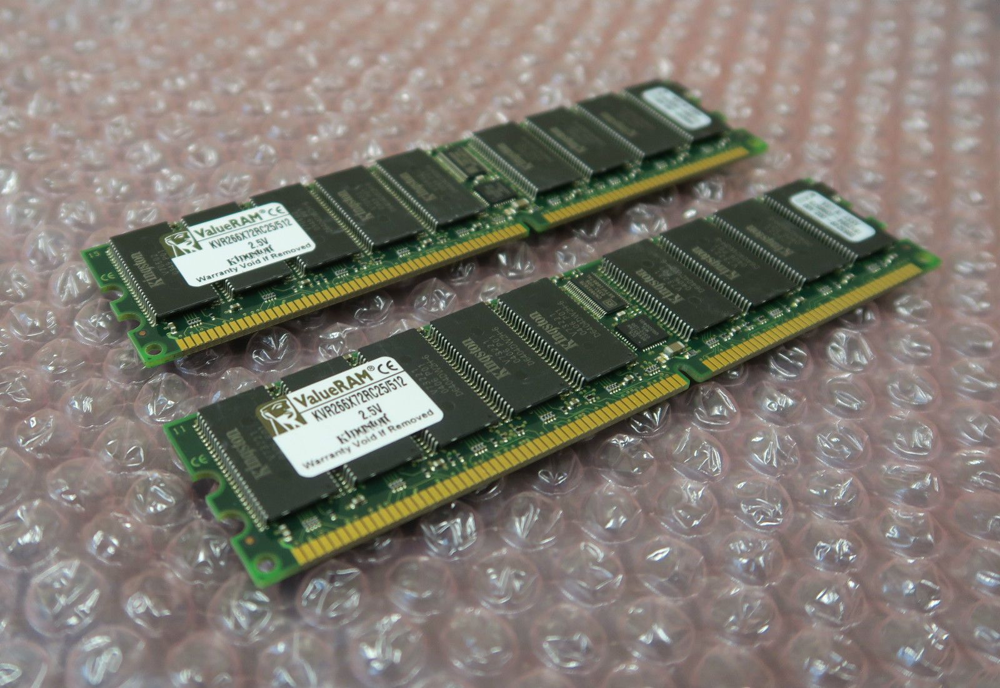

> 但是 Youtube@LinusTechTips 在这篇文章编写时出了个视频，指出现在芯片短缺的时候有一些厂商会故意把笔记本上的运行内存从 1Rx8 换成 1Rx16，节省了背面的 DRAM 颗粒，根据测试这会让笔记本的性能下降约 20%。在某些内存敏感的游戏中，**极端情况下甚至能差出一个从 RTX3070 到 RTX3080 的提升**。

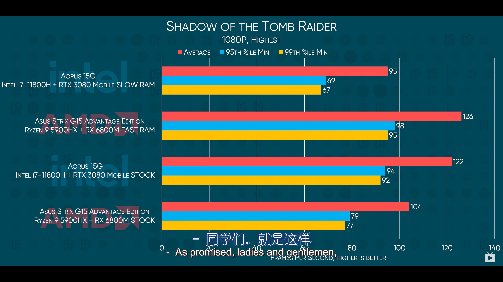

> 上面测试的方式是把一个 Rank 的 AMD 笔记本和 2 个 Rank 的 Intel 笔记本运行内存条对调。

## 双通道/多通道

有了之前知识的铺垫，接下来终于可以给大家说一下平常我们为什么要买两根内存条组双通道了。

上面我们学到内存控制器现在一般在处理器里面，**处理器和运行内存条通过内存总线通道交换数据**。**每个内存控制器可以控制一个内存总线通道的数据**，一个内存总线通道上可以有多个 DIMM 内存插槽。

现在我们买到的民用主板一般都会有 4 个内存插槽，通常主板厂商会将第 1,2 个插槽弄一个通道，第 3,4 个插槽又弄一个通道（一些主板还会有三通道，甚至多到八通道，不过一般都是服务器比较多，正常用户不会插这么多内存条）。

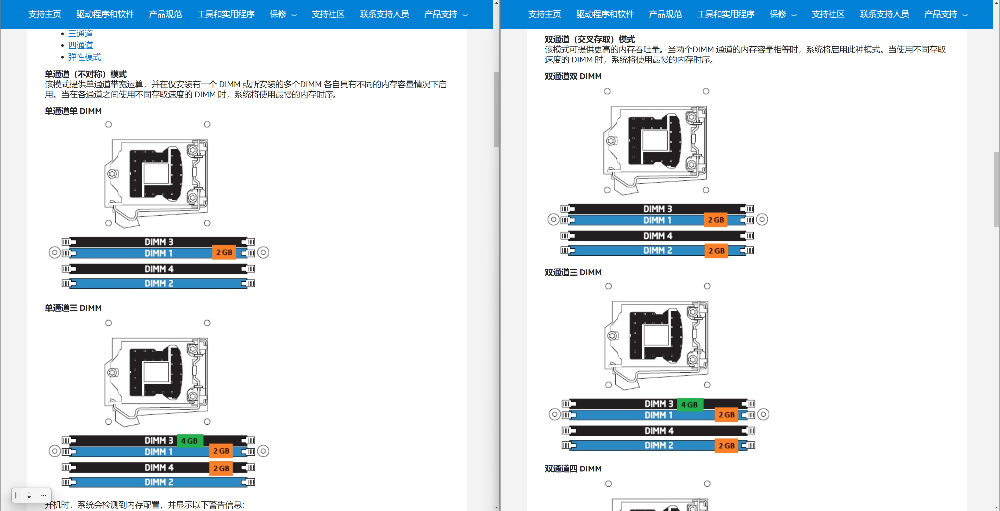

当我们有两根内存条的时候，大家都会建议你把它插在第 2,4 个，也就是交错插在比较远的内存插槽，主板上一般也会用不同颜色标注出来应该要插在哪里。我们知道，**这个时候两个内存条分别在两个总线通道，受两个内存控制器控制，这样就能用两条总线同时发送或接收信号，数据也会拆分开来分别放在两根运行内存条中**。

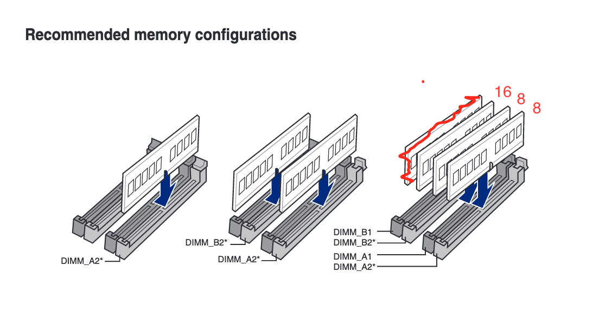

有同学会想 CPU 每个时钟周期不是只能处理 64bit 的数据吗？在上面时序部分我们就知道，运行内存读取数据是有十几个 CPU 时钟周期延迟的，而**第一条运行内存条在读写数据时 CPU 就可以通过第二个总线通道给第二条运行内存条发指令，这样两个运行内存条就能交错给 CPU 提供数据**，从而让运行内存读写速度翻倍。

> 之所以要插比较远的插槽，是因为处理器到内存总线设计是先接到远的插槽，再从远的插槽接到近的插槽（想知道为什么可以自己搜索一下）。另外由于 AMD ZEN2 内存控制器设计问题，双通道写入速度没有翻倍。

官方一般推荐**要组成双通道的话需要两根运行内存条容量一致，时序一致，并且插在正确的插槽上**。所以平常卖家都是两根运行内存条一起卖，大部分时候两根还是连号的，就是为了保证规格和素质差不多，提高使用的稳定性。

连号也算是运行内存的一个卖点了，不过没有太大必要去强求连号，只要批次差不多就没问题

最后给一些好奇宝宝们回答一下，**对于普通用户四通道甚至更多通道会比双通道更快吗**。

答案是目前并不会，首先普通主板一般都只有四个插槽两个通道，四通道需要高端主板和高端处理器支持，是一笔额外的钱。另外如果真的不差钱，四通道对运行内存条单条体质和多条一致性的要求也很高，即使这样四通道运行内存条也稳定性不如双通道，还会让最高频率变低，超频能力也变差，得不偿失。最后有人真的用 X299 主板测试过了，实际上也是没有性能提升。

## 运行内存混搭

不是所有人都是重新购买两条运行内存条，很多人都蛮好奇，如果用不同品牌，不同频率甚至不同容量的运行内存条混搭，组双通道会怎么样。

先说说**不同容量的运行内存调组双通道**，比如一条 8GB 的运行内存条和一条 4GB 的运行内存条组双通道之后，**相同容量部分也就是 4GB 是双通道，而 8GB 运行内存条剩下的 4GB 则是单通道**。

然后是**同品牌不同频率的运行内存条组双通道**，一般来讲也是没有什么事情的（厂商也都会测试过），但就非常亏。**因为双通道会让两个运行内存条的频率变成最慢的那个运行内存条的频率**，因为要保证数据读取的频率一致，其它的倒是没什么。

最后是**不同品牌相同容量频率组双通道**，其实也没有什么事情，有小概率过不了自检。如果超频容易蓝屏，不超频正常使用最多是稳定性稍微差一点，小概率死机重启。毕竟学过前面的结构原理我们都知道，现在 **DRAM 颗粒结构大同小异，生产厂家也只有那么几家，主控厂家也是只有几家，只要频率和时序差不多，基本没差别**。

如果你手上是不同品牌，不同频率，不同容量的运行内存条，那是**便宜卖了买两根成套的运行内存条**吧，不要冒不必要的风险。

## 其它 DIMM 类型

除了我们最常见的 DIMM 和笔记本上的 SO-DIMM，另外还有几种 DIMM 接口类型，这里就简单给大家介绍一下。

**SIMM**：上面介绍过了，DIMM 的单面接口版本。

**SO-DIMM**：就是为了在笔记本和 NUC 迷你主机之类的地方使用，而把标准的 DIMM 插槽针脚改掉，整个接口变短变小。

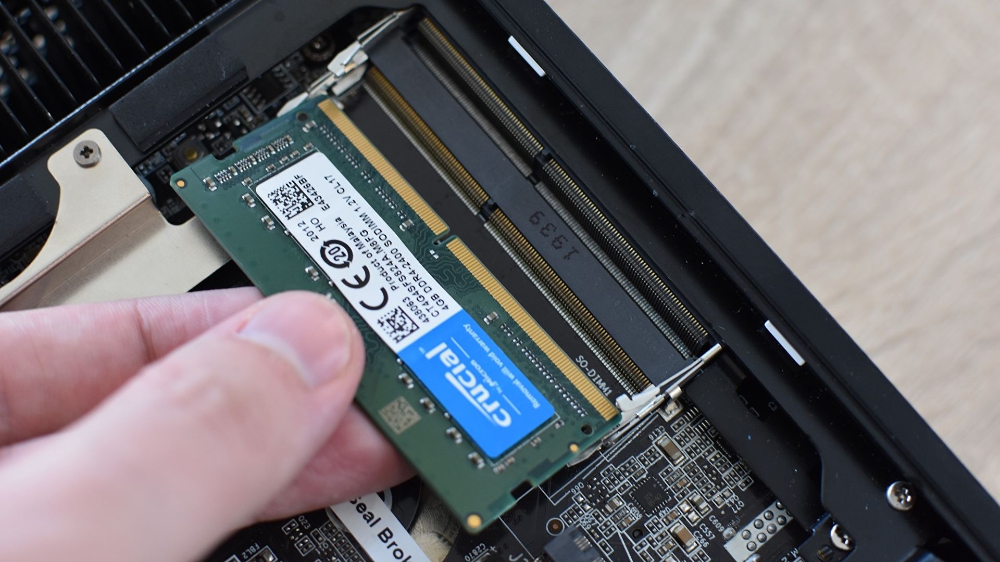

*   **RDIMM**：就是普通内存条上有一个额外的芯片，用来缓存 CPU 发过来的指令，还有时钟，内存地址等等，增强负载能力和信号质量。这颗芯片也会用来做 ECC 校验，通常这种运行内存条上的颗粒都会很多。

*   **LDIMM**：普通内存条上多很多颗数据缓存芯片和一颗处理芯片，和机械硬盘缓存的作用差不多，不过是威力加强 x10 版，同样也是会有很多颗粒。

*   **UDIMM**：特调体质粗暴版运行内存条，没有任何缓冲时序调整控制等等，信号直接从 CPU 干到 DRAM 颗粒上，简单直接粗暴。这要求 CPU 到每个内存颗粒之间的距离相等，并行传输，同时颗粒体质要足够好满足 CPU 的速度，所以 UDIMM 容量低，频率低，造价还特别特别贵。通常用在军事，金融或者其他等等对一丁点延迟都非常敏感的地方。

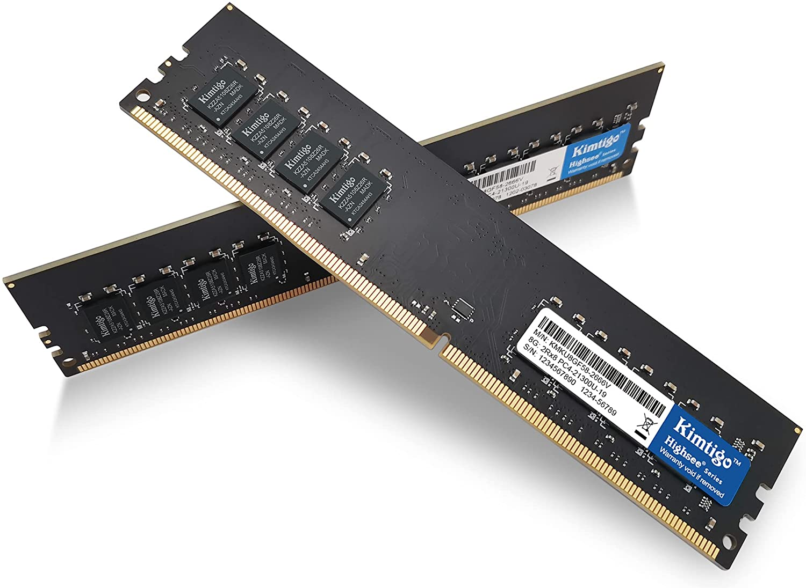

# 查看测试运行内存实际速度和延迟

最后教给大家一个简单的方法，去查看测试自己的运行内存实际速度和延迟。

查看的方法很简单，我们只需要下载一个上面提到的 CPU-Z 在内存那一栏就可以看到现在这个内存的类型频率时序和其它一些信息。

然后上面我们测试速度和延迟的方法就是用 AIDA64 这个经典的电脑信息查看软件。它不仅可以跑出内存的读写复制速度和延迟，也能顺便查看一下 CPU L1/L2/L3 各个缓存的速度（可以看到 CPU 的缓存是快很多的，那就是以后运行内存的目标）。

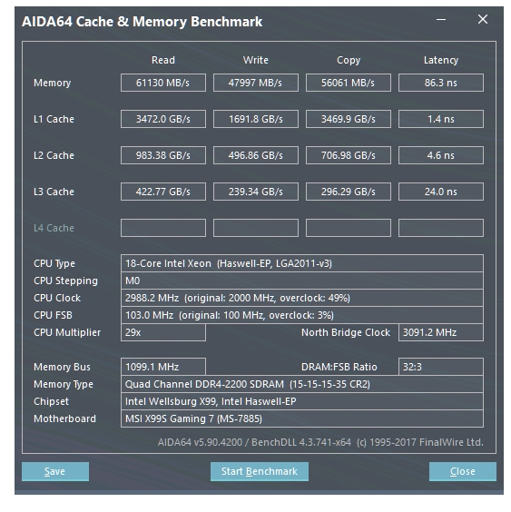

# 手机上的运行内存

到这里运行内存的大部分内容，我们就讲完了，接下来简单给大家介绍一下我们现在智能手机上使用的运行内存。

手机上运行内存的作用和运行内存条在电脑上的作用类似，不过通常使用的是 LPDDR 技术（手机发布会上也经常能听见这个名词）。

手机上的运行内存芯片一般都贴在处理器下面，共享底下的总线，反正数据都要先经过运行内存再到 SoC（System on Chip，就是各种不同功能的控制器，包括 CPU 和网络控制器，GPU 等都集合在一个芯片里，我们常听说的骁龙芯片就是 SoC），这样的设计还能节省空间，运行内存和 SoC 接在一起距离最近，还能最大化性能效率。

LPDDR（Low Power Double Data Rate），其实就是低功耗的 DDR 的技术，以满足移动设备续航。它的原理和预读取什么的都和我们上面介绍到的 DDR 一样，只不过由于降低功耗调低了电压，让频率降低了。比如最新的 LPDDR5 其实频率就和电脑上的 DDR4 差不多，6400Mbps 或者 51.2GB/s 的速度用在手机上已经绰绰有余，更新换代主要还是在于容量的提升，LPDDR5 最大容量来到了 16GB，并且每一代的电压功耗都会降低，让手机续航有明显的提升。

**相关文献**：

\[1\]. 关于运行内存的绝大部分标准参数等等都是 JEDEC 固态技术协会提出的，无论你想了解关于运行内存的什么都可以直接查看 [JEDEC RAM 运行内存技术标准](https://www.jedec.org/standards-documents/dictionary/terms/ram)。  
\[2\]. 关于 DRAM 颗粒的介绍和实际长什么样可以参考 IBM 的[这篇文章](https://www.ibm.com/blogs/research/2019/09/worlds-smallest-dram/)。  
\[3\]. 关于运行内存 RAM 容量对性能的影响可以稍微看看 Youtube@LinusTechTips 的视频[「Will More RAM Make your PC Faster?? (2020)」](https://www.youtube.com/watch?v=kUFWalEf31w)，哔哩哔哩视频链接 [「【官方双语】2020年了 多大的内存才够爽呢？#linus谈科技」](https://b23.tv/xjhmkV)。  
\[4\]. 关于运行内存频率对性能的影响，也可以看看 Youtube@LinusTechTips 的视频[「Does RAM speed REALLY matter?」](https://www.youtube.com/watch?v=D_Yt4vSZKVk)，哔哩哔哩视频链接[「【官方双语】高速内存真的有用吗？主机内存选购指南 #linus谈科技」](https://b23.tv/Ow789V)。  
\[5\]. 关于内存混用对于性能的影响，Youtube@LinusTechTips 也做过测试[「Just How Bad is Mixing Memory?」](https://www.youtube.com/watch?v=bTS0ybQ3lCI)，哔哩哔哩视频链接[「【官方双语】混用内存影响有多大？#linus谈科技」](https://b23.tv/Gha0v4)。  
\[6\]. LinusTechTips 其实针对运行内存 RAM 做过蛮多期视频，覆盖内容比较全面，也有娱乐性，不管是图一乐还是学点东西都比较合适，还要了解相关知识的朋友可以直接在 Youtube@LinusTechTips 的频道内搜索「RAM」或者在哔哩哔哩搜索「运行 Linus」（别进频道内搜索，搜不出来）。  
\[7\]. CPU-Z 的[官方下载地址](https://www.cpuid.com/softwares/cpu-z.html)。  
\[8\]. AIDA64 的[官方下载地址](https://www.aida64.com/downloads)。

总结
==

在本章中，我带大家了解了运行内存这种特殊的储存器的结构原理和常见的参数，看完之后大家对运行内存应该有一个比较清晰的认识了。由于篇幅原因，我们的其它储存设备介绍部分也被分成了上下篇，下一篇我将继续给大家介绍其它常用的储存设备，其中还会有很多我们熟悉的部分哦。

* * *

