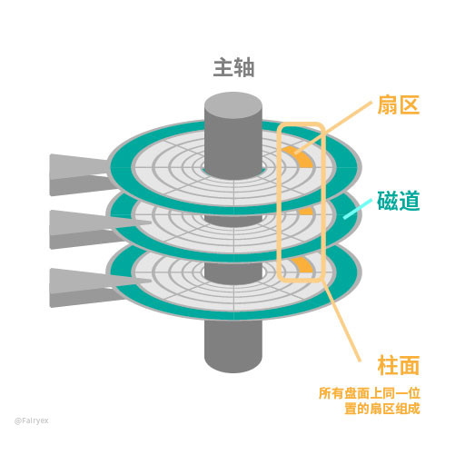

# CHS编址

一个普通的机械硬盘内部结构如下：

 

每个盘面各有一个磁头，数据在盘面上环形排列，盘面上一个圈为一个磁道，一个磁道有多个扇区。柱面指半径相同的磁道组成的柱形。

那么为什么需要柱面这个概念呢，有了盘面/磁道/扇区这些概念不就可以寻址了嘛。

一个简单的编址思路：先在一个盘面上顺序编址，编满了切换到下一个盘面继续编址，以此类推。

当然这样的编址方式理论上没有什么问题，但是为什么没有采用呢？因为**速度**。我们都知道文件在存储时尽量按照逻辑地址顺序存储，那么逻辑地址怎么编址才能更快地顺序存取数据呢？

磁盘内部一般有两组运动，一组是磁盘的旋转运动（旋转时间），一组是机械臂控制磁头选定磁道的运动（寻道时间）。通过磁头运动选定磁道，通过盘面本身的旋转来选定扇区，这样磁盘就可以读取任意地方的数据。而寻道时间要比旋转时间慢得多，这也很容易理解，旋转是很简单地控制，而机械臂控制地直线运动就复杂得多，所以我们编址的时候优先考虑磁盘旋转，而后再考虑磁头移动。

基于上述观点，假设从第一个盘面的第一个磁道的第一个扇区开始写，写满一个磁道后，接下来往哪写呢？两个选项：

1.  移动磁头从第一个盘面的第二个磁道开始写
2.  从第二个盘面的第一个磁道开始写

根据上面的理论，我们应该优先避免磁头移动，所以下一个地址应该从下一个盘面的同一个磁道开始，以此类推，直到所有盘面的同一个磁道都编址完了，就形成了一个**柱面**。CHS 编址即以柱面号（C）+ 磁头号（H）+ 扇区号（S）来编址。

CHS 寻址的缺点：

显然，由于要求每个磁道的扇区数相等，而外道的周长要大于内道，所以外道的记录密度要远低于内道，不仅造成了硬盘空间的浪费，也限制了硬盘的容量。

为了解决这一问题，进一步提高硬盘容量，人们改用等密度结构生产硬盘。也就是说，外圈磁道的扇区比内圈磁道多，采用这种结构后，硬盘不再具有实际的 CHS 参数，寻址方式也改为线性寻址，即以扇区为单位进行寻址。

但一些古老的软件仍然使用 CHS 寻址方式 (如使用 BIOSInt13H 接口的软件)，为了兼容这样的程序，在硬盘控制器内部安装了一个地址翻译器，可以通过它将老式 CHS 参数翻译成新的线性参数。

 

# LBA (Logical Block Addressing) 逻辑块寻址模式

在 LBA 模式下，我们知道硬盘上的一个数据区域由它所在的磁头、柱面（也就是磁道）和扇区所唯一确定。

早期系统就是直接使用磁头柱面和扇区来对硬盘进行寻址（这称为 CHS寻址），这需要分别存储每个区域的三个参数（这称为 3D 参数），使用时再分别读取三个参数，然后在送到磁盘控制器去执行。

由于系统用 8b 来存储磁头地址，用 10b 来存储柱面地址，用 6b 来存储扇区地址，而一个扇区共有 512B，这样使用 CHS 寻址一块硬盘最大容量为256 * 1024 * 63 * 512B = 8064 MB(1MB = 1048576B)（若按 1MB = 1000000B 来算就是 8.4GB）。

随着硬盘技术的进步，硬盘容量越来越大，CHS 模式无法管理超过 8064 MB的硬盘，因此工程师们发明了更加简便的 LBA 寻址方式。在 LBA 地址中，地址不再表示实际硬盘的实际物理地址（柱面、磁头和扇区）。

LBA编址方式将 CHS 这种三维寻址方式转变为一维的线性寻址，它把硬盘所有的物理扇区的 C/H/S 编号通过一定的规则转变为一线性的编号，系统效率得到大大提高，避免了烦琐的磁头/柱面/扇区的寻址方式。在访问硬盘时，由硬盘控制器再这种逻辑地址转换为实际硬盘的物理地址。

# LARGE 大硬盘模式

在硬盘的柱面超过 1024 而又不为 LBA 支持时采用。

LARGE 模式采用的方法是把柱面数除以 2，把磁头数乘以 2，其结果总容量不变。

# 总结

在这三种硬盘模式中，现在 LBA 模式使用最多。

LBA 与 C/H/S 之间的转换:

设 NS 为每磁道扇区数，NH 为磁头数，C、H、S分别表示磁盘的柱面、磁头和扇区编号，LBA 表示逻辑扇区号，div 为整除计算，mod 为求余计算，则：

>   LBA = (NH×NS)×C + (NS)×H + S-1；
>
>   C = (LBA ÷ NS) ÷ NH；
>
>   H = (LBA ÷ NS) % NH；
>
>   S = (LBA % NS) + 1
>
>   例如 LBA = 0 则 CHS = 0/0/1

