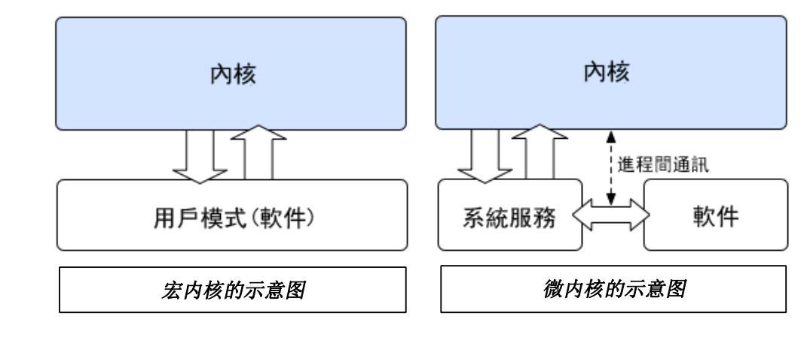
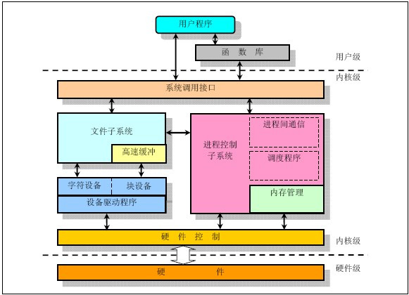

# 宏内核与微内核

内核（Kernel）在计算机科学中是操作系统最基本的部分，主要负责管理系统资源。

中文版维基百科上将内核分为四大类：单内核（宏内核）；微内核；混合内核；外内核。

混合内核实质上也是微内核，而外内核是一种比较极端的设计方法，目前还处于研究阶段，所以我们就着重讨论宏内核与微内核两种内核。

简单的介绍，宏内核 (Monolithickernel) 是将内核从整体上作为一个大过程来实现，所有的内核服务都在一个地址空间运行，相互之间直接调用函数，简单高效。

微内核 (Microkernel) 功能被划分成独立的过程，过程间通过 IPC 进行通信，模块化程度高，一个服务失效不会影响另外一个服务。



两种设计各具特点，较早的一些操作系统都是用宏内核写成的，这样的内核通常以单个静态二进制文件的形式存放于磁盘，而后来随着模块化、分层思想的产生，人们开始对微内核感兴趣并持赞扬态度，认为微内核将成为内核的发展趋势。

微内核的功能被划分为独立的过程，每个过程叫做一个服务器，各种服务器之间通过 IPC 机制互通消息，服务器的各自独立有效地避免了一个服务器的失效祸及另一个，而且这种独立机制更利于操作系统在不同硬件上的移植。

当然，微内核的这所有的优点都建立在因为消息传递开销而引起效率损失的前提下（ IPC 机制的开销比函数调用多，还会涉及到内核空间到用户空间的上下文切换），这些损失有一部分是靠着现在硬件效率的飞速提升而抵消着的，但这很明显是追不上宏内核的效率的。

所以，有些使用微内核的操作系统（如新近版本的 WindowsNT 和 MacOSX）让大部分或全部的服务器位于内核，这样就可以直接调用函数，消除频繁的上下文切换，但这已经违背了微内核设计的初衷。

而相反的，宏内核在通信上比较高效，因为大家都运行在内核态，并身处同一地址空间，内核可以直接调用函数，Linux 和大多数的 UNIX 都为宏内核。

对应的，宏内核不具有微内核的优点，宏内核的灵活性和可维护性不及微内核，而且移植起来并不简单（不过有些宏内核支持者认为这样的移植比微内核更能够有效地利用底层硬件）。

历史告诉我们，两种看似矛盾又各有长处的观点或解决方案总能找到结合点的。Cache 的直接映射与关联映射结合产生了组关联映射；RISC 和 CISC 也是各具优点，现代的好的 CPU 包括了这两种技术，将它们结合了起来。所以我相信宏内核与微内核也会最终找到结合点的。

Linux 虽是宏内核，但已吸收了微内核的部分精华。Linux 是模块化的、多线程的、内核本身可调度的系统，既吸收了微内核的精华，又保留了宏内核的优点，无需消息传递，避免性能损失。

此前所提到的微内核实现时让大部分服务器位于内核空间，也算是微内核朝宏内核靠拢的一个例子。

这两个例子都可以看到宏内核与微内核有结合的趋势，但还没有完全真正的结合成功，不过它们都已经同时具备了模块化和内核空间运行等的特征。

参考：[宏内核与微内核的对比](http://wenku.baidu.com/link?url=Ym-msHy7HRMWBk-s6aBpQIFJyQOS6x79AwY456mPHnvxA4rkYWeQ9byZVpQ5AxdGsIiu7i3l_jmTKwGEmvct8cmYRntq5HQ4h4m2fgKFNdu)


# Linux体系结构与内核结构概述

## Linux体系结构概述

现在让我们从一个比较高的高度来审视一下 GNU/Linux 操作系统的体系结构。您可以从两个层次上来考虑操作系统

-   用户空间：用户空间中又包含了，用户的应用程序，C库
-   内核空间：内核空间包括，系统调用，内核，以及与平台架构相关的代码

 

最上面是用户（或应用程序）空间。这是用户应用程序执行的地方。用户空间之下是内核空间，Linux 内核正是位于这里。

GNU C Library （glibc）也在这里。它提供了连接内核的系统调用接口，还提供了在用户空间应用程序和内核之间进行转换的机制。这点非常重要，因为内核和用户空间的应用程序使用的是不同的保护地址空间。每个用户空间的进程都使用自己的虚拟地址空间，而内核则占用单独的地址空间。 

Linux 内核可以进一步划分成 3 层。最上面是系统调用接口，它实现了一些基本的功能，例如 read 和 write。系统调用接口之下是内核代码，可以更精确地定义为独立于体系结构的内核代码。这些代码是 Linux 所支持的所有处理器体系结构所通用的。在这些代码之下是依赖于体系结构的代码，构成了通常称为 BSP（Board Support Package）的部分。这些代码用作给定体系结构的处理器和特定于平台的代码。

## Linux体系结构分成用户空间和内核空间的原因：

现代 CPU 通常都实现了不同的工作模式，以 ARM 为例：ARM 实现了 7 种工作模式，不同模式下 CPU 可以执行的指令或者访问的寄存器不同：

（1）用户模式 usr 

（2）系统模式  sys

（3）管理模式 svc

（4）快速中断  fiq

（5）外部中断  irq

（6）数据访问终止 abt

（7）未定义指令异常


以 X86 为例：X86 实现了 4 个不同级别的权限，Ring0—Ring3 ; Ring0 下可以执行特权指令，可以访问 IO 设备；Ring3 则有很多的限制。

所以，Linux 从 CPU 的角度出发，为了保护内核的安全，把系统分成了 2 部分：用户空间和内核空间是程序执行的两种不同状态，我们可以通过“系统调用”和“硬件中断“来完成用户空间到内核空间的转移；

参考文献：[Linux内核剖析](http://www.ibm.com/developerworks/cn/linux/l-linux-kernel/)


## Linux的内核结构（注意区分Linux体系结构和Linux内核结构）

Linux 内核是整体式结构（宏内核），各个子系统联系紧密，作为一个大程序在内核空间运行。

系统调用接口（system call interface，SCI）提供了某些机制执行从用户空间到内核的函数调用。

正如前面讨论的一样，这个接口依赖于体系结构，甚至在相同的处理器家族内也是如此。SCI 实际上是一个非常有用的函数调用多路复用和多路分解服务。在 ./linux/kernel 中您可以找到 SCI 的实现，并在 ./linux/arch 中找到依赖于体系结构的部分。

 

Linux 内核主要由五个子系统组成：进程调度，内存管理，虚拟文件系统，网络接口，进程间通信。

1.进程调度（SCHED）:控制进程对 CPU 的访问。当需要选择下一个进程运行时，由调度程序选择最值得运行的进程。可运行进程实际上是仅等待 CPU 资源的进程，如果某个进程在等待其它资源，则该进程是不可运行进程。Linux 使用了比较简单的基于优先级的进程调度算法选择新的进程。

2.内存管理（memory management，MM）允许多个进程安全的共享主内存区域。Linux 的内存管理支持虚拟内存，即在计算机中运行的程序，其代码，数据，堆栈的总量可以超过实际内存的大小，操作系统只是把当前使用的程序块保留在内存中，其余的程序块则保留在磁盘中。必要时，操作系统负责在磁盘和内存间交换程序块。内存管理从逻辑上分为硬件无关部分和硬件有关部分。硬件无关部分提供了进程的映射和逻辑内存的对换；硬件相关的部分为内存管理硬件提供了虚拟接口。

3.虚拟文件系统（Virtual File System，VFS）隐藏了各种硬件的具体细节，为所有的设备提供了统一的接口，VFS 提供了多达数十种不同的文件系统。虚拟文件系统可以分为逻辑文件系统和设备驱动程序。逻辑文件系统指 Linux 所支持的文件系统，如 ext2， fat 等，设备驱动程序指为每一种硬件控制器所编写的设备驱动程序模块。

4.网络接口（NET）提供了对各种网络标准的存取和各种网络硬件的支持。网络接口可分为网络协议和网络驱动程序。网络协议部分负责实现每一种可能的网络传输协议。网络设备驱动程序负责与硬件设备通讯，每一种可能的硬件设备都有相应的设备驱动程序。

5.进程间通讯 ( inter-process communication，IPC) 支持进程间各种通信机制。

处于中心位置的进程调度，所有其它的子系统都依赖它，因为每个子系统都需要挂起或恢复进程。一般情况下，当一个进程等待硬件操作完成时，它被挂起；当操作真正完成时，进程被恢复执行。例如，当一个进程通过网络发送一条消息时，网络接口需要挂起发送进程，直到硬件成功成功地完成消息的发送，当消息被成功的发送出去以后，网络接口给进程返回一个代码，表示操作的成功或失败。其他子系统以相似的理由依赖于进程调度。

各个子系统之间的依赖关系如下：

进程调度与内存管理之间的关系：这两个子系统互相依赖。在多道程序环境下，程序要运行必须为之创建进程，而创建进程的第一件事情，就是将程序和数据装入内存。

进程间通信与内存管理的关系：进程间通信子系统要依赖内存管理支持共享内存通信机制，这种机制允许两个进程除了拥有自己的私有空间，还可以存取共同的内存区域。

虚拟文件系统与网络接口之间的关系：虚拟文件系统利用网络接口支持网络文件系统 (NFS)，也利用内存管理支持 RAMDISK 设备。

内存管理与虚拟文件系统之间的关系：内存管理利用虚拟文件系统支持交换，交换进程 (swapd) 定期由调度程序调度，这也是内存管理依赖于进程调度的唯一原因。当一个进程存取的内存映射被换出时，内存管理向文件系统发出请求，同时，挂起当前正在运行的进程。

除了这些依赖关系外，内核中的所有子系统还要依赖于一些共同的资源。这些资源包括所有子系统都用到的过程。例如：分配和释放内存空间的过程，打印警告或错误信息的过程，还有系统的调试例程等等。

参考：[Linux内核的组成部分](http://blog.sina.com.cn/s/blog_67146a750100tssz.html)


# Linux内核模块

## 概述

尽管 Linux 内核是宏内核，整个系统内核都运行于一个单独的保护域中，但是 Linux 内核是模块化组成的，它允许内核在运行时动态地向其中插入或删除代码。

Linux 内核整体结构已经很庞大，包含了很多的组件，而对于我们工程师而言，有两种方法将需要的功能包含进内核当中。

-   将所有的功能都编译进 Linux 内核。
-   将需要的功能编译成模块，在需要的时候动态地添加。


上述两种方式优缺点分析：

第一种：

优点：不会有版本不兼容的问题，不需要进行严格的版本检查

缺点：生成的内核会很大；要在现有的内核中添加新的功能，则要编译整个内核


第二种：

优点：

-   减小内核映像尺寸，增加系统灵活性
-   节省开发时间；修改内核，不必重新编译整个内核
-   模块的目标代码一旦被链入内核，作用和静态链接的内核目标代码完全等价

缺点：

-   对系统性能有一定的损失
-   使用不当会导致系统崩溃


## 模块开发常用指令

在内核模块开发的过程中常用的有以下指令。

- insmod: 将模块插入内核中，使用方法：insmod XXX.ko

- rmmod: 将模块从内核中删除，使用方法：rmmod XXX.ko

- lsmod: 列表显示所有的内核模块，可以和 grep 指令结合使用。使用方法：lsmod | grep XXX

- modprobe: modprobe 可载入指定的个别模块，或是载入一组相依赖的模块。modprobe 会根据 depmod 所产生的依赖关系，决定要载入哪些模块。若在载入过程中发生错误，在 modprobe 会卸载整组的模块。依赖关系是通过读取 /lib/modules/2.6.xx/modules.dep 得到的。而该文件是通过 depmod 所建立。
  使用方法：modprobe module [ module parameters]
  其中，参数 module 指定了需要载入的模块名称，后面的参数将在模块加载时传入内核

- modinfo: 查看模块信息。使用方法：modinfo XXX.ko

- tree -a: 查看当前目录的整个树结构。使用方法：tree -a

  

## 内核模块程序结构

1）  模块加载函数（一般需要）

在用 insmod 或 modprobe 命令加载模块时，该函数被执行。完成模块的初始化工作。

Linux内核的模块加载函数一般用 `__init` 标识声明，模块加载函数必须以 module_init (函数名) 的形式被指定。该函数返回整型值，如果执行成功，则返回 0，初始化失败时则返回错误编码，Linux 内核当中的错误编码是负值，在 linux/errno.h 中定义。

在 Linux 中，标识 `__init` 的函数在连接时放在 .init.text 这个区段，而且在 .initcall.init 中保留一份函数指针，初始化的时候内核会根据这些指针调用初始化函数，初始化结束后释放这些 init 区段（包括前两者）。

```c
static int __init XXX_init(void)
{
    return 0;
}

moudle_init(XXX_init);
```


2）  模块卸载函数（一般需要）

在用 rmmod 或 modprobe 命令卸载模块时，该函数被执行。完成与加载相反的工作。

模块的卸载函数和模块加载函数实现相反的功能，主要包括：

-   若模块加载函数注册了XXX，则模块卸载函数注销XXX
-   若模块加载函数动态分配了内存，则模块卸载函数释放这些内存
-   若模块加载函数申请了硬件资源，则模块卸载函数释放这些硬件资源
-   若模块加载函数开启了硬件资源，则模块卸载函数一定要关闭这些资源

```c
static void __exit XXX_exit(void)
{
    do clean
}
moudle_exit(XXX_exit);
```


3）  模块许可证声明（必须）

如果不声明，则在模块加载时会收到内核被污染的警告，一般应遵循 GPL 协议。

```c
MODULE_LICENSE("GPL");
```


4）  模块参数（可选）

模块在被加载时传递给模块的值，本身应该是模块内部的全局变量。

```c
#include <linux/init.h>
#include <linux/module.h>

static char *bookName = "Good Book.";
static int bookNumber = 100;

static int __init book_init(void)
{
    printk(KERN_INFO "Book name is %s\n", bookName);
    printk(KERN_INFO "Book number is %d\n", bookNumber);
    
    return 0;
}

static void __exit book_exit(void)
{
    printk(KERN_INFO "Book module exit.\n");
}

module_init(book_init);
module_exit(book_exit);
module_param(bookName, charp, S_IRUGO);
module_param(bookNumber, int, S_IRUGO);
MODULE_LICENSE("GPL");
```

```makefile
ifneq ($(KERNELRELEASE),)
        obj-m += book.o
else
KERNELDIR ?= /lib/modules/$(shell uname -r)/build
PWD := $(shell pwd)
default:
	$(MAKE) -C $(KERNELDIR) M=$(PWD) modules
endif
clean:
	rm -rf *.ko *.mod.c *.mod.o *.o *.order *.symvers
```

在向内核插入模块的时候可以用以下方式，并且可以在内核日志中看到模块加载以后变量已经有了值。

```bash
[root@centos book]# insmod book.ko
[root@centos book]# rmmod book.ko
[root@centos book]# insmod book.ko bookName="linux" bookNumber=1
[root@centos book]# rmmod book.ko 
[root@centos book]# dmesg
...
[664286.645982] Book name is Good Book.
[664286.646014] Book number is 100
[664291.220723] Book module exit.
[664397.144418] Book name is linux
[664397.144450] Book number is 1
[664402.679390] Book module exit.
```


5）  模块导出符号（可选）

使用模块导出符号，方便其它模块依赖于该模块，并使用模块中的变量和函数等。

在 Linux2.6 的内核中，/proc/kallsyms 文件对应着符号表，它记录了符号和符号对应的内存地址。对于模块而言，使用下面的宏可以导出符号。

EXPORT_SYMBOL(符号名) 或 EXPORT_GPL_SYMBOL(符号名);


6）  模块信息（可选）

模块信息则是指模块的作者信息等。


## hello world模块

### hello.c 和 Makefile

hello.c

```c
/* hello world module */

#include <linux/init.h>
#include <linux/module.h>
#include <linux/kernel.h>

static int __init hello_init(void)
{
        printk("hello world.\n");
        return 0;
}

static void __exit hello_exit(void)
{
        printk(KERN_ALERT "hello module exit.\n");
}

module_init(hello_init);
module_exit(hello_exit);

MODULE_LICENSE("GPL");
MODULE_AUTHOR("luxiaodai");
MODULE_DESCRIPTION("this is my first module");
```

make 之前，这里需要安装调试包

```bash
yum install kernel-devel -y
```

Makefile：

```makefile
ifneq ($(KERNELRELEASE),)
        obj-m += hello.o
else
KERNELDIR ?= /lib/modules/$(shell uname -r)/build
PWD := $(shell pwd)
default:
	$(MAKE) -C $(KERNELDIR) M=$(PWD) modules
endif
clean:
	rm -rf hello.ko hello.mod.c hello.mod.o hello.o modules.order Module.symvers
```


### `__init` 和`__exit`宏

如果该模块被编译进内核，而不是动态加载，则 `__init` 的使用会在模块初始化完成后丢弃该函数并回收所占内存

如果该模块被编译进内核，`__exit` 宏将忽略“清理收尾”的函数

这些宏在头文件 Linux/init.h 定义，用来释放内核占用的内存。例如在启动时看到的信息 “Freeint unused kernel memory:236k freed”, 正是内核释放这些函数所占用空间时的打印信息。


### printk

内核通过 printk() 输出的信息具有日志级别，日志级别是通过在 printk() 输出的字符串前加一个带尖括号的整数来控制的，如 printk("<6>Hello, world!/n");。内核中共提供了八种不同的日志级别，在 linux/kernel.h 中有相应的宏对应。

```c
#define KERN_EMERG    "<0>"    /* system is unusable */
#define KERN_ALERT    "<1>"    /* action must be taken immediately */
#define KERN_CRIT     "<2>"    /* critical conditions */
#define KERN_ERR      "<3>"    /* error conditions */
#define KERN_WARNING  "<4>"    /* warning conditions */
#define KERN_NOTICE   "<5>"    /* normal but significant */
#define KERN_INFO     "<6>"    /* informational */
#define KERN_DEBUG    "<7>"    /* debug-level messages */
```

所以 printk() 可以这样用：

```c
printk(KERN_INFO "Hello, world!\n");
```

未指定日志级别的 printk() 采用的默认级别是 DEFAULT_MESSAGE_LOGLEVEL，这个宏在 kernel/printk.c 中被定义为整数 4，即对应 KERN_WARNING。

在 /proc/sys/kernel/printk 会显示 4 个数值（可由 echo 修改），分别表示当前控制台日志级别、未明确指定日志级别的默认消息日志级别、最小（最高）允许设置的控制台日志级别、引导时默认的日志级别。

当 printk() 中的消息日志级别小于当前控制台日志级别时，printk 的信息（要有\n符）就会在控制台上显示。但无论当前控制台日志级别是何值，通过 /proc/kmsg （或使用dmesg）总能查看。另外如果配置好并运行了 syslogd 或 klogd，没有在控制台上显示的 printk 的信息也会追加到 /var/log/messages.log 中。


### 插入删除模块操作

动态编译：

```bash
[root@centos module]# make
make -C /lib/modules/3.10.0-957.el7.x86_64/build M=/root/module modules
make[1]: Entering directory `/usr/src/kernels/3.10.0-1160.49.1.el7.x86_64'
  CC [M]  /root/module/hello.o
  Building modules, stage 2.
  MODPOST 1 modules
  CC      /root/module/hello.mod.o
  LD [M]  /root/module/hello.ko
make[1]: Leaving directory `/usr/src/kernels/3.10.0-1160.49.1.el7.x86_64'
[root@centos module]# ls
hello.c   hello.mod.c  hello.o   modules.order
hello.ko  hello.mod.o  Makefile  Module.symvers
[root@centos module]# insmod hello.ko 
[root@centos module]# rmmod hello.ko 
[root@centos module]# dmesg | tail
[588837.358559] XFS (vda): Unmounting Filesystem
[588842.552275] XFS (vda): Mounting V5 Filesystem
[588842.697629] XFS (vda): Ending clean mount
[588900.413948] XFS (vda): Unmounting Filesystem
[588908.910570] XFS (vda): Mounting V5 Filesystem
[588909.074139] XFS (vda): Ending clean mount
[663382.133018] hello world.
[663388.667295] hello module exit.
```

静态编译：略


### 内核模块参数

Linux2.6 允许用户 insmod 的时候往内核模块里面传递参数，它主要使用 module_param 宏定义来实现这一功能。

module_param 的定义可以在 include/linux/moduleparam.h 文件里面查看到，它的原型为：

```c
module_param(name, type, perm);
module_param_array(name, type, nump, perm);
```

其中 module_param 是用来传递变量参数的，module_param_array 是用来传递数组参数的。

name 是在模块中定义的变量名称，type 是变量的类型，perm 是权限掩码，用来做一个辅助的 sysfs 入口。

nump 是传入数组的数目，是一个 int 指针。

module_param 支持传递的参数类型有：

-   bool：布尔型
-   invbool：一个布尔型（true 或者 false）值（相关的变量应当是 int 类型）；invbool 类型颠倒了值, 所以真值变成 false, 反之亦然.
-   charp ：一个字符指针值.，内存为用户提供的字串分配, 指针因此设置.
-   int：整形
-   long：长整形
-   short：短整形
-   uint：无符号整形
-   ulong：无符号长整形
-   ushort：无符号短整形
-   基本的变长整型值，以 u 开头的是无符号值。

perm 字段是一个权限值，表示此参数在 sysfs 文件系统中所对应的文件节点的属性。

你应当使用 linux/stat.h 中定义的值. 这个值控制谁可以存取这些模块参数在 sysfs 中的表示。

当 perm 为 0 时，表示此参数不存在 sysfs 文件系统下对应的文件节点。 否则, 模块被加载后，在 /sys/module/ 目录下将出现以此模块名命名的目录, 带有给定的权限。

权限在 include/linux/stat.h 中有定义：

```c
#define S_IRWXU 00700
#define S_IRUSR 00400
#define S_IWUSR 00200
#define S_IXUSR 00100
#define S_IRWXG 00070
#define S_IRGRP 00040
#define S_IWGRP 00020
#define S_IXGRP 00010
#define S_IRWXO 00007
#define S_IROTH 00004
#define S_IWOTH 00002
#define S_IXOTH 00001
```

使用 S_IRUGO 参数可以被所有人读取，但是不能改变; S_IRUGO|S_IWUSR 允许 root 来改变参数。

注意， 如果一个参数被 sysfs 修改， 你的模块看到的参数值也改变了， 但是你的模块没有任何其他的通知。 你应当不要使模块参数可写， 除非你准备好检测这个改变并且因而作出反应。

例子：

```c
#include <linux/init.h>
#include <linux/module.h>
#include <linux/moduleparam.h>

char *msg_buf = "Hello world!";
int n_arr[] = {1,2,3,4,5};
int n = 7;

module_param_array(n_arr, int, &n, S_IRUSR);
module_param(msg_buf, charp, S_IRUSR);

static __init int param_init(void)
{
    int i;
    printk("%s\n", msg_buf);
    for (i=0; i<n; i++)
    {
        printk("n_arr[%d]=%d\n", i, n_arr[i]);
    }
    return 0;
}

static __exit void param_exit(void)
{
    printk("Goodbye, kernel!\n");
}

module_init(param_init);
module_exit(param_exit);

MODULE_LICENSE("Dual BSD/GPL");
MODULE_AUTHOR("luxiaodai");
```

运行命令：

```bash
insmod param.ko msg_buf="Lovekobe"
```

我们看到输出信息如下：可以看出，实现 n_arr 的长度应该为 5，而 n 为 7，驱动里面并没有检测出，n_arr[5]，n_arr[6] 已经越界了

```bash
[ 1651.530290] Lovekobe
[ 1651.530292] n_arr[0]=1
[ 1651.530293] n_arr[1]=2
[ 1651.530293] n_arr[2]=3
[ 1651.530294] n_arr[3]=4
[ 1651.530294] n_arr[4]=5
[ 1651.530294] n_arr[5]=0
[ 1651.530295] n_arr[6]=1451810416
```

运行命令：

```bash
insmod param.ko msg_buf="Lovekobe" n_arr=1,2,3,4,5,6
```

但是提示出错了：

```bash
insmod: ERROR: could not insert module param.ko: Invalid parameters

[2021.810662] n_arr: can only take 5 arguments
[2021.813870] param: `1' invalid for parameter `n_arr'
```

运行命令：

```bash
insmod param.ko msg_buf="Lovekobe" n_arr=1,2,3
```

输出信息：

```bash
[ 2415.267190] Lovekobe
[ 2415.267196] n_arr[0]=1
[ 2415.267197] n_arr[1]=2
[ 2415.267198] n_arr[2]=3
```

因为 n_arr的数组长度为 5，当输入的数组长度小于等于 5 的时候，insmod 可以加载模块成功，可以看出，module_param_array中 的 nump 的值为实际的输入数组参数长度。

然后当使用 insmod 加载内核模块，并传递数据参数的时候，系统会自动检测数组的长度，当输入的数组长度小于模块的数组长度时，insmod 才会成功。

​	